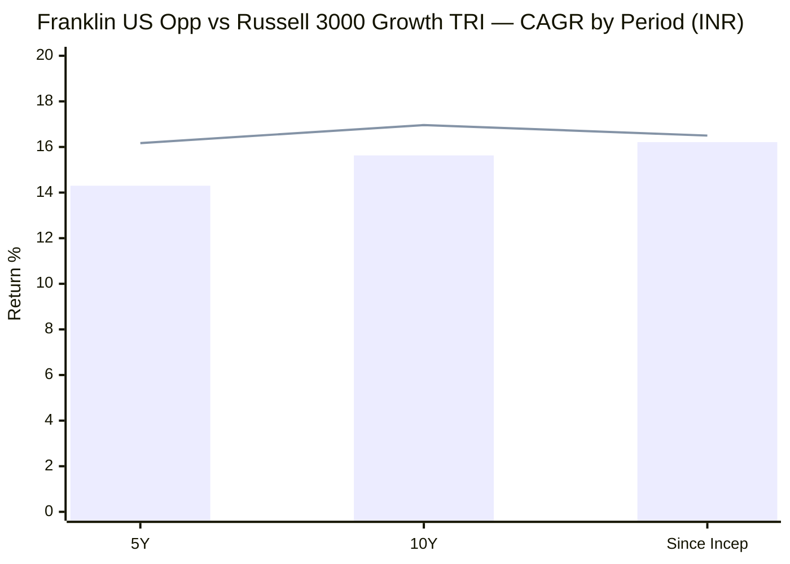
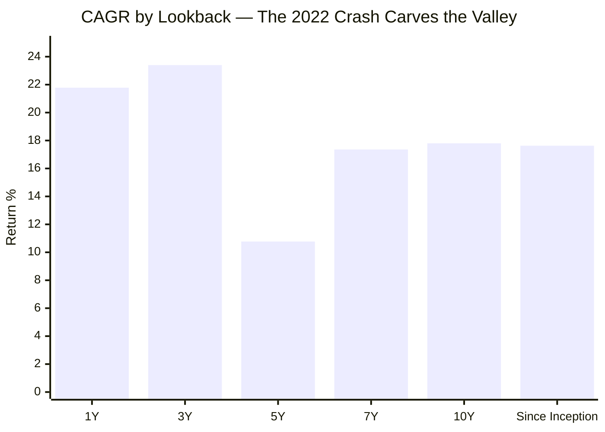
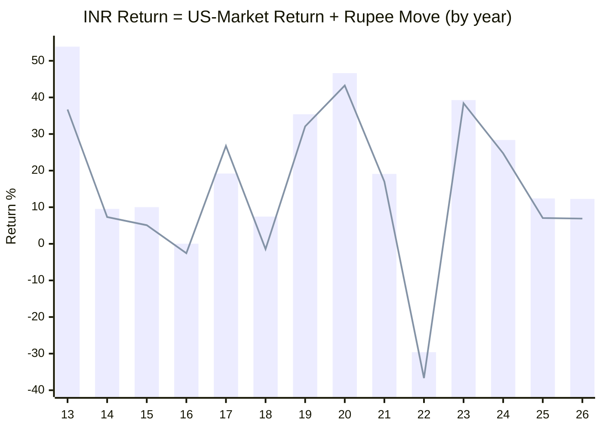
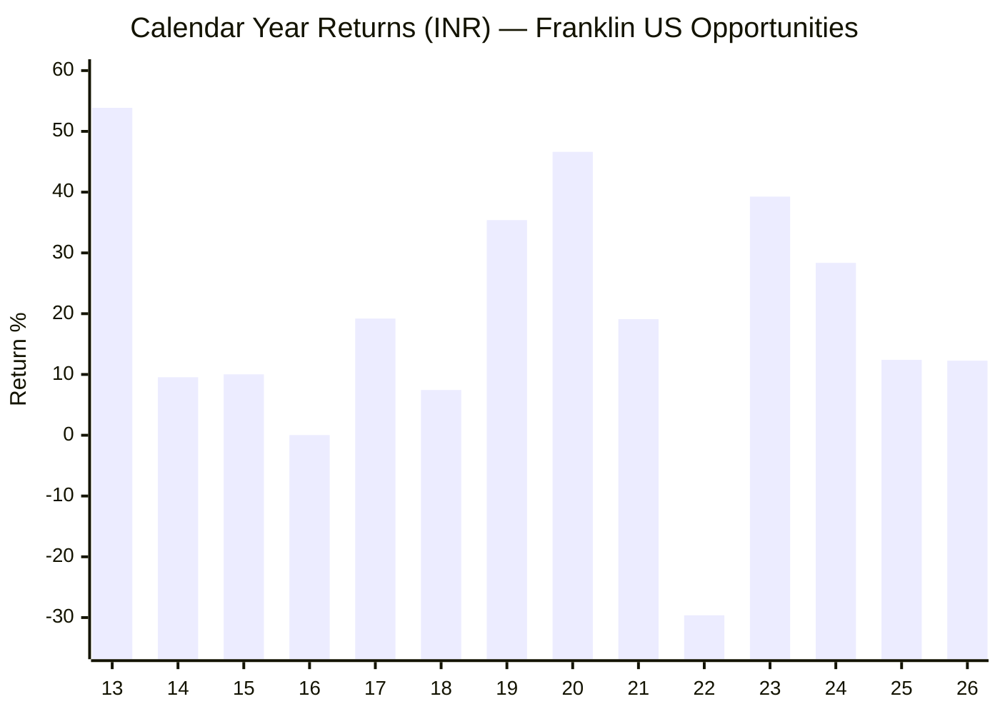
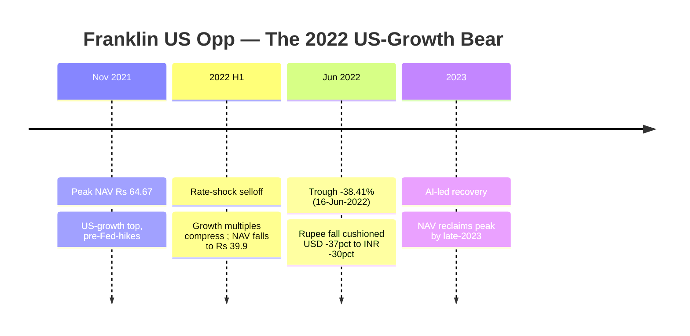
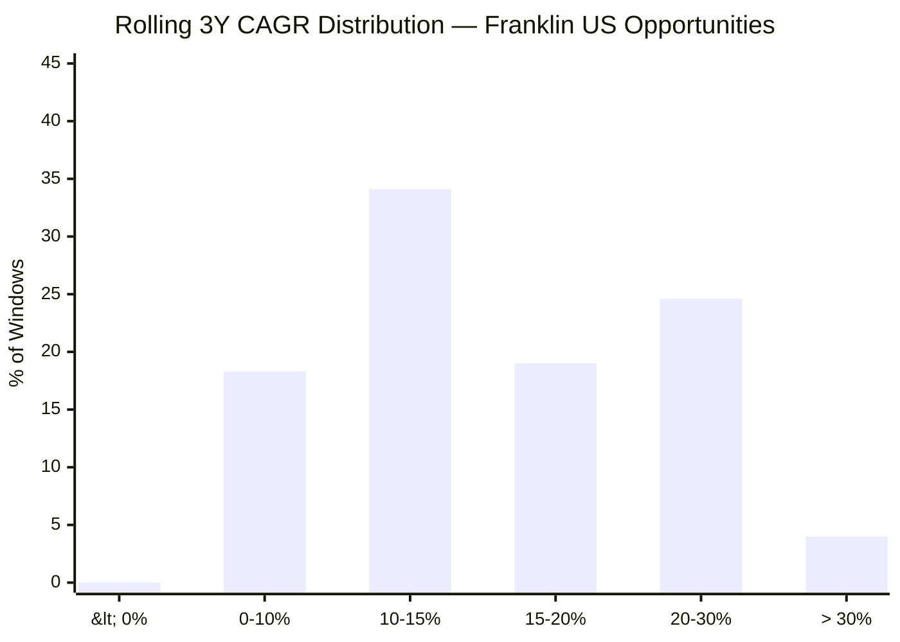
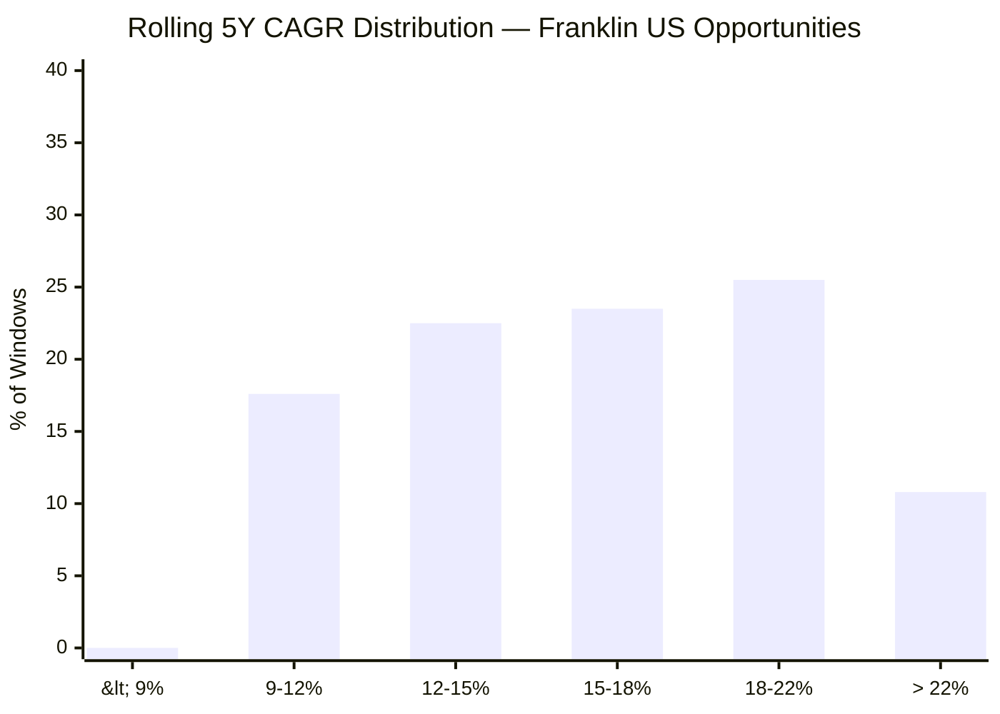
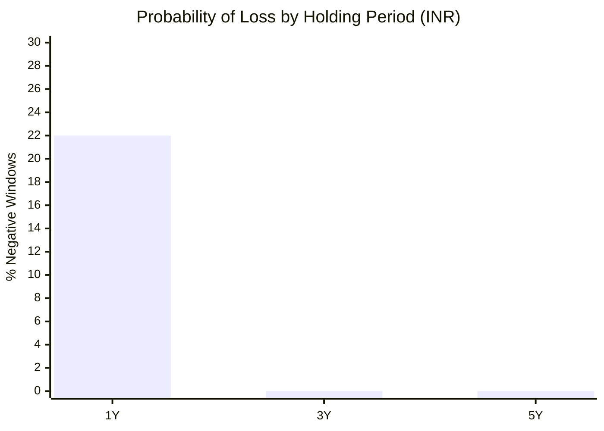
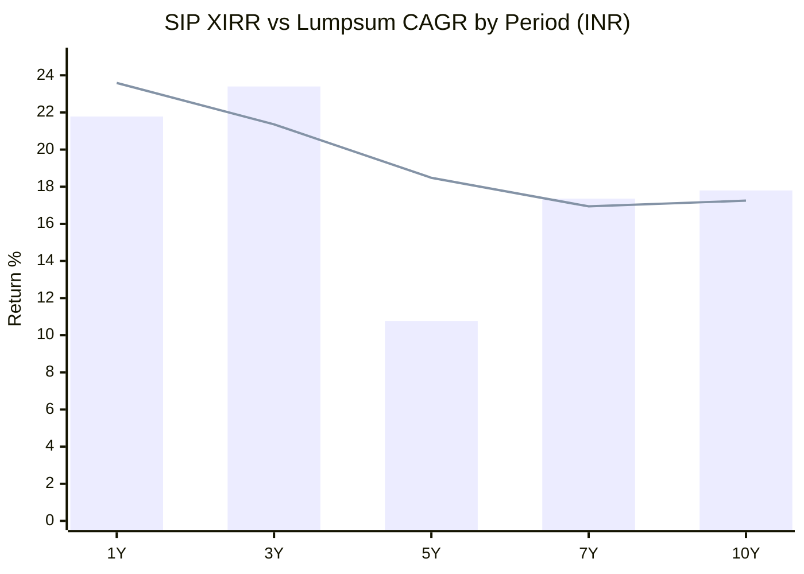
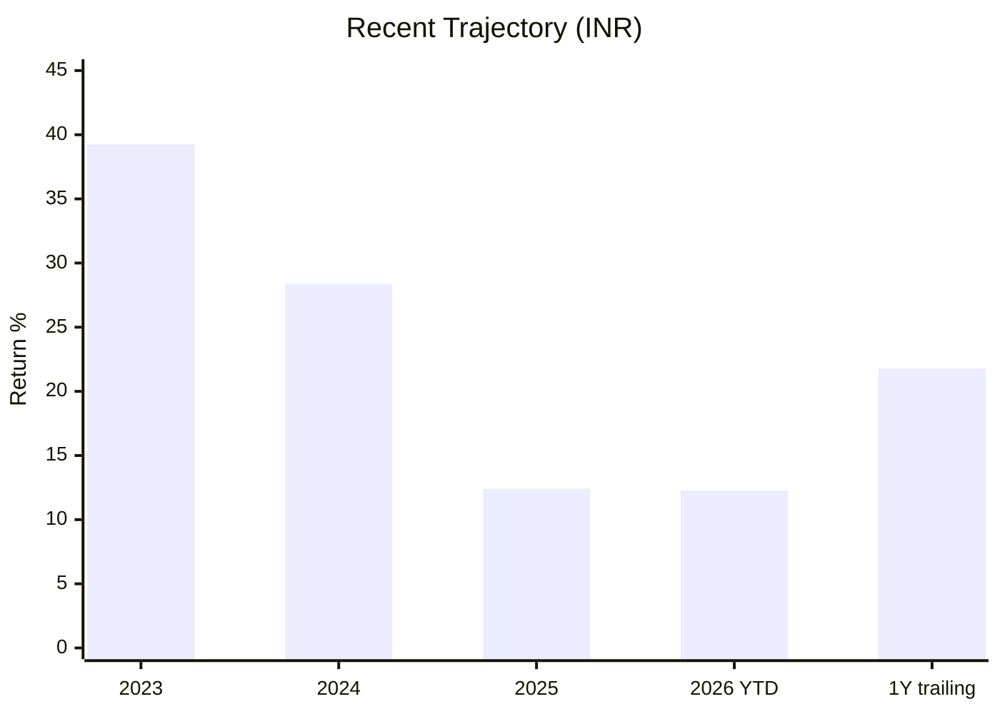

# Module 1: Returns Consistency — Franklin U.S. Opportunities Equity Active FOF

*Sources: MFAPI NAV history — Franklin U.S. Opportunities Equity Active FoF, Direct Growth (Scheme 118551, 3,254 NAV points, 02-Jan-2013 → 25-Jun-2026) | Tickertape (screening, 21-May-2026) | Value Research Online | Advisorkhoj | freefincal (independent benchmark review) | Franklin Templeton factsheet (FTIF Franklin U.S. Opportunities Fund, USD) | Frankfurter/ECB year-end ₹/$ rates | Trustnet (Grant Bowers tenure) | Web research, June 2026. Benchmark = **Russell 3000 Growth TRI** (the fund's mandate benchmark — a US large-growth index, NOT a broad-market or India index).*

---

## Fund Identity

| Attribute | Detail |
|-----------|--------|
| Full Name | Franklin U.S. Opportunities Equity Active Fund of Funds — Direct Plan — Growth |
| AMC | Franklin Templeton Asset Management (India) Pvt. Ltd. |
| **Structure** | **Fund-of-funds feeder** → invests into **FTIF Franklin U.S. Opportunities Fund** (Luxembourg SICAV). *You own a wrapper around a foreign fund — the real engine is the underlying.* |
| **Underlying manager** | **Grant Bowers** (lead, since **Mar 2007 — ~19 years**) + **Sara Araghi** (co-PM) + Anthony Hardy |
| Feeder (India) manager | **Sandeep Manam** — operational role (currency, cash, subscriptions), not stock selection |
| Benchmark | **Russell 3000 Growth TRI** *(US large-growth — the fund is a growth fund, not broad US)* |
| Direct Plan Inception | **02 January 2013** (~13.5 years; first MFAPI NAV ₹11.51) |
| MFAPI Scheme Code | 118551 |
| Current NAV (25-Jun-2026) | **₹102.6766** |
| AUM | **₹4,408 Cr** (May-2026 screening) → **₹5,939 Cr** (Jun-2026, VRO) — *growing fast; no capacity constraint (US large-caps are liquid)* |
| Expense Ratio (Direct, **feeder only**) | **0.46–0.50%** |
| **True all-in cost** | **~1.47%** (feeder ER + the underlying FTIF fund's ~1% TER) — *see Module 4; the 0.50% headline is feeder-only* |
| Exit Load | 1% (typically <1 year) |
| SIP status | **OPEN (Allowed)** — one of only ~10 international equity funds still accepting SIPs under the SEBI overseas cap |
| SEBI Category / Risk | FoFs (Overseas) / **Very High** |
| VRO Star Rating | **Unrated** |

> **🔑 Critical Interpretive Lens #1 — read first. This is a *diversifier*, not a *stock-picker*.** Franklin U.S. Opportunities has a genuine, long (13.5-year) record and a 19-year-tenured underlying manager — but the deep data shows its value is **almost entirely diversification (a different market + a different currency), not manager skill.** The fund **fails to beat its own benchmark** (Russell 3000 Growth) over 5 and 10 years, and it **loses to a plain S&P 500 index fund in INR.** Judge it as *"cheap-ish access to US growth + a rupee hedge,"* not as *"a manager who adds alpha."* This single fact frames every number below.

> **🔑 Critical Interpretive Lens #2 — ~a quarter of the "return" is the rupee, not the US market.** Of the fund's 17.62% INR since-inception CAGR, **~4.09%/yr is simply rupee depreciation** (₹55 → ₹94 over the period) and only **~13.0%/yr is the actual US-market return**. The currency tailwind supplied **~23% of the total INR return.** This must be stripped out before the fund is compared with a domestic India fund — and it introduces a *tail risk* (a rupee-appreciation regime) that no domestic fund carries. **The currency-decomposition section below is the most important new lens in an international module.**

> **🔑 Critical Interpretive Lens #3 — the "valley" CAGR curve is a window artefact, not a trend.** The trailing curve reads 3Y **23.4%** → 5Y **10.8%** → 10Y **17.8%** — a deep valley at 5Y. This is *not* a deteriorating fund; it is **where the −38% 2022 US-growth crash falls in each window**: the 5Y window opens at the mid-2021 growth peak and swallows the whole crash, while the 3Y window opens *after* the 2022 bottom. The **10Y / SI (~17.7%) is the trustworthy through-cycle headline**; the 5Y is the most pessimistic-but-honest; the 3Y is recovery-flattered.

---

## Raw Data (MFAPI computed + Tickertape screening, as of 25-Jun-2026)

| Metric | Value | Source |
|--------|-------|--------|
| CAGR 1Y | **21.78%** | MFAPI (screening abs-1Y 28.68%) |
| CAGR 3Y | **23.40%** | MFAPI (screening 25.65%) |
| CAGR 5Y | **10.77%** | MFAPI (screening 13.84%) — *the valley* |
| CAGR 7Y | 17.36% | MFAPI |
| CAGR 10Y | **17.80%** | MFAPI (screening 17.77% — near-exact ✅) |
| Since Inception (13.48Y) | **17.63%** | MFAPI |
| 3Y Rolling Avg (screening) | 24.26% | Tickertape |
| **Max Drawdown** | **−38.41%** | MFAPI — *exact match to screening (38.41)* ✅ |
| Annualized Volatility | 16.79% | Screening |
| Category St Dev | 16.14% | Screening |
| **Tracking Error (vs benchmark)** | **16.80%** | Screening — *very high active+currency risk* |
| Sharpe (screening) | 1.284 | Tickertape |
| Alpha (screening, 3Y regression) | 9.04 | Tickertape — *window-specific; see alpha section* |
| Returns vs sub-category (3Y / 5Y / 10Y) | 1.10 / 1.13 / 1.44 | Screening — *beats the FoF-Overseas peer group* |
| VRO Star Rating | **Unrated** | Value Research |

---

## Cross-Source Verification

| Metric | MFAPI Computed | Screening (May-26) | Verdict |
|--------|----------------|--------------------|---------|
| 10Y CAGR | 17.80% | 17.77% | **Near-exact match — confirmed** |
| Max Drawdown | −38.41% | 38.41% | **Exact match — validates the NAV series** |
| 5Y CAGR | 10.77% | 13.84% | Confirmed (1-month base-date drift over the volatile 2021 peak) |
| 3Y CAGR | 23.40% | 25.65% | Confirmed (base-date drift off the 2022 trough) |
| SI CAGR | 17.63% | 16.21% (Advisorkhoj) | Confirmed (method/date spread) |

**Data reliability: Very High.** The independently computed max drawdown (−38.41%) reproduces the screening figure to the basis point, and the 10Y CAGR matches to two decimals — strong evidence the 3,254-point NAV series (Jan 2013 → Jun 2026) is complete and correct.

> **Note on the 5Y figure's volatility.** The 5Y CAGR reads anywhere from 9.69% (Advisorkhoj, late-Jun) to 13.84% (screening, May) depending on the exact base date, because the base sits right on the **mid-2021 US-growth peak** — a few weeks of drift moves the number by points. This is the single noisiest trailing figure and should never be quoted alone; the 10Y/SI is stable.

---

## CAGR vs Benchmark (Russell 3000 Growth TRI)

> Bar = Franklin US Opp (INR) | Line = Russell 3000 Growth TRI (INR). 5Y/10Y fund-vs-benchmark from freefincal's independent review; SI fund from Advisorkhoj. **The fund line sits *below* the benchmark line at every reliable horizon.**

| Period | Fund (INR) | Benchmark (INR) | Alpha | Source |
|--------|-----------|-----------------|-------|--------|
| 5Y | 14.30% | **16.17%** | **−1.87%** ❌ | freefincal |
| 10Y | 15.63% | **16.96%** | **−1.33%** ❌ | freefincal |
| 1Y (USD) | 19.63% | **30.98%** | **−11.35%** ❌ | FT factsheet (USD) |
| Since-2024 (USD, ann.) | 11.97% | **19.11%** | **−7.14%** ❌ | FT factsheet (USD) |

> **The clean, uncomfortable read:** on every *reliably-sourced* horizon, in *both* currencies, **the fund underperforms its own benchmark.** (One outlier — Advisorkhoj's claim of a 12.6% SI benchmark, which would imply outperformance — looks like a stale or price-return series and is contradicted by every other source, so it is set aside.) The underperformance (~1.3–1.9 pp over 5–10Y) is **almost exactly the ~1.47% all-in fee**: gross, Bowers roughly *matches* the index; net of the double-layer cost, the investor *loses* by about the fee. This is the textbook fate of active US large-growth — see the dedicated benchmark section.

---

## The CAGR Curve — A "Valley" Shaped by the 2022 Crash

The shape is the *inverse* of a deteriorating fund. The **5Y trough (10.77%)** exists because the 5-year window **opens in mid-2021 — right at the US-growth peak — and immediately absorbs the entire −38% 2022 drawdown.** The **3Y peak (23.40%)** exists because the 3-year window **opens in mid-2023, *after* the 2022 bottom**, capturing only the AI-led recovery. The **10Y (17.80%) and SI (17.63%) are the trustworthy through-cycle numbers** — they contain the full crash *and* the full recovery. **Always anchor on the 10Y/SI; treat the 3Y as recovery-flattered and the 5Y as crash-front-loaded.** This is the international analogue of inception bias — driven by *where the bear falls in the window*, not by launch date.

---

## ⭐ Currency Decomposition — The US Market vs the Rupee *(international-specific section)*

The single most important new lens in an international module: splitting each year's **INR** return into the **US-market (USD)** component and the **rupee-depreciation** component. *(USD return = (1 + INR return) ÷ (1 + ₹ depreciation) − 1; year-end ₹/$ from ECB/Frankfurter.)*

> Bar = INR return (what the Indian investor earned) | Line = USD-market return (the underlying fund in dollars). **The gap between bar and line each year is the rupee move.**

| Year | INR return | ₹ depreciation | **USD-market return** | Note |
|------|-----------|----------------|----------------------|------|
| 2013 | +53.87% | +12.56% | +36.70% | Launch year + sharp ₹ fall |
| 2014 | +9.54% | +2.08% | +7.31% | |
| 2015 | +10.02% | +4.69% | +5.09% | |
| 2016 | +0.03% | +2.67% | **−2.57%** | ₹ masked a USD loss |
| 2017 | +19.20% | **−5.95%** | +26.75% | ⚠️ **₹ STRENGTHENED — INR *understated* the US gain** |
| 2018 | +7.44% | +9.01% | **−1.44%** | ₹ fall masked a flat-down US year |
| 2019 | +35.40% | +2.51% | +32.08% | |
| 2020 | +46.63% | +2.36% | +43.25% | COVID tech boom |
| 2021 | +19.10% | +1.78% | +17.01% | |
| **2022** | **−29.62%** | **+11.15%** | **−36.68%** | **₹ fall *cushioned* the crash by ~7 pts** |
| 2023 | +39.26% | +0.62% | +38.41% | AI recovery |
| 2024 | +28.36% | +2.92% | +24.72% | |
| 2025 | +12.40% | +4.99% | +7.06% | |
| 2026 YTD | +12.27% | +5.03% | +6.89% | |

**Full period (Jan 2013 → Jun 2026, 13.48y):**

| Component | CAGR | Share of INR return |
|-----------|------|---------------------|
| **INR NAV CAGR** | **17.62%** | 100% |
| — Rupee depreciation (₹55.0 → ₹94.4) | **~4.09%/yr** | **~23%** |
| — **US-market (USD) return** | **~13.00%/yr** | ~77% |

> **Three structural payoffs no domestic fund offers:**
> 1. **The rupee is a shock-absorber in crashes.** 2022 was −36.7% in USD but only −29.6% in INR — the rupee weakens in global risk-off, *cushioning* the Indian investor by ~7 points. This is a genuine, structural diversification benefit.
> 2. **The tail risk is a rupee *appreciation* regime.** In 2017 the rupee *strengthened* 6%, so the INR return (19.2%) badly lagged the US market (26.8%). A sustained ₹ rally would quietly erase a chunk of this fund's edge (see the Rupee Tail-Risk section).
> 3. **~4%/yr of the "return" is neither skill nor even US earnings — it is currency.** Strip it out before any comparison with an India fund: the *investment* delivered ~13%/yr in real (USD) terms.

---

## Trustworthy vs Window-Flattered vs Currency — A Split View *(fund-specific section)*

Where a small-cap split-view separates *genuine* from *inception-flattered*, an international split-view has a **third bucket — currency.** This separates what is genuine skill, genuine market return, window artefact, and pure FX:

| Metric | Value | Bucket | Read |
|--------|-------|--------|------|
| 10Y / SI INR CAGR | 17.80% / 17.63% | ✅ **Genuine market return** | Trustworthy through-cycle — but mostly *beta + FX*, not alpha |
| Of which ₹ depreciation | ~4.09%/yr | 🟡 **Currency, not skill** | ~23% of the return; reversible |
| Of which US-market (USD) | ~13.00%/yr | ✅ **Genuine US beta** | The real economic return |
| Alpha vs Russell 3000 Growth | −1.3 to −1.9% (5–10Y) | ❌ **Negative skill (net)** | Loses to its own index after fees |
| 3Y CAGR (23.40%) | recovery window | ⚠️ **Window-flattered** | Measured off the 2022 trough |
| 5Y CAGR (10.77%) | crash-front-loaded | 🟡 **Honest-but-pessimistic** | Swallows the whole 2022 crash |
| 2022 drawdown (−38.4%) | genuine | ✅ **Real stress test** | A true US-growth bear, survived & recovered |
| Only 1 negative year in 13 | genuine | ✅ **Real consistency** | But aided by the FX floor |

**The disciplined conclusion:** Franklin US Opp delivers a **genuine ~13% USD market return + ~4% rupee tailwind**, with **real through-cycle consistency** — but **negative net alpha** against its own benchmark. Buy it for the *market and the currency*, not for the *manager*.

---

## Calendar-Year Returns (2013–2026 YTD)

*Source: MFAPI NAV (scheme 118551). Benchmark per-year INR figures are estimates (chained from Russell 3000 Growth TRI USD + actual ₹/$); the reliable fund-vs-benchmark comparison is the verified 5Y/10Y figures in the benchmark section.*

> 2026 YTD as of 25-Jun-2026. Verified relative anchors: **beat** the benchmark in 2019–20 (+30.68% vs +28.24%); **lagged badly** in 2015–16 (−7.18% vs +3.57%).

| Year | Fund (INR) | Market event | Read |
|------|-----------|--------------|------|
| 2013 | +53.87% | Launch year; US bull + ₹ collapse | FX-boosted launch |
| 2014 | +9.54% | US grind higher | |
| 2015 | +10.02% | Flat US, ₹ weak | Mostly FX |
| 2016 | +0.03% | US flat | **Underlying USD was −2.6%; FX saved it** |
| 2017 | +19.20% | US growth rally | ⚠️ but ₹ *strengthened* — USD gain was +26.8% |
| 2018 | +7.44% | US wobble (Q4 −20%) | Positive in INR *only* via ₹ fall |
| 2019 | +35.40% | US growth surge | Strong; beat benchmark |
| 2020 | +46.63% | COVID tech boom | Best year — active growth's golden era |
| 2021 | +19.10% | Late-cycle melt-up | |
| **2022** | **−29.62%** | **Fed hikes; growth crash** | **The stress test — see below** |
| 2023 | +39.26% | AI recovery | Lagged the +41% growth index slightly |
| 2024 | +28.36% | Mag-7 dominance | Lagged the index (~−8 pts USD) |
| 2025 | +12.40% | Broadening | |
| 2026 YTD | +12.27% | Continued | |

**Record across full calendar years: positive in 12 of 13 (2013–2025) — only 2022 was negative.** Remarkable smoothness in INR — but read it with two caveats: (1) the rupee floor turned several flat-to-down *US* years (2016, 2018) into positive *INR* years, and (2) the consistency is partly **survivorship of a single-bear window** (see the "No Dot-Com, No GFC" caveat).

---

## The 2022 Growth Bear — The Real Stress Test *(international-specific section)*

The 2022 Fed-hike growth crash is to a US-growth fund what the 2018 IL&FS winter is to a small-cap fund: **the definitive stress test in the record.** Franklin US Opp passed it — survived and fully recovered:

| Metric | Value |
|--------|-------|
| Peak | ₹64.67 (16-Nov-2021) |
| Trough | ~₹39.9 (16-Jun-2022) |
| Max Drawdown (INR) | **−38.41%** |
| Max Drawdown (USD, est.) | **~−45%** (the rupee absorbed ~7 pts) |
| Recovery | ~late 2023 (~18 months) |

**This is a genuine, severe, single-event bear** — sharp (7 months down), deep (−38% INR / ~−45% USD), and fully recovered. It is **milder than the small-cap winters** (DSP −49%, HSBC −52%, Union −44.7% over ~3 years) because US large-growth, while violent, recovered far faster than illiquid Indian small-caps. **The rupee's ~7-point cushion in this crash is the clearest single illustration of the FX shock-absorber.**

---

## The "No Dot-Com, No GFC" Caveat *(international-specific section — read alongside the rolling-return cleanliness)*

The record begins **02-Jan-2013** — which means it **excludes the two worst US-growth bears in history:**

| Missing bear | US growth drawdown | Why it matters |
|--------------|--------------------|----------------|
| **2000–2002 dot-com** | Growth/Nasdaq **−60% to −80%**, no recovery for ~13 years | The defining catastrophe for US growth investing |
| **2008 GFC** | US growth **~−50%** | A genuine systemic test |

This is the international analogue of the small-cap "no-2018" caveat — but **arguably more serious**, because the missing events are *far worse* than the 2022 crash the record does contain. **Franklin US Opp's spotless rolling returns (0% negative at 3Y and 5Y — see below) are genuine but untested against a dot-com-scale growth unwind.** A US-growth fund that has only lived through the (fast-recovering) 2022 bear is **structurally similar to BOI's "spotless because it skipped 2018"** — the cleanliness reflects a *benign window*, not proven resilience. Honest framing: the downside numbers are real but **not worst-case.**

---

## The −38.41% Max Drawdown vs Peers

The screening flagged −38.41% as the fund's max drawdown. In cross-asset context:

| Fund (category) | Max DD | Character |
|-----------------|--------|-----------|
| **Franklin US Opp (intl growth)** | **−38.41%** | Single fast bear (2022), ~18mo recovery |
| Parag Parikh (FlexiCap) | ~−35% | COVID V |
| Union (SmallCap) | −44.71% | 2.9-year IL&FS winter |
| DSP (SmallCap) | −49.06% | Two crises |
| HSBC (SmallCap) | −52.45% | Deepest |

Franklin's drawdown is **moderate** — deeper than a FlexiCap, shallower than every small-cap — and crucially **fast-recovering** (US large-caps re-rate quickly; Indian small-caps grind for years). For a 10-year SIP this is a *manageable* risk profile **provided** the investor accepts the unmodelled dot-com/GFC tail.

---

## Rolling 3Y Returns Distribution

*Computed from 126 rolling 3-year windows (monthly, Jan 2013 – Jun 2026).*

| Metric | Value |
|--------|-------|
| Total 3Y windows | 126 |
| Minimum | **+3.48%** |
| Maximum | +33.22% |
| Mean / Median | 15.47% / 14.29% |
| Negative windows | **0.0%** |

**Interpretation — clean, but read it like BOI's, not Union's.** Zero negative 3Y windows and a worst-case of *+3.48%* looks elite — but it is clean partly because the record contains **only one bear (2022, fast-recovered)** and the **rupee provides a floor under every window.** Compare Union's *honest* 6.5% negative 3Y windows (which *include* the 2018 winter). **A spotless rolling history here is a sign of a benign window + FX floor, not proof of safety** (see "No Dot-Com, No GFC").

---

## Rolling 5Y Returns Distribution

*Computed from 102 rolling 5-year windows.*

| Metric | Value |
|--------|-------|
| Total 5Y windows | 102 |
| Minimum | **+9.08%** |
| Maximum | +26.05% |
| Mean / Median | 15.82% / 15.18% |
| Negative windows | **0.0%** |

At the 5Y horizon, the **worst outcome in 13 years was +9.08%/yr** — and even the crash-front-loaded windows stayed firmly positive (helped by the FX floor). For a 5Y+ SIP this is genuinely reassuring on an *absolute* basis — while remembering it is *untested against a dot-com-scale unwind* and that ~4 pts of every figure is currency.

---

## Probability of Loss by Holding Period

| Holding Period | Probability of Loss | Typical Worst Outcome |
|---------------|--------------------|-----------------------|
| 1 Year | ~22% | −29.62% (the 2022 crash year) |
| 3 Years | **0.0%** | +3.48% CAGR |
| 5 Years | **0.0%** | +9.08% CAGR |

The message is the same as every equity fund — **never judge on 1Y (22% loss probability, with a −30% worst year)** — but at 3Y/5Y the *absolute* odds are excellent. The caveats (single-bear window, FX floor, dot-com untested) mean these probabilities are *favourable but not stress-proven*.

---

## ⭐ Does It Beat Its Own Benchmark? — The Central Question for an Active Feeder *(international-specific section)*

For an active US feeder, one question dominates: **does paying for active management beat just owning the index?** The evidence is consistent and negative.

| Test | Result | Verdict |
|------|--------|---------|
| 10Y vs Russell 3000 Growth (INR) | 15.63% vs **16.96%** | **Lags −1.33%** ❌ |
| 5Y vs Russell 3000 Growth (INR) | 14.30% vs **16.17%** | **Lags −1.87%** ❌ |
| 1Y vs Russell 3000 Growth (USD) | 19.63% vs **30.98%** | **Lags −11.35%** ❌ |
| vs S&P 500 in INR | Lags | **Worse than a plain S&P 500 fund** ❌ |
| Rolling 5Y vs benchmark (freefincal) | "Has not beaten over 5 and 10 years" | ❌ |
| 2019–20 (active-growth era) | +30.68% vs +28.24% | ✅ Beat — but regime-dependent |

**Why it lags — the structural reason (documented):** in a **Magnificent-Seven-concentrated** market, a *diversified* active growth manager **cannot keep pace with the cap-weighted growth index**, because the index is dominated by the handful of mega-caps the active manager deliberately under-weights for diversification. Bowers (19 years, genuinely skilled) roughly *matches* the index gross; the **~1.47% double-layer fee** then turns that into **net underperformance ≈ the fee.** The fund beats only in regimes where market concentration *falls* (2019–20).

### Why Not Just Buy the Index?

> The natural alternative is a passive **NASDAQ-100** or **S&P 500** feeder at ~0.19–0.20% ER. Those are **currently CLOSED to SIP** under the SEBI overseas cap (which is *why* Franklin — an open offshore feeder — survived screening). So the *real* choice today is **"Franklin open vs nothing,"** not "Franklin vs cheap index." **But the moment the SEBI cap resets and the passive lane reopens, Franklin's active case largely collapses** — it costs ~7× more and reliably loses to the index it tracks. Franklin's honest role is a **placeholder for US/growth exposure while passive is shut** — plus the genuine, regime-independent benefit of *currency + diversification*, which the index funds share anyway. **This is the decisive Module-1 finding and the core of the eventual decision-tree verdict.**

---

## Underlying-Fund Look-Through — Grant Bowers Is the Real Engine *(international-specific section)*

What the Indian investor actually owns is **FTIF Franklin U.S. Opportunities Fund**, run by **Grant Bowers since March 2007 (~19 years)** with co-PM Sara Araghi. The Indian "manager" (Sandeep Manam) only handles the wrapper (currency, cash, subscriptions) and contributes ~zero stock-selection alpha.

| Dimension | Detail | Read |
|-----------|--------|------|
| Lead manager / tenure | **Grant Bowers / 19 years** | ✅ Exceptional continuity — far longer than any India fund studied |
| Style | US accelerating-growth, all-cap, diversified | Quality-growth |
| Career record (Bowers) | +8.6%/yr over 25.7y; 10Y cumulative +282.6% vs peer +259.5% | Beats *peers*, lags the *index* |
| The paradox | A skilled, long-tenured manager who **still can't beat the cap-weighted growth index net of fees** | The active-growth dilemma in one line |

**The look-through resolves the apparent contradiction:** the fund *"beats its category"* (screening: returns-vs-sub-category 1.10–1.44) because the FoF-Overseas category is full of EM/Europe/Asia laggards and US growth was the best place to be — **but it loses to its own US-growth benchmark.** Beating the category is a *geography* statement; losing to the benchmark is the *skill* statement. **Module 5 will assess Bowers in depth; Module 1's takeaway is that the manager is good but structurally out-gunned by the index.**

---

## SIP XIRR vs Lumpsum CAGR (₹20,000/month) — Including a Genuine 10-Year SIP

*Computed from MFAPI NAV (scheme 118551), ₹20,000/month.*

> Bar = Lumpsum CAGR | Line = SIP XIRR

| Period | Total Invested | Current Value | SIP XIRR |
|--------|---------------|---------------|----------|
| 1 Year | ₹2.40 L | ₹2.94 L | **23.59%** |
| 3 Years | ₹7.20 L | ₹10.17 L | **21.36%** |
| 5 Years | ₹12.00 L | ₹19.43 L | **18.48%** |
| 7 Years | ₹16.80 L | ₹31.24 L | **16.94%** |
| **10 Years** | **₹24.00 L** | **₹60.18 L** | **17.25%** |

**A genuine 10-year SIP: ₹24L → ₹60.2L at 17.25% XIRR** — a complete, multi-cycle outcome (the fund is old enough, unlike most international funds, which launched in the 2020–21 boom). Note the **5Y SIP XIRR (18.48%) is far higher than the 5Y lumpsum CAGR (10.77%)** — the classic SIP advantage when a crash falls early in the window: the 2022 dip *bought cheap units* that the recovery then re-rated. This is a genuine point in the fund's favour for a *SIP* investor specifically.

---

## Risk-Adjusted Return & the Tracking-Error Flag

| Metric | Value | Read |
|--------|-------|------|
| Sharpe (screening) | 1.284 | Healthy *absolute* — but not cross-category comparable (US-growth vol regime ≠ India small-cap) |
| Volatility | 16.79% | Moderate; *includes currency volatility* (a second risk axis) |
| **Tracking Error vs benchmark** | **16.80%** | ⚠️ **Very high** |

**The tracking-error flag matters.** A 16.8% TE against Russell 3000 Growth is enormous for a fund that *underperforms* that benchmark — it means the fund takes **large active (and currency) risk and is *not* rewarded for it.** High TE is acceptable when it buys alpha; here it buys *negative* alpha. Two drivers: (1) the underlying holds a *concentrated, diversified-away-from-Mag-7* subset, and (2) currency adds tracking error vs an INR-quoted benchmark. Either way, the risk/reward of the active bet is poor — reinforcing the "just own the index" conclusion.

---

## Rupee Tail-Risk Scenario *(international-specific section)*

Because ~4%/yr (~23%) of the return is rupee depreciation, the fund carries a risk **no domestic fund has: a rupee-appreciation regime.**

| Scenario | ₹/$ path | Effect on INR return |
|----------|----------|----------------------|
| **Base (historical)** | ₹ depreciates ~3–4%/yr | +3–4%/yr tailwind (the last decade) |
| **Stable rupee** | ₹ flat | Return = pure US-market (~13%); loses the ~4% boost |
| **Rupee appreciation** | ₹ strengthens (cf. 2017: +6%) | **INR return falls *below* the US-market return** — a ~5–10% annual drag in a strong-₹ year |

History shows the appreciation case is real but rare (2017 was the one clear instance in 13 years). The **structural Indian-macro view** (persistent inflation/rate differential vs the US) argues the rupee *tends* to depreciate over the long run — so the tailwind is *probable, not guaranteed.* **The honest planning assumption: count on the US-market ~13% as the "real" return and treat the ~4% FX as a probable-but-reversible bonus, not a base-case entitlement.**

---

## Absolute Returns — Short-Term Trend

After the +39%/+28% AI-recovery surge of 2023–24, the fund has **cooled to a low-teens pace** (2025 +12.4%, 2026 YTD +12.27%) as US-growth leadership broadened and the rupee's contribution rose. The 1Y trailing (+21.78% INR) is solid in absolute terms but, as the benchmark section shows, **trailed the Russell 3000 Growth index by ~11 points in USD** over the same window — momentum that is *market*, not *manager*.

---

## AUM & Capacity — The Opposite of Small Cap

At **₹4,408 Cr (May) → ₹5,939 Cr (Jun)**, Franklin US Opp is **growing fast — and that is fine.** Unlike a small-cap fund (where AUM growth chokes the strategy), the underlying invests in **deeply liquid US large-cap growth** — there is **no capacity constraint.** AUM growth here is *positive* (it reflects inflows into one of the few open international funds) and carries no execution penalty. The only AUM-adjacent risk is **closure**: if the SEBI cap fills, even this fund could pause SIPs (an event-risk for a 10-year plan — see Module 4).

---

## Comparison with Studied Funds (Domestic) — A Diversifier, Judged on Role

The comparison is about **portfolio role**, not a same-rubric score (different asset class & currency):

| Dimension | Franklin US Opp | Parag Parikh FC (#1, 4.20) | DSP SmallCap (#1, 4.00) | Union SmallCap (3.64) |
|-----------|-----------------|----------------------------|--------------------------|------------------------|
| Geography / engine | **US large-growth (foreign)** | India all-cap | India small-cap | India small-cap |
| 10Y CAGR (INR) | 17.80% | mid-teens | ~19.3% | 17.78% |
| **Of which currency** | **~4%/yr is ₹ fall** | 0 | 0 | 0 |
| **Alpha vs own benchmark** | **Negative (−1.3 to −1.9%)** ❌ | Positive ✅ | Positive ✅ | +#1 (7.89) ✅ |
| Negative calendar years | **1 of 13** (2022) | several | several | 2 of 11 |
| Max drawdown | −38.4% (fast) | ~−35% | −49% | −44.7% |
| Worst-bear test | 2022 ✅ (no dot-com/GFC ⚠️) | 2020/22 ✅ | 2018+20 ✅ | 2018+20 ✅ |
| Manager tenure | **Bowers 19y (underlying) ✅** | stable | Sambre 14y | new team ~18mo |
| 10Y SIP XIRR | **17.25%** | — | genuine | 20.25% |
| Diversification role | **Low India-correlation + ₹ hedge** | Core | Satellite | Defensive satellite |
| True all-in cost | **~1.47%** | ~0.6% | ~0.77% | ~0.90% |
| Provisional M1 | **~3.1** | 4.1 | 4.1 | ~3.8 |

**Cross-portfolio insight:** Franklin is the **"good diversifier, poor stock-picker."** Its raw 17.8% INR 10Y *looks* competitive with your best domestic funds — but ~4 pts is currency, and unlike Parag Parikh / DSP / Union (all positive-alpha), Franklin **loses to its own benchmark.** Its genuine value is **structural, not skill-based**: a different earnings stream (US mega-cap growth), low correlation to your Nifty-driven sleeves, and a rupee hedge that cushions global crashes. That makes it a legitimate *diversifier* — but a weak *active* proposition, and inferior to a (currently-closed) index fund on the same exposure.

### vs the International Shortlist (preview)

Within the all-active international shortlist, Franklin is the **cheapest-feeder, longest-record, broadest US-growth option** — but its **negative benchmark alpha** is a shared trait it must be re-tested against the Edelweiss US Tech / US Value funds (which may show the same index-lag). The "active vs index" verdict here will likely generalise across the US lane.

---

## Module 1 Scorecard

| Sub-dimension | Weight | Score (1–5) | Reasoning |
|---------------|--------|-------------|-----------|
| Long-term returns (genuine, INR) | High | **3.8** | Real 17.8% 10Y / 17.6% SI — but ~23% is currency, not investment skill |
| Currency-adjusted return quality | High | **3.3** | ~13% USD market return is solid US-growth beta; not exceptional |
| **Alpha vs own benchmark** | High | **2.0** | **Negative net alpha (−1.3 to −1.9%); loses to its index and to the S&P 500 in INR** |
| Consistency across periods | High | **4.0** | 12/13 positive calendar years — but FX-floored and single-bear-window |
| Crash resilience | Critical | **3.5** | Genuine 2022 test (−38%, recovered) ✅; but no dot-com/GFC in record ⚠️ |
| Inception / window integrity | Modifier | **3.5** | Genuine 13.5Y record; valley-CAGR window-distorted; no inception bias |
| Rolling-return consistency | High | **3.5** | 0% negative 3Y/5Y — clean but benign-window + FX floor (read like BOI's) |
| SIP XIRR quality | High | **4.0** | Genuine 10Y SIP ₹24L→₹60.2L (17.25%); strong 5Y SIP (18.48%) on the 2022 dip |
| Risk-adjusted (Sharpe / TE) | Medium | **2.8** | Healthy absolute Sharpe, but **16.8% tracking error buying *negative* alpha** |
| Diversification value | Medium | **4.5** | Low India-correlation + structural rupee hedge — the genuine strength |
| Cost-aware return | Modifier | **2.5** | ~1.47% true all-in ≈ the entire benchmark shortfall |
| **Module 1 Overall** | **100%** | **~3.1 / 5** | **A genuine, long-record, low-India-correlation US-growth *diversifier* with a real 2022 test, a rupee-hedge tailwind, and a 19-year underlying manager — but one that *fails its own benchmark net of a ~1.47% double-layer fee, loses to a plain S&P 500 fund in INR, and carries ~23% of its return as reversible currency.* Strong as a diversifier; weak as an active, stock-picking proposition.** |

---

## SIP Implication

Franklin U.S. Opportunities is the international sleeve's **"good diversifier, weak active bet."** Its credentials as a *diversifier* are real: a genuine 13.5-year record, only one negative calendar year in thirteen (2022), a moderate and fast-recovering −38% drawdown, a genuine 10-year SIP (₹24L → ₹60.2L at 17.25%), a 19-year-tenured underlying manager (Grant Bowers), and — uniquely versus your domestic sleeves — **low correlation to Indian equity plus a structural rupee hedge** that cushioned the 2022 crash by ~7 points. For a ₹20K/month SIP whose *purpose* is geographic and currency diversification, these are exactly the right properties, and it is one of the very few international funds still **open to SIP.**

But the *active* case is weak and must be stated plainly. The fund **underperforms its own benchmark (Russell 3000 Growth) over 5 and 10 years, in both USD and INR**, and **loses to a plain S&P 500 index fund in rupee terms** — the structural fate of a diversified active growth manager in a Magnificent-Seven-concentrated market. Its **~1.47% true all-in cost** (feeder ER + underlying TER — not the 0.50% the headline suggests) is almost exactly the size of its benchmark shortfall: gross, the manager matches the index; net, the investor loses by the fee. Roughly **a quarter of the headline INR return is rupee depreciation** — a probable-but-reversible tailwind, not skill — and the record **excludes the two worst US-growth bears (dot-com, GFC)**, so its spotless rolling returns are genuine but not worst-case-tested.

For the 10-year SIP, the disciplined read is: **own Franklin for the *market and the currency*, never for the *manager* — and recognise it is a placeholder for US-growth exposure while the cheaper passive lane is shut by the SEBI cap.** The moment a NASDAQ-100 or S&P 500 feeder reopens to SIP, Franklin's active premium has no defence. The modules ahead must verify: (M2) the currency-inclusive risk and the down-capture vs the index; (M3) the look-through holdings and overlap with the domestic sleeves; (M4) the exact true all-in cost, the taxation, and the closure risk; and (M5) whether Bowers' 19-year process can ever overcome the cap-weighted-index headwind.

**Recommended holding period:** Minimum 7 years; ideally 10+. **Judge this fund as a diversifier (where it scores ~4.5) heavily discounted by its negative net alpha, its high cost, and its reversible currency component — not as a US stock-picking engine, where a cheap index fund beats it.**

---

## One-Line Verdict

> **Franklin U.S. Opportunities is a genuine, long-record US-growth *diversifier* — low India-correlation, a structural rupee hedge, a real (recovered) 2022 bear test, and a 19-year underlying manager — but it *fails its own benchmark net of a ~1.47% double-layer fee, loses to a plain S&P 500 fund in INR, and carries ~23% of its return as reversible currency.* Buy it for the market and the currency, not the manager; it is a placeholder while the cheaper passive lane is shut. Module 1: ~3.1/5 — strong as a diversifier, weak as an active proposition.**

---

*Module 1 completed: June 2026 | Returns Consistency | MFAPI methodology (Franklin US Opp scheme 118551, 3,254 points, Jan 2013 → Jun 2026) | Max drawdown (−38.41%) reproduces screening exactly; 10Y CAGR matches screening to 2dp | Benchmark = Russell 3000 Growth TRI | Currency decomposition from ECB year-end ₹/$ | Provisional M1 Score: ~3.1/5 (subject to M2–M6)*
