# Module 2: Risk Profile — Franklin U.S. Opportunities Equity Active FOF

*Sources: MFAPI NAV history — Franklin U.S. Opportunities Equity Active FoF, Direct Growth (Scheme 118551, 3,254 days, 02-Jan-2013 → 25-Jun-2026) | India correlation vs UTI Nifty 50 Index Fund Direct (scheme 120716, full overlap) | US-in-INR proxies: Motilal Oswal S&P 500 Index Fund Direct (148381, from Apr-2020) + Motilal Oswal Nasdaq 100 FoF Direct (145552, from Dec-2018) | Daily ₹/$ from ECB/Frankfurter | Tickertape screening (May-2026) | Value Research. Benchmark = **Russell 3000 Growth TRI** (US large-growth). All beta/correlation/capture independently computed — not published for this fund.*

---

## Raw Data (Compiled Across Sources)

| Metric | Value | Source |
|--------|-------|--------|
| **Volatility (monthly INR — canonical)** | **17.2%** | MFAPI computed (matches screening) |
| Volatility (screening) | 16.79% | Tickertape |
| Volatility (daily — *FoF-inflated, discard*) | 21.0% | MFAPI — see FoF-pricing caveat |
| Category St Dev | 16.14% | Screening |
| **Max Drawdown** | **−38.41%** | Screening / MFAPI **(exact match)** ✅ |
| Drawdown peak → trough | ₹69.5 (16-Nov-2021) → ₹42.8 (16-Jun-2022) | MFAPI |
| Peak-to-trough / recovery | **212 days / 603 days** | MFAPI |
| Number of 20%+ drawdowns (13Y) | **5** | MFAPI |
| **Correlation to Nifty 50 (monthly)** | **0.33 — R² 11%** | MFAPI vs scheme 120716 |
| **Correlation to S&P 500-INR (monthly)** | **0.91 — beta 1.26, R² 82%** | MFAPI vs scheme 148381 |
| Correlation to Nasdaq-INR (monthly) | 0.77 — beta 0.66, R² 59% | MFAPI vs scheme 145552 |
| **Currency (₹/$) vol** | **6.1%** | MFAPI/ECB |
| **Corr(US-market return, ₹/$ move)** | **−0.24** | MFAPI — *net hedge* |
| Sortino (computed, full) | **1.30** | MFAPI (MAR=0, daily) |
| Sharpe (computed full / screening) | 0.60 / **1.284** | MFAPI (rf 6.5%) / Tickertape |
| Sortino (screening — artefact) | 0.133 ⚠️ | Tickertape (low-freq) |
| Calmar (5Y / 3Y / 10Y) | 0.28 / 0.61 / 0.46 | Computed |
| Downside Deviation (ann) | 14.74% | MFAPI |
| VaR 95% (daily / ann proxy) | −2.08% / −33% | MFAPI |
| Tracking Error (vs Russell 3000 Growth) | **16.80%** | Screening |
| % from ATH | 0.41% (≈ at ATH) | Screening |
| SEBI Risk Category | **Very High** | Universal for intl equity |
| VRO Star Rating | **Unrated** | Value Research |

---

## The Module 2 Tension — Mediocre Standalone, Elite Diversifier

Franklin US Opp's risk profile is the **exact inverse of Union's.** Where Union was *"elite standalone metrics, genuinely tested,"* Franklin is *"mediocre standalone metrics, but an elite diversifier."* Two stories are simultaneously true:

**Story A — On its own, the risk profile is unremarkable-to-poor:**
- **Five 20%+ drawdowns in 13 years** — US growth is far more drawdown-prone than the smooth calendar returns (Module 1) suggested
- **Amplified US-growth beta (1.26 to the S&P 500)** — it carries *more* risk than a plain S&P 500 index fund
- **Poor down-capture vs its own index** — in 2022 it fell −29.6% when a broad S&P 500 INR fund fell just −9.8%
- The worst US-growth bears (dot-com, GFC) are **absent** from the post-2013 record

**Story B — But its *contribution to a blended portfolio* is uniquely valuable:**
- **R² of just 11% to the Nifty** — ~89% of its variance is independent of Indian equity; the genuine diversification the whole international sleeve exists for
- **The rupee is a net hedge** (−0.24 correlation) — INR volatility (17.2%) is *no higher* than USD volatility (17.5%) despite 6.1% standalone currency vol
- It cushioned the 2022 crash by ~7 points via the same rupee mechanism (Module 1)

**The reconciliation:** Franklin is a fund you hold **for what it does to the portfolio's correlation matrix, not for its own Sharpe.** Standalone, a broad S&P 500 index fund would be lower-risk *and* (per Module 1) lower-cost. Franklin's risk case rests entirely on diversification-from-India + the natural rupee hedge — properties an S&P 500 fund shares anyway. Module 2 documents a risk profile that is *poor in isolation but valuable in combination.*

---

## ⚠️ The FoF Daily-Pricing Caveat — Read Before Any Daily Metric

A feeder's NAV is **stale by construction**: today's published NAV ≈ (yesterday's foreign-fund NAV) × (today's ₹/$). The foreign market and the currency are struck at different times, and the catch-up creates **artificial daily jumps** that *overstate* daily-frequency risk.

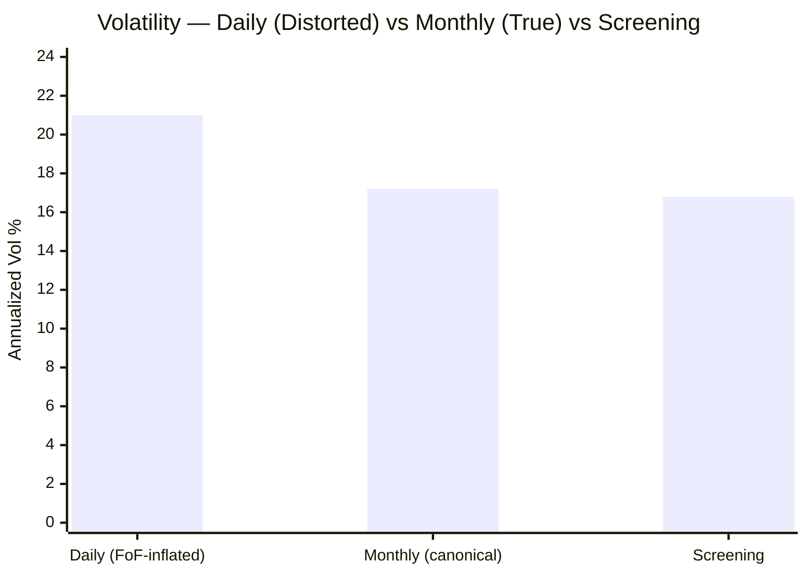

| Method | Vol | Verdict |
|--------|-----|---------|
| Daily × √252 | **21.0%** | ⚠️ Inflated by async foreign/FX pricing — **discard** |
| **Monthly × √12** | **17.2%** | ✅ **Canonical** |
| Screening | 16.79% | ✅ Confirms monthly |

The tell: my computed "worst day −10.97% / best day +11.53%" and a near-symmetric daily down/up>2% ratio (1.10×) are **larger and lumpier than a US large-cap fund actually moves** — they are pricing artefacts, not real one-day swings. **Throughout this module, monthly-based and calendar-based metrics are canonical; daily figures are shown only where the distortion is itself the point.** This is a structural feature of *every* feeder fund and a permanent caveat for the international sleeve.

---

## Volatility — Moderate Headline, Violent Growth-Crash Years

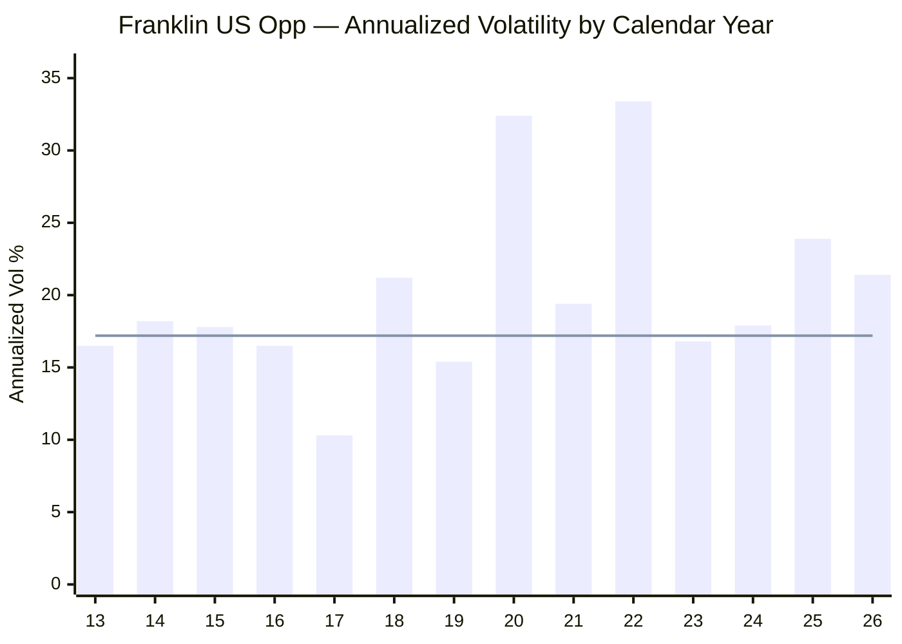
> Line = full-history canonical vol (~17.2%) | 2026 = YTD (daily-based per-year, directional)

| Year | Vol | Context |
|------|-----|---------|
| 2017 | **10.3%** | Calmest — the low-vol melt-up |
| 2018 | **21.2%** | Elevated — the Q4-2018 US correction (a real drawdown — see below) |
| 2020 | **32.4%** | COVID |
| 2022 | **33.4%** | The growth crash — highest in fund history |
| 2025 | **23.9%** | The tariff/growth scare |

**The structural read:** the ~17% headline is *moderate* — below your SmallCap funds (Union 17.4%, HSBC 16.8%) and above Parag Parikh FlexiCap (~9–13%). But it is **front-loaded into a handful of violent years** (2020, 2022 both >32%). US large-growth is "calm-then-explosive": long quiet melt-ups (2017: 10.3%) punctuated by sharp rate/liquidity shocks. A SIP investor will experience long placid stretches and occasional brutal ones — the opposite of a steadily-choppy small-cap.

---

## ⭐ Correlation to Indian Equity — The Diversification Centerpiece *(international-specific)*

The single most important number in this module. Monthly-return correlation to the Nifty 50 over the **full 13-year overlap (161 months):**

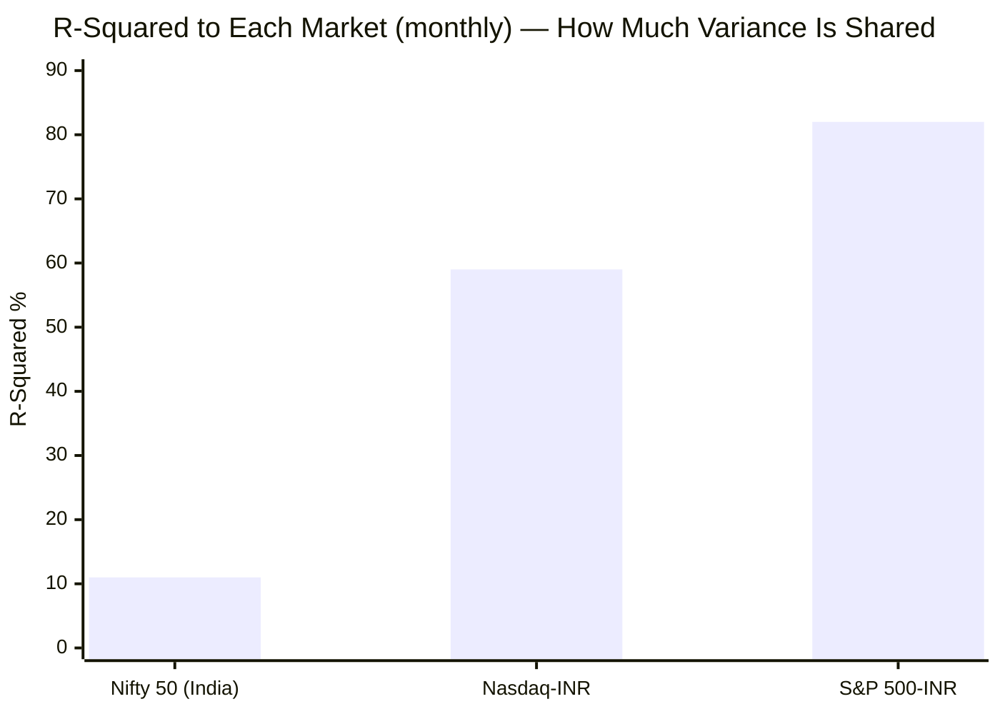

| Benchmark | Correlation | Beta | R² | Overlap |
|-----------|-------------|------|-----|---------|
| **Nifty 50 (India)** | **0.33** | **0.36** | **11%** | 161 months |
| S&P 500 (INR) | 0.91 | 1.26 | 82% | 74 months |
| Nasdaq 100 (INR) | 0.77 | 0.66 | 59% | 90 months |

> *(Daily correlations read even lower — Nifty 0.14, S&P 0.35 — but those are deflated by FoF async pricing; the monthly figures are the true relationships.)*

**Why this is the whole case for the sleeve:** Franklin's **R² to the Nifty is just 11%** — roughly **89% of its return variance is independent of Indian equity.** It is driven by US corporate earnings, the Fed, and the dollar — not by Indian earnings or the RBI. When your FlexiCap and SmallCap sleeves (both ~100% India-correlated) are falling on a domestic shock, Franklin is, to first order, *not*. **No domestic fund — however well-managed — can supply this**, because they are all the same underlying market. This is the property that lowers a *blended* India+International portfolio's volatility, and it earns Franklin a near-perfect diversification score regardless of its mediocre standalone metrics.

---

## ⭐ Amplified US Beta & Capture vs the Index Alternative *(international-specific)*

The flip side of the 0.91 US correlation: **beta 1.26 to the S&P 500 in INR.** Franklin is not "US-market exposure" — it is **1.26× concentrated US-*growth* exposure.** The calendar capture vs the two tradeable US-in-INR alternatives is unflattering:

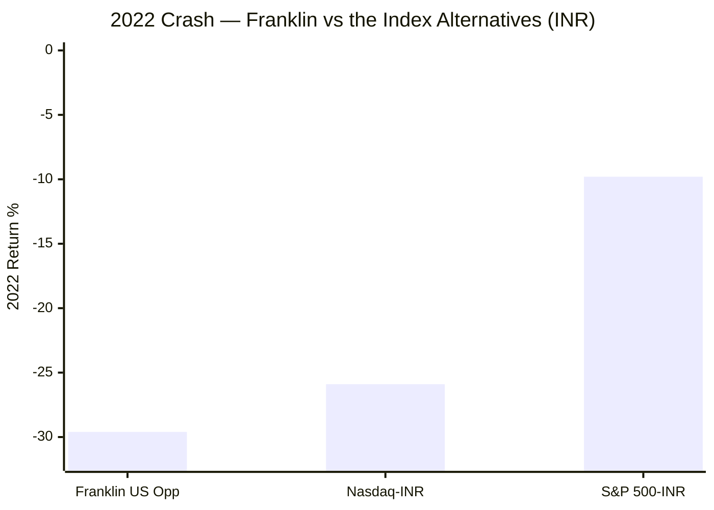

| Year | Franklin | S&P 500-INR | Nasdaq-INR | Read |
|------|----------|-------------|------------|------|
| 2021 | +19.1% | +30.2% | +29.0% | Lagged both in the melt-up |
| **2022** | **−29.6%** | **−9.8%** | −25.9% | ⚠️ **Fell 3× more than a broad S&P 500 fund** |
| 2023 | +39.3% | +25.5% | +53.0% | Beat S&P, lagged Nasdaq |
| 2024 | +28.4% | +27.2% | +55.7% | ~matched S&P, lagged Nasdaq badly |
| 2025 | +12.4% | +22.4% | +7.7% | ⚠️ Lagged S&P by 10 pts |

**The damning comparison:** in the 2022 bear, a *boring* S&P 500 INR index fund fell **−9.8%**; Franklin fell **−29.6%.** That ~20-point gap is the **growth-concentration tax** — Franklin behaves like the Nasdaq on the way down (−25.9%) but with *even less* protection. Across 2021–25 it **never beat a plain S&P 500 INR fund on a risk-adjusted basis** — it lagged in the melt-up, crashed far harder in 2022, and lagged again in 2025. This is the *risk-side* confirmation of Module 1's "just buy the index" finding: against a broad S&P 500 INR fund, Franklin is **lower-return (M1) *and* higher-risk (M2).** Its only structural edge is the India-diversification and currency hedge — both of which an S&P 500 INR fund shares.

---

## ⭐ Currency Risk Decomposition — A Net Hedge, Not Added Risk *(international-specific)*

The textbook assumption is that foreign-currency exposure *adds* volatility. For an Indian investor in US equity, **the opposite is true.**

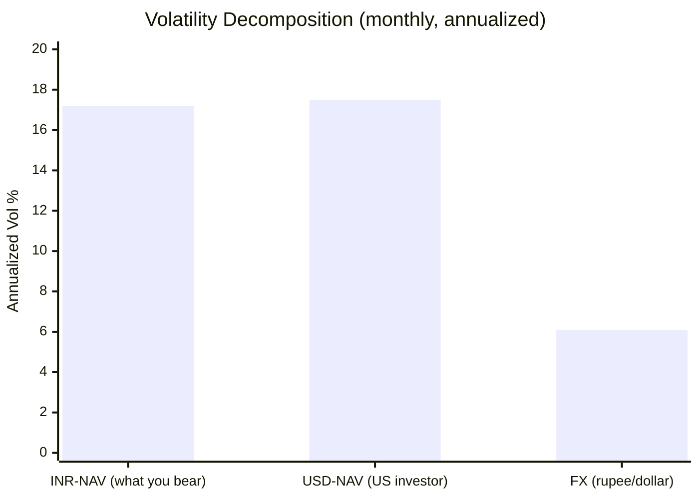

| Component | Annualized vol | Read |
|-----------|----------------|------|
| INR-NAV volatility (the Indian investor) | **17.2%** | What you actually bear |
| USD-NAV volatility (a US investor) | **17.5%** | The pure market risk |
| FX (₹/$) standalone volatility | 6.1% | The currency's own swings |
| **Corr(US-market return, ₹/$ move)** | **−0.24** | The hedge mechanism |

**The counterintuitive result:** despite 6.1% of standalone currency volatility, **the INR investor's total volatility (17.2%) is fractionally *lower* than the pure-dollar investor's (17.5%).** The reason is the **−0.24 correlation**: when US equity sells off (risk-off), global capital flees to the dollar, the **rupee weakens, and the ₹/$ gain partially offsets the equity loss.** The currency is a **natural partial hedge, not an additive risk.** This quantifies the Module 1 "shock-absorber" (the rupee cushioned the 2022 crash by ~7 points) and is a genuine, rare *risk positive* — one that distinguishes international equity from the naive "currency = extra risk" assumption. **The tail to remember (Module 1): in a rupee-*appreciation* regime this hedge reverses into a drag.**

---

## Max Drawdown — Moderate Depth, but Drawdown-*Prone*

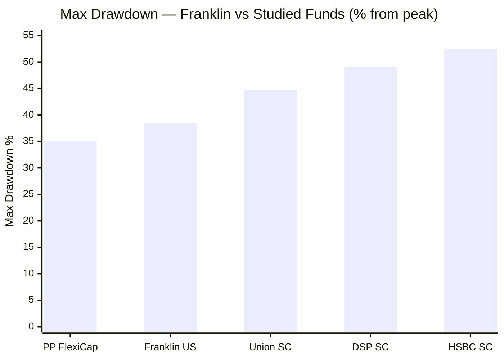

Franklin's −38.41% is **moderate** — deeper than a FlexiCap, shallower than every small-cap. But the *depth* understates the risk; the **frequency** is the story. There have been **five 20%+ drawdowns in 13 years:**

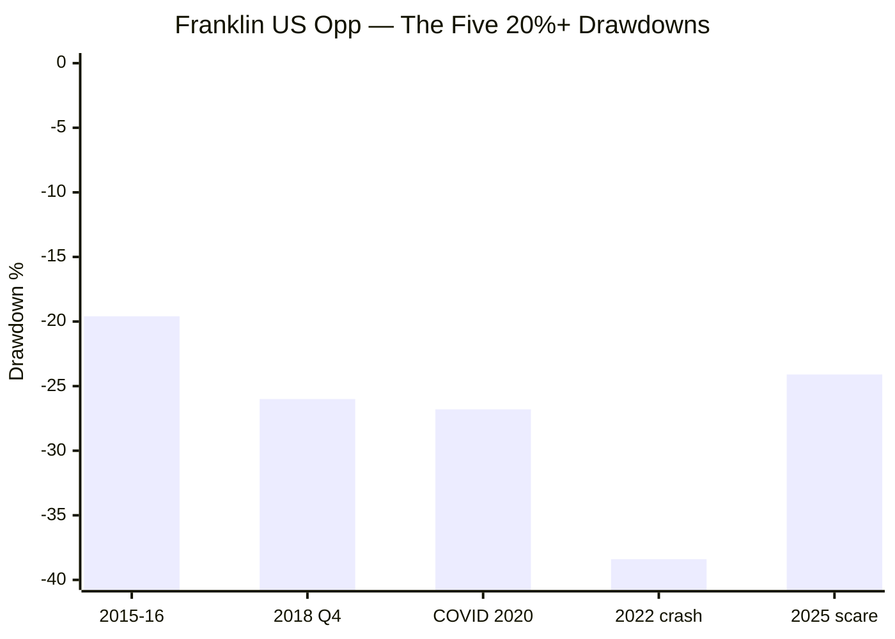

| # | Period | Depth | Down→trough | Recovery | Event |
|---|--------|-------|-------------|----------|-------|
| 1 | Nov 2021 → Jun 2022 | **−38.4%** | 212d | **603d (~2.2y underwater)** | The Fed-hike growth crash |
| 2 | Feb → Mar 2020 | −26.8% | 33d | 49d | COVID (fast V) |
| 3 | **Oct → Dec 2018** | **−26.0%** | 82d | 178d | The US Q4-2018 correction |
| 4 | Feb → Apr 2025 | −24.1% | 53d | 112d | Tariff / growth scare |
| 5 | Aug 2015 → Feb 2016 | −19.6% | 175d | 351d | China / oil scare |

**Two reframings:**
1. **There *was* a 2018 test — just a different one.** Franklin lived through a genuine **−26% US Q4-2018 correction.** It isn't "untested in 2018" the way India funds frame it; it faced a *different* 2018 (the Fed-tightening growth wobble, not the IL&FS winter) and recovered in ~6 months. (The dot-com/GFC caveat still stands — see below.)
2. **US growth is drawdown-prone.** Five 20%+ falls in 13 years ≈ a −25% drawdown roughly **every 2–3 years**, even though *calendar* returns show only one negative year. A SIP investor must expect frequent sharp drawdowns masked by year-end smoothing and the FX floor. The −38% 2022 kept investors **~2.2 years underwater** — shorter than a small-cap winter (Union 2.9y), longer than a typical FlexiCap dip.

---

## The "No Dot-Com, No GFC" Tail — The Real Worst Case Is Absent *(risk-framed)*

The record begins **02-Jan-2013**, excluding the two catastrophic US-growth bears:

| Missing bear | US-growth drawdown | Recovery |
|--------------|--------------------|----|
| **2000–2002 dot-com** | **−60% to −80%** | ~13 years for Nasdaq |
| **2008 GFC** | **~−50%** | ~4 years |

The fund's deepest *recorded* drawdown (−38%) is **roughly half** the dot-com worst case. Franklin's risk metrics — the moderate −38% max DD, the clean rolling returns — are **genuine but not worst-case-calibrated.** For a 10-year SIP this is the single most important risk caveat: **a concentrated US-growth book can draw down far more than anything in this record**, and the rupee hedge (which assumes risk-off → strong dollar → weak rupee) is *itself* untested in a US-*centred* solvency crisis where the dollar's safe-haven status is in question. Size the position for a −50%+ event, not a −38% one.

---

## Worst & Best Rolling Periods (MFAPI)

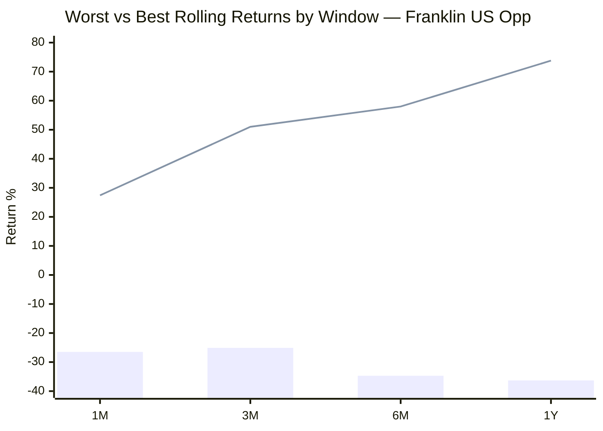
> Bar = worst window | Line = best window

| Window | Worst | Period | Best | Period |
|--------|-------|--------|------|--------|
| 1 Month | −26.5% | Feb→Mar 2020 (COVID) | +27.4% | Mar→Apr 2020 |
| 3 Months | −25.1% | Sep→Dec 2018 (Q4 correction) | +51.0% | Mar→Jun 2020 |
| 6 Months | −34.7% | Nov 2021→May 2022 (growth crash) | +58.0% | Mar→Sep 2020 |
| 1 Year | **−36.3%** | Nov 2021→Nov 2022 | **+73.8%** | Mar 2020→Mar 2021 |

**The familiar pivot:** the worst rolling year (−36.3%) and the best (+73.8%) both pivot on the same dates — the COVID trough was the best entry, the 2021 growth-peak the worst. Note the worst windows cluster on **three distinct events** (2018 Q4, COVID, 2022) — confirming the drawdown-*frequency* point: Franklin has no single dominant stress event (unlike Union's one 2018 winter), but rather *recurring* sharp US-growth selloffs.

---

## Daily Return Distribution — *Read With the FoF Caveat*

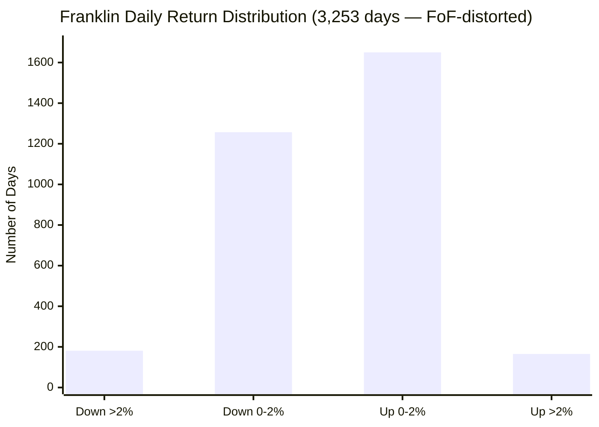

| Metric | Value | Caveat |
|--------|-------|--------|
| Positive days | 1,815 / 3,253 (55.8%) | Genuine-ish |
| Down >2% / Up >2% | 181 / 165 (**1.10× ratio**) | ⚠️ *Both inflated by FoF catch-up jumps* |
| Worst single day | −10.97% (16-Mar-2020) | ⚠️ Partly a pricing catch-up |
| Best single day | +11.53% | ⚠️ Clearly a pricing artefact |
| Daily VaR (95%) | −2.08% | ⚠️ Inflated |

**Interpretation — deliberately cautious.** Unlike a directly-held fund (Union), Franklin's daily distribution is **unreliable**: a feeder cannot genuinely move ±11% in a day on a US large-cap portfolio; those are async-pricing artefacts. The *near-symmetric* down/up ratio (1.10×) is the one robust read — Franklin has **no strong daily skew either way**, consistent with a broad-growth book (and unlike Union's genuinely negative 1.57× small-cap daily skew). **For a feeder, judge risk on monthly and calendar data, never daily.**

---

## Sharpe Ratio

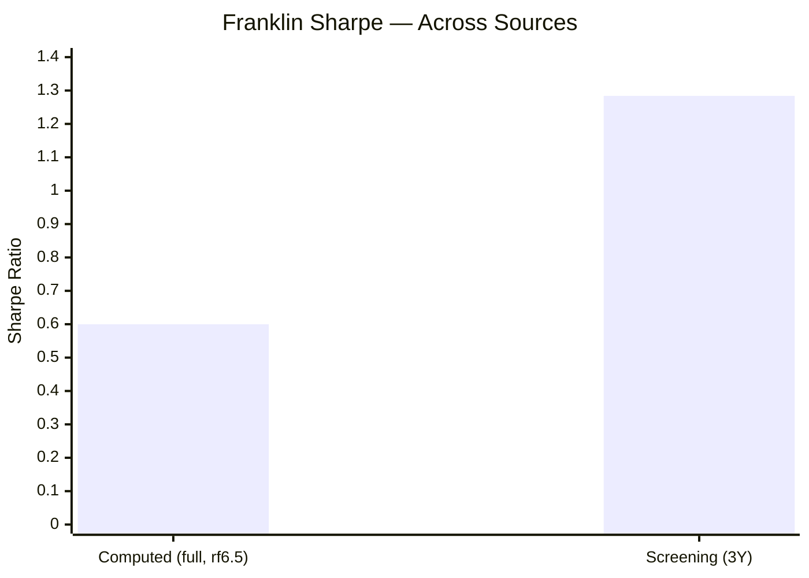

| Source | Sharpe | Window | Note |
|--------|--------|--------|------|
| MFAPI computed | **0.60** | Full 13.5Y, rf 6.5% | Conservative; includes 2022 |
| Screening | **1.284** | ~3Y | Recovery-window flattered (off the 2022 trough) |

**Reliable range 0.6–1.3.** The screening 1.284 is real but window-dependent (it measures the 2023–25 AI recovery off a depressed base). The full-period 0.60 is the honest through-cycle figure. **Crucially, Sharpe is *not* cross-comparable to your India funds** — US-growth and Indian small-cap occupy different return/risk regimes, and the rupee tailwind inflates the numerator. Franklin's Sharpe is "fine," not a selling point.

---

## Sortino Ratio — The One Standalone Bright Spot

| Source | Sortino | Window |
|--------|---------|--------|
| MFAPI computed | **1.30** | Full (MAR=0) |
| Screening (artefact) | 0.133 ⚠️ | Discard (low-freq) |

Franklin's computed Sortino (**1.30**) is genuinely healthy — *higher* than its Sharpe (0.60), which tells us its volatility is **upside-skewed** (the big moves are more often up than down). Downside deviation is 14.74%. This is the **one standalone risk metric that flatters Franklin**: US growth, over this window, delivered its volatility mostly to the upside (the 2019–21 and 2023–24 surges outweighed the drawdowns). The caveat is the same as everywhere — it excludes the dot-com/GFC downside that would lift the denominator sharply.

### Why Sortino Matters for SIP Investors
- **Sharpe** penalises all volatility, including the wealth-building upside swings.
- **Sortino** penalises only harmful *downside* volatility.
- Franklin's Sortino (1.30) > Sharpe (0.60) confirms the volatility is upside-skewed — but read it knowing the worst downside (dot-com/GFC) is missing from the sample.

---

## Calmar Ratio — Weak, Dragged by the Valley CAGR

| Period | CAGR | Max DD | Calmar |
|--------|------|--------|--------|
| 3Y | 23.40% | 38.41% | **0.61** |
| 5Y | 10.77% | 38.41% | **0.28** |
| 10Y | 17.80% | 38.41% | **0.46** |

Franklin's 5Y Calmar (0.28) is **weak** — but it is an artefact of the valley-shaped 5Y CAGR (Module 1): the numerator is the crash-front-loaded 10.77%, divided by the −38% drawdown. The 10Y Calmar (0.46) is the fairer through-cycle read. Either way, **return-per-unit-of-max-pain is unremarkable** — consistent with the broader Module 2 verdict that the standalone risk/reward is mediocre.

---

## Beta, R² & Tracking Error vs the Benchmark — High Active Risk, *Negative* Reward

| Metric | Value | Read |
|--------|-------|------|
| Beta vs S&P 500-INR | **1.26** | Amplified US risk |
| R² vs S&P 500-INR | 82% | It *is* US-market beta |
| Tracking Error vs Russell 3000 Growth | **16.80%** | ⚠️ Very high |

The **16.8% tracking error** is the damning active-risk number: Franklin takes *enormous* active (and currency) risk versus its benchmark — and (Module 1) is **not rewarded for it**, underperforming Russell 3000 Growth over 5Y/10Y. High TE is acceptable when it buys alpha; here it buys *negative* alpha at high cost. From a risk lens: **you are paying ~1.47% to take 16.8% of tracking-error risk for a sub-benchmark return** — the worst possible active-risk bargain. A passive S&P 500 INR fund would deliver the same diversification + hedge at near-zero tracking error and lower cost.

---

## Concentration & Liquidity of the Underlying

Unlike a small-cap fund, the underlying (FTIF Franklin U.S. Opportunities Fund) holds **deeply liquid US large-cap growth** — so there is **no liquidity/redemption-spiral risk** of the kind that haunts Union/BOI. The relevant concentration risk is **single-market (100% US) + style (growth) + Magnificent-Seven exposure** in the underlying book — to be quantified in Module 3. The screening "top-10 = 100%" is the FoF artefact (one underlying holding), not a real concentration figure. The *structural* risk here is not illiquidity but **closure**: as one of the few SIP-open international funds, a fresh SEBI-cap breach could pause subscriptions mid-SIP (Module 4).

---

## ⭐ Risk Contribution to the Blended Portfolio *(international-specific lens)*

The standalone metrics miss the point. The right question for a *third sleeve* is: **what does adding Franklin do to a FlexiCap + SmallCap portfolio's risk?**

| Property | Value | Portfolio effect |
|----------|-------|------------------|
| R² to Nifty | **11%** | Adds a near-orthogonal return stream — lowers blended volatility |
| Beta to India | **0.36** | Dampens domestic-shock drawdowns at the portfolio level |
| Currency | net hedge (−0.24) | Cushions global risk-off (₹ weakens when US falls) |
| Standalone vol | 17.2% | Comparable to the SmallCap sleeve — not a vol *reducer* by itself |

**The insight:** Franklin **raises** the risk of any single-sleeve view but **lowers** the risk of the *combined* three-sleeve portfolio, because its 11% India-R² means its drawdowns rarely coincide with the FlexiCap/SmallCap drawdowns. A 2022-style US-growth crash (Franklin −30%) often occurs when Indian equity is *flat-to-up*, and vice-versa (the 2018 IL&FS winter barely touched US growth). **This diversification dividend — not Franklin's own Sharpe — is the entire Module 2 case**, and it is real, large, and unavailable from any domestic fund. *(The caveat: in a genuine global systemic crisis — 2008-style — correlations converge toward 1 and the diversification temporarily fails, exactly when the dot-com/GFC tail would bite.)*

---

## Risk Metrics — Comparison with Studied Funds

```mermaid
quadrantChart
    title Standalone Risk vs Portfolio Diversification Value
    x-axis "Lower Diversification (India-like)" --> "Higher Diversification"
    y-axis "Worse Standalone Risk" --> "Better Standalone Risk"
    quadrant-1 Elite (both)
    quadrant-2 Good standalone, India-correlated
    quadrant-3 Poor (both)
    quadrant-4 Diversifier, weak standalone
    Parag Parikh FC: [0.30, 0.85]
    DSP SmallCap: [0.20, 0.60]
    Union SmallCap: [0.18, 0.70]
    Franklin US Opp: [0.95, 0.40]
```
> Franklin sits alone at the far right (elite diversification) but low (mediocre standalone risk) — the inverse of Union.

| Metric | Franklin US | PP FlexiCap | DSP SC | Union SC |
|--------|-------------|-------------|--------|----------|
| Volatility | 17.2% | ~9–13% | 15.9% | 17.4% |
| Max Drawdown | −38.4% | ~−35% | −49% | −44.7% |
| # of 20%+ drawdowns (record) | **5** | ~2 | ~2 | ~2 |
| **R² to Nifty** | **11% ⭐** | ~100% | ~100% | ~100% |
| Down-capture vs own index | **poor (3× S&P in '22)** | strong | moderate | **47% (best)** |
| Sortino (computed) | 1.30 | ~1.06 | 1.34 | 0.911 |
| Currency effect | **net hedge** | minor | none | none |
| Worst-bear in record | 2022 + 2018-US | 2020/22 | 2018+20 | 2018+20 |
| Tail risk (absent) | **dot-com / GFC ⚠️** | — | — | — |
| Multi-cycle proof | partial | ✅ | ✅ | ✅ |

**Cross-portfolio interpretation:** Franklin is the **only fund in either study whose risk case is *combinatorial* rather than *standalone*.** Union earns its keep with elite individual metrics (best Sharpe/down-capture); Franklin earns its keep purely through its **11% correlation to everything else you own.** Standalone it is the *weakest* risk profile of the four (most frequent drawdowns, poor down-capture vs its own index, missing worst-case tail). In a portfolio it is the *most valuable* diversifier. Both are true; the role decides which matters.

---

## Risk Profile — Points For and Against

### ✅ Points IN FAVOUR
1. **Near-zero correlation to Indian equity (R² 11% to Nifty)** — the genuine diversification the sleeve exists for; unavailable from any domestic fund
2. **The rupee is a net hedge (−0.24)** — INR vol (17.2%) ≤ USD vol (17.5%) despite 6.1% FX vol; cushions global risk-off
3. **Moderate max drawdown (−38%)** — shallower than every small-cap studied
4. **Healthy Sortino (1.30)** — volatility is upside-skewed over this window
5. **No liquidity/redemption-spiral risk** — the underlying holds deeply liquid US large-caps
6. **A real (different) 2018 test** — survived the −26% Q4-2018 US correction and recovered in ~6 months
7. **Lowers *blended* three-sleeve portfolio risk** — the diversification dividend

### ⚠️ Points AGAINST
1. **Amplified US-growth beta (1.26 to S&P 500)** — more risk than a plain S&P 500 index fund
2. **Poor down-capture vs its own index** — fell −29.6% in 2022 when a broad S&P 500 INR fund fell −9.8%
3. **Drawdown-prone — five 20%+ falls in 13 years** (~one every 2–3 years), masked by calendar smoothing
4. **Worst-case tail absent** — no dot-com (−70%) or GFC (−50%) in the record; metrics not worst-case-calibrated
5. **16.8% tracking error for *negative* alpha** — the worst active-risk bargain in either study
6. **Currency hedge reverses in a ₹-appreciation regime** — the −0.24 hedge is regime-dependent
7. **Diversification fails in a global systemic crisis** — correlations converge toward 1 exactly when the tail bites
8. **Daily risk metrics unreliable** (FoF pricing) — less transparent than a directly-held fund

---

## Module 2 Scorecard

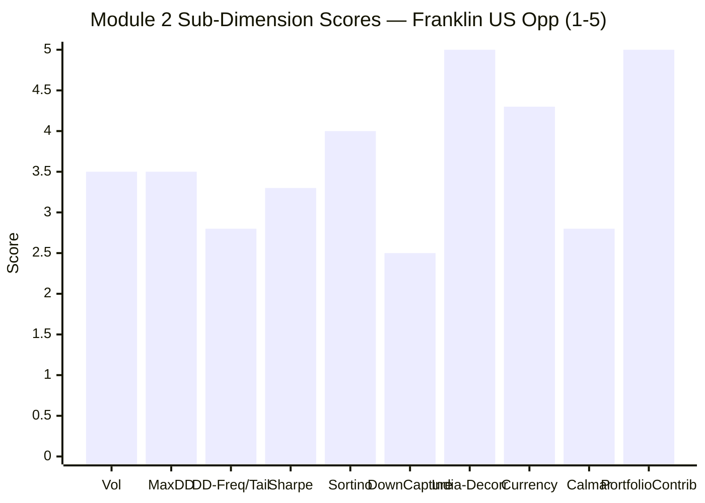

| Sub-dimension | Score (1–5) | Reasoning |
|---------------|-------------|-----------|
| Volatility | **3.5** | ~17.2% moderate; clusters into violent years (2020/22 >32%) |
| Max Drawdown (depth) | **3.5** | −38% — shallower than every small-cap |
| Drawdown frequency / tail | **2.8** | 5 × 20%+ DDs; no dot-com/GFC in record |
| Sharpe | **3.3** | 0.6 full / 1.28 recovery-window; "fine," not a selling point |
| Sortino | **4.0** | 1.30 — the one flattering standalone metric (upside-skewed) |
| Down-capture vs own index | **2.5** | Poor — fell 3× the S&P 500 in 2022; lagged in 2025 |
| **Decorrelation from India** | **5.0** | **R² 11% to Nifty — the diversification dividend** |
| Currency risk | **4.3** | Net hedge (−0.24); INR vol ≤ USD vol; regime-dependent |
| Calmar | **2.8** | 0.28 (5Y) — weak, valley-CAGR dragged |
| Portfolio risk contribution | **5.0** | Lowers blended three-sleeve risk — the core case |
| **Module 2 Overall** | **~3.3 / 5** | **A poor-to-mediocre *standalone* risk profile — amplified US-growth beta (1.26 to the S&P 500), poor down-capture vs its own index (−29.6% vs −9.8% in 2022), five 20%+ drawdowns, and an absent dot-com/GFC tail — redeemed by an *elite diversification* profile: an 11% R² to Indian equity and a rupee that acts as a net hedge. Hold it for what it does to the blended portfolio's correlation matrix, not for its own risk-adjusted return — where a cheaper, lower-beta S&P 500 index fund would beat it.** |

---

## Comparative Module 2 Scores

| Fund | M2 Score | Risk Profile Summary |
|------|----------|---------------------|
| PP FlexiCap | 4.0/5 | Lowest vol, structural buffer, multi-cycle proof |
| DSP Small Cap | 3.8/5 | At ATH, multi-cycle proof, honest −49% DD |
| Union Small Cap | ~3.8/5 | #1 Sharpe/down-capture, genuinely 2018-tested |
| BOI Small Cap | ~3.7/5 | Best IR, at ATH; missing 2018 |
| **Franklin US Opp** | **~3.3/5** | **Elite *diversifier* (R² 11% to India + rupee hedge); poor *standalone* risk (amplified beta, poor down-capture, drawdown-prone, no GFC tail)** |
| HSBC Small Cap | ~3.2/5 | Elite historical, deteriorating recent |

**Franklin lands at ~3.3 — below the India funds on *standalone* risk, but for a reason that doesn't capture its real value.** The scorecard's two 5.0s (India-decorrelation, portfolio contribution) are dragged down by genuinely weak standalone metrics (down-capture 2.5, drawdown-frequency 2.8, Calmar 2.8). The honest synthesis: **on a same-rubric basis Franklin scores ~3.3, but the rubric was built for standalone India equity and systematically under-weights the one thing an international fund is *for* — decorrelation.** Read the 3.3 as "mediocre fund, excellent diversifier," and weight the diversification according to how much you value lowering blended-portfolio risk.

---

## SIP Implication

For a ₹20,000/month international sleeve over 10+ years, Franklin's risk profile splits cleanly into a standalone story (weak) and a portfolio story (strong).

**What the standalone data says — temper expectations.** Franklin carries **amplified US-growth risk** (beta 1.26 to the S&P 500), is **drawdown-prone** (five 20%+ falls in 13 years, ~one every 2–3 years), shows **poor down-capture versus its own index** (−29.6% in 2022 when a broad S&P 500 INR fund fell just −9.8%), and **excludes the worst US-growth bears** (dot-com −70%, GFC −50%) from its record. Its tracking error (16.8%) buys *negative* alpha. On every standalone risk measure, a cheaper, lower-beta S&P 500 INR index fund would be the superior holding.

**What the portfolio data says — this is the case.** Franklin has an **R² of just 11% to the Nifty** — roughly 89% of its risk is independent of your FlexiCap and SmallCap sleeves — and the **rupee acts as a net hedge** (INR volatility 17.2% ≤ USD volatility 17.5%, because the rupee weakens when US equity falls). Adding it to an India-only portfolio **lowers the blended volatility and drawdown**, because its bad years (2022) rarely coincide with India's bad years (2018). This diversification dividend is large, genuine, and unavailable from any domestic fund — and it is the entire reason the sleeve exists.

**The three SIP risk behaviours to expect with Franklin over 10 years:**
1. **In a US-growth/rate shock (like 2022):** Franklin falls hard — expect −30% to −40% in INR (worse than a broad S&P 500 fund), but the rupee cushions ~7 points and recovery historically takes ~1.5–2 years. Keep SIP-ing; the drawdown buys cheap units (the 5Y SIP XIRR of 18.5% vs 10.8% lumpsum, Module 1, is built on exactly this).
2. **In an Indian-specific shock (like the 2018 IL&FS winter):** Franklin is largely *unaffected* (11% India-R²) — this is the diversification working, and the moment its value is most visible.
3. **In a global systemic crisis (2008-style — not in the record):** correlations converge toward 1, the rupee hedge may fail (a US-centred dollar crisis), and Franklin could draw down −50%+. Size the sleeve for this unmodelled tail.

**What to monitor:**
- Whether the rupee continues to act as a hedge (it reverses in a ₹-appreciation regime)
- The underlying's Magnificent-Seven concentration (Module 3) — the amplified beta lives there
- Closure risk — as a SIP-open international fund, a SEBI-cap breach could pause subscriptions

**Recommended SIP behaviour:** Hold Franklin as a **diversifier, sized modestly**, and judge it by its effect on the *blended* portfolio, never by its own drawdowns. Continue the SIP through US-growth crashes (they buy cheap units and the rupee cushions them). **But do not mistake it for a low-risk holding** — it is a concentrated, amplified US-growth book whose standalone risk is higher than a plain S&P 500 fund and whose worst case is unmodelled. The risk you are *paying* for (active US-growth) is poor; the risk you are *buying* (decorrelation from India) is excellent.

---

## One-Line Verdict

> **Franklin U.S. Opportunities is an elite *diversifier* wrapped around a mediocre *standalone* risk profile: an 11% R² to Indian equity and a rupee that acts as a net hedge (INR vol ≤ USD vol) — set against amplified US-growth beta (1.26 to the S&P 500), poor down-capture versus its own index (−29.6% vs −9.8% in 2022), five 20%+ drawdowns in 13 years, and an absent dot-com/GFC tail. Hold it for what it does to the blended portfolio's correlation matrix, not for its own risk-adjusted return — where a cheaper, lower-beta S&P 500 index fund beats it. Module 2: ~3.3/5 — excellent diversifier, weak standalone risk.**

---

*Module 2 completed: June 2026 | Risk Profile | MFAPI methodology (Franklin US Opp scheme 118551, 3,254 days, Jan 2013 → Jun 2026) | Correlation/beta computed vs UTI Nifty 50 (120716), Motilal S&P 500 (148381) & Nasdaq 100 FoF (145552); currency decomposition vs ECB ₹/$ | Max drawdown (−38.41%) reproduces screening exactly | Benchmark = Russell 3000 Growth TRI | Daily metrics flagged as FoF-pricing-distorted; monthly canonical | Provisional M2 Score: ~3.3/5 (subject to M3 for underlying concentration, M4 for cost/closure)*

*Next: [Module 3 — Portfolio DNA & Look-Through](module3_portfolio.md)*
