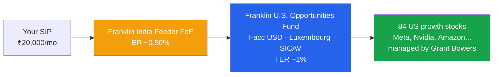
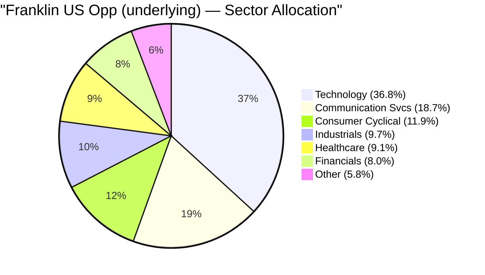
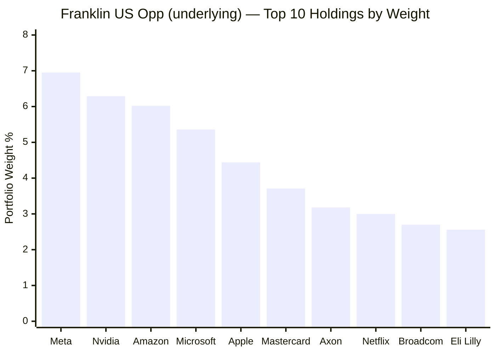
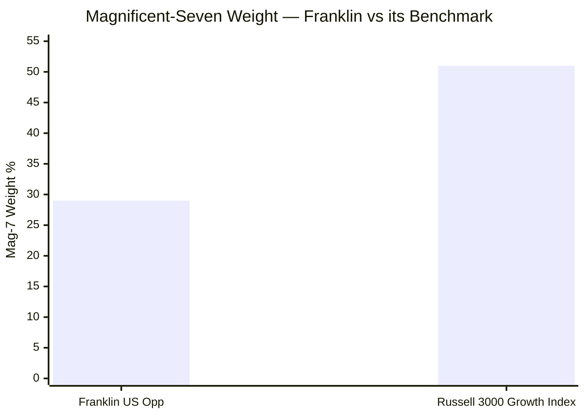
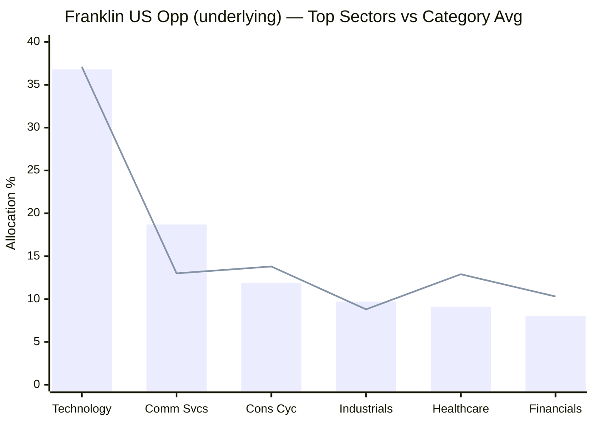
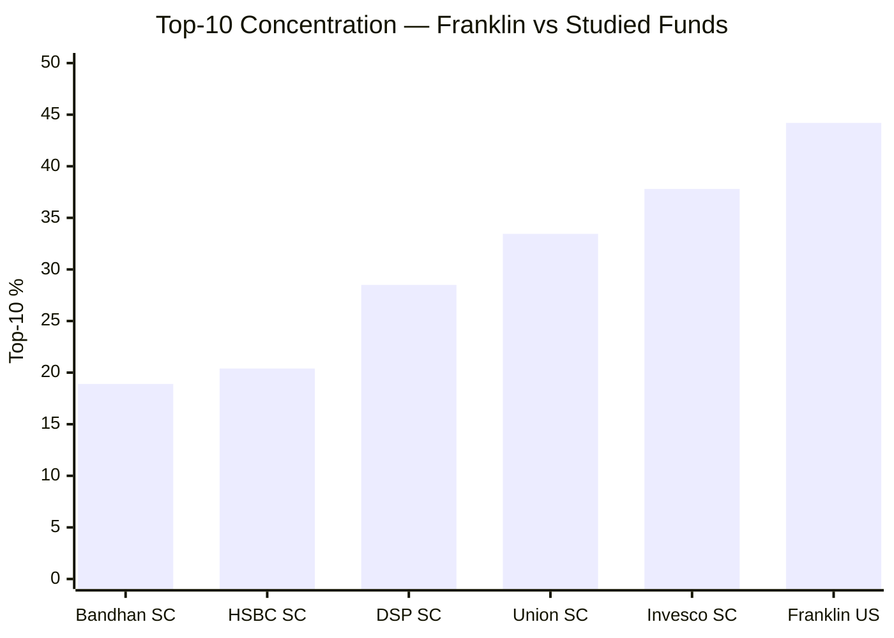
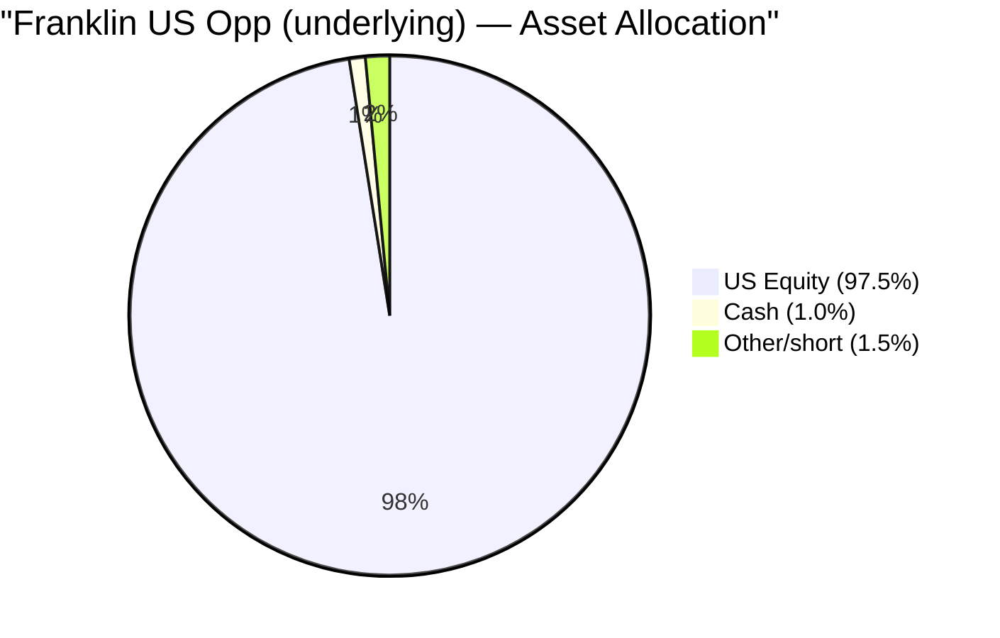
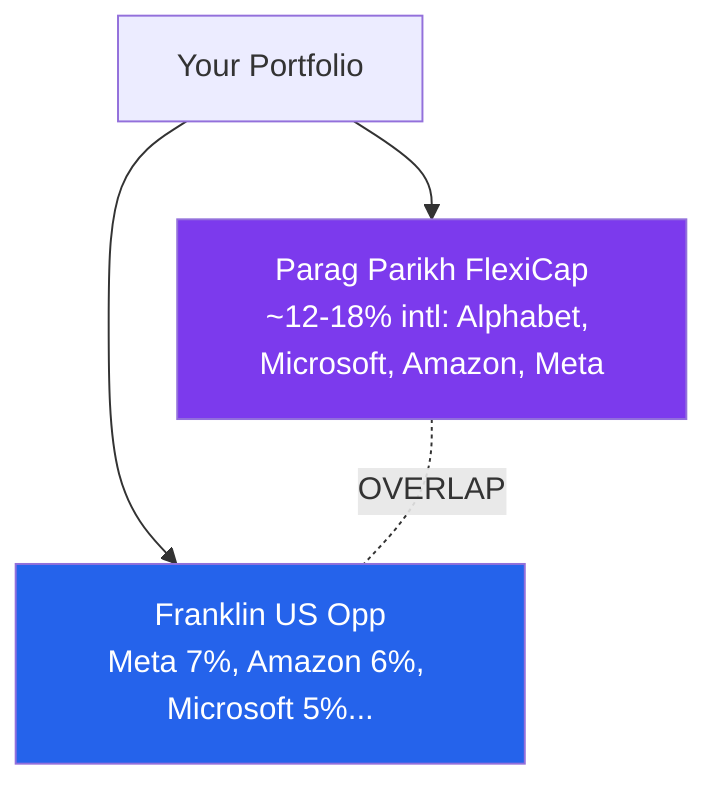
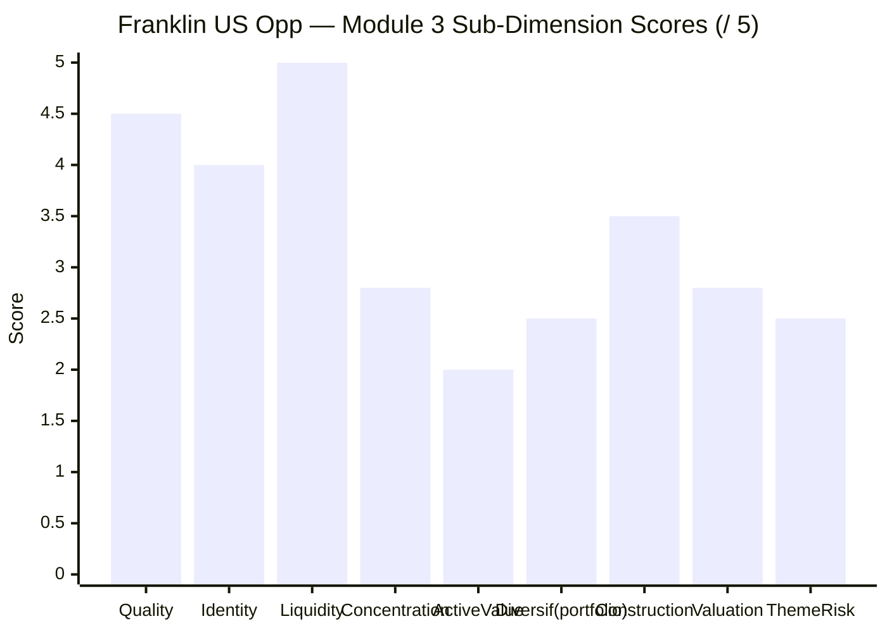
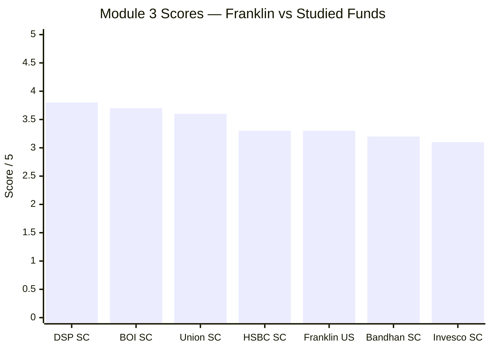

# Module 3: Portfolio DNA & Look-Through — Franklin U.S. Opportunities Equity Active FOF

*Sources: Underlying-fund holdings — Franklin U.S. Opportunities Fund, I-acc USD (Morningstar/Investing.com look-through, Jun 2026) | Franklin Templeton factsheets (FTIF & DIFC) | Tickertape screening (May-2026) | Value Research | Web research, June 2026. **The Indian feeder discloses only "Franklin U.S. Opportunities Fund 97.7%" — all real portfolio data is the *underlying* fund's, by look-through.** Benchmark = Russell 3000 Growth TRI (cap-weighted US large-growth).*

---

## Module 3 Score: ~3.3 / 5

Franklin's portfolio is the study's **"high-quality large-growth book whose own construction guarantees it lags its index."** Module 3 is where the central finding of Modules 1–2 — *the fund underperforms its benchmark net of fees* — finally gets its mechanical explanation. The holdings reveal a genuinely good, 84-stock US-growth portfolio (Meta, Nvidia, Amazon, Microsoft, Mastercard, Eli Lilly) — **but one that is structurally *underweight* the Magnificent Seven versus its cap-weighted benchmark.** In a market led by exactly those mega-caps, a diversified-away-from-them book *must* lag — not from bad stock-picking, but from arithmetic. Two further findings shape the score: a **high top-10 concentration (44%)** with genuine single-name risk, and — critically for *this* investor — **material overlap with Parag Parikh FlexiCap's US holdings**, which erodes the marginal diversification that is the sleeve's entire purpose. A clean, liquid, coherent portfolio — held back by the fact that its construction is the *cause* of its index-lag and its diversification is less than it appears.

---

## The Look-Through Mechanism — What "97.7% in One Holding" Really Means *(international-specific)*

Every Indian platform shows Franklin's portfolio as **one line: "Franklin U.S. Opportunities Fund, Class I (Acc) — 97.70%" + cash 2.30%.** That is the **FoF artefact** — the screening "top-10 = 100% / top-3 = 100%" figures (Module 1) are this, not real concentration. The *actual* portfolio is the **underlying fund's** book, reached only by look-through:

> **The institutional share-class confirmation:** the feeder buys the **I-acc (institutional)** class, not the retail A-acc (1.82% OCF). This is why the true all-in cost (~1.47%, Module 1) is *below* the retail 1.82% — but still ~3× the headline 0.50% feeder ER. The look-through also means **the feeder manager (Sandeep Manam) makes zero stock decisions** — every holding below is Grant Bowers'.

---

## Raw Data (Underlying Fund — Look-Through, Jun 2026)

| Metric | Value | Source | Confidence |
|---|---|---|---|
| **Total holdings (underlying)** | **84 long** (+7 short/deriv.) | Morningstar look-through | ✅ |
| **Top-10 concentration** | **44.2%** | Look-through (computed) | ✅ |
| **Magnificent-Seven weight (5 visible)** | **~29%** | Look-through | ✅ (Alphabet/Tesla not in top-10) |
| **Equity / Cash** | **97.5% / ~1.0%** | Look-through | ✅ |
| Technology | **36.8%** | Morningstar | ✅ |
| Communication Services | **18.7%** | Morningstar | ✅ |
| Consumer Cyclical | 11.9% | Morningstar | ✅ |
| Industrials | 9.7% | Morningstar | ✅ |
| Healthcare | 9.1% | Morningstar | ✅ |
| Financial Services | 8.0% | Morningstar | ✅ |
| **Tech + Comm Services** | **55.5%** | Computed | ✅ |
| Geography | **~100% US** | Mandate | ✅ |
| Style | **US large-cap growth** | Mandate / holdings | ✅ |
| Portfolio P/E | *Not disclosed* (high — growth book) | — | ❌ Data gap |
| Portfolio turnover | *Not disclosed* (Bowers reputed low) | — | ❌ Data gap |
| Underlying manager | **Grant Bowers (since 2007) + Sara Araghi** | Factsheet | ✅ |
| Feeder "top holding" | Franklin US Opp Fund I-acc 97.7% | VRO/Groww | ✅ (FoF artefact) |

> **Two honest data gaps:** the underlying's **portfolio P/E** and **turnover** are not published in the look-through sources (the FoF structure obscures them). The P/E is unambiguously *high* (a tech/growth book — Nvidia, Eli Lilly, Axon all trade at premium multiples); turnover is reputedly low (Bowers is a long-tenured buy-and-hold growth manager). Both are flagged for refinement; neither changes the module's conclusions.

---

## The Core Thesis — A High-Quality, Diversified Large-Growth Book

The underlying targets *"US companies demonstrating accelerating growth, increasing profitability, or above-average growth potential."* The holdings deliver exactly that: a book of **dominant, high-quality US mega- and large-cap franchises**, diversified across 84 names, tech/communication-led:

This is a **genuinely high-quality book** — there are no junk names; every top holding is a dominant franchise (Meta, Nvidia, Amazon, Microsoft, Apple, Mastercard, Eli Lilly, Broadcom). The quality is not in question. What *is* in question — and what the rest of this module establishes — is whether owning these names *in these proportions* (diversified away from the index's mega-cap concentration) adds value over simply owning the index, and whether it adds *diversification* to this investor's existing India-plus-PP-FlexiCap portfolio.

---

## Top-10 Holdings — Stock-by-Stock

Top-10 ≈ **44.2%** of the underlying; 84 holdings total; top name (Meta) 6.95%.

| # | Stock | Wt% | Sector | Thesis / Note |
|---|---|---|---|---|
| 1 | **Meta Platforms** | 6.95% | Comm Svcs | Social/ads duopoly; AI capex; Mag-7 |
| 2 | **NVIDIA** | 6.29% | Technology | AI-compute monopoly; Mag-7 |
| 3 | **Amazon** | 6.02% | Consumer Cyc | E-commerce + AWS cloud; Mag-7 |
| 4 | **Microsoft** | 5.36% | Technology | Cloud (Azure) + AI (OpenAI); Mag-7 |
| 5 | **Apple** | 4.44% | Technology | Devices + services moat; Mag-7 |
| 6 | **Mastercard** | 3.71% | Financials | Payments duopoly; asset-light toll-booth |
| 7 | **Axon Enterprise** | 3.18% | Industrials | Police tech (Taser, body-cams); high-growth |
| 8 | **Netflix** | 3.00% | Comm Svcs | Streaming leader; pricing power |
| 9 | **Broadcom** | 2.70% | Technology | Semis + AI infrastructure |
| 10 | **Eli Lilly** | 2.56% | Healthcare | GLP-1 (weight-loss) franchise |

**Two patterns in the top-10:**
- **Five of the Magnificent Seven** lead the book (Meta, Nvidia, Amazon, Microsoft, Apple = ~29%) — but at *lower* weights than the index assigns them (see next section). **Alphabet and Tesla are absent from the top-10** — a deliberate underweight/omission of two Mag-7 names.
- **Genuine active picks beyond the mega-caps:** Mastercard (payments toll-booth), Axon (police-tech compounder), Eli Lilly (GLP-1) — these are where Bowers expresses skill. Note the kinship with the *quality-franchise / asset-light* picks in your India funds (Mastercard ≈ MCX/KFin's toll-booth logic; Eli Lilly ≈ the quality-pharma theme).

---

## ⭐ The Magnificent-Seven Underweight — The Portfolio Cause of the Index-Lag *(international-specific — the key section)*

This is where Module 3 *explains* the Module 1–2 finding that Franklin underperforms its benchmark. The math is stark:

> Franklin holds ~29% in 5 of the Mag-7 (Alphabet/Tesla absent from top-10). The cap-weighted Russell 3000 Growth index holds ~50%+ in the Magnificent Seven.

| | Franklin (active) | Russell 3000 Growth (index) | Gap |
|---|---|---|---|
| Magnificent-Seven weight | **~29%** | **~50%+** | **~−20pts underweight** |
| Holdings | 84 (diversified) | mega-cap-concentrated | — |
| Alphabet / Tesla | absent from top-10 | large index weights | underweight |

**The mechanism — diversification *is* the underperformance:**
1. The Russell 3000 Growth index is **cap-weighted** — so the largest companies (the Mag-7) dominate it, ~50%+ of the index.
2. Bowers runs a **diversified, risk-controlled** book — he deliberately caps mega-cap weights (~5–7% each) and spreads into 84 names, *underweighting* the Mag-7 by ~20 points versus the index.
3. In a market **led by the Mag-7** (2023–25), being underweight them **mechanically guarantees a lag** — not from picking bad stocks, but from not owning *enough* of the few that drove the index.

**This is the holdings-level proof of the M1/M2 verdict.** The −11pt lag to the Nasdaq in 2024, the −1.9% 5Y benchmark shortfall, the high (16.8%) tracking error for *negative* alpha — all of it lives in this ~20-point Mag-7 underweight. It is also a **double-edged structural feature**: the same underweight that lags in a mega-cap bull would *protect* in a Mag-7 *bust* (a concentration unwind). But across this window, and for as long as the mega-caps lead, the construction is a structural headwind. **A diversified active growth manager cannot beat a cap-weighted growth index dominated by 7 names — this portfolio is the proof.**

---

## Sector Allocation — Tech/Communication-Led, Growth-Concentrated

> Bar = Franklin | Line = category (US large-growth) average

| Sector | Franklin | Cat Avg | Read |
|---|---|---|---|
| **Technology** | 36.8% | 37.1% | In line — the core |
| **Communication Services** | **18.7%** | 13.0% | ⚠️ **Overweight** (Meta, Netflix) |
| Consumer Cyclical | 11.9% | 13.8% | Slight underweight (Amazon, Tesla-light) |
| Industrials | 9.7% | 8.8% | Slight overweight (Axon) |
| Healthcare | **9.1%** | 12.9% | ⚠️ Underweight |
| Financials | 8.0% | 10.3% | Underweight |

**The macro identity: "US large-growth, tech-and-communications-led."** Tech + Communication Services = **55.5%** of the book — the highest single-theme concentration of any fund in either study (vs Union's 13.5% lead sector). This is a *concentrated bet on the digital-economy mega-caps*, lightly diversified by Axon (industrials), Eli Lilly (healthcare), and Mastercard (financials). The healthcare/financials underweights vs category are the active tilts — modest, and not where the action is. **The fund lives and dies by US big-tech.**

---

## Concentration Analysis — High Top-10, Real Single-Name Risk

| Metric | Franklin US | Union SC | DSP SC |
|---|---|---|---|
| Total holdings | 84 | ~70 | 81 |
| Top holding | **6.95%** (Meta) | 4.20% | 5.38% |
| Top-2 (Meta+Nvidia) | **13.2%** | ~8% | — |
| Top-10 | **44.2%** | 33.45% | 28.5% |

**Franklin's top-10 (44%) is the most concentrated of any fund in either study** — and the single-name risk is genuine: **Meta + Nvidia alone = 13.2%**, so a 50% fall in either costs ~3.3–3.5% of NAV. This is *mega-cap* concentration (Meta and Nvidia are among the most liquid, most-followed stocks on earth, so it is not *illiquidity* risk like a small-cap's) — but it *is* idiosyncratic exposure: an AI-capex disappointment at Nvidia, or an ad-market or regulatory shock at Meta, would hit hard. The 84-name tail diversifies the residual, but the top is a concentrated big-tech bet. **For a "diversifier" sleeve, note the irony: the diversification-from-India is real, but the fund is itself *highly concentrated* in a handful of correlated mega-cap-tech names.**

---

## Asset Allocation — Near-Fully Invested, No Liquidity Risk

Franklin runs **~97.5% equity, ~1% cash** — near-fully invested, thin buffer (like Union). But the critical contrast with the small-cap funds: **there is zero liquidity/redemption-spiral risk.** The underlying holds the *most liquid equities on the planet* (Apple, Microsoft, Nvidia trade billions of dollars daily) — a redemption wave can be met instantly without price impact. The "thin cash buffer" caveat that mattered for Union (illiquid small-caps) is **immaterial here.** The structural risk is not liquidity but **single-market concentration (100% US) + style (growth) + the closure risk** of the feeder wrapper (Module 4).

---

## Active Share vs the Cap-Weighted Index — High, But the Wrong Kind

Franklin is genuinely *active* — 84 names, ~20-point Mag-7 underweight, a 16.8% tracking error (Module 2). On paper that is **high active share** — the manager is taking real bets away from the index. The problem (Modules 1–2): **the active bets have *lost* to the index** over 5 and 10 years. High active share is valuable only when it produces alpha; here it produces a structural lag.

| | Reading |
|---|---|
| Active share | **High** (large Mag-7 underweight, 84-name diversification) |
| Tracking error | 16.8% — high active risk |
| Result | **Negative** net alpha (M1) — the active bets lagged |
| Diagnosis | The *direction* of the active bet (underweight mega-caps) was wrong for a mega-cap-led regime |

**The uncomfortable synthesis:** Franklin is "actively managed" in the truest sense — it looks very different from the index — but for an investor that difference has been a cost, not a benefit. A *closet-indexer* would at least have matched the index; Franklin's genuine activeness has *trailed* it. This is the portfolio-level case for "just buy the index" (Module 1): you are paying ~1.47% for genuine active risk that has subtracted value.

---

## ⭐ Cross-Sleeve Overlap — You May Already Own This *(international-specific — the diversification reality check)*

Module 2 credited Franklin with an 11% R² to Indian equity — the diversification dividend. But diversification is **portfolio-specific**: it depends on what *else* you own. Versus this investor's actual sleeves:

| vs Sleeve | Overlap | Diversification |
|---|---|---|
| SmallCap funds (DSP/Union/BOI) | **Zero** (US mega-caps vs Indian small-caps) | ✅ Full |
| **Parag Parikh FlexiCap (your #1 core)** | **HIGH ⚠️** | ❌ **Eroded** |

**The catch:** Parag Parikh FlexiCap holds (and historically held large positions in) **Alphabet, Microsoft, Amazon, and Meta** in its ~12–18% international sleeve. Three of those four are **Franklin's top holdings** (Meta 6.95%, Amazon 6.02%, Microsoft 5.36%). So **if you hold Parag Parikh FlexiCap — your top-ranked core fund — you already own a slug of exactly the US mega-cap tech that Franklin is concentrated in.** Adding Franklin would **double-count Microsoft/Amazon/Meta**, not diversify into something new.

**The implication for the sleeve:** Franklin's *marginal* diversification value — the entire reason to own an international sleeve — is **materially lower for this investor than the standalone 11%-R² figure suggests**, because PP FlexiCap already supplies US-mega-cap exposure. This argues that *if* an international sleeve is added, a fund that owns **different** US exposure (broad S&P 500, or value, or a non-US/global-developed fund) would diversify *this* portfolio better than another concentrated US-big-tech book. **It is the single most important portfolio-construction insight for the international sleeve, and it counts against Franklin specifically.** (It also strengthens the case for the shortlist's Edelweiss US *Value* or the EM/Europe funds as complements rather than Franklin.)

---

## Style & Valuation — Large-Growth, Premium-Multiple

Franklin's style is unambiguous **US large-cap growth** — Nvidia (AI), Eli Lilly (GLP-1), Axon (high-growth industrial), Netflix, the mega-cap platforms. The portfolio P/E is **not disclosed in the look-through** (a data gap), but is unambiguously **high**: a book led by Nvidia, Eli Lilly, Axon, and Broadcom carries a premium growth multiple (a category P/E in the ~28–33× region is typical for US large-growth). Two reads:

1. **Quality-growth, not speculative-growth.** Unlike a thematic/ARKK-style book, these are *profitable, cash-generative* mega-caps — the multiple is paid for genuine, durable earnings growth (closer to Union's *quality* premium than Invesco's *speculative* one).
2. **No valuation cushion + rate-sensitivity.** A high-multiple growth book de-rates hardest when rates rise — exactly what produced the −38% 2022 drawdown (Module 2). The thin cushion is structural to the style.

> **Data gap to refine:** the exact underlying P/E and turnover. The conclusions (high-quality growth, premium multiple, rate-sensitive) hold regardless; the precise figures would sharpen the valuation-cushion discussion in a later pass.

---

## Points For / Points Against (Portfolio Angle)

### ✅ Points For
1. **Genuinely high-quality book** — every top holding a dominant franchise (Meta, Nvidia, Amazon, Microsoft, Mastercard, Eli Lilly); no junk
2. **Coherent large-growth identity** — clear, consistent, true to mandate
3. **Zero liquidity/redemption risk** — the most liquid equities on earth; the small-cap fragility concern is immaterial
4. **84 holdings** — diversified beneath the concentrated top; not a thematic punt
5. **Genuine active picks beyond mega-caps** — Mastercard, Axon, Eli Lilly show real selection skill
6. **19-year manager continuity** (Bowers) expressed in a stable, recognisable book
7. **Quality-growth, not speculative-growth** — profitable, cash-generative names

### ❌ Points Against
1. **⭐ ~20-point Mag-7 underweight vs the index** — the structural *cause* of the benchmark-lag (M1/M2); diversification = underperformance in a mega-cap regime
2. **⭐ High overlap with Parag Parikh FlexiCap's US holdings** — erodes the marginal diversification that is the sleeve's whole purpose
3. **Most concentrated top-10 of either study (44%)** — Meta+Nvidia alone 13.2%; real single-name risk
4. **55.5% in Tech + Communication Services** — a concentrated digital-mega-cap bet, not broad US exposure
5. **High active share for *negative* alpha** — genuine activeness that has subtracted value
6. **Premium-multiple, rate-sensitive growth book** — no valuation cushion (the −38% 2022 de-rating)
7. **Portfolio P/E & turnover undisclosed** — FoF structure obscures them (minor data gap)
8. **Feeder layer adds zero portfolio value** — Manam makes no stock decisions; you pay the feeder ER for a wrapper

---

## Module 3 Scorecard

| Sub-Dimension | Score | Reasoning |
|---|---|---|
| Holding Quality | **4.5** | Dominant franchises throughout; no junk |
| Portfolio Identity / Clarity | **4.0** | Clear, coherent US large-growth |
| Liquidity | **5.0** | Most liquid equities on earth; zero redemption risk |
| Concentration | **2.8** | Top-10 44% (most of either study); Meta+Nvidia 13.2% single-name risk |
| **Active Value** | **2.0** | High active share, but the Mag-7 underweight *causes* the index-lag |
| **Diversification (this portfolio)** | **2.5** | Standalone-orthogonal to India, but high overlap with PP FlexiCap's US book |
| Construction | **3.5** | 84 names, clean structure; diversified tail under a concentrated top |
| Valuation Discipline | **2.8** | Premium-multiple growth; rate-sensitive; no cushion (quality-justified) |
| Theme / Sector Risk | **2.5** | 55.5% Tech+Comm — concentrated digital-mega-cap bet |
| **Module 3 Overall** | **~3.3 / 5** | **A high-quality, liquid, coherent US large-growth book — undermined as an investment by the ~20-point Magnificent-Seven underweight that *structurally causes* its benchmark-lag, and undermined as a *diversifier* by its overlap with Parag Parikh FlexiCap's US holdings and its own 44% top-10 concentration. The portfolio is good; what it does (lag the index) and what it adds (less diversification than it appears) are the problems.** |

---

## Comparison with Studied Funds

| Dimension | Franklin US | Union SC | DSP SC | PP FlexiCap |
|---|---|---|---|---|
| Holdings | 84 | ~70 | 81 | ~25–30 |
| Top-10 | **44.2%** | 33.45% | 28.5% | concentrated |
| Top holding | 6.95% | 4.20% | 5.38% | — |
| Lead sector | **Tech 36.8% / Comm 18.7%** | Electrical 13.5% | Consumer Cyc 34% | Financials/Tech |
| Style | US large-growth | quality-compounder | quality-value | quality + US intl |
| Liquidity risk | **None** | redemption-fragile | moderate | low |
| Valuation | premium (growth) | PE 38.79 (quality) | PE 29.5 (value) | moderate |
| Overlap w/ portfolio | **High vs PP intl ⚠️** | none | none | (is the core) |
| Diversification engine | US mega-cap tech | Indian grid/pharma | Indian consumer | India + US |
| **M3 Score** | **3.3** | 3.6 | 3.8 | (FlexiCap study) |

**Franklin's distinctive positioning:** it is the **only studied fund with zero liquidity risk and a genuinely global engine** — but also the **most concentrated (top-10 44%, 55% in two sectors)** and the only one whose **construction structurally causes its own underperformance** (the Mag-7 underweight). Where Union's holdings *explain its best-in-study down-capture*, Franklin's holdings *explain its benchmark-lag* — the mirror image. And uniquely, its diversification value is **portfolio-dependent and partly already-owned** (the PP FlexiCap overlap), a consideration absent for every India fund (which all diversify against each other only at the margin anyway).

---

## SIP Implication

For a ₹20,000/month international sleeve, Franklin's portfolio is a **high-quality US large-growth book whose own construction works against it on the two things that matter most for this sleeve: beating the index, and diversifying *this* portfolio.**

**What you are actually buying:** Grant Bowers' 84-stock book of dominant US franchises — the Magnificent-Seven mega-caps (Meta, Nvidia, Amazon, Microsoft, Apple ≈ 29%) plus genuine active picks (Mastercard, Axon, Eli Lilly, Netflix, Broadcom), 55% concentrated in Technology and Communication Services. It is a *good* portfolio of *great* companies — liquid, profitable, coherent, run by a 19-year manager.

**What undermines it:** First, the book is **~20 points underweight the Magnificent Seven versus its cap-weighted benchmark** — which, in a mega-cap-led market, *mechanically causes* the index-lag documented in Modules 1–2. You are paying ~1.47% for genuine active risk whose *direction* (diversify away from the mega-caps) has subtracted value. Second — and specific to your portfolio — **its top US holdings (Microsoft, Amazon, Meta) overlap heavily with Parag Parikh FlexiCap's international sleeve**, so it adds *less* diversification than its standalone 11%-India-R² implies. Third, at a **44% top-10 concentration** it is the most concentrated book in either study, with real single-name risk (Meta+Nvidia = 13.2%).

**What to monitor:**
1. **The Mag-7 weight gap** — if Bowers raises mega-cap weights toward the index, the lag narrows (but the active case weakens further); if the Mag-7 *unwinds*, the underweight finally pays off.
2. **Overlap with your PP FlexiCap holdings** — re-check PP's international book; the more US-mega-cap PP holds, the weaker Franklin's marginal case.
3. **Single-name risk** — Nvidia/Meta concentration; an AI-capex or ad/regulatory shock hits hard.
4. **The undisclosed P/E and turnover** — worth confirming for the valuation-cushion picture.

**SIP verdict:** Franklin's portfolio is genuinely high-quality and liquid, but it is the wrong *kind* of US exposure for *this* investor — a concentrated, mega-cap-heavy book that (a) structurally lags its index and (b) duplicates what Parag Parikh FlexiCap already provides. For the international sleeve, the holdings argue for either a **broad, cheap index** (S&P 500/Nasdaq, when reopened — it would beat Franklin per M1 and own the Mag-7 *at index weight*) or a **genuinely differentiated** international fund (US value, EM, Europe — the shortlist's other candidates) that diversifies *this* portfolio rather than doubling its big-tech bet. Franklin is a fine fund; it is not the optimal *holding* here.

---

## One-Line Verdict

> **Franklin's portfolio is a high-quality, highly liquid, 84-stock US large-growth book (Meta, Nvidia, Amazon, Microsoft + genuine picks like Mastercard, Axon, Eli Lilly) — but it is ~20 points *underweight* the Magnificent Seven versus its cap-weighted index, which structurally *causes* its benchmark-lag; it is the most concentrated top-10 (44%) in either study; and its top US holdings overlap heavily with Parag Parikh FlexiCap's international sleeve, eroding the diversification that is the sleeve's whole point. A good portfolio of great companies that is the wrong kind of US exposure for this investor. Module 3: ~3.3/5.**

---

*Module 3 completed: June 2026 | Portfolio DNA & Look-Through | Underlying = Franklin U.S. Opportunities Fund I-acc USD (84 holdings, top-10 44.2%, ~29% Mag-7, 55.5% Tech+Comm, ~1% cash), via Morningstar/Investing.com look-through | Feeder discloses only the 97.7% wrapper line | P/E & turnover undisclosed (data gaps) | Benchmark = Russell 3000 Growth TRI | Provisional M3 Score: ~3.3/5 (subject to M4 cost/closure, M5 manager)*

*Next: [Module 4 — Cost & AUM / Structure](module4_cost.md)*
