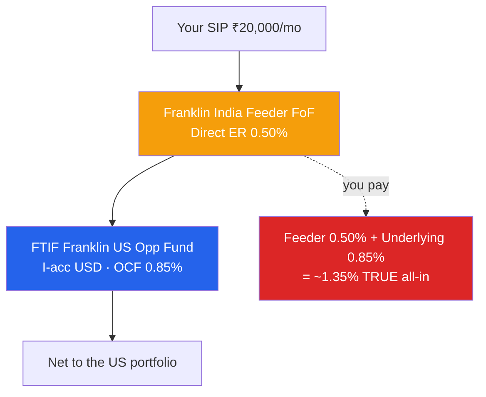
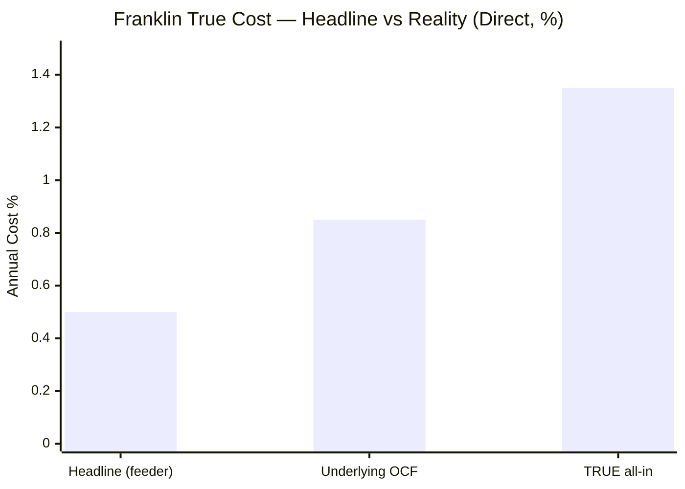
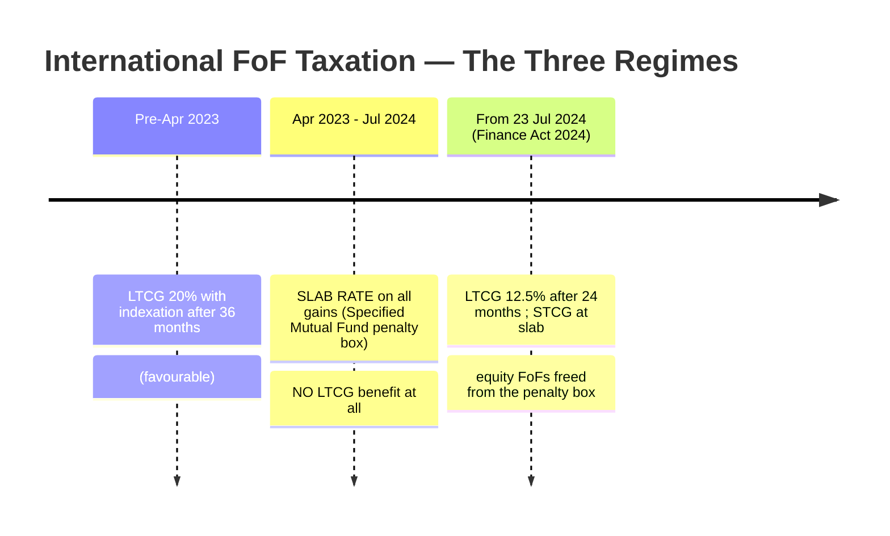
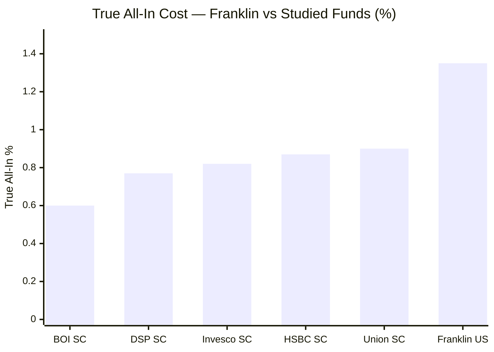
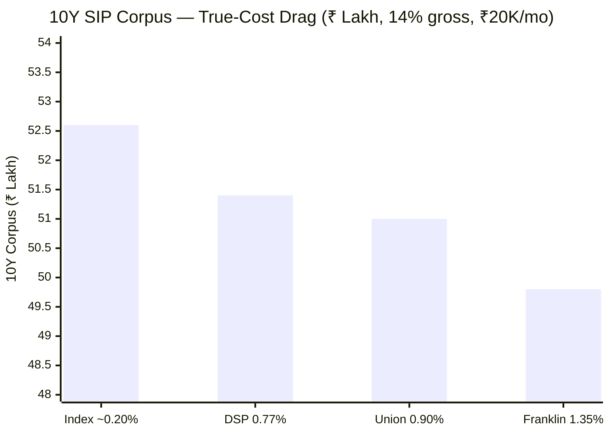
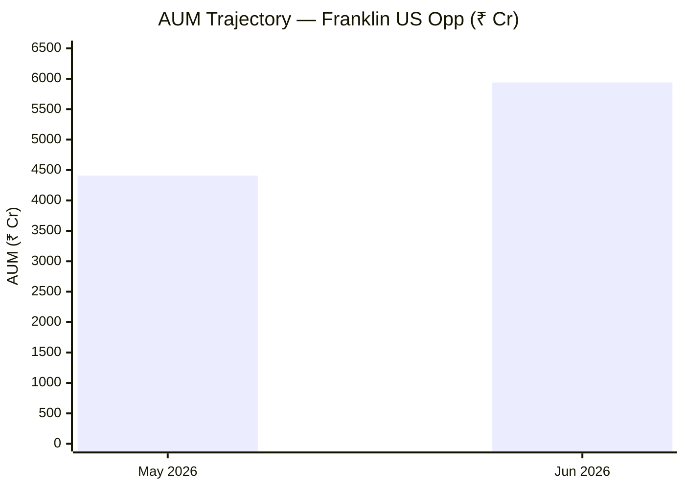
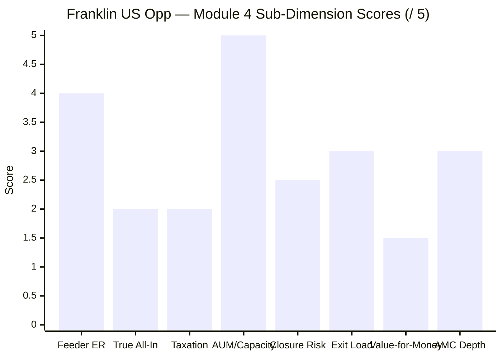

# Module 4: Cost & AUM / Structure — Franklin U.S. Opportunities Equity Active FOF

*Sources: Underlying I-acc USD factsheet (FTIF Franklin U.S. Opportunities Fund, LU0195948665, OCF as of 31-May-2026) | Tickertape screening (May-2026) | Value Research (Direct & Regular plans) | freefincal | Franklin Templeton India | AMFI | Finance (No.2) Act 2024 / SEBI TER & overseas-investment circulars | web research, June 2026. Benchmark = Russell 3000 Growth TRI.*

---

## Module 4 Score: ~2.8 / 5

Franklin's cost-and-structure profile is the study's clearest case of **"a headline that hides the real price."** The disclosed Direct ER of **0.50%** — which the screening called "the cheapest active US route" — is **feeder-only**; it omits the **0.85% Ongoing Charges of the underlying FTIF fund** the feeder buys. The **true all-in cost is ~1.35%** (Direct) — roughly **2.7× the headline**, and the *highest true cost of any fund in either study*. On top of that sit two penalties no domestic fund carries: a **tax regime that is materially worse than domestic equity** (12.5% LTCG only after **24 months**, no ₹1.25 lakh exemption, slab-rate STCG), and a **subscription-closure risk** from the SEBI overseas cap. The one genuine structural strength is the **absence of any capacity constraint** — the underlying holds deeply liquid US large-caps, so AUM can grow freely (the opposite of a small-cap fund). But the decisive M4 fact is value-for-money: **you pay ~1.35% + a tax drag to own a 3rd-quartile fund that lags its own index** (Modules 1, 4-benchmark, 3). The cost is not egregious in absolute terms for active global equity — it is poor *relative to what it buys*.

---

## Raw Data (Compiled Across Sources)

| Metric | Value | Source | Notes |
|--------|-------|--------|-------|
| **Feeder ER (Direct)** | **0.46–0.50%** | Tickertape / VRO | The disclosed headline — *feeder only* |
| **Feeder ER (Regular)** | **1.47%** | VRO | — |
| **Underlying OCF (I-acc USD)** | **0.85%** | FTIF factsheet | The hidden second layer |
| **⭐ True all-in (Direct)** | **~1.35%** | Computed (0.50 + 0.85) | **Highest true cost in either study** |
| **⭐ True all-in (Regular)** | **~2.32%** | Computed (1.47 + 0.85) | — |
| Direct–Regular gap (feeder) | **~0.97%** | Computed | Moderate |
| Exit load | **1% within 1 year** | VRO / Tickertape | Standard — *not* investor-friendly |
| AUM (fund) | **₹5,190–5,939 Cr** (growing) | VRO (May→Jun) | No capacity constraint |
| Underlying fund size | **US $7.0 Billion** | FTIF factsheet | Large, liquid |
| Min SIP / Lumpsum | **₹500 / ₹1,000** | VRO | Accessible |
| Feeder manager | **Sandeep Manam** (operational) | AMC | Stock decisions = underlying (M5) |
| Franklin Templeton India AMC AUM | **~₹1.04 lakh Cr** | Derived (Manam 22-scheme total) | Mid-tier AMC (post-2020 debt scar) |
| **Taxation (FY2025-26)** | **LTCG 12.5% after 24 mo; no ₹1.25L exemption; STCG at slab** | Finance (No.2) Act 2024 | Worse than domestic equity |
| Underlying inception | **Apr 2000 (master); India feeder Jan 2013 (Direct)** | FTIF / MFAPI | — |
| SIP status | **OPEN** (one of ~10 in universe) | screening | But closure risk live |
| Morningstar quartile (underlying) | **3rd** (1/3/5Y) | FTIF factsheet | The cost buys below-median output |

> **The headline correction (carried forward to the screening docs).** The Stage-1/README description of Franklin as *"the cheapest active US at 0.50%"* is **misleading**: 0.50% is the feeder ER only. The **true all-in is ~1.35%** (Direct). This module supersedes that characterisation.

---

## ⭐ The Double-Layer Cost Structure — Where the Real Price Hides *(international-specific)*

A feeder fund charges its *own* expense ratio **and** bears the expense ratio of the underlying fund it buys (struck inside the underlying's NAV). The Indian investor pays both:

| Layer | Direct | Regular | What it pays for |
|---|---|---|---|
| Feeder ER (India) | 0.50% | 1.47% | The Indian wrapper, currency, compliance |
| + Underlying OCF (I-acc) | 0.85% | 0.85% | Bowers' team + the SICAV's running costs |
| **= True all-in** | **~1.35%** | **~2.32%** | The actual annual drag on your money |

**The interpretive point:** Franklin's headline 0.50% is genuinely one of the lowest *feeder* ERs available — but the *underlying* OCF (0.85%) is where most of the cost lives, and it is invisible on every Indian platform. The true ~1.35% is **higher than every small-cap fund's true all-in** (Union ~0.90%, DSP ~0.77%, BOI ~0.60%) — the structural cost of the FoF architecture. (Mitigant: the underlying uses the *institutional* I-acc class at 0.85%, far below the retail A-class at 1.82% — Franklin passes the institutional rate through, so the double-layer is as cheap as this structure gets.)

---

## ⭐ Taxation of an International FoF — The Penalty Beyond the ER *(international-specific)*

For an Indian investor, the *tax* treatment is as material as the ER — and international FoFs are **taxed worse than domestic equity funds** on three counts. The rules also changed twice in three years, so the *current* (FY2025-26) regime must be stated precisely.

| Feature | Franklin (intl FoF, FY2025-26) | A domestic equity fund |
|---|---|---|
| LTCG rate | 12.5% | 12.5% |
| **LTCG holding threshold** | **24 months** | 12 months |
| **₹1.25 lakh annual exemption** | **No** ❌ | Yes ✅ |
| STCG (under threshold) | **Slab rate (up to ~30%+)** | 20% flat |

**Three structural tax disadvantages:**
1. **24-month LTCG clock, not 12.** For a SIP, *each instalment* must age two full years to qualify for the 12.5% rate — double the domestic-equity wait.
2. **No ₹1.25 lakh annual exemption.** Domestic equity gains are tax-free up to ₹1.25L/year; here, *every rupee* of gain is taxed.
3. **STCG at slab.** Gains on units held under 24 months are taxed at your marginal rate (potentially 30%+), not the flat 20% that domestic equity STCG enjoys.

> **The one piece of good news:** the **Finance (No.2) Act 2024** (effective 23-Jul-2024) **redefined "specified mutual fund"** to mean *debt* funds only — rescuing equity FoFs from the FY2024-25 "penalty box," where they were taxed *entirely* at slab rate with no LTCG benefit. So the regime *improved* materially. But Franklin remains **meaningfully more tax-inefficient than holding the same exposure in a domestic-equity wrapper** — a real, recurring drag on top of the ~1.35% ER. For a 10-year SIP, plan to hold every instalment well past 24 months.

---

## ⭐ Cost vs the Index Alternative — Paying 1.35% to Lag a 0.20% Index *(international-specific)*

The decisive value question. Franklin's ~1.35% all-in buys a **3rd-quartile fund that underperforms its benchmark** (Module 1; underlying lags Russell 3000 Growth by ~6.6%/yr over 5Y even at institutional fees). The natural alternative — a passive NASDAQ-100 or S&P-500 feeder at **~0.19–0.20%** — is *currently closed to SIP* under the SEBI cap, so the *live* choice today is "Franklin open vs nothing." But the cost-value verdict is stark:

| | Franklin US Opp (active) | Passive NASDAQ/S&P feeder |
|---|---|---|
| True all-in cost | **~1.35%** | ~0.19–0.20% |
| 5Y result vs index | **Lags (3rd-quartile)** | Matches index |
| Tax | 24mo LTCG, slab STCG | Same (also an FoF) |
| SIP open today? | **Yes** | No (SEBI cap) |

**You pay ~7× the cost of an index fund for a product that *underperforms* the index.** When the passive lane reopens, Franklin's cost case collapses entirely. This is the Module 4 expression of the running "just buy the index" finding — and it is the single most important cost takeaway.

---

## Expense Ratio & Direct–Regular Gap

> Franklin's ~1.35% true all-in is the highest of any fund in either study — the FoF double-layer structural premium.

**Direct vs Regular:** the feeder D–R gap is **~0.97%** (1.47% − 0.50%); on a true-all-in basis the gap is the same ~0.97% (both plans share the 0.85% underlying). The Regular plan's ~2.32% all-in is punishing — **go Direct** (saves ~0.97%/yr ≈ ~₹3–4L over a 10-year ₹20K SIP). Direct is available commission-free on MF Central, Zerodha Coin, Kuvera, Groww, INDmoney, and franklintempletonindia.com.

---

## 10-Year SIP Cost Simulation — True-All-In Drag

**Methodology:** 14% gross INR CAGR assumed (a through-cycle US-growth-in-INR figure); Net = gross − true all-in; ₹20,000/month for 10 years (₹24L principal). Illustrative; the *relative* gaps are the point.

| Vehicle | True all-in | Net CAGR | 10Y Corpus | vs Franklin |
|---|---|---|---|---|
| (Hypothetical) passive index | ~0.20% | 13.80% | ~₹52.6L | **+₹2.8L** |
| DSP SmallCap (reference) | 0.77% | 13.23% | ~₹51.4L | +₹1.6L |
| Union SmallCap (reference) | 0.90% | 13.10% | ~₹51.0L | +₹1.2L |
| **Franklin US Opp** | **~1.35%** | **12.65%** | **~₹49.8L** | — |

**On identical gross returns, Franklin's ~1.35% all-in costs ~₹2.8L vs a passive index over a 10-year ₹20K SIP** — *before* the additional tax drag (24-month clock + no exemption), which widens the gap further. And the simulation *flatters* Franklin by assuming equal gross returns; in reality it has *lagged* the index gross (Module 1), so the real-world shortfall is larger still.

---

## AUM & Capacity — No Constraint (the Structural Strength)

Unlike a small-cap fund (where AUM growth chokes the strategy), Franklin faces **no capacity constraint**: the underlying invests in the **most liquid equities on earth** (Apple, Nvidia, Microsoft) and the master fund is $7.0bn. AUM growth from ₹4,408 Cr → ₹5,939 Cr in a month is *positive* (inflows into one of the few open international funds) with **zero execution penalty**. This is a genuine M4 strength and the clean inverse of the small-cap AUM-ceiling problem. The only AUM-adjacent risk is **closure** (next section), not deployment.

---

## ⭐ Closure / SEBI Overseas-Cap Risk — The Structural Continuity Threat *(international-specific)*

The defining structural risk of the international sleeve (Module-level, from the screening): the industry-wide **US $7bn overseas-investment cap.** Franklin is currently **open to SIP** — one of only ~10 international equity funds still accepting fresh money — *because* it had headroom while the passive lane (which buys overseas ETFs, hitting the tighter $1bn sub-limit) closed. But:

| Risk | Detail |
|---|---|
| Subscription pause | A fresh industry breach of the cap could force Franklin to **stop accepting SIPs mid-plan** — a real disruption to a 10-year commitment |
| Lumpsum-only fallback | In past breaches, AMCs paused SIPs/lumpsums entirely until RBI/SEBI reset the limit |
| No investor control | The trigger is *industry-wide flows*, nothing the fund or investor controls |

**This is a genuine cost-adjacent risk no domestic fund carries:** the *continuity* of your SIP depends on a regulatory cap, not on the fund's merits. It also means the "Franklin is open" advantage (the reason it survived screening) is **not permanent** — and it is the very mechanism keeping the cheaper passive alternative shut. Monitor RBI/SEBI overseas-limit notices.

---

## The AMC — Franklin Templeton India (the 2020 Debt Scar)

| Dimension | Franklin Templeton India |
|---|---|
| AMC total AUM | ~₹1.04 lakh Cr (mid-tier) |
| Global parent | Franklin Resources (US$1.5T+ global manager) — deep, credible |
| Underlying-fund pedigree | FTIF SICAV, 26-year record, Franklin Equity Group | 
| **Governance overhang** | **2020 winding-up of 6 Indian debt schemes** (₹25,000 Cr frozen) — a major Indian-market trust scar |

The **global** Franklin Templeton is a deep, world-class equity house (the underlying is run by a 19-year-tenured San Mateo team — Module 5). The **Indian** AMC, however, carries the **2020 debt-fund debacle** — the abrupt winding-up of six fixed-income schemes that froze ~₹25,000 Cr of investor money and drew SEBI penalties. That scar is on the *debt* side, not this equity feeder, and is assessed fully in Module 6 — but it tempers the "trusted global brand" comfort at the *Indian* entity level.

---

## 6-Fund Cost & Structure Comparison

| Metric | **Franklin US** | Union SC | BOI SC | DSP SC |
|--------|-----------------|----------|--------|--------|
| Headline Direct ER | **0.50%** | 0.81% | 0.48% | 0.64% |
| **True all-in** | **~1.35% (highest)** | ~0.90% | ~0.60% | ~0.77% |
| Direct–Regular gap | ~0.97% | 0.93% | 1.58% | 1.03% |
| Exit load | 1% / 365d | **1% / 15d (best)** | 1%/365d | 1%/365d |
| Taxation | **24mo LTCG, no exemption, slab STCG ⚠️** | 12mo + ₹1.25L | 12mo + ₹1.25L | 12mo + ₹1.25L |
| AUM constraint | **None (good)** | none (good) | none (good) | approaching |
| Closure risk | **Yes (SEBI cap) ⚠️** | no | no | no |
| Cost buys… | **3rd-quartile / index-lag ⚠️** | best down-capture | best IR | flow-discipline |
| M4 Score | **~2.8** | ~3.5 | 3.9 | 3.7 |

**Key observations:**
1. **Franklin has the highest true cost of any fund studied** — the FoF double-layer (~1.35%).
2. **It is the only fund that is tax-disadvantaged** (24-month LTCG, no exemption) and the **only one with closure risk.**
3. **Its one structural win is capacity** — no AUM ceiling (the inverse of small-cap).
4. **The cost buys below-benchmark output** — the worst value-for-money in either study.

---

## Points For / Points Against — Cost & Structure

### ✅ Points For
1. **Low *feeder* ER (0.50%)** — the Indian wrapper itself is cheap; the institutional underlying class is passed through
2. **No capacity constraint** — deeply liquid US large-caps; AUM can grow freely (the inverse of small-cap)
3. **Institutional underlying class (0.85% OCF)** — far below the retail 1.82%; the double-layer is as cheap as this structure allows
4. **Accessible minimums** (₹500 SIP / ₹1,000 lumpsum) and a global-parent pedigree
5. **Tax regime improved** (Finance Act 2024 freed equity FoFs from the FY2024-25 slab-only penalty box)
6. **Currently open to SIP** — one of the few investable international funds today

### ❌ Points Against
1. **⭐ Highest true all-in of either study (~1.35%)** — the headline 0.50% hides the 0.85% underlying OCF
2. **⭐ Tax-disadvantaged vs domestic equity** — 24-month LTCG clock, no ₹1.25L exemption, slab-rate STCG
3. **⭐ The cost buys a 3rd-quartile, index-lagging fund** — worst value-for-money in either study
4. **Closure / SEBI-cap risk** — SIP continuity hostage to an industry-wide regulatory limit
5. **Standard exit load** (1%/365d) — no investor-friendly flexibility
6. **Indian-AMC governance scar** (2020 debt winding-up) — tempers the trusted-brand comfort (M6)
7. **Regular plan punishing** (~2.32% all-in) — though Direct mitigates this

---

## Module 4 Scorecard

| Sub-Dimension | Score (1–5) | Reasoning |
|---|---|---|
| Feeder ER competitiveness | **4.0** | 0.50% — genuinely low at the wrapper level |
| **True all-in cost** | **2.0** | ~1.35% — highest of either study (the double-layer) |
| **Taxation** | **2.0** | 24-mo LTCG, no exemption, slab STCG — worse than domestic equity |
| AUM / capacity | **5.0** | No constraint; liquid underlying; AUM grows freely |
| Closure / continuity risk | **2.5** | SEBI-cap closure threat to SIP continuity |
| Exit load | **3.0** | 1%/365d — standard, not friendly |
| **Value-for-money** | **1.5** | ~1.35% + tax drag to own a 3rd-quartile, index-lagging fund |
| AMC institutional depth | **3.0** | World-class global parent; Indian-AMC 2020 debt scar |
| **Module 4 Overall** | **~2.8 / 5** | **A misleadingly cheap headline (0.50% feeder) hiding the highest true cost of either study (~1.35% all-in, once the 0.85% underlying OCF is added) — compounded by a tax regime worse than domestic equity (24-month LTCG, no exemption) and a SEBI-cap closure risk. Its one real strength is the absence of any capacity constraint. But the core M4 verdict is value: you pay the most, plus a tax penalty, for a fund that lags its own index — the worst cost-for-output in either study.** |

---

## Comparative Module 4 Scores

| Fund | M4 Score | Cost/Structure One-Line |
|------|----------|-------------------------|
| BOI Small Cap | 3.9/5 | Cheap + nimble |
| DSP Small Cap | 3.7/5 | Flow-discipline + low turnover; mid ER |
| Union Small Cap | ~3.5/5 | Nimble + best exit load; pricey ER |
| Bandhan Small Cap | ~3.3/5 | Cheapest ER; AUM-constrained |
| HSBC Small Cap | 3.2/5 | Narrow D-R gap; poor true all-in |
| Invesco Small Cap | ~3.1/5 | Decent ER; lower AMC depth |
| **Franklin US Opp** | **~2.8/5** | **Highest true all-in (~1.35%) + tax-disadvantaged + closure risk; no capacity limit; poor value-for-output** |

**Franklin lands at the bottom of the cost rankings — ~2.8/5.** Not because its *feeder* ER is high (it is low), but because the **true all-in (the only number that matters) is the highest of either study**, the **taxation is uniquely punitive**, and — decisively — the cost buys a **below-benchmark output**. The small-cap funds' costs at least bought genuine edges (down-capture, IR, flow-discipline); Franklin's buys a structural index-lag. Only its no-capacity-constraint strength keeps it from scoring lower.

---

## SIP Implication

For a ₹20,000/month international sleeve, Module 4 delivers the **most negative single finding of Franklin's study so far**: it is the **most expensive and most tax-disadvantaged fund** you have examined, and the cost buys a below-benchmark result.

**What you actually pay:** ~**1.35% all-in** every year (Direct) — the 0.50% feeder ER *plus* the 0.85% underlying OCF that no Indian platform shows you. That is ~₹2.8L more than a passive index over a 10-year ₹20K SIP on equal gross returns — and the gross returns are *not* equal (Franklin lags). On top sits a **tax penalty**: each SIP instalment needs **24 months** (not 12) to reach the 12.5% LTCG rate, with **no ₹1.25L annual exemption** and slab-rate STCG below the threshold. And your SIP's *continuity* is hostage to the **SEBI overseas cap** — a fresh breach could pause subscriptions mid-plan.

**What you get for it:** the *one* genuine structural strength — **no capacity constraint** (AUM can grow freely on a liquid US large-cap underlying) — and a cheap *feeder* layer on a credible global parent. But the core value verdict is poor: you pay the highest true cost in either study, plus a tax drag, to own a 3rd-quartile fund that underperforms its own index.

**What to monitor:**
1. **The underlying OCF** — if Franklin moves the feeder to a cheaper underlying class, the all-in falls (watch the factsheet).
2. **The SEBI overseas cap** — RBI/SEBI notices; a breach pauses your SIP.
3. **The passive lane reopening** — the moment a NASDAQ/S&P feeder reopens, Franklin's ~1.35% has no cost defence.
4. **Holding period discipline** — hold every instalment past 24 months to avoid slab-rate STCG.

**SIP verdict:** On cost-and-structure grounds alone, Franklin is a **weak proposition** — expensive (true ~1.35%), tax-disadvantaged, closure-exposed, and poor value for a below-benchmark output. Its capacity-freedom is real but secondary. If an international sleeve is pursued, the cost math argues for the **cheapest available route** (a passive index feeder when reopened, ~0.20%) over Franklin's double-layered active premium.

---

## One-Line Verdict

> **Franklin's "cheapest active US at 0.50%" is a feeder-only illusion: the true all-in is ~1.35% (0.50% feeder + 0.85% underlying OCF) — the highest cost in either study — compounded by a tax regime worse than domestic equity (24-month LTCG, no ₹1.25L exemption, slab STCG) and a SEBI-cap closure risk, all to own a 3rd-quartile fund that lags its own index. Its sole structural win is the absence of any capacity constraint. Module 4: ~2.8/5 — the worst cost-for-output in either study.**

---

*Module 4 completed: June 2026 | Cost & AUM / Structure | True all-in (~1.35% Direct) = feeder ER 0.50% + FTIF I-acc OCF 0.85% | Taxation per Finance (No.2) Act 2024 (FY2025-26): 12.5% LTCG after 24mo, no exemption, slab STCG | Closure risk = SEBI US$7bn overseas cap | Benchmark = Russell 3000 Growth TRI | Corrects the screening "cheapest active US 0.50%" framing | Provisional M4 Score: ~2.8/5 (subject to M6 AMC)*

*Next: [Module 5 — Fund Manager Quality](module5_manager.md)*
