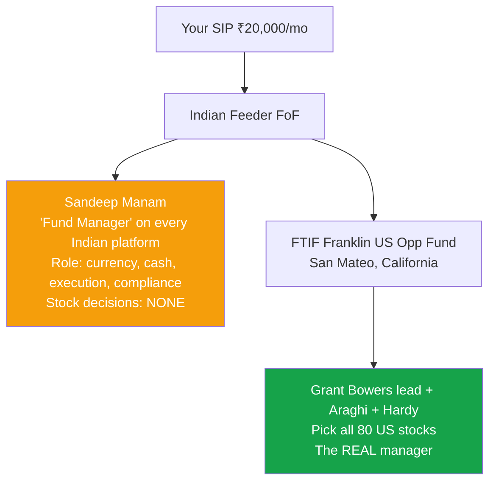
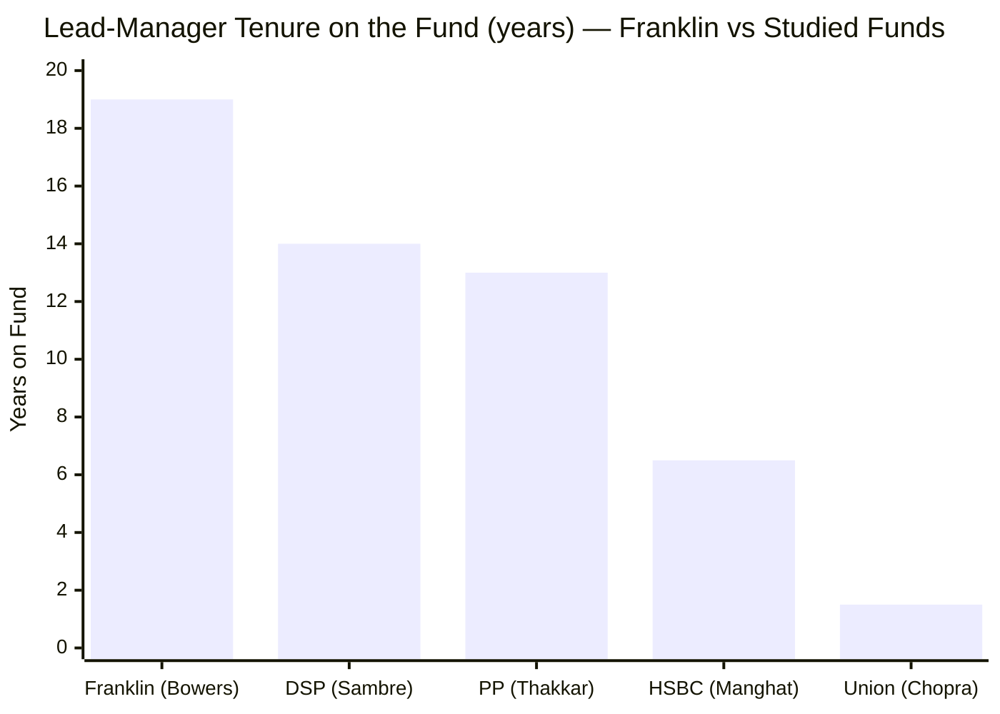
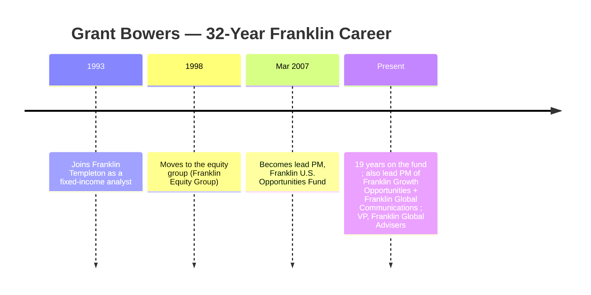
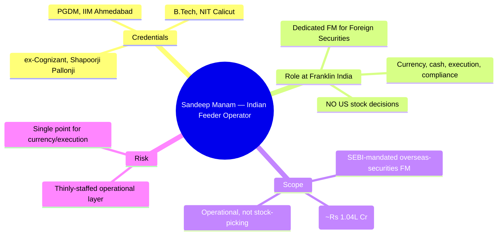
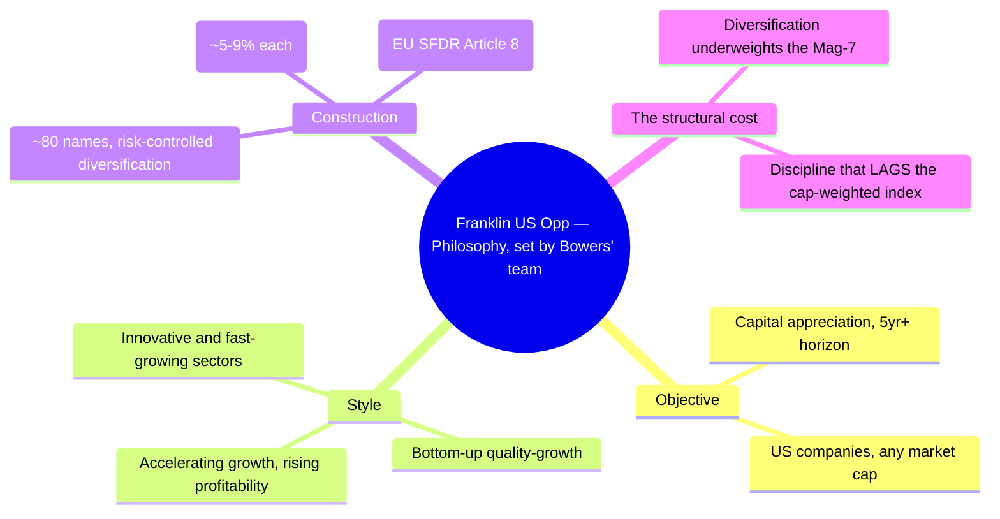
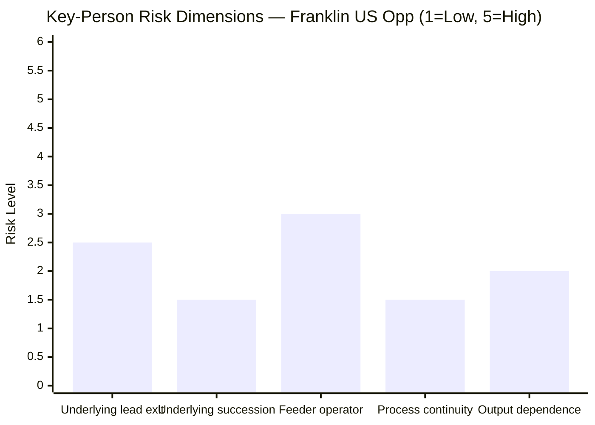
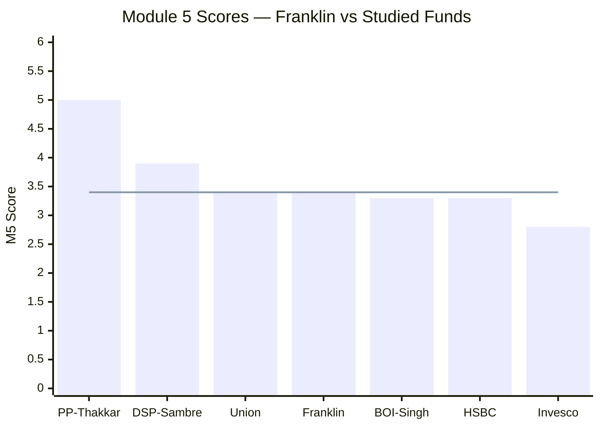
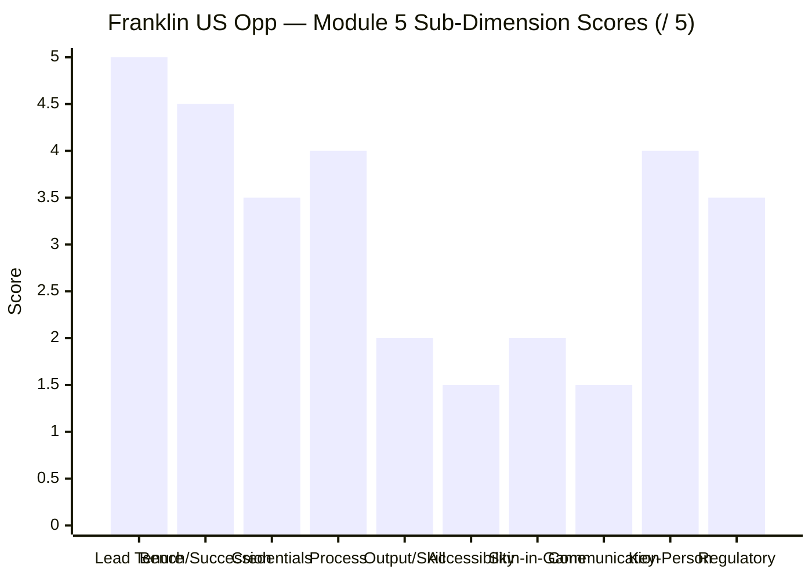

# Module 5: Fund Manager Quality — Franklin U.S. Opportunities Equity Active FOF

*Sources: FTIF Franklin U.S. Opportunities Fund factsheet (I-acc USD, 31-May-2026 — portfolio-management team, tenure) | Trustnet (Grant Bowers tenure & career record) | Franklin Templeton profiles | Finalyca / Dezerv / LinkedIn (Sandeep Manam) | Morningstar (underlying quartile ranking) | web research, June 2026. Benchmark = Russell 3000 Growth TRI.*

---

## Module 5 Score: ~3.4 / 5 — The Stability Paradox

Module 5 is Franklin's **strongest module — and its most ironic.** The team that actually runs the money (offshore, in San Mateo) is the **most stable, experienced, and credentialed of any fund in either study**: lead manager **Grant Bowers has run this exact fund for ~19 years**, supported by a deep, multi-decade, CFA-credentialed bench (Araghi 22 years, Hardy 16). There is **no carousel, no key-person void, no attribution puzzle** — the opposite of Union's "carousel that wasn't" or BOI's fled architects. On *continuity and pedigree*, no India fund comes close.

Yet that excellence is **heavily discounted by three structural facts.** First, the output lags: despite the stability, the underlying is a **3rd-quartile fund that underperforms its benchmark** over 1/3/5Y and 21 years (Modules 1, 4) — a *great craftsman producing a below-median relative result*, because his disciplined, diversified, risk-controlled style structurally trails a Magnificent-Seven-led cap-weighted index (Module 3). Second, the **Indian investor is twice-removed**: you cannot access Bowers, and the *nominal* Indian "fund manager" (Sandeep Manam) makes **zero stock decisions** — his role is operational (currency, execution, compliance). Third, the **Indian AMC carries the 2020 debt-fund scar** (Module 6). The result: a genuinely high-quality, supremely stable manager — whom you can't reach, producing a result that lags the index. Excellence in the engine, friction in the wrapper, mediocrity in the output.

---

## ⭐ The Two-Layer Manager Structure — Who Actually Manages Your Money *(international-specific — read first)*

The single most important Module 5 fact, with no parallel in any domestic fund: **the person Indian platforms call the "fund manager" does not pick the stocks.**

| Layer | Who | What they decide | Accessible to you? |
|---|---|---|---|
| **Underlying (the engine)** | **Grant Bowers + Sara Araghi, CFA + Anthony Hardy, CFA** | Every stock, every weight | **No** (offshore SICAV) |
| **Feeder (the wrapper)** | **Sandeep Manam** | Currency hedging, cash, subscriptions, compliance | Nominally "your" manager — but **no stock role** |

**The implication for the module:** "manager quality" must be judged at the **underlying** level (Bowers' team), because that is who invests your money. The Indian "manager" is an **operational function**, not a stock-picker — so the usual Module 5 questions (tenure, skill, philosophy, alpha) all apply to a team **you can neither access nor influence**, and the listed Indian manager's competence is relevant only for *operational* (currency/execution) integrity, not for returns.

---

## What Module 5 Is Really Asking — Twice Over

For a domestic fund, Module 5 asks: *who runs the machine, why trust them, and what happens if they leave?* For an international feeder, it asks this **twice** — once of the **underlying team** (the real driver of returns) and once of the **feeder operator** (the driver of operational integrity) — and adds a third, structural question unique to the feeder format: **does it matter how good the manager is, if you can't access them and the output lags the index anyway?** The honest answers: the underlying team is excellent and stable; the feeder operator is competent but a non-decision-maker; and the third question is the uncomfortable one — Bowers' quality is *real but largely irrelevant to the value case*, because his disciplined process structurally underperforms the index a cheaper passive feeder would simply track.

---

## ⭐ The Stability Paradox — Best Continuity in Either Study, Yet the Output Lags *(international-specific)*

This is the defining tension of the module.

| | The strength | The discount |
|---|---|---|
| **Tenure** | Bowers ~19 years on this fund — longest in either study | — |
| **Team** | Deep, multi-decade (Araghi 22y, Hardy 16y); no carousel | — |
| **Process** | Disciplined, consistent, risk-controlled quality-growth | *Precisely what causes the index-lag* (M3) |
| **Output** | — | **3rd-quartile; lags Russell 3000 Growth ~6.6%/yr over 5Y** (M1/M4) |
| **Access** | — | Offshore — you cannot reach or influence him |

**The paradox resolved:** Bowers is a genuinely high-quality manager *as a craftsman* — experienced, disciplined, stable, clean. But "manager quality" in the sense that matters to an investor — **does the manager beat what you could own cheaply instead?** — is **weak**, and *for a structural reason that is not incompetence*: his risk-controlled diversification (80 names, capped mega-cap weights, valuation discipline, a ~12-point underweight to the Magnificent Seven — Module 3) is **exactly what trails a cap-weighted growth index in a mega-cap-led regime.** A *worse-disciplined, more-concentrated* manager would have *beaten* him over this window. **This is the cleanest caution in the whole study against the reflex "19-year tenured manager = good fund":** here, two decades of stable, skilled, disciplined management have produced a *below-benchmark* result. Tenure is not alpha.

---

## Manager Profile: Grant Bowers — The 19-Year Lead

**Who is Grant Bowers?** A **B.A. in economics (UC Davis), US Army veteran**, who joined Franklin Templeton in **1993** as a fixed-income analyst, moved to equities in **1998**, and has been **lead portfolio manager of the Franklin U.S. Opportunities Fund since March 2007 — ~19 years.** He is a Vice President of Franklin Global Advisers and lead PM of three growth funds (US Opportunities, Growth Opportunities, Global Communications) — a senior, trusted figure in the Franklin Equity Group with **32 years at the firm**.

**Why he matters:** Bowers *is* the fund. His ~19-year tenure on this exact mandate is the **longest single-fund lead tenure in either study** — longer than Sambre (14y) or Thakkar (13y). His career annualized return (~+8.6%/yr over 25.7 years, per Trustnet) and a 10-year cumulative that modestly beat his peer composite (+282.6% vs +259.5%) mark him as a **competent, above-peer (but below-index) growth manager.** The defining caveat is the Module-3 finding: his discipline — diversification, risk control, valuation sensitivity — is genuine skill that nonetheless **structurally lags the cap-weighted growth index** in the current mega-cap regime. He is good at his craft; his craft's *relative* output is below-median.

---

## The Underlying Team — Araghi & Hardy (a Genuine Bench)

| Manager | Role | At firm | Experience | Credential |
|---|---|---|---|---|
| **Grant Bowers** | Lead PM (since 2007) | 32 yrs | 32 yrs | B.A. Economics |
| **Sara Araghi** | Co-PM; Co-Director of Equity Research | 22 yrs | 22 yrs | **CFA** |
| **Anthony J. Hardy** | Co-PM (newest) | 10 yrs | 16 yrs | **CFA** |

This is a **deep, stable, multi-decade team** — two CFA charterholders supporting a 19-year lead, embedded in the broader Franklin Equity Group's analyst pool. Araghi's seniority (Co-Director of Equity Research) means the **succession path is clear and internal** — if Bowers retired, Araghi is a credible, long-tenured successor (the inverse of DSP's Sambre-dependency or Union's first-time leads). **Key-person risk at the underlying level is genuinely low** — the bench is real, credentialed, and continuous. (Contrast Union, where the *bench* was the strength but the *leads* were unproven first-timers; here both the lead *and* the bench are seasoned.)

---

## ⭐ The Feeder Operator — Sandeep Manam (Competent, but a Non-Decision-Maker) *(international-specific)*

**Who is Sandeep Manam?** An **IIM-Ahmedabad PGDM + B.Tech (NIT Calicut)**, Franklin Templeton India's **"Dedicated Fund Manager for investment in Foreign Securities."** He is listed on **22 Franklin schemes (~₹1.04 lakh Cr)** — but that breadth is *not* 22 stock-picking mandates: SEBI requires a dedicated overseas-securities FM on *every* scheme with a foreign sleeve, and Manam fills that compliance/operational role across the AMC.

**What he actually does (and doesn't):** Manam manages **currency, cash, the mechanics of subscribing into the underlying SICAV, and regulatory compliance** — he does **not** select a single US stock (that is Bowers' team). For the investor, this means:
- **His competence is relevant only operationally** — clean currency/execution/compliance, not returns. On that narrow remit, his IIM-A pedigree and dedicated-overseas-FM role are reassuring.
- **He is a thin operational layer** — a single named operator across 22 foreign-exposed schemes is a minor operational key-person consideration (though the underlying SICAV's robustness backstops it).
- **The platform listing is misleading** — every Indian site names Manam as "the fund manager," which obscures that your returns are made by an offshore team you've never heard of.

---

## Investment Philosophy & Process — Disciplined Quality-Growth

The process is a **clear, consistent, disciplined quality-growth approach**: bottom-up selection of US companies with accelerating growth and rising profitability, held with risk control and valuation discipline across ~80 names, over a 5-year+ horizon, with an ESG overlay (Article 8 SFDR). **The philosophy is genuinely high-quality and well-articulated** — and it has been *stable for 19 years* (no style drift, no chasing fads).

**But the philosophy is also the problem.** Its defining virtues — diversification, risk control, capped mega-cap weights, valuation sensitivity — are *exactly* what cause the benchmark-lag (Module 3): in a market where the cap-weighted index is ~50% concentrated in the Magnificent Seven, a disciplined manager who *won't* over-concentrate in them **must** trail. Bowers' process is admirable risk management and poor relative performance *simultaneously*, and for the same reason. **This is a process you would praise in a textbook and underperform with in this decade.**

---

## Credentials in Context

| Manager / Role | Qualification | Interpretation |
|---|---|---|
| **Grant Bowers (Franklin, lead)** | **B.A. Economics; 32Y experience** | Deep generalist growth experience; no CFA/CA, but 19Y on-fund tenure |
| **Sara Araghi (Franklin, co-PM)** | **CFA; Co-Director of Research** | Credentialed; credible internal successor |
| **Anthony Hardy (Franklin, co-PM)** | **CFA; 16Y experience** | Credentialed bench |
| **Sandeep Manam (feeder operator)** | **IIM-A PGDM + B.Tech** | Strong, but operational role only |
| Vinit Sambre (DSP) | FCA, 14Y | Forensic + long tenure (the gold standard) |
| Rajeev Thakkar (PP) | FCA, 13Y | Forensic + communicative |

**Franklin's *team* credential stack is solid** — two CFAs supporting a deeply experienced lead — though it lacks the forensic-accounting (CA/FCA) depth that anchors the best India small-cap teams. That gap matters *less* here than in small-cap: Bowers buys **mega-cap US franchises** (Apple, Microsoft, Nvidia) where fraud/accounting-mirage risk — the thing CAs guard against — is minimal. For a US large-cap growth mandate, deep growth-investing experience (which Bowers has in abundance) is the more relevant credential than forensic accounting.

---

## Manager Skill Assessment — Does 19 Years of Tenure Equal Skill Here?

The central skill question, answered honestly:

| Test of skill | Result | Verdict |
|---|---|---|
| Tenure / stability | 19Y lead, deep bench, no carousel | ✅ **Excellent** |
| Process discipline | Consistent quality-growth, 19Y, no drift | ✅ **Excellent** |
| vs peer group | 10Y cumulative beat peer composite (+282.6% vs +259.5%) | 🟡 **Above-peer** |
| **vs own benchmark** | Lags Russell 3000 Growth over 1/3/5Y & 21Y | ❌ **Below-index** |
| **Morningstar quartile** | **3rd quartile** (1/3/5Y) | ❌ **Below-median** |
| Down-protection (2022) | Fell −38% (worse than a broad S&P 500 fund) | ❌ **Weak** (M2) |

**The synthesis:** Bowers clears every test of *craftsmanship* (tenure, discipline, above-peer) but fails the tests of *alpha* (below-index, 3rd-quartile, weak down-capture). He is a **skilled manager whose skill does not translate into out-performance** — partly genuine (active US large-growth is a hard, often-losing game vs the index) and partly structural (his diversified style can't win in a mega-cap regime). For Module 5 this is a *split verdict*: high marks for the manager's quality and stability; low marks for the *investor-relevant* question of whether that manager beats the cheap alternative. **He does not.**

---

## ⭐ Manager Accessibility & Translation Gap *(international-specific)*

A structural Module 5 deficiency unique to the feeder format: **the Indian investor is twice-removed from the decision-maker.**

| Channel | Domestic fund (e.g. PP) | Franklin US Opp |
|---|---|---|
| Hear the manager's thesis | Quarterly letters, interviews | **None reaches Indian unitholders** |
| Manager accountable to *you* | Directly (Indian unitholders) | **No — Bowers answers to the SICAV** |
| Nominal manager makes decisions | Yes | **No (Manam = operational)** |
| Style-drift / change disclosure | SID/SAI addenda | Underlying changes opaque to Indian investors |

**The consequence:** you are buying a manager you cannot hear, cannot hold accountable, and cannot vote against except by exiting the entire wrapper. The person who *is* accountable to you (Manam) doesn't make the investment decisions. **This is the weakest manager-accessibility setup of any fund studied** — a structural feature of feeders, not a fault of any individual, but a genuine governance/transparency deficit for a 10-year commitment. (Mitigant: the underlying is a 26-year-old, heavily-regulated UCITS SICAV with deep public disclosure — so the *information* exists, even if it doesn't flow to Indian unitholders through the Indian channel.)

---

## Key-Person Risk — Low at the Engine, Thin at the Wrapper

| Dimension | Assessment | Risk |
|---|---|---|
| Underlying lead (Bowers) exit | He is ~mid-50s; a multi-year horizon, but eventual | **Low-Med (2.5)** |
| Underlying succession | Araghi (CFA, 22Y, Co-Director Research) is a clear internal successor | **Low (1.5)** |
| Feeder operator (Manam) | Thinly-staffed operational layer across 22 schemes | **Med (3.0)** |
| Process continuity | 19Y-stable house style; institutional, not personal | **Low (1.5)** |
| Output dependence on the lead | The *style* (not Bowers personally) drives the result | **Low (2.0)** |

**Key-person risk is low where it matters (the engine) and modest where it doesn't (the wrapper).** The underlying team is deep and has a credible successor; the process is institutional and stable. The only mild concern is the thin Indian *operational* layer (one named overseas-securities FM across many schemes) — but the underlying SICAV's robustness backstops that. This is a **structurally low key-person profile** — better than any India fund studied on succession depth.

---

## Skin in the Game & Alignment

| Form | Franklin US Opp | Best-in-study (PP) |
|---|---|---|
| Underlying-team co-investment | Aligned to the SICAV (US/Lux), **not disclosed to Indian investors** | — |
| Feeder operator co-investment | Not disclosed | — |
| AMC alignment | Global parent fee-driven; Indian AMC post-debt-scar | Employees invest in own funds |

**Alignment is structurally weak for the Indian investor.** Bowers' incentives are tied to the Luxembourg SICAV and Franklin's global business, *not* to Indian unitholders' outcomes; the feeder operator's co-investment is undisclosed. There is no PP-style "all employees invest only in our own funds" alignment story. This is not a *red* flag (the global manager has reputational skin in the SICAV's performance) but it is a genuine *gap* versus the best-aligned domestic funds.

---

## Investor Communication — The Weakest of Any Fund Studied

| Communication form | Franklin US Opp (India) | DSP | PP |
|---|---|---|---|
| Quarterly letters to unitholders | **No** | No | **Yes** |
| Manager thesis reaching Indian investors | **None** | Moderate | High |
| Standalone philosophy document | Underlying prospectus (not India-facing) | Yes | Yes |
| Nominal manager communicates a stock view | **No (operational role)** | Yes | Yes |

**Franklin US Opp has the weakest investor-communication setup of any fund in either study** — a direct consequence of the two-layer structure. The decision-maker (Bowers) doesn't address Indian unitholders; the Indian "manager" (Manam) has no stock thesis to communicate. An Indian investor cannot, through the Indian channel, learn *why* the fund holds what it holds. (The underlying SICAV publishes detailed factsheets — the information exists globally — but it is not surfaced to Indian unitholders.)

---

## Regulatory / Record

| Entity | Issue | Character |
|---|---|---|
| Grant Bowers (personal) | None found | **Clean** |
| Sara Araghi / Anthony Hardy | None found | **Clean** |
| Sandeep Manam (personal) | None found | **Clean** |
| Franklin Templeton (global) | Clean global equity record | Strong |
| **Franklin Templeton India (AMC)** | **2020 winding-up of 6 debt schemes (~₹25,000 Cr frozen); SEBI penalties** | **Major Indian scar (debt-side) — see M6** |

**No regulatory issue against any manager** at either layer — the people are clean. But the **Indian AMC** carries the **2020 debt-fund debacle** — a serious trust scar (on the fixed-income side, not this equity feeder), reserved for full assessment in Module 6. The *manager-level* record is clean; the *Indian-institutional* record is not.

---

## Peer Manager Comparison

> Line = Franklin's M5 score (~3.4)

| Fund | Manager(s) | Tenure | Key Strength | Key Weakness | M5 |
|------|-----------|--------|-------------|--------------|----|
| PP FlexiCap | Thakkar | 13Y | FCA; letters; skin-in-game; accessible | Retirement horizon | 5.0 |
| DSP SmallCap | Sambre | 14Y | FCA; dedicated; flow discipline; positive alpha | No letters | 3.9 |
| **Franklin US Opp** | **Bowers (+Araghi, Hardy)** | **19Y** | **Longest tenure; deep stable bench; clear succession; clean** | **3rd-quartile output; inaccessible; nominal Indian mgr decides nothing** | **~3.4** |
| Union SmallCap | Chopra+Dharmshi | ~18mo | Retained desk; 2 CAs; veteran CIO | First-time leads | 3.4 |
| BOI SmallCap | Singh | 20mo | FlexiCap #2 proof | Carousel; 23 schemes | 3.3 |
| HSBC SmallCap | Manghat | 6.5Y | 29Y exp; COVID at scale | Benchmark-hug | 3.3 |
| Invesco SmallCap | Badshah | 7.5Y | Inception clarity | Severe AMC SEBI history | 2.8 |

**Franklin ties Union at ~3.4 — but for opposite reasons.** Union scores 3.4 on *institutional continuity despite junior leads*; Franklin scores 3.4 on a *world-class stable lead whose output lags and whom you can't access.* Franklin has **by far the best manager *stability*** (19Y vs everyone) and **succession depth** (Araghi) — it would score near DSP/PP on *continuity alone*. What drags it to 3.4 is the unique trio: **below-benchmark output** (the manager's quality doesn't reach your wallet), the **twice-removed structure** (you can't access the decision-maker; the nominal manager decides nothing), and the **weakest communication** of any fund. It sits below DSP (3.9) — whose long-tenured FCA *also delivers alpha and is accessible* — and well below PP's 5.0.

---

## Points For / Points Against — Fund Manager Quality

### ✅ Points For
1. **Longest single-fund lead tenure in either study** — Bowers ~19 years; utter stability, no carousel
2. **Deep, credentialed, multi-decade bench** — Araghi (CFA, 22Y, Co-Director Research) + Hardy (CFA, 16Y)
3. **Clear internal succession** — Araghi is a credible, long-tenured successor; lowest succession-void risk studied
4. **Disciplined, consistent 19-year process** — quality-growth, no style drift, ESG-aware
5. **Above-peer-group record** (10Y cumulative beat peer composite) — competent within the active universe
6. **Clean personal records** at both layers (Bowers, team, Manam)
7. **Competent, credentialed feeder operator** (Manam, IIM-A) for the operational remit
8. **Institutional process** — the style, not one person, drives the result; low output-dependence on the lead

### ❌ Points Against
1. **⭐ 3rd-quartile, benchmark-lagging output** — 19 years of skilled management has *not* beaten the index (M1/M4)
2. **⭐ The investor is twice-removed** — cannot access Bowers; the nominal Indian "manager" (Manam) makes no stock decisions
3. **The disciplined process structurally lags** the cap-weighted index in the mega-cap regime (M3) — quality that doesn't pay
4. **Weakest investor communication of any fund studied** — no manager thesis reaches Indian unitholders
5. **Alignment is to the SICAV, not to Indian investors** — no PP-style skin-in-game story
6. **No forensic (CA/FCA) credential** — less relevant for mega-cap US, but a stack gap vs the best India teams
7. **Thin Indian operational layer** — one overseas-securities FM across 22 schemes (mitigated by SICAV robustness)
8. **Indian-AMC governance scar** (2020 debt winding-up) shadows the institution (M6)

---

## Module 5 Scorecard

| Sub-Dimension | Score (1–5) | Reasoning |
|---|---|---|
| Lead tenure on fund | **5.0** | Bowers ~19 years — the longest in either study |
| Bench depth / succession | **4.5** | Araghi (CFA, 22Y) + Hardy; clear internal successor |
| Credentials | **3.5** | Two CFAs + deep experience; no forensic CA (less relevant for mega-cap US) |
| Process / philosophy | **4.0** | Disciplined, consistent, 19Y-stable quality-growth |
| **Output / demonstrated skill** | **2.0** | 3rd-quartile; lags benchmark 1/3/5/21Y — skill that doesn't beat the index |
| **Manager accessibility** | **1.5** | Twice-removed; nominal Indian manager decides nothing |
| Skin in the game / alignment | **2.0** | Aligned to the SICAV, not Indian investors; undisclosed |
| Investor communication | **1.5** | Weakest of any fund studied — no thesis reaches you |
| Key-person / succession risk | **4.0 (low risk)** | Deep bench; clear successor; institutional process |
| Regulatory / record | **3.5** | Clean managers; Indian-AMC 2020 debt scar shadows it (M6) |
| **Module 5 Overall** | **~3.4 / 5** | **The stability paradox: the most stable, experienced, deeply-benched manager team in either study (Bowers 19Y + Araghi + Hardy, clear succession, clean record, disciplined 19-year process) — whose excellence is heavily discounted by a 3rd-quartile, index-lagging output, a structure that leaves the investor twice-removed (you can't access Bowers; the nominal Indian "manager" picks no stocks), and the weakest investor communication studied. A world-class craftsman you can't reach, producing a below-benchmark result.** |

---

## Comparative Module 5 Scores

| Fund | M5 | Manager One-Line |
|------|----|------------------|
| PP FlexiCap | 5.0 | FCA; 13Y; letters; skin-in-game; accessible; alpha |
| DSP SmallCap | 3.9 | FCA; 14Y; flow-discipline; positive alpha; accessible |
| **Franklin US Opp** | **~3.4** | **19Y stable lead + deep bench + clear succession — but 3rd-quartile output, twice-removed, weakest communication** |
| Union SmallCap | 3.4 | Retained desk + veteran CIO + 2 CAs; first-time leads |
| BOI SmallCap | 3.3 | FlexiCap #2 proof; carousel + 23 schemes |
| HSBC SmallCap | 3.3 | 29Y exp; COVID at scale; benchmark-hug |
| Invesco SmallCap | 2.8 | Inception clarity; severe AMC SEBI history |

**Franklin's 3.4 is a *high-variance* 3.4** — it would score ~4.5 on *manager stability and succession alone* (clearly the best in either study), but is pulled to 3.4 by three sub-2.0 scores (output, accessibility, communication) that are structural to the feeder format and to active US large-growth's losing battle with the index. It is the **mirror image of Union's 3.4**: Union has *junior leads on a good output*; Franklin has a *veteran lead on a lagging output you can't access.* Both land at 3.4; neither reaches DSP's accessible-alpha-with-tenure tier.

---

## SIP Implication — What Module 5 Means for Your ₹20,000/Month

For a ₹20K/month international sleeve, Module 5 is **Franklin's best module — and a cautionary one.**

1. **You are buying genuine manager stability — the best in either study.** Grant Bowers has run this fund for ~19 years, backed by a deep, credentialed bench (Araghi, Hardy) with a clear internal successor. There is no carousel, no key-person void, no attribution puzzle. If *continuity and pedigree* are what you want from a manager, Franklin delivers them more completely than any India fund you've studied.

2. **But the stability has not produced out-performance.** Two decades of skilled, disciplined management have yielded a **3rd-quartile, benchmark-lagging** result — not from incompetence, but because Bowers' risk-controlled, diversified style *structurally* trails a Magnificent-Seven-led cap-weighted index (Module 3). This is the study's cleanest proof that **a long-tenured, high-quality manager is *not* the same as a fund that beats the cheap alternative.** Tenure is not alpha.

3. **You cannot access the manager who matters, and the one you can access decides nothing.** Your returns are made offshore by a team you've never heard of and can't reach; the Indian "fund manager" (Manam) handles currency and compliance, not stock selection. This is the weakest manager-accessibility and communication setup of any fund studied — a structural feature of feeders, but a genuine governance/transparency deficit.

4. **Monitor:** (a) Bowers' eventual succession (Araghi is the likely heir — a smooth transition is probable but watch for it); (b) any change in the *underlying* fund the feeder buys (a switch would change your manager entirely, with little Indian-channel disclosure); (c) the Franklin India AMC's post-debt-scar governance (Module 6).

5. **The honest framing for the sleeve:** Franklin's manager quality is *real but largely irrelevant to the value case.* Because the disciplined process underperforms the index (Modules 1, 3, 4), the manager's stability and skill don't reach your wallet — a passive feeder tracking the same index, when reopened, would deliver more *with no manager at all.* You are paying for active management (Module 4: ~1.35%) whose 19-year-tenured author is excellent and yet beaten by the benchmark he is measured against.

---

## One-Line Verdict

> **Franklin's manager quality is the study's clearest stability paradox: the most stable, experienced, deeply-benched team in either study — Grant Bowers, ~19 years on the fund, with a credentialed bench (Araghi, Hardy) and a clear successor — whose genuine excellence is heavily discounted by a 3rd-quartile, index-lagging output, a structure that leaves the Indian investor twice-removed (you can't access Bowers; the nominal Indian manager picks no stocks), and the weakest investor communication studied. A world-class craftsman you can't reach, producing a below-benchmark result — proof that a 19-year tenure is not alpha. Module 5: ~3.4/5.**

---

*Module 5 complete. Fund manager quality splits two ways: the underlying team (Bowers 19Y lead + Araghi CFA + Hardy CFA — the most stable, deepest-benched, clearest-succession team in either study) and the feeder operator (Sandeep Manam — IIM-A, competent, but operational only, no stock decisions). The stability is genuinely best-in-study; it is discounted by a 3rd-quartile/benchmark-lagging output, a twice-removed structure, and the weakest communication studied. Module 5 score: ~3.4/5.*

*Next: [Module 6 — AMC Trustworthiness](module6_amc.md)*
