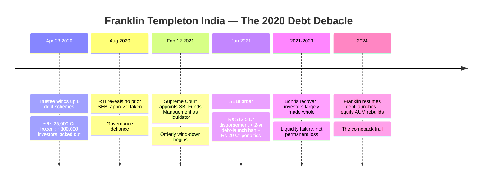
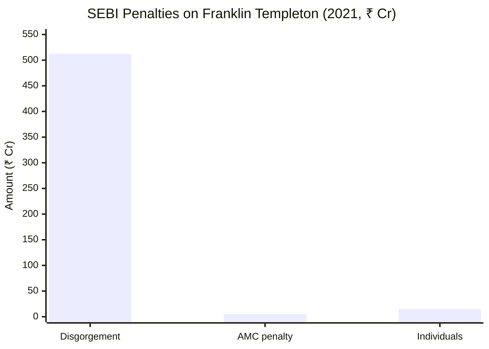
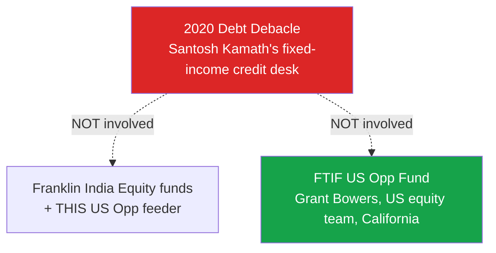
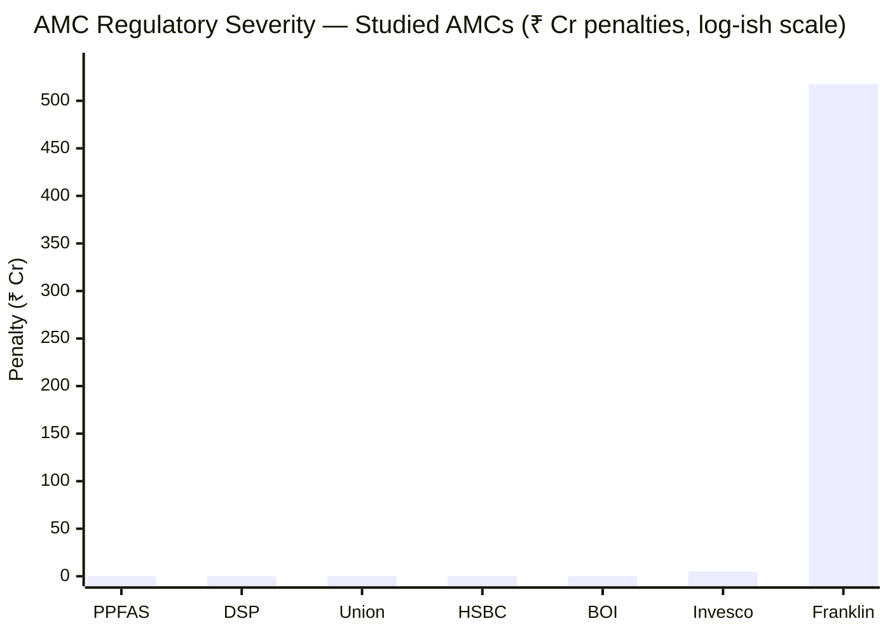
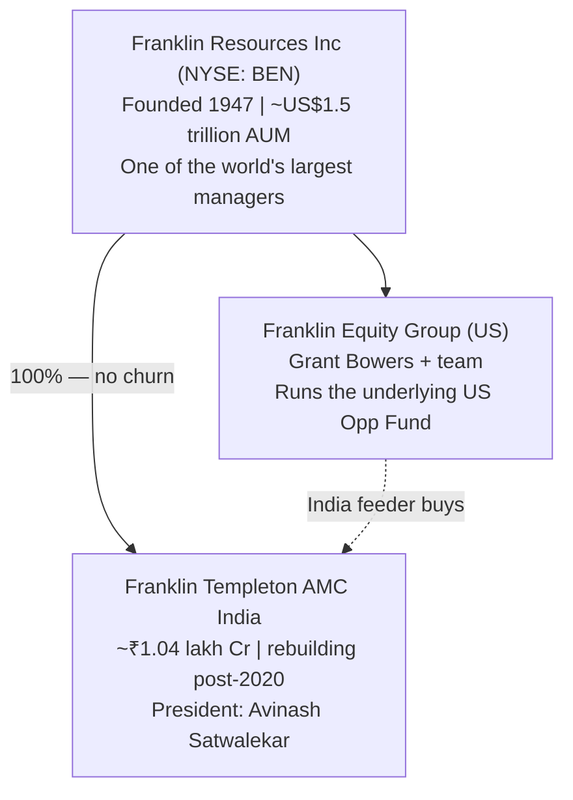
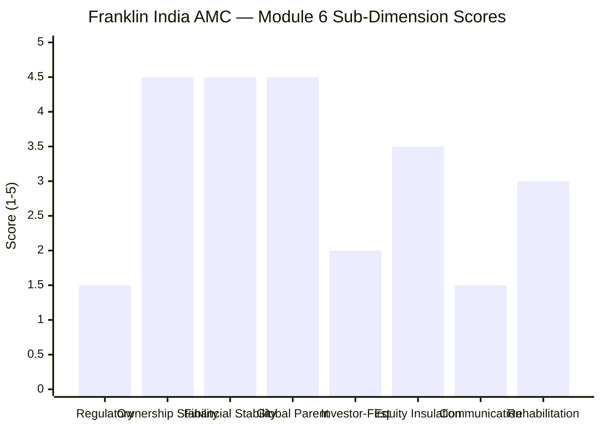
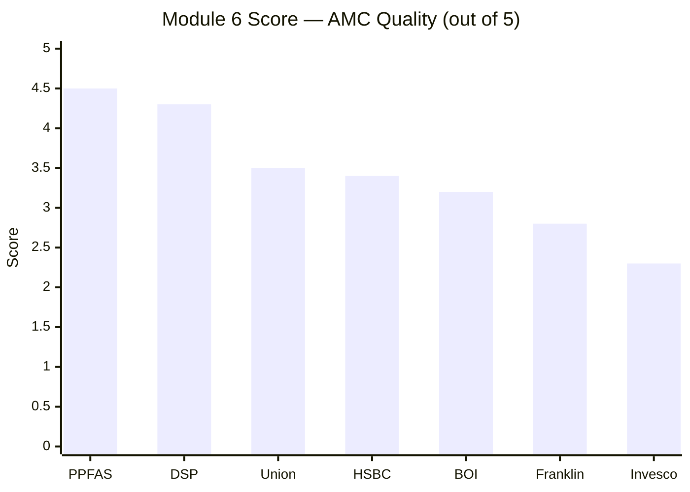
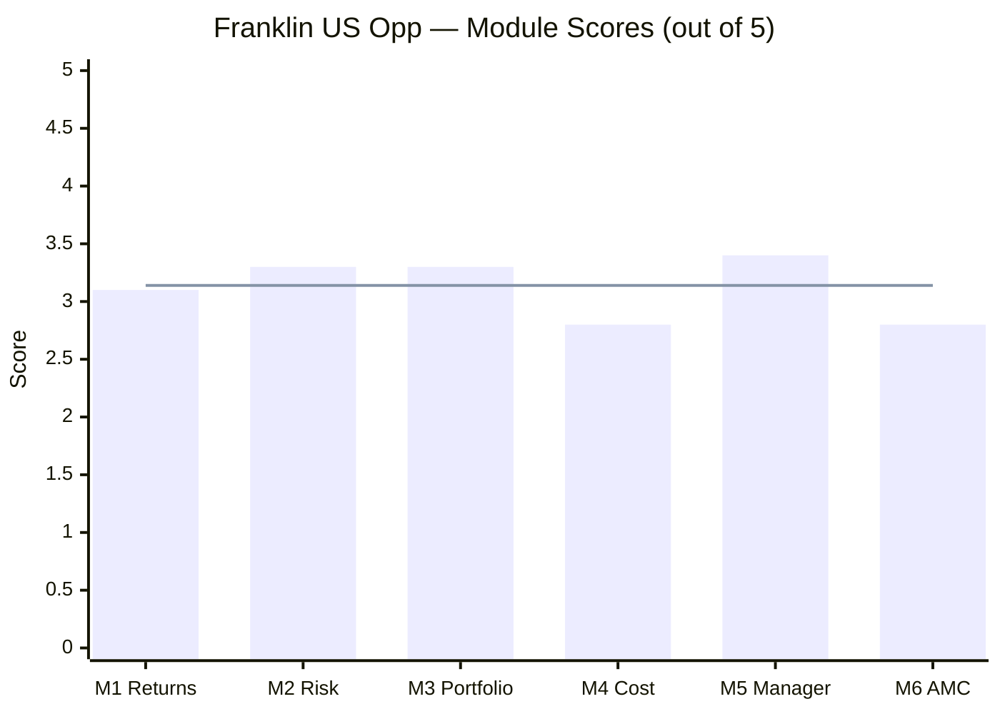

# Module 6: AMC Trustworthiness — Franklin U.S. Opportunities Equity Active FOF

*Sources: SEBI order in the matter of Franklin Templeton Mutual Fund (June 2021) | Capitalmind / Regstreet Law / Value Research (penalty breakdown) | Business Standard / BusinessToday (winding-up, RTI, comeback) | Supreme Court / SBI Funds Management liquidation filings | Franklin Templeton India (leadership, AUM) | Franklin Resources global filings | web research, June 2026. Benchmark = Russell 3000 Growth TRI.*

---

## Module 6 Score: ~2.8 / 5 — The Gravest Scar, the Strongest Parent

Franklin's AMC module is the study's sharpest two-sided verdict. On one side sits the **most serious governance failure of any AMC in either study**: the **April 2020 winding-up of six debt schemes** that froze **~₹25,000 crore** of ~300,000 investors' money overnight, followed by a **SEBI order** finding *systemic* violations — strategy-replication across supposedly-conservative schemes, Macaulay-duration manipulation, failure to exercise exit options, and valuation/risk-management lapses — and levying a **₹512.5 crore disgorgement, a two-year debt-launch ban, and ₹20 crore in penalties.** This was the **largest mutual-fund debacle in Indian history**, and its confirmed pattern — putting AUM-gathering ahead of investor risk — is a genuine, deep cultural red flag.

On the other side sit three real mitigants. First, the failure was **entirely debt-side**: Franklin's equity funds — and *this* US-Opportunities feeder, whose portfolio is run by the **US parent's equity team** — were never involved or sanctioned. Second, investors were **eventually made largely whole** (the Supreme Court appointed SBI Funds Management as liquidator; the bonds recovered over 2021–2023) — a *liquidity/governance* failure, not fraud or permanent theft. Third, the **global parent is world-class and stable**: Franklin Resources (NYSE: BEN, founded 1947, ~US$1.5 trillion AUM) has owned the Indian AMC throughout, with *zero* ownership churn. The net: the worst Indian-institutional scar in the study, insulated from this fund's engine and backstopped by one of the strongest global parents — **~2.8/5, below BOI (3.2), above Invesco (2.3).**

---

## Raw Data (Cross-Source Verified)

| Metric | Value | Source |
|--------|-------|--------|
| **Indian AMC** | **Franklin Templeton Asset Management (India) Pvt. Ltd.** | AMFI |
| **Global parent** | **Franklin Resources, Inc. (NYSE: BEN)** — founded 1947 | Franklin Resources |
| **Global parent AUM** | **~US$1.5 trillion** | Franklin Resources |
| **Indian AMC AUM** | **~₹1.04 lakh Cr** (rebuilt from ~₹88k Cr in 2024) | Derived / web |
| **Ownership** | **100% Franklin Resources throughout — no churn** | Web |
| **India President** | **Avinash Satwalekar** (post-scandal leadership) | Franklin India |
| **⭐ 2020 debt debacle** | **6 schemes wound up 23-Apr-2020; ~₹25,000 Cr; ~300,000 investors** | Business Standard |
| **SEBI disgorgement** | **₹512.5 Cr** (fees + 12% interest) | SEBI order Jun-2021 |
| **SEBI ban** | **2-year prohibition on new debt scheme launches** | SEBI order |
| **SEBI AMC penalty** | **₹5 Cr** | SEBI order |
| **SEBI individual penalties** | **₹15 Cr** (Sapre ₹2Cr, Kamath ₹2Cr, 5 FMs ₹1.5Cr each) | SEBI order |
| **Liquidator** | **SBI Funds Management** (per SC order, 12-Feb-2021) | SC |
| **Investor recovery** | **Largely made whole over 2021–2023** (bonds recovered) | Franklin wind-up factsheets |
| **⭐ Equity-side involvement** | **None — the scandal was 100% fixed-income** | SEBI order |
| **This fund's engine** | **Run by Franklin's US equity team (Bowers)** — separate from India debt desk | FTIF (M5) |
| **Underlying manager record** | **Clean** | M5 |
| **Rehabilitation** | Resumed debt launches 2024; equity AUM +17% YoY | Business Standard |

---

## What Module 6 Is Really Asking

Module 6 evaluates the *house* — governance, regulatory record, ownership, financial stability, and whether it systematically puts investors first. You can have a world-class portfolio manager, but if the *institution* around your money is regulatorily compromised or culturally indifferent to investors, that matters.

For Franklin, the question is unusually layered — **which institution are you actually trusting?** Your money flows through **Franklin Templeton AMC India** (the legal manager of the feeder — the entity that catastrophically failed its debt investors in 2020), into a fund run by **Franklin's US equity team** (world-class, uninvolved), owned by **Franklin Resources globally** (one of the largest, most stable managers on earth). The trust verdict has to weigh a **scarred local entity**, an **insulated fund engine**, and a **pristine global parent** simultaneously. The honest answer: the local scar is severe and real, but it is *insulated* from this fund and *backstopped* by a strong global parent — a genuine negative, materially softened.

---

## ⭐ The 2020 Debt-Fund Debacle — The Deep-Dive *(international/Franklin-specific — the defining event)*

**The six schemes** (Franklin India Low Duration, Ultra Short Bond, Short Term Income, Credit Risk, Dynamic Accrual, Income Opportunities) had pursued a **high-yield credit strategy** — concentrated, low-rated, illiquid corporate paper — replicated across schemes that were marketed as relatively conservative. When COVID froze the credit market in March–April 2020, the schemes could not meet redemptions, and the trustee **abruptly wound them up on 23 April 2020** — without first seeking SEBI's approval (revealed by RTI).

**SEBI's confirmed violations (June 2021 order) — why it was a *governance* failure, not just bad luck:**

| Violation | What it means |
|---|---|
| **Strategy replication across schemes** | The same high-risk credit bet was run across multiple schemes, concentrating risk while diversifying the *label* |
| **Macaulay-duration manipulation** | Long-dated paper pushed into *short-duration* schemes — mis-selling risk under a safe name |
| **Non-exercise of exit options** | Failed to reduce risky positions when liquidity was deteriorating |
| **Valuation / risk-management / due-diligence lapses** | Systemic control failures |
| **Wound up without SEBI approval** | Regulatory defiance |

**The penalties:**

- **₹512.5 Cr disgorgement** (investment-management fees + 12% interest) — extraordinary in scale
- **2-year ban** on launching new debt schemes
- **₹5 Cr** penalty on the AMC + **₹15 Cr** on individuals (President Sanjay Sapre ₹2 Cr, CIO-Fixed Income Santosh Kamath ₹2 Cr, five fund managers ₹1.5 Cr each)

**The verdict:** at ~₹25,000 Cr and ~300,000 investors, this was the **largest mutual-fund debacle in Indian history** — and SEBI's findings describe not a one-off error but a **pattern of prioritising AUM and yield over investor risk and mandate integrity.** For Module 6 — whose central question is *"does this house put investors first?"* — that is the most damaging finding possible about the Indian AMC's culture.

---

## ⭐ The Equity-Insulation Question — Does a Debt Failure Taint an Equity Feeder? *(international-specific)*

The pivotal Module 6 judgement: how much should a *fixed-income* governance failure weigh against a *US-equity* feeder?

| Argument | For insulation | Against insulation |
|---|---|---|
| Asset class | The failure was **credit/illiquidity** — irrelevant to a liquid US-equity feeder | — |
| Desk | Kamath's **fixed-income** team — separate from equity | — |
| Portfolio engine | Run by the **US parent's** equity team (Bowers) — a different continent | — |
| Legal entity | — | Your money flows through the **same AMC** that failed |
| Governance culture | — | The scar reflects the **house's** risk culture, not just one desk |

**The balanced verdict — partial insulation.** The *specific operational risk* that blew up in 2020 (illiquid-credit mismanagement) **cannot recur** in a feeder that simply buys a liquid US equity fund — so the *direct* risk to this fund is low. But Module 6 is a *trust* question, and the scandal is a genuine statement about **Franklin Templeton India's institutional risk culture and its willingness to put AUM ahead of investors.** That culture governs the *entity* that custodies your feeder, even if the *desk* and *asset class* are different. So the scar is a **cultural/trust red flag that partially applies** — it does not directly threaten this fund's mechanics, but it undermines confidence in the local house's investor-first orientation. It cannot be waved away as "someone else's problem," nor should it be scored as if the equity feeder itself mismanaged illiquid credit.

---

## ⭐ Global Parent vs Local Entity — Which Do You Trust? *(international-specific)*

A tension unique to a global-brand feeder: the **local entity is scarred, but the global parent is world-class.**

| Dimension | Franklin Templeton India (local) | Franklin Resources (global) |
|---|---|---|
| Governance record | **2020 debt debacle** ⚠️ | Clean, ~78-year global record |
| AUM | ~₹1.04 lakh Cr (rebuilding) | **~US$1.5 trillion** |
| Stability | Rehabilitating | One of the largest managers on earth |
| Ownership | 100% Franklin Resources | NYSE-listed (BEN), diversified |
| This fund's engine | (routes through here) | **Bowers' US equity team sits here** |

**Why this matters — and why it only partly rescues the score.** The *global* Franklin Templeton is a deep, credible, ~$1.5-trillion institution with a long clean record, and — crucially — **this fund's actual manager (Bowers) sits inside the global equity group, not the scarred Indian debt desk.** So the *investment* is backstopped by world-class global infrastructure. But an Indian investor's *legal relationship, redemptions, and grievance-redressal* run through **Franklin Templeton India** — the entity that froze ₹25,000 Cr and shut schemes without SEBI's nod. You are trusting a strong global parent *operating through* a locally-scarred subsidiary. The global strength is real and materially softens the verdict; it does not erase the fact that the entity you actually transact with has the study's worst governance history.

---

## The Make-Whole Nuance — Liquidity Failure, Not Fraud

A critical distinction that separates Franklin's scar from an outright-theft event:

| | Franklin 2020 | A fraud / Ponzi event |
|---|---|---|
| Investor money | **Frozen 1–2 years, then largely recovered** | Permanently lost |
| Mechanism | Illiquidity + governance failure | Theft / misappropriation |
| Resolution | SC-supervised orderly wind-down (SBI FM) | Rarely recovered |
| Character | **Grave governance/risk-culture failure** | Criminal |

**The nuance cuts both ways.** In Franklin's favour: investors were **not wiped out** — the underlying bonds largely recovered, and over 2021–2023 the wind-down returned most/all principal. This was a *liquidity and governance* failure, not a disappearance of capital — meaningfully less severe than a fraud, and a reason not to score Franklin at rock-bottom. Against Franklin: the *trust damage* was still severe — 300,000 investors lost *access* to their savings for up to two years with no certainty of recovery, during a pandemic, because the AMC had mis-sold risk under conservative labels. **Being eventually made whole mitigates the *outcome*; it does not excuse the *conduct*.** The score reflects a grave-but-non-fraudulent failure.

---

## Regulatory Record — The Worst Scale, Confirmed

> Franklin's ₹517.5 Cr (₹512.5 disgorgement + ₹5 AMC penalty) dwarfs every other studied AMC's regulatory action — before counting the ₹15 Cr individual penalties and the 2-year ban.

| Entity | Issue | Amount | Character |
|--------|-------|--------|-----------|
| PPFAS / Union | None | ₹0 | Clean |
| DSP / HSBC | Procedural | ₹2–5 lakh | Minor |
| BOI | Credit Risk debacle + insider fine | ₹10 lakh + capital loss | Governance scar |
| Invesco | Inter-scheme transfers; multi-jurisdiction | ₹4.98 Cr | Severe |
| **Franklin India** | **6-scheme freeze; systemic debt violations** | **₹517.5 Cr + ₹15 Cr + 2-yr ban** | **Gravest of the study (debt-side)** |

**Franklin India has the most severe confirmed regulatory action of any studied AMC — by two orders of magnitude in rupee terms.** The one epistemic caveat: the *equity managers* (Bowers, and the Indian equity team) carry **clean personal records** — the sanctions fell on the fixed-income desk and senior management. But at the *institutional* level, this is the worst regulatory character in the study.

---

## AMC Structure, Financial Stability & Rehabilitation

| Dimension | Franklin | Read |
|---|---|---|
| Global parent financial stability | **Very high** (~$1.5T, NYSE-listed) | Unsinkable |
| Ownership stability | **Excellent — no churn** (Franklin throughout) | Contrast Invesco's 4 changes |
| Indian-AMC rehabilitation | AUM rebuilt to ~₹1.04L Cr; resumed debt launches 2024; equity +17% YoY | Genuine comeback |
| Indian-AMC leadership | Refreshed (Satwalekar as President post-scandal) | Post-scandal reset |
| Research depth | Deep global equity platform (the underlying's edge) | Strong at the engine |

**Financial stability and ownership are genuine strengths** — the global parent is among the most stable in the world, and (unlike Invesco) there has been **no ownership churn.** The Indian franchise has demonstrably **rehabilitated** — AUM rebuilt, debt launches resumed after the ban, equity flows recovering, leadership refreshed. So while the *record* is scarred, the *trajectory* is one of recovery under a strong, committed global owner — a materially better forward-looking picture than Invesco's serial-ownership instability.

---

## Investor-First Signals — Mixed, Scarred

| Signal | Franklin | Read |
|--------|----------|------|
| Regulatory cleanliness | **Worst of study (debt debacle)** | The dominant negative |
| Global-parent alignment | Strong (world-class equity platform) | Positive |
| Restrained pricing | Feeder ER low (0.50%); true all-in high (M4) | Mixed |
| Investor communication (India) | **Weakest of study** (feeder format — M5) | Negative |
| Wind-up handling | SC-supervised; regular disclosures; investors made whole | Partial redemption of trust |
| Skin-in-the-game | Not disclosed | Gap |

**Franklin's investor-first profile is the most scarred of the study** — anchored by the 2020 debacle (a definitional investor-first failure) and compounded by the weakest India-facing communication (the feeder format leaves Indian investors twice-removed from the decision-maker — Module 5). The partial offset: the wind-up was ultimately handled under Supreme Court supervision with regular disclosures, and investors were made whole — a limited rebuilding of trust. But on the core question — *does this house reliably put investors first?* — the honest answer for the *Indian entity* is: **it demonstrably did not in 2020, and is still rebuilding that trust.**

---

## Peer AMC Comparison — Full Picture

| Dimension | Franklin | Union | DSP | BOI | Invesco |
|-----------|----------|-------|-----|-----|---------|
| Global/parent strength | **~$1.5T global (strongest)** | Bank + insurer | Family | Govt bank | IIHL/Hinduja |
| Ownership stability | **High (no churn)** | High | Very high | High | **Low (4 changes)** |
| Financial stability | **Very high** | Very high | Very high | High | Moderate |
| Regulatory character | **Gravest scar (debt)** | Cleanest | Procedural | Debt scar | Severe |
| This fund's engine clean? | **Yes (US equity)** | Yes | Yes | Yes | Yes |
| Investor-first culture | **Scarred (2020)** | Clean-quiet | Strong | Mixed | Weak |
| Rehabilitation trajectory | **Recovering** | — | — | — | Uncertain |
| Communication (India) | **Weakest (feeder)** | Quiet | Above-avg | Minimal | Below-avg |
| **M6 Score** | **~2.8** | 3.5 | 4.3 | 3.2 | 2.3 |

---

## Points For / Points Against — AMC Quality

### ✅ Points For
1. **World-class, stable global parent** — Franklin Resources (~US$1.5T, founded 1947), among the largest managers on earth
2. **Zero ownership churn** — Franklin has owned the Indian AMC throughout (contrast Invesco's 4 changes)
3. **The fund's engine is insulated** — run by Franklin's US equity team (Bowers), never involved in the debt scandal
4. **The 2020 failure was debt-side only** — equity funds and this feeder were never sanctioned
5. **Investors were made whole** — a liquidity/governance failure, not fraud; SC-supervised recovery over 2021–2023
6. **Clean equity-manager records** — the sanctions fell on the fixed-income desk, not the equity team
7. **Genuine rehabilitation** — AUM rebuilt to ~₹1.04L Cr, debt launches resumed 2024, leadership refreshed
8. **Very high financial stability** — global balance sheet is unsinkable

### ❌ Points Against
1. **⭐ The gravest AMC governance failure in either study** — ₹25,000 Cr frozen, 300,000 investors, the largest MF debacle in Indian history
2. **⭐ SEBI-confirmed *systemic* violations** — strategy-replication, duration manipulation, mis-selling risk under conservative labels — a culture that put AUM ahead of investors
3. **Wound up schemes without SEBI approval** — regulatory defiance
4. **₹512.5 Cr disgorgement + ₹20 Cr penalties + 2-year ban** — two orders of magnitude worse than any other studied AMC
5. **Your legal relationship runs through the scarred Indian entity** — insulation is partial, not total
6. **Weakest India-facing communication** — the feeder format leaves investors twice-removed (M5)
7. **Skin-in-the-game not disclosed**
8. **Trust, once broken at this scale, rebuilds slowly** — the rehabilitation is real but incomplete

---

## Module 6 Scorecard

| Sub-Dimension | Score (1–5) | Reasoning |
|---------------|------------|-----------|
| Regulatory cleanliness | **1.5** | The gravest scar of the study — ₹25,000 Cr freeze, systemic violations, ₹517.5 Cr + 2-yr ban |
| Ownership stability | **4.5** | Franklin Resources throughout — no churn (the anti-Invesco) |
| Financial stability | **4.5** | ~$1.5T global parent — unsinkable |
| Global-parent quality | **4.5** | World-class, ~78-year global equity platform (houses this fund's engine) |
| Investor-first culture | **2.0** | The 2020 debacle is a definitional failure; partial redemption via make-whole |
| Equity-side insulation | **3.5** | The failure was debt-only; this fund's US engine is clean — but the legal entity is shared |
| Investor communication (India) | **1.5** | Weakest of study — feeder format, twice-removed (M5) |
| Rehabilitation trajectory | **3.0** | Genuine comeback (AUM rebuilt, launches resumed, leadership refreshed) |
| **Module 6 Overall** | **~2.8 / 5** | **The gravest AMC governance scar in either study (the 2020 debt debacle — ₹25,000 Cr frozen, SEBI-confirmed systemic violations, ₹517.5 Cr disgorgement + 2-year ban), materially softened by three real mitigants: the failure was debt-side only and this fund's engine is the insulated, clean US equity team; investors were eventually made whole (liquidity failure, not fraud); and the global parent (Franklin Resources, ~$1.5T, no ownership churn) is one of the strongest in the study. Below BOI (3.2) on scar severity; above Invesco (2.3) on parent strength, stability, and equity insulation.** |

---

## Comparative Module 6 Scores — All Studied AMCs

| Rank | AMC | Score | Key Differentiator |
|------|-----|-------|--------------------|
| 1 | PPFAS | 4.5 | Spotless; quarterly letters; skin-in-game |
| 2 | DSP | 4.3 | 160Y heritage; all-employee alignment |
| 3 | Union | 3.5 | Cleanest small-cap record; dual-strong parents |
| 4 | HSBC | 3.4 | $3T parent; minor inherited penalty |
| 5 | BOI | 3.2 | Govt-bank backstop; debt-side scar |
| 6 | **Franklin** | **~2.8** | **World-class global parent + equity insulation + make-whole — but the gravest Indian-AMC scar (2020 debt debacle)** |
| 7 | Invesco | 2.3 | 4 ownership changes; multi-jurisdiction probe |

**Franklin takes the 6th AMC slot — ~2.8 — below BOI, above Invesco.** The logic: Franklin's *scar* is the worst in the study (dragging it below BOI, whose debt issue was far smaller in scale), but its *parent strength, ownership stability, and equity-side insulation* are far better than Invesco's (lifting it clearly above the serial-ownership-change bottom). It is the study's clearest case of **"a strong global house operating through a locally-scarred entity"** — a genuinely mixed trust profile that the ~2.8 fairly captures.

---

## One-Line Verdict

> **Franklin Templeton India carries the gravest AMC governance scar in either study — the 2020 winding-up of six debt schemes that froze ~₹25,000 crore of 300,000 investors' money, drawing SEBI findings of systemic mis-selling and a ₹512.5 Cr disgorgement plus a two-year ban — materially softened by three real mitigants: the failure was debt-side only and this fund's engine is the insulated, clean US equity team (Bowers); investors were eventually made whole (a liquidity failure, not fraud); and the global parent (Franklin Resources, ~$1.5T, zero ownership churn) is one of the strongest in the study. A strong global house operating through a locally-scarred entity. Module 6: ~2.8/5.**

---

## Module 6 Final Score: **~2.8 / 5**

> **Module Weight:** 5% | **Weighted Contribution:** 2.8 × 0.05 = **0.140**

---

## Franklin U.S. Opportunities — Complete Final Score (All 6 Modules)

| Module | Topic | Weight | Score | Weighted |
|--------|-------|--------|-------|----------|
| Module 1 | Returns Consistency | 25% | 3.1/5 | 0.775 |
| Module 2 | Risk Profile | 20% | 3.3/5 | 0.660 |
| Module 3 | Portfolio DNA & Look-Through | 15% | 3.3/5 | 0.495 |
| Module 4 | Cost & AUM / Structure | 20% | 2.8/5 | 0.560 |
| Module 5 | Fund Manager Quality | 15% | 3.4/5 | 0.510 |
| **Module 6** | **AMC Trustworthiness** | **5%** | **2.8/5** | **0.140** |
| **TOTAL** | | **100%** | | **≈ 3.14 / 5** |

> Line = overall weighted score (≈3.14/5)

### The Coherent Verdict Across Six Modules

Franklin U.S. Opportunities scores **≈3.14/5** — and the six modules tell one consistent story: **a decent diversifier undermined as an active investment.**

- **M1 (3.1):** genuine long record and a rupee hedge — but negative net alpha; ~23% of the return is currency, not skill.
- **M2 (3.3):** elite *diversifier* (R² 11% to India) wrapped around a mediocre *standalone* risk profile.
- **M3 (3.3):** high-quality holdings whose Magnificent-Seven underweight *structurally causes* the index-lag, and which overlap Parag Parikh FlexiCap's US book.
- **M4 (2.8):** the highest true cost of either study (~1.35%), tax-disadvantaged, closure-exposed — buying a below-benchmark output.
- **M5 (3.4):** the most stable, credentialed manager team studied — whom you can't access, producing a 3rd-quartile result.
- **M6 (2.8):** the gravest AMC scar — insulated from this fund's engine, backstopped by a world-class parent.

**The through-line:** every module lands in the low-3s-or-below because Franklin's genuine strengths (diversification, a rupee hedge, a stable manager, a strong global parent) are **structural and passive**, while its weaknesses (benchmark-lag, high cost, tax drag, portfolio overlap, an inaccessible manager, a scarred local AMC) are **specific to owning *this active fund* rather than a cheap index.** It is a **legitimate way to hold US exposure while the passive lane is shut — but not the *optimal* one**, and not a stock-picking edge.

### Strategic Placeholder — the First International Fund Scored

Franklin is the **first of the 8 shortlisted international funds** to be fully studied (≈3.14/5). It sets the reference frame: a well-known, long-record, open-to-SIP active US feeder that nonetheless **fails to beat a cheap index it structurally can't keep up with.** Its role in the eventual sleeve is provisional — a **broad-US placeholder** whose case weakens the moment a passive NASDAQ/S&P feeder reopens, and whose diversification is partly pre-owned via Parag Parikh FlexiCap. The remaining 7 funds (Edelweiss US Tech/Value, PGIM Global/EM, Edelweiss EM/Europe, Healthcare) must now be measured against this ≈3.14 baseline — the key question being whether *any* active international fund justifies its cost over a passive alternative, or whether the sleeve is best expressed passively once the SEBI cap resets.

---

*Module 6 complete. AMC trustworthiness is the study's sharpest two-sided verdict: the gravest governance scar of either study (the 2020 debt debacle — ₹25,000 Cr frozen, systemic SEBI-confirmed violations, ₹512.5 Cr disgorgement + 2-year ban), materially softened by debt-side-only insulation of this fund's clean US equity engine, an eventual investor make-whole, and a world-class, churn-free global parent (Franklin Resources, ~$1.5T). Module 6 score: ~2.8/5. **Franklin U.S. Opportunities final score ≈ 3.14/5 — a decent diversifier undermined as an active investment; a broad-US placeholder, not a stock-picking edge.***

*Franklin U.S. Opportunities — 6-module study complete. Next: fund README/scorecard assembly, then the remaining 7 international funds.*
