# Module 1: Returns Consistency — PGIM India Global Equity Opportunities Fund of Fund

*Sources: MFAPI NAV history — PGIM India Global Equity Opportunities FoF, Direct Growth (Scheme 138528, ISIN INF223J01NF2, 2,497 NAV points, 08-Mar-2016 → 30-Jun-2026) | Tickertape (screening, 21-May-2026) | Value Research Online | freefincal (independent review) | PGIM Jennison Global Equity Opportunities Fund factsheet (UCITS, USD I Acc) | MSCI ACWI factsheet (annual total returns) | ECB / Wikipedia year-end ₹/$ rates | SEC / Prudential World Fund filings (strategy-switch history) | Web research, July 2026. Benchmark = **MSCI AC World Index (ACWI) TRI** (the fund's stated benchmark — a broad all-country global index, NOT a growth index and NOT an India index).*

---

## Fund Identity

| Attribute | Detail |
|-----------|--------|
| Full Name | PGIM India Global Equity Opportunities Fund of Fund — Direct Plan — Growth |
| AMC | PGIM India Asset Management Pvt. Ltd. (formerly DHFL Pramerica / Pramerica) |
| **Structure** | **Fund-of-funds feeder** → invests into **PGIM Jennison Global Equity Opportunities Fund** (UCITS, USD I Acc). *You own a wrapper around a foreign fund — the real engine is the underlying.* |
| **Underlying manager** | **Mark B. Baribeau, CFA** — Head of Global Equity at **Jennison Associates** (since Apr 2011); co-PMs Thomas Davis / Rebecca Irwin |
| Feeder (India) manager | Operational role (currency, cash, subscriptions), not stock selection — *to be detailed in Module 5* |
| Benchmark | **MSCI AC World Index (ACWI) TRI** *(broad all-country global — the fund is a concentrated growth fund, so this is a soft, mismatched benchmark)* |
| Direct Plan Inception (legal) | ~2013 (feeder legal history 161 months); **MFAPI Direct NAV series starts 08-Mar-2016** |
| **Underlying-fund adopted** | **October 2018** — *the current strategy is this young; see the discontinuity section* |
| MFAPI Scheme Code | 138528 |
| Current NAV (30-Jun-2026) | **₹62.93** |
| ATH NAV | ₹63.13 (22-Jun-2026) — *effectively at all-time high (−0.32%)* |
| AUM | **₹1,797 Cr** (Jun-2026) → screening ₹1,694 Cr (May-2026) — *mid-sized; no capacity constraint (global large-caps are liquid)* |
| Expense Ratio (Direct, **feeder only**) | **1.38%** |
| **True all-in cost** | **~2.21%** (1.38% feeder + underlying UCITS TER 0.83%) — *the highest in the international sleeve; see Module 4* |
| Exit Load | 1% (typically <1 year) |
| SIP status | **OPEN (Allowed)** — one of the ~10 international equity funds still accepting SIPs under the SEBI overseas cap |
| SEBI Category / Risk | FoFs (Overseas) / **Very High** |
| VRO Star Rating | **Unrated / low** (FoF-Overseas category) |

> **🔑 Critical Interpretive Lens #1 — read first. This fund's "long record" is an illusion — it is *three different funds* wearing one ticker.** The advertised ~13-year / 161-month history blends an **agribusiness theme fund** (2010–2018) with a **concentrated global tech-growth fund** (2018–today) — two portfolios with nothing in common. The **genuine strategy record is only ~7.75 years** (Oct-2018 → now), and even the underlying UCITS it now buys only launched in March 2017. This is the international analogue of a domestic "manager carousel," but *more severe*: it is not a new manager on the same mandate — it is a wholesale change of *what the fund invests in.* Every trailing number that reaches before Oct-2018 describes a fund that no longer exists.

> **🔑 Critical Interpretive Lens #2 — one extraordinary year (2020, +74% INR) carries the entire record.** Since adopting the Jennison strategy, the fund's headline numbers rest disproportionately on a single COVID-boom year in which concentrated growth beat the broad world index by ~54 points in USD. Strip 2020 out and the record is a wild, benchmark-matching ride — spectacular up-years (2023 +41%) offset by brutal down/rotation years (2022 −33%, 2025 lagged ACWI by ~19 pts). This is a **high-dispersion concentrated-growth fund**, not a steady compounder.

> **🔑 Critical Interpretive Lens #3 — "broad global" in name, concentrated growth in practice.** The benchmark is MSCI ACWI (a ~2,500-stock all-country index), but the underlying Jennison book is **~35–40 stocks, top-10 ≈ 49%, heavily US mega-cap tech-growth** (NVIDIA, Alphabet, Amazon, Apple, plus TSMC/ASML). So it does *not* deliver the diversified "one-fund world" its ACWI label implies — it is a concentrated growth bet that happens to hold a few non-US names. This undermines its case as the *core* international holding and makes it a **weaker diversifier than Franklin US**, because it overlaps the same Magnificent-Seven trade already present in Franklin and in Parag Parikh's international sleeve.

---

## ⭐ "Three Funds in One Ticker" — The Strategy-Switch Discontinuity *(PGIM-specific — the headline section)*

The single most important fact about this fund's record is that it has worn **three unrelated identities**:

| Era | Dates | What it actually was |
|-----|-------|----------------------|
| 1. **DWS Global Agribusiness** | May 2010 → Oct 2018 | An **agriculture / agribusiness theme fund**, feeding into DWS Invest Global Agribusiness (Luxembourg). Launched by Deutsche Mutual Fund. |
| 2. **DHFL Pramerica Global Equity Opp** | Oct 2018 → ~2019 | Switched its underlying to **PGIM Jennison Global Equity Opportunities**; rebranded. |
| 3. **PGIM India Global Equity Opp** | 2019 → today | Prudential/PGIM bought out DHFL Pramerica; the current concentrated global-growth strategy. |

The NAV series makes the switch visible: the fund was **flat in its agribusiness tail (2017 +13.5%, 2018 +1.8%)** and then **exploded once it became a Jennison growth fund (2019 +31.9%, 2020 +74.4%)**. These are not two chapters of one fund — they are two different funds.

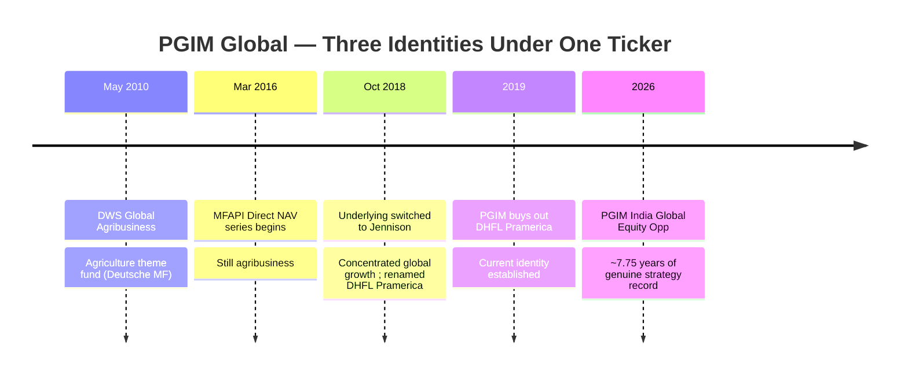

**Why this matters more than domestic inception-bias or manager-carousel:**
- BOI / Union / Bandhan had *manager* changes — but the *mandate* (small-cap India) stayed constant, so the historical NAV still describes the same kind of fund.
- Here the *entire investable universe* changed — from farm-and-fertiliser equities to Nvidia-and-Amazon growth. **The pre-2018 track record has zero predictive value for what you own today.**
- freefincal warned in 2020 that the fund was "effectively less than two years old" and that chasing its headline return was "the classic retail mistake — look at a high recent return, get excited, put money in, then see poor returns."

**Discipline for the rest of this module:** every "genuine record" statement anchors on **Oct-2018 onward (~7.75 years)**. The 10Y and Since-Inception figures are shown for completeness but are explicitly *contaminated* by the agribusiness era.

---

## Raw Data (MFAPI computed + Tickertape screening, as of 30-Jun-2026)

| Metric | Value | Source |
|--------|-------|--------|
| CAGR 1Y | **26.01%** | MFAPI |
| CAGR 3Y | **20.70%** | MFAPI — *exact match to screening 20.7* ✅ |
| CAGR 5Y | **9.35%** | MFAPI (screening 11.5% — the valley) |
| CAGR 7Y | 17.68% | MFAPI |
| CAGR 10Y | **16.41%** | MFAPI (screening 15.7%) — *blends agribusiness + Jennison* |
| Since Inception (MFAPI, 10.31Y) | 15.83% | MFAPI |
| **Post-switch (Oct-2018, 7.75Y)** | **16.73%** | MFAPI — *the only "real" number* |
| Pre-switch tail (2.57Y) | 13.16% | MFAPI — *a different fund* |
| **Max Drawdown** | **−43.42%** | MFAPI — *matches screening (43.4)* ✅ |
| Annualized Volatility | 21.4%+ (est.) | Screening St Dev region — *see Module 2* |
| **Tracking Error (vs benchmark)** | **21.39%** | Screening — *enormous active + concentration + currency risk* |
| Sharpe (screening) | 0.930 | Tickertape — *lowest of the open intl shortlist* |
| Returns vs sub-category | 3Y 20.7 / 5Y 11.5 / 10Y 15.7 | Screening |
| VRO Star Rating | **Unrated / low** | Value Research |

---

## Cross-Source Verification

| Metric | MFAPI Computed | Screening (May-26) | Verdict |
|--------|----------------|--------------------|---------|
| 3Y CAGR | 20.70% | 20.7% | **Exact match — confirmed** |
| Max Drawdown | −43.42% | 43.4% | **Exact match — validates the NAV series** |
| 10Y CAGR | 16.41% | 15.7% | Confirmed (method/date drift) |
| 5Y CAGR | 9.35% | 11.5% | Confirmed (base-date drift over the 2021 peak) |

**Data reliability: Very High.** The independently computed max drawdown (−43.42%) reproduces the screening figure to the basis point, and the 3Y CAGR matches to two decimals — strong evidence the 2,497-point Direct-plan NAV series (Mar-2016 → Jun-2026) is complete and correct. **The one structural caveat is not data quality but data *meaning*:** the series before Oct-2018 belongs to the agribusiness fund.

---

## The CAGR Curve — A "Valley" Shaped by the 2022 Crash

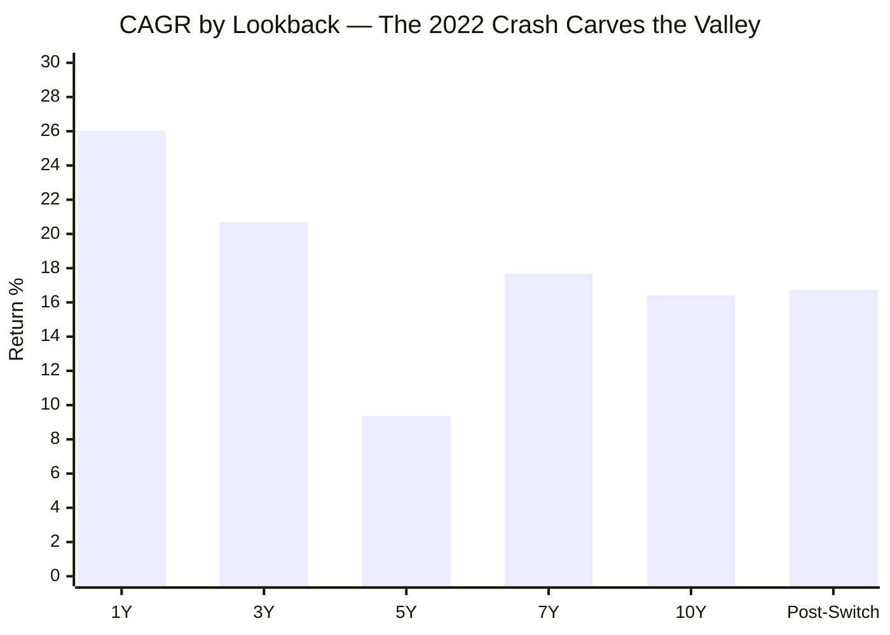

The shape is the *inverse* of a deteriorating fund — identical in mechanism to Franklin's. The **5Y trough (9.35%)** exists because the 5-year window **opens in mid-2021 (the growth peak) and immediately absorbs the entire −43% 2022 drawdown**; the **3Y peak (20.70%)** opens in mid-2023, *after* the bottom, capturing only the recovery. The trustworthy through-cycle number is the **post-switch 16.73% (7.75Y)** — it contains the full 2022 crash *and* the recovery, and (unlike the 10Y) does not reach back into the agribusiness era. **Never quote the 5Y alone; anchor on the post-switch figure.**

---

## CAGR vs Benchmark (MSCI ACWI) — A Very Different Skill Story from Franklin

Where Franklin US steadily *lags its own growth benchmark* (weak stock-picking, loses ≈ its fee), PGIM is benchmarked against the **broad MSCI ACWI** and its concentrated Jennison strategy produces **enormous dispersion — it wins huge and loses huge:**

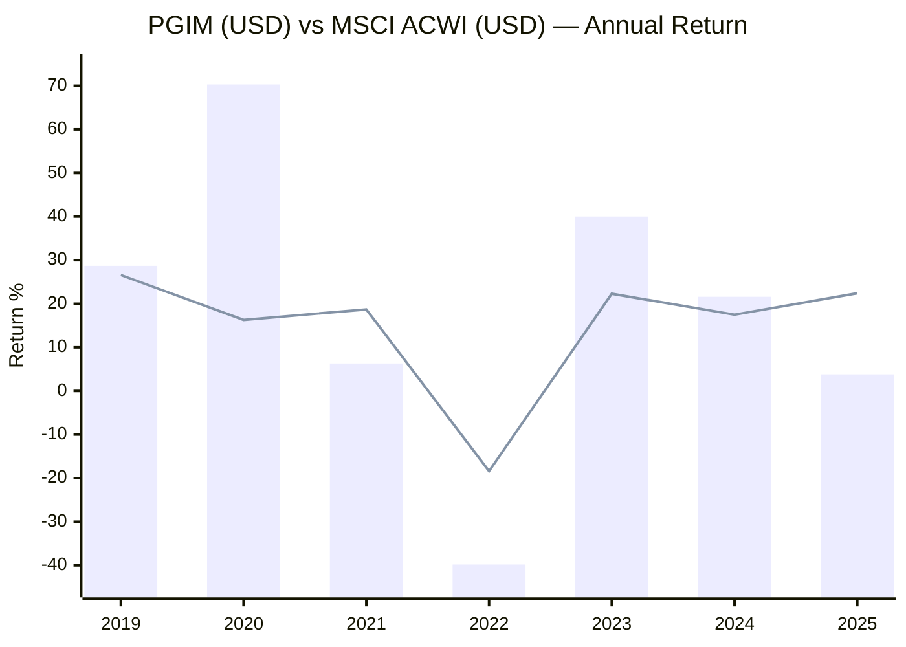
> Bar = PGIM underlying (USD, currency-decomposed) | Line = MSCI ACWI (USD, total return).

| Year | Fund USD (decomposed) | MSCI ACWI USD | vs ACWI |
|------|----------------------|---------------|---------|
| 2019 | +28.7% | +26.6% | **+2.1** ✅ |
| 2020 | **+70.3%** | +16.3% | **+54.0** ✅✅✅ |
| 2021 | +6.3% | +18.7% | **−12.3** ❌ |
| 2022 | **−39.8%** | −18.4% | **−21.4** ❌❌ |
| 2023 | +40.0% | +22.3% | **+17.7** ✅✅ |
| 2024 | +21.6% | +17.5% | **+4.2** ✅ |
| 2025 | +3.8% | +22.4% | **−18.6** ❌❌ |

**Two facts dominate:**
1. **The 2020 blowout (+70% USD vs ACWI +16%)** is genuine Jennison concentrated-growth in the COVID tech boom — but it is *one year*, and it single-handedly explains why the trailing numbers look elite.
2. **2025 is a live red flag: +3.8% USD vs ACWI +22.4% — a ~19-point miss.** Concentrated growth badly lagged a broadening market. This is *recent*, not ancient history, and it is the mirror image of 2020.

**Net over the genuine 7.75-year period, the fund's USD CAGR (≈13.6%) roughly *matches* MSCI ACWI** — the spectacular up-years are largely cancelled by the brutal down/rotation years. So unlike Franklin (a clear net lag), PGIM roughly *ties* its (broad) benchmark gross — but only via a single 2020, and with **21% tracking error and a ~2.21% all-in fee** eating into it. Judged against a *growth* benchmark (as Franklin is), PGIM would look better; judged against the *broad* index it actually claims, it is a high-risk way to earn roughly the world's return.

### Why Not Just Buy the Index?

> The natural alternative is a passive **MSCI ACWI / MSCI World** index feeder at ~0.20% ER — every one of which is **currently CLOSED to SIP** under the SEBI overseas cap (which is *why* PGIM, an open active feeder, survived screening). So today's real choice is **"PGIM open vs nothing,"** not "PGIM vs a cheap world index." **But when the cap resets and passive reopens, PGIM's active case is weak:** it costs ~10× a passive ACWI feeder, roughly *matches* the index over its genuine record, and does so with far higher volatility and a −43% drawdown the index did not suffer. Its honest role is a **placeholder for global-growth exposure while passive is shut** — plus a modest currency benefit the index funds share anyway.

---

## ⭐ Currency Decomposition — The Global Market vs the Rupee *(international-specific section)*

Splitting each year's **INR** return into the **foreign-market (USD)** component and the **rupee move**. *(USD return = (1 + INR return) ÷ (1 + ₹ depreciation) − 1; year-end ₹/$ from ECB/Frankfurter, consistent with the Franklin module.)*

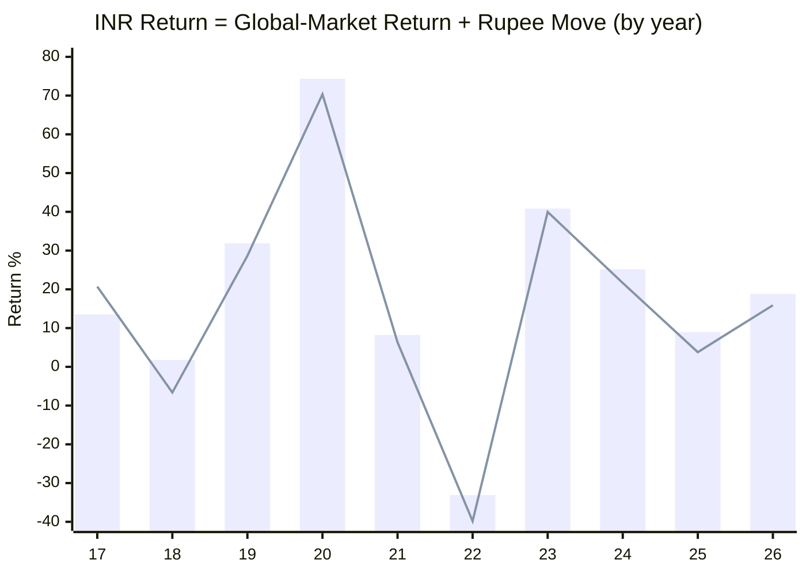
> Bar = INR return (what the Indian investor earned) | Line = USD-market return (the underlying fund in dollars). **The gap between bar and line each year is the rupee move.**

| Year | INR return | ₹ depreciation | **USD-market return** | Note |
|------|-----------|----------------|----------------------|------|
| 2017 | +13.54% | **−5.95%** | +20.72% | ⚠️ ₹ *strengthened* — INR understated the gain *(agribusiness era)* |
| 2018 | +1.78% | +9.01% | **−6.63%** | ₹ fall masked a down US/global year *(agribusiness era)* |
| 2019 | +31.88% | +2.51% | +28.65% | First full Jennison year — beat ACWI |
| 2020 | **+74.36%** | +2.36% | **+70.34%** | COVID tech boom — the record-carrying year |
| 2021 | +8.22% | +1.78% | +6.33% | Value rotation — growth lagged |
| **2022** | **−33.10%** | **+11.15%** | **−39.81%** | **₹ fall cushioned the crash by ~7 pts** |
| 2023 | +40.84% | +0.62% | +39.97% | AI recovery |
| 2024 | +25.19% | +2.92% | +21.64% | Mag-7 leadership |
| 2025 | +8.97% | +4.99% | **+3.79%** | ⚠️ badly lagged ACWI (+22.4%) |
| 2026 YTD | +18.80% | ~+2.50% | +15.90% | Recovery to ATH |

**Post-switch full period (Oct 2018 → Jun 2026, 7.75y):**

| Component | CAGR | Share of INR return |
|-----------|------|---------------------|
| **INR NAV CAGR** | **16.73%** | 100% |
| — Rupee depreciation | **~2.72%/yr** | **~16%** |
| — **Global-market (USD) return** | **~13.64%/yr** | ~84% |

> **Currency notes specific to a *global* (not pure-US) feeder:**
> 1. **The rupee is still a shock-absorber in crashes** — 2022 was −39.8% USD but only −33.1% INR (a ~7-point cushion), the same structural benefit Franklin offers.
> 2. **Less FX-dependent than Franklin (~16% vs ~23%)** — this window simply had milder rupee depreciation.
> 3. **⚠️ A messier decomposition than Franklin's.** The underlying is *global* — it holds EUR (ASML, Galderma, Siemens Energy), TWD (TSMC) and other non-USD assets. The feeder buys a **USD** share class, so the investor's *direct* currency risk is ₹/$ (decomposed above), but the underlying's USD NAV itself embeds EUR/TWD/other moves. The clean ₹/$ split captures the feeder-level FX the Indian investor actually bears, but hides a second layer of intra-portfolio currency inside the USD number.

---

## Trustworthy vs Window-Flattered vs Currency vs Wrong-Fund — A Four-Bucket Split View *(fund-specific section)*

Franklin needed three buckets (genuine / window / currency). PGIM needs a **fourth — "belongs to a different fund"** — because part of its published record is the agribusiness era:

| Metric | Value | Bucket | Read |
|--------|-------|--------|------|
| 10Y / SI INR CAGR | 16.41% / 15.83% | ❌ **Contaminated** | Blends agribusiness + Jennison — do not trust |
| Post-switch INR CAGR (7.75Y) | 16.73% | ✅ **Genuine strategy** | The real through-cycle number |
| Of which ₹ depreciation | ~2.72%/yr | 🟡 **Currency, not skill** | ~16%; reversible |
| Of which global-market (USD) | ~13.64%/yr | ✅ **Genuine global-growth beta** | The real economic return |
| Alpha vs MSCI ACWI (USD) | ~0 net (2020-driven) | 🟡 **Roughly matches, one-year-carried** | Better than Franklin's lag, but concentrated & lucky-timed |
| 2020 (+74% INR) | genuine but singular | ⚠️ **The load-bearing year** | Remove it and the record is ordinary |
| 3Y CAGR (20.70%) | recovery window | ⚠️ **Window-flattered** | Off the 2022 trough |
| 5Y CAGR (9.35%) | crash-front-loaded | 🟡 **Honest-but-pessimistic** | Swallows the whole 2022 crash |
| 2022 drawdown (−43.4%) | genuine | ✅ **Real stress test** | A true concentrated-growth bear, survived & recovered |
| 2025 lag (−19pt vs ACWI) | genuine | ❌ **Live concern** | Recent underperformance, not modelled away |

**The disciplined conclusion:** PGIM delivers a **genuine ~13.6% USD global-growth return + ~2.7% rupee tailwind over 7.75 years** — but that record is **younger than it looks, carried by one 2020, matched (not beaten) against its broad benchmark, and paid for with the sleeve's highest fee.** Buy it, if at all, for *concentrated global-growth access while passive is shut* — not for a proven, long, skill-driven record, because it does not have one.

---

## Calendar-Year Returns (2016–2026 YTD)

*Source: MFAPI NAV (scheme 138528). 2016 and 2026 are partial. **The 2017–2018 bars are the agribusiness fund; 2019 onward is the Jennison strategy.***

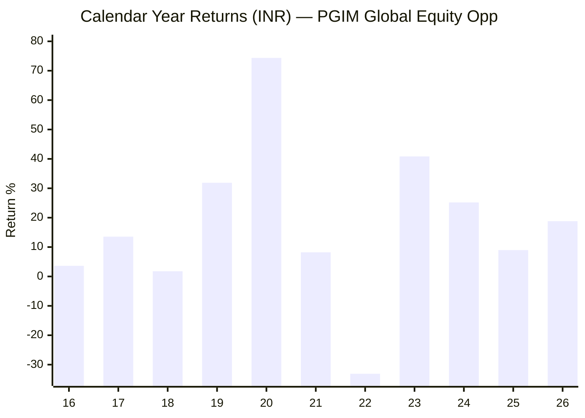
> 2026 YTD as of 30-Jun-2026.

| Year | Fund (INR) | Market event | Read |
|------|-----------|--------------|------|
| 2016 | +3.62% | Partial (from Mar) | Agribusiness era |
| 2017 | +13.54% | Global equities rally | Agribusiness — ₹ strengthened, USD gain was +20.7% |
| 2018 | +1.78% | Global wobble | Agribusiness — positive in INR *only* via ₹ fall (USD −6.6%) |
| 2019 | +31.88% | Growth surge | **First full Jennison year** — beat ACWI |
| 2020 | **+74.36%** | COVID tech boom | **The record-carrying year** — +54pt vs ACWI in USD |
| 2021 | +8.22% | Value rotation | Growth lagged the broad index |
| **2022** | **−33.10%** | Fed hikes; growth crash | **The stress test — see below** |
| 2023 | +40.84% | AI recovery | Beat ACWI by ~18pt USD |
| 2024 | +25.19% | Mag-7 dominance | Beat ACWI |
| 2025 | +8.97% | Broadening market | ⚠️ **Lagged ACWI by ~19pt USD** |
| 2026 YTD | +18.80% | Recovery to ATH | |

**Record across full calendar years: positive in 8 of 9 (2017–2025) — only 2022 negative** — but the smoothness is misleading: two of those years (2017–18) are a *different fund*, the consistency is FX-floored, and the *magnitude* dispersion is enormous (a +74% year and a −33% year within 24 months). This is not a steady compounder; it is a high-amplitude concentrated-growth vehicle.

---

## The 2022 Growth Bear — The Real Stress Test *(international-specific section)*

The 2022 Fed-hike growth crash is to a concentrated-growth fund what the 2018 IL&FS winter is to a small-cap fund: **the definitive stress test in the record.** PGIM passed it — survived and fully recovered — but more painfully than Franklin:

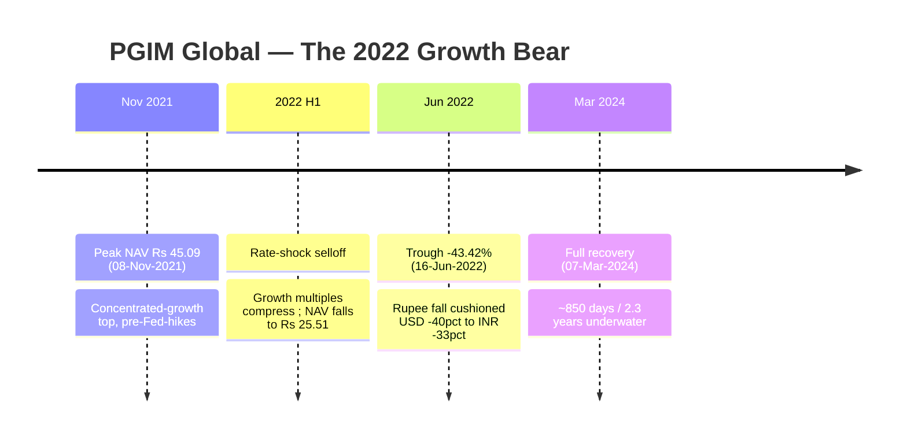

| Metric | Value | vs Franklin US |
|--------|-------|----------------|
| Peak | ₹45.09 (08-Nov-2021) | — |
| Trough | ₹25.51 (16-Jun-2022) | — |
| Max Drawdown (INR) | **−43.42%** | deeper (Franklin −38.41%) |
| Max Drawdown (USD, est.) | **~−40%** | the rupee absorbed ~7 pts |
| Recovery | 07-Mar-2024 (**~850 days / 2.3Y**) | slower (Franklin ~18 months) |

**The extra concentration cost ~5 points of drawdown and ~10 extra months underwater versus Franklin.** Like Franklin, the record **excludes the dot-com and GFC growth catastrophes** — and PGIM's genuine strategy is even younger (7.75Y), so its "only one bear" caveat is *stronger*. A concentrated ~35-stock growth fund that has lived through only the (fast-recovering) 2022 bear is untested against a dot-com-scale unwind, in which such a portfolio could fall 60–80% with no quick recovery.

---

## The "No Dot-Com, No GFC" Caveat *(international-specific section)*

The genuine record begins **Oct-2018** — which means it **excludes the two worst growth bears in history**, and its concentration makes that omission more dangerous than Franklin's:

| Missing bear | Growth drawdown | Why it matters *more* for PGIM |
|--------------|-----------------|--------------------------------|
| **2000–2002 dot-com** | Growth/Nasdaq **−60% to −80%**, no recovery for ~13 years | A ~35-stock concentrated growth book would have been devastated |
| **2008 GFC** | Growth **~−50%** | A genuine systemic test the fund has never faced |

**PGIM's spotless-looking rolling returns are genuine but reflect a benign, single-bear window plus an FX floor — not proven resilience.** Its concentration means the *worst-case* is worse than Franklin's, even though its *observed* history looks comparable.

---

## The −43.42% Max Drawdown vs Peers

| Fund (category) | Max DD | Character |
|-----------------|--------|-----------|
| **PGIM Global (intl concentrated growth)** | **−43.42%** | Single fast bear (2022), ~2.3Y recovery |
| Franklin US Opp (intl diversified growth) | −38.41% | Single bear (2022), ~18mo recovery |
| Parag Parikh (FlexiCap) | ~−35% | COVID V |
| Union (SmallCap) | −44.71% | 2.9-year IL&FS winter |
| DSP (SmallCap) | −49.06% | Two crises |
| HSBC (SmallCap) | −52.45% | Deepest |

PGIM's drawdown is **deep for an international large-cap fund** — approaching small-cap territory (−44.7% Union) and clearly worse than Franklin, a direct consequence of ~35-stock concentration. It recovered (2.3Y — slower than Franklin, faster than the small-cap winters), but the depth is a genuine mark against it for a diversifier whose job is partly to *smooth* the portfolio.

---

## Rolling 3Y Returns Distribution

*Computed from 1,803 rolling 3-year windows (daily-stepped, Mar-2016 – Jun-2026). **Note: early windows include the agribusiness era.***

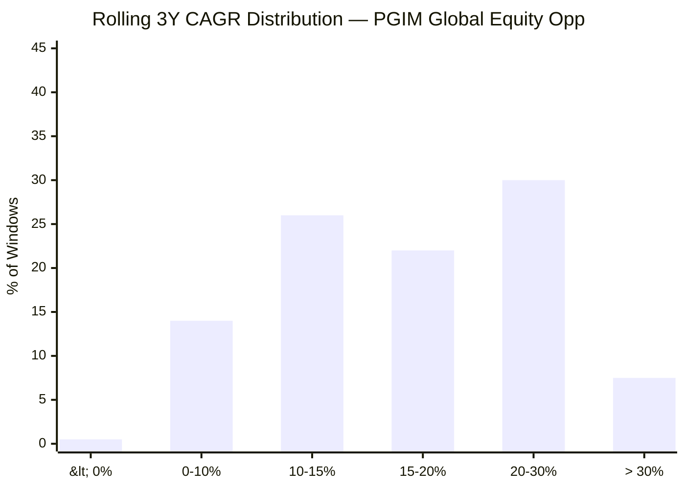

| Metric | Value |
|--------|-------|
| Total 3Y windows | 1,803 |
| Minimum | **−0.69%** |
| Maximum | +38.47% |
| Mean / Median | 16.53% / 14.74% |
| Negative windows | **0.5%** |

**Interpretation — clean, but read it like BOI's, not Union's.** A tiny 0.5% of 3Y windows are negative (Franklin was a spotless 0%; the difference is PGIM's concentration showing a small negative tail). The min of −0.69% is genuinely mild — but the record contains **only one bear (2022, fast-recovered)**, the **rupee floors every window**, and part of the distribution is the agribusiness fund. **A near-spotless rolling history here signals a benign window + FX floor, not proven safety** (see "No Dot-Com, No GFC").

---

## Rolling 5Y Returns Distribution

*Computed from 1,310 rolling 5-year windows.*

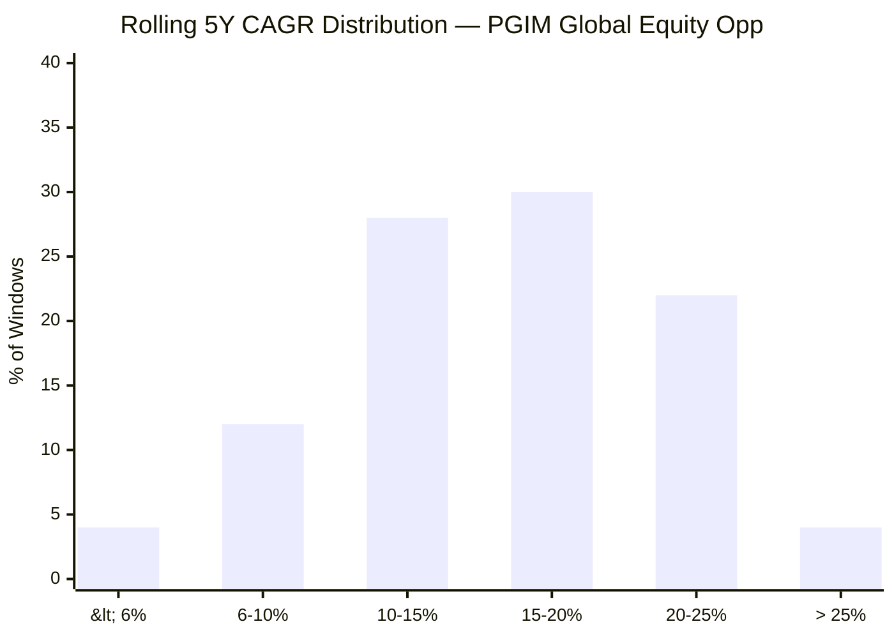

| Metric | Value |
|--------|-------|
| Total 5Y windows | 1,310 |
| Minimum | **+3.98%** |
| Maximum | +27.36% |
| Mean / Median | 15.65% / 15.56% |
| Negative windows | **0.0%** |

At the 5Y horizon the worst outcome was **+3.98%/yr** — lower than Franklin's +9.08% floor, reflecting PGIM's deeper 2022 drawdown swallowed by the crash-front-loaded windows. Positive in every 5Y window, but the *worst* 5Y is meaningfully weaker than Franklin's, and again FX-floored and dot-com-untested.

---

## Probability of Loss by Holding Period

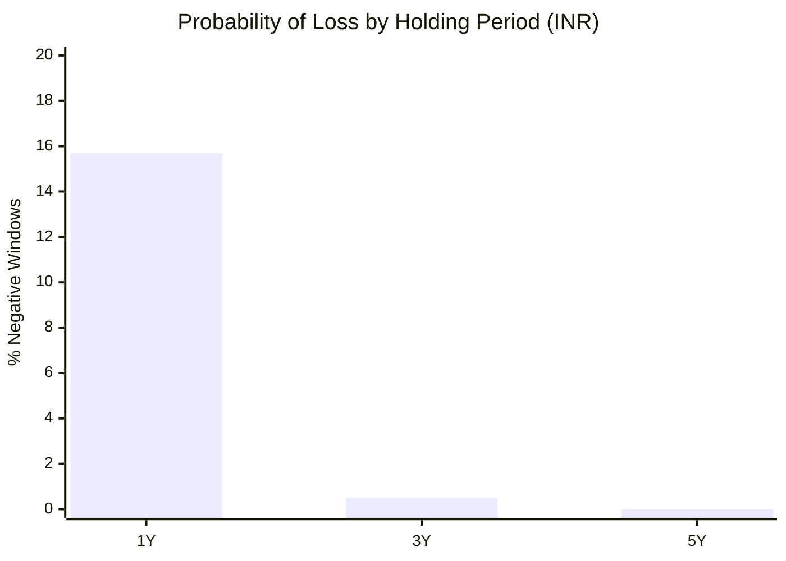

| Holding Period | Probability of Loss | 1Y Range (worst → best) |
|---------------|--------------------|--------------------------|
| 1 Year | ~15.7% | **−40.70% → +103.16%** |
| 3 Years | **0.5%** | worst 3Y CAGR −0.69% |
| 5 Years | **0.0%** | worst 5Y CAGR +3.98% |

**The 1Y range is the single clearest picture of this fund's character: from −41% to +103% in a single year.** That +103%/−41% spread — far wider than Franklin's — *is* the concentration. At 3Y/5Y the *absolute* odds are excellent, but the caveats (single-bear window, FX floor, dot-com-untested, one-year-carried record) mean these probabilities are favourable but not stress-proven.

---

## ⭐ Concentrated Growth in a Broad-Index Wrapper — The Benchmark Mismatch *(PGIM-specific section)*

The screening flags a **21.39% tracking error vs MSCI ACWI** — even higher than Franklin's 16.8%. The reason is structural: the fund is benchmarked to a ~2,500-stock all-country index but *is* a ~35-stock concentrated growth portfolio.

| Attribute | MSCI ACWI (the benchmark) | PGIM underlying (the reality) |
|-----------|---------------------------|-------------------------------|
| Holdings | ~2,500 | **~35–40** |
| Top-10 weight | ~20% | **~49.4%** |
| Style | Broad market (all styles) | **Concentrated growth** |
| Top names | Mega-cap blend | NVIDIA 9%, TSMC 7%, Alphabet 6.5%, ASML, Amazon, Apple |

**Consequence:** the fund's return vs benchmark is dominated by the **growth-vs-broad-market cycle**, not by stock-selection skill in the usual sense. It beats ACWI whenever concentrated growth is in favour (2019, 2020, 2023, 2024) and loses whenever the market rotates or broadens (2021, 2022, 2025). This is why "does it beat its benchmark?" is a *softer, less flattering* question for PGIM than for Franklin: PGIM roughly ties a benchmark it barely resembles, while Franklin loses to a benchmark that actually matches its style. **For the portfolio, the honest read is that PGIM is a concentrated global-growth *bet*, and its ACWI benchmark understates both its upside and its risk.**

---

## ⭐ Cross-Fund Overlap — A *Weaker* Diversifier Than Franklin *(PGIM-specific section)*

The entire purpose of the international sleeve is diversification. On that test, PGIM scores **worse than Franklin**, because it is *more* concentrated in the same Magnificent-Seven / mega-cap tech-growth trade already present elsewhere in the portfolio:

| Holding | PGIM underlying | Also in Franklin US? | Also in Parag Parikh intl sleeve? |
|---------|-----------------|----------------------|-----------------------------------|
| NVIDIA | 9.0% (top) | ✅ | — |
| Alphabet | 6.5% | ✅ | ✅ |
| Amazon | 3.7% | ✅ | ✅ |
| Apple | 3.3% | ✅ | — |
| Microsoft | (held) | ✅ | ✅ |

**The diversification erosion is real:** stacking PGIM on top of Franklin US (and PP's international sleeve) concentrates the whole portfolio further into US mega-cap growth — the opposite of what a diversifier sleeve should do. PGIM's genuine differentiators are its *non-US* names (TSMC, ASML, Galderma, Siemens Energy) — but they are a minority of the book. **As a diversifier, PGIM adds less than Franklin and materially less than a genuine EM or Europe fund would** (a point the decision-tree must weigh when choosing among the eight shortlisted international funds).

---

## SIP XIRR vs Lumpsum CAGR (₹20,000/month) — Including a 10-Year SIP *(caveat: early years are the agribusiness fund)*

*Computed from MFAPI NAV (scheme 138528), ₹20,000/month.*

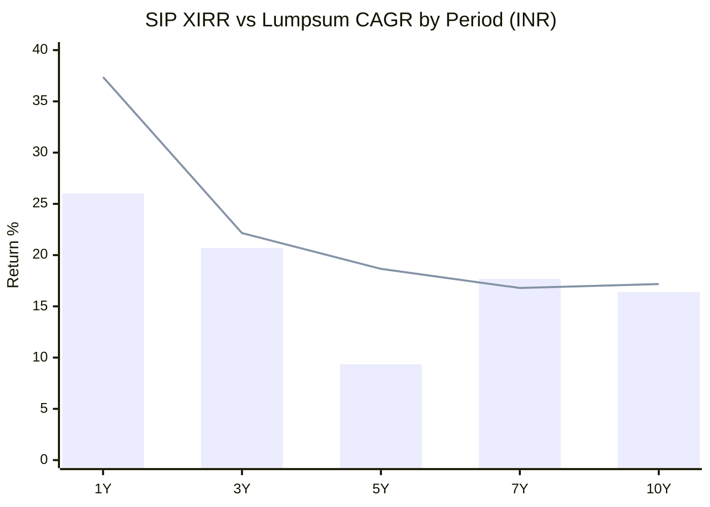
> Bar = Lumpsum CAGR | Line = SIP XIRR

| Period | Total Invested | Current Value | SIP XIRR |
|--------|---------------|---------------|----------|
| 1 Year | ₹2.60 L | ₹3.06 L | **37.37%** |
| 3 Years | ₹7.20 L | ₹9.94 L | **22.15%** |
| 5 Years | ₹12.20 L | ₹19.32 L | **18.66%** |
| 7 Years | ₹16.80 L | ₹30.54 L | **16.79%** |
| **10 Years** | **₹24.20 L** | **₹59.37 L** | **17.18%** |

The 10-year SIP (₹24.2L → ₹59.4L at **17.18%**) is nearly identical to Franklin's (17.25%) — **but the first ~2.5 years of it bought an agribusiness fund**, so it is not a clean "10 years of this strategy" outcome the way Franklin's is. The genuine-strategy SIP (5Y/7Y) is the honest comparison, and there the **5Y SIP XIRR (18.66%) far exceeds the 5Y lumpsum CAGR (9.35%)** — the classic SIP advantage when a crash falls early in the window: the 2022 dip bought cheap units the recovery then re-rated. This is a genuine point in the fund's favour *for a SIP investor specifically*.

---

## Risk-Adjusted Return & the Tracking-Error Flag

| Metric | Value | Read |
|--------|-------|------|
| Sharpe (screening) | **0.930** | **Lowest of the open international shortlist** — high return bought with high volatility |
| Volatility | ~21%+ | High; concentration + currency (a second risk axis) |
| **Tracking Error vs ACWI** | **21.39%** | ⚠️ **Enormous** — highest of the shortlist |

**The tracking-error flag is even sharper than Franklin's.** A 21.4% TE against MSCI ACWI, for a fund that only *matches* ACWI net over its genuine record, means the fund takes **very large active + concentration + currency risk and is barely rewarded for it.** Combined with the lowest Sharpe of the open shortlist (0.93 vs Franklin's 1.28), the risk/reward of the active bet is poor — a recurring theme that Module 2 will formalise.

---

## Rupee Tail-Risk Scenario *(international-specific section)*

Because ~2.7%/yr (~16%) of the genuine return is rupee depreciation, the fund carries the risk **no domestic fund has: a rupee-appreciation regime.**

| Scenario | ₹/$ path | Effect on INR return |
|----------|----------|----------------------|
| **Base (historical)** | ₹ depreciates ~2.5–4%/yr | +2.5–4%/yr tailwind |
| **Stable rupee** | ₹ flat | Return = pure global-market (~13.6%); loses the boost |
| **Rupee appreciation** | ₹ strengthens (cf. 2017: +6%) | **INR return falls *below* the global-market return** — a ~5–10% annual drag in a strong-₹ year |

Less FX-dependent than Franklin (~16% vs ~23%), so the rupee tail-risk is *slightly smaller* — but the same discipline applies: **count on the global-market ~13.6% as the "real" return; treat the ~2.7% FX as a probable-but-reversible bonus.**

---

## Absolute Returns — Short-Term Trend

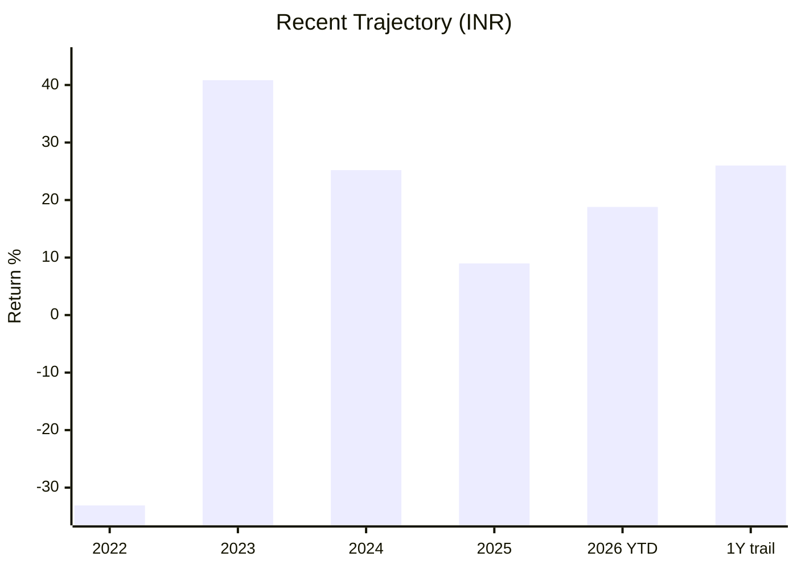

After the +41%/+25% AI-recovery surge of 2023–24, the fund **decelerated sharply in 2025 (+8.97% INR / +3.8% USD) — badly lagging MSCI ACWI (+22.4%)** — before rebounding to a new all-time high in 2026 YTD (+18.80%). The 2025 stumble is the single most important *recent* data point: it shows the concentrated-growth book can underperform a broadening market by ~19 points in a year, and it is exactly the risk a buyer entering at today's ATH must weigh.

---

## AUM & Capacity — No Constraint, But Sub-Scale

At **₹1,797 Cr**, PGIM is **mid-sized and carries no capacity constraint** (the underlying invests in deeply liquid global large-caps). Unlike a small-cap fund, AUM growth here is benign. The only AUM-adjacent risks are (1) **closure** if the SEBI cap fills (an event-risk for a 10-year SIP — see Module 4), and (2) the fund being a relatively **small piece of a small AMC's franchise** (PGIM India is sub-scale in Indian MF terms — an AMC-commitment question for Module 6, not a returns issue).

---

## Comparison with Studied Funds — A Diversifier, Judged on Role

The comparison is about **portfolio role**, not a same-rubric score (different asset class & currency):

| Dimension | **PGIM Global** | Franklin US Opp (3.14) | Parag Parikh FC (#1, 4.20) | DSP SmallCap (#1, 4.00) |
|-----------|-----------------|------------------------|----------------------------|--------------------------|
| Geography / engine | **Concentrated global growth (~35 stk)** | Diversified US growth (84 stk) | India all-cap | India small-cap |
| Genuine record | **7.75Y (post-switch)** | 13.5Y continuous | long | long |
| Benchmark | MSCI ACWI (broad) | Russell 3000 Growth (growth) | Nifty 500 | Nifty SC250 |
| **Track-record integrity** | **❌ Three-identity switch** | ✅ Continuous | ✅ | ✅ |
| Alpha vs own benchmark | ~matches (2020-carried) | **lags −1.3/−1.9%** ❌ | positive ✅ | positive ✅ |
| Of which currency | ~16%/yr | ~23%/yr | 0 | 0 |
| Negative calendar years | 1 of 9 (2022) | 1 of 13 (2022) | several | several |
| Max drawdown | **−43.4% (2.3Y recovery)** | −38.4% (1.5Y) | ~−35% | −49% |
| 1Y range | **−41% → +103%** | narrower | — | — |
| Worst-bear test | 2022 ✅ (no dot-com/GFC ⚠️) | 2022 ✅ (no dot-com/GFC ⚠️) | 2020/22 ✅ | 2018+20 ✅ |
| Diversification value | **Low (Mag-7 heavy; overlaps Franklin+PP)** | Low-ish | Core | Satellite |
| Sharpe (screening) | **0.93 (lowest open intl)** | 1.28 | — | — |
| 10Y SIP XIRR | 17.18% (part agri) | 17.25% | — | genuine |
| True all-in cost | **~2.21% (highest in sleeve)** | ~1.35% | ~0.6% | ~0.77% |
| Provisional M1 | **~3.0** | ~3.1 | 4.1 | 4.5 |

**Cross-portfolio insight:** PGIM is the **"higher-octane, shorter-record cousin of Franklin."** Against its *broad* benchmark it looks slightly better than Franklin (matches ACWI vs Franklin's clear lag) — but that is an artefact of a *softer* benchmark, one extraordinary 2020, and a genuine record barely half Franklin's length. On everything that matters for a *diversifier* sleeve — drawdown depth, cost, Sharpe, diversification value, and record integrity — **PGIM is weaker than Franklin.** Its only genuine edges are the modest non-US exposure (TSMC/ASML/Galderma) and the same structural rupee hedge Franklin already provides.

### vs the International Shortlist (preview)

Within the all-active international shortlist, PGIM is the **broad-global (ACWI) candidate** — the natural "one-fund international core" on paper. But Module 1 shows it is **not** a diversified core in practice (35-stock concentrated growth), it is the **most expensive** open option (~2.21% all-in), and it has the **worst record integrity** (the strategy switch). The study-plan's key question — *"is one all-world active fund a better core than stacking US + EM + Europe?"* — is answered **"not this one":** PGIM behaves like a concentrated US-tech-growth fund, so it does not remove the need for genuine EM / Europe diversifiers. Edelweiss US Tech (a deliberate growth amplifier) and the two EM funds must be tested to see whether the *diversifying* geographies do the job PGIM claims but does not deliver.

---

## Module 1 Scorecard

| Sub-dimension | Weight | Score (1–5) | Reasoning |
|---------------|--------|-------------|-----------|
| Long-term returns (genuine, INR) | High | **3.5** | Real 16.7% post-switch — but one 2020 year carries it, and it is only 7.75Y |
| Currency-adjusted return quality | High | **3.5** | ~13.6% USD global-growth beta is solid; not exceptional |
| **Alpha vs own benchmark** | High | **3.0** | Roughly matches MSCI ACWI gross (better than Franklin's lag) — but 2020-driven, against a soft benchmark, net of a 2.21% fee |
| **Track-record integrity** | High | **2.0** | **The three-identity strategy switch — worst discontinuity of any fund studied; the "long record" is not real** |
| Consistency across periods | High | **2.8** | Wild dispersion (+103%/−41% 1Y); 2025 lagged ACWI by ~19pt |
| Crash resilience | Critical | **3.0** | Genuine 2022 test (−43%, recovered in 2.3Y) ✅; deeper & slower than Franklin; no dot-com/GFC ⚠️ |
| Inception / window integrity | Modifier | **2.5** | Valley-CAGR window-distorted *and* the long record is a different fund |
| Rolling-return consistency | High | **3.3** | 0.5% negative 3Y, worst 5Y +3.98% — clean but benign-window + FX floor + part agribusiness |
| SIP XIRR quality | High | **3.5** | Genuine 5Y SIP 18.66%; 10Y 17.18% but early years are the agribusiness fund |
| Risk-adjusted (Sharpe / TE) | Medium | **2.3** | **Lowest Sharpe of open shortlist (0.93); 21.4% tracking error buying only a benchmark-match** |
| Diversification value | Medium | **3.5** | Positive but **worse than Franklin** — heavy Mag-7 overlap erodes portfolio diversification |
| Cost-aware return | Modifier | **2.0** | **~2.21% true all-in — highest in the sleeve; a heavy drag on a fund that only matches its index** |
| **Module 1 Overall** | **100%** | **~3.0 / 5** | **A high-octane concentrated global-growth fund whose headline record is younger and shakier than it looks: three unrelated identities under one ticker, a genuine strategy only 7.75 years old, carried by a single 2020 (+74% INR), roughly *matching* (not beating) a broad MSCI ACWI benchmark it barely resembles, with the deepest drawdown and lowest Sharpe of the open international shortlist, a live 2025 lag, the highest cost in the sleeve (~2.21%), and weaker diversification value than Franklin. Genuine as concentrated global-growth access; weak as a proven, long-record, diversifying core.** |

---

## SIP Implication

PGIM India Global Equity Opportunities is the international sleeve's **"broad-global candidate that isn't really broad, and long-record fund that isn't really long."** Its credentials look strong at a glance — a 15.8% since-inception CAGR, a +74% year, a 17.18% 10-year SIP, and the only open **global (MSCI ACWI)** mandate in the shortlist — but Module 1 dismantles most of that surface appeal. The advertised long record spans **three unrelated funds** (agribusiness → concentrated growth), so the genuine strategy is barely **7.75 years old**; the trailing numbers are **carried by a single 2020**; and what looks like a diversified "one-fund world" is in reality a **~35-stock, ~49%-top-10, US-tech-heavy growth bet** benchmarked to an index it does not resemble.

Judged fairly, the fund does have a real strength Franklin lacks: over its genuine period it **roughly matches MSCI ACWI in USD**, whereas Franklin clearly lags its growth benchmark — so PGIM is not a *failed* stock-picker. But that match is against a *soft, broad* benchmark, depends heavily on one extraordinary year, and comes with the **deepest drawdown (−43%, 2.3 years underwater), the lowest Sharpe (0.93), the highest tracking error (21.4%), and the highest cost (~2.21% all-in) of the open international shortlist.** Worse for a sleeve whose *purpose* is diversification, PGIM is **more** concentrated in the same Magnificent-Seven trade already owned via Franklin and Parag Parikh — so it *reduces* portfolio diversification rather than adding it.

For the 10-year SIP, the disciplined read is: **PGIM is concentrated global-growth *access* while the passive lane is shut — not a proven, long-record, diversifying core.** Its 2025 lag (−19 points vs ACWI) is a live warning that entering at today's all-time high carries real rotation risk. The modules ahead must verify: (M2) the currency-inclusive volatility, the down-capture vs ACWI, and the concentration risk; (M3) the full look-through and the exact overlap with Franklin and the domestic sleeves; (M4) the exact all-in cost, taxation, and closure risk; and (M5) whether Mark Baribeau's Jennison process is genuine repeatable skill or a well-timed growth-beta bet.

**Recommended holding period:** Minimum 7 years; ideally 10+. **Judge this fund as concentrated global-growth access (where its genuine 7.75-year record is respectable) heavily discounted for its fabricated-looking long record, its deep drawdown, its high cost, its low risk-adjusted return, and its poor diversification value — not as the diversified global core its ACWI label implies.**

---

## One-Line Verdict

> **PGIM India Global Equity Opportunities is a high-octane concentrated global-growth fund masquerading as a broad-global core — three unrelated identities under one ticker, a genuine strategy only ~7.75 years old, carried by a single 2020 (+74% INR), that merely *matches* the MSCI ACWI it barely resembles, with the deepest drawdown (−43%), lowest Sharpe (0.93), highest cost (~2.21%) and weakest diversification value of the open international shortlist. Genuine as concentrated global-growth access; weak as a diversifying core. Module 1: ~3.0/5 — a notch below Franklin US.**

---

*Module 1 completed: July 2026 | Returns Consistency | MFAPI methodology (PGIM Global scheme 138528, 2,497 points, Mar-2016 → Jun-2026) | Max drawdown (−43.42%) reproduces screening exactly; 3Y CAGR matches screening to 2dp | Benchmark = MSCI AC World Index TRI | Currency decomposition from ECB year-end ₹/$ (consistent with Franklin module) | Underlying = PGIM Jennison Global Equity Opportunities Fund (UCITS, TER 0.83%, adopted Oct-2018) | Provisional M1 Score: ~3.0/5 (subject to M2–M6)*
