# Module 2: Risk Profile — PGIM India Global Equity Opportunities Fund of Fund

*Sources: MFAPI NAV history — PGIM India Global Equity Opportunities FoF, Direct Growth (Scheme 138528, 2,497 days, 08-Mar-2016 → 30-Jun-2026) | India correlation vs UTI Nifty 50 Index Fund Direct (scheme 120716, 123-month overlap) | US-in-INR proxies: Motilal Oswal S&P 500 Index Fund Direct (148381, from Apr-2020) + Motilal Oswal Nasdaq 100 FoF Direct (145552, from Dec-2018) | **Intra-sleeve correlation vs Franklin U.S. Opportunities FoF Direct (118551, 123-month overlap)** | Daily ₹/$ from ECB/Frankfurter (2,474 aligned days) | Tickertape screening (May-2026) | Value Research. Benchmark = **MSCI AC World Index (ACWI) TRI**. All beta/correlation/capture/currency figures independently computed — not published for this fund.*

---

## Raw Data (Compiled Across Sources)

| Metric | Value | Source |
|--------|-------|--------|
| **Volatility (monthly INR — canonical)** | **18.8%** | MFAPI computed |
| Volatility (daily — *FoF-inflated, discard*) | 20.7% | MFAPI — see FoF-pricing caveat |
| **Max Drawdown** | **−43.42%** | Screening / MFAPI **(exact match)** ✅ |
| Drawdown peak → trough | ₹45.09 (08-Nov-2021) → ₹25.51 (16-Jun-2022) | MFAPI |
| Peak-to-trough / recovery | **220 days / 850 days (~2.3y underwater)** | MFAPI |
| Number of 25%+ drawdowns (record) | **3** | MFAPI |
| **Correlation to Nifty 50 (monthly)** | **0.34 — β 0.40 — R² 12%** | MFAPI vs scheme 120716 |
| **⭐ Correlation to Franklin US Opp (monthly)** | **0.91 — β 0.95 — R² 83%** | MFAPI vs scheme 118551 |
| Correlation to S&P 500-INR (monthly) | 0.82 — β **1.27** — R² 66% | MFAPI vs scheme 148381 |
| Correlation to Nasdaq-INR (monthly) | 0.76 — β 0.69 — R² 58% | MFAPI vs scheme 145552 |
| **Currency (₹/$) vol (monthly)** | **4.8%** | MFAPI/ECB (directly computed) |
| **Corr(US-market return, ₹/$ move)** | **−0.25** | MFAPI — *net hedge* |
| USD-NAV volatility (monthly) | **19.3%** | MFAPI/ECB (directly computed) |
| Sharpe (computed full / screening) | 0.53 / **0.930** | MFAPI (rf 6.5%) / Tickertape |
| **Sortino (computed, full)** | **0.75** | MFAPI (MAR=0) |
| Calmar (5Y / 3Y) | 0.22 / 0.48 | Computed |
| Downside Deviation (ann) | 14.5% | MFAPI |
| VaR 95% (daily) | −2.06% | MFAPI |
| **Tracking Error (vs MSCI ACWI)** | **21.39%** | Screening — *highest of the open intl shortlist* |
| % from ATH | −0.32% (≈ at ATH) | MFAPI |
| SEBI Risk Category | **Very High** | Universal for intl equity |
| VRO Star Rating | **Unrated / low** | Value Research |

---

## The Module 2 Tension — Same Shape as Franklin, Worse on Every Standalone Axis

PGIM's risk profile is the **same archetype as Franklin's** — "poor standalone risk, valuable India-diversifier" — but it is a **degraded version of it** on nearly every measurable axis, and it introduces one entirely new problem Franklin did not have.

**Story A — On its own, the standalone risk is poor, and worse than Franklin's:**
- **Higher volatility** (18.8% monthly vs Franklin 17.2%)
- **Deeper max drawdown** (−43.4% vs −38.4%) with a **longer 2.3-year recovery**
- **The worst down-capture of any fund studied** — fell −33% in 2022 when a broad S&P 500 INR fund fell −9.8%, and fell *more than the Nasdaq*
- **A collapsed Sortino (0.75 vs Franklin's 1.30)** — Franklin's one flattering standalone metric is simply absent here
- **Genuine single-name concentration risk** (~35 stocks, top-10 ≈49%, NVIDIA ≈9%) — Franklin's 84-stock book was far more diffuse
- The worst US-growth bears (dot-com, GFC) are **absent** from the record — and matter *more* for a concentrated book

**Story B — Its India-diversification is intact and elite (same as Franklin):**
- **R² of just 12% to the Nifty** — ~88% of its variance is independent of Indian equity
- **The rupee is a directly-confirmed net hedge** (INR vol 18.8% < USD-NAV vol 19.3%; corr −0.25)

**Story C — The new problem: it is 83% correlated to Franklin itself.**
- PGIM and Franklin are **substitutes, not complements** (R² 83%). Holding both doubles a single Magnificent-Seven bet and adds almost no diversification *between* them.

**The reconciliation:** PGIM diversifies *your India sleeves* just as well as Franklin — but it does so with a **worse standalone risk profile** and is **redundant with Franklin.** For a portfolio, its risk case is "good diversifier from India, poor standalone risk, and you only need one fund like it — of which Franklin is the better-built version."

---

## ⚠️ The FoF Daily-Pricing Caveat — Read Before Any Daily Metric

A feeder's NAV is **stale by construction**: today's published NAV ≈ (yesterday's foreign-fund NAV) × (today's ₹/$). The foreign market and the currency are struck at different times, and the catch-up creates **artificial daily jumps** that *overstate* daily-frequency risk.

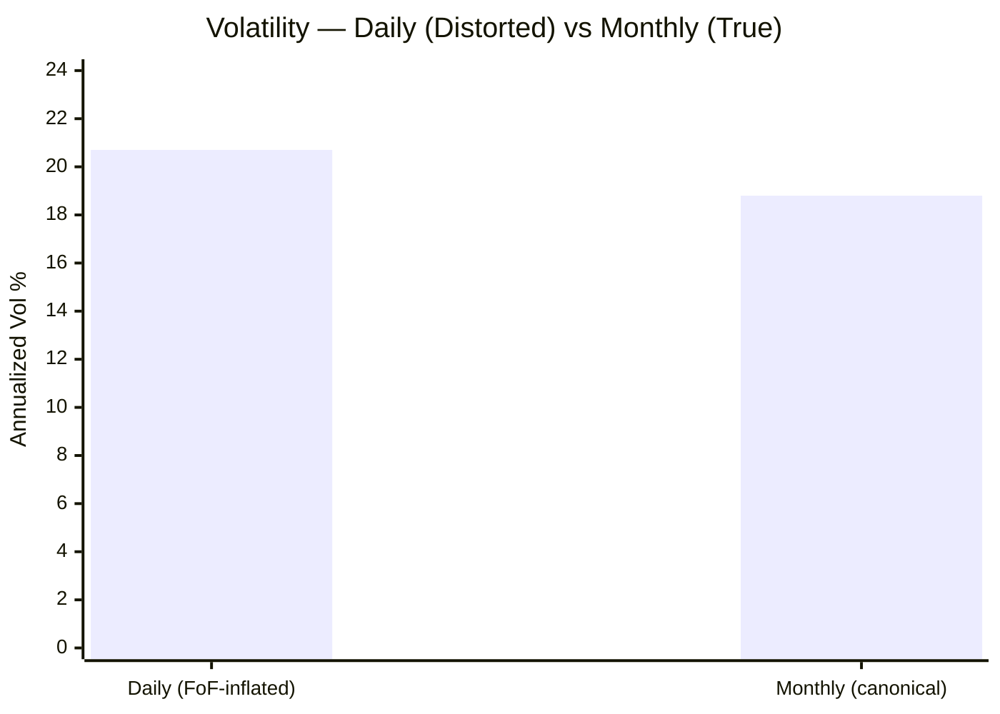

| Method | Vol | Verdict |
|--------|-----|---------|
| Daily × √252 | **20.7%** | ⚠️ Inflated by async foreign/FX pricing — **discard** |
| **Monthly × √12** | **18.8%** | ✅ **Canonical** |

The tell: the computed "worst day −9.51% / best day +7.89%" and a near-symmetric daily down/up>2% ratio (1.02×) are larger and lumpier than a global large-cap fund actually moves — pricing artefacts, not real one-day swings. **Throughout this module, monthly-based and calendar-based metrics are canonical; daily figures are shown only where the distortion is itself the point.** This is structural for *every* feeder fund and a permanent caveat for the international sleeve.

---

## Volatility — Higher than Franklin, and Even More Front-Loaded

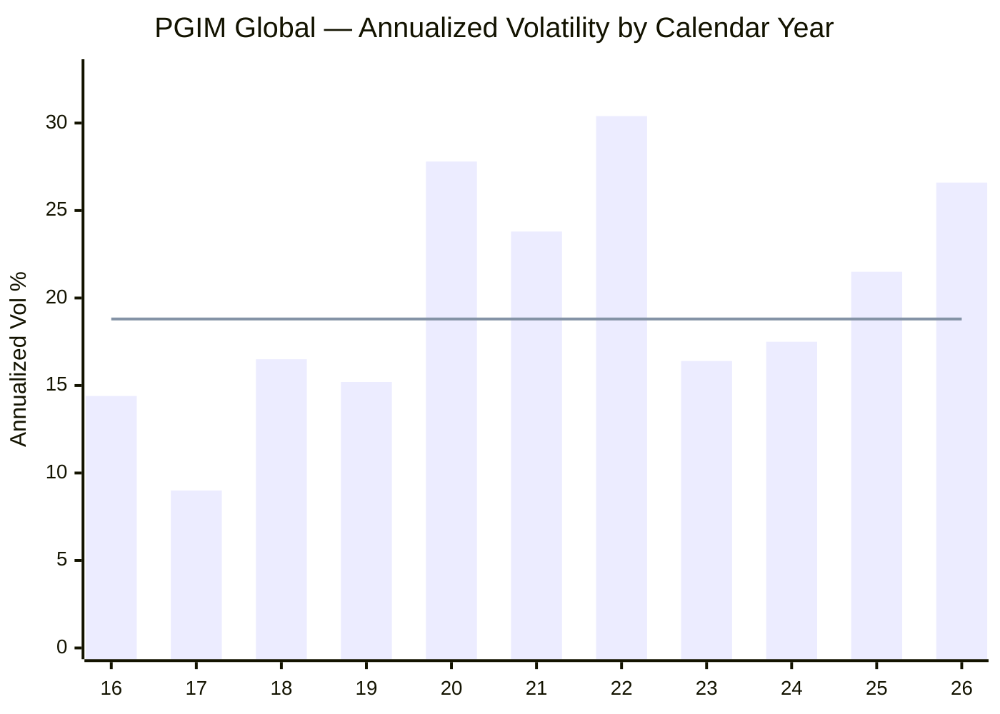
> Line = full-history canonical vol (~18.8%) | 2026 = YTD (daily-based per-year, directional)

| Year | Vol | Context |
|------|-----|---------|
| 2017 | **9.0%** | Calmest — but this is the *agribusiness* fund (pre-switch) |
| 2020 | **27.8%** | COVID + Jennison concentrated growth |
| 2021 | 23.8% | Late-cycle melt-up + rotation |
| 2022 | **30.4%** | The growth crash — highest in fund history |
| 2026 YTD | 26.6% | Recovery to ATH, elevated |

**The structural read:** the ~18.8% headline is **higher than Franklin (17.2%)** and well above Parag Parikh FlexiCap (~9–13%) — the direct consequence of ~35-stock concentration. Like Franklin it is "calm-then-explosive" (long quiet stretches punctuated by violent 30%+ years) — but note the two calmest years (2017: 9.0%, 2016: 14.4%) were the *agribusiness* fund, so the **genuine-strategy volatility floor is higher than the chart's left edge suggests.**

---

## ⭐ Correlation to Indian Equity — The Diversification Centerpiece *(international-specific)*

The most important number for the sleeve's *purpose*. Monthly-return correlation to the Nifty 50 over the 123-month overlap:

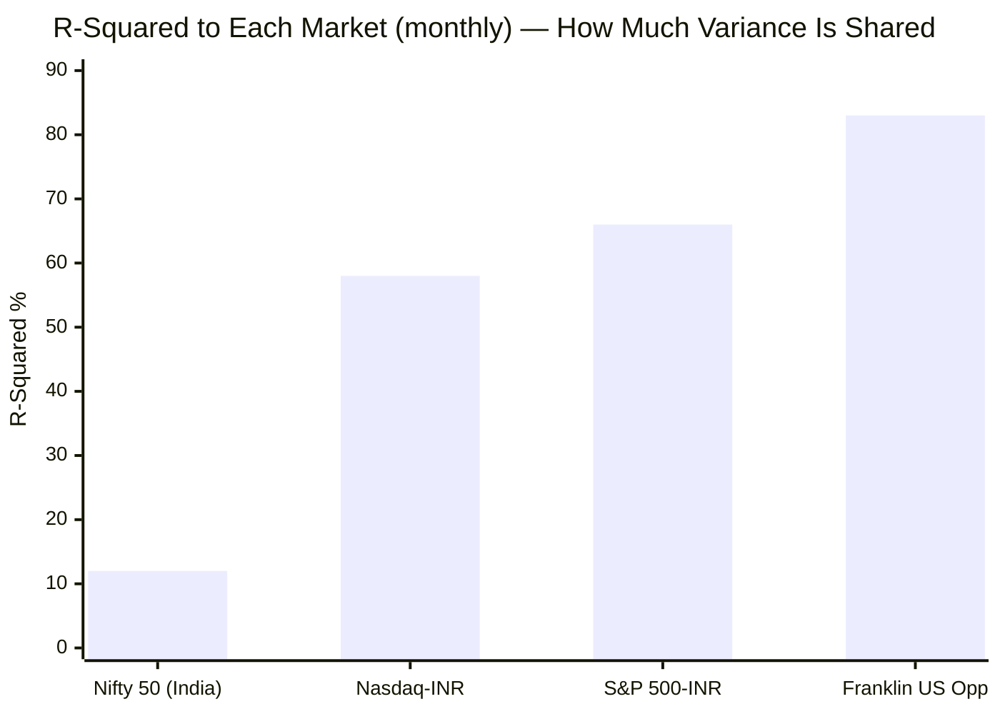

| Benchmark | Correlation | Beta | R² | Overlap |
|-----------|-------------|------|-----|---------|
| **Nifty 50 (India)** | **0.34** | **0.40** | **12%** | 123 months |
| S&P 500 (INR) | 0.82 | 1.27 | 66% | 74 months |
| Nasdaq 100 (INR) | 0.76 | 0.69 | 58% | 90 months |
| **Franklin US Opp** | **0.91** | **0.95** | **83%** | 123 months |

**Versus India, PGIM is an elite diversifier — R² just 12% to the Nifty** (essentially identical to Franklin's 11%). Roughly 88% of its return variance is independent of Indian equity; it is driven by US/global corporate earnings, the Fed, and the dollar — not by Indian earnings or the RBI. When your FlexiCap and SmallCap sleeves (both ~100% India-correlated) fall on a domestic shock, PGIM is, to first order, *not*. **No domestic fund can supply this.** On *this* axis — the reason the sleeve exists — PGIM scores as highly as Franklin.

The problem is not its correlation to India. It is its correlation to **Franklin** (next section).

---

## ⭐ The "Two Funds, One Bet" Problem — PGIM Is 83% Correlated to Franklin *(PGIM-specific — the key new section)*

The single most important risk finding of this module is **intra-sleeve, not standalone.** Over the 123-month overlap, PGIM's monthly returns correlate **0.91 (R² 83%, beta 0.95)** with Franklin U.S. Opportunities — the other leading candidate in this international shortlist.

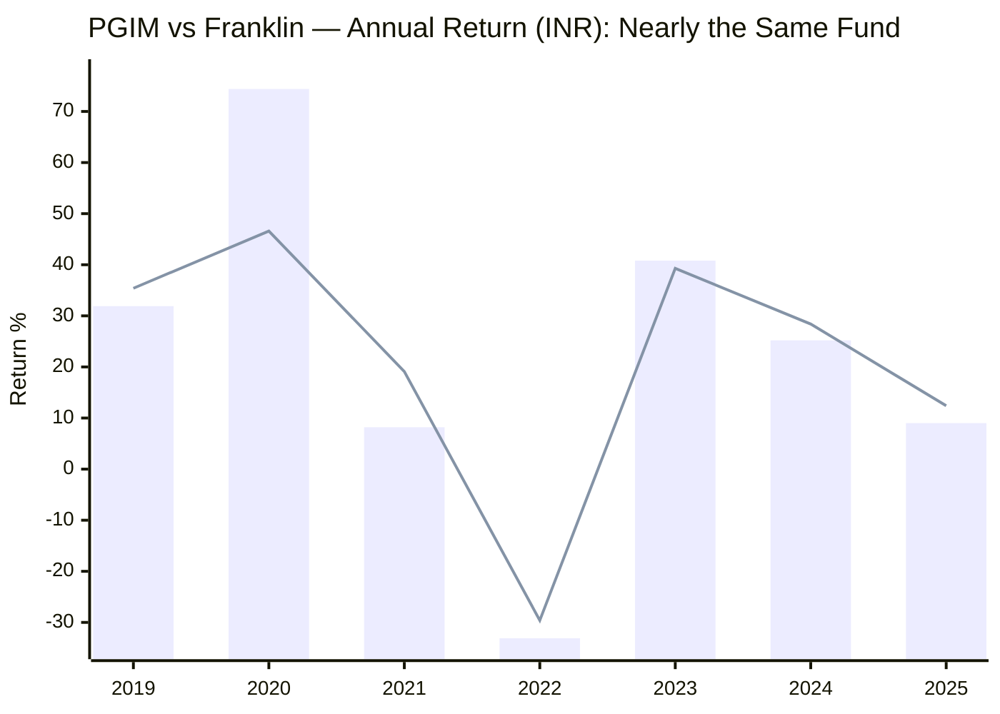
> Bar = PGIM (INR) | Line = Franklin US Opp (INR). Same direction every single year; PGIM is simply the higher-amplitude version.

**Why they are near-identical:** both are **concentrated US-mega-cap-growth books** — the same NVIDIA / Alphabet / Amazon / Apple / Microsoft engine — wrapped in a USD feeder with the same rupee mechanism. PGIM adds a few genuinely non-US names (TSMC, ASML, Galderma, Siemens Energy) and runs more concentrated, so it is the *amplified* version — but it moves with Franklin ~9 times out of 10.

**The portfolio consequence is decisive:**
- **Holding both PGIM and Franklin adds almost no diversification *between* them.** You would simply be running a single, larger Magnificent-Seven bet under two names — doubling the very concentration the sleeve should avoid.
- **They are substitutes, not complements.** The correct portfolio question is not "PGIM *and* Franklin?" but "**PGIM *or* Franklin?**"
- On the Module 1 + Module 2 evidence so far, **Franklin is the better-built version of the same bet**: cheaper (~1.35% vs ~2.21% all-in), longer genuine record (13.5Y continuous vs 7.75Y post-switch), better Sortino (1.30 vs 0.75), shallower drawdown (−38% vs −43%), and no strategy-switch discontinuity. PGIM's only edges are marginally more non-US exposure and a higher-beta upside.

This is the finding the decision-tree must carry: **PGIM's diversification value is real against India but redundant against Franklin.** Its portfolio-contribution score is therefore *conditional* — high if it is the *only* US-growth feeder held, low if stacked on top of Franklin.

---

## ⭐ Amplified US Beta & Capture vs the Index Alternative *(international-specific)*

The flip side of the 0.82 US correlation: **beta 1.27 to the S&P 500 in INR** (essentially identical to Franklin's 1.26). PGIM is not "global-market exposure" — it is **1.27× concentrated global-*growth* exposure**, benchmarked to a broad index it does not resemble. The calendar capture vs the tradeable US-in-INR alternatives is the worst of any fund studied:

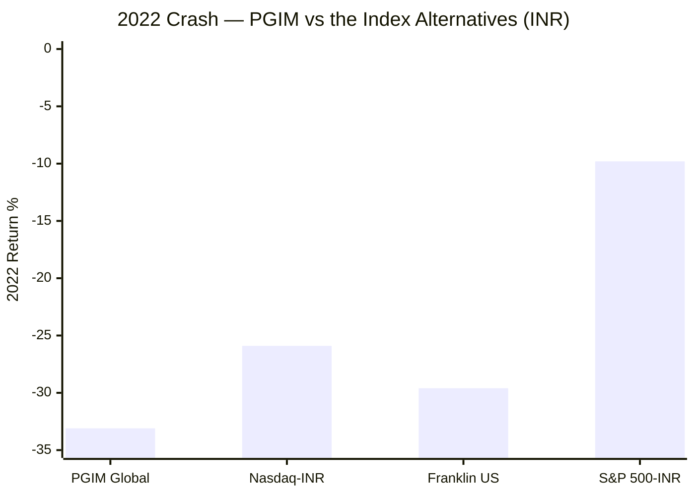

| Year | PGIM | S&P 500-INR | Nasdaq-INR | Franklin | Read |
|------|------|-------------|------------|----------|------|
| 2020 | **+74.4%** | +25.5% | +51.4% | +46.6% | Massive up-capture (concentration paid) ✅ |
| 2021 | +8.2% | +30.2% | +29.0% | +19.1% | Badly lagged the melt-up ❌ |
| **2022** | **−33.1%** | **−9.8%** | −25.9% | −29.6% | ⚠️ **Fell MORE than the Nasdaq; 3.4× the S&P** |
| 2023 | +40.8% | +25.5% | +53.0% | +39.3% | Beat S&P, lagged Nasdaq |
| 2024 | +25.2% | +27.2% | +55.7% | +28.4% | Lagged both |
| 2025 | +9.0% | +22.4% | +7.7% | +12.4% | ⚠️ Lagged S&P by ~13 pts |

**The damning comparison:** in the 2022 bear a *boring* S&P 500 INR index fund fell **−9.8%**; PGIM fell **−33.1%** — and it fell **more than the Nasdaq (−25.9%)**. That is the **worst down-capture of any fund in either study** — the pure cost of ~35-stock concentration. It captured 74% in the 2020 boom but gave much of it back in 2022, and lagged a plain S&P 500 fund in the 2021 melt-up *and* the 2025 broadening. This is the risk-side confirmation of Module 1: against a broad index PGIM is **higher-risk (M2) and, over the genuine record, no higher-return (M1).**

---

## ⭐ Currency Risk Decomposition — A Directly-Confirmed Net Hedge *(international-specific)*

The textbook assumption is that foreign-currency exposure *adds* volatility. For an Indian investor in global equity, **the opposite is true** — and here it is measured directly (not derived) by pairing PGIM's INR NAV with the ECB daily ₹/$ series across 2,474 aligned days.

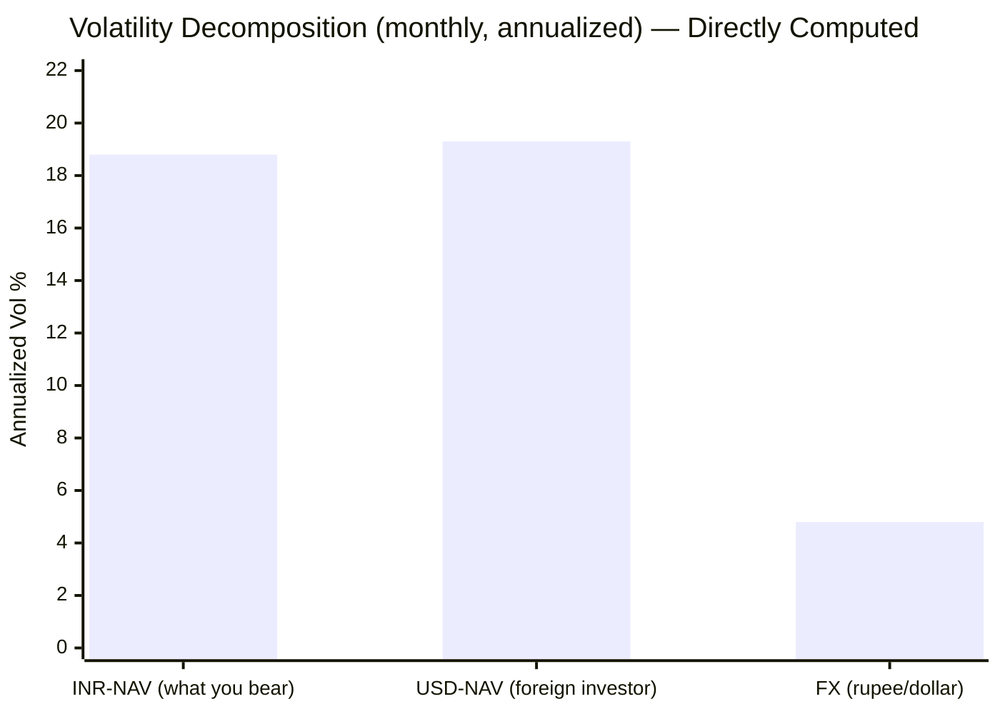

| Component | Annualized vol | Read |
|-----------|----------------|------|
| INR-NAV volatility (the Indian investor) | **18.8%** | What you actually bear |
| USD-NAV volatility (a foreign investor) | **19.3%** | The pure market risk |
| FX (₹/$) standalone volatility | **4.8%** | The currency's own swings (calmer than Franklin's 6.1% — PGIM's window excludes the 2013–15 taper tantrum) |
| **Corr(USD-market return, ₹/$ move)** | **−0.25** | The hedge mechanism |

**The counterintuitive, directly-confirmed result:** despite 4.8% of standalone currency volatility, **the INR investor's total volatility (18.8%) sits *below* the pure-dollar investor's (19.3%).** The reason is the measured **−0.25 correlation**: when global equity sells off (risk-off), capital flees to the dollar, the **rupee weakens, and the ₹/$ gain partially offsets the equity loss.** The currency is a **natural partial hedge, not an additive risk** — the same mechanism as Franklin, with a thinner FX contribution. This quantifies the Module 1 "shock-absorber" (the rupee cushioned the 2022 crash by ~7 points: −39.8% USD → −33.1% INR). **The tail to remember: in a rupee-*appreciation* regime this hedge reverses into a drag.**

---

## Max Drawdown — Fewer but Deeper Than Franklin (The Concentration Signature)

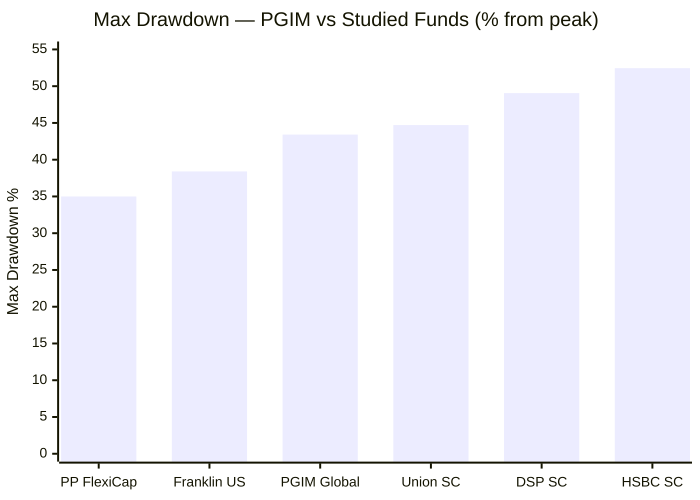

PGIM's −43.42% is **deep for an international large-cap fund** — approaching small-cap territory (Union −44.7%) and clearly worse than Franklin (−38.4%). Where Franklin's story was drawdown-*frequency* (five 20%+ falls), PGIM's is drawdown-*depth*: **three 25%+ drawdowns, two of them 26%+ and one a −43%.** Concentration produces less frequent but more violent falls.

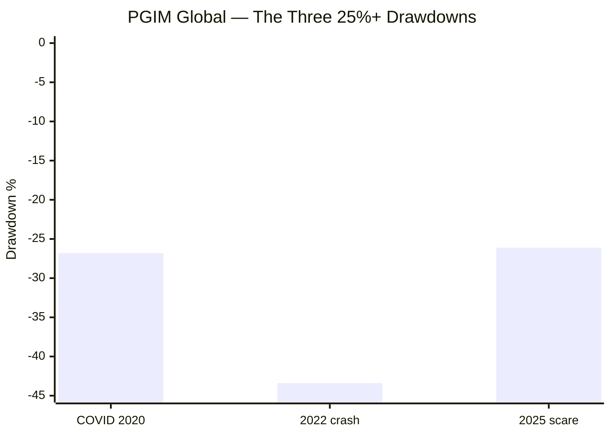

| # | Period | Depth | Down→trough | Recovery | Event |
|---|--------|-------|-------------|----------|-------|
| 1 | Nov 2021 → Jun 2022 | **−43.4%** | 220d | **850d (~2.3y underwater)** | The Fed-hike growth crash |
| 2 | Feb → Mar 2020 | −26.8% | 27d | 81d | COVID (fast V) |
| 3 | Feb → Apr 2025 | −26.1% | 56d | 211d | Tariff / growth scare |

**Two reframings:**
1. **The 2022 drawdown was deeper and slower than Franklin's** (−43% / 2.3y vs −38% / 2.2y) — the extra concentration cost ~5 points of depth. The 2.3 years underwater is a genuine test of SIP discipline.
2. **The record has no 2018 event of its own** — because in Q4-2018 the fund was still the *agribusiness* strategy. So PGIM lacks even the "different 2018 test" Franklin can claim; its genuine-strategy stress history is essentially the single 2022 bear plus two fast ~26% scares.

---

## The "No Dot-Com, No GFC" Tail — More Dangerous for a Concentrated Book *(risk-framed)*

The genuine strategy begins **Oct-2018**, excluding the two catastrophic growth bears:

| Missing bear | Growth drawdown | Recovery | Why it matters *more* for PGIM |
|--------------|-----------------|----------|-------------------------------|
| **2000–2002 dot-com** | **−60% to −80%** | ~13 years for Nasdaq | A ~35-stock concentrated growth book would be devastated |
| **2008 GFC** | **~−50%** | ~4 years | A systemic test the strategy has never faced |

PGIM's deepest *recorded* drawdown (−43%) is **roughly half to two-thirds** of the dot-com worst case — and its concentration means the *unmodelled* worst case is **worse than Franklin's**, even though the observed histories look comparable. For a 10-year SIP this is the single most important risk caveat: **size the position for a −55%+ event, not a −43% one**, and remember the rupee hedge (which assumes risk-off → strong dollar → weak rupee) is itself untested in a US-centred solvency crisis.

---

## Worst & Best Rolling Periods (MFAPI)

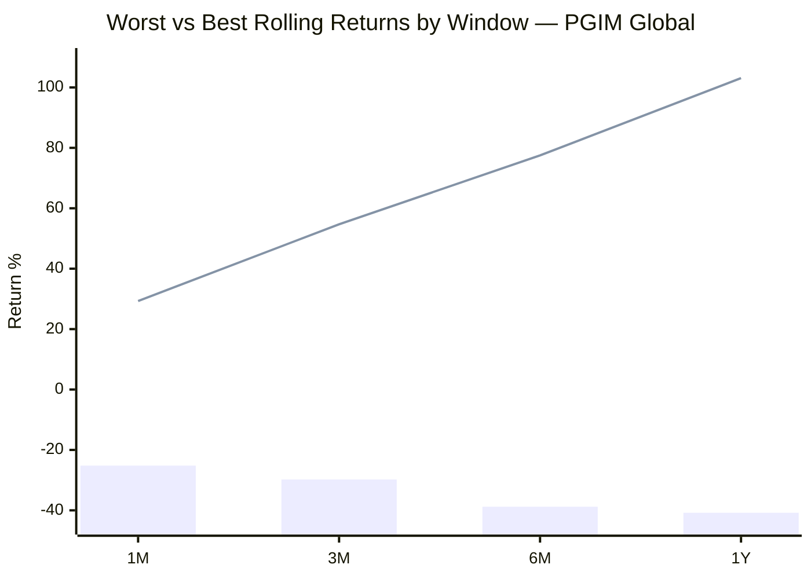
> Bar = worst window | Line = best window

| Window | Worst | Period | Best | Period |
|--------|-------|--------|------|--------|
| 1 Month | −25.2% | Feb→Mar 2020 (COVID) | +29.3% | Mar→Apr 2020 |
| 3 Months | −29.8% | Dec 2021→Mar 2022 | +54.7% | Mar→Jun 2020 |
| 6 Months | −38.8% | Nov 2021→May 2022 | +77.5% | Mar→Sep 2020 |
| 1 Year | **−40.8%** | Nov 2021→Nov 2022 | **+103.1%** | Mar 2020→Mar 2021 |

**The widest swing of any fund studied: a −40.8% worst year and a +103.1% best year.** That ~144-point spread *is* the concentration, in a single statistic. Like Franklin, both extremes pivot on the same dates (the COVID trough was the best entry, the 2021 growth-peak the worst) — but PGIM's amplitude is far larger at every window.

---

## Daily Return Distribution — *Read With the FoF Caveat*

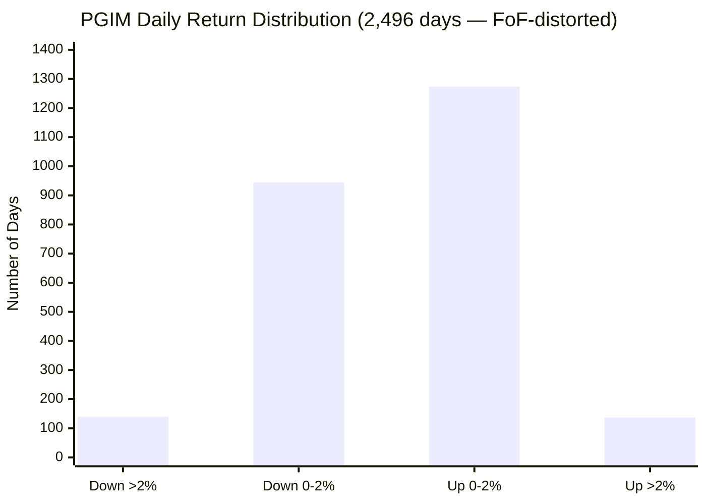

| Metric | Value | Caveat |
|--------|-------|--------|
| Positive days | 1,337 / 2,496 (53.6%) | Genuine-ish |
| Down >2% / Up >2% | 140 / 137 (**1.02× ratio**) | ⚠️ *Both inflated by FoF catch-up jumps* |
| Worst single day | −9.51% | ⚠️ Partly a pricing catch-up |
| Best single day | +7.89% | ⚠️ Partly a pricing artefact |
| Daily VaR (95%) | −2.06% | ⚠️ Inflated |

**Interpretation — deliberately cautious.** As with Franklin, PGIM's daily distribution is **unreliable**: a feeder cannot genuinely move ±9% in a day on a global large-cap portfolio; those are async-pricing artefacts. The one robust read is the **near-symmetric down/up ratio (1.02×)** — no strong daily skew either way. **For a feeder, judge risk on monthly and calendar data, never daily.**

---

## Sharpe Ratio

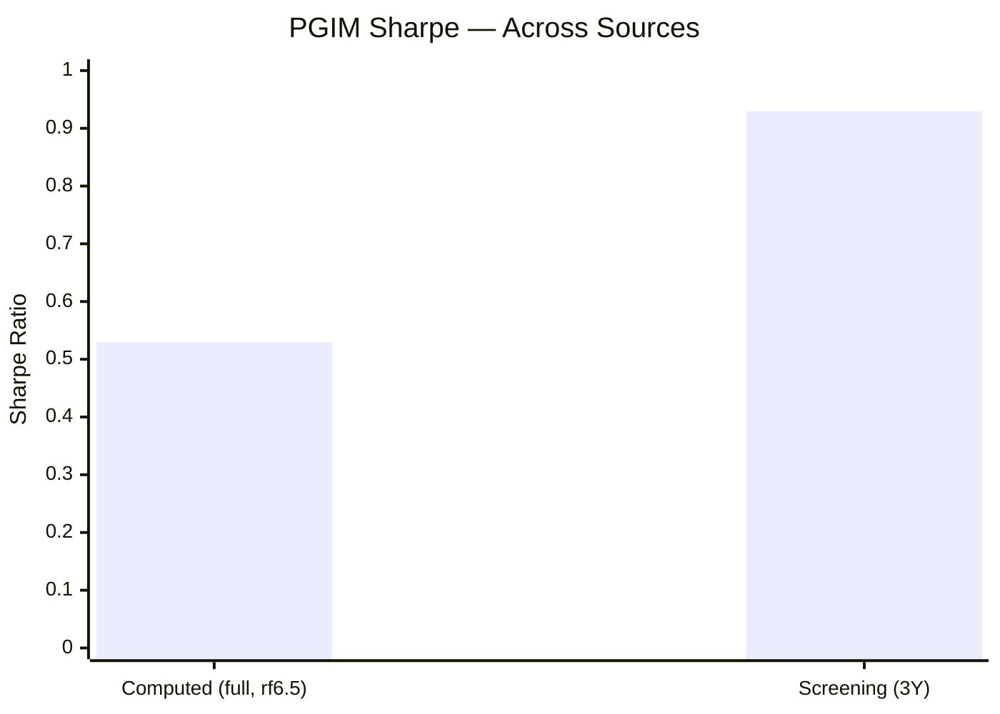

| Source | Sharpe | Window | Note |
|--------|--------|--------|------|
| MFAPI computed | **0.53** | Full 10.3Y, rf 6.5% | Conservative; includes 2022; below Franklin's 0.60 |
| Screening | **0.930** | ~3Y | Recovery-window flattered — **and the lowest of the open intl shortlist** |

**Reliable range 0.53–0.93 — the weakest of the open international shortlist.** The screening 0.93 is real but window-dependent (measures the 2023–25 recovery off a depressed base); the full-period 0.53 is the honest through-cycle figure, and it is *below* Franklin's 0.60. As always, Sharpe is **not cross-comparable to the India funds** (different return/risk regimes; the rupee tailwind inflates the numerator). PGIM's Sharpe is a mild negative, not a selling point.

---

## Sortino Ratio — The Missing Bright Spot

| Source | Sortino | Window |
|--------|---------|--------|
| MFAPI computed | **0.75** | Full (MAR=0) |

**This is where PGIM most clearly falls behind Franklin.** Franklin's computed Sortino was **1.30** — its *one* flattering standalone metric, showing volatility skewed to the upside. **PGIM's Sortino is just 0.75** — barely above its Sharpe (0.53), which tells us its volatility is *not* meaningfully upside-skewed: the deep 2022 downside is large enough to dominate the denominator. Downside deviation is 14.5% (similar to Franklin's 14.74%), but PGIM's lower excess return over that downside is what sinks the ratio. **The practical read: Franklin had at least one standalone metric that flattered it; PGIM has none.**

### Why Sortino Matters for SIP Investors
- **Sharpe** penalises all volatility, including wealth-building upside swings.
- **Sortino** penalises only harmful *downside* volatility.
- PGIM's Sortino (0.75) ≈ its Sharpe (0.53) tells us its big moves are roughly *symmetric*, not upside-skewed — the concentrated-growth book gives back in bad years much of what it wins in good ones.

---

## Calmar Ratio — Weak, Dragged by the Valley CAGR and the Deep Drawdown

| Period | CAGR | Max DD | Calmar |
|--------|------|--------|--------|
| 3Y | 20.70% | 43.42% | **0.48** |
| 5Y | 9.35% | 43.42% | **0.22** |

PGIM's 5Y Calmar (0.22) is **weak — below Franklin's 0.28** — for two compounding reasons: the numerator is the valley-shaped, crash-front-loaded 9.35% (Module 1), and the denominator is the deepest drawdown of the two funds (−43%). Return-per-unit-of-max-pain is poor, consistent with the broader Module 2 verdict that the standalone risk/reward is worse than Franklin's.

---

## Beta, R² & Tracking Error vs the Benchmark — The Highest Active Risk in the Sleeve

| Metric | Value | Read |
|--------|-------|------|
| Beta vs S&P 500-INR | **1.27** | Amplified US risk (≈ Franklin's 1.26) |
| R² vs S&P 500-INR | 66% | Substantially US-market beta |
| **Tracking Error vs MSCI ACWI** | **21.39%** | ⚠️ **Highest of the open intl shortlist** (Franklin 16.8%) |

The **21.4% tracking error** is the sharpest active-risk number in the sleeve. It reflects a ~35-stock growth portfolio benchmarked against a ~2,500-stock broad index — the fund takes *enormous* active + concentration + currency risk versus ACWI, and (Module 1) only *matches* that benchmark net over its genuine record. From a risk lens: **you are paying ~2.21% all-in to take 21.4% of tracking-error risk for a benchmark-matching return** — an even poorer active-risk bargain than Franklin's. A passive ACWI/MSCI World INR feeder would deliver the same India-diversification and rupee hedge at near-zero tracking error and ~1/10th the cost.

---

## ⭐ Concentration as a Risk Axis — A Risk Franklin Largely Avoids *(PGIM-specific)*

Unlike a small-cap fund, the underlying holds **deeply liquid global large-caps** — so there is **no liquidity/redemption-spiral risk.** But PGIM carries a concentration risk that Franklin's diffuse 84-stock book largely does not:

| Dimension | PGIM underlying | Franklin underlying |
|-----------|-----------------|---------------------|
| Number of holdings | **~35–40** | ~84 |
| Top-10 weight | **~49.4%** | ~44% |
| Largest single name | **NVIDIA ~9.0%** | ~7% |
| Style | Concentrated growth | Diversified growth |

**Single-name risk is genuine here.** A ~9% position in NVIDIA means one stock's re-rating can move the whole fund several points; the top-10 at ~49% means half the portfolio rides on ten decisions. This is *why* the down-capture is the worst studied and the drawdown the deepest — the concentration that produced the +74% 2020 is the same concentration that produced the −43% 2022. For a diversifier sleeve, single-name concentration is a risk to price in, not a feature. **Module 3's look-through will quantify the full book; Module 2's flag is that PGIM's risk is materially more idiosyncratic than Franklin's.** *(The structural non-idiosyncratic risk remains closure — a SEBI-cap breach could pause SIPs mid-plan; Module 4.)*

---

## ⭐ Risk Contribution to the Blended Portfolio — Conditional on Not Also Holding Franklin *(international-specific lens)*

The right question for a *third sleeve* is: what does adding PGIM do to a FlexiCap + SmallCap portfolio's risk?

| Property | Value | Portfolio effect |
|----------|-------|------------------|
| R² to Nifty | **12%** | Adds a near-orthogonal return stream — lowers blended volatility |
| Beta to India | **0.40** | Dampens domestic-shock drawdowns at the portfolio level |
| Currency | net hedge (−0.25) | Cushions global risk-off (₹ weakens when global equity falls) |
| Standalone vol | 18.8% | Higher than the SmallCap sleeve — not a vol *reducer* by itself |
| **R² to Franklin US** | **83%** | ⚠️ **If Franklin is also held, PGIM adds little incremental diversification** |

**The conditional insight:** *versus the India-only portfolio,* PGIM **lowers** blended risk exactly as Franklin does — its 12% India-R² means its drawdowns rarely coincide with the FlexiCap/SmallCap drawdowns (a 2022-style US-growth crash typically occurs when Indian equity is flat-to-up, and the 2018 IL&FS winter barely touched global growth). But *versus a portfolio that already holds Franklin,* PGIM's incremental diversification is small (83% mutual correlation). **So PGIM's portfolio-contribution score is high as a standalone diversifier but drops sharply as a *second* US-growth feeder.** The decision-tree implication: PGIM competes *with Franklin* for the single US/global-growth slot, and does not earn a slot *alongside* it. *(The systemic caveat still applies: in a 2008-style crisis all correlations converge toward 1 and the diversification temporarily fails.)*

---

## Risk Metrics — Comparison with Studied Funds

```mermaid
quadrantChart
    title Standalone Risk vs Portfolio Diversification Value
    x-axis "Lower Diversification (India-like)" --> "Higher Diversification"
    y-axis "Worse Standalone Risk" --> "Better Standalone Risk"
    quadrant-1 Elite (both)
    quadrant-2 Good standalone, India-correlated
    quadrant-3 Poor (both)
    quadrant-4 Diversifier, weak standalone
    Parag Parikh FC: [0.30, 0.85]
    DSP SmallCap: [0.20, 0.60]
    Union SmallCap: [0.18, 0.70]
    Franklin US Opp: [0.95, 0.40]
    PGIM Global: [0.93, 0.28]
```
> PGIM sits just below Franklin in the far-right "diversifier, weak standalone" quadrant — same elite India-decorrelation, but a lower standalone-risk score. And the two nearly overlap, visually confirming the 83% mutual correlation.

| Metric | PGIM Global | Franklin US | PP FlexiCap | DSP SC | Union SC |
|--------|-------------|-------------|-------------|--------|----------|
| Volatility (monthly) | 18.8% | 17.2% | ~9–13% | 15.9% | 17.4% |
| Max Drawdown | **−43.4%** | −38.4% | ~−35% | −49% | −44.7% |
| # of 25%+ drawdowns | 3 (deep) | 5 × 20%+ (frequent) | ~2 | ~2 | ~2 |
| **R² to Nifty** | **12% ⭐** | 11% ⭐ | ~100% | ~100% | ~100% |
| Down-capture vs own index | **worst (fell > Nasdaq in '22)** | poor (3× S&P) | strong | moderate | 47% (best) |
| Sharpe (full) | **0.53** | 0.60 | — | — | — |
| Sortino (computed) | **0.75** | 1.30 | ~1.06 | 1.34 | 0.911 |
| Calmar (5Y) | **0.22** | 0.28 | — | — | — |
| Tracking error | **21.4%** | 16.8% | — | — | — |
| Concentration | **~35 stk, NVDA 9%** | ~84 stk | diffuse | 81 stk | ~70 stk |
| Currency effect | net hedge (−0.25) | net hedge (−0.24) | minor | none | none |
| Tail risk (absent) | **dot-com / GFC ⚠️** | dot-com / GFC ⚠️ | — | — | — |
| Multi-cycle proof | **minimal (7.75Y, 1 bear)** | partial | ✅ | ✅ | ✅ |

**Cross-portfolio interpretation:** PGIM is **Franklin's higher-amplitude, worse-built twin.** It shares the elite 12% India-R² and the rupee hedge — but on every standalone axis (volatility, drawdown depth, Sharpe, Sortino, Calmar, down-capture, tracking error, concentration) it is *worse*, and it is 83% correlated to Franklin. Standalone, it is the **weakest risk profile of the funds studied**; as a diversifier from India it ties Franklin; as a diversifier *from Franklin* it fails. The role — and specifically whether Franklin already occupies the US-growth slot — decides its value.

---

## Risk Profile — Points For and Against

### ✅ Points IN FAVOUR
1. **Near-zero correlation to Indian equity (R² 12% to Nifty)** — the genuine diversification the sleeve exists for; unavailable from any domestic fund
2. **The rupee is a directly-confirmed net hedge (−0.25)** — INR vol 18.8% < USD-NAV vol 19.3%; cushions global risk-off
3. **Massive up-capture in growth booms** — +74% in 2020 (the concentration cuts both ways)
4. **No liquidity/redemption-spiral risk** — the underlying holds deeply liquid global large-caps
5. **Currently at all-time high** (−0.32%) — fully recovered from the −43% drawdown
6. **Lowers blended three-sleeve portfolio risk** — *if it is the only US-growth feeder held*

### ⚠️ Points AGAINST
1. **83% correlated to Franklin** — redundant if both held; the two are substitutes
2. **Worst down-capture of any fund studied** — fell −33% in 2022 vs S&P 500 INR −9.8%, and fell *more than the Nasdaq*
3. **Deepest drawdown of the two feeders (−43%)** with a 2.3-year recovery
4. **Higher volatility than Franklin** (18.8% vs 17.2%) and highest tracking error (21.4%)
5. **Collapsed Sortino (0.75 vs 1.30)** — no flattering standalone metric
6. **Genuine single-name concentration** (~35 stocks, NVIDIA ~9%, top-10 ~49%)
7. **Minimal multi-cycle proof** — genuine strategy only 7.75Y, one real bear; no dot-com/GFC tail (more dangerous for a concentrated book)
8. **Currency hedge reverses in a ₹-appreciation regime**; diversification fails in a global systemic crisis
9. **Daily risk metrics unreliable** (FoF pricing)

---

## Module 2 Scorecard

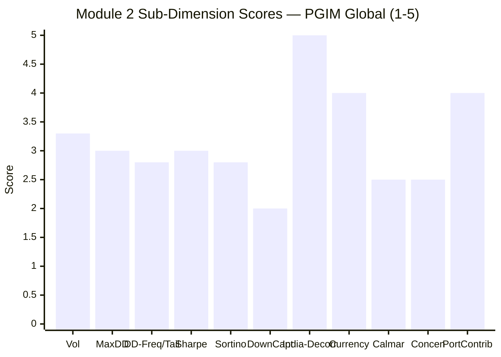

| Sub-dimension | Score (1–5) | Reasoning |
|---------------|-------------|-----------|
| Volatility | **3.3** | 18.8% monthly — higher than Franklin; clusters into violent years (2020/22 >27%) |
| Max Drawdown (depth) | **3.0** | −43.4% — deeper than Franklin, near small-cap territory |
| Drawdown frequency / tail | **2.8** | 3 deep DDs; no dot-com/GFC — more dangerous for a concentrated book |
| Sharpe | **3.0** | 0.53 full / 0.93 recovery — lowest of the open intl shortlist |
| Sortino | **2.8** | 0.75 — the missing bright spot (Franklin had 1.30) |
| Down-capture vs own index | **2.0** | **Worst studied** — fell more than the Nasdaq in 2022; 3.4× the S&P |
| **Decorrelation from India** | **5.0** | **R² 12% to Nifty — the diversification dividend, intact** |
| Currency risk | **4.0** | Directly-confirmed net hedge (−0.25); INR vol < USD vol; regime-dependent |
| Calmar | **2.5** | 0.22 (5Y) — weak; deep-DD + valley-CAGR dragged |
| Concentration risk | **2.5** | ~35 stocks, NVIDIA ~9%, top-10 ~49% — genuine single-name risk |
| Portfolio risk contribution | **4.0** | Lowers blended risk *if held alone*; **redundant with Franklin (R² 83%)** |
| **Module 2 Overall** | **~3.0 / 5** | **The same elite India-decorrelation (R² 12%) and rupee hedge as Franklin, wrapped around a uniformly worse standalone risk profile — higher volatility (18.8%), a deeper −43% drawdown, the worst down-capture of any fund studied (fell more than the Nasdaq in 2022), a collapsed Sortino (0.75), and the highest tracking error (21.4%). Worse, it is 83% correlated to Franklin, so the two are substitutes, not complements. Hold it — if at all — as the *sole* US/global-growth diversifier, never alongside Franklin, and never for its own risk-adjusted return, where a cheaper passive ACWI feeder beats it.** |

---

## Comparative Module 2 Scores

| Fund | M2 Score | Risk Profile Summary |
|------|----------|---------------------|
| PP FlexiCap | 4.0/5 | Lowest vol, structural buffer, multi-cycle proof |
| DSP Small Cap | 3.8/5 | At ATH, multi-cycle proof, honest −49% DD |
| Union Small Cap | ~3.8/5 | #1 Sharpe/down-capture, genuinely 2018-tested |
| BOI Small Cap | ~3.7/5 | Best IR, at ATH; missing 2018 |
| Franklin US Opp | ~3.3/5 | Elite diversifier (R² 11%); poor standalone (amplified beta, drawdown-prone) |
| HSBC Small Cap | ~3.2/5 | Elite historical, deteriorating recent |
| **PGIM Global** | **~3.0/5** | **Elite India-diversifier (R² 12%) but the weakest standalone risk of the set — worst down-capture, deepest feeder drawdown, collapsed Sortino; and 83% redundant with Franklin** |

**PGIM lands at ~3.0 — the lowest M2 of the funds studied so far, a notch below its twin Franklin (3.3).** The two 5.0/4.0 diversification scores (India-decorrelation, currency) are the same as Franklin's, but PGIM's standalone metrics (down-capture 2.0, Sortino 2.8, Calmar 2.5, concentration 2.5) are uniformly weaker, and its portfolio-contribution is docked to 4.0 for the Franklin redundancy. Read the 3.0 as **"weaker fund and redundant diversifier"** — the rubric rewards its genuine India-decorrelation but correctly penalises everything else.

---

## SIP Implication

For a ₹20,000/month international sleeve over 10+ years, PGIM's risk profile splits into the same standalone/portfolio stories as Franklin — but both are weaker, and a new intra-sleeve caveat dominates.

**What the standalone data says — temper expectations further than for Franklin.** PGIM carries **amplified, concentrated global-growth risk** (beta 1.27 to the S&P 500, ~35 stocks, NVIDIA ~9%), the **deepest feeder drawdown** (−43%, 2.3 years underwater), the **worst down-capture of any fund studied** (−33% in 2022 when a broad S&P 500 INR fund fell −9.8%, worse even than the Nasdaq), a **collapsed Sortino** (0.75 — no upside skew to redeem the volatility), and the **highest tracking error** (21.4%) for a benchmark-matching return. On every standalone risk measure, a cheaper, lower-beta passive ACWI/S&P 500 INR fund would be the superior holding.

**What the portfolio data says — the diversification is real but conditional.** PGIM has an **R² of just 12% to the Nifty** and a **directly-confirmed rupee hedge** (INR vol 18.8% < USD-NAV vol 19.3%; corr −0.25) — so *versus your India sleeves* it lowers blended volatility and drawdown exactly as Franklin does. **But it is 83% correlated to Franklin**, so it adds almost nothing to a portfolio that already holds Franklin. Its diversification value is genuine against India and redundant against its twin.

**The three SIP risk behaviours to expect with PGIM over 10 years:**
1. **In a global-growth/rate shock (like 2022):** PGIM falls *harder than Franklin and harder than the Nasdaq* — expect −35% to −45% in INR, with a ~2.3-year recovery. The rupee cushions ~7 points. Keep SIP-ing (the 5Y SIP XIRR of 18.7% vs 9.4% lumpsum, Module 1, is built on exactly this) — but only if this is your chosen US-growth vehicle.
2. **In an Indian-specific shock (like 2018 IL&FS):** PGIM is largely *unaffected* (12% India-R²) — the diversification working, and the moment its value is most visible.
3. **In a global systemic crisis (2008-style — not in the record):** correlations converge toward 1, the rupee hedge may fail, and a concentrated ~35-stock growth book could draw down −55%+. Size the sleeve for this unmodelled tail — more conservatively than for Franklin.

**What to monitor:**
- Whether Franklin is also held — if so, PGIM is redundant and the two compete for one slot
- The rupee's continued hedge behaviour (reverses in a ₹-appreciation regime)
- The underlying's single-name concentration (NVIDIA ~9% — Module 3), where the amplified beta and the down-capture both live
- Closure risk — a SEBI-cap breach could pause subscriptions mid-SIP

**Recommended SIP behaviour:** Hold PGIM **only as the sole US/global-growth diversifier, sized modestly**, and judge it by its effect on the *blended* portfolio, never by its own drawdowns. **Do not hold it alongside Franklin** — they are the same bet, and Franklin is the better-built version. If a cheaper passive ACWI feeder reopens, prefer it: it delivers PGIM's entire India-diversification and rupee-hedge case at a fraction of the cost and risk.

---

## One-Line Verdict

> **PGIM India Global Equity Opportunities is Franklin's higher-amplitude, worse-built twin: the same elite India-decorrelation (R² 12%) and directly-confirmed rupee hedge (INR vol 18.8% < USD-NAV vol 19.3%, corr −0.25), wrapped around the weakest standalone risk profile of any fund studied — the worst down-capture (fell more than the Nasdaq in 2022), the deepest feeder drawdown (−43%, 2.3y underwater), a collapsed Sortino (0.75), and the highest tracking error (21.4%). And at 83% correlation to Franklin, the two are substitutes, not complements. Hold it — if at all — as the sole US/global-growth diversifier, never alongside Franklin. Module 2: ~3.0/5 — elite India-diversifier, weakest standalone risk, redundant twin.**

---

*Module 2 completed: July 2026 | Risk Profile | MFAPI methodology (PGIM Global scheme 138528, 2,497 days, Mar 2016 → Jun 2026) | Correlation/beta computed vs UTI Nifty 50 (120716), Motilal S&P 500 (148381), Nasdaq 100 FoF (145552) & Franklin US Opp (118551); currency decomposition directly computed vs ECB ₹/$ (2,474 aligned days) | Max drawdown (−43.42%) reproduces screening exactly | Benchmark = MSCI AC World Index TRI | Daily metrics flagged as FoF-pricing-distorted; monthly canonical | Provisional M2 Score: ~3.0/5 (subject to M3 for underlying concentration, M4 for cost/closure)*

*Next: [Module 3 — Portfolio DNA & Look-Through](module3_portfolio.md)*
