# Module 3: Portfolio DNA & Look-Through — PGIM India Global Equity Opportunities Fund of Fund

*Sources: Underlying-fund holdings — **PGIM Jennison Global Equity Opportunities Fund** (official PGIM India portfolio disclosure PDF, as-of 29-Apr-2026, all 40 positions with exact weights) | PGIM Luxembourg UCITS factsheet (sector/geography/valuation stats) | Morningstar Europe | Tickertape screening (May-2026) | Value Research | Web research, July 2026. **The Indian feeder discloses only "PGIM Jennison Global Equity Opportunities Fund ~98%" — all real portfolio data is the *underlying* fund's, by look-through.** Benchmark = MSCI AC World Index (ACWI) TRI (broad all-country global).*

---

## Module 3 Score: ~3.2 / 5

PGIM's portfolio is the study's **"high-conviction, genuinely global innovation book"** — and Module 3 is where PGIM finally separates itself from its statistical twin. Modules 1–2 found PGIM is 83% return-correlated to Franklin; the holdings reveal that correlation is a shared US-growth *factor*, not identical stocks. Where Franklin is a diffuse 84-name US-mega-cap book, **PGIM is a concentrated ~39-name global book built on three high-conviction themes — a ~35% AI-semiconductor supply-chain bet, a ~15% electrification/power bet, and a ~10% global-luxury bet — of which 31% sits outside the US.** That makes it *more differentiated and more genuinely global* than Franklin (its real edge, and it overlaps *less* with the investor's Parag Parikh core) — but also the **most concentrated (top-10 49.8%, 35% in one industry), most expensive (P/E 40.7), and highest-turnover (~100%) book of either study.** A distinctive, coherent, genuinely global growth portfolio — priced for perfection and betting the house on the AI-compute cycle.

---

## The Look-Through Mechanism — What "~98% in One Holding" Really Means *(international-specific)*

Every Indian platform shows PGIM's portfolio as **one line: "PGIM Jennison Global Equity Opportunities Fund ~98%" + cash.** That is the **FoF artefact** — the screening "top-10 = 100%" figures are this, not real concentration. The *actual* portfolio is the **underlying UCITS fund's** book, reached only by look-through:

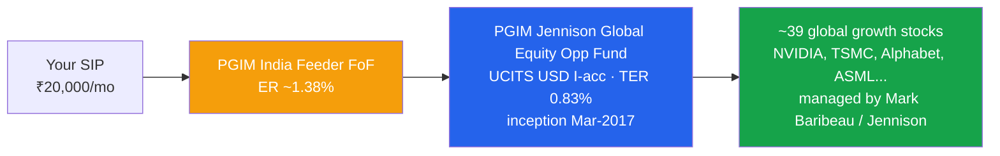

> **The double-layer confirmation:** the feeder buys the **I-acc (institutional)** UCITS class (TER 0.83%), stacked under the ~1.38% Indian feeder ER → **~2.21% true all-in** (Module 4). The look-through also means **the feeder manager makes zero stock decisions** — every holding below is Baribeau/Jennison's. And because the fund only *adopted* this underlying in Oct-2018 (Module 1's "three-identity" finding), this book has no connection to the pre-2018 agribusiness portfolio the long-term NAV reaches back into.

---

## Raw Data (Underlying Fund — Look-Through, 29-Apr-2026)

| Metric | PGIM | Source | Confidence |
|---|---|---|---|
| **Total holdings (underlying)** | **~39–40** | PGIM PDF / factsheet | ✅ |
| **Top-10 concentration** | **49.8%** | PDF (computed) | ✅ |
| **Cash** | ~1.4% | PDF | ✅ |
| **Portfolio P/E** | **40.7** | Factsheet | ✅ |
| **Portfolio P/B** | **11.2** | Factsheet | ✅ |
| **Turnover (12-mo)** | **~100%** | Factsheet | ✅ |
| **Geography: US / ex-US** | **69% / 31%** | Factsheet | ✅ |
| Information Technology | **49.2%** | Factsheet | ✅ |
| Industrials | 15.3% | Factsheet | ✅ |
| Communication Services | 14.0% | Factsheet | ✅ |
| Consumer Discretionary | 12.7% | Factsheet | ✅ |
| Health Care | 4.0% | Factsheet | ✅ |
| Consumer Staples | 3.5% | Factsheet | ✅ |
| Financials | 1.3% | Factsheet | ✅ |
| **Semiconductors & semi-equipment (computed)** | **~33% (~36% incl. semi-adjacent)** | PDF (computed) | ✅ |
| **Magnificent-Seven weight (computed)** | **~22.8%** (no MSFT, no Tesla) | PDF (computed) | ✅ |
| Style | **Concentrated global growth (thematic)** | Holdings | ✅ |
| Underlying manager | **Mark Baribeau / Jennison Associates** | Factsheet | ✅ |

> **A note on snapshots:** the complete holdings list is the official PGIM India disclosure PDF (29-Apr-2026, NVIDIA top at 7.84%); the portfolio-level stats (39 holdings, P/E 40.7, P/B 11.2, turnover ~100%) are from the UCITS factsheet, a marginally different-dated snapshot (which shows Alphabet top at 7.7%). Active weights shift week-to-week in a high-turnover book; the PDF is treated as authoritative for holdings and the factsheet for the stable portfolio-level statistics. Neither difference changes any conclusion.

---

## The Core Thesis — A High-Conviction "Global Innovation" Book

The underlying targets *high-conviction global growth companies benefiting from durable secular change.* Unlike Franklin's diffuse 84-name US-mega-cap book, this is a **concentrated ~39-name portfolio expressing a handful of strong thematic bets**, roughly a third of it outside the US:

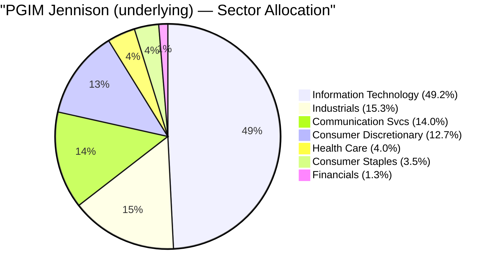

This is a genuinely *distinctive* book — it does not look like the index, and it does not look like Franklin. Its quality is mostly high (TSMC, ASML, Alphabet, Hermès, Costco, Netflix are dominant franchises) but it carries a **speculative tail Franklin lacks** (Palantir, Carvana, Robinhood, CoreWeave, Nebius, Bloom Energy) — higher-beta, richer-multiple names that amplify both the upside and the drawdowns documented in Modules 1–2.

---

## Complete Holdings — Stock-by-Stock (Underlying, 29-Apr-2026)

Top-10 ≈ **49.8%** of the underlying; ~39 equity holdings; top name (NVIDIA) 7.84%.

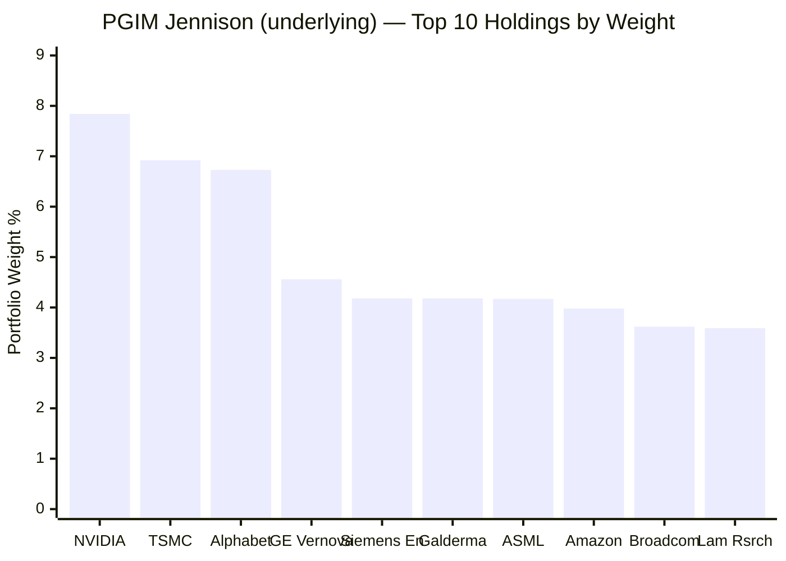

| # | Stock | Wt% | Country | Sector | Theme |
|---|-------|-----|---------|--------|-------|
| 1 | **NVIDIA** | 7.84% | 🇺🇸 US | Info Tech | AI compute |
| 2 | **TSMC** (ADR) | 6.92% | 🇹🇼 Taiwan | Info Tech | AI semis |
| 3 | **Alphabet A** | 6.73% | 🇺🇸 US | Comm Svcs | Platform |
| 4 | **GE Vernova** | 4.56% | 🇺🇸 US | Industrials | Electrification |
| 5 | **Siemens Energy** | 4.18% | 🇩🇪 Germany | Industrials | Electrification |
| 6 | **Galderma** | 4.18% | 🇨🇭 Switzerland | Health Care | Dermatology |
| 7 | **ASML** | 4.17% | 🇳🇱 Netherlands | Info Tech | AI semis (litho) |
| 8 | **Amazon** | 3.98% | 🇺🇸 US | Cons Disc | Platform/cloud |
| 9 | **Broadcom** | 3.62% | 🇺🇸 US | Info Tech | AI semis |
| 10 | **Lam Research** | 3.59% | 🇺🇸 US | Info Tech | AI semis (equip) |

**Holdings 11–39** (2.2%): Apple 3.01, AMD 2.57, Keysight 2.54, Monolithic Power 2.44, Bloom Energy 2.32, CoreWeave 2.28, Inditex/Zara 2.27, Costco 2.21, Netflix 2.14, L'Oréal 2.11, Credo Technology 2.07, Richemont 2.05, Quanta Services 2.01, Shopify 1.96, Moncler 1.65, Hermès 1.51, Liberty Media F1 1.34, **Meta 1.24**, Nebius 1.19, Cloudflare 1.16, CrowdStrike 1.15, Nu Holdings 1.02, Palantir 0.99, Carvana 0.77, Robinhood 0.62, Intuitive Surgical 0.62, Ferrari 0.51, MercadoLibre 0.47 (+ ~1.4% cash).

**Three patterns:**
- **A semiconductor supply-chain spine dominates the top** (NVIDIA, TSMC, ASML, Broadcom, Lam) — see the AI-semiconductor section.
- **The "classic" Mag-7 are deliberately *de-emphasised*:** Meta is a tiny 1.24%, there is **no Microsoft and no Tesla**, and Apple is only 3.01%. PGIM expresses AI through the *supply chain* (NVIDIA/TSMC/ASML), not the platform mega-caps.
- **A genuine speculative tail** (Palantir, Carvana, Robinhood, CoreWeave, Nebius) — richer-multiple, higher-beta names absent from Franklin's book.

---

## ⭐ The AI-Semiconductor Bet — The Defining Feature of the Portfolio *(PGIM-specific — the key section)*

The single most important portfolio fact is a **~35% concentration in the semiconductor supply chain** — the highest single-industry bet of any fund in either study:

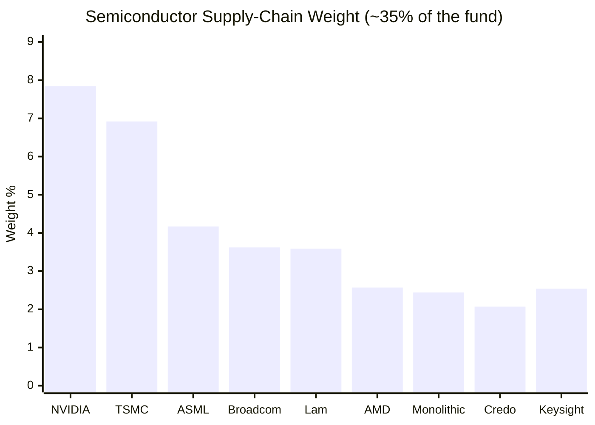

| Semiconductor holdings | Weight |
|------------------------|--------|
| NVIDIA + TSMC + ASML + Broadcom + Lam + AMD + Monolithic + Credo | **33.2%** |
| + Keysight (semi-adjacent test/measurement) | **~35.8%** |

**More than a third of the fund is a single-industry AI-compute bet.** For context, this ~35% single-*industry* weight exceeds the *entire lead sector* of every fund studied (Union's top sector 13.5%, Bandhan's 24%, even Franklin's whole 36.8% Technology sector spans many sub-industries). It is a genuine "picks-and-shovels" thesis — owning the chip designers (NVIDIA, AMD, Broadcom), the foundry (TSMC), and the equipment makers (ASML, Lam) that supply the AI build-out.

**This is the mechanical explanation for the extreme dispersion in Modules 1–2.** The fund's fate rides on the semiconductor capex cycle: when AI-semis boomed (2020: +70% USD, 2023: +40%), PGIM crushed ACWI; when the cycle de-rated (2022: −40% USD, 2025: lagged by ~19pts), it fell far harder than the broad index. The +103%/−41% one-year range (Module 2) *is* this semiconductor concentration in one statistic. **For a diversifier sleeve, a 35% single-industry bet is the dominant risk to price in.**

---

## ⭐ The Thematic Barbell — Semis / Electrification / Luxury / Platforms / Speculative Growth *(PGIM-specific)*

Beyond the semiconductor spine, the book resolves into distinct, coherent, high-conviction themes — a far more *intentional* construction than Franklin's broad mega-cap tilt:

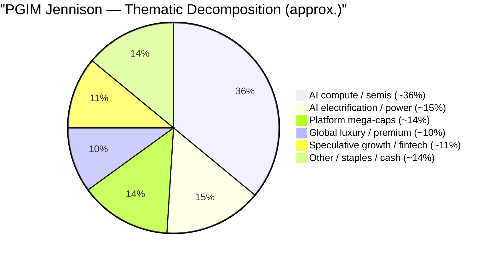

| Theme | ~Weight | Holdings | Read |
|-------|---------|----------|------|
| **AI compute / semis** | ~36% | NVIDIA, TSMC, ASML, Broadcom, Lam, AMD, Monolithic, Credo, Keysight | The core bet |
| **AI electrification / power** | ~15% | GE Vernova, Siemens Energy, Bloom Energy, Quanta, Carpenter | ⭐ "AI needs electricity" — a genuinely differentiated bet Franklin lacks |
| **Platform mega-caps** | ~14% | Alphabet, Amazon, Netflix, Meta, Liberty F1 | Under-weighted vs peers |
| **Global luxury / premium** | ~10% | Hermès, Richemont, Moncler, Ferrari, Inditex, L'Oréal | Mostly European — non-US quality |
| **Speculative growth / fintech** | ~11% | Palantir, Carvana, Robinhood, CoreWeave, Nebius, Cloudflare, Shopify, Nu, MercadoLibre | The high-beta tail |

**The electrification theme is the standout.** GE Vernova (4.56%) + Siemens Energy (4.18%) + Bloom Energy (2.32%) + Quanta (2.01%) express the second-order AI thesis — *data centres need enormous power*, so the grid, turbines, and fuel cells that supply them benefit. This is a genuinely non-consensus, forward-looking bet that no other fund in either study holds, and it is a real mark of active conviction. The luxury basket (mostly European) is similarly differentiated. **PGIM is doing real, distinctive active work here** — the question (Modules 1–2) is whether the conviction is *rewarded* net of a ~2.21% fee and a −43% drawdown.

---

## ⭐ Genuine Global Exposure — 31% Outside the US *(PGIM-specific — the diversification edge over Franklin)*

The clearest portfolio advantage over Franklin: PGIM is **genuinely global, ~31% non-US**, where Franklin is 100% US.

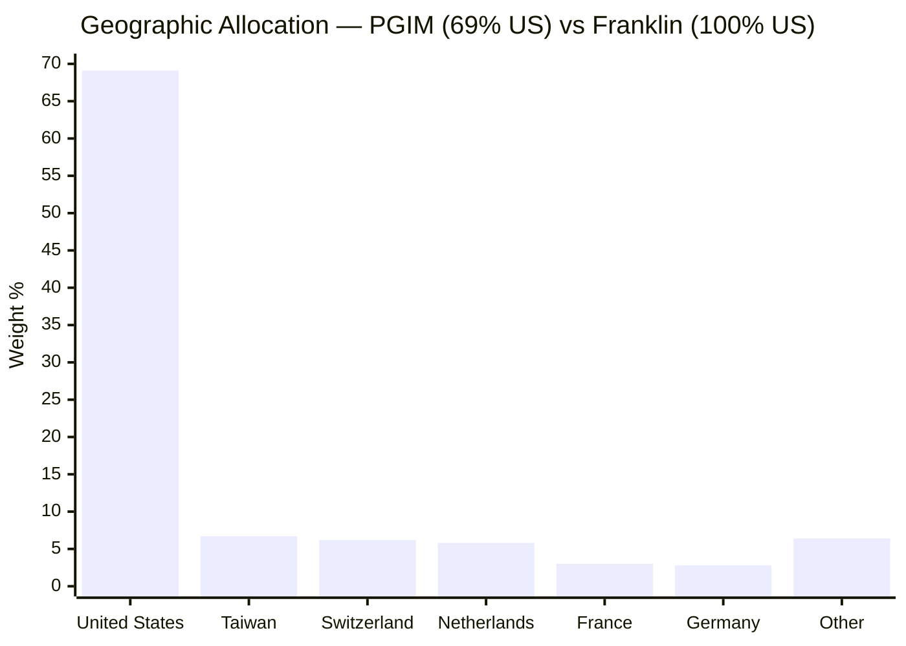

| Country | Weight | Names |
|---------|--------|-------|
| 🇺🇸 United States | 69.1% | NVIDIA, Alphabet, GE Vernova, Amazon, Broadcom… |
| 🇹🇼 Taiwan | 6.7% | TSMC |
| 🇨🇭 Switzerland | 6.2% | Galderma, Richemont |
| 🇳🇱 Netherlands | 5.8% | ASML, Nebius |
| 🇫🇷 France | 3.0% | L'Oréal, Hermès |
| 🇩🇪 Germany | 2.8% | Siemens Energy |
| 🇪🇸🇮🇹🇧🇷 Other | ~6.4% | Inditex, Moncler, Ferrari, Nu, MercadoLibre |

**This is the answer to the study-plan's "is it a genuine global core?" question — on geography, partially yes.** PGIM delivers real non-US exposure Franklin cannot: European industrials (Siemens Energy) and luxury (Hermès, Richemont, L'Oréal), Taiwanese semis (TSMC), Dutch litho (ASML), and LatAm fintech (Nu, MercadoLibre). For a sleeve whose purpose is geographic diversification, **31% ex-US is a genuine, structural plus over Franklin's 100%-US book.** The caveat: it is still a *concentrated growth* book, so it is not the broad, diversified "one-fund world" the ACWI benchmark implies — it is a global *growth* bet, not global *market* exposure.

---

## The Benchmark Relationship — Thematic Dispersion, NOT a Mag-7 Underweight *(reframed vs Franklin)*

Franklin's benchmark problem was structural: it was ~20pts *underweight* the Magnificent Seven versus a Mag-7-heavy growth index, which *mechanically* caused its lag. **PGIM's relationship to its benchmark is fundamentally different:**

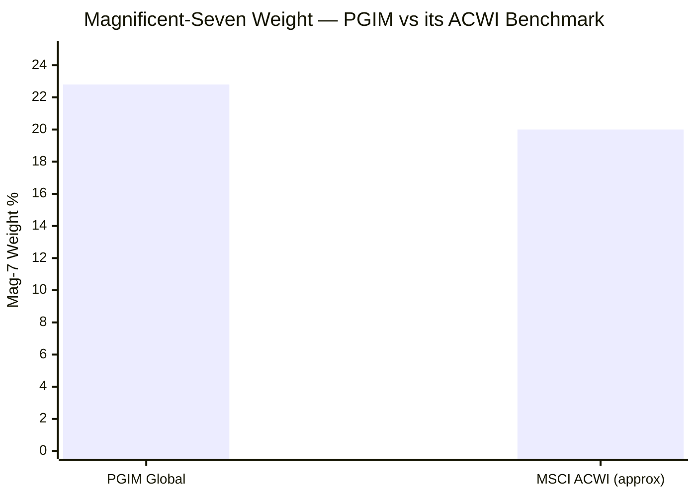

| | PGIM (active) | MSCI ACWI (benchmark) |
|---|---|---|
| Magnificent-Seven weight | **~22.8%** (no MSFT, no Tesla) | ~20% |
| Holdings | ~39 (concentrated) | ~2,500 (broad) |
| Semiconductors | **~35%** | ~high-single-digit % |

**PGIM is roughly *in line* with ACWI on the Mag-7 — so its dispersion is not a Mag-7 story.** Instead, PGIM's enormous tracking error (21.4%, Module 2) and win-big/lose-big pattern come from its **thematic concentration**: ~35% semis and ~15% electrification are massive *overweights* versus the broad index, and the ~2,470 ACWI names it *doesn't* own are massive underweights. **PGIM's index behaviour is caused by high-conviction thematic bets, not by the arithmetic Mag-7 underweight that dooms Franklin.** This is a subtler, more genuinely active proposition — for better (2020, 2023) and worse (2022, 2025).

---

## Concentration Analysis — The Most Concentrated Book of Either Study

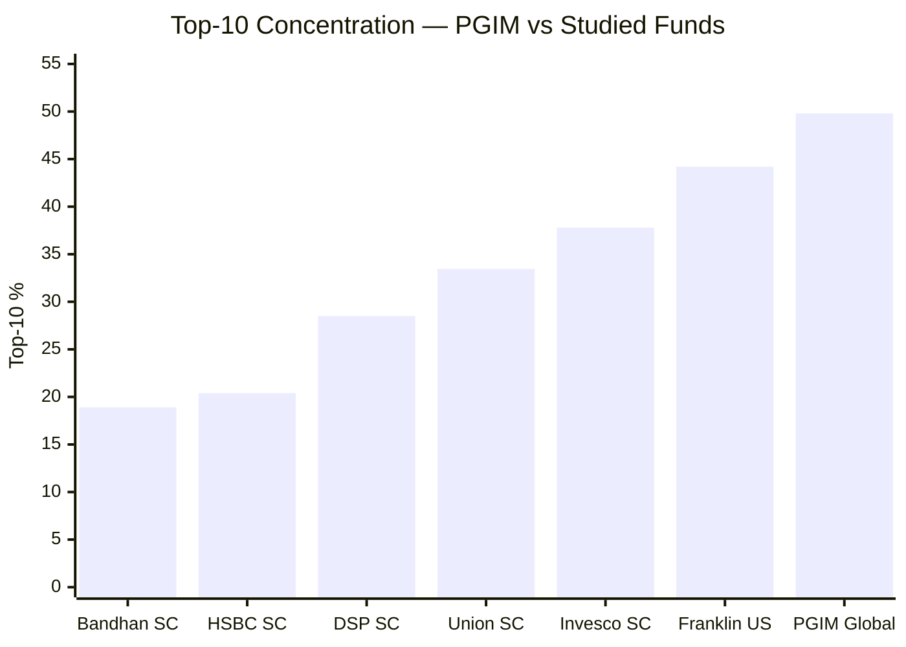

| Metric | PGIM Global | Franklin US | Union SC | DSP SC |
|---|---|---|---|---|
| Total holdings | **~39** | 84 | ~70 | 81 |
| Top holding | 7.84% (NVIDIA) | 6.95% (Meta) | 4.20% | 5.38% |
| Top-3 | **21.5%** (NVIDIA+TSMC+Alphabet) | ~19% | — | — |
| Top-10 | **49.8%** | 44.2% | 33.45% | 28.5% |
| Single-industry max | **~35% (semis)** | 36.8% (whole tech sector) | 13.5% | 34% (Cons Cyc) |

**PGIM's top-10 (49.8%) is the most concentrated of any fund in either study** — half the portfolio rides on ten names, and ~35% rides on one industry. The single-name risk is real but *mega-cap* in the top (NVIDIA 7.84%, TSMC 6.92% — the two most-watched semis on earth, so not *illiquidity* risk). The genuine concentration risk is **thematic, not idiosyncratic**: a semiconductor-cycle downturn hits ~35% of the book simultaneously. The ~39-name count also means the diversifying tail is *thinner* than Franklin's 84 — there is less of a cushion beneath the concentrated top.

---

## Asset Allocation & Liquidity — Near-Fully Invested, Mostly Liquid

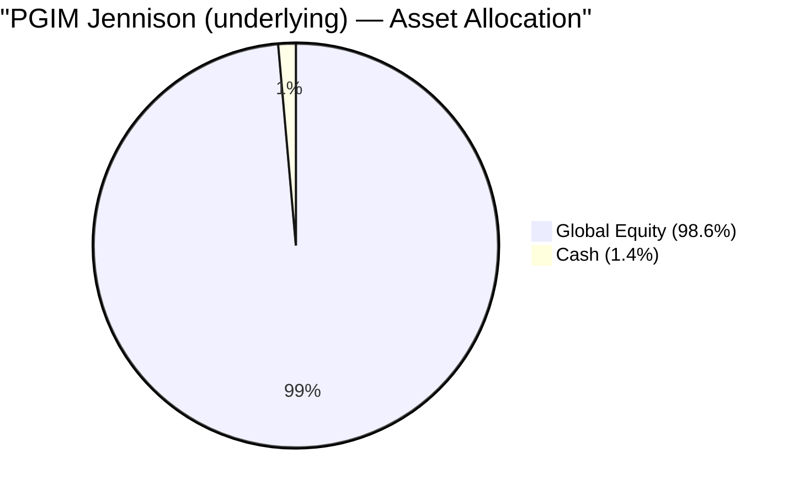

PGIM runs **~98.6% equity, ~1.4% cash** — near-fully invested, thin buffer. As with Franklin, the mega-cap core (NVIDIA, TSMC, Alphabet, ASML, Amazon) carries **no liquidity/redemption-spiral risk** — these are among the most liquid equities on the planet. The one nuance versus Franklin: the **speculative tail (Carvana, Bloom Energy, Credo, Nebius, CoreWeave)** holds smaller, more volatile names that are less liquid than the mega-caps — a marginally higher liquidity/impact risk than Franklin's all-mega-cap book, though still immaterial next to a small-cap fund. The structural risk remains **closure** (a SEBI-cap breach pausing SIPs — Module 4), not illiquidity.

---

## Active Share vs the Broad Index — High, and (Over the Real Record) Rewarded

Where Franklin's high active share *lost* to its index, PGIM's high active share has (over its genuine 7.75-year record) roughly *matched* its broad benchmark — a better active proposition, though not a clear win:

| | Reading |
|---|---|
| Active share | **Very high** (~39 names vs ~2,500; ~35% semis vs single-digit index weight) |
| Tracking error | 21.4% — highest of the shortlist |
| Result | Roughly *matches* MSCI ACWI over the genuine record (Module 1) — better than Franklin's negative alpha, but carried by 2020 and undermined by the 2025 lag |
| Diagnosis | The *direction* of the active bet (concentrated AI/growth) worked in growth regimes; the concentration is the double-edged sword |

**The synthesis:** PGIM is genuinely, aggressively active — and unlike Franklin, its activeness has not *subtracted* value over its real record. But the "match" is against a *soft, broad* benchmark, depends heavily on the 2020 semiconductor boom, and comes with the deepest drawdown and highest cost of the sleeve. High active share here is a *real* bet, not a closet-index — the question is risk-adjusted, not whether skill exists.

---

## ⭐ Cross-Sleeve Overlap — *Less* Duplication Than Franklin *(international-specific — the diversification reality check)*

Diversification is portfolio-specific. Versus this investor's actual sleeves:

| vs Sleeve | Overlap | Diversification |
|---|---|---|
| SmallCap funds (DSP/Union/BOI) | **Zero** (global growth vs Indian small-caps) | ✅ Full |
| **Parag Parikh FlexiCap (your #1 core)** | **Moderate — *lower* than Franklin's** | 🟡 Partially eroded |
| **Franklin US Opp (the sister candidate)** | **83% return-correlated (M2), moderate name overlap** | ⚠️ Redundant if both held |

**The nuance versus Franklin's overlap problem:** Parag Parikh FlexiCap holds Alphabet, Microsoft, Amazon, and Meta in its international sleeve. PGIM holds **Alphabet 6.73%, Amazon 3.98%, Meta just 1.24% — and no Microsoft.** So PGIM's overlap with your PP core is *smaller* than Franklin's (which held Meta 6.95%, Amazon 6.02%, Microsoft 5.36%). On the specific "do I already own this via PP?" test, **PGIM duplicates your core *less* than Franklin does** — a genuine, if narrow, point in PGIM's favour.

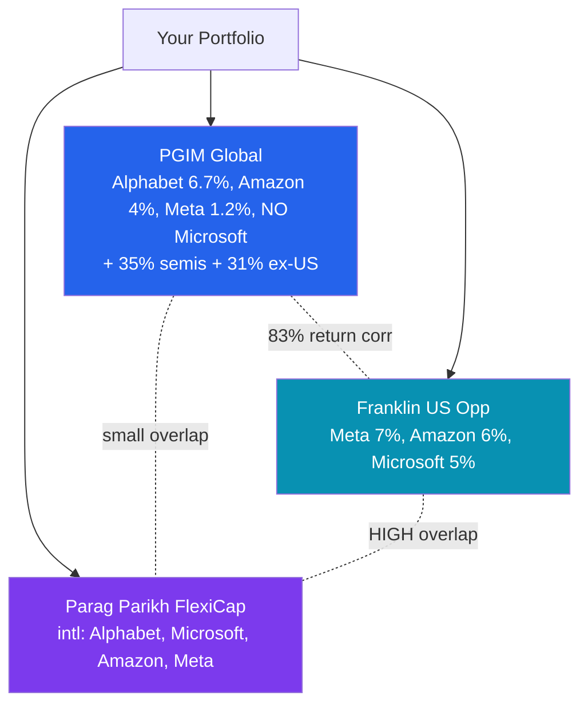

**The implication:** PGIM's semiconductor + electrification + non-US content is genuinely *new* exposure this portfolio doesn't already hold — its differentiation from the PP core is real. **But it remains 83% return-correlated to Franklin** (Module 2), so the two international candidates still compete for a single US/global-growth slot. PGIM wins the "less overlap with your core" comparison; it does not escape the "redundant with Franklin" one.

---

## Style & Valuation — The Most Expensive Book of Either Study

PGIM's style is unambiguous **concentrated global growth**, and its valuation is the richest studied:

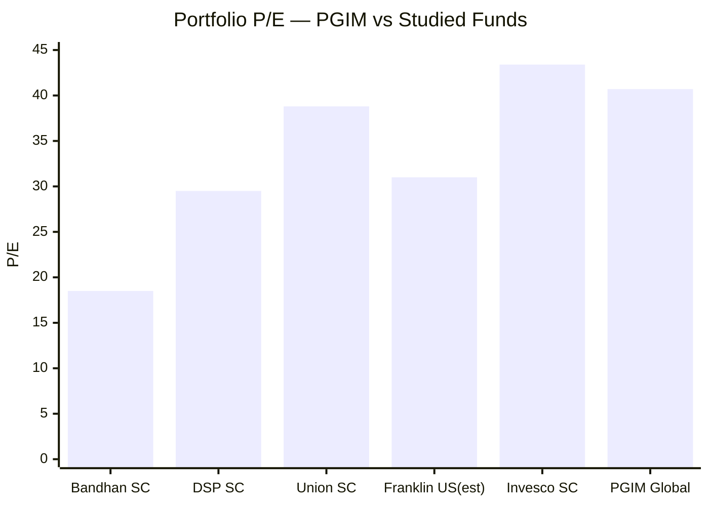

| Metric | PGIM | Read |
|--------|------|------|
| P/E | **40.7** | Highest studied (vs Franklin ~31 est, Union 38.8, DSP 29.5) |
| P/B | **11.2** | Extreme premium |
| Turnover | ~100% | See below |

Two reads:
1. **Premium quality *plus* a speculative tail.** Much of the multiple is paid for genuine, durable growth (NVIDIA, TSMC, ASML, Hermès) — but the speculative sleeve (Palantir, Carvana, CoreWeave, Nebius, Bloom Energy) carries the richest, least-anchored multiples, pushing the aggregate P/E above even Franklin's.
2. **No valuation cushion — the deepest de-rating risk.** A P/E-40.7 / P/B-11.2 book de-rates hardest when rates rise or growth disappoints — *exactly* what produced the **−43% 2022 drawdown** (Module 2), deeper than Franklin's −38%. The premium *is* the drawdown risk.

---

## ⭐ Portfolio Turnover — ~100%, the Anti-Franklin *(PGIM-specific)*

Where Franklin's turnover was an undisclosed data gap (reputedly low, buy-and-hold), **PGIM's turnover is a disclosed ~100%** — meaning the manager effectively replaces the entire portfolio roughly once a year.

| | PGIM | Franklin |
|---|---|---|
| Turnover (12-mo) | **~100%** | low (reputed) |
| Implied avg holding | ~1 year | multi-year |
| Read | Active, tactical trading | Conviction buy-and-hold |

**Three implications:**
1. **Higher hidden cost & tax drag** — ~100% turnover adds real trading friction inside the underlying and generates more taxable events at the fund level (compounding the highest headline cost of the sleeve — Module 4).
2. **Less "conviction buy-and-hold" than the marketing implies** — a 100%-turnover book is *tactically* managed, rotating between themes/names, not patiently compounding a fixed set of franchises.
3. **It fits the thematic style** — the semis/electrification/speculative barbell requires active repositioning as the AI-capex cycle and momentum shift; the turnover is a feature of the strategy, but it is a cost.

---

## Points For / Points Against (Portfolio Angle)

### ✅ Points For
1. **⭐ Genuinely global (31% ex-US)** — real non-US exposure Franklin cannot provide (TSMC, ASML, Siemens Energy, European luxury, LatAm fintech)
2. **⭐ Distinctive, coherent thematic identity** — AI-semis + electrification + luxury barbell; clearer active conviction than Franklin's broad mega-cap tilt
3. **⭐ Lower overlap with the Parag Parikh core** — smaller mega-cap weights, no Microsoft; duplicates your #1 fund less than Franklin does
4. **The electrification theme** (GE Vernova, Siemens Energy) — a genuinely differentiated, forward-looking bet no other studied fund holds
5. **Active share genuinely rewarded** over the real record (matched ACWI — better than Franklin's negative alpha)
6. **Mega-cap core is highly liquid** — no redemption-spiral risk on the top holdings
7. **Near-fully invested** (~98.6% equity) — no cash drag

### ❌ Points Against
1. **⭐ ~35% in a single industry (semiconductors)** — the highest single-industry bet of either study; a semi-cycle downturn hits a third of the book at once
2. **Most concentrated book of either study** — top-10 49.8%, ~39 names, thin diversifying tail
3. **⭐ Most expensive book studied** — P/E 40.7, P/B 11.2; no valuation cushion (the −43% de-rating lives here)
4. **⭐ ~100% turnover** — highest hidden cost/tax drag; tactically traded, not conviction-held
5. **Speculative tail** (Palantir, Carvana, Robinhood, CoreWeave, Nebius) — richer-multiple, higher-beta names Franklin avoids
6. **63% in Tech + Communication Services** — a concentrated digital/AI bet, not broad global exposure
7. **83% return-correlated to Franklin** (Module 2) — still competes for one slot despite the holdings differences
8. **Feeder layer adds zero portfolio value** — pure wrapper cost over the underlying

---

## Module 3 Scorecard

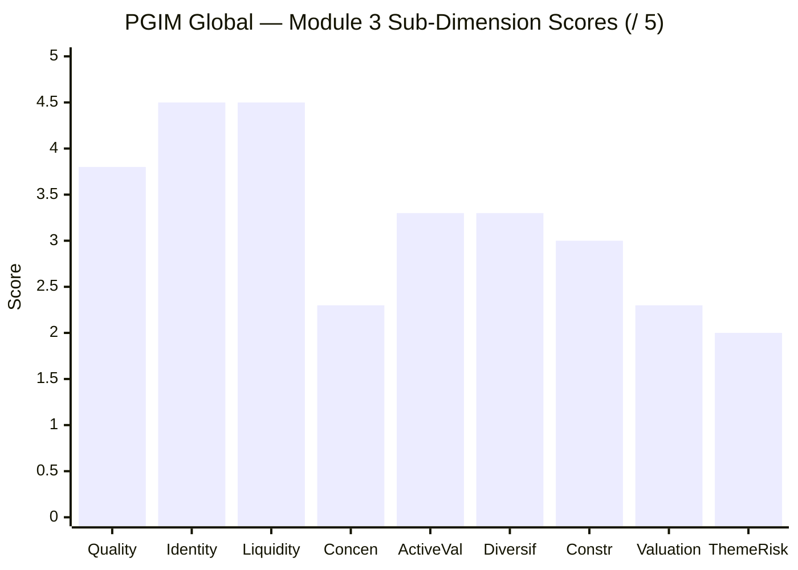

| Sub-Dimension | Score | Reasoning |
|---|---|---|
| Holding Quality | **3.8** | Mostly dominant franchises (TSMC, ASML, Hermès, Costco) — but a genuine speculative tail (Carvana, Palantir, CoreWeave, Bloom) |
| Portfolio Identity / Clarity | **4.5** | Clearest, most distinctive thematic identity of the sleeve (AI-semis + electrification + luxury) |
| Liquidity | **4.5** | Mega-cap core fully liquid; small speculative-tail liquidity haircut |
| Concentration | **2.3** | Top-10 49.8% (most of either study); ~35% one industry; thin 39-name tail |
| **Active Value** | **3.3** | Genuinely differentiated; matched ACWI over the real record (beats Franklin's negative alpha) — but 2020-carried and 2025-lagged |
| **Diversification (this portfolio)** | **3.3** | Genuine 31% non-US + lower PP overlap (edge over Franklin); but 83% Franklin corr + 35% semis factor cap it |
| Construction | **3.0** | Coherent thematic build — but concentrated and ~100% turnover |
| Valuation Discipline | **2.3** | P/E 40.7 / P/B 11.2 — most expensive studied; no cushion |
| Theme / Sector Risk | **2.0** | 63% Tech+Comm, **~35% semiconductors** — highest thematic concentration of either study |
| **Module 3 Overall** | **~3.2 / 5** | **A high-conviction, genuinely global "innovation" book — a ~35% AI-semiconductor bet barbell'd with electrification (GE Vernova, Siemens Energy) and global luxury (Hermès, Richemont), 31% outside the US. More differentiated and more genuinely global than Franklin (its real edge, and it overlaps *less* with the PP core), with a clearer active identity that has actually matched its benchmark. But it is the most concentrated (top-10 49.8%, ~35% one industry), most expensive (P/E 40.7), and highest-turnover (~100%) book of either study — priced for perfection and betting the house on the AI-compute cycle.** |

---

## Comparison with Studied Funds

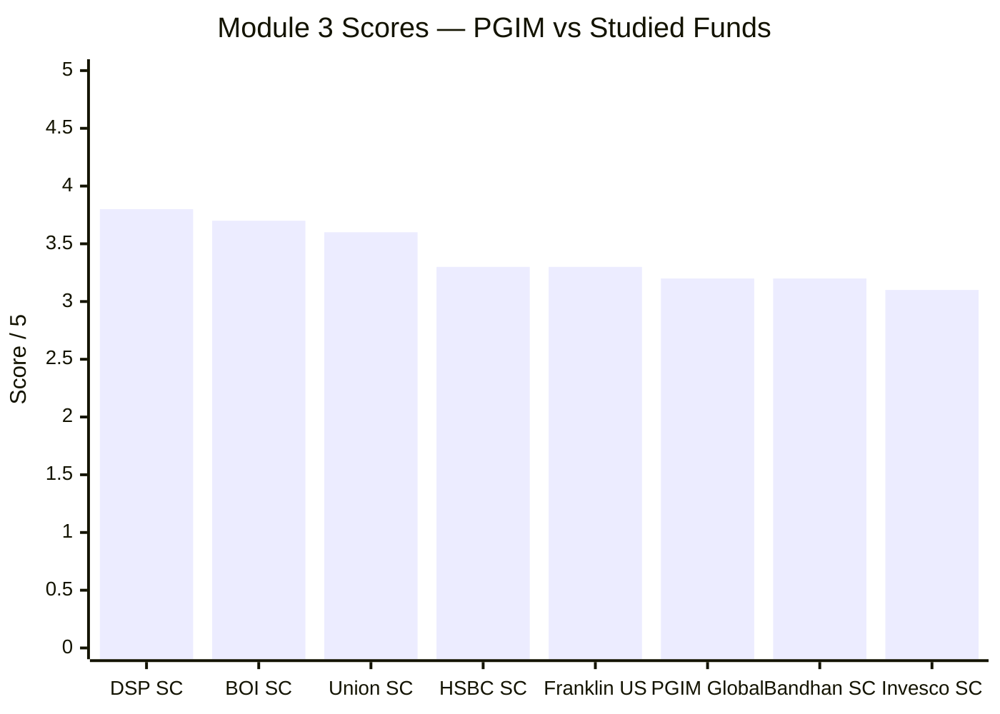

| Dimension | PGIM Global | Franklin US | Union SC | DSP SC |
|---|---|---|---|---|
| Holdings | **~39** | 84 | ~70 | 81 |
| Top-10 | **49.8%** | 44.2% | 33.45% | 28.5% |
| Top holding | 7.84% | 6.95% | 4.20% | 5.38% |
| Lead theme | **Semis ~35%** | Tech 36.8% / Comm 18.7% | Electrical 13.5% | Cons Cyc 34% |
| Geography | **69% US / 31% ex-US** | 100% US | 100% India | 100% India |
| Style | Concentrated global growth | US large-growth | quality-compounder | quality-value |
| P/E | **40.7** | ~31 (est) | 38.8 | 29.5 |
| Turnover | **~100%** | low | 19.7% | 19–24% |
| Liquidity risk | Low (small spec tail) | None | redemption-fragile | moderate |
| Overlap w/ PP core | **Moderate (< Franklin)** | High ⚠️ | none | none |
| **M3 Score** | **3.2** | 3.3 | 3.6 | 3.8 |

**PGIM's distinctive positioning:** it is the **most concentrated, most expensive, highest-turnover, and most genuinely global** book of either study. Against Franklin specifically, it *wins* on genuine geographic diversification, distinctiveness of identity, lower PP-core overlap, and a positive (vs negative) active record — but *loses* on concentration, valuation, turnover, and single-industry (semiconductor) risk. The two land at a near-tie (3.2 vs 3.3) for opposite reasons: **Franklin is a safer, cheaper, more diffuse book that structurally lags; PGIM is a riskier, pricier, more concentrated book that genuinely bets — and, over its short real record, has been right.**

---

## SIP Implication

For a ₹20,000/month international sleeve, PGIM's portfolio is a **high-conviction global-innovation book that is genuinely differentiated — and genuinely risky.**

**What you are actually buying:** Mark Baribeau's ~39-stock Jennison book, built on three high-conviction themes — a **~35% AI-semiconductor supply-chain bet** (NVIDIA, TSMC, ASML, Broadcom, Lam), a **~15% electrification bet** (GE Vernova, Siemens Energy — the "AI needs power" thesis), and a **~10% global-luxury bet** (Hermès, Richemont, L'Oréal) — with 31% of the book outside the US and a speculative tail (Palantir, Carvana, CoreWeave) Franklin avoids. It is a *distinctive, coherent, genuinely global* portfolio, and it duplicates your Parag Parikh core *less* than Franklin does.

**What undermines it:** First, the **~35% single-industry semiconductor concentration** — a third of the fund rides on one capex cycle, which is exactly why the drawdowns (−43%) and dispersion (+103%/−41% one-year range) are the widest studied. Second, it is the **most expensive book of either study** (P/E 40.7, P/B 11.2) — no valuation cushion, the deepest de-rating risk. Third, **~100% turnover** — tactically traded, with the highest hidden cost and tax drag of the sleeve. And despite the holdings differences, it remains **83% return-correlated to Franklin** — the two compete for a single US/global-growth slot.

**What to monitor:**
1. **The semiconductor weight** — ~35% in one industry is the dominant risk; a semi-cycle downturn or an AI-capex disappointment hits a third of the book at once.
2. **The speculative tail** (Palantir, Carvana, CoreWeave, Nebius) — the richest-multiple, highest-beta names; watch whether it grows.
3. **Turnover & valuation** — whether the ~100% turnover and P/E-40 premium persist (both are drags and risks).
4. **Overlap creep** — if PGIM adds Microsoft or lifts mega-cap weights, its "less overlap with PP" edge erodes.

**SIP verdict:** PGIM's portfolio is the *more interesting and more genuinely global* of the two international candidates — a real active bet with a distinctive identity and less duplication of your core. But it is also the *riskiest* — most concentrated, most expensive, highest-turnover, and staking a third of itself on the semiconductor cycle. For the sleeve, the holdings argue that **PGIM is the higher-conviction, higher-risk alternative to Franklin's safer-but-lagging book** — and that *if* an active global-growth fund is chosen over a (currently-closed) cheap index, PGIM's genuine non-US content and distinctiveness are points in its favour, heavily offset by its concentration, valuation, and turnover. As with Franklin, a broad, cheap global index (when reopened) would deliver the geographic diversification without the 35%-semiconductor tail-risk.

---

## One-Line Verdict

> **PGIM's portfolio is a high-conviction, genuinely global "innovation" book — a ~35% AI-semiconductor supply-chain bet (NVIDIA, TSMC, ASML) barbell'd with electrification (GE Vernova, Siemens Energy) and global luxury (Hermès, Richemont), with 31% outside the US. It is more differentiated and more genuinely global than Franklin, overlaps the Parag Parikh core less, and has a clearer active identity that actually matched its benchmark — but it is the most concentrated (top-10 49.8%, ~35% one industry), most expensive (P/E 40.7), and highest-turnover (~100%) book of either study, priced for perfection and betting the house on the AI-compute cycle. Module 3: ~3.2/5.**

---

*Module 3 completed: July 2026 | Portfolio DNA & Look-Through | Underlying = PGIM Jennison Global Equity Opportunities Fund (~39 holdings, top-10 49.8%, ~35% semiconductors, 31% ex-US, P/E 40.7, P/B 11.2, turnover ~100%), via official PGIM India disclosure PDF (29-Apr-2026) + UCITS factsheet | Feeder discloses only the ~98% wrapper line | Benchmark = MSCI AC World Index TRI | Provisional M3 Score: ~3.2/5 (subject to M4 cost/closure, M5 manager)*

*Next: [Module 4 — Cost & AUM / Structure](module4_cost.md)*
