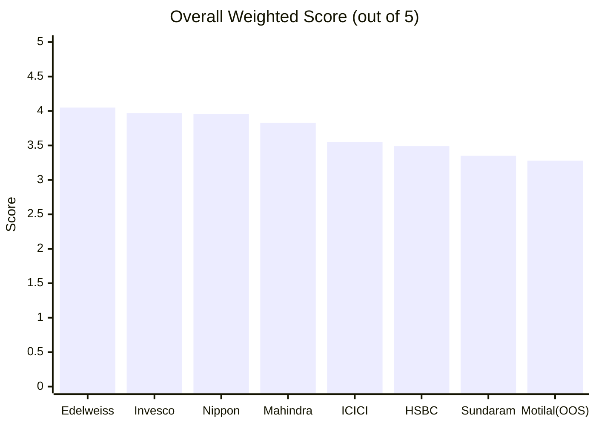
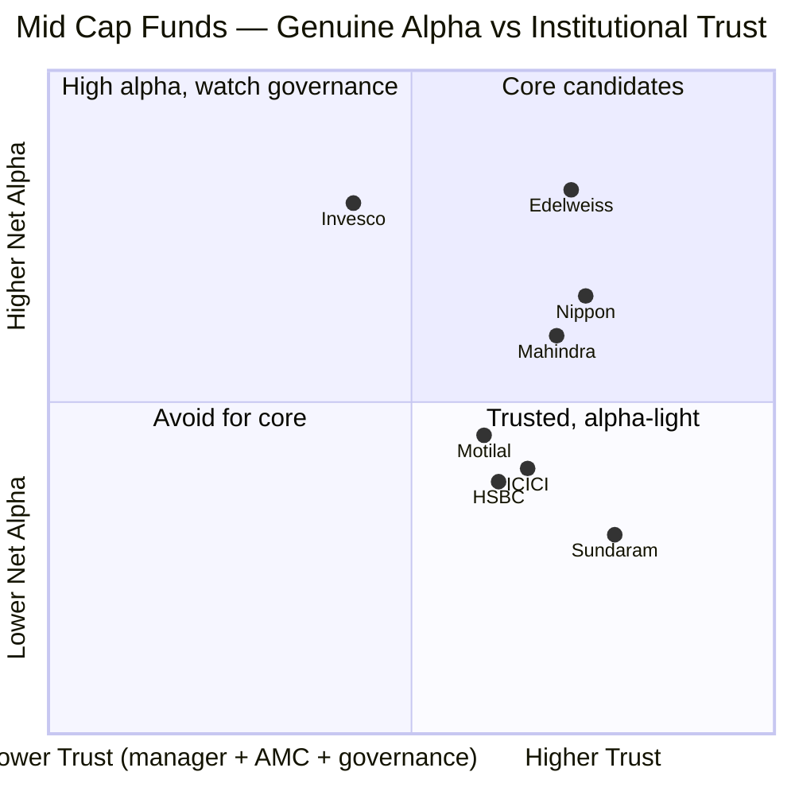
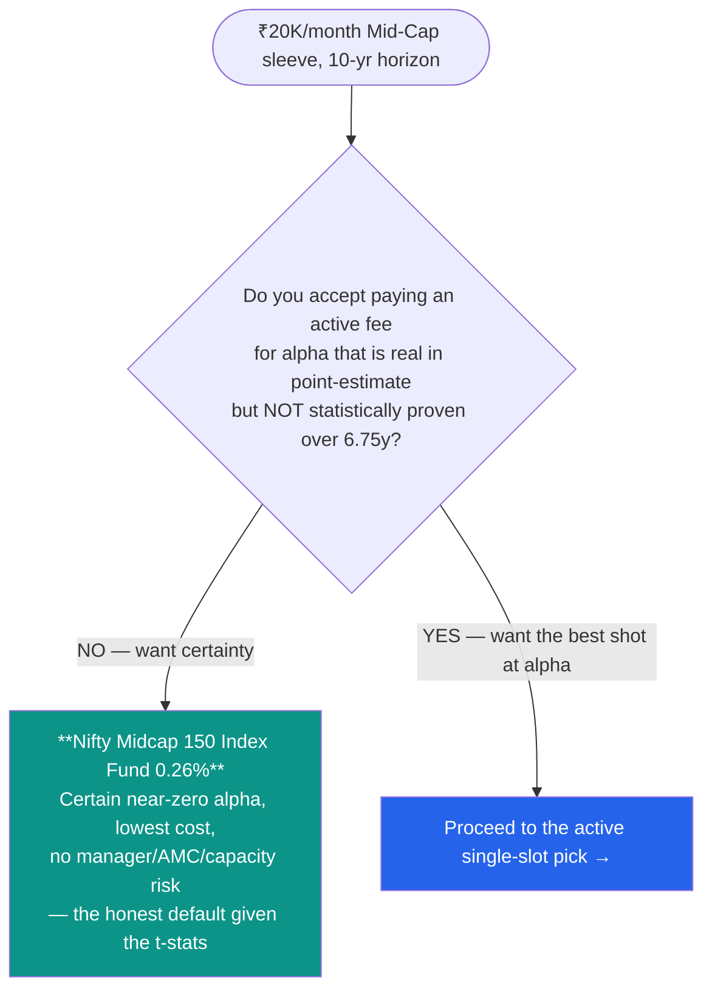
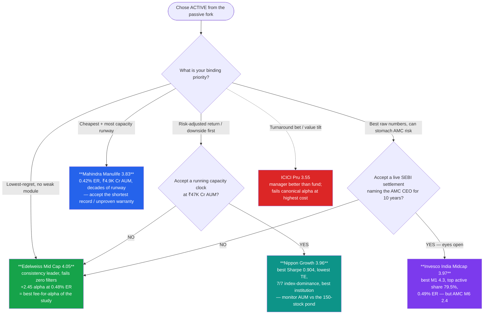
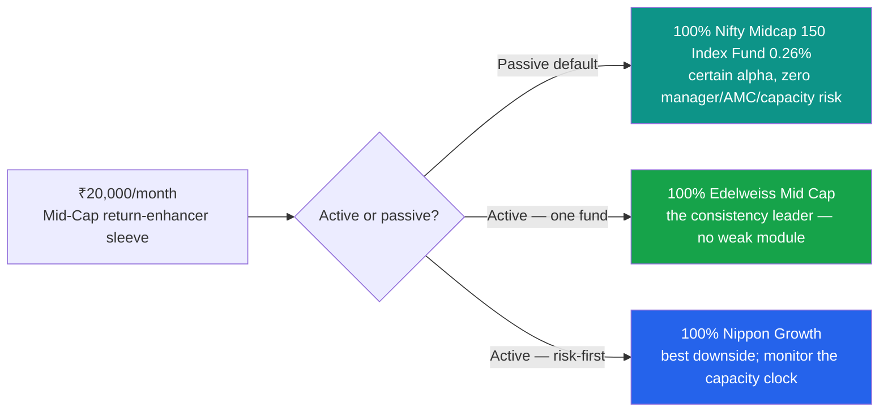

# Mid Cap Fund — Comparative Analysis, Decision Tree & Strategy

**Context:** ₹20,000/month SIP, 10+ year horizon. Mid cap is the **return-enhancer sleeve** that sits between the FlexiCap **core** (Parag Parikh #1) and the SmallCap **satellite** (DSP #1). This document compares the **7 shortlisted funds fully studied** (Edelweiss, Invesco, Nippon, Mahindra Manulife, ICICI Pru, HSBC, Sundaram) plus the **out-of-shortlist Motilal Oswal instructive case**, and from that comparison defines an actionable deployment strategy.

> Built from all 48 module files across 8 funds — not just headline scores. Cross-fund metric tables are taken from the Motilal-module peer matrices (M2/M3/M4), which were computed together across all eight funds on a common window, so the numbers are directly comparable.

> **⚠ The two category-level findings that frame everything below** (flagged across the studies for "carry into decision_tree.md"):
> 1. **NO fund has statistically significant alpha** over the 6.75-year index-fund life — every fund's alpha t-statistic falls between −1.32 and +1.38, none clearing even a 90% bar. The active-vs-passive question cannot be settled on alpha point-estimates; it must lean on **cost certainty, downside behaviour, and process durability.**
> 2. **The real passive alternative is the 0.26% Nifty Midcap 150 index fund** (not the 0.20% the study plan originally assumed). Every "why not the index fund?" comparison below uses 0.26%.

---

## ⚠ The Defining Constraint — Why This Is a Single-Slot Decision

Unlike SmallCap (a ~750-stock ocean → genuine multi-fund diversification) or FlexiCap (whole-market), **every mid-cap fund selects from the same fixed 150-stock pond** (SEBI ranks 101–250). Consequences that shape the entire strategy:

- **Inter-fund overlap is high and correlations run ~0.90–0.95** — holding two mid-cap funds diversifies almost nothing. This is a **single-slot decision**: pick *one* fund.
- **Active share vs the Nifty Midcap 150 is a first-class metric** (it wasn't in SmallCap) — with only 150 names, a fund can be a closet tracker charging active fees.
- **Mid cap is a return-enhancer, not a diversifier** — it correlates ~0.85–0.90 with both the Nifty 50 and the SmallCap 250. It adds return potential, not decorrelation.

---

## 1. Overall Scorecard

| Rank | Fund | Score | One-Line Identity |
|------|------|-------|-------------------|
| 1 | **Edelweiss Mid Cap** | **4.05** | The consistency leader — **no weak high-weight module**; +2.45 alpha at a 0.48% ER = best fee-for-alpha of the study |
| 2 | **Invesco India Midcap** | **3.97** | Best fund-level numbers (M1 4.3, top active share 79.5%) — but the weakest institution (AMC M6 2.4, governance file) |
| 3 | **Nippon Growth Mid Cap** | **3.96** | Best risk module (M2 4.4) + best institution at scale — but the **capacity clock is running** (₹47K Cr AUM) |
| 4 | **Mahindra Manulife Mid Cap** | **3.83** | Best structure — cheapest (0.42%), tiniest AUM (₹4.9K Cr, decades of runway) — but the weakest *warranty* (no long record; rising, unproven) |
| 5 | **ICICI Pru Midcap** | **3.55** | Turnaround ship — manager better than the fund; **fails the canonical alpha test at the highest true cost** |
| 6 | **HSBC Midcap** | **3.49** | Recency ramp — a flattering 3Y crown that the honest matched-index test dismantles |
| 7 | **Sundaram Mid Cap** | **3.35** | Good book, good house, **bad price** — the wrapper (1.06% ER + cash drag) eats the alpha |
| — | *Motilal Oswal Midcap (OOS)* | *3.28* | *Instructive case — the amplitude king; alpha straddles zero, only unrecovered correction, architect departed* |

> **The shape of the field: a clean top trio (Edelweiss 4.05 ≈ Invesco 3.97 ≈ Nippon 3.96) separated by <0.1, then a step down to the back four (Mahindra 3.83 → Sundaram 3.35).** The top three are differentiated by *what kind of risk you accept* — Edelweiss (none obvious), Invesco (institution), Nippon (capacity) — not by quality. **The single-fund answer lives entirely inside that trio.**

---

## 2. Module-by-Module Score Matrix (best per row in bold)

| Module (Weight) | Edelweiss | Invesco | Nippon | Mahindra | ICICI | HSBC | Sundaram | *Motilal* |
|-----------------|-----------|---------|--------|----------|-------|------|----------|-----------|
| 1 — Returns (25%) | 4.2 | **4.3** | 4.2 | 3.8 | 3.5 | 3.5 | 3.4 | *3.6* |
| 2 — Risk (20%) | 4.2 | 4.1 | **4.4** | 3.9 | 3.4 | 3.2 | 3.8 | *3.3* |
| 3 — Portfolio (15%) | 4.0 | 4.0 | **4.1** | 4.0 | 3.9 | 3.7 | 3.5 | *3.4* |
| 4 — Cost & AUM (20%) | **4.2** | **4.2** | 3.6 | 4.1 | 3.4 | 3.6 | 2.8 | *2.9* |
| 5 — Manager (15%) | **3.7** | 3.4 | 3.5 | 3.4 | **3.7** | 3.5 | 3.2 | *3.1* |
| 6 — AMC (5%) | 3.4 | 2.4 | 3.4 | 3.3 | 3.4 | 3.4 | **3.5** | *3.3* |
| **Weighted Total** | **4.05** | 3.97 | 3.96 | 3.83 | 3.55 | 3.49 | 3.35 | *3.28* |

**Best-in-class per module (with the specific reason):**
- **Returns → Invesco (4.3)**: best raw numbers (5Y 21.91%, 10Y 20.34%) and the highest matched-window alpha along with Edelweiss; episodic but real.
- **Risk → Nippon (4.4)**: pure-selection downside discipline at scale — the cleanest risk profile of the eight (Sharpe 0.904, lowest TE 4.51, best index-dominance sweep).
- **Portfolio → Nippon (4.1)**: broad, patient (13.7% turnover), genuinely active at scale.
- **Cost & AUM → Edelweiss = Invesco (4.2)**: cheap ER (0.48% / 0.49%) on sweet-spot AUM with the study's best fee-for-alpha.
- **Manager → Edelweiss = ICICI (3.7)**: Edelweiss's stable, process-led continuity; ICICI's Lalit Kumar (manager-better-than-the-fund).
- **AMC → Sundaram (3.5)**: old-line AAA Sundaram Finance house, cleanest institutional file.

> **The shape of the table is the headline: Edelweiss is the only fund with no high-weight module below 4.0** (its lowest, M6 AMC, carries just 5% weight). Invesco matches or beats it on the fund modules but is dragged by AMC 2.4; Nippon leads risk/portfolio but sags on Cost (3.6, the capacity clock). **Consistency — not a single peak — is what wins the category.**

---

## 3. The Deep-Metric Comparison Grid

Rebuilt from the module 1–6 raw data (Motilal peer matrices, computed on a common window).

### 3a. Returns & Alpha (Module 1–2)

| Metric | Edelweiss | Invesco | Nippon | Mahindra | ICICI | HSBC | Sundaram | *Motilal* |
|--------|-----------|---------|--------|----------|-------|------|----------|-----------|
| 10Y CAGR | 19.89% | **20.34%** | 19.33% | n/a (short) | 17.78% | 18.47% | 15.82% | *17.94%* |
| **Canonical alpha (6.75y, monthly)** | **+2.45** | +2.33 | +1.55 | +1.30 | −0.39 | −0.55 | −2.31 | *−0.24* |
| **Alpha t-stat** | +1.38 | +0.94 | +0.89 | +0.65 | −0.21 | −0.23 | −1.32 | *−0.07* |
| **Statistically significant?** | **No** | No | No | No | No | No | No | *No* |
| Information ratio (full life) | **+0.53** | +0.36 | +0.34 | +0.25 | −0.08 | −0.09 | −0.51 | *−0.03* |

> ⚠️ **Read the t-stat row before anything else.** Edelweiss's +2.45%/yr alpha is the best in the study — and it is **still not statistically distinguishable from zero** at 95% (t = +1.38). The alpha *ranking* is directionally informative (a consistently positive point estimate carries information, and the funds aren't independent draws), but it is **not proof**. This is the single strongest argument for the passive option, and it is why cost certainty and downside behaviour — which *are* measurable — carry more decision weight than the alpha point-estimates.

### 3b. Risk Profile (Module 2, 5Y common window)

| Metric | Edelweiss | Invesco | Nippon | Mahindra | ICICI | HSBC | Sundaram | *Motilal* |
|--------|-----------|---------|--------|----------|-------|------|----------|-----------|
| Sharpe (5Y) | 0.864 | 0.872 | **0.904** | 0.832 | 0.754 | 0.802 | 0.804 | *0.897* |
| Volatility (5Y) | 16.3% | 17.6% | 16.4% | 16.5% | 16.8% | 17.2% | **15.9%** | *18.2%* |
| Max drawdown (5Y) | **−18.0%** | **−18.0%** | −19.3% | −20.4% | −20.0% | −23.4% | −20.1% | *−27.5%* |
| Down-capture (5Y) | 86 | 95 | 87 | 90 | 87 | 84 | **83** | *74 (blend)* |
| Calmar (5Y) | 1.14 | **1.21** | 1.11 | 0.99 | 0.96 | 0.87 | 0.96 | *0.83* |
| Tracking error | 4.63% | 6.44% | **4.51%** | 5.19% | 4.80% | 6.34% | 4.53% | *9.39%* |
| Index-dominance sweep | 7/7 | — | 7/7 | 7/7 | — | — | 7/7 | *4/7 ❌* |

> **Nippon owns the risk module** (best Sharpe, lowest TE, clean 7/7 index-dominance sweep) — pure-selection discipline at scale. Edelweiss and Invesco tie for the shallowest drawdown (−18.0%). Sundaram is the lowest-volatility fund (15.9%) — genuine, fully-invested defensiveness. Motilal is the outlier on every pain axis (deepest DD, highest vol, highest TE) — the amplitude the instructive case documents.

### 3c. Portfolio DNA & Active Share (Module 3) — the MidCap-specific axis

| Metric | Edelweiss | Invesco | Nippon | Mahindra | ICICI | HSBC | Sundaram | *Motilal* |
|--------|-----------|---------|--------|----------|-------|------|----------|-----------|
| **Active share** | ~55–60%¹ | **79.5%** | 54.1% | 66.6% | 73.9% | 69.5% | 55.2% | *78.4%* |
| # Stocks | ~70 | 44 | 96 | 66 | 83 | 77 | 85 | *29* |
| Top-10 concentration | ~30% | 46.7% | 23.1% | 25.9% | 38.0% | 39.7% | 24.8% | *54.9%* |
| Turnover | 36% | 28% | **13.7%** | ~60% | 75% | ~110% | 36% | *95%* |
| Small-cap % | 10.7% | 22.6% | 12.9% | 15.9% | — | 21.0% | 13.6% | *0.00%* |
| Style | balanced-quality | high-conviction growth | broad/patient | diversified | cyclical-thesis | churn-heavy | breadth-diversified | *new-economy conviction* |

¹ Edelweiss active share not captured in the common Motilal M3 matrix — see [funds/edelweiss/module3_portfolio.md](funds/edelweiss/module3_portfolio.md); it is a balanced ~55–60% book, not a closet indexer.

> **Active share is the closet-index test unique to this category.** Invesco (79.5%) and Motilal (78.4%) are the most differentiated; Nippon (54.1%) and Sundaram (55.2%) achieve activeness through *breadth* (90+ names, low top-10) rather than concentration. **None is a closet indexer** — the lowest, Nippon at 54.1%, still clears the ~40% closet-index floor comfortably. Nippon's 13.7% turnover (a ~7-year holding period) is the study's most patient book; Motilal's 95% (M4-corrected) is near the top.

### 3d. Cost & AUM / Capacity (Module 4)

| Metric | Edelweiss | Invesco | Nippon | Mahindra | ICICI | HSBC | Sundaram | *Motilal* |
|--------|-----------|---------|--------|----------|-------|------|----------|-----------|
| **ER (Direct)** | **0.48%** | 0.49% | 0.73% | **0.42%** | ~1.08% | 0.56% | 1.06% | *0.76%* |
| Fee premium vs 0.26% index | +0.22% | +0.23% | +0.47% | **+0.16%** | +0.82% | +0.30% | +0.80% | *+0.50%* |
| **Fee-for-alpha** | **best** | strongly + | positive | strongly + | negative | negative | worst | *≤ 0* |
| AUM (₹ Cr) | 16,849 | 12,397 | **47,415** ⚠ | **4,866** ✅ | ~large | 14,249 | 13,687 | *37,474 ⚠* |
| AUM verdict | sweet spot | sweet spot | **approaching constraint** | ample runway | good | sweet spot | sweet spot | *approaching constraint* |
| M4 score | 4.2 | 4.2 | 3.6 | 4.1 | 3.4 | 3.6 | 2.8 | *2.9* |

> **Cost & AUM is where the ranking is decided.** Edelweiss and Invesco pair a cheap ER (~0.48%) with the study's best fee-for-alpha; Mahindra is the cheapest of all (0.42%) with decades of capacity runway. **Nippon's only real weakness is here** — at ₹47,415 Cr it is the largest, and the capacity clock against a 150-stock pond is why its Cost module (3.6) drops it behind Edelweiss despite winning risk and portfolio. Sundaram (1.06%) and ICICI (~1.08%) are the expensive tail.

### 3e. Manager & AMC (Modules 5–6)

| Metric | Edelweiss | Invesco | Nippon | Mahindra | ICICI | HSBC | Sundaram | *Motilal* |
|--------|-----------|---------|--------|----------|-------|------|----------|-----------|
| Manager credential | stable, process-led | key-person (present) | house-team | capable, rising | Lalit Kumar (strong) | 5 teams (churn) | author retained 5.4y | *architect departed* |
| M5 Manager | **3.7** | 3.4 | 3.5 | 3.4 | **3.7** | 3.5 | 3.2 | *3.1* |
| AMC parent | Edelweiss (listed) | IIHL/Hinduja | Nippon (listed) | Mahindra+Manulife | ICICI Pru (listed #1) | HSBC plc | AAA Sundaram Fin | *MOFSL (listed)* |
| AMC governance flag | resolved group RBI + focused-fund order | **⚠ SEBI ₹4.98 Cr settlement** | scarred-but-cleansed | clean, small | 2018 I-Sec scar | clean | **cleanest** | *no-soft-close capacity lapse* |
| M6 AMC | 3.4 | **2.4 ⚠** | 3.4 | 3.3 | 3.4 | 3.4 | **3.5** | *3.3* |

> **The institution axis is where Invesco falls from #1-on-fundamentals to #2 overall.** Its fund modules (M1 4.3, M3 4.0, M4 4.2) are top-tier, but the **AMC governance file (M6 2.4 — a SEBI settlement naming the CEO)** is the worst of the group and the wrong tail risk for a 10-year hold. Edelweiss and Nippon carry milder, resolved flags; Sundaram's AAA parent is the cleanest.

---

## 4. The Three Strategic Axes (mid-cap-specific)

| Axis | What it tests | Winners | Losers |
|------|---------------|---------|--------|
| **A. Genuine alpha vs the index** | Positive, durable matched-index alpha (accepting none is *significant*) | **Edelweiss (+2.45), Invesco (+2.33), Nippon (+1.55), Mahindra (+1.30)** | ICICI, HSBC, Sundaram, Motilal (all ≤ 0) |
| **B. Capacity vs the 150-stock pond** | Can the fund still run active without index-hugging? | **Mahindra (₹4.9K) ✅, Edelweiss/Invesco/HSBC/Sundaram (sweet spot)** | Nippon (₹47K ⚠), Motilal (₹37K ⚠) |
| **C. Institutional trust** | Manager stability + AMC governance | **Edelweiss, Nippon, Sundaram (cleanest), ICICI** | Invesco (SEBI ₹4.98 Cr ⚠), Motilal (architect left + no-soft-close) |

> **Only Edelweiss wins all three cleanly** — positive alpha (A), sweet-spot AUM (B), and no fatal institutional flag (C). Invesco wins A but fails C; Nippon wins A + C but is the weakest on B (capacity); Mahindra wins B + is fine on A/C but its record is the shortest (the warranty question). **Edelweiss is the only fund with no axis it loses.**

---

## 5. Hard Filters — Disqualification Checklist

| Filter | Edelweiss | Invesco | Nippon | Mahindra | ICICI | HSBC | Sundaram | Motilal |
|--------|-----------|---------|--------|----------|-------|------|----------|---------|
| Negative matched-index alpha? | No | No | No | No | **⚠ Yes** | **⚠ Yes** | **⚠ Yes** | **⚠ ~0** |
| Closet-index (active share < ~45%)? | No | No | No | No | No | No | No | No |
| AUM in constraint zone (>₹40K Cr)? | No | No | **⚠ ₹47K** | No | No | No | No | **⚠ ₹37K** |
| ER > 1.0%? | No | No | No | No | **⚠ ~1.08%** | No | **⚠ 1.06%** | No |
| Active SEBI/governance flag on a key person? | No (resolved) | **⚠ CEO ₹4.98 Cr** | No | No | No | No | No | No |
| Manager instability (churn / key-person exit)? | No | key-person | No | No | No | **⚠ 5 teams** | rookie co-mgr | **⚠ architect left** |
| Deep/unrecovered drawdown? | No | No | No | No | No | No | No | **⚠ −28.9%, unrecovered** |

**Result:** **Edelweiss fails zero.** **Nippon fails one** (capacity). **Mahindra fails zero but carries the "short record" caveat** (not a filter, a warranty). **Invesco fails one** (AMC governance). ICICI/HSBC/Sundaram each fail the alpha filter (+ cost for two of them). **Motilal fails three** — the instructive case, correctly out.

> **Clean-enough for the single slot: Edelweiss (zero flags), then Nippon (capacity-only) and Mahindra (record-only caveat).** Invesco's single flag is the governance one — the hardest to price for a 10-year hold.

---

## 6. The Passive Fork — Read This Before Picking Any Active Fund

Because **no fund's alpha is statistically significant**, the first decision is not *which active fund* but *whether to go active at all*:

> **The passive case is genuine, not rhetorical.** The 0.26% index fund delivers the category return with **certain** (near-zero) alpha, zero manager risk, zero AMC-governance risk, and zero capacity risk — against active funds whose *best* alpha (+2.45%) cannot be distinguished from zero at 95% confidence. **For an investor who does not want to monitor a fund for a decade, the index fund is the rational default.** The active pick below is for the investor who accepts that a consistently positive point-estimate + a cheap wrapper is a bet worth making.

---

## 7. The Decision Tree — The Active Single-Slot Pick

> **The default active pick is Edelweiss** — it is the terminal node of three of the four branches, because it is the only fund with no weak high-weight module, no failed hard filter, and the best fee-for-alpha. You leave Edelweiss only for a *specific* reason: Nippon if downside/risk-adjusted return is the single binding priority (and you accept the capacity clock), Mahindra if cost and capacity runway dominate (and you accept the short record), or Invesco if you want the best raw fund numbers and can genuinely stomach its AMC governance file for a decade.

---

## 8. Investor-Profile → Fund Mapping

| If your dominant priority is… | Best fit | Key data point that drives the answer |
|-------------------------------|----------|---------------------------------------|
| "Certainty — I don't want to monitor for 10 years" | **Index fund (0.26%)** | No fund's alpha is statistically significant (t < 1.96) |
| "One active fund, lowest regret" | **Edelweiss** | Fails zero hard filters; no high-weight module < 4.0 |
| "Best risk-adjusted return / shallowest downside" | **Nippon** | Sharpe 0.904 (#1), lowest TE 4.51, 7/7 index-dominance |
| "Cheapest fee + most capacity runway" | **Mahindra** | 0.42% ER, ₹4.9K Cr AUM |
| "Best raw returns + highest active share" | **Invesco** | M1 4.3, active share 79.5% — accept AMC M6 2.4 |
| "Cleanest institution / AAA parent" | **Sundaram** *(or Edelweiss active)* | Sundaram AMC M6 3.5 — but fails the alpha + cost filters |
| "Lowest volatility / smoothest ride" | **Sundaram (15.9%)** or **index fund** | Sundaram lowest vol — but pays 1.06% for it |
| "Highest conviction / most differentiated book" | **Invesco (79.5% AS)** | most active share; Motilal (78.4%) is OOS |
| "Best manager continuity" | **Edelweiss / ICICI** | both M5 3.7 |

---

## 9. Year-by-Year Character (qualitative — full calendar grid deferred)

The category's calendar behaviour is dominated by two facts already established in the modules:
- **2024 was a mid-cap melt-up** (Nifty Midcap 150 +24%); the concentrated books (Motilal +58.9%, Invesco, Edelweiss) led, the broad books (Nippon, Sundaram) trailed but held.
- **2024–25 correction was the discriminator**: recovery speed ran ICICI (2.6 mo) < Invesco/Edelweiss/Nippon (~6–7 mo) < Mahindra (13.7 mo) < HSBC (16 mo) < **Motilal (unrecovered, 19 mo)**. Correction-recovery is the single most decision-relevant calendar fact, and it maps almost exactly onto the risk-module ranking.

> *(A full year-by-year calendar-return table across all 8 funds is a candidate enrichment if the shared-file retrofits are run — see §12.)*

---

## 10. The Strategy — Single-Slot Construction

**Because mid-cap funds overlap ~90–95%, this is a one-fund sleeve — do not split it.** Two mid-cap funds would duplicate holdings and risk while doubling the monitoring burden, diversifying almost nothing (the whole rationale for a multi-fund SmallCap sleeve does not carry over).

### ⭐ Primary recommendation
- **Passive-inclined / low-monitoring:** **100% Nifty Midcap 150 Index Fund (Direct, 0.26%)** — the honest default given that no active fund's alpha is statistically significant.
- **Active-inclined:** **100% Edelweiss Mid Cap (Direct)** — the lowest-regret active pick: positive alpha, cheap wrapper, sweet-spot AUM, no failed filter.

### Situational single-fund alternatives
| Pick | Choose it over Edelweiss if… | Accept the cost of… |
|------|------------------------------|---------------------|
| **Nippon** | downside protection / risk-adjusted return is your single priority | the ₹47K Cr capacity clock (monitor for index-hugging) |
| **Mahindra** | you weight the cheapest fee + longest capacity runway | the shortest record — an unproven through-cycle warranty |
| **Invesco** | you want the best raw numbers + highest active share | a live SEBI settlement naming the AMC CEO |

**Execution rules (non-negotiable):**
1. **Direct plan only.**
2. **10+ year horizon, SIP straight through drawdowns** (the 2024–25 recovery table shows why holding matters).
3. **One fund only** — do not pair mid-cap funds; if you want diversification, it belongs in the FlexiCap core or SmallCap satellite, not here.
4. **Re-read the alpha t-stats annually** — if a cheaper index option or a durably-significant active alpha emerges, revisit the passive/active fork.

### Explicitly not for the single slot
- **ICICI / HSBC / Sundaram** — all fail the matched-index alpha test; two of them at the study's highest cost. Genuinely good funds, but a return-enhancer sleeve cannot be pointed at a fund that doesn't beat its own index net of fees.
- **Motilal (OOS)** — the instructive case; see §11.

---

## 11. The Instructive Case — How Motilal Reshapes the Framework

Motilal Oswal Midcap was eliminated at screening and studied for what it teaches. Its lessons are baked into the filters above:

1. **Amplitude ≠ alpha.** Motilal set both the best (+34.7, 2024) and worst (−17.2, 2025) single-year alpha records in the repo — yet its *net* canonical alpha straddles zero (t = −0.07). **A screening Sharpe read at a trough can eliminate a fund for the right outcome with the wrong reason.** → the decision tree scores *net, significance-adjusted* alpha, not headline CAGR.
2. **Net outperformance and return consistency are separable axes** — Motilal bought the first (a real +2.91% ETF-lens alpha over 12.4y) by selling the second (the only unrecovered correction, widest 1Y distribution). → both are scored separately (§3a returns *and* §3b risk).
3. **Concentration is capacity-sensitive** — a 29-name book at ₹37K Cr with 95% turnover, never soft-closed, produced a −15.06-pt investor-return gap. → the capacity filter (§5) and the AUM axis (§4B).
4. **The architect can leave** — Motilal's entire record belongs to Niket Shah, who departed the AMC ~Jan-2026. → the manager-stability filter.

> **The meta-lesson for the decision tree: rank on *net, statistically-honest, capacity-aware* alpha and *proven downside behaviour* — never on a single spectacular year.** This is precisely why Edelweiss (consistent, no weak module) beats Invesco/Nippon (each with one spectacular strength and one real weakness), and why the whole field yields to the passive fork first.

---

## 12. Pending Study-Wide Retrofits (to fold in when run)

These were flagged across the modules as "carry into decision_tree.md" and are **partially reflected above** (the t-stat framing and the 0.26% counterfactual are already used). Full application is pending:

| Retrofit | Status here | Full action |
|----------|-------------|-------------|
| **t-stat column** (no fund has significant alpha) | ✅ used in §3a and §6 | add a t-stat row to all seven funds' M2 modules |
| **0.26% index counterfactual** (not 0.20%) | ✅ used throughout | correct the "why not the index fund?" arithmetic in every module + study_plan |
| **AMC-verified TER re-pull** (aggregators disagree unpredictably) | ⚠ ERs above use best-available | re-verify all 7 funds' Direct TER against AMC sources |
| **stage1_hard_filters.md Motilal addendum** | n/a here | apply to the screening file |
| **study_plan.md Optional-B reframe** | n/a here | apply to the study plan |

---

## 13. One-Line Verdicts

- **Index fund (0.26%)** → **The honest default.** Given that no active fund's alpha is statistically significant over 6.75 years, the index fund's certain near-zero alpha at the lowest cost, with zero manager/AMC/capacity risk, is the rational choice for the low-monitoring investor.
- **Edelweiss** → **The active default.** The consistency leader — no high-weight module below 4.0, fails zero hard filters, the study's best fee-for-alpha (+2.45 at 0.48%). The lowest-regret active single slot.
- **Nippon** → **The risk-first pick.** Best Sharpe, lowest tracking error, 7/7 index-dominance, best institution at scale — chosen only if downside is the binding priority and you monitor the ₹47K Cr capacity clock.
- **Mahindra** → **The cost/capacity pick.** Cheapest (0.42%) with decades of runway — for the investor who weights structure over an as-yet-unproven long-run record.
- **Invesco** → **Best numbers, worst institution.** Top raw returns and active share at a cheap ER — undone by an AMC governance file (M6 2.4) that is the wrong tail risk for a decade.
- **ICICI / HSBC** → **On the bench.** Both fail the matched-index alpha test; re-rate only if a durably positive alpha emerges.
- **Sundaram** → **Good book, bad price.** The cleanest institution and lowest volatility — but a 1.06% fee that hands the alpha back; the index fund does the defensive job at one-fifth the cost.
- **Motilal (OOS)** → **The instructive case.** Not a shortlist candidate; the fund that taught the framework to separate amplitude from alpha.

---

## The Strategy in One Paragraph

For a ₹20,000/month, 10-year mid-cap sleeve, **decide the passive/active fork first**: because **no active mid-cap fund's alpha is statistically significant over 6.75 years** (the best, Edelweiss's +2.45%/yr, still carries t = +1.38), the **0.26% Nifty Midcap 150 index fund is the honest default** for any investor who does not want to monitor a fund for a decade — it delivers the category return with certain near-zero alpha and zero manager, AMC, or capacity risk. **If you go active, this is a single-slot decision** — mid-cap funds overlap ~90–95%, so hold exactly one — and the lowest-regret pick is **Edelweiss Mid Cap (Direct)**, the only fund with no weak high-weight module, no failed hard filter, and the study's best fee-for-alpha. Leave Edelweiss only for a specific, named reason: **Nippon** if risk-adjusted downside is your single priority (accepting the ₹47K Cr capacity clock), **Mahindra** if the cheapest fee and longest capacity runway dominate (accepting the shortest record), or **Invesco** if you want the best raw numbers and can genuinely stomach its AMC's live SEBI settlement for ten years. **Avoid ICICI, HSBC and Sundaram for the slot** — all fail the matched-index alpha test, two at the highest cost — and treat **Motilal** as the instructive case it is: the fund that proved amplitude is not alpha, and that net outperformance and return consistency are separable axes that must be scored apart.

---

*Analysis date: 2026-07-27 | Framework: 6-Module Weighted Scoring (Mid-Cap adaptation) | Funds studied: 7 of 7 shortlisted + 1 out-of-shortlist (Motilal Oswal) | Standings: Edelweiss 4.05 > Invesco 3.97 ≈ Nippon 3.96 > Mahindra 3.83 > ICICI 3.55 > HSBC 3.49 > Sundaram 3.35; Motilal (OOS) ref 3.28 | Category-level findings carried in: (1) NO fund has statistically significant alpha (all t between −1.32 and +1.38) ⇒ passive fork is genuine; (2) real index-fund counterfactual is 0.26% not 0.20% | Single-slot decision (150-stock pond ⇒ ~90–95% overlap) | Source: all 48 module files in `/funds/<fund>/module[1-6]_*.md` + each README scorecard; cross-fund metric tables from the Motilal-module peer matrices (common-window, directly comparable) | Documented gaps: Edelweiss active share not in the common matrix; full year-by-year calendar grid deferred; ICICI/HSBC precise AUM not in the common M4 table | Pending shared-file retrofits: t-stat columns, 0.26% counterfactual, AMC-verified TER re-pull, stage1/study_plan Motilal patches*
