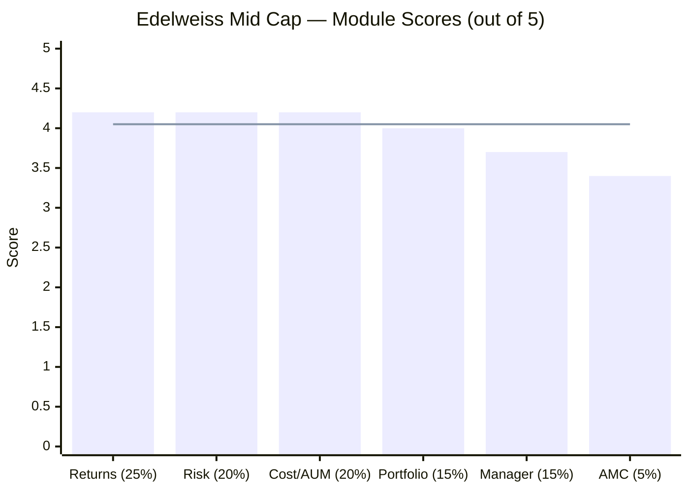
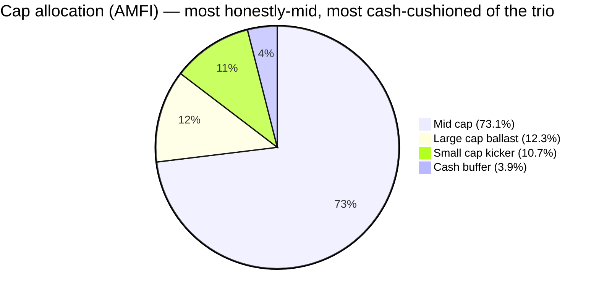
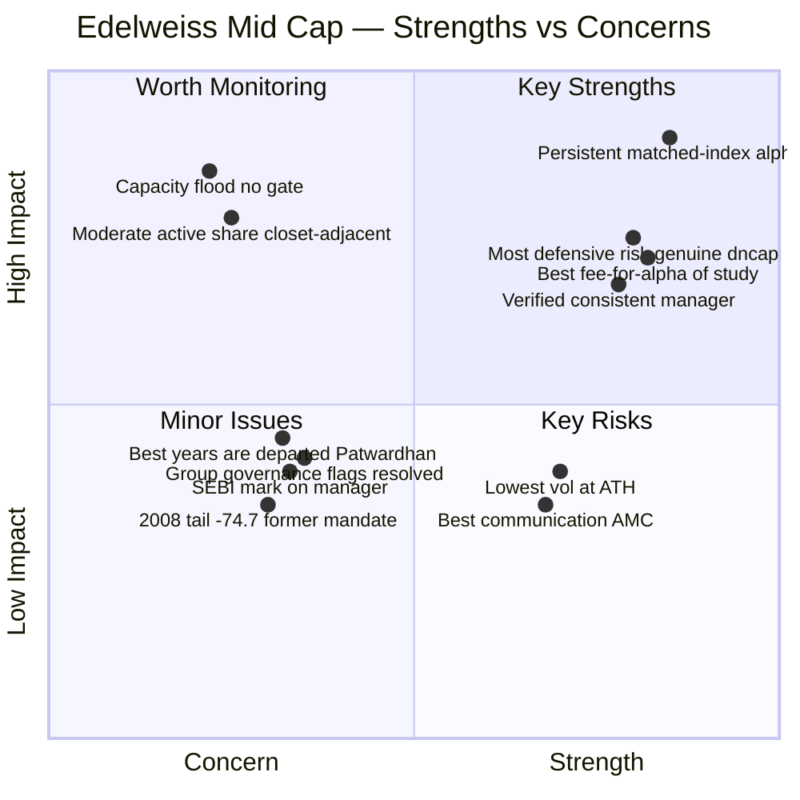
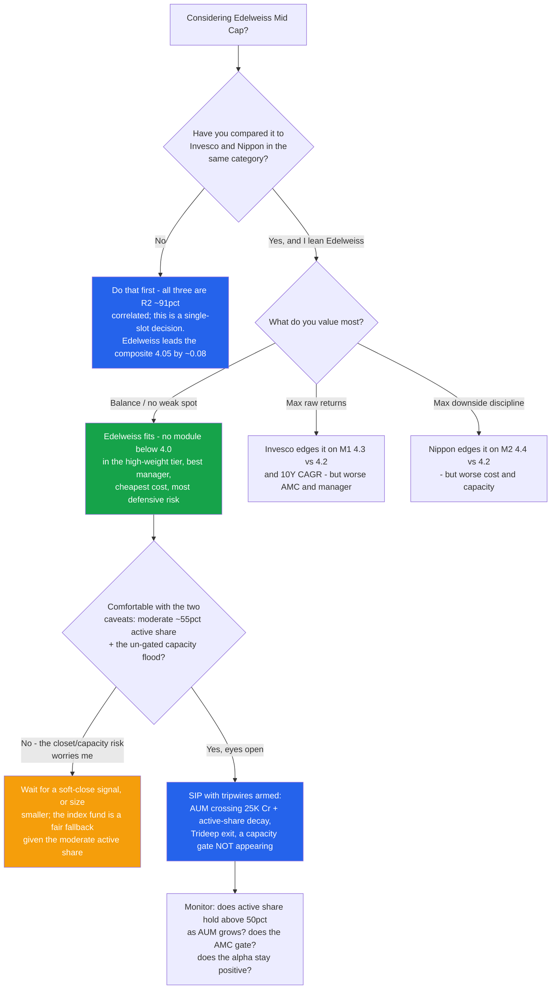
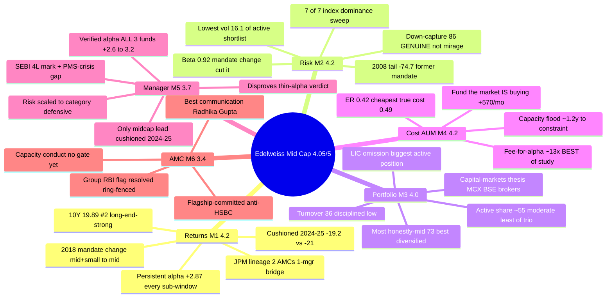

# Edelweiss Mid Cap Fund — Deep Study

## Fund Identity

| Field | Value |
|-------|-------|
| **Full Name** | Edelweiss Mid Cap Fund — Direct Plan — Growth (the surviving scheme is the former **JPMorgan India Mid and Small Cap Fund**) |
| **Lineage** | JPMorgan India Mid & Small Cap (27-Dec-2007) → **Edelweiss Mid Cap** (Edelweiss acquired JP Morgan MF India, ~Nov-2016) — **two AMCs, one continuous NAV, bridged by one manager (Patwardhan)**; **2018 SEBI recat narrowed Mid+Small → pure Mid Cap** |
| **AMC** | Edelweiss Asset Management Ltd — ~₹1.49 lakh Cr AUM (22.3× under CEO Radhika Gupta); WestBridge Capital 15% (Aug-2025) |
| **Computable record** | Regular NAV from 27-Dec-2007 (as JPMorgan, spliced); Direct plan from 02-Jan-2013 |
| **SEBI Category / Risk** | Equity — Mid Cap (min 65% in ranks 101–250) / Very High |
| **Benchmark** | **Nifty Midcap 150 TRI** |
| **Fund Manager** | **Trideep Bhattacharya (CIO-Equities) — since 01-Oct-2021 (4.8y)**; co-managers Raj Koradia + Dhruv Bhatia (ex-BOI, Oct-2024); Sahil Shah exited Jun-2024 |
| **AUM** | **₹16,849 Cr** (Jul-2026) — sweet-spot upper end; **fastest-accelerating flows of the shortlist** ("the fund the market IS buying") |
| **Expense Ratio** | **0.42% Direct** — cheapest of the trio; 36% turnover → **true all-in cost ~0.49%** (headline is honest) |
| **NAV (03-Jul-2026, Direct)** | ₹127.06 — 0.3% off ATH |
| **Exit Load** | 1% / 90 days (reported — lighter than standard; verify vs factsheet) |
| **Turnover** | **36%** — low, disciplined (7× lower than HSBC) |
| **VRO Rating** | ⭐⭐⭐⭐⭐ (5/5) — best of the studied midcaps |
| **Stated Style** | Quality-growth, the documented **FAIR framework**; defensive, index-beating, risk scaled to category |
| **Data** | MFAPI Direct 119869 (JPM) spliced to 140228, Regular 107301→140225 · index counterfactuals 147622 & 114456 · Trideep's 3 Edelweiss funds 140353/146196 vs 147625/147623 · Wayback Groww AUM/ER series · AdvisorKhoj factsheet · Tickertape holdings |

---

## The One-Line Context

Edelweiss Mid Cap is the **consistency leader** of the shortlist — the fund that wins not by topping any single module but by having **no weak one**. On the two highest-weighted tests it is excellent: it passes the "why not the index?" test with the strongest, most *persistent* alpha of the group (**+2.87%/yr over the buyable Nifty Midcap 150 index fund, positive in every sub-window**), and it runs the trio's **most defensive risk profile** (lowest volatility, best *genuine* down-capture, below-1 beta, a clean 7/7 index-dominance sweep). It carries the **cheapest ER (0.42%) and the best fee-for-alpha of the entire study** (+₹12.3L upside vs only −₹0.9L downside on a 10Y SIP), a disciplined, low-turnover, honestly-mid portfolio, and — the module that separates it — the **best-verified manager of the studied midcaps**: computing Trideep Bhattacharya's alpha across all three Edelweiss funds he runs shows a **consistent +2.6% to +3.2% index-beating record**, disproving the prior studies' "thin alpha" verdict, earned defensively (he was the only midcap lead who *cushioned* the 2024–25 correction where HSBC amplified it). Two live caveats keep it honest and go to the decision tree: a **moderate ~55% active share** (the least conviction-dense of the trio) and a **capacity trajectory** that, at the current flood, crosses the ₹25K Cr constraint zone in ~1.2 years — together the single "quietly becomes the index" risk. It also carries the study's best investor communication (Radhika Gupta), offset by resolved/ring-fenced group governance flags. **Final: ≈4.05/5 — the provisional #1 of the studied midcaps, narrowly ahead of the Invesco (≈3.97) / Nippon (≈3.96) dead-heat, and well ahead of HSBC (≈3.49).**

---

## Module Status

| Module | Weight | Status | Score | File |
|--------|--------|--------|-------|------|
| 1 — Returns Consistency | 25% | ✅ Complete | ~4.2/5 | [module1_returns.md](module1_returns.md) |
| 2 — Risk Profile | 20% | ✅ Complete | ~4.2/5 | [module2_risk.md](module2_risk.md) |
| 3 — Portfolio DNA | 15% | ✅ Complete | ~4.0/5 | [module3_portfolio.md](module3_portfolio.md) |
| 4 — Cost & AUM Impact | 20% | ✅ Complete | ~4.2/5 | [module4_cost.md](module4_cost.md) |
| 5 — Fund Manager Quality | 15% | ✅ Complete | ~3.7/5 | [module5_manager.md](module5_manager.md) |
| 6 — AMC Trustworthiness | 5% | ✅ Complete | ~3.4/5 | [module6_amc.md](module6_amc.md) |

---

## Final Scorecard

| Module | Score | Weight | Weighted |
|--------|-------|--------|----------|
| 1 — Returns Consistency | ~4.2 | 25% | 1.050 |
| 2 — Risk Profile | ~4.2 | 20% | 0.840 |
| 4 — Cost & AUM Impact | ~4.2 | 20% | 0.840 |
| 3 — Portfolio DNA | ~4.0 | 15% | 0.600 |
| 5 — Fund Manager Quality | ~3.7 | 15% | 0.555 |
| 6 — AMC Trustworthiness | ~3.4 | 5% | 0.170 |
| **Overall** | | **100%** | **≈ 4.05 / 5** |

> **The structural story in one line:** Edelweiss's scores are the highest-*floored* of the study — nothing below 3.4, and that 3.4 is only 5% of the weight. Its three highest-weight modules (returns, risk, cost — 65% combined) are all 4.2, and its manager module (3.7) is the best of the trio. It is neither a pure offense build (Invesco) nor a pure defense build (Nippon) — it is the **balanced build that does both competently and has no soft spot to exploit.**

---

## ⭐ Why Edelweiss Leads *(the section the decision tree will read first)*

| Module | **Edelweiss** | Invesco | Nippon | HSBC | Edelweiss's standing |
|--------|--------------:|--------:|-------:|-----:|----------------------|
| M1 Returns (25%) | **4.2** | 4.3 | 4.2 | 3.5 | ties Nippon; persistent alpha, cushioned correction |
| M2 Risk (20%) | **4.2** | 4.1 | 4.4 | 3.2 | most defensive book; genuine down-capture |
| M3 Portfolio (15%) | **4.0** | 4.0 | 4.1 | 3.7 | honest, low-turnover — but moderate active share |
| M4 Cost & AUM (20%) | **4.2** | 4.2 | 3.6 | 3.6 | **best fee-for-alpha of the study**; cheapest ER |
| M5 Manager (15%) | **3.7** | 3.4 | 3.5 | 3.5 | **best of the trio — verified consistent alpha** |
| M6 AMC (5%) | **3.4** | 2.4 | 3.4 | 3.4 | best communication; group flags (resolved) |
| **Weighted** | **≈4.05** | **≈3.97** | **≈3.96** | **≈3.49** | **provisional #1** |

Unlike HSBC's unambiguous #3 (it loses the two heaviest modules), Edelweiss's #1 is **narrow and earned on balance, not dominance**: it never scores *highest* on any single module (Invesco leads M1, Nippon leads M2/M3), but it is the only fund with **no module below 4.0 in the high-weight tier and the best manager module**. Invesco is dragged by its manager (3.4) and AMC (2.4); Nippon by its cost/capacity (3.6). Edelweiss has no equivalent drag. On the single-slot midcap decision (all three are R² ~91% correlated), the scoreboard puts Edelweiss first — but the ~0.08 margin over Invesco/Nippon is **within provisional noise**, and the decision tree must weigh its two real caveats (moderate active share, capacity trajectory) and the three unstudied funds (esp. Mahindra Manulife).

---

## Key Performance Metrics

| Metric | Value | Context |
|--------|-------|---------|
| **10Y CAGR** | **19.89%** | #2 of studied four (Invesco 20.34) — long-end-strong |
| **5Y CAGR** | **20.50%** | above universe median; top-3 |
| **3Y CAGR** | **24.21%** | 3rd — no window weakness |
| **1Y** | **5.40%** | subdued — did NOT ride the 2026 momentum spike (unlike HSBC) |
| **18.5Y CAGR (spliced)** | **13.56%** | honest long anchor (former mid+small mandate, 2008 −74.7% inside) |
| **Alpha vs investable index** | **+2.87%/yr × 6.8y** (index fund) ✅ / +5.22%/yr × 13.5y (ETF) | **passes matched test; persistent across every sub-window** |
| **Trideep-era alpha** | **+2.92%/yr × 4.8y** (and +3.18% FlexiCap / +2.61% SmallCap) | consistent across all 3 Edelweiss funds — not category luck |
| **Up / Down capture (5Y)** | **98% / 86%** — genuine (cushions the correction) | best down-capture of the trio |
| **Sharpe / Sortino / Calmar (5Y)** | 0.871 / 1.548 / 1.02 | 3rd / 3rd / 3rd — **stable across windows** (anti-recency) |
| **Volatility (5Y)** | **16.1%** | **lowest of the active shortlist**, below the index |
| Max drawdown (5Y / modern / tail) | **−20.1%** (ties best) / −39.2% / −74.7% (2008, JPM mid+small) | 2024–25 recovery **6.4mo — fast** |
| **Beta vs Midcap 150** | **0.92** (mandate change cut it 0.97→0.88) | below 1.0; factsheet confirms |
| **Rolling 5Y windows negative** | **0.0% — floor +0.47%/yr** | clean |
| **10Y SIP (₹20K/mo)** | **₹24.0L → ₹84.7L, 21.56% XIRR** | #2 of the trio behind Invesco |
| **Active share** | **~55% (estimate)** vs index | genuinely active but least conviction-dense (Nippon 54, HSBC 69, Invesco 79) |
| Holdings / Top-10 | **86 / ~25%** | broad, flat pyramid — low single-name risk |
| **AUM / flows** | ₹16,849 Cr; **+₹570 Cr/mo, accelerating** | ~1.2y to the constraint zone (the capacity watch-item) |
| Fee premium vs index → alpha | ~0.22% headline / ~0.29% true → **+2.87%/yr** | **~10–13× margin — best of the study** |
| Manager | **Trideep Bhattacharya, 4.8y, 3-person team** | consistent index-beater ×3 funds; ₹4L SEBI mark |

---

## ⚠️ The Five Critical Lenses — Read Before the Numbers

### Lens 1 — The Persistent Alpha (the anti-HSBC)
Where HSBC's alpha is a 2024+2026 spike and fails the matched-index test, Edelweiss's **+2.87%/yr over the buyable index fund is positive in every sub-window** (pre-2022 +3.36, 2022+ +2.65, 2024+ +5.89) and stays positive in the current manager's own era (+2.92%). Its rank is *strongest at the long end* (10Y #2), the endurance signature — not a recency ramp. This is the strongest, most durable "why not the index?" answer of the group alongside Invesco.

### Lens 2 — The Most Defensive Risk Profile, and the Down-Capture Is REAL
Edelweiss runs the lowest volatility of the active shortlist (16.1%), a below-1 beta (0.92, which the 2018 mandate change *lowered* from 0.97), and it wins the index-dominance test **7/7** (like Nippon; HSBC 4/7). Critically, its 86% down-capture is **genuine, not a mirage** — the same month-by-month forensic that exposed HSBC's amplification shows Edelweiss *cushioned* the two worst months (Feb-2025, Mar-2026) — the right shape for a SIP. Its Sharpe (0.871) is stable across windows, unpropped by 2026.

### Lens 3 — The Best Fee-for-Alpha of the Study
The cheapest ER of the trio (0.42%), a low 36% turnover that keeps the headline honest (~0.49% true cost, vs HSBC's 0.76%), buying a verified +2.87% alpha — a ~10–13× margin, the widest studied. The 10Y-SIP payoff is a bargain, not a bet: **+₹12.3L upside at the verified alpha, −₹0.9L downside if the alpha entirely died.** On cost-for-value, nothing in the study beats it.

### Lens 4 — The Manager Is a Verified, Consistent Index-Beater (correcting the record)
The decisive M5 finding: computed against the *matched investable index funds*, Trideep beats the buyable passive in **all three** Edelweiss categories — +3.18% (FlexiCap), +2.92% (MidCap), +2.61% (SmallCap) over an identical 4.8-year window — **disproving the prior studies' "thin alpha" verdict** (which used a beta-adjusted IR lens). He earns it defensively, dialing risk *down* as the category gets riskier (up-capture 105→98→84), and was the **only midcap lead who cushioned the 2024–25 correction**. Caps: a ₹4L personal SEBI mark and a pre-Edelweiss crisis record trapped in an unverifiable PMS book.

### Lens 5 — The Two Real Caveats: Moderate Active Share × the Capacity Flood
The honest weaknesses, and they compound. The portfolio is the *least conviction-dense of the trio* (~55% active share, R² 95%, TE 4.5% — genuinely active but closest to the closet line), **and** the fund is being flooded (+₹570 Cr/mo, ~1.2y to the ₹25K constraint zone) with **no soft-close.** A swelling, already-index-aware fund is the textbook "quietly becomes the index" setup. This is the single risk the decision tree must weigh most — mitigated (not resolved) by the AMC's best-in-class transparency (Radhika Gupta's SIP-caution, voluntary liquidity disclosure).

---

## Portfolio DNA (Snapshot)

| Metric | Value | Significance |
|--------|-------|--------------|
| Holdings | **86** | Above the 40–70 sweet spot; broad, flat pyramid (top ~3%) |
| Top-10 | **~25% (est.)** | Low edge of the good band — low single-name risk, low conviction density |
| Largest position | **MCX 3.03%** (index 0.73%) | The capital-markets thesis anchor — biggest active overweight |
| Signature thesis | **Capital-markets infrastructure** (MCX + BSE + 7.3% brokerage) + broad financials | Distinct from HSBC (electrification) and Invesco (growth); largest active position is the **LIC omission** (index #1) |
| Cap split (AMFI) | **Mid 73.1 / Large 12.3 / Small 10.7 / Cash 3.9** | **Most honestly-mid of trio; smallest small-cap kicker; largest cash buffer** |
| Turnover | **36%** | Low, disciplined — buy-and-hold-leaning (7× lower than HSBC) |
| Active share | **~55% (est.)** vs index | Genuinely active but least conviction-dense of the trio |
| Sector diversification | max sector ~9.6% | **Best-diversified of the trio** (HSBC 14.3, Invesco fin 31) |
| Cash | ~3.9% | Modest structural buffer — largest of the trio |
| Overlap vs PP / DSP sleeves | near-zero by name | Return-enhancer, not diversifier (R² 91–93% vs all midcaps) |

---

## Strengths vs Concerns

---

## Key Strengths

- **⭐ Persistent, verified alpha vs the buyable index** — +2.87%/yr matched, positive in every sub-window; the strongest "why not the index?" answer of the group alongside Invesco
- **⭐ Most defensive risk profile of the trio** — lowest vol (16.1%), below-1 beta (0.92), genuine 86% down-capture (cushions the correction HSBC amplified), 7/7 index-dominance
- **⭐ Best fee-for-alpha of the study** — cheapest ER (0.42%), honest true cost (~0.49%), ~10–13× alpha margin; +₹12.3L upside vs −₹0.9L downside
- **⭐ Best-verified manager of the studied midcaps** — Trideep beats the index in all 3 Edelweiss categories (+2.6–3.2%), the only midcap lead to cushion 2024–25; disproves the "thin alpha" verdict
- **⭐ Best investor communication of the cohort** — Radhika Gupta, behind only PPFAS across all studies
- Most honestly-mid cap posture (AMFI 73%), best sector diversification, largest cash buffer, low turnover — a disciplined book
- 5-star VRO rating (best of the trio); essentially at all-time high (−0.3%); #2 10Y SIP XIRR (21.56%)

## Key Concerns

- **⭐ The capacity flood, un-gated** — +₹570 Cr/mo accelerating, ~1.2y to the ₹25K constraint zone; no soft-close (the #1 forward risk)
- **⭐ Moderate active share (~55%)** — the least conviction-dense of the trio, closest to the closet line; compounds the capacity risk ("quietly becomes the index")
- **Best pre-2021 years belong to the departed Patwardhan** — the 2014 mania and 2019 winter alpha are his (though Trideep's own 4.8y record is genuinely strong)
- **Group governance flags** — the 2024 RBI "evergreening" action (resolved, ring-fenced) + a SEBI order personally naming the CEO and CIO
- **The 2008 tail (−74.7%)** — deepest documented in the repo, but the former JPM mid+small mandate under a different house
- Deepest 2018 winter calendar fall of the group (−14.6%) — former-mandate higher beta; a ₹4L SEBI mark on the manager
- Zero diversification — R² 91–93% vs all studied midcaps (single-slot return-enhancer)
- Active share / band split are estimates (holdings-API gap); exit-load 90-day terms unverified

---

## Comparison vs Studied Funds (All Four Categories)

| Dimension | **Edelweiss (MidCap, ≈4.05)** | Invesco (MidCap, ≈3.97) | Nippon (MidCap, ≈3.96) | HSBC (MidCap, ≈3.49) | DSP Small Cap (4.00) |
|-----------|-------------------------------|-------------------------|------------------------|----------------------|----------------------|
| 10Y CAGR | 19.89% (#2) | **20.43%** ⭐ | 19.33% | 18.47% | ~19.3% |
| Window profile | **Long-end-strong endurer** | Dual-horizon | Endurance staircase | Recency ramp | — |
| Alpha vs own index | **+2.87%/yr, persistent** ✅ | +2.88% (episodic) ✅ | +1.97% (stable) ✅ | −0.22% ❌ | positive ✅ |
| Risk-adjusted (5Y Sharpe) | 0.871 | 0.879 | **0.912** ⭐ | 0.825 | ~0.7–0.8 |
| True cost (turnover-adj) | **~0.49%** ⭐ | ~0.63% | ~0.64% | ~0.76% | ~0.7% |
| Capacity | **~1.2y runway (flood)** ⚠ | ~3y runway | past | unlimited | gated ⭐ |
| Manager | **verified, consistent ×3 funds** ⭐ | solo star, unverified crisis | machine, proven | crisis-tested, solo | 14y craftsman ⭐ |
| AMC | 3.4 (best comms, flags) | 2.4 (churn) | 3.4 (scarred fortress) | 3.4 (misaligned) | 4.3 ⭐ |
| Diversification value | ~None (R² 91–93%) | ~None | ~None | ~None | is the satellite |

> **Cross-study insight:** Edelweiss is the midcap trio's **balanced build** — it wins the composite not by dominating any axis but by having no weak module in the high-weight tier and the best manager verdict. Invesco is the offense build (best returns, worst AMC); Nippon the defense build (best risk, worst capacity); Edelweiss splits the difference and adds the cleanest manager story. Against DSP Small Cap (4.00, the four-study benchmark), Edelweiss edges ahead on composite but trails on the AMC and capacity-stewardship axes DSP's gating gold-standard defines.

---

## ₹20K/Month SIP Projections (10 Years)

| Scenario | CAGR assumption | Projected corpus | Multiple |
|----------|----------------|------------------|----------|
| Bear (band underperforms) | 12% | ₹46.5L | 1.94× |
| Conservative (band return, ~no alpha) | 15% | ₹55.7L | 2.32× |
| **Base (band + partial verified alpha)** | **17%** | **₹63.1L** | **2.63×** |
| Optimistic (full verified alpha persists) | 20% | ₹76.5L | 3.19× |

**Total invested: ₹24,00,000** | **Realized trailing 10Y SIP (actual history): ₹24.0L → ₹84.7L at 21.56% XIRR** — the #2 realized SIP of the trio (behind Invesco), and comfortably above a 10Y index SIP. Unlike HSBC's, Edelweiss's base case *beats* the index fund on the honest matched-window anchor (+2.87%/yr), so the alpha above the band is evidence-backed rather than a bet — subject to the capacity trajectory not eroding it.

---

## Investment Decision Framework

---

## Edelweiss Mid Cap — In One View

---

## The Critical Facts — In 10 Sentences

1. Edelweiss Mid Cap scores **≈4.05/5 — the provisional #1 of the studied midcaps**, narrowly ahead of the Invesco (≈3.97) / Nippon (≈3.96) dead-heat, winning on balance (no weak high-weight module) rather than dominance.
2. It passes the "why not the index?" test with the group's **most persistent alpha — +2.87%/yr over the buyable Nifty Midcap 150 index fund, positive in every sub-window** — the anti-HSBC, and its rank is strongest at the long end (10Y #2).
3. It runs the **trio's most defensive risk profile** — lowest volatility (16.1%), below-1 beta (0.92, which the 2018 mandate change lowered from 0.97), a clean 7/7 index-dominance sweep, and a genuine (not mirage) 86% down-capture that cushioned the 2024–25 correction.
4. It has the **cheapest ER (0.42%) and best fee-for-alpha of the entire study** — ~10–13× margin, an honest ~0.49% true cost (low 36% turnover), and a 10Y-SIP payoff of +₹12.3L upside vs only −₹0.9L downside.
5. The decisive manager finding: computed against the matched index funds, **Trideep beats the buyable passive in all three Edelweiss categories** (+3.18% FlexiCap, +2.92% MidCap, +2.61% SmallCap), disproving the prior "thin alpha" verdict — earned defensively, and he was the only midcap lead to *cushion* the 2024–25 correction.
6. It carries a **hidden JPMorgan lineage** (2007) and a 2018 Mid+Small→Mid mandate change — the cleanest acquired lineage studied (two AMCs bridged by one manager), though its pre-2018 mania numbers and −74.7% 2008 tail belong to the former, wider mandate.
7. The portfolio is disciplined and distinctive — a capital-markets-infrastructure thesis (MCX its biggest active overweight, plus BSE and brokers), most honestly-mid (AMFI 73%), best sector-diversified, low-turnover, with the largest cash buffer of the trio.
8. The two real caveats, which **compound**: a **moderate ~55% active share** (least conviction-dense of the trio) and an **un-gated capacity flood** (+₹570 Cr/mo, ~1.2y to the ₹25K constraint zone) — together the "quietly becomes the index" risk the decision tree must weigh most.
9. The AMC is the study's **best communicator (Radhika Gupta)** and runs Mid Cap as a committed flagship (anti-HSBC), but carries resolved/ring-fenced group governance flags (the 2024 RBI action) and a SEBI order that named the CEO and CIO.
10. For this portfolio it is a **single-slot return-enhancer** (R² 91–93% vs both peers) — the honest verdict is *the balanced, best-rounded midcap of the three, chosen for having no weak spot and the cleanest manager story, with the capacity trajectory and active share as the live watch-items.*

---

## Quick Verdict

**Best suited for:**
- Investors who want the **best-rounded, no-weak-spot midcap** — strong returns, the most defensive risk, the cheapest cost, and the best-verified manager, in one fund
- Those who take the **"why not the index?" test seriously** — Edelweiss passes it on both return (+2.87% persistent alpha) and risk (7/7 dominance), at the study's best fee-for-alpha
- Investors who value **downside discipline and low volatility** with genuine (not illusory) protection
- Those who prize **manager quality and communication** — a verified consistent index-beater under the study's most transparent AMC

**Not suited for:**
- **Investors worried about the capacity trajectory** — the un-gated flood toward the constraint zone is the real risk; wait for a soft-close signal or size smaller
- **Those who want maximum conviction/differentiation** — the ~55% active share is the least of the trio; if you want a high-conviction book, Invesco (79%) fits better
- **Anyone needing diversification** — R² 91–93% to both peers; a single-slot return-enhancer, not a hedge
- Investors uncomfortable with **group-level governance history** — the (resolved) RBI flag and the SEBI order naming the CEO are the "eyes open" caveats

---

## One-Line Verdict

> **Edelweiss Mid Cap is the consistency leader — the balanced build that wins the composite not by topping any single module but by having no weak one: it passes the "why not the index?" test with the group's most persistent alpha (+2.87%/yr, positive in every sub-window), runs the trio's most defensive risk profile (lowest volatility, below-1 beta, a genuine 86% down-capture that cushioned the correction HSBC amplified, a 7/7 index-dominance sweep), carries the cheapest ER and best fee-for-alpha of the entire study (+₹12.3L upside vs −₹0.9L downside), and is run by the best-verified manager of the studied midcaps — Trideep Bhattacharya beats the buyable index in all three Edelweiss categories he runs (+2.6% to +3.2%), disproving the prior "thin alpha" verdict, earned defensively, the only midcap lead to cushion 2024–25. Its two honest caveats compound into one watch-item — a moderate ~55% active share on a fund being flooded toward the constraint zone, the "quietly becomes the index" risk — and its best pre-2021 years belong to the departed Patwardhan. Under the study's best-communicating AMC (resolved group flags notwithstanding), it lands at ≈4.05/5 — the provisional #1 of the studied midcaps, narrowly ahead of the Invesco/Nippon dead-heat, its edge being that it has no soft spot to exploit. Final: ≈4.05/5.**

---

*Study completed: July 6, 2026 | Framework: 6-Module Weighted Scoring (Mid Cap adaptation) | Final Score: ≈4.05/5 | Fourth of 7 shortlisted midcap funds studied — the provisional #1, narrowly ahead of the Invesco (≈3.97) / Nippon (≈3.96) dead-heat, well above HSBC (≈3.49) | Benchmark = Nifty Midcap 150 TRI; index counterfactuals = Motilal M150 Index Fund (147622) + M100 ETF (114456) | Lineage: JPMorgan India Mid & Small Cap → Edelweiss Mid Cap (acquisition ~Nov-2016; 2018 SEBI recat to pure Mid Cap) | Data: MFAPI (Direct 119869→140228 spliced, Regular 107301→140225), Trideep's 3 Edelweiss funds (140353/146196 vs index funds 147625/147623), Wayback-archived Groww AUM/ER series, AdvisorKhoj factsheet, Tickertape holdings, smart-investing.in index constituents | Manager: Trideep Bhattacharya (Oct-2021, CIO) + Raj Koradia + Dhruv Bhatia (ex-BOI, Oct-2024); predecessor Patwardhan (→ Union MF) owns pre-2021 record | Cross-study correction: Trideep's alpha genuine (+2.6–3.2%) on the matched-index method vs the prior "thin alpha" (IR) read — FlexiCap/SmallCap M5s patched | Documented gaps: full holdings (active share ~55% estimated), exit-load 90-day terms, factsheet PDF Azure-403-blocked | Tripwires: AUM crossing ₹25K Cr + active-share decay (the combined capacity risk), Trideep exit, a capacity gate NOT appearing, alpha turning negative | Study order: Nippon → Invesco → HSBC → Edelweiss → Mahindra Manulife → ICICI Pru → Sundaram | Next: Mahindra Manulife Mid Cap (study #5)*
