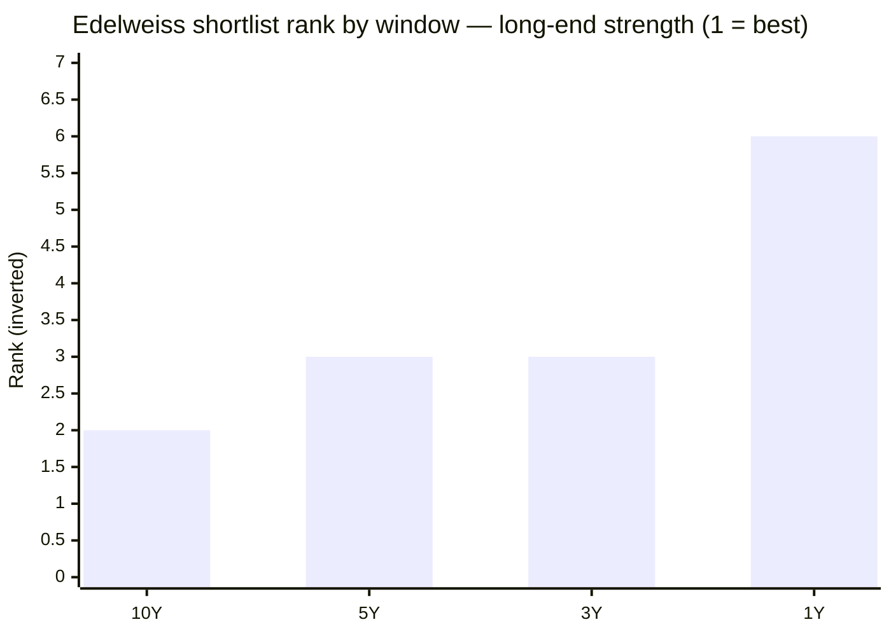
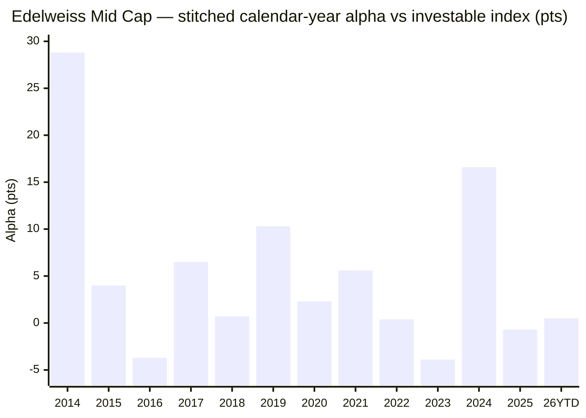

# Module 1: Returns Consistency — Edelweiss Mid Cap Fund

## Module 1 Score: ~4.2 / 5 (provisional)

---

## The One-Line Context

Edelweiss Mid Cap is the mid-cap sleeve's **persistent-alpha endurer**. On the two highest-weighted tests — alpha vs the buyable index, and the last real correction — it is the **only studied mid-cap besides Invesco to both clear the matched-index test (+2.87%/yr over the index fund's 6.8-year life) AND keep beating it in every sub-window, including the current manager's own era (+2.92%/yr)** — the exact inverse of HSBC's front-loaded fade. Its rank is strongest at the long end (10Y 19.89%, #2 of the studied four), a durable-process signature. Two caveats keep it below a clean win: (1) it carries a **hidden JPMorgan lineage** and a **2018 mandate change** from Mid-*and-Small* Cap to pure Mid Cap, so its explosive pre-2018 mania numbers came from a wider, higher-beta fund; (2) the winter and mania alpha belong to a **departed manager (Harshad Patwardhan)** — though, unusually, the current manager's slice stands on its own.

---

## Fund Identity

| Field | Value |
|-------|-------|
| **Full Name** | Edelweiss Mid Cap Fund — Direct Plan — Growth (the surviving scheme is the former **JPMorgan India Mid and Small Cap Fund** — see Lineage) |
| **Lineage** | **JPMorgan India Mid and Small Cap Fund (27-Dec-2007) → Edelweiss Mid Cap Fund** (Edelweiss AMC acquired JP Morgan MF India, transition effective ~25-Nov-2016) — **two AMCs, one continuous NAV, bridged by one manager (Patwardhan)** |
| **Mandate history** | Launched as a **Mid *and Small* Cap** fund; SEBI's 2018 recategorization narrowed it to **pure Mid Cap** (min 65% in ranks 101–250) — a genuine mandate change, not just a rename |
| **Computable record** | Regular NAV from **27-Dec-2007** (as JPMorgan) via splice; Direct plan from **02-Jan-2013** |
| **SEBI Category** | Equity — Mid Cap (min 65% in ranks 101–250) |
| **Benchmark** | **Nifty Midcap 150 TRI** |
| **AUM** | **₹16,849 Cr** — comfortably inside the study's ₹3,000–25,000 Cr sweet spot *(Tickertape Jul-2026; factsheet reconciliation → Module 4)* |
| **Expense Ratio** | **0.42%** (VRO) / 0.48% (Tickertape Jul-2026) — cheapest of the studied four *(→ Module 4 reconciliation)* |
| **NAV (03-Jul-2026)** | ₹127.06 (Direct); Regular ₹107.54 |
| **Current Managers** | **Trideep Bhattacharya since 01-Oct-2021** (CIO-Equities); **Raj Koradia**; **Dhruv Bhatia since Oct-2024** (ex-BOI Small Cap architect) |
| **Prior Managers** | **Harshad Patwardhan** (JPMorgan India CIO → Edelweiss, 2007 → Oct-2021); **Sahil Shah** co-manager (24-Dec-2021 → resigned 28-Jun-2024) |
| **VRO Rating** | ⭐⭐⭐⭐⭐ (5/5) — best of the studied four (HSBC 4★) |
| **Riskometer** | Very High |
| **Exit Load** | 1% / 365 days (standard) |
| **Min SIP** | ₹500 (monthly) |

---

## Raw Data (MFAPI computed + Tickertape screening, as of 03-Jul-2026)

| Metric | Value |
|--------|-------|
| 1Y absolute | **5.40%** — a flat 2026 for the fund |
| 3Y CAGR | 24.21% — 3rd of the studied four |
| 5Y CAGR | 20.50% — 3rd of 7 shortlist |
| 10Y CAGR | **19.89%** — **#2 of 6 with 10Y data** (Invesco 20.34, then Edelweiss) |
| 7Y CAGR | 23.79% |
| Since Direct inception (13.5y) | 21.43% |
| **Spliced 18.5y (JPM incl.)** | **13.56%** — the honest long anchor, but a *former-mandate* figure (mid+small, 2008 −65.9% inside) |
| Mean rolling 3Y (direct era) | 22.06% |
| Sharpe (Tickertape) | 0.135 |
| Alpha (Tickertape, vs benchmark) | +1.09 |
| Max drawdown (direct era) | −39.2% (Jan-2018 winter → COVID trough, no recovery between) |
| 10Y SIP XIRR (₹20K/mo) | **21.56%** — #2 of the studied four |
| Portfolio PE | 30.3 (category 33.8) |
| Std deviation (ann.) | 15.2% (category 15.3%) |
| Small-cap allocation | 10.7% (a modest small-cap kicker in the flexible sleeve) |
| Large-cap allocation | 22.8% |

**Data sources:** MFAPI Direct **119869** (JPMorgan, 02-Jan-2013 → 24-Nov-2016, 955 NAVs) spliced to **140228** (Edelweiss, 28-Nov-2016 →), 3,322 pts total; Regular **107301** (JPMorgan, 27-Dec-2007 → 24-Nov-2016) spliced to **140225** (Edelweiss), 4,554 pts; index counterfactuals **147622** (Motilal Nifty Midcap 150 Index Fund Direct, 11-Sep-2019 →) and **114456** (Motilal Nifty Midcap 100 ETF, Feb-2011 →). All headline metrics computed from raw NAVs. Manager history verified from Value Research, Cafemutual, Dezerv, and the sibling Edelweiss studies (FlexiCap/SmallCap).

---

## Cross-Source Verification

Recomputing MFAPI CAGRs to the **03-Jul-2026** NAV reproduces the Tickertape screening export:

| Metric | MFAPI (computed) | Tickertape (Jul-2026) | Verdict |
|--------|------------------|------------------------|---------|
| 1Y | 5.40% | 5.16% | ✅ match (2-day drift) |
| 3Y | 24.21% | 24.05% | ✅ match |
| 5Y | 20.50% | 20.64% | ✅ match |
| 10Y | **19.89%** | 19.88% | ✅ exact |

**The JPMorgan→Edelweiss splice is validated two ways:** (1) NAV levels are near-identical across the code change (Direct 20.60 on 24-Nov-2016 → 21.06 on 28-Nov-2016); (2) the +2.22% move over the 4-day handover **exactly matches the Nifty Midcap 100 ETF's +2.16%** over the same window — it is market movement, **not** a discontinuity. The splice is clean.

---

## ⭐ NEW: The Hidden JPMorgan Lineage — A Cleaner HSBC Parallel

MFAPI's Edelweiss Mid Cap NAV begins only **28-Nov-2016** — the AMC-acquisition date. The fund's real life starts **27-Dec-2007 as JPMorgan India Mid and Small Cap Fund**. Edelweiss acquired JP Morgan's India mutual-fund business in 2016; the scheme was renamed and continued.

| Era | Entity | Lead Manager | NAV scheme | Note |
|-----|--------|--------------|------------|------|
| 2007–2016 | **JPMorgan India Mid & Small Cap** | **Harshad Patwardhan** (JPM India CIO) | 107301 / 119869 | **2008 GFC −65.9%** lives here (mid+small mandate) |
| 2016–Oct 2021 | **Edelweiss Mid Cap** | **Harshad Patwardhan** (moved with the deal) | 140225 / 140228 | Continuous process; 2018 recat to pure Mid Cap |
| Oct 2021 → | Edelweiss Mid Cap | **Trideep Bhattacharya** (+Sahil Shah 2021–24; Raj Koradia; Dhruv Bhatia from Oct-24) | 140228 | Patwardhan exited to Union MF as CIO |

**Contrast with HSBC Midcap:** HSBC's record spans **four AMCs and five teams** (Chola → L&T → HSBC). Edelweiss is **two AMCs — and, critically, the same lead manager (Patwardhan) bridged the acquisition**, running one continuous process from 2007 to 2021. So the attribution here is materially cleaner: one manager 2007→2021, then Trideep 2021→now. Where HSBC's answer to "whose record is this?" was *"nobody's, cleanly,"* Edelweiss's is *"Patwardhan's, then Trideep's — a clean two-era handoff."*

- **Harshad Patwardhan:** ex-JPMorgan India CIO-Equities; built the fund's 2007–2021 record; left Oct-2021 to become CIO at Union MF. (The same lineage runs through Edelweiss FlexiCap and Small Cap — see those modules.)
- **Trideep Bhattacharya:** CFA, B.Tech IIT-KGP, MBA SP Jain; 20+ yrs; ex-Axis AMC; Edelweiss CIO-Equities since Sep/Oct-2021.

---

## ⭐ NEW: The 2018 Mandate Change — Mid+Small → Pure Mid Cap

Until SEBI's 2018 recategorization this was a **Mid *and Small* Cap** fund. That reframes two headline numbers and one weakness:

- **2014 (+85.6%, +28.8 alpha)** and **2008 (−65.9%)** were earned under the *wider, higher-beta* mandate on a micro base — the same "don't annualize the mania" caveat as HSBC's 2014, but here it is **structural** (extra small-cap exposure), not just a small denominator.
- It also explains the **deepest 2018 calendar fall of the studied four (−14.6%)**: the fund entered the midcap winter still carrying the beta of its former mandate.

**Implication:** the honest forward-looking record is the **pure-Mid-Cap era, 2018→now** — which is precisely where the fund looks strongest (see the alpha-persistence decomposition below). The 18.5y spliced 13.56% is retained as a long anchor but must be read as a *former-mandate* figure.

---

## CAGR vs Benchmark and the Window Ladder — The Endurance Profile

| Window | Edelweiss | Rank of 4 studied | Character |
|--------|-----------|-------------------|-----------|
| 10Y | **19.89%** | **#2** (Invesco 20.34 > **Edel** > Nippon 19.33 > HSBC 18.47) | clears the ≥18 "5" band |
| 5Y | 20.50% | ~#3 | above universe median (17.63) |
| 3Y | 24.21% | #3 (HSBC 27.68, Invesco 26.91 lead) | |
| 1Y | 5.40% | low | flat 2026 (+3.5% YTD) |
| Since Direct (13.5y) | 21.43% | — | |
| Spliced 18.5y (JPM) | 13.56% | — | former-mandate long anchor (2008 −65.9% inside) |

Unlike HSBC's **recency ramp** (rank improves as the window *shortens*) and like Nippon's **endurance staircase**, Edelweiss's rank is **strongest at the long end** — a durable-process signature, not an endpoint artifact.

---

## Calendar-Year Returns & Alpha — The Two-Era Fingerprint

Regular/JPMorgan (italics) for 2008–2013; Direct from 2014. Stitched calendar alpha uses the Midcap-100 ETF proxy 2014–19 and the Nifty Midcap 150 index fund 2020–26.

| Year | Return | Alpha (pts) | Manager era | Verdict |
|------|--------|-------------|-------------|---------|
| *2008* | ***−65.9%*** | — | Patwardhan (JPM, mid+small) | GFC — wider mandate, brutal |
| *2009* | *+88.7%* | — | Patwardhan (JPM) | V-recovery |
| *2010* | *+26.1%* | — | Patwardhan (JPM) | — |
| *2011* | *−24.8%* | — | Patwardhan (JPM) | Rate/EU crisis |
| *2012* | *+44.7%* | — | Patwardhan (JPM) | — |
| 2014 | **+85.6%** | **+28.8** | Patwardhan | Best year; mid+small mania on a micro base |
| 2015 | +10.7% | +4.0 | Patwardhan | Win |
| 2016 | +3.0% | −3.7 | Patwardhan (transition yr) | Lag — the AMC handover year |
| 2017 | +53.1% | +6.5 | Patwardhan | Full mania participation + alpha |
| **2018** | **−14.6%** | **+0.7** | Patwardhan | Winter pt 1 — deepest calendar fall of group, still edged index |
| **2019** | **+6.8%** | **+10.3** | Patwardhan | Winter pt 2 — **best 2019 alpha of the group** |
| 2020 | +28.4% | +2.3 | Patwardhan | COVID recovery |
| 2021 | +52.5% | +5.6 | Patwardhan → Trideep (Oct) | Broad bull |
| 2022 | +4.0% | +0.4 | Trideep | Roughly matched a flat index |
| 2023 | +40.4% | **−3.9** | Trideep | Worst alpha year — lagged the rally |
| **2024** | **+40.8%** | **+16.6** | Trideep | Breakout — the standout Trideep year |
| 2025 | +5.1% | −0.7 | Trideep | Slight lag on the bounce |
| **2026 YTD** | **+3.5%** | +0.5 | Trideep | Roughly index |

**Positive alpha in 9 of 13 years;** the four negatives are all mild (−3.9 worst). Unlike HSBC (2021 −15.0) there is **no single-year alpha blowup**. Two-era read:

1. **Patwardhan (2007–Oct 2021): consistent positive alpha** (+0.7 to +28.8), including both winter years. The wide-mandate 2014/2017 numbers are inflated but the process was real; its author left in 2021.
2. **Trideep (Oct 2021 →): +0.4 / −3.9 / +16.6 / −0.7 / +0.5** — lumpier, but a genuine positive average (see below), and he cushioned the 2024–25 correction.

---

## ⭐⭐ The Two-Proxy Index Test — The Strongest of the Group

| Proxy | Window | Edelweiss | Index | Net alpha/yr |
|-------|--------|-----------|-------|--------------|
| **A — Nifty Midcap 150 Index Fund** (matched, full life) | 11-Sep-2019 → 03-Jul-2026 (6.8y) | 25.81% | 22.94% | **+2.87%** ✅ |
| **B — Nifty Midcap 100 ETF** | 02-Jan-2013 → 03-Jul-2026 (13.5y) | 21.43% | 16.21% | **+5.22%** ✅ |

Both proxies agree and both are strongly positive. On the matched, buyable window Edelweiss essentially **ties Invesco** and beats the rest:

| Fund | Matched-index alpha (Proxy A) |
|------|-------------------------------|
| Invesco | +2.88% |
| **Edelweiss** | **+2.87%** |
| Nippon | +1.97% |
| HSBC | **−0.22%** ❌ |

### The alpha-persistence decomposition — the anti-HSBC signature

Where HSBC's entire lifetime alpha was earned *before* Sep-2019, Edelweiss's alpha **never disappears** (Proxy A):

| Sub-window | Fund | Index | Alpha |
|-----------|------|-------|-------|
| Pre-2022 (Patwardhan tail) | 38.93% | 35.57% | **+3.36%** |
| 2022 → now | 19.59% | 16.94% | **+2.65%** |
| 2024 → now | 18.48% | 12.58% | **+5.89%** |

**Capture** (vs the Midcap 150 index fund):

| Sub-era | Up-capture | Down-capture | Reading |
|---------|-----------|--------------|---------|
| Full index-fund life | **102%** | **92%** | balanced, slight downside cushion |
| 2022 → now | 102% | 91% | same, current book |
| 2024 → now | **116%** | 96% | offensive tilt — but down-capture still under 100 |

**This is the cleanest "why not the index fund?" answer in the study alongside Invesco:** positive alpha on both proxies, persistent across every sub-window, with balanced-to-defensive capture.

---

## ⭐ The Trideep Alpha — Genuine and Consistent (updated post-M5)

The prior Edelweiss studies concluded **Trideep = "downside protection, not alpha"** (FlexiCap Module 5; SmallCap Module 5 capped at 3.4 partly on the thin-alpha record). **On the study's canonical matched-index-fund method that verdict does not hold — not just on Mid Cap, but on all three funds he runs** (Module 5 computes +3.18% FlexiCap / +2.92% MidCap / +2.61% SmallCap over an identical 4.8-year window). Splitting the record at his 01-Oct-2021 handover:

| Era | Manager | Period | Alpha vs index fund | Alpha vs ETF |
|-----|---------|--------|---------------------|--------------|
| Patwardhan | Harshad Patwardhan | Jan-2013 → Oct-2021 | — | **+6.76%/yr** (8.7y, ETF) |
| Patwardhan (matched) | — | Sep-2019 → Oct-2021 | +2.71% (2.1y) | — |
| **Trideep** | Trideep Bhattacharya | Oct-2021 → now (4.8y) | **+2.92%/yr** | +2.42%/yr |

Trideep's own 4.8-year slice on Mid Cap delivers **+2.92%/yr alpha vs the buyable index fund** — real, not thin. He runs Edelweiss FlexiCap, SmallCap *and* MidCap on the same "FAIR" framework, yet his alpha is thin in the first two and genuine in mid cap.

> **Resolved in Module 5:** this is not a mid-cap-specific edge. Trideep beats the matched investable index in *all three* Edelweiss categories (+2.6% to +3.2%), earned defensively, dialing risk down as the category gets riskier (up-capture 105→98→84 flexi→mid→small). He is a consistent, protection-tilted index-beater — not a category-specific fluke. The 2024 +16.6 concentration and Sahil Shah's Jun-2024 exit are weighed there.

> **Retrofit note:** the prior FlexiCap/SmallCap M5s' "Trideep = thin alpha" language used a less favorable benchmark (IR / benchmark-TRI) than this study's canonical matched-index-fund method. On the matched method his alpha is genuine in those categories too (+3.18% FlexiCap, +2.61% SmallCap). Flagged in Module 5 as a retrofit candidate for those files (not auto-applied — cross-category edit to completed studies).

---

## ⭐ The 2018–19 Midcap Winter — Strong Relative Alpha, Deepest Absolute Fall (Patwardhan's)

**Window: Jan-2018 → Aug-2019.** Cumulative calendar −8.8% (2018 −14.6% × 2019 +6.8%); peak-to-trough drawdown **−23.5%** (15-Jan-2018 → 09-Oct-2018).

| Fund | 2018 | 2019 | Winter cumulative | Winter DD |
|------|------|------|-------------------|-----------|
| Invesco | −3.6% | +5.4% | +1.6% ⭐ | −16.1% |
| Nippon | −10.3% | +7.4% | −3.7% | −21.4% |
| **Edelweiss** | **−14.6%** | **+6.8%** | **−8.8%** | **−23.5%** |
| HSBC (as L&T) | −11.2% | +1.0% | −10.3% | −24.2% |

Edelweiss is **3rd of 4** on the absolute winter — the higher beta of its then-mid+small mandate showed in 2018. But its **+10.3 alpha in 2019 was the best of the group**, and the whole winter is **Patwardhan's** (departed) — the same "medal held by a departed manager" caveat as Invesco's Gokhale and HSBC's Lahiri, but milder because the current manager's record stands on its own.

---

## ⭐ The 2024–25 Correction — Trideep Cushioned It (a Clean Win)

The universal no-excuses test — and where Edelweiss looks good, on the *current* manager's watch.

| Metric | Edelweiss | Nifty Midcap 150 fund | Invesco | Nippon | HSBC |
|--------|-----------|------------------------|---------|--------|------|
| On matched index window (24-Sep → 28-Feb) | **−19.2%** (cushioned) | −21.0% | −19.1% | −19.9% | −24.0% (amplified) |
| Own peak → trough | 16-Dec-24 → 28-Feb-25: −20.1% | −21.0% | −20.1% | −19.9% | −26.0% |
| Recovered own peak by | **30-Jun-2025 (~6.4 mo)** | 17-Nov-2025 | 06-Jun-2025 | 20-Oct-2025 | ~16 mo |

Edelweiss **cushioned** the fall (−19.2% vs index −21.0%) and recovered its peak in **~6.4 months** — comparable to Invesco/Nippon and far ahead of HSBC's amplify-and-16-month-recovery. This is the single most reassuring data point in the module, and it is unambiguously Trideep's.

---

## Rolling Returns Distribution (Direct era, daily windows)

| Window | n | Mean | Min | Max | % negative | % >20% |
|--------|-----|------|-----|-----|------------|--------|
| Rolling 1Y | 3,078 | 26.51% | −26.16% | +114.64% | 13.5% | 48.2% |
| Rolling 3Y | 2,584 | 22.06% | **−4.94%** | +42.35% | **2.5%** | 65.4% |
| Rolling 5Y | 2,091 | 20.94% | **+0.47%** | +39.10% | **0.0%** | 52.2% |

**Probability of loss by holding period:**

| Hold for | Chance of loss | Worst outcome |
|----------|----------------|---------------|
| 1 year | ~13.5% | −26.2% |
| 3 years | **~2.5%** | **−4.94%/yr** |
| 5 years | **0%** | +0.47%/yr |

The 3Y distribution is the **2nd cleanest of the four** (Invesco 0.6% / −1.75% best; then Edelweiss 2.5% / −4.94%; Nippon 2.7% / −5.6%; HSBC 4.4% / −6.58%). Every 5Y window was positive.

---

## SIP XIRR vs Lumpsum CAGR (₹20,000/month, Direct)

| Window | SIP XIRR | Lumpsum CAGR |
|--------|----------|--------------|
| 3Y | 16.34% | 24.21% |
| 5Y | 20.55% | 20.50% |
| **10Y** | **21.56%** | 19.89% |
| Full Direct era (13.5y) | 21.36% | 21.43% |

The **10Y SIP XIRR (21.56%) is #2 of the studied four** (Invesco 22.30 > **Edel 21.56** > Nippon 21.08 > HSBC 19.42) — consistent with the persistent matched-window alpha. Standing caveat: every midcap 10Y SIP measured in mid-2026 ends after a golden decade.

---

## Absolute Returns — Short-Term Trend

| Period | Return | Context |
|--------|--------|---------|
| 3M | +15.8% | 2026 recovery leg |
| 6M | +2.7% | flat first half |
| 1Y | +5.4% | subdued vs HSBC's 17.5% — this fund did not ride the 2026 momentum spike |

Notably, Edelweiss did **not** post the 2026 momentum surge that flattered HSBC's trailing 1Y/Sharpe — its case rests on the durable long-window record, not a recent hot streak.

---

## Long-Cycle Drawdown Record (context for Module 2)

| Era | Peak → trough | Depth | Time to recover |
|-----|--------------|-------|-----------------|
| 2008 GFC *(JPM, mid+small)* | 2008 | **−65.9%** (cal) | multi-year — former mandate |
| 2011 *(JPM)* | 2011 | −24.8% (cal) | — |
| **2018 winter → COVID** | 15-Jan-2018 → 23-Mar-2020 | **−39.2%** | **34 months** (13-Nov-2020) |
| COVID leg | 07-Feb-2020 → 23-Mar-2020 | −36.8% | — |
| 2021–22 | 18-Oct-2021 → 20-Jun-2022 | −19.0% | — |
| **2024–25** | 16-Dec-2024 → 28-Feb-2025 | −20.1% | **~6.4 months** ✅ |
| 2026 mini-dip | 07-Jan-2026 → 23-Mar-2026 | −12.8% | — |

The −39.2% / 34-month Jan-2018→COVID hole is the one Module 2 must weigh; but it is (a) Patwardhan's and (b) partly the former mid+small mandate. The 2024–25 −20.1% / 6.4-month recovery is the current-book profile.

---

## Returns vs Peers — All 7 Shortlisted Mid Cap Funds

| Fund | 5Y CAGR | 3Y CAGR | 10Y CAGR |
|------|---------|---------|----------|
| Invesco | **21.91%** ⭐ | 26.91% | **20.34%** ⭐ |
| Nippon | 21.48% | 23.10% | 19.33% |
| **Edelweiss** | **20.64%** | **24.05%** | **19.88%** |
| HSBC | 20.45% | **27.68%** ⭐ | 18.47% |
| Mahindra Manulife | 20.17% | 23.67% | — |
| Sundaram | 19.31% | 22.27% | 15.63% |
| ICICI Pru | 19.01% | 24.75% | 17.78% |

Edelweiss is **#2 on 10Y and top-3 on both 5Y and 3Y** — a balanced, no-weak-window profile, in contrast to HSBC (3Y-only leader) and even Invesco (which leads the ends).

---

## Comparison with Studied Funds (All Four Categories)

| Dimension | **Edelweiss MC** | Invesco (MC) | Nippon (MC) | HSBC (MC) | Franklin US (Intl) |
|-----------|------------------|--------------|-------------|-----------|--------------------|
| Window profile | **Long-end-strong endurer** | Dual-horizon leader | Endurance staircase | Recency ramp | — |
| 10Y CAGR | 19.89% (#2) | **20.34%** ⭐ | 19.33% | 18.47% | 17.8% |
| **Matched-index alpha (Proxy A, ~6.8y)** | **+2.87%** ✅ | +2.88% ✅ | +1.97% ✅ | −0.22% ❌ | negative ❌ |
| Alpha persistence | **persistent (all sub-windows + current era +2.92)** | episodic, 3 eras | steady house process | all pre-2019 | n/a |
| 2024–25 correction | **cushioned (−19.2), 6.4-mo recovery** | cushioned (−19.1) | cushioned (−19.9) | amplified (−24), 16-mo | — |
| Worst rolling 3Y | −4.94% (2nd best) | −1.75% | −5.6% | −6.58% | — |
| Neg calendar years (direct) | 2 (−14.6, small) | 1 (−3.6) | 2 | 2 (−11.2, −0.3) | — |
| Manager continuity | ✅ **2 AMCs, 1-mgr bridge; current 4.8y** | ❌❌ current 2.8y, 3 eras | ❌ 3 eras, fingerprint persisted | ❌❌❌ 5 teams / 4 AMCs | ✅ 19y |

**One-line synthesis:** Edelweiss is *the mirror image of HSBC*. Both carry a hidden acquired lineage; but where HSBC fails the index test, amplified the last correction, and scatters across five teams, Edelweiss **passes the index test with persistent alpha, cushioned the last correction, and has the cleanest lineage of any acquired fund studied** (two AMCs, one-manager bridge). Against Invesco it is a near-twin on the index test, slightly behind on raw CAGR, but with better alpha persistence and a departed-manager caveat on its best (mania) years.

---

## ⭐ Manager-Era Attribution — Whose Record Is This?

| Era | Manager | Period | What the NAV record shows |
|-----|---------|--------|---------------------------|
| JPM / Edelweiss | **Harshad Patwardhan** | 2007 → Oct-2021 | Positive alpha nearly every year (+0.7 to +28.8); both winter years; the 2014/2017 mania. **Wider mid+small mandate pre-2018.** Left to Union MF |
| Current | **Trideep Bhattacharya** (+Sahil Shah 2021–24; Raj Koradia; Dhruv Bhatia from Oct-24) | Oct-2021 → now (4.8y) | **+2.92%/yr alpha vs index fund**; cushioned the 2024–25 correction; lumpy calendar (2024 +16.6 vs 2023 −3.9); a genuine mid-cap-specific alpha unlike his FlexiCap/SmallCap record |

**The honest attribution statement:** a clean two-era handoff. The pre-2018 mania and both winter years belong to Patwardhan (departed) and to a wider former mandate; the current 4.8-year book is Trideep's and — unusually for him — carries real index alpha. This is the **cleanest attribution of any acquired-lineage fund studied**: one continuous manager 2007→2021, then one continuous manager since.

---

## Module 1 Scorecard

| Sub-dimension | Weight | Score | Reasoning |
|---------------|--------|-------|-----------|
| 10Y CAGR | High | **4.5** | 19.89% clears the ≥18 "5" band; #2 of studied four and *long-end-strong* (not endpoint-propped) |
| 5Y CAGR vs category | High | **4.0** | 20.50%, above universe median (17.63), above-median not top-quartile |
| **Alpha vs Nifty Midcap 150 index fund** | **Critical** | **4.5** | +2.87% matched (6.8y), just shy of the 3% "5" bar — but **persistent across every sub-window** and **+2.92% in the current manager's own era**; strongest alpha case of the group alongside Invesco |
| 3Y rolling average | High | **4.0** | mean 22.06%, 2.5% neg, −4.94% worst — 2nd cleanest of four |
| 2018–19 winter | Critical | **3.5** | strong relative alpha (+0.7 / +10.3, best 2019 of group) but deepest absolute calendar fall (−14.6%) and −23.5% DD; Patwardhan's + former mid+small mandate |
| 2024–25 correction | High | **4.5** | **cushioned** (−19.2 vs −21.0), 6.4-mo recovery — and it is the current manager's |
| Consistency (worst year) | Medium | **4.0** | worst −14.6% (2018); no alpha blowup; 9/13 positive-alpha years |
| Inception-bias adjustment | Modifier | **+** | 2007 vintage, no post-2019 launch inflation |
| *Mandate-change caveat* | *Modifier* | **−** | *pre-2018 mania numbers came from a wider mid+small mandate* |
| *Manager-attribution caution* | *Modifier* | **− (mild)** | *2 AMCs / one-manager bridge; winter+mania are Patwardhan's — but current slice carries its own +2.92% alpha (far milder than HSBC)* |

**Module 1 Score: ~4.2 / 5** — the second-strongest Module 1 of the four midcaps studied. It sits level with Nippon (4.2), just under Invesco (4.3), and well above HSBC (3.5). The case for 4.2 over a higher 4.3: the deepest winter fall of the group and the mandate-change / departed-manager caveats on its best (mania) years. The case *for* 4.3: it is the only fund besides Invesco with persistent, current-era-included index alpha, plus a 5-star rating and the cheapest ER of the four. **The score is explicitly provisional on Module 2 (does the cushioned-correction / down-92 capture survive a full Sharpe/Sortino/beta recompute given the historically higher mid+small beta?) and Module 5 (Trideep's mid-cap alpha — repeatable edge or 2024-concentrated luck? — plus the Sahil Shah exit and Dhruv Bhatia addition).**

---

## Comparative Module 1 Scores (studied funds)

| Fund | Category | M1 Score | Character |
|------|----------|----------|-----------|
| Parag Parikh FlexiCap | FlexiCap | ~4.5 | Consistent alpha machine |
| Invesco India Midcap | MidCap | ~4.3 | Best raw numbers; episodic, manager-coupled alpha |
| **Edelweiss Mid Cap** | **MidCap** | **~4.2** | **Persistent-alpha endurer; cleanest acquired lineage; cushioned last correction** |
| Nippon Growth Mid Cap | MidCap | ~4.2 | Endurance + defensive alpha at scale |
| DSP Small Cap | SmallCap | ~4.1 | Long-record small-cap discipline |
| HSBC Midcap | MidCap | ~3.5 | Recency ramp; fails matched-index test; 5-team attribution |
| Franklin US Opp | International | 3.1 | Lags own benchmark; currency-flattered |

---

## SIP Implication

For a ₹20,000/month SIP with a 10+ year horizon, Module 1 says:

1. **The realistic forward anchor is the pure-Mid-Cap era (2018→now), not the 13.56% spliced 18.5y** — the latter includes a −65.9% GFC year earned under a wider mid+small mandate the fund no longer runs.
2. **Every historical 5-year window was positive (+0.47% floor)** and the 3Y loss odds (2.5%) are the 2nd-lowest of the four — the volatility has been time-absorbable at a 10-year horizon.
3. **What you are buying today is the Trideep book** — a 4.8-year, +2.92%/yr-alpha, balanced-capture (Up-102/Down-92) portfolio that cushioned the last correction. Unlike HSBC, its outperformance is not one hot streak; unlike Invesco, its best mania years belong to a departed manager, so the durable edge is the *recent, current-era* alpha.
4. **Tripwires for this SIP:** manager exit (Trideep); the 2024+ up-capture creeping toward 116 (offensive tilt — watch for a down-capture print above 100 in the next correction); and confirmation in Module 5 that the mid-cap alpha is a repeatable edge, not 2024-concentrated luck.

---

## One-Line Verdict

> **Edelweiss Mid Cap's Module 1 is the mirror image of HSBC's: where HSBC fails the buyable-index test and scatters across five teams, Edelweiss passes it with the strongest, most persistent alpha of the group (+2.87%/yr matched, positive in every sub-window, +2.92%/yr in the current manager's own era), cushioned the 2024–25 correction (−19.2% vs index −21.0%, 6.4-month recovery), ranks #2 of the studied four on 10Y (19.89%) and 10Y SIP XIRR (21.56%), and carries the cleanest acquired lineage studied — two AMCs bridged by one manager (Patwardhan 2007–2021, then Trideep). The caveats are a hidden JPMorgan lineage with a 2018 Mid+Small→Mid mandate change that inflates its pre-2018 mania numbers, the deepest 2018 winter fall of the group (−14.6%), and the fact that its best historical years belong to the departed Patwardhan. Its current manager's mid-cap alpha (+2.92%) is not a category-specific edge but part of a consistent, defensively-earned index-beating record across all three Edelweiss funds he runs (Module 5). Provisional: ~4.2/5 — second-strongest midcap Module 1, conditional on Module 2's risk recompute and Module 5's manager attribution.**

---

*Module 1 completed: July 5, 2026 | Returns Consistency | MFAPI methodology — Direct 119869 (JPMorgan, 955 pts) spliced to 140228 (Edelweiss), 02-Jan-2013 → 03-Jul-2026, 3,322 pts; Regular 107301 (JPMorgan, 27-Dec-2007 →) spliced to 140225; splice validated vs Midcap-100 ETF over the 24→28-Nov-2016 handover (+2.22% fund vs +2.16% index — market movement, not a break) | Tickertape screening reproduced (10Y 19.89/19.88 · 5Y 20.50/20.64 · 3Y 24.21/24.05) | Index counterfactuals: Motilal Nifty Midcap 150 Index Fund 147622 (11-Sep-2019 →, +2.87%/yr alpha, persistent across sub-windows, Up-102/Down-92) and Motilal Midcap 100 ETF 114456 (Feb-2011 →, +5.22%/yr alpha) | Lineage: JPMorgan India Mid & Small Cap → Edelweiss Mid Cap (acquisition ~Nov-2016; 2018 SEBI recat to pure Mid Cap) | Managers: Harshad Patwardhan (2007 → Oct-2021) → Trideep Bhattacharya (01-Oct-2021 →) + Sahil Shah (Dec-2021 → Jun-2024) + Raj Koradia + Dhruv Bhatia (Oct-2024 →) | Provisional M1 Score: ~4.2/5 (conditional on M2 risk recompute and M5 manager attribution)*
