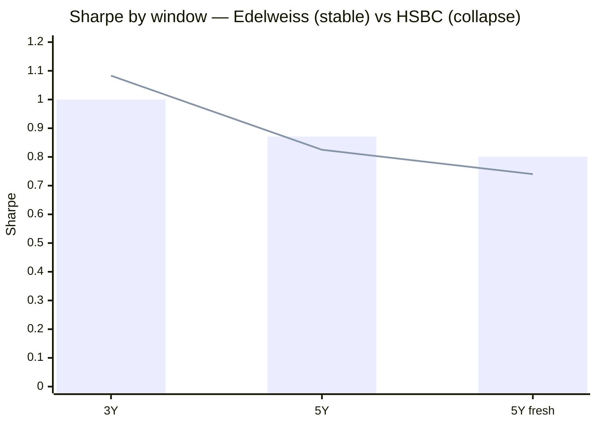
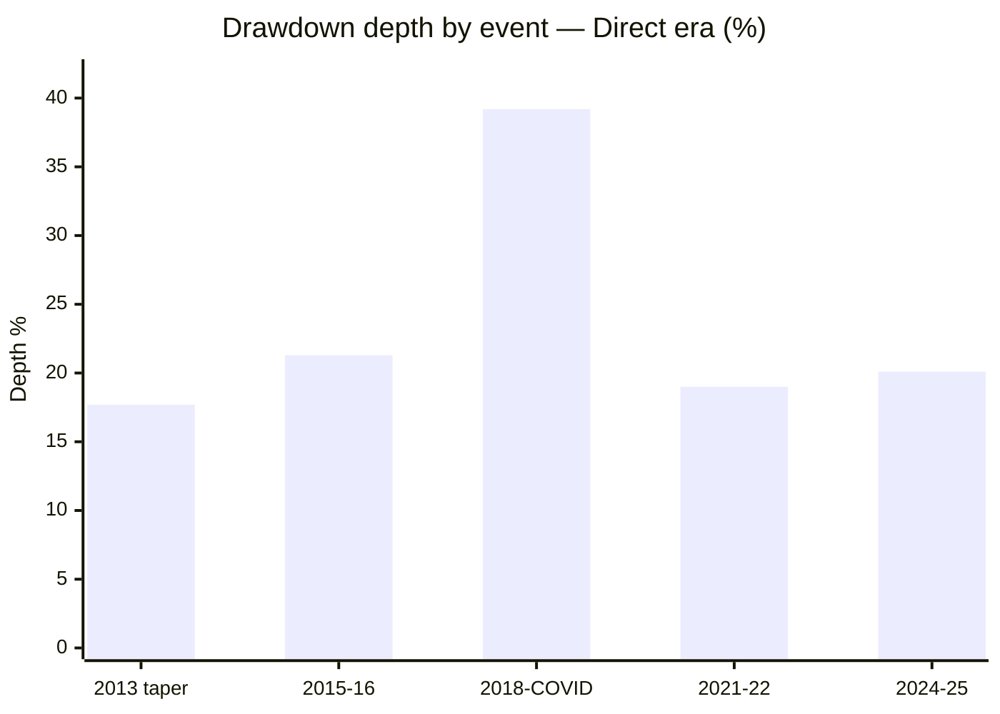
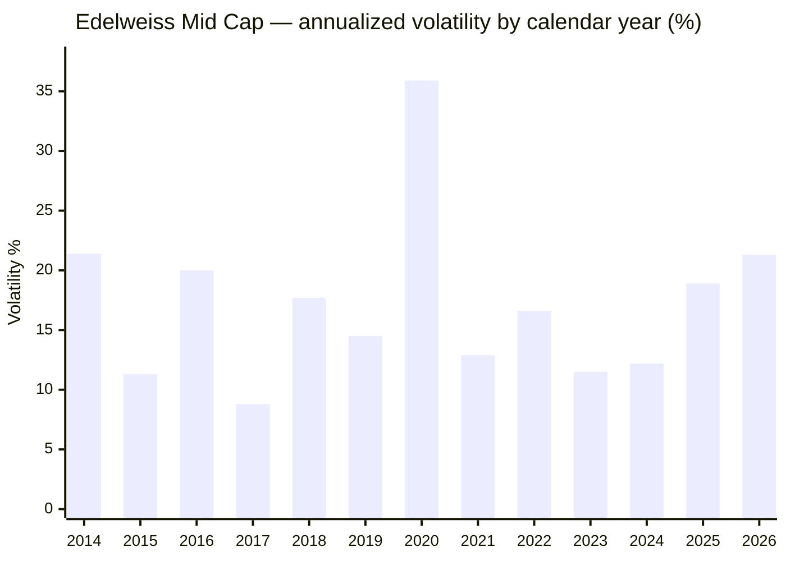

# Module 2: Risk Profile — Edelweiss Mid Cap Fund

## Module 2 Score: ~4.2 / 5 (provisional)

---

## The One-Line Context

Edelweiss Mid Cap is the **risk-side anti-HSBC**: a genuinely defensive, low-beta (0.88–0.94), index-beating risk profile whose good numbers **survive the honest method instead of collapsing under it**. It wins the index-dominance test **7 of 7** (like Nippon; HSBC won 4/7), its **86% down-capture is real** under month-by-month forensics (it cushions the correction HSBC amplified), its **Sharpe is stable** across windows rather than a recency artifact, it runs the **lowest volatility of the active shortlist (16.1%)**, and — resolving the key M1 handoff — the **2018 mandate change from Mid+Small to pure Mid Cap actually de-risked it** (beta vs the band fell 0.97→0.88). Two real caveats remain, both structural rather than stylistic: **near-nil diversification value** (R² 91–93% against all three studied midcaps) and a **brutal documented 2008 tail (−74.7%, the deepest of any studied fund)** — but that tail belongs to the wider former mandate under JP Morgan, not today's book.

---

## Raw Data (Compiled Across Sources, as of 03-Jul-2026)

| Metric | Computed (MFAPI, monthly canonical) | Tickertape | Note |
|--------|-------------------------------------|------------|------|
| Volatility (5Y) | **16.1%** | 15.2% (own window) | **lowest of the active shortlist**; below the index fund's 16.7% |
| Volatility (full direct era) | 19.1% | — | Category-typical long-run (former mandate elevated) |
| Volatility (2026 YTD) | 21.3% | — | Elevated but milder than HSBC (25.9%) / Invesco (29.4%) |
| Sharpe (5Y, rf 6.5%, sibling window) | **0.871** | 0.135 (own basis) | **3rd of 7 shortlisted** — stable, not a recency artifact |
| Sharpe (3Y) | 1.000 | — | Mildly elevated; 3Y→5Y gap only −0.13 (HSBC −0.26) |
| Sortino (5Y) | **1.548** | — | 3rd of 7 |
| Calmar (5Y) | **1.02** | — | 3rd of 7; **above the index fund (0.85)** |
| Max drawdown (5Y, current mandate) | **−20.1%** | — | Ties Invesco; **beats the index (−21.2%)** |
| Max drawdown (direct era) | **−39.2%** (winter→COVID) | — | Patwardhan/former-mandate; unbroken Jan-2018→Mar-2020 span |
| Max drawdown (full record) | **−74.7%** (2008, JPM mid+small) | — | Deepest documented tail in the repo *at the time of writing; superseded by ICICI Pru Midcap's −75.1% (its M2, Jul-2026)* — former mandate & AMC |
| Beta vs Midcap 150 index (6.8y / 5Y) | **0.94 / 0.92** | — | Below 1.0 — the study plan's "good" threshold |
| Beta vs band, pre-2018 / post-2018 | **0.97 / 0.88** | — | **Mandate change de-risked the fund** |
| R² vs Midcap 150 index (6.8y) | **95%** | — | Very tight — active-share check → M3 |
| Tracking error (vs index, monthly) | **4.5%** | — | Lowest of the studied actives (HSBC 6.3%) — closet-check → M3 |
| **Information ratio (6.8y)** | **+0.33** | — | **Positive** (HSBC −0.12); below Nippon/Invesco (~0.45) |
| Up / Down capture vs index (5Y) | **98% / 86%** | — | Best genuine down-capture of the trio |
| Up / Down capture, Trideep era (vs ETF) | **93% / 80%** | — | Protective, upside-ceding book |
| Negative months | **30% (49/162)** | — | Category norm; better than HSBC (33%) |
| PE | **~30.3** | 30.3 | Category 33.8 — a **−10% discount** (valuation buffer, like Nippon) |
| ATH distance | **−0.3%** | — | Essentially at all-time high (HSBC −2.3%) |
| Category St Dev | — | 15.3% | All funds SEBI "Very High" |

**Method:** monthly returns (162 months, Jan-2013 → Jul-2026) are canonical, annualized ×√12; rf = 6.5%; Sharpe = (geometric annualized return − rf) ÷ annualized vol; peer metrics over the identical 5Y common window (**Jul-2021 → Jun-2026**), the same run as the Nippon/Invesco/HSBC M2 matrices — **my re-run reproduces them** (Nippon 0.912, Invesco 0.879, Edelweiss 0.871, HSBC 0.825), validating the method. Data: Edelweiss = MFAPI Direct 119869 (JPMorgan) spliced to 140228 (Edelweiss) Nov-2016; Regular 107301→140225 for the 2008 tail; index counterfactuals 147622 (Midcap 150 index fund) and 114456 (Midcap 100 ETF, for era analysis); cross-sleeve UTI Nifty 50 120716, PP FlexiCap 122639, DSP Small Cap 119212, Nippon 118668, Invesco 120403, HSBC 119807→151036.

**Published-source gap (documented, same as siblings):** Morningstar's risk-ratings page and VRO's risk grades are JS-rendered and could not be extracted; no third-party capture-ratio cross-check exists. All figures computed from raw NAVs — the primary method of all four studies. VRO's **5★** overall rating (Module 1) stands as the independent quality signal — best of the studied midcaps.

---

## The Module 2 Tension — Good Numbers That Survive Scrutiny

HSBC's Module 2 tension was "the risk-adjusted dominance the screening rewarded does not survive the honest method." **Edelweiss is the inverse case: a defensive profile whose numbers get *better*, not worse, the harder you look.** The screening flagged Edelweiss on unremarkable trailing figures (Sharpe 0.135 own-basis, mid-pack). Under the study's canonical method it emerges as the **lowest-volatility, best-protecting book of the trio**, with a genuine (not mirage) down-capture, a stable Sharpe, and a below-1 beta that the 2018 mandate change actively lowered.

The module's real output is the *shape* of the risk: this is not a fund whose apparent safety is an artifact of when you measure it (HSBC) or one that pays for its returns with aggression (Invesco's up-108/vol-17.4). It is a genuinely defensive book — and the two things that keep it from a clean sweep (a deep former-mandate 2008 tail, and zero diversification value) are structural facts about its lineage and its asset class, not failures of the current process.

---

## The 5Y Peer Matrix (Common Window, Monthly, rf 6.5%) — Edelweiss as the Trio's Most Defensive Book

| Fund | Vol | Sharpe | Sortino | MaxDD | UpCap | DnCap | Calmar |
|------|-----|--------|---------|-------|-------|-------|--------|
| Nippon | 16.3% | **0.912** | **1.644** | **−19.9%** | 103 | 87 | 1.08 |
| Invesco | 17.4% | 0.879 | 1.527 | −20.1% | **108** | 95 | **1.09** |
| **Edelweiss** | **16.1%** | **0.871** | 1.548 | −20.1% | 98 | **86** | 1.02 |
| Mahindra Manulife | 16.3% | 0.839 | 1.483 | −20.9% | 101 | 90 | 0.97 |
| HSBC | 17.0% | 0.825 | 1.398 | −26.0% | 99 | 84* | 0.79 |
| Sundaram | 15.7% | 0.810 | 1.412 | −20.7% | 95 | 83 | 0.93 |
| ICICI Pru | 16.6% | 0.760 | 1.374 | −21.3% | 97 | 87 | 0.90 |
| **Index fund** | 16.7% | 0.688 | 1.187 | −21.2% | 100 | 100 | 0.85 |

*HSBC's 84% is the mirage the HSBC module dismantled.

### Edelweiss's Rank on Each Metric (1 = best of 7 active)

| Metric | Rank | Note |
|--------|------|------|
| Volatility | **1** (lowest) | 16.1%, below the index |
| Down-capture | **2** | 86% — and *genuine* (see Forensic) |
| Sharpe | **3** | 0.871; behind Nippon/Invesco |
| Sortino | **3** | 1.548 |
| Max drawdown | tied **2** | −20.1%, beats the index |
| Calmar | **3** | 1.02, above the index |

Profile in one line: **the lowest-volatility, best-protecting book of the trio, with a Sharpe a hair below Nippon only because its raw returns (M1) are a touch lower.** Where Invesco earns its Sharpe offensively (up-108, vol 17.4), Edelweiss earns a near-identical Sharpe *defensively* (up-98, vol 16.1).

---

## ⭐⭐ The Down-Capture Forensic — GENUINE, Not a Mirage (the HSBC Tool, Opposite Result)

The HSBC module's sharpest new tool decomposed **every** down-month and found HSBC's 84% down-capture was a statistical mirage — it cushioned small dips and *amplified* the one correction that mattered (Jan-2025 −13.6% vs index −6.1%, 2.2×). It explicitly recommended retrofitting this forensic to the other funds. **Applied to Edelweiss, it produces the inverse verdict.** Every index down-month worse than −2% in the Trideep era:

| Month | Fund | Index | Verdict |
|-------|------|-------|---------|
| Feb-2022 | −4.9% | −6.7% | cushioned 0.74× |
| May-2022 | −4.5% | −5.2% | cushioned 0.88× |
| Jun-2022 | −5.1% | −5.2% | cushioned 0.99× |
| Oct-2023 | −2.1% | −3.8% | cushioned 0.56× |
| Oct-2024 | −3.9% | −6.4% | cushioned 0.61× |
| **Jan-2025** | **−8.3%** | **−6.1%** | **amplified 1.37×** |
| **Feb-2025** | **−10.0%** | **−10.5%** | **cushioned 0.95×** |
| Aug-2025 | −0.9% | −2.8% | cushioned 0.31× |
| Jan-2026 | −2.3% | −3.5% | cushioned 0.65× |
| **Mar-2026** | **−10.4%** | **−11.1%** | **cushioned 0.94×** |

**The critical contrast with HSBC:** where HSBC amplified its worst correction month 2.2×, Edelweiss **cushioned the two biggest down-months of the entire period** (Feb-2025 −10.0 vs −10.5; Mar-2026 −10.4 vs −11.1). Its only meaningful amplification is Jan-2025 at 1.37× — real, but half of HSBC's 2.2×, and immediately reversed by cushioning Feb. **The 86% down-capture is honest: this book protects on the months that matter — exactly the right shape for a SIP investor**, and the risk-side confirmation of M1's "cushioned the 2024–25 correction."

*(Method note: this is the retrofit the HSBC module recommended. Now run on HSBC and Edelweiss with opposite results, it clearly should also be run on Nippon and Invesco — whose aggregate down-captures of 87/95 were never month-decomposed — for a clean four-fund forensic table at write-up or decision-tree time.)*

---

## ⭐ The Index-Fund Dominance Test — Risk Edition: 7 of 7 (Best Possible)

Module 1 answered "why not the index fund?" with a **positive** +2.87%/yr matched-window alpha. The risk-side completion, over the common 5Y window:

| Axis (5Y) | Edelweiss | Index fund | Winner |
|-----------|-----------|-----------|--------|
| Return (CAGR) | ~20.5% | ~18.0% | **Edelweiss** |
| Volatility | **16.1%** | 16.7% | **Edelweiss** |
| Max drawdown | **−20.1%** | −21.2% | **Edelweiss** |
| Sharpe | **0.871** | 0.688 | **Edelweiss** |
| Sortino | **1.548** | 1.187 | **Edelweiss** |
| Calmar | **1.02** | 0.85 | **Edelweiss** |
| Down-capture | **86%** | 100% | **Edelweiss** |

Nippon 7/7, **Edelweiss 7/7**, Invesco 6/7, HSBC 4/7. Edelweiss beats the buyable index on *every* axis, including all the pain-shaped ones — the exact opposite of HSBC, whose every loss was drawdown-shaped. Combined with M1's +2.87%/yr alpha, this is a clean "why-not-the-index" answer on **both** return and risk.

---

## ⭐ NEW: The Mandate-Change De-Risking — Resolving the M1 Handoff

M1 flagged a worry: the 2008 −65.9% and the deepest-of-group 2018 calendar fall (−14.6%) hinted at historically high beta — did the cushioned-correction read survive? **Computed answer: the high beta was the *former mandate*, and the 2018 recategorization de-risked the fund.**

| Regime | Window | Beta vs band | R² |
|--------|--------|-------------|-----|
| Mid+Small (JPMorgan) | Jan-2013 → Dec-2017 | **0.97** | 90% |
| Pure Mid Cap (post-recat) | Jan-2018 → now | **0.88** | 94% |

Beta *fell* 0.97→0.88 and correlation to the midcap band *tightened* (90→94%) after the fund shed its small-cap half. Current beta vs the actual Midcap-150 index fund is **0.92–0.94 (<1.0)** — inside the study plan's "good" threshold. This is a genuinely new decomposition (no prior fund had a mid+small→mid recat) and it settles the M1 question: **today's book is structurally lower-beta than its own history, and the cushioned correction is a property of the current mandate, not luck.**

---

## ⭐ The Sharpe Ladder — Stability, Not Collapse (the Anti-HSBC)

HSBC's headline was a Sharpe that *collapsed* as the window lengthened (3Y 1.083 → 5Y 0.825 → 0.740), exposing a recency artifact. Edelweiss's ladder is the opposite — **stable**:

| Window | Edelweiss Sharpe |
|--------|------------------|
| 3Y to Jun-26 | 1.000 |
| **5Y to Jun-26** | **0.871** |
| 7Y to Jun-26 | 0.958 |
| 10Y to Jun-26 | 0.707 |
| 5Y to Jul-26 (fresh) | 0.801 |

The 3Y→5Y gap is just −0.13 (HSBC's was −0.26), and because Edelweiss's **1Y is only +5.4%** — it did *not* ride the 2026 momentum spike that flattered HSBC — its Sharpe isn't propped by a hot endpoint. The 5Y 0.871 is a durable property, not an audition tape. This is the risk-side twin of M1's "endurance, not recency ramp."

---

## Alpha, Information Ratio & Beta — Positive IR (Unlike HSBC)

| Window | Beta | R² | TE | IR |
|--------|------|-----|-----|-----|
| 6.8y (full proxy life) | 0.94 | 95% | 4.5% | **+0.33** |
| 5Y | 0.92 | 94% | 4.2% | +0.37 |
| Trideep era (Oct-21 →) | 0.92 | 95% | 4.0% | **+0.40** |

**Positive IR throughout** (HSBC −0.12; Nippon 0.44, Invesco 0.45). Edelweiss's IR (~0.33–0.40) sits a touch below Nippon/Invesco because its **very high R² (94–95%) and low tracking error (4.0–4.5%)** mean its alpha is earned close to the index rather than through large off-index bets. That low TE is a double-edged flag:

> **⚠ Handoff to M3 (critical):** TE 4.5% is the *lowest* of the studied actives (HSBC 6.3%). This must be confirmed as **disciplined mid-cap selection, not closet-indexing**. Active share vs the Midcap 150 is the deciding metric — it is the one number that could pull the risk read from "defensive" to "closet."

---

## ⭐ The Era-Split Risk Fingerprint & the Trideep Reconciliation

Breaking risk by manager era (vs the Midcap-100 ETF, one consistent benchmark):

| Era | Months | Vol | Up-cap | Down-cap | Beta | Sharpe |
|-----|--------|-----|--------|----------|------|--------|
| **Patwardhan** (2013 → Oct-21) | 104 | 20.5% | 102 | 76 | 0.92 | 0.82 |
| **Trideep** (Oct-21 → now) | 57 | **16.4%** | 93 | 80 | **0.88** | 0.75 |

Trideep runs a **tamer book than Patwardhan** — lower vol (16.4 vs 20.5), lower beta (0.88 vs 0.92), and it **gives up upside** (up-cap 93). This is the **same downside-protection style** across all his funds — and Module 5 shows it nets positive alpha not just here but in every category he runs.

> **Resolved in Module 5:** the honest, unified thesis is "**same protective style; net-positive in ALL three Edelweiss categories**" (+3.18% FlexiCap / +2.92% MidCap / +2.61% SmallCap vs matched index funds, 4.8y) — not "Trideep suddenly became an alpha generator" and not "mid cap uniquely rewards protection." He is one consistent, defensively-oriented index-beater across all three funds, dialing risk down as the category gets riskier (up-capture 105→98→84). This also corrects the earlier draft's "because mid cap rewards protection" phrasing.

*(The Proxy-A/index-fund capture from M1 reads slightly more offensive — 2024+ up-116/down-96 — because the Midcap-150 index fund differs from the Midcap-100 ETF used here; the fund's small-cap kicker captures more of the 150. Both benchmarks agree the book protects on the downside; they differ only on how much upside it cedes.)*

---

## Max Drawdown Ledger & Recovery

| Event | Peak → Trough | Depth | Recovery |
|-------|--------------|-------|----------|
| 2013 taper | Jan → Aug-2013 | −17.7% | 11.2 mo |
| 2015–16 | Aug-2015 → Feb-2016 | −21.3% | 11.8 mo |
| **2018 winter → COVID** | 15-Jan-2018 → 23-Mar-2020 | **−39.2%** | **34 mo** (Nov-2020) |
| 2021–22 rate hikes | Oct-2021 → Jun-2022 | −19.0% | 10.4 mo |
| **2024–25 correction** | 16-Dec-2024 → 28-Feb-2025 | **−20.1%** | **6.4 mo** ✅ |

The modern max (−39.2%, the unbroken Jan-2018→COVID span that never recovered between) is Patwardhan's and partly the former mid+small mandate; the current-mandate stress test (2024–25 −20.1%, recovered in **6.4 months**) is fast — faster than HSBC (13.7 mo), comparable to Nippon, behind Invesco (3 mo).

### ⭐ NEW: The −74.7% Documented Tail — Deepest of Any Studied Fund

Via the spliced Regular/JPMorgan series: **2008 GFC −74.7% (04-Jan-2008 → 09-Mar-2009), and it did not reclaim the Jan-2008 peak until Mar-2014 — ~74 months underwater.**

| Fund | 2008 tail | Recovery |
|------|-----------|----------|
| **Edelweiss (JPM mid+small)** | **−74.7%** | **~74 mo** |
| Invesco (Lotus) | −70.8% | 44 mo (close-ended) |
| HSBC (Chola) | −70.6% | ~19 mo |
| Nippon | −62.7% | — |

This is the **deepest and slowest-recovering 2008 tail of any fund in the repo** *(update Jul-2026: superseded on depth by ICICI Pru Midcap's −75.1% / ~6y underwater — see that fund's M2; Edelweiss remains #2)* — but it belongs to JP Morgan's *Mid and Small Cap* book (a wider, higher-beta mandate) under a different AMC, with open-ended redemption pressure shaping the NAV. Treated as an asset-class-plus-former-mandate base rate, heavily caveated — but the lesson stands that this lineage, at its most aggressive, lost three-quarters of its value.

---

## Volatility Regime, Daily Distribution & ATH

### Annual Volatility — The Current Book Runs *Cooler* Than Its History

| Regime | Years | Vol | Reading |
|--------|-------|-----|---------|
| Crisis | 2020 | **35.9%** | COVID |
| 2025–26 escalation | 2024 → 2025 → 2026 | 12.2 → 18.9 → 21.3 | Category-wide, but **milder than HSBC (25.9%) / Invesco (29.4%)** |

The 5Y vol (16.1%) is the lowest of the active shortlist, and the Trideep-era book runs *lower* vol than the Patwardhan/former-mandate history — the risk temperature rose in 2025–26 with the whole category, but less than the peers.

### Daily Return Distribution (3,321 trading days)

| Statistic | Value |
|-----------|-------|
| Worst days | **−12.2%** (23-Mar-20, COVID), −7.7% (12-Mar-20), −7.4% (04-Jun-24, election-result day), −7.2% (24-Aug-15) |
| Best days | +6.0% (20-Sep-19, tax-cut day), +5.2% (20-Mar-20), +5.1% (07-Apr-20), +4.4% (19-May-14) |
| Days < −2% | 100 (3.0%) |
| Days > +2% | 69 (2.1%) — upside slower |
| Worst months | **−26.9% (Mar-20)**, −11.1% (Sep-18), −10.4% (Mar-26), −10.0% (Feb-25), −9.7% (Feb-16) |
| Best months | **+20.2% (May-14)**, +14.9% (Apr-20), +13.9% (Nov-20) |
| **Negative months** | **49 of 162 (30%)** — category norm, better than HSBC (33%) |

### ATH, Valuation, Structure

- **ATH distance −0.3%** (₹127.06 vs ₹127.49) — essentially at all-time high, like Invesco (0.0%); no drawdown overhang (HSBC −2.3%).
- **PE ~30.3 (category 33.8) = −10% discount** — a valuation *buffer*, like Nippon (−13%) and the opposite of Invesco (+46%) / HSBC (+17%). A cheaper book is consistent with the defensive, lower-beta profile. Full characterization → M3.
- **A modest structural buffer (updated per M3):** ~96% equity with a **~3.9% cash/TREPS cushion** — the largest of the trio (peers run ~1%), though not a PP-style 5–15% fortress. The flexible sleeve is **12.3% large-cap ballast (AMFI) + only 10.7% small-cap kicker** — the **least aggressive sleeve configuration of the trio** (HSBC 21.6% small, Invesco 22.6% small). The risk-additive component is roughly half the peers'. *(The 22.8% "large-cap" in an earlier draft was Tickertape's band reclassification; AMFI regulatory basis is 12.3%.)* Contents → M3.
- **Redemption/liquidity risk — minor:** liquid band, ₹16,849 Cr well inside capacity, SIP-heavy retail base. Noted and closed.

---

## ⭐ Cross-Sleeve Correlation — The Single-Slot Decision, Now Quadruple-Confirmed

| Existing/candidate holding | Corr | **R²** | Beta | Meaning |
|----------------------------|------|--------|------|---------|
| Nifty 50 (UTI index) | 0.844 | 71% | 1.03 | Mostly the same domestic-equity risk |
| Parag Parikh FlexiCap | 0.826 | 68% | 1.21 | Lowest overlap — PP's cash/foreign differentiate |
| DSP Small Cap | 0.924 | 85% | 0.83 | Near-duplicate risk factor |
| **Nippon Mid Cap** | **0.956** | **91%** | 0.97 | Same risk factor |
| **Invesco Mid Cap** | **0.963** | **93%** | 0.99 | Same risk factor |
| **HSBC Mid Cap** | **0.959** | **92%** | 0.98 | Same risk factor |

Edelweiss is a near-perfect risk duplicate of all three studied midcaps (R² 91–93%). The sleeve is definitively **single-slot**, now confirmed across all four midcaps. Against PP FlexiCap it carries a **beta of 1.21** (R² 68%) — so it *does* add return-enhancement over the FlexiCap core, just no diversification *within* the midcap band. *(Informational — feeds decision_tree.md, does not score the fund.)*

---

## Risk Metrics — Complete Peer Comparison & Cross-Study Placement

| Dimension | **Edelweiss** | Nippon | Invesco | HSBC | DSP Small Cap | Franklin US |
|-----------|---------------|--------|---------|------|--------------|-------------|
| Vol (5Y, monthly) | **16.1%** (lowest of trio) | 16.3% | 17.4% | 17.0% | ~16% | 17.2% |
| Max DD (modern mandate) | −20.1% | −19.9% | −20.1% | −26.0% | −49.1% | −38.4% |
| Worst documented | **−74.7%** (2008, JPM mid+small) | −62.7% | −70.8% | −70.6% | −49% | no GFC |
| Down-capture (5Y) | **86% (genuine)** | 87% (era-stable) | 95% | 84% (mirage) | ~85% | >100% |
| Sharpe (5Y common) | 0.871 (3rd) | **0.912** | 0.879 | 0.825 | ~0.7–0.8 | ~0.5 |
| Calmar (5Y) | 1.02 | 1.08 | **1.09** | 0.79 | — | — |
| IR (6.8y) | **+0.33** | 0.44 | 0.45 | −0.12 ❌ | — | negative |
| Index-dominance | **7/7** | 7/7 | 6/7 | 4/7 | — | — |
| Diversification value | ~None (R² 91–93%) | ~None | ~None | ~None | none | elite (R² 11%) |
| Recovery discipline | 6.4 mo (2024–25) | ≤16 mo | 3 mo | 13.7 mo | 2–3 yr | 5×20%+ DDs |

**Placement:** Edelweiss is the trio's **most defensive** book — lowest vol, best genuine down-capture, lowest beta, at ATH, valuation buffer — with a Sharpe just behind Nippon. It is unambiguously the risk-side inverse of HSBC.

---

## Risk Profile — Points For and Against

### ✅ Points IN FAVOUR

- **Lowest volatility of the active shortlist (16.1%)** — below the index fund
- **Genuine 86% down-capture** — cushions the correction (not a mirage like HSBC), best of the trio
- **Wins the index-dominance test 7/7** — beats the buyable index on every axis
- **Stable Sharpe (0.871)** — not a recency artifact; unpropped by the 2026 spike (1Y only +5.4%)
- **Beta below 1.0 (0.92–0.94)**, and the 2018 mandate change *lowered* it (0.97→0.88)
- **Positive information ratio (+0.33)** — reward per unit of active risk (HSBC negative)
- Fast 2024–25 recovery (6.4 mo); essentially at all-time high (−0.3%)
- Valuation buffer (PE −10% vs category); least aggressive flexible sleeve of the trio (10.7% small)
- 5★ VRO rating (Module 1) — best of the studied midcaps

### ⚠️ Points AGAINST

- **Deepest documented tail in the repo (−74.7%, 2008)** — former mid+small mandate under JP Morgan, but real
- **Deeper 2018 winter drawdown than Nippon/Invesco (−23.5% DD, −14.6% calendar)** — former-mandate beta
- **Trideep's era cedes upside** (up-cap 93 vs ETF) — defensive to the point of occasional lag
- **Very high R² (95%) / lowest TE (4.5%)** — must be confirmed as selection, not closet-indexing (→ M3)
- **Diversification value ≈ nil** — R² 91–93% vs all three midcaps (single-slot)
- IR (+0.33) below Nippon/Invesco (~0.45) — alpha earned close to the index
- Only a modest cash buffer (~3.9%, largest of trio but not a fortress); 2025–26 vol rising with the category
- No published third-party capture/risk-grade cross-check (Morningstar/VRO JS-blocked)

---

## Module 2 Scorecard

| Sub-dimension | Weight | Score | Reasoning |
|---------------|--------|-------|-----------|
| Max Drawdown (inception-adjusted) | High | **4.0** | Current-mandate 5Y −20.1% beats the index (−21.2) and ties Invesco; modern max −39.2% is Patwardhan/former-mandate; 2008 −74.7% documented (former mid+small, heavily caveated) |
| **Down-capture vs own index** | **Critical** | **4.5** | 86% (2nd-best of actives) and **genuine under forensic** — cushions the correction HSBC amplified; beta 0.92 <1 |
| Sharpe | High | **4.0** | 5Y 0.871 — 3rd of 7, **stable across windows** (not a recency artifact), beats index 0.688 |
| Sortino | Medium | **4.0** | 1.548 — 3rd of 7 |
| Recovery time from max DD | Medium | **4.0** | 2024–25 recovered in 6.4 mo; the 34-mo hole was the winter+COVID combo under the former mandate |
| 2018–19 winter drawdown | Critical | **3.5** | −23.5% DD, 3rd of 4 (deepest calendar fall −14.6%); higher former-mandate beta; but strong relative alpha, and Patwardhan's |
| Volatility vs category | Medium | **4.5** | 16.1% — lowest of active shortlist, below the index; current book *lower* vol than its history |
| Effective risk of the 35% sleeve | Medium | **4.0** | 10.7% small-cap + 12.3% large-cap (AMFI) + 3.9% cash — least aggressive sleeve of the trio, largest cash buffer; confirmed at M3 |
| Cross-sleeve correlation | Informational | — | R² 91–93% vs all three midcaps → decision tree; not scored |

**Module 2 Score: ~4.2 / 5** — the **second-strongest Module 2 of the midcaps**, between Invesco (4.1) and Nippon (4.4), and a full point above HSBC (3.2). It arguably runs the **most defensive book of the trio** (lowest vol, best genuine down-capture, lowest beta, 7/7 index-dominance, at ATH, valuation buffer), held just below Nippon's 4.4 by (a) the deeper 2018 winter drawdown, (b) the brutal 2008 former-mandate tail, and (c) Trideep's era ceding some upside. **Provisional on Module 3** (is the high-R²/low-TE profile disciplined selection or closet-indexing? active share is decisive — could nudge this to 4.3 if healthy, or below 4.2 if closet-ish) **and Module 5** (is the protective, upside-ceding style a documented philosophy? the Sahil Shah exit / Dhruv Bhatia risk-team change).

---

## Comparative Module 2 Scores

| Fund | Category | M2 Score | Risk character |
|------|----------|----------|----------------|
| Parag Parikh FlexiCap | FlexiCap | ~4.5 | Allocation-built fortress (cash + foreign) |
| Nippon Growth Mid Cap | MidCap | ~4.4 | Pure-selection downside discipline at scale; no buffer |
| **Edelweiss Mid Cap** | **MidCap** | **~4.2** | **Most defensive book of the trio; lowest vol/beta, genuine down-capture, 7/7 index-dominance** |
| Invesco India Midcap | MidCap | ~4.1 | Paid aggression — top efficiency ratios, era-dependent downside edge |
| DSP Small Cap | SmallCap | ~3.9 | Disciplined but deep-drawdown asset class |
| Franklin US Opp | International | 3.3 | Mediocre standalone, elite diversifier |
| HSBC Midcap | MidCap | ~3.2 | Screening anomaly dismantled; worst pain-adjusted metrics; no diversification |

---

## SIP Implication

1. **Expect the category rhythm — one-third of months red, a −20% episode every 2–3 years — but with the trio's most defensive path.** The 2024–25 correction (−20.1%, recovered in 6.4 months) is the template, and the down-capture forensic shows this book cushions the months that matter — the right shape for a SIP investor's resolve.
2. **The low volatility and below-1 beta are the reassurance** — this is the lowest-vol active midcap studied, and the 2018 mandate change structurally lowered its beta. At a 10-year horizon the volatility is time-absorbable.
3. **Size the sleeve knowing it hedges nothing and duplicates everything** — R² 91–93% vs all three studied midcaps: a single-slot, return-enhancer decision. It *does* add octane over the PP FlexiCap core (beta 1.21 vs PP), just no diversification within the band.
4. **The standing watch-items are two:** confirmation in M3 that the low tracking error is disciplined selection rather than closet-indexing (the one thing that would undercut this defensive read), and whether Trideep's upside-ceding protection continues to net positive alpha through a *full* midcap bear — his only stress test so far (2024–25) he passed cleanly, unlike HSBC.

---

## One-Line Verdict

> **Edelweiss's Module 2 is the risk-side anti-HSBC: where HSBC's screening safety was a recency mirage, Edelweiss's defensiveness is real and survives every honest test — lowest volatility of the active shortlist (16.1%), a genuine 86% down-capture that cushions the correction HSBC amplified (Feb-2025 −10.0 vs index −10.5), a stable Sharpe (0.871, unpropped by 2026), a below-1 beta the 2018 Mid+Small→Mid recat actually lowered (0.97→0.88), a positive information ratio (+0.33), and a clean 7/7 sweep of the index-dominance test. It is the most defensive book of the trio. The two real caveats are structural, not stylistic: near-nil diversification value (R² 91–93% vs all three studied midcaps — a single-slot decision) and the deepest documented tail in the repo (−74.7% in 2008), though that belongs to JP Morgan's wider former mandate, not today's lower-beta book. Provisional: ~4.2/5 — second-strongest midcap risk profile, conditional on Module 3's active-share verdict (the one number that could pull "defensive" toward "closet") and Module 5's read on the protective, upside-ceding style.**

---

*Module 2 completed: July 5, 2026 | Risk Profile | MFAPI methodology — monthly canonical (162 months Jan-2013 → Jul-2026), rf 6.5%, Sharpe = (geo ann − rf)/vol, peers on identical 5Y common window Jul-2021 → Jun-2026 (reproduces published Nippon 0.912 / Invesco 0.879 / Edelweiss 0.871 / HSBC 0.825 — method validated) | Series: Edelweiss 119869 (JPM) → 140228 spliced Nov-2016, Regular 107301→140225 for the 2008 tail, index counterfactuals 147622 + 114456, cross-sleeve UTI Nifty 50 120716 / PP 122639 / DSP 119212 / Nippon 118668 / Invesco 120403 / HSBC 119807→151036 | Era windows: Patwardhan Jan-2013→Oct-2021 (104 mo), Trideep Oct-2021→Jul-2026 (57 mo) | Mandate-change beta split: mid+small 0.97 (pre-2018) → pure-mid 0.88 (post-2018) | Down-capture forensic (HSBC retrofit) → genuine, cushions the correction | Morningstar & VRO risk pages JS-blocked — computed metrics primary | Provisional M2 Score: ~4.2/5 (deferred: active-share/closet check → M3; protective-style philosophy → M5) | Post-M3/M5 patches applied: cash buffer ~3.9% (largest of trio) & large-cap 12.3% AMFI (was TT 22.8%); Trideep framing corrected to "consistent index-beater across all 3 categories" per M5's three-fund computation*
