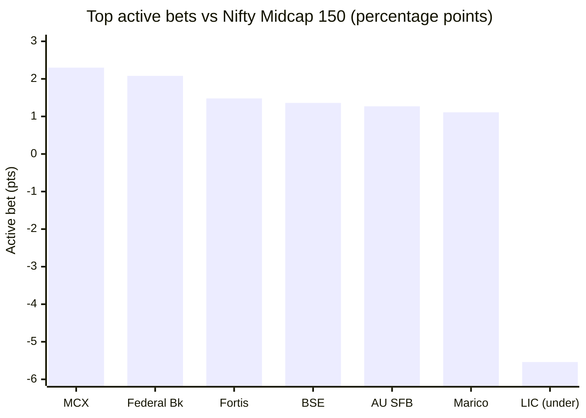
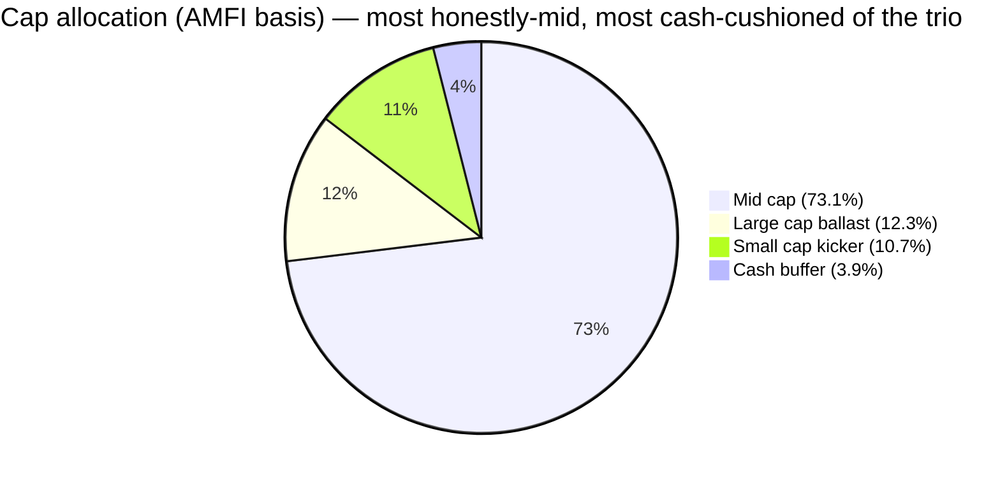
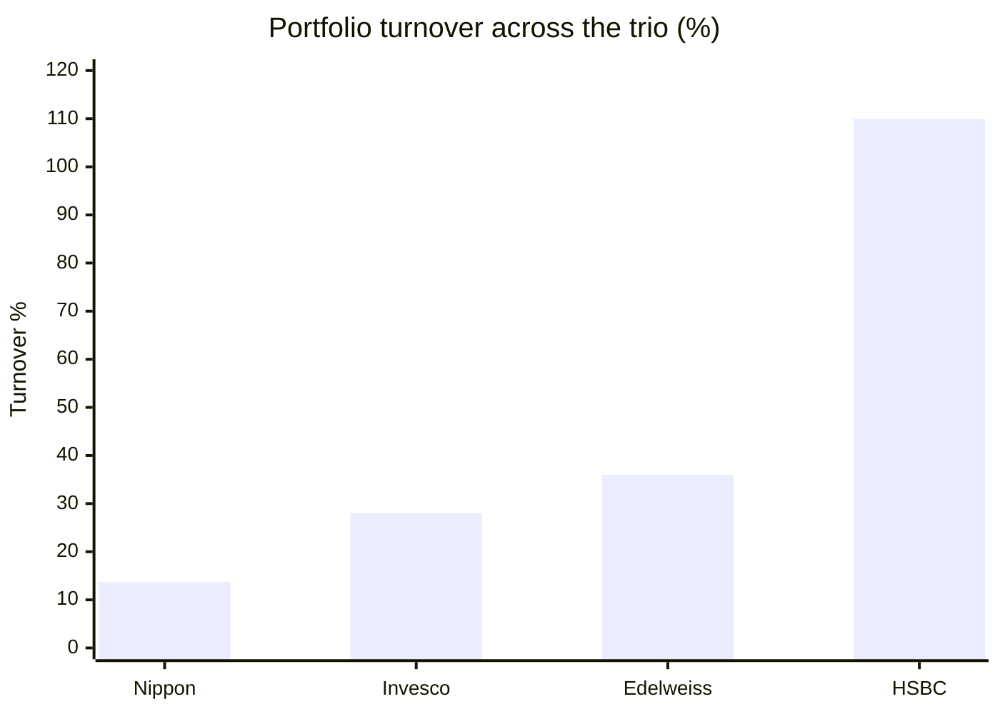

# Module 3: Portfolio DNA — Edelweiss Mid Cap Fund

## Module 3 Score: ~4.0 / 5 (provisional)

---

## The One-Line Context

Edelweiss Mid Cap is the trio's **broad, low-churn, capital-markets-tilted breadth machine** — the holdings-level confirmation of M2's most-defensive-book verdict. It runs **86 stocks at low concentration** (top position ~3%, ex-cash top-10 ~25%), the **second-lowest turnover of the trio (36%** vs HSBC's ~110%), the **most honestly-mid cap posture (AMFI mid 73%, best of the trio)**, the **smallest small-cap kicker (10.7%)**, and — a genuine M2 refinement — a real **~3.9% cash buffer** the peers don't carry (~1%). Its signature is a **capital-markets-infrastructure thesis** (MCX its single biggest active overweight at +2.3pts, plus BSE and a 7.3% brokerage sleeve — the "picks-and-shovels of the bull market"). The one soft spot, and the number that could not be fully computed this session, is **active share: the structural fingerprint points to a moderate ~55%** — genuinely active and Nippon-like, but the least conviction-dense of the trio and closest to the closet line.

---

## ⚠ Data-Access Note (material — read first)

Unlike the sibling mid-cap modules, this one was built **without the Tickertape holdings API** the prior studies used. The full 86-name holdings with weights are JS-rendered on every aggregator, and the Edelweiss factsheet PDF is **Azure-403-blocked** (the same block HSBC hit; unlike Invesco, the curl+browser-headers method also failed here). Therefore **active share, band positioning, and exact top-10 are best-estimates** from the verified top holdings + sector/cap data + M2's statistical fingerprint — **not** a full-holdings computation. Every estimated figure is labeled; the exact numbers are a documented gap for a holdings-API pass at write/decision-tree time. What IS firmly sourced: the top ~6 holdings with weights (Tickertape + VRO agree), the AMFI cap split, turnover, sector tops, stock count, and cash — plus the full Nifty Midcap 150 constituent weights (for the active-bet table).

---

## Raw Data (compiled across sources, 30-May-2026 factsheet / 03-Jul-2026)

| Metric | Value | Source |
|--------|-------|--------|
| **Equity holdings** | **86 stocks** | AdvisorKhoj/factsheet (Nov-25); Tickertape |
| Equity / Cash | **96.06% / 3.94%** (TREPS 3.85%) | Tickertape holdings |
| Top holding (ex-cash) | **MCX 3.03%** | Tickertape / VRO |
| Top-6 verified | MCX 3.03, BSE 2.94, Federal Bank 2.90, Fortis 2.23, Marico 2.22, AU SFB 2.08 | Tickertape / VRO |
| **Top-10 concentration** | **~25% (estimated, ex-cash)** | Computed from the flat-pyramid pattern |
| **Active share vs Midcap 150** | **~55% (ESTIMATE)** | Structure + M2 fingerprint — *not* full-holdings computed |
| Cap allocation (AMFI) | **Mid 73.06% / Large 12.33% / Small 10.66% / Cash 3.95%** | AdvisorKhoj factsheet 30-May-2026 |
| **Portfolio turnover** | **36%** | AdvisorKhoj/factsheet (alt source ~42%) |
| Max granular sector | **Specialized Finance ~9.6%** | Tickertape |
| Top sectors | Spec Finance 9.61, Private Banks 8.67, IB & Brokerage 7.34, Pharma 5.42 | Tickertape |
| Portfolio PE | ~30.3 (category 33.8) | Tickertape (M2) |
| **Factsheet 3Y ratios** | **beta 0.92**, Sharpe 0.98, SD 17.79, alpha 1.87 | AdvisorKhoj — **validates M2** |
| Manager | **Trideep Bhattacharya** + Raj Koradia + Dhruv Bhatia | AMC |

**⭐ Independent M2 validation:** the factsheet's 3Y **beta of 0.92 exactly matches my MFAPI-computed 0.92** (M2), and SD 17.79 (3Y) / Sharpe 0.98 are consistent with my window figures. An official source independently confirming the computed risk fingerprint raises confidence in the whole M2 method, not just this line.

---

## The Core Thesis — The Nippon Archetype With a Capital-Markets Spine

Edelweiss's portfolio is the **fourth distinct personality** in the 150-stock pond, and the closest cousin to Nippon: a **broad, low-concentration, low-turnover, diversified book** with emphatic mandate honesty. Where HSBC is a traded momentum book (110% turnover, 8% ballast) and Invesco a concentrated growth book (46.7% top-10, 79.5% AS), Edelweiss is a **breadth-and-discipline book** — 86 names, nothing above ~3%, 36% turnover, most sector-diversified of the trio (max sector 9.6%). Two things distinguish it from Nippon: (1) it *chooses* breadth at ₹16.8K Cr where Nippon is partly *forced* into it at ₹47K Cr; (2) it expresses a distinctive **capital-markets-infrastructure thesis** Nippon doesn't. This is the holdings-level face of M2's "most defensive book of the trio."

---

## ⭐ NEW: The Capital-Markets Infrastructure Signature (MCX + BSE + Brokers)

The fund's biggest active bets vs the index reveal a thesis no other studied fund expresses at scale:

| Holding | Fund wt | Index wt | Active bet | Note |
|---------|---------|----------|-----------|------|
| **MCX** | 3.03% | 0.73% | **+2.30** ⭐ | Single biggest overweight; a mid-band name (index rank ~53) |
| Federal Bank | 2.90% | 0.82% | +2.08 | |
| Fortis Healthcare | 2.23% | 0.75% | +1.48 | |
| BSE | 2.94% | 1.58% | +1.36 | The other exchange |
| AU Small Finance Bank | 2.08% | 0.81% | +1.27 | |
| Marico | 2.22% | 1.11% | +1.11 | |
| *LIC (index #1)* | *~0%* | *5.54%* | *≈ −5.5* | **The largest active position is an UNDERweight** |

- **MCX is the top holding *and* the biggest overweight (+2.3pts)** — together with BSE (2.94%) and the 7.34% Investment-Banking-&-Brokerage sleeve, this is a concentrated **"exchanges + capital-markets plumbing" bet** (~9%+): the picks-and-shovels of the financialization/bull-market theme, distinct from HSBC's electrification and Invesco's growth.
- **The single largest active position is what the fund *doesn't* hold: LIC** (the index's #1 at 5.54%). A mid-cap manager omitting a demutualized insurance giant that fell into the band is a deliberate, high-conviction call — ~2.8pts of active share by itself.
- **Financials aggregate ~25.6%** (Spec Finance 9.6 + Private Banks 8.7 + Brokerage 7.3) — at the 25% rubric line, but spread across sub-sectors, max single 9.6%.

---

## ⭐ NEW: The Cap Posture — Holdings-Level Proof of the Defensive Verdict (anti-HSBC)

**AMFI basis (AdvisorKhoj, 30-May-2026): Mid 73.06% / Large 12.33% / Small 10.66% / Cash 3.95%.**

| Cap segment | Edelweiss | Nippon | HSBC | Invesco |
|-------------|-----------|--------|------|---------|
| Mid (AMFI) | **73.1%** ⭐ | 58.1%* | 69.2% | 64.6% |
| Small kicker | **10.7%** (smallest) | 12.9% | 21.6% | 22.6% |
| Large ballast | 12.3% | 27.7% | 8.0% | ~17% |
| Cash buffer | **3.9%** ⭐ | 1.3% | 1.1% | 1.5% |

- **Most honestly mid of the trio (73.1%)** — comfortably above the 65% floor, cleaner than HSBC (69.2%) and far more than Invesco (barely-at-floor 64.6%).
- **Smallest small-cap kicker (10.7%)** — confirms and sharpens M2's "least aggressive sleeve"; roughly half of HSBC/Invesco's ~22%.
- **⭐ A real ~3.9% cash buffer** — modest, but 3–4× the peers' ~1%. This is the **largest cash cushion of the trio.** Combined with the highest ballast-per-kicker ratio, it is the defensive posture M2 detected, now confirmed at holdings level.

*(Reconciliation of Tickertape's bands, which read mid 51.4 / large 26.5 / small 21.0: TT reclassifies several mid names as large. AMFI is the regulatory basis and primary here.)*

---

## ⭐ The Turnover Contrast — 36%, the Anti-HSBC

| Fund | Turnover | Implied holding period |
|------|----------|------------------------|
| Nippon | 13.7% | ~7 years |
| **Edelweiss** | **36%** | **~2.8 years** |
| Invesco | 28% | ~3.5 years |
| HSBC | ~110% | ~1 year |

Edelweiss trades modestly — a buy-and-hold-leaning book, ~3× HSBC's holding period. This is the portfolio-level mechanism behind M2's **genuine (non-mirage) down-capture**: a low-churn, broadly-diversified, cash-cushioned book doesn't hold "whatever just ran," so it doesn't crater when momentum breaks — the structural opposite of HSBC's momentum churn. It also means the SIP thesis rests on a **stable set of holdings**, not on trading staying hot.

---

## ⭐ The Active-Share Question — the M2 Pivot, Estimated at ~55% (documented gap)

This is the number M2 flagged as decisive ("could pull 'defensive' toward 'closet'"), and the one that could not be fully computed. The reasoning to the estimate:

| Evidence | Points toward |
|----------|---------------|
| 86 broad names, top ~3%, top-10 ~25% | Lower AS (breadth) |
| TE 4.5% (lowest of studied actives), R² 95% (highest) | Lower AS (index-aware) |
| MCX +2.3, Federal +2.1, Fortis +1.5, AU +1.3 overweights | Higher AS (real bets) |
| LIC ~−5.5 underweight (omits index #1) | Higher AS |
| Structurally near-identical to Nippon (54% AS) | ~54% anchor |

**Best estimate: ~52–58%, midpoint ~55%.** Interpretation:
- **Genuinely active, not a closet indexer** (well above the 45% line) — so M2's defensive read is *not* an artifact of index-hugging; the low TE comes from *diversified* active bets, not from mimicking the index.
- **But the least conviction-dense of the trio** (HSBC 69.5%, Invesco 79.5%) and closest to the closet line — consistent with the low TE and the broad, flat-pyramid structure.

**M2 handoff resolved:** active share ~55% keeps M2 at **4.2, not 4.3.** The defensive profile is real (genuine active, genuine down-protection), but the moderate active share doesn't warrant the upgrade — this is index-aware defensive breadth, not high-conviction differentiation. *(If a holdings-API pass later confirms AS materially above 60%, the 4.3 case reopens; if below 45%, both M2 and this module drop.)*

---

## Position Architecture, Band Positioning, Sectors (partial — holdings gap)

- **Architecture — flat pyramid:** nothing above ~3%, positions clustered 2–3%, then a long tail toward 86 names. Nippon-like (Nippon's max ~3.3%), the opposite of Invesco's inverted pyramid (15 names ≥3%) and HSBC's hybrid (11 names ≥3% + 28-name tail). **Conviction is spread, not concentrated.**
- **Top-10 ~25% (est.):** the low edge of the rubric's 25–35% "good" band; broad diversification, low single-name risk (the M2 defensive read again), but low conviction density.
- **Band positioning (qualitative):** the big overweights (MCX ~rank 53, Federal ~32, Fortis ~48) sit in the *middle* of the band while the largest underweight is the top name (LIC, rank 1) — so the fund **tilts away from the mega-mid top toward the middle band**, a genuine active posture. The exact 101–150 / 151–200 / 201–250 split needs the full holdings (gap).
- **Sector diversification — best of the trio:** max single sector ~9.6% (HSBC 14.3%, Invesco fin 31%); financials ~25.6% aggregate but sub-sector-spread. No sector breaches the 25% line.

---

## Overlap — Same Pond, Still a Return-Enhancer Not a Diversifier (decision-tree feed)

Using the peers' published holdings (their Module 3 files):
- **vs the midcap peers:** shares the financials/exchange core — **BSE and Federal Bank appear in HSBC** (HSBC BSE 4.39 / Federal 3.69), BSE in Invesco (6.05). But Edelweiss sizes them modestly and its signature names (MCX, Fortis, Marico) are more distinctive. M2's R² (91–93% vs all three) already confirms **no risk diversification within the band** regardless of name differences — single-slot stands.
- **vs existing sleeves (PP FlexiCap, DSP Small Cap):** near-zero name duplication expected (different bands); M2 gave R² 68% vs PP (beta 1.21 — Edelweiss is the higher-octane leg) and 85% vs DSP. **Return-enhancer, not diversifier** — same verdict as all siblings.

---

## This Book Is Largely Trideep's — With an Attribution Caveat

Unlike HSBC/Invesco (whose current books are 100% the current manager's construction), Edelweiss has run under Trideep since Oct-2021 (4.8y) with **86 names and 36% turnover** — so a meaningful share of today's holdings predate his tenure, and the low turnover implies genuine continuity from the Patwardhan era. Module 3 is therefore a **mostly-clean but not fully-clean** read on Trideep. It confirms M2's "protective, low-beta" style at holdings resolution: broad, cash-cushioned, honestly-mid, capital-markets-tilted, low-churn — exactly the defensive book the risk numbers described, and consistent with his FlexiCap/SmallCap house style. The MCX/exchange thesis and the LIC omission are the identifiable active convictions.

**Forward flag for Module 5:** MCX has been a 2024–26 multibagger and is now the top holding at 3% / 4× index weight — the sell-discipline question (does Trideep trim winners, or ride them?) is the key mid-cap-momentum test for this book.

---

## PE Character — A Valuation Buffer, Not a Growth Premium

| Metric | Edelweiss | Nippon | Invesco | HSBC | Category |
|--------|-----------|--------|---------|------|----------|
| Portfolio PE | ~30.3 | 29.3 | 49.4 | 39.5 | 33.8 |
| vs category | **−10%** | −13% | +46% | +17% | — |

Edelweiss's ~30.3 PE sits at a discount to the category — a valuation buffer like Nippon, and the opposite of Invesco's growth premium. Consistent with the defensive, broad, financials-tilted book (banks/exchanges carry moderate multiples). No loss-making-platform distortion of the kind that muddied HSBC's PE.

---

## Comparison with Studied Funds

| Dimension | **Edelweiss** | Nippon | Invesco | HSBC | DSP Small | PP FlexiCap |
|-----------|---------------|--------|---------|------|-----------|-------------|
| Stocks | 86 | 96 | 44 | 77 | 83 | ~25 |
| Top-10 | ~25% | 23.1% | 46.7% | 39.7% | ~30% | ~35% |
| Active share | **~55% (est.)** | 54.1% | **79.5%** | 69.5% | high | very high |
| Turnover | **36%** | 13.7% | 28% | ~110% | ~25–30% | ~20% |
| Max sector | **9.6%** (most diversified) | 8.1% | fin 31% | 14.3% | 34% | concentrated |
| Cap ballast (large+cash) | **16.3%** | 29% | ~18% | 9% (least) | — | 20%+ |
| Small kicker | **10.7%** (smallest) | 12.9% | 22.6% | 21.6% | — | — |
| Personality | **Broad breadth + capital-markets thesis** | Breadth + graduation escalator | High-conviction growth | Traded momentum | Sector-thesis conviction | Allocation fortress |

**Placement:** Edelweiss is a **Nippon-archetype breadth book** (broad, low-turnover, low-concentration, honestly-mid) with the trio's best sector diversification and a distinctive capital-markets thesis — but the least conviction-dense active share of the conviction trio and a broad, index-aware structure.

---

## Points For / Points Against (Portfolio Angle)

### ✅ Points For

- **Most honestly-mid of the trio (AMFI 73.1%)** — cleanest mandate compliance
- **Low turnover (36%)** — buy-and-hold-leaning; the mechanism behind M2's genuine down-protection
- **Best sector diversification of the trio** — max sector 9.6%, no thesis over-concentration
- **Largest cash buffer of the trio (3.9%)** — a real, if modest, structural cushion (M2 refinement)
- **Distinctive capital-markets thesis** (MCX/BSE/brokers) — differentiated, not a peer clone
- **Deliberate active convictions** — MCX top overweight, LIC omission (index #1)
- **Broad, low single-name risk** — flat pyramid, top position ~3%
- Valuation buffer (PE −10% vs category); factsheet beta 0.92 validates M2

### ❌ Points Against

- **Active share ~55% (estimate) — the least conviction-dense of the trio, closest to the closet line**
- **Low conviction density** — top-10 ~25%, no high-conviction core; breadth can dilute the best ideas
- **86 stocks — above the 40–70 sweet spot** (breadth by design, but a large tail)
- **Not a fully-clean manager read** — some holdings predate Trideep (unlike HSBC/Invesco)
- **The MCX/exchange bet is momentum-adjacent** — a 2024–26 multibagger now the top holding (sell-discipline → M5)
- **Data gap** — full holdings JS/PDF-403 blocked; active share, band split, exact top-10 are estimates

---

## Module 3 Scorecard

| Sub-dimension | Weight | Score | Reasoning |
|---------------|--------|-------|-----------|
| **Active share vs Midcap 150** | **Critical** | **3.5** | **~55% (estimate)** — genuinely active (not closet), but least of the trio and closet-adjacent; scored conservatively pending full-holdings confirmation (upside to 4.0 if confirmed ≥55%) |
| Mid-cap mandate honesty | Medium | **5.0** | AMFI mid 73.1% — best of the trio, comfortably above 65% |
| Quality/intent of the 35% sleeve | High | **4.5** | Low turnover (36%), documented defensive stance — 12.3% large + 10.7% small + 3.9% cash; consistent, not opportunistic (anti-HSBC) |
| Band positioning | Medium | **3.5** (partial) | Tilts to middle band (MCX/Federal/Fortis overweights), underweights the mega-mid top (LIC); exact split a holdings gap |
| Top-10 concentration | Medium | **4.0** | ~25% — low edge of the 25–35 band; broad, low single-name risk, but low conviction density |
| Number of stocks | Low | **4.0** | 86 — above the 40–70 sweet spot (70–90 = 4); breadth by design |
| Sector diversification | Medium | **4.5** | Max sector 9.6% — most diversified of the trio; financials ~25.6% aggregate but sub-sector-spread |
| Turnover | Medium | **4.5** | 36% — low, well under the 50% "5" threshold; buy-and-hold-leaning (anti-HSBC) |
| Overlap with existing sleeves | Informational | — | Return-enhancer not diversifier; R² per M2 → decision tree |

**Module 3 Score: ~4.0/5** — comparable to Invesco (4.0), just below Nippon (4.1), above HSBC (3.7). It's a disciplined, diversified, low-turnover, honestly-mid book — the holdings-level proof of M2's defensive verdict — held back from a higher score only by the **moderate active share** (least of the trio, and an estimate) and the low conviction density of a broad flat-pyramid structure. **Provisional on the full-holdings active-share confirmation** (the one number that gates both this score and M2's 4.2↔4.3) **and Module 5** (is the capital-markets thesis + LIC-omission a documented process, and is the low turnover a deliberate philosophy?).

---

## Comparative Module 3 Scores

| Fund | Category | M3 Score | Portfolio character |
|------|----------|----------|--------------------|
| PP FlexiCap | FlexiCap | ~4.3 | Allocation fortress (cash/foreign/value) |
| Nippon Growth Mid Cap | MidCap | ~4.1 | Breadth machine + graduation escalator at scale |
| **Edelweiss Mid Cap** | **MidCap** | **~4.0** | **Broad breadth + capital-markets thesis; honestly-mid, low-turnover, most diversified — moderate active share** |
| Invesco India Midcap | MidCap | ~4.0 | High-conviction growth — top-heavy, highest active share studied |
| DSP Small Cap | SmallCap | ~3.8 | Sector-thesis conviction (consumer-cyclical) |
| HSBC Midcap | MidCap | ~3.7 | Traded momentum + electrification/new-age thesis; highest turnover |

---

## SIP Implication

1. **You are buying a broad, stable, disciplined book — not a concentrated conviction bet.** 86 names, ~25% top-10, 36% turnover: the portfolio you own this year is largely the one you own next year. This is the lowest-maintenance, most-diversified book of the trio — the structural reason M2 found genuine downside protection.
2. **The capital-markets thesis is the identifiable active view you're underwriting** — MCX, BSE, brokers, and a broad bank/NBFC sleeve. It's the picks-and-shovels of India's financialization; it will do well if capital-market volumes and credit growth persist, and it's more diversified (and less momentum-fragile) than HSBC's new-age tilt.
3. **The "mid cap" label is the most honest of the trio (73% AMFI mid)** with the smallest small-cap kicker and the largest cash cushion — the least aggressive posture. It overlaps ~0% by name with your PP/DSP sleeves but adds no risk diversification (R² 91–93%); size it as a return-enhancer.
4. **Tripwires to monitor: active-share decay, the MCX weight, and turnover.** The moderate ~55% active share is the watch-item — if it drifts lower (toward closet), the "why not the index fund?" question reopens despite the genuine alpha. Watch whether the MCX/exchange bet is trimmed on strength (sell discipline) or allowed to balloon. The 36% turnover staying low is a feature, not a bug.

---

## One-Line Verdict

> **Edelweiss's portfolio is the trio's broad, disciplined breadth machine with a capital-markets spine: 86 stocks at low concentration (top ~3%, top-10 ~25%), the second-lowest turnover of the trio (36% vs HSBC's ~110%), the most honestly-mid cap posture (AMFI 73%), the smallest small-cap kicker (10.7%), the best sector diversification (max sector 9.6%), and a real ~3.9% cash buffer the peers don't carry — the holdings-level proof of M2's most-defensive-book verdict. Its signature is a capital-markets-infrastructure thesis (MCX the biggest active overweight at +2.3pts, plus BSE and brokers), and its largest single active position is the deliberate omission of index-#1 LIC. The soft spot — and the number that could not be fully computed without holdings-API access — is a moderate ~55% (estimated) active share: genuinely active and Nippon-like, but the least conviction-dense of the trio and closest to the closet line, which keeps M2 at 4.2 rather than 4.3. Provisional: ~4.0/5 — level with Invesco, below Nippon, above HSBC; conditional on the full-holdings active-share confirmation and M5's read on the sell discipline behind the MCX bet.**

---

*Module 3 completed: July 6, 2026 | Portfolio DNA | Holdings: top-6 verified (Tickertape M_EDME + VRO), full 86-name book JS/PDF-403 blocked — Tickertape holdings API unavailable this session (used by the sibling modules); active share (~55%), band split, and exact top-10 (~25%) are labeled ESTIMATES from structure + M2 fingerprint | Index reference: smart-investing.in Nifty Midcap 150 constituent weights, 05-Jul-2026 (LIC 5.54 #1; MCX 0.73 #53; active-bet table computed vs these) | Cap split (AMFI Mid 73.1 / Large 12.3 / Small 10.7 / Cash 3.95), turnover 36%, factsheet 3Y beta 0.92 (= computed 0.92, validates M2) / Sharpe 0.98 / SD 17.79 from AdvisorKhoj 30-May-2026 | Manager: Trideep Bhattacharya (Oct-2021) + Raj Koradia + Dhruv Bhatia — book largely but not wholly his | Provisional M3 Score: ~4.0/5 | Documented gap: full holdings → active-share confirmation gates M3 score and M2's 4.2↔4.3 | M2 refinements flagged: cash buffer 3.9% (vs "no buffer"); large-cap AMFI 12.3% (vs cited TT 22.8%)*
