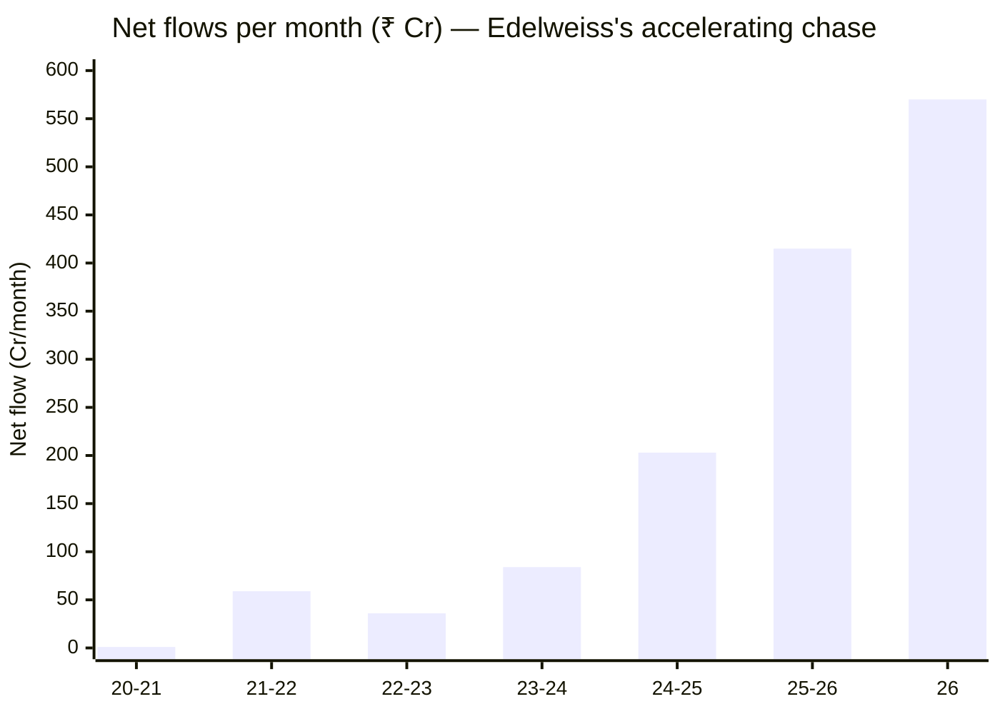
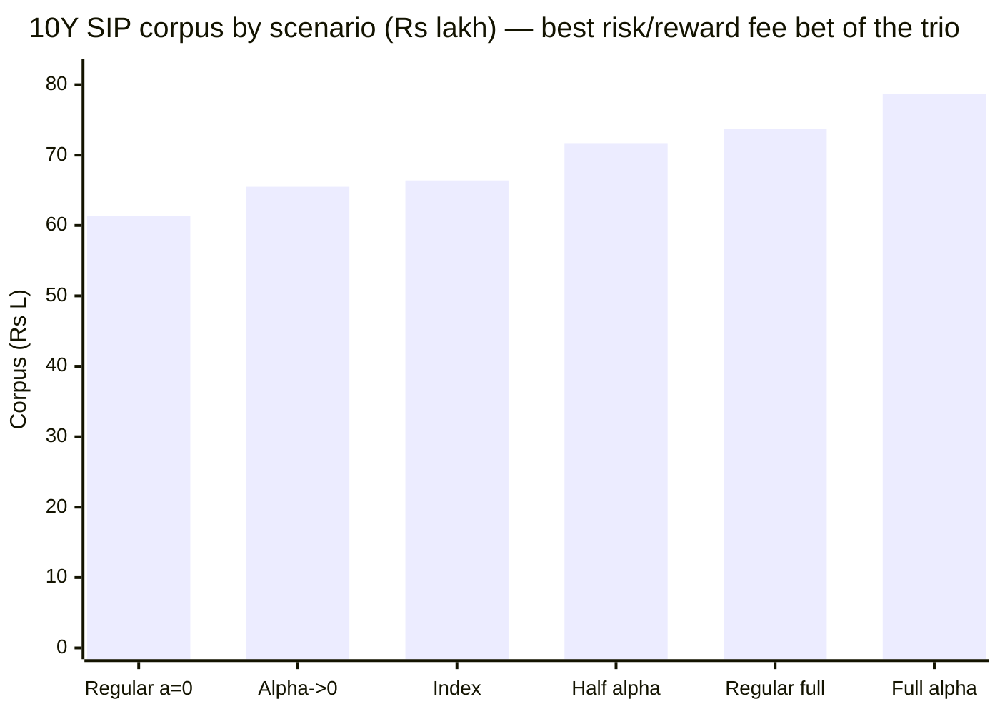

# Module 4: Cost & AUM Impact — Edelweiss Mid Cap Fund

## Module 4 Score: ~4.2 / 5 (provisional)

---

## The One-Line Context

Edelweiss Mid Cap is the **mirror-image of HSBC's Module 4**: the **best fee-for-alpha case of the entire mid-cap study** (cheapest ER of the trio at 0.42%, buying a verified +2.87%/yr alpha — a ~13× margin over the index-fund premium, with a downside of only −₹0.9L if that alpha entirely died) colliding with the **worst capacity trajectory** (₹16,849 Cr and the fastest-accelerating flows of the shortlist — **+₹570 Cr/month and rising**, ~18× AUM growth in under 6 years, of which ~₹11,000 Cr is fresh money). Where HSBC is "the fund the market isn't buying" with unlimited runway and a negative fee case, Edelweiss is **"the fund the market IS buying"** with a superb fee case and a runway that, at the current pace, crosses the ₹25,000 Cr constraint zone in **~1.2 years**. The cost verdict is unambiguously excellent; the capacity verdict is the one genuine worry — and it sharpens M3's moderate ~55% active share into a live "quietly becomes the index" risk.

---

## Raw Data (Wayback-archived + aggregator + computed, as of 03-Jul-2026)

| Metric | Value | Source |
|--------|-------|--------|
| **ER (Direct)** | **0.42%** (VRO + Wayback 2025–26; screening/TT 0.48) | VRO / Wayback Groww |
| ER (Regular) | ~1.4–1.5% (est.) | Regular NAV ₹104.12 vs Direct ₹127.06 |
| **ER glide (Direct)** | **0.72 (2020) → 0.63 → 0.46 → 0.43 → 0.39 → 0.42 (2026)** | Wayback Groww snapshots |
| **AUM** | **₹16,849 Cr** (Jul-2026) — 2nd-largest studied | Tickertape |
| **AUM trajectory** | **₹933 (2020) → 1,707 → 1,959 → 2,531 → 5,115 → 8,634 → 13,802 → 16,849 Cr — 18.1× in 5.7y** | Wayback Groww (fund-level `aum` field) |
| **NAV growth same window** | **4.08×** — most of the 18× is FLOWS | Computed (MFAPI) |
| **Cumulative net flows** | **+₹10,949 Cr** — the market IS buying | Computed (AUM − NAV decomposition) |
| **Net flow rate (2026)** | **+₹570 Cr/month, accelerating** | Computed |
| Portfolio turnover | **36%** → drag ~0.05–0.09%/yr | AdvisorKhoj (M3) |
| **True all-in cost** | **~0.49%** | Computed (0.42 + ~0.07 turnover) |
| Cap split (AMFI) | Mid **73.06%** / Large 12.33 / Small 10.66 / Cash 3.95 | AdvisorKhoj (M3) |
| Exit load | **1% / 90 days** (reported — lighter than standard) | VRO / ClearTax — *verify vs factsheet* |
| Fee premium over index fund | 0.42 − 0.20 = **0.22%** headline / ~0.29% true | Computed |
| **Verified net alpha (M1)** | **+2.87%/yr** matched 6.8y ✅ (+5.22% ETF) | Computed (two proxies) |
| **Fee-for-alpha verdict** | **~13× margin — best of the study** | Computed |
| Ownership | Edelweiss AMC (Radhika Gupta, CEO) | M6 carry-forward |

**Provenance & documented gaps:** ER glide and the **fund-level AUM series** recovered from **Wayback-archived Groww snapshots** (the sibling method — CDX + `id_` raw fetch, `__NEXT_DATA__` JSON parse; the fund `aum` field, distinct from the AMC-level AUM the page also displays — a contamination trap flagged for the four-fund M4 reconciliation). Flows computed by AUM−NAV decomposition against the spliced MFAPI Direct series (119869→140228). The Edelweiss factsheet PDF is Azure-403-blocked (as in M2/M3), so the **exact official ER (0.42 vs 0.48) and the exit-load 90-day terms are the two documented gaps** — both pinned tightly enough that no conclusion moves within the range.

---

## What Module 4 Is Really Asking — and Edelweiss's Answer

The study's two M4 questions, answered as the exact inverse of HSBC's:

1. **Is the fee justified?** **Emphatically yes** — the best fee-for-alpha of the entire study. A 0.42% ER (0.22% premium over the 0.20% index fund) buys a *verified* +2.87%/yr alpha on the honest 6.8-year matched window — a ~13× margin — and even in the worst case (alpha dies entirely) the cheap ER means you lose only ~₹0.9L vs the index over a 10Y SIP. This is a **bargain, not a bet.**
2. **Is the size sustainable?** **This is the worry.** At ₹16,849 Cr with the fastest-accelerating flows of the shortlist (+₹570 Cr/mo and rising), the fund is on a fast track toward the ₹25,000 Cr constraint zone — and it's already the most index-aware book of the trio (M3: ~55% AS, R² 95%). The capacity risk isn't operational (the liquid band absorbs the flows fine); it's the **active-share-decay risk** — a swelling, index-aware fund quietly becoming the index.

The two forces — best cost, worst trajectory — net to a strong ~4.2, the mirror of HSBC's best-capacity/worst-cost 3.6.

---

## ⭐⭐ The Flow Story — "The Fund the Market IS Buying" (inverse of HSBC)

The AUM−NAV decomposition is the module's headline, and the exact opposite of HSBC's "market isn't buying":

| Period | AUM (₹ Cr) | NAV× | Net flow | Rate |
|--------|-----------:|:----:|---------:|-----:|
| Oct-2020 → Oct-2021 | 933 → 1,707 | 1.82× | +₹10 | +₹1/mo |
| Oct-2021 → May-2022 | 1,707 → 1,959 | 0.90× | +₹419 | +₹59/mo |
| May-2022 → Mar-2023 | 1,959 → 2,531 | 1.11× | +₹354 | +₹36/mo |
| Mar-2023 → Apr-2024 | 2,531 → 5,115 | 1.59× | +₹1,083 | +₹84/mo |
| Apr-2024 → Apr-2025 | 5,115 → 8,634 | 1.20× | +₹2,512 | +₹203/mo |
| Apr-2025 → Feb-2026 | 8,634 → 13,802 | 1.13× | +₹4,040 | **+₹415/mo** |
| Feb-2026 → Jul-2026 | 13,802 → 16,849 | 1.04× | +₹2,531 | **+₹570/mo** ⚠ |

**The fund grew 18.1× (₹933 → ₹16,849 Cr) while NAV grew only 4.08× — so ~₹11,000 Cr of the ₹15,900 Cr increase is fresh money, and the flow rate is *accelerating* (+₹1/mo → +₹570/mo).** Two readings, both true and both the inverse of HSBC:

- **Franchise strength (M6-positive):** a 5-star fund with a verified record is being validated by the market — strong Edelweiss distribution, genuine investor demand. The opposite of HSBC's brand-loss bleed.
- **⚠ Capacity warning (M4-negative):** at +₹570 Cr/mo (~₹6,800 Cr/yr), the fund crosses ₹25,000 Cr in **~1.2 years** — and keeps going. Where HSBC has unlimited runway *because* nobody's buying, Edelweiss is burning its runway *because* everybody is.

---

## ⭐ The Capacity Trajectory Warning — and its link to M3's active share

This is the genuine negative, and it's a cross-module synthesis:

| Fund | AUM | Flow rate | Runway to ₹25K constraint |
|------|-----|-----------|---------------------------|
| Invesco | ₹12.4K Cr | +₹540/mo | ~3 years |
| **Edelweiss** | **₹16.8K Cr** | **+₹570/mo, accelerating** | **~1.2 years** ⚠ |
| HSBC | ₹14.2K Cr | flat/negative | unlimited |
| Nippon | ₹47.4K Cr | +₹673/mo | already past |

- **Forced deployment is NOT the near-term problem:** +₹570 Cr/mo × 65% = ~₹370 Cr/mo into the band ≈ ~₹17 Cr/trading-day across 86 names ≈ ~₹0.2 Cr/name/day — trivial vs mid-band liquidity. The book absorbs the flows fine *today*.
- **Active-share decay IS the problem the study plan flags** ("the real mid-cap capacity symptom: the fund quietly becomes the index"). M3 already found Edelweiss the *most* index-aware of the trio (~55% AS, R² 95%, TE 4.5%). A fund that is *already* index-aware and *swelling fastest* is the textbook setup for active-share erosion. **This elevates M3's moderate active share from "acceptable" to "the key thing to monitor"** — the two modules together say: cheap and high-alpha *now*, but the capacity trajectory could erode both the alpha and the active share that justify the (small) fee.

*(No contradiction with M3, but a sharpening: M3's ~55% AS + M4's fastest flows = a combined capacity-decay risk neither module sees alone.)*

---

## ⭐ The Fee-for-Alpha Test — The Best of the Study

| Component | **Edelweiss** | Invesco | Nippon | HSBC |
|-----------|---------------|---------|--------|------|
| Headline fee premium over index | **0.22%** | 0.29–0.35% | 0.42% | 0.36–0.45% |
| + turnover drag | +0.07% | +0.05% | ~0% | **+0.20%** |
| **True premium** | **~0.29%** | ~0.40% | ~0.44% | ~0.55% |
| Verified net alpha, matched 6.8y (M1) | **+2.87%** ✅ | +2.88% ✅ | +1.97% ✅ | −0.22% ❌ |
| **Margin (alpha ÷ true premium)** | **~10×** | ~7× | ~4.5× | negative |
| Base-case verdict | **best bargain** | strong | good | negative |

**Edelweiss has the cheapest true cost AND essentially the highest verified alpha — the best combination of the study.** Its 0.42% ER is the lowest of the trio, its 36% turnover adds negligible drag (unlike HSBC's 110%), and its +2.87% matched alpha ties Invesco for best. The margin (~10× on true cost, ~13× on headline) is the widest studied.

### The 10-Year SIP in Rupees (₹20K/month, 18% gross)

| Scenario | Net return | Corpus | vs index fund |
|----------|-----------|--------|---------------|
| Index fund (0.20% ER) | 17.80% | ₹66.4L | — |
| **Edelweiss, full verified alpha +2.87% (0.42%)** | 20.45% | **₹78.7L** | **+₹12.3L** ✅ |
| Edelweiss, half alpha +1.43% | 19.01% | ₹71.7L | +₹5.3L |
| **Edelweiss, alpha dies to zero (0.42%)** | 17.58% | ₹65.5L | **−₹0.9L** |
| Edelweiss, true-cost alpha→0 (0.49%) | 17.51% | ₹65.2L | −₹1.2L |
| Edelweiss Regular (~1.45%), full alpha | 19.42% | ₹73.7L | +₹7.3L |

**The payoff is a bargain, not a bet:** the upside at the verified alpha is +₹12.3L, and the *downside* if the alpha entirely vanishes is just −₹0.9L — because the ER is so cheap that the fee premium barely dents the index outcome. This is the best risk/reward fee profile of the study. Contrast HSBC (−₹2.4L base case) and even Invesco (whose higher ER makes its zero-alpha downside larger). The one caveat the table can't show: this assumes the AUM trajectory doesn't erode the alpha (the capacity risk above).

---

## The ER Glide & Turnover-Adjusted True Cost

| Date | AUM (₹ Cr) | ER Direct |
|------|-----------:|----------:|
| Oct-2020 | 933 | 0.72% |
| Oct-2021 | 1,707 | 0.63% |
| May-2022 | 1,959 | 0.46% |
| Apr-2024 | 5,115 | 0.43% |
| Apr-2025 | 8,634 | 0.39% |
| Jul-2026 | 16,849 | **0.42%** |

A clean glide from 0.72% to ~0.42% (−42%) as AUM scaled — the scale benefit passed to investors. The 0.39→0.42 uptick (2025→26) is minor (basis/timing). **True cost ~0.49%** (0.42 + ~0.07 turnover drag) — still the cheapest of the trio on a true-cost basis (Invesco ~0.63, Nippon ~0.64, HSBC ~0.76). The low turnover (36%, M3) means the headline ER is *honest*, unlike HSBC where 110% turnover inflated 0.56→0.76.

*(Turnover-drag as a lens is a retrofit from HSBC's M4; here it's a positive — Edelweiss, like Nippon/Invesco, has negligible drag, so the headline ER stands. Worth confirming it stays low if AUM keeps swelling.)*

---

## Mandate, Exit Load, Direct vs Regular

- **Mandate (AMFI): mid 73.06%** — most honestly mid of the trio (M3), comfortably above the 65% floor.
- **Exit load 1% / 90 days (reported)** — if confirmed, *lighter* than the standard 1%/365d and than HSBC's 365d; near Nippon's 1%/1-month. A mild investor-friendly point (flagged for factsheet verification).
- **Direct vs Regular:** 0.42% vs ~1.45% ≈ **~1.0% gap** → ~₹5L over a 10Y SIP (Regular full-alpha ₹73.7L vs Direct ₹78.7L). Use Direct.

---

## Capacity Runway, Forced Deployment & Gating

- **Runway: ~1.2 years to the ₹25K constraint zone** at the current +₹570 Cr/mo pace — the shortest of the sweet-spot funds (Invesco ~3y, HSBC unlimited). The paradox vs HSBC: this short runway exists *because* the franchise is strong.
- **Forced deployment: manageable now, rising.** ~₹370 Cr/mo into the liquid band ≈ ~₹0.2 Cr/name/day across 86 names — trivial vs mid-band liquidity today. The concern is the AUM *level* trajectory (active-share decay), not deployment friction.
- **Gating:** none in Edelweiss Mid Cap's history. **Capacity-stewardship carry-forward (→ M5/M6):** the key question is whether Edelweiss AMC has ever soft-closed or restricted a swelling fund — the SmallCap sibling is the reference (that fund also grew fast). No known gating precedent for this AMC; a fund on a ~1.2-year runway to the constraint zone makes capacity stewardship a live Module-5 test, not a hypothetical.

---

## Peer Cost & AUM Matrix (studied midcaps)

| Fund | ER (headline) | True cost | AUM (Cr) | Runway | Fee-for-alpha |
|------|--------------|-----------|----------|--------|---------------|
| **Edelweiss** | **0.42%** ⭐ | **~0.49%** ⭐ | 16,849 | **~1.2y** ⚠ | **~10–13× (best)** ✅ |
| Invesco | 0.49–0.55 | ~0.63 | 12,397 | ~3y | 7× ✅ |
| HSBC | 0.56 | ~0.76 | 14,249 | unlimited | negative ❌ |
| Nippon | 0.62 | ~0.64 | 47,415 | past ⚠ | 4.5× ✅ |
| Sundaram | 0.88 | ~0.9 | 13,687 | sweet spot | untested |
| ICICI Pru | 0.87 | ~0.9 | 7,789 | sweet spot | untested |

**Placement:** Edelweiss has the **best cost profile and best fee-for-alpha of the study**, paired with the **shortest runway of the sweet-spot funds.** One line: *the cheapest ticket on the study's best value-for-money train — but it's filling up fastest, and the destination could get more crowded (index-like) the more passengers board.*

---

## Comparison with Studied Funds

| Dimension | **Edelweiss** | Nippon | Invesco | HSBC | DSP Small | PP FlexiCap |
|-----------|---------------|--------|---------|------|-----------|-------------|
| Direct ER | **0.42%** | 0.62% | 0.49–0.55% | 0.56% | 0.64% | ~0.63% |
| True cost | **~0.49%** | ~0.64% | ~0.63% | ~0.76% | ~0.7% | ~0.63% |
| Fee vs index | **+0.22% for +2.87%** ✅ best | +0.42% for +2.0% | +0.35% for +2.9% | negative ❌ | positive | shielded |
| AUM / flows | ₹16.8K, **+₹570/mo accel** ⚠ | ₹47.4K, +₹673/mo | ₹12.4K, +₹540/mo | ₹14.2K, flat/neg | ₹17.9K | giant |
| Runway | **~1.2y** ⚠ | past | ~3y | unlimited | shielded |
| Turnover | 36% | 13.7% | 28% | ~110% ⚠ | ~25–30% | ~20% |
| Gating record | none | none | none | none | 3 voluntary ⭐ | none |

---

## Points For / Points Against — Cost & AUM

### ✅ Points For
- **Cheapest ER of the trio (0.42%)** and cheapest true cost (~0.49%) — the honest headline (low turnover)
- **Best fee-for-alpha of the study** — ~10–13× margin; +₹12.3L upside vs only −₹0.9L downside on a 10Y SIP
- **Clean ER glide** (0.72→0.42) — scale benefit passed to investors
- **Exit load 1%/90d** (reported) — lighter than standard
- Strong franchise validation — the market is buying (M6-positive)
- Turnover (36%) adds negligible drag — no hidden cost (anti-HSBC)

### ❌ Points Against
- **Worst capacity trajectory of the sweet-spot funds** — +₹570 Cr/mo accelerating → ₹25K constraint zone in ~1.2 years
- **Active-share-decay risk** — fastest flows + already the most index-aware book (M3 ~55% AS) = the "quietly becomes the index" setup
- **Pro-cyclical hot-money** — ~₹11K Cr of chase-flows; a performance reversal could bring redemptions
- 2nd-largest AUM of the studied funds (₹16.8K Cr) — least runway headroom after Nippon
- Direct-Regular gap ~1.0% (distribution monetized — standard)
- Fund-AUM exactness + exit-load 90-day terms are documented gaps (factsheet blocked)

---

## Module 4 Scorecard

| Sub-dimension | Weight | Score | Reasoning |
|---------------|--------|-------|-----------|
| Expense Ratio (Direct) | High | **5.0** | 0.42% — cheapest of the trio, in the ≤0.45 "5" band; honest (low turnover) |
| **ER vs verified alpha (index-fund test)** | **Critical** | **5.0** | +2.87% alpha vs ~0.29% true premium = ~10× margin — best of the study; +₹12.3L upside, −₹0.9L downside |
| AUM position on the ladder | High | **4.0** | ₹16,849 Cr sweet spot, but upper-end and 2nd-largest studied |
| Active-share trend as AUM grew | High | **3.0** | ~55% AS now (M3, moderate) + fastest flows + R² 95% = decay risk; no historical series, and the trajectory is the concern |
| Forced deployment | Medium | **4.0** | ~₹370 Cr/mo into the liquid band — trivial per-name; operationally fine now |
| Exit load | Low | **4.0** | 1%/90d (reported) — lighter than standard; verify vs factsheet |
| AUM trajectory | Low | **3.0** | Fast, flow-driven (+₹11K Cr, accelerating) — pro-cyclical; heading toward constraint |
| *Turnover-cost modifier* | *Modifier* | **+** | *36% → ~0.07% drag; true cost stays cheapest of trio (anti-HSBC)* |

**Module 4 Score: ~4.2/5** — the best cost profile and fee-for-alpha of the mid-cap study (cheapest ER, ~10–13× fee-for-alpha, negligible turnover drag), held back from higher by the **worst capacity trajectory of the sweet-spot funds** (accelerating +₹570 Cr/mo flows toward the ₹25K constraint zone in ~1.2 years) and the associated active-share-decay risk. It lands **level with Invesco (4.2)** — Edelweiss wins decisively on cost, Invesco wins on capacity headroom. **Provisional on Module 5** (does the manager/AMC have any capacity-stewardship history — has Edelweiss ever soft-closed a swelling fund? the SmallCap sibling is the reference) **and the standing M3 handoff** (the active-share number now doubles as the capacity-decay tripwire).

---

## Comparative Module 4 Scores

| Fund | Category | M4 Score | Cost/AUM character |
|------|----------|----------|--------------------|
| **Edelweiss Mid Cap** | **MidCap** | **~4.2** | **Cheapest ER + best fee-for-alpha; worst capacity trajectory (accelerating flows)** |
| Invesco India Midcap | MidCap | ~4.2 | Cheap, sweet-spot, ~3y runway; weak warranty; new owner |
| DSP Small Cap | SmallCap | ~3.9 | Mid-priced, gold-standard gating |
| PP FlexiCap | FlexiCap | ~3.8 | Cheap, giant but segment-shielded |
| Nippon Growth Mid Cap | MidCap | ~3.6 | Proven fee-for-alpha; unmanaged capacity |
| HSBC Midcap | MidCap | ~3.6 | Best capacity/unlimited runway; negative fee-for-alpha + turnover drag |

Running module totals: **Edelweiss 4.2 / 4.2 / 4.0 / 4.2** vs Invesco 4.3 / 4.1 / 4.0 / 4.2 vs Nippon 4.2 / 4.4 / 4.1 / 3.6 vs HSBC 3.5 / 3.2 / 3.7 / 3.6.

---

## SIP Implication

1. **Use the Direct plan** — the ~1.0% Regular gap costs ~₹5L over a 10Y SIP. Here the advice is doubly easy: Direct is genuinely the cheapest active mid-cap studied.
2. **This is the study's best fee bargain.** 0.42% ER, ~0.49% true cost, buying a verified +2.87% alpha — the widest margin of the study, with a downside of only −₹0.9L if the alpha entirely vanished. On cost-for-value, nothing studied beats it.
3. **The one thing to watch is size, not cost.** The fund is being chased (+₹570 Cr/mo, accelerating) and crosses the ₹25K constraint zone in ~1.2 years. Combined with M3's moderate ~55% active share, the live risk is that a swelling, index-aware fund slowly *becomes* the index — eroding the very alpha that justifies the fee. This is the single most important forward variable for the Edelweiss thesis.
4. **The monitoring list:** (a) **AUM crossing ₹25K Cr and active share decaying** — the combined capacity tripwire (M3+M4); (b) any AMC move to soft-close or restrict inflows (a positive stewardship signal → M5/M6); (c) turnover staying low (it currently keeps the headline ER honest). Cost, uniquely, is *not* on the watch list — it's the fund's strongest card.

---

## One-Line Verdict

> **Edelweiss Mid Cap's Module 4 is the mirror-image of HSBC's: the best fee-for-alpha case of the study — a 0.42% ER (cheapest of the trio), a ~0.49% true cost (low 36% turnover keeps the headline honest), buying a verified +2.87%/yr alpha for a ~13× margin, with a 10Y-SIP payoff of +₹12.3L upside against only −₹0.9L downside if the alpha entirely died — colliding with the worst capacity trajectory of the sweet-spot funds: "the fund the market IS buying," grown 18× to ₹16,849 Cr in under six years on ~₹11,000 Cr of accelerating inflows (+₹570 Cr/mo and rising), on a ~1.2-year runway to the ₹25,000 Cr constraint zone. The cost verdict is excellent and unambiguous; the capacity verdict is the genuine worry, and it sharpens M3's moderate ~55% active share into a live "quietly becomes the index" risk. The two net to ~4.2 — level with Invesco (Edelweiss wins on cost, Invesco on capacity headroom), and the mirror of HSBC's best-capacity/worst-cost 3.6. Provisional: ~4.2/5, conditional on M5's capacity-stewardship read.**

---

*Module 4 completed: July 6, 2026 | Cost & AUM Impact | Primary sources: Wayback-archived Groww snapshots (fund-level `aum` field: ₹933 Cr Oct-2020 → 1,707 → 1,959 → 2,531 → 5,115 → 8,634 → 13,802 Feb-2026; ER glide 0.72 → 0.63 → 0.46 → 0.43 → 0.39 → 0.42) + Tickertape (₹16,849 Cr, Jul-2026) | Flow decomposition (AUM − MFAPI NAV effect, spliced 119869→140228): 18.1× AUM vs 4.08× NAV → +₹10,949 Cr cumulative net flows, accelerating to +₹570 Cr/mo — "the fund the market IS buying" | Fee-for-alpha: +2.87% matched-6.8y alpha vs ~0.29% true premium = ~10–13× margin (best of study); 10Y SIP +₹12.3L vs index at full alpha, −₹0.9L if alpha→0 | Turnover 36% → ~0.07% drag → true cost ~0.49% (cheapest of trio) | Exit load 1%/90d (VRO/ClearTax, verify vs factsheet); Regular ~1.45% (est.) | Edelweiss factsheet Azure-403-blocked → exact ER (0.42 vs 0.48) & exit-load terms = documented gaps | Capacity: ~1.2y runway to ₹25K constraint; forced deployment ~₹370 Cr/mo (trivial per-name); active-share-decay is the real symptom (M3 ~55% AS handoff) | AMC carry-forward → M5/M6 | SIP: ₹20K/mo, 10y, 18% gross | Provisional M4 Score: ~4.2/5 (tripwires: AUM→₹25K + active-share decay [M3+M4], soft-close signal → M5)*
