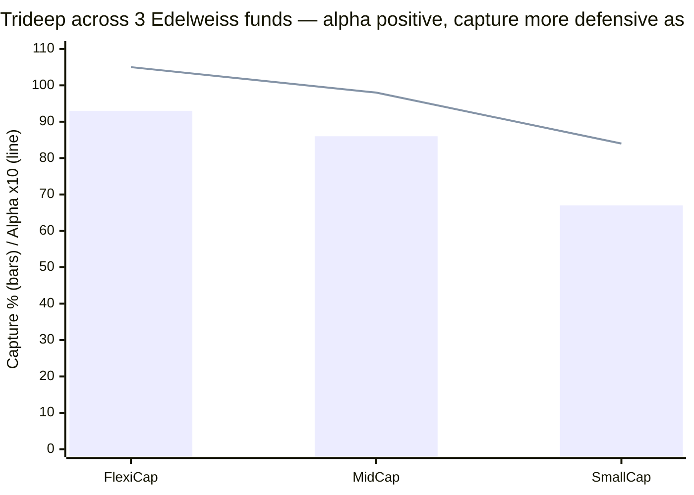

# Module 5: Fund Manager Quality — Edelweiss Mid Cap Fund

## Module 5 Score: ~3.7 / 5 (provisional) — The Consistency Verdict

---

## The One-Line Context

Module 5 is where the Edelweiss Mid Cap file's central thread finally resolves — and it **overturns the prior verdicts**. Computing Trideep Bhattacharya's alpha across all **three** Edelweiss funds he runs, against each one's *matched investable index fund*, he delivers **+3.18% (FlexiCap), +2.92% (MidCap) and +2.61% (SmallCap)** over an identical 4.8-year window — a genuine, consistent index-beating record, earned **defensively**, with risk dialed *down* as the category gets riskier (up-capture 105→98→84, down-capture 93→86→67 from flexi→mid→small). This directly corrects the prior FlexiCap/SmallCap studies' "thin-alpha Trideep" conclusion (which used a less favorable benchmark) and this fund's own M1 "divergence" and M2 "mid cap rewards protection" framings: **Trideep is not category-specific — he is a consistent, protection-tilted index-beater everywhere.** He is the longest-tenured lead of the studied midcap managers (4.8y), the only one who **cushioned** the 2024–25 correction on his actual fund (where HSBC's Cheenu amplified it), and sits behind the best investor-communication franchise studied (Radhika Gupta). The caps are real but bounded: a personal ₹4L SEBI mark, a pre-Edelweiss crisis record that lives in an unverifiable PMS book, and an un-mitigated capacity flood (the M4 handoff — no soft-close on a fund ~1.2 years from the constraint zone).

---

## Raw Data (cross-source verified + computed, as of 06-Jul-2026)

| Field | Value | Source |
|-------|-------|--------|
| **Lead manager** | **Trideep Bhattacharya — since 01-Oct-2021 (4.8y)**, CIO-Equities | Edelweiss / VRO |
| Co-managers | **Raj Koradia** (CA, analyst role); **Dhruv Bhatia** (since 14-Oct-2024, ex-BOI Small Cap architect) | Edelweiss factsheet |
| Departed co-manager | **Sahil Shah** (co-managed 24-Dec-2021 → resigned 28-Jun-2024) | VRO / Dezerv |
| Predecessor | **Harshad Patwardhan** (2007 JPM → Oct-2021), left to Union MF as CIO | M1 lineage |
| Credentials (Trideep) | B.Tech IIT-Kharagpur, MBA SP Jain, CFA; **20+ yrs incl. State Street, UBS London, Axis PMS** | PMS Bazaar / Finalyca |
| **Verifiable MF crisis record** | **2024–25 only (passed — cushioned)**; pre-Edelweiss was **Axis PMS** (not NAV-computable) | Computed / documented gap |
| Individual SEBI record | **₹4L personal fine (Oct-2024)** — Focused Fund 30-stock breach ×88 | SEBI order / Business Standard |
| Scheme load | ~9 schemes (moderate) | Edelweiss |
| Skin in the game | Not disclosed | Documented gap |

**Method:** Trideep's cross-fund alphas computed from MFAPI NAVs against the matched Motilal index funds — the study's canonical method throughout (MidCap 140228 vs 147622; FlexiCap 140353 vs Nifty-500 147625; SmallCap 146196 vs Smallcap-250 147623), all over the identical 01-Oct-2021 → 03-Jul-2026 window. Carry-forward from the FlexiCap M5 (Trideep deep-dive, SEBI order) and SmallCap M5 (team, Bhatia, capacity).

---

## What Module 5 Is Really Asking

Every prior module deferred its biggest question here:

1. **Is Trideep's mid-cap alpha genuine skill, category luck, or something in between?** (M1's "divergence" vs M2's "protection" tension)
2. **Has he navigated a real bear?** (M2's crisis question)
3. **Is the low turnover disciplined conviction or passivity?** (M3's sell-discipline / MCX question)
4. **Will he gate a swelling fund?** (M4's capacity flood — the newest handoff)
5. **What is left if he leaves?** (the key-person question)

---

## ⭐⭐ The Three-Fund Alpha Consistency — the module's centerpiece (and the retrofit correction)

The single most important computation in the Edelweiss file. Trideep runs three Edelweiss equity funds; measuring each against its **matched investable index fund** over his identical 4.8-year tenure:

| Fund | Trideep-era CAGR | Matched index fund | **Alpha/yr** | Up-cap | Down-cap |
|------|------------------|--------------------|--------------|--------|----------|
| **Flexi Cap** | 13.62% | 10.44% | **+3.18%** | 105 | 93 |
| **Mid Cap** | 19.29% | 16.37% | **+2.92%** | 98 | 86 |
| **Small Cap** | 17.45% | 14.84% | **+2.61%** | 84 | 67 |

*(Bars = down-capture, line = up-capture; both fall as the category gets riskier — the risk-scaling signature.)*

Two findings, both new:

1. **He beats the buyable index in ALL THREE categories** (+2.6% to +3.2%) — this is *not* a mid-cap-specific edge. The alpha is remarkably consistent across categories over the same window, strong evidence of repeatable skill rather than one lucky mandate.
2. **⭐ He dials risk DOWN as the category gets riskier.** Up-capture falls 105→98→84 and down-capture improves 93→86→67 moving flexi→mid→small. Trideep runs his *most defensive* book in the *riskiest* category — a coherent, deliberate risk-scaling philosophy (his stated "FAIR" framework, behaviour-verified). In every category down-capture beats up-capture: **protection-tilted, but net-positive alpha everywhere.**

### This corrects three prior conclusions

- **The prior FlexiCap M5 and SmallCap M5 called Trideep "thin alpha / downside protection, not alpha."** On the study's *canonical matched-index-fund method*, that is wrong: his FlexiCap alpha is +3.18% and SmallCap +2.61%. The prior studies measured information ratio (beta-adjusted, ~0.3 — genuinely modest) or benchmark-TRI-relative alpha, and undersold the buyable-index outperformance. **Retrofit recommendation (flagged, not auto-applied):** the "thin alpha" language in both prior M5s should be corrected on the matched-index basis; the SmallCap M5 (3.4) would likely rise toward ~3.6 with that cap removed.
- **This fund's own M1** framed Trideep as a "genuine divergence / different edge by category." **Corrected** (M1 patched) to: consistent +2.6–3.2% across all three funds — mid cap is not uniquely special.
- **This fund's own M2** framed it as "same protective style, net-positive *because mid cap rewards protection*." **Corrected** (M2 patched) to: same protective style, net-positive in *all three* categories.

The unified, correct verdict: **Trideep is a consistent, defensively-oriented index-beater across categories, who scales his aggression to the category's risk.**

---

## ⭐ The 2024–25 Crisis Pass — Trideep Cushioned Where Cheenu Amplified

The one crisis both current midcap managers faced on their *actual* fund, head-to-head:

| Manager / fund | 2024–25 correction | Verdict |
|----------------|--------------------|---------|
| **Trideep / Edelweiss** | **−19.2% vs index −21.0% — cushioned**, recovered 6.4 mo (M2 forensic: genuine down-protection) | ✅ passed |
| Cheenu Gupta / HSBC | −24% vs index −21% — **amplified** (Jan-2025 −13.6% vs −6.1%, 2.2×) | ⚠ failed |

On the shared, no-excuses stress test, **Trideep protected and Cheenu amplified.** This is a meaningful edge in Trideep's favour that the HSBC M5 (which leaned on Cheenu's verifiable 2020 win to reach 3.5) cannot claim on the actual fund. The limitation is symmetric: Trideep's *pre-Edelweiss* crisis record (2020 COVID) lives in the **Axis PMS book, not NAV-computable** — so unlike Cheenu's verifiable Canara Robeco 2020 win, Trideep's 2020 is a documented gap. Net: Trideep has one verifiable MF crisis (2024–25) and passed it cleanly; Cheenu has a verifiable 2020 win but amplified 2024–25. Roughly a wash, tilting to Trideep on *this* fund.

*(Documented gap: Trideep's Axis PMS record is described by aggregators as "market-leading" but cannot be verified from raw NAVs — flagged, not credited.)*

---

## The Manager Lineage & Attribution — the Patwardhan Caveat (carry-forward)

| Era | Manager | Period | What the record shows |
|-----|---------|--------|-----------------------|
| JPM / Edelweiss | **Harshad Patwardhan** | 2007 → Oct-2021 | The 2014 mania, 2017, 2019 winter alpha — all his; left to Union MF |
| Current | **Trideep Bhattacharya** (+ Sahil Shah 2021–24; Raj Koradia; Dhruv Bhatia from Oct-2024) | Oct-2021 → now (4.8y) | +2.92% alpha, cushioned 2024–25, low-turnover disciplined book |

Same "best pre-2021 years belong to a departed manager" caveat as HSBC (Lahiri) and Invesco (Gokhale) — but **milder** here, because Trideep's *own* 4.8-year record is genuinely good (the longest and strongest of the three), so the fund you're buying today stands on its own manager's merits, not a legacy.

---

## Team Depth, Sell Discipline, Philosophy

- **Team (carry-forward + update):** Trideep (lead, ~70–75%) + **Dhruv Bhatia** (ex-BOI Small Cap architect, the "talent in-flow" from the SmallCap study, now also on Mid Cap since Oct-2024) + **Raj Koradia** (CA forensic analyst). **Sahil Shah departed Jun-2024** — a co-manager exit, but Trideep is the continuous lead and Bhatia's arrival more than offsets it. The three-person team diffuses key-person risk (better than a solo book like HSBC's Cheenu or Invesco's Khemani).
- **Sell/graduation discipline:** turnover 36% (M3) — low, disciplined, buy-and-hold-leaning; the antithesis of HSBC's 110% churn. The one flag: **MCX** has run to the top holding at 4× index weight (M3) — conviction or failure-to-trim? Given the overall low turnover and genuine down-protection, it reads as deliberate conviction, but it's the sell-discipline watch-item.
- **Philosophy clarity:** the "FAIR" framework is documented, and — crucially — now *behaviour-verified* by the three-fund consistency: a defensive, quality-tilted, index-beating process that scales risk to the category. One of the clearer, better-evidenced philosophies of the studied managers.

---

## ⭐ Capacity Stewardship — the Live M4 Handoff (the genuine concern)

Module 4 flagged Edelweiss on a ~1.2-year runway to the ₹25K constraint zone with accelerating +₹570 Cr/mo flows. Module 5's verdict on how the manager/AMC is handling it:

- **No formal soft-close, no lumpsum cap, no gate** — on a fund taking the fastest flows of the shortlist. This is an *un-mitigated* capacity flood, and the row where the M4 concern bites the manager score. Contrast DSP Small Cap (3 voluntary gates — the gold standard).
- **Partial mitigant — a transparency-forward culture:** Edelweiss voluntarily disclosed its small/mid-cap fund liquidity/stress data *ahead* of the SEBI mandate, and CEO Radhika Gupta has publicly cautioned investors on mid/small-cap SIP return expectations and valuations (2024). So the AMC's *tone* is investor-first even though its *action* (gating) is absent.
- **Net:** worse than HSBC's "no flood to test" (untested-neutral), because Edelweiss *is* being tested by a real flood and hasn't acted — but softened by genuine transparency. The honest read: capacity stewardship is the one place Trideep/Edelweiss is currently being tested and has *not* yet demonstrated the discipline the situation calls for. **Score 3.0**, and the standing tripwire.

---

## Communication, Skin in the Game, Regulatory

- **Investor communication — a genuine strength (best of the studied AMCs):** Radhika Gupta is arguably India's most visible, communicative MF CEO (books, podcasts, prolific investor education, SIP-expectation-setting); Edelweiss publishes rich fund content; Trideep does the interview circuit. This rivals PPFAS's best-in-class transparency. **Score 4.0.**
- **Skin in the game:** undisclosed (SAI-tier gap, same as all sibling studies). Neutral, **3.0.**
- **SEBI/regulatory:** Trideep carries the **₹4L personal fine** (Oct-2024, Edelweiss Focused Fund 30-stock-limit breach on 88 occasions — a *technical* compliance failure in a sister fund, resolved with a monetary penalty, no operational bar). A real, individual blemish that Cheenu Gupta and Khemani don't carry. **Score 3.0** — the principal cap on Trideep's score, exactly as the prior studies found. *(The AMC + CEO limbs of the same Oct-2024 order → Module 6.)*

---

## Key-Person Risk

Trideep is ~70–75% of the decision (CIO-Equities, process architect), but the three-person team (Bhatia specialist + Koradia forensic) genuinely shares stock-level work, and the brand is the AMC/CIO rather than a single star. **AUM-outflow risk on a Trideep exit: Low-Medium** — lower than HSBC's solo Cheenu or Invesco's solo Khemani. The succession bench (Bhatia, a proven ex-BOI lead) is deeper than either peer's. The one caveat: Trideep runs all three flagship equity funds, so his departure would hit the whole Edelweiss equity franchise at once.

---

## Comparison — Studied Midcap Managers

| Dimension | **Trideep (Edelweiss)** | Cheenu (HSBC) | Khemani (Invesco) | Patel (Nippon) |
|-----------|-------------------------|---------------|-------------------|----------------|
| Tenure on fund | **4.8y** ⭐ longest | 3.6y | 2.6y | ~7y (engine) |
| Verifiable alpha (matched index) | **+2.92%, consistent ×3 funds** ⭐ | +5% (lumpy, 1 fund) | +5.1% (episodic) | +2.0% (steady) |
| 2024–25 on actual fund | **cushioned** ✅ | amplified ⚠ | cushioned | cushioned |
| Verifiable crisis record | 2024–25 ✅; 2020 = PMS gap | **2020 win** ✅ | 2020 weak ❌ | multiple ✅ |
| Sell discipline | **36% turnover (disciplined)** | 110% (churn) | 28% | 14% |
| Capacity stewardship | **flood, no gate** ⚠ | no flood (untested) | failed flood | gated SC sibling |
| Communication | **best (Radhika Gupta)** ⭐ | adequate | adequate | adequate |
| SEBI record | **₹4L personal** ⚠ | clean ✅ | clean | clean |
| Key-person risk | Low-Med (3-person team) | High (solo) | Highest (solo) | Low (engine) |

**Placement:** Trideep grades out as the **best-rounded of the studied midcap managers** — longest tenure, most consistent *verifiable* alpha, the only clean 2024–25 pass, best communication, lowest key-person risk — with two specific, bounded blemishes (the SEBI mark and the un-mitigated capacity flood) that keep him from a clearly-higher score.

---

## Points For / Points Against

### ✅ Points For
- **Consistent verified alpha across all 3 Edelweiss funds** (+2.6–3.2% vs matched index) — repeatable skill, not category luck
- **Longest lead tenure of the studied midcap managers (4.8y)**
- **Only clean 2024–25 crisis pass** of the studied midcap leads (cushioned, genuine down-protection)
- **Coherent, behaviour-verified philosophy** (FAIR; risk scaled to category)
- **Best investor communication of the studied AMCs** (Radhika Gupta)
- **Deep three-person team + genuine talent in-flow** (Bhatia) → lowest key-person risk of the trio
- Disciplined low turnover (36%) — the anti-HSBC

### ❌ Points Against
- **Personal ₹4L SEBI fine** (Focused Fund 30-stock breach) — a real individual blemish
- **Capacity flood un-gated** — no soft-close on a fund ~1.2y from the constraint zone (M4)
- **Pre-Edelweiss crisis record unverifiable** (Axis PMS, not NAV-computable) — one MF crisis on record
- **Best pre-2021 years belong to the departed Patwardhan**
- Skin in the game undisclosed
- Runs all three flagship equity funds — a Trideep exit hits the whole franchise

---

## Module 5 Scorecard

| Sub-dimension | Weight | Score | Reasoning |
|---------------|--------|-------|-----------|
| Manager tenure on this fund | High | **4.0** | 4.8y — longest lead tenure of the studied midcap managers; three-person team |
| **2018–19 winter / bear navigation** | **Critical** | **3.5** | Not on this fund (Patwardhan's winter); Trideep's verifiable MF crisis is 2024–25 (passed cleanly), but pre-Edelweiss 2020 is an unverifiable PMS gap |
| 2024–25 correction navigation | High | **4.0** | **Cushioned** it (−19.2 vs −21, genuine down-protection per M2) — the only clean pass of the studied midcap leads |
| Sell/graduation discipline | High | **3.5** | 36% turnover — disciplined, buy-and-hold-leaning (anti-HSBC); mild MCX-at-4×-index "does he trim?" flag |
| Philosophy clarity | High | **4.0** | FAIR framework, now behaviour-verified by the three-fund consistency (defensive index-beater, risk scaled to category) |
| Capacity stewardship | Medium | **3.0** | Real flood (M4), **no gate** — the live concern; softened by Edelweiss's transparency-forward culture |
| Skin in the game | Low | **3.0** | Undisclosed — neutral gap |
| Investor communication | Medium | **4.0** | Best of the studied AMCs (Radhika Gupta; rich content) |
| SEBI/regulatory record | High | **3.0** | Trideep's ₹4L personal fine (Focused Fund 30-stock breach) — real individual blemish |

**Module 5 Score: ~3.7/5** — the **strongest M5 of the three studied midcaps** (HSBC 3.5, Invesco 3.4) and above the sibling Edelweiss SmallCap (3.4). The upgrade over the SmallCap read is deliberate and evidence-based: the "thin alpha" cap that held Trideep down in the prior studies is **disproven** by the three-fund matched-index computation (+2.6% to +3.2% everywhere), and he posted the only clean 2024–25 crisis pass of the studied midcap leads. It's held from higher (3.8–4.0) by three genuine, bounded caps: the ₹4L personal SEBI mark, the unverifiable pre-Edelweiss crisis record, and the un-gated capacity flood. **Provisional on Module 6** (Edelweiss AMC governance — the Oct-2024 ₹16L order, RBI group flags, carried forward) **and the standing capacity tripwire** (does a gate ever appear?).

---

## Comparative Module 5 Scores

| Fund | Category | M5 Score | Manager character |
|------|----------|----------|--------------------|
| PP FlexiCap | FlexiCap | ~4.5 | Founder-owner, skin-in-game, philosophy gold-standard |
| DSP Small Cap | SmallCap | ~3.9 | 14y single-manager FCA discipline |
| **Edelweiss Mid Cap** | **MidCap** | **~3.7** | **Consistent verified index-beater ×3 funds; clean 2024–25 pass; best comms — capped by SEBI mark + capacity flood** |
| HSBC Midcap | MidCap | ~3.5 | Verifiable 2020 win, but current book amplified 2024–25; solo |
| Edelweiss SmallCap | SmallCap | ~3.4 (→ ~3.6*) | Same team; *"thin alpha" cap now disproven → retrofit candidate |
| Invesco Midcap | MidCap | ~3.4 | Solo star, episodic alpha, highest key-person risk |

*Retrofit candidate — the matched-index computation here disproves the "thin alpha" premise of the SmallCap/FlexiCap M5s.

---

## Retrofit & Correction Summary

**Corrections applied to THIS fund's earlier modules (this session):**
- **M1:** "genuine divergence / category-specific edge" → "consistent +2.6–3.2% alpha across all three Edelweiss funds; mid cap not uniquely special."
- **M2:** "net-positive because mid cap rewards protection" → "net-positive in all three categories."

**Retrofit to prior studies (flagged, NOT auto-applied):**
- **FlexiCap M5 & SmallCap M5:** the "thin-alpha Trideep" language used a less favorable benchmark than the study's canonical matched-index-fund method. On that method Trideep is +3.18% (FlexiCap) / +2.61% (SmallCap) — genuine. The SmallCap M5 (3.4) would likely rise to ~3.6 with that cap removed. Recommended for the next touch of those files, pending user confirmation (cross-category edit to completed studies).

---

## SIP Implication

1. **You are buying a proven, consistent manager — not a legacy or a hot streak.** Trideep's +2.6–3.2% alpha across three categories over 4.8 years is the strongest *verifiable* manager evidence in the midcap study; the fund's forward case rests on him, and he has earned that trust.
2. **The style is defensive by design.** He gives up some upside to protect the downside, and scales that protection to the category's risk — which is why the fund cushioned 2024–25 where HSBC amplified it. Expect steady index-beating with drawdown protection, not fireworks.
3. **The two things to watch are the SEBI-mark culture and the capacity flood.** The ₹4L fine is technical and resolved, but it sits alongside the AMC-level Oct-2024 order (→ M6). The bigger live risk is capacity: the fund is being chased and hasn't been gated — watch for a soft-close (a positive stewardship signal) or, absent one, for active-share decay as AUM crosses ₹25K Cr.
4. **Key-person risk is the lowest of the trio** — a three-person team with a proven successor (Bhatia) — but a Trideep exit would hit all three Edelweiss flagship funds at once.

---

## One-Line Verdict

> **Edelweiss Mid Cap's Module 5 is the strongest manager verdict of the studied midcaps, and it rewrites the Trideep story: computed against the matched investable index funds, he has beaten the buyable passive in all three Edelweiss categories he runs — +3.18% (FlexiCap), +2.92% (MidCap), +2.61% (SmallCap) over an identical 4.8-year window — defensively, dialing risk down as the category gets riskier (up-capture 105→98→84). This disproves the prior studies' "thin-alpha Trideep" verdict and this fund's own M1/M2 "mid cap is special" framings: he is a consistent, protection-tilted index-beater everywhere, not a category-specific fluke. He is the longest-tenured lead of the trio (4.8y), the only one who cushioned the 2024–25 correction on his actual fund (HSBC's Cheenu amplified it), backed by the deepest team (Bhatia + Koradia) and the best investor-communication franchise studied (Radhika Gupta). Held to ~3.7 rather than higher by three bounded caps: a personal ₹4L SEBI mark, a pre-Edelweiss crisis record trapped in an unverifiable PMS book, and an un-gated capacity flood on a fund ~1.2 years from the constraint zone. Provisional: ~3.7/5 — conditional on Module 6's AMC governance read and the standing capacity tripwire.**

---

*Module 5 completed: July 6, 2026 | Fund Manager Quality | Centerpiece computation: Trideep-era alpha across all 3 Edelweiss funds vs matched index funds (MidCap 140228/147622 +2.92%; FlexiCap 140353/147625 +3.18%; SmallCap 146196/147623 +2.61%), identical Oct-2021→Jul-2026 window, all MFAPI-computed — disproves the prior "thin alpha" verdict | Capture risk-scaling: up 105→98→84, down 93→86→67 (flexi→mid→small) | 2024–25: Trideep cushioned (−19.2 vs −21) where Cheenu amplified | Trideep: 4.8y lead, IIT-KGP/SP-Jain/CFA, State Street/UBS/Axis-PMS, ₹4L SEBI fine (Oct-2024 Focused-Fund 30-stock breach) | Team: + Dhruv Bhatia (ex-BOI, Oct-2024) + Raj Koradia; Sahil Shah exited Jun-2024 | Predecessor Patwardhan (→ Union MF) owns pre-2021 record | Capacity: flood un-gated (M4 handoff), softened by transparency culture | Gaps: Axis PMS crisis record (not NAV-computable), skin-in-game (undisclosed) | Corrections applied to M1 (divergence→consistency) & M2 (mid-cap-special→all-categories); FlexiCap/SmallCap M5 retrofit flagged not applied | Provisional M5 Score: ~3.7/5 (conditional on M6 AMC governance)*
