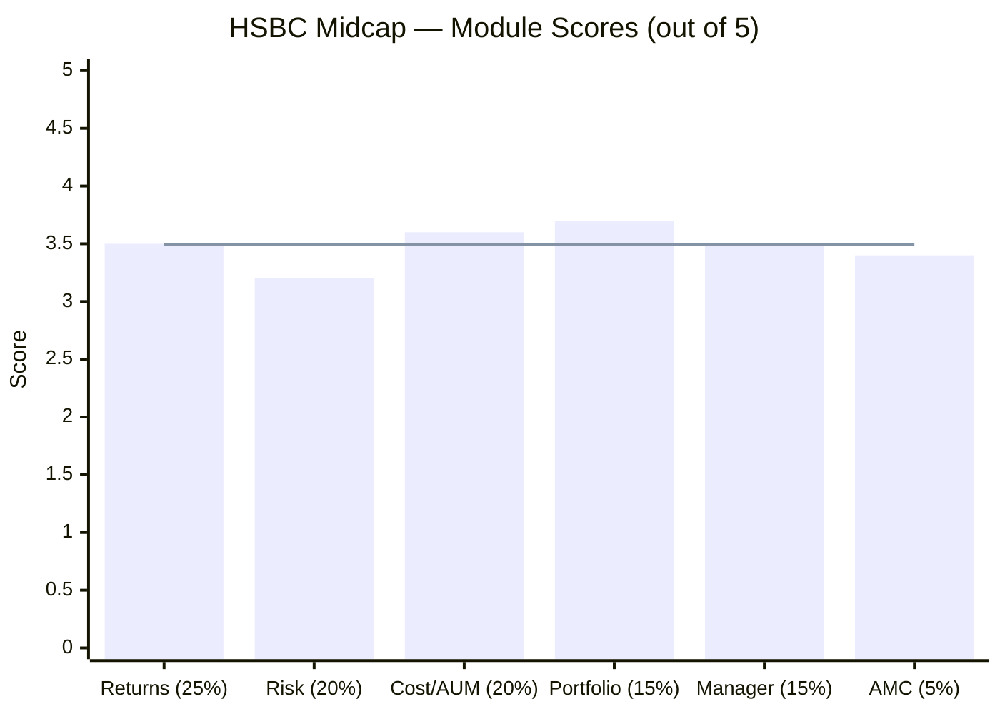
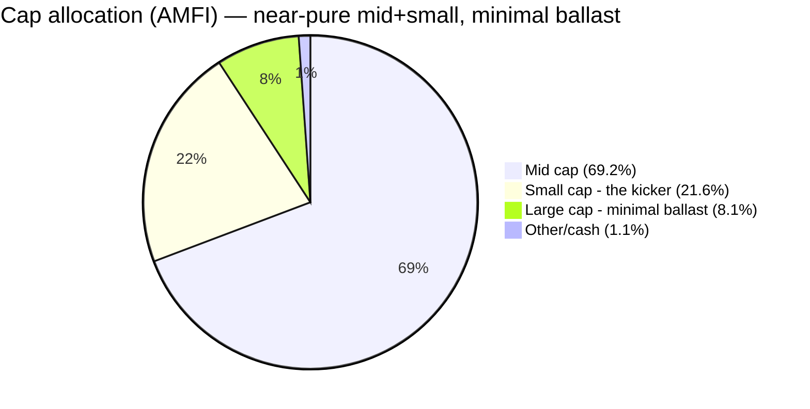
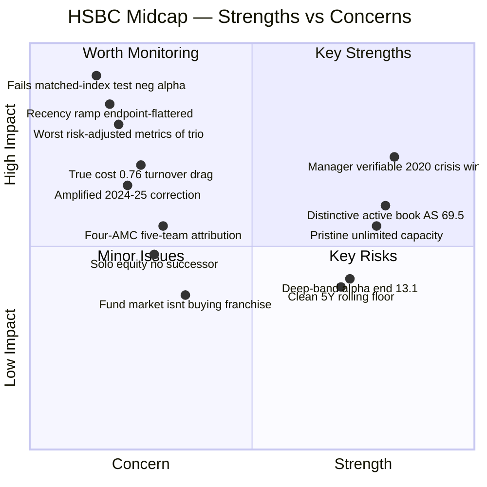
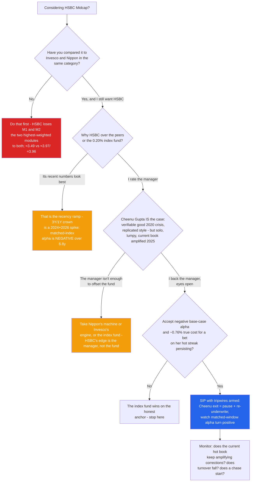
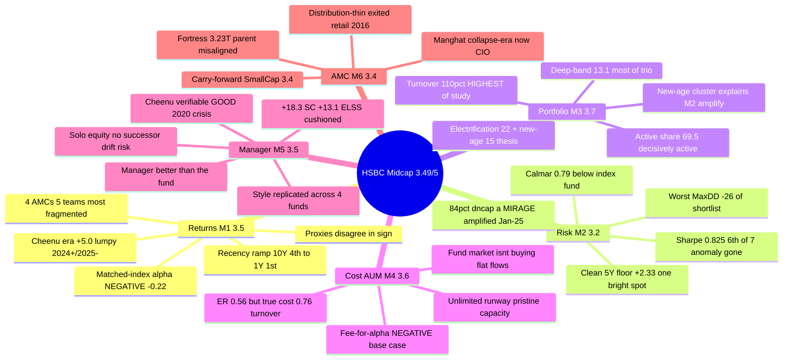

# HSBC Midcap Fund — Deep Study

## Fund Identity

| Field | Value |
|-------|-------|
| **Full Name** | HSBC Midcap Fund — Direct Plan — Growth (the surviving scheme is the former **L&T Midcap**, itself the former **DBS Cholamandalam Midcap**) |
| **Lineage** | DBS Chola Midcap (2004/06) → L&T Midcap (2010) → **HSBC Midcap (merger effective 26-Nov-2022)** — four AMCs, one continuous NAV |
| **AMC** | HSBC Asset Management (India) Pvt Ltd — 100% HSBC Holdings plc ($3.23T assets); bought L&T MF for $425M (2022); AUM ₹1,36,788 Cr (~16th) |
| **Computable record** | Regular NAV from 03-Apr-2006 (Chola, spliced); Direct plan from 02-Jan-2013 (as L&T) |
| **SEBI Category / Risk** | Equity — Mid Cap (min 65% in ranks 101–250) / Very High |
| **Benchmark** | **Nifty Midcap 150 TRI** (same index the two proxies track — no BSE mismatch) |
| **Fund Manager** | **Cheenu Gupta (CFA) — since 26-Nov-2022 (3.6y), effectively SOLO equity** (Chaturvedi co-manager Oct-2025 = foreign-securities-only overlay) |
| **AUM** | **₹14,249 Cr** (Jul-2026) — sweet spot; flat/negative flows ("the fund the market isn't buying") |
| **Expense Ratio** | **~0.56% Direct** (TT) — but ~110% turnover adds ~0.2%/yr → **true all-in cost ~0.76%** |
| **NAV (03-Jul-2026, Direct)** | ₹517.82 — 2.3% off ATH |
| **Exit Load** | 1% / 365 days (standard, no carve-out) |
| **Turnover** | **~100–120%** (Yahoo 102.59%, AdvisorKhoj 1.21×) — **highest in the study** (official factsheet 403-blocked) |
| **VRO Rating** | ⭐⭐⭐⭐ (4/5) |
| **Stated Style** | Growth, "powered by potential, driven by growth"; actively-traded, thematic (electrification + new-age) |
| **Data** | MFAPI Direct 119807 (L&T) spliced to 151036 (HSBC), Regular 112496 + Chola 102578 · index counterfactuals 147622 & 114456 · Cheenu's Canara Robeco funds 146130/118285 · TT holdings API (77 positions) · Wayback Groww AUM/ER series · AdvisorKhoj factsheet |

---

## The One-Line Context

HSBC Midcap is the **recency ramp** of the shortlist — the mirror image of Nippon's endurance staircase. It ranks 4th of 6 on 10Y and 4th of 7 on 5Y, but 1st on 3Y and 1st on 1Y, because essentially all of its measurable outperformance is a **2024 + 2026 spike**. The screening flagged it as the study's loudest anomaly (Sharpe 0.848, best-in-universe 1Y), and the deep study is the systematic dismantling of that anomaly: the Sharpe collapses to 0.825 (6th of 7) under the honest 5Y method; over the full life of the buyable Nifty Midcap 150 index fund the fund delivered **NEGATIVE net alpha (−0.22%/yr)** — the first shortlisted fund to fail the "why not the index?" test on the matched window; the flattering 84% down-capture is a mirage (it amplified the two months that mattered, Jan-2025 −13.6% vs index −6.1%); and the ~110% turnover — the study's highest — pushes the true cost to ~0.76%, erasing the headline-ER advantage. Its record spans **four AMCs and five teams** — the most fragmented attribution in the repo. What rescues it from the low-3s is genuine: a distinctive, actively-traded electrification/new-age portfolio (M3), a manager who is **better than the fund's numbers** — Cheenu Gupta has a verifiable *good* COVID crisis record (M5) the fund's weak legacy predates her — and, uniquely, **pristine, unlimited capacity** precisely because the market isn't buying it. **Final: ≈3.49/5 — a clear #3 of the three midcaps studied, well behind the Invesco (3.97) / Nippon (3.96) dead-heat.**

---

## Module Status

| Module | Weight | Status | Score | File |
|--------|--------|--------|-------|------|
| 1 — Returns Consistency | 25% | ✅ Complete | ~3.5/5 | [module1_returns.md](module1_returns.md) |
| 2 — Risk Profile | 20% | ✅ Complete | ~3.2/5 | [module2_risk.md](module2_risk.md) |
| 3 — Portfolio DNA | 15% | ✅ Complete | ~3.7/5 | [module3_portfolio.md](module3_portfolio.md) |
| 4 — Cost & AUM Impact | 20% | ✅ Complete | ~3.6/5 | [module4_cost.md](module4_cost.md) |
| 5 — Fund Manager Quality | 15% | ✅ Complete | ~3.5/5 | [module5_manager.md](module5_manager.md) |
| 6 — AMC Trustworthiness | 5% | ✅ Complete | ~3.4/5 | [module6_amc.md](module6_amc.md) |

---

## Final Scorecard

| Module | Score | Weight | Weighted |
|--------|-------|--------|----------|
| 1 — Returns Consistency | ~3.5 | 25% | 0.875 |
| 2 — Risk Profile | ~3.2 | 20% | 0.640 |
| 4 — Cost & AUM Impact | ~3.6 | 20% | 0.720 |
| 3 — Portfolio DNA | ~3.7 | 15% | 0.555 |
| 5 — Fund Manager Quality | ~3.5 | 15% | 0.525 |
| 6 — AMC Trustworthiness | ~3.4 | 5% | 0.170 |
| **Overall** | | **100%** | **≈ 3.49 / 5** |

> **The structural story in one line:** HSBC's scores are the flattest of the trio — nothing above 3.7, nothing below 3.2 — a genuinely middling fund whose *outcome* modules (returns 3.5, risk 3.2) are dragged by a departed-legacy record and a hot current book, while its *character* modules (portfolio 3.7, manager 3.5, cost/capacity 3.6) hold up better than the headline suggests. It is neither the offense build (Invesco) nor the defense build (Nippon) — it is the third, weaker option.

---

## ⭐ Why HSBC Is #3, Not a Contender *(the section the decision tree will read first)*

| Module | **HSBC** | Nippon | Invesco | HSBC's standing |
|--------|---------:|-------:|--------:|-----------------|
| M1 Returns (25%) | **3.5** | 4.2 | 4.3 | last — recency ramp, negative matched-index alpha |
| M2 Risk (20%) | **3.2** | 4.4 | 4.1 | last — worst pain-adjusted metrics, Calmar below index fund |
| M3 Portfolio (15%) | **3.7** | 4.1 | 4.0 | last — but genuinely active; docked for ~110% turnover |
| M4 Cost & AUM (20%) | **3.6** | 3.6 | 4.2 | ties Nippon — best capacity, worst fee-for-alpha |
| M5 Manager (15%) | **3.5** | 3.5 | 3.4 | **ties/edges — the relative bright spot** |
| M6 AMC (5%) | **3.4** | 3.4 | 2.4 | ties Nippon; above Invesco |
| **Weighted** | **≈3.49** | **≈3.96** | **≈3.97** | **clear #3** |

Unlike the Invesco–Nippon dead heat (which the scoreboard genuinely can't break), **HSBC's #3 is unambiguous** — it loses M1 and M2, the two highest-weighted modules, decisively. Its two competitive modules are M4 (capacity, tied) and M5 (manager, its relative strength). The honest read: **HSBC is the fund you'd study to understand what a mediocre-but-not-bad midcap fund looks like** — no fatal flaw, no compelling edge, a recency-flattered record over a decent-but-lumpy manager. On the single-slot midcap decision (all three are R² ~91% correlated), HSBC is dominated by both peers on the axes that matter most.

---

## Key Performance Metrics

| Metric | Value | Context |
|--------|-------|---------|
| **10Y CAGR** | **18.47%** | 4th of 6 (Invesco 20.34, Nippon 19.33) |
| **5Y CAGR** | **20.45%** | 4th of 7 |
| **3Y CAGR** | **27.64%** | **#1 of 7** — the recency-ramp peak |
| **1Y** | **17.51%** | **best in universe** — the 2026 hot streak |
| **20.2Y CAGR (spliced)** | **15.37%** | The honest long-run anchor, GFC included |
| **Alpha vs investable index** | **−0.22%/yr × 6.8y** (index fund) ❌ / +4.05%/yr × 13.5y (ETF, all pre-2019) | **Fails the matched-window test**; proxies disagree in sign |
| **Cheenu-era alpha** | **+4.99%/yr × 3.6y** | Real but lumpy (2024+/2025−) |
| **Up / Down capture** | 92%/85% (6.8y); **99%/84% (5Y — flattered)**; ⚠ 121%/91% (Jan-24+) | The 84% dncap is a mirage (see Lens 2) |
| **Sharpe / Sortino / Calmar (5Y)** | 0.825 / 1.398 / **0.79** | 6th / 5th / **7th (below the index fund)** |
| Max drawdown (5Y / modern / tail) | **−26.0%** (worst of shortlist) / −39.8% / −70.6% (2008, Chola) | 2024–25 recovery **~16mo — slowest of trio** |
| **Rolling 5Y windows negative** | **0.0% — floor +2.33%/yr** | Its single best risk feature |
| **Worst calendar year (direct era)** | −11.2% (2018) | 2 negative years |
| **10Y SIP (₹20K/mo)** | **₹24.2L → ₹66.9L, 19.42% XIRR** | Weakest of the trio; +1pt over index ETF |
| **Active share** | **69.5%** vs index | Decisively active (Nippon 54.1, Invesco 79.5) |
| Holdings / Top-10 | **77 / 39.7%** | Conviction core (11 ≥3%) + 28-name sub-0.5% tail |
| **AUM / flows** | ₹14,249 Cr; **flat/negative net flows** | Sweet spot + unlimited runway (nobody's buying) |
| Fee premium vs index → alpha | ~0.36–0.45% headline / ~0.55% true → **−0.22%/yr** | **Negative base case — first since Franklin** |
| Manager | **Cheenu Gupta, 3.6y, solo equity, 5 schemes** | Verifiable good 2020 crisis (+18.3/+13.1); style replicated ×4 |

---

## ⚠️ The Five Critical Lenses — Read Before the Numbers

### Lens 1 — The Recency Ramp
Every headline number is measured immediately after a 2024 + 2026 spike. The fund's rank *improves as the window shortens* — 10Y 4th → 5Y 4th → 3Y 1st → 1Y 1st — the exact opposite of Nippon's endurance staircase. The screening Sharpe of 0.848 is a ~3Y artifact that collapses to 0.825 (6th of 7) and keeps falling (0.740) as the window rolls into 2026 volatility. The trailing crown is a photograph of two good years, not a process.

### Lens 2 — It Fails the "Why Not the Index Fund?" Test
Over the full 6.8-year life of the buyable Nifty Midcap 150 index fund, HSBC delivered **−0.22%/yr net alpha** — you'd have done better in the passive. The two index proxies **disagree in sign** (+4.05 over 13.5y vs −0.22 over 6.8y), which localises *all* the fund's lifetime alpha to the pre-2019 Lahiri era. The flattering 84% 5Y down-capture is a mirage: month-by-month, the fund cushioned seven small dips but **amplified the two that mattered** (Jan-2025 −13.6% vs index −6.1%, 2.2×) — exactly the wrong shape for a SIP investor. On Calmar (0.79) it is the only active fund that loses to the index fund.

### Lens 3 — Four AMCs, Five Teams
The record spans DBS Chola → L&T/Lahiri → L&T/Naik-Manghat → HSBC/Cheenu Gupta — **the most fragmented attribution in the repo**, worse than Invesco's (Invesco stayed one legal entity; HSBC passed through three genuinely different AMCs). The celebrated 2018–19 winter defence is Lahiri's (departed); the 2020–22 stretch was a genuine collapse (−15 alpha in 2021, the worst single-year lag in the repo); the current numbers are Cheenu Gupta's lumpy 3.6-year run. The fund you'd buy today is entirely her construction.

### Lens 4 — The Manager Is Better Than the Fund (the inversion)
Where Invesco's M5 dragged a strong fund, HSBC's is a *bright spot* on a mediocre one — because the weak M1/M2 record is departed-legacy, not Cheenu. She has the one thing Khemani lacks: a **verifiable, good crisis record** (Canara Robeco 2020, +18.3 alpha in small-cap and +13.1 in multicap, cushioning both crashes, vs Khemani's verifiable 2020 loss of −6.3). Her style replicates across four HSBC funds. **The tension:** her tested-good 2020 style *protected* in a crash, but her current new-age, ~110%-turnover book *amplified* the 2024–25 correction — proven manager, possibly-drifted book. She is structurally solo (Chaturvedi is foreign-only) with no named equity successor.

### Lens 5 — The True Cost Is Hidden, and the Fund the Market Isn't Buying
The headline 0.56% ER looks cheap, but the study's highest turnover (~110%) adds ~0.2%/yr of invisible impact/tax drag → **true all-in cost ~0.76%**, near the pricey ICICI/Sundaram end. Yet the fund has **flat-to-negative net flows** despite good performance — HSBC exited Indian retail banking in 2016 and lacks the distribution to push a fund the market isn't demanding. Double-edged: **pristine, unlimited capacity** (M4's genuine strength — no bloat, no hot-money) alongside a **franchise-under-commitment** signal (a drifting rather than championed fund).

---

## Portfolio DNA (Snapshot)

| Metric | Value | Significance |
|--------|-------|--------------|
| Holdings | **77** | Above the 40–70 sweet spot; conviction core (11 ≥3%) + 28-name sub-0.5% tail |
| Top-10 | **39.7%** | Moderate — between Nippon (23.1%) and Invesco (46.7%) |
| Largest position | **GE Vernova T&D 4.71%** | The electrification thesis anchor (not a financials name) |
| Signature thesis | **Electrification/capex ~22%** (GE Vernova, Hitachi Energy, BHEL, Thermax) + **new-age ~15%** (Nykaa, Lenskart, PB Fintech, Groww) | Distinct from Nippon (none) and Invesco (financials) |
| Cap split (AMFI) | **Mid 69.24 / Small 21.57 / Large 8.07** | Most honestly-mid of trio; least large-cap ballast (aggressive) |
| Band positioning | 43.2 / 15.2 / **13.1** (top/mid/bottom of index) | **Deepest deep-band play of the trio** — takes the alpha end both peers abandon |
| BSE (the momentum darling) | 4.39% (index 4.21%) = **+0.18 ≈ neutral** | Neither Invesco's embrace nor Nippon's avoidance |
| Turnover | **~110%** | Highest in the study — 7× Nippon, 4× Invesco |
| Active share | **69.5%** vs index; 75.5% vs Nippon; 85.8% vs Invesco | Decisively active; most differentiated from Invesco |
| Cash | ~1.1% (always ~99% invested) | No buffer, by policy |
| Overlap vs PP / DSP sleeves | 1.6% / 5.9% | Return-enhancer, not diversifier (R² 91% both peers) |

---

## Strengths vs Concerns

---

## Key Strengths

- **⭐ A genuinely decent, verifiable manager** — Cheenu Gupta's 2020 COVID crisis record is a clear *win* (+18.3 alpha small-cap, +13.1 multicap, cushioned both crashes), replicated across four HSBC funds; the fund's weak record is legacy she inherited, not hers
- **⭐ A distinctive, decisively-active portfolio** — 69.5% active share, a ~22% electrification/capex thesis no peer carries, the deepest deep-band participation of the trio (13.1%); genuinely earns its active label
- **⭐ Pristine, unlimited capacity** — sweet-spot ₹14,249 Cr with flat flows means zero deployment strain and effectively unlimited runway — the best capacity position of the trio, better than Invesco
- **Clean 5Y rolling floor** — no losing 5-year window, floor +2.33%/yr (its single best risk feature)
- **Most honestly-mid cap posture** — AMFI 69.24% mid, above the floor with room (more honest than Invesco's 64.61%)
- **Fortress AMC parent** — $3.23T HSBC Holdings; zero financial-stress risk; ties Nippon at M6 3.4, well above Invesco's 2.4
- 2026 recovery leadership (+13.3% YTD, +10.3 alpha) — the current book leads rebounds

## Key Concerns

- **⭐ Fails the matched-index test** — −0.22%/yr net alpha over the buyable index fund's full life; the fee premium buys negative base-case value (−₹2.4L vs index on a 10Y SIP); first since Franklin
- **⭐ The recency ramp** — the entire trailing crown is a 2024+2026 spike; ranks improve as the window shortens; the Sharpe anomaly is a window artifact (0.825, 6th of 7, and falling)
- **⭐ Worst risk-adjusted metrics of the trio** — 5Y Sharpe 6th of 7, Sortino 5th, Calmar 7th (below the index fund), worst max drawdown (−26.0%), amplified the last correction (Jan-2025 2.2× the index)
- **⭐ Hidden true cost ~0.76%** — the ~110% turnover (study's highest) adds ~0.2%/yr of drag, erasing the cheap headline ER; leaves the low-cost cluster
- **Four-AMC / five-team attribution** — the most fragmented record in the repo; the winter medal is departed-Lahiri's, and a genuine 2020–22 collapse sits in the middle
- **The current book amplified 2025** — the new-age cohort (Nykaa/Lenskart/PB Fintech/Groww) is why Jan-2025 fell 2.2× the index; the tested-good 2020 protectiveness didn't transfer
- **Structurally solo equity, no successor** — Cheenu is a poachable SVP; the fund's history says its character breaks on manager change
- **The fund the market isn't buying** — flat flows signal a franchise HSBC isn't championing (double-edged: great for capacity, a commitment warning)
- **Zero diversification** — R² 91% vs both Nippon and Invesco; a single-slot return-enhancer that adds no hedge

---

## Comparison vs Studied Funds (All Four Categories)

| Dimension | **HSBC (MidCap, ≈3.49)** | Nippon (MidCap, ≈3.96) | Invesco (MidCap, ≈3.97) | DSP Small Cap (4.00) | Franklin US (≈3.14) |
|-----------|--------------------------|------------------------|-------------------------|----------------------|---------------------|
| 10Y CAGR | 18.47% (4th) | 19.33% | **20.43%** ⭐ | ~19.3% | 17.8% |
| Window profile | **Recency ramp** | Endurance staircase | Dual-horizon | — | — |
| Alpha vs own index | **−0.22%/yr matched** ❌ | +2.1%/yr (stable) ✅ | +5.1%/yr (episodic) ✅ | positive ✅ | negative ❌ |
| Risk-adjusted (5Y Sharpe) | 0.825 (6th) | **0.912** ⭐ | 0.879 | ~0.7–0.8 | ~0.5 |
| True cost (turnover-adj) | **~0.76%** ⚠ | ~0.64% | ~0.63% | ~0.7% | ~1.35% |
| Capacity | **unlimited (flat flows)** ⭐ | the clock (months) | runway to ~2029 | gated ⭐ | unconstrained |
| Manager | **decent, crisis-tested, solo** | machine, proven | solo star, unverified crisis | 14y craftsman ⭐ | 19y, lagging |
| AMC | 3.4 (fortress, misaligned) | 3.4 (scarred fortress) | 2.4 (churn) | 4.3 ⭐ | 2.8 |
| Diversification value | ~None (R² 91%) | ~None | ~None | is the satellite | Elite (R² 11%) ⭐ |

> **Cross-study insight:** HSBC is the midcap trio's **third option, and a genuinely weaker one** — it neither wins the offense case (Invesco's returns/alpha) nor the defense case (Nippon's risk discipline). Its distinctive contributions are a good crisis-tested manager on a fund whose record she didn't create, and the cleanest capacity position of the three (by circumstance, not virtue). In the four-study frame it sits with the mid-3s cluster (Franklin ≈3.14, HSBC SmallCap 3.37, HSBC Midcap ≈3.49) — competent, unremarkable, dominated by better funds in its own category.

---

## ₹20K/Month SIP Projections (10 Years)

| Scenario | CAGR assumption | Projected corpus | Multiple |
|----------|----------------|------------------|----------|
| Bear (alpha stays negative, grind) | 10% | ₹40.3L | 1.68× |
| Conservative (band return, no alpha) | 13% | ₹47.3L | 1.97× |
| **Base (20-year anchor ≈ band, ~flat alpha)** | **15%** | **₹52.6L** | **2.19×** |
| Optimistic (Cheenu-era alpha persists at half) | 18% | ₹60.8L | 2.53× |

**Total invested: ₹24,00,000** | **Realized trailing 10Y SIP (actual history): ₹24.2L → ₹66.9L at 19.42% XIRR** — the weakest realized SIP of the trio, and only ~1pt above a 10Y SIP in the plain index ETF (18.42%). The honest anchor is the 20-year spliced record (15.37%); the matched-window evidence says the base case *ties or trails* the index fund, so treat any alpha above the band as a bet on Cheenu Gupta's hot streak persisting.

---

## Investment Decision Framework

---

## HSBC Midcap — In One View

---

## The Critical Facts — In 10 Sentences

1. HSBC Midcap scores **≈3.49/5 — a clear #3 of the three midcaps studied**, well behind the Invesco (3.97) / Nippon (3.96) dead-heat, losing the two highest-weighted modules (returns, risk) to both.
2. It is the **recency ramp**: 4th of 6 on 10Y and 4th of 7 on 5Y, but 1st on 3Y and 1st on 1Y — its rank improves as the window shortens, the mirror of Nippon's endurance staircase.
3. The screening's Sharpe-0.848 anomaly is a window artifact — under the honest 5Y method it is 0.825 (6th of 7) and *falling* (0.740) as the window rolls into 2026 volatility.
4. Over the full 6.8-year life of the buyable Nifty Midcap 150 index fund it delivered **NEGATIVE net alpha (−0.22%/yr)** — the first shortlisted fund to fail the "why not the index?" test on the matched window; the two index proxies disagree in sign (all lifetime alpha is pre-2019).
5. Its flattering 84% down-capture is a **mirage** — month-by-month it cushioned small dips but amplified the two that mattered (Jan-2025 −13.6% vs index −6.1%, 2.2×); on Calmar (0.79) it is the only active fund that loses to the index fund.
6. The record spans **four AMCs and five teams** (Chola → L&T/Lahiri → L&T/Naik-Manghat → HSBC/Cheenu) — the most fragmented attribution in the repo; the winter medal is departed-Lahiri's and a genuine 2020–22 collapse sits in the middle.
7. The portfolio is genuinely distinctive — 69.5% active share, a ~22% electrification/capex thesis, the deepest deep-band participation of the trio — but carries the **study's highest turnover (~110%)**, which pushes the true all-in cost to ~0.76% and erases the cheap headline ER.
8. Manager Cheenu Gupta is the fund's **relative bright spot and better than its numbers**: a verifiable *good* 2020 COVID crisis record (+18.3 alpha small-cap, +13.1 multicap, cushioned both crashes) that the fund's weak legacy predates — but she is structurally solo with no successor, and her current hot book amplified the 2024–25 correction her tested style would have cushioned.
9. It has the **best capacity position of the trio** — flat/negative flows and sweet-spot AUM give effectively unlimited runway — precisely because "the market isn't buying it" (HSBC exited Indian retail banking in 2016 and can't distribute a fund the market doesn't demand).
10. For this portfolio it is a **single-slot return-enhancer** (R² 91% vs both peers) that is dominated by both on the axes that matter: the honest verdict is *competent but unremarkable, chosen only if you rate the manager above the fund and accept a negative-base-case bet on her hot streak.*

---

## Quick Verdict

**Best suited for:**
- Investors who **rate Cheenu Gupta specifically** — her verifiable crisis record and replicated style are real, and this is the cleanest way to own her — and who accept they're betting on the manager, not the fund
- Those who prize **capacity certainty** — the one dimension where HSBC beats both peers (unlimited runway, no hot-money risk)
- Investors who want a **distinctive thematic tilt** (electrification + new-age) that neither peer offers

**Not suited for:**
- **Anyone choosing on merit within the category** — HSBC loses the two heaviest modules to both Invesco and Nippon; the honest recommendation is one of them, or the index fund
- **Anyone who takes the "why not the index?" test seriously** — the matched-window alpha is negative and the true cost is ~0.76%; the passive won on the honest anchor
- **Cost-sensitive investors** — the ~110% turnover makes the cheap-looking ER a ~0.76% true cost, near the category's pricey end
- Those needing **downside cushion or diversification** — worst drawdowns of the trio, an amplified last correction, and R² 91% to both peers (zero hedge)

---

## One-Line Verdict

> **HSBC Midcap is the recency ramp — a fund whose entire trailing crown is a 2024+2026 spike sitting on a record that fails the matched-index test (−0.22%/yr net alpha over the buyable index fund's full life), carries the trio's worst risk-adjusted metrics (Sharpe 6th of 7, Calmar below the index fund, the deepest drawdown), hides a ~0.76% true cost behind a cheap headline ER (the study's highest turnover), and spans four AMCs and five teams — the most fragmented attribution in the repo. What keeps it out of the low-3s is genuine: a distinctive, decisively-active electrification/new-age portfolio, the best (and unlimited) capacity position of the trio precisely because the market isn't buying it, and a manager — Cheenu Gupta — who is verifiably better than the fund, with a good 2020 crisis record the fund's weak legacy predates, even as her current hot book amplified the last correction. A clear #3 behind the Invesco/Nippon dead-heat: competent, unremarkable, and — on the single-slot midcap decision — dominated by both peers on the axes that matter. Choose it only if you rate the manager above the fund. Final: ≈3.49/5.**

---

*Study completed: July 5, 2026 | Framework: 6-Module Weighted Scoring (Mid Cap adaptation) | Final Score: ≈3.49/5 | Third of 7 shortlisted midcap funds studied — a clear #3 behind the Invesco (≈3.97) / Nippon (≈3.96) dead-heat | Benchmark = Nifty Midcap 150 TRI; index counterfactuals = Motilal M150 Index Fund (147622) + M100 ETF (114456) | Lineage: DBS Chola → L&T Midcap → HSBC Midcap (merger 26-Nov-2022) | Data: MFAPI (Direct 119807→151036 spliced, Regular 112496 + Chola 102578), Cheenu's Canara Robeco funds (146130/118285), TT holdings API (77 positions, M_LTIU), Wayback-archived Groww AUM/ER series, AdvisorKhoj factsheet, HSBC one-pagers | Manager eras: Lahiri 2013–Dec-2019 (winter medal), Naik/Manghat Dec-2019–Nov-2022 (the collapse), Cheenu Gupta Nov-2022– (+5.0/yr, lumpy, solo equity) | Tripwires: Cheenu exit (= pause + re-underwrite vs index fund), whether the current hot book keeps amplifying corrections, turnover staying ~110%, matched-window alpha turning positive, a recency-ramp flow chase starting | Study order: Nippon → Invesco → HSBC → Edelweiss → Mahindra Manulife → ICICI Pru → Sundaram | Next: Edelweiss Mid Cap (study #4)*
