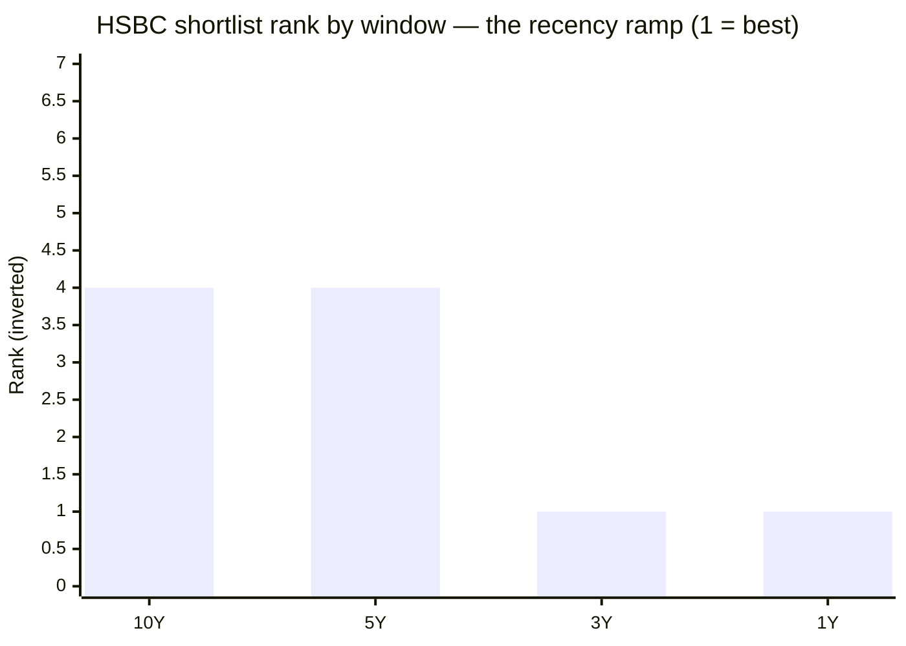
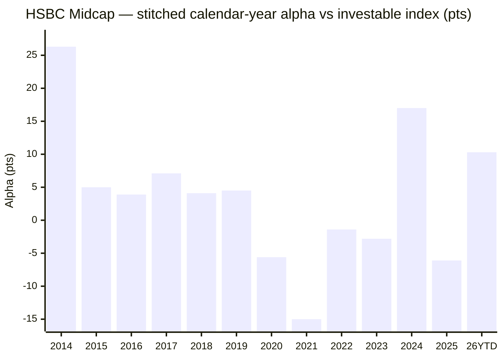

# Module 1: Returns Consistency — HSBC Midcap Fund

## Module 1 Score: ~3.5 / 5 (provisional)

---

## Fund Identity

| Field | Value |
|-------|-------|
| **Full Name** | HSBC Midcap Fund — Direct Plan — Growth (the surviving scheme is the former **L&T Midcap Fund**, itself the former **DBS Cholamandalam Midcap** — see Lineage) |
| **Lineage** | **DBS Cholamandalam Midcap (2004/06) → L&T Midcap (L&T bought Chola/DBS AMC, 2010) → HSBC Midcap (HSBC bought L&T MF, merger effective 26-Nov-2022)** — four AMCs, one continuous NAV |
| **Computable record** | Regular NAV from **03-Apr-2006** (Chola) via splice; Direct plan from **02-Jan-2013** (as L&T) |
| **SEBI Category** | Equity — Mid Cap (min 65% in ranks 101–250) |
| **Benchmark** | **Nifty Midcap 150 TRI** (the same index our two proxies track — no BSE/Nifty mismatch, unlike Invesco) |
| **AUM** | **₹14,249 Cr** — top of the study's ₹3,000–25,000 Cr sweet spot *(Tickertape Jul-2026; official factsheet reconciliation → Module 4)* |
| **Expense Ratio** | **0.56%** Direct *(Tickertape Jul-2026; → Module 4 for factsheet reconciliation)* |
| **NAV (03-Jul-2026)** | ₹517.82 (Direct); Regular ₹453.55 |
| **Current Managers** | **Cheenu Gupta since 26-Nov-2022** (the merger date); **Mayank Chaturvedi co-manager since 01-Oct-2025** — the current strong record is Cheenu Gupta's 3.6-year run |
| **Prior Managers** | S.N. Lahiri (Jun-2013 → Dec-2019); Vihang Naik + Venugopal Manghat (17-Dec-2019 → Nov-2022) |
| **VRO Rating** | ⭐⭐⭐⭐ (4/5) |
| **Riskometer** | Very High |
| **Exit Load** | 1% / 365 days (standard) |
| **Min SIP** | ₹500 (monthly) |

---

## Raw Data (MFAPI computed + Tickertape screening, as of 01/03-Jul-2026)

| Metric | Value |
|--------|-------|
| 1Y absolute | **17.51%** — best in the entire screening universe |
| 3Y CAGR | **27.64%** — #1 of the shortlist |
| 5Y CAGR | 20.45% — 4th of 7 |
| 10Y CAGR | 18.47% — 4th of 6 with 10Y data |
| Since Direct inception (13.5y) | 20.26% |
| Regular since 2010 (16.4y) | 16.83% |
| Spliced Chola+L&T+HSBC (20.2y) | **15.37%** — the honest two-decade midcap anchor, GFC included |
| Mean rolling 3Y (direct era) | 20.07% |
| Sharpe (Tickertape) | **0.848** — ~3× the shortlist norm (the screening anomaly) |
| Alpha (Tickertape, vs benchmark) | +5.81 |
| Max drawdown (direct era) | −39.8% (Jan-2018 winter → COVID trough, no recovery between) |
| 10Y SIP XIRR (₹20K/mo) | **19.42%** — the weakest of the three studied midcaps |
| Portfolio PE | 39.5 (category 33.8) |
| Std deviation (ann.) | 16.2% (category 15.3%) |
| Small-cap allocation | 21.0% (a small-cap kicker in the flexible sleeve) |

**Data sources:** MFAPI Direct **119807** (L&T, 02-Jan-2013 → 24-Nov-2022, 2,435 NAVs) spliced to **151036** (HSBC, 28-Nov-2022 →, 885 NAVs); Regular **112496** (16-Feb-2010 →) and **102578** (DBS Chola Cumulative, 03-Apr-2006 → 15-Feb-2010, splice ratio 1.0074); absorbed **149154** (the separate pre-merger HSBC Mid Cap Fund, 29-Sep-2021 → 25-Nov-2022); index counterfactuals **147622** (Motilal Nifty Midcap 150 Index Fund Direct, 11-Sep-2019 →) and **114456** (Motilal Nifty Midcap 100 ETF, Feb-2011 →). All headline metrics computed from raw NAVs. Manager history verified from ValueResearch, L&T addenda, and HSBC AMC.

---

## Cross-Source Verification

Recomputing MFAPI CAGRs to the **01-Jul-2026** NAV (₹525.38 Direct) reproduces the Tickertape screening export to the decimal:

| Metric | MFAPI (computed, 01-Jul) | Tickertape (Jul-2026 export) | Verdict |
|--------|--------------------------|------------------------------|---------|
| 1Y | **17.51%** | 17.50% | ✅ match |
| 3Y | **27.64%** | 27.68% | ✅ match |
| 5Y | **20.45%** | 20.44% | ✅ exact |
| 10Y | **18.47%** | 18.47% | ✅ exact |
| AUM | — | ₹14,249 Cr | Noted |
| Sharpe | — | 0.848 | Noted (Module 2 recompute) |

The L&T→HSBC NAV splice is continuous (L&T Direct last 229.30 on 24-Nov-2022 → HSBC Direct 231.80 on 28-Nov-2022; the 2-day gap is the merger mechanics, not a discontinuity). As of 03-Jul-2026 the fresh numbers are: 1Y 15.63%, 3Y 26.94%, 5Y 19.96%, 10Y 18.29% — the small differences vs the table above are purely the two extra days off a hot 2026.

---

## The One-Line Context

HSBC Midcap is the mirror image of Nippon's "endurance staircase": a **recency ramp**. It ranks **4th of 6 on 10Y and 4th of 7 on 5Y, but 1st on 3Y and 1st on 1Y** — because essentially all of its measurable outperformance is a **2024 + 2026 spike under a 3.6-year-tenured manager (Cheenu Gupta)**. The decisive computed finding: over the full 6.8-year life of the *investable* Nifty Midcap 150 index fund, HSBC has delivered slightly **NEGATIVE net alpha (−0.22%/yr)** — the **first mid-cap fund studied to wash out on the matched-methodology "why not the index fund?" window**. The screening's Sharpe-0.848 / best-1Y "anomaly" is a hot streak, not a durable style, and the record spans **four AMCs and five management teams** — the most fragmented attribution in the entire repo.

---

## The Lineage — Four AMCs, Five Teams, One NAV

The screening note flagged "HSBC Midcap = former L&T Midcap." The reality is deeper: the surviving legal scheme is **four generations old**, and the 2008 GFC in its NAV belongs to a house (Cholamandalab) that no longer exists.

| Era | Entity | Team | NAV | Note |
|-----|--------|------|-----|------|
| 2006–2010 | **DBS Cholamandalam Midcap** | Chola team | 102578 | **2008 GFC −70.6% max DD** lives here |
| 2010–2013 | **L&T Midcap** (Regular) | L&T | 112496 | L&T bought Chola/DBS AMC |
| 2013–Dec 2019 | L&T Midcap | **S.N. Lahiri** | 119807 (Direct) | The only true "process" alpha stretch |
| Dec 2019–Nov 2022 | L&T Midcap | **Vihang Naik + Venugopal Manghat** | 119807 | The alpha-collapse era |
| Nov 2022 → | **HSBC Midcap** | **Cheenu Gupta** (+Chaturvedi from Oct-2025) | 151036 | Merger effective 26-Nov-2022 |

**Same "four ownership eras" structure as Invesco (Lotus → Religare → Religare-Invesco → Invesco) — but worse:** Invesco stayed one legal entity through renames; HSBC Midcap's record passed through **three genuinely different AMCs with different teams and processes**. This is the answer to the study plan's central HSBC question ("whose track record is it, L&T's or HSBC's?"): **nobody's, cleanly.**

- **Cheenu Gupta:** CFA, PGDBM; ex-Canara Robeco equity FM (2018–2021, managed TaxSaver/Small Cap/Consumer Trends), ex-Tata AIA (2009–2018); joined HSBC 2022. Her multi-year funds have historically rated 4–5★.

---

## CAGR vs Benchmark and the Window Ladder — ⭐ NEW: Window-Rank Monotonicity

The cleanest read of the fund's character. HSBC's rank among the shortlist at every horizon:

| Window | HSBC | Shortlist rank | vs studied trio |
|--------|------|----------------|-----------------|
| 10Y | 18.47% | **4th of 6** | last of trio (Invesco 20.34, Nippon 19.33) |
| 5Y | 20.45% | **4th of 7** | behind Invesco/Nippon/Edelweiss |
| 3Y | 27.64% | **1st of 7** ⭐ | ahead of Invesco 26.91 |
| 1Y | 17.51% | **1st of 7** ⭐ best in universe | Nippon ~7.2, Invesco ~10.9 |
| 13.5Y (Direct) | 20.26% | — | Lahiri-inflated (2014) |
| 20.2Y (spliced) | **15.37%** | — | GFC-inclusive honest anchor |

**The rank improves monotonically as the window shortens** — the exact opposite of Nippon (rank improves as the window *lengthens* — the "endurance staircase," a durable-process signature) and different from Invesco (which led *both* ends — "dual-horizon"). HSBC is the **recency ramp**: the shorter you look, the better it looks. That single pattern reframes the "Sharpe 0.848 / best-1Y" screening anomaly as *what a hot streak looks like in the trailing numbers*.

---

## Calendar-Year Returns & ⭐ The Era Decomposition

Regular/Chola (italics) for 2007–2012; Direct from 2013. Stitched calendar alpha uses the Midcap-100 ETF proxy 2014–19 and the Nifty Midcap 150 index fund 2020–26.

| Year | Return | Alpha (pts) | Manager era | Verdict |
|------|--------|-------------|-------------|---------|
| *2007* | *+64.6%* | — | Chola | Launch mania |
| *2008* | ***−61.4%*** | — | Chola | GFC (open-ended, live redemptions) |
| *2009* | *+111.3%* | — | Chola | V-recovery |
| *2011* | *−29.4%* | — | L&T | Rate/EU crisis |
| 2014 | **+83.1%** | **+26.3** | **Lahiri** | Best calendar year; earned on a micro base |
| 2015 | +11.7% | +5.0 | Lahiri | Win |
| 2016 | +10.7% | +3.9 | Lahiri | Win |
| 2017 | +53.7% | +7.1 | Lahiri | Full participation + alpha |
| **2018** | **−11.2%** | **+4.1** | Lahiri | Winter pt 1 — beat index |
| **2019** | **+1.0%** | **+4.5** | Lahiri→Naik/Manghat | Winter pt 2 — beat index |
| 2020 | +20.5% | **−5.6** | Naik/Manghat | Lagged the COVID V |
| **2021** | **+31.9%** | **−15.0** ⚠ | Naik/Manghat | **Worst single-year lag of any fund in the repo** |
| 2022 | +2.2% | −1.4 | Naik/Manghat → merger | Lag |
| 2023 | +41.5% | −2.8 | **Cheenu Gupta** | First full year — slight lag |
| **2024** | **+41.2%** | **+17.0** | Cheenu Gupta | Breakout |
| 2025 | −0.3% | −6.1 | Cheenu Gupta | Lagged the bounce |
| **2026 YTD** | **+13.3%** | **+10.3** | Cheenu Gupta | Explosive — index +3.0%; this is the 1Y/Sharpe anomaly |

**Three regimes, three fingerprints — the alpha did NOT persist across them (the Invesco pattern, not Nippon's):**

1. **Lahiri (2013–2019): consistent positive alpha every single year** (+3.9 to +26.3), including the winter defence. The only genuine "process" stretch — and its author left in 2019.
2. **Naik/Manghat (Dec-2019 → Nov-2022): consistent *negative* alpha** — a deep-value book that missed the growth bull. **2021 = −15.0 pts**, the worst single-year lag of any fund studied. A real, un-flattered failure.
3. **Cheenu Gupta (Nov-2022 →): lumpy, offensive** — two boom years (+17.0, +10.3) bracketing two negative-alpha years (−2.8, −6.1). Strong average, two-spike shape.

**Consistency statistics (Direct era):** 2 negative calendar years (2018 −11.2%, 2025 −0.3%); worst −11.2% — vs Invesco's single −3.6% and cleaner than neither peer.

---

## ⭐⭐ The Two-Proxy Index Test — The Proxies Disagree in SIGN

In the Invesco and Nippon modules both index proxies agreed (both positive). **For HSBC they disagree in sign** — and that disagreement is the module's real output.

| Proxy | Window | HSBC | Index | Net alpha/yr |
|-------|--------|------|-------|--------------|
| **A — Nifty Midcap 150 Index Fund** (matched methodology, full life) | 11-Sep-2019 → 03-Jul-2026 (6.8y) | 22.72% | 22.94% | **−0.22%** ❌ |
| **B — Nifty Midcap 100 ETF** | 02-Jan-2013 → 03-Jul-2026 (13.5y) | 20.26% | 16.21% | **+4.05%** ✅ |

**The reconciliation is the whole story: every basis point of HSBC's lifetime alpha was earned before September 2019 — in the Lahiri era, much of it in 2014 on a micro base.** Since the investable index fund has existed (6.8 years, spanning Naik/Manghat + all of Cheenu Gupta), HSBC has essentially *matched-to-slightly-lagged* the thing you could buy for 0.20%.

**This is the first shortlisted fund to FAIL the "why not the index fund?" test on the matched, recent, buyable window.** Invesco was +2.88 on Proxy A; Nippon +1.97; HSBC −0.22.

**The fair counter-nuance:** the −0.22 blends in 3.2 years of the Naik/Manghat collapse, not Cheenu Gupta's fault. Isolating her era:

- **Cheenu Gupta era (28-Nov-2022 → now, 3.6y): +4.99%/yr alpha** (fund 25.06% vs index 20.06%).
- **L&T Direct era (Jan-2013 → Nov-2022) vs ETF: +4.14%/yr** — but front-loaded by 2014.

So the honest two-sided read: the *fund you'd have held over the index fund's whole life* delivered no alpha; the *current manager's own 3.6-year slice* is +5%/yr — real, but short and lumpy (2024 + 2026 only).

**Capture confirms the era shift** (vs the Nifty Midcap 150 index fund):

| Sub-era | Up-capture | Down-capture | Reading |
|---------|-----------|--------------|---------|
| Naik/Manghat (Sep-19 → Nov-22) | **79%** | 86% | Missed the bull |
| Cheenu Gupta (Nov-22 → now) | **106%** | 85% | Offensive with cushion |
| Jan-24 → now | **121%** | 91% | Very offensive; down-capture creeping toward 100 |

The Jan-24 up-121/down-91 profile is the same current-book momentum tilt flagged in Invesco's file.

---

## ⭐ NEW: The Absorbed HSBC Mid Cap Fund — HSBC's Own Native Record Was Poor

HSBC ran a **separate** "HSBC Mid Cap Fund" (scheme 149154) launched 29-Sep-2021, folded into the L&T scheme at the merger. Its short standalone life: **−4.0% vs the index fund's +6.4%** (28-Sep-2021 → 25-Nov-2022). HSBC's only *native* midcap vehicle underperformed the index and was quietly merged away. **The good post-2022 numbers are Cheenu Gupta specifically, not "HSBC AMC's midcap franchise."** No prior module thought to pull an absorbed scheme's record; it directly rebuts the "HSBC skill" reading.

---

## ⭐ The 2018–19 Midcap Winter — A Lahiri Medal, but the Deepest Absolute Hole of the Trio

**Window: Jan-2018 → Aug-2019** (SEBI-reclassification unwind + LTCG + IL&FS).

- **Calendar alpha +4.1 (2018) / +4.5 (2019)** — beat the index both years; cumulative winter **−10.3%** (reproduces the Invesco/Nippon peer tables exactly: 2018 −11.2%, 2019 +1.0%).
- **BUT the absolute drawdown was the worst of the studied trio:** winter peak 08-Jan-2018 → trough 22-Aug-2019 = **−24.2%** (Nippon −21.4%, Invesco −16.1%), and the Jan-2018 peak was **not recovered until 27-Nov-2020 — 34 months underwater** (the winter rolled straight into COVID; combined Jan-2018 → Mar-2020 drawdown −39.8%).

| Fund | 2018 | 2019 | Winter cumulative |
|------|------|------|-------------------|
| Invesco | −3.6% | +5.4% | +1.6% ⭐ |
| Nippon | −10.3% | +7.4% | −3.7% |
| **HSBC (as L&T)** | **−11.2%** | **+1.0%** | **−10.3%** |

Attribution: the relative win is **Lahiri's**, and he departed in 2019 — the same "medal held by a departed manager" caveat as Invesco's Gokhale winter, but here the higher beta made the absolute pain deeper.

---

## ⭐ The 2024–25 Correction — HSBC AMPLIFIED the Fall (Unique Among the Trio)

The universal no-excuses test — and where HSBC breaks from both peers.

| Metric | HSBC | Nifty Midcap 150 fund | Invesco | Nippon |
|--------|------|------------------------|---------|--------|
| Own peak → trough | 17-Dec-2024 → 28-Feb-2025: **−26.0%** | −21.0% | −20.1% | −19.9% |
| On matched index window (24-Sep → 28-Feb) | **−24.0%** ⚠ *worse than index* | −21.0% | −19.1% (better) | — |
| **Recovered peak by** | **20-Apr-2026 — ~16 months** ⚠ | 17-Nov-2025 | 06-Jun-2025 | 20-Oct-2025 |
| 2026 mini-dip | −11.4% (better than index) | −13.9% | −15.6% (worse) | −12.6% |

HSBC **fell harder than the index** and took **~16 months** to recover its peak — the deepest drawdown and slowest recovery of the three studied midcaps. Invesco and Nippon both *cushioned*; HSBC *amplified*. Its high 3Y CAGR is real, but the path through the last true stress test was the roughest of the trio — and only the explosive 2026 rebound (**+13.3% YTD vs index +3.0%**) buried that in the trailing numbers. **The 2026 hot streak is literally what makes the 1Y "best-in-universe" and the Sharpe anomaly.** (Note: the fund did cushion the shallower 2026 mini-dip.)

Also flagged for Module 5: like Invesco, **HSBC topped late** — its own peak (17-Dec-2024) came ~3 months after the index peak (24-Sep-2024), riding momentum into the turn.

---

## Rolling Returns Distribution (Direct era, daily windows)

| Window | n | Mean | Min | Max | % negative | % >20% |
|--------|-----|------|-----|-----|------------|--------|
| Rolling 1Y | 3,081 | 24.54% | −29.27% | +103.36% | 16.9% | 46.2% |
| Rolling 3Y | 2,588 | 20.07% | **−6.58%** | +42.47% | **4.4%** | 54.1% |
| Rolling 5Y | 2,096 | 18.27% | **+2.33%** | +33.42% | **0.0%** | 41.4% |

**Probability of loss by holding period:**

| Hold for | Chance of loss | Worst outcome |
|----------|----------------|---------------|
| 1 year | ~17% | −29.3% |
| 3 years | **~4.4%** | **−6.58%/yr** |
| 5 years | **0%** | +2.33%/yr |

The 5Y floor is clean (0% negative, +2.33% worst) — good and comparable to peers. But the **3Y distribution is the worst of the trio**: 4.4% negative windows and −6.58%/yr worst, vs Invesco's 0.6% / −1.75% and Nippon's 2.7% / −5.6%. By start-era, the damage is localised: 3Y windows starting 2017–2019 averaged just **10.27%** (min −6.58%) — the Naik/Manghat 2020–22 collapse showing through; windows starting 2023+ average 26.51%.

---

## SIP XIRR vs Lumpsum CAGR (₹20,000/month, Direct)

| Window | Invested | Value (03-Jul-2026) | SIP XIRR | Lumpsum CAGR |
|--------|----------|---------------------|----------|--------------|
| 3Y | ₹7.4L | ₹9.9L | 20.42% | 26.94% |
| 5Y | ₹12.2L | ₹21.0L | 22.25% | 19.96% |
| **10Y** | **₹24.2L** | **₹66.9L** | **19.42%** | 18.29% |
| Full Direct era (13.5y) | ₹32.6L | ₹140.9L | 19.87% | 20.26% |
| *10Y SIP in the plain index ETF* | ₹24.2L | ₹63.4L | *18.42%* | — |

**Readings:**
- HSBC's **10Y SIP XIRR (19.42%) is the lowest of the three midcaps** (Invesco 22.30%, Nippon 21.08%) and beats a 10Y SIP in the plain index ETF by only ~1 pt (19.42 vs 18.42) — consistent with the thin/negative matched-window alpha.
- The 5Y SIP (22.25%) is close to peers because the recent booms dominate the instalment stream.
- Standing caveat: every midcap 10Y SIP measured in mid-2026 ends after a golden decade; HSBC's specifically ends right after the 2026 spike.

---

## Absolute Returns — Short-Term Trend

| Period | Return | Context |
|--------|--------|---------|
| 3M | **+22.5%** | Explosive 2026 recovery leg |
| 6M | +12.9% | Consistent with +13.3% YTD |
| 1Y | +17.5% | Best in the universe — the 2026 hot streak |

Short-term momentum is strong — which, for a recency-driven book, is exactly when it looks best (the same caution as Invesco).

---

## Long-Cycle Drawdown Record (context for Module 2)

| Era | Peak → trough | Depth | Time to recover |
|-----|--------------|-------|-----------------|
| 2008 GFC *(Chola)* | Jan-2008 → Mar-2009 | **−70.6%** | ~44 mo — belongs to the Chola team |
| 2011 *(L&T)* | 2010 → 2011 | −29.4% (cal) | — |
| 2013 taper | Jan-2013 → Aug-2013 | −17.8% | 4 months |
| 2015–16 | Aug-2015 → Feb-2016 | −19.9% | 4 months |
| **2018 winter → COVID** | Jan-2018 → Mar-2020 | **−39.8%** | **34 months** (Nov-2020) |
| 2021–22 | Oct-2021 → Jun-2022 | −19.4% | Jun-2023 |
| **2024–25** | Dec-2024 → Feb-2025 | **−26.0%** ⚠ deepest of trio | **~16 months** ⚠ slowest of trio |
| 2026 dip | Feb-2026 → Mar-2026 | −11.4% | 5 weeks |

The −26% / 16-month 2024–25 entry is the one Module 2 must weigh against the flattering Sharpe. **Hypothesis for Module 2: the 0.848 Sharpe is a 3Y-window artifact of the 2024 + 2026 return spikes; Sortino and a drawdown-aware read will look materially worse** — the deepest recent drawdown of the trio cannot coexist with genuine best-in-class risk-adjustment.

---

## Returns vs Peers — All 7 Shortlisted Mid Cap Funds

| Fund | 5Y CAGR | 3Y CAGR | 10Y CAGR |
|------|---------|---------|----------|
| Invesco | **21.91%** ⭐ | 26.91% | **20.34%** ⭐ |
| Nippon | 21.48% | 23.10% | 19.33% |
| Edelweiss | 20.64% | 24.05% | 19.88% |
| **HSBC** | **20.45%** | **27.68%** ⭐ | **18.47%** |
| Mahindra Manulife | 20.17% | 23.67% | — |
| Sundaram | 19.31% | 22.27% | 15.63% |
| ICICI Pru | 19.01% | 24.75% | 17.78% |

HSBC leads **only the 3Y window** (the most endpoint-sensitive) and the 1Y — while sitting 4th on both 5Y and 10Y. That single fact is the recency ramp in one line.

---

## Comparison with Studied Funds (All Four Categories)

| Dimension | **HSBC Midcap** | Invesco (MC) | Nippon (MC) | DSP Small Cap | Franklin US (Intl) |
|-----------|-----------------|--------------|-------------|---------------|--------------------|
| Window profile | **Recency ramp** (10Y 4th → 1Y 1st) | Dual-horizon leader | Endurance staircase | — | — |
| 10Y CAGR | 18.47% (last of trio) | **20.43%** ⭐ | 19.33% | ~19.3% | 17.8% |
| **Matched-index alpha (Proxy A, 6.8y)** | **−0.22%** ❌ | +2.88% ✅ | +1.97% ✅ | positive ✅ | negative ❌ |
| Alpha localization | **all pre-2019 (Lahiri); current mgr +5% but 3.6y & lumpy** | episodic, 3 eras | steady house process | stock-picking | n/a |
| 2024–25 correction | **amplified (−24% vs idx −21%), 16-mo recovery** | cushioned (−19.1%) | cushioned (−19.9%) | — | — |
| Worst rolling 3Y | −6.58% (worst of trio) | −1.75% | −5.6% | higher | — |
| Neg calendar years (direct) | 2 (−11.2, −0.3) | 1 (−3.6) | 2 | 2 | — |
| Manager continuity | ❌❌❌ **5 teams / 4 AMCs; current 3.6y** | ❌❌ current 2.8y, 3 eras | ❌ 3 eras, fingerprint persisted | ✅ 14y | ✅ 19y |

**The one-line synthesis:** HSBC is *Invesco's failure-mode twin*. Both are recency-flattered momentum books run by short-tenured managers. But Invesco cleared the index test on every window, cushioned the last correction, and has the cleaner loss profile. HSBC **fails the matched-index test, amplified the last correction, and carries the most fragmented attribution in the repo** — its screening crown (best Sharpe, best 1Y) is the thinnest of the three.

---

## ⭐ Manager-Era Attribution — Whose Record Is This?

| Era | Manager | Period | What the NAV record shows |
|-----|---------|--------|---------------------------|
| Chola | (DBS Chola team) | 2006 → 2010 | −70.6% GFC drawdown. Pre-history; a defunct AMC |
| The process era | **S.N. Lahiri** | Jun-2013 → Dec-2019 | **Positive alpha every year (+3.9 to +26.3); the winter defence is his.** Left as L&T CIO in ~2020. **None attributable to today's team** |
| The collapse era | **Vihang Naik + Venugopal Manghat** | Dec-2019 → Nov-2022 | Deep-value book that **missed the growth bull: 2020 −5.6, 2021 −15.0, 2022 −1.4 alpha** — the worst multi-year lag in the repo |
| The current era | **Cheenu Gupta (26-Nov-2022) + Mayank Chaturvedi (01-Oct-2025)** | ~3.6 years | **+17.0-alpha 2024 and +10.3 2026 YTD, bracketing −2.8 (2023) and −6.1 (2025); +4.99%/yr vs index but two-spike shaped; amplified the 2024–25 correction** |

**The honest attribution statement:** the 20-year record spans **four AMCs and five teams**; the only consistent-process alpha stretch (Lahiri, 2013–2019) belongs to a departed manager; the intervening team produced a genuine multi-year collapse; the current team's sample is 3.6 years, its outperformance concentrated in exactly two calendar years. **Unlike Nippon, the alpha fingerprint did NOT persist across eras — so the "house process" mitigation is unavailable — and unlike Invesco, the record contains an actual alpha collapse.** This is the most fragmented attribution in the study.

---

## Module 1 Scorecard

| Sub-dimension | Weight | Score | Reasoning |
|---------------|--------|-------|-----------|
| 10Y CAGR | High | **4.0** | 18.47% clears the ≥18 bar by a hair, but 4th of 6 and rising only on the 2024+2026 endpoint |
| 5Y CAGR vs category | High | **4.0** | 20.45%, above universe median (17.63) but 4th of 7 — above-median, not top-quartile |
| **Alpha vs investable Midcap 150 index fund** | **Critical** | **3.0** | Proxy A (matched, 6.8y): **−0.22%/yr — fails the literal index test**; Proxy B (+4.05, 13.5y) is entirely pre-2019/Lahiri; current-manager slice +4.99 but only 3.6y and lumpy. Held at "index territory," not below, purely on Cheenu Gupta's real-but-short outperformance |
| 3Y rolling average | High | **3.5** | Mean 20.07 but 4.4% neg / −6.58% worst — weakest of the trio; the 2020–22 fade shows through |
| 2018–19 winter | Critical | **4.0** | Beat index (+4.1/+4.5) but deepest absolute drawdown of trio (−24.2%, 34 mo underwater); medal is departed-Lahiri's |
| 2024–25 correction | High | **2.5** | **Amplified** the fall (−24% vs index −21%), 16-month recovery — deepest & slowest of the trio |
| Consistency (worst year) | Medium | **3.5** | 2 negative direct-era years, worst −11.2% (vs Invesco's single −3.6%) |
| Inception-bias adjustment | Modifier | **+** | 2006 vintage, GFC included — but via Cholamandalam, not current management |
| *Manager-attribution caution* | *Modifier* | **− − −** | *Heaviest yet: 5 teams / 4 AMCs; current numbers are Cheenu Gupta's 3.6y (2 boom + 2 neg-alpha years); winter medal Lahiri's; a genuine 2020–22 alpha collapse in between* |

**Module 1 Score: ~3.5 / 5** — **the lowest Module 1 of the three midcaps studied**, a deliberate demotion from HSBC's screening rank. The screening rewarded exactly the recency spike (best Sharpe, best 1Y, 3Y leadership) that this module is built to see through: on the two highest-weighted tests — alpha vs the buyable index, and the last real correction — HSBC is the weakest of the trio. **The score is explicitly provisional on Module 2 (does the 0.848 Sharpe survive a drawdown-aware recompute?) and Module 5 (Cheenu Gupta's full attribution + the Chaturvedi addition; is her +5% alpha a style or two lucky years?).**

---

## Comparative Module 1 Scores (studied funds)

| Fund | Category | M1 Score | Character |
|------|----------|----------|-----------|
| Parag Parikh FlexiCap | FlexiCap | ~4.5 | Consistent alpha machine |
| Invesco India Midcap | MidCap | ~4.3 | Best raw numbers; episodic, manager-coupled alpha |
| Nippon Growth Mid Cap | MidCap | ~4.2 | Endurance + defensive alpha at scale |
| DSP Small Cap | SmallCap | ~4.1 | Long-record small-cap discipline |
| **HSBC Midcap** | **MidCap** | **~3.5** | **Recency ramp; fails matched-index test; 5-team attribution** |
| Franklin US Opp | International | 3.1 | Lags own benchmark; currency-flattered |

---

## SIP Implication

For a ₹20,000/month SIP with a 10+ year horizon, Module 1 says:

1. **The realistic forward anchor is the ~15% spliced 20-year number, not the 27.6% 3Y** — the two-decade record includes a −61% GFC year and a genuine 2020–22 alpha collapse.
2. **Every historical 5-year window was positive (+2.33% floor)** — at a 10-year horizon the volatility has been time-absorbable, though the 3Y experience (4.4% loss odds, −6.58% worst) is the roughest of the trio.
3. **What you are buying today is the Cheenu Gupta book, not the record** — a 3.6-year, momentum-tilted (up-121/down-91), PE-39.5 portfolio whose outperformance is two calendar years. The absorbed HSBC Mid Cap Fund (−4% vs index) is the standing reminder that "HSBC AMC midcap" is not itself a track record.
4. **Tripwires for this SIP:** either manager exit (Gupta or Chaturvedi); a regime-turn year where down-capture prints materially above 100 (the 2024–25 correction already showed the book amplifying); and — the standing one — the negative matched-index alpha, which reopens the "why not the ₹0.20% index fund?" question that the 2024+2026 spike only temporarily closed.

---

## One-Line Verdict

> **HSBC Midcap's Module 1 is a recency ramp — best-in-universe 1Y (17.5%) and shortlist-best 3Y (27.6%) sitting on a fund that ranks 4th of 6 on 10Y (18.47%), delivered NEGATIVE net alpha (−0.22%/yr) over the full life of the buyable Nifty Midcap 150 index fund, amplified the 2024–25 correction (−24% vs index −21%, 16-month recovery — deepest and slowest of the trio), and carries the most fragmented attribution in the repo: four AMCs and five teams, with the only consistent-process alpha (Lahiri, pre-2019) long departed, a genuine 2020–22 alpha collapse in the middle, and the current strong numbers belonging to Cheenu Gupta's lumpy 3.6-year run (two boom years, two negative-alpha years). The screening's Sharpe-0.848 anomaly is a hot streak, not a durable style. Provisional: ~3.5/5 — the lowest of the three midcaps studied, conditional on Module 2's Sharpe recompute and Module 5's manager attribution.**

---

*Module 1 completed: July 5, 2026 | Returns Consistency | MFAPI methodology — Direct 119807 (L&T, 2,435 pts) spliced to 151036 (HSBC, 885 pts), 02-Jan-2013 → 03-Jul-2026; Regular 112496 + Chola 102578 (splice ratio 1.0074), 03-Apr-2006 →; absorbed HSBC Mid Cap 149154; index counterfactuals Motilal Nifty Midcap 150 Index Fund 147622 (11-Sep-2019 →, −0.22%/yr alpha, up-92/down-85) and Motilal Midcap 100 ETF 114456 (Feb-2011 →, +4.05%/yr alpha, all pre-2019) | Tickertape screening reproduced at the 01-Jul-2026 NAV (1Y 17.51/17.50 · 3Y 27.64/27.68 · 5Y 20.45/20.44 · 10Y 18.47/18.47) | Lineage: DBS Chola → L&T Midcap → HSBC Midcap (merger 26-Nov-2022) | Managers: Lahiri (Jun-2013 → Dec-2019) → Naik + Manghat (Dec-2019 → Nov-2022) → Cheenu Gupta (26-Nov-2022 →) + Chaturvedi (01-Oct-2025) | Provisional M1 Score: ~3.5/5 (conditional on M2 Sharpe recompute and M5 attribution)*
