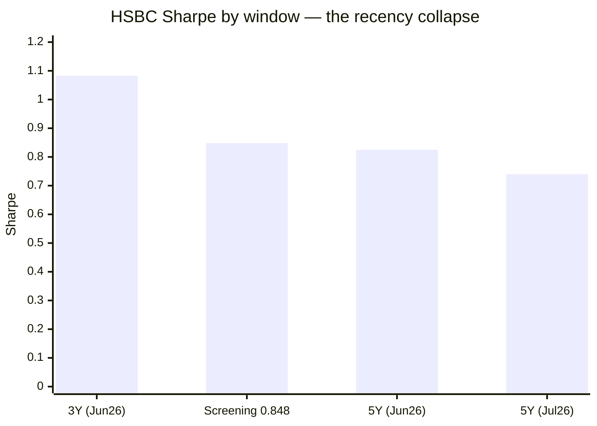
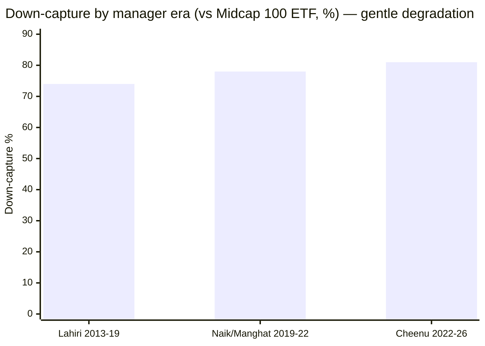
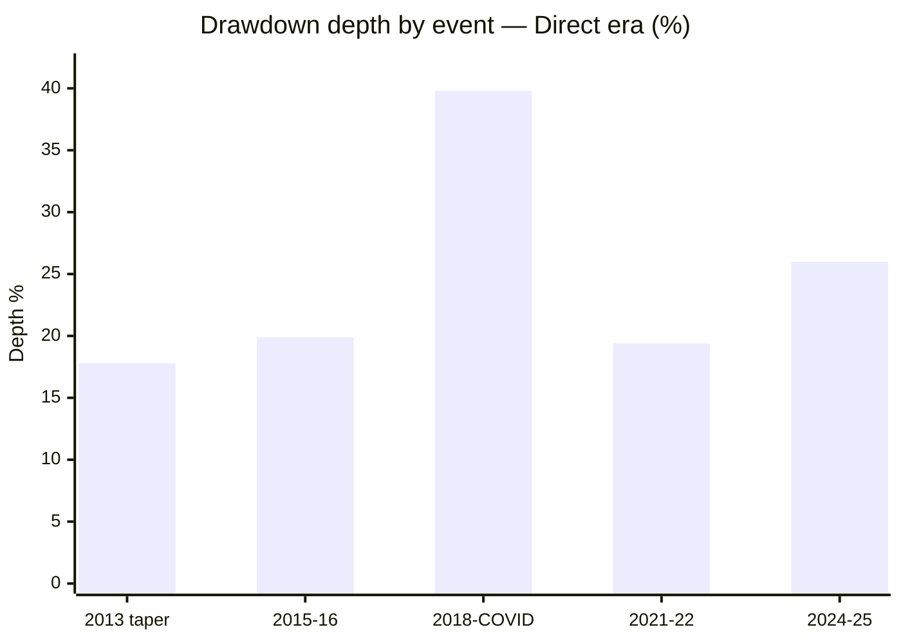
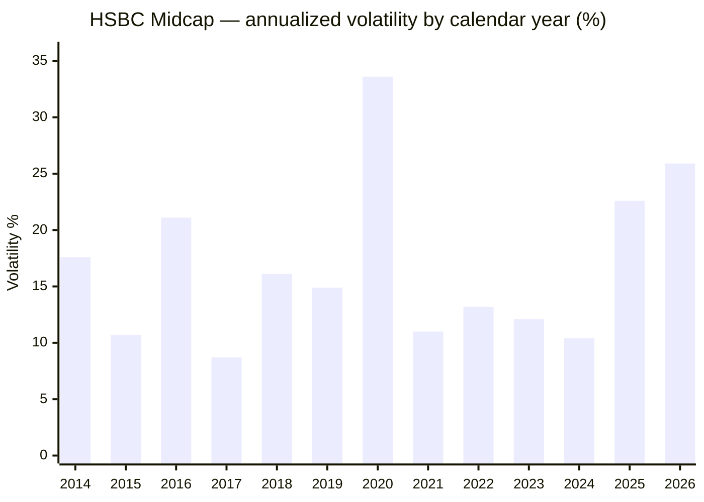
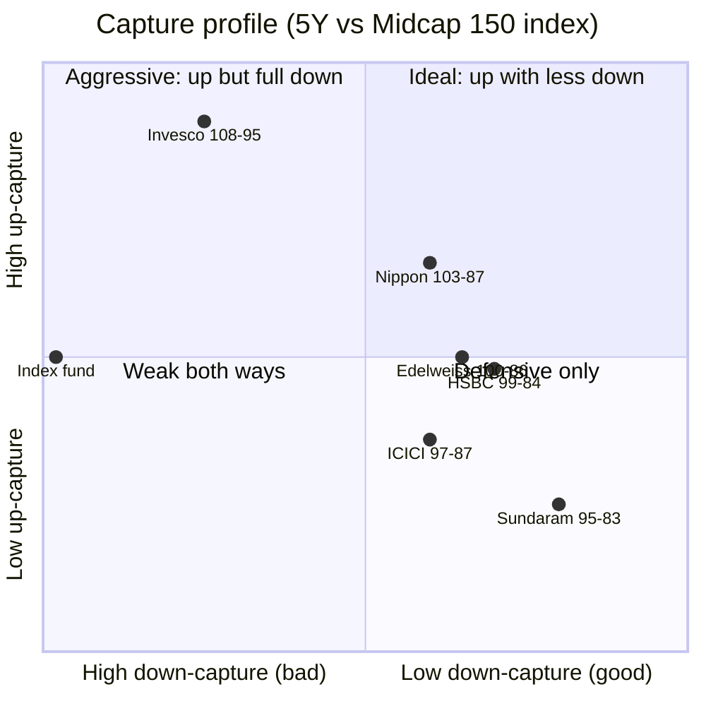

# Module 2: Risk Profile — HSBC Midcap Fund

## Module 2 Score: ~3.2 / 5 (provisional)

---

## Raw Data (Compiled Across Sources, as of 01/03-Jul-2026)

| Metric | Computed (MFAPI, monthly canonical) | Tickertape | Note |
|--------|-------------------------------------|------------|------|
| Volatility (5Y) | **17.0%** | 16.2% (own window) | 2nd-highest of shortlist; **above** the index fund's 16.7% |
| Volatility (full direct era) | 18.6% | — | Category-typical long-run |
| Volatility (2026 calendar YTD) | **25.9%** ⚠ | — | Elevated (2025: 22.6%; 2024: 10.4%) — see Regime Shift |
| Sharpe (5Y, rf 6.5%, sibling window) | **0.825** | 0.848 | **6th of 7 shortlisted** — the screening "anomaly" collapses (see Ladder) |
| Sharpe (3Y) | **1.083** | — | Recency-flattered — the source of the 0.848 screening figure |
| Sortino (5Y) | **1.398** | — | 5th–6th of 7 |
| Calmar (5Y) | **0.79** | — | **7th of 7 — the only active fund below the index fund (0.85)** |
| Max drawdown (5Y) | **−26.0%** ⚠ | premium-gated | **Worst of the shortlist by 5 full points** |
| Max drawdown (direct era) | **−39.8%** (winter→COVID) | — | Deeper than Invesco (−34.1%) and Nippon (−35.3%) |
| Max drawdown (full record) | **−70.6%** (2008, Chola Regular) | — | Different AMC's open-ended book; asset-class base rate |
| Beta vs Midcap 150 index (6.8y / current) | **0.91 / 1.08** ⚠ | — | Rising era over era |
| R² vs Midcap 150 index | **91%** | — | Band vehicle |
| Tracking error (vs index, monthly) | **6.3%** | — | Real active risk; not closet |
| **Information ratio (6.8y)** | **−0.12** ❌ | — | **Negative over the index fund's full life** — first since Franklin |
| Up / Down capture vs index (5Y) | **99% / 84%** | premium-gated | Down-capture looks good — but see the Deception |
| Up / Down capture vs index (6.8y) | 92% / 85% | — | The blended long-run looks defensive… |
| **Up / Down capture, Jan-2024 → (current slice)** | **121% / 91%** ⚠ | — | …the current book is offense with eroding protection |
| Up / Down capture vs Nifty 50 (13.5y) | **115% / 73%** | — | Historically strong — but Lahiri-front-loaded |
| Negative months | 33% (54/162) | — | Category norm |
| PE | **~39.5** | 39.5 | Category 33.8 — a **+17% premium** (between Nippon −13% and Invesco +46%) |
| % from ATH | **−2.3%** | — | Minor overhang (Invesco 0.0%) |
| Category St Dev | — | 15.3% | All funds SEBI "Very High" |

**Method:** monthly returns (162 months, Jan-2013 → Jul-2026) are canonical, annualized ×√12; risk-free = 6.5%; Sharpe = (geometric annualized return − rf) ÷ annualized vol; peer metrics over the identical 5Y common window (**Jul-2021 → Jun-2026**), the same run as the Nippon/Invesco M2 matrices — which my re-run reproduces (Nippon 0.912 vs published 0.918; Invesco 0.879 vs 0.885), validating the method. Data: HSBC = MFAPI Direct 119807 (L&T) spliced to 151036 (HSBC) Nov-2022; index counterfactuals 147622 (Midcap 150 index fund) and 114456 (Midcap 100 ETF, for era analysis on one consistent benchmark); cross-sleeve UTI Nifty 50 (120716), Parag Parikh FlexiCap (122639), DSP Small Cap (119212), Nippon (118668), Invesco (120403); peers Edelweiss 140228 / Mahindra Manulife 142110 / Sundaram 119581 / ICICI 120381; 2008 tail via Chola 102578 + L&T Regular 112496.

**Published-source gap (documented, same as Nippon/Invesco M2):** Morningstar's risk-ratings page and VRO's risk grades are JS-rendered and could not be extracted; no third-party capture-ratio cross-check exists. HSBC's AMC factsheet publishes 3Y SD/beta/Sharpe (a Module-4 fetch candidate). All figures computed from raw NAVs — the primary method of all four studies. VRO's 4★ overall rating (Module 1) stands as the independent quality signal.

---

## The Module 2 Tension — A Risk Anomaly That Isn't One

Nippon's tension was "best risk-adjusted fund, worthless diversifier." Invesco's was "top efficiency ratios, but the downside edge left with the old managers." **HSBC's is simpler and worse: the risk-adjusted dominance the screening rewarded does not survive contact with the honest common method.**

The screening flagged HSBC on a Sharpe of 0.848 — ~3× the shortlist norm. Under the study's canonical 5Y method that Sharpe is 0.825, **6th of 7**; the Sortino is 5th–6th; the Calmar is **dead last, below the passive index fund**; and the max drawdown is the worst of the shortlist by five points. The only metric that still flatters HSBC — an 84% down-capture — turns out, on month-by-month inspection, to be a statistical mirage. This module's real output is not a number but a dismantling: **the "anomaly" was a 2024 + 2026 return spike measured over a short window, exactly as the Nippon M2 predicted when it first recomputed HSBC's screening Sharpe.**

None of this erases the realized returns (M1). It says *what kind* of risk you are buying: a higher-volatility, deeper-drawdown, zero-diversification book whose apparent risk-efficiency is an artifact of when you measure it.

---

## ⭐ The Sharpe Recency-Collapse Ladder — The Headline

The risk-side completion of M1's "recency ramp." Watch the Sharpe move as the window lengthens:

| Window | HSBC Sharpe | Reading |
|--------|-------------|---------|
| 3Y to Jun-2026 | **1.083** | What a 2024+2026 spike looks like — spectacular |
| Tickertape screening (~3Y basis) | **0.848** | The figure that flagged HSBC as the anomaly |
| **5Y to Jun-2026 (sibling window)** | **0.825** | **6th of 7 — the honest rank** |
| 5Y to Jul-2026 (fresh) | **0.740** | Rolling one more month into 2026 vol drops it further |

The screening's 0.848 was a short-window artifact. Under the honest 5Y method HSBC sits 6th of 7 active funds (above only ICICI) — and the Sharpe is *falling* as the window rolls forward, because the 2025–26 volatility is now entering the denominator. This is the cleanest demonstration in the study that short-window risk ratios are audition tapes, not properties — the rule the screening stage learned on Union Small Cap, and the exact caution M1 raised.

---

## The 5Y Peer Matrix (Common Window, Monthly, rf 6.5%) — HSBC at the Bottom

| Fund | Vol | Sharpe | Sortino | MaxDD | UpCap | DnCap | Calmar |
|------|-----|--------|---------|-------|-------|-------|--------|
| Nippon | 16.3% | **0.912** | **1.644** | **−19.9%** | 103 | 87 | 1.08 |
| Invesco | 17.4% | 0.879 | 1.527 | −20.1% | **108** | 95 | **1.09** |
| Edelweiss | 16.1% | 0.871 | 1.548 | −20.1% | 100 | 86 | 1.02 |
| Mahindra Manulife | 16.3% | 0.839 | 1.483 | −20.9% | 101 | 90 | 0.97 |
| **HSBC** | **17.0%** | **0.825** | **1.398** | **−26.0%** ⚠ | 99 | 84 | **0.79** ⚠ |
| Sundaram | 15.7% | 0.810 | 1.412 | −20.7% | 95 | 83 | 0.93 |
| ICICI Pru | 16.6% | 0.760 | 1.374 | −21.3% | 97 | 87 | 0.90 |
| **Index fund** | 16.7% | 0.688 | 1.187 | −21.2% | 100 | 100 | 0.85 |

### HSBC's Rank on Each Metric (1 = best of 7)

| Metric | Rank | Note |
|--------|------|------|
| Down-capture | **2** | 84% — but see The Deception |
| Sharpe | **5** | 0.825; above only Sundaram/ICICI |
| Sortino | **5** | 1.398 |
| Volatility | **6** (2nd-highest) | 17.0%, above the index |
| Max drawdown | **7** (worst) | −26.0%, deeper than the field by 5 pts |
| Calmar | **7** (worst) | 0.79 — below the passive index fund |

The profile in one line: **near-worst on every pain-adjusted measure, rescued on paper by a down-capture number that doesn't mean what it says.**

---

## ⭐⭐ The Capture-Ratio Deception — The Real Output of This Module

HSBC's 84% 5Y down-capture reads as protective — better than Nippon's 87% and Invesco's 95%. Decomposing **every** down-month of the Cheenu Gupta era vs the index fund exposes it as a mirage:

| Month | HSBC | Index | Verdict |
|-------|------|-------|---------|
| Jan-2023 | −1.3% | −2.4% | cushioned |
| Oct-2023 | −1.4% | −3.8% | cushioned |
| Oct-2024 | −4.1% | −6.4% | cushioned |
| **Jan-2025** | **−13.6%** | **−6.1%** | **AMPLIFIED 2.2×** ⚠ |
| **Feb-2025** | **−11.4%** | **−10.5%** | **AMPLIFIED** ⚠ |
| Jul-2025 | −2.5% | −2.8% | cushioned |
| Aug-2025 | −0.9% | −2.8% | cushioned |
| Jan-2026 | −2.0% | −3.5% | cushioned |
| Mar-2026 | −9.3% | −11.1% | cushioned |

**The fund cushions frequent small dips (−1% to −9%) and amplifies the rare large correction.** The 84% average is rescued by seven small cushioned months masking the two catastrophic ones — Jan-2025 fell **2.2× the index** (−13.6% vs −6.1%). This is precisely the wrong shape for a SIP investor: you can ride out a −3% month; the −24% correction is what breaks resolve, and that is the one HSBC amplified.

It also resolves the apparent paradox of "84% down-capture *and* −26.0% max drawdown" — the two co-exist because the drawdown is concentrated in the handful of months the capture average smooths over. **The capture ratio is a portrait of average months; the drawdown is the truth about the bad ones.**

*(Method note: this month-by-month down-capture forensic is a sharper tool than the aggregate ratios the sibling modules used — recommend retrofitting it to Invesco, whose 97–101% current-era down-capture deserves the same inspection.)*

---

## ⭐ The Index-Fund Dominance Test — Risk Edition: 4 of 7 (Weakest of the Trio)

Module 1 answered "why not the index fund?" with a *negative* matched-window alpha. The risk-side completion, over the common 5Y window:

| Axis (5Y) | HSBC | Index fund | Winner |
|-----------|------|-----------|--------|
| Return (CAGR) | **20.0%** | 18.0% | HSBC |
| Volatility | 17.0% | **16.7%** | Index fund ⚠ |
| Max drawdown | −26.0% | **−21.2%** | Index fund ⚠ |
| Sharpe | **0.825** | 0.688 | HSBC |
| Sortino | **1.398** | 1.187 | HSBC |
| Calmar | 0.79 | **0.85** | **Index fund** ⚠ |
| Down-capture | **84%** | 100% | HSBC |

Nippon won 7/7, Invesco 6/7, **HSBC 4/7** — and every loss is a drawdown-shaped axis (vol, max DD, Calmar). HSBC beats the index only on the ratio metrics its 2024+2026 return spike inflates; on every measure of *pain*, the passive fund is better. **Calmar below the index fund is the risk-side twin of M1's negative Proxy-A alpha**: on both return-per-cost and return-per-drawdown, the active fund fails the "why not the index?" test over the honest window.

---

## Alpha, Information Ratio & Beta — The Negative Long-Run IR

| Window | Beta | R² | TE | Alpha/yr | **IR** |
|--------|------|-----|-----|----------|--------|
| 6.8y (full proxy life) | 0.91 | 91% | 6.3% | −0.74% | **−0.12** ❌ |
| 5Y | 0.95 | 87% | 6.3% | +1.72% | 0.27 |
| Cheenu era (Nov-2022 →) | 1.01 | 87% | 6.5% | +4.94% | 0.75 |
| Jan-2024 → | **1.08** | 89% | 7.1% | +8.08% | **1.14** |

Over the index fund's full life, HSBC's **information ratio is negative (−0.12)** — the risk-form of M1's failed index test, and the first negative IR since Franklin US (International). The alpha-per-unit-of-active-risk only turns positive when you restrict to the Cheenu-Gupta / 2024+ slice. Beta is **rising era over era** (0.90 Lahiri → 0.81 Naik/Manghat → 1.01 Cheenu → 1.08 most recent) on a high 6–7% tracking error: the current book takes bigger band-level bets than any prior era, which is why a wrong month (Jan-2025 −13.6%) is so expensive. Contrast Nippon (IR 0.44) and Invesco (0.45), which earn positive reward per unit of active risk over their full windows; HSBC does not.

---

## ⭐ The Era-Split Risk Fingerprint — Degradation, Not Collapse

Module 1 decomposed the *returns* by manager era; this is the risk-side completion. One consistent benchmark throughout (Midcap 100 ETF, correlation ~0.99 to the band):

| Era | Months | Up-cap | Down-cap | Beta | Vol | Sharpe | Risk character |
|-----|--------|--------|----------|------|-----|--------|----------------|
| **Lahiri** (2013 → Dec-2019) | 83 | 105 | **74** | 0.90 | 17.1% | 0.72 | **Near-ideal** — up more, down much less; the winter defence lives here |
| **Naik/Manghat** (Dec-2019 → Nov-2022) | 35 | **77** | 78 | 0.81 | 22.3% | **0.52** | **Worst era** — missed the bull *and* didn't protect; highest vol |
| **Cheenu Gupta** (Nov-2022 → now) | 44 | 101 | 81 | 0.96→1.08 | 18.3% | **0.98** | Best era Sharpe; nominal down-protection masking the amplified correction |

Three conclusions:

1. **The protection was Lahiri's.** Down-capture 74% under Lahiri — genuine, and it owns the winter defence — degrading to 78% then 81%. Unlike Invesco's *collapse* (86→71→97), HSBC's cushion **degraded gently**, but the composition rotted: the current 81% is the mirage from the Deception section (cushions small dips, amplifies the big correction).
2. **The middle era was genuinely bad.** Naik/Manghat's up-77 / down-78 / Sharpe-0.52 over ~3 years is a fund that neither participated in the bull nor protected in the fall — the risk-form of M1's −15.0-alpha 2021.
3. **Neither midcap's protection is a durable house process.** Both current teams run hotter, higher-beta books than their records advertise. But HSBC additionally carries a bad middle era Invesco lacks.

---

## Max Drawdown Ledger & Recovery

| Event | Peak → Trough | Depth | Recovery |
|-------|--------------|-------|----------|
| 2013 taper | Jan → Aug-2013 | −17.8% | 3.8 mo |
| 2015–16 | Aug-2015 → Feb-2016 | −19.9% | 4.0 mo |
| **2018 winter → COVID** | Jan-2018 → Mar-2020 | **−39.8%** | 8.2 mo (from COVID trough; **34 mo from the Jan-2018 peak**) |
| 2021–22 rate hikes | Oct-2021 → Jun-2022 | −19.4% | 11.4 mo |
| **2024–25 correction** | Dec-2024 → Feb-2025 | **−26.0%** ⚠ | **13.7 mo** ⚠ deepest & slowest of the trio |

The modern max (−39.8%, the unbroken winter→COVID span that never recovered between Jan-2018 and Nov-2020) is deeper than Invesco's COVID −34.1% and Nippon's −35.3%. The recent −26.0% / 13.7-month recovery is the worst of the three studied midcaps (Invesco recovered in 3 months, Nippon faster). The COVID single-day worst was −11.6% (23-Mar-2020) — ties Nippon, milder than Invesco's −13.7%.

### The Documented Tail — 2008 at −70.6%, Chola Edition

Via the spliced Chola Regular series: **2008 GFC −70.6% (Jan-2008 → Mar-2009), recovered Oct-2010 (~19 months).** Two footnotes: it was a different book under a defunct AMC (DBS Cholamandalam, open-ended — redemption pressure shaped the NAV, unlike Invesco's close-ended lock-in), and the recovery (~19 mo) was far faster than Invesco's 44-month close-ended wait. Treated as the asset-class base rate, not a fund penalty — but the specific lesson stands that a mid-cap book at GFC scale can lose ~70%.

---

## Volatility — Higher, and Rising

### Cross-Source Reconciliation

| Source | Vol | Sharpe | Why they differ |
|--------|-----|--------|-----------------|
| Computed, monthly, 5Y, rf 6.5% | 17.0% | 0.825 | The canonical method of these studies |
| Tickertape (own trailing window) | 16.2% | 0.848 | Shorter window, different rf, daily basis |

Levels differ; ranks agree. M1's Tickertape SD (16.2%) is a window/basis artifact, not a contradiction — same pattern as Invesco (TT 16.86 vs computed 17.4).

### Annual Volatility Regime — The Current Book Runs Hot

| Regime | Years | Vol | Reading |
|--------|-------|-----|---------|
| Calm | 2015, 2017, 2024 | 8.7–10.7% | Low vol ≠ low risk — 2017 preceded the winter, 2024 preceded the −26% correction |
| Crisis | 2020 | **33.6%** | COVID |
| **New-team escalation** | **2024 → 2025 → 2026** | **10.4 → 22.6 → 25.9** ⚠ | **The risk temperature has more than doubled in two years** |

Same doubling as Invesco (less extreme than its 29.4% 2026), driven by the same mechanism: the 2024–25 correction and the volatile 2026 rebound (+16.9% in Apr-2026 alone, the record's biggest month) sit under the current book. Any site quoting HSBC's long-window vol understates the fund you would buy today.

---

## Daily Return Distribution (3,319 trading days)

| Statistic | Value | Reading |
|-----------|-------|---------|
| Worst days | **−11.6%** (23-Mar-20), −8.6% (04-Jun-24), −6.8% (24-Aug-15) | COVID + election-result day + China devaluation |
| Best days | +5.5% (20-Sep-19), +4.4% (07-Apr-20), +4.2% (12-May-25) | Corporate-tax-cut day + crash rebounds |
| Days < −2% | 104 (3.1%) | Downside clusters |
| Days > +2% | 58 (1.7%) | Upside slower |
| Worst months | **−26.5% (Mar-20)**, **−13.6% (Jan-25)** ⚠, −12.2% (Feb-16), **−11.4% (Feb-25)** ⚠, −10.6% (Sep-18) | **Two of the five worst months are the consecutive 2024–25 correction under Cheenu Gupta** |
| Best months | **+16.9% (Apr-26)**, +15.7% (May-14), +13.3% (Apr-20) | The 2026 rebound is the record's biggest month |
| **Negative months** | **54 of 162 (33%)** | 1 in 3 statements red — category property |

The tails are announcing the current book's character: the biggest up-month (Apr-2026) and two of the five worst months (Jan/Feb-2025, a −23% two-month stretch) all sit in the last 18 months — the same recency-concentration of extremes seen in Invesco.

---

## Worst & Best Rolling Periods (MFAPI, Direct era)

| Window | Worst | Best | % windows negative |
|--------|-------|------|--------------------|
| Rolling 1Y | **−29.27%** | +103.36% | 16.9% |
| Rolling 3Y | **−6.58%/yr** | +42.47%/yr | **4.4%** |
| Rolling 5Y | **+2.33%/yr** | +33.42%/yr | **0.0%** |

The 5Y floor is clean (0% negative, +2.33%/yr) — **genuinely good, and HSBC's single best risk feature.** But the 3Y distribution is the weakest of the trio: 4.4% negative windows and a −6.58%/yr worst (Invesco 0.6% / −1.75%; Nippon 2.7% / −5.6%) — the Naik/Manghat 2020–22 collapse still visible in the rolling record.

---

## Capture Ratios — Historic Strength, Current Erosion

| Benchmark | Window | Up-capture | Down-capture |
|-----------|--------|-----------|--------------|
| Nifty Midcap 150 index | 5Y monthly | 99% | 84% |
| Nifty Midcap 150 index | 6.8y (full proxy life) | 92% | 85% |
| **Nifty 50 (UTI index)** | **13.5y monthly** | **115%** | **73%** |
| Nifty Midcap 150 index | **Jan-2024 → (current slice)** | **121%** | **91%** ⚠ |

The 13.5-year Nifty row (115% up / 73% down) is historically strong — but Lahiri-front-loaded, like the +4.05% ETF alpha in M1. The honest current footnote is the bottom row: **the current-era slice runs 121% up / 91% down with beta 1.08** — offense with eroding protection, and the 91% is itself the flattered figure the Deception section deconstructs.

---

## PE Ratio — A Middle Position

| Metric | HSBC | Nippon | Invesco | Category |
|--------|------|--------|---------|----------|
| Portfolio PE | **~39.5** | 29.3 | 49.4 | 33.8 |
| vs category | **+17% premium** | −13% discount | +46% premium | — |

HSBC's book sits between Nippon's valuation buffer and Invesco's premium. The +17% is a de-rating layer stacked on band beta, but a milder one than Invesco's +46% — it neither cushions like Nippon nor over-extends like Invesco. Consistent with a risk profile that is bad on drawdowns without being the most expensive book in the room. Full holdings characterization → Module 3.

---

## ATH Distance & Structural Risk

- **ATH distance −2.3%** (₹517.8 vs ₹530.0 ATH) — minor drawdown overhang, unlike Invesco at ATH.
- **No structural buffer:** ~99% equity — no cash (PP holds 5–15%), no debt, no foreign sleeve. When the band falls, this fund falls with it.
- **The 35% sleeve is a 21.0% small-cap kicker** (Tickertape composition: 51.4% mid / 26.5% large / 21.0% small) — the study plan's flagged aggressive configuration, risk-additive, similar to Invesco's 22.6%. Whether it is high-conviction future-graduates or momentum chasing is Module 3's question; either way it lifts effective risk above the category label — consistent with the 17.0% vol and rising beta.
- **Redemption/liquidity risk — minor:** liquid band, ₹14,249 Cr well inside capacity, SIP-heavy retail base. Noted and closed.

---

## ⭐ Cross-Sleeve Correlation — The Decision-Tree Feed (Single-Slot, Triple-Confirmed)

| Existing/candidate holding | Corr | **R²** | Beta | Meaning |
|----------------------------|------|--------|------|---------|
| Nifty 50 (UTI index) | 0.825 | 68% | 0.98 | Mostly the same domestic-equity risk |
| Parag Parikh FlexiCap | 0.801 | 64% | 1.15 | Lowest overlap — PP's cash/foreign differentiate |
| DSP Small Cap | 0.935 | 87% | 0.82 | Near-duplicate risk factor |
| **Nippon Growth Mid Cap** | **0.952** | **91%** | 0.94 | Same risk factor |
| **Invesco India Midcap** | **0.954** | **91%** | 0.95 | Same risk factor |

**HSBC is a near-perfect risk duplicate of *both* midcap finalists (R² 91% each).** The three midcaps are ~91% mutually correlated — the sleeve is definitively a single-slot decision, now triple-confirmed (Invesco M2 found Nippon↔Invesco R² 90%; this adds HSBC↔both at 91%). Holding HSBC alongside Nippon or Invesco would be pure duplication. *(Informational: feeds decision_tree.md, does not score the fund.)*

---

## Risk Metrics — Complete Peer Comparison & Cross-Study Placement

| Dimension | **HSBC (MidCap)** | Nippon (MidCap) | Invesco (MidCap) | DSP Small Cap | Franklin US |
|-----------|-------------------|-----------------|------------------|--------------|-------------|
| Vol (5Y, monthly) | 17.0% | 16.3% | 17.4% | ~16% | 17.2% |
| Max DD (modern) | **−39.8%** (deepest of trio) | −35.3% | −34.1% | −49.1% | −38.4% |
| Worst documented | −70.6% (2008, Chola) | −62.7% (2008) | −70.8% (2008) | −49% | no GFC |
| Down-capture (5Y) | 84% (flattered) | 87% (era-stable) | 95% | ~85% | >100% |
| Sharpe (5Y common) | **0.825** (6th) | 0.912 | 0.879 | ~0.7–0.8 | ~0.5 |
| Calmar (5Y) | **0.79** (below index) | 1.08 | 1.09 | — | — |
| IR (6.8y) | **−0.12** ❌ | 0.44 | 0.45 | — | negative |
| Diversification value | ~None (R² 91% both peers) | ~None | ~None | none | elite (R² 11%) |
| Recovery discipline | 13.7 mo (2024–25) | ≤16 mo | 3 mo (2024–25) | 2–3 yr | 5×20%+ DDs |

**Placement:** HSBC is the trio's risk weakling — near-worst on every pain-adjusted axis, a negative long-run IR, and no diversification value. Where Franklin (International) at least earned its keep as an elite diversifier despite mediocre standalone risk, HSBC neither protects nor diversifies.

---

## Risk Profile — Points For and Against

### ✅ Points IN FAVOUR

- **Clean 5Y rolling floor** — no negative 5-year window ever, floor +2.33%/yr (its single best risk feature)
- Beats the index fund on Sharpe (0.825 vs 0.688), Sortino, and return
- Historic long-run capture strength (115% up / 73% down vs the Nifty over 13.5y — Lahiri-era)
- 2008 tail documented (−70.6%) with a relatively fast (~19-mo) recovery
- COVID single-day worst (−11.6%) milder than Invesco; ties Nippon
- AUM (₹14,249 Cr) inside capacity — no size-forced risk drift

### ⚠️ Points AGAINST

- **Screening Sharpe anomaly is a recency artifact** — 5Y 0.825 (6th of 7), falling as the window rolls forward
- **Worst 5Y max drawdown of the shortlist by 5 points (−26.0%)** and deepest modern DD of the trio (−39.8%)
- **Calmar 0.79 — dead last, below the passive index fund**; wins the index-dominance test only 4 of 7 (all losses drawdown-shaped)
- **The 84% down-capture is a mirage** — cushions small dips, amplifies the real correction (Jan-2025 −13.6% vs index −6.1%, 2.2×)
- **Negative 6.8y information ratio (−0.12)** — the risk-form of the failed index test
- **Beta rising era over era (0.90 → 1.08)** on 6–7% TE — bigger band bets, more expensive wrong months
- Slowest stress recovery of the trio (13.7 mo for 2024–25)
- Volatility 2nd-highest of shortlist, 2026 running 25.9%; a genuinely bad middle era (Naik/Manghat, Sharpe 0.52)
- 21% small-cap kicker — effective risk above the label
- Diversification value ≈ nil — R² 91% vs both Nippon and Invesco (single-slot)
- No published third-party capture/risk-grade cross-check (Morningstar/VRO JS-blocked)

---

## Module 2 Scorecard

| Sub-dimension | Weight | Score | Reasoning |
|---------------|--------|-------|-----------|
| Max Drawdown (inception-adjusted) | High | **3.5** | Modern max −39.8% (deepest of trio); 5Y −26.0% worst of shortlist by 5 pts; 2008 −70.6% documented (Chola, base rate) |
| **Down-capture vs own index** | **Critical** | **3.5** | Raw 84% is 2nd-best of actives — but forensics show it cushions small dips and amplifies the real correction (Jan-2025 2.2× index); beta rising to 1.08. Credit the number, dock for the shape |
| Sharpe | High | **3.0** | 5Y 0.825 — 6th of 7; beats index (0.688) but bottom-third of peers; falling as window rolls |
| Sortino | Medium | **3.0** | 1.398 — 5th–6th of 7 |
| Recovery time from max DD | Medium | **3.0** | 2024–25 took 13.7 mo — slowest of the trio (Invesco 3 mo) |
| 2018–19 winter drawdown | Critical | **3.5** | Beat index calendar (+4.1/+4.5) and marginally shallower fall (−24.2% vs ~−26%), but deepest absolute of trio, rolled unrecovered into COVID; medal is departed-Lahiri's |
| Volatility vs category | Medium | **3.0** | 2nd-highest of shortlist, above the index; 2026 running 25.9% |
| Effective risk of the 35% sleeve | Medium | **3.0** (prov.) | 21.0% small-cap kicker — risk-additive; contents → M3 |
| Cross-sleeve correlation | Informational | — | R² 91% vs both Nippon & Invesco → decision tree; not scored |

**Module 2 Score: ~3.2 / 5** — the **lowest Module 2 of the three midcaps** and possibly the lowest risk score in the repo. HSBC has one genuinely good risk feature (a clean 5Y rolling floor) and otherwise sits at or near the bottom of every peer-relative and pain-adjusted measure, while offering zero diversification. The screening's risk "dominance" was a recency artifact on both the Sharpe and the capture side. **Provisional on Module 3 (does the PE-39.5, 21%-small-cap, rising-beta book explain the amplified correction?) and Module 5 (has Cheenu Gupta ever navigated a full bear? — her only stress test here, 2024–25, she amplified).**

---

## Comparative Module 2 Scores

| Fund | Category | M2 Score | Risk character |
|------|----------|----------|----------------|
| Parag Parikh FlexiCap | FlexiCap | ~4.5 | Allocation-built fortress (cash + foreign) |
| Nippon Growth Mid Cap | MidCap | ~4.4 | Pure-selection downside discipline at scale; no buffer |
| Invesco India Midcap | MidCap | ~4.1 | Paid aggression — top efficiency ratios, era-dependent downside edge |
| DSP Small Cap | SmallCap | ~3.9 | Disciplined but deep-drawdown asset class |
| Franklin US Opp | International | 3.3 | Mediocre standalone, elite diversifier |
| **HSBC Midcap** | **MidCap** | **~3.2** | **Screening anomaly dismantled; worst pain-adjusted metrics of the trio; no diversification** |

---

## SIP Implication

1. **Expect the category rhythm — one-third of months red, a −20%+ episode every 2–3 years — but with the trio's deepest drawdowns and slowest recoveries.** The 2024–25 correction (−26%, 13.7 months to recover) is the template, and its two amplifying months (Jan/Feb-2025, −23% combined) are the emotional test this fund fails worse than its peers.
2. **The clean 5Y floor (+2.33%/yr) is the reassurance** — at a 10-year horizon the volatility has been time-absorbable. But the 3Y experience (4.4% loss odds, −6.58% worst) is the roughest of the trio.
3. **Size the sleeve knowing it hedges nothing and duplicates everything** — R² 91% vs both Nippon and Invesco: a single-slot, return-enhancer decision with no diversification benefit.
4. **The standing tripwire is the same as Invesco's, but already partly tripped:** HSBC's current book has *already* amplified one correction (down-capture >100% in the two months that mattered). The next genuine midcap bear under Cheenu Gupta is the real Module 2 — if the pattern repeats, the risk-side justification for the fee premium over the index fund is gone, which restates M1's conclusion rather than softening it.

---

## One-Line Verdict

> **HSBC's Module 2 is the dismantling of its own screening headline: the Sharpe-0.848 "anomaly" is a 3Y recency artifact that collapses to 0.825 (6th of 7) — and falling — under the honest 5Y method, sitting on the worst max drawdown of the shortlist (−26.0%, by five points), a Calmar of 0.79 that loses to the passive index fund, a negative 6.8-year information ratio (−0.12), and an 84% down-capture that month-by-month forensics expose as a mirage (it cushions small dips and amplifies the real correction — Jan-2025 fell 2.2× the index). The one bright spot is a clean 5Y rolling floor (+2.33%/yr); everything else is trio-worst, the beta is rising toward 1.08 on a hot 2026, and the R² of 91% against both Nippon and Invesco means the sleeve adds no diversification. Provisional: ~3.2/5 — the lowest risk score of the three midcaps, conditional on Module 3's book characterization and Module 5's answer to whether this manager has ever navigated a full bear.**

---

*Module 2 completed: July 5, 2026 | Risk Profile | MFAPI methodology — monthly canonical (162 months Jan-2013 → Jul-2026), rf 6.5%, Sharpe = (geo ann − rf)/vol, peers on identical 5Y common window Jul-2021 → Jun-2026 (reproduces published Nippon 0.912/0.918 & Invesco 0.879/0.885 — method validated) | Series: HSBC 119807→151036 spliced Nov-2022, index counterfactuals 147622 + 114456, cross-sleeve UTI Nifty 50 120716 / PP 122639 / DSP 119212 / Nippon 118668 / Invesco 120403, peers 140228/142110/119581/120381, 2008 tail via Chola 102578 + L&T Regular 112496 | Era windows: Lahiri Jan-2013→Dec-2019 (83 mo), Naik/Manghat Dec-2019→Nov-2022 (35 mo), Cheenu Gupta Nov-2022→Jul-2026 (44 mo) | Screening Sharpe 0.848 reconciled as ~3Y recency artifact (3Y 1.083, 5Y 0.825→0.740) | Morningstar & VRO risk pages JS-blocked — computed metrics primary | Provisional M2 Score: ~3.2/5 (deferred: 21%-sleeve contents → M3; bear-market experience of Cheenu Gupta → M5)*
