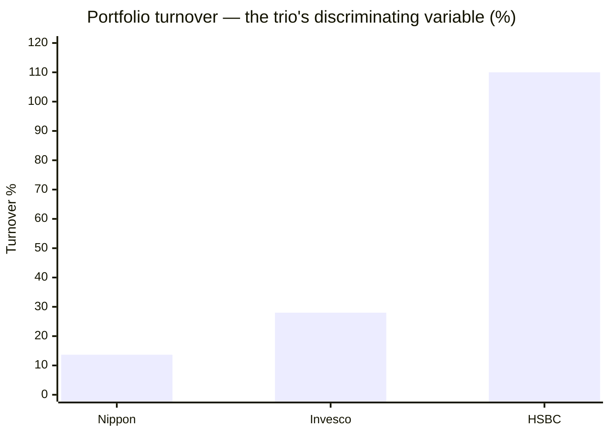
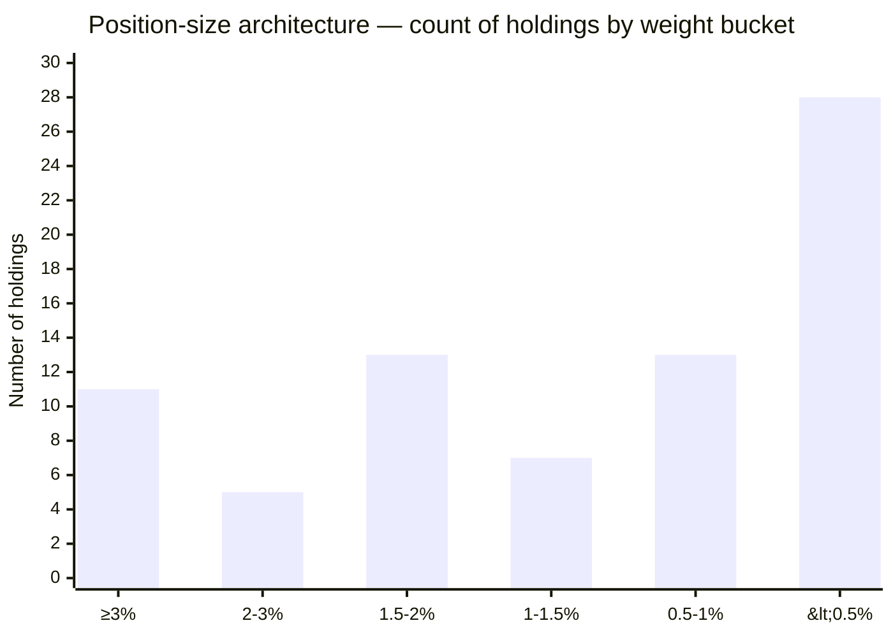
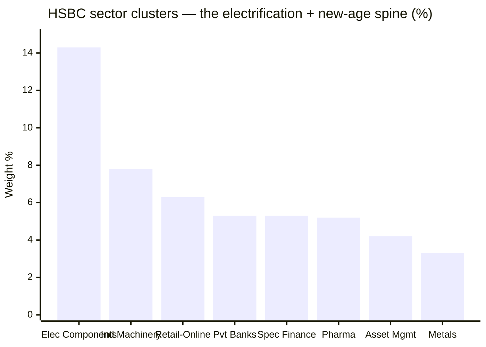
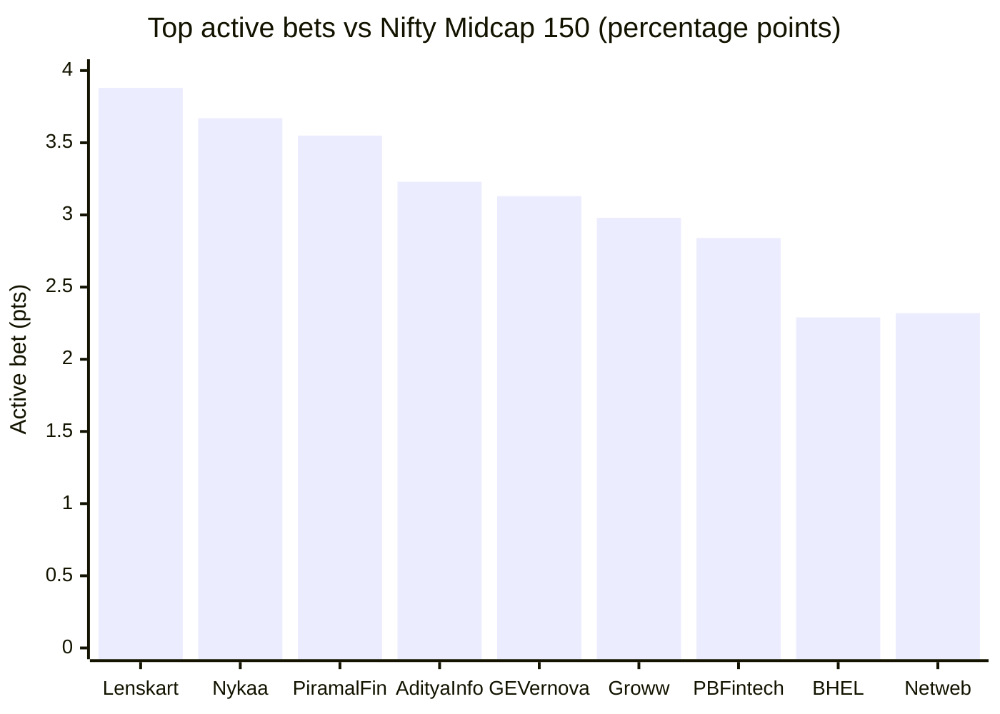
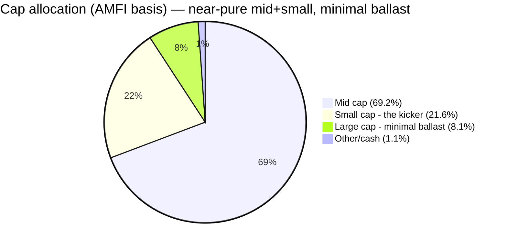

# Module 3: Portfolio DNA — HSBC Midcap Fund

## Module 3 Score: ~3.7 / 5 (provisional)

---

## Raw Data (Compiled Across Sources, as of 03-Jul-2026 / 31-May-2026 factsheet)

| Metric | Value | Source |
|--------|-------|--------|
| **Equity holdings** | **77 stocks** (Groww: 79 incl. cash/prefs; ~98.9% equity) | Tickertape holdings API |
| Cash & equivalents | ~1.1% | Tickertape holdings API |
| **Top-10 concentration** | **39.7%** — between Nippon (23.1%) and Invesco (46.7%) | Computed from full holdings |
| Top-3 / Top-5 / Top-20 | 13.7% / 22.2% / 62.4% | Computed (VRO/Groww confirm top-5) |
| Largest holding | **GE Vernova T&D India, 4.71%** | Computed |
| Median / smallest position | ~0.95% / ~0.00% | Computed |
| **Active share vs Nifty Midcap 150** | **69.5%** — between Nippon (54.1%) and Invesco (79.5%) | Computed vs the Motilal index fund's live 150 constituents |
| Holdings inside the index | 46 of 77 = 71.6% of equity weight | Computed |
| **Active share vs Nippon / vs Invesco** | **75.5% / 85.8%** | Computed |
| Cap allocation (AMFI, AdvisorKhoj) | **Mid 69.24% / Small 21.57% / Large 8.07%** / Other 1.12% | AdvisorKhoj factsheet 31-May-2026 |
| Cap allocation (Tickertape bands) | Mid 51.4% / Large 26.5% / Small 21.0% | Tickertape screener |
| **Portfolio turnover** | **~100–120%** ⚠ (Yahoo 102.59%, AdvisorKhoj 1.21×) | Aggregators — **exact factsheet figure → M4 (AMC PDF 403-blocked)** |
| Portfolio PE | **~39.5** (category 33.8) | Tickertape (M2) |
| Max granular sector | **Electrical Components & Equipment, 14.3%** | TT sector distribution |
| Manager | **Cheenu Gupta (Nov-2022)** + Mayank Chaturvedi (Oct-2025) | AMC / AdvisorKhoj |
| Factsheet 3Y ratios | SD 20.0, beta 1.01, Sharpe 1.03 | AdvisorKhoj — validates M2 |

**Data provenance & gaps:** full 77-position holdings with exact weights from Tickertape's holdings API (`M_LTIU`); the index reference is the **Motilal Nifty Midcap 150 Index Fund's own live constituents** (150 names with weights), so active share compares two real, investable books. Nippon (M_NIGR), Invesco (M_INMI), PP FlexiCap (M_PARO), DSP Small Cap (M_DSPSM) pulled the same way for overlap. **Cross-validation:** Groww confirms 79 holdings; VRO and Groww confirm the top-5 exactly (GE Vernova 4.66 / FSN-Nykaa 4.51 / BSE 4.34 / PB Fintech 4.24 / Lenskart 4.21). AMFI cap split and factsheet 3Y ratios from AdvisorKhoj (31-May-2026). **The one material gap:** the exact factsheet turnover figure — the HSBC AMC PDF is Azure-403-blocked; the ~100–120% estimate triangulates from Yahoo (102.59%, May-2026), AdvisorKhoj (1.21×), and the sibling HSBC Large & Mid Cap (93%). The direction (very high, ~7× Nippon) is robust; the exact number is a Module-4 fetch.

---

## The Core Thesis — An Actively-Traded Electrification-and-New-Age Momentum Book

HSBC's portfolio is the **third distinct personality** in the 150-stock pond. Where Nippon is a broad, low-turnover value-tilt and Invesco a concentrated growth book, HSBC is an **actively-traded momentum book with a thematic spine**: a genuinely active 69.5% active share, a ~22% capital-goods/power/electrification thesis (GE Vernova, Hitachi Energy, BHEL, Thermax) bolted to a ~15% new-age/platform cluster (Nykaa, Lenskart, PB Fintech, Groww), the deepest deep-band participation of the trio (13.1% in index ranks 201–250), almost no large-cap ballast (8% AMFI), and — the module's real surprise — **turnover of ~100–120%, roughly 7× Nippon and 4× Invesco, the highest in the study.** That single fact reconciles M1's lumpy alpha, M2's amplified correction, and the new-age names that got crushed in Jan-2025. Like Invesco, the current book is entirely the current manager's construction — so Module 3 is the **clean, unblended read on Cheenu Gupta** that the three-manager-blended M1 and M2 could not give.

---

## ⭐ The Turnover Shock — ~110%, the Trio's Highest by 4–8× *(new — the module's real output)*

| Fund | Turnover | Implied holding period |
|------|----------|------------------------|
| Nippon Growth | 13.66% | ~7 years |
| Invesco | 28% | ~3.5 years |
| **HSBC** | **~100–120%** | **~1 year** |

This is the discriminating variable of the whole trio. Nippon barely trades (buy-and-hold discipline, ~7-year holds); Invesco steers quarterly (conviction repositioning); **HSBC churns roughly its entire book once a year.** It is the holdings-level mechanism behind every prior-module finding:

- **M1's lumpy, recency-concentrated alpha** — a momentum book catches rallies (2024, 2026) by rotating into what's working.
- **M2's amplified 2024–25 correction** — a high-turnover momentum book is by construction always holding what recently ran, so it holds the names that fall hardest when momentum breaks.
- **The new-age tilt** (below) — you don't hold loss-making platforms for seven years; you trade them.

Turnover this high carries a real, recurring impact-and-tax cost (Module 4's problem) and is the antithesis of the "documented, consistent stance" the rubric rewards. **It is the single biggest quality knock in this portfolio** — and the sharpest contrast with Nippon's glacial discipline in the entire study.

---

## ⭐ The Active-Share Verdict — 69.5%, Decisively Active

| Measure | HSBC | Nippon | Invesco |
|---------|------|--------|---------|
| Active share vs Midcap 150 | **69.5%** | 54.1% | 79.5% |
| In-index / off-index weight | 71.6% / 28.4% | 67.9% / 32.1% | 63.4% / 36.6% |
| Names in index | 46 of 77 | 61 of 96 | 23 of 46 |

HSBC sits in the **middle of the trio and decisively above the >60% "genuinely active" line** — the closet-index concern that shadowed Nippon (54%, R² 95%) never arises. This **partially releases the M1/M2 "why pay active fees?" conditionality**: whatever the outcomes, you are unambiguously buying real active management.

The one caveat: HSBC's 77 names include a **28-name sub-0.5% tail** (see architecture) that is essentially index-hugging padding — a purer 45-name book would score materially higher AS. Reconciliation with M2's R² 91%: high-R², high-AS, high-TE (6.3%) is the statistical picture of **index-aware active** — the same structure as both peers, HSBC in the middle on conviction.

---

## ⭐ The Conviction Architecture — A Concentrated Core With a Diffuse Tail

| Position size | HSBC (count) | Nippon | Invesco |
|---------------|-------------|--------|---------|
| ≥3% | **11** | 0 | 15 |
| 2–3% | 5 | 8 | 7 |
| 1.5–2% | 13 | 15 | 2 |
| 1–1.5% | 7 | 17 | 7 |
| 0.5–1% | 13 | 33 | 5 |
| <0.5% | **28** | 23 | ~10 |

HSBC is a **hybrid**: an 11-name conviction core (each ≥3%, ~40% of the book) sitting on a long 28-name sub-0.5% tail. Neither Invesco's inverted pyramid (15 names ≥3%, top-10 46.7%) nor Nippon's flat pyramid (nothing >3.3%). Concentration lands in between:

| Metric | HSBC | Nippon | Invesco |
|--------|------|--------|---------|
| Top-3 / Top-5 / Top-10 | 13.7% / 22.2% / **39.7%** | 8 / 15 / 23.1% | 17 / 26 / 46.7% |
| Largest holding | GE Vernova T&D **4.71%** | ~3.3% | BSE 6.05% |
| Stock count | **77** | 96 | 44 |

Top-10 of 39.7% is a moderate, defensible concentration (rubric 35–45% band). The 77-stock count sits *above* the 40–70 sweet spot — the sub-0.5% tail is where "index-hugging by construction" risk lives, though 39.7% top-10 shows conviction is real where it counts.

---

## ⭐ The Electrification/Capex Thesis — HSBC's Signature Bet *(new)*

The sector distribution reveals a personality neither peer shares:

| Cluster | HSBC | Nippon | Invesco | Names |
|---------|------|--------|---------|-------|
| **Capital goods / power / electrification** | **~22%** | small | small | GE Vernova, Hitachi Energy, BHEL, Thermax, Apar, JSW Energy |
| **New-age / platform** | **~15%** | ~4% | ~11% | Nykaa, Lenskart, PB Fintech, Groww, Netweb, Aditya Infotech |
| Financials (spread) | ~18% | ~23% | ~31% | banks / NBFC / AMC / housing — none >5.3% |
| Healthcare | ~9% | ~11% | ~18% | Lupin, IPCA, health-equipment |

- **Max single granular sector: Electrical Components & Equipment 14.3%** — below the 25% rubric line but a clear thesis. Sector concentration sits *between* Nippon (no thesis, max 8.1%) and Invesco (financials 31%).
- The **electrification/capex bet (~22%)** is HSBC's defining view — a power-and-industrial-capex play no other fund in the study expresses at scale. Its top holding (GE Vernova T&D, 4.71%) plus #6/#11/#19 (BHEL, Hitachi Energy, Thermax) are all this theme.
- Notable quirk: HSBC holds **listed AMCs — Nippon Life AMC (2.21%) and ICICI Pru AMC (2.06%)** — betting on its own competitors as financialization plays.

---

## ⭐ The New-Age Cluster Answers Module 2's Amplified Correction *(new — the M2→M3 handoff)*

Module 2 asked: *what does the current book hold that made it fall 2.2× the index in Jan-2025?* The answer is here. HSBC's biggest **active bets** are recently-listed, high-beta new-age names:

| # | Holding | Weight | Index wt | **Active bet** | 3M chg | In/off index |
|---|---------|--------|----------|----------------|--------|--------------|
| 1 | GE Vernova T&D | 4.71% | 1.59% | +3.13 | +0.08 | in |
| 2 | FSN / Nykaa | 4.56% | 0.89% | **+3.67** | −0.72 | in |
| 3 | BSE | 4.39% | 4.21% | +0.18 | +1.00 | in |
| 4 | PB Fintech | 4.28% | 1.44% | +2.84 | +0.95 | in |
| 5 | **Lenskart** | 4.26% | 0.38% | **+3.88** | +0.60 | in |
| 6 | BHEL | 3.80% | 1.51% | +2.29 | +3.74 | in |
| 7 | Federal Bank | 3.69% | 1.77% | +1.92 | −0.30 | in |
| 8 | Piramal Finance | 3.55% | off | +3.55 | +0.92 | OFF |
| 9 | Billionbrains / Groww | 3.26% | 0.28% | +2.98 | +0.37 | in |
| 10 | Aditya Infotech | 3.23% | off | +3.23 | +0.88 | OFF |
| 11 | Hitachi Energy | 3.21% | 1.22% | +1.99 | −0.70 | in |
| 12 | Bharat Forge | 2.63% | 1.30% | +1.33 | +1.64 | in |
| 13 | Indian Bank | 2.47% | 0.73% | +1.74 | +0.53 | in |
| 14 | Netweb Technologies | 2.32% | off | +2.32 | +2.29 | OFF |
| 15 | Nippon Life AMC | 2.21% | 0.49% | +1.73 | +0.58 | in |
| 16 | ICICI Pru AMC | 2.06% | 0.31% | +1.75 | −0.22 | in |
| 17 | Radico Khaitan | 1.98% | 0.68% | +1.30 | +0.27 | in |
| 18 | Lupin | 1.98% | 1.37% | +0.61 | +1.96 | in |
| 19 | Thermax | 1.92% | 0.48% | +1.44 | +1.90 | in |
| 20 | JSW Energy | 1.91% | 0.80% | +1.11 | +1.89 | in |

A book loaded with **Nykaa, Lenskart, PB Fintech, Groww, Netweb** — precisely the high-beta new-age cohort that cratered in the Jan-2025 correction — is the holdings-level reason M2's down-capture forensic caught a −13.6% month against the index's −6.1%. **The amplified correction wasn't bad luck; it was the portfolio's composition.** And it is a live risk: these names remain the core of the book.

---

## ⭐ Band Positioning — HSBC Plays the Deep Band MORE Than Either Peer *(new)*

Splitting the in-index weight by index-weight rank (proxy for cap rank 101→250):

| Band segment | HSBC | Nippon | Invesco | Reading |
|--------------|------|--------|---------|---------|
| Top-50 (~101–150, mega-mid) | 43.2% | 40.1% | 39.1% | The liquid center |
| Middle-50 (~151–200) | 15.2% | 19.9% | 16.6% | Moderate |
| **Bottom-50 (~201–250, deep mids)** | **13.1%** | 7.9% | 6.8% | **The alpha end — HSBC takes it** |
| Off-index (large + small + new) | 28.4% | 32.1% | 36.6% | The barbell |

**HSBC takes the deep-band alpha end that both peers leave on the table** — 13.1% in ranks 201–250 vs Nippon's 7.9% (size-forced abandonment at ₹47K Cr) and Invesco's 6.8% (stylistic choice). At ₹14,249 Cr, HSBC *can* fish the deep band, and does — the mandate's highest-octane segment and where under-covered mid-cap alpha actually lives. A genuine positive and a real differentiator.

---

## The Cap Posture — Almost No Ballast, the Most Aggressive of the Trio

**AMFI basis (regulatory, AdvisorKhoj 31-May-2026):** Mid **69.24%** / Small **21.57%** / Large **8.07%** / Other 1.12%.

- **Mandate honestly met** — 69% mid comfortably above the 65% floor, and *more* honestly mid than Invesco (AMFI 64.61%, barely at floor).
- **The flexibility sleeve is almost pure small-cap kicker (21.6%) with only 8% large-cap ballast** — the least defensive cap posture of the trio (Nippon runs 27.7% large ballast; Invesco ~17%). This confirms and *sharpens* M2's deferred "35% sleeve" row: the sleeve points almost entirely *up* the risk spectrum, with minimal dampener — consistent with M2's deepest-of-trio drawdown.

*(Reconciliation: Tickertape's bands read mid 51.4 / large 26.5 / small 21.0 — TT reclassifies many mid/new-age names as "large." AMFI is the regulatory basis and is used here as primary.)*

---

## ⭐ The BSE Contrast — HSBC Is Neutral Where the Peers Take Sides *(new)*

The pond's momentum darling, at single-stock resolution:

| Fund | BSE weight | vs index (4.21%) | Instinct |
|------|-----------|------------------|----------|
| Invesco | 6.05% | **+1.84 overweight** | Momentum embrace |
| **HSBC** | **4.39%** | **+0.18 (≈ index)** | **Neutral** |
| Nippon | 3.32% | −0.89 underweight | Froth discipline |

HSBC neither chases BSE (Invesco) nor avoids it (Nippon) — it holds it at index weight and **spends its conviction budget elsewhere** (new-age + electrification). Three funds, one stock, three postures — a clean illustration that HSBC's active risk is a *different* set of bets, not a bigger or smaller version of a peer's.

---

## Overlap: Same Pond, Three Philosophies *(decision-tree feed)*

| Comparison | Shared names | Shared weight | Active share to each other |
|------------|-------------|---------------|----------------------------|
| HSBC vs Nippon | 30 | 43% of HSBC weight | **75.5%** |
| HSBC vs Invesco | 11 | 17.9% of HSBC weight | **85.8%** |

The shared names are sized radically differently (HSBC's Nykaa 4.56 vs Nippon 0.94; Nippon holds Eternal 2.20, Persistent 1.83, Max names HSBC doesn't; Invesco's Eternal 4.55 / Max Healthcare 4.14 / JK Cement 3.30 barely appear in HSBC). **HSBC is the most differentiated of the trio** — it shares only 11 names / 17.9% weight with Invesco, running 85.8% active share to it.

**Cross-sleeve (existing holdings):** vs PP FlexiCap 5 names / 1.6%; vs DSP Small Cap 6 names / 5.9% — near-zero name duplication. **Return-enhancer, not diversifier**, same verdict as siblings. The only real duplication is *within* the midcap decision — but even there HSBC is the most name-distinct of the three; M2's R² 91% nonetheless confirms it adds no *risk* diversification. **Single-slot stands.**

---

## This Book Is Entirely Cheenu Gupta's — The Clean Attribution Window

Like Invesco's M3, HSBC's current portfolio is **entirely the current manager's construction** (Cheenu Gupta, Nov-2022→). So Module 3 is the clean, unblended read on the person M1/M2 could only evaluate through a three-manager blend — and it *confirms* the era-change thesis at holdings resolution: this high-turnover, new-age-tilted, electrification-themed momentum book looks nothing like Lahiri's defensive winter-winning book (M2's down-74 era). **The fund genuinely changed character with the manager, and the portfolio is the proof** — which is exactly why the pre-2022 track record (M1) is not the fund you're buying.

Two forward flags: (1) the ~110% turnover is now a *cost* question (Module 4); (2) a thematic, actively-traded book is **philosophy-and-manager dependent** — is the electrification thesis a documented process or momentum-following, and is the turnover deliberate or drift? (Module 5).

---

## Asset Allocation — No Buffer, by Policy

| Disclosure | Equity | Cash |
|-----------|--------|------|
| Mar-2025 → May-2026 (6 snapshots) | 97.6–98.9% | 1.1–2.4% |

**No tactical cash, ever** — identical to both peers. M2's "no structural buffer" finding confirmed at holdings level: all protection is selection-based, and for a high-turnover momentum book that means *nothing* cushions a band drawdown except the trading, which M2 showed amplified rather than protected in the one real correction.

---

## PE Character — Growth-ish, Distorted by Loss-Making Platforms

| Metric | HSBC | Nippon | Invesco | Category |
|--------|------|--------|---------|----------|
| Portfolio PE | **~39.5** | 29.3 | 49.4 | 33.8 |
| vs category | +17% | −13% | +46% | — |

HSBC's ~39.5 PE sits between Nippon's value discount and Invesco's growth premium. A nuance worth flagging: several of HSBC's biggest bets (Nykaa, PB Fintech, Groww/Billionbrains) are **loss-making or thin-margin new-age platforms**, so the reported "E" is distorted — the multiple overstates genuine earnings richness in some names and is meaningless in others. The +17% premium is a modest de-rating layer (M2), milder than Invesco's, but the new-age cohort carries its own re-rating/de-rating volatility independent of PE.

---

## Comparison with Studied Funds

| Dimension | **HSBC (MidCap)** | Nippon (MidCap) | Invesco (MidCap) | DSP Small Cap | PP FlexiCap |
|-----------|-------------------|-----------------|------------------|--------------|-------------|
| Stocks | **77** | 96 | 44 | 83 | ~25 core |
| Top-10 | 39.7% | 23.1% | 46.7% | ~30% | ~35% |
| Active share | 69.5% | 54.1% | **79.5%** | high | very high |
| **Turnover** | **~110%** ⚠ | **13.7%** | 28% | ~25–30% | ~20% |
| Max sector | 14.3% (capex thesis) | 8.1% | 13.7% (fin ~31%) | 34% consumer-cyc | concentrated |
| Deep-band | **13.1%** ⭐ | 7.9% | 6.8% | — | — |
| Cap ballast (large) | **8%** (least) | 27.7% | ~17% | — | — |
| Cash | 1.1% | 1.3% | 1.5% | 8.4% | 5–15% |
| Personality | **Traded momentum + capex/new-age thesis** | Breadth + graduation escalator | High-conviction growth | Sector-thesis conviction | Allocation fortress |

**Placement:** HSBC is the trio's most *actively-traded* book — genuinely active (69.5% AS), honestly mid (69% AMFI), distinctively themed (electrification + new-age), and the only one that fishes the deep band hard. Its nearest analog in spirit is DSP Small Cap's thematic conviction, but expressed through momentum trading rather than buy-and-hold. It is what a thematic momentum manager builds handed a mid-cap mandate — with the impact-cost and correction-amplification risk that trading implies.

---

## Points For / Points Against (Portfolio Angle)

### ✅ Points For

- **Active share 69.5% — decisively active** (>60 line), closet-index concern dead; partially releases M1/M2 conditionality
- **Mandate honestly met — AMFI 69.24% mid**, more honest than Invesco (64.61%)
- **Deepest deep-band participation of the trio (13.1%)** — takes the highest-octane alpha end both peers abandon, by choice at ₹14K Cr
- **Distinctive thesis** — a ~22% electrification/capex bet no other studied fund carries
- **Moderate, defensible top-10 (39.7%)** — conviction real where it counts, not over-concentrated
- **Most name-differentiated of the trio** — 75–86% active share to its peers
- Near-zero name duplication with the existing PP + DSP sleeves
- The book is unambiguously the current manager's — the clean attribution window M1/M2 lacked

### ❌ Points Against

- **Turnover ~100–120% — the trio's highest by 4–8×**; recurring impact/tax cost and the momentum-churn signature the rubric penalizes
- **New-age/platform cluster (~15%)** — the holdings-level cause of M2's amplified 2024–25 correction; a live, high-beta risk
- **Almost no large-cap ballast (8% AMFI)** — the least defensive cap posture of the trio; consistent with the deepest drawdown
- **28-name sub-0.5% tail** — index-hugging padding that inflates the count and dilutes genuine conviction
- **77 stocks — above the 40–70 sweet spot**
- Several loss-making new-age names distort the PE and carry independent re-rating volatility
- No structural buffer — ~99% equity, all protection selection-based (and M2 showed the current book's protection is thin)

---

## Module 3 Scorecard

| Sub-dimension | Weight | Score | Reasoning |
|---------------|--------|-------|-----------|
| **Active share vs Midcap 150** | **Critical** | **4.5** | 69.5% — decisively active (>60), closet-index concern dead; held below 5.0 by the 28-name sub-0.5% tail that pads the count without conviction |
| Mid-cap mandate honesty | Medium | **4.5** | AMFI 69.24% mid — comfortably above 65%, more honest than Invesco (64.61%) |
| Quality/intent of the 35% sleeve | High | **3.0** | Coherent electrification thesis, but ~110% turnover + new-age momentum tilt reads as opportunistic churn, not a documented consistent stance; near-zero large-cap ballast |
| Band positioning | Medium | **4.0** | 43/15/**13** — plays the deep band (201–250) more than either peer, by choice at ₹14K Cr; takes the alpha end Invesco leaves on the table |
| Top-10 concentration | Medium | **4.0** | 39.7% — moderate, between the peers; conviction real where it counts |
| Number of stocks | Low | **4.0** | 77 — just above the 40–70 sweet spot; the tail is padding |
| Sector diversification | Medium | **3.5** | Max single 14.3%; ~22% capex cluster + ~15% new-age cluster — real thesis concentration, but below the 25% line and milder than Invesco's 31% financials |
| **Turnover** | Medium | **2.5** | **~100–120% — the trio's highest by 4–8×**; recurring impact/tax cost and the momentum-churn signature the rubric penalizes (>110% = 2) |

**Module 3 Score: ~3.7 / 5** — HSBC's **best module so far** (M1 3.5, M2 3.2), and deservedly: it is a genuinely active (69.5% AS), honestly-mid (69% AMFI), distinctively-themed book that fishes the deep band harder than either peer. It scores *below* Nippon (4.1) and Invesco (4.0) on one decisive fact — **turnover of ~110%, roughly 7× Nippon and 4× Invesco** — plus a new-age momentum tilt that M2 already showed amplifies corrections. The portfolio is legitimately good active management; it is also the most-traded, most-momentum-exposed book of the trio. **Provisional on Module 4 (turnover as a cost — impact + tax drag, and the exact official figure) and Module 5 (is the ~110% turnover Cheenu Gupta's deliberate philosophy or drift; her sell discipline is the key mid-cap-momentum question).**

---

## Comparative Module 3 Scores

| Fund | Category | M3 Score | Portfolio character |
|------|----------|----------|--------------------|
| PP FlexiCap | FlexiCap | ~4.3 | Allocation fortress (cash/foreign/value) |
| Nippon Growth Mid Cap | MidCap | ~4.1 | Breadth machine + graduation escalator at scale |
| Invesco India Midcap | MidCap | ~4.0 | High-conviction growth — top-heavy, thesis bets, highest active share studied |
| DSP Small Cap | SmallCap | ~3.8 | Sector-thesis conviction (consumer-cyclical) |
| **HSBC Midcap** | **MidCap** | **~3.7** | **Traded momentum + electrification/new-age thesis; genuinely active, highest turnover in the study** |
| Franklin US Opp | International | 3.3 | Diversified-away-from-index (the lag mechanism) |

---

## SIP Implication

1. **You are buying an actively-traded thematic book, not a buy-and-hold process** — ~110% turnover means the portfolio you own this year is largely gone next year. The SIP thesis rests on the manager's *trading* staying good, not on a stable set of compounders; that is a different (and higher-maintenance) bet than Nippon's 7-year holds.
2. **The new-age tilt is the risk you're underwriting** — Nykaa, Lenskart, PB Fintech, Groww are the core, and they are why the 2024–25 correction amplified. Expect the book to lead in momentum-up phases and fall harder when momentum breaks — exactly M1's recency ramp and M2's amplified correction, now explained.
3. **The "mid cap" label is honest but the posture is aggressive** — 69% mid meets the mandate, but with only 8% large-cap ballast and a 21.6% small-cap kicker, this is the least defensive cap posture of the trio. Size other sleeves accordingly; it overlaps ~0% by name with your existing PP/DSP holdings but adds no risk diversification (R² 91%).
4. **Tripwires to monitor: turnover, the new-age cluster, and thesis drift.** If turnover stays ~100%+, if the new-age cohort grows past ~20%, or if the electrification thesis quietly rotates into whatever's hot, the momentum-book risks become the story. The 69.5% active share is the reassurance that you're at least paying for real management while carrying that risk.

---

## One-Line Verdict

> **HSBC's portfolio is the trio's actively-traded momentum book: 77 stocks at a decisively-active 69.5% active share, an ~22% electrification/capex thesis (GE Vernova, Hitachi Energy, BHEL, Thermax) bolted to a ~15% new-age/platform cluster (Nykaa, Lenskart, PB Fintech, Groww), the deepest deep-band participation of the trio (13.1% in ranks 201–250), the most honestly-mid cap posture (AMFI 69%) yet the least large-cap ballast (8%) — and, the module's real find, turnover of ~100–120%, roughly 7× Nippon and 4× Invesco, the highest in the study. It is genuinely good active management with a distinctive spine, and it is the clean attribution window that confirms the fund is entirely Cheenu Gupta's construction — but the extreme turnover and the new-age cohort that M2 showed amplifies corrections hold it below both peers. The new-age cluster is the holdings-level answer to why Jan-2025 fell 2.2× the index. Provisional: ~3.7/5 — HSBC's best module, conditional on M4's cost read on the turnover and M5's verdict on whether the trading is philosophy or drift.**

---

*Module 3 completed: July 5, 2026 | Portfolio DNA | Holdings: Tickertape holdings API (M_LTIU — 77 equity positions with weights, 6 quarterly snapshots, 3M deltas) | Index reference: Motilal Nifty Midcap 150 Index Fund live constituents (M_MOTY) — active share computed between two real books (HSBC 69.5% vs index, 75.5% vs Nippon, 85.8% vs Invesco) | Overlap: Nippon (M_NIGR), Invesco (M_INMI), PP FlexiCap (M_PARO), DSP Small Cap (M_DSPSM) same source | Cross-validation: Groww 79 holdings, VRO/Groww top-5 exact | AMFI cap split (Mid 69.24/Small 21.57/Large 8.07) + factsheet 3Y ratios (SD 20.0/beta 1.01/Sharpe 1.03, validates M2) from AdvisorKhoj 31-May-2026 | Turnover ~100–120% triangulated (Yahoo 102.59%, AdvisorKhoj 1.21×, HSBC L&M 93%) — exact HSBC AMC factsheet figure Azure-403-blocked, → M4 | Manager: Cheenu Gupta (Nov-2022) + Chaturvedi (Oct-2025) | Provisional M3 Score: ~3.7/5 (M1/M2 confirmed at holdings level; standing tripwires: turnover/impact cost → M4, philosophy-vs-drift → M5)*
