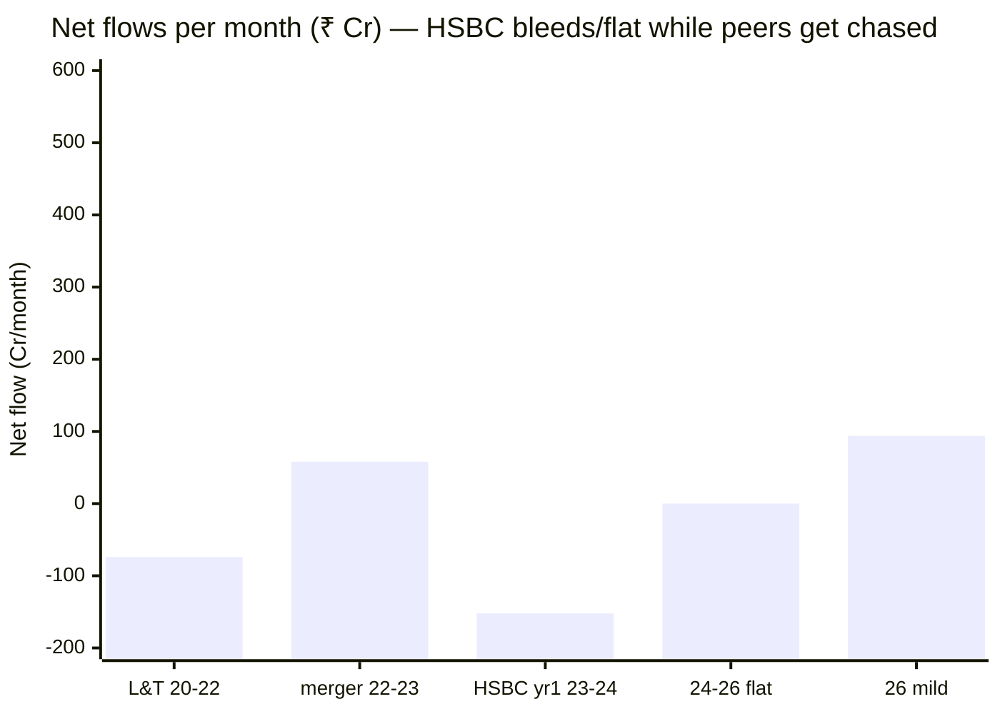
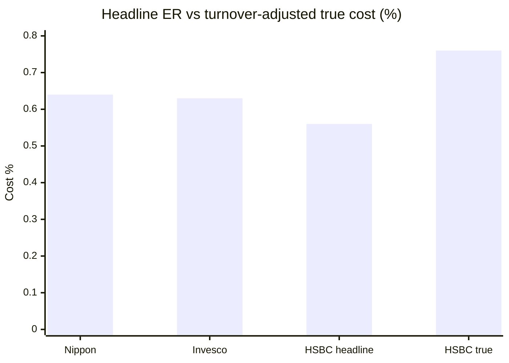

# Module 4: Cost & AUM Impact — HSBC Midcap Fund

## Module 4 Score: ~3.6 / 5 (provisional)

---

## Raw Data (Wayback-Archived + Aggregator + Computed, as of 03-Jul-2026)

| Metric | Value | Source |
|--------|-------|--------|
| **ER (Direct)** | **~0.56–0.65%** (TT 0.56 Jul-2026; Groww 0.65 Feb-2026) | TT / Groww — **official factsheet 403-blocked (gap)** |
| ER (Regular) | ~1.5–1.6% | VRO/Groww (noisy) |
| **ER glide (Direct)** | **0.77% (2022) → 0.74 → 0.66 → 0.65 → 0.56 (2026)** ≈ −27% | Wayback Groww + TT |
| **AUM** | **₹14,249 Cr** (Jul-2026) | Tickertape |
| **AUM trajectory** | L&T ₹5,776 Cr (2020) → ₹6,227 (2022) → merger → HSBC ₹6,981 (2023) → ₹9,741 (2024) → ₹14,249 Cr — **2.5× in 5.6y, almost all NAV** | Wayback Groww |
| **Net flows** | **Flat-to-negative** — L&T −₹74/mo, HSBC yr-1 **−₹152/mo**, then ≈flat, +₹94/mo now | Computed (AUM − NAV) |
| **Portfolio turnover** | **~100–120%** ⚠ (Yahoo 102.59%, AdvisorKhoj 1.21×) — **highest in the study** | Aggregators — official gap |
| **Turnover drag (est.)** | **~0.15–0.30%/yr hidden** → true all-in cost **~0.76%** | Computed |
| **Cap split (AMFI)** | Mid **69.24%** / Small 21.57% / Large 8.07% | AdvisorKhoj factsheet 31-May-2026 |
| Exit load | **1% / 365 days** (standard, no carve-out) | AMC / M1 |
| Fee premium over index fund | 0.20% index vs ~0.56% → **0.36–0.45%** headline | Computed |
| Verified net alpha (M1) | **−0.22%/yr** matched 6.8y ❌ / +4.99% Cheenu era (lumpy) | Computed (two proxies) |
| **Fee-for-alpha verdict** | **Negative base case** — fee buys negative value on the honest record | Computed |
| Ownership | HSBC AMC (Indian arm of HSBC global AM; bought L&T MF 2022) | — |
| Gating history | None (capacity a non-issue) | — |

**Data provenance & documented gaps:** the HSBC AMC factsheet PDF is **Azure-403-blocked** (as in M2/M3), so ER and turnover are triangulated, not official. **AUM/ER trajectory** recovered from **Wayback-archived Groww snapshots** (the Invesco-M4 method: CDX + `id_` raw fetch, `__NEXT_DATA__` JSON parse) — L&T Midcap ₹5,776 Cr/Nov-2020 and ₹6,227 Cr/0.77%/Jul-2022; HSBC ₹6,981 Cr/0.74%/Mar-2023, ₹9,741 Cr/0.66%/Apr-2024, ₹12,175 Cr/0.65%/Feb-2026. **Turnover** ~100–120% from Yahoo (102.59%, May-2026) + AdvisorKhoj (1.21×) + sibling HSBC Large & Mid Cap (93%); Groww's turnover field is corrupt (prints "7"). **AMFI cap split** from AdvisorKhoj. **Flows** computed by AUM−NAV decomposition against the spliced MFAPI Direct series (119807→151036). The exact official factsheet ER and turnover are the two gaps — both pinned tightly enough that no conclusion moves within the range.

---

## What Module 4 Is Really Asking

Nippon's M4 was a collision (best fee deal × worst capacity). Invesco's was the mirror (best capacity × weakest warranty). **HSBC's is a third configuration: the best capacity position of the trio colliding with the worst fee-for-alpha case.** Its two questions:

1. **Is the fee justified?** On the honest realized record, **no** — the premium over the 0.20% index fund buys *negative* alpha on the 6.8-year matched window (M1's −0.22%/yr), and the study's highest turnover adds a hidden ~0.2%/yr drag. The fee case rests entirely on extrapolating Cheenu Gupta's 3.6-year hot streak. This is the Franklin pattern in a cheaper wrapper.
2. **Is the size sustainable?** Emphatically **yes** — and for an unusual reason: the fund isn't attracting flows. AUM growth is almost all NAV, runway is effectively unlimited, and there's zero deployment strain. The capacity blessing is the flip side of a franchise warning.

The module lands at ~3.6 — the same score as Nippon, for mirror-opposite reasons.

---

## ⭐ The Flow Story — "The Fund the Market Isn't Buying" *(new — opposite of both peers)*

The AUM−NAV flow decomposition is the module's biggest surprise. Both peers were performance-chased; HSBC has been **bled or ignored**:

| Period | AUM (₹ Cr) | NAV× | **Net flow** | Rate |
|--------|-----------|------|--------------|------|
| Nov-2020 → Jul-2022 (L&T era) | 5,776 → 6,227 | 1.32× | **−₹1,420 Cr** | **−₹74/mo** |
| Jul-2022 → Mar-2023 (merger) | 6,227 → 6,981 | 1.04× | +₹506 Cr | +₹58/mo |
| Mar-2023 → Apr-2024 (HSBC yr 1) | 6,981 → 9,741 | 1.67× | **−₹1,908 Cr** | **−₹152/mo** ⚠ |
| Apr-2024 → Feb-2026 | 9,741 → 12,175 | 1.25× | **+₹7 Cr** | **≈ flat** |
| Feb-2026 → Jul-2026 | 12,175 → 14,249 | 1.14× | +₹430 Cr | +₹94/mo |

**HSBC has NOT attracted the flows Invesco (+₹540/mo, ~5% of corpus) and Nippon (+₹673/mo) did.** Its AUM growth (2.5× over 5.6 years) is almost entirely NAV — cumulative net flows since 2020 are roughly *negative*. The sharpest data point: **HSBC year one (Mar-2023 → Apr-2024) saw −₹152 Cr/month of outflows despite the NAV rising 67%** — the L&T→HSBC brand transition drove redemptions even as performance was strong. Two readings, both true:

- **Capacity blessing (M4-positive):** no forced deployment, no pro-cyclical hot-money problem, effectively unlimited runway — the best capacity position of the trio, better than Invesco (whose flows flood).
- **Franchise warning (M6-handoff):** a fund the market isn't buying signals weak HSBC distribution and lingering L&T-brand loss. And the "recency ramp" (M1) means the chase *could* still start if 2026's hot streak continues — the tap is currently **off**, not coiled-and-hot like Invesco's.

---

## ⭐ The Fee-for-Alpha Test — A Negative Base Case *(the critical row)*

The study's central M4 question — does verified net alpha exceed the fee premium over the 0.20% index fund? For HSBC the honest answer is **no, on the realized record**:

| Component | HSBC | Invesco | Nippon |
|-----------|------|---------|--------|
| Headline fee premium over index | 0.36–0.45% | 0.29–0.35% | 0.42% |
| **+ turnover drag (NEW)** | **~+0.20%** | ~+0.05% | ~0% |
| **True premium** | **~0.55%** | ~0.40% | ~0.44% |
| Verified net alpha, matched 6.8y (M1) | **−0.22%** ❌ | +2.88% ✅ | +1.97% ✅ |
| Current-manager-era alpha | +4.99% (3.6y, lumpy) | +5.1% (2.8y) | +3.0% (3.5y) |
| **Base-case verdict** | **fee buys negative value** | 8–10× margin | 5× margin |

**HSBC is the first fund since Franklin US whose fee premium buys negative alpha on the honest full-window record.** On the matched 6.8-year Nifty Midcap 150 index-fund comparison, the fund *lost* to the buyable passive (−0.22%/yr), so paying 0.36–0.55% for it made you worse off. The only way the fee justifies itself is if Cheenu Gupta's 3.6-year +4.99% persists — a coin-flip on a short, lumpy record, not a warranted process.

### The 10-Year SIP in Rupees (₹20K/month, 18% gross)

| Scenario | Net return | Corpus | vs index fund |
|----------|-----------|--------|---------------|
| Index fund (0.20% ER) | 17.80% | ₹66.4L | — |
| **HSBC, matched-window alpha −0.22% (0.56%)** | 17.22% | **₹64.0L** | **−₹2.4L** ⚠ |
| HSBC, alpha dies to zero (0.56%) | 17.44% | ₹64.9L | −₹1.5L |
| HSBC, half Cheenu alpha +2.5% | 19.94% | ₹76.2L | +₹9.8L |
| HSBC, full Cheenu alpha +4.99% | 22.43% | ₹89.7L | +₹23.3L |
| HSBC Regular (~1.6%) | 16.40% | ₹60.8L | −₹5.6L |

**The payoff table is a bet, not a bargain:** the honest historical anchor (matched −0.22%) *loses* ₹2.4L to the index; only extrapolating the current manager's hot streak wins. Contrast Invesco (realized base case +₹9L) and Nippon (positive) — both had positive *realized* base cases. HSBC's is the second-worst studied, above only Franklin's guaranteed-negative.

---

## ⭐ The Turnover Drag — The Hidden Cost That Erases the ER Advantage *(new, HSBC-specific)*

HSBC's headline Direct ER (~0.56%) looks competitive — cheaper than Nippon's 0.62%. But at **~110% turnover**, the fund trades ~₹28,500 Cr/year (buys + sells) on a ₹14,249 Cr book, incurring impact + STT + brokerage the ER doesn't capture:

| Turnover | Round-trip cost | Annual drag |
|----------|-----------------|-------------|
| 1.00× | 15 bps | ~0.15%/yr (~₹21 Cr) |
| 1.20× | 25 bps | ~0.30%/yr (~₹43 Cr) |

**~0.15–0.30%/yr of invisible cost** — and higher on the 13.1% deep-band sleeve (M3), where impact is worst. This pushes HSBC's **true all-in cost to ~0.76%**, vs Nippon's ~0.64% and Invesco's ~0.63% *despite HSBC's lower headline ER*. The turnover erases the fee advantage: on a true-cost basis HSBC leaves the cheap Nippon/Invesco/Edelweiss cluster and lands closer to ICICI/Sundaram (0.87–0.88). This dimension is HSBC-specific — Nippon (14%) and Invesco (28%) turnover have negligible drag — so it's a new lens, not a retrofit.

---

## The ER Glide & SEBI TER Positioning

| Date | AUM (₹ Cr) | ER Direct | Source |
|------|-----------:|----------:|--------|
| Jul-2022 (L&T) | 6,227 | 0.77% | Groww |
| Mar-2023 (HSBC) | 6,981 | 0.74% | Groww |
| Apr-2024 | 9,741 | 0.66% | Groww |
| Feb-2026 | 12,175 | 0.65% | Groww |
| Jul-2026 | 14,249 | **0.56%** | TT |

A modest, clean glide (0.77 → 0.56, ~−27%) — shallower than Nippon's (−56%) or Invesco's (−50%) because HSBC started lower and grew less. At ₹14,249 Cr the Direct ER (0.56%) is already competitive and below the SEBI-floor pressure Nippon faces; some headroom remains. Reconciliation: TT 0.56 vs Groww 0.65 (Feb-2026) — a genuine recent cut or basis difference; the premium over the index fund is 0.36–0.45% either way. *(Official factsheet ER = documented gap.)*

---

## Mandate Compliance — The AMFI Split (from M3, official-basis)

| Band (AMFI basis) | Weight |
|-------------------|--------|
| **Mid cap** | **69.24%** |
| Small cap | 21.57% |
| Large cap | 8.07% |

HSBC runs **comfortably above the 65% floor — more honestly mid than Invesco (64.61%, parked at the minimum)** — while keeping the flexible sleeve aggressive (21.6% small, only 8% large ballast). Mandate honored with room to spare; the sleeve points up the risk spectrum (M2/M3 confirmed).

---

## Capacity Runway, Forced Deployment & Gating

- **Runway: effectively unlimited.** At ₹14,249 Cr with flat/negative flows, HSBC won't approach the ₹25,000 Cr sweet-spot ceiling for many years — the best runway of the trio (Invesco crosses ~2029; Nippon already past). The paradox: this runway exists *because* the franchise is weak.
- **Forced deployment: none.** Flat flows mean zero deployment pressure — the ~110% turnover is therefore *pure active trading*, not flow-driven buying (confirming M3's momentum read). Contrast Invesco (₹350/mo into the band) and Nippon (₹440/mo).
- **Gating:** none needed and none in HSBC's history — capacity is a non-issue. Carry-forward: HSBC AMC is the acquisitive scale-builder (bought L&T MF 2022); the deep governance verdict is M6's (SmallCap study scored HSBC AMC ~3.37, with the 52.45% SC-drawdown question). The M4-relevant fact: HSBC is an established global-bank AMC, not a growth-mandate PE owner like Invesco's IIHL — different flow incentives, and the flat flows suggest its distribution isn't pushing this fund.

---

## Exit Load & Direct vs Regular

| Fund | Exit load |
|------|-----------|
| Nippon Growth | 1% / 1 month ⭐ lightest |
| Invesco Midcap | Nil ≤10% units/1yr; 1% excess |
| **HSBC Midcap** | **1% / 365 days** (standard, no carve-out) |
| DSP / Franklin | 1% / 12 months |
| PP FlexiCap | 2%<1yr, 1%<2yr (strictest) |

- **Exit load 1%/365d** — standard, no behavioral carve-out; middle-of-pack, heavier friction than both peers but no real filter (PP's punitive load is the contrast).
- **Direct vs Regular:** ~0.56% vs ~1.5–1.6% ≈ **~1.0% gap** — narrower than Invesco's 1.17% but still ~₹3L over a 10Y SIP. Use Direct.

---

## Peer Cost & AUM Matrix (7 Shortlisted)

| Fund | ER% (headline) | True cost (turnover-adj) | AUM (Cr) | Ladder position | Fee-for-alpha |
|------|----------------|--------------------------|----------|-----------------|---------------|
| Mahindra Manulife | 0.42 | ~0.5 | 4,866 | Small-agile | untested |
| Edelweiss | 0.48 | ~0.5 | 16,849 | Sweet spot | untested |
| Invesco | 0.49–0.55 | ~0.63 | 12,397 | Sweet spot, ~3y runway | ✅ 8–10× (weak warranty) |
| **HSBC** | **0.56** | **~0.76** ⚠ | **14,249** | **Sweet spot, unlimited runway** ⭐ | **❌ negative base case** |
| Nippon | 0.62 | ~0.64 | 47,415 | ⚠ Constraint zone | ✅ 5×, proven |
| ICICI Pru | 0.87 | ~0.9 | 7,789 | Sweet spot, pricey | untested |
| Sundaram | 0.88 | ~0.9 | 13,687 | Sweet spot, priciest | untested |

The head-to-head in one line: **HSBC sells a cheap-looking ticket on a train nobody's boarding, but the meter runs faster than the sticker (turnover) and the destination (alpha) is, on the honest map, behind the free index bus.**

---

## Comparison with Studied Funds

| Dimension | **HSBC (MidCap)** | Nippon (MidCap) | Invesco (MidCap) | DSP Small Cap | Franklin US |
|-----------|-------------------|-----------------|------------------|--------------|-------------|
| Direct ER (headline) | 0.56% | 0.62% | 0.49–0.55% | 0.64% | ~1.35% all-in |
| **True cost (turnover-adj)** | **~0.76%** ⚠ | ~0.64% | ~0.63% | ~0.7% | ~1.35% |
| Fee vs investable index | **negative base case** ❌ | +0.42% for +2.0% (stable) ✅ | +0.35% for +2.9% (episodic) ✅ | positive ✅ | +1.15% for negative ❌ |
| AUM / growth | ₹14.2K Cr, **2.5× in 5.6y (NAV)** | ₹47.4K Cr, 8.5× | ₹12.4K Cr, 13× | ₹17.9K Cr | ₹5.9K Cr |
| Net flows | **flat/negative** — market isn't buying | +₹673/mo | +₹540/mo (~5% corpus) | managed | growing |
| Capacity runway | **unlimited** ⭐ | months to cap | ~3 years | managed | unconstrained |
| Turnover | **~110%** ⚠ highest | 13.7% | 28% | ~25–30% | low |
| Gating record | none (n/a) | none (gated SC sibling) | none (growth owner) | 3 voluntary ⭐ | n/a |

**Placement:** HSBC holds the **best capacity position and the worst fee-for-alpha** of the three midcaps — an unusual split. Its true cost (~0.76%) is quietly among the highest of the "cheap" funds once turnover is counted, and its realized fee case is the second-worst studied (above only Franklin). What it uniquely offers: runway nobody else has, precisely because the market isn't buying it.

---

## Points For / Points Against — Cost & AUM

### ✅ Points For

- **Best capacity position of the trio** — ₹14,249 Cr sweet spot with flat flows → effectively unlimited runway, zero deployment strain
- **Headline Direct ER competitive** (~0.56%) with a modest glide and SEBI-floor headroom
- **No pro-cyclical hot-money problem** — unlike Invesco's 5%-of-corpus flood; slow, NAV-driven growth
- **Mandate honestly met (AMFI 69.24% mid)** — more honest than Invesco (64.61%)
- Turnover is pure active trading, not flow-forced deployment — no capacity-driven churn

### ❌ Points Against

- **Negative fee-for-alpha base case** — the premium buys negative value on the honest 6.8-yr window (−₹2.4L vs index); first since Franklin; entire case rests on Cheenu's 3.6-yr streak
- **~110% turnover adds ~0.2%/yr hidden drag** → true cost ~0.76%, erasing the headline-ER advantage (leaves the cheap cluster)
- **"The fund the market isn't buying"** — flat/negative flows despite good NAV signal a weak franchise / L&T-brand loss (→ M6)
- **Exit load 1%/365d** — no behavioral carve-out; heavier than both peers
- **The recency ramp could still trigger a chase** — if 2026 momentum continues, hot money may arrive into a ~110%-turnover momentum book
- Direct-Regular gap ~1.0% — distribution monetized, though narrower than Invesco's

---

## Module 4 Scorecard

| Sub-dimension | Weight | Score | Reasoning |
|---------------|--------|-------|-----------|
| Expense Ratio (Direct) | High | **4.0** | ~0.56–0.65% headline — in the 0.45–0.65 band; modest glide; but see turnover drag |
| **ER vs verified alpha (index-fund test)** | **Critical** | **2.5** | Matched-window alpha −0.22% + ~0.2% turnover drag → true premium ~0.55% buys *negative* value on the honest record (−₹2.4L vs index); only Cheenu's lumpy 3.6-yr +4.99 saves it — a bet, not a warranty. First negative base case since Franklin |
| AUM position on the ladder | High | **5.0** | ₹14,249 Cr dead-center sweet spot with flat flows → effectively unlimited runway — the best capacity position of the trio |
| Active-share trend as AUM grew | High | **3.5** | 69.5% now (M3); no decay evidence and no deployment pressure, but no historical series and the ~110% turnover churns the book regardless of size |
| Forced deployment | Medium | **4.5** | Flat/negative flows → no deployment strain at all; the trio's best |
| Exit load | Low | **3.5** | 1%/365d standard — no behavioral carve-out; heavier than both peers |
| AUM trajectory | Low | **4.0** | Slow, NAV-driven growth — no pro-cyclical hot-money risk (unlike Invesco); flip side is a weak-franchise signal (→ M6) |
| *Turnover-cost modifier* | *Modifier* | **−** | *~0.2%/yr hidden drag pushes true cost to ~0.76%, erasing the headline-ER advantage — HSBC-specific* |

**Module 4 Score: ~3.6 / 5** — a genuine split personality: the **best capacity position of the three midcaps** (sweet-spot size, flat flows, unlimited runway, zero deployment strain) colliding with the **worst fee-for-alpha case** (a negative base case on the honest window, worsened by the study's highest turnover). The two roughly offset, landing HSBC at **the same ~3.6 as Nippon — for mirror-opposite reasons**: Nippon has a proven fee on a dying capacity trajectory; HSBC has a coin-flip fee on a pristine capacity trajectory. **Provisional on Module 5 (does Cheenu Gupta's 3.6-yr alpha — the whole fee case — persist? the ~110% turnover philosophy) and Module 6 (the "market isn't buying" franchise signal; carry forward HSBC AMC's SmallCap verdict ~3.37).**

---

## Comparative Module 4 Scores

| Fund | Category | M4 Score | Cost/AUM character |
|------|----------|----------|--------------------|
| Invesco India Midcap | MidCap | ~4.2 | Cheap, sweet-spot, years of runway; weak warranty; new owner |
| DSP Small Cap | SmallCap | ~3.9 | Mid-priced, gold-standard gating |
| PP FlexiCap | FlexiCap | ~3.8 | Cheap, giant but segment-shielded |
| Nippon Growth Mid Cap | MidCap | ~3.6 | Proven fee-for-alpha; unmanaged capacity trajectory |
| **HSBC Midcap** | **MidCap** | **~3.6** | **Best capacity/unlimited runway; negative fee-for-alpha base case + turnover drag** |
| Franklin US Opp | International | 2.8 | Double-layer 1.35% for negative alpha |

Running module totals: **HSBC 3.5 / 3.2 / 3.7 / 3.6** vs **Nippon 4.2 / 4.4 / 4.1 / 3.6** vs **Invesco 4.3 / 4.1 / 4.0 / 4.2**.

---

## SIP Implication

1. **Use the Direct plan** — the ~1.0% Regular gap costs ~₹3L over a 10Y SIP. Standard advice, but the headline ER already understates HSBC's true cost.
2. **Know the true cost, not the sticker.** The ~0.56% ER looks cheap, but the ~110% turnover adds ~0.2%/yr of invisible drag — the real all-in cost is ~0.76%, near the pricey ICICI/Sundaram end, not the cheap Nippon/Invesco cluster.
3. **The fee decision is the manager decision.** On the honest historical record you'd have done better in the ₹0.20% index fund (−₹2.4L). The only path to justifying the fee is Cheenu Gupta's 3.6-year hot streak continuing — so this is a bet on one person, and the M4 and M5 verdicts are the same verdict.
4. **The monitoring list:** (a) whether the recency ramp triggers a flow chase into the momentum book (the tap is off, not gone); (b) turnover staying ~100%+ (the hidden cost); (c) any narrowing of the negative matched-window alpha as Cheenu's record lengthens. Capacity, uniquely, is *not* on the watch list — the fund has runway to spare.

---

## One-Line Verdict

> **HSBC Midcap's Module 4 is a split personality: the best capacity position of the three midcaps — a sweet-spot ₹14,249 Cr with flat-to-negative net flows (the fund the market isn't buying, so its 2.5× growth in 5.6 years is almost all NAV and its runway is effectively unlimited, with zero deployment strain) — colliding with the worst fee-for-alpha case of the trio: a headline 0.56% Direct ER that the study's highest turnover (~110%) inflates to a ~0.76% true cost, buying negative alpha on the honest 6.8-year matched window (−₹2.4L vs the index fund on a 10Y SIP), with the entire fee justification resting on extrapolating Cheenu Gupta's lumpy 3.6-year hot streak. It is the Franklin pattern — pay more, get less on the realized record — in a cheaper, better-capacity wrapper. The two forces offset to land level with Nippon at ~3.6, for mirror-opposite reasons. Provisional: ~3.6/5.**

---

*Module 4 completed: July 5, 2026 | Cost & AUM Impact | Primary sources: Wayback-archived Groww snapshots (AUM/ER: L&T ₹5,776 Cr Nov-2020 & ₹6,227 Cr/0.77% Jul-2022; HSBC ₹6,981 Cr/0.74% Mar-2023, ₹9,741 Cr/0.66% Apr-2024, ₹12,175 Cr/0.65% Feb-2026) + Tickertape (0.56% ER, ₹14,249 Cr Jul-2026) | Turnover ~100–120% triangulated (Yahoo 102.59%, AdvisorKhoj 1.21×, HSBC L&M 93%) — HSBC AMC factsheet Azure-403-blocked (documented gap); turnover drag ~0.15–0.30%/yr computed → true cost ~0.76% | Flow decomposition (AUM − MFAPI NAV effect): L&T −₹74/mo → HSBC yr-1 −₹152/mo → ≈flat → +₹94/mo (the fund the market isn't buying) | AMFI cap split (Mid 69.24/Small 21.57/Large 8.07) from AdvisorKhoj | Fee-for-alpha: matched 6.8y alpha −0.22% → SIP −₹2.4L vs index (negative base case, first since Franklin); Cheenu-era +4.99% is the only positive path | Exit load 1%/365d | HSBC AMC carry-forward from SmallCap (~3.37) → M6 | SIP: ₹20K/mo, 10y, 18% gross | Provisional M4 Score: ~3.6/5 (tripwires: recency-ramp flow chase, turnover cost, matched-window alpha → M5; franchise signal → M6)*
