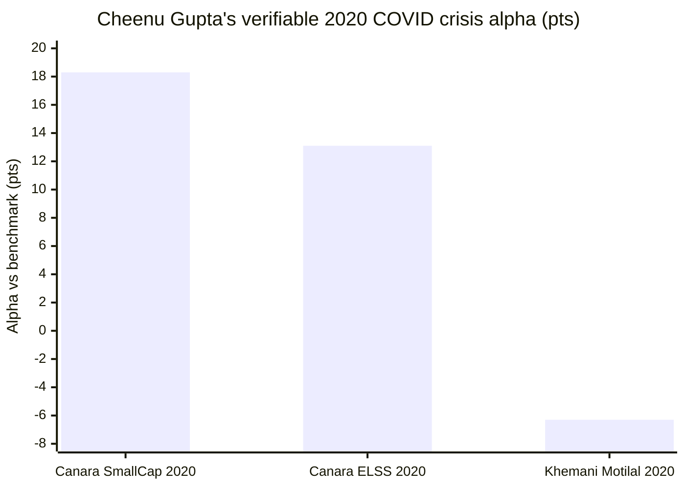
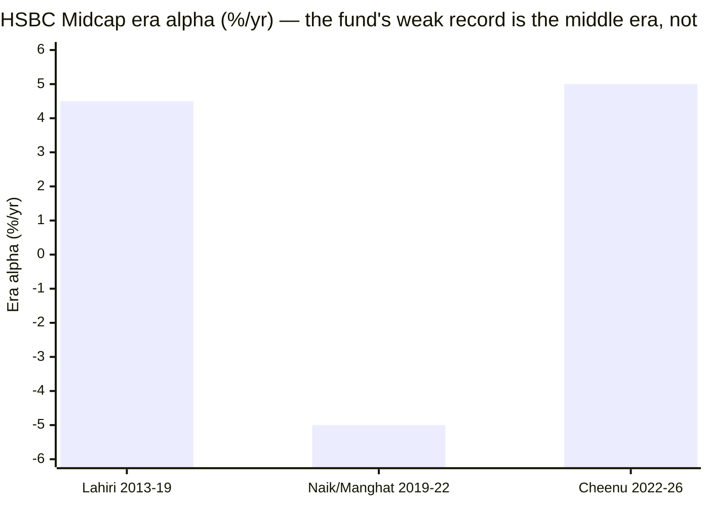

# Module 5: Fund Manager Quality — HSBC Midcap Fund

## Module 5 Score: ~3.5 / 5 (provisional) — The Manager-vs-Fund Inversion

---

## Raw Data (Cross-Source Verified + Computed, as of 05-Jul-2026)

| Field | Value | Source |
|-------|-------|--------|
| **Lead manager** | **Cheenu Gupta — since 26-Nov-2022 (3.6y), effectively SOLO equity** | HSBC factsheets / AdvisorKhoj |
| Co-manager | **Mayank Chaturvedi (01-Oct-2025) — FOREIGN SECURITIES ONLY, all 20 HSBC schemes** | HSBC one-pagers |
| Credentials | CFA (USA), PGDBM (Finance), B.E. (IT); 17y experience | HSBC / Finalyca |
| **Her workload** | **5 equity schemes:** Midcap, Large & Mid Cap, Small Cap, Focused (flexi), Value | HSBC factsheets |
| Career | UTI (2006–07) → ING IM (2007–09) → Tata AIA Life (2009–18) → **Canara Robeco (12-Mar-2018 → mid-2021)** → **HSBC (26-Nov-2022 →)** | Finalyca / RupeeIQ |
| **Verifiable pre-HSBC record** | **Canara Robeco Small Cap + ELSS TaxSaver — spans COVID 2020** | MFAPI-computed |
| Individual SEBI record | Clean — Canara Robeco + HSBC | Search-verified |
| Skin in the game | Not publicly disclosed | Documented gap |

**Method note:** the manager timeline is from HSBC factsheets/one-pagers (Cheenu since 26-Nov-2022 = merger date; Chaturvedi foreign-only since 01-Oct-2025), Finalyca and RupeeIQ (Canara Robeco tenure). Her Canara Robeco and HSBC cross-fund alphas are computed from MFAPI NAVs against investable index proxies — the Module 1 method throughout (Canara SC 146130, ELSS 118285; HSBC L&M 146772, Small Cap 151130, Focused 148411, Midcap 119807→151036; proxies Smallcap-250 147623, Nifty-50 120716, Midcap-150 147622).

---

## ⭐ The Manager-vs-Fund Inversion — The Framing *(new)*

Invesco's Module 5 was the **weak** module dragging down a strong fund — a solo star with spectacular but unverifiable alpha and the highest key-person risk studied. **HSBC's Module 5 inverts that: it is a relative bright spot on a mediocre fund.** The reason is attribution: the fund's weak M1/M2 record belongs largely to *departed legacy managers* (the Naik/Manghat 2020–22 collapse, −15 alpha in 2021), not to Cheenu Gupta — who inherited a broken book at the merger and has run **+5%/yr since**. And unlike Khemani, she brings the one thing the rubric's critical row demands: **a verifiable, good crisis record.**

The honest counter-tension — the module's central finding — is that her *tested-good* 2020 style **protected in a crash**, while her *current* HSBC Midcap book (M3's new-age, ~110%-turnover momentum book) **amplified the 2024–25 correction**. So the manager is demonstrably skilled; the question is whether the current, hotter book still expresses the style that earned the good record.

---

## What Module 5 Is Really Asking

Every prior module deferred its biggest question here:

1. **Is Cheenu Gupta's +5%/yr alpha skill or regime?** (M1's warranty question, M4's fee-case question)
2. **Has she ever navigated a real bear?** (M2's amplified-correction question)
3. **Is the ~110% turnover deliberate philosophy or drift?** (M3/M4's question)
4. **What is left if she leaves?** (the key-person question)

---

## The Chaturvedi Red Herring — She Is Structurally Solo *(correction to any "co-manager" reading)*

Aggregators list "Cheenu Gupta + Mayank Chaturvedi" on HSBC Midcap, implying a co-managed book. **It is not.** Per HSBC's own one-pagers, Chaturvedi manages *foreign securities only*, across all 20 HSBC schemes, effective 01-Oct-2025 — a nominal overlay on a domestic midcap book holding ~0% foreign. **Cheenu Gupta is the sole equity decision-maker on HSBC Midcap** — structurally solo, exactly like Invesco's Khemani, and exactly like Nippon's Patel (whose "co-manager" Kinjal Desai is also the overseas-only overlay). The Chaturvedi appointment is not succession planning; there is no named equity successor on the fund.

---

## ⭐⭐ The Pre-HSBC Ledger — The Verifiable COVID Crisis Record *(the module's centerpiece, computed)*

This is the row that was *unverifiable-to-weak* for Khemani (his only attributable crisis year, 2020 at Motilal, was −6.3 alpha; his HSBC-era midcap record was lost to the L&T merger). **Cheenu Gupta's Canara Robeco tenure (Mar-2018 → mid-2021) is fully computable and spans COVID — and she passed it emphatically.**

### Canara Robeco Small Cap (she ran it from the 19-Feb-2019 launch)

| Year | Fund | Smallcap-250 index | Alpha |
|------|------|--------------------|-------|
| 2020 (COVID) | **+44.3%** | +25.9% | **+18.3** ⭐ |
| 2021 | +73.8% | +61.2% | +12.6 |
| **COVID crash (20-Feb → 23-Mar-2020)** | **−36.2%** | −42.4% | **cushioned +6.2** |

### Canara Robeco ELSS TaxSaver (she ran it from 12-Mar-2018)

| Year | Fund | Nifty 50 | Alpha |
|------|------|----------|-------|
| 2018 | +3.5% | +4.3% | −0.8 |
| 2019 | +11.8% | +13.3% | −1.6 |
| 2020 (COVID) | **+28.7%** | +15.6% | **+13.1** ⭐ |
| **COVID crash** | **−33.6%** | −37.2% | **cushioned +3.6** |

**She navigated the 2020 crisis well across two different mandates — cushioning both crashes AND capturing both recoveries.** This is the single most important biographical fact in HSBC's Module 5, and it flips the Invesco comparison: Khemani's verifiable crisis was a *loss*; Cheenu's is a *win*. It also materially strengthens M4's fee-for-alpha "warranty" (see Contradictions) — the fee case does *not* rest on a wholly untested manager.

**But note the fingerprint honestly:** her ELSS tenure alpha (+5.9/yr) is *entirely* the 2020 spike — 2018 (−0.8) and 2019 (−1.6) were slight lags. Her verifiable pre-HSBC alpha is, like Khemani's, essentially one great regime year — hers just happens to be a *crisis* year she protected in, rather than a momentum year she rode.

---

## ⭐ Cross-Fund Validation at HSBC — The Style Replicates, With One Flat Fund *(computed)*

Her four HSBC equity mandates over her tenure (Nov-2022 → Jul-2026, 3.6y), each vs its own investable benchmark:

| Fund | CAGR | Benchmark proxy | **Alpha/yr** |
|------|------|-----------------|--------------|
| HSBC **Focused** (flexi) | 14.9% | Nifty 50 | **+6.1** |
| HSBC **Large & Mid Cap** | 19.5% | 50/50 Nifty50+Mid150 | **+5.1** |
| HSBC **Midcap** | 25.1% | Midcap 150 fund | **+5.0** |
| HSBC **Small Cap** | 19.3% | Smallcap 250 fund | **+0.1** ⚠ |

Three of four show a consistent **+5–6%/yr**, but Small Cap is flat — so this is *not* "everything she touches wins" (contrast Khemani's uniform +7.6/+9.4/+11.3). More telling is the **calendar fingerprint, identical across all four funds:**

| Fund | 2023 | 2024 | 2025 | 2026 |
|------|------|------|------|------|
| Midcap alpha | −2.8 | **+17.0** | −6.1 | **+10.3** |
| Large & Mid alpha | −1.0 | **+23.0** | −11.2 | **+9.6** |
| Small Cap alpha | −0.8 | +3.4 | −5.0 | +3.7 |
| Focused alpha | +9.9 | **+14.5** | −8.7 | **+7.9** |

**Every fund: big positive alpha in 2024 and 2026, negative in 2023 and 2025.** This replication across four mandates proves it's a genuine *style*, not fund-specific luck — the strongest short-window skill evidence for her. But the style is unambiguously **regime-dependent and lumpy**: it wins momentum/recovery years and loses grind/rotation years, a 2-good / 2-bad split over four years. Same shape as Khemani's, at lower amplitude.

---

## ⭐ The Central Tension — Protected in 2020, Amplified in 2025 *(new — the style-drift question)*

The finding that makes HSBC's manager question unique. Cheenu Gupta's downside behavior is *inconsistent* across her two crises:

| Crisis | Book | Behavior |
|--------|------|----------|
| **2020 COVID crash** | Canara Robeco Small Cap / ELSS | **CUSHIONED** (−36% vs −42% smallcap; −34% vs −37% Nifty) |
| **2024–25 correction** | HSBC Midcap (M2) | **AMPLIFIED** (Jan-2025 −13.6% vs index −6.1%, 2.2×) |

The style that earned the good 2020 record protected on the way down; the current HSBC Midcap book — the new-age-heavy, ~110%-turnover momentum book of M3 — did the opposite in the last correction. **Either the current book is a materially hotter expression than her tested-good 2018–21 style (drift), or the difference is mandate/regime (midcap new-age vs small-cap/multicap; sharp-V vs grind).** This is the honest limit on how much reassurance the 2020 record gives for the fund you'd buy today: the manager is proven competent, but the *current book* has not inherited the 2020 protectiveness. It needs the next grind-correction to settle — and it is the M5 version of M3/M4's "philosophy or drift?"

---

## The Era-Attribution Table (template centerpiece)

HSBC Midcap's returns, by manager era (from M1/M2):

| Era | Window | Era alpha vs index | Shape |
|-----|--------|--------------------|-------|
| **Lahiri** | 2013 → Dec-2019 | ~+4–5/yr, positive every year | Defensive; won the 2018–19 winter |
| **Naik/Manghat** | Dec-2019 → Nov-2022 | negative (−15 in 2021) | The collapse |
| **Cheenu Gupta** | Nov-2022 → now (3.6y) | **+5.0/yr** | Lumpy: 2024+/2025−; new-age momentum |

Her +5.0/yr midcap era alpha is **mid-pack** — above Nippon's Patel (+3.0) and Invesco's Gokhale (+3.1), below Khemani (+9.4). The key point: **the fund's weak M1/M2 record is largely the Naik/Manghat collapse, NOT Cheenu** — she inherited a broken book and has run +5/yr since. The manager is better than the fund's trailing numbers imply.

---

## Investment Philosophy — Stated vs the Book

- **Stated (HSBC material):** growth-oriented, bottom-up, "buy quality businesses with earnings visibility"; the fund's marketing is "powered by potential, driven by growth."
- **Behaviour-verified:** the book is a genuinely active (69.5% AS), thematically-spined (electrification + new-age, M3) momentum book run at **~110% turnover** — the highest in the study. The consistent 2024+/2025− calendar shape across four funds confirms a coherent *tactical growth* style. What the marketing undersells: the **new-age tilt** (Nykaa, Lenskart, PB Fintech, Groww) and the **trading intensity** — this is an actively-rotated book, not a buy-and-hold quality compounder. Whether the ~110% turnover is disciplined tactical rotation or churn is unresolved; the lumpy results (2 negative-alpha years in 4) argue it doesn't always pay.

### Philosophy Under Real Market Pressure

| Test | Behaviour | Verdict |
|------|-----------|---------|
| 2020 COVID (Canara Robeco) | Cushioned both crashes, captured both recoveries | ✅ verifiable crisis win |
| 2024 momentum market | +41.2%, +17.0 alpha | ✅ style at full throttle |
| 2024–25 correction (this fund) | −13.6% Jan-2025 vs index −6.1% — amplified | ⚠ the current book's protectiveness is gone |
| 2026 recovery | +13.3% YTD, +10.3 alpha | ✅ leads the rebound |
| Grind years (2023, 2025) | negative alpha across all 4 funds | ⚠ style lags rotation years |

The pattern is coherent: **the style protects in sharp crashes (2020), wins momentum/recovery years (2020-recovery, 2021, 2024, 2026), and lags grind/rotation years (2018–19, 2023, 2025)** — with the 2024–25 correction the one break in the protection record.

---

## The Bench, Key-Person Risk & Workload

| Person | Role | Note |
|--------|------|------|
| **Cheenu Gupta** | Lead equity, 5 schemes | SVP, internal since 2022; 3.6y on Midcap |
| Mayank Chaturvedi | Foreign securities overlay | Nominal on domestic midcap |
| **On the Midcap equity book** | **Nobody else** | No equity co-PM, no named successor |

**Key-person risk: HIGH — but lower than Invesco's.** Cheenu is structurally solo on the equity book (like Khemani), and HSBC's history is itself a manager-discontinuity story (the entire L&T team departed at the merger — Lahiri long gone, Naik/Manghat out). The mitigants vs Invesco: she's an *internal* hire (not an external parachute), *longer*-tenured (3.6 vs 2.6y), and a franchise player across 5 funds. The risks: she's a poachable senior SVP (the Ganatra-to-HDFC precedent at Invesco shows what rivals pay for this tier of talent), and HSBC — like Invesco — is *monetizing* her (5 equity schemes, a Value Fund added) rather than protecting her bandwidth. If she leaves, the era table (three-for-three character changes) says the fund's character would break again.

---

## Capacity Stewardship — Untested (No Flood to Gate)

No gate, no cap, no communication — but unlike Invesco (which failed to gate a 5%-of-corpus flood) and Nippon (which gated its SC sibling but not midcap), **HSBC Midcap has had no flood to gate** (M4: flat/negative flows). Cheenu hasn't *failed* a capacity test; she hasn't *faced* one. Neutral — better than Invesco's failed-flood 2.5, but no positive stewardship evidence either. Score 3.0.

---

## Skin in the Game, Communication, Regulatory

- **Skin in the game:** undisclosed (SAI-tier; same treatment as all sibling studies). Neutral, 3.0.
- **Investor communication:** HSBC publishes rich product notes, one-pagers and fund-lens documents; Cheenu does the ET/Moneycontrol interview circuit. Adequate, not a differentiator. 3.5.
- **Regulatory record:** clean — no SEBI action against Cheenu Gupta across Canara Robeco and HSBC tenures. 4.5.

---

## Peer Manager Comparison (Cross-Study)

| | **Cheenu Gupta (HSBC)** | Khemani (Invesco) | Patel (Nippon) | Sambre (DSP) | Bowers (Franklin) |
|---|---|---|---|---|---|
| Tenure on fund | 3.6y | 2.6y ❌ | 3.5y | 14y ⭐ | 19y |
| Handover | internal (merger) | external parachute | groomed inside | founder-era | n/a |
| **Verifiable crisis record** | **✅ 2020 GOOD** (+18.3 SC, +13.1 ELSS, cushioned) | ❌ 2020 weak (−6.3) | ⚠ (Gunwani's winter) | ✅ multiple | ❌ |
| 2024–25 on this fund | ❌ amplified (−13.6 vs −6.1) | ✅ passed | ✅ passed | ✅ | ❌ |
| Era alpha on fund | +5.0/yr | +9.4/yr ⭐ | +3.0/yr | positive | negative |
| Cross-fund replication | ✅ +5–6 on 3/4 (one flat) | ✅ +7.6/9.4/11.3 | — | — | — |
| Effectively solo equity | ✅ (Chaturvedi foreign-only) | ✅ (no co) | ✅ (Desai foreign-only) | mostly | n/a |
| Key-person risk | HIGH (internal, longer) | HIGHEST | LOW (proven machine) | medium | low-engine |

**The unique cell:** Cheenu Gupta is the only studied manager whose *verifiable crisis record is a clear win* yet whose *current book behaved worse in the last correction than her tested style* — a competence-confirmed manager running a book that may have drifted hotter than the style that confirmed it.

---

## Points For / Points Against — Fund Manager Quality

### ✅ Points For

- **⭐ A verifiable, GOOD crisis record** — 2020 COVID passed well across two funds (+18.3 SC, +13.1 ELSS, cushioned both crashes) — the exact test Khemani couldn't provide
- **Cross-fund replication** — +5–6/yr on three of four HSBC funds, identical calendar fingerprint = a genuine, real style
- **Longer tenure than Invesco's lead (3.6 vs 2.6y), internal continuity** — not an external parachute
- **The fund's weak record is legacy, not hers** — she inherited the Naik/Manghat collapse and has run +5/yr since (era table)
- **2026 recovery leadership** — +10.3 alpha, leads the rebound
- Clean individual regulatory record; adequate communication

### ❌ Points Against

- **Structurally solo on the equity book** — Chaturvedi is foreign-only; no equity co-PM or successor; a poachable senior SVP
- **The current book AMPLIFIED the 2024–25 correction** (−13.6 vs −6.1) — the inverse of her 2020 protectiveness; style-drift unresolved
- **Lower, lumpier alpha than Khemani** — +5–6 vs +9–11, with 2 negative-alpha years in 4; one flat fund (Small Cap +0.1)
- **~110% turnover** — process or churn unresolved; the tactical trading doesn't always pay (grind-year lags)
- **Monetized, not protected** — 5 equity schemes, a Value Fund added; no bandwidth protection
- Capacity stewardship untested (no flood); skin in the game undisclosed

---

## Module 5 Scorecard

| Sub-dimension | Weight | Score | Reasoning |
|---------------|--------|-------|-----------|
| Manager tenure on this fund | High | **3.5** | 3.6y, effectively solo, internal — longer than Khemani (2.6), similar to Patel; no equity successor |
| **2018–19 winter / bear-market navigation** | **Critical** | **3.5** | Not on this fund (Lahiri's medal), but a *verifiable good crisis* substitute — 2020 COVID passed well across two funds (cushioned both crashes). Above Khemani's 3.0 (his 2020 was weak); held from 4.0 because it wasn't the 2018–19 grind, she missed 2022 (job gap), and her current book amplified 2025 |
| 2024–25 correction navigation | High | **3.0** | On *this* fund she **amplified** it (−13.6 vs −6.1, worst of trio), though 2026 recovered strongly — the inverse of her 2020 protectiveness |
| Sell/graduation discipline | High | **3.0** | ~110% turnover — highly active, legible, momentum-consistent; but lumpy results question whether the tactical trading is discipline or churn |
| Philosophy clarity | High | **3.5** | Coherent tactical-growth style replicated across 4 funds; but no manifesto, and the ~110% turnover / new-age tilt isn't clearly articulated |
| Capacity stewardship | Medium | **3.0** | No gate, but no flood to gate (flat flows) — untested, neutral; better than Invesco's failed-flood 2.5 |
| Skin in the game | Low | **3.0** | Undisclosed — neutral |
| Investor communication | Medium | **3.5** | Rich product notes / one-pagers; interview circuit |
| SEBI/regulatory record | High | **4.5** | Clean across Canara Robeco + HSBC |
| *Style-drift / solo-equity modifier* | *Modifier* | **−** | *Tested-good 2020 style vs amplified-2025 current book; structurally solo equity, poachable SVP, monetized across 5 schemes* |

**Module 5 Score: ~3.5 / 5** — a hair above Invesco's 3.4, and the reasoning is the argument: **on manager quality specifically, Cheenu Gupta grades out slightly better than Khemani** — a verifiable *good* crisis record where his was a loss, longer tenure, internal continuity, a genuinely replicated style — even though her alpha is lower and lumpier and her current book amplified the last correction. It is the fund's second-best module (after M3), and it carries a genuine inversion: **the manager is better than the fund's trailing numbers, because those numbers are weighed down by a legacy she didn't create.** **Provisional on Module 6 (HSBC AMC's retention/culture and the "market isn't buying" franchise signal) and on the unresolved style-drift question (does the current hot book keep amplifying corrections?).**

---

## Comparative Module 5 Scores

| Fund | Category | M5 Score | Manager character |
|------|----------|----------|--------------------|
| PP FlexiCap | FlexiCap | ~4.5 | Manifesto-grade philosophy, 13y continuity |
| DSP Small Cap | SmallCap | ~4.3 | 14y single-fund craftsman + gating stewardship |
| **HSBC Midcap** | **MidCap** | **~3.5** | **Verifiable-good crisis record + replicated style, on a solo equity book that has drifted hotter** |
| Nippon Growth Mid Cap | MidCap | ~3.5 | The instability paradox — machine outranks person |
| Invesco India Midcap | MidCap | ~3.4 | The solo-star inversion — highest alpha, highest key-person risk, unverifiable crisis |
| Franklin US Opp | International | 3.4 | The stability paradox — 19y continuity, lagging output |

---

## SIP Implication

1. **You are buying a genuinely competent, verifiable manager — but a hotter book than her record was earned on.** Cheenu Gupta's 2020 crisis win and 4-fund replication are real reassurance; the caveat is that her *current* HSBC Midcap book (new-age, ~110% turnover) amplified the last correction, so the 2020 protectiveness may not transfer.
2. **Expect the lumpiness.** The verifiable pattern (2018 −0.8, 2019 −1.6, 2020 +13/+18, 2023 −2.8, 2024 +17, 2025 −6, 2026 +10) says grind/rotation years will print negative alpha and momentum/recovery years will print big — judge her over a full cycle, not a single print.
3. **Pre-decide the exit protocol.** She is structurally solo on the equity book with no named successor; a departure would break the fund's character (the era table is three-for-three). If she leaves, pause fresh SIP and re-underwrite against the index fund — the M4 payoff table collapses to its negative base case.
4. **The bullish signals to watch:** a named equity co-PM/successor (de-risks the solo cockpit), a first-ever flow restriction if the recency ramp triggers a chase, or the ~110% turnover falling toward a genuine buy-and-hold discipline (which would also cut M4's hidden cost). Their absence is the risk that compounds.

---

## One-Line Verdict

> **HSBC Midcap's Module 5 is the manager-vs-fund inversion — a relative bright spot on a mediocre fund, because the fund's weak record is a departed-legacy story (the Naik/Manghat collapse) and the current manager, Cheenu Gupta, is genuinely better-tested than Invesco's Khemani: a verifiable GOOD crisis record (2020 COVID, +18.3 alpha in small-cap and +13.1 in multicap, cushioning both crashes — where Khemani's verifiable 2020 was a −6.3 loss), a coherent style replicated across four HSBC funds (+5–6/yr, identical 2024-up/2025-down fingerprint), a longer tenure (3.6y) and internal continuity. The offsetting truths: her alpha is lower and lumpier (2 negative-alpha years in 4, one flat fund), she is structurally solo on the equity book (Chaturvedi is a foreign-only overlay) with no named successor, and — the central tension — her tested-good 2020 style PROTECTED in a crash while her current new-age, ~110%-turnover book AMPLIFIED the 2024–25 correction, leaving open whether the book has drifted hotter than the style that earned the record. Scored ~3.5/5 — a hair above Invesco, on the strength of the verifiable crisis and longer tenure. You are buying a proven manager running a book that may have outgrown her proof.**

---

*Module 5 completed: July 5, 2026 | Fund Manager Quality | Manager: Cheenu Gupta (CFA), HSBC Midcap since 26-Nov-2022 (3.6y, effectively solo equity); Chaturvedi foreign-securities-only co-manager since 01-Oct-2025 | Career: UTI → ING → Tata AIA (2009–18) → Canara Robeco (12-Mar-2018 → mid-2021) → HSBC (Nov-2022) | Verifiable crisis record computed: Canara Robeco Small Cap 146130 (2020 +44.3 vs sc250 +25.9 = +18.3; COVID crash −36.2 vs −42.4) + ELSS TaxSaver 118285 (2020 +28.7 vs Nifty +15.6 = +13.1; crash −33.6 vs −37.2) — both cushioned | Cross-fund validation (Nov-2022→Jul-2026): HSBC Midcap +5.0, Large&Mid +5.1, Focused +6.1, Small Cap +0.1; identical 2024+/2025− calendar fingerprint across all four = genuine style | Central tension: protected 2020 crash vs amplified 2024–25 correction (style-drift unresolved) | Era alpha +5.0/yr (mid-pack); fund's weak M1/M2 = Naik/Manghat legacy, not Cheenu | Skin-in-game undisclosed; clean SEBI record | Provisional M5 Score: ~3.5/5 (style-drift + solo-equity flagged; M6 owns AMC retention/franchise; optional M4 fee-for-alpha warranty upgrade noted)*
