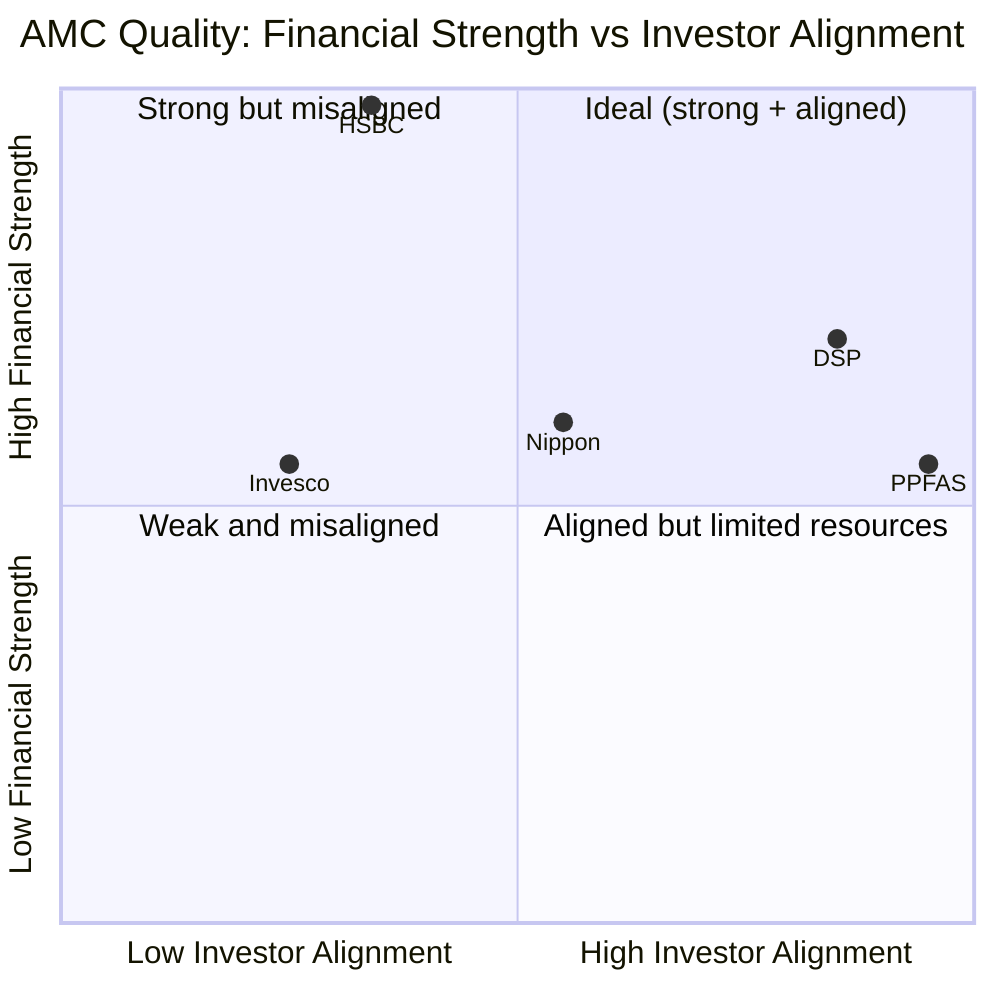

# Module 6: AMC Trustworthiness — HSBC Midcap Fund

## Module 6 Score: ~3.4 / 5 (provisional) — Carry-Forward from the HSBC SmallCap Verdict

*Carry-forward base: [HSBC SmallCap Module 6](../../../SmallCap/funds/hsbc/module6_amc.md) (3.4/5). This file updates it with July-2026 confirmation and midcap-specific evidence per the study plan's carry-forward discipline.*

---

## Raw Data (Carry-Forward + July-2026 Confirmation)

| Metric | Value | Δ vs SmallCap study |
|--------|-------|---------------------|
| **AMC** | **HSBC Asset Management (India) Pvt Ltd** — 100% HSBC Holdings plc | unchanged |
| Indian AMC AUM (Mar-2026) | **₹1,36,788 Cr** (~351 schemes incl. variants; 21 equity, 13 debt, 8 hybrid, 2 money-mkt) | confirmed (~₹1.36L Cr) |
| Global HSBC Asset Mgmt AUM (Mar-2026) | **$876 billion** | new data point |
| **Parent — HSBC Holdings plc** | Founded 1865; **$3.23T assets, $29.9B PAT (2025)**, ~10th-largest bank globally | unchanged |
| **MD & CEO** | **Kailash Kulkarni** (ex-L&T IM CEO; now also on a **SEBI advisory committee**) | confirmed + mild positive |
| **CIO-Equity** | **Venugopal Manghat** (28y; ex-L&T Head-Equity May-2016 → Nov-2022) | confirmed — see governance note |
| Fund-level manager | **Cheenu Gupta** (M5) | — |
| L&T acquisition | **$425M (~₹3,200 Cr)**; completed 25-Nov-2022; L&T MF ceased Apr-2023 | unchanged |
| Ownership | 100% HSBC Securities & Capital Markets (India) → HSBC Group → HSBC Holdings plc | unchanged |
| Trustee / Custodian / RTA | HSBC Trustees (India) / Citibank N.A. / CAMS | unchanged |
| **SEBI action** | **₹5 lakh §15HB** (L&T-era investment-documentation lapse, 2019–21 inspection); **no new action in 3.6y under HSBC** | confirmed clean-since |
| Skin-in-the-game / Quarterly letters | **Not disclosed / No** | unchanged |
| New product | **HSBC RedHex SIF** launched 2026 (Specialized Investment Fund) | new |

**Sources:** HSBC SmallCap Module 6 (carry-forward base); HSBC Asset Management governance page (Kulkarni CEO, Manghat CIO-Equity); ValueResearch/YouTube Manghat interviews (28y, ex-L&T Head-Equity 2016–22); BusinessToday/AMFI (₹1,36,788 Cr Mar-2026); HSBC Holdings Annual Results 2025 ($3.23T, $29.9B PAT, $876B global AM); SEBI §15HB order; M4 flow decomposition (the new midcap evidence).

---

## What Module 6 Is Really Asking, and the Carry-Forward Verdict

You can back a decent manager (M5), a distinctive portfolio (M3), and pristine capacity (M4) — but if the *house* around them is regulatorily compromised, culturally indifferent, or institutionally unstable, everything else can unravel. Module 6 evaluates the institution.

The institution here is the same one studied in HSBC SmallCap, and its profile is unchanged and internally contradictory: **financially the strongest AMC in any of the four studies** ($3.23T parent) yet **structurally the least investor-aligned of the mid-tier houses** — a bank-owned, open-door, distribution-narrative AMC operating an *acquired* fund lineup with a §15HB regulatory legacy, undisclosed skin-in-game, and minimal investor communication. Per the study plan's carry-forward discipline, the base verdict (**3.4/5**) transfers; this module updates only what midcap data changes. **The midcap data changes one thing materially — and it MODERATES, rather than deepens, the SmallCap study's central criticism.**

---

## ⭐ The Franchise-Commitment Paradox — The Midcap Finding That Moderates the SmallCap Thesis *(new — the M4 handoff)*

The SmallCap Module 6's central criticism was: **"bank-owned = distribution-first = open-door AUM machine = AUM over investors"** — evidenced by HSBC SmallCap growing to ₹16,877 Cr with never a flow restriction. That thesis predicts HSBC would flood *every* fund it owns.

**M4's midcap flow data breaks the prediction.** HSBC Midcap has **flat-to-negative net flows** (−₹152 Cr/month in HSBC year one *despite* the NAV rising 67%; ≈flat since) — the fund the market isn't buying. A true "distribution machine" with the world's 10th-largest bank behind it would have force-fed a ₹14,249 Cr midcap fund. It didn't. Two reconciling facts:

1. **HSBC exited Indian *retail* banking in 2016** — it has no captive branch/RM network of the kind SBI, ICICI, HDFC or Kotak AMCs use to push funds. Its Indian distribution muscle is far weaker than "$3.23T parent" implies.
2. **HSBC's Indian AUM growth has been category-momentum-driven, not push-driven** — SmallCap rode the 2021–24 small-cap wave; Midcap (post-collapse, unglamorous until 2026) languished. HSBC rides hot categories; it does not force-feed weak funds.

**The honest refinement:** HSBC's open-door *intent* is real (no gating culture), but its ability to *exploit* it is demand-led and distribution-thin. For the **midcap investor specifically, this is a net positive on capacity** — the AUM-bloat harm the SmallCap module feared simply does not manifest here (M4's pristine, effectively-unlimited runway). The offsetting concern is **franchise commitment:** a global bank that isn't growing this fund may under-resource or eventually rationalize it — a fund drifting rather than championed.

> **⭐ Retrofit recommendation:** the SmallCap M6's "distribution-first AUM machine" framing should be caveated — HSBC's *intent* is open-door, but its *distribution muscle in India is weaker than assumed* (2016 retail exit). The midcap flat-flow data is the evidence. Worth a one-line patch to the SmallCap file.

---

## ⭐ The Manghat-as-CIO Governance Note *(new, midcap-specific)*

Venugopal Manghat — now **CIO-Equity**, overseeing all HSBC equity including Cheenu Gupta — is the **same Manghat who co-managed L&T/HSBC Midcap during the 2019–2022 collapse era** (M1/M2/M5: the −15-alpha 2021, the up-77/down-78/Sharpe-0.52 worst era of the fund's modern history). Two readings:

- **Mild negative:** the co-architect of the fund's worst modern stretch was promoted to head all HSBC equity — a signal that the collapse wasn't held against him.
- **Mitigant:** he's a 28-year veteran and the L&T equity-continuity anchor; the 2020–22 weakness was a value-style-out-of-favour episode, not misconduct; he no longer runs Midcap (Cheenu does); and his public presence (VRO/YouTube market-outlook interviews) is one of HSBC's few investor-communication bright spots.

A two-sided observation, not a score-mover — but a genuine midcap-specific governance data point the SmallCap study (where Manghat was the *fund* manager, not framed as the collapse-era Midcap co-manager) didn't surface.

---

## Fund-Suite Coherence & Launch-Timing *(study-plan M6 point, midcap angle)*

- **HSBC Midcap is an *acquired* fund** (ex-L&T Midcap, itself ex-DBS Chola) — **not launched at a market top to harvest flows.** No launch-timing governance flag (contrast Invesco M6's five-NFOs-at-the-top finding). HSBC inherited a coherent, decades-old midcap franchise.
- **Product expansion continues** — the RedHex SIF (2026) and post-merger NFOs reflect the standard flow-first product proliferation of a scale-building AMC, milder than Invesco's NFO factory.
- **Verdict:** HSBC runs midcap as an inherited-but-genuine franchise; the concern is not top-timing (there was none) but under-commitment (the flat flows).

---

## Capacity Conduct *(study-plan M6 point)*

Carry-forward: **HSBC has no gating history on any fund** — the open-door culture the SmallCap module flagged. For midcap specifically, this is **untested** — there has been no flood to gate (M4). HSBC has no equivalent of the Mirae Emerging Bluechip investor-first restriction (the category's gold standard), and its scale-building, distribution-thin owner has no structural incentive to gate. Same neutral-to-negative read as SmallCap, but with no *realized* harm on this fund.

---

## Carry-Forward Dimensions (Unchanged from the SmallCap 3.4 Verdict)

- **Fortress financial stability (5/5)** — $3.23T parent; zero closure/funding-stress risk; research infrastructure, talent and operations will never be cut for financial reasons. HSBC's unambiguous strength and the single best financial backstop in any of the four studies.
- **Bank-owned ownership conflict (3.0)** — 100% foreign-bank-owned; captive-distribution incentive *in principle*; India historically non-core (the 2016 retail-exit precedent proves HSBC will de-prioritise Indian businesses when global strategy shifts); no founder/family wealth at stake. The $425M L&T bet signals genuine (if scale-motivated) commitment.
- **§15HB regulatory legacy (3.8)** — L&T-era investment-documentation lapse (2019–21 inspection); sits closer to the investment process than DSP's ETF-pricing slip; inherited, not created; **clean under HSBC for 3.6 years**. All managers personally clean, Cheenu Gupta included (M5).
- **Grafted heritage (3.5)** — four disconnected clocks (1865 global bank / 2002 India AMC / the fund's 2004–2014 L&T/Chola lineage / 2022 HSBC ownership); assembled, not continuous, unlike DSP's 160-year single strand.
- **Skin-in-the-game (2.5)** — undisclosed beyond the SEBI variable-pay minimum; no voluntary co-investment policy.
- **Investor communication (2.8)** — no quarterly unitholder letters; a distribution-narrative CEO (the Hubbis "next phase of wealth creation" register, not investor education); Manghat's interview presence the one bright spot.
- **Scheme discipline (3.2)** — ~44 distinct schemes at ₹1.36L Cr (~₹3,100 Cr/scheme, above economic scale); post-merger consolidation complete; RedHex SIF adds mild proliferation.
- **Succession & continuity (3.0)** — Kulkarni and Manghat retained from L&T (acquired talent, not HSBC-grown); the M5 key-person risk (Cheenu poachable, no named equity successor) is an AMC-retention concern too — though, unlike Invesco (Ganatra→HDFC), HSBC has had no star-equity departure.

---

## Fortress Parent vs Aligned Owner — The Positioning

HSBC sits in the upper-left: extreme financial strength, below-average investor alignment. The midcap data nudges its alignment estimate *slightly right* of the SmallCap reading — because the AUM-bloat harm didn't manifest on this fund — but the structural position is unchanged and stable.

---

## Peer AMC Comparison (Cross-Study, All Four Categories)

| AMC | M6 | Character |
|-----|-----|-----------|
| PPFAS | ~4.5 | Investor-first gold standard |
| DSP | 4.3 | 160-yr heritage, all-employee skin, flow discipline |
| **HSBC** | **3.4** | **Fortress parent, grafted heritage, bank-owned open-door — but distribution-thin in India** |
| Nippon | 3.4 | Superb machine, Yes-Bank-AT1-scarred institution |
| Bandhan | 3.2 | Clean 25-yr record, PE-clock risk |
| BOI | 3.2 | Small PSU-backed |
| Franklin | 2.8 | 2020 debt-freeze scar |
| Invesco | 2.4 | SEBI settlement, CEO-named, NFO factory, IIHL flux |

**HSBC ties Nippon at 3.4** — but the shapes differ: Nippon is a *superb engine in a scarred institution* (Yes Bank AT1 quid-pro-quo); HSBC is a *mediocre engine in a stable-but-misaligned institution*. HSBC sits comfortably mid-table — well above Invesco (2.4, the midcap trio's institutional laggard), level with Nippon, well below DSP/PP.

---

## Points For / Points Against — AMC Quality

### ✅ Points For

1. **Fortress parent** — $3.23T assets, $29.9B PAT; zero financial-stress risk; the strongest backstop in any study
2. **Clean under HSBC for 3.6 years** — no new SEBI action since the acquisition; the §15HB penalty is inherited L&T-era
3. **Experienced leadership continuity** — Kulkarni (CEO, now on a SEBI advisory committee) + Manghat (CIO, 28y) retained; no disruption
4. **Tier-1 infrastructure** — Citibank custodian, CAMS RTA
5. **⭐ No AUM-bloat harm on this fund** — the open-door concern doesn't manifest for midcap (flat flows, pristine capacity); distribution-thin in India is, here, an investor positive
6. **Acquired, not top-launched franchise** — no flow-harvesting launch-timing flag
7. All equity managers personally clean (Cheenu included)

### ❌ Points Against

1. **Bank-owned structural conflict** — 100% foreign-bank ownership; open-door, no-gating culture; distribution-narrative CEO
2. **§15HB investment-documentation legacy** — closer to the investment process than most peers' penalties; carried by the inherited entity
3. **Grafted, not grown heritage** — four disconnected clocks; the fund's DNA is L&T/Chola's, not HSBC's
4. **Skin-in-game undisclosed; no quarterly letters; minimal investor-education culture** — the three investor-first markers all absent
5. **India-exit precedent (2016 retail banking)** — HSBC will de-prioritise Indian businesses when global strategy shifts
6. **⭐ Franchise under-commitment** — the flat flows show HSBC isn't growing this fund; a drifting rather than championed scheme, with under-resourcing risk over time
7. **⭐ Manghat-as-CIO** — the collapse-era Midcap co-manager now heads all equity
8. **Key-person retention untested** — Cheenu is a poachable SVP with no named equity successor (M5)

---

## Module 6 Scorecard

| Sub-dimension | Score | Reasoning |
|---------------|-------|-----------|
| Regulatory cleanliness | **3.8** | ₹5L §15HB (L&T-era investment documentation); no new action in 3.6y under HSBC; all managers clean |
| Ownership independence | **3.0** | 100% foreign-bank-owned; captive-distribution incentive; 2016 India-retail-exit precedent; $425M bet = genuine commitment |
| Heritage & institutional depth | **3.5** | Fortress parent + 24y India AMC, but grafted four-clock heritage; not DSP's continuous DNA |
| Skin-in-the-game | **2.5** | Undisclosed beyond SEBI minimum |
| Financial stability | **5.0** | $3.23T parent; zero stress risk; the unambiguous strength |
| Investor-first culture | **2.5** | Open-door, no gating culture — *but* no midcap bloat manifested (flat flows); AMC-level intent unchanged, realized harm absent here |
| Investor communication | **2.8** | No quarterly letters; distribution-narrative CEO; Manghat interviews the bright spot |
| Scheme discipline | **3.2** | ~44 schemes reasonable; RedHex SIF + NFOs mild proliferation |
| Succession & continuity | **3.0** | Kulkarni/Manghat retained (acquired talent); Cheenu key-person/retention risk (M5) |
| **Module 6 Overall** | **~3.4 / 5** | Fortress parent (5) is the genuine strength; everything else below DSP; the bank-owned open-door concern is real in intent but — new for midcap — unrealized, because HSBC's Indian distribution can't force-feed a fund the market isn't buying |

**Module 6 Score: ~3.4 / 5** — identical to the SmallCap AMC verdict, as the carry-forward discipline expects. The midcap-specific deltas net to roughly neutral: the moderated AUM-bloat concern (flat flows, a positive for *this* fund's investors) offsets the franchise-under-commitment and Manghat-as-CIO governance notes, while the longer clean-since-acquisition record mildly firms the regulatory read.

---

## Comparative Module 6 Scores

| Fund | Category | M6 Score | AMC character |
|------|----------|----------|---------------|
| PP FlexiCap | FlexiCap | ~4.5 | Investor-first gold standard |
| DSP Small Cap | SmallCap | 4.3 | Continuous heritage, all-employee skin, flow discipline |
| **HSBC Midcap** | **MidCap** | **~3.4** | **Fortress parent, misaligned but distribution-thin (open door, few enter)** |
| Nippon Growth Mid Cap | MidCap | ~3.4 | Superb machine, Yes-Bank-AT1-scarred institution |
| Franklin US Opp | International | 2.8 | 2020 debt-freeze scar |
| Invesco India Midcap | MidCap | ~2.4 | SEBI settlement, CEO-named, NFO factory, IIHL flux |

---

## ⭐ The Complete Six-Module Picture — M6 as the Closer

With M6 done, HSBC Midcap's full weighted scorecard:

| Module | Weight | Score | Weighted |
|--------|--------|-------|----------|
| M1 Returns | 25% | 3.5 | 0.875 |
| M2 Risk | 20% | 3.2 | 0.640 |
| M3 Portfolio | 15% | 3.7 | 0.555 |
| M4 Cost/AUM | 20% | 3.6 | 0.720 |
| M5 Manager | 15% | 3.5 | 0.525 |
| M6 AMC | 5% | 3.4 | 0.170 |
| **TOTAL** | **100%** | | **≈ 3.49 / 5** |

**HSBC Midcap ≈ 3.49/5 — a clear #3 of the three midcaps studied**, well behind the Invesco (3.97) / Nippon (3.96) dead-heat. The study's arc holds: HSBC is the recency-ramp fund that fails the matched-index test (M1), carries the trio's worst risk-adjusted metrics (M2), and buys negative base-case value over the index fund (M4) — rescued from the low-3s by a distinctive active portfolio (M3), a genuinely decent, crisis-tested manager (M5), and pristine capacity (M4). *(Formalized in the README.)*

---

## One-Line Verdict

> **HSBC Midcap's Module 6 is the SmallCap AMC verdict carried forward intact (~3.4/5) — a financially unassailable ($3.23T parent, the best backstop in any study) but investor-misaligned institution: grafted four-clock heritage, an inherited §15HB investment-documentation legacy, a bank-owned open-door culture, a distribution-narrative CEO, undisclosed skin-in-game, and no quarterly letters — with one genuinely new midcap twist that MODERATES the SmallCap study's central criticism. The M4 "fund the market isn't buying" finding proves HSBC's Indian distribution muscle is far thinner than "world's 10th-largest bank" implies (they exited Indian retail banking in 2016), so the feared AUM-bloat harm never manifests on this fund — the open door is real, but almost nobody walks through it — turning distribution weakness into an accidental capacity blessing. Offset by a franchise-under-commitment concern and the promotion of the collapse-era Midcap co-manager (Manghat) to CIO-Equity. Provisional: ~3.4/5 — completing HSBC Midcap at ≈3.49/5, a clear #3 behind the Invesco/Nippon dead-heat.**

---

*Module 6 completed: July 5, 2026 | AMC Trustworthiness | Carry-forward base: HSBC SmallCap Module 6 (3.4/5) | Sources: HSBC Asset Management governance page (Kulkarni CEO + SEBI advisory committee, Manghat CIO-Equity 28y ex-L&T Head-Equity 2016–22); BusinessToday/AMFI (₹1,36,788 Cr Mar-2026, ~351 schemes); HSBC Holdings Annual Results 2025 ($3.23T assets, $29.9B PAT, $876B global AM AUM Mar-2026); SEBI §15HB order (L&T-era ₹5L, no new action in 3.6y) | NEW midcap evidence: M4 flow decomposition (flat/negative net flows) → the distribution-thin refinement of the SmallCap "AUM machine" thesis (retrofit flagged); Manghat-as-CIO governance note; acquired-not-top-launched franchise | Provisional M6 Score: ~3.4/5 | Full fund ≈3.49/5, #3 of three midcaps (Invesco 3.97, Nippon 3.96) — README next*
