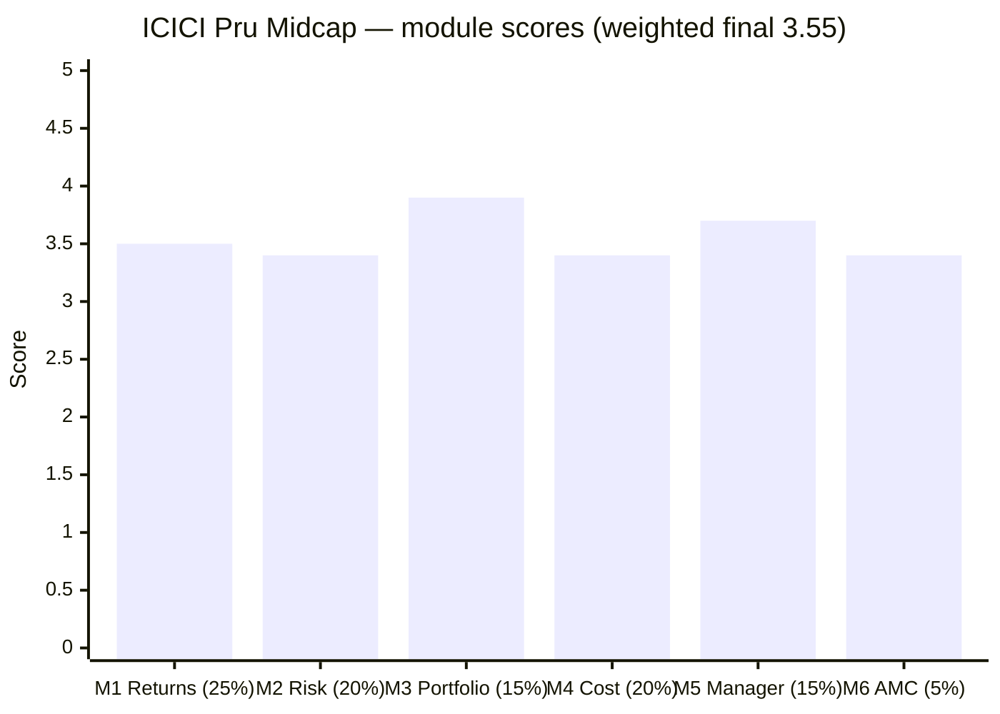
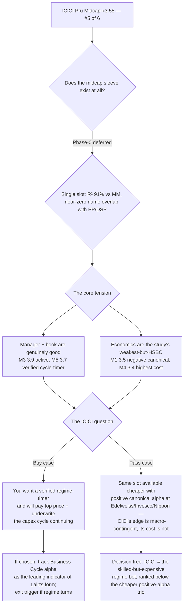

# ICICI Prudential Midcap Fund — Deep Study

## Fund Identity

| Field | Value |
|-------|-------|
| **Full Name** | ICICI Prudential MidCap Fund — Direct Plan — Growth |
| **AMC** | ICICI Prudential Asset Management (ICICI Bank 53% × Prudential plc ~35%; **listed on NSE/BSE 19-Dec-2025**) — **India's #1 active AMC (₹11.18 lakh Cr), deepest institutional backing of the entire four-category study** |
| **Inception** | **28-Oct-2004** — a genuine 2004-vintage core franchise; computable Regular NAV from 02-Apr-2006 (20.3y), Direct from 02-Jan-2013 (13.5y) |
| **SEBI Category** | Equity — Mid Cap (min 65% in ranks 101–250) |
| **Benchmark** | Nifty Midcap 150 TRI |
| **AUM** | **₹7,846 Cr** — comfortably sweet-spot, 6th of 7 shortlist (only MM smaller); ample runway |
| **Expense Ratio** | **0.87% Direct** (2nd-priciest of shortlist); Regular 1.53%; **true all-in cost ~1.08%** (highest of studied midcaps, with the 75% turnover drag) |
| **Exit Load** | 1% / 365 days |
| **Managers** | **Lalit Kumar** (since 01-Jul-2022, 4.0y — effectively solo) + Sharmila D'mello (overseas-securities designate — nominal) |
| **Prior managers** | **Mittul Kalawadia** (~2016 → Jun-2022, the winter's author — *still at the AMC*); Mrinal Singh (~2011–16, the 2014 mania; left ~2019) |
| **Data** | MFAPI 120381 (Direct) / 102528 (Regular); proxies 147622 (Midcap-150 fund) + 114456 (Midcap-100 ETF); Groww `__NEXT_DATA__` JSON holdings (83 names) |

---

## The One-Line Context

ICICI Pru Midcap is the study's **"turnaround ship + manager-better-than-the-fund"** — the fund whose *quality-of-the-active-bet* modules are strong (a decisively active 73.9% book, M3 3.9; a verified cross-fund cycle-timer manager, M5 3.7) while its *fund-level economics* are weak (fails the canonical matched-index test at −0.35%/yr, M1 3.5; the highest true cost of any studied midcap at ~1.08%, M4 3.4). It is **HSBC's mirror-twin with the arrow reversed**: both fail the canonical test, but HSBC's alpha was front-loaded and fading while ICICI's failure is a self-contained **2020–2023 fade era** followed by a genuine **+5.63%/yr transformation since 2024** (capture flipped up-105/down-82, the cohort's fastest 2024–25 recovery at 2.6 months). M3 explains why the arrow moves: this is a **~46% cyclical book — the exact inverse of Mahindra Manulife** (its two biggest bets, BSE + MCX, are the two names MM omits) — so the fade-and-reversal is *regime timing*, not stock-picking, and the recent alpha is a bet on the capex/PSU/financialization cycle continuing. M5 rescues the fee case: manager Lalit Kumar's **Business Cycle Fund has beaten the market every year since 2021** (+8.73%/yr, +13.2 in 2023 — the exact year his midcap book lagged −10.4), proving the regime-timing is verified skill, not a hot hand. The institution behind it is a **fortress** — India's #1 active AMC, a ~56%-margin profit machine, a 19-year-stable CEO — that nonetheless **charges a full price and once used unitholder money to bail out a group-company IPO** (2018 I-Sec). Final: **≈3.55/5 — #5 of the six studied midcaps**, a clear step above HSBC but a full step below the leading cluster; you're buying a genuinely skilled regime-timer at the study's highest price for a bet that is, by construction, macro-contingent.

---

## Module Status

| Module | Weight | Status | Score |
|--------|--------|--------|-------|
| [Module 1 — Returns Consistency](module1_returns.md) | 25% | ✅ Complete | **3.5** |
| [Module 2 — Risk Profile](module2_risk.md) | 20% | ✅ Complete | **3.4** |
| [Module 3 — Portfolio DNA](module3_portfolio.md) | 15% | ✅ Complete | **3.9** |
| [Module 4 — Cost & AUM Impact](module4_cost.md) | 20% | ✅ Complete | **3.4** |
| [Module 5 — Fund Manager Quality](module5_manager.md) | 15% | ✅ Complete | **3.7** |
| [Module 6 — AMC Trustworthiness](module6_amc.md) | 5% | ✅ Complete | **3.4** |

---

## Final Scorecard

**Weighted Score: ≈ 3.55 / 5** — #5 of the six studied midcaps

| Module | Weight | Score | Weighted |
|--------|--------|-------|----------|
| M1 Returns | 25% | 3.5 | 0.875 |
| M2 Risk | 20% | 3.4 | 0.680 |
| M3 Portfolio | 15% | 3.9 | 0.585 |
| M4 Cost & AUM | 20% | 3.4 | 0.680 |
| M5 Manager | 15% | 3.7 | 0.555 |
| M6 AMC | 5% | 3.4 | 0.170 |
| **Total** | 100% | | **≈3.55** |

**The shape is the story:** the two **high-weight fund-economics modules drag** (M1 3.5 Returns + M4 3.4 Cost = 45% of the weight, both capped by the negative canonical alpha and top-of-shortlist cost), while the two **"quality of the active bet" modules lift** (M3 3.9 Portfolio + M5 3.7 Manager — a genuinely active book run by a verified cycle-timer). Risk (M2 3.4) sits with the economics; the AMC (M6 3.4) is a fortress at neutral weight. In one line: **a skilled, differentiated active manager whose bet is expensive and macro-contingent** — the inverse of a cheap closet-indexer.

---

## The Category Standings (6 of 7 studied)

| Rank | Fund | Final | Character |
|------|------|-------|-----------|
| 1 | Edelweiss | ≈4.05 | Consistency leader — no weak high-weight module |
| 2 | Invesco | ≈3.97 | Best fund-level numbers; institution-weak |
| 3 | Nippon | ≈3.96 | Best institution; capacity clock running |
| 4 | Mahindra Manulife | ≈3.83 | Best structure (cost+capacity); weakest warranty |
| **5** | **ICICI Pru** | **≈3.55** | **Manager-better-than-fund; skilled active regime-bet at the highest price** |
| 6 | HSBC | ≈3.49 | Fails the matched-index test |

ICICI lands **clearly above HSBC** (the M3/M5 strength — a decisively active book run by a verified cycle-timer — separates it from HSBC's five-team drift) but **a full ~0.28 below Mahindra Manulife** and the leading cluster: the two high-weight economics modules (M1, M4) cap it. It is the **"pay-up for skill"** midcap — the mirror of MM's **"pay-little-for-structure."** Remaining: Sundaram (#7, expected confirm-elimination).

---

## Key Performance Metrics

| Metric | Value | Context |
|--------|-------|---------|
| 3Y / 5Y CAGR | 24.40% / 18.87% | 5Y is 6th of 7 (above universe median 17.63) |
| 10Y CAGR | **17.84%** | 6th of 7 — above only Sundaram (15.63) |
| Long-run anchor | **20.3y ≈ 13.6%** (Regular) | honest since-2006 CAGR; 22-year franchise |
| **Matched-index alpha (6.8y canonical)** | **−0.35%/yr** ❌ | the study's 2nd failure (after HSBC −0.22) — but entirely a 2020–23 fade |
| Alpha, recent (2024→) | **+5.63%/yr** | capture flipped up-105/down-82; three straight positive-alpha years |
| Alpha, 13.5y ETF-window | **+3.19%/yr** ✅ | genuinely positive long-run (better than HSBC's pre-2019-loaded record) |
| Index-dominance test (5Y, 7 axes) | **6/7** | matches Invesco; ahead of HSBC (4/7); "the worst active still beats the index fund" |
| Sharpe / Sortino (5Y common) | **0.752 / 1.355** | **7th of 7 actives** — the screening's "highest risk, middling output" confirmed |
| Sharpe ladder | 3Y 0.99 → 5Y 0.75 → 10Y 0.58 | declines with window — recency tilt (soft HSBC echo) |
| Up / down capture (5Y) | 96 / 87 | the fade was an **up-capture** problem (missing rallies), now fixed |
| Max drawdown (modern) | **−44.0%** (2018→COVID unbroken) | deepest modern DD of the studied funds |
| Max drawdown (ever) | **−75.1%** (2008, ~6y underwater) | **new repo-record tail** (displaces Edelweiss −74.7) |
| 2018–19 winter | **+5.6 / +3.9, −17.0% cum (vs ETF −25.3)** ✅ | a **genuine, fully-invested pass** (Kalawadia era) — the anti-MM |
| 2024–25 correction | −20.4% fall, **2.6-mo recovery** ⭐ | fastest of the entire cohort |
| Rolling 3Y floor | **−9.9%** | worst of the 7 shortlist |
| 3Y SIP XIRR | **18.33% — #1 of studied** | the turnaround, captured cleanly by recent instalments |
| 10Y SIP XIRR | 19.54% | 5th of 6 — the long-horizon investor got the fade, not the turnaround |
| Active share | **73.9%** (computed) | 2nd-highest studied (behind Invesco 79.5); decisively active |
| Turnover | **75%** | 2nd-highest of group — the book is steered, not held |
| Cross-sleeve overlap | PP 0.1% / DSP 3.6% | near-zero — a real return-enhancer (R² 91% vs MM, but opposite books) |

---

## ⚠️ The Five Critical Lenses — Read Before the Numbers

### Lens 1 — The Turnaround Is Real, but It's a Regime Bet, Not a Compounding Engine
The fund fails the canonical matched-index test (−0.35%/yr over 6.8y), yet the last 2.5 years are a genuine transformation (+5.63%/yr, capture flipped up-105/down-82). M3 explains *why*: it holds a **~46% cyclical/capex book** (Materials 24.3% + Industrials 22.0%) that was in the wrong regime 2020–23 and the right one 2024+. The alpha is **sector-timing, not diversified stock selection** — so the recent strength is *regime-contingent*, the exact recency-trap shape this study dismantled at HSBC. You are underwriting the **capex/PSU/financialization cycle continuing to run**, not a durable edge.

### Lens 2 — But the Manager Is Verified Skill, Not a Hot Hand (the fund's best argument)
The single computation that rescues the fee case: manager **Lalit Kumar also runs ICICI's Business Cycle Fund — a dedicated regime-rotation mandate — and it has beaten the market every single year since 2021** (+8.73%/yr vs Nifty50, +4.7 vs Nifty500), **including +13.2 alpha in 2023, the exact year his midcap book lagged −10.4**. That divergence reframes the 2023 blowup as a midcap transition artifact and proves the regime-timing is a **verified, cross-fund, positive-every-year skill.** You're not betting on Lalit staying hot — you're backing a demonstrated cycle-timer whose domain edge (IIT electrical engineer → electrification book) maps onto the portfolio.

### Lens 3 — It Is the Most Expensive Bet in the Study
0.87% Direct ER + 75% turnover drag = **~1.08% true all-in cost — the highest of any studied midcap**, exceeding even HSBC's 0.76%. On the canonical base case you'd have kept **₹3.3–3.9L more in the 0.20% index fund** over a 10-year SIP (the Regular plan, −₹5.3L, is a wealth-destroyer). The fee is justified *only* if you underwrite the regime — a legible bet, but not a comfortable one, and structurally the worst cost combination (high ER *and* high turnover) in the shortlist.

### Lens 4 — The Long-Run Assets Are Genuine, but They Belong to Prior Eras
Unlike MM's fake NFO-cash winter, ICICI has **real long-run credentials**: a fully-invested 2018–19 winter pass (+5.6/+3.9, Kalawadia era), a 2004 vintage with an honest 20.3y/13.6% anchor, and a documented 2008 −75.1% tail. But the winter belongs to **Kalawadia** (still at the AMC — a clean internal handover) and the mania alpha to **Mrinal Singh** (departed) — while the 10Y (17.84%, 6th) and the worst-of-shortlist rolling-3Y floor (−9.9%) show the *current* record is a fade-era decade with a recent rescue.

### Lens 5 — The Institution Is a Fortress That Charges Full Freight
ICICI Prudential is the study's most durable AMC — India's #1 active house, a ~56%-net-margin profit machine (FY25 ₹2,651 Cr), a 19-year-stable CEO (Nimesh Shah), newly listed (Dec-2025). You will never worry about its survival. But it is the **exact inverse of MM's loss-leader subsidy**: it passes *none* of its scale economics to unitholders (the full-price ER is shareholder profit), and it carries one genuinely investor-facing scar — the **2018 ICICI Securities IPO bailout**, where it used ₹240 Cr of unitholder money on the last day to keep a *group-company's* IPO from failing (settled ₹89L + CEO ₹6.8L). *Fortress durability, adequate stewardship.*

---

## Portfolio DNA (Snapshot, computed from Groww JSON)

| Dimension | Value | Group context |
|-----------|-------|---------------|
| Stocks | **83** | long diversifying tail over a concentrated top |
| Top-10 | **38.0%** | concentrated (like Invesco 46.7 / HSBC 39.7) |
| **Active share** | **73.9%** (computed) | 2nd of studied (Invesco 79.5 > **ICICI 73.9** > HSBC 69.5 > MM 66.6 > Nippon 54.1) |
| **Signature** | **Cyclical trifecta** — exchanges (BSE 4.99% + MCX 4.48% = #2/#3 holdings), electrification (Apar top holding +4.83, KEI, GE T&D), metals (Jindal ×2, Vedanta, APL Apollo) | |
| **Anti-signature** | **The exact inverse of Mahindra Manulife** — its two biggest bets (BSE, MCX) are the two names MM deliberately omits | |
| Sector concentration | **Materials 24.3% + Industrials 22.0% = ~46% cyclical** | a thematic concentration no diversified sibling carries |
| Off-index weight | 39.5% across 47 names | incl. offensive large-cap cyclicals (HPCL, Jindal, Vedanta, Muthoot) |
| PE | ~ mid (cyclical book) | value/cyclical, not momentum |
| Turnover | **75%** | 2nd-highest — the book is steered by a regime-aware manager |

---

## Strengths vs Concerns

### ✅ Key Strengths
1. **Manager-better-than-the-fund** — Lalit Kumar's Business Cycle Fund (+8.73%/yr, positive every year since 2021) is the study's strongest cross-fund "is-it-repeatable?" proof; verified cycle-timing skill
2. **Decisively active, genuinely differentiated book** — 73.9% computed active share (2nd-highest), a coherent ~46% cyclical thesis that is the exact inverse of MM
3. **Real long-run credentials** — a genuine fully-invested 2018–19 winter pass, a 20-year honest anchor, no NFO-cash asterisk (the anti-MM)
4. **Best current-form prints** — the cohort's only positive-alpha 2025, #1 3Y SIP XIRR, fastest 2024–25 recovery (2.6 months)
5. **Positive 13.5-year ETF-window alpha** (+3.19%/yr) — a durable long-window positive (unlike HSBC's pre-2019-loaded record)
6. **The deepest institutional backing of the entire study** — India's #1 active AMC, fortress economics, 19-year-stable leadership, negligible viability risk
7. **A real return-enhancer** — near-zero overlap with the PP/DSP sleeves (PP 0.1% / DSP 3.6%)

### ⚠️ Key Concerns
1. **Fails the canonical index test** (−0.35%/yr) — the base-case fee bet is *negative*; you'd have done ₹3.3–3.9L better in the index fund
2. **Highest true cost of the studied midcaps** (~1.08%) — the worst combination of high ER *and* high turnover
3. **The turnaround is regime-contingent** — a 46%-cyclical book's alpha is a macro/sector-timing bet, not durable selection; it reverts if the capex cycle turns (as it did 2020–23)
4. **Worst risk-adjusted numbers of the shortlist** — 7th of 7 on 5Y Sharpe (0.752) and Sortino; the "highest risk for middling output" screening flag confirmed
5. **The record's respectability is 2.5 years old** — Sharpe ladder declines monotonically with window length (recency tilt)
6. **Deepest tails in the repo** — −44.0% modern (2018→COVID), −75.1% ever (2008); a high-amplitude, blowup-capable profile
7. **Full-price stewardship + one group-conflict scar** — a hugely profitable giant that shares no scale economics and once used unitholder money for a group IPO (2018 I-Sec)

---

## Comparison vs Studied Funds (All Four Categories)

| Dimension | **ICICI Pru** | Edelweiss | Invesco | Nippon | MM | HSBC | PP Flexi | DSP Small |
|-----------|--------------|-----------|---------|--------|-----|------|----------|-----------|
| Final score | **≈3.55** | ≈4.05 | ≈3.97 | ≈3.96 | ≈3.83 | ≈3.49 | 4.20 | 4.00 |
| Matched-index alpha | **−0.35 ❌ (↗ +5.63 recent)** | +2.87 | +2.88 | +1.97 | +2.06 ↗ | −0.22 ❌ | strong | strong |
| 10Y CAGR | 17.84 (6th) | 19.89 | 20.34 | 19.33 | none | 18.47 | — | — |
| Active share | **73.9%** | ~55% | **79.5%** | 54.1% | 66.6% | 69.5% | high | high |
| Manager | ✅ verified cycle-timer, deep bench | ✅ sitting 4.8y | ❌ new 2.8y | ✅ house process | ❌ author departed | ❌ 5 teams | ✅ founder | ✅ long |
| ER (true) | **1.08 (highest)** | **0.49** | 0.63 | 0.64 | 0.57 | 0.76 | 0.63 | 0.7 |
| 5Y Sharpe | **0.752 (7th)** | high | 0.871 | 0.916 | 0.835 | 0.803 | — | — |
| Capacity runway | ample | ~1.2y ⚠ | ~3y | past ⚠ | decades ⭐ | unlimited (unloved) | shielded | gated |
| AMC | **3.4 fortress (full price)** | 3.4 | 2.3 sold | 3.4 scarred | 3.3 loss-leader | 3.4 | **4.5** | **4.3** |

---

## ₹20K/Month SIP Projections (10 Years)

| Scenario | Net return | Corpus | vs index fund |
|----------|-----------|--------|---------------|
| Index fund (0.20%) | 17.80% | ₹61.2L* | — |
| **ICICI, canonical −0.35 (0.87%)** | 16.78% | **₹57.9L** | **−₹3.3L** ❌ |
| ICICI, + turnover drag (true 1.07%) | 16.58% | ₹57.3L | −₹3.9L ❌ |
| ICICI, ETF-window +3.19 (0.87%) | 20.32% | ₹70.1L | +₹8.9L |
| ICICI, recent +5.63 (regime-contingent) | 22.76% | ₹79.9L | +₹18.8L |
| **ICICI Regular (1.53%), canonical** | 16.12% | ₹55.9L | **−₹5.3L** |

*\*Annuity convention differs slightly from sibling READMEs' index leg; relative spreads are the comparable quantity.*

**Read:** the mirror of MM's shape. Where MM had a tiny downside if its alpha died (cheap ER), ICICI has a **meaningful negative base case** (−₹3.3–3.9L) because the fee is high and the canonical alpha is negative — the upside cases (+₹8.9L ETF-window, +₹18.8L recent) require underwriting the regime. The honest expected anchor is a **blend of the negative canonical and the positive ETF-window**, tilted by how much you trust the capex cycle and Lalit's verified timing — *not* the +5.63 recent rate (that slice is the most regime-flattered).

---

## Investment Decision Framework

---

## The Critical Facts — In 10 Sentences

1. The fund **fails the canonical matched-index test** (−0.35%/yr over 6.8y — the study's 2nd failure after HSBC), but the failure is entirely a self-contained **2020–2023 fade era**, followed by a genuine **+5.63%/yr transformation since 2024** with the cohort's fastest 2024–25 recovery (2.6 months).
2. M3 proves the fade-and-reversal is **regime timing, not stock-picking**: it holds a **~46% cyclical/capex book** (Materials + Industrials) that was in the wrong regime 2020–23 and the right one 2024+ — so the recent alpha is macro-contingent.
3. Its two largest active bets — **BSE (4.99%) and MCX (4.48%)** — are the exact two names **Mahindra Manulife deliberately omits**: the same 150-stock pond, diametrically opposite books (R² 91%, near-zero name overlap).
4. The manager is the fund's best argument: **Lalit Kumar's Business Cycle Fund has beaten the market every year since 2021** (+8.73%/yr, +13.2 in 2023 — the exact year his midcap lagged −10.4), proving his regime-timing is **verified cross-fund skill**, not a hot hand.
5. It has the **highest true all-in cost of any studied midcap (~1.08%)** — 0.87% ER plus a 75%-turnover drag — so the base-case fee bet is *negative*: you'd have kept ₹3.3–3.9L more in the 0.20% index fund over a 10-year SIP.
6. It posts the **worst 5Y Sharpe of the seven shortlisted actives (0.752)** and carries the **repo's deepest documented tail (−75.1% in 2008, ~6 years underwater)** and deepest modern drawdown (−44.0%, 2018→COVID).
7. Yet it still **beats the buyable index fund on 6 of 7 risk axes** over 5 years, and its **active share is a decisively-active computed 73.9%** (2nd-highest studied) — the worst active in the shortlist still clears the passive floor.
8. Its **genuine long-run credentials belong to prior eras** — a real fully-invested 2018–19 winter pass (Kalawadia, still at the AMC) and a 2004-vintage 20.3y/13.6% anchor — while the current 10Y (17.84%) and rolling-3Y floor (−9.9%) rank 6th of 7.
9. The AMC is the study's **most durable institution** — India's #1 active house (₹11.18 lakh Cr), a ~56%-margin profit machine, a 19-year-stable CEO, newly listed (Dec-2025) — but it **charges a full price** and carries one investor-facing scar: the **2018 ICICI Securities IPO bailout** (unitholder money used to rescue a group-company IPO; settled ₹89L + CEO ₹6.8L).
10. Final: **≈3.55/5, #5 of six** — a genuinely skilled, genuinely active regime-timer sold at the study's highest price for a macro-contingent bet; clearly above HSBC on manager/book quality, a full step below the cheaper positive-alpha leaders.

---

## Quick Verdict

**For a ₹20K/month, 10-year SIP:** ICICI Pru Midcap is the study's **"pay-up for skill" midcap** — and for a single-slot decision, the skill isn't quite worth the price. Its case is genuinely attractive on two axes the leaders can't all match: a **verified, cross-fund regime-timer** (Lalit Kumar's Business Cycle Fund, positive every year since 2021) running a **decisively active, differentiated cyclical book** (73.9% AS, the exact inverse of MM), behind the **deepest institutional backing in the entire study.** But you pay for it twice: the **highest true cost of any studied midcap (~1.08%)** and a **negative canonical alpha** mean the base-case fee bet loses to the index fund by ₹3.3–3.9L, and the recent turnaround is a **regime-contingent** capex bet, not durable compounding. The rational stance: **rank it below the cheaper, positive-canonical-alpha trio** (Edelweiss, Invesco, Nippon) and MM's structural package — it belongs in the "hold if you specifically want a cyclical-regime tilt and trust Lalit's timing" bucket, not the default-pick bucket. If chosen, the leading indicator to track is **Business Cycle's alpha** (the tell on Lalit's form), with an exit trigger if the capex regime turns. The decision tree should treat ICICI as **the skilled regime-bet that costs the most and depends on a macro call.**

---

## One-Line Verdict

> **ICICI Pru Midcap finishes at ≈3.55/5 — #5 of the six studied midcaps — as the study's "manager-better-than-the-fund, at the highest price" case: a fund that fails the canonical matched-index test (−0.35%/yr) and carries the study's highest true cost (~1.08%), yet is run by a verified cross-fund cycle-timer (Lalit Kumar's Business Cycle Fund has beaten the market every year since 2021, +13.2 in 2023 while his midcap lagged −10.4) through a decisively active 73.9% book whose ~46% cyclical thesis — built on the exact two exchanges (BSE + MCX) Mahindra Manulife omits — makes its +5.63%/yr recent turnaround a regime-timing bet, not durable selection, sharpening the anti-recency caution. Its genuine assets (a real fully-invested 2018–19 winter pass, a 20-year 13.6% anchor, a positive 13.5y ETF-window +3.19, the cohort's fastest 2024–25 recovery, and the deepest institutional backing of the entire study — India's #1 active AMC, a ~56%-margin profit machine, a 19-year-stable CEO) are offset by its liabilities: the worst 5Y Sharpe of the shortlist (0.752), the repo's deepest tail (−75.1% in 2008), a negative base-case fee bet (−₹3.3–3.9L vs the index fund), a full-price stewardship the giant needn't charge, and one investor-facing scar (the 2018 ICICI Securities IPO bailout). You are buying a demonstrated regime-timer at the study's highest price for a macro-contingent bet — clearly above HSBC on skill and book quality, a full step below the cheaper positive-alpha leaders.**

---

> **⚠ Cross-module note (pending patch):** Module 5 (`module5_manager.md`, lines 23/96/153) references a "2022 ICICI front-running case (dealer-level)" as the AMC-governance item handed to M6. Module 6's research found **no verifiable SEBI front-running order against ICICI Prudential** — the real AMC-level scar is the **2018 ICICI Securities IPO bailout**. M5's underlying logic (the scar is AMC-level, not Lalit's — his individual record is clean) holds; only the event name/date is wrong. This README reflects the corrected view (2018 I-Sec). **M5 line-patches remain to be applied** per the M6 write-up.

---

*Study completed: July 16, 2026 | All 6 modules + README | Weighted final ≈3.55/5 (M1 3.5×25% + M2 3.4×20% + M3 3.9×15% + M4 3.4×20% + M5 3.7×15% + M6 3.4×5%) | Standings (6 of 7): Edelweiss 4.05 > Invesco 3.97 ≈ Nippon 3.96 > MM 3.83 > ICICI 3.55 > HSBC 3.49 | Data: MFAPI 120381 (Direct, 3,326 pts) / 102528 (Regular, 20.3y — the 2008 tail) + proxies 147622/114456 + cross-sleeve series; Groww `__NEXT_DATA__` JSON holdings (83 names, AS 73.9% computed vs M_MOTY); Wayback-Groww AUM/ER series; AMC RHP + SEBI filings + news (M6) | Signature findings: turnaround-ship / HSBC-mirror-reversed, real winter pass, 2008 −75.1% record tail (M1/M2) · cyclical-thesis book = fade-and-reversal, BSE+MCX inverse-of-MM (M3) · highest true cost + 2nd negative base case (M4) · Business Cycle cross-fund proof = verified cycle-timer, manager-better-than-fund (M5) · profit-machine fortress = anti-Mahindra + 2018 I-Sec IPO-bailout scar + Dec-2025 listing (M6) | Pending patch: M5 "2022 front-running" → 2018 I-Sec case | Tripwires: Business Cycle alpha turning negative (Lalit's form) · the capex/cyclical regime turning · AS decay · active-share/turnover drift · post-listing fee defence · a 2nd group-conflict episode | Remaining: Sundaram (#7, confirm-elimination), then decision_tree.md*
