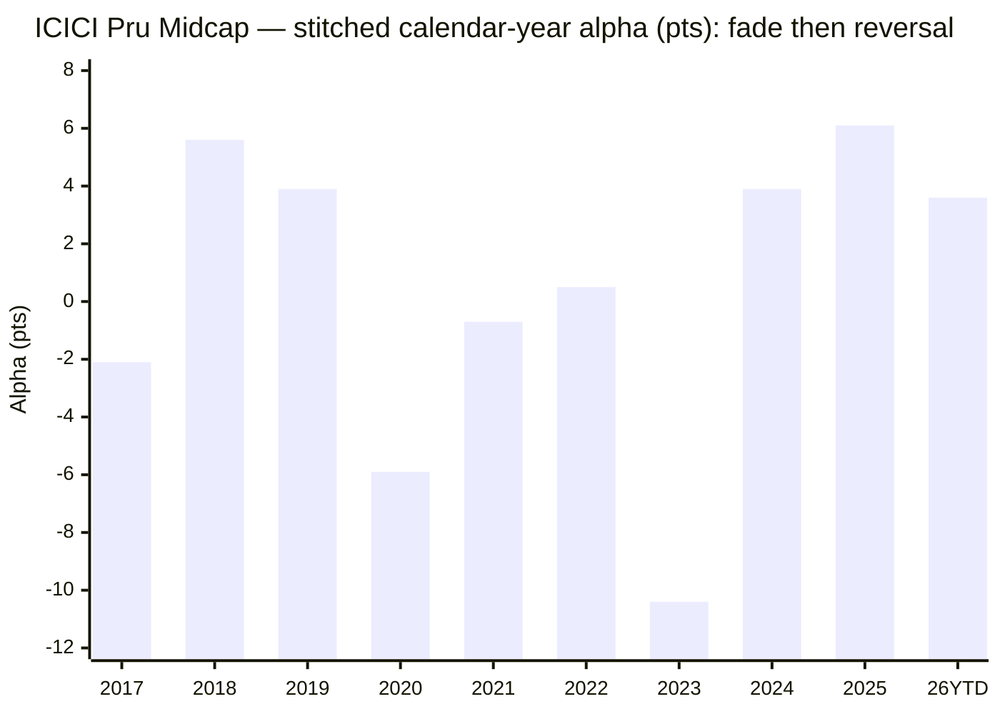
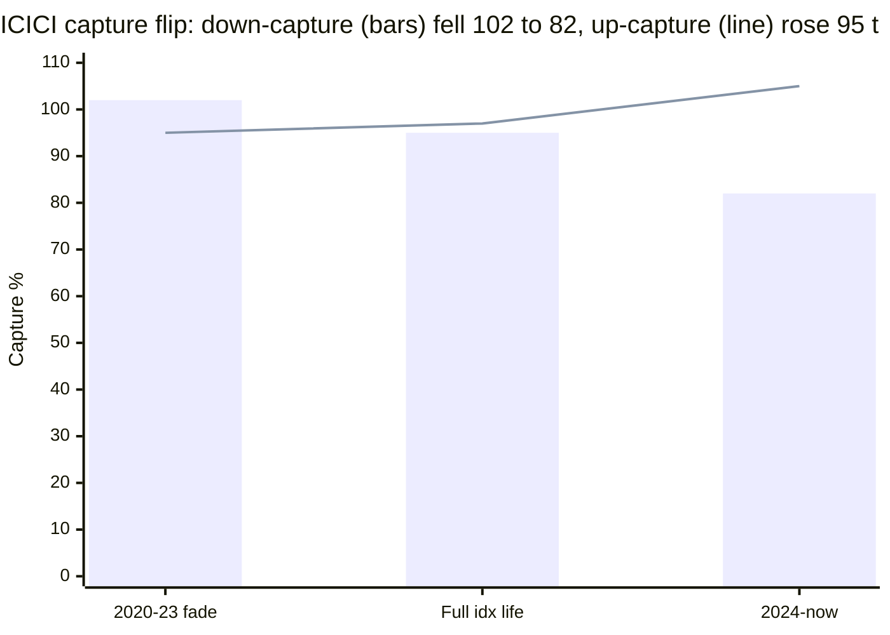

# Module 1: Returns Consistency — ICICI Prudential Midcap Fund

## Module 1 Score: ~3.5 / 5 (provisional)

---

## The One-Line Context

ICICI Pru Midcap is the shortlist's **"turnaround ship — HSBC's mirror-twin with the arrow reversed."** It **fails the canonical matched-index test on the full window** (−0.35%/yr over 6.8y — the study's second failure after HSBC's −0.22) — but where HSBC's alpha was front-loaded and fading, **ICICI's failure is entirely a 2020–2023 fade era** (capture up-95/down-102 — losing on *both* sides), and the last 2.5 years are a genuine transformation: **+5.63%/yr alpha since Jan-2024, capture flipped to up-105/down-82, three straight positive-alpha years, and the fastest 2024–25 correction recovery of the entire cohort (2.6 months** vs Edelweiss 6.4 / MM 13.7 / HSBC 16). The catches: (1) the transformation is exactly the **recency-trap shape this study dismantled at HSBC**; (2) its author, **Lalit Kumar (since 01-Jul-2022), also authored the fund's worst modern year** — the 2023 −10.4 alpha lag, sitting out a +44% rally at just 10.9% vol — the highest-amplitude profile studied after Khemani; and (3) the fund's genuine long-run assets (a **real, fully-invested 2018–19 winter pass** at +5.6/+3.9, a 2004 vintage with an honest 20.3y/13.6% anchor and a documented 2008 −67.8% tail) belong to **prior eras**, while its 10Y (17.84%) and worst-of-shortlist rolling-3Y floor (−9.9%) rank it 6th of 7.

---

## Fund Identity

| Field | Value |
|-------|-------|
| **Full Name** | ICICI Prudential MidCap Fund — Direct Plan — Growth |
| **AMC** | ICICI Prudential AMC (India's 2nd-largest; touched in the International foundation, Module 6 largely ground-up for midcap) |
| **Inception** | 28-Oct-2004; **computable Regular NAV from 02-Apr-2006 (20.3y)**; Direct from 02-Jan-2013 (13.5y) |
| **SEBI Category** | Equity — Mid Cap (min 65% in ranks 101–250) |
| **Benchmark** | Nifty Midcap 150 TRI |
| **AUM** | **₹7,789 Cr** (Tickertape Jul-2026) — 6th of 7, comfortably sweet-spot |
| **Expense Ratio** | **0.87%** (Direct) — **2nd-priciest of the shortlist** (with Sundaram 0.88) → Module 4 |
| **NAV (10-Jul-2026)** | ₹382.35 (Direct) |
| **Current Managers** | **Lalit Kumar — since 01-Jul-2022 (4.0y)** + Sharmila D'mello (likely overseas-securities designate — the Desai/Chaturvedi/Dhamnaskar red-herring pattern; M5 to verify) |
| **Prior Managers** | Mittul Kalawadia (~2016 → Jun-2022; **still at the AMC** — softer than a Lodha-style exit); earlier Mrinal Singh (~2011–16), Deven Sangoi (2000s). **Exact pre-Lalit dates = documented gap → M5** |
| **Exit Load** | 1% / 365 days (standard, to verify → M4) |
| **Riskometer** | Very High |

---

## Raw Data (MFAPI computed + Tickertape screening, as of 10-Jul-2026)

| Metric | Value |
|--------|-------|
| 1Y absolute / CAGR | **13.29%** — riding the 2026 recovery, 2nd-highest of studied |
| 3Y CAGR | 24.40% |
| 5Y CAGR | **18.87%** — 6th of 7 shortlist (above universe median 17.63) |
| 7Y CAGR | 21.36% |
| 10Y CAGR | **17.84%** — 6th of 7 (above only Sundaram 15.63) |
| Since Direct (13.5y) | 19.48% |
| **Regular 20.3y** | **13.64%** — the honest long anchor (2008 −67.8% inside) |
| Mean rolling 3Y | 19.34% |
| Beta vs Midcap 150 (full idx life) | 0.99 |
| Correlation / R² vs Midcap 150 | / 95% |
| Up / Down capture (full idx life) | 97 / 95 |
| **Up / Down capture (2024→now)** | **105 / 82** — best current-book shape studied |
| Max drawdown (Direct era) | **−44.0%** (2018 winter → COVID, unbroken) — deepest modern DD of the studied funds |
| 10Y SIP XIRR (₹/mo) | **19.54%** |
| Sharpe (Tickertape) | 0.456 |
| Std deviation (Tickertape) | 17.5% — highest of the shortlist |

**Data sources:** MFAPI Direct **120381** (3,326 pts, 02-Jan-2013 → 10-Jul-2026) + Regular **102528** (4,990 pts, 02-Apr-2006 →); index counterfactuals **147622** (Motilal Nifty Midcap 150 Index Fund) + **114456** (Midcap-100 ETF). All headline metrics computed from raw NAVs — no website numbers copied.

---

## Cross-Source Verification

| Metric | MFAPI (computed) | Tickertape (screening) | Verdict |
|--------|------------------|------------------------|---------|
| 3Y | 24.40% | 24.75% | ✅ match (endpoint drift: screening 03-Jul, this run 10-Jul) |
| 5Y | 18.87% | 19.01% | ✅ match |
| 10Y | 17.84% | 17.78% | ✅ match |

---

## The CAGR Ladder — Mid-Table Everywhere, No Crown

| Window | ICICI | Rank of 7 shortlist | Note |
|--------|-------|---------------------|------|
| 1Y | **13.29%** | ~2nd (behind HSBC) | riding the 2026 recovery |
| 3Y | 24.40% | 3rd–4th | |
| 5Y | 18.87% | **6th** | above universe median (17.63) but bottom-pair |
| 7Y | 21.36% | — | |
| 10Y | **17.84%** | **6th** (above only Sundaram) | 16–18 band |
| Since Direct (13.5y) | 19.48% | — | |
| **Regular 20.3y** | **13.64%** | — | the honest long anchor (2008 −67.8% inside) |

Unlike every studied peer, ICICI holds **no window crown at all** — the screening's "middling output" is real on trailing windows. The module's job was to find out *why*; the answer is an **era story**.

---

## Calendar-Year Returns & Alpha — The Three-Act Fingerprint

Stitched proxy: Midcap-100 ETF to 2019, Nifty Midcap 150 index fund 2020→. Regular plan pre-2013.

| Year | Return | Alpha (pts) | Era | Verdict |
|------|--------|-------------|-----|---------|
| *2008* | *−67.8%* | — | early | GFC tail — documented, real |
| *2009* | *+100.7%* | — | early | V-recovery |
| *2011* | *−32.6%* | — | early | deep |
| 2013 | +7.5% | +11.5 | Mrinal Singh | strong |
| **2014** | **+88.5%** | **+31.7** | Mrinal Singh | mania year — largest single-year alpha in the repo after Edelweiss's +28.8 |
| 2015 | +6.1% | −0.6 | — | flat |
| 2016 | +5.7% | −1.0 | transition | flat |
| 2017 | +44.5% | −2.1 | Kalawadia era | participated, no alpha |
| **2018** | **−9.8%** | **+5.6** | Kalawadia | **winter pass — genuine, fully invested** |
| **2019** | **+0.4%** | **+3.9** | Kalawadia | winter pt 2 — positive absolute year |
| 2020 | +20.2% | −5.9 | Kalawadia | **fade begins** — lagged the V |
| 2021 | +46.2% | −0.7 | Kalawadia | in-line |
| 2022 | +4.1% | +0.5 | Kalawadia → **Lalit (Jul)** | flat |
| **2023** | **+33.9%** | **−10.4** | **Lalit yr-1** | **the blowup — lagged a +44% rally** |
| 2024 | +28.1% | +3.9 | Lalit | turnaround begins |
| **2025** | **+11.9%** | **+6.1** | Lalit | **best 2025 of the studied funds** (peers −0.7 to −3.1) |
| 2026 YTD | +7.8% | +3.6 | Lalit | continuing |

**Act I** (2013–14): Mrinal Singh's mania alpha. **Act II** (2015–2023): a nine-year stretch with *one* meaningful positive-alpha episode — the winter — bracketed by flat years and ending in the fade (2020 −5.9 → 2023 −10.4). **Act III** (2024→): three consecutive positive-alpha years, including the group's only positive-alpha 2025.

---

## ⭐⭐ NEW: The Fade-and-Reversal Decomposition (the module's real output)

The matched-index test and its era split:

| Window | Fund | Index | **Alpha/yr** |
|--------|------|-------|--------------|
| **Full matched window** (11-Sep-2019 → 10-Jul-2026, 6.83y) | 22.74% | 23.09% | **−0.35%** ❌ |
| Pre-Lalit slice (Sep-19 → Jun-22, 2.8y) | 20.83% | 22.53% | **−1.70%** |
| **Lalit era** (01-Jul-2022 → now, 4.0y) | 24.09% | 23.48% | **+0.61%** |
| — Lalit's first 18mo (Jul-22 → Dec-23) | 33.76% | 43.21% | **−9.45%** |
| — **Lalit since Jan-2024 (2.5y)** | **18.66%** | **13.04%** | **+5.63%** ⭐ |
| ETF proxy, full Direct era (13.5y) | 19.48% | 16.30% | **+3.19%** ✅ |

And the capture transformation:

| Era | Up-cap | Down-cap | Beta | Reading |
|-----|--------|----------|------|---------|
| 2020–2023 (fade) | 95 | **102** | 1.00 | **losing on both sides — the worst capture shape possible** |
| **2024 → now** | **105** | **82** | 0.98 | **winning on both sides — the best shape of any studied current book** |
| Full idx life | 97 | 95 | 0.99 | the blend that hides both |

This is the head-to-head with HSBC the study needs: **both fail the canonical test, with opposite arrows.** HSBC earned all its alpha before 2019 and faded (−0.22 full, negative recent); ICICI destroyed alpha 2020–23 and is now compounding it (+5.63 recent). If you weight the *trajectory*, ICICI's failure is historical and HSBC's is current. If you weight the *warranty*, both records say "one era of one manager" — and this study has already refused to extrapolate a 2.5-year hot streak once (HSBC's 3Y crown → M1 3.5). Consistency requires the same discipline here, with two genuine differentiators in ICICI's favour: the **13.5y ETF-window alpha is positive (+3.19%/yr)**, and the fund **passed the winter fully invested.**

---

## ⭐ NEW: The 2023 Blowup Autopsy — a Style Mismatch, Not a Crash

2023's −10.4 alpha came at **10.9% annualized vol — the fund's calmest year in the dataset.** The fund didn't blow up; it *sat out* a +44% broad rally (Lalit's transition year, reshaping the book toward his aggressive-growth style). That's the mirror image of a drawdown failure — the fund's failure mode, historically, is **participation deficit in rallies** (2017 −2.1, 2020 −5.9, 2021 −0.7, 2023 −10.4 are all up-market lags), not amplified falls. 2024 flipped it (up-105). The −10.4 is the second-worst single-year alpha in the repo (after HSBC's 2021 −15.0), and it is the freshest reason to distrust the turnaround's smoothness: this manager can dislocate hard from the index for a year.

---

## ⭐ The 2018–19 Winter — a Genuine, Fully-Invested Pass (unlike MM)

| Metric | ICICI | Group context |
|--------|-------|---------------|
| 2018 calendar | −9.8% (**+5.6 alpha**) | 2nd-best 2018 of studied (Invesco −3.6 best) |
| 2019 calendar | **+0.4% (+3.9 alpha)** | one of only two studied funds *positive* in 2019 |
| Winter cumulative (Jan-18 → Aug-19) | **−17.0% vs ETF −25.3% (+8.3 pts)** | 2nd-best cumulative after Invesco (+1.6%) |
| Winter drawdown | **−21.9%** | shallower than Edelweiss (−23.5), HSBC (−24.2) |

A **real winter pass** — 2004-vintage fund, fully invested, no NFO-cash asterisk (the direct contrast with Mahindra Manulife's fake winter). Attribution: the **Kalawadia-era team — departed from the fund but still at the AMC** (softer than Lodha's exit; M5 to weigh). This is the fund's strongest genuine long-run credential.

---

## ⭐ NEW: The Recovery Anomaly — Deepest Historical Hole, Fastest Current Spring

| Event | Depth | Recovery from trough |
|-------|-------|----------------------|
| 2013 taper | −24.5% | 3.8 mo |
| 2015–16 | −22.6% | 6.1 mo |
| **2018 winter → COVID (unbroken)** | **−44.0%** | 8.4 mo (post-COVID-trough) — **deepest modern DD of the studied funds** |
| 2021–22 | −17.9% | 2.8 mo |
| **2024–25** | **−21.3%** (trough **07-Apr-2025** — a month+ *later* than peers' 28-Feb, falling into the April tariff dip) | **2.6 months — the FASTEST recovery of the entire cohort** ✅ |

| Fund | 2024–25 recovery |
|------|------------------|
| **ICICI** | **2.6 mo** ⭐ |
| Invesco | ~6 mo |
| Edelweiss | 6.4 mo |
| Nippon | ~7 mo |
| MM | 13.7 mo |
| HSBC | 16 mo |

Matched-window fall: −20.4% vs index −21.0% (mild cushion). The current book fell in-line, bottomed late — and then **rocketed back faster than anything studied**, the up-105 capture in action. The freshest stress test is unambiguously a pass, and it's entirely Lalit's.

---

## Rolling Returns Distribution (Direct era, daily windows)

| Window | n | Mean | Min | Max | % negative |
|--------|-----|------|-----|-----|------------|
| Rolling 1Y | 3,078 | 24.79% | **−35.62%** | +128.24% | 15.6% |
| Rolling 3Y | 2,590 | 19.34% | **−9.91%** | +44.16% | **5.1%** |
| Rolling 5Y | 2,097 | 18.07% | −1.75% | +34.85% | 0.8% |

**Probability of loss by holding period:**

| Hold for | Chance of loss | Worst outcome |
|----------|----------------|---------------|
| 1 year | ~15.6% | −35.6% |
| 3 years | **~5.1%** | **−9.91%/yr** |
| 5 years | 0.8% | −1.75%/yr |

The 3Y distribution is the **worst of the shortlist** (worst floor −9.91, worst negativity 5.1% — HSBC −6.58/4.4%). The −9.91 floor is the COVID-window artifact; combined with the 2023 alpha lag, it marks ICICI as the most window-sensitive record of the studied funds — the price of an aggressive, high-tracking-error style.

---

## SIP XIRR vs Lumpsum CAGR (₹/month, Direct)

| Window | SIP XIRR | Lumpsum CAGR |
|--------|----------|--------------|
| 3Y | **18.33%** | 24.40% |
| 5Y | 20.29% | 18.87% |
| **10Y** | **19.54%** | 17.84% |

The **3Y SIP XIRR (18.33%) is #1 of the studied funds** (Edelweiss 16.34, MM 15.63) — the turnaround captured cleanly by recent SIP instalments. But the **10Y SIP XIRR (19.54%) is 5th of 6** (Invesco 22.30 > Edel 21.56 > Nippon 21.08 > ICICI 19.54 > HSBC 19.42) — the long-horizon investor got the fade, not the turnaround.

---

## Volatility Regime (annualized, daily)

| Year | Vol | Note |
|------|-----|------|
| 2020 | 28.1% | COVID |
| 2021 | 16.2% | |
| 2022 | 17.5% | |
| **2023** | **10.9%** | the calm year the fund *lagged* the rally |
| 2024 | 17.6% | |
| 2025 | 17.8% | |
| 2026 | 21.6% | elevated with the category, milder than HSBC/Invesco |

The screening's "highest vol of shortlist (17.5%)" is real but unremarkable in eras — the *character* of the risk (capture shape) changed far more than the *quantity* (M2's job).

---

## Comparison with Studied Funds (All Four Categories)

| Dimension | **ICICI** | HSBC | MM | Edelweiss | Invesco | Nippon |
|-----------|-----------|------|-----|-----------|---------|--------|
| Matched-index alpha (6.8y) | **−0.35%** ❌ | −0.22% ❌ | +2.06% ✅ | +2.87% ✅ | +2.88% ✅ | +1.97% ✅ |
| Alpha trajectory | **rising steeply (+5.63 since-24)** | fading | rising | persistent | episodic | steady |
| ETF-window alpha (13.5y) | **+3.19%** ✅ | pre-2019-loaded | n/a | +5.22% | +5.11% | +2.1%/13.4y |
| 10Y CAGR | 17.84 (6th) | 18.47 | none | 19.89 | 20.34 | 19.33 |
| 2018–19 winter | **+5.6/+3.9 genuine pass** | −10.3 cum | artifact | −8.8 cum | +1.6 cum ⭐ | −3.7 cum |
| Worst single-year alpha | **−10.4 (2023)** | −15.0 (2021) | −5.4 | −3.9 | −8.5 | −3.2 |
| Worst rolling 3Y | **−9.91 (worst)** | −6.58 | +11.5 (artifact) | −4.94 | −1.75 | −5.6 |
| 2024–25 recovery | **2.6 mo (fastest)** ⭐ | 16 mo | 13.7 mo | 6.4 mo | ~6 mo | ~7 mo |
| 2025 alpha | **+6.1 (only positive)** | — | −3.1 | −0.7 | +1.8 | — |
| Current manager | Lalit 4.0y (blowup + fix both his) | Cheenu 3.6y | trio <2y | Trideep 4.8y | Khemani 2.8y | Patel 3.5y |

**One-line synthesis:** ICICI is **HSBC's structural twin (fails the canonical test) with MM's trajectory (rising alpha) at Invesco's amplitude (blowup-capable manager).** Its unique honest assets: a real winter pass, a real 2008 tail, a 20-year anchor, and the cohort's best current-form print (2025 alpha, 3Y SIP, recovery speed). Its unique honest liabilities: no window crown, the worst rolling floor, the second-worst single-year lag, and a canonical-test failure.

---

## ⭐ Manager-Era Attribution — Whose Record Is This?

| Era | Manager | Period | What the record shows |
|-----|---------|--------|-----------------------|
| Mania | **Mrinal Singh** (later Dep-CIO; left AMC ~2019) | ~2011 → 2016 | 2014 +31.7 mania alpha; 2011 −32.6 fall |
| Middle | **Mittul Kalawadia** (still at AMC) | ~2016 → Jun-2022 | **the winter pass (+5.6/+3.9)**; then the 2020–22 fade begins |
| Current | **Lalit Kumar** (since 01-Jul-2022) + Sharmila D'mello | Jul-2022 → now (4.0y) | **the −10.4 blowup (2023) AND the +5.63 turnaround (2024→)** — both his |

**The honest attribution statement:** the fund's best genuine credential (the winter) belongs to a manager who left the fund but stays at the AMC; the mania alpha belongs to a departed manager; and the entire current thesis — both the fade's worst year and the sharp reversal — is **Lalit Kumar's four-year, high-amplitude record.** Unlike Edelweiss (a sitting author whose own slice is strong throughout), ICICI's current author is defined by a single year of destruction followed by 2.5 years of creation.

---

## Module 1 Scorecard

| Sub-dimension | Weight | Score | Reasoning |
|---------------|--------|-------|-----------|
| 10Y CAGR | High | **3.5** | 17.84% — 16–18 "4" band numerically, but 6th of 7 peers; honest 20.3y anchor 13.64% |
| 5Y CAGR vs category | High | **3.5** | 18.87% above universe median, bottom-pair of shortlist |
| **Alpha vs Nifty Midcap 150 index fund** | **Critical** | **3.0** | **−0.35%/yr matched = FAIL** — lifted to 3.0 by the positive 13.5y ETF-window (+3.19), the steeply rising arc (+5.63 since-24), and three straight positive-alpha years; the exact inverse of HSBC's shape |
| 3Y rolling average | High | **2.5** | mean 19.34 but **worst floor (−9.91) and worst negativity (5.1%) of the shortlist** |
| 2018–19 winter | Critical | **4.0** | genuine fully-invested pass (+5.6/+3.9, cumulative +8.3 vs ETF, DD −21.9%) — prior-era authors, still at AMC |
| 2024–25 correction | High | **4.5** | fall in-line (−20.4 vs −21.0), **fastest recovery of the cohort (2.6mo)** — entirely the current manager's |
| Consistency (worst year) | Medium | **3.0** | 2023 −10.4 = 2nd-worst single-year alpha studied; but a *lag*, not a crash (10.9% vol) |
| Inception-bias adjustment | Modifier | **+** | 2004 vintage; real winter, real 2008 tail; zero launch-timing flattery |
| Recency-trap discipline | Modifier | **− −** | the entire buy case is a 2.5-year era — the exact shape the study refused to extrapolate at HSBC |
| Manager-amplitude | Modifier | **−** | the fix's author also authored the blowup; highest-amplitude profile after Khemani |

**Module 1 Score: ~3.5 / 5** — **level with HSBC (3.5), below MM (3.8)**, deliberately symmetric with the study's anti-recency discipline. The *composition* is more favorable than HSBC's (rising-not-fading arc, positive long-window alpha, genuine winter, fastest recovery), but a canonical-window failure plus the worst rolling floor of the shortlist caps it at the same level.
- **Case for 3.6–3.7:** the winter pass + 20y honesty + the only positive-alpha 2025 + best 3Y SIP; the fade is arguably one era's artifact, already reversed.
- **Case for 3.3–3.4:** the average rupee invested since 2019 did worse than the index fund; the worst rolling floor of the shortlist; extrapolating 2.5 hot years is precisely what this study exists to not do.

**Conditionality / handoffs:**
- → **Module 2:** does the 2024+ up-105/down-82 shape survive the full Sharpe/Sortino/forensic recompute, or is it recency-flattered? (Screening Sharpe 0.456 — no HSBC-style anomaly to dismantle, itself informative.)
- → **Module 3 (pivotal):** what does Lalit's book hold? His aggressive-growth style and the 2023 sit-out suggest a distinctive, possibly momentum/growth-heavy construction — active share, PE, sector bets will explain both the −10.4 and the +5.63.
- → **Module 5:** Lalit's cross-fund fingerprint (Business Cycle, ELSS); the Kalawadia handover; D'mello role verification; whether the process is repeatable or a hot hand.
- → **Module 4:** the shortlist's 2nd-priciest ER (0.87%) against a *negative* canonical alpha — the fee-for-alpha row starts underwater, like HSBC's.

---

## Comparative Module 1 Scores (studied funds)

| Fund | Category | M1 Score | Character |
|------|----------|----------|-----------|
| Parag Parikh FlexiCap | FlexiCap | ~4.5 | Consistent alpha machine |
| Invesco India Midcap | MidCap | ~4.3 | Best raw numbers; episodic alpha |
| Edelweiss Mid Cap | MidCap | ~4.2 | Persistent-alpha endurer |
| Nippon Growth Mid Cap | MidCap | ~4.2 | Endurance + defensive alpha at scale |
| DSP Small Cap | SmallCap | ~4.1 | Long-record discipline |
| Mahindra Manulife Mid Cap | MidCap | ~3.8 | Rising-alpha orphan |
| **ICICI Pru Midcap** | **MidCap** | **~3.5** | **Turnaround ship — fails canonical test, but reversing (fastest recovery, only positive-alpha 2025)** |
| HSBC Midcap | MidCap | ~3.5 | Recency ramp; fails matched-index test |
| Franklin US Opp | International | 3.1 | Lags own benchmark |

---

## SIP Implication

1. **You are buying a bet on a 2.5-year turnaround, not a proven long-run record.** The honest long anchor is the 20.3y Regular CAGR (13.64%) and the 10Y (17.84%, 6th of 7) — both mediocre. The exciting numbers (+5.63 alpha, 2.6-mo recovery, +6.1 2025 alpha) are all Lalit's recent era, and this study explicitly refuses to extrapolate short hot streaks (the HSBC lesson).
2. **But it is a genuinely *better-composed* bet than HSBC's** — the long-window ETF alpha is positive (+3.19), the winter was a real fully-invested pass, and the arc is rising, not fading. If the reversal is real, this is a fund inflecting upward at a 6th-of-7 valuation.
3. **The single biggest risk is the manager's amplitude** — the same Lalit Kumar who delivered +5.63 since 2024 delivered −10.4 in 2023. Expect year-to-year dislocation from the index in both directions; this is not a low-tracking-error compounder.
4. **Tripwires:** whether the up-105/down-82 capture holds through the *next* correction (not just the fast 2025 bounce); whether a second Lalit blowup year appears; and Module 3's verdict on whether the book's construction is a repeatable process or a momentum bet that happened to be right in 2024–25.

---

## One-Line Verdict

> **ICICI Pru Midcap's Module 1 is HSBC's mirror-twin with the arrow reversed: it fails the canonical matched-index test (−0.35%/yr over 6.8y, the study's second failure) but the failure is entirely a 2020–2023 fade era (capture up-95/down-102, losing on both sides), while the last 2.5 years are a genuine transformation — +5.63%/yr alpha since Jan-2024, capture flipped to up-105/down-82, three straight positive-alpha years, the only positive-alpha 2025 of the studied funds (+6.1), the best 3Y SIP XIRR (18.33%), and the fastest 2024–25 correction recovery of the entire cohort (2.6 months). It carries genuine long-run honesty the younger funds lack — a fully-invested 2018–19 winter pass (+5.6/+3.9, no NFO-cash asterisk), a 2004 vintage, a documented 2008 −67.8% tail, and a positive 13.5y ETF-window alpha (+3.19%) — but its 10Y (17.84%) and 20y (13.64%) anchors are 6th-of-7 mediocre, its rolling-3Y floor (−9.91%) is the worst of the shortlist, and its turnaround is authored by the same Lalit Kumar (since Jul-2022) whose 2023 −10.4 alpha lag (sitting out a +44% rally at 10.9% vol) is the second-worst single-year deviation in the repo. Provisional: ~3.5/5 — level with HSBC by anti-recency discipline, better-composed in substance; conditional on Module 2's capture-durability recompute and Module 3's read on whether Lalit's aggressive book is a repeatable process or a hot hand.**

---

*Module 1 completed: July 10, 2026 | Returns Consistency | MFAPI methodology — Direct 120381 (3,326 pts, 02-Jan-2013 → 10-Jul-2026), Regular 102528 (4,990 pts, 02-Apr-2006 →, for the 20y anchor + 2008 tail); index counterfactuals Motilal Nifty Midcap 150 Index Fund 147622 (11-Sep-2019 →, −0.35%/yr matched alpha; era split 2020-23 fade / 2024+ +5.63) and Motilal Midcap 100 ETF 114456 (Feb-2011 →, +3.19%/yr Direct-era alpha) | Tickertape screening reproduced (3Y 24.40/24.75 · 5Y 18.87/19.01 · 10Y 17.84/17.78; endpoint drift 03→10-Jul) | Capture flip: 2020-23 up-95/down-102 → 2024+ up-105/down-82 | Managers: Mrinal Singh (~2011-16, 2014 mania) → Mittul Kalawadia (~2016-Jun-2022, winter pass, still at AMC) → Lalit Kumar (01-Jul-2022 →, 2023 −10.4 blowup + 2024→ +5.63 turnaround) + Sharmila D'mello | Documented gaps: exact pre-Lalit tenure dates (→M5); D'mello role scope; ER/AUM factsheet reconciliation (→M4) | Provisional M1 Score: ~3.5/5 (conditional on M2 capture-durability + M3 book-construction)*
