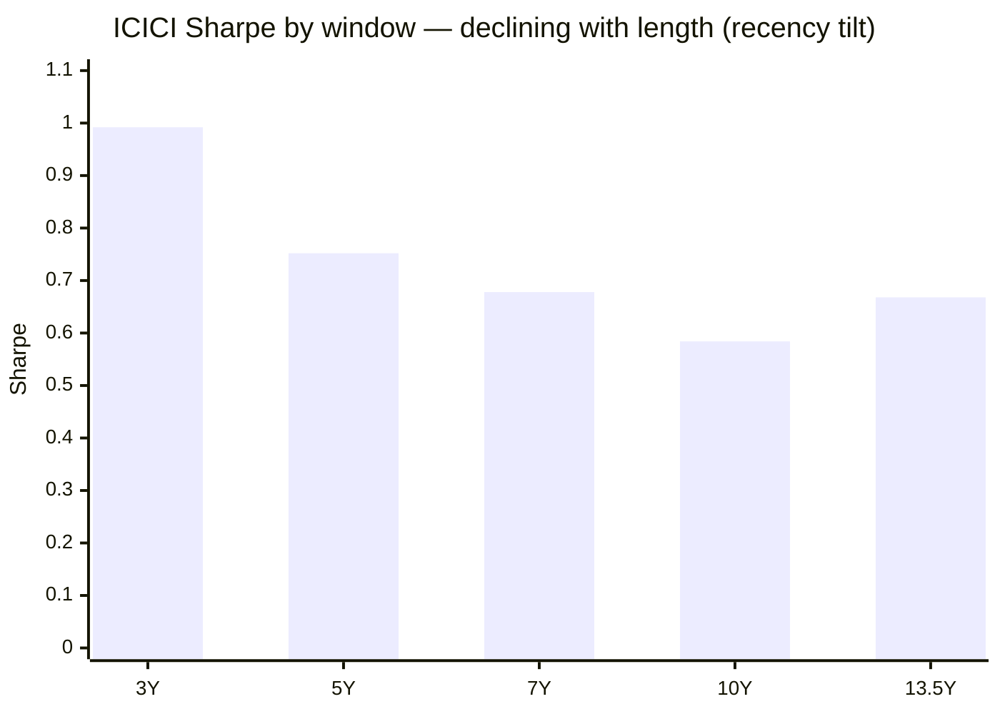
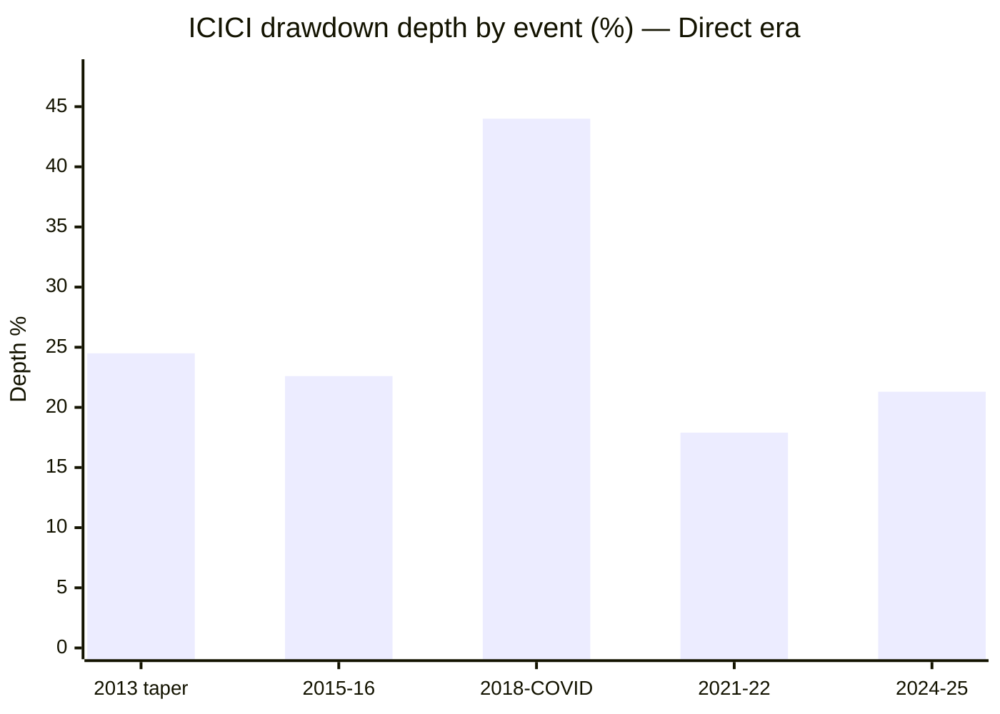

# Module 2: Risk Profile — ICICI Prudential Midcap Fund

## Module 2 Score: ~3.4 / 5 (provisional)

---

## The One-Line Context

ICICI Pru Midcap's Module 2 is **"last of the actives, better than the index — with the amplifications all in the past."** It posts the **worst 5Y Sharpe of the seven shortlisted actives (0.752**; even Sundaram 0.810 and HSBC 0.803 beat it) and carries the **repo's new record documented tail (2008: −75.1%, ~6 years underwater** — deeper than Edelweiss's −74.7%), yet it still **beats the buyable index fund on 6 of 7 axes**, and the down-capture forensic delivers the study's **cleanest current-era sheet**: all three amplified months (Feb/Mar-2020, Feb-2022) are pre-Lalit, followed by **eleven consecutive cushioned down-months** including the two biggest of the period (Feb-2025 at 0.94×, Mar-2026 at 0.90×). The Sharpe ladder, however, **declines monotonically with window length** (3Y 0.99 → 5Y 0.75 → 7Y 0.68 → 10Y 0.58) — a soft HSBC echo confirming M1's recency-trap caution: the fund's risk-adjusted respectability is a 2.5-year-old phenomenon sitting on a mediocre decade.

---

## Raw Data (computed, monthly canonical, as of 10-Jul-2026)

| Metric | Computed | Tickertape | Note |
|--------|----------|------------|------|
| Volatility (5Y common) | **16.7%** | 17.5% (own window) | mid-pack; below the index fund's 16.9% — *reconciled: TT uses a different window/basis; the "highest vol of shortlist" tag comes from history (7Y vol 21.1%, 10Y 19.4%)* |
| Sharpe (5Y, rf 6.5%) | **0.752** | 0.456 (own basis) | **7th of 7 actives** — reproduces published 0.760 ✅ |
| Sharpe ladder | **3Y 0.992 → 5Y 0.752 → 7Y 0.678 → 10Y 0.584 → 13.5Y 0.668** | — | declining with window — recency tilt (3Y→5Y gap −0.24; HSBC's was −0.26) |
| Sortino (5Y) | **1.355** | — | 6th of actives |
| Calmar (5Y) | 0.90 | — | above index (0.85) |
| Max DD (5Y) | **−21.3%** | — | a hair *worse* than the index (−21.2) — the one dominance axis lost |
| Max DD (Direct era) | **−44.0%** (2018→COVID unbroken) | — | deepest modern DD of studied funds |
| **Max DD (ever, Regular)** | **−75.1%** (trough 09-Mar-2009; **not recovered until 04-Dec-2014**) | — | **new repo record tail** (displaces Edelweiss's −74.7%); ~6 years underwater |
| Beta (idx life / 5Y / 3Y) | 0.99 / 0.95 / 1.00 | — | at-index beta |
| R² / TE (idx life) | 95% / 4.8% | — | index-aware active |
| **IR (idx life / 5Y / 3Y)** | **−0.07 / +0.15 / +1.02** | — | negative → steeply rising — the M1 arc at risk level |
| Up / Down capture (5Y) | **96 / 87** | — | see forensic |
| Negative months | **35%** (57/162) | — | worst of studied (norm ~30%) |
| Worst month | **Mar-2020 −29.1%** | — | deepest single month in the midcap study |

**Method:** identical to all sibling M2s — monthly canonical, rf 6.5%, Sharpe = (geo ann − rf)/vol, peers on the 5Y common window **Jul-2021 → Jun-2026**. **My re-run reproduces the published matrix** (ICICI 0.752/pub 0.760, Nippon 0.916/.912, Invesco 0.871/.879, MM 0.835/.839, HSBC 0.803/.825 — validated). Series: ICICI 120381 + Regular 102528 (2008 tail); proxies 147622/114456; cross-sleeve 120716 / 122639 / 119212 / 118668 / 120403 / 119807→151036 (splice) / 142110. Morningstar/VRO risk pages JS-blocked (standing gap); computed metrics primary.

---

## The 5Y Peer Matrix — ICICI Is the Floor of the Actives

| Fund | Vol | Sharpe | Sortino | MaxDD | Up | Dn | Calmar |
|------|-----|--------|---------|-------|-----|-----|--------|
| Nippon | 16.2 | **0.916** | **1.626** | **−19.9** | 100 | 87 | 1.07 |
| Invesco | 17.4 | 0.871 | 1.503 | −20.1 | **106** | 95 | **1.08** |
| Edelweiss | 16.1 | 0.871 | 1.548 | −20.1 | 98 | 86 | 1.02 |
| MM | 16.4 | 0.835 | 1.469 | −20.9 | 100 | 90 | 0.97 |
| Sundaram | 15.7 | 0.810 | 1.412 | −20.7 | 95 | 83 | 0.93 |
| HSBC | 17.1 | 0.803 | 1.358 | −26.0 | 98 | 84 | 0.78 |
| **ICICI** | **16.7** | **0.752** | **1.355** | **−21.3** | **96** | **87** | **0.90** |
| Index fund | 16.9 | 0.686 | 1.183 | −21.2 | 100 | 100 | 0.85 |

**Rank: 7th of 7 actives on Sharpe and Sortino** — below even the funds this study scored ~3.2–3.5. The screening's "highest risk for middling output" is confirmed *on the blended window*. And yet —

---

## ⭐ NEW: "Last of the Actives, Better than the Index" — the Dominance Paradox

Index-dominance test, 5Y, 7 axes:

| Axis (5Y) | ICICI | Index fund | Winner |
|-----------|-------|-----------|--------|
| Return (CAGR) | 19.08% | 18.07% | **ICICI** |
| Volatility | 16.7% | 16.9% | **ICICI** |
| Max drawdown | −21.27% | −21.19% | index (by 8bps) |
| Sharpe | 0.752 | 0.686 | **ICICI** |
| Sortino | 1.355 | 1.183 | **ICICI** |
| Calmar | 0.90 | 0.85 | **ICICI** |
| Down-capture | 87 | 100 | **ICICI** |

**6/7 WIN** — equal to Invesco, better than HSBC's 4/7 (Nippon/Edelweiss/MM: 7/7). **The worst active in the shortlist still dominated the buyable index on the risk-adjusted ledger over five years.** This is a category-level insight for the decision tree: the shortlist's *floor* sits above the passive alternative on most axes — the screening pipeline (above-median 5Y + positive Sharpe) did its job, and the active-vs-passive question inside the shortlist is about *degree*, not direction. ICICI's problem is peers, not the index.

---

## ⭐⭐ NEW: The Era-Resolved Forensic — All the Amplifications Are in the Past

Every index down-month worse than −2% (full idx life):

| Month | Fund | Index | Verdict | Era |
|-------|------|-------|---------|-----|
| Feb-2020 | −7.1 | −5.6 | **1.25× AMPLIFIED** | Kalawadia |
| Mar-2020 | −29.1 | −26.9 | **1.08× AMPLIFIED** | Kalawadia |
| Feb-2022 | −7.7 | −6.7 | **1.15× AMPLIFIED** | Kalawadia (final months) |
| May-2022 | −4.3 | −5.2 | 0.83× cushioned | Lalit era begins |
| Jun-2022 | −3.5 | −5.2 | 0.67× cushioned | Lalit |
| Jan-2023 | −1.3 | −2.4 | 0.55× cushioned | Lalit |
| Oct-2023 | −3.8 | −3.8 | 0.99× cushioned | Lalit |
| Oct-2024 | −6.3 | −6.4 | 0.98× cushioned | Lalit |
| Jan-2025 | −5.7 | −6.1 | 0.93× cushioned | Lalit |
| **Feb-2025** | **−9.8** | **−10.5** | **0.94× cushioned** | Lalit |
| Jul-2025 | −2.6 | −2.8 | 0.93× cushioned | Lalit |
| Aug-2025 | −2.6 | −2.8 | 0.93× cushioned | Lalit |
| Jan-2026 | −2.4 | −3.5 | 0.70× cushioned | Lalit |
| **Mar-2026** | **−10.0** | **−11.1** | **0.90× cushioned** | Lalit |

**Tally: 11 cushioned / 3 amplified — and the split is perfectly chronological.** Every amplification predates Lalit's Jul-2022 start; every month since is a cushion, including the two biggest correction months of the period. Compare: Edelweiss's Trideep era had 1 amplification (Jan-2025, 1.37×); HSBC amplified its biggest month 2.2×; MM had 4. **On the current book, ICICI has the cleanest forensic sheet in the study** — the risk-side confirmation of M1's capture flip (105/82), visible month-by-month.

**The counterweight (same table, longer lens):** the Mar-2020 amplification produced the study's worst single month (−29.1%) and fed the −44.0% unbroken 2018→COVID hole. The *fund as an institution* has amplified crises before; the *current era* hasn't been tested by anything worse than a −21% correction — which it passed with the cohort's fastest recovery (2.6 months, M1).

---

## ⭐ The Sharpe Ladder — a Soft HSBC Echo (the Recency Tilt Is Real)

| Window (to Jun-2026) | Sharpe | Vol |
|----------------------|--------|-----|
| 3Y | **0.992** | 18.5% |
| 5Y | 0.752 | 16.7% |
| 7Y | 0.678 | 21.1% |
| 10Y | **0.584** | 19.4% |
| 13.5Y (full Direct) | 0.668 | 19.5% |

Monotonic decline; the 3Y→5Y gap (−0.24) is nearly HSBC's (−0.26). The differences from the HSBC case: (a) **the screening never flattered ICICI** (TT Sharpe 0.456 — there was no anomaly to dismantle; the fund arrived pre-discounted); (b) the **IR arc (−0.07 → +0.15 → +1.02)** says the recent strength is alpha-driven, not vol-luck. But the discipline holds: **the fund's risk-adjusted respectability is 2.5 years old, sitting on a decade of 0.58–0.68 Sharpe.**

---

## ⭐ NEW: The Up-Capture Diagnosis — the Fade Was a Numerator Problem

Era-split risk fingerprint (vs the Midcap-100 ETF for cross-era comparability):

| Era | Vol | Up-cap | Down-cap | Beta | Sharpe |
|-----|-----|--------|----------|------|--------|
| Kalawadia (Jul-2016 → Jun-2022) | **20.7%** | 92 | 80 | 0.88 | **0.35** |
| Lalit (Jul-2022 → now) | 16.6% | 92 | 81 | 0.92 | **1.06** |
| Lalit, 2024 → now | 18.0% | **101** | **79** | 0.95 | 0.67 |

Two things this table settles:

1. **The "highest vol" reputation is Kalawadia-era history** (20.7%) — the current book runs 16.6–18.0%, mid-pack. The risk *quantity* normalized under Lalit.
2. **The fade was an up-capture problem, not a down-capture problem — confirming M1's participation-deficit thesis at the risk level.** Across eras, down-capture has been consistently decent (79–81); what changed in 2024 is the up-side (92 → 101). The fund's historical sin was **missing rallies while still taking equity risk — the worst possible trade** — and the turnaround consists of fixing the numerator, not de-risking.

---

## Drawdown Ledger, Tails & Recovery

| Event | Depth | Underwater |
|-------|-------|-----------|
| **2008 GFC (Regular)** | **−75.1%** (trough 09-Mar-2009) | **not recovered until 04-Dec-2014 — the repo's new record tail**, displacing Edelweiss's −74.7% |
| 2013 taper | −24.5% | 3.8 mo |
| 2015–16 | −22.6% | 6.1 mo |
| **2018 winter → COVID (unbroken)** | **−44.0%** | 8.4 mo post-trough (~35 mo peak-to-peak) |
| 2021–22 | −17.9% | 2.8 mo |
| **2024–25** | −21.3% (late trough 07-Apr-2025) | **2.6 mo — fastest of the cohort** ⭐ |

The two ends of the record could not be further apart: the deepest, slowest tail ever documented in this study (2008 — prior regime, pre-SEBI-categorization era, and unlike Edelweiss with no Mid+Small mandate-change excuse) and the fastest correction recovery of the current cohort. Winter DD −21.9% (M1) — mid-pack, genuine.

---

## Volatility Regime & Distribution

| Year | Vol | Note |
|------|-----|------|
| 2020 | 28.1% | COVID |
| 2023 | **10.9%** | the calm year the fund *lagged* the rally |
| 2024 | 17.6% | |
| 2025 | 17.8% | |
| 2026 | 21.6% | elevated with category, milder than HSBC (25.9) / Invesco (29.4) |

- **Worst months:** Mar-2020 −29.1% (study's deepest), Mar-2026 −10.0, Feb-2025 −9.8, Jan-2016 −9.7, Sep-2018 −8.3. **Best:** May-2014 +16.5, Apr-2026 +14.5, Nov-2020 +13.6.
- **Negative months: 35% (57/162)** — worst of the studied funds (Edelweiss 30%, HSBC 33%).
- **Structural buffer:** ~fully invested; sleeve composition (screening hints ~19% large ballast / ~10% small kicker) → **M3**.
- **Redemption/liquidity:** ₹7,789 Cr, liquid band — minor, closed.

---

## Cross-Sleeve Correlation — Single-Slot, Sixth Confirmation

| vs | Corr | R² | Beta |
|----|------|-----|------|
| Nifty 50 (UTI index) | 0.884 | 78% | 1.06 |
| PP FlexiCap | 0.873 | 76% | **1.26** |
| DSP Small Cap | 0.926 | 86% | 0.86 |
| **Nippon** | **0.968** | **94%** | 1.00 |
| Invesco | 0.944 | 89% | 1.01 |
| HSBC | 0.945 | 89% | 1.01 |
| MM | 0.955 | 91% | 1.08 |

R² 89–94% vs every studied midcap — the **94% vs Nippon is the tightest pair measured in the study**. Single-slot decision: confirmed for the sixth time. Beta 1.26 vs PP — the octane-over-core role. *(Informational — feeds decision_tree.md, not scored.)*

---

## Cross-Study Placement

| Dimension | **ICICI** | HSBC | MM | Edelweiss | Invesco | Nippon |
|-----------|-----------|------|-----|-----------|---------|--------|
| Sharpe (5Y common) | **0.752 (7th)** | 0.803 | 0.835 | 0.871 | 0.871 | **0.916** |
| Index-dominance | **6/7** | 4/7 | 7/7 | 7/7 | 6/7 | 7/7 |
| Down-capture forensic | **11 cush / 3 amp — all amps pre-Lalit** ⭐ | mirage (2.2× amp) | 10/4 | genuine (1 amp) | era-dependent | era-stable |
| Worst ever | **−75.1% (repo record)** | −70.6% | −33.1 (missed top) | −74.7% | −70.8% | −62.7% |
| Sharpe ladder | declining (recency tilt) | collapsing | mild tilt | stable | recency-ish | stable |
| IR (recent) | **+1.02 (3Y)** | negative | +1.14 (3Y) | +0.37 | 0.45 | 0.44 |
| Negative months | **35% (worst)** | 33% | 36%* | 30% | ~ | ~ |
| 2024–25 recovery | **2.6 mo** ⭐ | 16 mo | 13.7 mo | 6.4 mo | ~6 mo | ~7 mo |

*\*MM's 36% includes its choppy NFO-cash era.*

---

## Risk Profile — Points For and Against

### ✅ Points IN FAVOUR

- **Cleanest current-era down-capture forensic in the study** — 11 consecutive cushions since mid-2022, incl. the two biggest correction months
- **Beats the buyable index on 6 of 7 axes** despite being the worst active — the dominance paradox
- **Fastest 2024–25 recovery of the cohort (2.6 months)**
- **Steeply rising IR** (−0.07 → +1.02) — recent strength is alpha-driven, not vol-luck
- Current-book vol normalized (16.6–18.0% vs Kalawadia-era 20.7%)
- Genuine fully-invested winter record (−21.9% DD, +8.3pts vs ETF)
- Down-capture consistently decent across eras (79–87) — the historical problem was never the downside

### ⚠️ Points AGAINST

- **Worst 5Y Sharpe (0.752) and Sortino (1.355) of the seven actives**
- **Declining Sharpe ladder** (0.99 → 0.58 with window length) — the respectability is 2.5 years old
- **Repo-record tail: 2008 −75.1%, ~6 years underwater** — and no mandate-change excuse
- **Deepest modern drawdown of the studied funds (−44.0%, 2018→COVID)** incl. a 1.08–1.25× amplified COVID
- **Worst negative-month share (35%)** of the studied funds
- 5Y MaxDD (−21.3) marginally worse than the index — the one dominance axis lost
- Current era untested beyond a −21% correction
- No published third-party risk-grade cross-check (Morningstar/VRO JS-blocked)

---

## Module 2 Scorecard

| Sub-dimension | Weight | Score | Reasoning |
|---------------|--------|-------|-----------|
| Max Drawdown (inception-adjusted) | High | **3.5** | 5Y −21.3 (only dominance axis lost, by 8bps); modern −44.0 = deepest of studied; **2008 −75.1 = repo record tail** (prior regime, heavily caveated) |
| **Down-capture vs own index** | **Critical** | **4.0** | 5Y 87 (<90 band) and the **cleanest current-era forensic of the study** (11 straight cushions); docked for the three pre-Lalit amplifications incl. COVID and the era-mixed attribution |
| Sharpe | High | **3.0** | 0.752 — **last of the 7 actives**, beats index; declining ladder = recency tilt |
| Sortino | Medium | **3.0** | 1.355 — 6th of actives |
| Recovery time from max DD | Medium | **4.5** | 2024–25: 2.6mo **fastest of cohort**; 2021–22: 2.8mo; COVID 8.4mo; the 2008 ~6y underwater is prior-regime |
| 2018–19 winter drawdown | Critical | **4.0** | −21.9% DD with +8.3pts cumulative vs ETF — genuine fully-invested pass (consistent with M1) |
| Volatility vs category | Medium | **3.0** | 5Y 16.7 below index but historically the shortlist's highest (7Y 21.1); 35% negative months = worst of studied |
| Effective risk of the 35% sleeve | Medium | **3.5** (prov.) | screening hints ~19% large ballast / ~10% small kicker — moderate; composition → M3 |
| Cross-sleeve correlation | Informational | — | R² 89–94% vs all five studied midcaps (94% vs Nippon = tightest pair); single-slot → decision tree |
| *Index-dominance (modifier)* | — | **+** | 6/7 despite last-of-actives Sharpe — "the floor of this shortlist still beats the index" |
| *Era-resolved amplification (modifier)* | — | **~** | all amplifications pre-Lalit (positive) but the current era is untested beyond a −21% correction (neutralizing) |

**Module 2 Score: ~3.4 / 5** — above HSBC (3.2), below MM (3.9), consistent with the fund-level facts: ICICI beats HSBC on dominance (6/7 vs 4/7), forensic cleanliness, and recovery speed, but sits below MM on Sharpe rank, tail depth, and negative-month share.
- **Case for 3.5:** the cleanest current-era forensic in the study + fastest recovery + genuine winter + 6/7 dominance.
- **Case for 3.2–3.3:** last of the actives on the headline ratios, worst negative-month share, repo-record tail, and a declining Sharpe ladder.
- **3.4 is the honest midpoint.**

**Conditionality / handoffs:**
- → **M3 (pivotal, carries the study) — RESOLVED:** what book produces up-92-with-equity-risk (the fade) and then up-101/down-79 (the fix)? **M3 answers it: a ~46% cyclical book (Materials 24.3% + Industrials 22.0%) that lagged the financials/autos-led 2023 rally and led the 2024+ capex boom — the clean forensic is regime-contingent cyclical positioning, not durable defensiveness, which reinforces this module's "current era untested / recency tilt" caution rather than dispelling it. Active share computed at 73.9% (2nd-highest studied) releases the low-TE/closet concern. No M2 rescore — the ~3.4 already carried the recency caveat.**
- → **M5:** Lalit's cross-fund fingerprint — if his other funds (Business Cycle, ELSS) show the same 2023-lag-then-2024-sweep shape, the amplitude is style, not fund-specific.

---

## Comparative Module 2 Scores

| Fund | Category | M2 Score | Risk character |
|------|----------|----------|----------------|
| Parag Parikh FlexiCap | FlexiCap | ~4.5 | Allocation-built fortress |
| Nippon Growth Mid Cap | MidCap | ~4.4 | Pure-selection downside discipline at scale |
| Edelweiss Mid Cap | MidCap | ~4.2 | Most defensive book; genuine down-capture |
| Invesco India Midcap | MidCap | ~4.1 | Paid aggression — top efficiency ratios |
| Mahindra Manulife Mid Cap | MidCap | ~3.9 | Index-beating 7/7 but peer-mid-pack; cash-era artifact |
| DSP Small Cap | SmallCap | ~3.9 | Disciplined but deep-drawdown asset class |
| **ICICI Pru Midcap** | **MidCap** | **~3.4** | **Worst-of-actives ratios on a mediocre decade; cleanest current forensic + fastest recovery — a turnaround at the risk level too** |
| Franklin US Opp | International | 3.3 | Mediocre standalone, elite diversifier |
| HSBC Midcap | MidCap | ~3.2 | Screening anomaly dismantled; worst pain-adjusted metrics |

---

## SIP Implication

1. **The long-run risk record is the shortlist's worst** — last-of-actives Sharpe, the deepest tails in the repo (−75.1% in 2008, −44.0% in 2018–20), and the worst negative-month share. If you buy this fund, you are explicitly *not* buying the historical risk profile — you are buying the 2.5-year-old repaired one.
2. **The repaired profile is genuinely good so far** — eleven straight cushioned down-months, the cohort's fastest correction recovery, and an IR that has swung from negative to +1.02. The risk *quantity* has also normalized (vol 16.6–18.0% vs the old 20.7%).
3. **But it still beats the index fund on 6 of 7 axes** — even the shortlist's floor dominates the passive alternative on the risk-adjusted ledger. The active-vs-passive question here is about degree, not direction.
4. **Tripwires:** the next real correction's amplification behaviour (the current era has only seen −21%); a Sharpe-ladder inversion persisting (if the 3Y stays ~1.0 while 5Y climbs toward it, the turnaround is compounding; if the 3Y decays toward 0.6, it was a spike); and M3's verdict on whether the book's construction explains the clean forensic.

---

## One-Line Verdict

> **ICICI Pru Midcap's Module 2 is "last of the actives, better than the index — with the amplifications all in the past": the worst 5Y Sharpe (0.752) and Sortino (1.355) of the seven shortlisted actives, the repo's new record documented tail (2008 −75.1%, ~6 years underwater, no mandate-change excuse), the deepest modern drawdown of the studied funds (−44.0% through an amplified COVID), and the worst negative-month share (35%) — yet it beats the buyable index fund on 6 of 7 axes, and its down-capture forensic is the cleanest current-era sheet in the study: all three amplified months predate Lalit Kumar's Jul-2022 start, followed by eleven consecutive cushioned down-months including the two biggest of the period, with the cohort's fastest correction recovery (2.6 months) and an information ratio that swung from −0.07 to +1.02. The declining Sharpe ladder (3Y 0.99 → 10Y 0.58) keeps the anti-recency discipline engaged: the risk-adjusted respectability is 2.5 years old. The era fingerprint also settles M1's diagnosis — the fade was an up-capture problem (92) at full equity risk, and the fix (up-101/down-79) repaired the numerator rather than de-risking. Provisional: ~3.4/5 — above HSBC (3.2), below MM (3.9); conditional on M3's book-construction read (does the portfolio explain the clean forensic?) and M5's cross-fund fingerprint of Lalit's amplitude.**

---

*Module 2 completed: July 10, 2026 | Risk Profile | MFAPI methodology — monthly canonical, rf 6.5%, Sharpe = (geo ann − rf)/vol, peers on identical 5Y common window Jul-2021 → Jun-2026 (reproduces published matrix: ICICI 0.752/pub 0.760, Nippon 0.916/.912, Invesco 0.871/.879, MM 0.835/.839, HSBC 0.803/.825 — method validated) | Series: ICICI Direct 120381 + Regular 102528 (2008 tail −75.1%, trough 09-Mar-2009, recovered 04-Dec-2014 = repo record, displacing Edelweiss −74.7%), proxies 147622 + 114456, cross-sleeve 120716/122639/119212/118668/120403/119807→151036/142110 | Era fingerprint (vs ETF): Kalawadia Jul-2016→Jun-2022 vol 20.7/up-92/dn-80/Sharpe 0.35; Lalit Jul-2022→ vol 16.6/up-92/dn-81/Sharpe 1.06; Lalit 2024→ up-101/dn-79 — the fade was a numerator (up-capture) problem | Down-capture forensic: 11 cushioned / 3 amplified, split perfectly chronological (all amps pre-Lalit; Feb-2025 0.94×, Mar-2026 0.90× cushioned) — cleanest current-era sheet in the study | Sharpe ladder declining 3Y 0.992 → 10Y 0.584 (soft HSBC echo; screening never flattered it — TT 0.456) | Index-dominance 6/7 (loses MaxDD by 8bps) | Cross-sleeve R² 89–94% (94% vs Nippon = tightest pair in study) | Morningstar & VRO risk pages JS-blocked — computed metrics primary | Provisional M2 Score: ~3.4/5 (conditional on M3 book-construction + M5 Lalit cross-fund fingerprint)*
