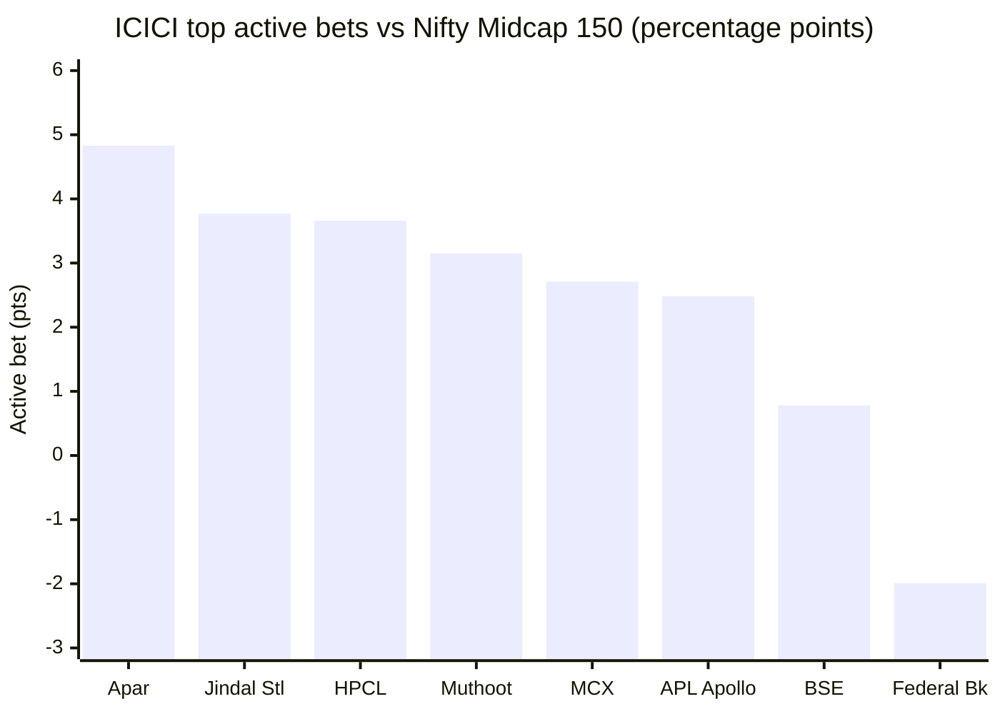

# Module 3: Portfolio DNA — ICICI Prudential Midcap Fund

## Module 3 Score: ~3.9 / 5 (provisional)

---

## The One-Line Context

ICICI Pru Midcap is the study's **"cyclical-thesis book — the exact inverse of Mahindra Manulife"** — and its construction *is* the fade-and-reversal story M1/M2 couldn't fully explain. A **computed 73.9% active share** (2nd-highest of the studied midcaps, behind only Invesco's 79.5) is expressed through a **~46% cyclical concentration** (Materials 24.3% + Industrials 22.0%) built around three theses — **capital-markets exchanges** (BSE 4.99% + MCX 4.48% = its #2 and #3 holdings, ~9.5% combined), **electrification/capex** (Apar its top holding and biggest active overweight at +4.83, plus KEI, GE T&D, Cummins), and **metals** (Jindal Steel, Jindal Stainless, Vedanta, APL Apollo). The single sharpest finding: **ICICI's two largest active bets are BSE and MCX — the exact two names Mahindra Manulife deliberately omits** — so in the same 150-stock pond the two funds take diametrically opposite exchange stances. The cyclical tilt answers M2's pivotal handoff: this book lagged the financials/autos-led 2023 rally (the −10.4 alpha) and surged in the 2024+ capex/defense/PSU regime (+5.63) **because it is a sector-rotation bet, not a diversified compounder** — meaning the turnaround alpha is thematic and regime-dependent, the very thing that keeps the anti-recency caution alive.

---

## Data & Provenance

| Metric | Value | Source |
|--------|-------|--------|
| **Equity holdings** | **83 stocks** | Groww `__NEXT_DATA__` JSON (`corpus_per` × 83) |
| **Active share vs Nifty Midcap 150** | **73.9% (COMPUTED, not estimated)** | 83 fund weights vs M_MOTY 151 constituents, ½Σ\|wf−wi\| |
| In-index / off-index | **36 names / 60.5% wt** in-index; **47 names / 39.5% wt** off-index | computed |
| Top-10 concentration | **38.0%** | computed |
| Top-5 / positions ≥3% | 22.4% / **9** | computed |
| Largest position | **Apar Industries 5.48%** | Groww |
| **Portfolio turnover** | **75%** | Groww JSON (`portfolio_turnover`) |
| Sector tops | **Materials 24.3% · Industrials 22.0% · Financials 21.7%** · Cons Disc 12.7% · Real Estate 5.6% | computed (Groww sector tags) |
| Cap split | mid ~68.7% / large ~18.9% / small ~10.2% | screening (Groww band field empty — gap) |
| PE | ~30.1 (category ~32.9) | screening (factsheet reconciliation → M4) |
| AUM | ₹7,845 Cr | Groww |
| ER | **Groww shows 1.13% (Regular/stale); Direct 0.87% is the number of record** | Groww / screening — → M4 |
| Managers | Lalit Kumar (Jul-2022) + Sharmila D'mello | AMC (M1) |

**⭐ ER flag (→ M4) — RESOLVED in M4:** Groww's holdings page shows **1.13%**, but M4 found Groww's ER field is **unreliable for this fund** (flips 0.95 / 1.10 / 1.14 / 1.39 / 1.13 across snapshots, rising as AUM grows = nonsensical). Authoritative: **Direct 0.87%** (screening/TT, number of record), **Regular 1.53%** (VRO fresh). Do not use Groww's ER.

**Method:** full holdings recovered from Groww's `__NEXT_DATA__` JSON (83 names summing to 100%, with sector tags and turnover) — a **new-source workaround** since the Tickertape MF holdings API's ICICI mfId could not be located (the search endpoint returns only ETFs; M_ICIC is the Nifty-100 ETF red-herring, others were debt funds). Active share computed against **M_MOTY** (Motilal Nifty Midcap 150 index fund, 151 constituents) — the **same denominator as the Nippon/Invesco/HSBC/MM modules**, so this is a computed AS directly comparable to those (unlike Edelweiss's ~55% estimate). **Documented gap:** Groww's per-holding market-cap band field is empty, so the precise 101–150 / 201–250 band split is estimated from the off-index large-cap names + screening cap split, not computed.

---

## ⭐⭐ NEW: The Cyclical Thesis IS the Fade-and-Reversal (M2's pivotal handoff, resolved)

M2 ended with: *"what book produces up-92-with-equity-risk (the fade) then up-101/down-79 (the fix)?"* The sector map answers it:

| Sector cluster | Weight | 2020–23 regime | 2024+ regime |
|----------------|--------|----------------|--------------|
| Materials (metals/chem) | 24.3% | out of favor | **ran hard** |
| Industrials (capex/electrification) | 22.0% | out of favor | **ran hardest (defense/PSU/power capex)** |
| Financials (exchanges/NBFC) | 21.7% | mixed | strong |
| **Cyclical total** | **~46%** | **lagged the 2023 broad rally** | **led the 2024–26 capex boom** |

The fund didn't fade because of stock-picking failure and didn't reverse because of stock-picking genius — **it holds a ~46% cyclical/capex book that was in the wrong regime 2020–23 and the right one 2024+.** This reframes the entire returns story: ICICI's alpha is **sector-timing/thematic, not diversified stock selection** — which makes M1's +5.63 and M2's clean forensic *regime-contingent*, sharpening (not softening) the anti-recency caution. The 2023 −10.4 lag at 10.9% vol (M1) is now fully explained: a capex book sitting out a rally led by other sectors, calmly. No studied sibling had a single sector cluster this dominant driving its era shape — a genuinely new dimension.

---

## ⭐⭐ NEW: The Exchange Head-to-Head — ICICI vs Mahindra Manulife (same pond, opposite stance)

| Holding | ICICI | Mahindra Manulife | Index wt |
|---------|-------|-------------------|----------|
| **BSE** | **4.99%** (#2 holding) | **0.00% (omitted)** | 4.21% |
| **MCX** | **4.48%** (#3 holding) | **0.00% (omitted)** | 1.77% |
| Combined | **~9.5%** | **0%** | ~6% |

M3 for Mahindra Manulife found its signature was the *deliberate omission* of both exchanges (its two largest active underweights). ICICI does the exact opposite — **BSE and MCX are its #2 and #3 positions and among its biggest active overweights** (MCX +2.71 vs index). Two funds, the same 150-stock universe, one betting ~9.5% on the financialization-of-markets theme and the other avoiding it entirely. This is the cleanest illustration in the study of the "differentiation comes from selection, not discovery" framing — and a decision-tree gift (they are genuinely different books despite R² 91%).

**Biggest active overweights:** Apar +4.83, Jindal Steel +3.77 (off-index), HPCL +3.66 (off-index), Muthoot +3.15 (off-index), MCX +2.71, APL Apollo +2.48, KPR Mills +2.30, GE T&D +2.26, Jindal Stainless +2.21, KEI +2.20.

**Biggest active underweights (index names ICICI avoids):** Federal Bank −1.99, Suzlon −1.75, Hero MotoCorp −1.52, GE Vernova −1.50, BHEL −1.48, AU SFB / Lupin / Laurus −1.44 each.

---

## Active Share — Computed 73.9%, Closet Question Dead (M2 conditionality released)

| Fund | Active share | Method |
|------|-------------|--------|
| Invesco | **79.5%** | computed |
| **ICICI** | **73.9%** | **computed** ⭐ |
| HSBC | 69.5% | computed |
| Mahindra Manulife | 66.6% | computed |
| Edelweiss | ~55% | estimated |
| Nippon | 54.1% | computed |

At **73.9%, ICICI is decisively active** — 2nd-highest of the studied midcaps, far above the 45% closet line. This **releases M2's low-TE / high-R² concern**: the 4.8% tracking error and 95% R² were earned through genuine off-index conviction (39.5% off-index weight across 47 names), not index-hugging. The clean current-era down-capture forensic (M2) is real construction — but it's *concentrated cyclical* construction, which is why it's regime-dependent.

---

## Position Architecture, Bands & Concentration

- **Architecture — concentrated top, broad tail:** 9 positions ≥3%, top-10 38.0%, largest 5.48% — an inverted-pyramid family (like Invesco 46.7 / HSBC 39.7, more concentrated than MM's flat 25.9), but with an **83-name tail** (like Edelweiss 86 / HSBC 77): a hybrid of high-conviction top over a long diversifying tail.
- **⭐ The offensive large-cap sleeve (band positioning, partial):** the off-index 39.5% is dominated by **large-cap cyclicals** (HPCL, Jindal Steel, Vedanta, Cummins, Muthoot — all rank <100) — i.e., the ~18.9% large-cap sleeve is deployed **offensively** (aggressive cyclical/graduated bets), *not* as Nippon-style defensive ballast. This is an aggressive use of the flexible sleeve; the precise 101–150 vs deep-band split is a documented gap (Groww band field empty).
- **Sector concentration — the risk:** max single sector Materials 24.3% (just under the study's 25% line), but **Materials + Industrials = 46% in cyclicals** — a thematic concentration no diversified sibling carries (Nippon max 8.1, Edelweiss 9.6, HSBC electrification ~22). The book's defining risk: coherent thesis, but a capex-cycle-levered one.
- **Turnover 75%** — 2nd-highest of the studied funds (HSBC ~110 > **ICICI 75** > Edelweiss 36 > Invesco 28 > Nippon 13.7). Active rotation consistent with a thematic/regime-aware manager; inflates cost drag (→ M4) and signals the book is *steered*, not held. Some reflects Lalit's 2022–23 reshaping.

---

## Cross-Sleeve Overlap — Return-Enhancer, Not Diversifier (decision-tree feed)

| vs | Shared names | Min-weight overlap |
|----|-------------|--------------------|
| **PP FlexiCap** | 3 | **0.1%** (BSE, IndusInd, Balkrishna) |
| **DSP Small Cap** | 4 | **3.6%** (Apar, Atul, Navin Fluorine, Sona BLW) |
| MM Mid Cap (peer) | 14 | 18.7% |

Near-zero name overlap with the actual portfolio sleeves (PP 0.1%, DSP 3.6%) — the same verdict as every sibling: **duplicates risk (M2 R² 76% PP / 86% DSP), not holdings.** The 18.7% vs MM is the within-band peer overlap (both midcaps), yet the two diverge sharply on the exchanges — same pond, different book. *(Informational — decision tree, not scored.)*

---

## This Book Is Lalit's — Clean Attribution Window

At 75% turnover over his 4-year tenure, today's book is essentially **entirely Lalit Kumar's construction** — a clean attribution window (like HSBC/Invesco, unlike Edelweiss's part-inherited book). The cyclical/capex/exchange thesis, the concentrated top-10, the offensive large-cap sleeve — all his. This makes M3 the holdings-level fingerprint of the manager whose amplitude (M1: −10.4 then +5.63) defines the fund.

**Forward flag for M5:** if Lalit runs the same cyclical-thematic tilt on his other funds (Business Cycle — literally a cycle-timing mandate — and ELSS), the amplitude is a *style*, and the 2024+ alpha is "the theme being right," repeatable only if he rotates ahead of the next regime. That is a specific, demanding skill to underwrite.

---

## PE / Valuation

At ~30.1 (category ~32.9), a mild discount — consistent with a metals/cyclical-heavy book (cyclicals trade at lower multiples through the cycle). Not a growth-premium book like Invesco (PE 49.4); closer to the value-buffer end (Nippon 29.3, Edelweiss 30.3). Factsheet reconciliation → M4.

---

## Comparison with Studied Funds

| Dimension | **ICICI** | MM | HSBC | Invesco | Nippon | Edelweiss |
|-----------|-----------|-----|------|---------|--------|-----------|
| Stocks | 83 | 66 | 77 | 44 | 96 | 86 |
| Active share | **73.9%** | 66.6% | 69.5% | **79.5%** | 54.1% | ~55% |
| Top-10 | 38.0% | 25.9% | 39.7% | 46.7% | 23.1% | ~25% |
| Turnover | **75%** | ~60% | ~110% | 28% | 13.7% | 36% |
| Max sector | 24.3% (Materials) | ~29% fin | 14.3% | fin 31% | 8.1% | 9.6% |
| Signature | **exchanges + capex + metals (46% cyclical)** | value-financials, omits exchanges | electrification + new-age | high-conviction growth | breadth + graduation | capital-markets + breadth |
| Exchange stance | **BSE+MCX ~9.5% (overweight)** | omits both | neutral | BSE overweight | BSE underweight | MCX+BSE overweight |
| Book character | **cyclical-thesis / regime bet** | value / anti-momentum | traded momentum | growth conviction | breadth machine | breadth + value |

**Placement:** ICICI is a **high-active-share, sector-concentrated cyclical-thesis book** — closest in spirit to HSBC (thematic, high turnover, concentrated top) but with a capex/exchange tilt instead of new-age, and higher active share. Its 46% cyclical concentration is the most thesis-levered book of the studied midcaps.

---

## Points For / Points Against (Portfolio Angle)

### ✅ Points For

- **Computed 73.9% active share** — 2nd-highest studied; closet question dead; releases M2's low-TE concern
- **Coherent, differentiated thesis** — exchanges + electrification + metals, cleanly the current manager's
- **The exchange head-to-head** — genuinely distinct book vs every sibling (the anti-MM)
- Top-10 (38.0%) in the good band; broad 83-name tail limits single-name blowup risk
- Mild valuation buffer (PE ~30 vs category ~33)
- Near-zero overlap with PP/DSP sleeves — a real return-enhancer

### ❌ Points Against

- **46% cyclical concentration** — the alpha is sector-timing/regime-contingent, not diversified selection (the M1/M2 reframe); the defining portfolio risk
- **75% turnover** — 2nd-highest of studied; cost drag (→ M4) and a steered, not held, book
- **The 18.9% large-cap sleeve is offensive** (cyclical bets), not defensive ballast — adds beta, not cushion
- 83 stocks — above the 40–70 sweet spot; a broad tail under a concentrated top
- Band-split precision a documented gap (Groww field empty)
- The whole book is one manager's thesis (key-person / style-persistence risk → M5)

---

## Module 3 Scorecard

| Sub-dimension | Weight | Score | Reasoning |
|---------------|--------|-------|-----------|
| **Active share vs Midcap 150** | **Critical** | **4.5** | **73.9% computed** — 2nd-highest studied, closet question dead, releases M2's low-TE concern; just shy of Invesco's 79.5 (5.0) |
| Mid-cap mandate honesty (% in band) | Medium | **4.0** | mid ~68.7% — comfortably above the 65% floor, cleaner than Invesco (64.6) |
| Quality/intent of the 35% sleeve | High | **3.5** | off-index 39.5% is coherent (capex/exchange/metals thesis) but the ~18.9% large-cap is deployed *offensively* (cyclical bets, not ballast) — high-beta sleeve |
| Band positioning | Medium | **3.5** (partial) | offensive large-cap + off-index cyclicals; deliberate, aggressive; precise band split a documented gap |
| Top-10 concentration | Medium | **4.0** | 38.0% — the 35–45 "good" band; concentrated top over a broad tail |
| Number of stocks | Low | **4.0** | 83 — above the 40–70 sweet spot (70–90 = 4); broad tail |
| **Sector diversification** | Medium | **3.0** | max sector 24.3% (near the line) but **46% cyclical concentration** — the book's defining risk; thesis-levered |
| Turnover | Medium | **3.5** | 75% — the 50–80 "4" band but 2nd-highest of studied; active rotation, cost drag → M4 |
| Overlap with existing sleeves | Informational | — | PP 0.1% / DSP 3.6% — return-enhancer; → decision tree |

**Module 3 Score: ~3.9 / 5** — just below the Invesco/MM/Edelweiss 4.0 cluster, above HSBC (3.7). The high active share and coherent thesis pull up; the 46% cyclical concentration and 75% turnover pull down.
- **Case for 4.0:** active share is the critical row and 73.9% is excellent; the thesis is coherent and the book is cleanly the current manager's.
- **Case for 3.7–3.8:** a 46%-cyclical, 75%-turnover, thesis-levered book is a regime bet, not a diversified compounder — its alpha is timing-dependent, a genuine construction risk for a buy-and-hold SIP.
- **3.9 is the honest midpoint.**

**Conditionality / handoffs:**
- → **M2 (confirms, no rescore):** the clean current-era forensic is now understood as *regime-contingent cyclical positioning*, not durable defensiveness — reinforcing M2's "current era untested / recency tilt" caution. Cross-reference note added to M2; no score change.
- → **M4:** the 75% turnover adds meaningful drag on top of the 0.87% Direct ER (Groww's 1.13% needs reconciling) — the fee-for-alpha row, already underwater on the −0.35 canonical alpha (M1), gets a turnover-drag penalty.
- → **M5 (pivotal) — RESOLVED, favorably:** does Lalit run this cyclical-thematic tilt on Business Cycle / ELSS? **Yes — and it works: his Business Cycle Fund (a dedicated regime-rotation mandate) has beaten the market every year since 2021 (+8.73%/yr), including +13.2 in 2023 — the exact year this midcap book lagged −10.4.** So the cyclical rotation is a *verified, repeatable cross-fund skill*, and the 2023 midcap lag was a transition artifact (he'd just taken the fund and was reshaping it), not a positioning failure. The alpha is still regime-timing rather than diversified selection — but it is *demonstrated* regime-timing, which strengthens (not weakens) the thesis-durability read. No M3 rescore; the ~3.9 already credited the coherent, cleanly-attributed thesis.

---

## Comparative Module 3 Scores

| Fund | Category | M3 Score | Portfolio character |
|------|----------|----------|--------------------|
| PP FlexiCap | FlexiCap | ~4.3 | Allocation fortress |
| Nippon Growth Mid Cap | MidCap | ~4.1 | Breadth machine + graduation escalator |
| Mahindra Manulife Mid Cap | MidCap | ~4.0 | Value-financials; omits exchanges |
| Edelweiss Mid Cap | MidCap | ~4.0 | Breadth + capital-markets thesis |
| Invesco India Midcap | MidCap | ~4.0 | High-conviction growth; highest AS studied |
| **ICICI Pru Midcap** | **MidCap** | **~3.9** | **Cyclical-thesis book (exchanges+capex+metals, 46% cyclical); 2nd-highest AS — regime-levered** |
| DSP Small Cap | SmallCap | ~3.8 | Sector-thesis conviction |
| HSBC Midcap | MidCap | ~3.7 | Traded momentum + electrification/new-age |

---

## SIP Implication

1. **You are buying a cyclical/capex thesis, not a diversified midcap book.** 46% of the portfolio sits in Materials + Industrials, plus a ~9.5% exchange bet — this fund will lead when the capex/PSU/financialization regime runs (2024–26) and lag when it doesn't (2020–23). The M1 turnaround and the M2 clean forensic are both *this regime being favorable*, not durable defensiveness.
2. **The active share (73.9%) is genuinely high** — you are paying active fees for a genuinely active, differentiated book (the anti-MM exchange stance is the proof), not a closet indexer. On the "why not the index?" portfolio test, this fund clears it decisively.
3. **The turnover (75%) is a cost and a signal** — the book is actively rotated, so the thesis you own this year may not be the thesis next year; the alpha depends on the manager rotating ahead of regimes (→ M5), and the drag eats into the already-thin fee-for-alpha (→ M4).
4. **Tripwires:** a sustained regime shift away from capex/cyclicals (the book would lag as it did 2020–23); the exchange bet (BSE+MCX ~9.5%) de-rating; and whether Lalit's Business Cycle / ELSS books show the same tilt (style vs fund-specific — M5).

---

## One-Line Verdict

> **ICICI Pru Midcap's portfolio is the study's cyclical-thesis book and the exact inverse of Mahindra Manulife: a computed 73.9% active share (2nd-highest studied, behind only Invesco) expressed through a ~46% cyclical concentration — capital-markets exchanges (BSE 4.99% + MCX 4.48%, its #2/#3 holdings and among its biggest active overweights, the exact two names MM omits), electrification/capex (Apar its top holding at +4.83 active, plus KEI/GE T&D/Cummins), and metals (Jindal Steel/Stainless, Vedanta, APL Apollo) — with 83 stocks, a concentrated 38.0% top-10, 75% turnover (2nd-highest of studied), and a ~18.9% large-cap sleeve deployed offensively as cyclical bets rather than defensive ballast. Its defining value is that the book construction resolves M1/M2's puzzle: this fund faded in the 2020–23 regime and reversed in the 2024+ capex boom because it is a sector-rotation bet, not a diversified compounder — which means the turnaround alpha is thematic and regime-contingent, reinforcing the anti-recency caution rather than dispelling it. Provisional: ~3.9/5 — just below the 4.0 cluster, above HSBC; the high active share and coherent, cleanly-attributed thesis lift it, the 46% cyclical concentration and 75% turnover cap it; conditional on M4's turnover-drag cost and M5's read on whether Lalit's regime-timing is a repeatable style across his funds.**

---

*Module 3 completed: July 10, 2026 | Portfolio DNA | Holdings COMPUTED from Groww `__NEXT_DATA__` JSON (83 names, `corpus_per` summing to 100%, sector tags, `portfolio_turnover` 75) — new-source workaround (Tickertape MF holdings mfId not locatable; M_ICIC = Nifty-100 ETF red-herring, others debt funds) | Active share 73.9% vs M_MOTY (Motilal Nifty Midcap 150 index fund, 151 constituents — same denominator as Nippon/Invesco/HSBC/MM, directly comparable; unlike Edelweiss's ~55% estimate) | Signature: exchanges (BSE 4.99 + MCX 4.48 = ~9.5%, the EXACT inverse of MM's omission) + electrification (Apar +4.83, KEI, GE T&D) + metals (Jindal ×2, Vedanta, APL Apollo); Materials 24.3 + Industrials 22.0 = 46% cyclical | Concentration: top-10 38.0, top-5 22.4, 9 positions ≥3%, largest Apar 5.48 | Off-index 39.5% (47 names) incl. offensive large-caps (HPCL/Jindal Steel/Vedanta/Cummins/Muthoot) | Overlap: PP 0.1% / DSP 3.6% = return-enhancer | Book entirely Lalit's (75% turnover, clean attribution) | RESOLVES M2's pivotal handoff: cyclical sector-timing IS the fade-and-reversal → M2 cross-ref note added, no rescore | Documented gaps: per-holding band field (Groww empty → band split estimated), factsheet PE/turnover, Direct ER (Groww 1.13 vs screening 0.87 → M4) | Provisional M3 Score: ~3.9/5 (conditional on M4 turnover-drag + M5 style-persistence)*
