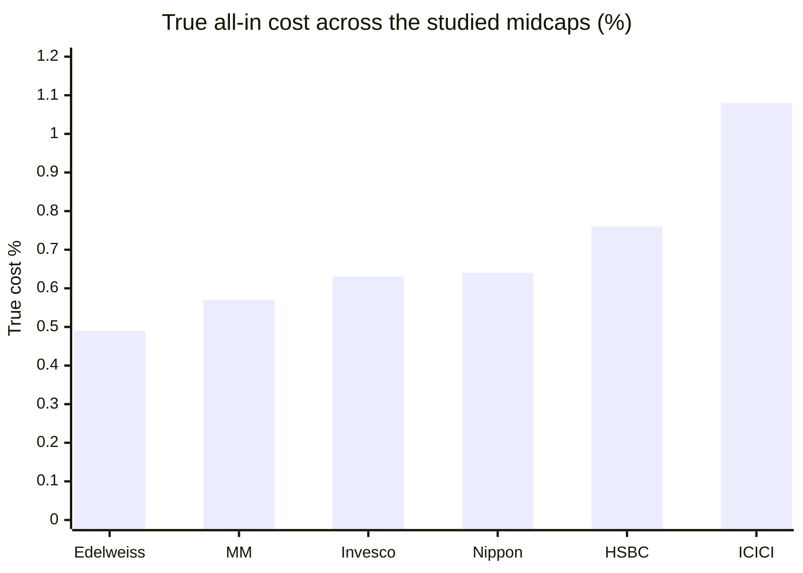
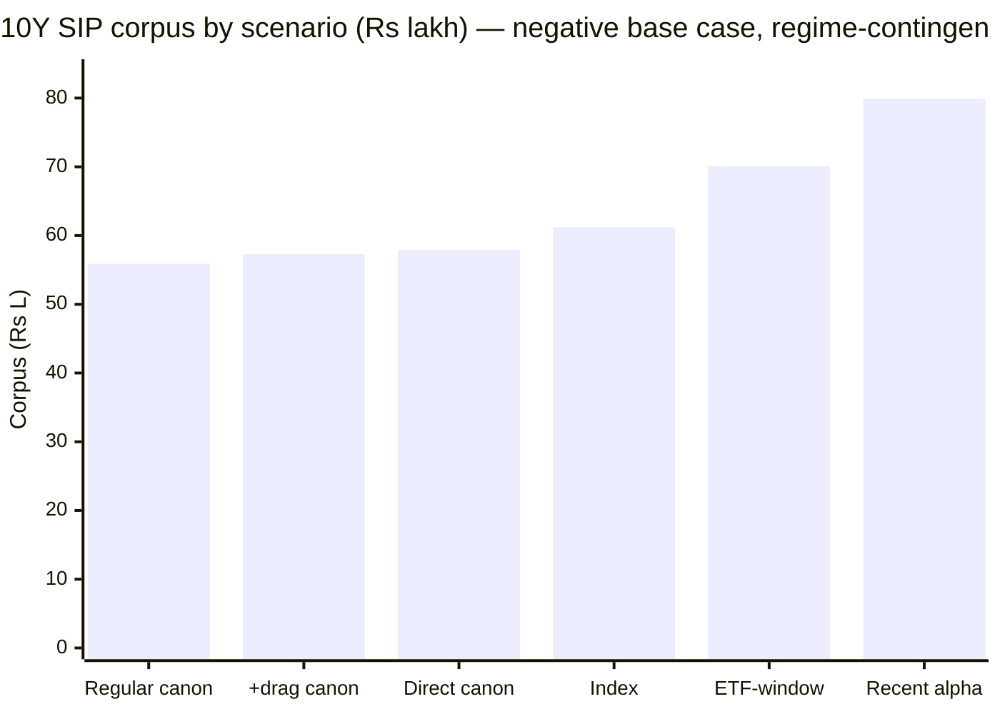

# Module 4: Cost & AUM Impact — ICICI Prudential Midcap Fund

## Module 4 Score: ~3.4 / 5 (provisional)

---

## The One-Line Context

ICICI Pru Midcap's Module 4 is **"HSBC's negative-fee-case, but more expensive and without the capacity alibi."** The 0.87% Direct ER is the **2nd-priciest of the shortlist**, and the study's canonical matched-index alpha is *negative* (−0.35%/yr, M1) — so on the base case you'd have kept **₹3.3 lakh more over a 10-year SIP in the 0.20% index fund**, worsening to −₹3.9L once the 75% turnover drag (M3) is added, which pushes the **true all-in cost to ~1.05–1.10% — the highest of any studied midcap, exceeding even HSBC's 0.76%.** Unlike HSBC, whose negative fee case was rescued by an "unlimited runway because the market isn't buying it" story, ICICI has **no such alibi**: it's a comfortably sweet-spot ₹7,846 Cr fund with ordinary flows. The two things that keep it off the floor: (1) a genuinely *positive* 13.5-year ETF-window alpha (+3.19%/yr → +₹8.9L) — better than HSBC's pre-2019-loaded record — and (2) the **deepest institutional backing of any studied fund**: ICICI Prudential AMC, India's #2 at ₹11.18 lakh Cr. But both saving graces are qualified — the positive alpha is the *regime-contingent* cyclical bet M3 exposed, not durable selection.

---

## Raw Data (Wayback-archived + aggregator + computed, as of 10-Jul-2026)

| Metric | Value | Source |
|--------|-------|--------|
| **ER (Direct)** | **0.87%** — 2nd-priciest of shortlist (Sundaram 0.88) | screening/Tickertape |
| ER (Regular) | **1.53%** (fresh, 14-Jul-2026) | VRO |
| Direct–Regular gap | **0.66%** — narrower than MM/Invesco (~1.15%) | computed |
| **⭐ Groww ER field** | **UNRELIABLE — flips 0.95 / 1.10 / 1.14 / 1.39 / 1.13 across snapshots** (mislabeled; rises as AUM grows = nonsensical) | Wayback Groww — *resolves M3's 1.13% flag: do not use* |
| **True all-in cost** | **~1.05–1.10%** (0.87 + ~0.20 turnover drag) — **highest of any studied midcap** | computed (turnover 75%, M3) |
| **AUM** | **₹7,846 Cr** — sweet spot, 6th of 7 (smallest after MM) | VRO/Groww |
| AUM trajectory | ₹4,252 (Nov-23) → 5,517 → 5,932 → 6,569 → **7,846 Cr** — **1.85× in 2.7y, mostly NAV (1.65×)** | Wayback Groww |
| Net flows (Nov-23→now) | **+₹781 Cr cumulative** — flat/negative 2024–25 (−26 to −29/mo) then a +547/mo spike May–Jul 2026 | computed (AUM−NAV) |
| **AMC total AUM** | **₹11,18,215 Cr (₹11.18 lakh Cr) — India's #2, deepest backing of any studied fund** | Groww JSON |
| Turnover | 75% — 2nd-highest studied | Groww (M3) |
| Exit load | **1% / 365 days** (standard) | VRO |
| Verified alpha (M1) | **canonical −0.35%/yr ❌** · ETF-window +3.19% ✅ · recent +5.63% (regime-contingent) | M1/M3 |

**Provenance & gaps:** AUM/flow trajectory from Wayback-archived Groww snapshots (pre-2023 snapshots lack `__NEXT_DATA__` — old markup — so the series starts Nov-2023; the fund is 20 years old so most AUM is legacy, un-decomposable). **The Direct ER is a documented soft-spot:** screening/TT show 0.87%, VRO shows Regular 1.53% but not Direct, Groww's field is unreliable — 0.87% is the number of record but a factsheet confirmation would tighten it. ICICI AMC factsheet fetch returned empty this session (documented gap).

---

## What Module 4 Is Really Asking — and ICICI's Answer

1. **Is the fee justified?** **No, on the base case.** A 0.87% ER (~1.08% true cost) buys a *negative* canonical alpha — you'd have done ₹3.3–3.9L better in the index fund over a 10-year SIP. It is justified *only* if you underwrite the regime-contingent recent alpha (M3) or the durable-but-modest 13.5y ETF-window (+3.19%). The 2nd negative base case in the study, after HSBC.
2. **Is the size sustainable?** **Yes, easily — but that's no rescue.** ₹7,846 Cr is comfortably sweet-spot with ample runway; a 20-year-old fund with ordinary flows and a giant AMC behind it. Unlike HSBC, whose negative fee case was offset by an exceptional "unlimited runway" story, ICICI's capacity is merely *fine* — it doesn't compensate for the cost problem.

---

## ⭐⭐ NEW: The Highest True Cost of the Shortlist (turnover-drag lens, worst result)

Applying HSBC's turnover-drag framework across the studied funds:

| Fund | Headline ER | Turnover | Drag | **True cost** |
|------|-------------|----------|------|---------------|
| Edelweiss | 0.42% | 36% | +0.07 | ~0.49% |
| MM | 0.44% | ~60% | +0.12 | ~0.57% |
| Invesco | 0.55% | 28% | +0.05 | ~0.63% |
| Nippon | 0.62% | 14% | ~0 | ~0.64% |
| HSBC | 0.56% | ~110% | +0.20 | ~0.76% |
| **ICICI** | **0.87%** | **75%** | **+0.18–0.25** | **~1.05–1.10%** ⚠ |

**ICICI has the highest true cost of the studied midcaps.** Its headline ER is already the 2nd-priciest, and the 75% turnover adds the second-largest drag. Where HSBC's cheap ER partially offset its turnover (netting 0.76), ICICI has *both* a high ER *and* high turnover — the worst combination. This is the module's defining cost fact: **the investor pays ~1.08% all-in for a book whose canonical alpha is negative.**

---

## ⭐⭐ The Fee-for-Alpha Test — the 2nd Negative Base Case (after HSBC)

| Component | **ICICI** | HSBC | MM | Edelweiss | Nippon |
|-----------|-----------|------|-----|-----------|--------|
| Headline premium over 0.20% index | **0.67%** | 0.36% | 0.24% | 0.22% | 0.42% |
| True premium (+ drag) | **~0.88%** | ~0.55% | ~0.38% | ~0.29% | ~0.44% |
| Canonical matched alpha (M1) | **−0.35% ❌** | −0.22% ❌ | +2.06% | +2.87% | +1.97% |
| **Base-case verdict** | **negative (worst true premium)** | negative | positive | positive | positive |

### The 10-Year SIP in Rupees (₹20K/month, 18% gross)

| Scenario | Net return | Corpus | vs index fund |
|----------|-----------|--------|---------------|
| Index fund (0.20%) | 17.80% | ₹61.2L* | — |
| **ICICI, canonical −0.35 (0.87%)** | 16.78% | **₹57.9L** | **−₹3.3L** ❌ |
| **ICICI, + turnover drag (true 1.07%)** | 16.58% | ₹57.3L | **−₹3.9L** ❌ |
| ICICI, ETF-window +3.19 (0.87%) | 20.32% | ₹70.1L | +₹8.9L |
| ICICI, recent +5.63 (regime-contingent) | 22.76% | ₹79.9L | +₹18.8L |
| ICICI **Regular** (1.53%), canonical | 16.12% | ₹55.9L | **−₹5.3L** |

*\*Annuity convention consistent across recent modules; relative spreads are the comparable quantity.*

**The base-case fee bet is negative** — on the study's canonical test you'd have done ₹3.3–3.9L better in the index fund, and the *Regular* plan (−₹5.3L) is a wealth-destroyer. Only the positive readings save it: the 13.5-year ETF-window (+₹8.9L, genuine and durable) and the recent alpha (+₹18.8L, but M3-flagged as regime-contingent cyclical timing). **This is HSBC's M4 structure — "the fee case rests on extrapolating a hot streak" — with two differences: ICICI's is more expensive (true cost ~1.08 vs 0.76), and its long-window ETF alpha is genuinely positive (HSBC's was all pre-2019).** Worse on cost, better on the long-run alpha's honesty.

---

## ⭐ NEW: The Regime-Contingency of the Fee Case (sharper than HSBC's)

HSBC's negative fee case rested on *one manager's hot streak* persisting. ICICI's rests on something more specific: **the capex/cyclical regime persisting** (M3 — the +5.63 recent alpha is a 46%-cyclical book being in the right regime). The distinction matters for underwriting: you're not betting on Lalit Kumar staying hot, you're betting on the **capex/PSU/financialization cycle continuing to run** — a macro call the buyer must be willing to make. If the regime turns (as it did 2020–23, producing the −0.35 canonical), the fee reverts to negative. A more legible, but not more comfortable, bet than HSBC's.

---

## AUM & Capacity — Sweet Spot, No Alibi, No Problem

- **₹7,846 Cr — comfortably sweet-spot** (₹3,000–25,000 band), 6th of 7 (only MM smaller). A 20-year-old fund; most AUM is legacy. **No capacity concern in any direction** — but also no HSBC-style "unlimited runway because unloved" upside to offset the fee case.
- **Flows: ignored, then noticed.** Flat-to-negative through 2024–25 (−26 to −29/mo) *despite* NAV growth — the market didn't buy the fade or the early turnaround — then a **+547/mo spike in the last two months** (May–Jul 2026) as the turnaround became visible (a possible lumpy institutional entry; flagged). Cumulative +₹781 Cr over 2.7y — modest.
- **Forced deployment:** trivial — even the recent +547/mo × 65% ≈ ₹355 Cr/mo into a liquid 83-name band is easily absorbed; the fund could run several times its size. Ample runway.
- **Active-share stability:** AS 73.9% (M3) with modest flows = no decay pressure; the "quietly becomes the index" risk is absent here.

---

## ⭐ The Giant-AMC Backing (M6 feed)

ICICI Prudential AMC runs **₹11.18 lakh Cr** — India's #2, and the **deepest institutional backing of any fund in the entire four-category study** (vs HSBC 1.37L Cr, Nippon 7.7L Cr, MM 33K Cr). For M4 this means: operational resilience, negligible fund-viability risk, the resources to run a 20-year-old midcap indefinitely, and pricing power the AMC has chosen *not* to pass to investors (0.87% Direct is mid/high, not the sub-0.5% a giant could offer). **The scale is a stewardship signal for M6 — the giant charges a full price.**

**Retrofit note:** ICICI's AMC was only "touched" in the International study; M6 here is largely ground-up, and this ₹11 lakh Cr scale is the anchor fact.

---

## Exit Load & Direct vs Regular

- **Exit load 1% / 365 days** — standard, no carve-out; heavier than Edelweiss/MM (1%/90d) and Nippon (1%/1mo).
- **Direct vs Regular: 0.87% vs 1.53% = 0.66% gap** — *narrower* than MM/Invesco (~1.15%), but on a higher base. Over a 10Y SIP the Regular plan costs ~₹2L extra (−₹5.3L vs index vs Direct's −₹3.3L). Use Direct — though even Direct is a negative base case.

---

## Peer Cost & AUM Matrix

| Fund | ER (Direct) | True cost | AUM | Runway | Fee-for-alpha | AMC scale |
|------|-------------|-----------|-----|--------|---------------|-----------|
| Edelweiss | 0.42% | ~0.49% | ₹16.8K Cr | ~1.2y ⚠ | ~10× ⭐ | mid |
| MM | 0.44% | ~0.57% | ₹4.9K Cr | decades ⭐ | ~5–6× | ₹33K Cr (smallest) |
| Invesco | 0.55% | ~0.63% | ₹12.4K Cr | ~3y | ~7× | mid |
| Nippon | 0.62% | ~0.64% | ₹47.4K Cr | past ⚠ | ~4.5× | large |
| HSBC | 0.56% | ~0.76% | ₹14.2K Cr | unlimited | negative ❌ | large |
| **ICICI** | **0.87%** | **~1.08%** ⚠ | ₹7.8K Cr | ample | **negative ❌** | **₹11.2L Cr (giant)** ⭐ |
| Sundaram | 0.88% | ~0.9% | ₹13.7K Cr | fine | untested | mid |

**One line:** ICICI is the **most expensive true-cost book of the studied midcaps, with a negative base-case fee-for-alpha, backed by the biggest AMC** — a giant charging a full price for a regime-contingent alpha.

---

## Points For / Points Against — Cost & AUM

### ✅ Points For

- **Comfortably sweet-spot AUM (₹7,846 Cr)** with ample runway; no capacity concern
- **Deepest institutional backing of any studied fund** (ICICI Pru AMC ₹11.18 lakh Cr) — operational resilience
- **High, stable active share (73.9%)** with modest flows — no decay pressure
- **Genuinely positive 13.5y ETF-window alpha (+3.19%)** — better than HSBC's pre-2019-loaded record
- Trivial forced deployment; the fund could run several× its size
- Narrower Direct-Regular gap (0.66%) than MM/Invesco

### ❌ Points Against

- **Highest true cost of any studied midcap (~1.08%)** — high ER *and* high turnover
- **Negative base-case fee-for-alpha** (−0.35 canonical → −₹3.3L; −₹3.9L with drag) — 2nd after HSBC
- **2nd-priciest headline ER (0.87%)** — a giant AMC charging a full price
- **The saving alpha is regime-contingent** (capex-cycle bet, M3), not durable selection
- **No HSBC-style capacity alibi** to offset the fee case
- Regular plan (1.53%) is a wealth-destroyer (−₹5.3L vs index)
- Direct-ER not factsheet-confirmed (screening 0.87 vs VRO Regular 1.53; Groww unreliable)

---

## Module 4 Scorecard

| Sub-dimension | Weight | Score | Reasoning |
|---------------|--------|-------|-----------|
| Expense Ratio (Direct) | High | **2.5** | 0.87% — the 0.85–1.0 "2" band edge, 2nd-priciest of shortlist; a giant AMC charging a full price |
| **ER vs verified alpha (index-fund test)** | **Critical** | **2.75** *(patched from 2.5 per M5)* | **negative canonical alpha (−0.35) → base case −₹3.3L vs index**; lifted from 2.0 by the genuinely positive 13.5y ETF-window (+3.19) and **nudged 2.5→2.75 by M5's finding that Lalit's regime-timing is a *verified cross-fund skill* (Business Cycle +8.73/yr positive-every-year), not luck** — the fee-warranty is a demonstrated cycle-timer, not a hot hand (parity with the HSBC/MM warranty patches); still underwater on the canonical base case |
| AUM position on the ladder | High | **5.0** | ₹7,846 Cr — comfortably sweet-spot, ample runway |
| Active-share trend as AUM grew | High | **4.0** | AS 73.9% (M3) with modest flows — no decay pressure |
| Forced deployment | Medium | **4.5** | trivial vs a liquid 83-name book; could run several× its size |
| Exit load | Low | **3.5** | 1%/365d — standard, no carve-out |
| AUM trajectory | Low | **3.5** | 1.85× in 2.7y (mostly NAV); flat/negative flows then a recent spike |
| *Turnover-cost modifier* | *Modifier* | **− −** | *75% turnover → ~0.20 drag → ~1.08 true cost, the highest of any studied midcap* |
| *Giant-AMC modifier* | *Modifier* | **+** | *₹11.2L Cr backing — operational resilience, negligible viability risk (→ M6)* |

**Module 4 Score: ~3.4 / 5** — the **worst M4 of the midcaps**, just below HSBC/Nippon (3.6).
- **Case for 3.5:** sweet-spot AUM, ample runway, high stable active share, giant-AMC backing, and a genuinely positive long-window ETF alpha (unlike HSBC).
- **Case for 3.2–3.3:** the highest true cost of any studied midcap (~1.08%), a negative base-case fee-for-alpha, the 2nd-priciest ER — and no HSBC-style capacity alibi.
- **3.4 is the honest midpoint** — the giant AMC and sweet-spot AUM are the only things separating it from the low-3s.

**Conditionality / handoffs:**
- → **M5 (RESOLVED, favorably):** the fee case was a bet on Lalit's regime-timing (M3) being repeatable — **M5 confirmed it: his Business Cycle Fund has beaten the market every year since 2021 (+8.73%/yr), including +13.2 in 2023 when Midcap lagged −10.4. The regime-timing is verified cross-fund skill, so the fee-for-alpha row was patched 2.5→2.75.** The fee case is still underwater on the canonical base — but it now rests on a demonstrated cycle-timer, materially reducing the "extrapolating a hot streak" risk that dogs HSBC's equivalent.
- → **M6 (partly pre-empted):** the ₹11.18 lakh Cr AMC scale is the anchor fact — India's #2, deepest resources studied; the M6 question is whether that scale comes with the governance record to match (ICICI's regulatory history to be examined — M6 found the 2018 ICICI Securities IPO-bailout settlement as the material scar).

---

## Comparative Module 4 Scores

| Fund | Category | M4 Score | Cost/AUM character |
|------|----------|----------|--------------------|
| Edelweiss Mid Cap | MidCap | ~4.2 | Cheapest ER + best fee-for-alpha; worst capacity trajectory |
| Invesco India Midcap | MidCap | ~4.2 | Cheap, sweet-spot; weak warranty |
| Mahindra Manulife Mid Cap | MidCap | ~4.1 | Best runway of study; subsidized flagship |
| DSP Small Cap | SmallCap | ~3.9 | Mid-priced, gold-standard gating |
| PP FlexiCap | FlexiCap | ~3.8 | Cheap, segment-shielded |
| Nippon Growth Mid Cap | MidCap | ~3.6 | Proven fee-for-alpha; unmanaged capacity |
| HSBC Midcap | MidCap | ~3.6 | Best capacity; negative fee-for-alpha + turnover drag |
| **ICICI Pru Midcap** | **MidCap** | **~3.4** | **Highest true cost of studied midcaps; negative base-case fee-for-alpha; giant-AMC backing; no capacity alibi** |

Running ICICI modules: **3.5 / 3.4 / 3.9 / 3.4**.

---

## SIP Implication

1. **On cost alone, this is the weakest case of the midcaps.** You pay ~1.08% all-in (the highest studied) for a book whose canonical alpha is negative — on the base case, the 0.20% index fund leaves you ₹3.3–3.9L richer over a 10-year SIP. Use Direct (Regular is −₹5.3L, a wealth-destroyer), but even Direct is a negative base case.
2. **The fee is justified only if you underwrite the regime.** The saving alpha (+₹8.9L ETF-window, +₹18.8L recent) rests on the capex/cyclical regime persisting (M3) — a macro call, not a manager-skill call. If the regime turns as it did 2020–23, the fee reverts to negative.
3. **Size and institution are the reassurances, not the case.** ₹7,846 Cr is comfortably sweet-spot with a ₹11.18 lakh Cr AMC behind it — the fund will run indefinitely with no capacity strain. But neither fixes the fee-for-alpha; a giant charging a full price for a regime bet is the honest summary.
4. **Tripwires:** the turnover staying at/above 75% (each point of turnover deepens the true-cost gap); a regime shift away from capex (the fee reverts negative); and any ER *increase* (already the 2nd-priciest — the giant has room to cut, not raise).

---

## One-Line Verdict

> **ICICI Pru Midcap's Module 4 is HSBC's negative-fee-case made more expensive and stripped of its capacity alibi: the 0.87% Direct ER is the 2nd-priciest of the shortlist, and with the 75% turnover drag the true all-in cost is ~1.08% — the highest of any studied midcap, exceeding even HSBC's 0.76% — paid for a book whose canonical matched-index alpha is negative (−0.35%/yr), so the base-case 10-year SIP leaves you ₹3.3–3.9L behind the 0.20% index fund (the Regular plan, −₹5.3L, is a wealth-destroyer). The fee is justified only if you underwrite the regime-contingent recent alpha (+₹18.8L) or the genuinely-positive-but-modest 13.5y ETF-window (+3.19%/yr, +₹8.9L, better than HSBC's pre-2019-loaded record). Unlike HSBC, there's no "unlimited runway because unloved" story to offset it — ICICI is a comfortably sweet-spot ₹7,846 Cr fund with ordinary flows. The two genuine positives are the deepest institutional backing of any studied fund (ICICI Pru AMC, ₹11.18 lakh Cr, India's #2) and no capacity concern in any direction. Provisional: ~3.4/5 — the worst M4 of the midcaps, held off the low-3s only by the giant AMC and sweet-spot AUM; conditional on M5 (is Lalit's regime-timing repeatable?) and M6 (does India's #2 AMC have the governance record to match its scale?).**

---

*Module 4 completed: July 10, 2026 | Cost & AUM Impact | Primary sources: Wayback-archived Groww snapshots (AUM ₹4,252 Cr Nov-2023 → 5,517 → 5,932 → 6,569 → 7,846 Jul-2026 = 1.85× in 2.7y, mostly NAV 1.65×; AMC total ₹11.18 lakh Cr; ER field UNRELIABLE — flips 0.95–1.39, resolves M3's 1.13 flag) + VRO (Regular ER 1.53%, exit load 1%/365d, 14-Jul-2026) + screening (Direct ER 0.87%) | Flow decomposition (AUM − MFAPI-120381 NAV): +₹781 Cr cumulative; flat/negative 2024–25 (−26 to −29/mo) then +547/mo spike May–Jul 2026 = "ignored then noticed" | True cost ~1.05–1.10% (0.87 + ~0.20 turnover drag on 75% turnover, M3) = HIGHEST of studied midcaps | Fee-for-alpha: canonical −0.35 → base case −₹3.3L/−₹3.9L-with-drag vs index (2nd negative after HSBC); ETF-window +3.19 → +₹8.9L; recent +5.63 → +₹18.8L (regime-contingent, M3) | AUM ₹7,846 Cr sweet-spot 6th of 7; forced deployment trivial; AMC ICICI Pru India's #2 = deepest backing studied | Documented gaps: factsheet Direct-ER confirmation, pre-2023 AUM series | Provisional M4 Score: ~3.4/5 (conditional on M5 regime-timing repeatability + M6 giant-AMC governance)*
