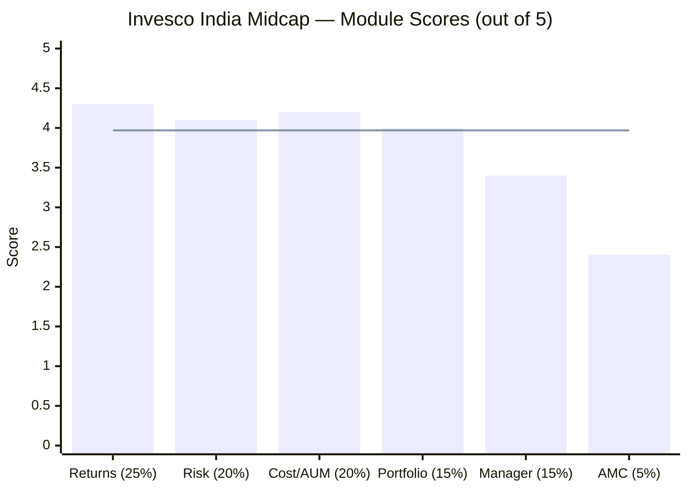
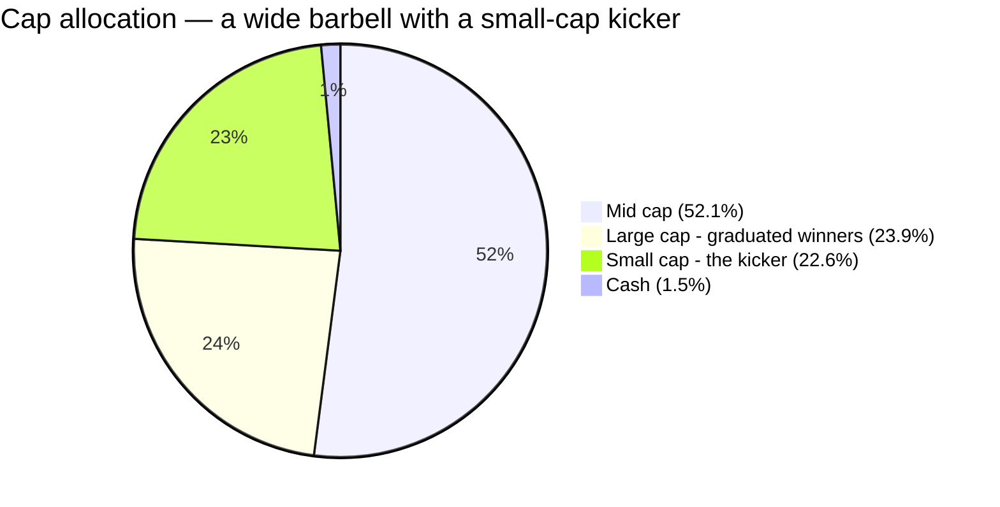
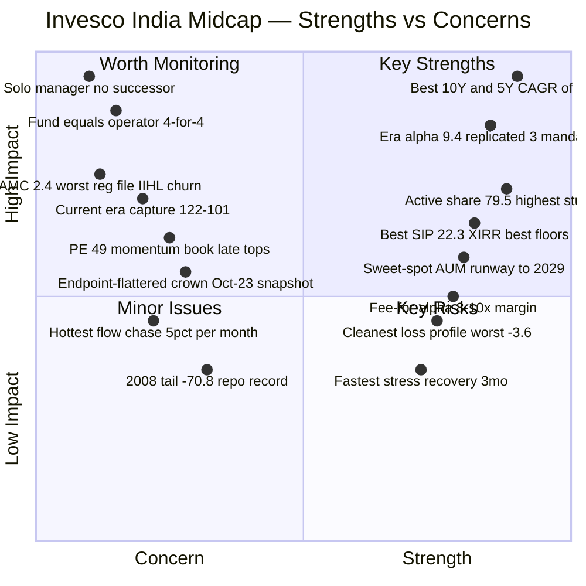
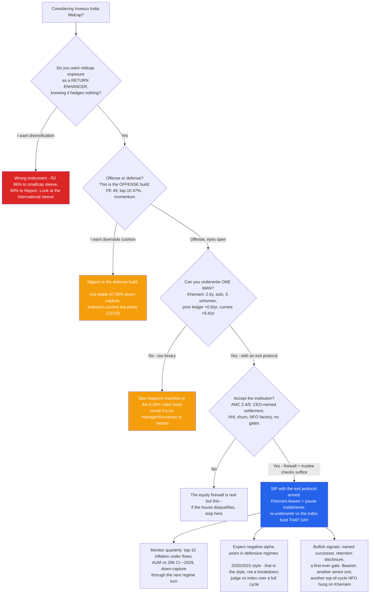
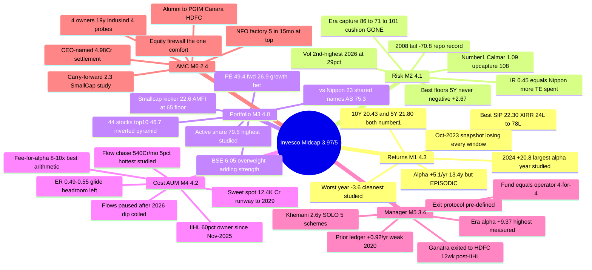

# Invesco India Midcap Fund — Deep Study

## Fund Identity

| Field | Value |
|-------|-------|
| **Full Name** | Invesco India Midcap Fund — Direct Plan — Growth (launched as a *Lotus India AMC* scheme; Lotus → Religare → Religare Invesco → Invesco) |
| **AMC** | Invesco Asset Management (India) Pvt Ltd — **IIHL (Hinduja) 60% + Invesco Corp (USA) 40% since 02-Nov-2025**; 16th-largest, ₹1.48L Cr AAUM |
| **Inception** | **April 19, 2007** (19.2 years) — **close-ended until 20-Apr-2010**; Direct plan 02-Jan-2013 |
| **SEBI Category / Risk** | Equity — Mid Cap (min 65% in ranks 101–250) / Very High |
| **Benchmark** | **S&P BSE Midcap 150 TRI** (only BSE-benchmarked fund in the shortlist) |
| **Fund Manager** | **Aditya Khemani — SOLO — since 09-Nov-2023** (co-manager Ganatra exited Jan-2026 → HDFC) |
| **AUM** | **₹12,397 Cr** (Jul-2026) — sweet spot; was ₹127 Cr in Jan-2016 (98× in a decade) |
| **Expense Ratio** | **0.49% (TT, Jul-2026) / 0.55% Direct, 1.72% Regular (official Mar-2026)** — glide headroom remains |
| **NAV (03-Jul-2026, Direct)** | ₹241.36 — at its all-time high; the 2007 ₹10 unit is a 19.9-bagger (Regular) |
| **Exit Load** | Tiered: **nil up to 10% of units within 1yr; 1% on excess; nil after 1yr** |
| **Official Turnover** | 0.28× (Mar-2026) — double Nippon, still moderate |
| **VRO Rating** | ⭐⭐⭐⭐ (4/5) |
| **Stated Style** | Growth at "reasonable valuations"; concentrated; "active overweight positions in all companies owned" |
| **Data** | MFAPI 120403 (Direct, 3,321 NAVs) + 105503 (Regular, Apr-2007→) · index counterfactuals 147622 & 114456 · official factsheets (Jan-2016, Oct-2023, Feb/Mar-2026) · archived Groww series 2020–25 · TT holdings API (46 positions) |

---

## The One-Line Context

Invesco India Midcap is the screening leader and the owner of **the best raw fund-level file in the repo** — #1 shortlist 10Y (20.4%) *and* 5Y (21.8%) CAGR, the largest measured index alpha (+5.1%/yr × 13.4y, +9.4%/yr in the current era), the cleanest loss profile of any studied fund (one negative year in 13.5, worst −3.6%), the best rolling floors (no losing 5Y window, floor +2.67%/yr), the best realized 10Y SIP (22.3% XIRR), the highest active share (79.5%), sweet-spot AUM with years of runway, and a 0.49–0.55% fee covered 8–10× by historical alpha. Every discount lives on the attribution side: **the record is a relay of three different funds wearing one name** (era alphas +5.6 → +3.1 → +9.4, each with a different fingerprint), the screening crown was **manufactured entirely after Nov-2023** by a manager whose verifiable prior ledger is +0.9%/yr, who now runs the study's most concentrated PE-49 momentum book **solo** — no co-manager, no successor — after the Head of Equities left for HDFC twelve weeks post-IIHL, inside the repo's second-worst-governed AMC (2.4/5). **The best engine in the study, keyed to one man, parked in the family's shakiest garage. Final: ≈3.97/5 — a statistical dead heat with Nippon (≈3.96), with opposite shapes.**

---

## Module Status

| Module | Weight | Status | Score | File |
|--------|--------|--------|-------|------|
| 1 — Returns Consistency | 25% | ✅ Complete | ~4.3/5 | [module1_returns.md](module1_returns.md) |
| 2 — Risk Profile | 20% | ✅ Complete | ~4.1/5 | [module2_risk.md](module2_risk.md) |
| 3 — Portfolio DNA | 15% | ✅ Complete | ~4.0/5 | [module3_portfolio.md](module3_portfolio.md) |
| 4 — Cost & AUM Impact | 20% | ✅ Complete | ~4.2/5 | [module4_cost.md](module4_cost.md) |
| 5 — Fund Manager Quality | 15% | ✅ Complete | ~3.4/5 | [module5_manager.md](module5_manager.md) |
| 6 — AMC Trustworthiness | 5% | ✅ Complete | ~2.4/5 | [module6_amc.md](module6_amc.md) |

---

## Final Scorecard

| Module | Score | Weight | Weighted |
|--------|-------|--------|----------|
| 1 — Returns Consistency | ~4.3 | 25% | 1.075 |
| 2 — Risk Profile | ~4.1 | 20% | 0.820 |
| 4 — Cost & AUM Impact | ~4.2 | 20% | 0.840 |
| 3 — Portfolio DNA | ~4.0 | 15% | 0.600 |
| 5 — Fund Manager Quality | ~3.4 | 15% | 0.510 |
| 6 — AMC Trustworthiness | ~2.4 | 5% | 0.120 |
| **Overall** | | **100%** | **≈ 3.97 / 5** |

> **The structural story in one line:** the *fund-level* modules (returns 4.3, cost/runway 4.2, risk 4.1, portfolio 4.0) describe the highest-output midcap engine measured in these studies; the *people-and-institution* modules (manager 3.4, AMC 2.4) describe the two single points of failure it all hangs from: one man, and the house that keeps losing men like him.

---

## ⭐ The Dead Heat — Invesco ≈3.97 vs Nippon ≈3.96 *(the section the decision tree will read first)*

| Module | **Invesco** | Nippon | Winner |
|--------|------------:|-------:|--------|
| M1 Returns (25%) | **4.3** | 4.2 | Invesco — better numbers everywhere, worse warranty |
| M2 Risk (20%) | 4.1 | **4.4** | Nippon — era-stable defense vs offense with no current cushion |
| M3 Portfolio (15%) | 4.0 | **4.1** | Nippon (barely) — breadth machine vs conviction book |
| M4 Cost & AUM (20%) | **4.2** | 3.6 | Invesco — sweet spot + runway vs the capacity clock |
| M5 Manager (15%) | 3.4 | **3.5** | Nippon — proven machine vs solo star |
| M6 AMC (5%) | 2.4 | **3.4** | Nippon — scarred fortress vs unstable house |
| **Weighted** | **≈3.97** | **≈3.96** | **Dead heat** |

The arithmetic refuses to decide, and honestly so — because the two funds are **R² 90% correlated wrappers of one band factor with exactly opposite construction**: Invesco wins everything a fund controls (returns, cost, size), Nippon wins everything an institution controls (process, succession, governance). The single-slot decision (they share 23 names; holding both is diversification theatre) reduces to one question: **which failure mode do you prefer — Nippon's capacity clock (visible, measurable, gradual), or Invesco's key-person risk (binary, unannounced, historically fatal to this fund's character four times)?** That adjudication belongs to `decision_tree.md`, after the remaining five funds are studied.

---

## Key Performance Metrics

| Metric | Value | Context |
|--------|-------|---------|
| **10Y CAGR** | **20.43%** | #1 of shortlist (Nippon 19.33) |
| **5Y CAGR** | **21.80%** | #1 of shortlist |
| 3Y CAGR | 27.26% | 2nd of 7 (HSBC leads) |
| **19.2Y CAGR (Regular)** | **16.80%** | The honest long-run anchor — includes 2008 (−64%) |
| **Alpha vs investable index** | **+5.11%/yr × 13.4y** (ETF); +2.88%/yr × 6.8y (index fund) | Largest measured — but **episodic**: era alphas +5.6 / +3.1 / +9.4 |
| **Current-era alpha (Khemani)** | **+9.37%/yr × 2.6y** | Highest era alpha in the repo; friendliest regime for the style |
| **Up / Down capture** | 100%/88% (6.8y); **121%/81% vs Nifty (13.4y — widest spread studied)**; ⚠ **122%/101% current era** | The cushion left with the old managers |
| **Sharpe / Sortino / Calmar (5Y)** | 0.885 / 1.429 / **1.09** ⭐ | 2nd / 3rd / **#1** of shortlist |
| Max drawdown (5Y / modern / tail) | −20.1% / −34.1% (COVID) / **−70.8% (2008, repo record)** | 2024–25 recovered in **3 months** — fastest in study |
| **Rolling 5Y windows negative** | **0.0% — never; floor +2.67%/yr** | Best floors in the repo (3Y: 0.6% negative) |
| **Worst calendar year (direct era)** | **−3.6%** (2018, index −15.3) | Cleanest loss profile of any studied fund |
| **10Y SIP (₹20K/mo)** | **₹24.2L → ₹78.1L, 22.30% XIRR** | Best realized SIP in the four studies (Nippon 21.08%) |
| **Active share** | **79.5%** vs index; 75.3% vs Nippon | Highest studied; unambiguously earning its fee |
| Holdings / Top-10 | **44 / 46.7%** | Concentrated conviction; 15 positions ≥3%; PE 49.4 (fwd 26.9) |
| **AUM / flows** | ₹12,397 Cr; peak flows **+₹540 Cr/mo ≈ 5%/mo of corpus** (paused since Mar-2026) | Sweet spot; crosses ₹25K Cr ~2029 at resumed flows |
| Fee premium vs index → alpha | 0.29–0.35% → +2.9%/yr (6.8y) | **8–10× arithmetic margin — best studied; weakest warranty (32 months)** |
| Manager | **Khemani, 2.6y, SOLO, 5 schemes** | Prior verifiable ledger +0.92/yr (Motilal, 4y); cross-fund +11.3/+9.4/+7.6 since Nov-2023 |

---

## ⚠️ The Five Critical Lenses — Read Before the Numbers

### Lens 1 — The Best Raw File in the Repo Is Endpoint-Flattered
Every headline number — both CAGR crowns, the SIP record, the 3Y Sharpe of 1.02 — is measured immediately after the two best alpha years since 2014 (+20.8pts in 2024, +5.9 YTD). The AMC's own factsheet of **October 2023** showed this fund **losing to its benchmark on every SIP and lumpsum window measured** — the entire screening crown was manufactured in the 32 months since. The numbers are real money; they are not evidence of a persistent process. Trailing CAGR is a photograph, not a process — this fund is the repo's sharpest demonstration.

### Lens 2 — Three Funds Wearing One Name
The 19-year record decomposes into a boutique stock-picker (Paharia, +5.6/yr on ₹127–470 Cr), a defense that decayed into a four-year fade (Gokhale: winter hero, then ≈−3/yr 2020–23, era Sharpe 0.57), and a pure-offense momentum book (Khemani, +9.4/yr). Four independent analyses (calendar alphas, capture eras, holdings, era table) prove **the fund becomes whoever runs it** — the exact opposite of Nippon's era-stable machine. The 13.4-year "+5.1%/yr alpha" is an average of three unrelated bets that happened to sum well.

### Lens 3 — The Current Book Is Not the Record
What you buy today: 44 stocks, top-10 46.7%, PE 49.4 (forward 26.9), a 22.6% small-cap kicker, financials ~31%, the index's hottest name (BSE) as the largest overweight being added into strength, vol running at 29% in 2026 (near-COVID level), and **current-era capture of 122%/101% — statistically, no downside edge.** The famous 81–88% down-captures belong to portfolios that no longer exist. It passed the 2024–25 correction well (−19.1% matched-window, 3-month recovery) but topped 3 months after the index and amplified the 2026 dip — the Motilal-style late-top signature the screening already eliminated once.

### Lens 4 — You Are Buying the Man; Price the Man's Exit
Khemani: 2.6 years on the fund (shortest studied), **solo** — no co-manager, no successor — running five schemes, after his co-manager and hiring executive (Ganatra, Head of Equities) left for HDFC twelve weeks post-IIHL. His verifiable pre-Invesco ledger is +0.92/yr with a weak 2020; his current +9.4/yr replicates across three mandates but is one growth-momentum factor bet in its best regime since 2017. The fund's own history is four-for-four: no era has ever resembled the one before it. **The exit protocol is pre-defined: the day his name comes off the factsheet, pause instalments and re-underwrite against the 0.20% index fund.**

### Lens 5 — The Cheapest Good Seat, in the Shakiest Theatre
The M4 case is genuinely the best cost-capacity position studied: 0.49–0.55% with glide headroom, 8–10× fee-for-alpha arithmetic, sweet-spot AUM, deep band open by choice, runway to ~2029. But the institution around it scored 2.4/5: the repo's worst completed regulatory file (₹4.98 Cr CEO-named settlement, retail bond-dumping), four ownership changes in 19 years, a distribution-first new owner whose flagship bank is under four simultaneous probes, five top-of-cycle NFOs in 15 months, the proportionally hottest flow-chase measured (5%/mo of corpus), and an alumni diaspora (PGIM/Canara/HDFC) that prices the Lens-4 risk. The equity firewall (all documented harm was debt-side; Badshah + Invesco Corp trustee seats hold the perimeter) is real — and it is the *only* institutional comfort on offer.

---

## Portfolio DNA (Snapshot)

| Metric | Value | Significance |
|--------|-------|--------------|
| Holdings | **44** | Dead-center of the 40–70 sweet spot; conviction by choice |
| Top-10 | **46.7%** | Double Nippon's 23.1%; 15 positions ≥3% — the inverted pyramid |
| Largest position | **BSE 6.05%** (index: 4.21%) | **Overweights the band's hottest name, adding into strength** — the anti-Nippon at single-stock level |
| Biggest active bets | Prestige +5.85, Eternal +4.48, InterGlobe +4.22, Max Health +4.08 — all off-index | Conviction lives off-index |
| Cap split (TT / official AMFI) | Mid 52.1 / Large 23.9 / **Small 22.6** · AMFI: 64.6/16.6/17.9 | Parked at the 65% floor; the sleeve is a **small-cap kicker** |
| Band positioning | 39.1 / 16.6 / 6.8 (top/mid/bottom of index) | Liquid-end tilt **by choice** — won't decay with AUM |
| Sector theses | Financials ~30.6%, healthcare ~18%, realty ~8%, online retail ~9% | Several thesis-sized bets — the higher-variance source |
| PE (trailing / forward) | **49.4 / 26.94** | Priced for growth delivery, not a bubble — delivery is what you underwrite |
| Cash | ~1.5% (97.5–99.8% invested always) | No buffer, by policy |
| Active share | **79.5%** vs index · **75.3% vs Nippon** (23 shared names, sized oppositely) | Highest studied; the midcap slot is an either/or |
| Overlap vs PP / DSP sleeves | ~0% / 7.5% real | Duplicates *risk* (R² 86% DSP, 90% Nippon), not *holdings* |

---

## Strengths vs Concerns

---

## Key Strengths

- **⭐ The best raw returns file in the repo** — #1 shortlist 10Y (20.43%) and 5Y (21.80%); direct era 21.35%/13.5y (≈3pts/yr over Nippon — ₹163L vs ₹140L on the same SIP); the cleanest loss profile studied (one negative year, −3.6%, in 13.5)
- **⭐ The largest measured index alpha** — +5.1%/yr × 13.4y and +2.9%/yr × 6.8y net of fees; current era +9.4%/yr, **replicated simultaneously across three mandates** (+11.3 L&M, +7.6 Smallcap) — the strongest short-window skill evidence in the studies
- **⭐ Active share 79.5% — the highest studied** (Nippon 54.1) — the cleanest active-fee justification in the repo; 44 stocks in the sweet spot; conviction expressed off-index
- **Best rolling floors and SIP record in the repo** — no losing 5Y window ever (floor +2.67%/yr), 3Y windows 0.6% negative, 10Y SIP ₹24.2L → ₹78.1L (22.30% XIRR)
- **The best cost-capacity position in the shortlist** — 0.49–0.55% with glide headroom; 8–10× fee-for-alpha arithmetic; SIP payoff −₹1L worst / +₹9L base; sweet-spot ₹12.4K Cr with runway to ~2029; deep band open by choice
- **Only positive 2018–19 winter in the peer set** (+1.6% cumulative; −16.1% drawdown, shallowest) — with the attribution caveat
- **2024–25 correction passed under the current manager** — shallower matched-window fall, 3-month recovery (fastest in study)
- 19-year franchise coherence; tiered exit load with a 10%-free carve-out; equity firewall intact at the AMC

## Key Concerns

- **⭐ The solo cockpit** — 2.6-year manager, no co-manager, no successor, five schemes; the co-manager and Head of Equities already left for HDFC post-IIHL; the fund's four-for-four history says its character does not survive manager changes — **key-person risk is the highest of any studied fund**
- **⭐ The alpha is episodic, not process-shaped** — era fingerprints flipped every regime (+5.6 boutique → +3.1 fading defense → +9.4 offense); the Oct-2023 AMC factsheet showed the fund losing to its benchmark on every window just before the handover; the screening crown is 32 months old and endpoint-flattered
- **⭐ The current book has no measured downside edge** — 122%/101% current-era capture, PE 49.4, 22.6% small-cap kicker, 2026 vol at 29% (near-COVID), the 2026 dip amplified (−15.6 vs −13.9), a 3-months-late 2024 top — the Motilal failure mode is the live tail risk
- **⭐ The institution scored 2.4/5** — the repo's worst completed regulatory file (CEO-named ₹4.98 Cr settlement, retail bond-dumping), 4 ownership changes/19y, a distribution-first owner whose flagship bank is under four probes with fresh whistleblowers, five top-of-cycle NFOs in 15 months, no gate ever
- **The hottest relative flow-chase measured** — peak +₹540 Cr/mo ≈ 5% of corpus/month, arriving after the +45% year; paused by the dip, coiled to resume; the investor base bought the past
- **The honest tail** — −70.8% in 2008 with a 44-month recovery (repo record), close-ended footnote notwithstanding; no cash buffer ever
- **Zero diversification value** — R² 86% vs DSP sleeve, 70% vs Nifty, **90% vs Nippon**: a single-slot return-enhancer, not a hedge
- 34% of months negative; bigger monthly extremes than the category in both directions under the current book

---

## Comparison vs Studied Funds (All Four Categories)

| Dimension | **Invesco (MidCap, ≈3.97)** | Nippon (MidCap, ≈3.96) | PP FlexiCap (4.20) | DSP Small Cap (4.00) | Franklin US (≈3.14) |
|-----------|------------------------------|------------------------|--------------------|----------------------|--------------------|
| 10Y CAGR | **20.43%** ⭐ | 19.33% | mid-teens | ~19.3% | 17.8% |
| Worst modern year | **−3.6%** ⭐ | −10.3% | ~−7% | ~−25% | −30% |
| Alpha vs own index | **+5.1%/yr × 13.4y** (episodic) | +2.1%/yr (stable) ✅ | positive ✅ | positive ✅ | negative ❌ |
| Alpha character | **Offense, manager-coupled** | Defense, process-owned | selection + allocation | selection | n/a |
| 10Y SIP XIRR | **22.30%** ⭐ | 21.08% | ~17–18% | ~19.3% | 17.25% |
| Manager continuity | ❌❌ **2.6y, solo, fund=operator ×4** | ❌ 3 eras, machine proven ⭐ | ✅ 13y | ✅ 14y | ✅ 19y |
| AUM position | ✅ **sweet spot, runway to ~2029** ⭐ | ⚠ the clock (months) | segment-shielded | gated ⭐ | unconstrained |
| Fee vs index alt | **+0.3% for +2.9%** (8–10×, thin warranty) | +0.42% for +2.0% (5×, thick warranty) ⭐ | ~+0.4% ✅ | no clean alt | +1.15% for −alpha ❌ |
| AMC | ❌ **2.4 — worst completed file + churn** | 3.4 — scarred fortress | 4.5 spotless ⭐ | 4.3 + gating ⭐ | 2.8 |
| Diversification value | ~None (R² 86–90%) | ~None | is the core | is the satellite | Elite (R² 11%) ⭐ |

> **Cross-study insight:** Invesco is the family's first **paid-aggression** fund — the only studied fund whose high active risk was actually rewarded (Franklin's was not), producing DSP-style conviction results with PP-beating consistency statistics — but it is also the family's first fund where *everything* rests on one recently-arrived person inside a low-scoring institution. It is the mirror-completion of Nippon: together they bracket the midcap category's entire trade-space (offense/defense, person/process, runway/clock, cheap-shaky/pricier-scarred).

---

## ₹20K/Month SIP Projections (10 Years)

| Scenario | CAGR assumption | Projected corpus | Multiple |
|----------|----------------|------------------|----------|
| Bear (regime turn, alpha dies, de-rating) | 10% | ₹40.3L | 1.68× |
| Conservative (multi-cycle band return, no alpha) | 13% | ₹47.3L | 1.97× |
| **Base (19-year anchor ≈ band + embedded alpha)** | **17%** | **₹58.6L** | **2.44×** |
| Optimistic (Khemani-era alpha persists at half strength) | 20% | ₹68.9L | 2.87× |

**Total invested: ₹24,00,000** | **Realized trailing 10Y SIP (actual history): ₹24.2L → ₹78.1L at 22.30% XIRR** — treat the realized number as a *ceiling with an asterisk*: it ends immediately after the best two alpha years since 2014, and the same SIP measured at Oct-2023 was losing to the benchmark. The honest anchor is the 19.2-year record (16.8%) — and every rupee above it is a bet on the current team's persistence.

---

## Investment Decision Framework

---

## Invesco India Midcap — In One View

---

## The Critical Facts — In 10 Sentences

1. Invesco India Midcap scores **≈3.97/5 — a statistical dead heat with Nippon's ≈3.96** — making the midcap slot a pure style-and-failure-mode choice, not a scoreboard read.
2. It owns the **best raw fund-level file in the repo**: #1 shortlist 10Y (20.43%) and 5Y (21.80%) CAGR, the cleanest loss profile (one negative year in 13.5, worst −3.6%), the best rolling floors (no losing 5Y window, floor +2.67%/yr), and the best realized 10Y SIP (₹24.2L → ₹78.1L, 22.30% XIRR).
3. Its 13.4-year index alpha (+5.1%/yr) is the largest measured — but it is **an average of three unrelated regimes** (+5.6 boutique / +3.1 fading defense / +9.4 offense), and the fund's character has never survived a manager change.
4. The screening crown was **manufactured entirely after November 2023**: the AMC's own Oct-2023 factsheet shows the fund losing to its benchmark on every SIP and lumpsum window at the handover.
5. Current manager Aditya Khemani's +9.37%/yr era alpha is the highest measured in these studies and **replicates across three mandates** — but his verifiable prior ledger is +0.92%/yr with a weak 2020, and the current regime is the friendliest his growth-momentum style has seen since 2017.
6. He runs the study's most concentrated book (44 stocks, top-10 46.7%, PE 49.4, highest-ever active share 79.5%) **solo — no co-manager, no successor — on five schemes**, after Head of Equities Ganatra left for HDFC twelve weeks post-IIHL.
7. The current book's measured downside edge is **gone** (current-era capture 122%/101%; the 2026 dip amplified; vol at near-COVID 29%) — the famous 81–88% down-captures belong to portfolios that no longer exist.
8. The cost-capacity position is the best studied — 0.49–0.55% with an 8–10× fee-for-alpha margin, sweet-spot ₹12,397 Cr, runway to ~2029 — but it absorbed the **proportionally hottest flow-chase measured (5% of corpus/month)** with no gate, ever.
9. The AMC scored **2.4/5** — the repo's worst completed regulatory file (CEO-named ₹4.98 Cr settlement over retail-harmful bond transfers), four ownership changes in 19 years, a distribution-first new owner (IIHL/Hinduja) whose flagship bank sits under four probes, and five top-of-cycle NFOs in 15 months — salvaged only by the equity firewall.
10. For this portfolio it is a **single-slot return-enhancer** (R² 90% vs Nippon, 86% vs the DSP sleeve): the offense build against Nippon's defense build — and the **exit protocol is non-negotiable: the day Khemani's name comes off the factsheet, pause the SIP and re-underwrite against the 0.20% index fund.**

---

## Quick Verdict

**Best suited for:**
- **SIP investors who want the offense build** — maximum realized return per rupee (the ₹163L full-era SIP vs Nippon's ₹140L is the compounding argument) and accept that it comes with momentum's full ride
- Those who **back managers, not machines** — and are genuinely prepared to act on a manager-exit protocol within days, not quarters
- Investors who want **unambiguous active management for the fee** — 79.5% active share at 0.49–0.55% is the cleanest fee justification in the repo
- Those who prefer **capacity runway over capacity anxiety** — the one structural worry Nippon carries that Invesco doesn't

**Not suited for:**
- **Anyone seeking diversification** — R² 86–90% to the existing sleeves and to Nippon; this concentrates domestic momentum/growth risk
- **Anyone who cannot monitor** — this fund demands the most active oversight of anything studied: a solo manager, a hot book, a coiled flow tap, and an AMC that requires watching
- Investors who need **downside cushion** — the current era's 122/101 capture and PE-49 book mean the next bear is unhedged; Nippon or the index fund serve that need better
- Those for whom **institutional quality is a gate** — a 2.4/5 AMC with a CEO-named settlement and live ownership churn is disqualifying under a trust-first framework; no fund-level number offsets that if it is your binding constraint

---

## One-Line Verdict

> **Invesco India Midcap is the best engine measured in these studies bolted to the family's riskiest chassis: the shortlist's #1 returns at both horizons, the largest (but episodic) index alpha, the highest active share, the cleanest loss profile, the best SIP record and floors, and the best cost-capacity position — produced across three unrelated manager regimes and currently keyed entirely to one 2.6-year solo manager running a PE-49 momentum book with no measured downside edge, inside an AMC scoring 2.4/5 that just lost its equity head to a rival twelve weeks after its fourth ownership change. A dead heat with Nippon (≈3.97 vs ≈3.96) that the scoreboard cannot break: Nippon sells a proven process on a capacity clock; Invesco sells a hot hand on a key-person trigger. Buy it, if at all, with the exit protocol armed. Final: ≈3.97/5.**

---

*Study completed: July 4, 2026 | Framework: 6-Module Weighted Scoring (Mid Cap adaptation) | Final Score: ≈3.97/5 | Second of 7 shortlisted midcap funds studied — the challenger to Nippon's reference frame; provisional joint-#2 across all four category studies (PP 4.20 > Invesco ≈3.97 ≈ Nippon 3.96 ≈ DSP 4.00 cluster) | Benchmark = S&P BSE Midcap 150 TRI; index counterfactuals = Motilal M150 Index Fund (147622) + M100 ETF (114456) | Data: MFAPI (120403/105503, 3,321+4,718 NAVs), official factsheets Jan-2016/Oct-2023/Feb-2026/Mar-2026, Wayback-archived Groww series 2020–25, Tickertape screener + holdings APIs, HDFC/VRO/news for manager events | Manager eras: Paharia 2008–17 (+5.63), Gokhale 2018–23 (+3.09), Khemani 2023– (+9.37, solo since Ganatra's Jan-2026 exit to HDFC) | Tripwires: Khemani exit (= pause + re-underwrite), top-10 inflation under flows, down-capture >105% in the next regime turn, AUM ₹25K Cr ~2029, further post-IIHL senior exits, next top-of-cycle NFO | Next: HSBC Midcap (study #3 — the Sharpe-anomaly and whose-record question)*
