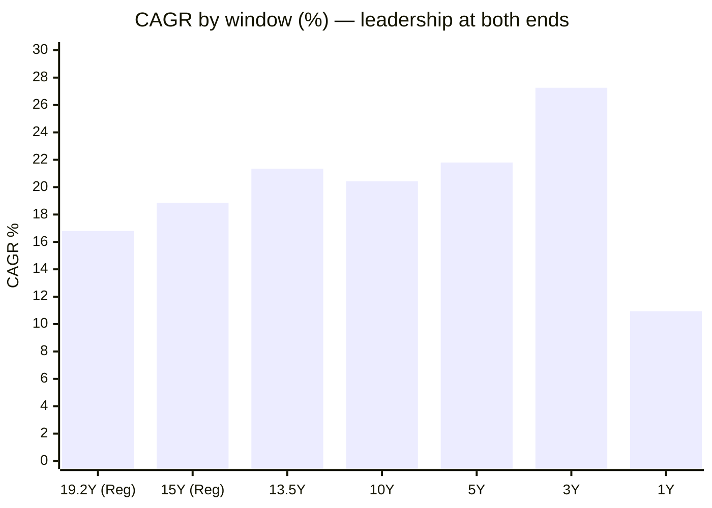
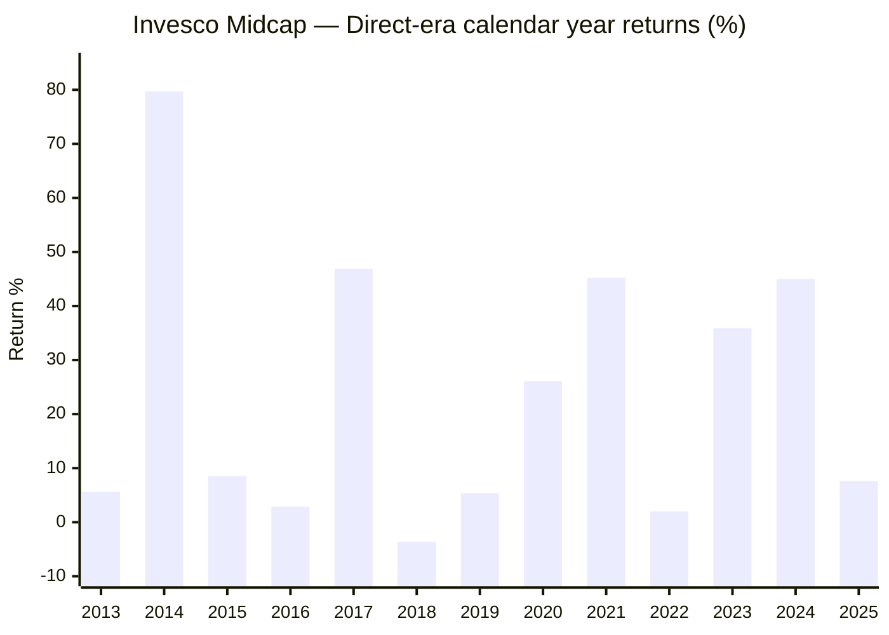
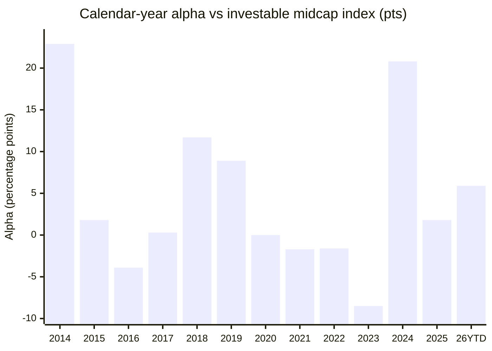

# Module 1: Returns Consistency — Invesco India Midcap Fund

## Module 1 Score: ~4.3 / 5 (provisional)

---

## Fund Identity

| Field | Value |
|-------|-------|
| **Full Name** | Invesco India Midcap Fund — Direct Plan — Growth (launched as a *Lotus India AMC* scheme; Lotus → Religare (Nov-2008) → Religare Invesco (2013) → Invesco (2016)) |
| **Inception** | **April 19, 2007** (19.2 years); **close-ended until April 20, 2010**; Direct plan from 02-Jan-2013 |
| **SEBI Category** | Equity — Mid Cap (min 65% in ranks 101–250) |
| **Benchmark** | **S&P BSE Midcap 150 TRI** — the only shortlist fund benchmarked to a BSE index (see Benchmark Note) |
| **AUM** | **₹12,397 Cr** — squarely in the study's ₹3,000–25,000 Cr sweet spot; was just **₹127 Cr in Jan-2016** (see AUM Context) |
| **Expense Ratio** | **0.49%** Direct (Tickertape, Jul-2026) / official Mar-2026 factsheet: **0.55%** Direct, 1.72% Regular *(see Module 4 reconciliation)* |
| **NAV (03-Jul-2026)** | ₹241.36 (Direct); the Regular plan's ₹10 unit of 2007 is ₹198.58 — a 19.9-bagger in 19.2 years |
| **Current Managers** | **Amit Ganatra since 01-Sep-2023, Aditya Khemani since 09-Nov-2023** — the youngest incumbent team in the shortlist (see Manager-Era Attribution) |
| **VRO Rating** | ⭐⭐⭐⭐ (4/5) |
| **Riskometer** | Very High |
| **Exit Load** | **Tiered: nil up to 10% of units within 1 year; 1% on the excess; nil after 1 year** — second-lightest of the shortlist after Nippon's 1%/30d, and the free-10% carve-out is genuinely investor-friendly |
| **Min SIP** | ₹500 (monthly, AMC); VRO lists ₹100 |

---

## Raw Data (MFAPI computed + Tickertape screening, as of 01/03-Jul-2026)

| Metric | Value |
|--------|-------|
| 1Y absolute | 10.94% |
| 3Y CAGR | 27.26% |
| 5Y CAGR | 21.80% |
| 10Y CAGR | 20.43% |
| Since Direct inception (13.5y) | **21.35%** |
| Regular plan since Apr-2007 (19.2y) | 16.80% |
| Mean rolling 3Y (direct era) | 21.36% |
| Alpha (Tickertape, vs benchmark) | **+7.35** (highest of the shortlist; Nippon +1.93) |
| Max drawdown (direct era) | −34.1% (COVID) |
| 10Y SIP XIRR (₹20K/mo) | **22.30%** — best of all four studies |
| Portfolio PE | **49.4** (category 33.8) — the most expensive book in the shortlist data |
| Std deviation (ann.) | 16.9% (category 15.3%) |
| Small-cap allocation | 22.6% (the 35% flexible sleeve is a small-cap kicker) |

**Data sources:** MFAPI scheme **120403** (Direct, 3,321 daily NAVs, 02-Jan-2013 → 03-Jul-2026); scheme **105503** (Regular, 4,718 NAVs, 20-Apr-2007 →); index counterfactuals **147622** (Motilal Oswal Nifty Midcap 150 Index Fund Direct, 11-Sep-2019 →) and **114456** (Motilal Oswal Nifty Midcap 100 ETF, Feb-2013 →). All headline metrics computed from raw NAVs, not copied from websites. Manager history verified from Invesco's own Oct-2023 fund one-pager and the Jan-2016 Religare Invesco factsheet PDF.

---

## Cross-Source Verification

Tickertape's `navClose` of 239.37 resolves to the **01-Jul-2026** Direct NAV; recomputing MFAPI CAGRs to that exact date:

| Metric | MFAPI (computed, as-of 01-Jul) | Tickertape (03-Jul-2026 export) | ValueResearch | Verdict |
|--------|-------------------------------|---------------------------------|---------------|---------|
| 3Y CAGR | **26.87%** | 26.91% | — | ✅ match |
| 5Y CAGR | **21.91%** | 21.91% | — | ✅ exact |
| 10Y CAGR | **20.34%** | 20.34% | — | ✅ exact |
| AUM | — | ₹12,397 Cr | ₹12,397 Cr | ✅ exact |
| Inception | — | age-capped (163mo) | 19-Apr-2007 | ✅ VRO fills the cap |
| Rating | — | — | 4★ | Noted |

The dataset is internally consistent across three independent sources. (Tickertape's `ageInMon` field caps at 163 months again; true age is ~231 months.) As of 03-Jul-2026 the fresh MFAPI numbers are: 1Y 10.94%, 3Y 27.26%, 5Y 21.80%, 10Y 20.43% — the small differences vs the table above are purely the two extra days.

---

## The One-Line Context

Invesco India Midcap is the **screening leader** — best 10Y (20.34%) *and* best 5Y (21.91%) in the shortlist at a cheap 0.49% — but the NAV record underneath is **three different funds wearing one name**: a ₹127-Cr boutique that compounded ferociously under Vinay Paharia (2008–2017), a fading mid-sized fund under Pranav Gokhale whose alpha decayed to **−8.5pts in his final year (2023)**, and — since Sep/Nov-2023 — an aggressive PE-49 growth book under Amit Ganatra and Aditya Khemani that produced **+20.8pts of alpha in 2024, the largest single-year alpha in any fund studied in this repo**. Nearly every raw number beats Nippon; nearly every attribution question is harder. Where Nippon's +2.1%/yr alpha was steady, defensive, and persistent across manager eras (evidence of a house process), Invesco's +5.1%/yr is **episodic and manager-coupled** — which makes this module's headline numbers simultaneously the best and the least bankable in the mid-cap study.

---

## The Vintage — 2007, GFC Included, With a Structural Footnote

Invesco is the second zero-inception-bias fund of the study: the record contains 2008 (−64.2%), 2011 (−17.5%), the 2013 taper, the 2018–19 winter, COVID, 2022, and 2024–25. No trailing window is missing a bear market. Two qualifications:

1. **The close-ended origin.** Per Invesco's own one-pager: *"the Scheme was close-ended and re-opened for purchase on 20th April, 2010."* The fund lived through the GFC as a close-ended scheme — no panic redemptions possible, no inflow torrent at the 2007 top to deploy badly. The **NAV record is honest, but the fund-management experience of 2008 was structurally easier** than Nippon's open-ended −54% (which was navigated under live redemption pressure). Worth remembering when comparing the two funds' GFC navigation.
2. **Four ownership eras.** Lotus → Religare → Religare-Invesco JV → Invesco. The AMC that launched this fund no longer exists, and the Hinduja-group AMC-sale question from the SmallCap study (Invesco SC, Module 6) carries forward to this fund unchanged.

| Study | Problem child | This fund |
|-------|--------------|-----------|
| SmallCap | Bandhan (2020 launch, bull-only record) | **19.2 years, 2008 included — no discount needed** |
| International | 2020–21 tech feeders | — |
| MidCap shortlist | Mahindra Manulife (Feb-2018) | — |

---

## CAGR vs Benchmark and the Window Ladder — Leadership at Both Ends

| Window | Invesco | Shortlist rank | Interpretation |
|--------|---------|----------------|----------------|
| 1Y | 10.94% | mid-pack (HSBC ~17.5% leads) | No extreme recent heat; the band is digesting 2024–25 |
| 3Y | 27.26% | **2nd of 7** (HSBC 27.7 leads) | Strong recent form — the inverse of Nippon's 5th |
| 5Y | **21.80%** | **1st of 7** | The Stage-2 screening headline |
| 10Y | **20.43%** | **1st of 6** with 10Y data | Bear-inclusive (winter, COVID, 2022, 2024–25 all inside) |
| 13.5Y (Direct era) | **21.35%** | — | Nearly 3pts/yr above Nippon's 18.40% — over 13.5 years that gap compounds enormously (see SIP section) |
| 15Y (Regular) | 18.86% | — | Post-reopening record |
| 19.2Y (Regular, since 2007) | **16.80%** | — | Includes 2008 (−64%): the honest long-run midcap anchor — ~16–17%, consistent with Nippon's 20-year 15.7% |

**Nippon's pattern was an endurance staircase** (rank improving as windows lengthen: 5th → 2nd → 2nd). **Invesco has no staircase: it leads or nearly leads every window from 3Y to 19Y.** Dual-horizon leadership — best long windows *and* top-2 short windows simultaneously — is the rarest screening profile, and it is exactly what the Stage-2 filter rewarded. The Endpoint Sensitivity section below examines how robust that leadership actually is.

---

## Calendar-Year Returns (2007–2026 YTD)

Regular plan (italics) for 2007–2012; Direct plan from 2013. (2013 computed from the 02-Jan-2013 Direct base.)

| Year | Return | Market context | Verdict |
|------|--------|---------------|---------|
| *2007 (Apr–Dec)* | *+60.8%* | Launch into the mania | Close-ended; partial year |
| *2008* | ***−64.2%*** | GFC — band fell ~60%+ | Worse than Nippon's −54.1%; the then-book was fully exposed. Close-ended footnote applies |
| *2009* | *+105.3%* | V-recovery | **The best recovery year of any fund in any of the four studies** |
| *2010* | *+25.7%* | Bull; fund re-opened in April | Strong |
| *2011* | ***−17.5%*** | Rate/EU crisis | **~10pts better than Nippon's −27.4% — the first defensive signature in the record** |
| *2012* | *+41.7%* | Recovery | Strong (Nippon +37.8%) |
| 2013 | +5.6% | Taper tantrum | **Positive** in a year Nippon fell −2.5% (Direct era begins) |
| 2014 | **+79.7%** | Modi-wave midcap rally | **The single best calendar year in all four studies**; index +56.8% → +22.9pts alpha — earned on a ~₹250-Cr asset base |
| 2015 | +8.5% | Flat market | Fine |
| 2016 | +2.9% | Demonetisation | Slight index lag (−3.9pts) |
| 2017 | +46.9% | Mid/small mania | Full participation, index-matching |
| **2018** | **−3.6%** | **Midcap winter part 1** | **Best of all 7 peers; index fell −15.3% → +11.7pts alpha** |
| **2019** | **+5.4%** | **Winter part 2** | 2nd-best peer (Nippon +7.4%); +8.9pts vs index |
| 2020 | +26.1% | COVID crash + V | Exactly matched the index (+26.1%) — no whipsaw lag (Nippon lagged −3.2pts) |
| 2021 | +45.2% | Broad bull | −1.7pts vs index — index-matching |
| 2022 | +2.0% | Rate-hike correction | −1.6pts vs index — *lagged* in a grind year (the regime Nippon wins: +3.1) |
| 2023 | +35.9% | Midcap rally | **−8.5pts vs index — the worst alpha year of the fund's direct era.** Gokhale's final year |
| **2024** | **+45.0%** | Rally, then Sep top | **+20.8pts vs index — the largest single-year alpha in any studied fund.** Best peer year by far (Nippon +27.9%). The new team's first year |
| 2025 | +7.6% | Correction year | +1.8pts vs index |
| 2026 YTD | +8.9% | Recovery | +5.9pts vs index — strongest YTD in the shortlist context |

**Consistency statistics (Direct era, 13.5 years):**
- **ONE negative year — 2018, at −3.6%** — in a year the category index fell 15.3%.
- For calibration across the studies: Nippon's worst = −10.3% (2 negative years) · DSP Small Cap's worst ≈ −25% (2018) · Parag Parikh's worst ≈ −7% (2018) · Franklin US's worst = −30% (2022).
- **This is the cleanest calendar-loss profile in the entire repo — including the FlexiCap winner.** A fund in the second-most-volatile equity band has a direct-era worst year that is a rounding error.

---

## ⭐ The 2018–19 Midcap Winter — Best in the Peer Set, Medal Held by a Departed Manager

**Window: Jan-2018 → Aug-2019** (SEBI-reclassification unwind + LTCG de-rating from January, IL&FS from September; midcaps fell for two years while the Nifty stayed flat — the category's defining divergence stress).

**Invesco's drawdown:** peak 12-Jan-2018 → trough 09-Oct-2018: **−16.1%** — the shallowest of the shortlist (Nippon −21.4%; index proxy ~−26%) — recovered by 14-Jan-2020, the earliest winter recovery of the peer set.

**Peer calendar comparison** (from the Nippon module's table, Invesco's row now in context):

| Fund | 2018 | 2019 | Cumulative 2018–19 |
|------|------|------|--------------------|
| **Invesco** | **−3.6%** ⭐ best | **+5.4%** | **+1.6% — the only positive cumulative winter in the peer set** ⭐ |
| Nippon Growth | −10.3% | +7.4% ⭐ best 2019 | −3.7% |
| Edelweiss | −14.6% | +6.8% | −8.8% |
| ICICI Pru | −9.8% | +0.4% | −9.4% |
| HSBC (as L&T) | −11.2% | +1.0% | −10.3% |
| Sundaram | −14.8% | +0.5% | −14.4% |
| Mahindra Manulife | — (Feb-2018 inception) | +7.0% | incomplete |

**Vs the investable index:** 2018 alpha **+11.7pts**, 2019 alpha **+8.9pts** — a cumulative winter outperformance even larger than Nippon's celebrated +5.0/+10.9.

**Attribution note — the module's recurring theme:** the winter was navigated by **Pranav Gokhale in his first months on the fund** (appointed 29-Mar-2018, ten weeks into the drawdown, inheriting Vinay Paharia's book). Both the builder of that book (Paharia, now CIO of PGIM India) and its navigator (Gokhale, resigned Oct-2023) have left. The winter medal is real, but nobody currently at the fund earned it.

---

## ⭐ The 2024–25 Correction — Passed, With a New and Different Signature

The universal, no-excuses test (every incumbent was on duty). But Invesco's version has a subtlety the peer table hides: **the index topped 24-Sep-2024; Invesco kept climbing for almost three more months** (+1.2% further, peaking 16-Dec-2024) — classic momentum-book behaviour, and the same late-top pattern that preceded Motilal Oswal Midcap's Sharpe blowup (the screening stage's cautionary tale).

| Metric | Invesco | Nifty Midcap 150 index fund | Nippon |
|--------|---------|------------------------------|--------|
| Own peak → trough | 16-Dec-2024 → 28-Feb-2025: **−20.1%** | 24-Sep-2024 → 28-Feb-2025: −21.0% | −19.9% |
| On the index's exact window (24-Sep → 28-Feb) | **−19.1%** | −21.0% | — |
| **Recovered by** | **06-Jun-2025** — over 5 months before the index | 17-Nov-2025 | 20-Oct-2025 |
| **Feb–Mar 2026 mini-dip** | **−15.6%** ⚠ *worse* than index | −13.9% | −12.6% (better than index) |

**Reading:** the new team **passed** — shallower fall on the matched window, dramatically faster recovery (3 months peak-to-recovery from the trough vs the index's 8.5). But two amber lights: (1) the December top means the fund rode momentum into the turn rather than de-risking ahead of it; (2) in the 2026 mini-dip Invesco *amplified* the index's fall (−15.6 vs −13.9) while Nippon cushioned it — the first observable instance of the current book showing **>100% down-capture**. The historical defensive statistics were earned by previous portfolios; the current one is showing early signs of a different character (see Current Book ≠ Historical Book).

---

## ⭐ The Two-Proxy Index Test — "Why Not the Index Fund?"

Both counterfactuals are **real funds' NAVs, net of all fees** — returns actually buyable.

**Proxy A — Motilal Oswal Nifty Midcap 150 Index Fund** (its full life: 11-Sep-2019 → 03-Jul-2026, 6.8y):

| Measure | Invesco | Index fund | Verdict |
|---------|---------|-----------|---------|
| **CAGR (6.8y)** | **25.82%** | 22.94% | **+2.88%/yr net alpha** ✅ (Nippon: +1.97) |
| Up-capture (monthly, 81 mo) | **100%** | 100% | Full rally participation |
| **Down-capture** | **88%** | 100% | Defensive asymmetry, Nippon-like (90%) |

**Proxy B — Motilal Oswal Nifty Midcap 100 ETF** (Feb-2013 → Jul-2026, **13.4 years**):

| Measure | Invesco | Midcap 100 ETF | Verdict |
|---------|---------|----------------|---------|
| **CAGR (13.4y)** | **21.71%** | 16.59% | **+5.11%/yr net alpha over 13.4 years** ✅ — more than double Nippon's +2.11 |
| Down-capture, 2013–2019 sub-era | **74%** | 100% | The Paharia/early-Gokhale years were *extremely* defensive |
| Down-capture, full era (161 mo) | **78%** | 100% | **The best capture asymmetry measured in any study** (up-capture 99%) |

*(Proxy B tracks the Midcap 100, not 150 — correlation ~0.99. Part of the +5.11 vs Proxy A's +2.88 gap is the era: Proxy B includes 2014's +22.9-alpha year, earned on a micro asset base.)*

**Calendar-year alpha, stitched across both proxies (2014–2019 vs ETF, 2020–2026 vs index fund):**

| Year | Alpha | Regime | Era |
|------|-------|--------|-----|
| **2014** | **+22.9** | Bull — massive stock-picking win | Paharia (₹250-Cr fund) |
| 2015 | +1.8 | Flat — slight win | Paharia |
| 2016 | −3.9 | Flat — lag | Paharia |
| 2017 | +0.3 | Mania — index-matching | Transition |
| **2018** | **+11.7** | **Winter — biggest defensive win of any studied fund** | Gokhale yr 1 (Paharia's book) |
| **2019** | **+8.9** | **Winter — second consecutive win** | Gokhale |
| 2020 | 0.0 | COVID V — exactly index | Gokhale |
| 2021 | −1.7 | Bull — slight lag | Gokhale |
| 2022 | −1.6 | Grind-down — lag (the regime Nippon wins) | Gokhale |
| **2023** | **−8.5** | Rally — **worst alpha year of the direct era** | Gokhale (final year) |
| **2024** | **+20.8** | Top + correction — **largest alpha year of any studied fund** | **Ganatra + Khemani yr 1** |
| 2025 | +1.8 | Trough + bounce — slight win | Ganatra + Khemani |
| 2026 YTD | +5.9 | Recovery — ahead | Ganatra + Khemani |

---

## ⭐ Alpha by Manager Era — The Centerpiece of This Module

Nippon's +2.1%/yr was *steady, defensive, and persistent across three manager eras* — the fingerprint of a house process. Invesco's +5.1%/yr average conceals **three unrelated alpha regimes**:

| Era | Period | Calendar alphas (pts) | Character |
|-----|--------|----------------------|-----------|
| **Vinay Paharia** (managing since 16-Dec-2008, verified from the Jan-2016 Religare factsheet) | 2013–2016 measured | +22.9 · +1.8 · −3.9 | Explosive stock-picking on a **₹127–470 Cr** boutique base; now CIO of PGIM India |
| Transition | 2017 → Mar-2018 | +0.3 | Index-matching |
| **Pranav Gokhale** (29-Mar-2018 → 30-Oct-2023, resigned) | 2018–2023 | **+11.7 · +8.9** · 0.0 · −1.7 · −1.6 · **−8.5** | Brilliant winter defence, then a **four-year fade (2020–2023 cumulative alpha ≈ −12pts)** ending in the era's worst year |
| **Amit Ganatra + Aditya Khemani** (01-Sep / 09-Nov-2023 →) | 2024–2026 | **+20.8** · +1.8 · +5.9 | Explosive offensive restart; Khemani arrived from Motilal Oswal |

Three conclusions:

1. **The alpha is episodic and manager-coupled, not process-shaped.** Each era has a different fingerprint: Paharia = small-fund discovery; Gokhale = defence decaying into lag; the new team = high-octane offence. The 13.4-year average is real money, but it is **not evidence of a repeatable process** the way Nippon's was — it is three separate bets that happened to sum well.
2. **The current team owns ~32 months of the 19-year record** — essentially one great year (2024), one decent year (2025), one strong half (2026), and one well-handled correction. Everything else on this page was earned by people who have left.
3. **The counter-signal to note honestly:** all three eras *did* preserve one common trait — full up-capture with sub-100 down-capture (until the 2026 dip). Whether that survives the current PE-49 book is precisely what Modules 2–3 must test.

> **Handoff:** Module 5 owns "who exactly generates the current alpha, and does Khemani's style survive a regime turn?" Module 3 owns "what does the PE-49 book actually hold?" The Module 1 score is explicitly conditional on both.

---

## ⭐ The October 2023 Snapshot — The Most Instructive Exhibit in This Module

Invesco's own fund one-pager, published with returns as of **31-Oct-2023** — the very week the manager change completed — shows the fund **losing to its benchmark on every single SIP window measured**:

| SIP window (at Oct-2023) | Fund XIRR | S&P BSE Midcap 150 TRI XIRR | Gap |
|--------------------------|-----------|------------------------------|-----|
| 1Y | 22.08% | 29.07% | **−6.99** |
| 3Y | 17.06% | 20.97% | **−3.91** |
| 5Y | 20.28% | 24.29% | **−4.01** |
| 7Y | 17.40% | 19.52% | **−2.12** |
| 10Y | 16.76% | 18.54% | **−1.78** |

And the same document's lumpsum table: 1Y fund 17.12% vs benchmark 22.64%; 3Y 25.51% vs 30.86%; 5Y 17.84% vs 20.33%; 10Y 20.02% vs 20.85% — behind on **every row**.

**In October 2023, this fund was a fading also-ran that a ₹0.20% index fund was beating on every horizon an investor could measure.** Thirty-two months later it is the screening leader of this study. Both facts are true; together they are the sharpest demonstration in the repo that **trailing CAGR is a photograph, not a process** — the entire screening-leader status was manufactured after November 2023.

---

## ⭐ Endpoint Sensitivity — How Fragile Is the Screening Leadership?

Every trailing window measured today *ends after* the +20.8-alpha 2024 and a +5.9-alpha 2026 half. The same fund, measured 32 months apart:

| Measurement date | 10Y trailing vs benchmark | Fund's apparent character |
|------------------|---------------------------|---------------------------|
| **31-Oct-2023** | 20.02% vs 20.85% — **behind** | Index-lagging, manager-losing, mid-table |
| **01-Jul-2026** | 20.34% — **#1 of shortlist** | Dual-horizon screening leader |

Nippon's #2 ranks carry no such flattery — its alpha years are scattered across the era, so its trailing windows are endpoint-robust. Invesco's leadership is **concentrated in the most recent 15% of the measurement period**, which means: (a) a single bad new-team year could demote it several ranks; and (b) the fund the screening rewarded is really the *new team's* fund, for which almost no track record exists. This does not reduce the realized returns — a rupee of 2024 alpha compounds identically to a rupee of 2014 alpha — but it materially reduces the *predictive* weight of the headline CAGRs.

---

## Rolling Returns Distribution (Direct era, daily windows)

| Window | n | Mean | Min | Max | % negative | % below 10% | % above 20% |
|--------|-----|------|-----|-----|------------|--------------|--------------|
| Rolling 1Y | 3,077 | 25.41% | −23.09% | +107.57% | 10.6% | 32.2% | 47.5% |
| Rolling 3Y | 2,584 | **21.36%** | **−1.75%** | +41.97% | **0.6%** | 11.2% | **59.9%** |
| Rolling 5Y | 2,091 | **20.35%** | **+2.67%** | +35.21% | **0.0%** | 5.7% | 51.5% |

**Probability of loss by holding period:**

| Hold for | Chance of loss (historical) | Worst outcome |
|----------|-----------------------------|---------------|
| 1 year | ~11% (1 in 9) | −23.1% (COVID window) |
| 3 years | **~0.6%** (only windows ending in the COVID pit) | −1.75%/yr |
| 5 years | **0% — no negative 5Y window in 13.5 years** | **+2.67%/yr** (window straddling winter + COVID) |

Every figure improves on Nippon's already-excellent distribution: 3Y loss odds 0.6% vs 2.7%; 3Y worst −1.75%/yr vs −5.6%/yr; 5Y floor +2.67%/yr vs +0.54%/yr; 60% of 3Y windows above 20% vs 55%. **These are the best rolling-return distributions computed in any of the four studies.** Both floors contain the winter and COVID — stress-tested by real events, not calm markets.

---

## SIP XIRR vs Lumpsum CAGR (₹20,000/month, Direct)

| Window | Invested | Value (03-Jul-2026) | SIP XIRR | Lumpsum CAGR (same window) |
|--------|----------|--------------------|----------|---------------------------|
| 3Y | ₹7.4L | ₹10.1L | 21.76% | 27.26% |
| 5Y | ₹12.2L | ₹21.7L | **23.57%** | 21.80% |
| **10Y** | **₹24.2L** | **₹78.1L** | **22.30%** | 20.43% |
| Full Direct era (13.6y) | ₹32.6L | **₹163.0L** | 21.74% | 21.35% |

**Readings:**
- **22.30% is the best realized 10Y SIP XIRR in any of the four studies** (Nippon 21.08%, DSP ~19.3%, Franklin 17.25%). ₹24.2L of instalments became ₹78.1L.
- **10Y SIP XIRR (22.30%) > 10Y lumpsum CAGR (20.43%)** — volatility worked *for* the instalment buyer; SIPs bought the winter, COVID, 2022, and 2024–25 cheaply.
- The full-era comparison vs Nippon is stark: identical instalments, ₹163.0L vs ₹139.7L — the compounding value of ~3pts/yr of extra CAGR over 13.5 years is ₹23L on a ₹32.6L investment.
- Standing caveats: every midcap 10Y SIP measured in mid-2026 ends after a golden decade for the band, and Invesco's specifically ends right after the 2024 alpha spike (see Endpoint Sensitivity). And per the Oct-2023 snapshot, the *same* 10Y SIP measured 32 months earlier was **losing to the benchmark**.

---

## Absolute Returns — Short-Term Trend

| Period | Return | Context |
|--------|--------|---------|
| 3M | **+24.7%** | Explosive recovery leg off the Feb–Mar 2026 dip — strongest 3M in the shortlist context |
| 6M | +7.9% | Consistent with +8.9% YTD |
| 1Y | +10.9% | Above Nippon (7.2%), below HSBC (~17.5%) |

Short-term momentum is strong and improving — which, for a momentum-tilted book, is exactly when it looks best. Nothing here contradicts the long-window story; the caution is that it *rhymes* with it.

---

## ⭐ The AUM Context of the Record — Which Fund Earned the 10Y CAGR?

From the Jan-2016 Religare Invesco factsheet: AUM **₹127 Cr** (ER then: 2.55% Regular / 1.03% Direct). Today: **₹12,397 Cr — roughly 98× in 10.5 years.**

| Milestone | Approx. AUM | What was earned at this size |
|-----------|-------------|------------------------------|
| 2014 (+79.7%, +22.9 alpha) | ~₹250 Cr | The best calendar year in the repo — as a micro-boutique |
| Jan-2016 | ₹127 Cr | (post-2015 outflows/redemptions era) |
| 2018–19 winter (+11.7/+8.9 alpha) | ~₹1,500–2,500 Cr | The celebrated defence — as a small fund |
| 2024 (+20.8 alpha) | **~₹3,400–4,300 Cr** *(corrected in Module 4: ₹3,418 Cr at the Nov-2023 handover, ₹4,280 Cr in Apr-2024 — archived Groww series)* | The new team's signature year — even smaller than first estimated |
| Jul-2026 | **₹12,397 Cr** | The fund you would actually buy today |

The 10Y CAGR of 20.43% was earned mostly on a sub-₹1,000-Cr base where the manager could hold rank-230 names at 3% weights without moving prices. **Only the current team has ever run this strategy at five figures of crores — and only for months.** The mitigating fact: ₹12,397 Cr is still comfortably inside the study's ₹3,000–25,000 Cr sweet spot (Nippon: ₹47,415 Cr, in the constraint zone), so this is a historical asterisk, not a present constraint. Module 4 owns the flow-trajectory question — the 2024 alpha year will have attracted a torrent of new money, and torrents are how sweet spots end.

---

## ⭐ Current Book ≠ Historical Book — Why the Back-Tests May Not Transfer

The Tickertape portfolio snapshot describes a fund materially different from the one that earned the historical statistics:

| Metric | Invesco today | Nippon | Category |
|--------|---------------|--------|----------|
| Portfolio PE | **49.4** — most expensive in the shortlist data | 29.3 — cheapest quartile | 33.8 |
| Std deviation (ann.) | **16.9%** — 2nd-highest of shortlist | ~14–15% | 15.3% |
| Small-cap allocation | **22.6%** — the 35% sleeve as a kicker | large-cap ballast | — |
| Large-cap / mid-cap | 23.9% / 52.1% | — | — |

The stated style (from the AMC's own material) is *"larger allocation towards growth oriented companies … active overweight positions in all the companies that are owned"* — and Khemani's provenance is Motilal Oswal, the AMC of the screening stage's momentum-blowup cautionary tale. None of this is disqualifying — this configuration is exactly what produced +20.8pts in 2024. But it means **the 78–88% historical down-capture describes portfolios that no longer exist.** The early evidence on the current book cuts both ways: the 2024–25 correction was handled well (−19.1% vs index −21.0%), but the 2026 mini-dip was amplified (−15.6% vs −13.9%). The single most important forward-looking question in this fund's file: **does a PE-49, 22.6%-small-cap book defend like the record says, or fall like Motilal did?**

---

## Benchmark Note — S&P BSE Midcap 150 vs Nifty Midcap 150

Invesco benchmarks to the **S&P BSE Midcap 150 TRI**; every other shortlist fund (and both of our index-fund proxies) uses the Nifty Midcap 150. Both indices are built on the same SEBI-defined 101–250 rank band and track each other closely, so the two-proxy alpha test remains valid; the AMC's own SI comparison (fund 15.28% vs BSE Midcap 150 TRI 14.50% at Oct-2023, Regular plan) is consistent with our Nifty-proxy findings. Noted for precision; no analytical consequence.

---

## ⭐ Manager-Era Attribution — Whose Record Is This?

| Era | Manager | Period | What the NAV record shows |
|-----|---------|--------|---------------------------|
| The Lotus/close-ended era | (Lotus India AMC team) | Apr-2007 → Dec-2008 | −64.2% in 2008, close-ended. Pre-history |
| The boutique era | **Vinay Paharia** | **16-Dec-2008 → early 2017** (verified from Jan-2016 factsheet; left for Union AMC, now **CIO of PGIM India** — the AMC in our International study) | +105% in 2009, +79.7%/+22.9-alpha 2014, the −17.5% (vs −27) 2011 defence — all on a ₹100–500 Cr base. **None attributable to today's team** |
| The transition | (interim, Taher Badshah CIO era) | 2017 → Mar-2018 | Index-matching 2017. Flagged for Module 5 completeness |
| The fade era | **Pranav Gokhale** (Neelesh Dhamnaskar co-managed from Jul-2018 for a period) | 29-Mar-2018 → 30-Oct-2023 (resigned) | **The winter medal (+11.7/+8.9) is his** — then 2020–2023: 0.0, −1.7, −1.6, **−8.5**. Left with the fund losing to its benchmark on every SIP window |
| The current era | **Amit Ganatra (01-Sep-2023) + Aditya Khemani (09-Nov-2023)** | ~2.8 years | **+20.8-alpha 2024 (best year of any studied fund), +1.8 2025, +5.9 2026 YTD; passed the 2024–25 correction; amplified the 2026 dip.** Ganatra: ex-Fidelity/HDFC, CA+CFA. Khemani: ex-Motilal Oswal/HSBC/SBI, IIM-L |

**The honest attribution statement:** the 19-year record spans four teams and three distinct alpha regimes; the celebrated years (2014, 2018–19) belong entirely to departed managers; the current team's sample is 32 months — one spectacular year, two decent ones, one passed stress test, one amplified dip. **Unlike Nippon, the alpha fingerprint did NOT persist across eras** — each team produced a different shape — so the "house process" mitigation that softened Nippon's manager discount is largely unavailable here. What does persist: full up-capture with sub-100 down-capture in every era to date.

---

## Long-Cycle Drawdown Record (context for Module 2)

| Era | Peak → trough | Depth | Time to recover |
|-----|--------------|-------|-----------------|
| 2008 GFC *(Regular, close-ended)* | Jan-2008 → Mar-2009 | **−70.8%** | **~44 months** (Nov-2012) — the deepest hole and longest wait in the entire repo |
| 2011 *(Regular)* | Nov-2010 → Dec-2011 | −27.0% | Nov-2012 |
| 2013 taper | Jan-2013 → Aug-2013 | −21.9% | 4 months |
| 2015–16 | Aug-2015 → Feb-2016 | −19.2% | 5 months |
| **2018–19 winter** | Jan-2018 → Oct-2018 | **−16.1%** ⭐ shallowest of peers | 15 months |
| COVID | Feb-2020 → Mar-2020 | −34.1% (direct-era max) | 8 months |
| 2022 | Jan-2022 → Jun-2022 | −20.1% | 5 months |
| **2024–25** | Dec-2024 → Feb-2025 | −20.1% | **3 months** ⭐ |
| 2026 dip | Jan-2026 → Mar-2026 | −15.6% ⚠ deeper than index | 5 weeks |

The −70.8%/44-month GFC entry is the honest worst case of the whole repo (with the close-ended footnote: unitholders couldn't redeem into the fall, and couldn't exit the recovery wait either). The era shift mirrors Nippon's: **since 2013, nothing deeper than COVID's −34%, and every drawdown recovered within 15 months** — with the 2024–25 recovery (3 months) the fastest stress-recovery measured in the study. Full risk treatment (Sharpe, Sortino, volatility, beta, capture) in Module 2.

---

## Returns vs Peers — All 7 Shortlisted Mid Cap Funds

| Fund | 5Y CAGR | 3Y CAGR | 3Y ÷ universe mean (20.27%) | 10Y CAGR |
|------|---------|---------|------------------------------|----------|
| **Invesco** | **21.91%** ⭐ | 26.91% | 1.327 | **20.34%** ⭐ |
| Nippon Growth | 21.48% | 23.09% | 1.140 | 19.33% |
| Edelweiss | 20.64% | 24.05% | 1.186 | 19.88% |
| HSBC | 20.44% | 27.68% ⭐ | **1.366** | 18.47% |
| Mahindra Manulife | 20.17% | 23.67% | 1.168 | — |
| Sundaram | 19.31% | 22.27% | 1.099 | 15.63% |
| ICICI Pru | 19.01% | 24.75% | 1.221 | 17.78% |

Invesco is the only fund leading both long windows, and it does so from the AUM sweet spot (₹12,397 Cr) at the second-cheapest shortlist ER (0.49%) — on paper the complete package. The two structural discounts: the leadership is endpoint-flattered by 2024–26 (HSBC's 3Y lead is the only window Invesco doesn't hold), and the team that produced the recent numbers has no record before Sep-2023 on this fund.

---

## Comparison with Studied Funds (All Four Categories)

| Dimension | **Invesco Midcap** | Nippon Growth (MC) | DSP Small Cap (SC #1) | Parag Parikh (FC #1) | Franklin US (Intl) |
|-----------|-------------------|--------------------|----------------------|---------------------|--------------------|
| Vintage / inception bias | **2007 / none** (close-ended to 2010) | 1995 / none | 2007 / none | 2013 / none | 2013 / none |
| 10Y CAGR | **20.43%** ⭐ | 19.33% | ~19.3% | mid-teens | 17.8% |
| Worst calendar year (direct era) | **−3.6%** ⭐ cleanest in repo | −10.3% | ~−25% (2018) | ~−7% (2018) | −30% (2022) |
| Alpha vs own investable index | **+5.1%/yr × 13.4y** ✅ largest | +2.1%/yr ✅ | positive ✅ | positive ✅ | negative ❌ |
| Alpha character | **Episodic, manager-coupled; currently offensive** | Defensive house process | stock-picking | stock-picking + intl sleeve | n/a |
| 10Y SIP XIRR | **22.30%** ⭐ new all-study record | 21.08% | ~19.3% | ~17–18% | 17.25% |
| 3Y-window loss odds | **0.6%** ⭐ | 2.7% | higher | ~0% | ~8% |
| 5Y-window loss odds / floor | **0% / +2.67%** ⭐ | 0% / +0.54% | >0% | 0% | >0% |
| Manager continuity | ❌❌ **current team ~2.8y; 3 prior eras departed; fingerprint changed each era** | ❌ 3 eras, fingerprint persisted | ✅ 14y | ✅ 13y | ✅ 19y |
| AUM position | ✅ **sweet spot** (₹12.4K Cr, but 98× in a decade) | ⚠ constraint zone (₹47.4K Cr) | sweet spot | no constraint | no constraint |
| Current book valuation | ⚠ **PE 49.4 — most expensive studied** | ✅ PE 29.3 | — | — | — |

**The one-line synthesis:** Invesco is **the anti-Nippon**. Nippon = modest, steady, defensive alpha; process over person; size risk; cheap book. Invesco = spectacular, discontinuous alpha; person over process; no size problem; expensive book. Nippon's tripwire is "the giant quietly becomes the index"; Invesco's is "the new team's momentum book meets a regime turn" — the Motilal Oswal failure mode that the screening stage already eliminated once.

---

## Module 1 Scorecard

| Sub-dimension | Weight | Score | Reasoning |
|---------------|--------|-------|-----------|
| 10Y CAGR | High | **5.0** | 20.43% — best of shortlist; ≥18% bar cleared; bear-inclusive; a 19.2y/16.8% deep record behind it |
| 5Y CAGR vs category | High | **5.0** | 21.80–21.91% — #1 of shortlist, vs universe median 17.63% |
| **Alpha vs investable Midcap 150 index fund** | **Critical** | **4.5** | +2.9%/yr (6.8y) and +5.1%/yr (13.4y) clear the >3% band for a 5 — held to 4.5 because the alpha is episodic (a 4-year zero-to-negative stretch 2020–23 sits inside it), manager-coupled, and endpoint-flattered by 2024 |
| 3Y rolling average | High | **5.0** | Mean 21.36%, 60% of windows >20%, only 0.6% negative — the best rolling distribution in the repo; current 3Y point ranks 2nd of 7 |
| 2018–19 winter | Critical | **5.0** | Only positive cumulative winter in the peer set (+1.6%); shallowest drawdown (−16.1%); +11.7/+8.9 alpha — *with the attribution caveat that its navigator has departed* |
| 2024–25 correction | High | **4.0** | Passed on the matched window (−19.1% vs −21.0%) with a 5-month-faster recovery — but topped 3 months after the index on momentum, and amplified the 2026 mini-dip (−15.6% vs −13.9%) |
| Consistency (worst year) | Medium | **5.0** | One negative year in 13.5 (−3.6%, in a −15% index year) — the cleanest calendar-loss profile of any fund studied |
| Inception-bias adjustment | Modifier | **+** | 2007 vintage, GFC included; close-ended footnote noted, NAV record honest |
| *Manager-attribution caution* | *Modifier* | **− −** | *Heavier than Nippon's single minus: the record spans four teams with **different** alpha fingerprints; the current team owns ~32 months; the AMC's own Oct-2023 factsheet showed the fund losing to its benchmark on every SIP window just before the handover* |

**Module 1 Score: ~4.3 / 5** — the best raw returns file in the mid-cap study and arguably the repo (both long CAGRs, both rolling floors, the SIP record, the winter, the worst-year profile all #1), edging past Nippon's ~4.2 on measurable superiority nearly everywhere — but carrying the heaviest attribution discount yet applied, because the numbers that earned the screening crown were produced by three different departed regimes and one 32-month-old incumbency whose only stress test is a single (well-handled) correction. **The score is explicitly provisional on Module 5 (who generates the current alpha, and does the style survive a regime turn?) and Module 3 (what the PE-49 book actually holds).**

---

## Comparative Module 1 Scores (studied funds)

| Fund | Category | M1 Score | Character |
|------|----------|----------|-----------|
| Parag Parikh FlexiCap | FlexiCap | ~4.5 | Consistent alpha machine |
| **Invesco India Midcap** | MidCap | **~4.3** | Best raw numbers in the repo; episodic, manager-coupled alpha |
| Nippon Growth Mid Cap | MidCap | ~4.2 | Endurance + defensive alpha at scale |
| DSP Small Cap | SmallCap | ~4.1 | Long-record small-cap discipline |
| Franklin US Opp | International | 3.1 | Lags own benchmark; currency-flattered |

---

## SIP Implication

For a ₹20,000/month SIP with a 10+ year horizon, Module 1 says:

1. **The historical SIP experience is the best measured in any study** — ₹24.2L → ₹78.1L over 10 years (22.30% XIRR), and ₹32.6L → ₹163L over the full direct era. Volatility consistently worked for the instalment buyer.
2. **The realistic forward anchor is the 19-year number (~16.8%), not the 5-year one (21.9%)** — the two-decade record includes a −64% year the last decade lacked.
3. **Every historical 5-year window was positive with a +2.67%/yr floor** — at a 10-year horizon, this fund's volatility has been fully time-absorbable, with the best floor in the repo.
4. **What you are actually buying today is the Ganatra–Khemani book, not the record** — a PE-49, 22.6%-small-cap, momentum-tilted portfolio with 32 months of history. The Oct-2023 snapshot is the standing reminder of how fast this fund's character can change with its managers. The tripwires for this SIP: a manager exit (either of the pair), and a regime-turn year where the book's down-capture prints materially above 100 — either would reopen the "why not the index fund?" question that the 2024 alpha temporarily closed.

---

## One-Line Verdict

> **Invesco India Midcap's Module 1 is the best raw returns file in the repo — dual-horizon shortlist leadership (20.4% 10Y, 21.9% 5Y), a +5.1%/yr 13.4-year alpha over the investable index with 99%/78% capture, the only positive 2018–19 winter in the peer set, one negative year in 13.5 (−3.6%), a zero-loss 5Y-window record with a +2.7% floor, and the best realized 10Y SIP of any studied fund (22.3% XIRR) — discounted for the heaviest manager-attribution problem yet scored: three departed regimes with three different alpha fingerprints, a current team of ~32 months whose 2024 (+20.8pts) manufactured the screening crown after the AMC's own Oct-2023 factsheet showed the fund losing to its benchmark on every SIP window, and a PE-49 momentum-tilted current book that has already amplified one dip. Provisional: ~4.3/5.**

---

*Module 1 completed: July 4, 2026 | Returns Consistency | MFAPI methodology — Direct 120403 (3,321 pts, 02-Jan-2013 → 03-Jul-2026), Regular 105503 (4,718 pts, 20-Apr-2007 →) | Index counterfactuals: Motilal Nifty Midcap 150 Index Fund 147622 (11-Sep-2019 →, +2.88%/yr alpha, 100/88 capture) and Motilal Nifty Midcap 100 ETF 114456 (Feb-2013 →, +5.11%/yr alpha, 99/78 capture) | Tickertape screening reproduced exactly at the 01-Jul-2026 NAV (3Y 26.87/26.91 · 5Y 21.91/21.91 · 10Y 20.34/20.34); VRO: 4★, inception 19-Apr-2007, AUM ₹12,397 Cr confirmed | Fund history: Lotus India (close-ended Apr-2007 → Apr-2010) → Religare → Religare Invesco → Invesco; benchmark S&P BSE Midcap 150 TRI | Manager history: Paharia (16-Dec-2008 → ~2017, per Jan-2016 Religare factsheet) → Gokhale (29-Mar-2018 → 30-Oct-2023, resigned) → Ganatra (01-Sep-2023) + Khemani (09-Nov-2023) via AMC one-pager/factsheets | Oct-2023 AMC factsheet: fund behind benchmark on all SIP and lumpsum windows at handover | Provisional M1 Score: ~4.3/5 (conditional on M3 book composition and M5 attribution)*
