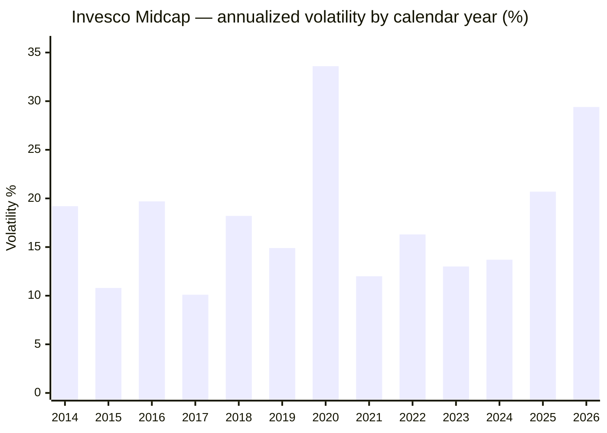
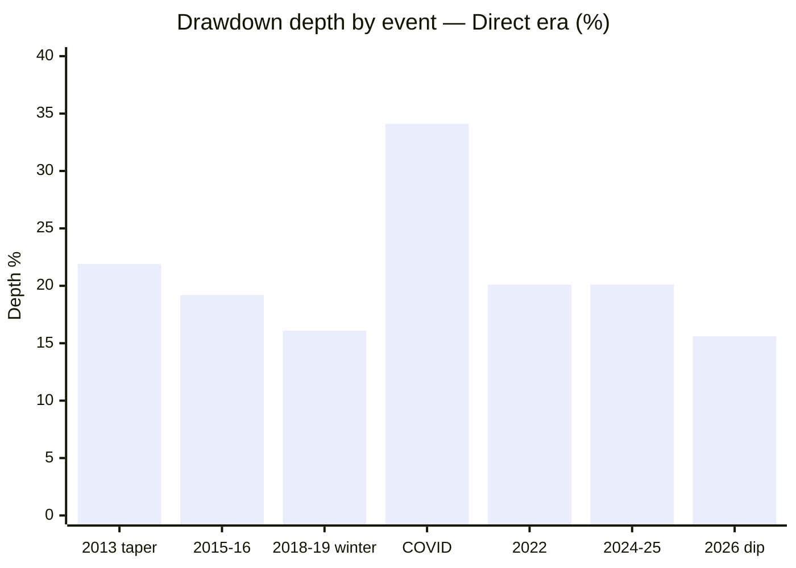
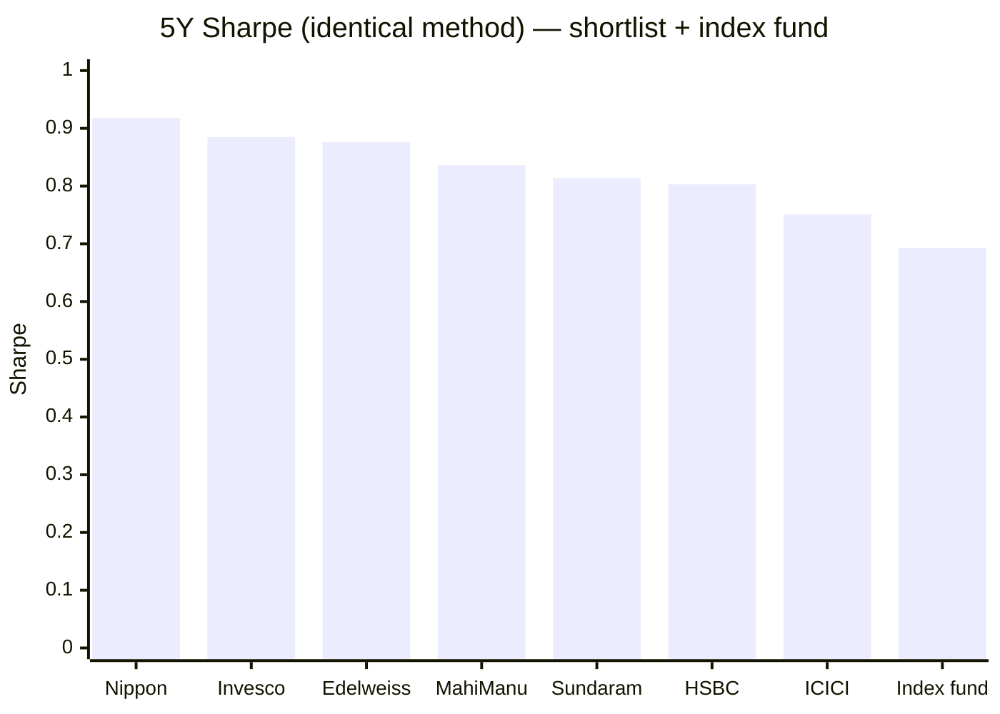
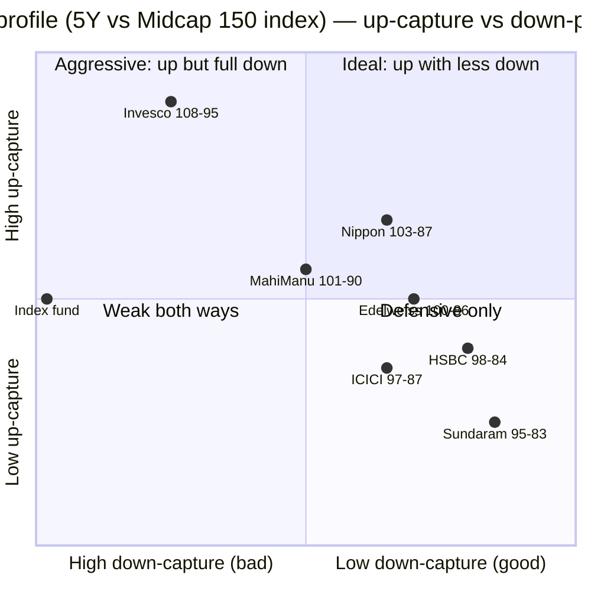
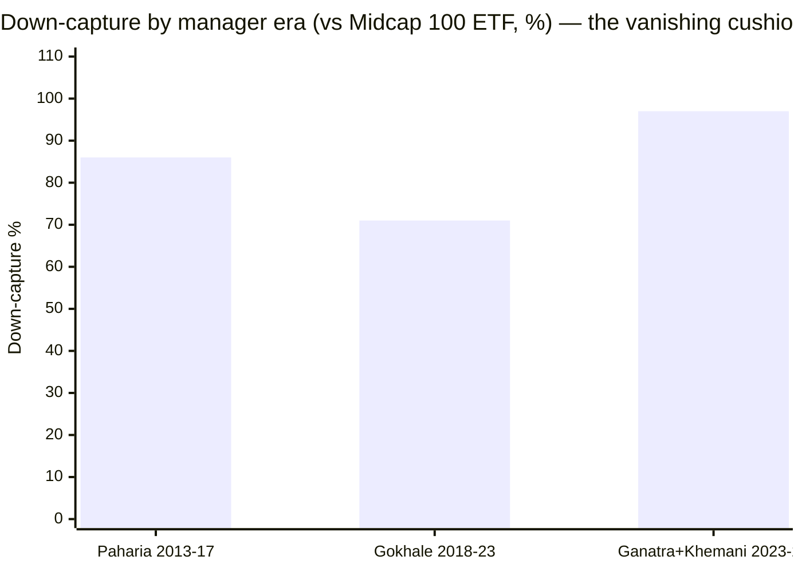

# Module 2: Risk Profile — Invesco India Midcap Fund

## Module 2 Score: ~4.1 / 5 (provisional)

---

## Raw Data (Compiled Across Sources, as of 01/03-Jul-2026)

| Metric | Computed (MFAPI, monthly canonical) | Tickertape | Note |
|--------|-------------------------------------|------------|------|
| Volatility (5Y) | **17.4%** | 16.86% (own window) | 2nd-highest of shortlist; **above** the index fund's 16.9% |
| Volatility (full direct era) | 18.9% | — | Identical to Nippon's long-run 18.9% |
| Volatility (2026 calendar YTD) | **29.4%** ⚠ | — | Near-COVID level (2020: 33.6%) — see Regime Shift |
| Sharpe (5Y, rf 6.5%) | **0.885** | 0.408 (own window/method) | **2nd of 7 shortlisted** |
| Sharpe (3Y) | **1.02** | — | Best 3Y in shortlist context — recency-flattered (see sidebar) |
| Sortino (5Y) | **1.429** | 0.043 (different scale) | 3rd of 7 |
| Calmar (5Y) | **1.09** | — | **#1 of shortlist** (Nippon 1.08); 3Y: 1.36 |
| Max drawdown (5Y) | **−20.1%** | premium-gated | Tied-2nd shallowest (Nippon −19.9%) |
| Max drawdown (direct era) | **−34.1%** (COVID) | — | Recovered in 7.5 months |
| Max drawdown (full record) | **−70.8%** (2008, Regular) | — | **Deepest in the repo**; 44-month recovery; close-ended footnote |
| Beta vs Midcap 150 index (6.8y / 5Y) | **0.91 / 0.98** | — | Band vehicle |
| R² vs Midcap 150 index | **91%** | — | Slightly less index-coupled than Nippon (95%) |
| Tracking error (vs index, monthly) | **6.4%** | 8.12 (own window) | ~45% more active risk than Nippon's 4.5% |
| **Information ratio** | **0.45** | — | +2.88% alpha ÷ 6.4% TE — **identical to Nippon's 0.44** |
| Up / Down capture vs index (5Y) | **108% / 95%** | premium-gated | #1 up-capture; 2nd-worst down-capture |
| Up / Down capture vs index (6.8y) | 100% / 88% | — | The blended long-run looks defensive… |
| **Up / Down capture, current era (Nov-2023 →)** | **122% / 101%** ⚠ | — | …the current era is not — see Era-Split Fingerprint |
| Up / Down capture vs Nifty 50 (13.4y) | **121% / 81%** | — | **+40pt spread — widest measured in any study** |
| Negative months | 34% (55/161) | — | Same SIP rhythm as Nippon (35%) |
| PE | **49.4** | 49.4 | Category 33.8 — a **+46% premium** (Nippon: 13% discount) |
| % from ATH | **0.0%** — at ATH (03-Jul-2026) | — | Zero drawdown overhang |
| Category St Dev | — | 15.26% | All funds SEBI "Very High" |

**Method:** monthly returns (161 months, Feb-2013 → Jun-2026) are canonical, annualized ×√12; risk-free = 6.5%; Sharpe = (geometric annualized return − rf) ÷ annualized vol; peer metrics over the identical 5Y common window (Jul-2021 → Jun-2026), same run as the Nippon M2 matrix. Daily metrics for reconciliation only. Data: MFAPI 120403/105503; index counterfactuals 147622 (Midcap 150 index fund) and 114456 (Midcap 100 ETF, for era analysis on one consistent benchmark); cross-sleeve series UTI Nifty 50 (120716), Parag Parikh FlexiCap (122639), DSP Small Cap (119212), Nippon Growth (118668); peers as in Module 1 (HSBC = L&T spliced Nov-2022).

**Published-source gap (documented, same as Nippon M2):** Morningstar's risk-ratings page and VRO's risk/return grades are JS-rendered and could not be extracted; no third-party capture-ratio cross-check exists. All figures computed from raw NAVs — the primary method of all four studies anyway. VRO's 4★ overall rating (Module 1) stands as the independent quality signal.

---

## The Module 2 Tension — Excellent Averages, and a Book That No Longer Matches Them

Nippon's tension was "best risk-adjusted fund, worthless diversifier." Invesco's is sharper, and it is doubled:

1. **The trailing tables describe a fund that no longer exists.** Every 5Y/6.8y/13.4y risk statistic blends three different books. The era decomposition below shows the defensive numbers were earned by Paharia (86% down-capture) and Gokhale (71%); the current team's 32 months run **122% up / 101% down** — statistically, the downside edge is gone, and the fund's risk product today is *pure offense*.
2. **The diversification verdict is even worse than Nippon's** — on top of R² 86% vs the DSP Small Cap sleeve and 70% vs the Nifty, Invesco is **R² 90% (correlation 0.946) against Nippon itself**. The study's two leading candidates are near-duplicates in risk space: the midcap sleeve is a single-slot decision, not a blend.

Neither point erases the realized record — #1 Calmar, #2 Sharpe, the widest Nifty-relative capture spread in the repo. They say *what kind* of risk you are buying now: leveraged alpha, not protected alpha.

---

## Volatility — Higher, and Rising

### Cross-Source Reconciliation (read before comparing any Sharpe/vol across sites)

| Source | Vol | Sharpe | Why they differ |
|--------|-----|--------|-----------------|
| Computed, monthly, 5Y, rf 6.5% | 17.4% | 0.885 | The canonical method of these studies |
| Computed, daily, 5Y | 16.3% | — | Daily basis smooths monthly clustering |
| Tickertape (own trailing window) | 16.86% | 0.408 | Shorter window, different rf, daily basis |

Levels differ; ranks agree. Same lesson as every module: Sharpe is only comparable within one method.

### Volatility by Window

| Window | Monthly-ann | Context |
|--------|-------------|---------|
| 3Y | **19.6%** | Contains 2024–25 correction + 2026 dip *under the new book* |
| **5Y** | **17.4%** | Above the index fund (16.9%) and Nippon (16.3%) — 2nd-highest of shortlist |
| 10Y | 18.7% | Contains COVID's 33.6%-vol year |
| Full direct (13.4y) | 18.9% | Long-run — identical to Nippon's |
| Since Oct-2019 (index-fund window) | 20.0% | Index fund itself: 20.9% |

Invesco's risk-efficiency (Calmar #1, Sharpe #2) is earned **entirely in the return numerator** — unlike Nippon, which also ran below-index vol. You are paid more here, but you are never risked less.

### Annual Volatility Regime — ⭐ The Regime Shift Under the New Team

| Regime | Years | Vol | Reading |
|--------|-------|-----|---------|
| Calm manias | 2015, 2017 | 10.1–10.8% | Low vol ≠ low risk — 2017 preceded the winter |
| Normal band | 2014–2023 (ex-2020) | 12.0–19.7% | The structural midcap range |
| Crisis | 2020 | **33.6%** | COVID |
| **New-team era** | **2024 → 2025 → 2026** | **13.7 → 20.7 → 29.4** ⚠ | **The risk temperature has roughly doubled in three years — 2026 is running at near-COVID vol in a non-crisis year** |

The 2026 spike is mechanical once you see the months inside it: −11.7% (Mar) and +14.5% (Apr) back-to-back — the 2nd-worst and 2nd-best non-COVID months of the fund's entire direct era, *both under the current book*. A concentrated PE-49 momentum portfolio whipsaws; the whipsaw is now in the data. Nippon's 2026 vol on the same basis: 18.8%. Any site quoting Invesco's long-window vol is understating the fund you would buy today.

---

## Max Drawdown — Excellent Modern Record, One Repo-Record Tail

### The Modern Era (Direct plan, 2013 →) — Every Drawdown ≥15%

| Event | Peak → Trough | Depth | Fall | Recovery | Total round trip |
|-------|--------------|-------|------|----------|------------------|
| Taper tantrum | Jan-2013 → Aug-2013 | −21.9% | 7.5 mo | 3.5 mo | 11 mo |
| 2015–16 China/credit | Aug-2015 → Feb-2016 | −19.2% | 7 mo | 5 mo | 12 mo |
| **2018–19 winter** | Jan-2018 → Oct-2018 | **−16.1%** ⭐ shallowest of peers | 9 mo | 15 mo | 24 mo |
| **COVID** | Feb-2020 → Mar-2020 | **−34.1%** | 1 mo | 7.5 mo | 8.5 mo |
| 2022 rate hikes | Jan-2022 → Jun-2022 | −20.1% | 5 mo | 5 mo | 10 mo |
| **2024–25 correction** | Dec-2024 → Feb-2025 | **−20.1%** | 2.5 mo | **3 mo** ⭐ fastest in study | 5.5 mo |
| 2026 mini-dip | Jan-2026 → Mar-2026 | **−15.6%** ⚠ deeper than index (−13.9%) | 12 wk | 5 wk | ~4 mo |

**Modern-era summary: nothing deeper than −34.1%, every event recovered within 15 months, and the 2024–25 recovery (3 months trough-to-peak) is the fastest stress recovery measured in the study.** The asterisk sits on the newest row: the 2026 dip is the *only* modern event where Invesco fell **deeper** than the index — and it happened under the current book.

### The COVID Event in Isolation

−34.1% in one month (20-Feb → 23-Mar-2020); worst single day **−13.7%** (23-Mar) — sharper than Nippon's −11.6%, the higher-beta book visible even then; worst month −25.0% (Mar-2020). Then +12.3% in Apr-2020 alone, full recovery by 06-Nov-2020 — 7.5 months trough-to-peak. Calendar 2020 closed at **+26.1%, exactly matching the index** — a year containing a −34% crash ended up 26%, the standing illustration of why exit-timing destroys midcap SIP returns.

### The 2018–19 Winter in Isolation

**−16.1% depth — the shallowest winter drawdown of the shortlist** (Nippon −21.4%, index proxy ~−26%), recovered by Jan-2020, the earliest of the peer set. Module 1's calendar view (+11.7/+8.9pts alpha, only positive cumulative winter) already told the story; the risk-lens addition is that the *depth* advantage was even larger than the calendar one. Attribution note stands: navigated by Gokhale (first months on the fund) on Paharia's book — both departed.

### ⭐ The Documented Tail — 2008 at −70.8%, Close-Ended Edition

| Event (Regular plan) | Depth | Fall | Recovery |
|---------------------|-------|------|----------|
| **2008 GFC** | **−70.8%** | 14 mo | **~44 months** (whole by Nov-2012) |
| 2011 rate/EU crisis | −27.0% | 13 mo | 11 mo (also whole by Nov-2012) |

The deepest drawdown and longest recovery in the entire repo (Nippon: −62.7%/18mo; DSP −49%). Two footnotes before extrapolating: (1) it was a different book under a different AMC (Lotus-era, growth-heavy into the 2008 top); (2) the fund was **close-ended** — unitholders were locked in for the fall *and* the 44-month wait, with no redemption pressure shaping the NAV. As with Nippon, the tail is treated as the asset-class base rate rather than a fund penalty — but Invesco's version carries the specific lesson that **a growth-tilted midcap book at GFC scale can lose ~71%**, which is the stress-scenario anchor for today's PE-49 configuration.

### SIP Investor Experience During the COVID Crash

A ₹20K/month SIP running through 2020 bought its Mar/Apr instalments ~34% below the February price; those instalments were up ~50% by the November recovery. The 10Y SIP XIRR (22.30%, Module 1) exceeds the 10Y lumpsum CAGR (20.43%) because of exactly these purchases. In this fund's history, **drawdowns have been the SIP investor's friend, provided the SIP kept running** — and with 34% of all months negative, it needs to keep running through a lot of red statements.

---

## Worst & Best Rolling Periods (MFAPI, Direct era)

| Window | Worst | When (worst) | Best | % windows negative |
|--------|-------|--------------|------|--------------------|
| Rolling 1Y | **−23.09%** | COVID trough | +107.57% | 10.6% |
| Rolling 3Y | **−1.75%/yr** | window ending in the COVID pit | +41.97%/yr | **0.6%** |
| Rolling 5Y | **+2.67%/yr** | window straddling winter + COVID | +35.21%/yr | **0.0%** |

**No negative 5-year window has ever occurred in this fund's direct-plan history, and the floor (+2.67%/yr) is the highest of any fund studied** (Nippon +0.54%, PP ~0%, DSP negative). The floor window contains both the winter and COVID — stress-tested by real events. The 3Y floor (−1.75%/yr) is also the best in the repo.

---

## Daily Return Distribution (3,320 trading days)

| Statistic | Value | Reading |
|-----------|-------|---------|
| Worst days | **−13.7%** (23-Mar-20), −6.4% (12-Mar-20), −6.2% (24-Aug-15) | COVID + China devaluation |
| Best days | +5.6% (20-Mar-20), +5.0% (08-Apr-26), +4.5% (20-Sep-19) | Crash rebounds + corporate-tax-cut day |
| Days < −2% | 90 (2.7%) | Downside clusters |
| Days > +2% | 65 (2.0%) | Upside is slower |
| Worst months | **−25.0% (Mar-20)**, **−11.7% (Mar-26)** ⚠, −10.9% (Feb-16), −10.8% (Sep-18), **−10.2% (Jan-25)** ⚠ | **Two of the five worst months are under the new team** |
| Best months | +16.3% (May-14), **+14.5% (Apr-26)**, +12.3% (Apr-20) | Immediately after falls |
| **Negative months** | **55 of 161 (34%)** | 1 in 3 statements red — category property (Nippon 35%) |

### The Asymmetry Paradox — With an Era Twist

Extreme down-days outnumber extreme up-days (2.7% vs 2.0%) yet long-run returns are strongly positive — the same resolution as DSP/BOI/Nippon: the negative skew is the market's, and the fund's edge compounds through relative behaviour, not through avoiding red months. The Invesco twist: its extremes are **bigger in both directions than Nippon's and increasingly concentrated in the current era** — the two worst non-COVID months of 13.5 years (Mar-2026, Jan-2025) and one of the three best (Apr-2026) all happened in the last 18 months. The tails are announcing the book change before the averages do.

---

## Sharpe Ratio — #2 of the Shortlist Under a Common Method

| Fund (5Y, monthly, rf 6.5%) | Sharpe |
|------------------------------|--------|
| Nippon Growth | **0.918** ⭐ |
| **Invesco** | **0.885** |
| Edelweiss | 0.876 |
| Mahindra Manulife | 0.836 |
| Sundaram | 0.814 |
| HSBC | 0.803 |
| ICICI Pru | 0.751 |
| **Nifty Midcap 150 index fund** | **0.693** |

### Sidebar — The 3Y Recency Trap (the HSBC Lesson, Now Pointing at Invesco)

Invesco's own **3Y numbers are spectacular: Sharpe 1.02, Calmar 1.36** — comfortably the best in the shortlist context. But this is structurally the same artifact the screening caught in HSBC's 0.848 Tickertape Sharpe (which collapsed to 6th of 7 under the common 5Y method): a short window dominated by one exceptional stretch — here, the new team's +45.0% 2024. Rule now thrice-learned in these studies: **short-window risk ratios are window artifacts until proven otherwise.** The 5Y common-window numbers (0.885, 2nd) are the honest rank; the 3Y numbers are the new team's audition tape.

---

## Sortino Ratio — The SIP-Relevant Metric

| Fund (5Y) | Sortino |
|-----------|---------|
| Nippon Growth | **1.529** ⭐ |
| Edelweiss | 1.440 |
| **Invesco** | **1.429** |
| Mahindra Manulife | 1.364 |
| Sundaram | 1.312 |
| HSBC | 1.276 |
| ICICI Pru | 1.253 |
| Index fund | 1.107 |

Invesco slips from 2nd (Sharpe) to 3rd (Sortino) — the opposite of Nippon's pattern. Sortino strips out upside volatility, and **upside volatility is where Invesco's edge lives** (108% up-capture); penalize only the downside deviation and its margin thins. Still comfortably above the index fund and the bottom four — but the ratio-form confirmation that this fund's excellence is offense-shaped.

---

## Alpha & Information Ratio

| Metric | Value | Reading |
|--------|-------|---------|
| Alpha vs investable index (6.8y) | **+2.88%/yr** | Module 1's headline, restated in risk terms |
| Tracking error (monthly, ann.) | **6.4%** | ~45% more active risk than Nippon's 4.48% |
| **Information ratio** | **0.45** | Nippon: 0.44 — **statistically identical reward per unit of active risk** |
| Tickertape alpha field | +7.35 | Directionally consistent (different window/method) |

The IR symmetry is one of the study's most elegant findings: **both midcap finalists earn the same alpha per unit of active risk; they simply run different risk budgets.** Nippon spends 4.5% TE carefully (index-aware discipline); Invesco spends 6.4% TE boldly (conviction bets). Both sit far from Franklin's anti-pattern (16.8% TE for negative alpha). The difference is not skill-efficiency — it is *how much* of the fund's fate is tied to active bets being right, which is precisely the manager-dependency M1 flagged.

---

## Beta, R² & Tracking Error — The Conviction-Active Fingerprint

| Metric | vs Midcap 150 index (6.8y) | Reading |
|--------|---------------------------|---------|
| Correlation | 0.952 | |
| **R²** | **91%** | Band vehicle — but 4pts less index-coupled than Nippon |
| **Beta** | **0.91** (6.8y) / 0.98 (5Y) / **1.03 (current era)** ⚠ | The beta has been *rising* era over era |
| TE | 6.4% | Real active management; not remotely closet (<2%) |

Nippon's triplet (R² 95 / TE 4.5 / β 0.96) read as "accepts the band wholesale, spends everything on name selection." Invesco's (R² 91 / TE 6.4 / β 0.91→1.03) reads as **"takes real portfolio-level bets — and the bets have been getting bigger."** The closet-index concern that shadows Nippon is a non-issue here; the mirror-image concern replaces it: at 6.4% TE and rising beta, a wrong year is expensive. 2023 (−8.5pts) already showed what that looks like.

---

## Calmar Ratio — Return per Unit of Maximum Pain

| Window | Invesco | Index fund | Nippon | Reading |
|--------|---------|-----------|--------|---------|
| 3Y | **1.36** | — | 1.16 | Spectacular — and 2024-flattered (see sidebar) |
| 5Y | **1.09** ⭐ | 0.85 | 1.08 | **#1 of shortlist** — by 0.01 |
| Full direct era | 0.63 | — | 0.53 | The honest long-run figure; better than Nippon's because COVID cost it less against a higher CAGR |

---

## ⭐ The Index-Fund Dominance Test — Risk Edition: 6 of 7, Not Strict

Module 1 answered "why not the index fund?" with +2.9%/yr of alpha. The risk-side completion, over the common 5Y window:

| Axis (5Y) | Invesco | Index fund | Winner |
|-----------|---------|-----------|--------|
| Return (CAGR) | **21.8%** | 18.0% | Invesco |
| **Volatility** | 17.4% | **16.9%** | **Index fund** ⚠ |
| Max drawdown | **−20.1%** | −21.2% | Invesco |
| Sharpe | **0.885** | 0.682 | Invesco |
| Sortino | **1.429** | 1.089 | Invesco |
| Calmar | **1.09** | 0.85 | Invesco |
| Down-capture | **95%** | 100% | Invesco (marginal) |

Nippon achieved strict 7-of-7 dominance — more return at *less* risk. **Invesco wins 6 of 7 but concedes the volatility axis:** its proposition over the index fund is "much more return for somewhat more risk" — leveraged alpha, not a free lunch. That is still comfortably worth the 0.29% fee premium *while the alpha persists* — which restates Module 1's conditionality rather than resolving it. Same regime caveat as Nippon, inverted: this window contained two corrections that the *old* defensive books cushioned; the next window's corrections belong to the new book.

---

## Capture Ratios — ⭐ The Two-Benchmark Asymmetry, and Its Expiry Date

| Benchmark | Window | Up-capture | Down-capture | Spread |
|-----------|--------|-----------|--------------|--------|
| Nifty Midcap 150 index | 5Y monthly | **108%** | 95% | +13pts |
| Nifty Midcap 150 index | 6.8y (full proxy life) | 100% | **88%** | +12pts |
| **Nifty 50 (UTI index)** | **13.4y monthly** | **121%** | **81%** | **+40pts — the widest spread measured in any of the four studies** |
| Nifty Midcap 150 index | **Current era only (Nov-23 →, 32 mo)** | **122%** | **101%** ⚠ | +21pts — all offense |

The 13.4-year Nifty row is historically magnificent: 121% of large-cap up-months captured, only 81% of down-months — the compounding engine that turned ₹32.6L of SIP into ₹163L. But the bottom row is the honest footnote: **the down-capture edge does not exist in the current era's data.**

Cross-study calibration: PP's ~59% Nifty down-capture is allocation-built (cash + foreign); Nippon's 84–90% is selection-built and era-stable; DSP ran ~85% vs its SC index; Franklin ran >100%. Invesco's *historical* 81% vs the Nifty is the best pure-equity number in the family — and its *current-era* ~101% vs its own band is the family's cleanest warning that capture ratios are portraits of past books, not properties of fund names.

---

## ⭐ The Era-Split Risk Fingerprint — The Centerpiece of This Module

Module 1 decomposed the *returns* by manager era; this is the risk-side completion. One consistent benchmark throughout (Midcap 100 ETF, correlation ~0.99 to the band) so eras are comparable:

| Era | Months | Up-capture | Down-capture | Beta | Vol | Sharpe | Risk character |
|-----|--------|-----------|--------------|------|-----|--------|----------------|
| **Paharia** (Feb-2013 → Feb-2017 measured) | 49 | **106%** | **86%** | 0.98 | 18.8% | 0.93 | **The ideal quadrant** — up more, down less, on a boutique base |
| Transition (Mar-2017 → Mar-2018) | 13 | 93% | 53% | 0.78 | 12.4% | — | Quiet interregnum, tiny sample |
| **Gokhale** (Apr-2018 → Oct-2023) | 67 | **88%** | **71%** | 0.80 | 19.4% | **0.57** | **Defense-only** — superb protection (the winter), but stopped participating; this *is* the 2020–23 alpha fade in risk form |
| **Ganatra + Khemani** (Nov-2023 →) | 32 | **117%** | **97%** | 0.98 | 20.6% | **1.03** | **Offense-only** |

And the current era against the cleaner Midcap-150 index fund directly: **up 122% / down 101%, beta 1.03, R² 89%, TE 6.9%** (10 down-months of sample).

Four conclusions, in order of importance:

1. **The fund's famous downside protection is not a house process — it left with the previous managers.** 86% → 71% → 97–101%. Contrast Nippon, where 87–90% down-capture persisted across all three of its eras — the basis of its "house process" mitigation. Invesco's mitigation is now refuted on the risk side as well as the returns side: every era is a different fund.
2. **Gokhale's era Sharpe of 0.57 over 5.6 years** is the risk-form explanation of why the AMC acted: protection without participation (88% up-capture) is a losing product in a rising band. His fade was not bad luck; it was a structurally unpaid risk posture.
3. **The new team's era Sharpe (1.03) is the best of any era — the offense is currently being paid.** But 32 months containing 10 down-months and zero regime turns of 2018/2020 severity is a thin sample. A book running 122/101 into a genuine midcap bear is mathematically committed to falling at least as hard as the band — the first-loss cushion that defined this fund for a decade is not there.
4. **The 2026 dip was the first live test and it printed the warning:** −15.6% vs the index's −13.9% — the only modern drawdown where Invesco amplified the band's fall.

> **Handoff:** Module 3 must characterize the current book (concentration, band positioning, the 22.6% small-cap sleeve, what PE 49.4 is actually buying). Module 5 owns whether Ganatra + Khemani have *ever* managed money through a full bear market, at this fund or elsewhere — the single most decision-relevant biographical fact in this study.

---

## PE Ratio — ⭐ A Second Risk Layer, Not a Buffer (Nippon's Mirror)

| Metric | Invesco | Nippon | Category |
|--------|---------|--------|----------|
| Portfolio PE | **49.4** | 29.3 | 33.8 |
| vs category | **+46% premium** | −13% discount | — |

Nippon's PE section described a *valuation buffer* — the cheap end of an expensive band, the likely mechanism of its 2018/2022/2024 protection. Invesco's is the exact inverse: **the most expensive book in the shortlist data, a +46% premium to an already-expensive band.** In risk terms this stacks a second, independent way to lose money on top of band beta: multiple compression. A 50× book in a 34× band can de-rate 30% *without a single earnings miss* — and growth-momentum de-ratings historically happen fast and together (the 2021–22 experience of every high-PE strategy, and the Motilal Oswal Midcap unwind the screening documented). The 2026 dip amplification is plausibly the first small print of this exposure. None of this says the premium is wrong — Ganatra/Khemani are being paid 122% up-capture for it — but where Nippon's PE line reduced its risk score's uncertainty, Invesco's raises it.

---

## ATH Distance — The Health Check

Current NAV (₹241.36, 03-Jul-2026) **is the all-time high — distance 0.0%.** No drawdown overhang. The flip side is sharper here than for Nippon (−0.7%): a fund at ATH, at PE 49.4, running 29% annualized vol, after a +24.7% quarter — every cyclical indicator is simultaneously at its most flattering. For a SIP investor this is noise; for interpretation of every trailing metric in this module, it is the context that says *"as good as it gets."*

---

## Structural Risk — No Buffer, and the 35% Sleeve Is a Kicker

Composition (Tickertape): ~98.5% equity — **52.1% midcap + 23.9% largecap + 22.6% smallcap** — cash/debt ~0%. Like Nippon, there is **no structural cushion**: no cash buffer (PP holds 5–15%), no debt, no foreign sleeve. When the band falls 35%, this fund falls with it, full stop.

The difference from Nippon is *which direction* the flexibility sleeve points. Nippon's ~28% large-cap allocation was quasi-ballast; **Invesco deploys 22.6% in small caps — the aggressive configuration the study plan explicitly flags** ("a fund running its flexible 35% in small caps is structurally riskier than one running it in large caps, at identical 'mid-cap fund' labels"). Effective portfolio risk sits meaningfully above the category label — consistent with the 17.4% vol, the rising beta, and the 2026 amplification. Whether the 22.6% is high-conviction future-graduates or momentum chasing is Module 3's question; either way it is risk-additive.

Redemption/liquidity risk — structurally minor: liquid band, ₹12,397 Cr well inside capacity, fund at ATH, SIP-heavy retail base. Noted and closed.

---

## ⭐ Cross-Sleeve Correlation — The Decision-Tree Feed, Now With a Head-to-Head Row

Monthly correlations of Invesco against the holdings this portfolio already has — plus the study's other finalist:

| Existing/candidate holding | Corr | **R²** | Beta | Months | Meaning |
|----------------------------|------|--------|------|--------|---------|
| Nifty 50 (UTI index) | 0.838 | **70%** | 1.00 | 161 | Mostly the same domestic-equity risk |
| Parag Parikh FlexiCap | 0.811 | **66%** | 1.17 | 157 | Lowest overlap — PP's cash/foreign sleeves differentiate |
| DSP Small Cap | 0.929 | **86%** | 0.82 | 161 | Near-duplicate risk factor — same reading as Nippon's |
| **Nippon Growth Mid Cap** | **0.946** | **90%** | 0.94 | 161 | **The two finalists are the same risk factor** |
| Midcap 150 index | 0.952 | 91% | 0.91 | 81 | (its own band) |

Two decision-tree consequences:

1. **The Phase-0 answer replicates:** a midcap sleeve adds return texture, not diversification (R² 86% vs the existing DSP Small Cap sleeve, 70% vs the Nifty) — identical to Nippon's verdict, as expected for two funds in one band.
2. **The new finding is the head-to-head row: Invesco and Nippon move together 90% of the time.** Holding both would be diversification theatre — ~₹10K/month each into two wrappers of one factor. **The midcap decision is a single-slot decision**, and the slot contest is now precisely framed: Nippon's era-stable defensive process at constraint-zone size (₹47,415 Cr, 0.62%) vs Invesco's manager-dependent offense at sweet-spot size (₹12,397 Cr, 0.49%). *(Informational: feeds decision_tree.md, does not score the fund.)*

---

## Risk Metrics — Complete Peer Comparison

### Full 7-Fund Matrix (5Y common window, monthly, rf 6.5% — same run as Nippon M2)

| Fund | Vol | Sharpe | Sortino | MaxDD | UpCap | DnCap | Calmar |
|------|-----|--------|---------|-------|-------|-------|--------|
| Nippon | 16.3% | **0.918** | **1.529** | **−19.9%** | 103% | 87% | 1.08 |
| **Invesco** | 17.4% ⚠ | 0.885 | 1.429 | −20.1% | **108%** ⭐ | 95% | **1.09** ⭐ |
| Edelweiss | 16.1% | 0.876 | 1.440 | −20.1% | 100% | **86%** | 1.03 |
| Mahindra Manulife | 16.4% | 0.836 | 1.364 | −20.9% | 101% | 90% | 0.96 |
| Sundaram | **15.7%** | 0.814 | 1.312 | −20.7% | 95% | 83% | 0.93 |
| HSBC | 17.0% | 0.803 | 1.276 | **−26.0%** ⚠ | 98% | 84% | 0.78 |
| ICICI Pru | 16.7% | 0.751 | 1.253 | −21.3% | 97% | 87% | 0.89 |
| [Index fund] | 16.7% | 0.693 | 1.107 | −21.2% | 100% | 100% | 0.85 |

### Invesco's Rank on Each Metric (1 = best of 7)

| Metric | Rank | Note |
|--------|------|------|
| Calmar | **1** | By 0.01 over Nippon |
| Up-capture | **1** | The offense signature |
| Sharpe | 2 | |
| Max drawdown | 2 (tied) | |
| Sortino | 3 | Slips when only downside deviation counts |
| Volatility | **6** (2nd-highest) | The price of the offense |
| Down-capture | **6** (2nd-worst) | And its consequence |

The profile in one line: **first at everything the numerator buys, sixth at everything the denominator costs.** Nippon topped the table by being good at both; Invesco matches its efficiency ratios by being spectacular at one side.

---

## Comparison with Studied Funds (All Four Categories)

| Dimension | **Invesco (MidCap)** | Nippon (MidCap) | DSP Small Cap | Parag Parikh | Franklin US |
|-----------|---------------------|--------------------|--------------|--------------|-------------|
| Vol (5Y, monthly) | 17.4% | 16.3% | ~16% | ~11–12% | 17.2% |
| Max DD (modern) | −34.1% (COVID) | −35.3% | −49.1% | ~−35% | −38.4% |
| Worst-case documented | **−70.8% (2008)** — repo record | −62.7% (2008) | −49% | n/a (2013 vintage) | no GFC ⚠ |
| Down-capture (historic) | 81% vs Nifty / 88–95% vs band | 84–90%, era-stable | ~85% | **~59%** ⭐ | >100% ❌ |
| Down-capture (current era) | **~97–101%** ⚠ | ~87 (persists) | — | — | — |
| Buffer type | **None + PE-49 premium layer** | None, PE discount | small cash | cash + foreign | none |
| Sharpe (5Y common basis) | 0.885 | 0.918 | ~0.7–0.8 | high (low vol) | ~0.5 |
| IR (alpha per unit active risk) | **0.45** | 0.44 | — | — | negative |
| Diversification value | ~None (R² 86% DSP, **90% Nippon**) | ~None | none | is the core | elite (R² 11%) ⭐ |
| Recovery discipline | ≤15 mo modern; 3-mo 2024–25 ⭐ | ≤16 mo | up to 2–3 yr | 5 wk (COVID) | 5×20%+ DDs |

**Placement:** PP keeps the allocation-built crown; Nippon keeps the pure-selection-defense crown; **Invesco is the family's first *paid-aggression* profile** — high active risk that actually got rewarded (the exact opposite of Franklin, whose 16.8% TE bought negative alpha). Its efficiency ratios match or beat everything except PP — with the standing warning that the configuration that earned them has been replaced by a hotter one.

---

## Risk Profile — Points For and Against

### ✅ Points IN FAVOUR

- **#1 Calmar (1.09), #1 up-capture (108%), #2 Sharpe (0.885)** of the shortlist under a common method
- **Beats the investable index fund on 6 of 7 risk axes** over 5Y (all but volatility)
- **Widest Nifty-relative capture spread measured in any study** (121%/81% over 13.4 years)
- **Best rolling floors in the repo**: no negative 5Y window ever, floor +2.67%/yr; 3Y windows only 0.6% negative
- Shallowest 2018–19 winter drawdown of the peer set (−16.1%)
- **Fastest stress recovery in the study** (2024–25: 3 months trough-to-peak) and fast recoveries throughout (all modern events ≤15 mo)
- Information ratio 0.45 — every unit of active risk historically paid, at Nippon-equal efficiency
- At ATH — zero drawdown overhang
- Tail risk documented (2008: −70.8%), not hidden by a short record
- Sweet-spot AUM (₹12,397 Cr) — no size-forced risk drift for years

### ⚠️ Points AGAINST

- **The down-capture edge is statistically absent in the current era** (122%/101% since Nov-2023 vs 86%/71% in prior eras) — the risk profile that earned the historical numbers left with the previous managers
- **Volatility 2nd-highest of shortlist, above the index, and the 2026 calendar is running at 29.4% — near-COVID temperature in a non-crisis year** (13.7 → 20.7 → 29.4 across the new team's three years)
- **PE 49.4 (+46% vs category) adds a de-rating risk layer** band beta doesn't have — the Motilal unwind is the category's fresh precedent
- The 35% sleeve is a **22.6% small-cap kicker** — effective risk above the category label (Nippon runs ballast instead)
- 2026 dip was **amplified** (−15.6% vs index −13.9%) — the only modern drawdown deeper than the band's
- Two of the five worst months in 13.5 years occurred under the new team
- No structural buffer — ~98.5% equity; all protection (if any remains) is selection-based
- 34% of months negative; worst day −13.7% — the SIP emotional toll is real
- Diversification value ≈ nil — and **R² 90% vs Nippon makes the sleeve a single-slot decision**
- No published third-party capture/risk-grade cross-check obtainable (Morningstar/VRO JS-blocked)

---

## Module 2 Scorecard

| Sub-dimension | Weight | Score | Reasoning |
|---------------|--------|-------|-----------|
| Max Drawdown (inception-adjusted) | High | **4.0** | Direct era −34.1% just inside the <35% band; 5Y −20.1% tied-2nd of peers; −70.8% 2008 tail documented and treated as asset-class base rate (close-ended footnote), not penalized |
| **Down-capture vs own index** | **Critical** | **3.5** | Blended windows (88–95%) would earn 4.0 — docked half a point because the **current-era print is 97–101%**: the cushion that earned the blend is not in the present book's data |
| Sharpe | High | **4.5** | 0.885 — 2nd of 7; index fund 0.682; 3Y 1.02 best-in-context but recency-flattered |
| Sortino | Medium | **4.0** | 1.429 — 3rd of 7; the edge thins when only downside deviation is penalized |
| Recovery time from max DD | Medium | **4.5** | Worst modern 15 mo (winter); COVID 7.5 mo; 2024–25 in 3 mo — fastest in study; 2026 dip 5 wk |
| 2018–19 winter drawdown | Critical | **5.0** | −16.1% — shallowest of the shortlist, vs index ~−26%; +11.7/+8.9 alpha through it *(navigated by a departed manager — attribution note stands)* |
| Volatility vs category | Medium | **3.0** | 2nd-highest of shortlist, above the index fund, and the 2026 regime (29.4%) says the current book runs hotter than everything in the trailing tables |
| Effective risk of the 35% sleeve | Medium | **3.0** (prov.) | 22.6% small-cap kicker — the study plan's flagged aggressive configuration; deliberateness and contents → M3 |
| Cross-sleeve correlation | Informational | — | R² 86% vs DSP SC, 70% vs Nifty, **90% vs Nippon** → decision tree; not scored |

**Module 2 Score: ~4.1 / 5** — outstanding realized risk-efficiency (#1 Calmar, #2 Sharpe, IR equal to Nippon's, the best rolling floors in the repo), held a clear notch below Nippon's 4.4 by three things Nippon doesn't carry: volatility that is high and visibly rising, a current-era capture profile with no downside edge, and a PE-49/small-cap-kicker structure that stacks de-rating risk on band risk. The score is provisional on Module 3 (what the current book holds) and Module 5 (whether this team has ever navigated a full bear).

---

## Comparative Module 2 Scores

| Fund | Category | M2 Score | Risk character |
|------|----------|----------|----------------|
| Parag Parikh FlexiCap | FlexiCap | ~4.5 | Allocation-built fortress (cash + foreign) |
| Nippon Growth Mid Cap | MidCap | ~4.4 | Pure-selection downside discipline at scale; no buffer |
| **Invesco India Midcap** | MidCap | **~4.1** | **Paid aggression — top efficiency ratios earned through the numerator; downside edge era-dependent and currently absent** |
| DSP Small Cap | SmallCap | ~3.9 | Disciplined but deep-drawdown asset class |
| Franklin US Opp | International | 3.3 | Mediocre standalone, elite diversifier |

---

## SIP Implication

1. **Expect the same rhythm as any midcap fund — one-third of months red, a −20% episode every 2–3 years — but with bigger swings in both directions than the category**, and bigger than this fund's own history suggests: the current book's monthly extremes (−11.7%, +14.5% within five weeks in 2026) are the new normal, not the old tables.
2. **Never stop the SIP in a drawdown** — every modern drawdown recovered ≤15 months, the 2024–25 one in 3, and the crash instalments are where the 22.30% XIRR premium over lumpsum came from.
3. **Size the sleeve knowing it hedges nothing and duplicates most** — R² 86% vs the DSP Small Cap sleeve and 90% vs Nippon: this is a single-slot, return-enhancer decision. If Invesco takes the slot, the portfolio's domestic small/mid concentration rises *and* its factor mix tilts toward momentum/growth at PE 49.
4. **The standing tripwire is a regime turn:** the first genuine midcap bear under Ganatra + Khemani is this fund's real Module 2. If down-capture prints >105% through it (the study plan's "alarming" line), the historical asymmetry is officially dead and the 0.29% fee premium over the index fund loses its risk-side justification regardless of past alpha.

---

## One-Line Verdict

> **Invesco's risk profile is the family's first successfully paid aggression: #1 Calmar (1.09), #1 up-capture (108%), #2 Sharpe (0.885), the widest long-run capture spread in the repo (121%/81% vs the Nifty over 13.4 years), the best rolling floors of any studied fund (no losing 5Y window, floor +2.67%/yr), and the study's fastest stress recovery (3 months, 2024–25) — bought with the shortlist's 2nd-highest volatility now running at near-COVID levels (29.4% in 2026), a PE-49 de-rating layer stacked on band beta, a 22.6% small-cap kicker in the flexibility sleeve, and the module's defining finding that the famous downside cushion was era-specific: 86% → 71% → 101% down-capture across the three manager regimes means the protection that built the record is not present in the book you would buy today. Provisional: ~4.1/5.**

---

*Module 2 completed: July 4, 2026 | Risk Profile | MFAPI methodology — monthly canonical (161 months Feb-2013 → Jun-2026), rf 6.5%, Sharpe = (geo ann − rf)/vol, peers on identical 5Y common window (same run as Nippon M2 matrix) | Series: Invesco 120403/105503, index counterfactuals 147622 + 114456 (era analysis on the ETF for benchmark consistency), UTI Nifty 50 120716, PP FlexiCap 122639, DSP Small Cap 119212, Nippon 118668, peers per Module 1 (HSBC = L&T spliced Nov-2022) | Era windows: Paharia Feb-2013→Feb-2017 (49 mo), transition Mar-2017→Mar-2018 (13 mo), Gokhale Apr-2018→Oct-2023 (67 mo), Ganatra+Khemani Nov-2023→Jun-2026 (32 mo, 10 down-months) | Tickertape cross-checks: vol/Sharpe/TE reconciled as window artifacts; alpha +7.35 directionally consistent with computed +2.88 | Morningstar & VRO risk pages JS-blocked — computed metrics primary | Provisional M2 Score: ~4.1/5 (deferred: 35%-sleeve contents → M3; bear-market experience of current team → M5)*
