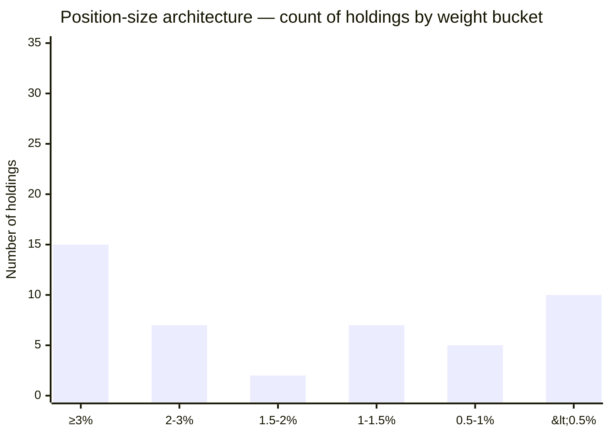
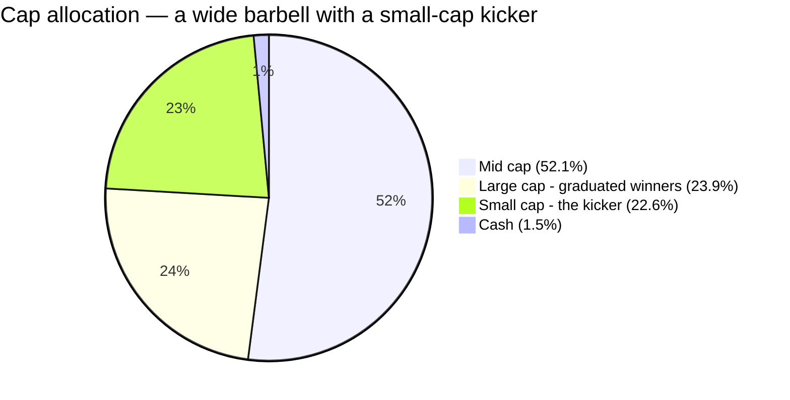
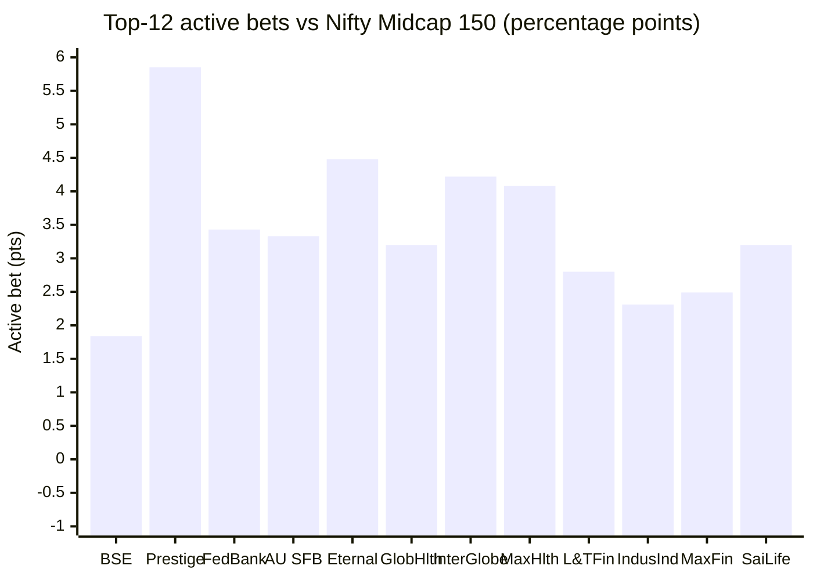
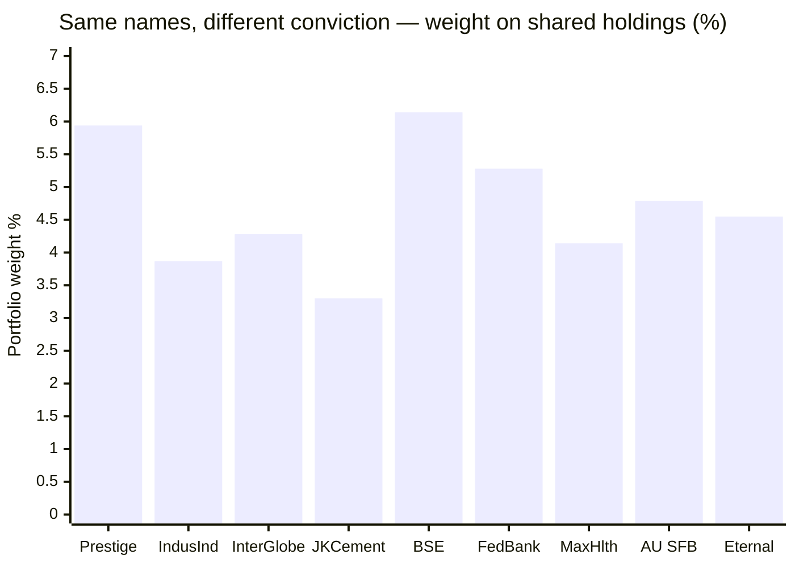
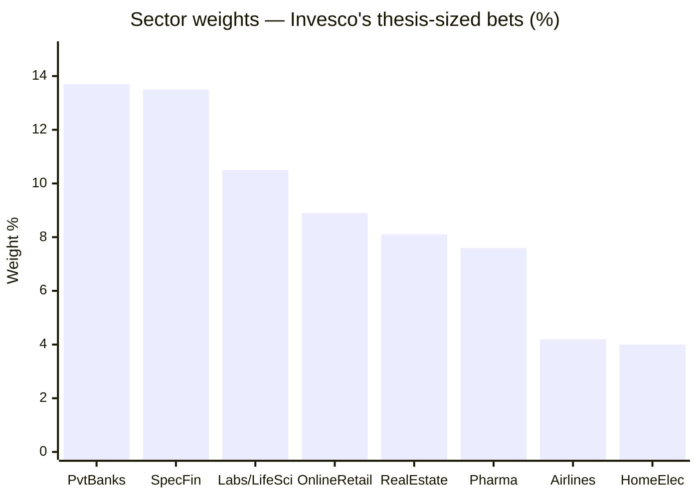

# Module 3: Portfolio DNA — Invesco India Midcap Fund

## Module 3 Score: ~4.0 / 5 (provisional)

---

## Raw Data (Compiled Across Sources, as of 03-Jul-2026 / 31-Mar-2026 factsheet)

| Metric | Value | Source |
|--------|-------|--------|
| **Equity holdings** | **44–46 stocks** (98.5% equity) | AMC factsheet (44) / Tickertape holdings API snapshot (46) |
| Cash & equivalents | ~1.5% (Triparty Repo 1.43% + net receivables 0.03%) | Tickertape holdings API |
| **Top-10 concentration** | **46.7%** — **double Nippon's 23.1%** | Computed from full holdings |
| Top-3 / Top-5 / Top-20 | 17.1% / 26.3% / 75.6% | Computed (Groww confirms top-5 26.3%) |
| Largest holding | **BSE Ltd, 6.05%** | Computed |
| Median / smallest position | ~1.9% / 0.12% | Computed |
| **Active share vs Nifty Midcap 150** | **79.5%** — the highest of any fund studied | Computed vs the Motilal index fund's live 150 constituents |
| Holdings inside the index | 23 of 46 = 63.4% of equity weight | Computed |
| **Active share vs Nippon** | **75.3%** (despite 23 shared names) | Computed — see Same Pond, Opposite Philosophies |
| Cap allocation (Tickertape bands) | Mid 52.1% / Large 23.9% / **Small 22.6%** | Tickertape screener |
| **Portfolio turnover** | **28%** (0.28, 1-year) | **Official AMC factsheet, Mar-2026** |
| Portfolio PE (trailing / forward FY26E) | **49.4 / 26.94** | Tickertape (trailing) / AMC factsheet (forward, harmonic mean) |
| Max granular sector | **Private Banks, 13.7%** | TT sector distribution (May-2026) |
| Financials cluster | **~30.6%** | Computed from TT sector distribution |
| Managers | **Amit Ganatra (Sep-2023) + Aditya Khemani (Nov-2023)** | AMC factsheet |
| AUM trajectory | ₹9,895 Cr (Mar-2026) → ₹12,397 Cr (Jul-2026): **+25% in 4 months** | AMC factsheet / TT |

**Data provenance & gaps:** full 46-position holdings with exact weights from Tickertape's holdings API; the index reference is the **Motilal Nifty Midcap 150 Index Fund's own live constituents** (150 names with weights), so the active-share computation compares two real, investable books. Nippon (M_NIGW), PP FlexiCap (M_PARO) and DSP Small Cap (M_DSPSM) pulled the same way for overlap. **This module has no material data gap:** turnover (28%), forward PE (26.94), holdings count (44) and cap metrics are cross-confirmed from the **official Invesco AMC factsheet (March-2026)**, fetched via the curl + browser-headers method once the current URL pattern (`invesco-mf-factsheet---{month}-2026.pdf`) was located. The only reconciliation note is holdings count (44 factsheet vs 46 TT snapshot — different disclosure dates).

---

## The Core Thesis — A High-Conviction Growth Book, the Structural Anti-Nippon

Invesco's portfolio is what *aggressive* mid-cap investing looks like at ₹12,397 Cr: a **44-stock concentrated book with 79.5% active share (the highest of any fund studied), a top-heavy architecture (top-10 46.7%), several thesis-sized sector bets (financials ~30.6%, healthcare ~18%, real estate ~8%), a growth tilt (trailing PE 49.4), the index's hottest name as its single biggest overweight, a wide barbell with a 22.6% small-cap kicker, and 28% turnover — double Nippon's.** It is the exact portfolio Module 1's episodic offensive alpha and Module 2's 108%/95% current-era capture predicted. And it settles two things the prior modules left open: the closet-index question never even arises (79.5% AS), and — because these holdings are entirely the new team's construction — **Module 3 is the clean attribution window that M1 and M2, forced to blend three departed managers' books, never had.**

---

## ⭐ The Active-Share Verdict — 79.5%, the Highest Studied

Where Nippon's Module 3 had to *rescue* the fund from a closet-index concern (R² 95%), Invesco starts from the opposite end. The computation (Σ|w_fund − w_index| ÷ 2, both books normalized to 100% equity):

| Measure | Value | Rubric position |
|---------|-------|-----------------|
| **Active share** | **79.5%** | >60% = genuinely high-conviction; Invesco is *decisively* above the bar — the most active book in the repo |
| Overlap with index (names) | 23 of 46 stocks | |
| Overlap with index (weight) | 63.4% in-index / **36.6% off-index** | The off-index third is pure personality |

For context: Nippon 54.1% ("moderately active"); the study plan's closet-index fail line is <35%. **Invesco is not remotely a closet indexer — it is the cleanest active-fee justification in the study.** Where Nippon's R²-95 / 54%-AS combination left a lingering "am I paying 0.62% for near-index exposure?" question for Module 4 to settle, Invesco's 79.5% AS at 0.49% removes that question entirely: whatever else is true, you are unambiguously buying active management, and a lot of it.

Reconciliation with Module 2's R² of 91%: high R² and 79.5% active share coexist because the active bets are still *within the band's factor* — Invesco accepts midcap beta wholesale (beta ~1.0) and spends an outsized risk budget (6.4% TE, ~45% more than Nippon) on name and sector selection inside it. High-R², high-AS, high-TE is the statistical picture of **conviction-active** — the mirror image of Nippon's index-aware discipline.

---

## ⭐ The Conviction Architecture — Top-Heavy, the Anti-Nippon

The single clearest structural contrast in the whole study is the shape of the position pyramid:

| Position size | Invesco (count) | Nippon (count) |
|---------------|-----------------|----------------|
| ≥3% | **15** | 0 (max 3.32%) |
| 2–3% | 7 | 8 |
| 1.5–2% | 2 | 15 |
| 1–1.5% | 7 | 17 |
| 0.5–1% | 5 | 33 |
| <0.5% | ~10 | 23 |

Nippon's book was a **pyramid** — conviction diffused across a wide base of ~56 sub-1% positions the giant could trade without price impact. **Invesco is an inverted pyramid: 15 positions at 3%+ and a top-10 of 46.7%.** The top five alone (BSE 6.05, Prestige 5.85, Federal Bank 5.20, AU SFB 4.72, Eternal 4.48) are 26.3% of the fund. This is a book where individual picks *can* carry — or sink — the fund: the structural source of both the +20.8pt 2024 alpha (M1) and the 2026-dip amplification (M2). Under the study rubric, top-10 of 46.7% draws a concentration flag (>45%), while the 44-stock count sits at the sweet-spot maximum (40–70 = ideal). It is deliberate concentration, competently sized — the opposite of Nippon's deliberate breadth.

---

## Asset Allocation — Near-Fully Invested, No Buffer (M2 Confirmed)

| Asset class | Weight |
|-------------|--------|
| Equity | **98.5%** |
| Cash & equivalents | ~1.5% |
| Debt / other | 0% |

Quarterly history (Mar-2025 → May-2026) shows equity oscillating 97.5%–99.8% — **no tactical cash, ever**, exactly like Nippon. Module 2's "no structural buffer" finding is confirmed at the holdings level: all downside protection (or, in the current era, its absence) is selection-based. The one Dec-2025 uptick to 2.5% cash is noise, not timing. For a concentrated growth book this matters more than for Nippon's breadth machine: there is nothing but the stock picks between the fund and a band drawdown, and the picks are a PE-49 growth basket.

---

## Cap Allocation — A Wide Barbell With an Aggressive Small-Cap Kicker

| Band (Tickertape classification) | Invesco | Nippon | What's actually in Invesco's |
|----------------------------------|---------|--------|------------------------------|
| Mid cap | **52.1%** | 58.1% | The 65% mandate engine (see honesty note) |
| Large cap | **23.9%** | 27.7% | Graduated winners: Eternal, Trent, ABB India, InterGlobe Aviation, Max Healthcare |
| **Small cap** | **22.6%** | 12.9% | **The kicker:** Aditya Infotech, KIMS, Craftsman Automation, Ethos, Corona Remedies, Dr Agarwal's, Bansal Wire, WeWork India |
| Cash | ~1.5% | 1.3% | |

**Mandate-honesty note:** TT's 52.1% "midcap" uses TT's own bands, not AMFI's — the regulatory ≥65% test uses AMFI's semi-annual list, and 63.4% of equity weight sits inside the actual Midcap-150 constituents, with the fund under live SEBI categorization. So the mandate is met, but only just: **only ~52% is strictly mid, with a wide barbell around it.**

Both funds run a barbell, but the *shape* differs decisively. Nippon's was ballast-heavy (28% large > 13% small) — a **dampener**, consistent with its 90% down-capture. **Invesco's is nearly symmetric with a much bigger small-cap leg (22.6%)** — precisely the "small-cap kicker" the study plan flags as "structurally riskier at identical 'mid-cap fund' labels." This is the holdings-level confirmation of Module 2's elevated volatility and the deferred 22.6%-smallcap risk row: the effective portfolio risk sits above the category label because the flexibility sleeve points *up* the risk spectrum, not down. The "mid cap" name undersells the aggression — you own a mid-cap core with a genuine small-cap growth sleeve bolted on.

---

## ⭐ Band Positioning — Liquid-End Tilt, But by Choice, Not Size *(new reading)*

Splitting the in-index 63% by index-weight rank (a proxy for market-cap rank 101→250):

| Band segment | Invesco | Nippon | Reading |
|--------------|---------|--------|---------|
| "Ranks 101–150" (top-50 index, mega-mid) | **39.1%** | 40.1% | The liquid center of gravity |
| "Ranks 151–200" (middle-50) | 16.6% | 19.9% | Moderate presence |
| "Ranks 201–250" (bottom-50, deep mids) | **6.8%** | 7.9% | Nearly abandoned |
| Off-index (large + small + new listings) | 36.6% | 32.1% | The barbell |

The split is nearly identical to Nippon's — but the *interpretation flips*, and that is the point. For Nippon at ₹47,415 Cr, abandoning the deep band was **size-forced** (2% of AUM = ₹950 Cr won't fit in a rank-230 name without moving it). For Invesco at ₹12,397 Cr, a 2% position is only ~₹248 Cr — it *could* build meaningful deep-band positions, and chooses not to. **Its liquid-end tilt is stylistic, not a capacity constraint:** growth-momentum names cluster in the larger, hotter mega-mids, and Invesco's "small" aggression lives *off-index* in the 22.6% small-cap sleeve rather than in deep index mids. Two decision-tree consequences: (1) Invesco's tilt will *not* worsen with AUM the way Nippon's structurally must — a genuine advantage; (2) but the deep-band alpha end (the mandate's highest-octane segment) is left on the table by preference.

---

## Top 20 Holdings — Stock-by-Stock, as Active Bets

Every peer picks from the same 150 names, so each position is most informative **relative to its index weight**:

| # | Holding | Weight | Index wt | **Active bet** | 3M change | Note |
|---|---------|--------|----------|----------------|-----------|------|
| 1 | **BSE Ltd** | 6.05% | 4.21% | **+1.84** | **+1.28** | **Overweights the index's biggest, hottest name — and adds to it** (the anti-Nippon; see below) |
| 2 | **Prestige Estates** | 5.85% | off-index | +5.85 | +0.85 | The real-estate thesis anchor |
| 3 | Federal Bank | 5.20% | 1.77% | +3.43 | −1.01 | Being trimmed after a run |
| 4 | AU Small Finance Bank | 4.72% | 1.39% | +3.33 | −0.57 | |
| 5 | **Eternal (Zomato)** | 4.48% | off-index | +4.48 | **+3.15** | Graduated platform winner, being *added hard* |
| 6 | Global Health (Medanta) | 4.39% | 1.20%? | ~+3.2 | +0.28 | Hospital compounder |
| 7 | **InterGlobe Aviation** | 4.22% | off-index | +4.22 | +0.20 | Large-cap airline — graduated |
| 8 | **Max Healthcare** | 4.08% | off-index | +4.08 | −0.76 | The healthcare thesis, large-cap graduate |
| 9 | L&T Finance | 3.90% | 1.1%? | ~+2.8 | −0.55 | Specialized finance |
| 10 | IndusInd Bank | 3.81% | 1.50% | +2.31 | +0.28 | |
| 11 | Max Financial | 3.59% | 1.10% | +2.49 | −0.57 | Life insurance |
| 12 | Glenmark Pharma | 3.42% | ~1.0% | ~+2.4 | −0.28 | |
| 13 | JK Cement | 3.25% | 0.9%? | ~+2.4 | −0.34 | |
| 14 | Sai Life Sciences | 3.20% | off-index | +3.20 | +0.09 | CDMO — healthcare thesis |
| 15 | **SRF Ltd** | 3.09% | off-index | +3.09 | **+3.09** | **Brand-new position** (fresh full buy) |
| 16 | **Trent Ltd** | 2.61% | off-index | +2.61 | −0.16 | Large-cap retail graduate |
| 17 | Amber Enterprises | 2.51% | off-index | +2.51 | −0.52 | Contract-manufacturing kicker |
| 18 | ABB India | 2.49% | off-index | +2.49 | +0.99 | Large-cap capex, being added |
| 19 | Hexaware | 2.37% | ~1.0% | ~+1.4 | −0.17 | Midcap IT |
| 20 | Aditya Infotech | 2.37% | off-index | +2.37 | +0.78 | Small-cap kicker, being built |

**Two signatures worth naming:**
1. **Every big bet is a big overweight** — no material top-20 underweight anywhere. This is the conviction book: it doesn't hold names to match the index, it holds them to beat it. Off-index names (Prestige +5.85, Eternal +4.48, InterGlobe +4.22, Max Healthcare +4.08) are among the very largest bets.
2. **Active quarterly repositioning** — Eternal +3.15 and BSE +1.28 added hard, SRF and Torrent Power brought in as fresh full positions, Swiggy trimmed −2.36, HDFC AMC / Go Digit / Coforge exited entirely. This is a book being actively steered, not left to compound (the 28% turnover made visible).

---

## ⭐ The BSE Overweight — Offense at Single-Stock Resolution *(new section)*

The most elegant M1→M2→M3 tie-in in the study. The index's largest, hottest constituent is **BSE Ltd** (4.21% index weight, the band's momentum darling):

| Fund | BSE weight | Active bet | 3M action |
|------|-----------|-----------|-----------|
| **Invesco** | **6.05%** | **+1.84 overweight** | **+1.28 (adding into strength)** |
| Nippon | 3.32% | −0.89 underweight | +0.06 (flat) |

Invesco doesn't just hold the hottest name — it makes it the single biggest position and buys *more* into strength. This is the portfolio-level fingerprint of everything the prior modules found: the momentum embrace (M2's 122% current-era up-capture), the PE premium (49 vs 29), the offense build (M1's episodic aggression). Where Nippon's signature single-stock bet is a *defensive underweight* of BSE — the mechanism of its PE discount and 2018/2022/2024 protection — Invesco's is an *aggressive overweight* of the same name. **Two funds, one 150-stock pond, opposite instincts, visible in one stock.**

---

## ⭐ Invesco vs Nippon — Same Pond, Opposite Philosophies *(new section — the decision-tree centerpiece)*

Module 2 found the two finalists are R² 90% correlated (near-duplicate risk factors). This module shows *how* they can be near-duplicate risk yet completely different portfolios — and why the midcap slot is a genuine either/or:

- **They share 23 names — 62% of Invesco's weight.** (By contrast, Invesco vs PP FlexiCap: 3 names / ~0% real overlap; vs DSP Small Cap: 3 names / 7.5%.)
- **Yet their active share to *each other* is 75.3%** — because the shared names are sized radically differently:

| Shared name | Invesco | Nippon | Gap |
|-------------|---------|--------|-----|
| Prestige Estates | 5.94% | 1.09% | **+4.85** |
| IndusInd Bank | 3.87% | 0.00% | +3.87 |
| InterGlobe Aviation | 4.28% | 0.56% | +3.71 |
| JK Cement | 3.30% | 0.33% | +2.96 |
| BSE | 6.14% | 3.37% | +2.77 |
| Federal Bank | 5.28% | 2.53% | +2.74 |
| Max Healthcare | 4.14% | 1.38% | +2.76 |
| AU Small Finance Bank | 4.79% | 2.31% | +2.47 |
| Eternal | 4.55% | 2.20% | +2.35 |

*(Invesco weights shown; Nippon's are 0.0–3.4% on the same names.)*

**The resolution of the "R²-90%-but-different" paradox:** the correlation comes from shared band/factor exposure; the divergence comes from concentration and sizing. Invesco takes overlapping raw material and builds a **concentrated growth-momentum book**; Nippon builds a **diversified, froth-disciplined value-tilt** from many of the same names. For the decision tree this is the whole ballgame — Module 2 established the midcap sleeve is a single slot; this module defines the choice: **concentration + momentum + manager-dependence (Invesco) versus breadth + valuation discipline + process (Nippon), not a diversification blend.** Holding both would be paying two fees for one factor built two ways.

---

## Sector Allocation — Several Thesis-Sized Bets (the Anti-Nippon)

| Granular sector (TT, May-2026) | Invesco | Nippon |
|--------------------------------|---------|--------|
| Private Banks | **13.7%** | 6.6% |
| Specialized Finance | 13.5% | 8.1% |
| Labs & Life Sciences | 10.5% | 4.0% |
| Retail – Online | 8.9% | 3.8% |
| Real Estate | 8.1% | small |
| Pharmaceuticals | 7.6% | 7.2% |
| Airlines | 4.2% | 0.6% |
| Home Electronics & Appliances | 4.0% | 4.4% |
| **Financials cluster** | **~30.6%** | ~23% |
| **Healthcare + Pharma cluster** | **~18.1%** | ~11% |

Where Nippon carried *no* thesis-sized sector bet (max granular 8.1%, sector risk ≈ index), **Invesco runs at least four**: financials ~30.6% (above the 25% rubric line), healthcare/pharma ~18%, real estate ~8% (Prestige, Phoenix, Sobha, Max Estates, WeWork India — a genuine property-cycle bet), and online retail ~8.9% (Eternal, Swiggy, Nykaa, Vishal Mega Mart — a consumption/platform bet). This is a portfolio with *views*, and those views are a meaningful part of the return engine — the flip side is sector-concentration risk Nippon deliberately refused. **A financials or real-estate air-pocket would hurt Invesco in a way it structurally could not hurt Nippon.** This is the holdings-level source of the higher variance measured in Module 2, and the reason the sector-diversification sub-score is the module's weakest.

---

## Portfolio Turnover — 28%: Double Nippon, Still Moderate

| Fund | Turnover | Implied avg holding period |
|------|----------|----------------------------|
| Nippon Growth | 13.66% | ~7 years |
| **Invesco** | **28%** (official, Mar-2026) | **~3.5 years** |
| PP FlexiCap | ~20% | ~5 years |
| DSP Small Cap | ~25–30% | ~3.5–4 years |

Three implications: (1) **an actively-steered book** — the 3-month deltas show real repositioning (fresh full buys SRF +3.09 and Torrent Power +1.93; full exits HDFC AMC −1.46, Go Digit, Coforge; heavy adds Eternal +3.15, BSE +1.28; big trim Swiggy −2.36) — conviction expressed through quarterly decisions, not Nippon's glacial recycling; (2) **still low in absolute terms** (study rubric: <50% = excellent), so it doesn't read as churn-for-churn's-sake — this is an engaged manager, not a trader; (3) **but every trade at a growth-momentum name carries impact cost** the low-turnover Nippon avoids, and at a rising AUM (+25% in four months) the trading footprint grows. The turnover is the physical signature of the difference between a conviction book (Invesco) and a process book (Nippon).

---

## ⭐ The Trailing-vs-Forward PE Reconciliation *(new section)*

An important nuance that contextualizes — without erasing — the M1/M2 "most expensive book" flag. Two different, both-honest numbers:

| Measure | Value | Meaning |
|---------|-------|---------|
| **Tickertape trailing PE** | **49.4** (category 33.8) | You pay a +46% premium on *current* earnings — the M1/M2 flag stands |
| **AMC forward PE (FY26E, harmonic mean)** | **26.94** | On *next year's* expected earnings, the book is *below* the trailing category multiple |
| P/B | 4.14 | Also rich — same growth story |

The 49→27 gap is the market pricing in heavy earnings growth for these holdings — the definition of a growth book. The honest reading: **this is not a valuation bubble (forward 27 is reasonable) but a growth bet.** The returns depend on the earnings ramp materializing: if it does, the trailing 49 collapses toward 27 as earnings catch up; if it doesn't, Module 2's de-rating risk fires (a 50× book can compress 30% without an earnings miss). So the "expensive" flag should be read as **"priced for growth delivery," not "overvalued"** — with the standing caveat that the delivery is precisely what you are underwriting. This is the exact inverse of Nippon's PE *discount*, which was a valuation *buffer*.

---

## Cash Holding — 1.5%: No Dry Powder, By Policy

Equity has stayed 97.5–99.8% through the 2024–25 correction, the 2026 dip, and the fund's inflow surge. Like Nippon, Invesco takes **no timing positions** — pure stock selection, always invested. For a concentrated PE-49 growth book this is a sharper exposure than for Nippon's breadth machine: **nothing cushions a band drawdown except a growth basket that Module 2 showed now falls at ~100% down-capture.** Module 2's "no buffer" finding, confirmed as deliberate policy.

---

## ⭐ This Book IS the New Team — The Clean Attribution Window *(new section)*

The single most useful M3 fact for the study's central problem. Modules 1 and 2 had to *blend* three departed managers' books to compute trailing statistics — the attribution caveat that held both scores below their raw level. But the **current holdings are entirely Ganatra + Khemani's construction**: 44 concentrated names, PE-49 growth tilt, the BSE overweight, the 22.6% small-cap kicker, thesis-sized financial/healthcare/realty bets, 28% turnover, and Khemani's visible Motilal-Oswal growth-momentum pedigree in every line. So unlike M1/M2, **Module 3 gives a clean, unblended read on the people we are actually evaluating** — and it *confirms* the M2 era-split finding at holdings resolution: this looks nothing like Gokhale's defensive breadth book (M2's 71%-down-capture era). The fund genuinely changed character with the team, and the portfolio is the proof.

Two forward flags this raises: (1) **AUM trajectory** — ₹9,895 Cr (Mar-2026) → ₹12,397 Cr (Jul-2026), **+25% in four months**, big inflows chasing 2024–25 performance; at a 44-stock concentrated book that flow has to be deployed into an already-top-heavy structure (Module 4 owns this); (2) **key-person exposure** — a conviction book built by a two-person team ~2.8 years in is far more manager-dependent than Nippon's process-run breadth machine that survived two star exits without a NAV scar (Module 5 owns this).

---

## ⭐ Cross-Sleeve Overlap — Name vs Factor *(decision-tree feed)*

Computed name-by-name against the current books of the portfolio's existing sleeves:

| vs existing sleeve | Common names | **Name-overlap weight** | Return correlation (M2) |
|--------------------|--------------|--------------------------|--------------------------|
| PP FlexiCap (relevant positions) | 3 | 10.9% *(but PP holds Eternal only 0.04% — real double-exposure ≈ 0%)* | R² 66% |
| DSP Small Cap | 3 | 7.5% (Max Financial, Amber, Apar) | R² 86% |

Same verdict as Nippon: you would own almost none of the same *companies* twice, yet (Module 2) the sleeves still fall together — a midcap sleeve duplicates the India-equity *factor*, not *holdings*. **Return-enhancer, not diversifier.** The one genuine duplication is *within the midcap decision itself* — 62% name overlap with Nippon — which is exactly why Module 2 called it a single slot. *(Feeds decision_tree.md; not scored on the fund.)*

---

## AUM Scalability — Room Today, Pressure Building (M4 Preview)

| Observation | The size logic |
|-------------|----------------|
| 44 stocks, top-10 46.7% | A concentrated book *by choice* — it can be, at ₹12K Cr |
| BSE 6.05% (₹750 Cr position) | Still tradable in a liquid mega-mid |
| Deep band playable but unused | Not size-forced (contrast Nippon) — a stylistic choice |
| **+25% AUM in 4 months** | The capacity clock starts: concentrated growth books scale worse than breadth books |
| 28% turnover at rising AUM | Trading footprint grows with the corpus |

Unlike Nippon — whose *entire* portfolio was the capacity answer (96 names, nothing >3.3%, size-forced diffusion) — Invesco has genuine room today at ₹12,397 Cr, comfortably inside the study's ₹3,000–25,000 Cr sweet spot. But a 44-stock concentrated book with thesis-sized bets has a *lower* natural capacity ceiling than a 96-stock breadth machine, and the +25%/4-month inflow is the first pressure on it. **Module 4's job: the AUM growth rate against the concentration the strategy depends on** — the mirror of Nippon's active-share-decay tripwire.

---

## The Manager Fingerprint — A Conviction Book, Not a Process Book (M5 Preview)

Everything in this module points one way: **this is a star-run conviction portfolio, the structural opposite of Nippon's team-and-process breadth machine.** 44 names, 28% turnover, thesis-sized sector bets, a growth PE premium, the hottest name as the biggest overweight — this is one high-conviction growth manager's book (Khemani, with Ganatra), built in ~2.8 years, bearing no resemblance to the defensive book of the prior era. That is a double-edged M5 setup: it produced the +20.8pt 2024 alpha and the study's highest active share, but it makes the fund's future far more dependent on these two specific people than Nippon's was on any individual. Module 5 tests whether that dependence is earned.

---

## Comparison with Studied Funds

| Dimension | **Invesco (MidCap)** | Nippon (MidCap) | DSP Small Cap | PP FlexiCap | Franklin US (u/l) |
|-----------|---------------------|--------------------|--------------|-------------|--------------------|
| Stocks | **44** | 96 | 83 | ~25 core | 84 |
| Top-10 | **46.7%** | 23.1% | ~30% | ~35% | 44.2% |
| Max sector (granular) | **13.7%** (financials cluster ~31%) | 8.1% | 34.2% consumer-cyc | concentrated | 55.5% tech |
| Turnover | 28% | **13.7%** | ~25–30% | ~20% | low |
| Cash | 1.5% | 1.3% | 8.4% | 5–15% | ~1% |
| Active share | **79.5%** ⭐ highest studied | 54.1% | high (SC universe) | very high | low-ish |
| Overlap w/ existing sleeves | 0–7.5% by name | 2–5% | — | — | high (PP's US book) |
| PE character | **Growth (49 trailing / 27 fwd)** | Value (29, discount) | — | value-tilt | growth |
| Personality | **High-conviction growth, top-heavy, thesis bets** | Breadth + graduation escalator | Sector-thesis conviction | Allocation fortress | Diversified-away-from-index |

**Placement:** Invesco is the family's purest **high-conviction active** book — highest active share, sweet-spot stock count, thesis-sized bets, growth tilt — the structural opposite of both Nippon (breadth, no thesis, value) and Franklin (the low-active-share lag machine). Its nearest analog in spirit is DSP Small Cap's sector-thesis conviction, but expressed through concentration and a growth PE rather than a single consumer-cyclical bet. It is exactly the portfolio a talented growth manager builds when handed a mid-cap mandate and told to beat the index — with all the upside and single-point-of-failure risk that implies.

---

## Points For / Points Against (Portfolio Angle)

### ✅ Points For

- **Active share 79.5% — the highest of any fund studied**; the cleanest active-fee justification in the repo (the closet-index question never arises)
- **Stock count of 44 — dead in the 40–70 sweet spot** (Nippon's 96 was size-forced diffusion)
- **Genuine conviction, expressed off-index** — every big bet is a big overweight; the top-10 are real active positions, not index matching
- **Turnover 28% — low in absolute terms** (~3.5-year holding), official AMC-confirmed
- **The book is unambiguously the current team's** — Module 3 is the clean attribution window M1/M2 lacked, and it confirms the era-change thesis at holdings level
- **Genuine room at ₹12,397 Cr** — sweet-spot AUM, liquid-end tilt by choice not constraint (won't decay with size the way Nippon's must)
- Near-zero name duplication with the existing PP + DSP sleeves

### ❌ Points Against

- **Top-10 concentration 46.7% — double Nippon's, above the rubric flag line** — genuine single-name risk; a blow-up in any top-5 name (26.3% of the fund) materially dents the NAV
- **Several thesis-sized sector bets** — financials ~30.6% (above the 25% line), healthcare ~18%, real estate ~8% — sector-air-pocket risk Nippon structurally avoids; the source of the higher variance
- **22.6% small-cap kicker** — the flagged aggressive configuration; effective risk above the "mid cap" label
- **Growth PE premium (49 trailing)** — returns underwrite an earnings ramp; de-rating risk if it doesn't arrive
- **A conviction book is key-person exposed** — far more manager-dependent than Nippon's process machine, and the team is only ~2.8 years in (→ M5)
- **AUM +25% in four months** — the capacity clock has started on a strategy that scales worse than breadth (→ M4)
- No structural buffer — 98.5% equity, all protection selection-based (and M2 showed the current book's protection is thin)

---

## Module 3 Scorecard

| Sub-dimension | Weight | Score | Reasoning |
|---------------|--------|-------|-----------|
| **Active share vs Midcap 150** | **Critical** | **5.0** | 79.5% — highest studied; decisively high-conviction; the cleanest active-fee justification in the study |
| Mid-cap mandate honesty | Medium | **3.5** | 63% in actual index constituents, but only ~52% strictly mid; the 22.6% small + 24% large barbell dilutes pure band exposure |
| Quality/intent of the 35% sleeve | High | **3.5** | A coherent growth-conviction barbell — but the small-cap leg is the flagged aggressive config, and 28% turnover is less a "documented consistent stance" than Nippon's escalator |
| Band positioning | Medium | **3.5** | 39/17/7 liquid-end tilt by *choice* (won't decay with AUM — a plus) — but the deep-band alpha end is left on the table |
| Top-10 concentration | Medium | **3.5** | 46.7% — above the 25–35% ideal; genuine concentration risk, though also the alpha source |
| Number of stocks | Low | **5.0** | 44 — dead in the 40–70 sweet spot |
| Sector diversification | Medium | **3.0** | Financials ~30.6% breaches the 25% line; healthcare ~18%, real estate ~8% — several thesis-sized bets add real concentration risk |
| Turnover | Medium | **5.0** | 28% — low absolute (~3.5-year holding), official-confirmed, though double Nippon |

**Module 3 Score: ~4.0 / 5** — a genuinely active, high-conviction, well-constructed growth book that *earns* its fee on the study's best active share and sits in the stock-count sweet spot, scored a touch below Nippon's 4.1 because the concentration (top-10 46.7%, financials ~30.6%, thesis-sized sectors) makes it a **higher-variance portfolio with real single-point-of-failure risk** — the exact trade-off against Nippon's safe-but-capped breadth. Where Nippon's M3 *released* the M1/M2 closet-index conditionality, Invesco's M3 *confirms* the M1/M2 story: this is unmistakably the new team's aggressive growth construction, and the score is honest about both its conviction (a strength) and its concentration (a risk).

---

## Comparative Module 3 Scores

| Fund | Category | M3 Score | Portfolio character |
|------|----------|----------|--------------------|
| PP FlexiCap | FlexiCap | ~4.3 | Allocation fortress (cash/foreign/value) |
| Nippon Growth Mid Cap | MidCap | ~4.1 | Breadth machine + graduation escalator at scale |
| **Invesco India Midcap** | MidCap | **~4.0** | High-conviction growth — top-heavy, thesis bets, highest active share studied |
| DSP Small Cap | SmallCap | ~3.8 | Sector-thesis conviction (consumer-cyclical) |
| Franklin US Opp | International | 3.3 | Diversified-away-from-index (the lag mechanism) |
| PGIM Global | International | 3.2 | 39-stock thematic barbell (~35% semis) |

---

## SIP Implication

1. **You are buying a manager and a set of views, not a process or an index** — 44 concentrated names, thesis-sized sector bets, the hottest name as the biggest position. The SIP thesis depends on the current team's stock-picking staying good; that is both the upside (the 2024 alpha) and the key-person risk (unlike Nippon, which survived two manager exits).
2. **Expect a wider outcome band than the category** — the concentration and growth tilt that produced +20.8pt 2024 alpha are the same features that amplified the 2026 dip; monthly statements will swing harder in both directions than a breadth fund's.
3. **The "mid cap" label undersells the aggression** — only ~52% is strictly mid; a 22.6% small-cap kicker and a growth PE mean this behaves like a "mid-cap-plus" high-octane sleeve. Size your other sleeves accordingly, and note it overlaps 62% by name with Nippon — you would not hold both.
4. **The tripwires to monitor: sector concentration, AUM, and turnover of the top names.** If financials/healthcare/realty grow further past their thesis size, if AUM keeps compounding 25%/quarter into the concentrated book, or if a top-5 name blows up, the higher-variance profile becomes the story. The active share (79.5%) is the reassurance that you are at least paying for real management while you carry that risk.

---

## One-Line Verdict

> **Invesco's portfolio is the study family's purest high-conviction growth build: 44 stocks with the highest active share measured anywhere in this repo (79.5%), a top-heavy architecture (top-10 46.7%, 15 positions above 3%), several thesis-sized sector bets (financials ~31%, healthcare ~18%, real estate ~8%), a growth tilt (trailing PE 49 / forward 27), the index's hottest name (BSE) as its single biggest overweight — the exact anti-Nippon at single-stock resolution — a wide barbell with a 22.6% small-cap kicker, and 28% turnover (double Nippon, still moderate). It shares 23 names with Nippon yet runs 75.3% active share to it: same pond, opposite philosophies, which makes the midcap sleeve a genuine either/or. Above all it is unambiguously the new team's construction — the clean attribution window M1/M2 lacked — confirming the fund changed character with its managers. Scored just below Nippon on the concentration/variance it accepts for its conviction. Provisional: ~4.0/5.**

---

*Module 3 completed: July 4, 2026 | Portfolio DNA | Holdings: Tickertape holdings API (46 equity positions with weights, quarterly snapshots, 3M deltas) | Index reference: Motilal Oswal Nifty Midcap 150 Index Fund live constituents — active share computed between two real books (Invesco 79.5% vs index, 75.3% vs Nippon) | Overlap: PP FlexiCap (M_PARO) & DSP Small Cap (M_DSPSM) & Nippon (M_NIGW) same source | Turnover 28%, forward PE 26.94, holdings 44, cap metrics from OFFICIAL Invesco AMC factsheet March-2026 (curl+browser-headers; URL pattern invesco-mf-factsheet---{month}-2026.pdf) | Managers: Ganatra (Sep-2023) + Khemani (Nov-2023) | Provisional M3 Score: ~4.0/5 (M1/M2 attribution confirmed at holdings level; standing tripwires: sector/name concentration, AUM growth → M4, key-person → M5)*
