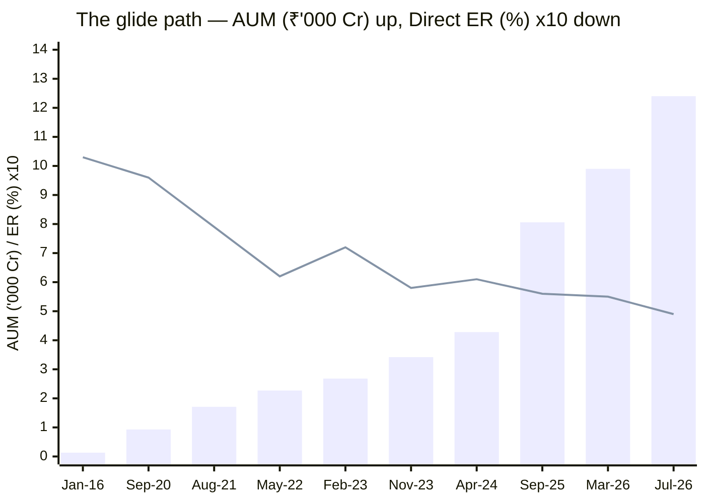
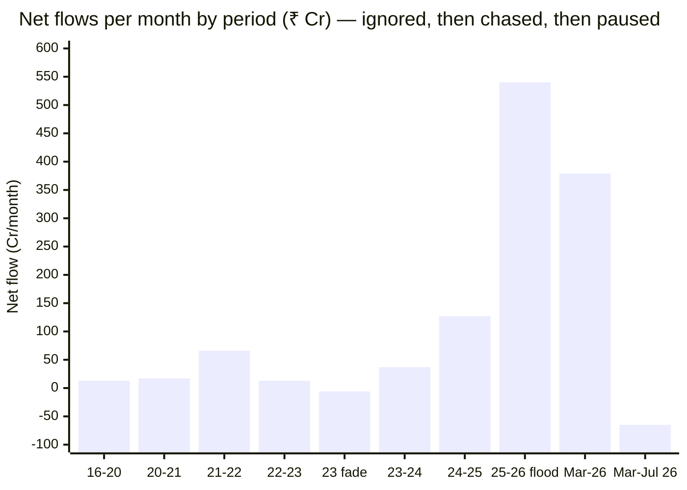

# Module 4: Cost & AUM Impact — Invesco India Midcap Fund

## Module 4 Score: ~4.2 / 5 (provisional)

---

## Raw Data (Official AMC Factsheets + Archived Sources + Computed, as of 03-Jul-2026)

| Metric | Value | Source |
|--------|-------|--------|
| **ER (Direct, official)** | **0.55%** (Mar-2026 factsheet; Feb-2026: 0.54%) | AMC ⭐ |
| ER (Regular, official) | **1.72%** | AMC |
| ER (Tickertape, Jul-2026) | 0.49% | Current feed — see reconciliation |
| **ER glide (Direct)** | **1.03% (2016) → 0.96 (2020) → 0.49–0.55 (2026) ≈ −50%** — with a 2022–23 wobble | Official 2016 factsheet + archived Groww series + official 2026 |
| **AUM** | ₹9,895 Cr (31-Mar-2026, official; AAuM ₹10,296 Cr) → **₹12,397 Cr (Jul-2026, TT)** | AMC / TT |
| **AUM trajectory** | ₹127 Cr (2016) → ₹935 (2020) → **₹3,418 (Nov-2023, the handover)** → ₹12,397 Cr — **13× in 5.8y; 3.6× under the new team** | Official + archived Groww (Wayback) |
| **Net flows (peak episode)** | **≈ +₹540 Cr/month, Sep-2025 → Feb-2026** — ~**5% of corpus per month** | Computed (AUM − NAV decomposition) |
| **Net flows (Mar → Jul-2026)** | **≈ flat to −₹65 Cr/month — the chase paused after the 2026 dip** | Computed |
| Official portfolio turnover | 0.28× (Mar-2026); 0.31× (Feb-2026) | AMC |
| **Official cap split (AMFI basis)** | **Mid 64.61% / Small 17.88% / Large 16.56%** — parked at the 65% floor | AMC ⭐ |
| Exit load | **Tiered: nil ≤10% of units within 1yr; 1% on excess; nil after 1yr** | AMC |
| Fee premium vs index fund | 0.55 − 0.20 = **0.35%** (0.29% on TT's 0.49) | Computed |
| Verified net alpha (M1) | +2.88%/yr (6.8y) / +5.11%/yr (13.4y) — **episodic, manager-coupled** | Computed (two proxies) |
| **Fee-for-alpha margin** | **≈ 8–10× arithmetic — best studied; warranty = 32 months of one team** | Computed |
| **Ownership** | **IIHL (Hinduja) 60% / Invesco 40% — JV completed 02-Nov-2025**; same CEO (Saurabh Nanavati); AMC AAUM ₹1.48L Cr, 16th-largest | AMC press release / news |
| Gating history | None — no capacity action ever taken on this fund or by this AMC | — |
| Min investment | ₹1,000 lumpsum / ₹500 SIP | AMC |

**Data provenance (this module's toolkit):** current officials from the **Invesco factsheet PDFs for Feb-2026 and Mar-2026** (URL pattern `invesco-mf-factsheet---{month}-2026.pdf`; older months of that pattern return an HTML error page); the deep history from the **Jan-2016 Religare Invesco factsheet** (₹127 Cr, ER 1.03/2.55); and the 2020–2025 AUM/ER series recovered from **Wayback-archived Groww snapshots** (Sep-2020, Aug-2021, May-2022, Feb-2023, Nov-2023, Apr-2024, Sep-2025) — a new method for this repo, used because Invesco's historical factsheet URLs are inconsistently named. Bonus validations: the Mar-2026 factsheet's 3Y ratios (SD 5.28% monthly ≈ 18.3% annualized, beta 1.00, rf 6.98% MIBOR) corroborate Module 2's computed figures, and its AMFI-basis cap split (64.61% mid) settles Module 3's mandate-honesty question with official data.

---

## What Module 4 Is Really Asking

Nippon's M4 was a collision: best fee deal in the studies × worst capacity trajectory in the shortlist. **Invesco's M4 is close to the mirror image**, and its two questions are different:

1. **Is the fee justified?** Arithmetically, even more emphatically than Nippon's — an 8–10× margin of verified alpha over the fee premium (§ Fee-for-Alpha). But the *warranty* behind that arithmetic is the weakest in the studies: the alpha is episodic, and the margin rests on one team's 32 months.
2. **Is the size sustainable?** Comfortably — the only top-4 shortlist fund with years of capacity runway (§ The 2029 Problem). But the flow history shows the proportionally hottest performance-chase measured in any study, and the AMC just changed majority owners to a group with an explicit growth mandate (§ IIHL).

Where Nippon's score was the collision of a 5 and a 2.5, Invesco's is a broad plateau of 4s: nothing here is the study's best-ever, nothing is alarming — and the module hands its one real question (*whose alpha backs the fee?*) to Module 5.

---

## ⭐ The Glide Path — ₹127 Cr to ₹12,397 Cr, and the Fee Halved *(the decade table)*

| Date | AUM (₹ Cr) | ER Direct | ER Regular | Source |
|------|-----------:|----------:|-----------:|--------|
| Jan-2016 | **127** | 1.03% | 2.55% | Official factsheet |
| Sep-2020 | 935 | 0.96% | — | Archived Groww |
| Aug-2021 | 1,706 | 0.79% | — | Archived Groww |
| May-2022 | 2,273 | 0.62% | — | Archived Groww |
| Feb-2023 | 2,678 | **0.72%** ⚠ wobble | — | Archived Groww |
| **Nov-2023 (the handover)** | **3,418** | 0.58% | — | Archived Groww |
| Apr-2024 | 4,280 | 0.61% | — | Archived Groww |
| Sep-2025 | 8,062 | 0.56% | — | Archived Groww |
| Feb-2026 | 10,772 | 0.54% | 1.71% | **Official** |
| Mar-2026 | 9,895 | 0.55% | 1.72% | **Official** |
| Jul-2026 | **12,397** | 0.49% (TT) | 1.46% (TT) | Tickertape |

> Bars = AUM in ₹'000 Cr; line = Direct ER ×10 (1.03% plots as 10.3). AUM 98× in a decade, fee −50%.

Three observations this table settles:

1. **The 98× decade, now with real numbers.** The 10Y CAGR the screening rewarded was earned almost entirely below ₹3,000 Cr. The new team inherited ₹3,418 Cr in Nov-2023 and now runs 3.6× that. *(This corrects Module 1's AUM-context estimate for 2024 — the +20.8-alpha year was run at ~₹3,400–4,300 Cr, even smaller than the ~₹5–6K Cr guessed there; M1's table has been patched.)*
2. **The fee glide is real but not clean.** ER *rose* 0.62 → 0.72 through FY23 — a small fund repricing on a small base — before resuming downward. Compare Nippon's monotonic 1.42 → 0.62. Good story, noisier execution.
3. **The handover row is the module's pivot:** everything below ₹3,418 Cr belongs to departed managers; everything above it — 72% of today's corpus — arrived on the new team's watch, most of it in one six-month episode (§ AUM Story).

---

## Expense Ratio — Cross-Source Reconciliation

| Source | ER (Direct) | Explanation |
|--------|-------------|-------------|
| **AMC factsheet, Mar-2026** | **0.55%** | The latest official print ⭐ |
| Tickertape (Jul-2026 screener) | 0.49% | Plausibly the newest TER cut as AUM crossed ₹12K Cr — or a base-TER basis; either way the *current* number |
| Archived Groww (Sep-2025) | 0.56% | Consistent with the official glide |
| VRO (Regular) | 1.46% | vs official 1.72% — same staleness/basis noise, other plan |

Honest usage throughout this module: **0.55% official, 0.49% likely current** — the premium over the 0.20% index fund is **0.29–0.35% either way**, and no conclusion changes across that range. (Same lesson as Nippon's 0.62/0.73/0.82 spread: aggregators quote different months of a moving series; per-fund verification against the factsheet is mandatory.)

---

## SEBI TER Positioning — Headroom Left (the Anti-Nippon Row)

At ₹12,397 Cr, Invesco is **not** at the SEBI TER floor — the slab structure leaves visible room for the Direct ER to drift toward ~0.40–0.45% as AUM compounds. Contrast Nippon, whose M4 concluded "the fee-glide story is over" at the regulatory floor. Two implications: (1) future scale benefits can still be passed through here; (2) the *incentive* to pass them through now sits with a new majority owner (§ IIHL) whose growth mandate actually favors low Direct fees as an asset-gathering tool. One watch-item: the Regular plan at 1.72% sits near its slab maximum — the AMC monetizes distribution hard (§ Direct vs Regular).

---

## ⭐ The Fee-for-Alpha Test — The Biggest Number With the Weakest Warranty *(the module's critical row)*

The study plan's central M4 question: does verified alpha exceed the fee premium over the investable 0.20% index fund?

| Component | Invesco | Nippon (the benchmark case) |
|-----------|---------|------------------------------|
| Fee premium over index fund | **0.29–0.35%/yr** | 0.42%/yr |
| Verified **net** alpha (M1, two proxies) | +2.88%/yr (6.8y) / +5.11%/yr (13.4y) | +2.0–2.1%/yr (13.4y) |
| **Arithmetic margin of safety** | **≈ 8–10×** — the best in the four studies | ≈ 5× |
| **Warranty behind the alpha** | ⚠ **Episodic and manager-coupled** — 2020–23 printed ≈0 to −8.5 alpha under the prior team; the current margin rests on Ganatra + Khemani's 32 months | Era-stable across 3 manager regimes — a process warranty |

**The correct framing: Nippon's 5× margin is a warranty on a process; Invesco's 8–10× margin is a bet on two people.** The same 0.3% premium bought *negative* alpha for the four years before Nov-2023 — the fund's own Oct-2023 factsheet (M1's smoking-gun exhibit) showed it losing to this very benchmark on every window. Bigger expected value, much wider confidence interval; Module 5 owns the interval.

### The 10-Year SIP in Rupees (₹20K/month, 18% gross market assumption, same convention as Nippon M4)

| Scenario | Net return | Corpus | vs index fund |
|----------|-----------|--------|---------------|
| Index fund (0.20%) | 17.80% | ₹61.2L | — |
| **Invesco, alpha dies completely** (0.49–0.55% ER) | 17.45–17.51% | **₹60.0–60.2L** | **−₹1.0–1.2L** (the worst case) |
| Invesco, **half** the 6.8y alpha persists (+1.44) | 18.95% | ₹65.1L | **+₹3.9L** |
| **Invesco, full 6.8y alpha persists (+2.88)** | 20.39% | **₹70.3L** | **+₹9.1L** |
| Invesco **Regular** (1.72%) | 16.28% | ₹56.3L | **−₹4.9L** |

**The asymmetry: risk ~₹1L to win ~₹9L — the most favorable payoff table in the repo** (Nippon: −₹1.4L / +₹4.7L; Franklin: pay more, get less, guaranteed by history). Even the half-alpha scenario clears the index by ~₹4L. Every rupee of that upside is conditional on the team that has managed this fund since late 2023 still managing it — and still delivering — in year eight.

---

## Direct vs Regular — A 1.17% Gap, the Widest Studied

Official 1.72% Regular vs 0.55% Direct = **1.17%/yr — nearly double Nippon's 0.63% gap** and approaching Franklin's 1.35% all-in drag. Over the 10-year SIP: ₹60.0L vs ₹56.3L ≈ **₹3.7–4L of corpus for a form-filling choice** — the largest Direct-vs-Regular penalty measured in these studies. Forward flag: with IndusInd/Hinduja distribution muscle now behind the AMC, the Regular plan is what gets pushed to the mass market — irrelevant to a Direct investor's costs, but it tilts the fund's future flow mix toward hotter, sold-not-bought money.

---

## Exit Load — Second-Lightest Studied, With a Useful Carve-Out

| Fund | Exit load |
|------|-----------|
| Nippon Growth | 1% / 1 month ⭐ lightest |
| **Invesco Midcap** | **Nil up to 10% of units within 1yr; 1% on excess; nil after 1yr** |
| DSP Small Cap | 1% / 12 months |
| Franklin US | 1% / 12 months |
| PP FlexiCap | 2% <1yr, 1% <2yr — the strictest |

The 10%-free window is genuinely investor-friendly — annual rebalancing or partial exits cost nothing — and the 1-year tail gives slightly more hot-money friction than Nippon's 30-day door. But neither midcap fund runs a real behavioral filter (PP's punitive load is the deliberate contrast), and the flow table below shows the hot money found the door anyway.

---

## ⭐ The AUM Story — Nobody Wanted It, Then Everybody Did, Then the Dip

### Flow Decomposition (market vs money, computed AUM − NAV)

| Period | AUM (₹ Cr) | NAV effect | **Implied net flow** | Monthly rate |
|--------|-----------|-----------|----------------------|-------------:|
| Jan-2016 → Sep-2020 | 127 → 935 | 1.67× | +₹722 Cr | **+₹13 Cr/mo** |
| Sep-2020 → Aug-2021 | 935 → 1,706 | 1.64× | +₹177 Cr | +₹17 Cr/mo |
| Aug-2021 → May-2022 | 1,706 → 2,273 | 0.96× | +₹636 Cr | +₹66 Cr/mo |
| May-2022 → Feb-2023 | 2,273 → 2,678 | 1.13× | +₹107 Cr | +₹13 Cr/mo |
| **Feb-2023 → Nov-2023** | 2,678 → 3,418 | 1.30× | **−₹55 Cr — outflows** | **−₹6 Cr/mo** |
| Nov-2023 → Apr-2024 | 3,418 → 4,280 | 1.20× | +₹178 Cr | +₹37 Cr/mo |
| Apr-2024 → Sep-2025 | 4,280 → 8,062 | 1.39× | +₹2,133 Cr | +₹127 Cr/mo |
| **Sep-2025 → Feb-2026** | 8,062 → 10,772 | 0.97× | **+₹2,924 Cr** | **+₹540 Cr/mo** ⚠ |
| Feb-2026 → Mar-2026 | 10,772 → 9,895 | 0.88× | +₹386 Cr | +₹379 Cr/mo |
| **Mar-2026 → Jul-2026** | 9,895 → 12,397 | 1.27× | **−₹200 Cr** | **≈ −₹65 Cr/mo** |

**Three readings:**

1. **Read the left half twice.** Through 2016–2021 — the fund's best-ever alpha era, compounding 20%+ on a boutique base — investors gave it **₹13–17 Cr a month**. Then **outflows in Gokhale's final months** (Feb→Nov-2023: −₹6 Cr/mo), i.e., the money left at the exact bottom of the fund's form, right before the +20.8-alpha 2024. This is the same flow-performance mismatch Nippon's M4 documented (outflows through its best 2020–22 stretch) — now confirmed as an investor-behavior constant across both study funds.
2. **The flood was proportionally the hottest chase measured in any study.** Nippon's ₹673 Cr/month is 1.4% of its ₹47K Cr corpus; **Invesco's peak ₹540 Cr/month was ~5% of its corpus per month — 3.5× the relative intensity** — arriving after the +45% 2024 printed the category's shiniest trailing CAGRs, continuing into the January-2026 top, and still arriving (+₹379 Cr/mo) as the NAV fell 12% in March.
3. **The chase is paused, not over.** Mar→Jul-2026 flows went flat-to-negative after the −15.6% whipsaw. The tap opens with trailing returns and closes with drawdowns — textbook pro-cyclical retail money, on a fund whose current investor base mostly arrived *after* the performance it bought.

### ⭐ The Module 3 Flow Correction *(honest revision — the Nippon-M4 precedent, repeated)*

Module 3 read "AUM +25% in four months (₹9,895 → ₹12,397)" as an inflow surge that "started the capacity clock." The decomposition shows that growth was **almost entirely the April-2026 NAV rebound (1.27×); net flows were flat to slightly negative.** The corrected statement: **the capacity clock is not running at this instant — it is coiled.** The Sep-25→Feb-26 episode proves the tap opens at ~5% of corpus per month whenever the trailing numbers gleam; the trailing numbers gleam again today (+24.7% quarter, at ATH). Expect the flood to resume with the next strong print. *(Same class of correction Nippon's M4 made to its M3's turnover framing — the factsheet/flow series keeps outranking single-snapshot inference.)*

### Forced Deployment — No Strain Today; Watch Position Inflation, Not Stock Count

- At peak flows: ₹540 Cr × 65% mandate ≈ **₹350 Cr/month into the band ≈ 1.5 median positions (₹235 Cr) per month** — comfortably absorbable in the liquid Midcap-150 band.
- **The ownership ceiling is distant:** a 2% position = ₹248 Cr ≈ 2.5% of a ₹10,000 Cr deep-mid — nowhere near SEBI's 10% cap (Nippon's identical arithmetic printed 9.5%: the deep band is closed to the giant, open to Invesco).
- **But the capacity symptom differs by construction.** A 96-stock breadth machine absorbs flows by adding names; a **44-stock conviction book absorbs them by inflating existing bets** — and the 3M deltas already show it (BSE +1.28pts while already the largest holding). **Invesco's decay metric is top-10 concentration drifting up under flow pressure** — the strategy quietly leveraging itself — not Nippon's active-share decay. Tripwire defined accordingly.

---

## ⭐ The Mandate-Floor Discovery — Official AMFI Split *(patches Module 3's open row)*

The Mar-2026 factsheet prints the official AMFI-basis market-cap split — the number Module 3 had to approximate from Tickertape's bands:

| Band (AMFI basis, official) | Weight |
|------------------------------|--------|
| **Mid cap** | **64.61%** (≈65.2% of equity) |
| Small cap | 17.88% |
| Large cap | 16.56% |

**The fund runs at the regulatory minimum** — parked at the 65% floor to maximize the flexible sleeve, with that sleeve tilted small (17.9% vs 16.6% large on official basis). This confirms M3's "wide barbell, small-cap kicker" reading with official data, and sharpens it: the fund keeps *every basis point* of flexibility the mandate allows, and points more of it at the aggressive end. (TT's 52.1% "mid" was TT's own classification; the AMFI number is the compliance-relevant one and shows the mandate honored — by exactly the minimum.)

---

## ⭐ The 2029 Problem vs the 2027 Problem — Runway, Quantified

| Input | Invesco | Nippon |
|-------|---------|--------|
| Current AUM | ₹12,397 Cr | ₹47,415 Cr |
| Sweet-spot ceiling (study ladder) | ₹25,000 Cr | exceeded long ago |
| Study's Stage-1 elimination cap | ₹50,000 Cr | months away |
| At resumed peak flows + ~15% NAV growth | **crosses ₹25K Cr around ~2029; the ₹50K cap is 2030s** | crosses ₹50K Cr ~late-2026 |

**On pure runway, Invesco has years where Nippon has months — the clearest single M4 advantage in the head-to-head.** The symmetric honesty: Invesco's strategy (44 stocks, conviction sizing, thesis bets) has a *lower natural capacity ceiling* than breadth investing, so its sweet spot genuinely ends at the ladder's ₹25K Cr, and a resumed 5%-of-corpus flow rate compounds fast. The fund is nowhere near constrained today; the study's re-screen in 2027 will pass it comfortably. What it lacks is any institutional signal that flows would ever be managed (next section).

### The Gating Culture Question

Invesco AMC has **no capacity action in its history** — no gate, no lumpsum cap, no soft close, on any fund. Nippon at least carries the Small-Cap-2023 gating precedent (and still hasn't applied it to its midcap flagship); DSP has three voluntary restrictions (the family gold standard). And the new majority owner (§ below) bought a 16th-ranked AMC explicitly to scale it — **a flow-gathering mandate is the institutional opposite of a gating culture.** Expect growth to be pursued, not curbed. At ₹12K Cr this costs nothing; at ₹25K Cr it will be the live question.

---

## ⭐ The Ownership Change — IIHL/Hinduja Owns 60% as of 02-Nov-2025 *(new section — unique to this fund)*

The SmallCap study's carry-forward question ("the Hinduja AMC-sale overhang") resolved during this study's window:

| Fact | Detail |
|------|--------|
| Deal | **IIHL (IndusInd International Holdings, Hinduja group, Mauritius) acquired 60% of Invesco Asset Management India** |
| Timeline | Announced Apr-2024 → SEBI approval Sep-2025 → **JV completed 02-Nov-2025** |
| Structure | IIHL 60% / Invesco 40%; **both joint sponsors**; Invesco retains brand licensing |
| Continuity | Same CEO (Saurabh Nanavati, since 2008), same investment team, stated same process |
| Scale | AMC AAUM ₹1.48L Cr (Sep-2025 qtr, incl. offshore advisory) — **16th-largest; subscale, bought to grow** |

M4-relevant readings (M5/M6 own the people and governance angles):

1. **Timing overlaps everything.** The fund's screening-crown period, the flow flood, and the 2026 whipsaw all straddle the transition — the "same team, same process" assurance is being live-tested right now.
2. **Fee policy, mildly positive:** a growth-hungry majority owner favors *cutting* Direct fees to gather assets (the TT 0.49 print may be the first evidence) while monetizing Regular distribution hard (the 1.72% / 1.17%-gap is consistent).
3. **Flow mix, mildly negative:** IndusInd/Hinduja group distribution reach means a Regular-plan retail push — more pro-cyclical, sold-not-bought money into a conviction book.
4. **Retention is the real risk, and it belongs to Module 5:** the fee case (§ Fee-for-Alpha) is a bet on Ganatra + Khemani; ownership changes are precisely when fund managers get poached or leave. Their post-deal tenure is the single most decision-relevant thing to monitor.
5. **Group-context footnote for Module 6:** IndusInd Bank's 2025 derivatives-accounting episode sits in the same promoter group — a governance-file item, not a fund-level fact.

---

## Peer Cost & AUM Matrix (7 Shortlisted)

| Fund | ER% (TT-dated ⚠) | AUM (Cr) | AUM ladder position | Fee-for-alpha status |
|------|------------------|----------|--------------------|--------------------|
| Mahindra Manulife | 0.42 | 4,866 | Small-agile | untested (their study) |
| Edelweiss | 0.48 | 16,849 | Sweet spot | untested |
| **Invesco (official 0.55)** | **0.49** | **12,397** | **Sweet spot, ~3+ yrs runway** ⭐ | **✅ 8–10× arithmetic; ⚠ 32-month warranty** |
| HSBC | 0.56 | 14,249 | Sweet spot | untested |
| Nippon (official 0.62) | 0.73 | 47,415 | ⚠ Constraint zone, months from cap | ✅ proven, 5×, 13-year warranty |
| ICICI Pru | 0.87 | 7,789 | Sweet spot, pricey | untested |
| Sundaram | 0.88 | 13,687 | Sweet spot, priciest | untested |

The head-to-head in one line: **Invesco sells a cheaper ticket on a faster train with a newer driver and a brand-new railway owner; Nippon sells a slightly pricier ticket on a proven train that is running out of track.**

---

## Comparison with Studied Funds

| Dimension | **Invesco (MidCap)** | Nippon (MidCap) | DSP Small Cap | PP FlexiCap | Franklin US |
|-----------|---------------------|--------------------|--------------|--------------|-------------|
| Direct ER (official) | **0.49–0.55%** | 0.62% | 0.64% | ~0.53–0.63% | ~1.35% true all-in |
| Fee vs investable index | **+0.29–0.35% for +2.9% (episodic) alpha** ✅ | +0.42% for +2.0% (stable) ✅ | no clean index alt | positive alpha ✅ | +1.15% for *negative* alpha ❌ |
| AUM | ₹12.4K Cr, **13× in 5.8y** | ₹47.4K Cr, 8.5× in 6y | ₹17.9K Cr | ₹1.41L Cr | ₹5.9K Cr |
| Peak flows (relative) | **~5%/mo of corpus** ⚠ hottest studied | 1.4%/mo | gated/managed | large but absorbable | growing |
| Gating record | **None; new owner has growth mandate** | none (AMC gated SC sibling) | **3 voluntary restrictions** ⭐ | none | n/a |
| Exit load | Tiered nil-10%/1yr | **1%/1mo** ⭐ | 1%/12mo | strictest | 1%/12mo |
| Scale benefit shared | ER −50% over decade, headroom left | ER −56%, at floor | partial | yes | no |
| Ownership stability | ⚠ **Majority owner changed Nov-2025** | stable since 2019 (Nippon Life) | stable | founder-run | stable |
| Capacity verdict | **Best runway in top-4; hottest relative flows; zero gating culture** | Best deal, worst trajectory | managed | segment-shielded | unconstrained |

**Placement:** Invesco holds the best *position* on the cost-capacity map of any fund in the four studies — sweet-spot size, cheap, years of runway. What it uniquely lacks: Nippon's alpha warranty, DSP's stewardship record, PP's structural shielding, and — as of Nov-2025 — a long-tenured stable owner.

---

## Points For / Points Against — Cost & AUM

### ✅ Points For

- **The most favorable fee-for-alpha arithmetic in the four studies** — 0.29–0.35% premium vs +2.9%/yr (6.8y) verified net alpha; ~8–10× margin; SIP payoff −₹1L worst / +₹9.1L base
- **Sweet-spot AUM (₹12,397 Cr) with ~3+ years of runway** — the only top-4 shortlist fund without a live capacity question (Nippon crosses the study's own cap within months)
- **ER halved over the decade (1.03 → 0.49–0.55) with glide headroom remaining** — not yet at the TER floor, and the new owner's incentives favor further Direct cuts
- **Deep band open** — 2% = ₹248 Cr vs Nippon's 9.5%-ownership arithmetic; the liquid-end tilt is choice, not constraint (M3), so it won't mechanically decay with size
- **Second-lightest exit load studied** with a genuinely useful 10%-free carve-out
- Official mandate compliance confirmed (AMFI 64.61% mid) — with maximum legal flexibility retained
- Turnover 28–31% official — moderate; no hidden-churn cost issue

### ❌ Points Against

- **The weakest alpha warranty behind any good fee case** — the 8–10× margin rests on 32 months of one team; the same premium bought negative alpha 2020–23; the payoff table is a bet on two people (→ M5)
- **The proportionally hottest pro-cyclical flow chase measured in any study** — peak +₹540 Cr/mo ≈ 5% of corpus/month, arriving after the +45% year, pausing only when the NAV fell; the investor base mostly bought the past, not the process
- **Majority ownership changed 02-Nov-2025** — continuity stated, but fee policy, flow mix and (critically) manager retention now sit with a growth-focused new owner being live-tested
- **Zero gating culture, and a new owner with a scaling mandate** — no institutional signal that flows would ever be managed; DSP-style stewardship is structurally unlikely here
- **The widest Direct-Regular gap studied (1.17%)** — a distribution-monetization machine; irrelevant to Direct investors' costs but indicative of the AMC's flow priorities
- **Position inflation is the live capacity symptom** — flows deploy into existing conviction bets (BSE +1.28pts while already #1); top-10 concentration under flow pressure is the metric to watch
- The fee-glide history includes a 2022–23 *rise* (0.62 → 0.72) — scale pass-through here is real but not the clean monotonic story Nippon showed

---

## Module 4 Scorecard

| Sub-dimension | Weight | Score | Reasoning |
|---------------|--------|-------|-----------|
| Expense Ratio (Direct) | High | **4.0** | 0.49–0.55% official — solidly in the 0.45–0.65 band; −50% decade glide with headroom left; noisier history than Nippon's |
| **ER vs verified alpha (the index-fund test)** | **Critical** | **4.5** | 8–10× arithmetic margin — the best studied — docked half a point for the warranty: episodic alpha, 32-month team, negative-alpha precedent under the prior regime |
| AUM position on the ladder | High | **5.0** | ₹12,397 Cr — dead-center sweet spot; the only top-4 fund with years of runway; deep band arithmetically open |
| Active-share trend as AUM grew | High | **4.0** | Single reading (79.5%, highest studied); M3 showed the liquid tilt is stylistic not size-forced; new decay metric defined (position inflation), not yet triggered |
| Forced deployment | Medium | **4.0** | Peak ₹350 Cr/mo into a liquid band ≈ 1.5 median positions — absorbable; concentration-inflation symptom flagged |
| Exit load | Low | **4.5** | Tiered nil-≤10%/1yr — second-lightest, investor-friendly carve-out |
| AUM trajectory | Low (plan) / elevated here | **3.0** | The hottest relative flow chase measured (5%/mo), pro-cyclical, paused only by a drawdown; new owner has a growth mandate and no gating culture exists |
| *IIHL ownership modifier* | *Modifier* | **−** | *Majority owner changed Nov-2025 mid-performance-window; continuity stated but unproven; retention risk handed to M5* |

**Module 4 Score: ~4.2 / 5** — the best cost-and-capacity *position* in the shortlist, which is precisely the module where Nippon (3.6) pays its size bill: Invesco takes its first clear module win here. Held below 4.5 by the warranty problem behind the fee case, the flow-chase intensity, and the ownership transition. In one line: **a genuinely cheap fee and years of capacity runway — for an alpha engine whose warranty is 32 months old, at an AMC whose new owner was bought to gather assets, not to gate them.**

---

## Comparative Module 4 Scores

| Fund | Category | M4 Score | Cost/AUM character |
|------|----------|----------|--------------------|
| **Invesco India Midcap** | MidCap | **~4.2** | Cheap, sweet-spot, years of runway; weakest alpha warranty; new owner |
| DSP Small Cap | SmallCap | ~3.9 | Mid-priced, gold-standard gating |
| PP FlexiCap | FlexiCap | ~3.8 | Cheap, giant but segment-shielded |
| Nippon Growth Mid Cap | MidCap | ~3.6 | Proven fee-for-alpha; unmanaged capacity trajectory |
| Franklin US Opp | International | 2.8 | Double-layer 1.35% for negative alpha |

Running module totals: **Invesco 4.3 / 4.1 / 4.0 / 4.2** vs **Nippon 4.2 / 4.4 / 4.1 / 3.6**.

---

## SIP Implication

1. **Use the Direct plan — more than for any fund yet studied.** The 1.17% Regular gap costs ≈ ₹4L per ₹24L invested over 10 years, the widest penalty measured. If a distributor sells you this fund, that pitch costs a third of the expected alpha.
2. **The fee is not a reason to hesitate; the warranty is.** At 0.49–0.55% vs the 0.20% index fund, you risk ~₹1L (alpha dies) to win ~₹9L (history persists) on a 10-year ₹20K SIP — but "history" here means 32 months of the current team. The fee decision and the Module 5 manager verdict are the same decision.
3. **Know what the crowd did:** the money now in this fund overwhelmingly arrived after the 2024–25 performance. A SIP started today is *early* relative to that crowd only if the process persists — the exact conditionality again.
4. **The monitoring list is short and specific:** (a) top-10 concentration under flow pressure (the position-inflation symptom), (b) AUM vs the ₹25,000 Cr sweet-spot ceiling (~2029 at resumed peak flows), (c) any post-IIHL departure of Ganatra or Khemani — that last one is the tripwire that converts this fund's best-in-study payoff table into its worst-case row overnight.

---

## One-Line Verdict

> **Invesco Midcap's Module 4 is the mirror image of Nippon's: where the giant offered the best-warranted fee deal on the worst capacity trajectory, Invesco offers the best cost-and-capacity position in the shortlist — an official 0.49–0.55% Direct ER (halved over the decade the fund grew 98×, with glide headroom left), a 0.29–0.35% premium covered 8–10× by historical alpha with the most favorable SIP payoff table in the repo (−₹1L worst / +₹9L base), sweet-spot AUM with years of runway, an open deep band, and a genuinely investor-friendly tiered exit load — attached to the weakest alpha warranty in the studies (one team, 32 months, negative-alpha precedent before them), the proportionally hottest pro-cyclical flow chase measured (5% of corpus per month at the peak, paused only by the 2026 dip), a brand-new majority owner (IIHL/Hinduja, 60%, Nov-2025) with a growth mandate and no gating culture, and the widest Direct-Regular gap studied (1.17%). Provisional: ~4.2/5.**

---

*Module 4 completed: July 4, 2026 | Cost & AUM Impact | Primary sources: official Invesco factsheets Feb-2026 & Mar-2026 (ER 0.54–0.55 Direct / 1.71–1.72 Regular; AUM ₹10,772 → ₹9,895 Cr; turnover 0.31 → 0.28; AMFI cap split 64.61 mid / 17.88 small / 16.56 large) + Jan-2016 factsheet (₹127 Cr, 1.03/2.55) | 2020–2025 AUM/ER series via Wayback-archived Groww snapshots (new method: Wayback CDX + `id_` raw fetch, __NEXT_DATA__ JSON parse) | Flow decomposition computed (AUM − MFAPI NAV effect): +₹13 → −₹6 (Gokhale fade) → +₹540 (flood) → −₹65 Cr/mo (pause) | M3 flow correction issued (Mar→Jul AUM growth was NAV-driven); M1 AUM-context table patched (2024 run at ~₹3.4–4.3K Cr) | IIHL 60% JV completed 02-Nov-2025 (SEBI nod Sep-2025; AMC AAUM ₹1.48L Cr, 16th-largest) | SIP simulations: ₹20K/mo, 10y, 18% gross | Provisional M4 Score: ~4.2/5 (tripwires: top-10 inflation under flows; ₹25K Cr ~2029; post-IIHL manager retention → M5)*
