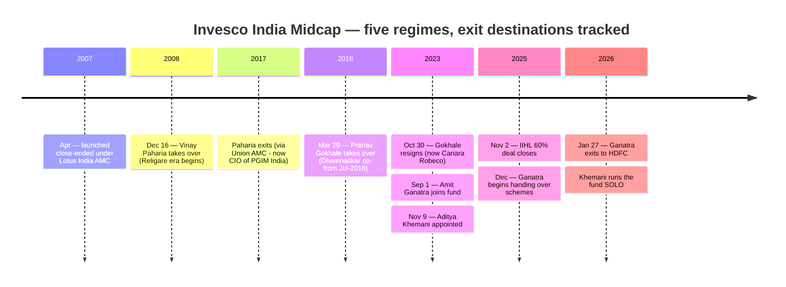
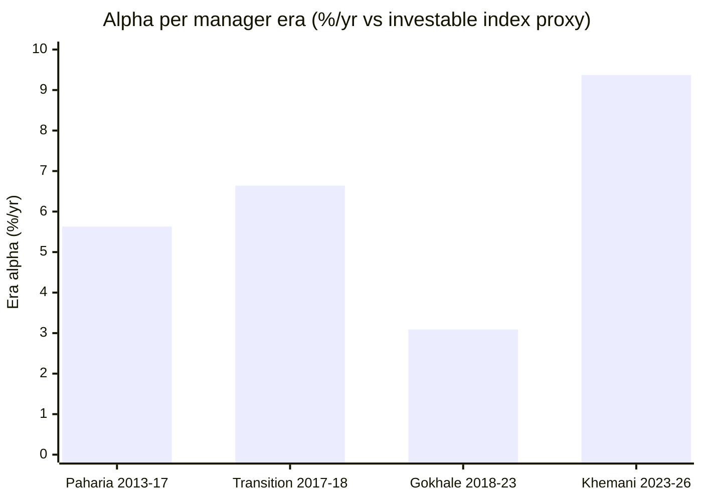

# Module 5: Fund Manager Quality — Invesco India Midcap Fund

## Module 5 Score: ~3.4 / 5 (provisional) — The Solo-Star Inversion

---

## Raw Data (Cross-Source Verified, as of 04-Jul-2026)

| Field | Value | Source |
|-------|-------|--------|
| **Current manager** | **Aditya Khemani — SOLO — since 09-Nov-2023 (~2.6 years)** | Official factsheets Feb/Mar-2026 (no co-manager listed) |
| Khemani's experience | 19 years; B.Com (Hons), PGDM IIM Lucknow | AMC factsheet / LinkedIn |
| **His full load** | **5 schemes: Midcap (solo), Large & Mid Cap (solo, Nov-2023), Business Cycle (solo, Feb-2025), Smallcap (co-, Badshah), Technology (co-, Hiten Jain, Sep-2024)** | Mar-2026 factsheet |
| Career | Morgan Stanley (~2005) → ICICI Pru → SBI MF (Mar–Sep 2007) → **HSBC AMC Oct-2007 → 2019 (12y, equity PM; credited with HSBC Midcap Equity Fund)** → **Motilal Oswal Oct-2019 → 20-Oct-2023** (MO Large & Midcap from launch + MO ELSS) → Invesco Nov-2023 | LinkedIn / aggregators / VRO |
| **⭐ Co-manager status** | **Amit Ganatra (co-manager Sep-2023 → ~Dec-2025) RESIGNED as Head of Equities eff. 27-Jan-2026 — joined HDFC AMC** | HDFC addendum / Dezerv / factsheet series |
| Predecessors & destinations | Paharia (Dec-2008 → ~2017; **now CIO, PGIM India**) · Gokhale (Mar-2018 → Oct-2023; **now Sr FM, Canara Robeco**) · Ganatra (co-, → **HDFC flagship funds**) | Factsheets / news / LinkedIn |
| Stated philosophy | Growth companies at "reasonable valuations"; "reasonably concentrated"; "significantly different from the benchmark"; "active overweight positions in all companies owned" | AMC one-pager |
| Individual SEBI record | Clean — all eras, all managers | Search-verified (nil adverse) |
| Skin in the game | Not publicly disclosed | Documented gap |

**Method note:** the manager timeline is reconstructed from the official factsheet series (Oct-2023 one-pager, Feb/Mar-2026 factsheets), the Jan-2016 Religare factsheet (Paharia "since 16-Dec-2008"), archived Groww snapshots (Ganatra still listed Sep-2025), and news/regulatory documents. Era alphas and all prior-fund records below are computed from MFAPI NAVs against investable index proxies — the Module 1 method throughout.

---

## ⭐ The Solo-Star Inversion — The Fourth Cell of the Study Family's 2×2 *(the framing section)*

The studies have now filled a complete continuity-versus-alpha matrix:

| | **Alpha delivered** | **Alpha not delivered** |
|---|---|---|
| **Manager continuity** | PP (Thakkar, 13y — 4.5) · DSP (Sambre, 14y — 4.3) | Franklin (Bowers, 19y — 3.4): *the stability paradox* |
| **No continuity** | Nippon (3 eras, alpha survived every handover — 3.5): *the instability paradox — a MACHINE* | — |

**Invesco fills the missing cell: no continuity, alpha delivered — but carried by the PERSON, not a machine.** Four separate analyses prove the fund has no manager-independent process: the calendar alphas flipped shape each era (M1), the capture fingerprint flipped (M2: 86% → 71% → 101% down-capture), the holdings bear no resemblance across eras (M3), and the era-alpha table below flips again. Nippon survived losing two stars without a NAV scar; **Invesco's history says the fund *becomes* whoever runs it.** That logic pins this module's score at or below Nippon's 3.5 — it has Nippon's discontinuity with none of Nippon's proven person-independence — however spectacular the current operator's numbers are. And they are spectacular.

---

## What Module 5 Is Really Asking

Every prior module deferred its biggest open question here:

1. **Is Khemani's +9.4%/yr alpha skill or regime?** (M1's warranty question, M4's fee-case question)
2. **Has he ever run money through a real bear as lead PM?** (M2's 122/101-capture question)
3. **Does he stay, post-IIHL?** (M4's tripwire — which has already half-fired)
4. **What is left if he leaves?** (M3's conviction-book question)

---

## ⭐ The Ganatra Exit — The Tripwire That Fired Before the Module Was Written *(breaking news)*

| Fact | Detail |
|------|--------|
| Role | **Director & Head of Equities, Invesco AMC India — 17-Jan-2022 to 27-Jan-2026** |
| On this fund | Co-manager 01-Sep-2023 → ~Dec-2025 (still listed on Groww Sep-2025; **absent from the Feb-2026 factsheet's Midcap page and from the entire Mar-2026 factsheet**) |
| Transition staffing | Nikhil Kale added to Ganatra's Manufacturing Fund w.e.f. 01-Dec-2025 — the handover began a month after the IIHL closing |
| Destination | **HDFC AMC — runs HDFC Flexi Cap and HDFC Focused (flagship-scale funds) w.e.f. 01-Feb-2026** |
| Timing | Resignation effective **~12 weeks after IIHL's 60% acquisition completed (02-Nov-2025)** |

Four readings:

1. **Module 4's fee-for-alpha table was a "bet on two people"; it is now a bet on one.** The factsheet lists no co-manager on this fund at all.
2. **The ownership-change risk materialized at the most senior level available:** the executive who joined in 2022, hired Khemani in 2023, and co-architected the turnaround left within a quarter of the new owner taking control — for the biggest fund-manager chair in the industry.
3. **The mitigants are real:** Taher Badshah (CIO since Jan-2017, 31y) remains above the vacated role; Khemani retained every fund responsibility with zero disruption to this scheme; and day-to-day, Midcap was always Khemani's book (Ganatra held it as oversight co-manager while running Contra/Flexi Cap/Manufacturing as his own).
4. **The precedent is set:** post-IIHL, senior people leave, and HDFC has demonstrated what a rival pays for this AMC's talent. The next name on that list is the only one that matters to this fund.

---

## The Complete Management Timeline — A Relay of Individuals

| Period | Lead | Exit destination |
|--------|------|------------------|
| Apr-2007 → Dec-2008 | Lotus-era team (close-ended) | AMC itself acquired |
| **Dec-2008 → ~2017** | **Vinay Paharia** | Union AMC → **CIO, PGIM India** |
| 2017 → Mar-2018 | Interim (Badshah CIO era begins Jan-2017) | — |
| **Mar-2018 → Oct-2023** | **Pranav Gokhale** (Neelesh Dhamnaskar co-, from Jul-2018) | **Sr FM, Canara Robeco** |
| Sep/Nov-2023 → Dec-2025 | **Khemani + Ganatra** | Ganatra → **HDFC AMC** |
| Jan-2026 → now | **Khemani, solo** | — |

**The alumni diaspora is a finding in itself:** this one fund's former managers now run equity money at three rival houses (PGIM, Canara Robeco, HDFC). The AMC develops or attracts genuine talent and consistently loses it — the institutional base rate against which Khemani's own retention must be priced (Module 6 owns the AMC-level reading).

---

## ⭐ The Era-Attribution Table — Every Era Made Alpha, Every Era Made a Different Fund *(the module's centerpiece, computed)*

| Era | Window | Fund CAGR | Index proxy | **Era alpha** | Shape |
|-----|--------|-----------|-------------|---------------|-------|
| **Paharia** (direct-era part) | Feb-2013 → Feb-2017 (4.1y) | 24.21% | 18.59% (M100 ETF) | **+5.63/yr** | Boutique stock-picking on ₹127–470 Cr; capture 106/86 |
| Transition | Mar-2017 → Mar-2018 (1.1y) | 18.24% | 11.61% | +6.64/yr | (13-month sliver) |
| **Gokhale** | Mar-2018 → Oct-2023 (5.6y) | 17.27% | 14.17% | **+3.09/yr** | **Front-loaded**: winter +11.7/+8.9, then 2020–23 ≈ −3/yr fade; capture 88/71; era Sharpe 0.57 |
| **Khemani** (w/ Ganatra to Dec-25) | Nov-2023 → Jul-2026 (2.6y) | **26.71%** | 17.34% (M150 index fund) | **+9.37/yr** | Pure offense: capture 122/101; the +20.8pt 2024 |

**Three readings:**

1. **Every full-era alpha is positive — even Gokhale's**, which averages a brilliant beginning against a four-year fade. That is the sharpest warning label in the table: **era averages hide trajectory.** An investor judging Gokhale by his full-era number in 2021 then spent three years underperforming, and the AMC's own Oct-2023 factsheet (M1's smoking-gun exhibit) shows where that ended. Khemani's +9.37 must be read with the same discipline: it is a 2.6-year average of a 32-month-old regime.
2. **The shape changed every time** — +5.6 defensive-boutique → +3.1 defence-decaying → +9.4 pure offense. Compare Nippon's era table: +4.1 → +3.0 with the *same* defensive fingerprint. Invesco's record is a relay of individuals; the era table is the fourth independent proof (after M1/M2/M3) that this fund is its operator.
3. **Khemani's +9.37/yr is the highest era alpha measured in either midcap study** — on the shortest window, in the friendliest regime his style has had since 2017.

---

## Manager Profile: Aditya Khemani — The Growth Specialist, Unleashed Late

### Career Timeline

| Period | Role | Relevance |
|--------|------|-----------|
| ~2005–2007 | Morgan Stanley Advantage Services → ICICI Prudential AMC → SBI MF (Sr Manager, equity research, Mar–Sep 2007) | Research formation |
| **Oct-2007 → 2019** | **HSBC AMC (12 years)** — rose to equity portfolio manager; aggregator sources credit him with the **HSBC Midcap Equity Fund** among others | **The possible bear-market apprenticeship** — 2008, 2011, 2013, 2018 all fall in this window; scheme-level attribution unverifiable (the fund was absorbed into the L&T-merger scheme in Nov-2022; its NAV history is no longer independently fetchable) ⚠ |
| **Oct-2019 → 20-Oct-2023** | **Motilal Oswal AMC** — MO Large & Midcap (from launch) + MO Long Term Equity (ELSS) | **His only fully attributable pre-Invesco lead record — quantified below** |
| **09-Nov-2023 →** | **Invesco — Midcap (solo) + 4 more schemes** | +9.37/yr era alpha |

Education: B.Com (Hons); PGDM, IIM Lucknow. 19 years total experience.

### ⭐ The Pre-Invesco Ledger — The Honesty Check on the "Khemani Magic" *(new section, computed)*

Motilal Oswal Large & Midcap, launch (22-Oct-2019) to his exit (20-Oct-2023) — almost exactly 4.0 years, MFAPI-computed vs a 50/50 UTI-Nifty-50 + Motilal-Midcap-150 index blend:

| Measure | MO L&M under Khemani | Index blend | Alpha |
|---------|----------------------|-------------|-------|
| **Full-era CAGR (4.0y)** | 21.61% | 20.69% | **+0.92/yr** |
| 2020 (COVID year) | +14.6% | +20.8% | **−6.3** ⚠ |
| 2021 (growth rally) | +43.2% | +36.1% | **+7.1** |
| 2022 (grind) | +3.2% | +4.5% | −1.3 |
| 2023 (rally) | +40.0% | +32.7% | **+7.3** |

**A decent record, not a spectacular one:** +0.9/yr net over four years, with a genuinely weak COVID year (lagged the blend by 6pts through the crash-and-V) and a mild lag in the 2022 grind. The fingerprint is already recognizable — **big alpha in growth-momentum rally years (2021, 2023), negative alpha in defensive/whipsaw years (2020, 2022)** — the exact pattern the Invesco book now shows at higher amplitude (M1's calendar table, M2's era capture). Two implications: (a) **+9.4/yr is not his career norm — his verifiable career norm before Nov-2023 was ~+1**; (b) the style is authentic and consistent, which cuts both ways: it is really him, and it is really regime-dependent.

### ⭐ Cross-Fund Validation — The Alpha Replicates, But It Is One Bet Expressed Three Times *(new section, computed)*

Since Nov-2023, Khemani's three main Invesco mandates, each against its own investable benchmark (2.6y):

| Fund | CAGR | Benchmark proxy | **Alpha** |
|------|------|-----------------|-----------|
| Invesco **Large & Mid Cap** (solo) | 24.90% | 13.60% (50/50 blend) | **+11.30/yr** |
| Invesco **Midcap** (solo) | 26.71% | 17.34% (Midcap 150 fund) | **+9.37/yr** |
| Invesco **Smallcap** (co-, Badshah) | 22.56% | 14.94% (Smallcap 250 fund) | **+7.62/yr** |

The bull case: this is not one lucky fund — the same manager produced simultaneous, large, benchmark-relative alpha across three different mandates; the strongest short-window skill evidence in any of the four studies. The honest counter: all three books run the same growth-momentum style, so this is **one factor bet expressed three times, not three independent validations** — and 2024–26 was that factor's best regime since 2017. The tiebreaker only arrives with a regime turn.

### ⭐ The Workload Table *(new section)*

| Scheme | Role | Since |
|--------|------|-------|
| Invesco India Midcap | **Solo** | Nov-2023 |
| Invesco India Large & Mid Cap | **Solo** | Nov-2023 |
| Invesco India Business Cycle | **Solo** | Feb-2025 (NFO, assigned mid-flood) |
| Invesco India Smallcap | Co- (Badshah) | Nov-2023 |
| Invesco India Technology | Co- (Hiten Jain) | Sep-2024 (NFO) |

**Five schemes across the cap spectrum, three solo, 2.6 years into the job — after losing both his hiring executive and his co-manager.** The AMC's response to his hot streak was to *add* mandates (two NFOs), not to protect his bandwidth — a flow-first staffing decision that belongs equally to Module 6's file.

---

## Investment Philosophy — Stated vs the Book

- **Stated (AMC material):** bottom-up growth; *"companies trading at reasonable valuations"*; *"reasonably concentrated portfolio significantly different from the benchmark"*; *"active overweight positions in all the companies that are owned."*
- **Behaviour-verified:** the concentration and differentiation claims are emphatically true — 79.5% active share (highest studied), 44 stocks, every big bet an overweight (M3). The **"reasonable valuations" claim strains against a PE-49.4 book** — defensible only via the forward-PE argument (26.9× FY26E): in practice the philosophy is *"growth at a price justified by projected earnings"* — a faith-based definition of reasonable. The marketing language undersells the octane.

### Philosophy Under Real Market Pressure

| Test | Behaviour | Verdict |
|------|-----------|---------|
| 2024 momentum market | +45.0%, best peer year, +20.8 vs index | ✅ the style at full throttle |
| Sep–Dec 2024 top | **Kept rising 3 months after the index peaked; added BSE into strength** | ⚠ momentum ridden into the turn, not de-risked |
| 2024–25 correction | −19.1% on the matched window vs index −21.0%; recovered 5 months faster | ✅ passed, under his name |
| 2026 mini-dip | **−15.6% vs index −13.9% — amplified**; then +14.5% recovery month | ⚠ the first >100% down-capture print |
| 2020 COVID (at Motilal) | −6.3pts vs blend | ❌ his one verifiable crisis year as lead was weak |
| Quarterly steering | Fresh full buys (SRF, Torrent Power), full exits (HDFC AMC, Go Digit, Coforge), hard adds (Eternal +3.15) | ✅ active, legible, momentum-consistent |

The pattern is coherent: **the philosophy performs in its regime and amplifies against it.** What no row shows — because it has never happened on his verifiable watch — is this book in a multi-year bear.

---

## The Bench — Deep House, Empty Fund

| Person | Role | Note |
|--------|------|------|
| **Taher Badshah** | CIO since Jan-2017; 31y | **The actual equity-continuity anchor** — survived Paharia/Gokhale/Ganatra exits and the IIHL transition; co-manages Smallcap *with* Khemani |
| Hiten Jain | Co-manager, Technology | 17y |
| Dhimant Kothari · Amit Nigam · Nikhil Kale · Amey Sathe (Nov-2025, new) | Other equity FMs | The house bench exists |
| **On the Midcap fund itself** | **Nobody** | **No co-manager, no assistant, no named successor** |

Nippon's Patel has a junior AFM and a proven machine behind him; **Khemani has a solo cockpit on the study's most concentrated, highest-conviction book.** If he leaves — and the alumni record (PGIM/Canara/HDFC) plus the HDFC-pays-for-this-AMC's-talent precedent set the base rate — there is no evidence the fund's character survives, because it has *never* survived a manager change (the era table is four-for-four).

**Key-person risk: the HIGHEST of any domestic fund studied — the exact inverse of Nippon's empirically-proven-low.**

---

## Capacity Stewardship — The Weak Row, Compounded by Staffing

No gate, no cap, no communication through the hottest relative flow-chase measured in any study (~5% of corpus/month, Sep-2025 → Feb-2026, M4); a fifth scheme (Business Cycle NFO) *added to the manager* mid-flood; a new majority owner with an explicit growth mandate; no AMC gating precedent to invoke (unlike Nippon's Small-Cap-2023 gate). Evidence of stewardship *inside the book* exists — the deep-band discipline is stylistic, the exits are real — but the front door stands open and the institution keeps handing the manager more doors. Score 2.5, same as Nippon's weak row, for accumulating reasons rather than one giant one.

---

## Skin in the Game & Alignment

**Not publicly determinable** — no scheme-level manager-investment disclosure obtainable (SAI-tier documents; same treatment as all sibling studies). No public claims found either way. Scored neutral (3.0). Verifiable alignment-adjacent facts: the fee glide has passed scale benefits through (M4), and the manager's style has been maintained with total consistency — but also total convenience, since the regime has favoured it throughout his tenure.

---

## Investor Communication — Adequate, Not a Differentiator

Rich, ratio-heavy monthly factsheets; a 40-page house Equity Investment Philosophy document (Mar-2025); Khemani gives periodic interviews (ET/Moneycontrol circuit) articulating the growth-quality thesis. No unitholder letters, no annual strategy memos, no proactive disclosure culture (Module 6's file). Rank among studied funds: above Franklin, below PP/DSP. Score 3.5.

---

## Regulatory Record — Clean at the Individual Level

No SEBI action, penalty, or adverse order associated with Khemani, Ganatra, Gokhale, or Paharia across their tenures on this fund surfaced in any search — four regimes, ~18 years. (The AMC-level ₹4.98 Cr settlement names the CEO, not these managers; that file lives in Module 6.) Score 4.5.

---

## Peer Manager Comparison (Cross-Study)

| | **Khemani (Invesco)** | Patel (Nippon) | Sambre (DSP SC) | Thakkar (PP) | Bowers (Franklin) |
|---|---|---|---|---|---|
| Tenure on fund | **2.6y — shortest studied** ❌ | 3.5y | 14y | 13y | 19y ⭐ |
| Handover type | ❌ external parachute (AMC-hired Oct-2023, fund Nov-2023) | ✅ groomed, 1.5y inside | founder-era | founder-era | n/a |
| 2018 winter on own record | ❌ (plausible at HSBC; unverifiable) | ❌ (Gunwani's) | ✅ | ✅ | n/a |
| Own stress tests | ✅ 2024–25 passed · ⚠ 2026 dip amplified · ❌ 2020 (Motilal) weak | ✅ 2024–25 + 2026, both beat index | ✅ multiple | ✅ COVID 5-wk | ❌ |
| Era alpha on this fund | **+9.37/yr (2.6y)** ⭐ highest measured | +3.01/yr (3.4y) | positive | positive | negative |
| Career alpha before this fund | **+0.92/yr (Motilal, 4y)** | Tata Midcap era, moderate | n/a | n/a | — |
| Cross-fund replication | ⭐ 3 mandates simultaneously (one style) | — | — | — | — |
| Key-person risk | ❌ **HIGHEST studied — solo, no successor, fund=operator proven 4 ways** | ⭐ LOW — proven twice | medium-high | medium | low-engine |
| Capacity stewardship | ❌ none; mandates added mid-flood | ❌ no gate | ⭐ 3 gates | n/a | n/a |
| Workload | ⚠ 5 schemes, 3 solo | ~1 + support | 1 primary | 1 primary | 1 |

**The unique cell:** Khemani is the only studied manager whose *current* alpha is simultaneously the largest and the least warranted — the highest era alpha in the family, produced in the shortest window, backed by a +0.9/yr prior ledger, inside the least manager-independent fund structure.

---

## Points For / Points Against — Fund Manager Quality

### ✅ Points For

- **The highest era alpha measured in either midcap study** — +9.37/yr vs the investable index over 2.6 years, under his name
- **⭐ Cross-fund replication** — +11.3/+9.4/+7.6 simultaneously across three different mandates: the strongest short-window skill evidence in the four studies
- **A real, passed stress test** — the 2024–25 correction: shallower matched-window fall, 5-month-faster recovery (M2: fastest stress recovery in the study)
- **A coherent, consistently executed philosophy** — concentrated growth, highest active share studied (79.5%), active legible steering (M3); the style is authentically his across houses
- **12 years at HSBC spanning 2008/2011/2013/2018** — plausible (if unverifiable) bear-market apprenticeship before his lead years
- Clean individual regulatory record — all four regimes on this fund
- Badshah (CIO, 9+ years) above him as the equity-continuity anchor

### ❌ Points Against

- **Shortest tenure of any studied fund's lead (2.6y), running SOLO** — no co-manager, no successor, after the co-manager and the hiring executive both left within 27 months
- **The fund has never survived a manager change with its character intact** — era table four-for-four; key-person risk the highest studied, at the exact moment the AMC proved (Ganatra → HDFC) it cannot retain senior talent post-IIHL
- **The verifiable pre-Invesco ledger is +0.92/yr, with a weak 2020** — the +9.4 is a 32-month phenomenon in the friendliest possible regime for his style; skill-vs-regime unresolved by construction until a bear arrives
- **The rubric's critical bear-market row is unverifiable-to-weak**: 2018 not on this fund; HSBC-era attribution lost to the merger; his one attributable crisis year as lead (2020, Motilal) lagged
- **Workload: five schemes, three solo, two of them NFOs assigned mid-flood** — the institution is monetizing him, not protecting him
- **Capacity stewardship absent** — no gate through the hottest relative flow-chase measured
- Skin in the game undisclosed; "reasonable valuations" language strains at PE 49

---

## Module 5 Scorecard

| Sub-dimension | Weight | Score | Reasoning |
|---------------|--------|-------|-----------|
| Manager tenure on this fund | High | **2.5** | 2.6 years, solo, external hire — shortest studied; co-manager and hiring executive both already gone |
| 2018–19 winter — was he there? | Critical | **3.0** | Not on this fund (Gokhale's medal); HSBC midcap exposure 2007–2019 plausible but unverifiable; his one verifiable crisis year as lead (2020, Motilal) was weak |
| 2024–25 correction navigation | High | **4.5** | Passed under his name — shallower matched-window fall, fastest recovery in the study; docked for the 3-month momentum late-top and the amplified 2026 dip |
| Sell/graduation discipline | High | **3.5** | Active, legible (full exits, fresh builds, graduation holdings); momentum-consistent — untested by a bear on this book |
| Philosophy clarity (incl. 35% policy) | High | **3.5** | Concentrated-growth conviction consistently executed across houses; "reasonable valuations" strains at PE 49; no manifesto-grade articulation |
| Capacity stewardship / AS defence | Medium | **2.5** | No gate through a 5%/month flood; fifth scheme added mid-flood; growth-mandate owner; no precedent to invoke |
| Skin in the game | Low | **3.0** | Undisclosed — neutral by convention |
| Investor communication | Medium | **3.5** | Good factsheets and interview circuit; no investor-education culture |
| SEBI/regulatory record (individual) | High | **4.5** | Clean across four regimes, ~18 years |
| *Ganatra-exit / post-IIHL modifier* | *Modifier* | **−** | *Head of Equities gone 12 weeks post-closing; the solo cockpit is now structural, not transitional* |

**Module 5 Score: ~3.4 / 5** — the highest measured era alpha in the repo, held down by the deepest key-person concentration in the repo. One notch below Nippon's 3.5, and the ordering *is* the argument: **Nippon proved its fund outlives its managers; Invesco's history proves the opposite — and the one manager it now depends on is 2.6 years in, running five schemes, at an AMC that just lost its equity head to a competitor.** You are buying the man. Price the man's exit.

---

## Comparative Module 5 Scores

| Fund | Category | M5 Score | Manager character |
|------|----------|----------|--------------------|
| PP FlexiCap | FlexiCap | ~4.5 | Manifesto-grade philosophy, 13y continuity |
| DSP Small Cap | SmallCap | ~4.3 | 14y single-fund craftsman + gating stewardship |
| Nippon Growth Mid Cap | MidCap | ~3.5 | The instability paradox — machine outranks person, proven twice |
| **Invesco India Midcap** | MidCap | **~3.4** | **The solo-star inversion — person outranks machine, and the person is the single point of failure** |
| Franklin US Opp | International | 3.4 | The stability paradox — 19y continuity, lagging output |

> The family's completed lesson, in one line: tenure is not the variable that pays, and neither is talent alone — **the payer is process-plus-person, and the only fund in the family holding both is the one at 4.3–4.5.** Nippon holds the process without the tenure; Invesco holds the talent without the process; Franklin held the tenure without either.

---

## SIP Implication

1. **Anchor the 10-year decision on Khemani personally — because the fund's history forces you to.** Unlike Nippon (where a manager exit is a monitoring event), a Khemani departure here is a **structural break**: no era of this fund has ever resembled the era before it.
2. **The exit protocol should be pre-decided, not improvised:** if Khemani leaves, pause fresh SIP instalments immediately and re-underwrite the fund as a new, unproven strategy (which is what it would be) against the 0.20% index fund — the M4 payoff table collapses to its worst-case row the day his name comes off the factsheet.
3. **Expect his regime-dependence to show:** the verifiable pattern (2020 −6.3, 2021 +7.1, 2022 −1.3, 2023 +7.3, 2024 +20.8) says the next defensive/whipsaw year will likely print negative alpha. That is the style working as designed — judge him against the index over a full cycle, not against the 2024 print.
4. **The genuinely bullish signals to watch for:** a named co-manager or successor on this fund (de-risks the solo cockpit), a retention disclosure post-IIHL, or — best of all — a first-ever flow restriction. Any one of these would materially raise this module's score; their continued absence is the risk that compounds monthly.

---

## One-Line Verdict

> **Invesco Midcap's Module 5 is the solo-star inversion — the missing fourth cell of the study family's continuity-versus-alpha matrix: the highest era alpha ever measured in these studies (+9.37%/yr over 2.6 years, replicated simultaneously across three mandates) produced by a manager whose verifiable prior ledger is +0.92%/yr with a weak 2020, who has never run a growth book through a multi-year bear with attribution we can check, who now operates the study's most concentrated portfolio solo — no co-manager, no successor — after his co-manager and Head of Equities left for HDFC twelve weeks post-IIHL, at an AMC whose alumni already run equity money at PGIM, Canara Robeco and HDFC; scored down to ~3.4/5 not because the talent isn't real, but because the fund's own four-for-four history of changing character with every manager makes that talent the portfolio's single point of failure. You are buying the man; price the man's exit.**

---

*Module 5 completed: July 4, 2026 | Fund Manager Quality | Manager timeline: Oct-2023 AMC one-pager + Feb/Mar-2026 factsheets (Khemani solo; Ganatra absent) + Jan-2016 Religare factsheet (Paharia since 16-Dec-2008) + archived Groww (Ganatra listed Sep-2025) + HDFC addendum/Dezerv (Ganatra 17-Jan-2022 → 27-Jan-2026 → HDFC Flexi Cap/Focused w.e.f. 01-Feb-2026) + VRO/news (Gokhale → Canara Robeco; Khemani ceased at Motilal 20-Oct-2023) | Era alphas computed from MFAPI NAVs vs index proxies (114456/147622): Paharia +5.63, transition +6.64, Gokhale +3.09, Khemani +9.37 | Pre-Invesco ledger: MO L&M 147704 vs 50/50 UTI-N50 120716 + M150 147622 blend = +0.92/yr (4.0y) | Cross-fund validation: Invesco L&M 120357 (+11.30), Smallcap 145137 vs SC250 147623 (+7.62) | HSBC-era attribution unverifiable (scheme absorbed Nov-2022) — flagged | Skin-in-game undisclosed | Provisional M5 Score: ~3.4/5 (exit protocol defined; M6 owns the AMC-level retention file)*
