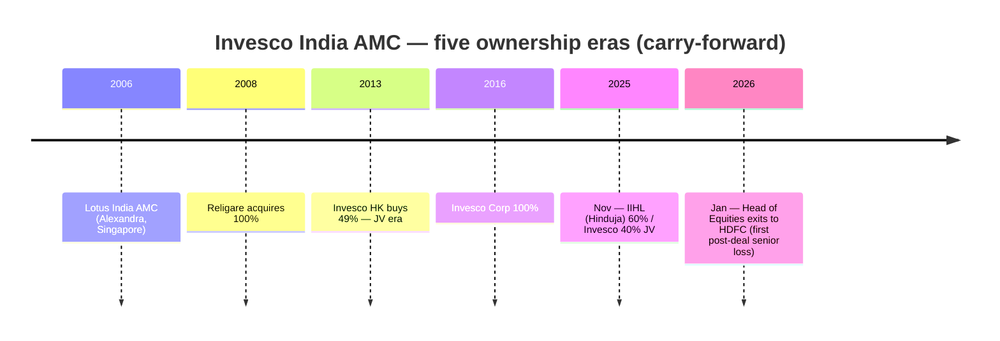
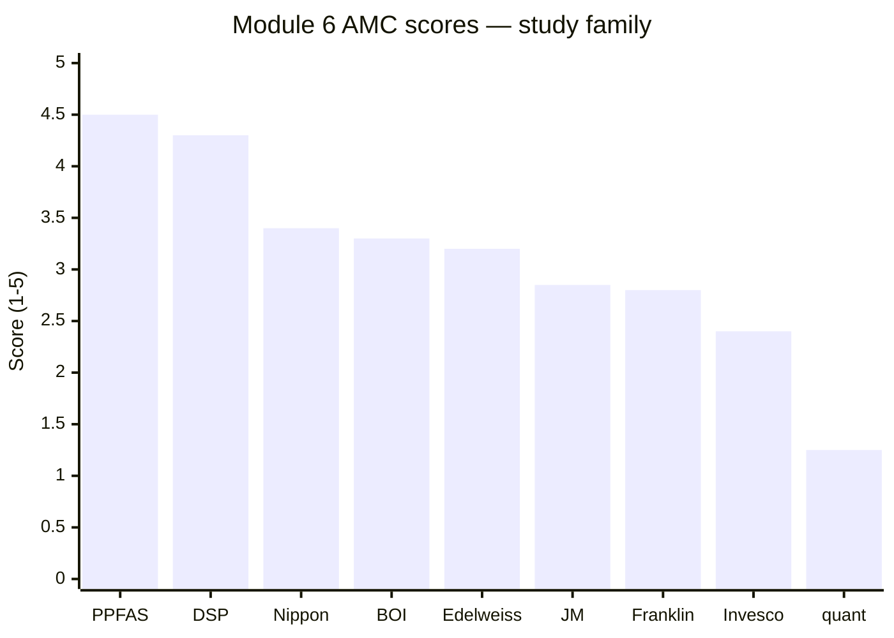

# Module 6: AMC Trustworthiness — Invesco India Midcap Fund

## Module 6 Score: ~2.4 / 5 — A Pre-Convicted File, a Busy Delta, an Equity Firewall

---

## The Carry-Forward Protocol *(new section — first full use of the AMC bench)*

The study plan's rule for repeat AMCs: **carry the existing verdict forward and update only with midcap-specific data — do not re-research from scratch.** Invesco Asset Management (India) carries the second-worst completed AMC verdict in the repo: **2.3/5 from the SmallCap study** (`SmallCap/funds/invesco/module6_amc.md`, researched May-2026), built on a fully documented case file. This module therefore has three jobs only: (1) restate the settled pillars, (2) file the **delta** — what changed between that verdict and July-2026, (3) apply the **midcap lens** — what matters differently for an equity midcap fund than it did for the smallcap sibling. It is not a re-trial.

**The AMC bench, for calibration:** PPFAS 4.5 > DSP 4.3 > Nippon 3.4 > BOI 3.3 > Edelweiss ~3.2 > JM 2.85 > Franklin 2.8 > **Invesco 2.3** > quant ~1.25.

---

## Raw Data (Carry-Forward + Updates, as of 04-Jul-2026)

| Field | Value | Status |
|-------|-------|--------|
| **AMC** | Invesco Asset Management (India) Pvt Ltd — formerly Lotus India AMC → Religare → Religare Invesco → Invesco (2016) | Carry-forward |
| **Ownership** | **IIHL (Hinduja Group) 60% + Invesco Corp (USA) 40%** — JV completed 02-Nov-2025; joint sponsors | Confirmed (M4) |
| **Ownership changes** | **4 in 19 years** — most turbulent in the repo | Carry-forward |
| Total AUM | **₹1.43–1.48L Cr** — 16th-largest AMC; >70% equity; 2.9M folios; 48,000+ distributors | Carry-forward |
| **Defining scar** | **₹4.98 Cr SEBI settlement (Apr-2024)** — PMS/MF segregation failure, inter-scheme transfers, pre-arranged trades; **CEO Nanavati personally named**; underlying conduct: subprime-bond dumping 2016–21 into the retail credit-risk fund | Carry-forward (settled/closed) |
| Associated events | Three-jurisdiction probe (SEBI+SEC+SFC); internal whistleblower; ~50% of FI team resigned 2021–22 | Carry-forward |
| **NEW: senior churn** | **Head of Equities Amit Ganatra resigned eff. 27-Jan-2026 — 12 weeks post-IIHL-closing — joined HDFC AMC** | ⭐ Delta (M5) |
| **NEW: group deterioration** | IndusInd Bank now under **four simultaneous probes** (SEBI — ex-CEO barred for insider trading; SFIO — top-3 summoned; NFRA — auditors; RBI — remediation); **fresh whistleblowers May-2026** | ⭐ Delta |
| **NEW: NFO factory** | **5 thematic launches in 15 months** (Aug-2024 → Oct-2025) bracketing the market top and the ownership change | ⭐ New evidence (this module) |
| CEO | Saurabh Nanavati — since 2008, survived all 5 ownership eras; named in the 2024 settlement, retained by IIHL | Carry-forward |
| CIO | Taher Badshah — since Jan-2017; the equity-side continuity anchor | Carry-forward |
| Infrastructure | Deutsche Bank custody / KFin RTA / PwC audit / Invesco Corp trustee-board seats (Simpson, Lo) | Carry-forward |
| Gating history | **None, ever — on any fund**; this Midcap fund absorbed a 5%-of-corpus/month flood ungated (M4) | Carry-forward + M4 |
| Skin-in-the-game | SEBI-minimum only; no voluntary institutional policy | Carry-forward |

**Sources:** SmallCap M6 file (the case file, fully sourced there); Invesco Mar-2026 factsheet (all 34 scheme allotment dates extracted for the NFO analysis); M4 (IIHL completion detail); M5 (Ganatra exit); IndusInd probe status per Business Upturn / Bar & Bench (May-2026 reporting); SEBI order reporting on ex-IndusInd CEO.

---

## What Module 6 Is Really Asking

After M1–M5 established the best raw fund-level file in the repo carried by one 2.6-year manager, the AMC module asks: **can you trust the institution around him for ten years?** Specifically here: (1) does the SmallCap study's 2.3 verdict still describe this institution; (2) what has the IIHL era actually done in its first eight months; (3) does anything about the *midcap* fund change the weight of the file? The answers: yes, nothing good, and one thing — the equity firewall.

---

## The Settled Pillars — The Case File the SmallCap Study Closed *(summary, not re-argued)*

1. **The worst completed regulatory record in the repo.** ₹4.98 Cr SEBI settlement (Apr-2024) for PMS/MF segregation failure, inter-scheme transfers and pre-arranged trades, with the CEO among the named settlors. The underlying conduct — **moving deteriorating bonds from the 97%-institutional short-term fund into the 43%-retail credit-risk fund (2016–21)** — is the most directly investor-harmful practice documented in these studies. Around it: a three-jurisdiction probe (SEBI/SEC/SFC), an internal whistleblower, and the resignation of roughly half the fixed-income team in 2021–22. (For scale: DSP's only penalty is ₹2 *lakh*, procedural; Invesco's is 250× that, substantive, CEO-named.)
2. **The most unstable ownership in the repo.** Four controlling changes in 19 years — Lotus → Religare → Invesco JV → Invesco 100% → IIHL 60%. The base rate implies a 10-year SIP holder should *expect* another.
3. **A distribution-first new owner.** IIHL/Hinduja is a diversified conglomerate for which asset management is a new vertical; every IIHL executive quote at deal completion was about distribution reach (11,000+ touchpoints, Tier-2/3 push); only the Invesco Corp representative spoke about investment quality.
4. **No investor-first culture on record.** Zero flow restrictions in AMC history; SEBI-minimum skin-in-the-game; the SEBI settlement never proactively communicated to folio holders; the widest Direct-Regular fee gaps in the shortlists (this fund: 1.17%, M4).
5. **The genuine strengths.** No financial fragility whatsoever (Hinduja £35B + Invesco Corp $1.7T behind it); institutional-grade infrastructure (Deutsche Bank / KFin / PwC); and the **Invesco Corp 40% with trustee-board seats** — the one structural check IIHL cannot unilaterally remove.

---

## ⭐ The Delta File — November 2025 → July 2026 *(new section)*

### (a) The senior-talent bleed began, exactly on schedule

The SmallCap file warned that ownership changes make managers "reassess their careers." It took **twelve weeks**: **Amit Ganatra, Director & Head of Equities (Jan-2022 → 27-Jan-2026), resigned and joined HDFC AMC**, where he now runs HDFC Flexi Cap and HDFC Focused — the industry's flagship-scale chairs (M5's breaking-news section has the full timeline). As an AMC-governance datum this is the *first post-IIHL retention test, failed at the most senior investment level* — and it extends a pattern:

**The Alumni Diaspora** *(new section within the delta)*: this AMC's midcap-relevant alumni now run equity money at three rival houses — **Vinay Paharia (CIO, PGIM India)**, **Pranav Gokhale (Sr FM, Canara Robeco)**, **Amit Ganatra (HDFC flagship funds)**. The institution develops or attracts genuine talent and consistently loses it to competitors. For a fund that M3/M5 established is **person-carried** (unlike Nippon's process-carried machine), the employer's demonstrated inability to retain its best people is the single most decision-relevant institutional trait — it prices the probability on the M5 key-person risk.

### (b) The majority owner's flagship got worse, not better

The SmallCap file recorded IndusInd Bank's ₹1,960 Cr derivative-accounting lapse and the 2025 CEO/Deputy-CEO/CFO exits. The July-2026 state is materially heavier:

| Agency | Action |
|--------|--------|
| **SEBI** | **Barred ex-CEO Kathpalia and four senior officials from the securities market** (insider-trading order); Audit Committee conduct under scrutiny |
| **SFIO** | Summoned the former CEO, CFO and Deputy CEO — management's role in the accounting fraud |
| **NFRA** | Probing the auditors' conduct on derivatives accounting |
| **RBI** | Continues to oversee the remediation plan |
| Plus | **Fresh whistleblower complaints, May-2026** |

None of this is Invesco AMC's conduct; all of it is the live governance culture of the group holding 60% and board control of the AMC. The SmallCap file's rhetorical question — *"if this is the oversight quality at their listed, RBI-regulated flagship, what does the unlisted AMC get?"* — has aged in only one direction.

### (c) This fund's own capacity conduct

From M4: the Midcap fund absorbed a **~5%-of-corpus-per-month** inflow flood (Sep-2025 → Feb-2026, the hottest relative chase measured in any study) with no cap, no gate, no communication — while the AMC's own suite behavior ran the other way (next section).

---

## ⭐ The NFO Factory — Launch-Timing Evidence From the AMC's Own Factsheet *(new section — the study plan's fund-suite-coherence check, answered with dates)*

All 34 scheme allotment dates were extracted from the Mar-2026 factsheet. After a disciplined stretch — **one equity NFO in the 2.5 years to mid-2024** (Flexi Cap, Feb-2022) — the record shows this:

| NFO | Allotment | Market context |
|-----|-----------|----------------|
| Manufacturing Fund | 14-Aug-2024 | Six weeks before the cycle top |
| **Technology Fund** | **23-Sep-2024** | **The Nifty Midcap 150 peaked 24-Sep-2024 — allotted at the literal top** |
| Multi Asset Allocation Fund | 17-Dec-2024 | **The week this Midcap fund's own NAV peaked (16-Dec-2024)** |
| Business Cycle Fund | 27-Feb-2025 | Into the correction trough — and assigned to Khemani |
| Consumption Fund | 27-Oct-2025 | Days before the IIHL closing |

**Five thematic launches in 15 months, bracketing the market top and the ownership transition.** This is textbook flow-harvesting — the behavioral confirmation of the SmallCap file's "distribution-first" thesis, printed in the AMC's own allotment dates. The M5 tie-in makes it sharper: the AMC attached its hot-hand manager (Khemani — mid-flood, already running four schemes) to two of the five, monetizing his 2024 performance across the suite.

**The counterpoint, for fairness — franchise coherence:** the Midcap fund itself is a **19-year unbroken franchise** — launched Apr-2007, never merged, never rebranded away, through four ownership changes (contrast: the sibling Mid N Small Cap Fund was quietly rebranded into Multicap in 2018). The AMC runs *this* mandate seriously; it is the suite *around* it that behaves like a flow harvester.

---

## ⭐ The Equity Firewall — The Midcap-Specific Reweighting *(new section — the one thing that moves the score)*

Every serious Invesco-AMC scandal is **fixed-income-side**: the bond-dumping ISTs, the whistleblower's debt-scheme allegations, the FI-team collapse, the multi-jurisdiction probe's subject matter. **The equity side has no adverse SEBI finding across any era** — Lotus, Religare, Invesco, JV. And the equity governance perimeter is comparatively strong: CIO Taher Badshah continuous since Jan-2017 (survived every transition including this one), the Invesco Corp research framework embedded over nine years of full ownership, and the trustee-board seats (Simpson, Lo) that give the 40% partner a structural check on investment-policy changes.

For the SmallCap sibling this distinction earned no explicit credit. For an **equity-only midcap fund** it deserves a row of its own: the documented investor-harm mechanisms all ran through debt schemes that this fund structurally cannot touch. It does **not** cleanse the institution — the same CEO signed off both sides of the house, and culture is not sandboxed — but it does mean the specific, proven harm pathway does not reach this product. This is the principal reason the score nudges **up** from 2.3 despite a uniformly negative delta file.

---

## The Nippon Head-to-Head — The Two Finalists on the Institution Axis *(new section)*

| Dimension | **Invesco AMC (~2.4)** | Nippon AMC (3.4) |
|-----------|------------------------|-------------------|
| Defining scar | IST retail-dumping; ₹4.98 Cr settlement, **CEO named, closed** | Yes Bank AT1 quid-pro-quo (~₹2,850 Cr), **CEO named, settlement LIVE** |
| Scar nature | Investor-harmful transfers — retail absorbed institutional risk | Alleged conflict-of-interest diversion — worse in kind, ~larger in scale |
| Cleansing mechanism | ❌ **None** — same CEO throughout, and ownership churned *again* (4th change, to a conglomerate in live crisis) | ⭐ Misconduct-era promoter (ADAG) **exited ownership entirely**; owner now Japan's largest life insurer |
| Ownership stability | 4 changes/19y; new owner 8 months in; flagship under 4 agencies | Stable since 2019; listed; top-4 scale |
| Talent retention | ❌ Exporter: Paharia, Gokhale, Ganatra → rivals; **matters more because the fund is person-carried** | ❌ Also an exporter (Singhania, Gunwani) — but the fund proved manager-independent |
| Gating culture | None ever + NFO factory at the top | None on the midcap fund — but the Small-Cap-2023 gating precedent exists |
| Equity-side record | ✅ Clean, all eras | ✅ Clean, both eras |
| Financial strength | ✅ Dual backing, no fragility | ✅ ₹7.7L Cr AUM, ₹1,528 Cr FY26 profit |

Both houses are scarred; both CEOs are personally named; both equity floors are clean. The full point of separation is structural: **Nippon's bad actor left the building; Invesco's building keeps changing owners while the same management signs everything — and the newest owner's own house is on fire.** The talent-retention row is the sleeper: identical failing on paper, but only Invesco's fund *depends* on retention (M5).

---

## Retained Carry-Forward Apparatus (unchanged from the SmallCap file)

- **Nanavati profile and the dual reading** — 18 years of institutional memory across five eras vs a CEO named in the settlement and retained by every owner including the newest. The MidCap addendum: the first post-IIHL year now also carries the Ganatra loss on his ledger.
- **IIHL/Hinduja profile** — £35.3B family wealth; conglomerate (autos, oil, BPO, banking); asset management a new vertical; distribution-first rationale in every deal quote. Now also absorbing Reliance Capital's insurance businesses — a group in expansion mode across financial services.
- **Infrastructure** — Deutsche Bank custody, KFin RTA, PwC audit, 1,700-strong Hyderabad operations base, trustee board with Invesco Corp seats: institutional-grade, the file's genuine bright spot alongside financial stability.
- **Communication & skin-in-the-game** — no quarterly letters; settlement never proactively disclosed to unitholders; SEBI-minimum skin-in-the-game only. Unchanged.

---

## Points For / Points Against — AMC Trustworthiness

### ✅ Points For

- **Financial stability is beyond question** — dual backing (Hinduja £35.3B + Invesco Corp $1.7T), ₹1.43–1.48L Cr AUM, ~₹1,000 Cr+ revenue; the fund's custodian/auditor/RTA stack is best-in-class
- **The equity firewall** — every documented harm ran debt-side; the equity floor is clean across four ownership eras; Badshah (CIO, 9+ years) is the continuity anchor that survived even the IIHL transition
- **Invesco Corp's 40% + trustee-board seats** — a real structural check on investment-policy interference by the majority owner
- **The Midcap franchise itself is coherent** — 19 unbroken years, never merged or rebranded, through four owners
- Nanavati's five-era institutional memory (the generous reading of his continuity)

### ❌ Points Against

- **The repo's worst completed regulatory file** — ₹4.98 Cr CEO-named settlement; retail bond-dumping; three-jurisdiction probe; whistleblower; FI-team collapse
- **The repo's most unstable ownership** — 4 changes in 19 years, the latest to a distribution-first conglomerate whose flagship bank is under four simultaneous probes with fresh whistleblowers (May-2026)
- **The post-IIHL era opened with the Head of Equities leaving for a rival** — the retention tripwire fired in twelve weeks; the alumni diaspora (PGIM/Canara/HDFC) prices the key-person risk on a person-carried fund
- **The NFO factory** — five thematic launches in 15 months at the top, including one allotted the day before the midcap index peaked; flow-harvesting confirmed in the AMC's own dates
- **No investor-first mechanism anywhere** — no gate ever (including through this fund's 5%/month flood), SEBI-minimum skin-in-the-game, no proactive disclosure of adverse events, the widest D-R gap studied (1.17%)
- The one man who signed off the misconduct era still signs everything — under his fifth set of owners

---

## Module 6 Scorecard

| Sub-dimension | SC study | **MidCap** | What moved |
|---------------|---------:|-----------:|------------|
| Regulatory cleanliness | 1.5 | **1.5** | No new AMC-level action; the 2024 file stands, closed |
| Ownership stability | 1.5 | **1.5** | Deal certainty up; owner's flagship down (4 agencies, new whistleblowers); senior churn began — nets flat |
| Heritage & institutional depth | 3.0 | **3.0** | Unchanged; 19-year midcap franchise coherence noted within |
| **Equity-side insulation** *(new row)* | — | **3.5** | All documented harm was debt-side; equity clean across eras; Badshah + trustee checks live |
| **Fund-suite coherence / launch timing** *(new row)* | — | **2.0** | The NFO factory: 5 launches in 15 months at the top; hot-hand manager attached to two |
| Skin-in-the-game | 2.0 | **2.0** | SEBI-minimum, unchanged |
| Financial stability | 4.5 | **4.5** | Unchanged — genuinely strong |
| Investor-first culture | 1.5 | **1.5** | The flood absorbed ungated; NFO behavior confirms the reading |
| Investor communication | 2.5 | **2.5** | Unchanged |
| Infrastructure quality | 4.0 | **4.0** | Unchanged |
| CEO/leadership continuity | 3.0 | **2.5** | Nanavati's continuity now carries the Ganatra loss and the talent-exporter pattern |

**Module 6 Score: ~2.4 / 5** — the SmallCap verdict carried forward and updated: a uniformly negative eight-month delta (senior exit, group deterioration, NFO factory) offset — barely — by the one reweighting the midcap lens legitimately allows: **the equity firewall**, which keeps the institution's proven harm pathway structurally away from this fund. Second-lowest AMC score in the study family, a full point below Nippon's 3.4.

---

## The Provisional Dead Heat *(preview for the README and decision tree)*

With all six modules provisionally scored:

| Module | Weight | **Invesco** | Nippon |
|--------|--------|------------:|-------:|
| M1 Returns | 25% | **4.3** | 4.2 |
| M2 Risk | 20% | 4.1 | **4.4** |
| M3 Portfolio | 15% | 4.0 | **4.1** |
| M4 Cost & AUM | 20% | **4.2** | 3.6 |
| M5 Manager | 15% | 3.4 | **3.5** |
| M6 AMC | 5% | 2.4 | **3.4** |
| **Weighted** | | **≈ 3.97** | **≈ 3.96** |

**A statistical dead heat — with opposite shapes.** Invesco wins the fund-level modules (returns, cost, runway); Nippon wins every institution-level one (risk process, manager independence, AMC). The weighted score will not decide the midcap slot; the decision tree must choose between failure modes: **Nippon's capacity clock versus Invesco's dependence on one retained man inside a 2.4/5 institution.** (Both totals remain provisional until each fund's README.)

---

## SIP Implication

1. **The 5% module carries this fund's largest single risk concentration** — everything M1–M4 praised depends on people staying (M5) inside an institution that has now demonstrably failed to retain its two most senior equity leaders in 27 months, under an owner whose stated interest is distribution.
2. **The equity firewall is real but not a moat** — the harm history is debt-side, and trustee-level checks exist; but culture flows downhill from a CEO who has been named once already.
3. **The monitoring list from M4/M5 gains one AMC-level item: NFO behavior.** Each additional top-of-cycle thematic launch (and each new scheme hung on Khemani) is the institution telling you its priority ordering again.
4. **The exit tripwire is unchanged and now institutional:** a Khemani departure — for which the AMC's own alumni record is the base rate — converts this fund's thesis to "hold the index fund instead" faster than any NAV event could.

---

## One-Line Verdict

> **Invesco AMC arrives at this module pre-convicted — the repo's worst completed regulatory file (a ₹4.98 Cr CEO-named settlement over retail-harmful bond transfers, a three-jurisdiction probe, a whistleblower, half the FI desk gone) inside the repo's most unstable ownership (four changes in 19 years, now 60%-held by a distribution-first conglomerate whose flagship bank sits under four simultaneous probes with fresh whistleblowers) — and the first eight IIHL months delivered the delta the file predicted: the Head of Equities gone to HDFC in twelve weeks, and five top-of-cycle thematic NFOs in fifteen months; salvaged half a point above the SmallCap verdict only by the equity firewall — the proven harm pathway is structurally debt-side, and this fund's equity perimeter (Badshah, Invesco Corp trustee seats, a clean equity record across four eras) still holds. Provisional: ~2.4/5 — and with it, a provisional all-module dead heat with Nippon (≈3.97 vs ≈3.96) that the decision tree, not the arithmetic, will have to break.**

---

*Module 6 completed: July 4, 2026 | AMC Trustworthiness | Method: carry-forward per study plan from `SmallCap/funds/invesco/module6_amc.md` (2.3/5, May-2026, fully sourced there) + delta research | Delta items: Ganatra exit 27-Jan-2026 → HDFC (M5 file); IndusInd Bank four-agency status (SEBI bar on ex-CEO, SFIO summons, NFRA, RBI) + May-2026 whistleblowers per Business Upturn/Bar & Bench; NFO factory extracted from Mar-2026 factsheet (34 allotment dates; Technology Fund allotted 23-Sep-2024 vs midcap-index top 24-Sep-2024; Multi Asset 17-Dec-2024 vs this fund's NAV peak 16-Dec-2024) | New rows: equity-side insulation 3.5, fund-suite coherence 2.0; CEO continuity 3.0→2.5 | Provisional M6 Score: ~2.4/5 | Provisional six-module totals: Invesco ≈3.97 vs Nippon ≈3.96 — dead heat, opposite shapes; README + decision tree to adjudicate*
