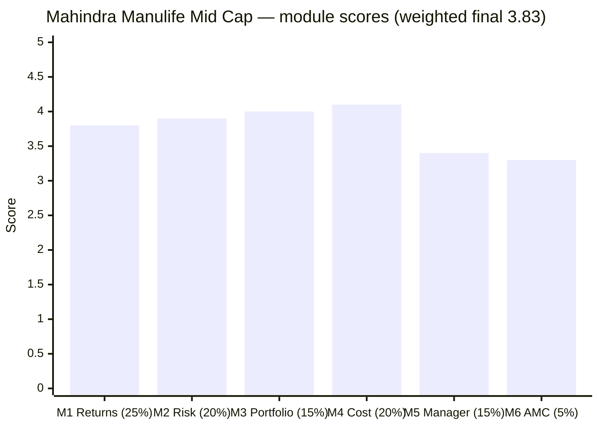
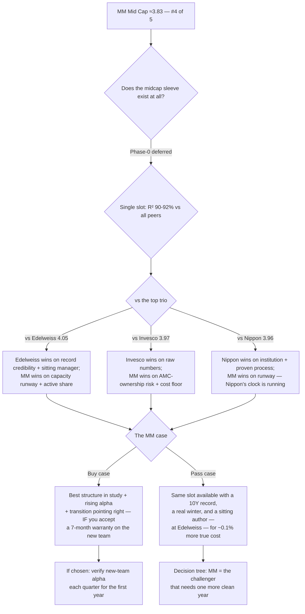

# Mahindra Manulife Mid Cap Fund — Deep Study

## Fund Identity

| Field | Value |
|-------|-------|
| **Full Name** | Mahindra Manulife Mid Cap Fund — Direct Plan — Growth (ex- *Mahindra Mid Cap Unnati Yojana*) |
| **AMC** | Mahindra Manulife Investment Management (Mahindra Finance 51% × Manulife 49%) — **smallest AMC studied (₹33,153 Cr), first study of this house** |
| **Inception** | 30-Jan-2018 (NFO at ₹10) — **launched at the exact midcap top**; first MFAPI NAV 06-Feb-2018 already −6.5% |
| **SEBI Category** | Equity — Mid Cap (min 65% in ranks 101–250) |
| **Benchmark** | Nifty Midcap 150 TRI |
| **AUM** | **₹4,866 Cr** — smallest of the shortlist; ~15% of the entire AMC (the flagship) |
| **Expense Ratio** | **0.43–0.46%** Direct (subsidized — the AMC is loss-making); Regular 1.61% |
| **Exit Load** | **1% / 90 days** (lightened from the original 1%/1y) |
| **Managers** | **Krishna Sanghavi** (24-Oct-2024; CIO-Equity since ~2020) + **Kirti Dalvi** (03-Dec-2024) + **Neelesh Dhamnaskar** (16-Feb-2026) |
| **Departed** | **Manish Lodha** (Dec-2020 → resigned 02-Dec-2025 → Ashika AIF); Abhinav Khandelwal (→ ABSL, Oct-2024); V. Balasubramanian (retired ~2020) |
| **Data** | MFAPI 142110 (Direct) / 142109 (Regular); proxies 147622 (Midcap-150 fund) + 114456 (Midcap-100 ETF); TT holdings M_MANC |

---

## The One-Line Context

Mahindra Manulife Mid Cap is the study's **"orphaned author, surviving process"** fund: the only studied midcap whose matched-index alpha *rises* toward the present (+2.06%/yr full → +3.46%/yr since-2024), running the study's **best capacity runway** (smallest AUM, gentlest flows — no capacity clock at all) at a **sponsor-subsidized near-cheapest ER**, through a **genuinely active (66.6% AS) value-financials book that deliberately omits both exchanges** (BSE + MCX — the exact inverse of Edelweiss). Its record's credibility, however, carries three structural holes — a **fake 2018 winter** (NFO-cash artifact), **no 10Y history**, and a defensiveness that is partly a cash-era measurement artifact — and its central drama is attribution: **Manish Lodha, whose verified three-fund skill (+2.09/+7.38/+1.69%/yr) authored the record, resigned Dec-2025**. The counterweights: the weak 2025 was *his* final year (not the new team's), the new team **swept all three MM funds in its first 7 solo months** (+6.1/+2.7/+2.1 pts), and CIO Sanghavi supervised the entire record — *the author left; the editor stayed*. Final: **≈3.83/5 — #4 of the five studied midcaps**, the gap to the top three being record-credibility and manager-warranty, not structure.

---

## Module Status

| Module | Weight | Status | Score |
|--------|--------|--------|-------|
| [Module 1 — Returns Consistency](module1_returns.md) | 25% | ✅ Complete | **3.8** |
| [Module 2 — Risk Profile](module2_risk.md) | 20% | ✅ Complete | **3.9** |
| [Module 3 — Portfolio DNA](module3_portfolio.md) | 15% | ✅ Complete | **4.0** |
| [Module 4 — Cost & AUM Impact](module4_cost.md) | 20% | ✅ Complete | **4.1** |
| [Module 5 — Fund Manager Quality](module5_manager.md) | 15% | ✅ Complete | **3.4** |
| [Module 6 — AMC Trustworthiness](module6_amc.md) | 5% | ✅ Complete | **3.3** |

---

## Final Scorecard

**Weighted Score: ≈ 3.83 / 5** — #4 of the five studied midcaps

| Module | Weight | Score | Weighted |
|--------|--------|-------|----------|
| M1 Returns | 25% | 3.8 | 0.950 |
| M2 Risk | 20% | 3.9 | 0.780 |
| M3 Portfolio | 15% | 4.0 | 0.600 |
| M4 Cost & AUM | 20% | 4.1 | 0.820 |
| M5 Manager | 15% | 3.4 | 0.510 |
| M6 AMC | 5% | 3.3 | 0.165 |
| **Total** | 100% | | **≈3.83** |

**The shape is the story:** the **fund-structure modules ascend** (M1 3.8 → M4 4.1 — cost, capacity, book quality all strong) while the **institution modules sag** (M5 3.4, M6 3.3 — tenure, retention, AMC economics). The exact inverse of Nippon (institution-strong, capacity-constrained). MM's problems are all *warranty* problems; its assets are all *structural*.

---

## The Category Standings (5 of 7 studied)

| Rank | Fund | Final | Character |
|------|------|-------|-----------|
| 1 | Edelweiss | ≈4.05 | Consistency leader — no weak high-weight module |
| 2 | Invesco | ≈3.97 | Best fund-level numbers; institution-weak |
| 3 | Nippon | ≈3.96 | Best institution; capacity clock running |
| **4** | **Mahindra Manulife** | **≈3.83** | **Best structure (cost+capacity); weakest warranty (manager+AMC)** |
| 5 | HSBC | ≈3.49 | Fails the matched-index test |

MM lands **above HSBC by a wide margin and ~0.13–0.22 below the top trio** — a genuine mid-table result, not a confirm-elimination. Remaining: ICICI Pru, Sundaram (both expected below the trio).

---

## Key Performance Metrics

| Metric | Value | Context |
|--------|-------|---------|
| 3Y / 5Y CAGR | 23.67% / 20.04% | 4th of 7 shortlist on both |
| 10Y CAGR | **none — 8.4y old** | youngest record; honest since-inception ≈18.5% (from ₹10 allotment) |
| **Matched-index alpha (6.8y)** | **+2.06%/yr, rising to +3.46 (2024→)** | #3 of the passing funds; the only *rising* trajectory |
| Index-dominance test (5Y, 7 axes) | **7/7** ✅ | matches Nippon/Edelweiss; best IR of group (+0.57) |
| Sharpe / Sortino (5Y common) | 0.835 / 1.469 | 4th of studied — peer-mid-pack |
| Down-capture | 84 full-life (**artifact**) → 90 clean-5Y (6th of 7) | the defensiveness shrinks under scrutiny |
| Max drawdown | −33.1% (COVID) | shallowest of group — but the fund missed the Jan-2018 top |
| 2024–25 correction | −20.9% fall (in-line), **13.7-mo recovery (2nd-slowest)** | joint Lodha+Sanghavi watch |
| 2018–19 winter | **no clean test** — NFO-cash artifact (+9.7/+10.5 "alpha" not real) | unique: born into the winter |
| Rolling 3Y | 0% negative, min +11.5% | **inception-bias trophy** — golden-decade-only life |
| 8Y SIP XIRR | 22.93% | no 10Y SIP to compare vs peers |
| Active share | **66.6%** (computed) | 3rd-highest studied; decisively active |
| Turnover | ~58–64% | 2nd-highest of group — belies "buy-and-hold" marketing |
| Cross-sleeve R² | 90–92% vs all studied midcaps | single-slot decision stands |

---

## ⚠️ The Five Critical Lenses — Read Before the Numbers

### Lens 1 — The Record Is Younger and Softer Than It Looks
No 10Y. The celebrated winter alpha is an NFO-cash deployment artifact (the fund held flat while the index fell 6–11% in 2018 — it was still ramping in from cash). The zero-negative rolling-3Y is launch-timing luck (its whole life postdates the last real top). The honest since-inception is ~18.5%, not the ~19.5% aggregators show. **Discount every "consistency" headline accordingly.**

### Lens 2 — The Alpha Is Real, Rising … and Was Someone Else's
+2.06%/yr matched (rising to +3.46) passes the "why not the index fund?" test cleanly — 7/7 on the risk axes too, with the group's best information ratio. But the record maps onto **Lodha's tenure**, and his verified three-fund fingerprint (+2.09/+7.38/+1.69 — the small-cap figure is the largest matched-proxy alpha in the midcap study) proves it was skill, not luck. He resigned Dec-2025.

### Lens 3 — The Transition Is (So Far) Not a Cliff
The study's biggest correction: the weak 2025 (−3.1) was **Lodha's own final year** — he managed until 02-Dec-2025. The new team's true solo print: **+6.1 pts on this fund in 7 months, and a 3/3 sweep across all MM equity funds**. Sanghavi (CIO since 2020) supervised the entire record and took the desk via a 14-month groomed handover. *Author left; editor stayed.* Seven months proves little — but it points the right way.

### Lens 4 — The Structure Is the Best in the Study
Smallest AUM + gentlest flows = **no capacity clock at all** (~decades of runway; every peer has a constraint). Near-cheapest ER (0.43–0.46%) with a −₹0.9L worst-case SIP downside. A genuinely active (66.6% AS), honestly-mid, value-financials book that **omits both exchanges** (BSE+MCX) — the inverse of Edelweiss's exchange-overweight and the anti-momentum stance of the group.

### Lens 5 — The Subsidy Is the Sustainability Question
The AMC is **loss-making** (FY25 −₹10.1 Cr) — your cheap ER is sponsor money, and the retention bleed (Khandelwal→ABSL, Lodha→AIF, 14 months apart) is the structural consequence. The offsets: sponsors are *deepening* (Nov-2025 life-insurance JV — the anti-Invesco), losses are narrowing, and the SEBI file is 10-years clean. Tripwires: a flagship ER increase, a stake-sale rumor, or a third senior exit.

---

## Portfolio DNA (Snapshot, May–Jul 2026)

| Dimension | Value | Group context |
|-----------|-------|---------------|
| Stocks | **66** | sweet-spot count (40–70) |
| Top-10 | **25.9%** | flattest pyramid of the group (largest position 2.98%) |
| **Active share** | **66.6%** | 3rd of studied (Invesco 79.5 > HSBC 69.5 > **MM 66.6** > Nippon 54.1 ≈ Edelweiss ~55) |
| Signature | **Value-financials** (PSU/small banks, NBFCs, Nippon AMC) + industrials (AIA, Triveni, KEI) | |
| Anti-signature | **Omits BSE (index #1, −4.21) and MCX (−1.88)** | inverse of Edelweiss; anti-momentum |
| Cap posture | ~78% in-band (honestly mid); modest small kicker | |
| PE | 31.85 (cat 32.87) | mild valuation buffer |
| Turnover | **~58–64%** | 2nd-highest of group — the one dent |

---

## Strengths vs Concerns

### ✅ Key Strengths
1. **Rising matched-index alpha** (+2.06 → +3.46%/yr) — the only improving trajectory in the study; 7/7 index-dominance; best IR (+0.57)
2. **Best capacity position of the entire study** — no clock, no deployment strain, no AS-decay fuel
3. **Near-cheapest ER** (0.43–0.46%) with the safest fee asymmetry (−₹0.9L worst case / +₹6.2L verified upside on a 10Y SIP)
4. **Genuinely active, differentiated book** — 66.6% AS, value-financials, exchange-omission (anti-momentum)
5. **Encouraging transition evidence** — post-Lodha 3/3 sweep + Sanghavi's CIO continuity since 2020
6. **Clean regulatory file** — AMC 10-years clean; all managers clean
7. **Committed, deepening sponsors** (Mahindra + Manulife; second JV Nov-2025)

### ⚠️ Key Concerns
1. **The record's author is gone** — Lodha's verified 3-fund skill left for an AIF; the new trio has the study's shortest tenures (1.7/1.6/0.4y) and no attributable lead records
2. **Three credibility holes in the record** — fake winter, no 10Y, inception-biased rolling stats
3. **Peer-mid-pack risk profile** — 4th Sharpe, 6th clean-window down-capture, 2nd-slowest 2024–25 recovery (13.7mo)
4. **Loss-making AMC** — subsidy sustainability + structural retention bleed (2 poachings/14mo)
5. **Turnover ~60%** contradicts the "buy-and-hold" label; adds ~0.12% hidden cost (true cost ~0.57%)
6. **Mild NFO-factory instinct** at the AMC (5–6 thematic launches 2023–25; this fund itself born at the Jan-2018 top)
7. **Flows decelerating post-exit** — the market is voting on the same transition question

---

## Comparison vs Studied Funds (All Four Categories)

| Dimension | **MM Mid Cap** | Edelweiss | Invesco | Nippon | HSBC | PP Flexi | DSP Small |
|-----------|---------------|-----------|---------|--------|------|----------|-----------|
| Final score | **≈3.83** | ≈4.05 | ≈3.97 | ≈3.96 | ≈3.49 | 4.20 | 4.00 |
| Matched-index alpha | +2.06 ↗ | +2.87 | +2.88 | +1.97 | −0.22 ❌ | strong | strong |
| 10Y CAGR | **none** | 19.89 | 20.34 | 19.33 | 18.47 | — | — |
| Manager | ❌ author departed; new trio + CIO continuity | ✅ sitting 4.8y | ❌ new 2.8y | ✅ house process | ❌ 5 teams | ✅ founder | ✅ long |
| ER (true) | 0.57 | **0.49** | 0.63 | 0.64 | 0.76 | 0.63 | 0.7 |
| Capacity runway | **decades** ⭐ | ~1.2y ⚠ | ~3y | past ⚠ | unlimited (unloved) | shielded | gated |
| Active share | 66.6% | ~55% | **79.5%** | 54.1% | 69.5% | high | high |
| AMC | 3.3 loss-leader | 3.4 | 2.3 sold | 3.4 scarred | 3.4 | **4.5** | **4.3** |

---

## ₹20K/Month SIP Projections (10 Years)

| Scenario | Net return | Corpus | vs index fund |
|----------|-----------|--------|---------------|
| Index fund (0.20%) | 17.80% | ₹61.2L* | — |
| **MM, verified alpha +2.06** | 19.60% | **₹67.4L** | **+₹6.2L** |
| MM, recent alpha +3.46 | 21.00% | ₹72.7L | +₹11.5L |
| MM, half alpha | 18.57% | ₹63.7L | +₹2.6L |
| **MM, alpha dies** | 17.54% | ₹60.3L | **−₹0.9L** |

*\*Annuity convention differs slightly from sibling READMEs' index leg; relative spreads are the comparable quantity.*

**Read:** the cheap ER makes this the same "safe bet" shape as Edelweiss — tiny downside if the alpha dies, meaningful upside if the new team holds even half of Lodha's alpha. The honest expected anchor is the **verified +2.06 scenario, discounted by transition uncertainty** — not the +3.46 recent rate (that slice is the most Lodha-concentrated).

---

## Investment Decision Framework

---

## The Critical Facts — In 10 Sentences

1. The fund launched **30-Jan-2018 at the exact midcap top**, so its shallow winter drawdown and +9.7/+10.5 "winter alpha" are **NFO-cash artifacts** — it has no clean 2018 test, no 10Y record, and its zero-negative rolling-3Y is launch-timing luck.
2. Its matched-index alpha is **real and rising** — +2.06%/yr over the full 6.8y window, +3.46%/yr since-2024 — and it beats the buyable index fund on **all 7 risk axes** with the group's best information ratio.
3. Its headline defensiveness is **window-dependent**: down-84 full-life is a cash-era artifact; the fully-invested truth is down-85–90 (peer-mid-pack), and the 2024–25 recovery was the second-slowest (13.7 months).
4. The book is **genuinely active (66.6% computed active share)** — a value-financials portfolio whose two biggest active positions are the *omission* of BSE and MCX, the exact inverse of Edelweiss's exchange bet.
5. **Manish Lodha authored the record and resigned 02-Dec-2025** — his verified three-fund fingerprint (+2.09/+7.38/+1.69%/yr vs matched proxies) proves the alpha was skill, and it left the building for an AIF.
6. **But the weak 2025 was Lodha's own final year**, and the new Sanghavi+Dalvi+Dhamnaskar team swept all three MM funds in its first 7 solo months (+6.1/+2.7/+2.1 pts) — with **Sanghavi, CIO-Equity since 2020, having supervised the entire record** ("author left, editor stayed").
7. It has **the best capacity position of the entire study** — smallest AUM (₹4,866 Cr), gentlest flows (+₹59 Cr/mo, decelerating), decades of runway, no active-share-decay pressure — the only studied midcap with no capacity clock.
8. Its 0.43–0.46% ER is the **most aggressive price-per-scale studied** because the **AMC is loss-making** (FY25 −₹10.1 Cr) — the subsidy is sponsor money, and it structurally explains the retention bleed (two managers poached/left in 14 months).
9. The sponsors are the counterweight: **Mahindra + Manulife deepened the partnership with a second 50:50 JV (life insurance) in Nov-2025** — the anti-Invesco ownership signal — and the AMC's SEBI file is 10-years clean.
10. Final: **≈3.83/5, #4 of five** — mid-table on the strength of structure (cost, capacity, book) against the weakest warranty (manager tenure, AMC economics); the score most likely to *rise* of the five if the new team's first clean year confirms the 7-month sweep.

---

## Quick Verdict

**For a ₹20K/month, 10-year SIP:** Mahindra Manulife Mid Cap is a **credible challenger, not the pick — yet.** It offers the study's best structural package (no capacity clock, near-cheapest cost, genuinely active anti-momentum book, safest fee asymmetry) attached to its least-proven warranty (a 7-month-old team holding a departed author's alpha, at a loss-making AMC that struggles to retain talent). The rational stances are two: **(a) pass for now in favor of Edelweiss** — the same single-occupancy slot with a real 10Y, a real winter, a sitting manager, and only ~0.08% more true cost; or **(b) shortlist-and-wait** — one clean new-team year (alpha ≥ index, no third departure, ER stable) would remove the main discount and make MM's structural advantages decisive, since every top-trio rival carries a clock (Edelweiss's capacity, Nippon's size, Invesco's ownership) that MM uniquely lacks. The decision tree should treat MM as **the option with the longest runway and the shortest track record.**

---

## One-Line Verdict

> **Mahindra Manulife Mid Cap finishes at ≈3.83/5 — #4 of the five studied midcaps — as the study's "orphaned author, surviving process" fund: a rising matched-index alpha (+2.06→+3.46%/yr) earned in a genuinely active (66.6% AS) value-financials book that omits both exchanges, sitting on the best capacity runway of the entire study (smallest AUM, gentlest flows, no clock) at a sponsor-subsidized 0.43–0.46% ER with the safest fee asymmetry (−₹0.9L worst case) — but carrying the weakest warranty: no 10Y, a fake NFO-cash winter, an inception-biased consistency record, a 13.7-month 2024–25 recovery, and a record authored by Manish Lodha (verified +2.09/+7.38/+1.69%/yr across three funds), who resigned Dec-2025 to an AIF from a loss-making AMC (FY25 −₹10.1 Cr) that has now lost two senior managers in 14 months. The counterweights — the weak 2025 reattributed to Lodha's own final year, the new team's 3/3 seven-month sweep (+6.1 pts on this fund), Sanghavi's CIO continuity since 2020, and sponsors deepening via a Nov-2025 life-insurance JV — make it a genuine challenger whose score is the likeliest of the five to rise: one clean new-team year would make its structural advantages decisive over rivals that all carry clocks MM lacks.**

---

*Study completed: July 8, 2026 | All 6 modules + README | Weighted final ≈3.83/5 (M1 3.8×25% + M2 3.9×20% + M3 4.0×15% + M4 4.1×20% + M5 3.4×15% + M6 3.3×5%) | Standings (5 of 7): Edelweiss 4.05 > Invesco 3.97 ≈ Nippon 3.96 > MM 3.83 > HSBC 3.49 | Data: MFAPI 142110/142109 + proxies 147622/114456 + cross-sleeve series; TT holdings M_MANC (66 names, AS 66.6% computed); Wayback-Groww AUM/ER series (old slug method extension); AMC one-pagers/notices; Mahindra Finance quarterly disclosures (AMC P&L) | Signature findings: fake NFO-cash winter (M1) · down-capture window decomposition (M2) · exchange-omission inverse-Edelweiss book (M3) · flow-ledger votes on transition + subsidized price (M4) · Lodha 3-fund fingerprint + post-exit sweep + 2025 reattribution (M5) · loss-making AMC + anti-Invesco JV deepening (M6) | Tripwires: new-team alpha quarterly for year 1 · third senior exit · flagship ER increase / stake-sale rumor · turnover >80% · next correction's recovery speed | Remaining studies: ICICI Pru (#6), Sundaram (#7), then decision_tree.md*
