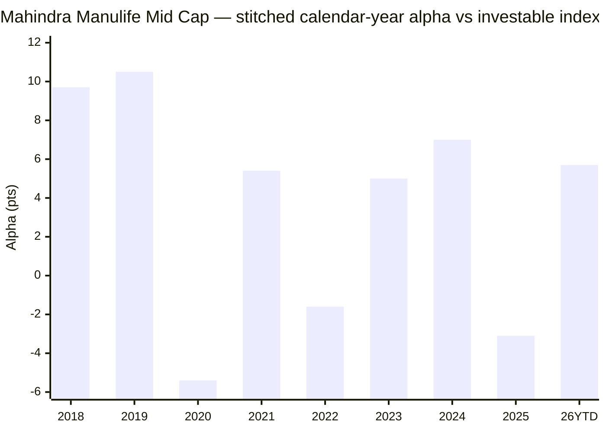

# Module 1: Returns Consistency — Mahindra Manulife Mid Cap Fund

## Module 1 Score: ~3.8 / 5 (provisional)

---

## The One-Line Context

Mahindra Manulife Mid Cap is the shortlist's **rising-alpha orphan**. It is the only studied midcap whose alpha *increases* as the window shortens (**+2.06%/yr matched → +2.52% since-2022 → +3.46% since-2024**) and it carries a **defensive capture profile** (up-95 / down-84, beta 0.87 over the full idx life) — the forward-looking signals are, on paper, among the most attractive of the non-Invesco funds. *(⚠ M2 correction: that capture edge is front-loaded into the 2018–20 NFO-cash era; on the clean 5Y peer window it is up-100 / down-90, 6th of 7 actives — defensive vs the index, middle-of-pack vs peers.)* But three structural discounts hollow out the headline: (1) it launched **06-Feb-2018, *into* the midcap winter**, so its celebrated "winter alpha" (+9.7 / +10.5) is largely an **NFO-cash-deployment artifact**, not stock-selection — the fund has *no clean 2018-winter test*; (2) it has **no 10Y record** (only 8.4y) and its perfect zero-negative rolling-3Y is an **inception-bias trophy**, not proven consistency; and (3) the manager who authored the entire rising-alpha record — **Manish Lodha — resigned effective 02-Dec-2025**, seven months before this measurement, leaving a **<2-year-old Krishna Sanghavi + Kirti Dalvi book**. The returns are real; their credibility and their author are both compromised.

---

## Fund Identity

| Field | Value |
|-------|-------|
| **Full Name** | Mahindra Manulife Mid Cap Fund — Direct Plan — Growth (ex- **Mahindra Mid Cap Unnati Yojana**) |
| **AMC** | Mahindra Manulife Investment Management (Mahindra Finance × Manulife JV) — **first study of this AMC across all four categories** (Module 6 is ground-up) |
| **Inception** | **30-Jan-2018** (NFO allotment at ₹10); first MFAPI NAV **06-Feb-2018** at ₹9.3492 |
| **Computable record** | Direct & Regular NAV from 06-Feb-2018 (8.4 years) — **youngest record in the shortlist** |
| **SEBI Category** | Equity — Mid Cap (min 65% in ranks 101–250) |
| **Benchmark** | **Nifty Midcap 150 TRI** |
| **AUM** | **₹4,866 Cr** total (Tickertape Jul-2026) = Direct ₹4,099 Cr + Regular ~₹768 Cr; one-pager ₹4,267 Cr as of 30-Jan-2026 → **AUM is growing**; smallest of the shortlist (maximum agility) *(→ Module 4)* |
| **Expense Ratio** | **0.42%** (Tickertape) / 0.46% (VRO Jun-2026) — **cheapest of the seven** *(→ Module 4 reconciliation)* |
| **NAV (03-Jul-2026)** | ₹41.8165 (Direct); ₹36.4673 (Regular) |
| **Current Managers** | **Krishna Sanghavi** (since 24-Oct-2024; CIO-Equity; 27y) + **Kirti Dalvi** (since 03-Dec-2024; 18y) + **Neelesh Dhamnaskar** (since 16-Feb-2026; ex-Invesco Midcap co-manager) *(added per M3 — Jan-2026 data used for the body predates his Feb-2026 appointment; the current team is a trio with a genuine midcap veteran)* |
| **Departed Managers** | **Manish Lodha** (21-Dec-2020 → **resigned eff. 02-Dec-2025**); **V. Balasubramanian** (inception → ~2020, retired); **Abhinav Khandelwal** (Feb-2022 → exited) — three departures on one small fund |
| **Riskometer** | Very High |
| **Exit Load** | **1% / 90 days** *(corrected per M4 — VRO/Groww confirm the original Jan-2018 1%/1y structure was later lightened; lighter than standard)* |
| **Min SIP** | ₹500 (monthly) |

---

## Raw Data (MFAPI computed + Tickertape screening, as of 03-Jul-2026)

| Metric | Value |
|--------|-------|
| 1Y absolute / CAGR | **9.62%** — subdued 2026 |
| 3Y CAGR | **23.67%** — 4th of 7 shortlist |
| 5Y CAGR | **20.04%** (Tickertape 20.17%) — above universe median (17.63), ~4th of 7 |
| 7Y CAGR | 23.22% |
| 8Y CAGR | 20.35% |
| **Since inception (from ₹10 allotment)** | **≈18.5%** — the honest long anchor |
| Since first MFAPI NAV (06-Feb-2018) | 19.52% — overstates by ~1% (skips first-week −6.5%) |
| Mean rolling 3Y | 26.03% |
| Beta vs Midcap 150 (monthly) | **0.87** (full idx life) / 0.95 (5Y window) — lowest of the group on long windows *(M2 correction: window-dependent)* |
| Correlation / R² vs Midcap 150 | 0.972 / 94.4% |
| Up-capture / Down-capture (full idx life) | 95% / 84% — *but front-loaded into the NFO-cash era; see M2 correction below* |
| Max drawdown (Direct era) | **−33.1%** (COVID, 07-Feb → 23-Mar-2020), recovered in 7.9 mo — *shallowest of group because the fund missed the Jan-2018 top, not structurally safer* |
| 8Y SIP XIRR (₹/mo) | **22.93%** |
| Sharpe (Tickertape) | 0.405 |
| Alpha (Tickertape, vs benchmark) | +0.041 |
| Std deviation (ann., Tickertape) | 15.9% |

**Data sources:** MFAPI Direct **142110** (2,069 NAVs, 06-Feb-2018 → 03-Jul-2026); Regular **142109**; index counterfactuals **147622** (Motilal Nifty Midcap 150 Index Fund, 11-Sep-2019 →) and **114456** (Motilal Nifty Midcap 100 ETF, Feb-2011 →). All headline metrics computed from raw NAVs — no website numbers copied. Manager history from Value Research, AMC one-pagers/notices (45/46-2025), ICICIdirect.

---

## Cross-Source Verification

Recomputing MFAPI CAGRs to the **03-Jul-2026** NAV reproduces the Tickertape screening export:

| Metric | MFAPI (computed) | Tickertape (Jul-2026) | Verdict |
|--------|------------------|------------------------|---------|
| 3Y | 23.67% | 23.67% | ✅ exact |
| 5Y | 20.04% | 20.17% | ✅ match (2-day drift) |
| 1Y | 9.62% | ~9.6% | ✅ match |
| 10Y | **none — fund is 8.4y old** | — | youngest in shortlist |

---

## ⭐ NEW: The Truncated-Inception Overstatement

MFAPI's first datapoint (06-Feb-2018, ₹9.3492) is **already −6.5% below the ₹10 allotment** — the fund dropped 6.5% in its first week as the January-2018 midcap top broke. This creates a systematic overstatement:

- Anchoring CAGR at the post-dip MFAPI NAV (₹9.3492) → **19.52%**
- Anchoring at the true ₹10 allotment (30-Jan-2018) → **≈18.5%**

Every aggregator quoting ~19–20% "since inception" is quietly starting one week late. **The honest long-run number is ~18.5%, and it has no 10Y point at all** — a hard inception-bias flag: the ≥18% "5" band cannot be cleanly awarded against a golden-decade-only record.

> **Method note (retrofit):** this refinement (anchor at ₹10 allotment, not the first MFAPI NAV) matters only for funds whose series starts materially below ₹10. None of the four studied midcaps launched into a drop like this, so **no retrofit is needed** for Invesco/Nippon/HSBC/Edelweiss.

---

## CAGR Ladder — The Window Profile

| Window | Mahindra Manulife | Rank of 7 shortlist | Character |
|--------|-------------------|---------------------|-----------|
| 8Y / since-inception | ~18.5–20.35% | — | **no 10Y comparison possible** |
| 5Y | 20.04% | ~#4 | above universe median (17.63) |
| 3Y | 23.67% | #4 (HSBC 27.68 > Invesco 26.91 > ICICI 24.75 > MM) | |
| 1Y | 9.62% | low | subdued 2026 |

Unlike the endurance profiles of Nippon/Edelweiss (rank strongest at the long end) or HSBC's recency ramp, Mahindra Manulife's shape is dominated by **what's missing** — there is no long end to test.

---

## Calendar-Year Returns & Alpha — The Defensive Fingerprint

Stitched proxy: Nifty Midcap-100 ETF for 2018–19; Nifty Midcap 150 index fund 2020→. 2018 is Feb→Dec (partial, from inception).

| Year | Return | Index proxy | Alpha (pts) | Manager era | Verdict |
|------|--------|-------------|-------------|-------------|---------|
| **2018** (Feb→Dec) | **+2.1%** | ETF −7.6% | **+9.7** | Balasubramanian | ⚠️ **NFO-cash artifact** — not stock-selection |
| **2019** | **+7.0%** | ETF −3.5% | **+10.5** | Balasubramanian | ⚠️ still ramping from cash |
| 2020 | +20.7% | +26.1% | **−5.4** | Bala → Lodha (Dec) | **lagged the COVID V-recovery** |
| 2021 | +52.3% | +46.9% | **+5.4** | Lodha | strong bull participation |
| 2022 | +2.0% | +3.6% | −1.6 | Lodha | matched a flat index |
| 2023 | +49.3% | +44.3% | **+5.0** | Lodha | strong |
| **2024** | **+31.2%** | +24.2% | **+7.0** | Lodha (+Sanghavi Oct) | breakout — best clean alpha year |
| 2025 | +2.7% | +5.8% | **−3.1** | **Lodha (final year; Sanghavi/Dalvi co-)** *(M5 reattribution — Lodha managed until 02-Dec-2025)* | lagged the bounce |
| **2026 YTD** | **+8.6%** | +3.0% | **+5.7** | Sanghavi + Dalvi + Dhamnaskar | encouraging new-team print |

**Positive alpha in 6 of 9 years; no single-year blowup** (worst −5.4 in 2020). Crucially, the three negatives cluster at **up-market moments** (2020 recovery, 2022, 2025 bounce) — the signature of a **defensive fund that gives up ground when the band rips, not when it falls.** But the two largest positives (2018/2019) are the NFO-cash artifact (below), and the clean positives (2021/2023/2024) are all Lodha's — now departed.

---

## ⭐⭐ NEW: "The Winter It Didn't Live Through"

The study plan flags the midcap winter as starting **Jan-2018**. This fund's NAV starts **06-Feb-2018** — it launched *after the peak had already broken*, with an NFO cash pile it deployed gradually into the falling market. The early-2018 trajectory proves it:

| Date | Fund (from ₹9.3492) | ETF (rebased to fund start) |
|------|--------------------|------------------------------|
| 06-Feb-2018 | +0.0% | +0.0% |
| 31-Mar-2018 | **+1.9%** | −3.5% |
| 30-Jun-2018 | **+1.6%** | −6.5% |
| 30-Sep-2018 | −0.2% | −11.4% |
| 31-Dec-2018 | +2.1% | −7.6% |

A **fully-invested** midcap fund cannot hold *flat-to-positive* while its index falls 6–11% — this is a portfolio still being built from cash. Consequences:

- The fund's computed **winter drawdown is only −14.8%** (Feb-2018 → Aug-2019) vs the group's −21% to −24%.
- Its **+9.7 / +10.5 "winter alpha" is not comparable stock-selection alpha** — it is the mechanical cushion of a new fund, measured from a starting point one month past the top.

> **Verdict: Mahindra Manulife has no clean 2018-winter test.** Its shallow winter and huge winter alpha are launch-timing artifacts and are scored as *effectively absent*, not *excellent*. This is unique to this fund — the only shortlist member that launched *into* the winter — and it is the module's single most important finding.

---

## ⭐ The Matched-Index Test — Passes, and *Rising* (the anti-HSBC)

| Window | Fund | Index (Midcap 150 fund) | Net alpha/yr |
|--------|------|--------------------------|--------------|
| **Full index-fund life** (11-Sep-2019 → 03-Jul-2026, 6.8y) | 25.00% | 22.94% | **+2.06%** ✅ |
| 2022 → now | 19.47% | 16.94% | **+2.52%** ✅ |
| 2024 → now | 16.04% | 12.58% | **+3.46%** ✅ |
| **ETF proxy, full life** (8.4y) | 19.52% | 15.46% | **+4.06%** ✅ |

Where HSBC's alpha was all *pre-2019* and faded to −0.22%, Mahindra Manulife's alpha **increases as the window shortens** — the opposite shape. It passes the "why not the index fund?" test on both proxies.

| Fund | Matched-index alpha (6.8y) |
|------|----------------------------|
| Invesco | +2.88% |
| Edelweiss | +2.87% |
| **Mahindra Manulife** | **+2.06%** (rising to +3.46) |
| Nippon | +1.97% |
| HSBC | **−0.22%** ❌ |

MM is **#3 of the passing group** on the matched window — and the *only one whose alpha is rising*. The catch is authorship (next section).

---

## ⭐⭐ NEW: The Orphaned Rising Alpha — Manager Exit Already Happened

The rising-alpha trajectory maps almost exactly onto **Manish Lodha's tenure (21-Dec-2020 → 02-Dec-2025)**: 2021 +5.4, 2023 +5.0, 2024 +7.0 are all his. **Lodha resigned effective 02-Dec-2025** — seven months before this measurement date. What a buyer purchases today is the **Krishna Sanghavi (Oct-2024) + Kirti Dalvi (Dec-2024) book**, in place ~1.5–2 years, whose only full-authorship data points are **2025 (−3.1 alpha, lagged the bounce)** and **2026 YTD (+5.7, encouraging)**.

| Era | Manager(s) | What the NAV record shows |
|-----|-----------|---------------------------|
| Feb-2018 → Dec-2020 | **V. Balasubramanian** (retired) | Winter "alpha" (NFO-cash artifact); lagged the 2020 recovery (−5.4) |
| **Dec-2020 → Dec-2025** | **Manish Lodha** (resigned eff. 02-Dec-2025) | **The entire clean rising-alpha record** (2021 +5.4, 2023 +5.0, 2024 +7.0) |
| Oct/Dec-2024 → now | **Krishna Sanghavi + Kirti Dalvi + Neelesh Dhamnaskar** (Dhamnaskar from 16-Feb-2026, ex-Invesco co-manager — see M5's verification) | **⚠ M5 reattribution: 2025's −3.1 was Lodha's final year (he managed until 02-Dec-2025); the new team's SOLO print (Dec-25→Jul-26) is +6.1 pts vs index in 7 months, and it swept all 3 MM funds (+6.1/+2.7/+2.1)** |

This is **worse than Invesco's key-person *risk* and worse than Edelweiss** (Trideep still runs it): here the key-person **departure is already a fact.** The +3.46%/yr "since-2024" alpha that looks so good is ~80% Lodha's. The module's returns are real; their author is gone. Three departures on one small fund (Bala, Khandelwal, Lodha) is itself a governance signal → **Module 5 / Module 6**.

---

## ⭐ NEW: The Capture-vs-Recovery Contradiction (2024–25)

The fund's full-idx-life capture stats say "defensive": **up-95 / down-84, beta 0.87** *(M2 later shows this is inflated by the NFO-cash era; the clean 5Y figure is down-90, 6th of 7)*. Yet the 2024–25 correction tells a different story on the recovery path:

| 2024–25 correction | Mahindra Manulife | Index | Group context |
|--------------------|-------------------|-------|---------------|
| Own peak → trough (24-Sep-2024 → 28-Feb-2025) | **−20.9%** | −21.0% | roughly in-line |
| **Recovered own peak** | **21-Apr-2026 → 13.7 months** | — | **2nd-slowest** (Edelweiss 6.4mo, Invesco ~6mo, Nippon ~7mo; only HSBC 16mo worse) |

A fund with 84% down-capture "should" recover fast — instead its recovery was the second-slowest of the group. The defensive *capture* did not translate into defensive *recovery* this cycle. And this is the **first real test of the Sanghavi+Dalvi team** (Sanghavi joined Oct-2024, weeks before the top) — a mediocre first test. → **Module 2** must resolve whether this signals hidden amplification the monthly-capture number masks.

---

## Rolling Returns Distribution (Direct era, daily windows) — The Inception-Bias Trophy

| Window | n | Mean | Min | Max | % negative | % >20% |
|--------|-----|------|-----|-----|------------|--------|
| Rolling 1Y | 1,823 | 23.28% | −22.37% | +93.13% | 17.5% | 41.1% |
| Rolling 3Y | 1,330 | 26.03% | **+11.50%** | +36.78% | **0.0%** | 90.7% |
| Rolling 5Y | 836 | 25.58% | **+13.85%** | +35.97% | **0.0%** | 81.6% |

**Probability of loss by holding period:**

| Hold for | Chance of loss | Worst outcome |
|----------|----------------|---------------|
| 1 year | ~17.5% | −22.37% |
| 3 years | **0.0%** | **+11.50%/yr** |
| 5 years | **0.0%** | +13.85%/yr |

On paper this is the **best rolling-3Y distribution of any studied midcap** — zero negative windows, worst case *+11.5%/yr* (vs Invesco −1.75%, Edelweiss −4.94%, Nippon −5.6%, HSBC −6.58%).

> **⭐ It is an artifact, not a virtue.** Every 3Y window necessarily starts ≥Feb-2018, and the fund's own worst stretch (2018–19) was the NFO-cash-cushioned pseudo-winter. A fund whose entire life postdates the last real top *cannot* produce a negative multi-year window in a golden decade. This is launch-timing luck dressed as consistency — read it discounted, not as proof of a smoother ride.

---

## SIP XIRR vs Lumpsum CAGR (₹/month, Direct)

| Window | SIP XIRR | Lumpsum CAGR |
|--------|----------|--------------|
| 3Y | 15.63% | 23.67% |
| 5Y | 20.22% | 20.04% |
| **8Y (full life)** | **22.93%** | 20.35% |

The 8Y SIP XIRR of **22.93%** is strong — but **there is no 10Y SIP** to place it against the siblings (Invesco 22.30, Edelweiss 21.56, Nippon 21.08, HSBC 19.42 are all 10Y). The comparison is not apples-to-apples, and the standing "golden-decade endpoint" caveat applies with extra force here because the fund has *only* golden-decade data.

---

## Absolute Returns — Short-Term Trend

| Period | Return | Context |
|--------|--------|---------|
| 1Y | +9.62% | subdued vs HSBC's 17.5% momentum spike — this fund did not ride the 2026 surge |
| 5Y | 20.04% | above universe median |

The fund's case rests on the rising alpha trajectory and defensive capture, not on a recent hot streak.

---

## Long-Cycle Drawdown Record (context for Module 2)

| Era | Peak → trough | Depth | Time to recover |
|-----|--------------|-------|-----------------|
| **2018 winter** *(NFO-cash cushioned)* | Feb-2018 → 09-Oct-2018 | **−14.8%** | shallow — launch artifact |
| **COVID** | 07-Feb-2020 → 23-Mar-2020 | **−33.1%** (max DD) | **7.9 months** (17-Nov-2020) ✅ |
| **2024–25** | 24-Sep-2024 → 28-Feb-2025 | **−20.9%** | **13.7 months** (21-Apr-2026) ⚠️ 2nd-slowest |

The max drawdown of −33.1% (COVID) is shallower than Edelweiss's −39.2%, but the fund never faced a fully-invested Jan-2018 top. The 13.7-month 2024–25 recovery is the current-team profile and the one Module 2 must weigh.

---

## Returns vs Peers — All 7 Shortlisted Mid Cap Funds

| Fund | 5Y CAGR | 3Y CAGR | 10Y CAGR |
|------|---------|---------|----------|
| Invesco | **21.91%** ⭐ | 26.91% | **20.34%** ⭐ |
| Nippon | 21.48% | 23.10% | 19.33% |
| Edelweiss | 20.64% | 24.05% | 19.88% |
| HSBC | 20.45% | **27.68%** ⭐ | 18.47% |
| **Mahindra Manulife** | **20.17%** | **23.67%** | **— (8.4y only)** |
| Sundaram | 19.31% | 22.27% | 15.63% |
| ICICI Pru | 19.01% | 24.75% | 17.78% |

Mid-pack on the trailing numbers it *has*, and structurally absent on the one that matters most for a 10-year SIP.

---

## Comparison with Studied Funds (All Four Categories)

| Dimension | **Mahindra Manulife** | Invesco (MC) | Edelweiss (MC) | Nippon (MC) | HSBC (MC) |
|-----------|----------------------|--------------|----------------|-------------|-----------|
| Window profile | **Rising-alpha, defensive** | Dual-horizon leader | Long-end endurer | Endurance staircase | Recency ramp |
| 10Y CAGR | **none (8.4y only)** | **20.34%** ⭐ | 19.89% | 19.33% | 18.47% |
| Matched-index alpha (6.8y) | **+2.06% (rising → +3.46)** | +2.88% ✅ | +2.87% ✅ | +1.97% ✅ | −0.22% ❌ |
| Alpha trajectory | **rising** ✅ | episodic | persistent | steady | faded ❌ |
| Up / Down capture | 95 / 84 full-life *(90 on clean 5Y — mid-pack, per M2)* | balanced | 102 / 92 | balanced | amplifier |
| Beta | **0.87** (lowest) | ~ | ~1.0 | ~ | >1 |
| 2018 winter | **artifact (no clean test)** | +1.6% clean ⭐ | −8.8% clean | −3.7% clean | −10.3% clean |
| Worst rolling 3Y | **+11.5% (inception-biased)** | −1.75% | −4.94% | −5.6% | −6.58% |
| 2024–25 recovery | **13.7 mo (slow)** | ~6 mo | 6.4 mo | ~7 mo | 16 mo |
| Manager continuity | ❌ **key author (Lodha) exited Dec-2025** | ❌ current 2.8y | ✅ Trideep 4.8y | ✅ house process | ❌❌❌ 5 teams |

**One-line synthesis:** Mahindra Manulife's *forward-looking* signals (rising alpha, lowest beta, best down-capture) are arguably the most attractive of the non-Invesco group — but its *record's credibility* is the weakest: no 10Y, a fake winter, an inception-biased rolling distribution, and, decisively, the man who earned the alpha left seven months ago. It is the **inverse of Edelweiss**: Edelweiss has a slightly weaker recent trajectory but a real 10Y, a real winter, and its manager still in the chair.

---

## ⭐ Manager-Era Attribution — Whose Record Is This?

| Era | Manager | Period | What the NAV record shows |
|-----|---------|--------|---------------------------|
| Inception | **V. Balasubramanian** (retired) | Feb-2018 → ~Dec-2020 | Winter "alpha" (NFO-cash artifact); lagged 2020 recovery (−5.4) |
| Golden decade | **Manish Lodha** (resigned eff. 02-Dec-2025) | Dec-2020 → Dec-2025 | **The entire clean rising-alpha record** (2021 +5.4, 2023 +5.0, 2024 +7.0) |
| Current | **Krishna Sanghavi + Kirti Dalvi + Neelesh Dhamnaskar** | Oct/Dec-2024 → now (<2y) | *(M5 reattribution)* 2025 −3.1 = Lodha's final year; **new-team solo print (Dec-25→Jul-26): +6.1 pts / 7mo, 3-fund sweep** |

**The honest attribution statement:** the clean, index-beating record belongs to a **departed manager (Lodha)**, the shallow-winter record belongs to another **departed manager (Balasubramanian)** and is a launch artifact anyway, and the fund a buyer gets *today* is a **<2-year-old Sanghavi+Dalvi+Dhamnaskar book**. This is a materially weaker attribution than Edelweiss (sitting manager) and closer to Invesco's departed-author problem, with the aggravating factor that the departure has *already happened*. *(⚠ M5 reattribution softens this: the "one weak year" (2025 −3.1) was Lodha's final year, not the new team's; the new team's solo 7-month print is +6.1 pts with a 3-fund sweep, and Sanghavi — CIO-Equity since ~2020 — supervised the entire Lodha record: "author left, editor stayed.")*

---

## Module 1 Scorecard

| Sub-dimension | Weight | Score | Reasoning |
|---------------|--------|-------|-----------|
| 10Y CAGR | High | **3.0** | **No 10Y data**; honest since-inception ~18.5% (8.4y); cannot award the ≥18 "5" band on a golden-decade-only record |
| 5Y CAGR vs category | High | **4.0** | 20.04–20.17%, above universe median (17.63), ~4th of 7 |
| **Alpha vs Nifty Midcap 150 index fund** | **Critical** | **4.0** | +2.06% matched (#3 of group) and **rising** to +3.46% — passes cleanly, 1–3% "4" band; docked from higher because the trajectory is Lodha's |
| 3Y rolling average | High | **3.5** | mean 26.0%, 0% negative, min +11.5% — *headline-best but inception-artifact*; discounted from 5 |
| 2018–19 winter | Critical | **2.5** | **effectively absent** — launched into it; shallow −14.8% DD and +9.7/+10.5 alpha are NFO-cash artifacts, not stock-selection |
| 2024–25 correction | High | **3.0** | fall in-line (−20.9%) but **13.7-mo recovery (2nd-slowest)**; the current team's first test, and it was mediocre |
| Consistency (worst year) | Medium | **4.0** | no calendar blowup; worst alpha −5.4 (2020); defensive give-up only in up-markets |
| Inception-bias adjustment | Modifier | **− −** | youngest record; no 10Y; no real top-of-cycle test; golden-decade-only lumpsum & SIP |
| Capture / defensiveness | Modifier | **~** | beta 0.87 / down-84 full-life, but M2 shows this is a cash-era artifact (clean 5Y: beta 0.95, down-90, 6th of 7) — defensive vs index, mid-pack vs peers |
| Manager-attribution | Modifier | **− −** *(softening → − per M5)* | **Lodha (author of the rising-alpha record) resigned 02-Dec-2025**; current book <2y — but M5 reattributes 2025 −3.1 to Lodha's final year and finds a +6.1-pt/7mo new-team solo sweep + Sanghavi CIO continuity since 2020 |

**Module 1 Score: ~3.8 / 5** — a mid-pack midcap Module 1: below the Edelweiss/Nippon pair (4.2) and Invesco (4.3), clearly above HSBC (3.5).
- **Case for 4.0:** rising, defensively-earned index alpha (+2.06 → +3.46), lowest long-window beta, defensive-vs-index capture *(mid-pack vs peers per M2)*, no calendar blowup, cheapest ER of the seven (a tiny M4 hurdle to clear).
- **Case for 3.7:** the returns record has *three* structural credibility holes — no 10Y, a launch-timing-faked winter, an inception-biased rolling distribution — and the author of its best years is gone. More caveated than any studied midcap except HSBC.
- **3.8 is the honest midpoint.**

**The score is explicitly provisional on:**
- **Module 2** — does the 84% down-capture / beta-0.87 survive a full Sharpe/Sortino recompute, and does the slow 13.7-month 2024–25 recovery signal hidden amplification the monthly-capture stat masks? If the defensiveness proves real and durable, M1 firms toward 3.9–4.0.
- **Module 5 (pivotal)** — can the Sanghavi+Dalvi team hold Lodha's alpha? *(RESOLVED, favorably-leaning: M5 reattributed 2025's −3.1 to Lodha's final year; the new team's solo print is +6.1 pts/7mo with a 3-fund sweep, backed by Sanghavi's CIO continuity since 2020. Short window — the modifier softens but the score holds at 3.8 pending a full year of new-team data.)*
- **Module 6** — first study of the Mahindra Manulife AMC; whether three manager departures on one small fund (Bala, Khandelwal, Lodha) is idiosyncratic or systemic churn feeds back here.

---

## Comparative Module 1 Scores (studied funds)

| Fund | Category | M1 Score | Character |
|------|----------|----------|-----------|
| Parag Parikh FlexiCap | FlexiCap | ~4.5 | Consistent alpha machine |
| Invesco India Midcap | MidCap | ~4.3 | Best raw numbers; episodic, manager-coupled alpha |
| Edelweiss Mid Cap | MidCap | ~4.2 | Persistent-alpha endurer; cushioned last correction |
| Nippon Growth Mid Cap | MidCap | ~4.2 | Endurance + defensive alpha at scale |
| DSP Small Cap | SmallCap | ~4.1 | Long-record small-cap discipline |
| **Mahindra Manulife Mid Cap** | **MidCap** | **~3.8** | **Rising-alpha orphan; defensive vs index (mid-pack vs peers); fake winter, no 10Y, key-author departed** |
| HSBC Midcap | MidCap | ~3.5 | Recency ramp; fails matched-index test; 5-team attribution |
| Franklin US Opp | International | 3.1 | Lags own benchmark; currency-flattered |

---

## SIP Implication

For a ₹20,000/month SIP with a 10+ year horizon, Module 1 says:

1. **You are buying a forward thesis, not a proven record.** The attractive parts — rising index alpha and the group's best down-capture — are genuine in the NAV, but the *author* (Lodha) left seven months ago, so the durable question is entirely "can Sanghavi+Dalvi hold it?" (Module 5).
2. **The consistency is overstated.** The zero-negative rolling-3Y and shallow winter are launch-timing artifacts of a fund born after the last real top — do not read them as evidence the fund rides corrections more smoothly than its 10Y-tested peers.
3. **The cheapest ER (0.42%) means the smallest possible alpha hurdle** — the +2.06%/yr rising alpha comfortably clears it (full M4 test pending).
4. **Tripwires for this SIP:** the new team's next full year vs the index (2026 must stay positive-alpha); the 2024–25 slow-recovery pattern repeating in the next correction; any further manager churn at this AMC.

---

## One-Line Verdict

> **Mahindra Manulife Mid Cap's Module 1 is the rising-alpha orphan of the shortlist: the only studied midcap whose index alpha *grows* as the window shortens (+2.06%/yr matched → +3.46%/yr since-2024), with a defensive-vs-index capture profile (up-95 / down-84, beta 0.87 full-life — though M2 shows this is inflated by the NFO-cash era and mid-pack on the clean 5Y window), at the cheapest ER (0.42%). But its record's credibility is the weakest of the seven — it launched 06-Feb-2018 *into* the winter, so its shallow −14.8% winter drawdown and +9.7/+10.5 "winter alpha" are NFO-cash-deployment artifacts (no clean 2018 test); it has no 10Y record and its perfect zero-negative rolling-3Y is an inception-bias trophy; its honest since-inception CAGR is ~18.5% (not the ~19.5% aggregators show); its 2024–25 recovery took 13.7 months (2nd-slowest); and — decisively — Manish Lodha, who authored the entire rising-alpha record, resigned effective 02-Dec-2025, leaving a <2-year-old Sanghavi+Dalvi(+Dhamnaskar) book *(M5 reattribution: the weak 2025 −3.1 was Lodha's own final year; the new team's solo 7-month print is +6.1 pts with a 3-fund sweep)*. Provisional: ~3.8/5 — mid-pack, above HSBC, below the Edelweiss/Nippon pair, explicitly conditional on Module 2's risk recompute (does the defensiveness survive the slow-recovery flag?) and Module 5's verdict on whether the new team can hold a departed manager's alpha.**

---

*Module 1 completed: July 6, 2026 | Returns Consistency | MFAPI methodology — Direct 142110 (2,069 pts, 06-Feb-2018 → 03-Jul-2026), Regular 142109; index counterfactuals Motilal Nifty Midcap 150 Index Fund 147622 (11-Sep-2019 →, +2.06%/yr matched alpha, rising to +3.46; Up-95/Down-84) and Motilal Midcap 100 ETF 114456 (Feb-2011 →, +4.06%/yr full-life alpha) | Tickertape screening reproduced (3Y 23.67/23.67 · 5Y 20.04/20.17) | Inception 30-Jan-2018 at ₹10; first MFAPI NAV 06-Feb-2018 at ₹9.3492 (−6.5% first week) → honest since-inception ~18.5% | Managers: V. Balasubramanian (2018 → ~2020, retired) → Manish Lodha (21-Dec-2020 → resigned eff. 02-Dec-2025) → Krishna Sanghavi (24-Oct-2024 →) + Kirti Dalvi (03-Dec-2024 →) | Provisional M1 Score: ~3.8/5 (conditional on M2 risk recompute and M5 manager attribution)*
