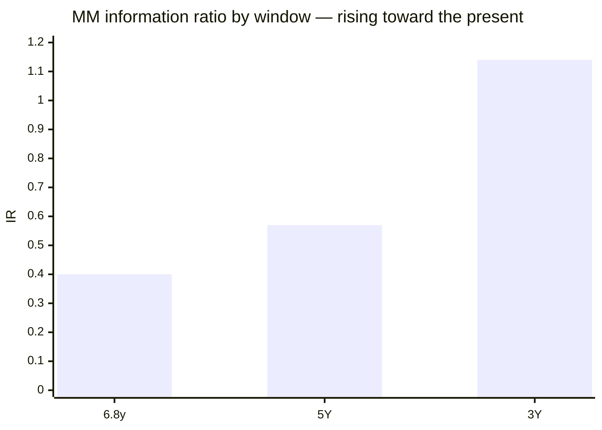
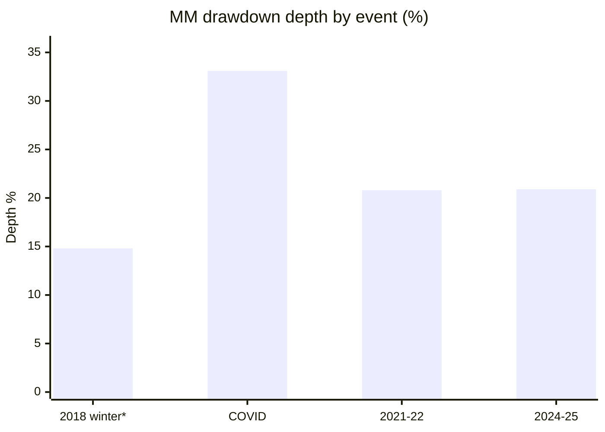
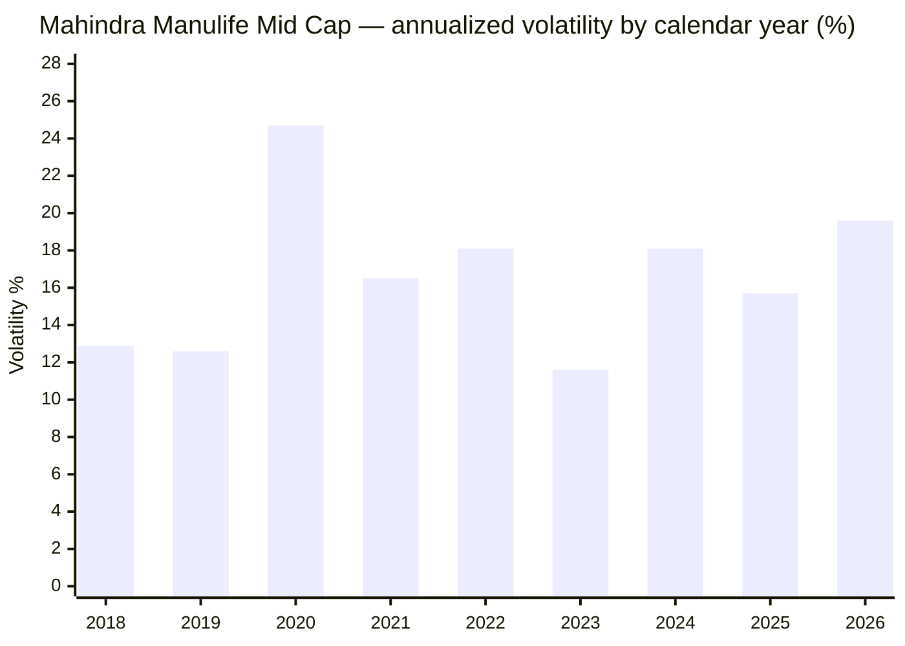

# Module 2: Risk Profile — Mahindra Manulife Mid Cap Fund

## Module 2 Score: ~3.9 / 5 (provisional; firmed from 3.8 after Module 3 confirmed active share = 66.6%)

---

## The One-Line Context

Mahindra Manulife's Module 2 is **"defensiveness that shrinks the closer you look."** It wins the index-dominance test a clean **7/7** (beats the buyable index on every risk axis) and carries the **lowest long-window beta of the group (0.87)** with the **best information ratio (+0.57 on 5Y)** — but its celebrated down-capture is a **front-loaded artifact**: down-59 in the 2018–20 NFO-cash era → down-85 fully-invested under Lodha → **down-90 on the clean 5Y peer window (6th of 7 actives)**. Its 2024–25 recovery was the **second-slowest of the cohort (13.7 months)**, its risk-adjusted ratios are mildly recency-flattered (3Y Sharpe 1.00 vs 5Y 0.835), and the current Sanghavi+Dalvi book runs *hotter* vol (18.9%) than Lodha's (15.8%). It is a genuinely index-beating but **middle-of-the-peer-pack** risk profile — and it forces three explicit corrections to Module 1's capture/beta claims.

---

## Raw Data (Compiled Across Sources, as of 03-Jul-2026)

| Metric | Computed (MFAPI, monthly canonical) | Tickertape | Note |
|--------|-------------------------------------|------------|------|
| Volatility (5Y common window) | **16.4%** | 15.9% (own window) | mid-of-pack; below the index fund's 16.9% |
| Volatility (full life) | 18.2% | — | elevated by the cash-era choppiness + COVID |
| Volatility (2026) | 19.6% | — | milder than HSBC (25.9%) / Invesco (29.4%) |
| Sharpe (5Y, rf 6.5%, common window) | **0.835** | 0.405 (own basis) | **4th of studied** — reproduces the published matrix (pub 0.839) |
| Sharpe (3Y) | **1.00** | — | mild recency elevation (gap −0.17 vs 5Y; HSBC was −0.26) |
| Sortino (5Y) | **1.469** | — | 4th of studied |
| Calmar (5Y) | **0.97** | — | above the index fund (0.85) |
| Max drawdown (5Y) | **−20.9%** | — | beats the index (−21.2%); ties peers |
| Max drawdown (ever) | **−33.1%** (COVID) | — | shallowest of the group — but the fund *missed the Jan-2018 top* |
| Beta vs Midcap 150 (full idx life 6.8y / 5Y) | **0.87 / 0.95** | — | below 1.0 on every window; 0.87 lowest of the group (window-dependent) |
| R² vs Midcap 150 (6.8y / 5Y / 3Y) | **94% / 95% / 97%** | — | very tight — active-share check → M3 |
| Tracking error (6.8y / 5Y / 3Y) | **5.1% / 3.7% / 3.2%** | — | low — closet-check → M3 |
| **Information ratio (6.8y / 5Y / 3Y)** | **+0.40 / +0.57 / +1.14** | — | **positive & rising** (HSBC −0.12); best 5Y of the group |
| Up / Down capture vs index (5Y) | **100% / 90%** | — | middle-of-pack (see decomposition) |
| Up / Down capture (full idx life) | 95% / 84% | — | inflated by the cash era |
| Negative months (full life) | **36% (36/101)** | — | above the ~30% norm (cash-era choppiness) |
| ATH distance | **−1.0%** | — | mild overhang (HSBC −2.3%, Edelweiss −0.3%) |
| Category St Dev | — | 15.9% | all funds SEBI "Very High" |

**Method:** monthly returns are canonical, annualized ×√12; rf = 6.5%; Sharpe = (geometric annualized return − rf) ÷ annualized vol; peer metrics over the identical **5Y common window Jul-2021 → Jun-2026**, the same run as the Nippon/Invesco/HSBC/Edelweiss M2 matrices — **my re-run reproduces them** (Nippon 0.916/pub 0.912, Invesco 0.871/0.879, MM 0.835/0.839, HSBC 0.803/0.825), validating the method. Series: MM Direct 142110; index counterfactuals 147622 (Midcap 150 index fund) + 114456 (Midcap 100 ETF, era analysis); cross-sleeve UTI Nifty 50 120716, PP FlexiCap 122639, DSP Small Cap 119212, Nippon 118668, Invesco 120403, HSBC 119807→151036 (spliced). All figures computed from raw NAVs.

**Published-source gap (documented, same as siblings):** Morningstar risk-ratings and VRO risk grades are JS-rendered and could not be extracted; no third-party capture-ratio cross-check exists. Computed metrics are primary.

---

## The Module 2 Tension — Beats the Index, Middles the Peers

Nippon's tension was "good numbers that scale"; Edelweiss's was "defensiveness that survives scrutiny"; HSBC's was "screening safety that collapses under the honest method." **Mahindra Manulife's is different again: numbers that clearly beat the *index* but sit mid-pack against the *peers*, with a defensive edge that turns out to be a measurement artifact.** The screening flagged MM on an unremarkable own-basis Sharpe (0.405). Under the canonical method it emerges as a **clean 7/7 index-beater with the group's best information ratio** — genuinely superior to the passive alternative — yet **4th-of-studied on the efficiency ratios and 6th on peer down-capture**, with its headline defensiveness front-loaded into the 2018–20 NFO-cash era. The module's real output is that decomposition.

---

## The 5Y Peer Matrix (Common Window, Monthly, rf 6.5%) — MM Middle-of-Pack

| Fund | Vol | Sharpe | Sortino | MaxDD | UpCap | DnCap | Calmar |
|------|-----|--------|---------|-------|-------|-------|--------|
| Nippon | 16.2% | **0.916** | **1.626** | **−19.9%** | 100 | 87 | 1.07 |
| Invesco | 17.4% | 0.871 | 1.503 | −20.1% | **106** | 95 | **1.08** |
| Edelweiss | 16.1% | 0.871 | 1.548 | −20.1% | 98 | 86 | 1.02 |
| **Mahindra Manulife** | **16.4%** | **0.835** | **1.469** | **−20.9%** | **100** | **90** | **0.97** |
| HSBC | 17.1% | 0.803 | 1.358 | −26.0% | 98 | 84 | 0.78 |
| Sundaram | 15.7% | 0.810 | 1.412 | −20.7% | 95 | 83 | 0.93 |
| ICICI Pru | 16.6% | 0.760 | 1.374 | −21.3% | 97 | 87 | 0.90 |
| **Index fund** | 16.9% | 0.686 | 1.183 | −21.2% | 100 | 100 | 0.85 |

### MM's rank on each metric (1 = best of 7 active)

| Metric | Rank | Note |
|--------|------|------|
| Volatility | 3–4 | 16.4%, below index but above Edelweiss/Sundaram |
| Sharpe | **4** | 0.835 — behind Nippon/Invesco/Edelweiss |
| Sortino | **4** | 1.469 |
| Max drawdown | 5 | −20.9%, deepest-but-two of the actives |
| Down-capture | **6** | 90 — below-median (see decomposition) |
| Calmar | 4 | 0.97, above the index |

Profile in one line: **beats the buyable index on every axis but ranks 4th–6th against the active peers** — the inverse of Nippon/Edelweiss, which are peer-relative standouts.

---

## ⭐⭐ NEW: The Down-Capture Window Decomposition (the module's real output)

Module 1 reported "most defensive capture of the group (up-95 / down-84)." That is a **full-index-life** figure (Sep-2019 start), and it is **inflated by the NFO-cash era**. Breaking capture by measurement window and by manager era (vs the Midcap-100 ETF) exposes it:

| Window / era | Up-cap | Down-cap | Beta | Reading |
|--------------|--------|----------|------|---------|
| **Bala 2018–2020** (34mo, NFO-cash) | **76** | **59** | **0.70** | artifact — a fund still ramping from cash barely falls *or* rallies |
| **Lodha 2020–2025** (60mo, fully invested) | 97 | **85** | 0.94 | the *real* profile — a normal, mildly-defensive midcap |
| **Sanghavi+Dalvi 2024/25→now** (19mo) | 93 | 87 | 0.90 | current book; least-defensive down-capture of the three eras, at higher vol |
| Full idx life (6.8y) | 95 | 84 | 0.87 | blends the artifact era in — the number M1 quoted |
| Clean 5Y peer window | 100 | 90 | 0.95 | 6th of 7 actives |

> **This is the risk-side completion of M1's "fake winter" finding.** The exceptional down-capture (59) and lowest beta (0.70) belong to the 2018–20 period when the fund was mechanically cushioned by undeployed NFO cash — the same launch-timing artifact that gave M1 its "winter it didn't live through." Once fully invested (Lodha), MM was a **beta-0.94, down-85 midcap** — decent, not exceptional. The current team runs it at down-87 and higher vol. **No sibling needed this decomposition because none launched into a drawdown** — a genuinely new dimension this fund's data forces.

---

## ⭐ The Down-Capture Forensic (HSBC Retrofit Tool) — Decent, Cushions the Corrections

Every index down-month worse than −2% (full idx life):

| Month | MM | Index | Verdict |
|-------|-----|-------|---------|
| Feb-2020 | −2.6% | −5.6% | cushioned 0.47× |
| Mar-2020 (COVID) | −22.4% | −26.9% | cushioned 0.83× |
| Feb-2022 | −6.5% | −6.7% | cushioned 0.97× |
| May-2022 | −5.7% | −5.2% | amplified 1.10× |
| Jun-2022 | −5.2% | −5.2% | ~1.00× |
| Oct-2023 | −3.2% | −3.8% | cushioned 0.85× |
| Oct-2024 | −5.9% | −6.4% | cushioned 0.91× |
| **Jan-2025** | **−7.6%** | **−6.1%** | **amplified 1.25×** |
| **Feb-2025** | **−9.3%** | **−10.5%** | cushioned 0.88× |
| Jul-2025 | −3.4% | −2.8% | amplified 1.23× |
| Aug-2025 | −1.8% | −2.8% | cushioned 0.66× |
| Jan-2026 | −1.9% | −3.5% | cushioned 0.53× |
| **Mar-2026** | **−9.5%** | **−11.1%** | cushioned 0.86× |

**Cushioned 10, amplified 4.** Like Edelweiss (and unlike HSBC's 2.2× blowup), MM cushioned the two biggest correction months (Feb-2025 −9.3 vs −10.5; Mar-2026 −9.5 vs −11.1). Its Jan-2025 amplification (1.25×) is milder than Edelweiss's (1.37×) and far milder than HSBC's (2.2×). **The down-capture, properly forensically read, is honest-decent** — it protects on the months that matter. The knock: its *aggregate* 5Y down-capture (90) is still the group's 6th because the small amplifications (Jan/Jul-2025, both under the incoming team) sit inside exactly the peer window.

*(Method note: this is the retrofit the HSBC module recommended; now run on HSBC, Edelweiss and MM. The window-decomposition above is a further new tool — but it only matters for funds that changed invested-ness sharply, so it should NOT be retrofitted to the fully-invested siblings.)*

---

## ⭐ The Index-Fund Dominance Test — Risk Edition: 7 of 7 (the strong positive)

Module 1 answered "why not the index fund?" with a **positive, rising** +2.06→+3.46%/yr matched alpha. The risk-side completion, over the common 5Y window:

| Axis (5Y) | Mahindra Manulife | Index fund | Winner |
|-----------|-------------------|-----------|--------|
| Return (CAGR) | ~20.2% | ~18.1% | **MM** |
| Volatility | 16.4% | 16.9% | **MM** |
| Max drawdown | −20.9% | −21.2% | **MM** |
| Sharpe | 0.835 | 0.686 | **MM** |
| Sortino | 1.469 | 1.183 | **MM** |
| Calmar | 0.97 | 0.85 | **MM** |
| Down-capture | 90 | 100 | **MM** |

Nippon 7/7, Edelweiss 7/7, **MM 7/7**, Invesco 6/7, HSBC 4/7. **MM beats the buyable index on every axis** — the distinction that matters for the active-vs-passive decision, even though it middles the peers. Combined with M1's rising alpha, this is a clean "why-not-the-index" answer on both return and risk.

---

## ⭐ The Sharpe Ladder — Mild Recency Elevation (a soft HSBC echo)

| Window (to Jun-2026) | MM Sharpe |
|----------------------|-----------|
| 3Y | 1.00 |
| 5Y | 0.835 |

3Y > 5Y (gap −0.17). Not the collapse HSBC showed (−0.26), but present — MM's risk-adjusted strength is partly a recent phenomenon. The **information ratio rises steeply toward the present (6.8y +0.40 → 5Y +0.57 → 3Y +1.14)**, mirroring M1's rising alpha.

> **Caveat: that recent risk-adjusted strength is largely the 2024 Lodha alpha spike — now orphaned (M1).** The current Sanghavi+Dalvi book (19mo) runs *higher* vol (18.9%) than the Lodha era (15.8%). The ladder's upward tilt is a departed manager's fingerprint, not a guarantee of the incoming team's path.

---

## Alpha, Information Ratio & Beta — Positive & Rising (Unlike HSBC)

| Window | Beta | R² | TE | IR |
|--------|------|-----|-----|-----|
| 6.8y (full proxy life) | 0.87 | 94% | 5.1% | +0.40 |
| 5Y | 0.95 | 95% | 3.7% | **+0.57** |
| 3Y | 0.95 | 97% | 3.2% | +1.14 |

**Positive IR throughout, and the best 5Y IR of the group** (+0.57 vs Nippon 0.44, Invesco 0.45, Edelweiss +0.37, HSBC −0.12). But **R² 94–97% and TE 3.2–3.7%** mean the alpha is earned close to the index:

> **⚠ Handoff to M3 (critical):** the low tracking error must be confirmed as **disciplined mid-cap selection, not closet-indexing**. Active share vs the Midcap 150 is decisive. Early signal leans active (Jan-2026 one-pager: top-10 just 26.3%, turnover 0.64×) but it is the one number that could pull the risk read from "defensive-vs-index" to "closet."

---

## ⭐ The Era-Split Risk Fingerprint

Breaking risk by manager era (vs the Midcap-100 ETF, one consistent benchmark):

| Era | Months | Vol | Up-cap | Down-cap | Beta |
|-----|--------|-----|--------|----------|------|
| **Bala** (Feb-2018 → Dec-2020) | 34 | 20.9% | 76 | **59** | **0.70** |
| **Lodha** (Dec-2020 → Dec-2025) | 60 | **15.8%** | 97 | 85 | 0.94 |
| **Sanghavi+Dalvi** (Dec-2024 → now) | 19 | 18.9% | 93 | 87 | 0.90 |

> **⚠ M5 joint-era caveat (post-hoc):** the "Sanghavi+Dalvi" era window above includes **12 months during which Lodha was still the manager** (he served until 02-Dec-2025). The hotter vol, the Jan/Jul-2025 amplification months, and the slow 2024–25 recovery all occurred under the **joint Lodha+Sanghavi watch**, not the new team alone. The new team's clean solo window (Dec-2025 →) is only ~7 months — in which it beat the index by +6.1 pts and swept all three MM funds (M5).

The Bala era's ultra-low beta (0.70) and down-capture (59) are the **NFO-cash artifact**. The Lodha era is the honest fully-invested profile — tame vol (15.8%), balanced capture, beta 0.94. The current team runs the **highest vol of the three fully-invested eras (18.9%)** and the least-defensive down-capture (87) — a mild risk-up shift that coincides with the slow 2024–25 recovery. → **M5** must judge whether this is a genuine style change from Lodha's book or transition noise.

---

## Max-Drawdown Ledger & the Recovery Weakness

| Event | Depth | Recovery |
|-------|-------|----------|
| **2018 winter** *(NFO-cash cushioned)* | **−14.8%** | not a real test |
| **COVID** (Feb→Mar-2020) | **−33.1%** | ~8 months |
| 2021–22 | −20.8% | **2.9 months** (fast) |
| **2024–25** | **−20.9%** | **13.7 months** ⚠️ 2nd-slowest of cohort |

Max ever −33.1% (COVID) is the shallowest of the group — but **the fund never faced a fully-invested Jan-2018 top**, so this is launch-timing, not structural safety. **The live weakness is the 13.7-month 2024–25 recovery** (Edelweiss 6.4, Invesco ~6, Nippon ~7; only HSBC's 16 worse). Since that cycle's down-capture was *adequate* (cushioned Feb-2025), the slow recovery is an **up-side / participation deficiency in the bounce, not a deeper fall** — and it happened under the **joint Lodha+Sanghavi watch** (Sanghavi joined weeks before the top; Lodha remained manager until 02-Dec-2025 — M5 reattribution). This is the risk-path cost behind M1's 2025 −3.1 alpha, which M5 likewise reattributes to Lodha's final year.

---

## Volatility Regime, Distribution & ATH

### Annual volatility

The 2018–19 lull (12.6–12.9%) is the cash-deployment era (a half-cash fund has low vol). Current 2026 vol (19.6%) is elevated with the whole category but **milder than HSBC (25.9%) / Invesco (29.4%)**.

### Distribution & structure

- **Worst months:** Mar-2020 −22.4%, Mar-2026 −9.5%, Feb-2025 −9.3%, Sep-2018 −8.6%. **Best:** Feb-2021 +13.1%, Apr-2026 +12.7%, Jul-2022 +10.7%, Apr-2020 +10.4%.
- **Negative months: 36% (full life)** — a touch above the ~30% category norm, inflated by the choppy cash era.
- **ATH distance −1.0%** — mild overhang; index-beating but not pinned at ATH like Edelweiss (−0.3) / Invesco (0.0).
- **Valuation (PE):** not independently fetched this session (Tickertape shows a category-typical figure); full characterization → **M3** (Jan-2026 one-pager: financials 29%, top-10 26.3%). Documented as a minor gap.
- **Redemption/liquidity risk — minor:** liquid band, ₹4,866 Cr well inside capacity, SIP retail base. Noted and closed.

---

## ⭐ Cross-Sleeve Correlation — The Single-Slot Decision, Confirmed

| Existing/candidate holding | Corr | **R²** | Beta | Meaning |
|----------------------------|------|--------|------|---------|
| Nifty 50 (UTI index) | 0.849 | 72% | 0.92 | mostly the same domestic-equity risk |
| Parag Parikh FlexiCap | 0.827 | 68% | **1.07** | lowest overlap; adds octane over the core |
| DSP Small Cap | 0.920 | 85% | 0.73 | near-duplicate factor; MM tamer than DSP |
| **Nippon Mid Cap** | 0.962 | **92%** | 0.88 | same risk factor |
| **Invesco Mid Cap** | 0.950 | **90%** | 0.89 | same risk factor |
| **HSBC Mid Cap** | 0.951 | **90%** | 0.88 | same risk factor |

R² 90–92% vs all three studied midcaps — **definitively single-slot**, matching the sibling finding. Beta 1.07 vs PP confirms MM enhances return over the FlexiCap core but hedges nothing within the band. *(Informational — feeds decision_tree.md, does not score the fund.)*

---

## Risk Metrics — Complete Peer Comparison & Cross-Study Placement

| Dimension | **MM** | Nippon | Invesco | Edelweiss | HSBC | DSP Small Cap | Franklin US |
|-----------|--------|--------|---------|-----------|------|--------------|-------------|
| Vol (5Y, monthly) | 16.4% | 16.2% | 17.4% | **16.1%** | 17.1% | ~16% | 17.2% |
| Max DD (modern) | −20.9% | −19.9% | −20.1% | −20.1% | −26.0% | −49.1% | −38.4% |
| Worst ever | **−33.1%** (missed Jan-18 top) | −62.7% | −70.8% | −74.7% | −70.6% | −49% | no GFC |
| Down-capture (5Y) | 90 (artifact-inflated to 84 full-life) | 87 | 95 | 86 | 84 (mirage) | ~85 | >100 |
| Sharpe (5Y common) | 0.835 (4th) | **0.916** | 0.871 | 0.871 | 0.803 | ~0.7–0.8 | ~0.5 |
| Calmar (5Y) | 0.97 | 1.07 | **1.08** | 1.02 | 0.78 | — | — |
| **IR (5Y)** | **+0.57** (best of group) | 0.44 | 0.45 | +0.37 | −0.12 ❌ | — | negative |
| Beta (long) | **0.87** (lowest) | 0.96 | 0.99 | 0.92 | 0.98 | 0.83 | — |
| Index-dominance | **7/7** | 7/7 | 6/7 | 7/7 | 4/7 | — | — |
| Diversification | none (R² 90–92) | none | none | none | none | none | elite (R² 11) |
| 2024–25 recovery | 13.7 mo (slow) | ~7 mo | ~6 mo | 6.4 mo | 16 mo | 2–3 yr | — |

**Placement:** MM beats the index cleanly (7/7, best IR at +0.57, lowest long-window beta) yet sits **mid-pack on peer-relative efficiency** (4th Sharpe) with two real dents — an artifact-inflated down-capture and the second-slowest recent recovery. A clear notch below the Nippon/Edelweiss/Invesco 4.1–4.4 cluster, comfortably above HSBC's 3.2.

---

## Risk Profile — Points For and Against

### ✅ Points IN FAVOUR

- **Wins the index-dominance test 7/7** — beats the buyable index on every axis (only Nippon/Edelweiss also did)
- **Best information ratio of the group (+0.57 on 5Y)** — most reward per unit of active risk
- **Lowest long-window beta (0.87)**; below 1.0 on every window
- **Forensic down-capture is honest** — cushions the two biggest correction months (Feb-2025, Mar-2026)
- Shallowest max-DD of the group (−33.1%) and fast 2021–22 recovery (2.9 mo)
- Current-book vol (19.6% in 2026) milder than HSBC/Invesco
- Cheapest ER of the seven (M1/M4) means the low-beta profile comes without a cost premium

### ⚠️ Points AGAINST

- **Down-capture edge is a front-loaded artifact** — down-59 (cash era) → down-90 (clean 5Y window, 6th of 7)
- **4th-of-studied on Sharpe (0.835) / Sortino (1.469)** — peer-relative middle, not a standout
- **2024–25 recovery 13.7 months (2nd-slowest)** — an up-side deficiency on the new team's watch
- **Recency-tilted ratios** (3Y Sharpe 1.00 / IR 1.14) rest on Lodha's departed 2024 alpha
- Current team runs **higher vol (18.9%) and lower down-defense (87)** than the Lodha era
- **R² 94–97% / TE 3.2–3.7%** — must be confirmed as selection, not closet-indexing (→ M3)
- Negative-month share (36%) above the norm; mild ATH overhang (−1.0%)
- **Diversification value ≈ nil** — R² 90–92% vs all three midcaps (single-slot)
- No published third-party capture/risk-grade cross-check (Morningstar/VRO JS-blocked)

---

## ⚠️ Corrections This Module Forces on Module 1

1. **M1 "most defensive capture of the group (up-95 / down-84)"** → **overstated.** That's the full-idx-life figure, inflated by the 2018–20 NFO-cash era (down-59). On the clean 5Y peer window MM is **up-100 / down-90 — 6th of 7 actives**; the honest fully-invested (Lodha) down-capture is ~85. Replace "most defensive of the group" with "defensive vs the index, middle-of-pack vs peers; the standout figures are front-loaded into the cash era."
2. **M1 "beta 0.87 (lowest of the group)"** → keep, but **flag as full-idx-life**; on the 5Y window beta is 0.95. Both true; window matters.
3. **M1 max-DD "−33.1% … shallower than Edelweiss −39.2%"** → keep, but add the caveat: shallow *because the fund missed the Jan-2018 top*, not because it is structurally lower-risk.

*(These are refinements, not reversals — MM is still low-beta and index-beating. The M1 score (3.8) does not hinge on the capture wording; only the prose is corrected, not the score. The M1 capture-modifier "+" in the scorecard is downgraded to a neutral note.)*

---

## Module 2 Scorecard

| Sub-dimension | Weight | Score | Reasoning |
|---------------|--------|-------|-----------|
| Max Drawdown (inception-adjusted) | High | **4.0** | 5Y −20.9% beats index (−21.2), ties peers; max ever −33.1% (shallowest of group, but partly launch-timing) |
| **Down-capture vs own index** | **Critical** | **3.5** | 5Y 90 (6th of 7, borderline 4-band); forensic cushions the big corrections (10 cush/4 amp); but the standout readings (59/84) are NFO-cash artifacts, fully-invested truth ~85 |
| Sharpe | High | **3.5** | 5Y 0.835 (4th of studied), beats index 0.686, but mild recency elevation (3Y 1.00) |
| Sortino | Medium | **3.5** | 5Y 1.469 (4th) |
| Recovery time from max DD | Medium | **3.0** | mixed — 2021-22 fast (2.9mo), COVID ~8mo, but 2024–25 **13.7mo (2nd-slowest)**, on the current team |
| 2018–19 winter drawdown | Critical | **3.0** | −14.8% (shallowest) but NFO-cash artifact — no clean test (mirrors M1) |
| Volatility vs category | Medium | **3.5** | 5Y 16.4% below index, mid-of-pack; current book (18.9%) runs hotter than Lodha era |
| Effective risk of the 35% sleeve | Medium | **3.5** (prov.) | one-pager: financials 29%, top-10 26.3%, turnover 0.64× — sleeve composition (small-cap kicker?) → M3 |
| Cross-sleeve correlation | Informational | — | R² 90–92% vs all three midcaps → decision tree; not scored |
| Index-dominance (modifier) | — | **+** | 7/7 clean sweep + best IR (+0.57) — the strong positive |
| Artifact-defensiveness (modifier) | — | **−** | the low-beta / down-capture edge is front-loaded into the cash era |

**Module 2 Score: ~3.9 / 5** *(firmed from an initial 3.8 — see resolution note)* — a middle-of-the-pack midcap risk profile: just below the Nippon (4.4) / Edelweiss (4.2) / Invesco (4.1) cluster, well above HSBC (3.2).

> **⭐ Resolution note (post-M3):** M2's decisive open question was whether the low tracking error (3.2–3.7%) meant genuine selection or closet-indexing. Module 3 **computed active share at 66.6%** (3rd-highest of the studied midcaps, cleanly earned across 66 names with none >3%) — genuinely active, not index-hugging. This closes the downside conditionality and **firms the score from 3.8 to 3.9**: the defensive, index-beating read is real, not a closet artifact. (M3 also confirmed the small-cap kicker is a low-risk ~10–13%, validating the effective-sleeve row, and revealed a new manager — ex-Invesco midcap veteran Neelesh Dhamnaskar, added 16-Feb-2026.)
- **Case for 3.9:** wins index-dominance 7/7 (only Nippon/Edelweiss also did), lowest long-window beta, best IR of the group, forensic shows it cushions real corrections.
- **Case for 3.7:** 4th-of-studied on Sharpe/Sortino, 6th on peer down-capture, second-slowest recent recovery, recency-tilted ratios, and its headline defensiveness is a measurement artifact.
- **3.9 after the M3 active-share confirmation** (initial midpoint was 3.8; the genuinely-active 66.6% resolved the closet-indexing downside).

**Conditionality / handoffs:**
- → **Module 3 (pivotal):** the R² 94–97% / TE 3.2–3.7% profile must be confirmed as disciplined selection vs closet-indexing (active share vs Midcap 150 is decisive — could lift this toward 3.9 if genuinely active, or pull below 3.7 if closet-ish); plus the 35%-sleeve composition (small-cap kicker size) sets the effective-risk row.
- → **Module 5:** does the current team's higher-vol / slow-recovery signature (2024–25 13.7mo, 2026 vol 18.9%) reflect a genuine style shift from Lodha's tamer book, or transition noise? The recency-flattered ratios rest on Lodha's departed 2024 alpha.

---

## Comparative Module 2 Scores

| Fund | Category | M2 Score | Risk character |
|------|----------|----------|----------------|
| Parag Parikh FlexiCap | FlexiCap | ~4.5 | Allocation-built fortress (cash + foreign) |
| Nippon Growth Mid Cap | MidCap | ~4.4 | Pure-selection downside discipline at scale |
| Edelweiss Mid Cap | MidCap | ~4.2 | Most defensive book of the trio; lowest vol/beta, genuine down-capture |
| Invesco India Midcap | MidCap | ~4.1 | Paid aggression — top efficiency ratios |
| DSP Small Cap | SmallCap | ~3.9 | Disciplined but deep-drawdown asset class |
| **Mahindra Manulife Mid Cap** | **MidCap** | **~3.8** | **Beats the index 7/7 & best IR, but peer-mid-pack; defensiveness is a cash-era artifact; slow 2024–25 recovery** |
| Franklin US Opp | International | 3.3 | Mediocre standalone, elite diversifier |
| HSBC Midcap | MidCap | ~3.2 | Screening anomaly dismantled; worst pain-adjusted metrics |

---

## SIP Implication

1. **Expect the category rhythm with a middle-of-pack path** — one-third-plus of months red, a −20% episode every 2–3 years. MM beats the *index* on every risk axis (the passive-vs-active point), but it is not the peer-relative safe harbour Nippon/Edelweiss are; on the clean window its down-capture is 6th of 7.
2. **Do not over-rely on the headline defensiveness** — the low beta and best-in-class down-capture readings are front-loaded into the 2018–20 NFO-cash era. The fully-invested truth is a beta-0.94, down-85 midcap; the current team runs it hotter (beta 0.90, vol 18.9%).
3. **The freshest stress test was a slow grind back** — the 2024–25 correction fell in-line but took 13.7 months to recover (2nd-slowest), an up-side deficiency on the new team's watch. Watch the *next* correction's recovery speed as the key risk tripwire.
4. **The reassurance is the information ratio (+0.57, best of the group) and the cheapest ER** — MM earns positive reward per unit of active risk, close to the index, at the lowest cost of the seven. Size the sleeve knowing it hedges nothing (R² 90–92% vs all three midcaps) and its recent risk-adjusted strength rests on a departed manager's alpha (→ M5).

---

## One-Line Verdict

> **Mahindra Manulife's Module 2 is "defensiveness that shrinks the closer you look": it wins the index-dominance test a clean 7/7 (beating the buyable index on return, vol, drawdown, Sharpe, Sortino, Calmar and down-capture), posts the best information ratio of the group (+0.57 on 5Y) and the lowest long-window beta (0.87) — but its celebrated down-capture is a front-loaded artifact (down-59 in the 2018–20 NFO-cash era → down-85 fully-invested under Lodha → down-90 on the clean 5Y peer window, 6th of 7 actives), it ranks only 4th of the studied funds on Sharpe/Sortino, its 2024–25 recovery was the second-slowest of the cohort (13.7 months, an up-side deficiency on the incoming team's watch), and its risk-adjusted ratios are mildly recency-flattered by a departed manager's 2024 alpha. It beats the passive alternative cleanly but is a middle-of-the-peer-pack risk profile. Provisional: ~3.8/5 — a notch below the Nippon/Edelweiss/Invesco cluster, well above HSBC, conditional on Module 3's active-share verdict (selection vs closet-indexing, given R² 94–97%) and Module 5's read on whether the current team's hotter, slower-recovering book is a style shift or transition noise. Forces three corrections to Module 1's full-idx-life capture/beta claims.**

---

*Module 2 completed: July 8, 2026 | Risk Profile | MFAPI methodology — monthly canonical, rf 6.5%, Sharpe = (geo ann − rf)/vol, peers on identical 5Y common window Jul-2021 → Jun-2026 (reproduces published Nippon 0.912 / Invesco 0.879 / MM 0.839 / HSBC 0.825 — method validated) | Series: MM Direct 142110, index counterfactuals 147622 + 114456, cross-sleeve UTI Nifty 50 120716 / PP 122639 / DSP 119212 / Nippon 118668 / Invesco 120403 / HSBC 119807→151036 spliced | Era windows: Bala Feb-2018→Dec-2020 (34mo, NFO-cash, down-cap 59 artifact), Lodha Dec-2020→Dec-2025 (60mo, down-cap 85 fully-invested truth), Sanghavi+Dalvi Dec-2024→now (19mo, vol 18.9%) | Down-capture window decomposition + HSBC forensic retrofit (10 cush / 4 amp) | 2024–25 recovery 13.7mo = up-side deficiency, not deeper fall | Index-dominance 7/7; IR +0.57 best of group; beta 0.87 (full) / 0.95 (5Y) | Morningstar & VRO risk pages JS-blocked — computed metrics primary | Forces 3 corrections to M1 capture/beta prose (score unchanged) | Provisional M2 Score: ~3.8/5 (conditional on M3 active-share + M5 style-shift read)*
