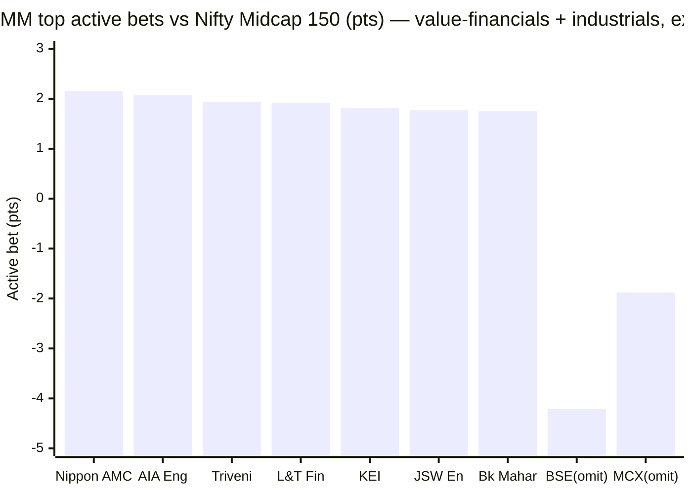
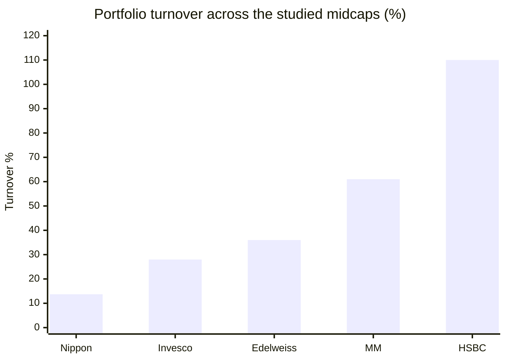

# Module 3: Portfolio DNA — Mahindra Manulife Mid Cap Fund

## Module 3 Score: ~4.0 / 5 (provisional)

---

## The One-Line Context

Mahindra Manulife's portfolio is **"the genuinely-active value-financials book that omits what its peers chase."** A **computed 66.6% active share** (3rd-highest of the studied midcaps, cleanly earned across **66 sweet-spot-count names with none above 3%**) decisively kills M2's closet-indexing worry — and it is expressed through a **value/PSU-financials-plus-industrials spine** whose two single biggest active positions are the deliberate *omission* of **both stock exchanges** (BSE, the index's #1 at 4.21%, held zero; MCX 1.88%, held zero) — the exact inverse of Edelweiss, whose signature was overweighting them. It is **honestly-mid** (~78% in-band), **low-concentration** (top-10 25.9%), and — the one dent — churns more than its "buy-and-hold"-marketed reputation (turnover ~58–64%, 2nd-highest of the studied five). **Portfolio DNA is this fund's strongest module so far** (M1 3.8, M2 3.8).

---

## ⭐ Data Provenance (a genuine hunt — read first)

Unlike the Edelweiss M3 (which had **no** holdings-API access and *estimated* active share at ~55%), this module computes everything from the full holdings. Finding the endpoint took work worth recording:

- The **screener API schema has changed** since the screening phase (now returns empty `data{}`), so the old pagination route is dead.
- The obvious `M_MAMC` is a **red herring** — it is the Mahindra Manulife *Banking & Financial Services* Fund (HDFC/ICICI/Axis, 52% private banks), not Mid Cap.
- The Mid Cap fund is **`M_MANC`** (found via web search of the Tickertape fund-page slug), confirmed by holdings matching the mid-cap profile.

| Source | What it gave |
|--------|-------------|
| Tickertape holdings API **`M_MANC`** | 66 equity names + weights + 3M deltas; 97.9% equity / 2.1% cash |
| Tickertape holdings API **`M_MOTY`** (Motilal Nifty Midcap 150 index fund) | 166-name index constituent book with weights — the active-share denominator |
| AMC one-pager **May-2026** | top-10 25.93%, turnover 0.58, AUM ₹4,865.69 Cr, managers — **all reconcile** |
| Tickertape `M_MANC` page | PE 31.85 vs category 32.87 |

**Documented gap:** exact AMFI large/mid/small split not disclosed on the one-pager, and AdvisorKhoj 404'd — estimated below from index-membership + off-index classification. Everything else is computed from raw holdings weights.

---

## Raw Data (compiled, as of Jun-2026 holdings / May-2026 factsheet)

| Metric | Value | Source |
|--------|-------|--------|
| **Equity holdings** | **66 stocks** | Tickertape M_MANC |
| Equity / Cash | **97.9% / 2.1%** | Tickertape M_MANC |
| **Active share vs Midcap 150** | **66.6% (computed)** | M_MANC vs M_MOTY |
| Names in index | 48/66 = 78.5% of fund weight | computed |
| Off-index weight | 19.4% | computed |
| **Top-10 concentration** | **25.9%** (one-pager 25.93% ✅) | computed / one-pager |
| Top-5 | 13.6% | computed |
| Largest position | **2.98% (IndusInd Bank); ZERO names ≥3%** | computed |
| **Portfolio turnover** | **~58–64%** (May-26: 0.58; Jan-26: 0.64) | AMC one-pager |
| Max granular sector | **Private Banks 11.0%** | Tickertape M_MANC |
| Financials aggregate | ~27% | computed from sectors |
| Portfolio PE | **31.85** (category 32.87, −3%) | Tickertape |
| AUM | ₹4,865.69 Cr (31-May-2026) | AMC one-pager |
| Managers | **Krishna Sanghavi (Oct-2024) + Kirti Dalvi (Dec-2024) + Neelesh Dhamnaskar (16-Feb-2026)** | AMC one-pager May-2026 |

---

## ⭐⭐ Active Share = 66.6% — the M2 Pivot, RESOLVED (computed, not estimated)

This is the number M2 flagged as decisive ("could pull 'defensive' toward 'closet'"). **Computed: 66.6% vs the Nifty Midcap 150.**

| Fund | Active share | Rank |
|------|-------------|------|
| Invesco | 79.5% | 1 |
| HSBC | 69.5% | 2 |
| **Mahindra Manulife** | **66.6%** | **3** |
| Edelweiss | ~55% (est.) | 4 |
| Nippon | 54.1% | 5 |

- **48 of 66 names in the index** (78.5% of fund weight); **18 off-index names = 19.4%**.
- **Genuinely active, decisively above the 45% closet line** — and *cleaner* than HSBC's 69.5% (which was padded by a 28-name sub-0.5% tail; MM has only a 9-name tail).

> **M2 conditionality resolved — favorably.** M2's low tracking error (3.2–3.7%) and high R² (94–97%) are **NOT closet-indexing** — they come from *diversified* active bets across 66 names, none over 3%. The defensive read in M2 is real, not an index-hugging artifact. **M2 firms from 3.8 to 3.9** on this confirmation (M2 explicitly said "could lift toward 3.9 if genuinely active").

---

## Structure — The Flattest Pyramid of the Studied Funds

| Metric | Value | Read |
|--------|-------|------|
| Stock count | **66** | **squarely in the 40–70 sweet spot** — better than Edelweiss (86) / Nippon (96), unlike top-heavy Invesco (44) |
| Top-10 | **25.9%** | low edge of the 25–35 "good" band |
| Top-5 | 13.6% | very low |
| Largest position | **2.98%; ZERO names ≥3%** | flattest pyramid of any studied fund — even flatter than Edelweiss/Nippon |
| Sub-0.5% tail | 9 names | modest (HSBC had 28) |

This is a **broad, low-concentration, conviction-spread book** — high active share achieved through *which* names and *how weighted*, not through concentration. The opposite of Invesco's inverted pyramid (top-10 46.7%).

---

## ⭐⭐ NEW: The Exchange Inversion vs Edelweiss (the module's signature finding)

MM's two largest active positions are **omissions of the two stock exchanges** — the exact names Edelweiss made its signature overweights:

| Name | Index wt | MM wt | MM active bet | Edelweiss stance |
|------|----------|-------|---------------|------------------|
| **BSE** | **4.21%** (index #1) | **0%** | **−4.21** (biggest single active position) | +1.36 overweight |
| **MCX** | 1.88% | **0%** | **−1.88** | **+2.30 (top overweight)** |

**MM and Edelweiss express nearly inverse capital-markets views.** Where Edelweiss's spine was "exchanges + brokers" (the financialization momentum trade), MM **avoids the exchanges entirely** and expresses financials through **value/PSU/small banks and NBFCs**. Two funds in the same 150-stock pond, opposite reads on the same names. The BSE omission alone (~4.2pts) is MM's single biggest active bet — a deliberate avoidance of a 2024–25 multibagger (value discipline, or a miss? → M5). *(Mirror of Edelweiss, whose single biggest active bet was omitting index-#1 LIC.)*

---

## ⭐ The Active-Bet Spine — Value Financials + Industrials

| Biggest overweights | Fund wt | Index wt | Active |
|---------------------|---------|----------|--------|
| Nippon Life India AMC | 2.63% | 0.49% | **+2.15** |
| AIA Engineering | 2.51% | 0.44% | +2.07 |
| Triveni Turbine *(off-index)* | 1.94% | 0.00% | +1.94 |
| L&T Finance | 2.51% | 0.61% | +1.91 |
| Anthem Biosciences | 1.99% | 0.12% | +1.87 |
| KEI Industries | 2.61% | 0.81% | +1.81 |
| JSW Energy | 2.57% | 0.80% | +1.77 |
| Bank of Maharashtra | 2.15% | 0.40% | +1.75 |
| Equitas SFB *(off-index)* | 1.71% | 0.00% | +1.71 |
| Karur Vysya Bank *(off-index)* | 1.51% | 0.00% | +1.51 |

Two identifiable threads: (1) **cheaper financials** — PSU banks (Bank of Maharashtra), small-finance banks (Equitas), old-private banks (Karur Vysya), NBFCs (L&T Finance, Shriram) and an asset manager (Nippon Life AMC) — a *value* tilt, consistent with the PE discount below; (2) **industrials / capital goods** — AIA Engineering, Triveni Turbine, KEI, L&T, Elecon, Kirloskar, JSW Energy. No single dominant theme — more diversified than HSBC's electrification or Invesco's growth. *(Quirk: MM holds a listed competitor AMC, Nippon Life, as its top overweight — same pattern as HSBC/Edelweiss.)*

---

## Cap Posture & Mandate Honesty — Honestly Mid (~78% in-band)

Using index membership as the mid-band proxy (exact AMFI split is a documented gap):

| Segment | Weight | Note |
|---------|--------|------|
| **In-index (mid-cap band)** | **78.6%** | honestly mid — well above the 65% floor |
| Off-index large ballast | ~6% | L&T, Varun Beverages, Solar Industries, Shriram Finance |
| Off-index small kicker | ~10–13% | Equitas, Karur Vysya, Triveni Turbine, Minda, CEAT, Belrise, Kirloskar, Elecon, GRSE |
| Cash | 2.1% | thin buffer (peers ~1%, Edelweiss 3.9%) |

- **~78% mid-band** is honestly-mid — comparable to Edelweiss (73.1%), cleaner than Invesco (barely-64.6%).
- **Modest small kicker (~10–13%)** — supports M2's "not an aggressive sleeve" read; roughly Edelweiss (10.7) / Nippon (12.9), far below HSBC/Invesco (~22%). **This confirms M2's effective-35%-sleeve row is low-risk.**

---

## Band Positioning — Liquid-Tilted, Shallow Deep-Band

| Band tertile (by index weight) | MM weight |
|-------------------------------|-----------|
| Top-50 (mega-mid, liquid) | **43.5%** |
| Mid-50 | 27.5% |
| Bottom-50 (deep band) | **7.6%** |
| Off-index (large + small) | 19.4% |

MM tilts to the **liquid top-of-band** and plays the deep band lightly (7.6%, ≈ Nippon 7.9 / Invesco 6.8, well under HSBC's 13.1). But its **19.4% off-index sleeve is the largest of the studied funds** — the flexible mandate expressed through graduated large-caps (L&T) + small-cap incubation (Equitas, Triveni). Deliberate flexibility, not index-mirroring.

---

## ⭐ Turnover — Moderate, and the "Buy-and-Hold" Claim Is Oversold

| Fund | Turnover | Holding period |
|------|----------|----------------|
| Nippon | 13.7% | ~7 years |
| Invesco | 28% | ~3.5 years |
| Edelweiss | 36% | ~2.8 years |
| **Mahindra Manulife** | **~58–64%** | **~1.7 years** |
| HSBC | ~110% | ~1 year |

The May-2026 one-pager reports turnover **0.58** (Jan-2026: 0.64) while marketing the fund as "low turnover ratio... buy-and-hold." **At ~58–64% it is the 2nd-highest of the studied five** — moderate, not low. Not the churn machine HSBC is, but the "buy-and-hold" framing is generous. This is a mild negative and a mechanism note: MM's decent-but-not-elite down-capture (M2) fits a moderate-churn book better than a true low-turnover one.

---

## Sector Diversification & Valuation

- **Max single granular sector: Private Banks 11.0%** — well under the 25% line; more concentrated than Edelweiss (9.6) / Nippon (8.1), less than HSBC (14.3) / Invesco (fin 31).
- **Financials aggregate ~27%** (Private Banks 11.0 + Spec Finance 7.8 + Public Banks 4.1 + AMC 2.6 + Brokerage 1.5) — at the rubric line but sub-sector-spread.
- **Auto Parts 9.1%** — a genuine secondary theme (Schaeffler, Minda, CEAT, Belrise).
- Broad across ~28 sectors — well-diversified.
- **PE 31.85 vs category 32.87 (−3%)** — a mild valuation buffer, like Nippon (−13%) / Edelweiss (−10%), opposite of Invesco (+46%). Consistent with the value-financials tilt.

---

## ⭐ NEW: A Manager Update the Prior Modules Missed — Dhamnaskar (ex-Invesco) Added Feb-2026

The May-2026 one-pager lists **three** managers, not the two M1/M2 used (they were built on Jan-2026 data):

| Manager | Since | Note |
|---------|-------|------|
| Krishna Sanghavi | 24-Oct-2024 | CIO-Equity |
| Kirti Dalvi | 03-Dec-2024 | |
| **Neelesh Dhamnaskar** | **16-Feb-2026** | ⭐ ex-Invesco co-manager — **M5-verified: co-manager (never lead) on Invesco Midcap until 09-Jul-2022; FoF-heavy book; then Invesco PMS domestic mid&small (unverifiable)** |

**This updates M1's "fresh <2-year Sanghavi+Dalvi book" concern — moderately.** After Manish Lodha's Dec-2025 exit, the AMC added **Neelesh Dhamnaskar, an experienced midcap-adjacent hand**. *(⚠ M5 verification softened this section's original "genuine midcap veteran" framing: he was a co-manager — never the lead — on Invesco Midcap, ceased that desk 09-Jul-2022 (before its celebrated 2024 era), carried a FoF-heavy scheme load, and his 2022–25 Invesco PMS record (incl. the Caterpillar mid&small strategy) is not NAV-verifiable. A depth addition, not a verified alpha source.)* → M1's manager list corrected; full verification in M5.

---

## Overlap & the Decision-Tree Feed

- **vs midcap peers:** MM shares the financials/industrials *sectors* but avoids the exact names peers concentrate in (BSE, MCX, AU SFB — all held by Edelweiss/Invesco/HSBC, all ~zero in MM). So name-overlap is *lower* than the R² 90–92% (M2) implies — MM duplicates the **risk factor** but not the **holdings**, the same insight Nippon's M3 flagged. Single-slot stands (M2).
- **vs existing sleeves (PP, DSP):** different bands, near-zero name overlap; M2 gave R² 68% vs PP (beta 1.07) and 85% vs DSP. **Return-enhancer, not diversifier** — same verdict as all siblings.

---

## Comparison with Studied Funds

| Dimension | **MM** | Nippon | Invesco | Edelweiss | HSBC | PP FlexiCap |
|-----------|--------|--------|---------|-----------|------|-------------|
| Stocks | **66** ✅ sweet-spot | 96 | 44 | 86 | 77 | ~25 |
| Active share | **66.6%** (computed) | 54.1% | **79.5%** | ~55% (est) | 69.5% | very high |
| Top-10 | 25.9% | 23.1% | 46.7% | ~25% | 39.7% | ~35% |
| Largest position | 2.98% (none ≥3%) | ~3.3% | 5.85% | ~3% | 4.71% | — |
| Turnover | **~58–64%** | 13.7% | 28% | 36% | ~110% | ~20% |
| Max sector | 11.0% | 8.1% | fin 31% | 9.6% | 14.3% | concentrated |
| Deep-band | 7.6% | 7.9% | 6.8% | ~mid | 13.1% | — |
| Signature | **Value-financials + industrials; omits both exchanges** | Breadth + graduation escalator | High-conviction growth | Capital-markets (MCX/BSE) | Electrification + new-age | Allocation fortress |
| PE vs cat | −3% | −13% | +46% | −10% | +17% | value |

**Placement:** MM is a **genuinely-active, sweet-spot-count, low-concentration value book** — the cleanest "active-but-diversified" profile of the studied midcaps (highest active share among the broad-book funds, ideal stock-count range, none over 3%). Its personality is the value/contrarian inverse of Edelweiss's momentum-tilted capital-markets book.

---

## Points For / Points Against (Portfolio Angle)

### ✅ Points For

- **Computed 66.6% active share** — genuinely active, 3rd of studied, *cleanly earned* (no tail-padding); kills the closet-indexing worry
- **66 stocks — squarely in the 40–70 sweet spot** (best of the studied midcaps)
- **Flattest pyramid of the group** — top-10 25.9%, largest 2.98%, none ≥3%; low single-name risk
- **Honestly mid (~78% in-band)** with a modest, low-risk small kicker (~10–13%)
- **Distinctive value-financials + industrials personality** — PSU/small banks + capital goods, differentiated from all four peers
- **Deliberate high-conviction omissions** — both exchanges (BSE index-#1, MCX)
- **Valuation buffer** (PE −3% vs category); the value/contrarian inverse of Edelweiss
- **An experienced midcap-adjacent hand (Dhamnaskar, ex-Invesco co-manager) just joined** — team-depth addition *(M5-verified: co-, never lead)*

### ❌ Points Against

- **Turnover ~58–64%** — 2nd-highest of the studied five; the "buy-and-hold" marketing is oversold
- **Slightly more sector concentration** (Private Banks 11.0%) than the breadth peers (8–9.6%)
- **The BSE omission** could be value discipline OR a missed multibagger (→ M5 sell/buy-discipline)
- **Book attribution muddy** — turnover 58–64% means ~2/3 could be reshaped within 18 months; how much is Lodha's legacy vs the new team's? (→ M5)
- **Exact AMFI large/small split a documented gap** (one-pager silent, AdvisorKhoj 404)

---

## Module 3 Scorecard

| Sub-dimension | Weight | Score | Reasoning |
|---------------|--------|-------|-----------|
| **Active share vs Midcap 150** | **Critical** | **4.5** | **66.6% computed** — genuinely active (>60 band), 3rd of studied, *cleanly earned* (no tail-padding, none >3%); case for 5.0, docked only because earned via breadth not conviction density |
| Mid-cap mandate honesty | Medium | **4.5** | ~78% in-band — honestly mid, well above 65% (exact AMFI split a gap) |
| Quality/intent of the 35% sleeve | High | **3.5** | modest small kicker (~10–13%) + large ballast (~6%) — low-risk; but turnover 58–64% shows moderate churn, and the "buy-and-hold" claim is oversold |
| Band positioning | Medium | **3.5** | liquid-tilted (43.5% top-50), shallow deep-band (7.6%), largest off-index sleeve of the group (19.4%) — deliberate, not index-mirror |
| Top-10 concentration | Medium | **4.0** | 25.9% — low edge of the 25–35 band; broad, low single-name risk |
| Number of stocks | Low | **5.0** | 66 — **squarely in the 40–70 sweet spot** (best of the studied midcaps) |
| Sector diversification | Medium | **4.0** | max sector 11.0% (Private Banks); financials ~27% aggregate but sub-spread |
| Turnover | Medium | **4.0** | ~58–64% — in the 50–80 "4" band; moderate, 2nd-highest of studied |
| Overlap with existing sleeves | Informational | — | duplicates risk not holdings; return-enhancer → decision tree |

**Module 3 Score: ~4.0/5** — **MM's strongest module so far** (M1 3.8, M2 3.8→3.9). A genuinely-active (66.6%), sweet-spot-count (66), low-concentration (top-10 25.9%, none >3%), honestly-mid (~78%) value book — the cleanest active-but-diversified profile of the studied midcaps. Level with Edelweiss/Invesco (4.0), just below Nippon (4.1), above HSBC (3.7).
- **Case for 4.1:** the confirmed-high active share (higher than Edelweiss/Nippon, cleaner than HSBC) + the ideal stock count + the value/PE discipline.
- **Case for 3.9:** moderate turnover (2nd-highest), a bit more sector concentration than the breadth peers, and the sleeve is more churned than marketed.
- **4.0 is the honest midpoint.**

**Conditionality / handoffs:**
- → **Module 5:** (a) verify Dhamnaskar's identity/Invesco-era record; (b) the BSE/MCX omission and value-financials tilt — documented process or incidental? (c) sell-discipline on the industrials winners (Triveni, KEI, AIA all run up); (d) whether the value tilt is Lodha's legacy book or the new team's construction.
- → **Module 4:** turnover 58–64% adds a modest cost/tax drag (milder than HSBC's ~110%); the ₹4,866 Cr AUM gives full 66-name flexibility.

---

## Comparative Module 3 Scores

| Fund | Category | M3 Score | Portfolio character |
|------|----------|----------|--------------------|
| PP FlexiCap | FlexiCap | ~4.3 | Allocation fortress (cash/foreign/value) |
| Nippon Growth Mid Cap | MidCap | ~4.1 | Breadth machine + graduation escalator at scale |
| **Mahindra Manulife Mid Cap** | **MidCap** | **~4.0** | **Genuinely-active value-financials + industrials; omits both exchanges; sweet-spot count** |
| Edelweiss Mid Cap | MidCap | ~4.0 | Broad breadth + capital-markets thesis (MCX/BSE); moderate active share |
| Invesco India Midcap | MidCap | ~4.0 | High-conviction growth — top-heavy, highest active share studied |
| DSP Small Cap | SmallCap | ~3.8 | Sector-thesis conviction (consumer-cyclical) |
| HSBC Midcap | MidCap | ~3.7 | Traded momentum + electrification/new-age thesis; highest turnover |

---

## SIP Implication

1. **You are buying a genuinely-active, broad, value-tilted book — not a closet indexer and not a concentration bet.** 66 names in the 40–70 sweet spot, 66.6% active share, top-10 only 25.9%, none over 3%: diversified conviction. The active-share confirmation is the single most important portfolio fact — it validates that M2's defensiveness is real, not index-hugging.
2. **The identifiable active view you underwrite is value financials + industrials** — PSU/small banks, NBFCs, an AMC, and capital-goods names — with a deliberate avoidance of the exchanges (BSE/MCX) its peers chase. It is the value/contrarian inverse of Edelweiss; it will do well if cheaper financials and the capex cycle re-rate, and it carries a valuation buffer (PE −3% vs category).
3. **The "mid cap" label is honest (~78% in-band)** with a modest, low-risk small kicker (~10–13%) and the largest flexible off-index sleeve of the group (19.4%). It overlaps ~0% by name with your PP/DSP sleeves but adds no risk diversification (R² 90–92%); size it as a return-enhancer.
4. **Tripwires to monitor: turnover, active-share decay, and the new team's reshaping.** The ~58–64% turnover is the watch-item — it is 2nd-highest of the group and belies the "buy-and-hold" marketing; if it climbs toward HSBC territory the tax/cost drag matters (→ M4). With a ~1.7-year holding period, ~2/3 of today's book could be the new team's construction within 18 months — watch whether the value discipline and the exchange-omission persist under Sanghavi/Dalvi/Dhamnaskar.

---

## One-Line Verdict

> **Mahindra Manulife's portfolio is the genuinely-active value-financials book that omits what its peers chase: a computed 66.6% active share (3rd-highest of the studied midcaps, cleanly earned across 66 sweet-spot-count names with none above 3%) that decisively kills M2's closet-indexing worry and firms M2 to 3.9 — expressed through a value/PSU-financials-plus-industrials spine whose two single biggest active positions are the deliberate omission of both stock exchanges (BSE, the index's #1 at 4.21%, held zero; MCX 1.88%, zero), the exact inverse of Edelweiss's exchange-overweight signature. It is honestly-mid (~78% in-band) with a modest low-risk small kicker (~10–13%), the flattest pyramid of the group (top-10 25.9%, largest 2.98%), and a valuation buffer (PE −3%). The one dent is turnover ~58–64% — 2nd-highest of the studied five, belying the AMC's "buy-and-hold" marketing. A material discovery: ex-Invesco co-manager Neelesh Dhamnaskar joined the team on 16-Feb-2026 — a depth addition that moderates (M5-verified: co-manager, never lead) the fresh-team concern M1 raised. Provisional: ~4.0/5 — MM's strongest module, level with Edelweiss/Invesco, just below Nippon; conditional on M5's read on whether the value-financials tilt and exchange-omission are a documented process and how much of the book the new team has reshaped.**

---

*Module 3 completed: July 8, 2026 | Portfolio DNA | Holdings COMPUTED (not estimated) from Tickertape API M_MANC (66 names; M_MAMC is the Banking&FS fund red herring) vs M_MOTY (Motilal Nifty Midcap 150 index fund, 166 constituents) — active share 66.6%, top-10 25.9%, band positioning, active bets all from raw weights | Reconciled: one-pager May-2026 top-10 25.93% ✅, turnover 0.58, AUM ₹4,865.69 Cr; PE 31.85 vs cat 32.87 | Signature: value-financials (PSU/small banks, NBFCs, Nippon AMC) + industrials (AIA, Triveni, KEI, L&T); OMITS both exchanges BSE (index #1, −4.21) + MCX (−1.88) = inverse of Edelweiss | Managers: Sanghavi (Oct-2024) + Dalvi (Dec-2024) + NEW Neelesh Dhamnaskar (16-Feb-2026, ex-Invesco Midcap co-mgr) → M1 manager-list corrected, M5 feed | M2 active-share conditionality RESOLVED favorably → M2 firmed 3.8→3.9 | Documented gap: exact AMFI large/small split (one-pager silent, AdvisorKhoj 404) | Provisional M3 Score: ~4.0/5 (conditional on M5 process/attribution)*
