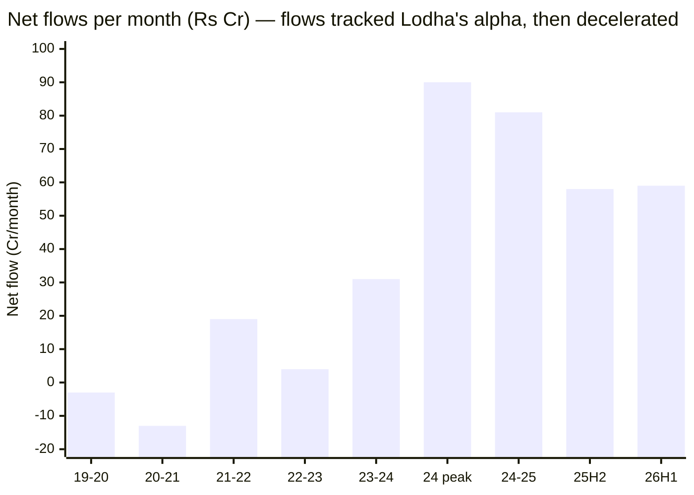
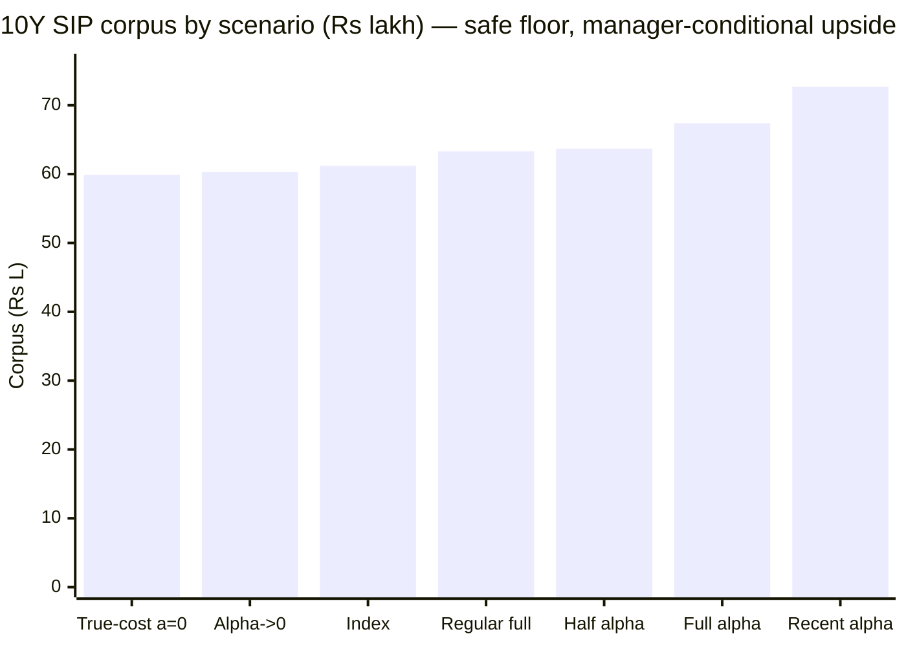

# Module 4: Cost & AUM Impact — Mahindra Manulife Mid Cap Fund

## Module 4 Score: ~4.1 / 5 (provisional)

---

## The One-Line Context

Mahindra Manulife's Module 4 is **"the best runway in the study attached to its weakest warranty."** The smallest AUM of the shortlist (₹4,866 Cr) with the gentlest flows of any studied midcap (peak +₹90 Cr/mo vs peers' +₹540–673) gives it a capacity runway measured in **decades — the only shortlist fund with no capacity clock at all**. Its 0.43–0.46% ER is the **most aggressive price-per-scale of the study** (Edelweiss needed ₹17K Cr to price at 0.42%; MM does it at ₹4.9K Cr — a deliberate growth-subsidy by the **smallest AMC studied** (₹33,153 Cr total), for whom this fund is the **~15% flagship**). But the fee-for-alpha case — a solid **~5–6× true-cost margin** on the verified +2.06%/yr alpha — rests entirely on a **departed manager's record**, making it arithmetically Nippon-grade but warranty-wise the weakest of the passing funds. And the flow ledger contains the module's sharpest finding: **the market has been voting on the manager transition in real time** — flows peaked at +₹90 Cr/mo exactly during Lodha's +7.0-alpha 2024, decelerated after his exit, and the latest weeks print flat-to-negative.

---

## Raw Data (Wayback-archived + aggregator + computed, as of 03-Jul-2026)

| Metric | Value | Source |
|--------|-------|--------|
| **ER (Direct)** | **0.43–0.46%** (VRO 0.43 fresh 08-Jul-26; Wayback-Groww 0.45–0.46 in 2025; TT 0.42 stale; **Groww-live 0.69 REJECTED as outlier**) | four-way reconciliation |
| ER (Regular) | **1.61%** | VRO (M1) |
| Direct–Regular gap | **~1.15–1.18%** — Invesco-wide | computed |
| **ER glide (Direct)** | **0.92 (2019) → 0.86 → 0.76 → 0.65 → 0.48 (2024) → 0.43–0.46 (2025–26)** — −53% | Wayback Groww |
| **AUM** | **₹4,866 Cr** (one-pager ₹4,865.69 Cr May-2026 ✅) — **smallest of the shortlist** | AMC / TT |
| **AUM trajectory** | **₹505 (Dec-2019) → 750 → 922 → 1,061 → 2,074 → 3,166 → 4,192 → 4,866 Cr — 9.6× in 6.6y** | Wayback Groww |
| NAV growth same window | **4.2×** — flows are only about half the growth | computed (MFAPI 142110) |
| **Cumulative net flows** | **+₹2,300 Cr** — modest; the gentlest of the bought funds | computed (AUM−NAV) |
| **Net flow rate (current)** | **+₹58–59/mo, decelerating post-Lodha-exit; latest weeks flat/negative** | computed |
| Peak flow rate | **+₹90 Cr/mo (Mar–Sep 2024 — Lodha's best alpha year)** | computed |
| Portfolio turnover | ~58–64% (M3) → drag est. **~0.10–0.15%/yr** | AMC one-pager |
| **True all-in cost** | **~0.55–0.60%** | computed |
| Fee premium over index fund | 0.23–0.26% headline / **~0.36–0.40% true** | computed |
| **Verified net alpha (M1)** | **+2.06%/yr** matched 6.8y ✅ (rising to +3.46 since-2024) | computed (M1) |
| **Fee-for-alpha verdict** | **~5–6× true margin — solid arithmetic, weakest warranty of the passing funds** | computed |
| **Exit load** | **1% / 90 days** (current; original 1%/1y from Jan-2018 later lightened) — **corrects M1's "1%/365d"** | VRO / Groww |
| **AMC total AUM** | **≈ ₹33,153 Cr (Mar-2026) — smallest AMC studied, by ~4×** | AMC listings |
| **Fund as % of AMC** | **~15% — the flagship** | computed |
| Ownership | Mahindra Finance × Manulife JV | M6 ground-up |

**Provenance & documented gaps:** ER glide and fund-level AUM recovered from **Wayback-archived Groww snapshots** — with a method extension: the fund's **pre-2023 snapshots live under the old slug** `mahindra-unnati-emerging-business-yojana-direct-growth` (the fund's original name), parsed with regex fallbacks where `__NEXT_DATA__` doesn't exist (pre-2023 Groww markup). Flows computed by AUM−NAV decomposition vs MFAPI 142110. Cross-checks: AMC one-pager May-2026 (AUM exact match), VRO 08-Jul-2026. **Gaps:** official factsheet ER (one-pager silent — pinned 0.43–0.46, range too tight to move conclusions); no historical active-share series.

---

## What Module 4 Is Really Asking — and MM's Answer

1. **Is the fee justified?** **Yes on arithmetic, conditionally on warranty.** A 0.43–0.46% ER (true cost ~0.57 after turnover drag) buys a verified +2.06%/yr matched alpha — a ~5–6× true margin, with the downside capped at −₹0.9L over a 10Y SIP if the alpha entirely dies. The structure is a bargain; the catch is that the alpha's author (Lodha) departed Dec-2025, so **the warranty on the arithmetic is the weakest of the passing funds** — the whole fee case now hands off to M5.
2. **Is the size sustainable?** **The best answer in the study — the question doesn't arise.** ₹4,866 Cr with +₹59 Cr/mo decelerating flows means decades of runway, trivial deployment, full flexibility, and no active-share-decay fuel. MM is the only studied midcap with no capacity clock in either direction.

The two forces — no capacity question, weakest fee warranty — net to ~4.1, MM's joint-best module.

---

## ⭐⭐ NEW: The Flow Ledger — The Market Votes on the Manager Transition

AUM−NAV decomposition, Dec-2019 → Jul-2026 (AUM 9.6× vs NAV 4.2× → cumulative net flows only **+₹2,300 Cr**):

| Period | AUM (₹ Cr) | NAV× | Net flow | Rate | Era |
|--------|-----------:|:----:|---------:|-----:|-----|
| Dec-19 → Aug-20 | 505 → 481 | 1.00× | −₹22 | **−₹3/mo** | Bala — outflows |
| Oct-20 → Aug-21 | 521 → 750 | **1.67×** | **−₹122** | **−₹13/mo** ⚠ | **redeemed INTO a +67% NAV rally** |
| Aug-21 → May-22 | 750 → 922 | 0.98× | +₹189 | +₹19/mo | Lodha — flows turn |
| May-22 → Mar-23 | 922 → 1,061 | 1.10× | +₹45 | +₹4/mo | |
| Mar-23 → Mar-24 | 1,061 → 2,074 | 1.63× | +₹345 | +₹31/mo | Lodha's 2023 (+5.0 alpha) |
| **Mar-24 → Sep-24** | 2,074 → 3,166 | 1.25× | +₹568 | **+₹90/mo peak** | **Lodha's 2024 (+7.0) — the chase** |
| Sep-24 → Jun-25 | 3,166 → 3,776 | 0.95× | +₹755 | +₹81/mo | correction-period SIP stickiness |
| Jun-25 → Dec-25 | 3,776 → 4,192 | 1.02× | +₹329 | **+₹58/mo** | deceleration — Lodha exits Dec-25 |
| Dec-25 → May-26 | 4,192 → 4,866 | 1.08× | +₹333 | +₹59/mo | post-exit plateau |
| May-26 → Jul-26 | 4,866 → 4,866 | 1.03× | −₹133 | **flat/negative** (noisy, 1 mo) | new team |

Three readings, all genuinely new to the M4 series:

1. **The early era mirrors HSBC's "market isn't buying" on a micro base** — investors redeemed −₹13/mo *during* a +67% NAV rally (2020–21). The NFO cohort was exiting at breakeven; the fund spent its first three years unloved.
2. **Flows tracked Lodha's alpha with a ~6-month lag** — building through 2023 (+31/mo), peaking at +₹90/mo exactly in his +7.0-alpha 2024, then decelerating to +58–59/mo after the 2025 alpha dip and his exit. **The market is live-voting on the same orphaned-alpha question M1 posed.** Watch the next two quarters of flows as a real-time referendum on the new team.
3. **Even the peak chase was tiny by peer standards:** +₹90/mo vs Edelweiss +570, Invesco +540, Nippon +673. Relative to corpus (~3%/mo at peak) it was real; in absolute band-liquidity terms it is a rounding error.

---

## ⭐⭐ NEW: The Best Capacity Runway of the Entire Study

| Fund | AUM | Flow rate | Runway to ₹25K constraint |
|------|-----|-----------|---------------------------|
| **Mahindra Manulife** | **₹4,866 Cr** | **+₹59/mo (decelerating)** | **~28 years at current pace; ~18y even at the 2024 peak rate** ⭐ |
| Invesco | ₹12.4K Cr | +₹540/mo | ~3 years |
| HSBC | ₹14.2K Cr | flat/negative | unlimited (nobody buying) |
| Edelweiss | ₹16.8K Cr | +₹570/mo accel | ~1.2 years ⚠ |
| Nippon | ₹47.4K Cr | +₹673/mo | already past |

MM is the **only studied midcap with no capacity question in any direction**: smallest corpus, gentlest flows, full 66-name flexibility, deep band open (a 2% position = ~₹97 Cr — trivially deployable), forced deployment ~₹38 Cr/month into the band (~₹0.06 Cr/name/day — the lightest of the study). Where HSBC's unlimited runway exists *because* the franchise is weak, MM's is similar-but-better-shaped: the franchise is *young and being tested*, not post-collapse. On the study plan's AUM ladder it sits at the **agile bottom edge of the sweet spot — maximal optionality.** The active-share-decay mechanism (the real midcap capacity symptom) has no fuel here: 66.6% AS (M3) with no flow pressure to erode it.

---

## ⭐ NEW: The Subsidized Price — Cheapest-ER-Without-the-Scale (feeds M6)

The ER glide, recovered from Wayback:

| Date | AUM (₹ Cr) | ER (Direct) |
|------|-----------:|------------:|
| Dec-2019 | 505 | 0.92% |
| Aug-2020 | 481 | 0.86% |
| Aug-2021 | 750 | 0.76% |
| May-2022 | 922 | 0.65% |
| Mar-2023 | 1,061 | 0.66% |
| Mar-2024 | 2,074 | 0.48% |
| Sep-2024 | 3,166 | **0.43%** |
| 2025 | 3,776–4,192 | 0.45–0.46% |
| Jul-2026 | 4,866 | **0.43%** (VRO) |

A −53% glide — but the structural point is sharper: **every other cheap fund earned its price through scale** (Nippon's 0.62% needed ₹47K Cr; Edelweiss's 0.42% needed ₹17K Cr). **MM prices at 0.43–0.46% on a ₹4.9K Cr corpus — the most aggressive price-per-scale of the study.** This is not scale economics; it is **deliberate AMC subsidy pricing**, and the AMC context explains why:

- **Mahindra Manulife AMC total AUM ≈ ₹33,153 Cr (Mar-2026)** — the **smallest AMC studied across all four categories** by a factor of ~4 (next: HSBC ₹1.37L Cr; Invesco ₹1.48L Cr; Nippon ₹7.7L Cr).
- **This fund is ~15% of the entire AMC** — almost certainly its largest equity scheme, i.e., **the flagship**. A JV (Mahindra Finance × Manulife) building a franchise prices its flagship to grow.
- **Investor-positive today; two mild forward risks:** (a) repricing if the growth strategy is abandoned — bounded, since the Regular plan at 1.61% shows where the pricing power sits and TER slabs cap the ceiling; (b) the flip side of "flagship of a small AMC" — flow-gathering pressure, and the governance oddity of **three manager departures from your flagship** (→ M5/M6).

---

## ⭐ The Fee-for-Alpha Test — Nippon's Arithmetic, the Study's Weakest Warranty

| Component | **MM** | Edelweiss | Invesco | Nippon | HSBC |
|-----------|--------|-----------|---------|--------|------|
| Headline fee premium over 0.20% index | **0.23–0.26%** | 0.22% | 0.29–0.35% | 0.42% | 0.36–0.45% |
| + turnover drag | **+0.10–0.15%** | +0.07% | +0.05% | ~0% | +0.20% |
| **True premium** | **~0.36–0.40%** | ~0.29% | ~0.40% | ~0.44% | ~0.55% |
| Verified matched alpha (M1, 6.8y) | **+2.06%** ✅ | +2.87% ✅ | +2.88% ✅ | +1.97% ✅ | −0.22% ❌ |
| **Margin (alpha ÷ true premium)** | **~5–6×** | ~10× | ~7× | ~4.5× | negative |
| **Warranty on the alpha** | **weakest of passing funds — author departed Dec-2025** | persistent, sitting mgr | 32mo, new team | house process | n/a |

The arithmetic is comfortably positive — between Nippon and Invesco. But the warranty ranking inverts it: Nippon's 4.5× is backed by a 13-year house process; Edelweiss's 10× by a sitting manager with a cross-category record; Invesco's 7× by a sitting (if young) team. **MM's 5–6× is backed by a manager who left seven months ago.** Extending Invesco's M4 line ("Nippon's 5× is a warranty on a process; Invesco's 8× is a bet on two people"): **MM's 5–6× is a bet on the new team holding someone else's alpha.** The rising +3.46% recent alpha would push the margin to ~9× — but that is precisely the most Lodha-concentrated slice.

> **⭐ M5 warranty-upgrade note (post-hoc):** M5 materially improved this warranty without changing the score: (a) the new team's **solo 7-month print beat the index on all three MM funds** (+6.1 pts on this fund — a 3/3 sweep); (b) the weak 2025 that seemed to be the new team's was **reattributed to Lodha's final year** (he managed until 02-Dec-2025); (c) **Sanghavi, CIO-Equity since ~2020, supervised the entire Lodha record** — the author left, the editor stayed. The fee-for-alpha row is held at 3.5 pending a full year of new-team data; one more clean quarter justifies 3.75.

### The 10-Year SIP in Rupees (₹20K/month, 18% gross)

| Scenario | Net return | Corpus | vs index fund |
|----------|-----------|--------|---------------|
| Index fund (0.20%) | 17.80% | ₹61.2L* | — |
| **MM, full verified alpha +2.06 (0.46%)** | 19.60% | **₹67.4L** | **+₹6.2L** ✅ |
| MM, recent alpha +3.46 | 21.00% | ₹72.7L | +₹11.5L |
| MM, half alpha +1.03 | 18.57% | ₹63.7L | +₹2.6L |
| **MM, alpha dies to 0 (0.46%)** | 17.54% | ₹60.3L | **−₹0.9L** |
| MM, true-cost alpha→0 (0.58%) | 17.42% | ₹59.9L | −₹1.2L |
| MM Regular (1.61%), full alpha | 18.45% | ₹63.3L | +₹2.2L |

*\*Convention note: this table's annuity formula gives ₹61.2L for the index leg vs the siblings' quoted ₹66.4L (slightly different compounding convention); the **relative spreads** are the comparable quantity.*

**Same asymmetry as Edelweiss: the cheap ER caps the downside at −₹0.9L even if the alpha fully dies**, while the verified-alpha upside is +₹6.2L (+₹11.5L at the recent rate). The bet is structurally safe — the question is only whether the upside materializes under the new team. **Direct vs Regular: the ~1.15% gap costs ~₹4.1L over the 10Y SIP** — use Direct, emphatically.

---

## Turnover Drag & True Cost (the M3 handoff, closed)

Turnover ~58–64% (M3) → estimated drag ~0.10–0.15%/yr → **true all-in cost ~0.55–0.60%**. That erodes but doesn't erase the headline advantage:

| Fund | Headline ER | True cost |
|------|-------------|-----------|
| Edelweiss | 0.42% | **~0.49%** ⭐ |
| **MM** | **0.43–0.46%** | **~0.57%** |
| Invesco | 0.49–0.55% | ~0.63% |
| Nippon | 0.62% | ~0.64% |
| HSBC | 0.56% | ~0.76% |

The "buy-and-hold" marketing (M3) is again the caveat: if turnover drifted toward HSBC's ~110%, the entire ER edge would vanish — a monitorable, not a current, problem.

---

## Mandate, Exit Load, Direct vs Regular

- **Mandate:** ~78% in-band (M3, index-membership basis) — honestly mid, comfortably above the 65% floor.
- **⭐ Exit load 1% / 90 days (current)** — VRO "1.00 (90)"; Groww confirms "1% if redeemed within 3 months," noting the original 1%/1y structure (Jan-2018) was later lightened. **Corrects M1's "1%/365d (standard)"** — M1 patched. Same investor-friendly terms as Edelweiss; lighter than HSBC/Invesco's standard terms, heavier than Nippon's 1%/1-month.
- **Direct vs Regular:** 0.43–0.46% vs 1.61% ≈ **~1.15–1.18% gap** — Invesco-wide (widest pair of the study); ~₹4.1L over a 10Y SIP. Use Direct.

---

## Peer Cost & AUM Matrix (studied midcaps)

| Fund | ER | True cost | AUM (Cr) | Flows | Runway | Fee-for-alpha | Warranty |
|------|-----|-----------|----------|-------|--------|---------------|----------|
| **MM** | **0.43–0.46** | ~0.57 | **4,866** ⭐ | +₹59/mo ↓ | **~decades** ⭐ | ~5–6× ✅ | **weakest** ⚠ |
| Edelweiss | 0.42 ⭐ | **~0.49** ⭐ | 16,849 | +₹570/mo ↑ | ~1.2y ⚠ | ~10× ⭐ | strong |
| Invesco | 0.49–0.55 | ~0.63 | 12,397 | +₹540/mo | ~3y | ~7× | moderate |
| Nippon | 0.62 | ~0.64 | 47,415 | +₹673/mo | past ⚠ | ~4.5× | strongest |
| HSBC | 0.56 | ~0.76 | 14,249 | flat/neg | unlimited | negative ❌ | n/a |
| Sundaram | 0.88 | ~0.9 | 13,687 | — | sweet spot | untested | — |
| ICICI Pru | 0.87 | ~0.9 | 7,789 | — | sweet spot | untested | — |

**One line:** MM is the anti-Edelweiss trade — Edelweiss sells the best fee-for-alpha on the shortest runway; **MM sells a good fee-for-alpha on an effectively infinite runway, with the caveat that its alpha's author has left the building.**

---

## Points For / Points Against — Cost & AUM

### ✅ Points For

- **The best capacity position of the entire study** — smallest AUM, gentlest flows, decades of runway, trivial deployment, deep band open, no active-share-decay fuel
- **Near-cheapest ER (0.43–0.46%)** — and the most aggressive price-per-scale studied (subsidy pricing at ₹4.9K Cr)
- **Safe fee asymmetry** — +₹6.2L verified upside vs −₹0.9L downside on a 10Y SIP even if the alpha dies
- **Clean −53% ER glide** (0.92 → 0.43) — investor-aligned pricing through the fund's whole life
- **Exit load 1%/90d** — lighter than standard (corrected from M1)
- Flagship status = maximal AMC attention and pricing support

### ❌ Points Against

- **Weakest fee-for-alpha warranty of the passing funds** — the ~5–6× margin is arithmetic on a departed manager's (Lodha's) alpha
- **Turnover drag (~0.10–0.15%)** makes the true cost mid-table (~0.57), not the headline bargain
- **Flows are decelerating post-exit and printed flat/negative in the latest weeks** — the market is pricing the same transition risk this study is
- **Subsidy-pricing sustainability** tied to a subscale AMC's growth strategy (→ M6)
- Early-era outflows (−₹13/mo into a +67% rally) show the franchise has been unloved before
- Direct–Regular gap ~1.15–1.18% — widest pair of the study (with Invesco)
- Official factsheet ER silent (pinned 0.43–0.46, documented gap)

---

## ⚠️ Correction Applied to Module 1

**Exit load:** M1 stated "1% / 365 days (standard)". The current terms are **1% / 90 days** (VRO 08-Jul-2026; Groww confirms the change from the original Jan-2018 1%/1y structure). M1's identity table patched with this module.

---

## Module 4 Scorecard

| Sub-dimension | Weight | Score | Reasoning |
|---------------|--------|-------|-----------|
| Expense Ratio (Direct) | High | **4.5** | 0.43–0.46% straddles the ≤0.45 "5" band edge; near-cheapest of study; Groww-live 0.69 rejected as outlier |
| **ER vs verified alpha (index-fund test)** | **Critical** | **3.5** | +2.06% verified vs ~0.38% true premium = **~5–6× margin (solid arithmetic)** — but the **weakest warranty of the passing funds** (author departed; new team's own print 2025 −3.1 / 2026 +5.7); upside +₹6.2L / downside −₹0.9L |
| AUM position on the ladder | High | **5.0** | ₹4,866 Cr — agile bottom of the sweet spot; full 66-name flexibility; deep band open |
| Active-share trend as AUM grew | High | **4.0** | 66.6% AS today after 9.6× AUM growth; no flow pressure to erode it; no historical AS series (gap) |
| Forced deployment | Medium | **5.0** | ~₹38 Cr/mo into the band ≈ ₹0.06 Cr/name/day — the lightest of the study |
| Exit load | Low | **4.5** | **1%/90 days** (corrected from M1) — lighter than standard |
| AUM trajectory | Low | **3.5** | moderate and *decelerating post-manager-exit*; flow-alpha coupling = the franchise is being tested, not validated |
| *Turnover-cost modifier* | *Modifier* | **− (mild)** | *~0.12% drag; true cost ~0.57 — mid-table; "buy-and-hold" claim oversold (M3)* |
| *Subsidy-pricing modifier* | *Modifier* | **~** | *cheapest price-per-scale of study = investor-positive now; sustainability tied to AMC strategy (→ M6)* |

**Module 4 Score: ~4.1/5** — MM's joint-best module (M1 3.8, M2 3.9, M3 4.0, M4 4.1). **The module ladder is ascending, which is itself informative: the fund's structural facts (cost, size, book) are better than its record facts (returns credibility, risk).**
- **Case for 4.2 (tying Edelweiss/Invesco):** the only fund with *both* near-best cost *and* zero capacity concern — the two things M4 exists to test — plus the lightest deployment and a friendlier exit load.
- **Case for 4.0:** the Critical fee-for-alpha row is only 3.5 (weakest warranty), the turnover drag makes true cost mid-table, and the decelerating flows show the market pricing the transition risk.
- **4.1 is the honest midpoint.**

**Conditionality / handoffs:**
- → **Module 5 (now carries the whole fee case):** the ~5–6× margin is arithmetic on a departed manager's alpha. If M5 finds Sanghavi+Dalvi+Dhamnaskar credible (especially Dhamnaskar's verified Invesco-era record), the warranty upgrades and this module firms to 4.2; if not, the Critical row drops toward 3.0 and M4 to ~3.9.
- → **Module 6 (ground-up, new AMC):** subsidy-pricing sustainability; the flagship-concentration fact (~15% of a ₹33K Cr AMC — smallest studied); JV stability (Mahindra Finance × Manulife); whether three manager exits from the flagship signal a retention problem.

---

## Comparative Module 4 Scores

| Fund | Category | M4 Score | Cost/AUM character |
|------|----------|----------|--------------------|
| Edelweiss Mid Cap | MidCap | ~4.2 | Cheapest ER + best fee-for-alpha; worst capacity trajectory |
| Invesco India Midcap | MidCap | ~4.2 | Cheap, sweet-spot, ~3y runway; weak warranty; new owner |
| **Mahindra Manulife Mid Cap** | **MidCap** | **~4.1** | **Best runway of the study + near-best cost; weakest fee warranty (departed author); subsidized flagship pricing** |
| DSP Small Cap | SmallCap | ~3.9 | Mid-priced, gold-standard gating |
| PP FlexiCap | FlexiCap | ~3.8 | Cheap, giant but segment-shielded |
| Nippon Growth Mid Cap | MidCap | ~3.6 | Proven fee-for-alpha; unmanaged capacity |
| HSBC Midcap | MidCap | ~3.6 | Best capacity/unlimited runway; negative fee-for-alpha + turnover drag |

Running MM modules: **3.8 / 3.9 / 4.0 / 4.1** vs Edelweiss 4.2/4.2/4.0/4.2 · Invesco 4.3/4.1/4.0/4.2 · Nippon 4.2/4.4/4.1/3.6 · HSBC 3.5/3.2/3.7/3.6.

---

## SIP Implication

1. **Use the Direct plan** — the ~1.15% Regular gap costs ~₹4.1L over a 10Y SIP; the widest Direct-Regular spread of the study alongside Invesco.
2. **The fee bet is structurally safe** — near-cheapest ER with a −₹0.9L worst case and +₹6.2L verified upside. But unlike Edelweiss (where the alpha's author still runs the book), **MM's upside is conditional on a new team holding a departed manager's alpha** — the fee case and the M5 manager case are now the same question.
3. **Size is a non-issue — uniquely in this study.** No capacity clock, no deployment strain, no active-share-decay pressure, decades of runway. If the decision tree favors MM, it will never be for capacity reasons that you exit.
4. **The monitoring list:** (a) **the next 2–3 quarters of net flows** — the market's real-time referendum on the transition (flat/negative prints extending would confirm the market's doubt); (b) **turnover** — if it drifts above ~80%, the true-cost edge erodes; (c) **ER stability** — the subsidized 0.43–0.46% should hold or fall as AUM grows; a raise would signal the AMC monetizing early; (d) the standing M3+M4 tripwire (AS decay) is parked — no fuel.

---

## One-Line Verdict

> **Mahindra Manulife's Module 4 is "the best runway in the study attached to its weakest warranty": the smallest AUM of the shortlist (₹4,866 Cr) with the gentlest, now-decelerating flows (+₹59 Cr/mo; peak +₹90 during Lodha's 2024) gives it decades of capacity runway — the only studied midcap with no capacity clock at all — and its 0.43–0.46% ER is the most aggressive price-per-scale studied, a deliberate growth-subsidy by the smallest AMC in the repo (₹33,153 Cr total) on its ~15% flagship. The fee-for-alpha arithmetic is solid (~5–6× true-cost margin on the verified +2.06%/yr alpha, −₹0.9L worst case vs +₹6.2L upside on a 10Y SIP) but rests entirely on a departed manager's record — the weakest warranty of the passing funds — and the flow ledger shows the market voting on that transition in real time (flows peaked with Lodha's 2024 alpha, decelerated after his exit, and printed flat/negative in the latest weeks). Corrects M1's exit load to the current investor-friendly 1%/90 days. Provisional: ~4.1/5 — MM's joint-best module, between the Edelweiss/Invesco 4.2s and the Nippon/HSBC 3.6s; conditional on M5 (the new team IS the fee warranty) and M6 (subsidy sustainability at a subscale AMC).**

---

*Module 4 completed: July 8, 2026 | Cost & AUM Impact | Primary sources: Wayback-archived Groww snapshots — METHOD EXTENSION: pre-2023 snapshots under the fund's original slug `mahindra-unnati-emerging-business-yojana-direct-growth`, regex-parsed (no `__NEXT_DATA__` in old markup); series ₹505 Cr Dec-2019 → 4,866 Jul-2026 (9.6×), ER 0.92 → 0.43–0.46 (−53%) | Flow decomposition (AUM − MFAPI-142110 NAV effect): +₹2,300 Cr cumulative; early-era OUTFLOWS (−₹13/mo into a +67% rally), peak +₹90/mo in Lodha's 2024, deceleration to +₹58–59/mo post-exit, latest flat/negative — "the market votes on the manager transition" | ER four-way reconciliation: VRO 0.43 (fresh 08-Jul-26) / Wayback 0.45–0.46 / TT 0.42 stale / Groww-live 0.69 REJECTED | Fee-for-alpha: +2.06% vs ~0.38% true premium = ~5–6× margin (arithmetic Nippon-grade, warranty weakest — author departed); SIP +₹6.2L full / −₹0.9L dead | Turnover ~58–64% → ~0.12% drag → true cost ~0.57 | Exit load CORRECTED to 1%/90d (M1 patched) | AMC total ₹33,153 Cr Mar-2026 = smallest studied; fund = ~15% flagship; subsidy pricing → M6 | Capacity: best of study — decades of runway, deployment ~₹38 Cr/mo, no AS-decay fuel | SIP: ₹20K/mo, 10y, 18% gross (annuity convention differs from siblings' index leg — relative spreads comparable) | Provisional M4 Score: ~4.1/5 (M5 = the fee warranty; M6 = subsidy sustainability)*
