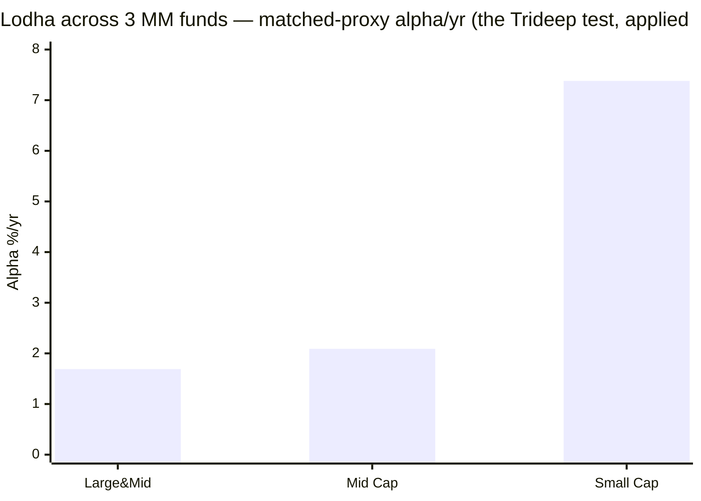

# Module 5: Fund Manager Quality — Mahindra Manulife Mid Cap Fund

## Module 5 Score: ~3.4 / 5 (provisional)

---

## The One-Line Context

Module 5 flips the fund's central **"orphaned alpha"** thesis into something more nuanced. The departed Manish Lodha was genuinely skilled — applying the study's Trideep-style **three-fund test to *him*** shows positive alpha vs matched investable indices in all three funds he ran (**Mid Cap +2.09%/yr, Small Cap +7.38%/yr, Large&Mid +1.69%/yr**) — BUT the transition is (so far) not a cliff: the new team's first **7 solo months post-Lodha swept the index on all three funds (+6.1 / +2.7 / +2.1 pts)**, and the module's biggest correction is that **M1 mis-attributed the weak 2025 (−3.1 alpha) to the new team when 11 of its 12 months were still Lodha's watch** — his *final year was his worst*, and the clean post-exit window is strongly positive. Add the under-appreciated continuity fact — **Krishna Sanghavi has been CIO-Equity since mid-2020, meaning Lodha's entire alpha run happened under Sanghavi's supervision** — and the honest verdict is **"orphaned author, surviving process, encouraging first print,"** dragged down by the study's shortest lead-tenure, a two-poachings-in-14-months retention pattern, and a co-manager (Dhamnaskar) whose "midcap veteran" billing from M3 needs softening.

---

## Raw Data (cross-source verified + computed, as of 08-Jul-2026)

| Field | Value | Source |
|-------|-------|--------|
| **Lead (de facto)** | **Krishna Sanghavi** — named on fund since **24-Oct-2024** (1.7y); **CIO-Equity of the AMC since ~mid-2020** | AMC / VRO / Cafemutual |
| Sanghavi credentials | B.Com, CWA (ICWAI), MMS-Finance (NMIMS), CFA (ICFAI); **29y total** (16+ MF, 8 insurance); IDBI → Aviva Life → **Kotak Mahindra AMC** → **Canara Robeco (Head-Equities, ~Oct-2018 → mid-2020, ₹10,000+ Cr equity book)** → Mahindra Manulife CIO-Equity | Key-people page, Cafemutual |
| Co-manager | **Kirti Dalvi** — since 03-Dec-2024 (1.6y); 19y; **ENAM AMC, Angel One, Tower Capital**; B.Com + MMS (Mumbai) — **no prior lead-FM NAV record found** | Key-people page |
| Co-manager | **Neelesh Dhamnaskar** — since 16-Feb-2026 (0.4y); ~21y; ENAM analyst → KRC → Anand Rathi → **Invesco MF (co-manager: Midcap, Infrastructure + 4 international FoFs; ceased 09-Jul-2022)** → **Invesco PMS (domestic: Caterpillar mid&small, RISE, DAWN, Challengers)** → MM; **manages 6 MM schemes within weeks of joining** | VRO cessation notice, Finalyca, PMS Bazaar |
| **Departed** | **Manish Lodha** (21-Dec-2020 → resigned eff. 02-Dec-2025) → **Ashika Investment Managers (AIF/PMS boutique)** — left the MF industry; CA + CS, 25y | AMC notices, Ashika key-personnel |
| Departed | **Abhinav Khandelwal** (Feb-2022 → removed from all 6 schemes 24-Oct-2024) → **Senior FM, Aditya Birla Sun Life AMC** — poached by a bigger house | VRO change notice, RocketReach |
| Departed | **V. Balasubramanian** (inception → ~Dec-2020) — retired | VRO |
| Individual SEBI record | **None found** for Sanghavi / Dalvi / Dhamnaskar / Lodha | searches |
| Skin in the game | Not disclosed | documented gap |
| Investor communication | Moderate — Lodha gave a VRO interview on the mid/small funds' performance ~Nov-2025, **weeks before resigning** | VRO |

**Method:** all era alphas computed from MFAPI NAVs vs matched investable proxies — MM Mid Cap 142110 vs Midcap-150 fund 147622; **MM Small Cap 150915 vs Motilal Smallcap-250 147623**; **MM Large&Mid 147840 vs a 50/50 Nifty-50 (120716) + Midcap-150 blend** (no clean LargeMid-250 index-fund proxy — blend documented as approximation). Windows: Lodha 21-Dec-2020 → 02-Dec-2025; post-Lodha 02-Dec-2025 → 03-Jul-2026.

---

## What Module 5 Is Really Asking

Every prior module deferred its biggest question here:

1. **Was the rising alpha (M1) the departed Lodha's skill or house luck?**
2. **Can the new team hold it?** (M4: "the new team IS the fee warranty")
3. **Is the value-financials tilt and the exchange-omission a process or an accident?** (M3)
4. **Is the current team's hotter, slower-recovering book a style shift?** (M2)
5. **Is three departures from one small fund idiosyncratic or systemic?** (→ M6)

---

## ⭐⭐ NEW: The Lodha Three-Fund Fingerprint — the Orphaned Alpha Was Real Skill

The study's canonical manager test (built for Trideep in the Edelweiss M5) applied to the *departed* manager — a first:

| Fund | Lodha-era CAGR | Matched proxy | **Alpha/yr** | Window |
|------|---------------|---------------|--------------|--------|
| **Mid Cap** | 27.23% | 25.13% | **+2.09%** | 4.9y |
| **Small Cap** | 27.07% | 19.69% | **+7.38%** ⭐ | 3.0y (fund's full life) |
| **Large & Mid** | 22.06% | 20.37% (blend) | **+1.69%** | 4.9y |

Calendar fingerprint replicates across funds: strong 2021 (+11.9 on L&M), strong 2023 (+11.7 on Small Cap), strong 2024 — and **his final year, 2025, was his worst everywhere** (Mid −3.1, L&M −5.0). Compare Trideep's +2.6/+2.9/+3.2: **Lodha passes the same three-fund consistency bar**, with a wider spread — his small-cap record (+7.38%/yr; the fund's full-life alpha is +6.97%/yr over 3.6y) is the **single largest matched-proxy alpha computed in the midcap study**. Two implications cut opposite ways:

1. **The orphan thesis hardens:** the man who left was verifiably good across three mandates — this was not house luck.
2. **But the house output survived him once already** — the small-cap and L&M records were produced by the same AMC platform, and (next section) the platform's first post-Lodha print is clean.

---

## ⭐⭐ NEW: The Post-Exit Sweep — and a Material M1 Correction

The new team's *solo* window (02-Dec-2025 → 03-Jul-2026, ~7 months) vs matched proxies:

| Fund | Fund return | Index | **Alpha (pts, 7mo)** |
|------|------------|-------|----------------------|
| **Mid Cap** | +8.82% | +2.72% | **+6.10** ✅ |
| **Small Cap** | +10.47% | +7.73% | **+2.74** ✅ |
| **Large & Mid** | +0.30% | −1.77% | **+2.07** ✅ |

**A 3-for-3 sweep.** Seven months is short — but a clean sweep across three different mandates is not noise-shaped.

> **⚠ Correction to M1 (material, applied):** M1's era table charged the new team with "2025 −3.1 alpha, unproven." **Wrong attribution: Lodha remained the fund's manager until 02-Dec-2025 — 11 of 2025's 12 months were his (jointly with Sanghavi from Oct-2024).** The weak 2025 belongs to *Lodha's final year*, not to the new team. The new team's true solo print is the table above: **+6.1 pts in 7 months on this fund.** This dissolves M1's "the new team's only print is one bad year" framing. M2's "current team runs hotter vol / least-defensive down-capture" era rows carry the same joint-era caveat (the Jan/Jul-2025 amplification months and the slow 2024–25 recovery were under the joint Lodha+Sanghavi watch).

---

## ⭐ NEW: The CIO-Continuity Mitigation (the under-appreciated fact)

**Sanghavi has been CIO-Equity of this AMC since ~mid-2020 — before Lodha even joined (Dec-2020).** Every year of the Lodha record — the rising alpha M1 celebrated — was produced **under Sanghavi's investment leadership**, on an AMC platform whose small-cap and L&M funds also outperformed. When Lodha left, the AMC didn't import a stranger; **the supervisor of the whole record stepped onto the desk** — and he was already co-named from Oct-2024, i.e., a **14-month groomed handover** (the same pattern Nippon's Patel had, which that study credited).

This is the strongest available answer to M1's orphan question and M4's fee-warranty question: **the author left; the editor stayed.** It is weaker than Nippon's proven multi-transition house process (MM has survived one transition, and only 7 months of it), but far better than a cold external hire.

**⭐ The Canara Robeco cross-study link:** Sanghavi's Head-of-Equities stint at Canara Robeco (~Oct-2018 → mid-2020) makes him **Cheenu Gupta's boss during her CR years** — the very fund house whose 2020 crisis navigation the HSBC M5 verified and credited. The CR house's quality-process reputation partially attaches to him (as leadership, not as attributable NAV record — his named-FM record at CR/Kotak is shared/brief and is **not credited quantitatively**; documented gap).

---

## ⭐ The Dhamnaskar Verification — M3's "Midcap Veteran" Softened

M3 billed him as "the ex-Invesco Midcap co-manager (co-ran Invesco Midcap from Jul-2018 alongside Gokhale)." Verified picture:

- He **was** a named co-manager on Invesco India Midcap — but **ceased 09-Jul-2022** (VRO notice; Gokhale took it back), so he was **never the lead**, and he left the MF desk *before* that fund's celebrated 2024 era.
- His Invesco MF book was **FoF-heavy**: 4 of his 6 schemes were international feeders (NASDAQ-100, Global Consumer Trends, Global Equity Income, Pan European) + Infrastructure + Midcap — a generalist/support profile, adjacent to (though more substantive than) the "overseas-securities designate" red herrings caught at Nippon (Desai) and HSBC (Chaturvedi).
- 2022–2025 he ran **Invesco PMS domestic strategies** — including **Caterpillar (mid & small cap)** — genuine band experience, but **PMS = not NAV-verifiable** (same gap as Trideep's Axis PMS years).
- At MM he was **handed 6 schemes within weeks of joining** (Feb-2026) — spread thin from day one.

**Honest read:** an experienced, midcap-*adjacent* hand with real band exposure but **no attributable lead record anywhere** — a depth addition, not a verified alpha source. *(M3 and M1's manager notes corrected to this framing.)*

---

## The Team Ledger & the Retention Pattern (M6 feed)

| Person | Tenure on fund | Exit | Destination |
|--------|---------------|------|-------------|
| V. Balasubramanian | 2018 → 2020 | retired | — |
| **Abhinav Khandelwal** | Feb-2022 → Oct-2024 | **poached** | **Aditya Birla Sun Life (Senior FM)** |
| **Manish Lodha** | Dec-2020 → Dec-2025 | **resigned** | **Ashika Investment Managers (AIF)** |
| Sanghavi / Dalvi / Dhamnaskar | current | — | — |

**Two departures to better/independent seats in 14 months, from the flagship of a subscale AMC (M4: ₹33K Cr total).** The pattern echoes Nippon's "talent-retention failure" reading (Gunwani/Sheth exits) — but MM lacks Nippon's proven ability to absorb it repeatedly. A small AMC that develops alpha-generating managers but cannot retain them is structurally exposed: **the bench behind the current trio is unproven** (Dalvi has no prior lead record; Dhamnaskar none attributable). This is the module's real downgrade force, and it hands directly to M6.

**Remaining rubric items:** **Capacity stewardship** — untested (no flood to gate; M4's gentle flows make this nearly moot; neutral). **Skin in the game** — undisclosed (gap; sibling convention). **SEBI record** — nothing found on any current or departed manager (clean). **Communication** — moderate; the awkward artifact is Lodha's VRO interview explaining the funds' success ~3 weeks before resigning.

---

## Sell Discipline & Philosophy (the M3 handoff)

- **Live evidence for discipline:** the BSE/MCX omission (M3's signature finding) is a real, costly-if-wrong valuation call — the fund declined the band's biggest momentum names. The ~60% turnover shows active steering rather than buy-and-forget (and belies the AMC's "buy-and-hold" marketing — M3).
- **Documentation is thin:** the house framework (GCMV — Growth, Cashflow, Management, Valuation) is referenced in AMC materials but not deeply articulated; the best public articulation of the mid/small process was **Lodha's** VRO interview — and he left. Whether the value-financials tilt survives the new team's reshaping (at ~60% turnover, ~2/3 of the book can turn over in 18 months) is the live question; the 7-month sweep suggests continuity so far.

---

## Cross-Study Manager Comparison

| Manager / fund | Lead tenure | Verified own-fund alpha | Crisis record | Key-person risk |
|----------------|------------|------------------------|---------------|-----------------|
| Trideep / Edelweiss | 4.8y | +2.92%/yr | cushioned 2024–25 ✅ | high but sitting |
| Patel / Nippon | 3.5y | +3.01%/yr | passed 2024–25 | LOW (proven house) |
| Cheenu / HSBC | 3.6y | +4.99%/yr (lumpy) | 2020 win; amplified 2024–25 ⚠ | high, solo |
| Ganatra+Khemani / Invesco | 2.8y | +9.4 (2024) | untested bear | very high |
| **Sanghavi+Dalvi+Dhamnaskar / MM** | **1.7y / 1.6y / 0.4y** | **+6.1 pts in 7mo solo (short); Sanghavi-on-desk era +1.36%/yr** | **2024–25 joint w/ Lodha: fall in-line, slow recovery** | **moderate-high: CIO-led trio, unproven bench, 2 recent poachings** |

MM's current team has the **weakest verifiable own-record of the five** — but uniquely, its *platform* has a three-fund, five-year verified alpha history (Lodha's, under Sanghavi's CIO watch) plus a clean first post-transition print.

---

## Module 5 Scorecard

| Sub-dimension | Weight | Score | Reasoning |
|---------------|--------|-------|-----------|
| Manager tenure on this fund | High | **2.5** | Named-lead 1.7y (Sanghavi, co- until Dec-25) / 1.6y / 0.4y — shortest of the studied midcaps; mitigated by Sanghavi's 6y CIO oversight and the 14-month groomed handover |
| 2018–19 winter navigation | Critical | **3.0** | Nobody current was on this fund (and the fund's own winter is an artifact — M1); Sanghavi led CR equities from Oct-2018 through the winter (house-level, not attributable) — flagged, not credited |
| 2024–25 correction navigation | High | **3.0** | Joint Lodha+Sanghavi watch: fall in-line (−20.9) but 2nd-slowest recovery (13.7mo, M2) — mediocre |
| Sell/graduation discipline | High | **3.5** | BSE/MCX omission (M3) = live valuation-discipline evidence; ~60% turnover = active steering; no documented policy found |
| Philosophy clarity | High | **3.0** | House framework (GCMV) referenced but thinly documented; the best articulation was Lodha's — who left |
| Capacity stewardship | Medium | **3.0** | Untested — no flood to gate (M4); neutral |
| Skin in the game | Low | **3.0** | Undisclosed (sibling convention) |
| Investor communication | Medium | **3.0** | Moderate; VRO interviews; small-AMC visibility |
| SEBI/regulatory record | High | **4.5** | Nothing found on any current/departed manager |
| ⭐ *Post-exit sweep* | *Modifier* | **+** | *3/3 funds beat their index in the 7 solo months — the transition is not a cliff (short window)* |
| ⭐ *CIO continuity* | *Modifier* | **+** | *Sanghavi supervised the entire Lodha record (2020→) and took the desk himself — author left, editor stayed* |
| *Departed-author + retention* | *Modifier* | **− −** | *Lodha's verified 3-fund skill left for an AIF; Khandelwal poached by ABSL; unproven bench behind the trio* |
| *Dhamnaskar attribution* | *Modifier* | **~** | *experienced but never-lead; PMS years unverifiable; 6 schemes from day one* |

**Module 5 Score: ~3.4 / 5** — below Edelweiss (3.7) and the HSBC/Nippon pair (3.5), level with Invesco (3.4).
- **Case for 3.5:** the post-exit 3/3 sweep, the CIO-continuity mitigation, the groomed 14-month handover, a clean SEBI slate, and the reattribution of 2025 away from the new team.
- **Case for 3.2–3.3:** shortest lead-tenure of the study, two poachings in 14 months from the flagship, no current manager with an attributable multi-year lead record, thin philosophy documentation.
- **3.4 is the honest midpoint** — the platform evidence (Lodha-era output under Sanghavi's watch + early sweep) sits exactly one notch below Nippon's *proven multi-transition* machine (3.5).

**Conditionality / handoffs:**
- → **M4 feedback (positive, note appended):** the fee-warranty read ("weakest of the passing funds") gets a genuine upgrade input — the new team's 3/3 early sweep + CIO continuity. Score left at 3.5 pending one more quarter of flows/alpha.
- → **M6 (decisive for the retention question):** is two-exits-in-14-months idiosyncratic or structural at a subscale JV AMC? Compensation capacity, JV stability, and the bench question live there.

---

## Comparative Module 5 Scores

| Fund | Category | M5 Score | Manager character |
|------|----------|----------|-------------------|
| PP FlexiCap | FlexiCap | ~4.5 | Founder-led, permanent |
| DSP Small Cap | SmallCap | ~4.3 | Long-tenure discipline |
| Edelweiss Mid Cap | MidCap | ~3.7 | Cross-category verified index-beater, sitting |
| Nippon Growth Mid Cap | MidCap | ~3.5 | Machine-not-man; proven transitions |
| HSBC Midcap | MidCap | ~3.5 | Manager-better-than-fund; verifiable 2020 win |
| **Mahindra Manulife Mid Cap** | **MidCap** | **~3.4** | **Orphaned author, surviving process, encouraging first print; shortest tenure, retention bleed** |
| Invesco India Midcap | MidCap | ~3.4 | High-amplitude new team; untested bear |
| Franklin US Opp | International | ~3.4 | 19y continuity, negative alpha |

---

## SIP Implication

1. **The thing you feared (M1's orphaned alpha) is real but smaller than it looked.** Lodha was verifiably skilled (three-fund fingerprint) and he's gone — but the weak 2025 was *his* final year, not the new team's failure, and the new team's first 7 solo months beat the index on all three funds. The transition evidence so far is good.
2. **You are underwriting the platform, not a star.** Sanghavi (CIO since 2020) supervised the entire record and now runs the desk with a 14-month groomed handover behind him. That is a house-process argument — one successful transition and 7 months of proof, versus Nippon's decades. Price it accordingly.
3. **The bench is the risk, not the book.** Two managers were poached/left within 14 months; Dalvi and Dhamnaskar have no attributable lead records. If Sanghavi himself left, there is no proven successor — that (plus AMC retention capacity) is the M6 question and the standing key-person tripwire.
4. **Watch three things over the next 2 quarters:** (a) the new team's alpha print extending past a year (turns the modifier into a record); (b) whether the value-financials tilt and exchange-omission survive the book's reshaping (~60% turnover = fast evolution possible); (c) any further senior equity departures — a third exit would make the retention pattern structural.

---

## One-Line Verdict

> **Mahindra Manulife's Module 5 converts the fund's "orphaned alpha" from a verdict into a live question with early-positive evidence: the departed Lodha was genuinely skilled (the Trideep-style three-fund test gives him +2.09/+7.38/+1.69%/yr vs matched investable indices — the small-cap figure the largest matched-proxy alpha in the midcap study), but the transition is so far not a cliff — the new Sanghavi+Dalvi+Dhamnaskar team swept the index on all three funds in its first 7 solo months (+6.1/+2.7/+2.1 pts), the weak 2025 that M1 charged to the new team actually belongs to Lodha's final year (correction applied), and Sanghavi — CIO-Equity since mid-2020 — supervised the entire record before stepping onto the desk via a 14-month groomed handover ("author left, editor stayed"). The caps: the study's shortest lead-tenure trio (1.7y/1.6y/0.4y), a two-poachings-in-14-months retention bleed (Khandelwal→ABSL, Lodha→Ashika AIF) from the flagship of the smallest AMC studied, a co-manager whose Invesco Midcap billing softens on verification (co-, never lead; left that desk Jul-2022; PMS years unverifiable), thin philosophy documentation, and undisclosed skin. Provisional: ~3.4/5 — level with Invesco, one notch below Nippon/HSBC; the score most likely to move (up) with one more clean quarter; conditional on M6's read of whether the retention bleed is structural.**

---

*Module 5 completed: July 8, 2026 | Fund Manager Quality | Era alphas computed from MFAPI NAVs vs matched investable proxies (MM Mid Cap 142110 vs 147622; MM Small Cap 150915 vs Motilal SC-250 147623; MM Large&Mid 147840 vs 50/50 Nifty-50 120716 + Midcap-150 blend — blend documented as approximation) | Lodha fingerprint (21-Dec-2020→02-Dec-2025): +2.09 / +7.38 / +1.69%/yr — the Trideep three-fund test applied to a departed manager (a study first) | Post-exit sweep (02-Dec-2025→03-Jul-2026): +6.10 / +2.74 / +2.07 pts — 3/3 | M1 CORRECTION applied: 2025 −3.1 reattributed to Lodha's final year (he managed until 02-Dec-2025); M2 joint-era caveat; M3/M1 Dhamnaskar softening (co-manager, never lead; ceased Invesco MF desk 09-Jul-2022 per VRO; FoF-heavy; Invesco PMS domestic 2022–25 unverifiable); M4 warranty upgrade note | Team: Sanghavi (CIO since ~mid-2020; ex-Kotak, ex-Canara Robeco Head-Equities Oct-2018→mid-2020 — Cheenu Gupta's boss, cross-study link) + Dalvi (ENAM/Angel/Tower; no prior lead record) + Dhamnaskar (6 schemes from day one) | Departures: Bala retired; Khandelwal → ABSL Oct-2024; Lodha → Ashika AIF Dec-2025 — two poachings in 14 months from the flagship (→ M6) | SEBI: clean (none found); skin undisclosed (gap); Sanghavi exact MM joining date + CR/Kotak named-FM attribution = documented gaps | Provisional M5 Score: ~3.4/5 (M6 = retention structural-or-not; next-quarter alpha = the mover)*
