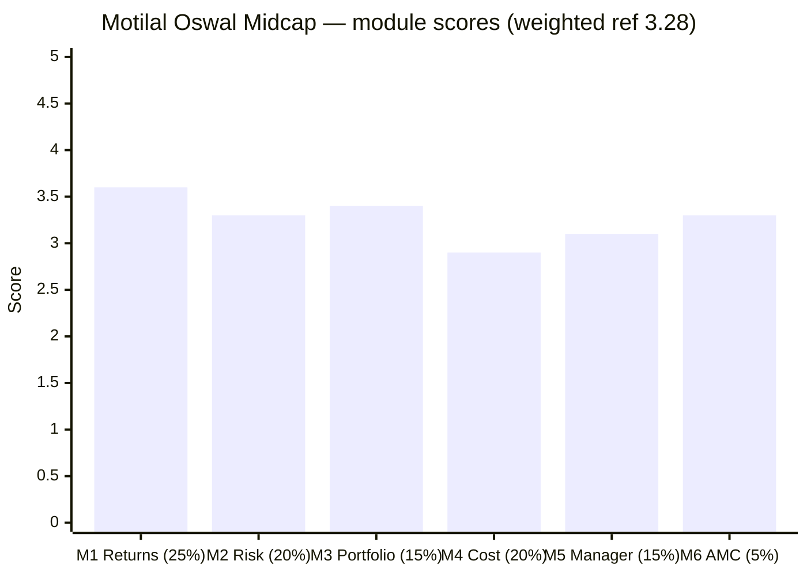
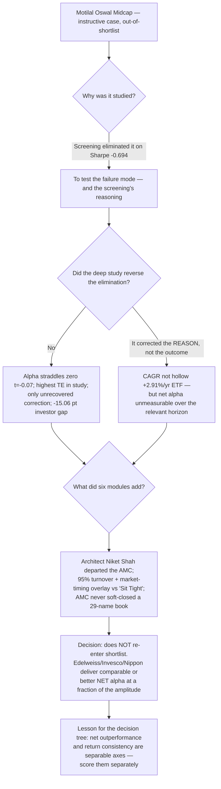

# Motilal Oswal Midcap Fund — Deep Study (Instructive Case)

> **Study status: out-of-shortlist instructive case (study_plan "Optional B").** This fund was **eliminated at Stage 1** on a Sharpe of −0.694; it was studied not for shortlist consideration but for **what its failure mode teaches** — and, as it turned out, for what the screening got wrong about it *and* for what six modules of scrutiny then revealed. It does **not** enter the 7-fund category ranking.

## Fund Identity

| Field | Value |
|-------|-------|
| **Full Name** | Motilal Oswal Midcap Fund — Direct Plan — Growth (ex- *MOSt Focused Midcap 30*) |
| **AMC** | **Motilal Oswal AMC** — arm of listed **MOFSL**; **first study of this house across all four categories** (M6 ground-up ≈3.3) |
| **Inception** | **24-Feb-2014** (12.4y); a genuine, complete 2018–19 winter record |
| **SEBI Category** | Equity — Mid Cap (min 65% in ranks 101–250) |
| **Benchmark** | Nifty Midcap 150 TRI |
| **AUM** | **₹37,474 Cr** (AMC, 30-Jun-2026) — 2nd-largest of the cohort; **10.2× in 3.6y, 93% net inflows** |
| **Expense Ratio** | **0.76% Direct** (AMC official; Tickertape 0.75% ✅ / Groww 0.94% ❌) — mid-pack |
| **Turnover** | **95%** (AMC official — ⚠️ M4 corrected M3's 35%) — ~12-month holding period |
| **Exit Load** | 1% ≤365 days; nil after |
| **Managers** | **Ajay Khandelwal** (30-Sep-2024, de-facto lead post-Niket) + Shetty / Mayekar / Agarwal / Sharma |
| **Departed** | ⚠️ **Niket Shah** (AMC CIO; lead PM **Jul-2020 → ~Jan-2026**) — the architect of the record — **left the AMC** for MO Group Principal Investments |
| **Data** | MFAPI 127042 (Direct) / 127039 (Regular); proxies 147622 (Midcap-150 fund) + 114456 (Midcap-100 ETF); TT holdings M_MOLS |

---

## The One-Line Context

Motilal Oswal Midcap is the repo's **"amplitude king — and the study's clearest demonstration that a fund can get worse the closer you look."** The screening killed it at Stage 1 on a Sharpe of −0.694 and a "1Y −8.8%" snapshot taken within days of its trough, tagging it a *"momentum-concentration blowup whose trailing CAGR was hollow."* The deep study found the screening's *outcome* right and its *reason* wrong — the CAGR is not hollow (the ETF lens shows +2.91%/yr over 12.4y) — but then it found something less comfortable than either: **six modules of scrutiny steadily dismantled every credential the fund appeared to hold.** M2 showed the canonical alpha **straddles zero** (−0.24%/yr monthly vs +1.43% at a favourable daily endpoint, t = −0.07) at the **highest tracking error in the study (9.39%)**, and that the 2024–25 drawdown was **deeper and longer than M1 measured (−28.9%, a 1.53× amplification, unrecovered at 19 months)**. M3 found the fund is the **most concentrated in the study (29 names, top-10 54.9%)** and that the **record and the current roster have different authors**. M4 corrected the turnover to **95% (not 35%)**, priced the March-2025 cash-and-short overlay at **~1.18%/yr**, and delivered the verdict number: a **−15.06-point investor-return gap** from an AMC that took ₹2,186 Cr/month straight into the December-2024 top and **never soft-closed a 29-name book**. M5 then closed the last gap and reframed it all: the pre-2024 lead **was** Niket Shah — but he **co-managed through the entire drawdown and only left the AMC around January 2026**, so the collapse is not a new manager's error, it is **the architect's own concentration strategy unwinding** — and that architect is now gone. Deep-study weighted score **≈3.28/5** — which, for a fund the screening had already correctly eliminated, is the point: **its alpha is real over the long lens but unmeasurable over the relevant one, its risk lives where the standard tools can't see it, its record belongs to a departed man, and its late investors paid ~1.85%/yr to own a market-timing overlay that contradicts the house's own creed.** The honest cautionary tale is not *"the alpha was fake."* It is *"net outperformance and return consistency are separable, and this fund bought the first by selling the second — then the person who ran the trade left."*

---

## Module Status — with the Cross-Module Patch History

| Module | Weight | Status | Score | Revised from |
|--------|--------|--------|-------|--------------|
| [Module 1 — Returns Consistency](module1_returns.md) | 25% | ✅ Complete (patched) | **3.6** | ~3.7 (M2 alpha-straddles-zero) |
| [Module 2 — Risk Profile](module2_risk.md) | 20% | ✅ Complete (patched) | **3.3** | ~3.4 (M3 down-capture re-read) |
| [Module 3 — Portfolio DNA](module3_portfolio.md) | 15% | ✅ Complete (patched) | **3.4** | ~3.6 (M4 turnover 35%→95%) |
| [Module 4 — Cost & AUM Impact](module4_cost.md) | 20% | ✅ Complete | **2.9** | — |
| [Module 5 — Manager & Process](module5_manager.md) | 15% | ✅ Complete | **3.1** | — |
| [Module 6 — AMC Quality](module6_amc.md) | 5% | ✅ Complete | **3.3** | — |

> ⭐ **This fund's file is the study's densest web of cross-module corrections** — a feature of the instructive case, not a defect. Later modules repeatedly overturned earlier ones: M2 corrected M1's drawdown and alpha; M3 corrected M1/M2's manager attribution and refuted M2's small-cap hypothesis; M4 corrected M3's turnover; M5 corrected M3's drawdown attribution and closed its manager gap. **All 18+ line-level patches across M1/M2/M3 were applied (Jul-27, 2026);** the audit trail lives in each module's "Contradictions" section and footer.

---

## Final Scorecard

**Weighted Score: ≈ 3.28 / 5** — *reference only; out-of-shortlist, not ranked among the 7*

| Module | Weight | Score | Weighted |
|--------|--------|-------|----------|
| M1 Returns | 25% | 3.6 | 0.900 |
| M2 Risk | 20% | 3.3 | 0.660 |
| M3 Portfolio | 15% | 3.4 | 0.510 |
| M4 Cost & AUM | 20% | 2.9 | 0.580 |
| M5 Manager | 15% | 3.1 | 0.465 |
| M6 AMC | 5% | 3.3 | 0.165 |
| **Total** | 100% | | **≈3.28** |

**The shape is the story — a descending ladder.** The high-weight *record* module reads best (M1 3.6), and every subsequent module reads worse as the lens sharpened: risk (3.3), portfolio (3.4), then the trio that decides it — **cost 2.9, manager 3.1, AMC 3.3**. This is the **inverse of a fund that survives scrutiny** (Edelweiss, whose modules held up). Motilal's ≈3.28 would notionally sit **below Sundaram (3.35), i.e. last** — but it never had to be ranked, because the screening had already, correctly, set it aside. **The value here is the method demonstration, not the number.**

---

## The Instructive Arc — What Each Module Peeled Back

### 1 — The screening was right for the wrong reason (M1)
Eliminated on a Sharpe of −0.694 read as evidence of hollow returns. M1 reproduced the screening exactly, but showed the number was a **1-year statistic taken within days of the trough** (−8.26% on 03-Jul → −3.49% thirteen days later) — the fund's *amplitude* showing up, not a wealth-destruction signal. The elimination stands; the implied reason ("the CAGR was fake") does not.

### 2 — But the alpha is unmeasurable, not merely volatile (M2)
The clean monthly test found the canonical alpha **straddles zero** (−0.24%/yr) at a **tracking error of 9.39% — the highest in the study by 46%**, with **19% idiosyncratic variance** (peers 5–9%) and an alpha **t-statistic of −0.07**. Three of five standard lenses (daily capture 91/87, beta 0.93, the −8.78% rolling-3Y floor) *understate* the risk. **The danger is idiosyncratic, not directional — invisible to the standard toolkit.** M2 also corrected the drawdown to **−28.9%, trough 31-Mar-2026, a 1.53× amplification.**

### 3 — The most concentrated book in the study, by two departed authors (M3)
29 names, top-10 **54.9%** (both study records), active share 78.4%, **0.00% small-cap** (refuting M2's small-cap hypothesis and its DSP-duplication flag — 0.00% name overlap), ~25% in post-2021-IPO platform names. Cash swung **2.89% → 32.88% + a 7.43% short-futures overlay** in March 2025 — a market-timing dial no peer runs. And the manager attribution M1/M2 asserted (Niket Shah) was **unverified on the roster** — re-cutting on the verified 30-Sep-2024 boundary split the record into a **pre-Khandelwal decade at IR +0.60 (elite)** and a **21-month book at IR −0.72 (anti-index)**.

### 4 — The fee is fine; everything around it is not (M4)
ER 0.76% is mid-pack — but **turnover is 95%, not the 35% M3 reported** (proved by unit-calibration against MO's own index fund at 0.24), the cash overlay costs **~1.18%/yr**, and the stack is a **~1.85%/yr structural headwind** against a 0.26% index fund, funding an alpha that is statistically zero. Then the flow ledger: **10.2× AUM growth, 93% net inflows, ₹2,186 Cr/month into the Dec-2024 top, never gated** → a **−15.06-point investor-return gap** (fund +19.11%/yr vs average rupee +4.05%/yr).

### 5 — The architect has left the building (M5)
Closed M3's gap: the pre-2024 lead **was** Niket Shah — but he **co-managed through the whole drawdown** (June-2025 factsheet still names him) and only **departed the AMC ~Jan-2026**. So M3's "IR −0.72 = Khandelwal's failure" is wrong: **it is the same architect's strategy unwinding.** The successor (ex-Canara Robeco Small Cap, added Sep-2024) is a genuine talent but has **~6 months' independent tenure**, backed by a debt/passive-heavy co-manager bench — and the fund's 95% turnover + market-timing overlay **contradict the house's own "Buy Right, Sit Tight" creed.**

### 6 — A strong house with one specific, this-fund-relevant sin (M6)
MO is listed, well-aligned, and the most articulate philosophy house in the study (QGLP) — with genuine fee stewardship (commission load −35% as it scaled). But the concentration DNA is **house-wide and fragile** (the same failure mode hit the ex-flagship Multicap 35 ~2018–20), and MO's **capacity conduct** on this fund (no soft-close) is a real fiduciary lapse against the study's Mirae-Emerging-Bluechip benchmark.

---

## Key Performance Metrics

| Metric | Value | Context |
|--------|-------|---------|
| 5Y / 10Y CAGR | **23.14% (#1)** / 17.94% | 5Y universe crown — **but very largely one 2024** |
| **Canonical matched alpha** | **−0.24%/yr monthly · +1.43% daily (t = −0.07)** ⚠️ | **straddles zero** (M2); +2.91%/yr on the 12.4y ETF lens |
| 2024 alpha / 2025 alpha | **+34.7 / −17.2** | **both repo records, consecutive years** |
| 2024–25 drawdown | **−28.9%**, trough 31-Mar-2026 | 1.53× the index's −18.9%; **unrecovered at 19 mo (−12.5% below peak)** |
| Volatility (5Y) | **18.2%** | **highest of the eight** |
| Tracking error | **9.39%** | **highest by 46%**; IR −0.03; 19% idiosyncratic variance |
| Down-capture (5Y) | 74 (blend) | **62 pre-Khandelwal vs 113 current book** |
| Active share | **78.4%** | 2nd of the study (Invesco 79.5%) |
| Stocks / Top-10 | **29 / 54.9%** | **both study records — most concentrated book** |
| Small-cap % | **0.00%** | only zero-small-cap fund in the shortlist |
| **Turnover** | **95%** (M4) | ~12-month holds; 2nd-highest of the study |
| Expense ratio (Direct) | **0.76%** | mid-pack; commission load compressed ~35% with scale |
| **Structural headwind** | **~1.85%/yr** | 0.50 fee premium + 0.175 turnover + 1.18 cash overlay |
| **Investor-return gap** | **−15.06 pts/yr** | fund +19.11%/yr vs average rupee +4.05%/yr |
| 3Y / 10Y SIP XIRR | **10.21% (worst) / 20.43% (top-tier)** | the vintage split — flow-timing trap |

---

## Strengths vs Concerns

### ✅ Genuine Strengths
1. **A real long-run book** — +2.91%/yr over 12.4y on the ETF lens; a pre-Khandelwal decade at IR +0.60 (the best long-run risk-adjusted record in the study).
2. **The best 2018–19 winter pass of any fund studied** — +12.6 pts vs ETF, fully invested (though it belongs to a prior team).
3. **Elite active share (78.4%), zero closet-index risk, zero small-cap contamination**, best holdings-level cross-sleeve diversification (PP 0.27% / DSP 0.00%).
4. **A cheap, honest fee** (0.76%) that fell as AUM grew; a genuinely aligned, listed, articulate AMC.
5. **On a real SIP since Sep-2019 it beat the index fund by ₹3.41L** — entirely pre-Khandelwal.

### ⚠️ Decisive Concerns
1. **The alpha straddles zero (t = −0.07) at the study's highest tracking error** — you cannot distinguish it from the index over 6.75 years.
2. **The only unrecovered 2024–25 correction in the cohort** — −28.9%, 1.53× amplification, 19 months, still −12.5% below peak.
3. **A ~1.85%/yr structural headwind and a −15.06-pt investor-return gap** — the wrapper (cash overlay + turnover) eats the ~1.85%/yr gross the pickers generate.
4. **95% turnover + a market-timing cash/short overlay** — the opposite of the house's stated "Sit Tight" creed; the weakest sell discipline in the cohort.
5. 🚨 **The architect (Niket Shah) has left the AMC** — maximal key-person risk on the study's most manager-dependent (29-name) book; ~6-month successor tenure.
6. **The AMC never soft-closed a 29-name book** it grew 10.2× into the top — a capacity-stewardship failure.

---

## Comparison vs Studied Funds (context only — Motilal is out-of-shortlist)

| Dimension | **Motilal** | Edelweiss | Invesco | Nippon | Mahindra | ICICI | HSBC | Sundaram |
|-----------|-------------|-----------|---------|--------|----------|-------|------|----------|
| Final / ref score | **≈3.28*** | ≈4.05 | ≈3.97 | ≈3.96 | ≈3.83 | ≈3.55 | ≈3.49 | ≈3.35 |
| Canonical alpha | **−0.24 (t −0.07)** ⚠️ | +2.45 | +2.33 | +1.55 | +1.30 | −0.39 | −0.55 | −2.31 |
| Tracking error | **9.39% (highest)** | 4.63 | 6.44 | 4.51 | 5.19 | 4.80 | 6.34 | 4.53 |
| Stocks / Top-10 | **29 / 54.9%** ⭐ | ~70 | 44 | 96 | 66 | 83 | 77 | 85 |
| Turnover | **95%** | 36% | 28% | 13.7% | ~60% | 75% | ~110% | 36% |
| ER (Direct) | 0.76% | 0.48% | 0.49% | 0.73% | 0.42% | ~1.08% | 0.56% | 1.06% |
| Manager | ❌ **architect departed** | ✅ stable | key-person present | ✅ house | rising | current | ❌ 5 teams | author retained |
| AMC (M6) | 3.3 listed/aligned | 3.4 | 2.4 | 3.4 | 3.3 | 3.4 | 3.4 | 3.5 |

*\*reference only — never ranked; the screening eliminated it at Stage 1.*

---

## ₹20K/Month SIP Projection (10 Years, 18% gross midcap)

| Scenario | Corpus | vs index fund |
|----------|--------|---------------|
| **Index fund (0.26%)** | **₹60.96L** | baseline |
| Fund — ER only (0.76%) | ₹59.34L | −₹1.62L |
| Fund + turnover drag | ₹58.78L | −₹2.18L |
| **Fund + turnover + current cash drag** | **₹55.16L** | **−₹5.79L** ❌ |
| Fund if +2.0% gross alpha persists *and* overlay normalises | ₹61.43L | +₹0.48L |

**The asymmetry is ~12:1 adverse** (−₹5.79L downside vs +₹0.48L upside) — the least favourable projection in the mid-cap set, and the arithmetic reason an instructive case stays an instructive case.

---

## Investment Decision Framework

---

## The Critical Facts — In 10 Sentences

1. Motilal Oswal Midcap was **eliminated at Stage 1** on a Sharpe of −0.694; it is an **out-of-shortlist instructive case**, never ranked among the seven.
2. The screening's outcome was right but its reason was wrong: the −0.694 is a **1-year statistic taken at a trough**, and the CAGR is not hollow (**+2.91%/yr over 12.4y on the ETF lens**).
3. But M2's clean test found the **canonical alpha straddles zero** (−0.24%/yr monthly, t = −0.07) at the **study's highest tracking error (9.39%)** and **19% idiosyncratic variance** — the risk is invisible to the standard toolkit.
4. It set **both repo alpha records in consecutive years** (+34.7 in 2024, −17.2 in 2025) at ordinary volatility — proving its danger is **positioning, not jumpiness**.
5. It is the **most concentrated book in the study** (29 names, top-10 54.9%), holds **0.00% small-cap** (refuting M2's small-cap hypothesis), and ran a **32.88% cash + 7.43% short overlay** at the March-2025 bottom.
6. M4 corrected turnover from 35% to **95%**, priced the cash overlay at ~1.18%/yr, and measured a **~1.85%/yr structural headwind** against a statistically-zero alpha.
7. The AMC grew the fund **10.2× to ₹37,474 Cr (93% net inflows), took ₹2,186 Cr/month into the Dec-2024 top, and never soft-closed** — a **−15.06-point investor-return gap** (fund +19.11%/yr vs average rupee +4.05%/yr).
8. The 2024–25 drawdown is **−28.9%, a 1.53× amplification, still unrecovered at 19 months** — the only such case in the cohort.
9. M5 closed the manager gap: the pre-2024 lead **was Niket Shah**, but he **co-managed through the entire drawdown and only left the AMC ~Jan-2026** — so the collapse is the **architect's own strategy unwinding, and that architect is gone**, leaving a ~6-month-tenured successor.
10. Deep-study reference score **≈3.28/5** — a descending ladder (M1 3.6 → M4 2.9) that is the exact signature of a fund which **gets worse the closer you look**: the honest lesson is that *net outperformance and return consistency are separable, and this fund bought the first by selling the second.*

---

## Quick Verdict

**For a ₹20K/month, 10-year SIP:** Motilal Oswal Midcap **does not re-enter shortlist consideration** — and the deep study confirms the screening's elimination emphatically, if for a corrected reason. This is a genuine long-run book (a +0.60-IR decade, the best winter pass in the study, elite active share) whose **net alpha is nonetheless unmeasurable over the horizon that matters**, whose risk **lives where standard statistics can't see it**, whose late investors **paid ~1.85%/yr to own a market-timing overlay that contradicts the house's own creed**, and whose **architect has now left the AMC**. A return-enhancer sleeve cannot sensibly be pointed at the cohort's **only unrecovered correction** and its **widest 1-year outcome distribution** when Edelweiss, Invesco and Nippon deliver comparable or better *net* alpha with a fraction of the amplitude. The decision-tree lesson it earns its keep for: **net outperformance and return consistency are separable axes, and a screening Sharpe read at a trough can eliminate a genuine long-run outperformer for the right outcome with the wrong reason** — so both must be scored explicitly, on separate axes.

---

## One-Line Verdict

> **Motilal Oswal Midcap closes at a deep-study reference ≈3.28/5 — an out-of-shortlist instructive case the screening had already, correctly, eliminated — and its file is the study's clearest demonstration that a fund can get worse the closer you look: the screening's "hollow CAGR" reason was wrong (the ETF lens shows +2.91%/yr over 12.4y), but M2's clean test found the canonical alpha straddles zero (−0.24%/yr monthly, t = −0.07) at the study's highest tracking error (9.39%) and 19% idiosyncratic variance, so the danger is idiosyncratic and invisible to the standard toolkit; it set both repo alpha records in consecutive years (+34.7 in 2024, −17.2 in 2025) at ordinary volatility from the most concentrated book in the study (29 names, top-10 54.9%, 0.00% small-cap), swung to 33% cash plus a 7.43% short at the March-2025 bottom, turns over 95% a year (not the 35% first reported), and carries a ~1.85%/yr structural headwind against a statistically-zero alpha; its AMC grew it 10.2× to ₹37,474 crore, 93% net inflows, ₹2,186 crore a month into the December-2024 top, never soft-closed a 29-name book, and manufactured a −15.06-point investor-return gap; its 2024–25 drawdown is −28.9%, a 1.53× amplification, still unrecovered at 19 months, the only such case in the cohort; and the architect of the entire record — Niket Shah, who co-managed through the whole drawdown and only departed the AMC around January 2026 — is gone, leaving a genuinely talented but ~6-month-independent successor to run its most fragile expression. Not the momentum blowup with a fake CAGR the screening imagined, but something more instructive: a real long-run book whose net alpha is unmeasurable, whose risk hides from every market-relative statistic, whose late investors paid to own a market-timing overlay that contradicts the house's "Buy Right, Sit Tight" creed, and whose author has left — the definitive case that net outperformance and return consistency are separable, and that this fund bought the first by selling the second.**

---

*Study completed: July 27, 2026 | All 6 modules + README | Out-of-shortlist instructive case (study_plan Optional B) — NOT ranked among the 7 | Deep-study reference ≈3.28/5 (M1 3.6×25% + M2 3.3×20% + M3 3.4×15% + M4 2.9×20% + M5 3.1×15% + M6 3.3×5%) | Module arc: descending ladder M1 3.6 → M2 3.3 → M3 3.4 → M4 2.9 → M5 3.1 → M6 3.3 — the signature of a fund that worsens under scrutiny | Data: MFAPI 127042/127039 + proxies 147622/114456 + Nifty-50 120716; TT holdings M_MOLS (29 names, AS 78.4% computed); AMC official ER 0.76% + turnover 0.95 + 11 Wayback AUM snapshots (flow ledger); MO factsheets + QGLP materials (M5/M6) | Signature findings: screening-Sharpe = 1Y trough artifact + alpha straddles zero (M1/M2) · idiosyncratic risk invisible to standard tools, TE 9.39%, drawdown −28.9%/1.53× (M2) · most concentrated book, 0% small-cap, cash/short overlay, manager attribution corrected (M3) · turnover 95% not 35%, ~1.85%/yr headwind, −15.06 pt investor gap, no soft-close (M4) · architect Niket Shah co-managed the drawdown then left the AMC ~Jan-2026; philosophy-vs-practice gap (M5) · listed/aligned/articulate house docked for capacity conduct + concentration fragility (M6) | ALL 18+ cross-module patches to M1/M2/M3 applied Jul-27, 2026 | Study-plan patches proposed (not yet applied to shared files): stage1_hard_filters.md Motilal-row addendum, study_plan.md Optional-B reframing, study-wide 0.26% counterfactual + t-stat retrofit + AMC-verified TER re-pull | Next: MidCap category decision_tree.md*
