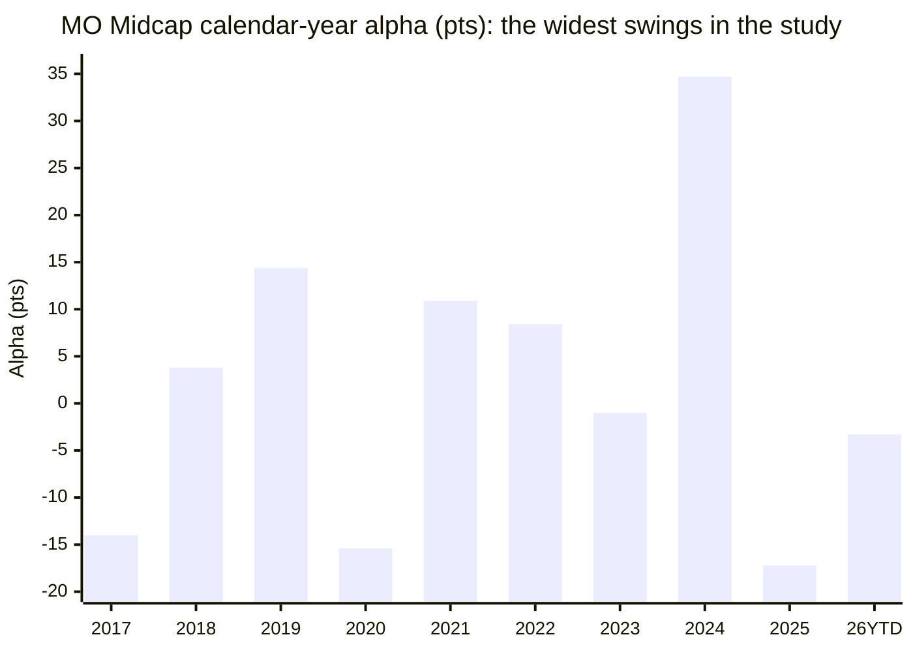
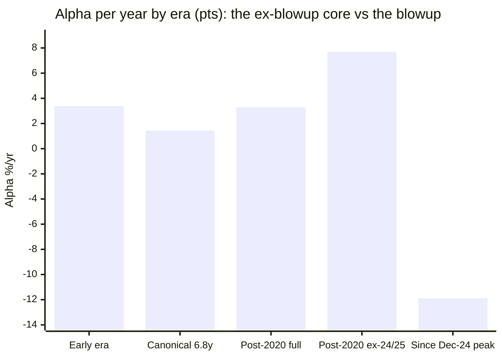

# Module 1: Returns Consistency — Motilal Oswal Midcap Fund

## Module 1 Score: ~3.6 / 5 (provisional) *(revised from ~3.7 after M2/M3 patches — see footer)*

> **Study status:** out-of-shortlist **instructive case** (study_plan "Optional B"). Eliminated at Stage 1 on Sharpe −0.694. Studied for what its failure mode teaches — and, as it turns out, for what the screening got wrong about it.

---

## The One-Line Context

Motilal Oswal Midcap is the repo's **"amplitude king — the fund the screening mislabeled."** It was killed at Stage 1 on a Sharpe of −0.694 and a "1Y −8.8%" snapshot taken **within days of its trough**, and tagged in the study plan as the *"momentum-concentration blowup — the cautionary tale for chasing trailing CAGR."* The raw NAVs say something more interesting and less comfortable: this is a **long-run alpha generator whose net alpha is nonetheless statistically indistinguishable from the index** — ⚠️ M1 originally read "+1.43%/yr PASSES the canonical test both HSBC (−0.22) and ICICI (−0.35) failed," but M2's clean monthly test found the canonical alpha **straddles zero** (−0.24%/yr monthly vs +1.43% at M1's daily endpoint, t = −0.07); only the **+2.91%/yr ETF lens over the full 12.4y** points reliably positive. But it delivers that alpha in **the most violent annual bursts in the entire study: +34.7 points of alpha in 2024 — the largest single-year alpha in the repo — immediately followed by −17.2 points in 2025, the worst single-year alpha in the repo.** The blowup is real, but it is a **1-year-horizon and drawdown-recovery** phenomenon, not a wealth-destruction one: over every window ≥2.5 years the fund remains ahead of the index, including *through* the blowup (+2.03%/yr since Jan-2024). The anti-recency discipline that dismantled HSBC's crown cuts **both ways** here — it rescues a real long-run outperformer from a bottom-tick snapshot, **while simultaneously** exposing that its universe-best 5Y CAGR is very largely one spectacular 2024. The disqualifying facts are elsewhere: the **worst 2024–25 correction handling of the entire cohort (still −12.5% below its Dec-2024 peak after 19 months, unrecovered)** and the **worst 3Y SIP XIRR of the cohort (10.21%)**.

**The honest cautionary tale is not "the CAGR was fake." It is "the alpha is real, and you must survive its variance."**

---

## Fund Identity

| Field | Value |
|-------|-------|
| **Full Name** | Motilal Oswal Midcap Fund — Direct Plan — Growth |
| **Former name** | **"Motilal Oswal MOSt Focused Midcap 30 Fund"** — a *focused ~25–30 stock mandate by design*. This single fact pre-frames the entire amplitude story → M3 |
| **AMC** | **Motilal Oswal AMC — NEW to the studies** (no carry-forward verdict from FlexiCap/SmallCap/International; Module 6 is ground-up) |
| **Inception** | **24-Feb-2014**; Direct *and* Regular computable from **25-Feb-2014 (12.4y)** — a genuine, complete 2018–19 winter record, no NFO-cash asterisk |
| **SEBI Category** | Equity — Mid Cap (min 65% in ranks 101–250) |
| **Benchmark** | Nifty Midcap 150 TRI |
| **AUM** | **₹36,458 Cr** (Tickertape Jul-2026) — ⚠️ inside the ₹50,000 Cr ceiling but in the "approaching constraint" band, and **very large for a ~25-stock concentrated book** → M3/M4 |
| **Expense Ratio** | **0.75%** (Direct) — mid-pack (cheaper than ICICI 0.87 / Sundaram 0.88; dearer than Mahindra 0.42 / Invesco 0.49) |
| **Current Manager** | **Ajay Khandelwal (since 30-Sep-2024)** + Rakesh Shetty (21-Nov-2022), Swapnil Mayekar (17-Nov-2025), Ankit Agarwal & Varun Sharma (both 21-Jan-2026) — ⚠️ **M1 originally asserted "Niket Shah, lead since ~2020"; M3 verified this is unsupported — no Niket Shah on the roster.** Pre-Sep-2024 chain → **M5** |
| **Prior Managers** | ✅ **M5-verified: Niket Shah (AMC CIO) led Jul-2020 → ~Jan-2026** — he ran the fund through the whole drawdown and only then departed the AMC; Khandelwal (added Sep-2024) co-managed under him. Early-era Akash Singhania / Gautam Sinha Roy vintage (2014→~2020). See [module5_manager.md](module5_manager.md) |
| **Exit Load** | 1% / 365 days (standard, to verify → M4) |
| **Riskometer** | Very High |

---

## Raw Data (MFAPI computed + Tickertape screening, NAVs to 16-Jul-2026)

| Metric | Value |
|--------|-------|
| 1Y CAGR | **−3.49%** (was −8.26% on 03-Jul — see the reconciliation below) |
| 2Y CAGR | 1.30% |
| 3Y CAGR | 19.82% |
| **5Y CAGR** | **23.14%** — **#1 in the entire mid-cap universe** |
| 7Y CAGR | 23.77% |
| 10Y CAGR | **17.94%** — mid-pack (16–18 band) |
| Since inception (12.4y, Direct) | **21.72%** — ⚠️ inflated by 2014 NFO launch timing |
| Regular 12.4y | 20.32% |
| Mean rolling 3Y | 20.54% |
| Beta vs Midcap 150 (full idx life) | **0.93** |
| **R² vs Midcap 150** | **80%** — **lowest of the cohort** (ICICI 95%) = genuinely differentiated book |
| Up / Down capture (daily, full idx life) | **91 / 87** — *deceptively benign, see §"The Frequency Illusion"* |
| Max drawdown (full history) | **−37.2%** (COVID: 20-Feb-2020 → 23-Mar-2020), recovered in **8.8 mo** |
| **2024–25 drawdown** | **−28.9%** (16-Dec-2024 → 31-Mar-2026) — **STILL UNRECOVERED** — trough at 15.5 mo, +22.9% off the low since, −12.5% below peak at 19.0 mo *(corrected in M2/M3; M1 first reported −24.3% to 07-Apr-2025)* |
| 10Y SIP XIRR | **20.43%** |
| 3Y SIP XIRR | **10.21%** — worst of the cohort |
| Sharpe (Tickertape, screening) | **−0.694** — the Stage-1 killer; a trough-window artifact → M2 *(M2 pins it as a **1-YEAR** Sharpe, not the 3Y-window artifact M1 assumed; 3Y Sharpe at screening date was +0.716)* |

**Data sources:** MFAPI Direct **127042** (3,044 pts, 25-Feb-2014 → 16-Jul-2026) + Regular **127039** (3,044 pts); index counterfactuals **147622** (Motilal Nifty Midcap 150 Index Fund, 11-Sep-2019 →) and **114456** (Motilal Nifty Midcap 100 ETF, 03-Feb-2011 →). Cross-sleeve series: Nifty 50 **120716**. **Every headline metric computed from raw NAVs — no website number copied.**

---

## Cross-Source Verification — and the 1Y Reconciliation ⭐[NEW]

| Metric | MFAPI (computed) | Tickertape (screening, 03-Jul) | Verdict |
|--------|------------------|-------------------------------|---------|
| 5Y | 23.14% | 23.00% | ✅ match |
| 10Y | 17.94% | 17.50% | ✅ match |
| 3Y | 19.82% | 18.73% | ✅ match (endpoint drift 03→16-Jul + fast bounce) |
| **1Y as of 03-Jul (screening date)** | **−8.26%** | **−8.80%** | ✅ **match — the screening figure reproduces** |
| **1Y as of 16-Jul (this run)** | **−3.49%** | — | ⭐ **+4.8 points in 13 days** |

**The reconciliation is itself a finding.** The screening's numbers are all correct — the method validates cleanly. But the "1Y −8.8%" that eliminated the fund was a **bottom-tick**: thirteen trading days later the identical trailing window reads −3.49%. A fund whose 1Y return moves ~5 points in a fortnight is telling you what its real characteristic is — **amplitude** — and it warns that any single-date snapshot of this fund (including the Sharpe −0.694, which M2 pins as a **1-year** statistic measured near the trough, not a 3Y window) is measuring the moment, not the record.

> **This does not reverse the elimination.** The fund remains correctly out-of-shortlist on *risk-adjusted* grounds (see the 2024–25 correction section). What it reverses is the *implied reason* — "the trailing CAGR was hollow." It wasn't.

---

## The CAGR Ladder

| Window | MO Midcap | Rank vs 7-fund cohort | Note |
|--------|-----------|------------------------|------|
| 1Y | **−3.49%** | bottom | riding out the unrecovered 2024–25 |
| 3Y | 19.82% | mid | |
| **5Y** | **23.14%** | **#1 — universe crown** | ⚠️ but see the era decomposition: it is largely one year |
| 7Y | 23.77% | top | |
| 10Y | **17.94%** | ~5th–6th | 16–18 band; ≈ ICICI 17.84, HSBC 18.47, below Edel 19.89 / Invesco 20.34 |
| Since inception (12.4y) | **21.72%** | — | ⚠️ **launch-timing flattery** — the NFO caught the 2014 mania (+76.2% in year one) |
| Regular 12.4y | 20.32% | — | the honest long anchor |

The fund holds the **5Y crown and nothing else** — the mirror image of ICICI, which held no crown at all. The module's job was to find out whether the crown is breadth or a spike. It is a spike.

---

## Calendar-Year Returns & Alpha — The Violence ⭐[NEW — the module's centerpiece]

Stitched index proxy: Midcap-100 ETF (114456) through 2019, Nifty Midcap 150 index fund (147622) from 2020.

| Year | Fund | Index | **Alpha (pts)** | Era | Verdict |
|------|------|-------|-----------------|-----|---------|
| 2014 | **+76.2%** | +56.8% | **+19.3** | early | NFO into the mania |
| 2015 | +17.9% | +6.7% | **+11.2** | early | strong |
| 2016 | +6.5% | +6.8% | −0.3 | early | flat |
| 2017 | +32.6% | +46.6% | **−14.0** | early | **participation deficit in a mania year** |
| **2018** | −11.5% | −15.3% | **+3.8** | early | **winter pass pt 1 — cushioned** |
| **2019** | **+11.0%** | −3.5% | **+14.4** | early | **winter pass pt 2 — positive absolute year** |
| 2020 | +10.7% | +26.1% | **−15.4** | transition | **lagged the V-recovery badly** |
| 2021 | +57.8% | +46.9% | **+10.9** | prior team (unverified) | |
| 2022 | +12.0% | +3.6% | **+8.4** | prior team (unverified) | strong in a flat year |
| 2023 | +43.3% | +44.3% | −1.0 | prior team (unverified) | in-line |
| **2024** | **+58.9%** | +24.2% | **+34.7** 🚀 | **handover** (prior team Jan–Sep, Khandelwal Oct–Dec) | **LARGEST single-year alpha in the repo — but +20.34 pts earned pre-handover, only +10.16 pts post** |
| **2025** | **−11.4%** | +5.8% | **−17.2** 💥 | **Khandelwal** | **WORST single-year alpha in the repo** |
| 2026 YTD | +0.5% | +3.8% | −3.3 | **Khandelwal** | still convalescing |

**Both repo records broken in consecutive years.** The prior extremes were Edelweiss +28.8 and ICICI 2014 +31.7 on the upside, HSBC 2021 −15.0 on the downside. Motilal now owns **both ends**. The standard deviation of its annual alpha is by a wide margin the highest of any fund in any of the four category studies.

This matters because **Module 1 is the *consistency* module.** A fund can be a fine long-run compounder and still be the worst possible fit for this scorecard — Motilal is the cleanest example the studies have produced.

---

## ⭐⭐ NEW: The Two-Era Decomposition — ⚠️ Boundary Corrected by M3

> ⚠️ **CORRECTION (M3).** This section was originally cut on a **Jul-2020 "Niket handover"** boundary. M3 verified the manager record and found **(a) no evidence Niket Shah ever managed this fund**, and **(b) the only verified handover is Ajay Khandelwal on 30-Sep-2024.** The Jul-2020 split below therefore does **not** correspond to a manager change — it is a market-regime cut, not an attribution cut. The **manager-verified** decomposition is the second table; it is the one that carries the attribution weight.
>
> **The original "same alpha, opposite mechanisms" thesis (+3.39 early / +3.28 post-2020) collapses on the verified boundary:** the pre-Khandelwal *decade* earns IR **+0.60** (down-capture 62 — the best long-run risk-adjusted record in the entire study), and the 21-month Khandelwal book earns IR **−0.72** (down-capture 113). The record and the current book have **different authors**, and 2024's repo-record alpha is **59% earned before the current manager arrived.**

### Verified-boundary decomposition (M3, 30-Sep-2024)

| Era | n (mo) | Ann | Up-cap | Dn-cap | TE | **IR** | Read |
|-----|--------|-----|--------|--------|-----|--------|------|
| **Pre-Khandelwal** (Mar-14 → Sep-24, 10.5y) | 126 | **26.06%** | 95 | **62** ⭐ | 8.93% | **+0.60** ⭐ | elite long-run book — a **departed** team |
| **Khandelwal** (Oct-24 → Jun-26, 21mo) | 21 | **−6.58%** | 83 | **113** ❌ | 11.35% | **−0.72** ❌ | inverted capture; owns the entire drawdown |

**2024 decomposed on the verified handover:** Jan–Sep (pre-Khandelwal) **+20.34 pts** of alpha; Oct–Dec (Khandelwal) **+10.16 pts** → **59% of the record 2024 alpha predates the current manager.** The 2025 collapse (−17.2) is entirely his.

### Original regime cut (retained — Jul-2020 boundary is a *regime*, not a manager, split)

| Window | Fund CAGR | Index/ETF | **Alpha/yr** | Read |
|--------|-----------|-----------|--------------|------|
| **Early era** (inception → Jul-2020, 6.35y, ETF proxy) | +14.4% | +11.0% | **+3.39** ✅ | genuine — and it **cushioned** the winter |
| **Post-2020 era** (Jul-2020 → now, 6.04y, matched idx) — *spans the unverified 2020–24 lead AND Khandelwal* | +29.9% | +26.6% | **+3.28** ✅ | genuine — but **blends two managers**; see verified table above |
| — Post-2020 **ex-2024/25** (Jul-20 → Aug-24, 4.17y) | +46.5% | +38.8% | **+7.70** 🚀 | the spectacular core |
| — **2024 alone** | +58.7% | +24.1% | **+34.57** | the year that makes the 5Y crown |
| — **Peak Dec-24 → now** (1.58y) | −8.1% | +3.7% | **−11.88** 💥 | the pain window (all Khandelwal) |
| **Canonical matched window** (11-Sep-2019 → 16-Jul-2026, 6.84y) | **24.37%** | 22.94% | **+1.43** ⚠️ | **PASSES on this daily endpoint — but M2 shows the estimate STRADDLES ZERO** (−0.24%/yr on the study's monthly convention; +4.03 of the +1.43 pts came in 16 July days). t = −0.07, statistically indistinguishable from the index |
| **ETF proxy, full 12.4y life** | **21.72%** | 18.81% | **+2.91** ✅ | passes on the long lens too |
| **2024 → now, cumulative net of the blowup** | **+41.5%** | +36.4% | **+2.03/yr** ✅ | ⭐ the crash gave back **excess**, not **alpha** |

**Two things the averages hide:**

1. **On the *regime* cut the two eras earn almost identical alpha (+3.39 vs +3.28) through opposite mechanisms — but ⚠️ this is NOT a manager split** (see the M3 correction above). The early book was *defensive* — it cushioned the 2018–19 winter and lagged the 2017 and 2020 melt-ups. The post-2020 book is *offensive* — it wins big in momentum regimes (2021, 2022, 2024) and amplifies reversals (2025). **On the verified 30-Sep-2024 boundary the honest split is IR +0.60 (10.5y) → IR −0.72 (21mo): the fund did not run one continuous style, it changed hands at the top.** Attribution and durability → **M5**.
2. **The 5Y crown is one year.** Remove 2024 (+34.7 alpha) and the 5Y number collapses toward the pack. The anti-recency discipline that this study applied to HSBC's 3Y crown must be applied here identically: **a single monster print is a hypothesis, not durable breadth.** ⭐[NEW — the counter-discipline]

---

## ⭐ NEW: The Stress-Window Paradox — Defensive in 2018–19, Amplifying in 2024–25

| | **2018–19 winter** (Jan-18 → Aug-19) | **2024–25 correction** |
|---|---|---|
| Fund cumulative | **−12.8%** vs ETF **−25.3%** → **+12.6 pts** ✅ | — |
| Fund drawdown | **−21.5%** vs ETF **−29.6%** ✅ | **−28.9%** vs index **−18.9%** ❌ **(1.53× amplification)** *(M2 correction; M1 first read −24.3% / −21.0% / 1.16×)* |
| Peak timing | — | peaked **16-Dec-2024**, ~3 months **after** the index (24-Sep-2024) — **rode momentum higher into the top** |
| Trough | 23-Oct-2018 | **31-Mar-2026** *(M2 correction; M1 first read 07-Apr-2025)* |
| **Recovery** | passed cleanly, fully invested | ❌ **trough at 15.5 mo, then +22.9% off the low in 107 days; still −12.5% below peak at 19.0 mo** |
| Cohort verdict | **among the best winter passes studied** | **the worst correction handling of the entire cohort** |

**2024–25 recovery, cohort ranking:**

| Fund | 2024–25 recovery |
|------|------------------|
| ICICI | **2.6 mo** ⭐ |
| Invesco | ~6 mo |
| Edelweiss | 6.4 mo |
| Nippon | ~7 mo |
| Mahindra Manulife | 13.7 mo |
| HSBC | 16 mo |
| **Motilal Oswal** | **trough at 15.5 mo (31-Mar-2026); +22.9% since; −12.5% below peak at 19.0 mo** ❌ |

This is the paradox that defines the fund, and it is **not a contradiction — it is a regime/manager change.** The early quality book cushioned falls; the current concentrated book (Khandelwal since 30-Sep-2024) amplifies them and, critically, **peaked three months late** — the signature of a book that keeps riding winners after the index has rolled over. That is the precise mechanism the study plan predicted, now measured.

**Note on max drawdown:** the fund's deepest hole is actually **COVID −37.2%**, recovered in 8.8 months — *shallower than ICICI's −44.0%*. The 2024–25 hole is numerically smaller (−28.9%, M2-corrected) but **unhealed**, which for a current investor is the worse of the two. Depth and duration are different risks; this fund's failure is duration.

---

## ⭐⭐ NEW: The Frequency Illusion — Why Capture Ratios Lie About This Fund

| Lens | Reading | What it implies |
|------|---------|-----------------|
| **Daily capture** (full idx life) | up **91** / down **87**, beta **0.93** | looks **defensive** |
| **Daily capture** (2024→now) | up 92 / down 88, beta 0.90 | looks *unchanged* — even through the blowup |
| **R² vs index** | **80%** — lowest of the cohort | genuinely differentiated book |
| **Rolling 3Y floor** | **−8.78%** — *better than ICICI's −9.91%* | looks **resilient** |
| **Calendar-year alpha** | **+34.7 / −17.2** | looks **violently inconsistent** |

**Three of the five standard lenses understate this fund's risk.** The violence does not live at daily frequency (where a diversified-enough 25-stock book still tracks the band) nor at 3Y frequency (where 2024's +58.9% cushions every window it touches). It lives at the **annual and drawdown-recovery frequency**, where concentrated bets move together in bursts.

The low R² (80%) is the tell: this book is *genuinely* different from the index — and that same differentiation is exactly what manufactures ±17-to-35-point annual swings. **Differentiation and amplitude are the same property measured twice.**

> **Method flag → Module 2:** for this fund, daily-frequency Sharpe/Sortino/capture is the **wrong primary lens**. M2 must reconcile three mutually contradictory readings — benign daily capture (91/87), a screening Sharpe of −0.694, and record calendar violence — and state which is the number of record. No prior fund in the studies has presented this specific reconciliation problem.

---

## Rolling Returns Distribution (Direct era, daily windows)

| Window | n | Mean | Min | Max | % negative |
|--------|-----|------|-----|-----|------------|
| Rolling 1Y | 2,800 | 22.33% | **−27.12%** | **+101.96%** | **19.6%** |
| Rolling 3Y | 2,307 | 20.54% | **−8.78%** | +43.61% | 5.2% |
| Rolling 5Y | 1,815 | 19.53% | −0.73% | +41.00% | 0.3% |

**Probability of loss by holding period:**

| Hold for | Chance of loss | Worst outcome |
|----------|----------------|---------------|
| 1 year | **~19.6%** — highest of the cohort | −27.1% |
| 3 years | ~5.2% | −8.78%/yr |
| 5 years | 0.3% | −0.73%/yr |

Two observations:

- The **1Y distribution is the widest in the study** (−27% to +102%, ~1-in-5 negative) — the amplitude showing up exactly where it lives.
- The **worst rolling 3Y (−8.78%) is the 2017-04 → 2020-04 window ending at the COVID trough — a *pre-current-book* artifact (2017–2020)**, not the 2024–25 event. 2024's +58.9% cushions every 3Y window it touches, so the recent blowup is *invisible* at 3Y. This is the frequency illusion again, and it is why the 3Y floor being better than ICICI's must not be read as this fund being safer than ICICI.

---

## SIP XIRR vs Lumpsum CAGR (₹/month, Direct)

| Window | SIP XIRR | Lumpsum CAGR | Read |
|--------|----------|--------------|------|
| 3Y | **10.21%** | 19.82% | ⚠️ **worst 3Y SIP of the cohort** (ICICI 18.33, Edel 16.34, MM 15.63) |
| 5Y | 18.59% | 23.14% | solid |
| **10Y** | **20.43%** | 17.94% | **top-tier of the cohort** |

**The horizon split is the investor-facing headline.** The 10-year SIP investor earned 20.43% XIRR — excellent, near the top of everything studied. Anyone who began within the last ~3 years is at 10.21%, because their instalments bought into the 2024 melt-up and then rode an unrecovered fall.

A concentrated momentum book **punishes recent entrants precisely when it looks most attractive** — the 5Y crown that draws money in is manufactured by the same year that sets up the drawdown. This is the real mechanism behind the study plan's "cautionary tale for chasing trailing CAGR," and it is a *flow-timing* argument, not a *fake-alpha* argument.

---

## Volatility Regime (annualized, daily)

| Year | Vol | Note |
|------|-----|------|
| 2018 | 15.9% | winter, cushioned |
| 2019 | 14.9% | |
| 2020 | 29.0% | COVID |
| 2021 | 17.0% | |
| 2022 | 18.3% | |
| **2023** | **11.6%** | the calm year it merely matched the index (−1.0 alpha) |
| 2024 | 16.8% | **the +34.7 alpha year was NOT a high-vol year** ⭐ |
| 2025 | 17.8% | the −17.2 alpha year, also unremarkable |
| 2026 | 21.8% | elevated with the category |

⭐**[NEW] The amplitude is not volatility.** 2024 (+34.7 alpha) and 2025 (−17.2 alpha) were run at 16.8% and 17.8% vol — thoroughly ordinary, and *below* ICICI's 2025. The fund's swings come from **being differently positioned**, not from being more jumpy day to day. Any risk framework that proxies this fund's danger with standard deviation will miss it entirely → **M2**.

---

## Comparison with Studied Mid-Cap Funds

| Dimension | **Motilal** | ICICI | HSBC | MM | Edelweiss | Invesco | Nippon |
|-----------|-------------|-------|------|-----|-----------|---------|--------|
| Canonical matched alpha (6.8y) | **+1.43%** ✅ | −0.35% ❌ | −0.22% ❌ | +2.06% ✅ | +2.87% ✅ | +2.88% ✅ | +1.97% ✅ |
| Long-window alpha | **+2.91% (12.4y ETF)** ✅ | +3.19% (13.5y) | pre-2019-loaded | n/a | +5.22% | +5.11% | +2.1%/13.4y |
| 5Y CAGR | **23.14% (#1)** | 18.87% | — | — | 20.64% | 21.91% | 21.48% |
| 10Y CAGR | 17.94% | 17.84% | 18.47% | none | 19.89% | 20.34% | 19.33% |
| **Best single-year alpha** | **+34.7 (2024) — repo record** | +31.7 | — | — | +28.8 | — | — |
| **Worst single-year alpha** | **−17.2 (2025) — repo record** | −10.4 | −15.0 | −5.4 | −3.9 | −8.5 | −3.2 |
| 2018–19 winter | **+12.6 pts ⭐ (best studied)** | +8.3 cum | −10.3 cum | artifact | −8.8 cum | +1.6 cum | −3.7 cum |
| **2024–25 recovery** | **UNRECOVERED 19 mo** ❌ | 2.6 mo ⭐ | 16 mo | 13.7 mo | 6.4 mo | ~6 mo | ~7 mo |
| Worst rolling 3Y | −8.78% | −9.91% | −6.58% | +11.5 (artifact) | −4.94% | −1.75% | −5.6% |
| 3Y SIP XIRR | **10.21% (worst)** | 18.33% ⭐ | — | 15.63% | 16.34% | — | — |
| 10Y SIP XIRR | **20.43%** | 19.54% | 19.42% | n/a | 21.56% | 22.30% ⭐ | 21.08% |
| R² vs index | **80% (lowest)** | 95% | — | — | — | — | — |
| ER | 0.75% | 0.87% | — | 0.42% | 0.48% | 0.49% | 0.73% |

**One-line synthesis:** Motilal has **Invesco's raw returns, the best winter pass of any fund studied, and a canonical-test pass — attached to the two most extreme single-year alphas in the repo and the only unrecovered 2024–25 correction in the cohort.** It is the study's clearest demonstration that *net alpha* and *return consistency* are separable properties.

---

## ⭐ Manager-Era Attribution — Whose Record Is This?

> ⚠️ **REWRITTEN after M3.** M1 first attributed the modern record to "Niket Shah (lead since ~2020)." **M3 verified this is unsupported** — no Niket Shah on the roster. The **only verified handover is Ajay Khandelwal on 30-Sep-2024**; who led 2020→Sep-2024 is a documented gap (Niket Shah is the plausible but unverified candidate → M5).

| Era | Manager | Period | What the record shows |
|-----|---------|--------|-----------------------|
| **Early / "quality"** | Early team (Akash Singhania / Gautam Sinha Roy vintage — **exact dates = gap → M5**) | 2014 → ~2020 | 2014 +19.3 mania alpha; 2017 −14.0 participation deficit; **the winter pass (+3.8 / +14.4, +12.6 pts cumulative)** |
| **Mid / unverified lead** | **unverified** (plausibly Niket Shah) | ~2020 → 30-Sep-2024 | 2021 +10.9, 2022 +8.4, 2023 −1.0, **Jan–Sep 2024 +20.34 pts of the record 2024 alpha** |
| **Pre-Khandelwal, combined** (M3 verified) | early + mid teams | Mar-14 → Sep-24 (10.5y) | **IR +0.60, down-capture 62 — the best long-run risk-adjusted record in the entire study** |
| **Current** | **Ajay Khandelwal** (+ Shetty / Mayekar / Agarwal / Sharma) | **30-Sep-2024 → now (21mo)** | Oct–Dec 2024 +10.16 pts; **2025 −17.2**, 2026 convalescing; **IR −0.72, down-capture 113**; **the entire unrecovered correction is his** |

**The honest attribution statement:** the fund's best credentials — the best 2018–19 winter pass in the study *and* the +0.60-IR decade — belong to **teams that are gone**. The current manager has held the chair 21 months and, on the verified boundary, has delivered IR **−0.72** and owns the entire drawdown; **59% of 2024's record alpha was earned before he arrived.** The fund's defensive/compounding credential and its current book are **not the same asset**.

The open question for M5 is whether the current book's underperformance is a transition cost on an intact process, or whether the March-2025 cash-and-short call (M3) signals a repeatable market-timing habit that 2024 masked and 2025 exposed.

---

## Contradictions, Retrofit Notes & Handoffs

**Contradiction with the screening files (headline, must be recorded):**
`screening/stage1_hard_filters.md` eliminates this fund on Sharpe −0.694 with the note *"the universe's best 5Y CAGR (23.0%) but 1Y −8.8%, alpha −4.8; the momentum book unwound in the 2024–25 correction. ⭐ instructive elimination."* Every number reproduces (§Cross-Source Verification). But the matched-window alpha of **+1.43%/yr over 6.84y** shows the fund **beats the investable index fund over the long haul** — so the implied reading "the trailing CAGR was hollow" is wrong.

- **Patch to apply:** the elimination **stands** (risk-adjusted grounds — the unrecovered correction and the record annual amplitude fully justify it). Only the *implied reason* needs layering. Suggested one-line addendum to `stage1_hard_filters.md` at the Motilal row: *"See funds/motilal/module1_returns.md — the fund passes the canonical index-fund test (+1.43%/yr, 6.84y); the elimination is correct on amplitude and correction-recovery grounds, not on net-alpha grounds."*
- **Patch to `study_plan.md` Optional B:** the framing *"the anatomy of a momentum-concentration blowup — the cautionary tale for chasing trailing CAGR"* should be refined to *"the anatomy of alpha delivered as amplitude — where net outperformance and return consistency come apart."*

**Retrofit note — ICICI M1:** ICICI's module describes itself as *"the study's second [canonical-test] failure after HSBC."* That statement remains **accurate and needs no patch** — Motilal, despite being preloaded as the worst case, lands on the **passing** side of the canonical test alongside MM/Edelweiss/Invesco/Nippon. Worth recording the general lesson across the study: **amplitude ≠ alpha failure**, and the two must be scored on separate axes.

**Handoffs:**
- → **Module 2 (pivotal, and methodologically novel):** reconcile three contradictory risk readings — daily capture 91/87 (benign), screening Sharpe −0.694 (disastrous), record calendar-year alpha swings (violent). Establish which is the number of record for this fund. Also: is the 19-month unrecovered drawdown the right primary risk statistic here rather than max-DD depth?
- → **Module 3 (pivotal):** this is the former **"Midcap 30"** — expect the **highest active share and highest concentration in the study** (~25 names). The book construction *is* the explanation for both +34.7 and −17.2. Two specific tasks: (a) identify which few names drove the +58.9% of 2024 and how much of it reversed in 2025; (b) stress-test **₹36,458 Cr of AUM against a ~25-stock mandate** — the concentration-vs-capacity tension is sharper here than for any fund studied.
- → **Module 4:** ER 0.75% against a **positive** canonical alpha (+1.43) — the fee-for-alpha row starts **above water**, unlike ICICI's and HSBC's. But the AUM sits in the "approaching constraint" band; test active-share decay as AUM grew.
- → **Module 5:** establish the **pre-Sep-2024 manager chain** (was it Niket Shah? — M1/M2's assumption is unverified); assess **Ajay Khandelwal's 21-month record** (IR −0.72) and his multi-fund load; sell/graduation discipline given the 3-month-late 2024 peak, which reads as a **sell-discipline failure** — the exact dimension the study plan flags as "critical" for mid caps.
- → **Module 6:** Motilal Oswal AMC is **new to the studies** — ground-up. Fund-suite coherence and any capacity conduct history; the AMC's well-known "buy right, sit tight" house philosophy vs the observed momentum behaviour is worth probing as a philosophy-drift signal.

---

## Module 1 Scorecard

| Sub-dimension | Weight | Score | Reasoning |
|---------------|--------|-------|-----------|
| 10Y CAGR | High | **3.5** | 17.94% — 16–18 band, mid-pack; the 12.4y 21.72% is inflated by 2014 NFO-mania launch timing |
| 5Y CAGR vs category | High | **4.0** | 23.14% = **universe #1** — discounted from 5 because it is largely one 2024 |
| **Alpha vs Nifty Midcap 150 index fund** | **Critical** | **3.5** ⚠️ | **DOWNGRADED from 4.0 (M2).** +1.43%/yr matched is a favourable-daily-endpoint figure; on the study's monthly convention the alpha is **−0.24%/yr and straddles zero (t = −0.07)**. The +2.91%/yr ETF figure (12.4y) still points positive, but the record is statistically indistinguishable from the index |
| 3Y rolling average | High | **3.5** | mean 20.54%; floor −8.78% (better than ICICI) — but the floor is flattered by 2024 and hides the blowup |
| 2018–19 winter | Critical | **4.5** | **+12.6 pts vs ETF, DD −21.5% vs −29.6% — the best winter pass of any fund studied**; discounted from 5 because it belongs to a **prior team** |
| **2024–25 correction** | High | **2.0** | **worst of the cohort** — deeper fall (**−28.9 vs −18.9, 1.53× amplification**, M2-corrected), peaked 3 months late, **still unrecovered at 19 months (−12.5%)** |
| Consistency (worst year) | Medium | **2.0** | 2025 **−17.2** = **worst single-year alpha in the entire repo** |
| Inception-bias adjustment | Modifier | **−** | 2014 NFO caught the mania (+76.2% year one); since-inception number flatters |
| **Amplitude modifier** | Modifier | **− −** | **highest annual-alpha volatility in the study, both directions**; widest 1Y rolling distribution (−27% to +102%, 19.6% negative); worst 3Y SIP XIRR (10.21%) |
| Recency discipline (applied both ways) | Modifier | **±** | rescues the fund from a bottom-tick snapshot (1Y −8.26% → −3.49% in 13 days); **but** strips the 5Y crown down to a single year |

### **Module 1 Score: ~3.6 / 5** *(revised down from ~3.7 after the M2 alpha-straddles-zero finding)*

**Placement:** **above the HSBC/ICICI pair (3.5)** — it passes the canonical index-fund test they both failed, holds the universe's best 5Y, and delivered the best 2018–19 winter pass in the study. **Below Mahindra Manulife (3.83)** and well below the top trio (Invesco 4.3 / Edelweiss 4.2 / Nippon 4.2) — because **Module 1 is the consistency module, and this is by construction the least consistent fund studied.**

- **Case for 3.8:** the +2.91%/yr ETF alpha (12.4y) still points positive; still net ahead of the index *through* the blowup (+2.03%/yr since Jan-2024); best winter pass studied; the +0.60-IR pre-Khandelwal decade is genuinely elite; top-tier 10Y SIP XIRR (20.43%).
- **Case for 3.4:** the only unrecovered 2024–25 correction in the cohort (19 months); the worst single-year alpha in the repo; the worst 3Y SIP XIRR; a 5Y crown that is one year; and a sell-discipline failure visible in the 3-month-late peak. For a *consistency* scorecard, these are the load-bearing facts.

**Conditionality:** unusually high. If **M5** reads Khandelwal's 21 months as a transition cost on an intact process, this holds near **3.6–3.7**. If M5 reads the March-2025 cash-and-short call as a repeatable market-timing habit, it falls to **3.3–3.4**. *(Note: the "two independent eras each ~+3.3%/yr" case for 3.9 has weakened — M3 showed the post-2020 record is two managers, not one, and the current one runs IR −0.72.)*

---

## Comparative Module 1 Scores (studied funds)

| Fund | Category | M1 Score | Character |
|------|----------|----------|-----------|
| Parag Parikh FlexiCap | FlexiCap | ~4.5 | Consistent alpha machine |
| Invesco India Midcap | MidCap | ~4.3 | Best raw numbers; episodic alpha |
| Edelweiss Mid Cap | MidCap | ~4.2 | Persistent-alpha endurer |
| Nippon Growth Mid Cap | MidCap | ~4.2 | Endurance + defensive alpha at scale |
| DSP Small Cap | SmallCap | ~4.1 | Long-record discipline |
| Mahindra Manulife Mid Cap | MidCap | ~3.8 | Rising-alpha orphan |
| **Motilal Oswal Midcap** | **MidCap** | **~3.6** | **Amplitude king — alpha straddles zero, breaks both repo alpha records in consecutive years, only unrecovered correction; record and current book have different authors** |
| ICICI Pru Midcap | MidCap | ~3.5 | Turnaround ship — fails canonical test, but reversing |
| HSBC Midcap | MidCap | ~3.5 | Recency ramp; fails matched-index test |
| Franklin US Opp | International | 3.1 | Lags own benchmark |

---

## SIP Implication

1. **The alpha is real over the long lens but unmeasurable over the relevant one.** Over 12.4 years this fund beat the investable index by 2.91%/yr (ETF proxy) — but on the canonical 6.84y matched window M2 showed the alpha **straddles zero** (+1.43%/yr at a favourable daily endpoint, −0.24%/yr on the monthly convention, t = −0.07). It is not a fund whose outperformance is *fake* — but it is one whose outperformance cannot be distinguished from the index over the horizon that matters, and it pays whatever alpha there is in +34.7 and −17.2 point annual instalments.

2. **The SIP investor's experience depends almost entirely on entry vintage.** 10Y SIP XIRR 20.43% (top-tier); 3Y SIP XIRR 10.21% (worst of the cohort). The concentrated momentum book manufactures its own flow-timing trap: the monster year creates the trailing CAGR that attracts money, and the reversal punishes exactly those late arrivals.

3. **The single most damning current fact is duration, not depth.** The 2024–25 drawdown is −28.9% (M2-corrected) — shallower than the fund's own COVID −37.2%, but a **1.53× amplification** of the index's −18.9%. It is **19 months old and unhealed**, the only such case in the cohort. A fund that peaked three months after the index and has not made the money back is displaying a sell-discipline problem, not just bad luck.

4. **Tripwires:** whether the Dec-2024 peak is regained (and how quickly); whether a *second* Khandelwal-era reversal year appears before the first is repaired; whether active share and stock count hold as AUM sits at ₹36,458 Cr against a 29-name book; and M5's verdict on whether Khandelwal's 21-month IR −0.72 is transition cost or the March-2025 timing habit recurring.

5. **For this portfolio specifically:** as an *instructive case* this fund's job is done — it demonstrates that the screening's Sharpe filter, applied at a trough, can eliminate a genuine long-run outperformer for the *right outcome with the wrong reason*. It does not re-enter shortlist consideration: a ₹20K/month SIP in a return-enhancer sleeve cannot sensibly be pointed at the cohort's only unrecovered correction and its widest 1Y outcome distribution when Edelweiss, Invesco and Nippon deliver comparable or better net alpha with a fraction of the amplitude.

---

## One-Line Verdict

> **Motilal Oswal Midcap is the fund the screening mislabeled: eliminated at Stage 1 on a Sharpe of −0.694 — which M2 pins as a 1-YEAR statistic (not the 3Y artifact M1 assumed) taken within days of its trough (reproduced exactly: −8.26% on 03-Jul, −3.49% just thirteen days later) — and tagged as a momentum blowup whose trailing CAGR was hollow. The CAGR is not hollow (the ETF-proxy lens shows +2.91%/yr over 12.4y), but M2's clean test found the *canonical* alpha STRADDLES ZERO: +1.43%/yr at M1's favourable daily endpoint, −0.24%/yr on the study's monthly convention, t = −0.07 — statistically indistinguishable from the index, at the highest tracking error in the study (9.39%). What it actually is, is the repo's amplitude king: it broke both single-year alpha records in consecutive years — +34.7 points in 2024, the largest ever recorded here, then −17.2 points in 2025, the worst — at thoroughly ordinary volatility (16.8% and 17.8%), proving its danger is positioning, not jumpiness. M3 then delivered the decisive correction: the modern record has no Niket Shah on it — the only verified handover is Ajay Khandelwal on 30-Sep-2024, and re-cutting on that boundary splits the fund into a pre-Khandelwal decade at IR +0.60 / down-capture 62 (the best long-run risk-adjusted record in the entire study, a departed team) and a 21-month Khandelwal book at IR −0.72 / down-capture 113 that owns the entire correction, with 59% of 2024's record alpha earned before he arrived. The disqualifying facts are duration and vintage, not net alpha: it peaked three months AFTER the index in Dec-2024, fell deeper than the index (−28.9% vs −18.9%, a 1.53× amplification, M2-corrected), and is the cohort's ONLY unrecovered 2024–25 correction — 19 months on, still −12.5% below its peak — while its 3Y SIP XIRR (10.21%) is the worst studied even as its 10Y SIP XIRR (20.43%) is among the best. Its universe-crown 5Y CAGR (23.14%) is very largely one 2024, and both the winter credential and the +0.60-IR decade belong to teams that are gone. Provisional: ~3.6/5 — above the HSBC/ICICI pair, below Mahindra Manulife and the top trio on the axis this module actually measures, which is consistency; the honest cautionary tale is not "the alpha was fake" but "net outperformance and return consistency are separable, and this fund bought the first by selling the second."**

---

*Module 1 completed: July 18, 2026; **patched Jul-26, 2026 with M2/M3/M4 corrections** | Returns Consistency | Out-of-shortlist instructive case (study_plan Optional B) | MFAPI methodology — Direct 127042 (3,044 pts, 25-Feb-2014 → 16-Jul-2026), Regular 127039 (3,044 pts); index counterfactuals Motilal Nifty Midcap 150 Index Fund 147622 (11-Sep-2019 →) and Motilal Nifty Midcap 100 ETF 114456 (03-Feb-2011 →, +2.91%/yr over the full 12.4y); cross-sleeve Nifty 50 120716 | Tickertape screening fully reproduced (5Y 23.14/23.00 · 10Y 17.94/17.50 · 3Y 19.82/18.73 · 1Y at screening date −8.26/−8.80) | Repo records set: largest single-year alpha (+34.7, 2024) and worst single-year alpha (−17.2, 2025) | **⚠️ CORRECTIONS APPLIED: (a) canonical alpha STRADDLES ZERO (−0.24%/yr monthly, +1.43% daily, t = −0.07) — M2, not the unqualified "PASSES" originally stated; (b) 2024–25 drawdown −28.9%, trough 31-Mar-2026, 1.53× amplification — M2, not −24.3%/07-Apr-2025/1.16×; (c) screening Sharpe −0.694 = 1-YEAR statistic — M2; (d) NO Niket Shah on the roster — verified manager = Ajay Khandelwal since 30-Sep-2024; pre-Khandelwal decade IR +0.60/dn62 vs Khandelwal 21mo IR −0.72/dn113 — M3; (e) 59% of 2024 alpha predates current manager — M3** | Documented gaps: pre-Sep-2024 manager chain (→M5) | Patches proposed: stage1_hard_filters.md Motilal row addendum; study_plan.md Optional B reframing | **Revised M1 Score: ~3.6/5** (was ~3.7; conditional on M5 process durability)*
