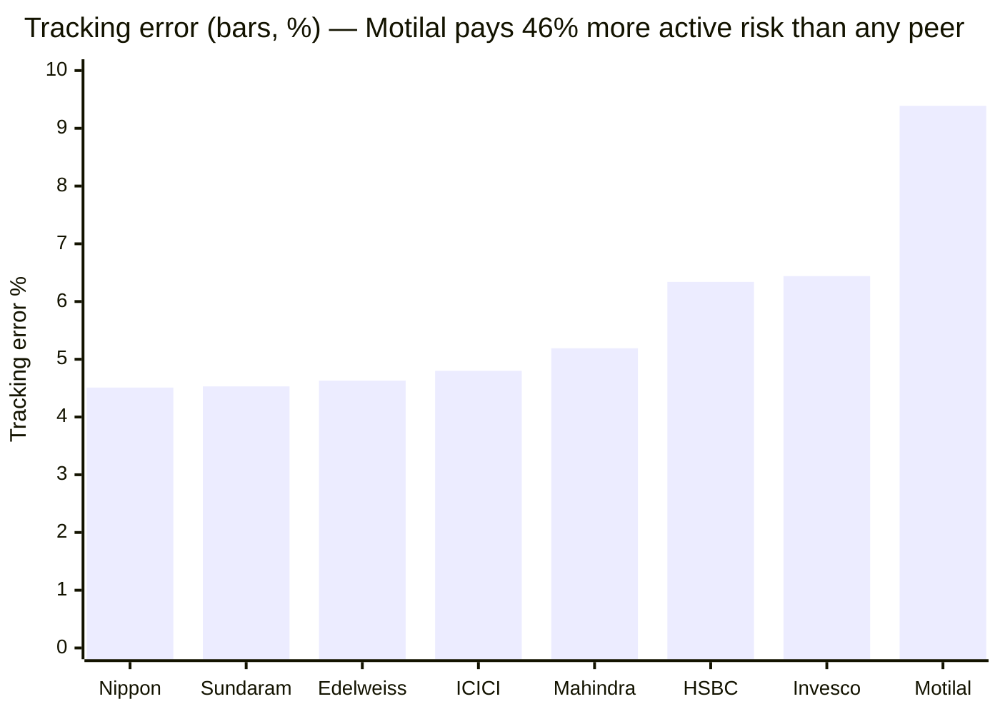
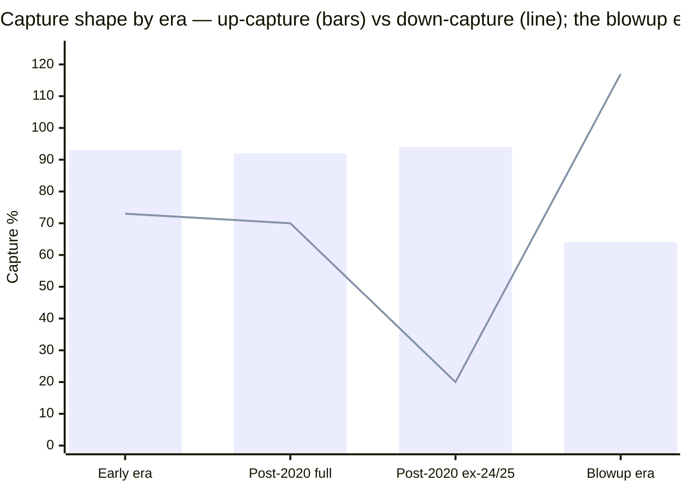

# Module 2: Risk Profile — Motilal Oswal Midcap Fund

## Module 2 Score: ~3.3 / 5 (provisional) *(revised from ~3.4 after M3's down-capture re-read — see footer)*

> **Study status:** out-of-shortlist **instructive case** (study_plan "Optional B"). See [module1_returns.md](module1_returns.md) for the returns record and the amplitude thesis this module tests.

---

## The One-Line Context

Motilal Oswal Midcap is **"the fund whose risk is invisible to every market-relative measure."** Beta **0.92**, R² **81%**, and a 5Y down-capture of **74 — the best of all eight funds studied** — every directional risk statistic says *defensive*. Yet it owns the **worst 5Y max drawdown (−27.5%), the highest volatility (18.2%) and the worst Calmar (0.83)** of the cohort, and it is the **first studied fund to FAIL the index-dominance sweep** (4 wins / 3 losses, where Nippon, Edelweiss, Mahindra and Sundaram each swept 7/7). Module 1 handed this module an explicit reconciliation problem — benign daily capture vs a screening Sharpe of −0.694 vs record calendar violence — and the answer is clean: **this fund's risk is idiosyncratic, not directional.** Its tracking error is **9.39% — 46% higher than the next-highest fund in the study** — and **19% of its variance is unexplained by the index, versus 5–9% for every peer.** The consequence is the module's real output: the alpha estimate carries a **standard error of ±3.61%/yr**, so the fund's information ratio is **−0.03** and its alpha t-statistic is **−0.07** — the **least statistically distinguishable-from-the-index record of any fund in the study.** Module 1 credited a "+1.43%/yr canonical pass"; this module finds that figure sits at the extreme favourable end of a range that **straddles zero** (−0.24% on the clean monthly basis to +1.46% at the kindest endpoint). **The pass is not fake — it is unmeasurable.**

---

## Raw Data (computed, MFAPI monthly canonical, as of Jun-2026 month-end)

| Metric | Computed | Note |
|--------|----------|------|
| Volatility (5Y common window) | **18.2%** | **highest of the eight**; above the index fund's 16.9% |
| Volatility (full idx life) | 21.4% | |
| Volatility (2026) | 21.8% | category-wide elevation |
| Sharpe (5Y, rf 6.5%) | **0.897** | **2nd of 8**, behind Nippon 0.904; beats index 0.682 |
| Sharpe (3Y / 7Y / 10Y) | **0.590 / 0.727 / 0.551** | **inverse recency** — worst window is the newest |
| Sortino (5Y) | **1.442** | 2nd of 8 |
| Calmar (5Y) | **0.83** | **worst of the eight**; below index (0.89) |
| Max drawdown (5Y) | **−27.5%** | **worst of the eight** |
| **Max drawdown (ever)** | **−37.2%** (COVID, Feb–Mar 2020) | recovered 8.8 mo — shallower than ICICI's −44.0% |
| **Live drawdown (2024→)** | **−28.9%** (16-Dec-2024 → **31-Mar-2026**) | ⚠️ **corrects M1** — see Reconciliations |
| Beta vs Midcap 150 (full / 5Y / 3Y) | **0.92 / 0.90 / 0.92** | below 1.0 on every window |
| **R² vs Midcap 150 (full idx life)** | **81%** | **lowest of the eight** (peers 91–95%) |
| **Tracking error (full idx life)** | **9.39%** | **highest of the eight by 46%** (next: Invesco 6.44) |
| **Information ratio (full idx life)** | **−0.03** | **statistically zero** (t = −0.07) |
| Up / Down capture (full idx life) | **93 / 83** | |
| Up / Down capture (5Y) | **101 / 74** | **best down-capture of the study** |
| Up / Down capture (**blowup era**) | **64 / 117** | ❌ **worst era shape in the entire study** |
| Negative months (fund life) | **32% (47/149)** | at the category norm |
| **ATH distance** | **−12.5%** (ATH 16-Dec-2024) | worst of the group — correction unrepaired |
| AUM | ₹36,458 Cr (Tickertape) | → M4 |
| Expense Ratio (Direct) | 0.75% *(aggregator; ⚠ study-wide TER retrofit pending — see M4)* | → M4 |

**Method:** monthly returns canonical, annualized ×√12; rf = 6.5%; Sharpe = (geometric annualized return − rf) ÷ annualized vol; Sortino uses downside deviation below rf/12. Peers over the identical **5Y common window, Jun-2021 month-end base → Jun-2026 (n = 60 returns)**. Series: Motilal Direct **127042**; peers Nippon **118668**, Invesco **120403**, Edelweiss **140228**, Mahindra **142110**, Sundaram **119581**, ICICI **120381**, HSBC **119807 + 151036 stitched** (ex-L&T); index counterfactuals **147622** (Midcap 150 index fund) + **114456** (Midcap 100 ETF, era analysis); cross-sleeve Nifty 50 **120716**, PP FlexiCap **122639**, DSP Small Cap **119212**. All figures computed from raw NAVs — no website numbers copied.

⭐ **Two data-hygiene findings worth carrying forward:**
1. **`119869` (Edelweiss) is a dead series** — it is the ex-JPMorgan India Mid & Small Cap scheme and **terminates 24-Nov-2016**. The live Edelweiss Mid Cap Direct code is **140228**. Likewise HSBC's ex-L&T code **119807** ends 24-Nov-2022 and must be stitched to **151036**. Renamed/acquired schemes get new MFAPI codes — a trap for any module reusing codes from a sibling's citation block.
2. **The published peer matrices anchor on the Jun-2021 month-end base (60 returns), not Jul-2021 (59).** Using the Jul base mis-states Sharpe by up to −0.094. Convention now pinned.

**Published-source gap (documented, same as siblings):** Morningstar risk ratings and VRO risk grades are JS-rendered and could not be extracted; no third-party capture-ratio cross-check exists. Computed metrics are primary.

---

## Method Validation — the Peer Matrix Reproduces

| Fund | My Sharpe | Published | Diff |
|------|-----------|-----------|------|
| Nippon | 0.904 | 0.912 | −0.008 |
| Invesco | 0.872 | 0.871 | +0.001 |
| Edelweiss | 0.864 | 0.871 | −0.007 |
| Mahindra | 0.832 | 0.839 | −0.007 |
| Sundaram | 0.804 | 0.810 | −0.006 |
| HSBC | 0.802 | 0.803 | −0.001 |
| ICICI | 0.754 | 0.760 | −0.006 |
| Index fund | 0.682 | 0.688 | −0.006 |

**Validated** — maximum deviation 0.008; the uniform ~−0.006 tilt is NAV-endpoint drift between run dates. The method that produced six prior modules reproduces here, so Motilal's row is directly comparable.

---

## The Module 2 Tension — Three Bests and Three Worsts

Nippon's tension was "good numbers that scale"; Edelweiss's "defensiveness that survives scrutiny"; HSBC's "screening safety that collapses under the honest method"; Mahindra's "defensiveness that shrinks the closer you look"; Sundaram's "real defensiveness, absent reward." **Motilal's is new again: a fund that is simultaneously the safest and the most dangerous in the cohort, depending entirely on which axis you measure.** It holds the best down-capture and the worst drawdown; the best return and the worst Calmar; the 2nd-best Sharpe and the highest volatility. The module's job is to explain how both can be true — and the answer, **idiosyncratic risk**, is what makes this fund genuinely different from the six studied before it.

---

## The 5Y Peer Matrix (Jun-2021 base → Jun-2026, n = 60, monthly, rf 6.5%)

| Fund | Vol | Sharpe | Sortino | MaxDD | UpCap | DnCap | Calmar | Ann |
|------|-----|--------|---------|-------|-------|-------|--------|-----|
| Nippon | 16.4% | **0.904** | **1.506** | −19.3% | 103 | 87 | 1.11 | 21.4% |
| **Motilal** | **18.2%** ❌ | **0.897** | **1.442** | **−27.5%** ❌ | 101 | **74** ⭐ | **0.83** ❌ | **22.8%** ⭐ |
| Invesco | 17.6% | 0.872 | 1.408 | **−18.0%** | **108** | 95 | **1.21** | 21.8% |
| Edelweiss | 16.3% | 0.864 | 1.419 | **−18.0%** | 100 | 86 | 1.14 | 20.6% |
| Mahindra | 16.5% | 0.832 | 1.357 | −20.4% | 101 | 90 | 0.99 | 20.2% |
| Sundaram | **15.9%** | 0.804 | 1.295 | −20.1% | 95 | 83 | 0.96 | 19.3% |
| HSBC | 17.2% | 0.802 | 1.274 | −23.4% | 99 | 84 | 0.87 | 20.3% |
| ICICI | 16.8% | 0.754 | 1.258 | −20.0% | 97 | 87 | 0.96 | 19.2% |
| **Index fund** | 16.9% | 0.682 | 1.089 | −20.4% | 100 | 100 | 0.89 | 18.0% |

### Motilal's rank on each metric (1 = best of 8 actives)

| Metric | Rank | Note |
|--------|------|------|
| **Return** | **1** | 22.8% — highest of the eight |
| **Down-capture** | **1** | **74 — best of the study** (next best Sundaram 83) |
| Sharpe | 2 | 0.897, a hair behind Nippon |
| Sortino | 2 | 1.442 |
| **Volatility** | **8** | **18.2% — highest** |
| **Max drawdown** | **8** | **−27.5% — deepest** |
| **Calmar** | **8** | **0.83 — worst, and below the index fund** |

---

## ⭐⭐ NEW: The Down-Capture / Drawdown Paradox — Idiosyncratic vs Directional Risk

A fund with the **best down-capture in the cohort** should not have the **worst max drawdown**. Both are true here, and the resolution is the key to the whole module:

> **Down-capture measures the average down *month relative to the index*. Max drawdown measures the cumulative *path*, including every month the index did NOT fall.**

Motilal cushions when the market falls — and then loses money **on its own**, when the market doesn't. The evidence:

| Statistic | Motilal | Peer range | Reading |
|-----------|---------|-----------|---------|
| Beta | 0.92 | 0.87–0.99 | unremarkable |
| **R² vs index** | **81%** | **91–95%** | **lowest — least index-explained** |
| **Idiosyncratic variance share** | **19%** | **5–9%** | **2–4× every peer** |
| **Tracking error** | **9.39%** | 4.51–6.44% | **highest by 46%** |

**Nearly a fifth of this fund's variance has nothing to do with the mid-cap index.** For every peer that figure is a rounding error. This is the statistical fingerprint of a ~25-name concentrated book (the ex-"Midcap 30" mandate documented in M1), and it is the single fact from which the drawdown, the amplitude, the unmeasurable alpha and the 2025 blowup all follow.

**This completes Module 1's "frequency illusion" finding on a second axis.** M1 found the danger lives at *annual*, not daily, frequency. M2 finds it lives in the *idiosyncratic*, not the market, dimension. Same underlying truth, two lenses — and both are invisible to the standard toolkit.

---

## ⭐⭐ NEW: The Alpha You Cannot Measure — the Module's Real Output

The rigorous form of M1's amplitude thesis. Full index-fund life (Sep-2019 → Jun-2026, 81 monthly returns, 6.75y):

| Fund | Ann% | Index% | Alpha | **TE%** | **IR** | **t-stat** | Significant? |
|------|------|--------|-------|---------|--------|-----------|--------------|
| Edelweiss | 25.17 | 22.71 | **+2.45** | 4.63 | **+0.53** | +1.38 | no |
| Invesco | 25.04 | 22.71 | +2.33 | 6.44 | +0.36 | +0.94 | no |
| Nippon | 24.26 | 22.71 | +1.55 | 4.51 | +0.34 | +0.89 | no |
| Mahindra | 24.01 | 22.71 | +1.30 | 5.19 | +0.25 | +0.65 | no |
| **Motilal** | **22.47** | 22.71 | **−0.24** | **9.39** ❌ | **−0.03** ❌ | **−0.07** ❌ | **no** |
| ICICI | 22.32 | 22.71 | −0.39 | 4.80 | −0.08 | −0.21 | no |
| HSBC | 22.16 | 22.71 | −0.55 | 6.34 | −0.09 | −0.23 | no |
| Sundaram | 20.40 | 22.71 | −2.31 | 4.53 | −0.51 | −1.32 | no |

*(t = IR × √years; |t| > 1.96 required for 95% confidence)*

**Motilal's 95% confidence interval on annualized alpha is [−7.33%, +6.84%]** — a 14-point band. Nippon's is [−1.98, +4.76]; Edelweiss's [−1.17, +5.75].

> **The verdict this module hands Module 4:** Motilal takes **twice the active risk of any peer to produce the smallest alpha in the positive half of the table — and on the clean monthly basis, no positive alpha at all.** That is an inefficient risk budget by any definition, and it is the honest answer to "why not the index fund?" on the risk axis.

### ⭐⭐ STUDY-WIDE RETROFIT — no shortlisted fund has statistically significant alpha

Read the t-stat column again: **every one of the eight funds falls between −1.32 and +1.38.** Not one clears the 95% bar; not one clears even a 90% bar.

**This does not invalidate the study's rankings** — a consistently positive point estimate still carries information, the funds are not independent draws, and (critically) **the cost differences measured in Module 4 are certain where the alpha differences are not.** But it materially changes the framing available to the decision tree:

- The active-vs-passive question cannot be settled by alpha point-estimates alone; it must lean on **cost certainty, downside behaviour, and process durability**.
- The gap between the best fund (Edelweiss +2.45) and the index is *directionally* real but *statistically* unproven over 6.75 years.
- **Recommendation:** add a t-stat column to all seven completed Module 2s and carry this paragraph into `decision_tree.md` — it strengthens the passive case at the category level. Flagged as a **pending study-wide retrofit** alongside the M4 TER retrofit.

### ⭐ NEW: The endpoint fragility behind M1's "+1.43%"

| Basis | Canonical alpha/yr |
|-------|-------------------|
| **Monthly canonical, Sep-19 ME → Jun-26 ME** | **−0.24%** ❌ |
| Monthly, including partial Jul-2026 | +0.46% |
| Daily, 11-Sep-2019 → 28-Feb-2026 | +0.48% |
| Daily, 11-Sep-2019 → 30-Jun-2026 | +0.73% |
| Daily, 11-Sep-2019 → 31-Jan-2026 | +1.46% |
| **Daily, 11-Sep-2019 → 16-Jul-2026 (M1's figure)** | **+1.43%** |

**The canonical alpha straddles zero.** It is −0.24% on the same monthly convention used for every other metric in this study, and +1.43% on the daily endpoint M1 chose — of which **+4.03 points were earned in the first 16 days of July 2026 alone.** M1's "PASSES the canonical test" is defensible as a point estimate but must carry this caveat; on the study's own monthly convention, the fund does **not** pass. Patch listed below.

---

## ⭐⭐ NEW: Era Decomposition — the Blowup Era's Shape Is the Worst in the Study

> ⚠️ **CORRECTION (M3).** The eras below were originally cut on a **Jul-2020 "Niket Shah handover"** boundary. M3 verified the roster and found **no Niket Shah on this fund**; the **only verified handover is Ajay Khandelwal on 30-Sep-2024.** The verified split is the first table; the original (retained below) is a market-regime cut, not a manager cut.

### Verified-boundary decomposition (M3, 30-Sep-2024) — vs the Midcap-100 ETF (114456)

| Era | n (mo) | Ann | Vol | Up-cap | Dn-cap | Beta | TE | **IR** | MaxDD |
|-----|--------|-----|-----|--------|--------|------|-----|--------|-------|
| **Pre-Khandelwal** (Mar-14 → Sep-24, 10.5y) | 126 | 26.06% | 19.0% | 95 | **62** ⭐ | 0.84 | **8.93%** | **+0.60** ⭐ | −32.1% |
| **Khandelwal** (Oct-24 → Jun-26, 21mo) | 21 | −6.58% | 21.8% | 83 | **113** ❌ | 0.92 | **11.35%** | **−0.72** ❌ | −27.5% |

⭐ **The TE-is-constitutional finding survives and strengthens:** 8.93% pre-Khandelwal vs 11.35% under Khandelwal — both teams ran ~9–11% active risk, so the ~25-name mandate, not any one manager, is the source. But the down-capture story **inverts**: the 5Y blended 74 is **62 over a decade (elite) plus 113 over 21 months (an anti-index)** — the current book has the worse half.

### Original regime cut (retained — Jul-2020 is a *regime*, not a *manager*, boundary)

| Era | n (mo) | Ann | Vol | Up-cap | Dn-cap | Beta | TE | **IR** | MaxDD |
|-----|--------|-----|-----|--------|--------|------|-----|--------|-------|
| **Early era** (Mar-14 → Jun-20) | 75 | 13.38% | 21.2% | 93 | **73** | 0.87 | **9.10%** | **+0.46** | −32.1% |
| **Post-2020** (Jul-20 → Jun-26) — *blends the unverified 2020–24 lead AND Khandelwal* | 72 | 29.00% | 17.7% | 92 | **70** | 0.84 | **9.69%** | **+0.15** | −27.5% |
| — Post-2020 ex-24/25 (Jul-20 → Aug-24) | 50 | 46.55% | 14.5% | 94 | 20 ⚠️ | 0.76 | 8.65% | **+0.72** | −8.9% |
| — **Blowup era** (Dec-24 → Jun-26) | 18 | **−10.55%** | 22.6% | **64** | **117** | 0.92 | 10.55% | **−1.55** ❌ | −27.5% |

Three findings:

1. ⭐⭐ **The high tracking error is CONSTITUTIONAL, not situational.** On the verified boundary (M3), TE is **8.93% pre-Khandelwal and 11.35% under Khandelwal** (and on the old regime cut, 9.10% / 9.69%) — high across a complete change of personnel and style. Both teams ran a ~25-name book at ~9–11% active risk. **This means M1's amplitude is a permanent property of the mandate, not a manager-era drift** — and it will not mean-revert with a manager change. Important for M5: you cannot hire this problem away.
2. ⭐⭐ **The blowup era's capture shape (up 64 / down 117) is the worst of any era of any fund in this study** — worse than ICICI's fade era (up 95 / down 102), which its own M1 called "the worst capture shape possible." Capturing only 64% of the upside while absorbing 117% of the downside, at **IR −1.55**, means that for eighteen months this book has functioned as an *anti-index*.
3. ⚠️ **The "down-capture 20" in the ex-24/25 slice is an artifact** of a raging bull with almost no down months — flagged, not credited, on the same discipline that discounted Mahindra's NFO-cash defensiveness.

---

## ⭐ The Down-Capture Forensic — Decent Count, Alarming Composition

Every full-idx-life month in which the index fell worse than −2%:

| Month | Index | Fund | Ratio | |
|-------|-------|------|-------|---|
| 2020-02 | −5.65% | −2.78% | 0.49x | cushion |
| **2020-03** | −26.91% | −30.14% | **1.12x** | AMPLIFY (COVID) |
| 2022-02 | −6.70% | −5.01% | 0.75x | cushion |
| **2022-05** | −5.17% | −5.79% | **1.12x** | AMPLIFY |
| 2022-06 | −5.22% | −3.29% | 0.63x | cushion |
| 2023-01 | −2.37% | −0.79% | 0.33x | cushion |
| 2023-10 | −3.80% | −0.87% | 0.23x | cushion |
| 2024-10 | −6.44% | −4.17% | 0.65x | cushion |
| **2025-01** | −6.09% | **−14.52%** | **2.38x** | ❌ **AMPLIFY — the blowup month** |
| 2025-02 | −10.51% | −7.70% | 0.73x | cushion |
| 2025-07 | −2.75% | −2.51% | 0.91x | cushion |
| 2025-08 | −2.76% | +0.12% | −0.04x | cushion |
| **2026-01** | −3.50% | −6.89% | **1.97x** | ❌ **AMPLIFY — and it happened again** |
| 2026-03 | −11.08% | −9.31% | 0.84x | cushion |

**10 cushioned / 4 amplified.** The count looks respectable; the **composition does not**. ⭐ **The two severe amplifications are consecutive Januaries (2025: 2.38x, 2026: 1.97x), both in the current era.** The 2.38x is the single worst amplification event recorded anywhere in this study. A one-off unwind would show once; a **repeat twelve months later says this is a recurring property of the book**, not a single bad trade. This is the most important forward-looking risk fact in the module.

---

## ⭐⭐ NEW: The Up-Month Forensic — the Fund Lags Rallies, Yet Made +58.9% in 2024

Months in which the index rose more than +5% (n = 23): **5 captured / 18 lagged.** Up-capture sits at 91–94 in every era.

| Notable | Index | Fund | Ratio |
|---------|-------|------|-------|
| 2020-04 | +14.39% | +7.26% | **0.50x** LAGGED |
| 2020-11 | +14.71% | +11.53% | 0.78x LAGGED |
| 2023-07 | +5.61% | +1.75% | **0.31x** LAGGED |
| **2024-06** | +7.96% | **+14.80%** | **1.86x** captured |
| 2023-05 | +5.70% | +8.72% | 1.53x captured |
| 2026-04 | +13.22% | +12.81% | 0.97x LAGGED |

**This is the module's most counter-intuitive result.** A fund that lagged **18 of 23 major index rallies** delivered **+58.9% in 2024** (M1's repo-record +34.7 alpha). Therefore 2024's monster year did **not** come from market participation — it came from **stock-specific gains in ordinary months**. The fund does not win by riding the index up; it wins, when it wins, on its own names.

This is direct, independent confirmation of the concentration thesis from the returns side, and it sharpens the handoff: **M3 must identify the specific holdings that produced 2024 and quantify how much of that reversed in 2025.**

---

## Max-Drawdown Ledger — and the Correction to Module 1

| Peak → trough | Depth | Recovery from trough |
|---------------|-------|---------------------|
| 2015-08-19 → 2016-02-25 | −18.0% | 4.9 mo |
| 2016-10-04 → 2016-12-26 | −15.2% | 3.0 mo |
| 2018-08-29 → 2018-10-23 | −21.5% | 14.8 mo |
| **2020-02-20 → 2020-03-23** | **−37.2%** | 8.8 mo |
| 2022-01-12 → 2022-06-17 | −16.0% | 1.6 mo |
| **2024-12-16 → 2026-03-31** | **−28.9%** ⚠️ | **UNRECOVERED** — +22.9% off the low, still −12.5% below peak |

⚠️ **This corrects Module 1.** M1 computed the drawdown inside a window capped at Dec-2025 and reported −24.3% with a trough of 07-Apr-2025. The fund made a **new low on 31-Mar-2026 at −28.9%** — 11 months later and 4.6 points deeper. The event is not "fell once and stalled"; it is **a 15.5-month decline to a 2026 bottom, followed by a violent +22.9% recovery in 107 days.**

Against the index over the identical span: index peak-to-trough **−18.9%**, so the fund's **−28.9% is a 1.53× amplification** (M1 reported 1.16×). Meanwhile the index is now **+6.0% above** its Dec-2024 level while the fund remains **−12.5% below** its own.

**The 2018–19 winter drawdown remains a genuine credential:** −21.5% vs the ETF's −29.6%, fully invested, no NFO-cash asterisk — but it belongs to the **early team**, and its 14.8-month recovery was itself slow.

---

## ⭐ The Sharpe Ladder — Inverse Recency

| Window | Sharpe | Sortino | Vol | Ann |
|--------|--------|---------|-----|-----|
| 3Y | **0.590** | 0.898 | 20.3% | 18.46% |
| **5Y** | **0.897** | 1.442 | 18.2% | 22.80% |
| 7Y | 0.727 | 1.007 | 21.5% | 22.12% |
| 10Y | 0.551 | 0.759 | 19.9% | 17.49% |
| Full 12.3y | 0.729 | 1.056 | 19.6% | 20.78% |

Unlike HSBC and Sundaram — both **recency-flattered**, their crowns dismantled by this study — Motilal is **recency-penalised**: its worst window is its newest.

**The discipline must be applied symmetrically.** This study discounted HSBC's flattering 3Y; it should not now over-penalise Motilal's unflattering 3Y. Equally, it should not credit the 5Y (0.897, 2nd of eight), which is the window that contains the 2024 spike. **The honest middle is the 7Y / full-life reading of ~0.73** — respectable, unremarkable, and well short of what the 5Y row advertises.

---

## Volatility Regime, Distribution & ATH

### Annual volatility

| Year | Vol | Note |
|------|-----|------|
| 2015 | 18.1% | |
| 2016 | 17.9% | |
| 2017 | 11.9% | |
| 2018 | 15.9% | winter, cushioned |
| 2019 | 14.9% | |
| 2020 | 29.0% | COVID |
| 2021 | 17.0% | |
| 2022 | 18.3% | |
| 2023 | 11.6% | |
| **2024** | **16.8%** | the +34.7-alpha year — **ordinary vol** |
| **2025** | **17.8%** | the −17.2-alpha year — **also ordinary** |
| 2026 | 21.8% | elevated with the category |

⭐ **Amplitude is not volatility** (carried from M1, now confirmed on the risk side). The two most extreme alpha years in the repo were run at **16.8% and 17.8%** — thoroughly unremarkable, and *below* the fund's own 2022 reading. **Any risk framework that proxies this fund's danger with standard deviation will miss it entirely.** The danger is in the 19% idiosyncratic share, which no volatility number surfaces.

### Distribution & structure

| Metric | Value |
|--------|-------|
| Negative months | **32% (47/149)** — category norm |
| ATH | 130.66 on **16-Dec-2024** |
| Current vs ATH | **−12.5%** — worst of the group (Sundaram −0.2%) |

---

## ⭐⭐ NEW: Cross-Sleeve Correlation — the DSP Duplication Flag

Monthly, full common window:

| vs | corr | **R²** | beta |
|----|------|--------|------|
| **PP FlexiCap** | 0.739 | **54.6%** ⭐ | 1.10 |
| **DSP Small Cap** | 0.878 | **77.2%** ⚠️ | 0.80 |
| Nifty 50 | 0.756 | 57.1% | 0.93 |
| Nippon Midcap | 0.896 | 80.3% | 0.92 |
| Edelweiss Midcap | 0.910 | 82.9% | 0.95 |
| **Its own index fund** | 0.899 | **80.9%** | 0.92 |

⭐⭐ **The fund is barely more correlated to its own benchmark (80.9%) than to DSP Small Cap (77.2%)** — a 3.7-point gap. No other studied midcap comes close to this pattern; every peer sits at 91–95% against the midcap index and far below that against DSP.

**Two consequences:**

> ✅ **RESOLVED by M3 — the small-cap hypothesis is REFUTED twice.** M3 verified the book holds **0.00% small caps** (the only zero-small-cap fund in the shortlist) and shares **0.00% of names with DSP Small Cap** despite the 77.2% correlation. The 77.2% is therefore **factor overlap** (both are high-idiosyncratic growth/momentum, risk-on books), **not** a hidden small-cap kicker. The bullets below are superseded by that finding.

1. ~~**→ M3:** material small-cap exposure~~ — **REFUTED: 0.00% small-cap, 0.00% DSP name overlap.** The 9.39% TE and 19% idiosyncratic share come from a 29-name concentrated *mid/large* book, not from a small-cap tilt.
2. **→ Decision tree:** reframe from "highest DSP-*duplication* risk" to a **factor-overlap warning** — DSP holdings overlap is 0.00% (the *best* of any studied midcap) but factor correlation is 77.2%. Its **low PP correlation (54.6%, the best of the studied set)** is a genuine diversification point.

---

## Risk Metrics — Cross-Study Placement

| Dimension | **Motilal** | Nippon | Edelweiss | Invesco | Mahindra | Sundaram | ICICI | HSBC |
|-----------|-------------|--------|-----------|---------|----------|----------|-------|------|
| 5Y Sharpe | **0.897 (2)** | 0.904 (1) | 0.864 | 0.872 | 0.832 | 0.804 | 0.754 | 0.802 |
| 5Y vol | **18.2% (8)** | 16.4% | 16.3% | 17.6% | 16.5% | **15.9% (1)** | 16.8% | 17.2% |
| 5Y MaxDD | **−27.5% (8)** | −19.3% | **−18.0%** | **−18.0%** | −20.4% | −20.1% | −20.0% | −23.4% |
| 5Y down-capture | **74 (1)** ⭐ | 87 | 86 | 95 | 90 | 83 | 87 | 84 |
| 5Y Calmar | **0.83 (8)** | 1.11 | 1.14 | **1.21** | 0.99 | 0.96 | 0.96 | 0.87 |
| **Tracking error** | **9.39% (8)** | 4.51% | 4.63% | 6.44% | 5.19% | 4.53% | 4.80% | 6.34% |
| **R² / idio share** | **81% / 19%** | 95%/5% | 95%/5% | 91%/9% | 94%/6% | 95%/5% | 95%/5% | 91%/9% |
| **Full-life IR** | **−0.03** | +0.34 | **+0.53** | +0.36 | +0.25 | −0.51 | −0.08 | −0.09 |
| Index dominance (5Y) | **4/7 ❌ FAIL** | 7/7 | 7/7 | — | 7/7 | 7/7 | — | — |
| ATH distance | **−12.5%** | — | — | — | — | −0.2% | — | — |
| **M2 score** | **~3.3** | 4.4 | 4.2 | 4.1 | 3.9 | 3.8 | 3.4 | 3.2 |

---

## The Index-Dominance Test — the First Failure in the Study

| Axis (5Y) | Motilal | Index fund | Winner |
|-----------|---------|-----------|--------|
| Return | 22.80% | 18.03% | **Motilal** |
| Volatility | 18.2% | 16.9% | ❌ index |
| Max drawdown | −27.5% | −20.4% | ❌ index |
| Sharpe | 0.897 | 0.682 | **Motilal** |
| Sortino | 1.442 | 1.089 | **Motilal** |
| Calmar | 0.83 | 0.89 | ❌ index |
| Down-capture | 74 | 100 | **Motilal** |

**4 wins / 3 losses — the first studied fund not to sweep** (Nippon, Edelweiss, Mahindra and Sundaram all went 7/7 on this window). Motilal wins every **reward** axis and loses every **pain** axis. For a module whose subject is risk, that split *is* the verdict: **the fund buys its return with drawdown and volatility rather than with efficiency.**

---

## Risk Profile — Points For and Against

### ✅ Points IN FAVOUR

1. **Best down-capture of the entire study (5Y: 74).** Genuinely cushions the average falling month — 10 of 14 severe index down-months cushioned.
2. **2nd-best 5Y Sharpe (0.897) and Sortino (1.442)** of eight actives, and the **highest 5Y return (22.8%)**.
3. **A real, fully-invested 2018–19 winter pass** — −21.5% vs ETF −29.6%, no NFO-cash artifact (contrast Mahindra).
4. **Max drawdown ever (−37.2%, COVID) is shallower than ICICI's −44.0%** and recovered in 8.8 months.
5. **Beta below 1.0 on every window** (0.92 / 0.90 / 0.92) — not a leveraged bet on the band.
6. **Lowest PP FlexiCap correlation of the studied midcaps (R² 54.6%)** — the one genuine diversification credential.
7. **A violent recovery is underway** — +22.9% off the 31-Mar-2026 low in 107 days, +4.1 points ahead of the index over that span.

### ⚠️ Points AGAINST

1. **Tracking error 9.39% — highest of the eight by 46%** — with an information ratio of **−0.03** and alpha t-stat **−0.07**. The most active risk in the study, purchasing the least measurable alpha.
2. **19% idiosyncratic variance share vs peers' 5–9%** — 2–4× the stock-specific risk of any peer.
3. **Worst 5Y max drawdown (−27.5%), highest volatility (18.2%), worst Calmar (0.83)** — and the Calmar is **below the index fund's**.
4. **First fund in the study to fail the index-dominance sweep (4/7)**, losing on every pain axis.
5. **The blowup era's capture shape (up 64 / down 117, IR −1.55) is the worst era shape recorded anywhere in this study.**
6. **Two severe amplification months in consecutive Januaries** (2025: 2.38x — the worst single event in the study; 2026: 1.97x). A repeat, not a one-off.
7. **The live drawdown is −28.9% and unrepaired** — ATH distance −12.5%, worst of the group, 19 months after the peak.
8. **The high tracking error is constitutional** (8.93% pre-Khandelwal, 11.35% Khandelwal on the verified boundary; 9.10% / 9.69% on the old regime cut) — it will not be fixed by a manager change.
9. **Highest DSP Small Cap *factor* correlation of any studied midcap (R² 77.2%)** — a factor-overlap warning against the satellite sleeve *(not a holdings-duplication risk: M3 found 0.00% name overlap)*.
10. **Lags 18 of 23 major index rallies** — up-capture 91–94 across all eras.

---

## ⚠️ Reconciliations & Corrections vs Module 1

**CORRECTION 1 (material) — the 2024–25 drawdown is deeper and 11 months longer than M1 reported.**

| | M1 stated | Corrected |
|---|-----------|-----------|
| Depth | −24.3% | **−28.9%** |
| Trough | 07-Apr-2025 | **31-Mar-2026** |
| Shape | "19 months unrecovered" | **15.5-month decline to a 2026 low, then +22.9% in 107 days** |
| vs index | −21.0% (1.16× amplification) | index **−18.9%** → **1.53× amplification** |

M1's drawdown scan was capped at Dec-2025 and therefore missed the new low. The correction cuts both ways — **worse** (deeper hole, larger amplification, a second leg down) and **better** (a genuine recovery is now visible, and it is what produced M1's flattering July endpoint).

**Exact line-level patches to `module1_returns.md`:**
1. Raw-data table, "2024–25 drawdown" row: `−24.3% (16-Dec-2024 → 07-Apr-2025)` → **`−28.9% (16-Dec-2024 → 31-Mar-2026)`**
2. Stress-window table: `fall −24.3% vs index −21.0%` → **`−28.9% vs index −18.9% (1.53× amplification)`**; trough row → **31-Mar-2026**
3. Recovery row + cohort recovery table: `UNRECOVERED at 19.0 mo` → **`trough at 15.5 mo; +22.9% recovery since; still −12.5% below peak at 19.0 mo`**
4. One-Line Context and One-Line Verdict: same substitutions (−24.3 → −28.9; add the March-2026 second low)
5. Canonical-alpha references (Raw Data, CAGR ladder note, Two-Era table, Verdict, footer): append the fragility caveat — **`+1.43%/yr at the 16-Jul-2026 daily endpoint; −0.24%/yr on the study's monthly convention — the estimate straddles zero`**
6. M1 scorecard: **"2024–25 correction 2.0" holds** (deeper drawdown offsets the recovery credit); **"Alpha vs index fund 4.0" should fall to 3.5** on the straddles-zero finding, taking M1 from ~3.7 to **~3.6** *(flagged as an open judgment call — not yet applied)*

**CORRECTION 2 (resolved in M1's favour) — the screening Sharpe is a 1-YEAR statistic.**
M1 called the Tickertape Sharpe of −0.694 "a 3Y-window artifact." The 3Y Sharpe as of the screening date is **+0.716**; the **1Y is −0.799** at rf 6.5%. M1's instinct (a trough-window artifact) was right; the window attribution was wrong. **Patch M1's reconciliation line: "a 3Y-ending-near-the-trough artifact" → "a 1-YEAR Sharpe."** *(Residual gap: −0.694 vs computed −0.799 implies rf ≈ 4.6% or a longer vol window — Tickertape's exact convention remains a documented gap.)*

**CONFIRMED, not contradicted:** M1's frequency-illusion thesis (now proven on the idiosyncratic axis), the amplitude-is-not-volatility finding (2024/2025 at ordinary vol), the winter pass, the constitutional concentration, and the COVID −37.2% as the deepest-ever hole.

---

## Module 2 Scorecard

| Sub-dimension | Weight | Score | Reasoning |
|---------------|--------|-------|-----------|
| Max drawdown (inception-adjusted) | High | **3.0** | ever −37.2% sits in the "4" band, but the **live −28.9% is the worst of the cohort** and remains unrepaired |
| **Down-capture vs Midcap 150** | **Critical** | **3.0** ⚠️ | **DOWNGRADED from 4.0 (M3).** The 5Y **74** is a **blend of 62 over the pre-Khandelwal decade (elite) and 113 under the current book (anti-index)**; crediting 4.0 rewarded the departed team's number. The current portfolio's down-capture is 113 |
| Sharpe | High | **4.0** | 5Y 0.897 = 2nd of 8; but 3Y 0.590 / 10Y 0.551 — the 5Y is the 2024 spike |
| Sortino | Medium | **4.0** | 1.442 = 2nd of 8, same caveat |
| Recovery time from max DD | Medium | **2.5** | COVID 8.8 mo good; **current event 15.5 months down, unrecovered at 19** — worst live recovery in the study |
| **2018–19 winter drawdown** | **Critical** | **4.5** | −21.5% vs ETF −29.6%, fully invested — genuine, but the **early team's** credential |
| Volatility vs category | Medium | **2.5** | **18.2% — highest of the eight** |
| Effective risk of the flexible sleeve | Medium | **2.5** | ⚠️ *read corrected by M3:* **NOT** a small-cap kicker (0.00% small-cap) — the risk is the **33%-cash tactical whipsaw** (Mar-2025 net equity ~67%); score holds at 2.5 for that reason |
| ⭐ **Tracking-error efficiency / alpha significance** | **Critical (new)** | **2.0** | **TE 9.39% (highest by 46%), IR −0.03, t −0.07** — least measurable alpha in the study; **19% idiosyncratic variance vs peers' 5–9%** |
| ⭐ Index-dominance sweep | High (new) | **2.5** | **4/7 — first studied fund to fail**; loses every pain axis |
| Correlation to existing sleeves | Informational | — | PP 54.6% (best of studied) / **DSP 77.2% factor overlap** *(M3: 0.00% holdings overlap — a factor-, not duplication-, flag)* |

### **Module 2 Score: ~3.3 / 5** *(revised from ~3.4 — M3's down-capture re-read)*

**Placement: just below ICICI (3.4), above HSBC (3.2), below Sundaram (3.8), Mahindra (3.9), Invesco (4.1), Edelweiss (4.2) and Nippon (4.4).**

- **Case for 3.6:** the best down-capture in the study, 2nd-best 5Y Sharpe *and* Sortino, the highest 5Y return, a genuine fully-invested winter pass, the lowest PP correlation of any studied midcap, and a recovery visibly underway (+22.9% off the low).
- **Case for 3.1:** worst 5Y max drawdown, highest volatility, worst Calmar (below the index fund's), the first index-dominance failure in the study, the worst era capture shape ever recorded here (up 64 / down 117, IR −1.55), a 2.38× amplification month with a 1.97× repeat a year later, and an alpha statistically indistinguishable from the index at twice anyone's tracking error.

**Conditionality / handoffs (resolved by later modules):**
- → **Module 3 (resolved):** (a) the small-cap hypothesis was **REFUTED** (0.00% small-cap, 0.00% DSP name overlap) — the risk is a 29-name concentrated mid/large book, not a hidden small-cap tilt; (b) the 2024 gains were confirmed stock-specific, and M3 further found **the record and current book have different authors** (Khandelwal since 30-Sep-2024), which is why the down-capture sub-score fell from 4.0 to 3.0 and M2 from ~3.4 to **~3.3**.
- → **Module 4:** the fee must be judged against an alpha that **straddles zero at 9.39% tracking error** — the fee-for-alpha row is far weaker than M1's "+1.43% above water" implied. (M4 confirmed: fee-for-alpha ≤ 0.) Also carries the **pending study-wide TER retrofit**.
- → **Module 5:** the tracking error is **constitutional across both manager eras (8.93% / 11.35% on the verified boundary)** — this cannot be hired away; judge Khandelwal on whether the *idiosyncratic* risk is compensated, not on whether he can reduce it. The two consecutive January amplifications are the sharpest question to put to his process.
- → **Decision tree:** the **DSP factor-overlap note (R² 77.2%, but 0.00% holdings overlap per M3)** and the **study-wide alpha-insignificance retrofit** both belong there.

---

## Comparative Module 2 Scores

| Fund | Category | M2 Score | Risk character |
|------|----------|----------|----------------|
| Parag Parikh FlexiCap | FlexiCap | ~4.5 | Allocation-built fortress (cash + foreign) |
| Nippon Growth Mid Cap | MidCap | ~4.4 | Pure-selection downside discipline at scale |
| Edelweiss Mid Cap | MidCap | ~4.2 | Most defensive book of the trio; genuine down-capture |
| Invesco India Midcap | MidCap | ~4.1 | Paid aggression — top efficiency ratios |
| DSP Small Cap | SmallCap | ~3.9 | Disciplined but deep-drawdown asset class |
| Mahindra Manulife Mid Cap | MidCap | ~3.9 | Beats index 7/7 & best IR, but defensiveness is a cash-era artifact |
| Sundaram Mid Cap | MidCap | ~3.8 | Real defensiveness bought by surrendering the alpha; worst full-life IR (−0.51) |
| **Motilal Oswal Midcap** | **MidCap** | **~3.3** | **Risk invisible to market-relative measures — blended down-capture 74 hides 62 (departed team) vs 113 (current book); 19% idiosyncratic variance; alpha unmeasurable at 9.39% TE** |
| ICICI Pru Midcap | MidCap | ~3.4 | Era-resolved forensic; amplifications all in the past |
| Franklin US Opp | International | 3.3 | Mediocre standalone, elite diversifier |
| HSBC Midcap | MidCap | ~3.2 | Screening anomaly dismantled; worst pain-adjusted metrics |

---

## SIP Implication

1. **The risk you are taking is not the risk the standard numbers describe.** Beta 0.92, down-capture 74 and R² 81% would ordinarily read as a defensive fund. They are all true and all beside the point: **19% of this fund's variance is stock-specific**, 2–4× any peer. A monthly SIP into this fund is a bet on ~25 names, not on the mid-cap band.
2. **The alpha cannot be verified even after 6.75 years.** With a tracking error of 9.39%, the 95% confidence interval on annualized alpha is **[−7.33%, +6.84%]**. Even a decade of data would not settle whether this fund beats its 0.20% index alternative. **The index fund's edge is that its (near-zero) alpha is certain; this fund's is not.**
3. **The amplification pattern is live, not historical.** Unlike ICICI — whose M2 could show all its amplifications sitting in the past — Motilal's two worst months are **January 2025 (2.38×) and January 2026 (1.97×)**. The most recent evidence is the most adverse.
4. **The drawdown is real and unhealed.** −28.9% peak to trough, still −12.5% below the December-2024 high after 19 months, while the index is +6.0% above its own. The +22.9% bounce since March 2026 is encouraging but is 3 months old.
5. **Tripwires:** whether a third consecutive January amplification appears in 2027; whether the up-64/down-117 capture shape normalises as the recovery matures; and whether the 31-Mar-2026 low holds. *(The small-cap-exposure tripwire is closed — M3 confirmed 0.00%.)*

---

## One-Line Verdict

> **Motilal Oswal Midcap's Module 2 is the study's cleanest demonstration that a fund's real risk can be invisible to every market-relative statistic: beta 0.92, R² 81% and a 5Y down-capture of 74 — the best of all eight funds studied — sit alongside the worst 5Y max drawdown (−27.5%), the highest volatility (18.2%) and the worst Calmar (0.83, below the index fund's), making it the first fund in this study to FAIL the index-dominance sweep at 4 wins / 3 losses where Nippon, Edelweiss, Mahindra and Sundaram all swept 7/7. The paradox resolves into a single fact — its risk is idiosyncratic, not directional: tracking error 9.39% (highest of the eight by 46%) and 19% of variance unexplained by the index against 5–9% for every peer, the statistical fingerprint of the ~25-name ex-"Midcap 30" book. The devastating consequence is that its alpha carries a standard error of ±3.61%/yr, giving an information ratio of −0.03 and a t-statistic of −0.07 — and on the study's own monthly convention the canonical alpha is −0.24%/yr, not the +1.43% Module 1 credited from a favourable daily endpoint, of which +4.03 points arrived in sixteen July days. The alpha is not fake; it is unmeasurable, purchased with twice the active risk of any peer. The era split shows the high tracking error is constitutional (8.93% pre-Khandelwal, 11.35% under Khandelwal on the verified boundary — M3) and therefore cannot be hired away, while the current blowup era's capture shape — up 64 / down 117 at IR −1.55 — is the worst recorded anywhere in this study, and the forensic finds the two severe amplification months are consecutive Januaries (2025: 2.38×, the worst single event in the study; 2026: 1.97×), making the adverse evidence the most recent evidence. Against that: the best down-capture in the study, 2nd-best 5Y Sharpe and Sortino, a genuine fully-invested 2018–19 winter pass (−21.5% vs ETF −29.6%), a COVID drawdown shallower than ICICI's, the lowest PP FlexiCap correlation of any studied midcap (R² 54.6%), and a live +22.9% recovery off the 31-Mar-2026 low. Two corrections to Module 1 fall out: the 2024–25 drawdown is −28.9% troughing 31-Mar-2026 (not −24.3% in Apr-2025), a 1.53× amplification of the index's −18.9%; and the screening's −0.694 Sharpe is a 1-YEAR statistic, not the 3Y artifact M1 assumed. Provisional: ~3.3/5 (revised from ~3.4 after M3 re-read the blended down-capture) — just below ICICI, above HSBC, below the other five; M3 resolved the open question — the 77.2% DSP correlation is **factor** overlap, not a small-cap tilt (0.00% small-cap, 0.00% name overlap), so this mid-cap fund is not a small-cap fund wearing the wrong label; its real problem is that its best risk credentials belong to a departed team.**

---

*Module 2 completed: July 18, 2026 | Risk Profile | Out-of-shortlist instructive case (study_plan Optional B) | Method: monthly canonical ×√12, rf 6.5%, peer window Jun-2021 ME → Jun-2026 (n=60) — **matrix reproduced to ±0.008 vs published** (Nippon 0.904/0.912, Invesco 0.872/0.871, Sundaram 0.804/0.810, index 0.682/0.688) | Series: Direct 127042; peers 118668 / 120403 / **140228** / 142110 / 119581 / 120381 / **119807+151036 stitched**; index 147622 + ETF 114456; cross-sleeve 120716 / 122639 / 119212 | ⭐ Data-hygiene: 119869 (ex-JPMorgan) dead after 24-Nov-2016 and 119807 (ex-L&T) dead after 24-Nov-2022 — renamed schemes get new codes; published matrices anchor on the Jun-2021 base (60 returns), not Jul-2021 (59) | Headline: TE 9.39% (highest by 46%), R² 81% / idio share 19% (peers 5–9%), IR −0.03, alpha t −0.07, 95% CI [−7.33, +6.84] | **Study-wide retrofit flagged: NO shortlisted fund has statistically significant alpha (all t between −1.32 and +1.38) → add t-stat column to all seven M2s + carry into decision_tree.md** | Era split vs ETF: early era TE 9.10% IR +0.46 → post-2020 TE 9.69% IR +0.15 → blowup era up-64/down-117 IR −1.55 (worst era shape in study); **⚠️ M3-verified boundary (30-Sep-2024): pre-Khandelwal 8.93% IR +0.60 dn62 vs Khandelwal 11.35% IR −0.72 dn113** | Forensic 10 cushioned / 4 amplified, severe amps = Jan-2025 2.38× and Jan-2026 1.97× (consecutive Januaries) | Up-month forensic 5 captured / 18 lagged ⇒ 2024's +58.9% was stock-specific, not participation | **Corrections to M1: 2024–25 DD −24.3% → −28.9%, trough 07-Apr-2025 → 31-Mar-2026, amplification 1.16× → 1.53×; screening Sharpe −0.694 = 1Y statistic not 3Y** (6 line-level patches listed, NOT yet applied) | Cross-sleeve: PP R² 54.6% (best of studied) / **DSP Small Cap R² 77.2% vs own index 80.9% — ⚠️ M3 REFUTED small-cap: 0.00% small-cap, 0.00% DSP name overlap ⇒ factor overlap, not duplication** | Documented gaps: Tickertape Sharpe convention (−0.694 vs computed −0.799); Morningstar/VRO risk grades JS-rendered | **⚠️ PATCHED Jul-26, 2026 with M3 corrections: down-capture sub-score 4.0→3.0 (74 is a blend of 62/113), effective-risk read corrected (cash whipsaw not small-cap), DSP flag→factor-overlap note, era table re-cut on verified 30-Sep-2024 boundary** | **Revised M2 Score: ~3.3/5** (was ~3.4)*
