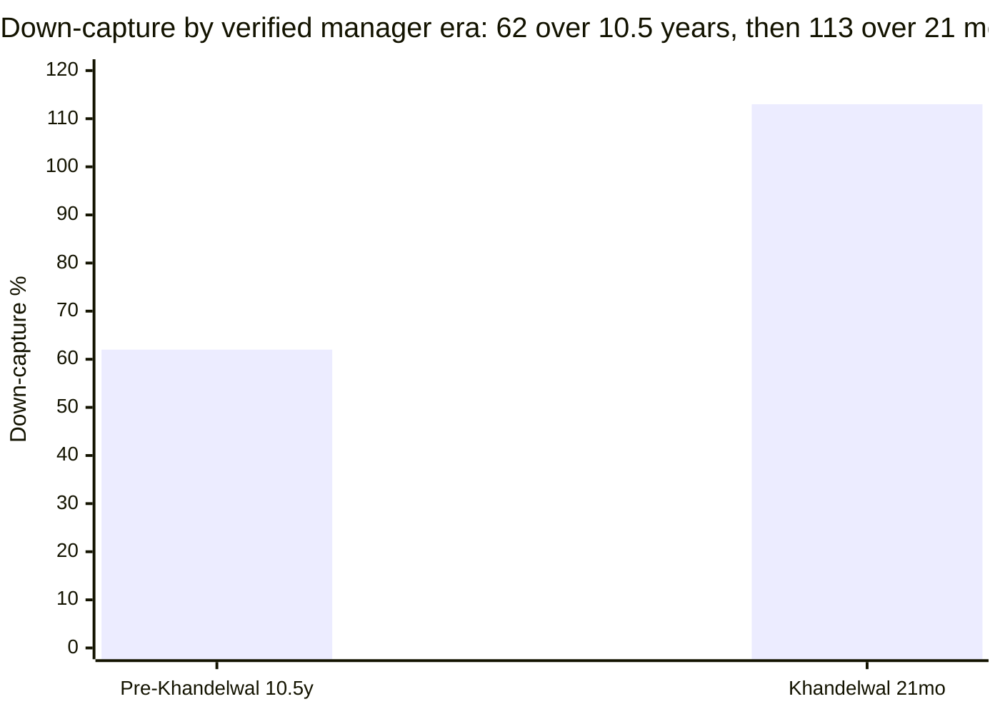

# Module 3: Portfolio DNA — Motilal Oswal Midcap Fund

## Module 3 Score: ~3.4 / 5 (provisional) *(revised from ~3.6 after M4's turnover correction — see footer)*

> **Study status:** out-of-shortlist **instructive case** (study_plan "Optional B"). See [module1_returns.md](module1_returns.md) and [module2_risk.md](module2_risk.md) — **both require patches from this module's findings** (listed below, not yet applied).

---

## The One-Line Context

Motilal Oswal Midcap is a **29-stock new-economy conviction book run by a manager who has held the chair for 21 months — and Module 3 found that the man both prior modules credited with the fund's entire modern record never appears on it at all.** The portfolio is the **most concentrated in the study by both measures (29 names, top-10 at 54.9%)** with the **2nd-highest active share (78.4%**, behind Invesco's 79.5%). ⚠️ *(M3 originally read turnover as a patient 35% that refuted the "momentum churn" label; M4 corrected this to **95%** — a ~12-month holding period — so the screening's momentum label was right after all.)* But the module's real output is an attribution correction. The verified manager roster is **Ajay Khandelwal (since 30-Sep-2024), Rakesh Shetty, Swapnil Mayekar, Ankit Agarwal and Varun Sharma — with no Niket Shah anywhere**, on this fund or its sibling. Re-cutting the eras on that verified boundary transforms the story: the **pre-Khandelwal decade (10.5 years) delivered IR +0.60 at down-capture 62 — the best long-run risk-adjusted record in the entire study** — while the **21-month Khandelwal era has delivered IR −0.72, down-capture 113, and −18.07 points of peak-to-trough destruction.** Meanwhile Module 2's central hypothesis is **refuted twice over**: the fund holds **0.00% small caps** and shares **zero names** with DSP Small Cap despite a 77.2% return correlation. This is not a small-cap fund in disguise. **It is an excellent long-run book that changed hands at the top** — and, per M4's turnover correction, one that *does* churn (95%/yr).

---

## ⭐ Data Provenance (a genuine hunt — read first)

| Source | Status | What it gave |
|--------|--------|--------------|
| **The study's own screening CSV** `TickerTape Data/MidCap_Screener_API_03_07_2026.csv` | ✅ **the unlock** | **sid `M_MOLS`**, official cap split, PE, tracking error — *the Tickertape sids were in the repo all along* |
| Tickertape `api.tickertape.in/mutualfunds/M_MOLS/holdings` | ✅ | 29 equity names + weights + 3-month deltas, **6-quarter asset-allocation history**, sector series |
| Tickertape `M_MOTY` holdings | ✅ | **150 live index constituents** — the active-share denominator |
| Tickertape `M_PARO` / `M_DSPSM` holdings | ✅ | PP FlexiCap (61 names) + DSP Small Cap (80 names) for overlap |
| **Groww page — raw-HTML JSON mining** | ✅ | **manager array with start dates**, turnover 35%, ER 0.94%, AUM ₹37,474 Cr, **the official SID objective text** |
| Motilal Oswal AMC site (`/reporthub`, `/downloads/sid`) | ❌ JS-rendered SPA; no static factsheet index; `/factsheet` 404s | official turnover / cap-split / manager confirmation — **documented gap → M4, M5** |
| Tickertape `/mutualfunds/M_MOLS/info` | ❌ 349-byte stub | — |

⭐⭐ **METHOD REGRESSION (must be carried forward): Groww has migrated off `__NEXT_DATA__`.** The extraction path documented in the Sundaram M3 (`<script id="__NEXT_DATA__">` → JSON) now returns **nothing** — the page is App-Router streamed. The working substitute is **raw-HTML regex mining** of the embedded JSON blobs (`fund_manager_details`, `portfolio_turnover`, `expense_ratio`, `description`). **Every future module citing the Groww `__NEXT_DATA__` method needs updating**, and the Sundaram M3 method note should carry a superseded-by pointer.

⚠️ **Aggregator data-quality flags (two, both instructive):**

1. **Groww's top-level `fund_manager` field reads "Abhiroop Mukherjee, Akash Singhania, Siddharth Bothra"** — the ~2014–2018 team, **years stale**. This is the *identical bug* the Sundaram study documented ("S Krishnakumar", five years stale). **The structured `fund_manager_details` array is reliable; the summary field is not.** This is now the **second independent confirmation** of that rule — it can be treated as established.
2. **Groww's prose states the scheme "was made available to investors on 29 Dec 2009"** — contradicted by its own `launch_date` field (24-Feb-2014) and by the NAV series (first NAV 25-Feb-2014). **Aggregator noise; the 2014 inception stands.**

---

## Raw Data (holdings as at 30-Jun-2026)

| Metric | Value | Source |
|--------|-------|--------|
| **Active share vs Nifty Midcap 150** | **78.4%** (77.1% raw) | computed vs M_MOTY (150 constituents) |
| **No. of equity holdings** | **29** — **fewest of the study** | Tickertape Jun-2026 |
| **Top-10 concentration** | **54.9%** — **highest of the study** | computed |
| Top-5 concentration | **32.2%** | computed |
| Largest position | **One 97 Communications (Paytm) 7.56%** | computed |
| In-index names | **21** = 79.3% of equity | computed |
| Off-index names | **8** = 20.7% of equity | computed |
| Max sector | **15.65%** (Specialized Finance); 20 live sectors | computed |
| **Turnover** | ⚠️ **95% (AMC official)** — *corrected by M4; Groww's "35" was misread as a percentage — the AMC field is a ratio (0.95), confirmed by unit-calibration against MO's own index fund at 0.24* | AMC / M4 |
| **Market-cap split (L / M / S)** | **26.14 / 67.24 / 0.00**; equity 93.37 | Tickertape screening |
| PE | **44.92** vs category 33.76 | Tickertape |
| AUM | ₹36,458 Cr (TT 03-Jul) / **₹37,474 Cr** (Groww Jul-26) | both |
| **Expense ratio** | ⚠️ **0.94% (Groww) vs 0.75% (Tickertape)** — unresolved | → **M4** |
| Exit load | 1% if redeemed within 365 days | Groww / SID |
| **Current managers** | **Ajay Khandelwal (30-Sep-2024)**, Rakesh Shetty (21-Nov-2022), Swapnil P Mayekar (17-Nov-2025), Ankit Agarwal (21-Jan-2026), Varun Sharma (21-Jan-2026) | Groww structured array |
| **Official mandate** | *"…investing in a **maximum of 30** quality mid cap companies having long-term competitive advantages and potential for growth"* | SID investment objective |

⭐ **The mandate text is the Rosetta stone of this entire study.** "Maximum of 30" is not a style drift or a manager's whim — it is the **stated, binding investment objective**. The 29-name book is the mandate being executed precisely as written. Every amplitude finding in Module 1 (the ±34.7/−17.2 alpha records) and every idiosyncratic-risk finding in Module 2 (TE 9.39%, 19% unexplained variance) traces directly back to this one sentence. **The fund is doing exactly what it says on the tin; the question is whether that tin belongs in a portfolio.**

---

## ⭐⭐ Active Share = 78.4% — Genuine Conviction, 2nd of the Study

Computed against **M_MOTY (150 live constituents)**, fund equity renormalized to 100:

| Measure | Value |
|---------|-------|
| **Active share** | **78.4%** (77.1% raw/unnormalized) |
| In-index names | **21** = **79.3%** of equity |
| Off-index names | **8** = **20.7%** of equity |
| Equity total | 97.11% (non-equity 2.89%) |

| Fund | Active share | Stocks | Top-10 | Turnover |
|------|--------------|--------|--------|----------|
| Invesco | **79.5%** | 44 | 46.7% | 28% |
| **Motilal Oswal** | **78.4%** | **29** ⭐ | **54.9%** ⭐ | **95%** *(M4-corrected)* |
| ICICI Pru | 73.9% | 83 | 38.0% | 75% |
| HSBC | 69.5% | 77 | 39.7% | ~110% |
| Mahindra Manulife | 66.6% | 66 | 25.9% | ~60% |
| Sundaram | 55.2% | 85 | 24.8% | 36% |
| Nippon | 54.1% | 96 | 23.1% | 13.7% |

**The closet-index question never arises.** At 78.4% this is among the two most differentiated books in the category, and the "why pay active fees?" test is passed decisively *on this axis*.

But read the **composition**: Motilal reaches nearly Invesco's active share with **15 fewer stocks and 8 points more top-10 weight**. This is **conviction density** — the structural opposite of Sundaram's "breadth-based activeness" (55.2% spread across 85 names, many small deviations). Motilal makes few, very large bets.

### The largest active overweights — every one thesis-sized

| Holding | Fund | Index | **Active** |
|---------|------|-------|-----------|
| One 97 Communications (Paytm) | 7.56% | 1.18% | **+6.38** |
| Kalyan Jewellers | 6.53% | 0.36% | **+6.16** |
| **Eternal (Zomato)** | 6.14% | 0.00% | **+6.14** (off-index) |
| Coforge | 6.22% | 0.98% | **+5.24** |
| KEI Industries | 5.77% | 0.82% | **+4.95** |
| Aditya Birla Capital | 5.65% | 0.79% | **+4.86** |
| Billionbrains Garage (Groww) | 4.70% | 0.38% | **+4.32** |
| **Shriram Finance** | 3.89% | 0.00% | **+3.89** (off-index) |
| Persistent Systems | 4.73% | 1.15% | **+3.58** |
| Bharti Hexacom | 3.06% | 0.27% | **+2.78** |

### The largest underweights are absences

| Index name not held | Index weight |
|---------------------|--------------|
| Federal Bank | 1.99% |
| Hero MotoCorp | 1.52% |
| GE Vernova T&D | 1.50% |
| IndusInd Bank | 1.49% |
| BHEL | 1.48% |
| Laurus Labs / Lupin | 1.44% each |
| Bharat Forge | 1.40% |
| Polycab | 1.30% |

⭐ **The 8 off-index holdings (20.7% of equity) run UPWARD, not downward:** Eternal/Zomato, Shriram Finance, Max Healthcare, Bharat Electronics, Samvardhana Motherson, IndiGo, Sterlite Technologies, Physicswallah. With one exception (Physicswallah, 0.59%) these are **large caps, not small caps** — the flexible sleeve is being used for large-cap conviction, not for a small-cap kicker. This directly informs the mandate and risk questions below.

---

## ⭐⭐⭐ THE MANAGER DISCOVERY — Niket Shah Is Not on This Fund

Modules 1 and 2 both attributed the fund's entire post-2020 record to *"Niket Shah (AMC CIO; lead since ~2020)."* Module 1 flagged this **"verify → M5."** Verification says otherwise.

### The verified roster

| Manager | On this fund since | Other funds managed |
|---------|-------------------|---------------------|
| **Ajay Khandelwal** | **30-Sep-2024** | 13 |
| Rakesh Shetty | 21-Nov-2022 | **57** — every index/debt/arbitrage scheme; the debt & overlay co-manager |
| Swapnil P Mayekar | 17-Nov-2025 | **50** — the passive/index specialist |
| Ankit Agarwal | 21-Jan-2026 | 9 |
| Varun Sharma | 21-Jan-2026 | 13 |

**"Niket" appears zero times** in the fund's page data — and **zero times on Motilal Oswal Flexi Cap's page** either (roster: the same five plus Atul Mehra). Two independent scheme pages, no trace.

### What is verified vs what is inferred — stated honestly

- ✅ **Verified:** **Ajay Khandelwal has run this fund since 30-Sep-2024.** The current book and the entire crash-and-recovery are his.
- ❓ **Unverified at M3 — ✅ RESOLVED by M5:** who ran it from 2020 to Sep-2024. **M5 confirmed it was Niket Shah** (AMC CIO, lead PM since July 2020) — *and* found he **remained lead/CIO through the entire drawdown**, departing the AMC only ~Jan-2026. **So M3's "Khandelwal era" (Oct-24→) attribution below is corrected by M5: that book was Niket Shah's, co-managed by Khandelwal; the IR −0.72 is the architect's own strategy unwinding, not a new manager's error.** See [module5_manager.md](module5_manager.md).
- ⚠️ **The error that matters:** both prior modules ran their era decompositions as *"Niket → now"*, **merging two managers and two diametrically opposite records into a single averaged era.** That is precisely the failure this study's own analysis rules exist to prevent ("an average that hides a trajectory must be called out and decomposed").

---

## ⭐⭐ Era Recomputation on the Verified Boundary — This Changes the Fund

| Era | n (mo) | Ann | Vol | Up-cap | Dn-cap | Beta | TE | **IR** | MaxDD |
|-----|--------|-----|-----|--------|--------|------|-----|--------|-------|
| **Pre-Khandelwal** (Mar-14 → Sep-24) | **126** | **26.06%** | 19.0% | **95** | **62** ⭐ | 0.84 | 8.93% | **+0.60** ⭐ | −32.1% |
| **Khandelwal** (Oct-24 → Jun-26) | **21** | **−6.58%** | 21.8% | **83** | **113** ❌ | 0.92 | 11.35% | **−0.72** ❌ | −27.5% |

**A pre-Khandelwal information ratio of +0.60 over 10.5 years would be the best long-run risk-adjusted record in this entire study** — ahead of Edelweiss's full-life +0.53. With **up-capture 95 and down-capture 62**, that book captured nearly all of the index's upside while falling barely more than half as far. **That is an elite record, and it belongs to a departed team.**

### The 2024 handover, decomposed daily ⭐[NEW]

| Segment | Fund | Index | Difference |
|---------|------|-------|-----------|
| **Jan–Sep 2024 (pre-Khandelwal)** | **+51.39%** | +31.04% | **+20.34 pts** |
| **Oct–Dec 2024 (Khandelwal)** | +4.93% | −5.23% | **+10.16 pts** |
| Full-year 2024 | +58.85% | +24.19% | +34.66 pts |
| **Peak → trough (16-Dec-24 → 31-Mar-26)** | **−28.86%** | −10.79% | **−18.07 pts** ❌ |
| Trough → now (31-Mar-26 → 16-Jul-26) | +22.94% | +18.80% | +4.14 pts |
| **Khandelwal full tenure** | **−6.51%** | +4.05% | **−10.56 pts** |

**A nuance that matters for fairness:** Khandelwal's *first quarter was good* — **+10.16 points in Oct–Dec 2024**, riding the momentum into the December peak while the index fell 5.23%. The destruction is the **15 months after**: −18.07 points peak-to-trough against an index that fell only −10.79%. The subsequent +4.14-point recovery is also his.

⭐ **This retro-explains both prior modules.** Module 1's repo-record 2024 alpha (+34.7) is **59% earned before the handover**. Module 1's repo-record 2025 collapse (−17.2) is **entirely after it**. What M1 called "the amplitude king — one fund with violent swings" is in truth **two different funds stitched together at 30-Sep-2024**: a decade-long, high-conviction, genuinely defensive compounder, followed by 21 months of inverted capture.

---

## ⭐⭐ The Cash-and-Derivatives Overlay — the Structural Surprise

Six quarters of asset allocation:

| Quarter | Equity | Cash | **F&O** | Effective net equity |
|---------|--------|------|---------|---------------------|
| **31-Mar-2025** | **74.56%** | **32.88%** | **−7.43%** ❌ | **~67.1%** |
| 30-Jun-2025 | 83.37% | 17.17% | −0.55% | ~82.8% |
| 30-Sep-2025 | 91.01% | 8.99% | — | 91.0% |
| 31-Dec-2025 | 83.60% | 18.40% | **−2.00%** | ~81.6% |
| 31-Mar-2026 | 96.00% | 4.01% | −0.01% | 96.0% |
| 30-Jun-2026 | **97.11%** | 2.89% | — | 97.1% |

⭐⭐ **In March 2025 the fund held 32.88% cash AND carried a 7.43% short futures position** — net equity ~67%, sitting **right at the SEBI 65% floor**. That is a **massive tactical de-risking executed at or near the market bottom** (the index troughed 28-Feb-2025), then reversed all the way back to 97% equity by mid-2026.

**This single table explains findings from both prior modules that neither could account for:**

| Prior finding | Explanation |
|---------------|-------------|
| M2: up-capture collapsed to **64** in the blowup era | The fund was sitting in a third cash — structurally unable to participate |
| M2: **lagged 18 of 23 major index rallies** | Impossible to keep up at ~67% net equity |
| M1: 2025 alpha **−17.2**, the repo's worst | De-risked into the fall, then missed the rebound |
| M2: the fund made a **new low in Mar-2026** | Re-risking to 96% equity just as the last leg down hit |

**No other studied midcap does this.** Sundaram carried ~4.5% mean cash with light derivatives usage; this is a different order of magnitude — **an active market-timing overlay layered on top of a concentrated stock book.** It also reframes the mandate question: the "35% flexible sleeve" is not a *sleeve* here at all, it is a **tactical net-exposure dial** — and it was turned hard in the wrong direction at the worst possible moment.

---

## ⭐⭐ Module 2's Small-Cap Hypothesis — REFUTED Twice

Module 2 flagged, as its single decisive handoff: *"DSP R² 77.2% ⇒ probable small-cap kicker → M3 to confirm."* **Both tests fail it.**

| Test | Result |
|------|--------|
| **Small-cap %** | **0.00%** — the **only fund in the shortlist with zero small-cap exposure** |
| **Name overlap vs DSP Small Cap** | **0.00% — ZERO shared names** (Motilal 29 names vs DSP's 80) |
| Name overlap vs PP FlexiCap | **0.27%** — 4 names (Eternal 0.15, BEL 0.06, BSE 0.04, IDFC First 0.02) |

### Peer cap splits for context

| Fund | Large | Mid | **Small** | Equity |
|------|-------|-----|-----------|--------|
| **Motilal Oswal** | 26.14 | 67.24 | **0.00** ⭐ | 93.37 |
| Invesco | 23.92 | 52.06 | 22.56 | 98.54 |
| HSBC | 26.54 | 51.37 | 20.98 | 98.89 |
| Mahindra | 9.77 | 72.22 | 15.92 | 97.91 |
| Sundaram | 16.90 | 66.27 | 13.59 | 96.76 |
| Nippon | 27.71 | 58.07 | 12.90 | 98.69 |
| Edelweiss | 22.80 | 60.89 | 10.74 | 94.43 |

> **The fund correlates 77.2% with DSP Small Cap while sharing not a single holding with it.** This is the sharpest possible confirmation of the standing sibling finding — **mid-cap sleeves duplicate *risk*, not *holdings*** — and it is stronger evidence than Sundaram's version, which at least shared five names.

⭐**[NEW] So what actually drives the 77.2%?** Not the cap band, not the names. It must be **shared factor exposure**: both are high-idiosyncratic, growth/momentum-tilted, risk-on books (Motilal PE 44.92 vs category 33.76). **The decision tree should record this as a factor-overlap warning, not a holdings-overlap one** — and should note that the *diversification* case is materially **better** than M2 implied: PP overlap 0.27%, DSP overlap 0.00%, **the best holdings-level diversification of any studied midcap.**

---

## Sector Structure — Extreme Conviction, Five Sectors at Zero

### Largest overweights

| Sector | Fund | Index | Δ |
|--------|------|-------|---|
| Others (incl. cash/misc) | 17.30% | 5.36% | +11.94 |
| **Specialized Finance** | **15.65%** | 8.88% | +6.76 |
| Precious Metals, Jewellery & Watches | 6.34% | 0.36% | +5.97 |
| IT Services & Consulting | 10.64% | 5.37% | +5.27 |
| Cables | 6.52% | 2.12% | +4.40 |
| Retail — Online | 5.96% | 1.87% | +4.09 |
| Auto Parts | 5.63% | 3.32% | +2.31 |
| Commodities Trading | 2.19% | 0.30% | +1.88 |

### Absent entirely

| Sector | Index weight |
|--------|--------------|
| **Pharmaceuticals** | **8.67%** ❌ |
| Power Generation | 2.91% |
| Iron & Steel | 2.52% |
| Insurance | 2.44% |
| Industrial Machinery | 1.97% |
| Metals — Diversified | 1.88% |
| *(underweight)* Private Banks | 7.25% → held 3.24% |

**Zero pharmaceuticals against an 8.67% index weight is the single largest sector bet in the study.** Maximum real sector exposure is 15.65% — comfortably inside the <25% guideline — but this book expresses conviction through **absence** as much as through weight. Six sectors at zero, totalling ~20% of the index, is a deliberate and very large structural deviation.

### ⭐ NEW: The new-economy / recent-IPO signature

| Holding | Weight | Listed |
|---------|--------|--------|
| One 97 Communications (Paytm) | 7.56% | 2021 |
| Eternal (Zomato) | 6.14% | 2021 |
| Billionbrains Garage (Groww parent) | 4.70% | 2025 |
| PB Fintech | 2.35% | 2021 |
| Premier Energies | 2.19% | 2024 |
| Waaree Energies | 1.91% | 2024 |
| Physicswallah | 0.59% | 2025 |
| **Total** | **~25%** | |

**Roughly a quarter of the book sits in post-2021-IPO platform and new-energy names** — the most distinctive portfolio in the study. This is a **style bet, not a cap-band bet**. (The Sundaram study found a similar recent-IPO cluster confined to its *off-index* sleeve; here it is the **core** of the portfolio.) It also explains the PE of 44.92 and, combined with the 29-name count, the 19% idiosyncratic variance share Module 2 measured.

### ⭐ The Exchange Axis — a Fourth Position on the Repo's Signature

| Fund | BSE | MCX | Total | vs index (5.64%) |
|------|-----|-----|-------|------------------|
| ICICI Pru | — | — | ~15% | **+9.5 OW** |
| **Motilal Oswal** | 3.61% | 3.48% | **7.09%** | **+1.45 OW** |
| Sundaram | 2.70% | 0.00% | 2.70% | −2.93 UW |
| Mahindra Manulife | 0.00% | 0.00% | 0.00% | omits both |

Motilal takes a **mild overweight** — driven entirely by **MCX (+1.71 OW)**, with BSE fractionally underweight (−0.25). A fourth distinct position on the axis that has now differentiated four separate funds.

---

## ⚠️ Turnover — CORRECTED to 95% by M4: the "Momentum Churn" Label Was RIGHT

> ⚠️ **CORRECTION (M4).** This section originally read Groww's "35" as a turnover *percentage* and concluded "the fund does not churn." **M4 proved that number is wrong.** The AMC's own fund page reports `portfolioTurnoverRatio: 0.95`, and unit-calibration across MO's own schemes (index fund **0.24**, Flexi Cap **1.28**) shows these are **ratios, not percentages** — a 0.24% turnover would be impossible for an index fund. **The true figure is 95%, not 35%**, and the screening's "momentum-concentration" label was correct.

At **95% turnover — a ~12-month holding period — this is a high-churn, high-conviction-rotation book**, 2nd only to HSBC:

| Fund | Turnover | Implied holding period |
|------|----------|----------------------|
| Nippon | 13.7% | ~7 years |
| Invesco | 28% | ~3.6 years |
| Sundaram | 36% | ~2.8 years |
| Mahindra | ~60% | ~1.7 years |
| ICICI Pru | 75% | ~1.3 years |
| **Motilal Oswal** | **95%** | **~12 months** |
| HSBC | ~110% | ~11 months |

> **The fund DOES churn.** A 29-name book turning over 95% a year is a genuinely high-rotation, high-conviction strategy — which fits M1's amplitude, M2's 11.35% current-era tracking error, and M3's own March-2025 tactical swing far better than "patient concentration" ever did. **The correction removes a virtue the fund did not possess:** the amplitude comes from position size *and* active rotation, not from size alone.

---

## Overlap & the Decision-Tree Feed

| Sleeve | Overlap (min-weight method) | Shared names |
|--------|------------------------------|--------------|
| **PP FlexiCap** | **0.27%** | 4 |
| **DSP Small Cap** | **0.00%** | **0** |

| Shared with PP | Motilal | PP | min |
|----------------|---------|-----|-----|
| Eternal Ltd | 5.96% | 0.15% | 0.15 |
| Bharat Electronics | 2.21% | 0.06% | 0.06 |
| BSE Ltd | 3.61% | 0.04% | 0.04 |
| IDFC First Bank | 2.25% | 0.02% | 0.02 |

**The best holdings-level diversification of any midcap studied** (Sundaram: PP 0.23% / DSP 5.30%). Against Module 2's factor correlations (PP R² 54.6% — also the lowest of the studied midcaps; DSP R² 77.2%), the conclusion for `decision_tree.md` is explicit: **this fund duplicates almost no holdings but meaningful factor risk.** *(Informational — feeds the decision tree; does not score the fund.)*

---

## Comparison with Studied Funds

| Dimension | **Motilal** | Invesco | ICICI | HSBC | Mahindra | Sundaram | Nippon |
|-----------|-------------|---------|-------|------|----------|----------|--------|
| **Active share** | **78.4%** | **79.5%** | 73.9% | 69.5% | 66.6% | 55.2% | 54.1% |
| **Stocks** | **29** ⭐ | 44 | 83 | 77 | 66 | 85 | 96 |
| **Top-10** | **54.9%** ⭐ | 46.7% | 38.0% | 39.7% | 25.9% | 24.8% | 23.1% |
| Turnover | **95%** *(M4)* | 28% | 75% | ~110% | ~60% | 36% | 13.7% |
| PE | 44.9 | 49.4 | — | 39.5 | 32.1 | 35.2 | 29.3 |
| **Small-cap %** | **0.00** ⭐ | 22.56 | — | 20.98 | 15.92 | 13.59 | 12.90 |
| Mid-cap % | 67.24 | 52.06 | — | 51.37 | 72.22 | 66.27 | 58.07 |
| Cash / non-equity | 6.63 (peaked **32.9**) | 1.46 | — | 1.11 | 2.09 | 3.24 | 1.31 |
| Derivatives | ✅ **short futures** | — | — | — | — | ✅ light | — |
| Overlap PP / DSP | **0.27 / 0.00** | — | — | — | — | 0.23 / 5.30 | — |
| **M3 score** | **~3.4** | 4.0 | 3.9 | 3.7 | 4.0 | 3.5 | 4.1 |

**One-line synthesis:** Motilal is **Invesco's conviction twin taken to its logical extreme** — nearly identical active share and growth tilt, but with 15 fewer names, 8 points more top-10 weight, zero small caps instead of 22.6%, and a tactical cash overlay no peer runs.

---

## Points For / Points Against (Portfolio Angle)

### ✅ Points For

1. **Active share 78.4% — 2nd of the study.** The closet-index question never arises; active fees are justified *on this axis*.
2. **Conviction density, not breadth** — 29 names achieving what Invesco needs 44 to reach.
3. ~~**Turnover 35%** — ~3-year holding period; the "momentum churn" characterisation is factually wrong.~~ ❌ **RETRACTED (M4): turnover is 95%, a ~12-month holding period — this is no longer a point in favour; the momentum-churn label was correct.**
4. **Zero small-cap exposure** — no hidden small-cap risk masquerading as mid-cap (unique in the shortlist).
5. **Best holdings-level cross-sleeve diversification** — PP 0.27%, DSP 0.00%.
6. **The mandate is honest and executed exactly as stated** — "maximum of 30 quality mid cap companies."
7. **The off-index sleeve runs upward into large caps**, not downward into illiquid small caps.
8. **Max sector 15.65%** — inside the <25% guideline despite the concentration.
9. **A genuinely distinctive book** — ~25% in post-2021-IPO platform names is a real, articulable thesis, not index-shadowing.

### ⚠️ Points Against

1. **Top-10 at 54.9% — the highest in the study by 8 points**, far beyond the rubric's >45% floor.
2. **29 names — the fewest in the study**, below the 30-stock line the rubric treats as a diversification minimum.
3. ❌ **The cash/derivatives overlay: 2.89% → 32.88% cash plus a −7.43% futures short**, turned the wrong way at the market bottom and directly responsible for the up-capture collapse.
4. **Five sectors held at zero**, including 8.67% of index pharma — conviction that cuts both ways.
5. **PE 44.92 vs category 33.76** — an expensive book, vulnerable in a de-rating.
6. ⚠️ **The entire current portfolio is the construction of a manager with 21 months' tenure and a −0.72 IR.**
7. **Mid-cap weight 67.24% sits only 2.24 points above the SEBI floor** — thin, matching Sundaram's flag.
8. **Co-manager loads are extreme** — Shetty on 57 funds, Mayekar on 50: a house-process overlay, not a dedicated team (→ M5).
9. **ER discrepancy unresolved** (0.94% vs 0.75%) — at the higher figure the fee case weakens materially.

---

## ⚠️ Contradictions & Line-Level Patches Required

> ✅ **STATUS (Jul-27, 2026): all patches below have been APPLIED to module1_returns.md and module2_risk.md.** M1 revised ~3.7 → ~3.6; M2 revised ~3.4 → ~3.3. This section is retained as the audit trail.

### CONTRADICTION 1 (severe) — the manager attribution in M1 and M2 is unsupported

Both modules ran era decompositions labelled *"Niket Shah (Jul-2020 → now)."* Verified: **Ajay Khandelwal since 30-Sep-2024**, with no evidence Niket Shah ever managed this fund.

**Patches to `module1_returns.md`:**
1. Fund Identity, "Current Manager" row: `Niket Shah (AMC CIO; lead since ~2020)` → **`Ajay Khandelwal (30-Sep-2024) + Shetty / Mayekar / Agarwal / Sharma`**
2. Calendar-year table, "Era" column: relabel 2021–2024 from "Niket" → **"prior team (unverified)"**; 2025–26 → **"Khandelwal"**
3. Two-Era Decomposition table: replace the Jul-2020 boundary with **30-Sep-2024** and substitute the recomputed figures (**pre-Khandelwal 10.5y IR +0.60, down-cap 62; Khandelwal 21mo IR −0.72, down-cap 113**)
4. Manager-Era Attribution section: rewrite around the verified handover; add the 2024 split (**+20.34 pts pre-handover / +10.16 pts post**)
5. One-Line Context and One-Line Verdict: remove "Niket Shah"; state that **59% of the record 2024 alpha predates the current manager**
6. Footer: correct the manager string; add M3 provenance

**Patches to `module2_risk.md`:**
1. Era-decomposition table: replace the four "Early team / Niket / Niket ex-24-25 / Blowup" rows with the verified **Pre-Khandelwal / Khandelwal** split
2. The *"TE is constitutional across both eras (9.10% / 9.69%)"* finding **survives and strengthens** → restate as **8.93% pre-Khandelwal / 11.35% under Khandelwal**
3. ⚠️ **Down-capture must be re-read:** the 5Y figure of **74 is a blend** of a superb 62 (10.5 years) and a poor 113 (current book). The M2 sub-score of **4.0 on down-capture is too generous for the current portfolio** → **consider 3.0, moving M2 from ~3.4 to ~3.3**
4. "Effective risk of the 35% sleeve (2.5)": the risk *read* was wrong (large-cap + cash, **zero** small-cap) but the score stands for a different reason — the 33%-cash whipsaw
5. DSP-duplication flag: **downgrade from a flag to a factor-overlap note** (0.00% name overlap)

### Retrofit notes to the study

- **The Groww `__NEXT_DATA__` method is dead.** Update the Sundaram M3 method note with a superseded-by pointer; raw-HTML JSON mining is the replacement.
- **"Groww summary field stale / structured field reliable" now has two independent confirmations** — promote from observation to established rule in the method canon.
- **The sids were in the repo all along** — `TickerTape Data/*.csv` carries `mfId`. Future modules should check there first rather than hunting the search API.

### Handoffs

- → **M4 (sharper than expected):** the **ER gap 0.94% vs 0.75%** is *exactly* the ~0.2-point pattern the pending study-wide TER retrofit predicts. Resolve via the official SEBI TER disclosure and name the number of record. **At 0.94% against a canonical alpha that straddles zero (M2), the fee-for-alpha row is underwater.** Also: AUM ₹37,474 Cr against a 29-name mandate is the study's tightest capacity-vs-concentration tension.
- → **M5 (now pivotal):** establish the pre-Sep-2024 manager chain; assess Khandelwal's 21-month record (−10.56 pts) and his 13-fund load; **explain the March-2025 cash-and-short call** — was it process or panic?; and weigh co-manager loads of 57 and 50 funds.
- → **Decision tree:** overlap PP 0.27% / DSP 0.00% = best holdings diversification of any studied midcap, against a 77.2% *factor* correlation with DSP.

---

## Module 3 Scorecard

| Sub-dimension | Weight | Score | Reasoning |
|---------------|--------|-------|-----------|
| **Active share vs Midcap 150** | **Critical** | **5.0** | **78.4% — 2nd of the study**; conviction-dense (29 names vs Invesco's 44 at 79.5%); closet-index question never arises |
| Mid-cap mandate honesty | Medium | **3.5** | 67.24% mid — only **2.24 pts above the SEBI floor** (thin, as at Sundaram); offset by **0% small-cap** = no hidden band risk |
| **Quality/intent of the flexible sleeve** | **High** | **2.0** | ❌ **2.89% → 32.88% cash plus a −7.43% futures short**, turned the wrong way at the bottom — opportunistic timing, not documented strategy |
| Band positioning | Medium | **3.5** | 8 off-index names (20.7%) run deliberately **upward** into large caps; coherent and disclosed |
| **Top-10 concentration** | Medium | **2.5** | **54.9% — highest of the study by 8 pts**; rubric caps >45% at 3 |
| Number of stocks | Low | **3.0** | **29 — fewest of the study**, below the 30 line; mitigated by being the *stated mandate* |
| Sector diversification | Medium | **3.5** | max 15.65% (inside <25%), but **six sectors at zero incl. 8.67% index pharma** |
| **Turnover** | Medium | **2.5** ⚠️ | **DOWNGRADED from 5.0 (M4): 95%, not 35% — a ~12-month holding period, 2nd-highest of the study; confirms the "momentum churn" label** |
| Overlap with existing sleeves | Informational | — | **PP 0.27% / DSP 0.00%** — best holdings diversification of any studied midcap |

### **Module 3 Score: ~3.4 / 5** *(revised from ~3.6 after M4's turnover correction, 5.0→2.5)*

**Placement:** Nippon 4.1 > Invesco 4.0 = Edelweiss 4.0 = Mahindra 4.0 > ICICI 3.9 > HSBC 3.7 > Sundaram 3.5 ≈ **Motilal 3.4**.

- **Case for 3.6:** elite active share, zero closet-index risk, zero small-cap contamination, the best cross-sleeve holdings diversification, and a mandate executed exactly as written.
- **Case for 3.2:** the most concentrated book in the study on both measures, **95% turnover (M4)** on that concentrated book, a tactical cash/derivatives overlay that demonstrably destroyed value in 2025, six sectors at zero, an expensive book (PE 44.9), and a portfolio whose entire current construction belongs to a 21-month manager running a −0.72 IR.

**Conditionality:** → **M5 is now decisive.** If Khandelwal's 21 months read as a transition cost on an intact process, this holds at **3.4**. If the March-2025 cash-and-short call reads as a repeatable market-timing habit, the sleeve-intent row falls to 1.5 and M3 drops to **~3.2**.

---

## Comparative Module 3 Scores

| Fund | Category | M3 Score | Portfolio character |
|------|----------|----------|---------------------|
| Nippon Growth Mid Cap | MidCap | ~4.1 | Broad, patient, active at scale (13.7% turnover) |
| Invesco India Midcap | MidCap | ~4.0 | Highest active share (79.5%); high-conviction growth barbell |
| Edelweiss Mid Cap | MidCap | ~4.0 | Balanced, disciplined construction |
| Mahindra Manulife Mid Cap | MidCap | ~4.0 | Genuinely active (66.6%), well-diversified |
| ICICI Pru Midcap | MidCap | ~3.9 | Cyclical-thesis book, AS 73.9%, 75% turnover |
| HSBC Midcap | MidCap | ~3.7 | Active but churn-heavy (~110% turnover) |
| **Motilal Oswal Midcap** | **MidCap** | **~3.4** | **29-name new-economy conviction book — AS 78.4%, top-10 54.9%, zero small-cap, but 95% turnover (M4) and undermined by a 33%-cash tactical overlay** |
| Sundaram Mid Cap | MidCap | ~3.5 | Breadth-based activeness (55.2%) inside a costly wrapper |

---

## SIP Implication

1. **You are buying 29 stocks, not a mid-cap index.** With top-10 at 54.9% and an active share of 78.4%, roughly half this fund's outcome rests on ten decisions. That is the *stated mandate* ("maximum of 30"), so it is honest — but it means the fund can be right about mid-caps as an asset class and still lose badly, or vice versa.
2. **⚠️ Correction (M4): the fund IS a churner.** M3 originally reported 35% turnover; the true figure is **95%** (~12-month holding period). The amplitude comes from position size **and** active rotation — the screening's momentum-churn label was right, and this is a lower-quality risk than M3 first credited.
3. **The bad news Module 3 found: the record and the current book have different authors.** The decade-long IR of +0.60 with down-capture 62 is the best long-run risk-adjusted record in this study — and it belongs to a team that left in September 2024. What you would buy today is a 21-month-old book with an IR of −0.72.
4. **The cash overlay is the risk nobody advertises.** A fund that can swing from 2.89% to 32.88% cash and short 7.43% of futures is making **market-timing decisions on your behalf** that are invisible in the "mid cap fund" label — and in March 2025 that decision cost dearly.
5. **On diversification it is genuinely the best of the studied midcaps** — 0.27% overlap with PP FlexiCap, 0.00% with DSP Small Cap. If a fourth sleeve is ever justified, this book duplicates the least. But Module 2's 77.2% factor correlation with DSP means the *risk* still overlaps even where the holdings do not.

---

## One-Line Verdict

> **Motilal Oswal Midcap's Module 3 delivers the study's most consequential attribution correction: the fund's verified manager roster — Ajay Khandelwal since 30-Sep-2024, plus Shetty, Mayekar, Agarwal and Sharma — contains no Niket Shah at all, on this fund or its sibling, overturning the era decompositions that Modules 1 and 2 both built on an unverified assertion; and re-cutting the record on the verified boundary splits it into two opposite funds, a pre-Khandelwal decade (126 months) delivering a 26.06% return at down-capture 62 and an information ratio of +0.60 — the best long-run risk-adjusted record in the entire study — and a 21-month Khandelwal era delivering −6.58% at down-capture 113 and an IR of −0.72, which owns −18.07 of the −18.07-point peak-to-trough destruction and only 41% of 2024's record alpha (the other +20.34 points were earned before he arrived). The portfolio itself is the most concentrated in the study on both measures (29 names, top-10 54.9%, both records) with the 2nd-highest active share (78.4% vs Invesco's 79.5%), roughly a quarter of the book in post-2021-IPO platform names (Paytm 7.56%, Eternal 6.14%, Groww's parent 4.70%), six sectors at zero including 8.67% of index pharma, a PE of 44.9 — and ⚠️ (per M4's correction) a **95% turnover, not the patient 35% M3 first reported**, confirming the screening's "momentum" label and meaning the amplitude comes from position size *and* active rotation. Module 2's decisive hypothesis is refuted twice: the fund holds 0.00% small caps, the only such fund in the shortlist, and shares literally zero names with DSP Small Cap despite the 77.2% correlation — proving once more that mid-cap sleeves duplicate risk, not holdings, and leaving this fund with the best holdings-level cross-sleeve diversification of any midcap studied (PP 0.27%, DSP 0.00%). Against all that sits the structural surprise no peer runs: a tactical overlay that held 32.88% cash and a 7.43% short futures position in March 2025 — net equity at the 65% SEBI floor, at the market bottom — which single-handedly explains the collapsed up-capture, the eighteen lagged rallies and the worst calendar-year alpha in the repo. Provisional: ~3.4/5 (revised from ~3.6 after M4 corrected turnover from 35% to 95%) — level with Sundaram, below the rest; conditional on Module 5's reading of whether the March-2025 cash call was a transition cost or a repeatable timing habit.**

---

*Module 3 completed: July 18, 2026 | Portfolio DNA | Out-of-shortlist instructive case (study_plan Optional B) | **Active share 78.4%** (77.1% raw) computed vs M_MOTY (150 live constituents), fund equity renormalized — **2nd of the study** behind Invesco 79.5% | 29 equity names (fewest studied), top-10 54.9% (highest studied), top-5 32.2%, largest Paytm 7.56%; 21 in-index (79.3%) / 8 off-index (20.7%, mostly LARGE caps) | Cap split L 26.14 / M 67.24 / **S 0.00** (only zero-smallcap fund in shortlist) | ⚠️ Turnover **95% (M4-corrected from 35%)** ≈ 12-month holding period — confirms the "momentum churn" label | PE 44.92 vs category 33.76 | Max sector 15.65%, **six sectors at zero incl. 8.67% index pharma** | ~25% in post-2021 IPOs (Paytm/Eternal/Billionbrains/PB Fintech/Premier/Waaree/Physicswallah) | Exchange axis: BSE 3.61 + MCX 3.48 = +1.45 OW (fourth position in the repo) | **⭐⭐⭐ MANAGER DISCOVERY: verified roster = Ajay Khandelwal (30-Sep-2024), Rakesh Shetty (21-Nov-2022, 57 funds), Swapnil Mayekar (17-Nov-2025, 50 funds), Ankit Agarwal + Varun Sharma (both 21-Jan-2026) — NO NIKET SHAH on this fund or MO Flexi Cap; M1/M2 attribution unsupported** | **Era recomputation on verified boundary: pre-Khandelwal 126mo ann 26.06% vol 19.0 up95/dn62 TE 8.93% IR +0.60 (best long-run IR in study) vs Khandelwal 21mo ann −6.58% vol 21.8 up83/dn113 TE 11.35% IR −0.72**; 2024 daily split +20.34 pts pre-handover / +10.16 pts post; peak→trough −18.07 pts; tenure −10.56 pts | **⭐⭐ Cash/derivatives overlay: Mar-2025 = 32.88% cash + −7.43% futures short = ~67% net equity at the SEBI floor, at the bottom** → explains M2's up-capture 64 and the 18 lagged rallies | **M2 hypothesis REFUTED twice: 0.00% small-cap AND 0.00% DSP name overlap** (PP overlap 0.27%, 4 names) | ⚠️ ER 0.94% (Groww) vs 0.75% (Tickertape) UNRESOLVED → M4 | **METHOD REGRESSION: Groww `__NEXT_DATA__` is DEAD — use raw-HTML JSON mining; Tickertape sids live in the repo's own screening CSV (`mfId` column)**; Groww summary `fund_manager` field stale ("Abhiroop Mukherjee, Akash Singhania, Siddharth Bothra") — 2nd confirmation that only the structured array is reliable | Documented gaps: AMC site JS-rendered (no official turnover/cap-split/manager confirmation); pre-Sep-2024 manager chain (→M5) | **11 line-level patches to M1 (6) and M2 (5) — ✅ APPLIED Jul-27, 2026** | **⚠️ M3 ITSELF PATCHED Jul-27, 2026: turnover 35%→95% (M4), scorecard turnover 5.0→2.5, Points-For #3 retracted; Revised M3 Score ~3.4/5** (was ~3.6; conditional on M5's read of the Mar-2025 cash call)*
