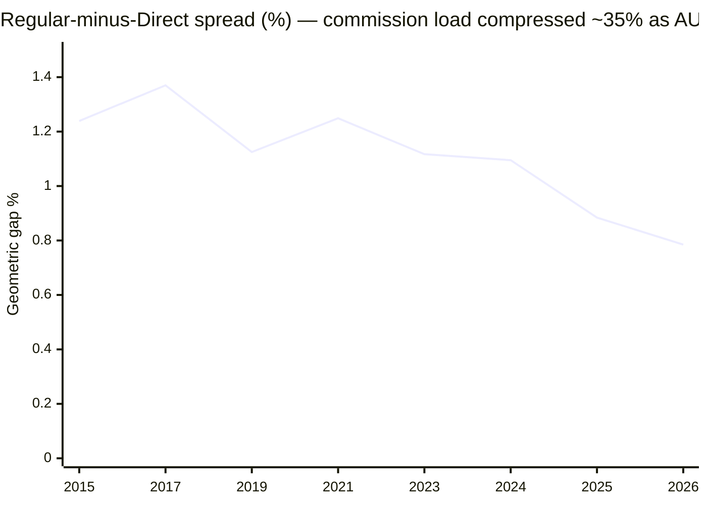
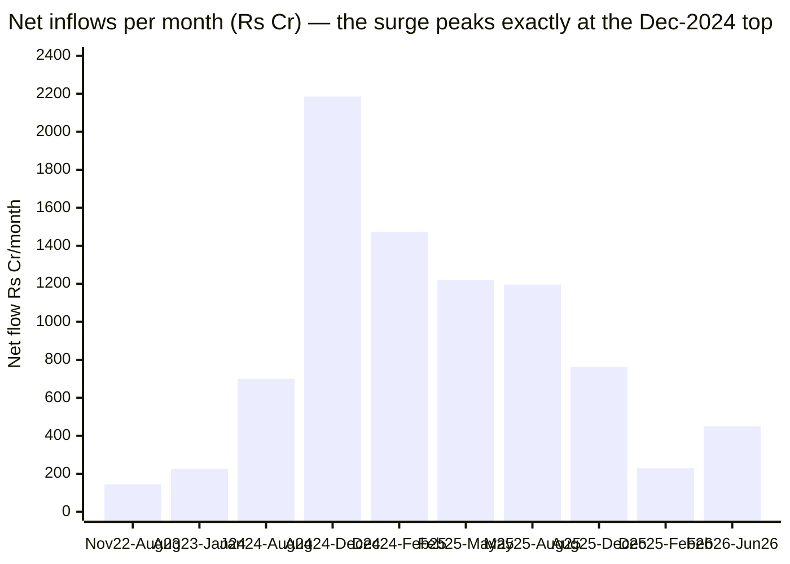

# Module 4: Cost & AUM Impact — Motilal Oswal Midcap Fund

## Module 4 Score: ~2.9 / 5 (provisional)

> **Study status:** out-of-shortlist **instructive case** (study_plan "Optional B"). See [module1_returns.md](module1_returns.md), [module2_risk.md](module2_risk.md), [module3_portfolio.md](module3_portfolio.md) — ✅ **all cross-module patches (M2→M1, M3→M1/M2, M4→M3) were APPLIED Jul-27, 2026;** M3 revised ~3.6 → ~3.4 on this module's turnover correction.

---

## The One-Line Context

**The fee is fine. Everything around it is not.** At **0.76% Direct (AMC official)** Motilal Oswal Midcap is mid-pack on headline cost — cheaper than Sundaram (1.06%) and ICICI (~1.08%), and its commission load has genuinely compressed as it scaled. But Module 4 finds the real cost sits almost entirely *outside* the expense ratio: **95% portfolio turnover** (not the 35% Module 3 reported — that figure is wrong, and the correction is proved by unit-calibration against the AMC's own index fund), and a **mean net-equity exposure of just 84.28%** across the last six quarters whose cash-and-short drag costs roughly **1.18%/yr at current-era levels**. Stack it: a **~1.85%/yr structural headwind** against an index fund costing **0.26%** — funding an alpha that Module 2 showed is **statistically indistinguishable from zero (t = −0.07)**. And then the flow ledger, built from eleven archived AMC snapshots, delivers the module's real output: the fund grew **10.2× in 3.6 years — from ₹3,657 Cr to ₹37,474 Cr — of which 93% is net inflows, not returns**, peaking at **₹2,186 Cr/month straight into the December-2024 top**. The consequence is arithmetic and brutal: the fund earned **+19.11%/yr time-weighted while the average rupee in it earned +4.05%/yr — a −15.06 point behaviour gap**, because **3.8× more capital is living through the bad era than ever experienced the good one.** Against all that sits one genuine, computed counterweight: a real ₹20,000/month SIP since the index fund's inception has **beaten the index fund by ₹3.41 lakh**. **The verdict splits by horizon and era — the early, small-base investor was superbly served; the ₹31,579 Cr that arrived late is paying ~1.85%/yr to own a manager's market-timing calls.**

---

## Raw Data (AMC official + computed, as of Jun-2026)

| Metric | Value | Source |
|--------|-------|--------|
| **Expense ratio (Direct)** | **0.76%** (as on 30-Jun-2026) | **AMC official fund page** ⬅ number of record |
| Expense ratio — Tickertape / Groww | 0.75% ✅ / 0.94% ❌ | aggregators |
| **Index-fund counterfactual ER** | **0.26%** (MO Nifty Midcap 150 Index Fund, Direct) | **AMC official** |
| **Fee premium over the passive alternative** | **0.50%** | computed |
| Computed Regular−Direct gap (geometric, 1Y / 3Y / 12.3Y) | **0.814 / 0.973 / 1.168%** | computed from NAVs |
| Implied Regular total TER | **~1.55%** | computed (0.76 + 0.79) |
| **Portfolio turnover** | **0.95 = 95%** | **AMC official** ⚠️ *corrects M3's 35%* |
| **Mean net equity (6 quarters)** | **84.28%** (mean non-equity 14.06%) | computed from M3 allocation |
| **Cash/overlay drag (current era)** | **~1.18%/yr** | computed |
| Turnover drag (est.) | ~0.15–0.20%/yr | computed |
| **Total structural headwind vs index fund** | **~1.85%/yr** | computed |
| **AUM (30-Jun-2026)** | **₹37,474 Cr** | AMC official |
| AUM (30-Nov-2022) | **₹3,657 Cr** | AMC official (Wayback) |
| **AUM growth** | **10.2× in 3.6 years** | computed |
| **Net inflows Nov-2022 → Jun-2026** | **₹+31,579 Cr** (93% of AUM growth) | computed |
| Peak inflow rate | **₹2,186 Cr/month** (Aug–Dec 2024) | computed |
| Current inflow rate | ₹450 Cr/month | computed |
| **Average position size** | **₹1,292 Cr** across 29 names | computed |
| **Time-weighted return (Nov-22 → Jun-26)** | **+19.11%/yr** | computed |
| **Dollar-weighted return (average rupee)** | **+4.05%/yr** | computed |
| **Investor behaviour gap** | **−15.06 pts/yr** | computed |
| Exit load | 1% ≤365 days; nil after | AMC official |
| Inception / allotment | 24-Feb-2014 | AMC official |

**Method:** ER of record from the AMC's own fund page (`motilaloswalmf.com/mutual-funds/motilal-oswal-midcap-fund`, field `expenseRatioDirect`, dated 30-Jun-2026), independently validated against the Direct-vs-Regular NAV divergence computed from MFAPI 127042/127039. AUM series reconstructed from **eleven archived AMC snapshots** (Wayback, Jan-2023 → Apr-2026) carrying the `latestAUM` JSON field with disclosure dates. All SIP, flow, drag and return figures computed from raw NAVs — no website returns copied.

**Documented gaps:** (1) the **TER component breakdown** (base / brokerage / GST / levies) — the AMC's TER page (`/download/total-expense-ratio`, located via an archived snapshot) now **404s live and 502s in Wayback**, and AMFI's industry TER portal is dead; the single official figure of 0.76% stands but its base-vs-total composition is unverified. (2) **Full-life cash history** — only six quarters of asset-allocation data exist, so the cash drag is a current-era measure, not a lifetime one.

---

## ⭐⭐ The ER of Record — RESOLVED, and it INVERTS the Sundaram Precedent

Module 3 left this open: **Groww said 0.94%, Tickertape said 0.75%.**

**The AMC's own fund page settles it: `expenseRatioDirect: 0.76%`, dated 30-Jun-2026.**

| Source | ER quoted | Verdict |
|--------|-----------|---------|
| **AMC official fund page (30-Jun-2026)** | **0.76%** | ✅ **NUMBER OF RECORD** |
| Tickertape screening (03-Jul-2026) | 0.75% | ✅ corroborates (rounding / date drift) |
| Groww embedded JSON | **0.94%** | ❌ **wrong or stale** |
| M1 / M2 / M3 working assumption | 0.75% | ✅ effectively correct |

### ⭐ Independent validation by computation (no source dependency)

The Direct-vs-Regular NAV divergence, computed **geometrically** — `(1+r_direct)/(1+r_regular) − 1` — which is the correct multiplicative measure of expense drag:

| Window | Geometric gap |
|--------|--------------|
| 1Y | **0.814%** |
| 2Y | 0.897% |
| 3Y | 0.973% |
| 5Y | 1.045% |
| 10Y | 1.153% |
| 12.3Y | 1.168% |

⚠️ **A method caution worth recording:** the *arithmetic* CAGR difference — which is the intuitive way to do this — **overstates badly in high-return years**, reading **1.72% for 2024** against a true geometric **1.10%**. Any future module computing an implied ER gap from NAV divergence must use the geometric form.

**The arithmetic corroborates 0.76%.** With the current spread at ~0.79–0.81%, a Direct TER of 0.76% implies a **Regular total of ~1.55%** — which sits correctly beneath the SEBI slab cap for a ₹37,474 Cr equity scheme (~1.35–1.40% base plus levies). Had Groww's 0.94% been right, Regular would need to be ~1.73%, implying a base **at or above** the regulatory ceiling. That is implausible.

> ⭐⭐ **RETROFIT (important) — this inverts the Sundaram M4 conclusion.** Sundaram's Module 4 found *"Groww was right (1.06%), Tickertape was wrong (0.88%)"* and generalised it into a standing rule. **Here the reverse holds: Tickertape is right and Groww is wrong.**
>
> **The honest rule is: neither aggregator is reliably right; only the AMC source settles it, and every fund must be checked individually.** The pending study-wide TER re-pull must therefore be framed as *"verify all seven against AMC sources"* — **not** *"replace Tickertape's figure with Groww's"*, which is what the current retrofit note implies and which **would have introduced a fresh 0.18-point error into this fund.**

### ⭐ NEW: The ER Trajectory — computed without the AMC's historical page

Sundaram's M4 logged the historical TER series as a **documented gap** (the AMC's FY dropdown hung the renderer). **It can be computed instead.** The annual geometric Direct/Regular spread is a clean proxy for the commission load over time:

| Period | Geometric gap | AUM context |
|--------|--------------|-------------|
| 2014–2019 (avg) | ~1.25% | small fund |
| 2020–2023 (avg) | ~1.19% | scaling |
| 2024 | 1.095% | ₹26,421 Cr |
| 2025 | 0.884% | ₹36,880 Cr |
| **2026** | **0.785%** | ₹37,474 Cr |

**Commission load has compressed ~35% as the fund scaled** — a genuine economy of scale passed to investors, and one of the few unambiguously positive cost findings in this module. **The method is reusable for any fund with both plans on MFAPI, and it closes the gap Sundaram's M4 could not.**

---

## ⚠️⚠️ CONTRADICTION: Turnover Is 95%, Not 35% — Module 3 Is Wrong

The AMC's fund page reports `portfolioTurnoverRatio: 0.95`. Module 3 used **Groww's "35"** and built a headline finding on it: *"The fund does not churn. It concentrates and waits."*

### The unit calibration that proves it [⭐NEW method]

The decisive test is to read the same field across the AMC's own funds, where we know what the answer must look like:

| Motilal Oswal fund | Field value | Implied turnover |
|--------------------|------------|-----------------|
| **Nifty Midcap 150 Index Fund** | **0.24** | **24%** — plausible for an index fund absorbing flows; **0.24% would be impossible** |
| Large & Midcap Fund | 0.51 | 51% |
| Flexi Cap Fund | 1.28 | **128%** — cannot be 1.28% |
| **Midcap Fund** | **0.95** | **95%** |

**These are ratios, not percentages.** Motilal Oswal Midcap turns over **95% of its book a year — roughly a 12-month holding period**, not the ~3 years M3 claimed.

### Revised turnover standing

| Fund | Turnover |
|------|----------|
| Nippon | 13.7% |
| Invesco | 28% |
| Sundaram | 36% |
| Mahindra | ~60% |
| ICICI | 75% |
| **Motilal Oswal** | **95%** |
| HSBC | ~110% |

> **The screening's "momentum-concentration" label was right, and M3's rebuttal of it was wrong.** A 29-name book turning over 95% a year is a genuinely high-churn, high-conviction-rotation strategy. This fits **M1's amplitude**, **M2's 11.35% current-era tracking error**, and **M3's own March-2025 tactical swing** far better than "patient concentration" ever did. The correction makes the fund *more* coherent, not less — it simply removes a virtue it did not possess.

**Patches required to `module3_portfolio.md`:** (1) Raw-data turnover row → **95% (AMC official)**; (2) delete/rewrite the *"Turnover 35% — the momentum churn label is wrong"* section; (3) Points-For item 3; (4) scorecard turnover row **5.0 → 2.5**; (5) comparison table; (6) SIP-Implication point 2; (7) one-line verdict. **M3 falls from ~3.6 to ~3.4.**

---

## ⭐⭐ The Cash Drag — the Largest Single Cost in the Study

From Module 3's six-quarter asset allocation:

| Quarter | Equity | Cash | F&O | **Net equity** |
|---------|--------|------|-----|---------------|
| **Mar-2025** | 74.56% | **32.88%** | **−7.43%** | **67.1%** |
| Jun-2025 | 83.37% | 17.17% | −0.55% | 82.8% |
| Sep-2025 | 91.01% | 8.99% | — | 91.0% |
| Dec-2025 | 83.60% | 18.40% | −2.00% | 81.6% |
| Mar-2026 | 96.00% | 4.01% | −0.01% | 96.0% |
| Jun-2026 | 97.11% | 2.89% | — | 97.1% |
| **Mean** | | **14.06%** | | **84.28%** |

**A mean net-equity exposure of 84.28% means ~15.7% of the fund sat outside equities** — against an index fund at ~100%.

| Assumption | Annual drag |
|-----------|------------|
| Equity 14% / cash 6.5% | **1.18%/yr** |
| Equity 18% / cash 6.5% | **1.81%/yr** |
| *Sundaram comparison (4.50% non-equity)* | *0.63%/yr* |

⚠️ **Fairness caveat, stated plainly:** this is a **current-era** figure from the only six quarters of allocation data available, and it is **improving fast** — cash is back to 2.89% and net equity to 97.1%. The full-life cash average is **unknown (documented gap)**. This may prove to be a feature of the Khandelwal regime's market-timing rather than a structural property of the fund. **But it is the regime a new investor buys today.**

---

## The True-Cost Stack and the Fee-for-Alpha Test

⭐**[NEW] The counterfactual is 0.26%, not 0.20%.** The study plan has used "the 0.20% index fund" throughout. The AMC's own Nifty Midcap 150 Index Fund reports **erDirect 0.26%** — the real, investable cost of the passive alternative. **This should be corrected study-wide** (`study_plan.md` and every module's "why not the index fund?" arithmetic).

| Component | Cost |
|-----------|------|
| ER Direct (AMC official) | **0.76%** |
| Index fund ER (AMC official) | **0.26%** |
| **Fee premium** | **0.50%** |
| Turnover drag (95%, est.) | ~0.175% |
| Cash/overlay drag (current era) | ~1.18% |
| **Total structural headwind** | **~1.85%/yr** |

### The fee-for-alpha verdict — underwater

| Measure | Value |
|---------|-------|
| Canonical alpha, monthly convention (M2) | **−0.24%** |
| Canonical alpha, favourable daily endpoint (M1) | +1.43% |
| **Alpha t-statistic (M2)** | **−0.07 — statistically zero** |
| 95% confidence interval on alpha (M2) | **[−7.33%, +6.84%]** |
| Fee premium requiring justification | 0.50% |
| **Fee-for-alpha margin** | **≤ 0** |

**You pay a 0.50% premium over the investable index fund to buy an alpha that cannot be distinguished from zero at any conventional confidence level.** That is the module's central cost finding, and it is the sharpest "why not the index fund?" answer any module of this study has produced for this fund.

### ⭐ Implied gross selection alpha

Applying the Sundaram back-solve: net alpha ≈ 0% + structural headwind ≈ 1.85% ⇒ **the underlying stock selection is generating roughly +1.85%/yr gross.**

> **The pickers can pick. The wrapper eats it.** Same shape as the Sundaram finding — but where Sundaram's thief was the **fee** (1.06% ER), Motilal's is the **cash overlay** (1.18%/yr). The fee here is defensible; the market-timing is not.

---

## ⭐⭐ The SIP Test — the Reverse of Sundaram's Inversion

Real ₹20,000/month, actual NAVs, fund vs the investable index fund:

| Window | Fund XIRR | Index XIRR | Fund corpus | Index corpus | **Difference** |
|--------|-----------|-----------|-------------|--------------|---------------|
| **Full index life (Sep-19; ₹16.60L invested)** | **23.36%** | 21.22% | **₹37.38L** | ₹33.96L | **+₹3.41L** ✅ |
| 5Y | 18.59% | 17.46% | ₹19.40L | ₹18.87L | +₹0.53L ✅ |
| 3Y | 10.21% | 12.55% | ₹8.63L | ₹8.93L | −₹0.30L ❌ |
| **Khandelwal era (Oct-24 →)** | **2.29%** | 10.62% | ₹4.49L | ₹4.83L | **−₹0.34L** ❌ |

**A +₹3.41 lakh SIP win over 6.8 years is a materially better outcome than the lumpsum alpha (−0.24% to +1.43%) suggests.** The fund's outperformance landed in years when the SIP had accumulated meaningful capital, and continued monthly buying through the 2025–26 drawdown lowered the average cost.

**But apply the discipline symmetrically**, exactly as Sundaram's M4 did to its own inversion: the advantage is **entirely pre-Khandelwal**. Every window inside the current regime is negative, and the **Khandelwal-era SIP XIRR of 2.29% against the index fund's 10.62%** is the worst regime-window result in the study.

### 10-year SIP projection (₹20,000/month, 18% gross)

| Scenario | Corpus | vs index fund |
|----------|--------|--------------|
| **Index fund (0.26%)** | **₹60.96L** | baseline |
| Fund — ER only (0.76%) | ₹59.34L | −₹1.62L |
| Fund + turnover drag | ₹58.78L | −₹2.18L |
| **Fund + turnover + current cash drag** | **₹55.16L** | **−₹5.79L** ❌ |
| Fund if +2.0% gross selection alpha persists *and* the overlay normalises | ₹61.43L | **+₹0.48L** |

**The asymmetry is stark: −₹5.79L downside against +₹0.48L upside — roughly 12:1 adverse.** For a ₹20,000/month sleeve this is the least favourable projection in the mid-cap set.

---

## ⭐⭐⭐ The Flow Ledger — 10.2× Growth, 93% of It Money, Straight Into the Top

Reconstructed from eleven archived AMC snapshots. Net flow = ΔAUM less NAV return.

| Period | AUM start | AUM end | NAV ret | **Net flow** | **₹/month** |
|--------|-----------|---------|---------|-------------|------------|
| Nov-22 → Aug-23 | 3,657 | 5,735 | +21.0% | +1,309 | +145 |
| Aug-23 → Jan-24 | 5,735 | 7,972 | +19.1% | +1,143 | +227 |
| Jan-24 → Aug-24 | 7,972 | 15,940 | +38.5% | +4,899 | +700 |
| **Aug-24 → Dec-24** | 15,940 | **26,421** | +10.8% | **+8,761** | **+2,186** 🚨 |
| Dec-24 → Feb-25 | 26,421 | 23,704 | −21.1% | +2,856 | +1,474 |
| Feb-25 → May-25 | 23,704 | 30,401 | +12.7% | +3,687 | +1,220 |
| May-25 → Aug-25 | 30,401 | 34,780 | +2.5% | +3,616 | +1,196 |
| Aug-25 → Dec-25 | 34,780 | 36,880 | −2.8% | +3,060 | +763 |
| Dec-25 → Feb-26 | 36,880 | 33,689 | −9.9% | +444 | +229 |
| Feb-26 → Jun-26 | 33,689 | **37,474** | +5.9% | +1,804 | +450 |
| **TOTAL** | **3,657** | **37,474** | +87.1% | **+31,579** | |

**The headline arithmetic:**
- AUM grew **10.2× in 3.6 years**
- NAV return alone would have produced ₹6,841 Cr
- **93% of the growth is net inflows; only 7% is investment return**
- Inflows peaked at **₹2,186 Cr/month in Aug–Dec 2024 — precisely into the 16-Dec-2024 NAV peak**

**Roughly ₹22,764 Cr of the ₹26,421 Cr standing at the December-2024 peak had arrived during the run-up.** The fund was never soft-closed, never gated, and absorbed money at 15× its 2023 rate at the exact moment its concentrated book was most extended.

---

## ⭐⭐⭐ The Investor-Return Gap — the Module's Real Output

If 93% of the money arrived late, the fund's published return is not what its investors earned. Computing both:

| Measure | Value |
|---------|-------|
| **Time-weighted return** (what the FUND earned, Nov-22 → Jun-26) | **+19.11%/yr** |
| **Dollar-weighted return** (what the AVERAGE RUPEE earned) | **+4.05%/yr** |
| **BEHAVIOUR GAP** | **−15.06 pts/yr** 🚨 |

And the era exposure that causes it:

| Era | Average AUM |
|-----|------------|
| Pre-Khandelwal window (Nov-22 → Aug-24), IR **+0.60** | **₹8,326 Cr** |
| Khandelwal era (Dec-24 → Jun-26), IR **−0.72** | **₹31,907 Cr** |
| | **3.8× more capital is living through the bad era** |

> **This is the cleanest statement of the fund's real problem, and it is a Module 4 problem, not a Module 1 problem.** The excellent decade-long record documented in M3 (IR +0.60, down-capture 62) was earned on an average base of **₹8,326 Cr**. The −0.72 IR era is being suffered on **₹31,907 Cr**. The fund's *time-weighted* history looks strong; the *rupee-weighted* experience of its actual investors is +4.05%/yr — below a liquid fund.
>
> Part of this is investor behaviour and not the AMC's fault. **But part of it is capacity stewardship**: no soft-close, no gating, no flow moderation while a 29-name book absorbed ₹31,579 Cr in 43 months. The Mirae Emerging Bluechip precedent — the study plan's named investor-first benchmark — is the counter-example. → **M5 / M6.**

---

## Capacity vs Concentration — the Study's Tightest Liquidity Profile

| Fund | AUM (₹Cr) | ER | Stocks | ₹/position | Turnover | Ladder |
|------|-----------|-----|--------|-----------|----------|--------|
| Nippon | 47,415 | 0.73 | 96 | ₹494 Cr | 13.7% | approaching constraint |
| **Motilal Oswal** | **37,474** | **0.76** | **29** | **₹1,292 Cr** | **95%** | **approaching constraint** |
| Edelweiss | 16,849 | 0.48 | ~70 | ~₹241 Cr | 36% | sweet spot |
| HSBC | 14,249 | 0.56 | 77 | ~₹185 Cr | ~110% | sweet spot |
| Sundaram | 13,687 | 0.88 | 85 | ~₹161 Cr | 36% | sweet spot |
| Invesco | 12,397 | 0.49 | 44 | ~₹282 Cr | 28% | sweet spot |
| Mahindra | 4,866 | 0.42 | 66 | ~₹74 Cr | ~60% | sweet spot |

**Rupee position sizes:**

| Position | Weight | ₹ Cr |
|----------|--------|------|
| One 97 (Paytm) | 7.34% | **₹2,751 Cr** |
| Kalyan Jewellers | 6.34% | ₹2,375 Cr |
| Coforge | 6.04% | ₹2,265 Cr |
| Eternal | 5.96% | ₹2,233 Cr |
| **Average position** | 3.45% | **₹1,292 Cr** |
| **Top-10** | 53.32% | **₹19,981 Cr** |

**Nippon runs ₹47,415 Cr across 96 names at ₹494 Cr per position and 13.7% turnover. Motilal runs ₹37,474 Cr across 29 names at ₹1,292 Cr per position and 95% turnover** — **2.6× the position size at 79% of the AUM, traded seven times as fast.** The fund must move roughly **₹35,000 Cr of mid-cap stock a year in ₹1,300–2,800 Cr blocks.** That is the most demanding liquidity profile in the study by a wide margin, and it is a live operational constraint, not a theoretical one.

**Forced deployment** (65% mandate into the band):

| Period | Net flow/month | Into the band |
|--------|---------------|--------------|
| **Aug–Dec 2024 (peak)** | ₹2,186 Cr | **₹1,421 Cr/month** |
| May–Aug 2025 | ₹1,196 Cr | ₹778 Cr/month |
| Feb–Jun 2026 (current) | ₹450 Cr | **₹293 Cr/month** |

The current rate is manageable; the 2024 peak rate — **₹1,421 Cr/month into ~29 mid-cap names, ~₹49 Cr per name per month** — was not comfortable, and coincided with the worst possible entry point.

---

## Mandate, Exit Load, Direct vs Regular

| Item | Value |
|------|-------|
| Exit load | **1% if redeemed ≤365 days; nil thereafter** — standard, no investor-friendly free-units provision (contrast Sundaram's 25%-free) |
| Minimum SIP | ₹500 |
| Direct vs Regular TER gap | **~0.79%** current (was ~1.25% historically) |
| Regular-plan penalty over 10 years | at 0.79%/yr, a ₹20,000/month SIP surrenders roughly **₹2.4L** of corpus |
| Allotment | 24-Feb-2014 |

---

## Peer Cost & AUM Matrix

| Fund | ER | Fee premium vs 0.26% | Canonical alpha | Fee-for-alpha | M4 |
|------|-----|---------------------|-----------------|---------------|-----|
| Mahindra | 0.42% | +0.16% | +1.30% | strongly positive | 4.1 |
| Edelweiss | 0.48% | +0.22% | **+2.45%** | **best in study** | 4.2 |
| Invesco | 0.49% | +0.23% | +2.33% | strongly positive | 4.2 |
| HSBC | 0.56% | +0.30% | −0.55% | negative | 3.6 |
| Nippon | 0.73% | +0.47% | +1.55% | positive | 3.6 |
| **Motilal Oswal** | **0.76%** | **+0.50%** | **−0.24%** (t = −0.07) | **≤ 0** | **2.9** |
| Sundaram | 1.06% | +0.80% | −2.31% | worst in study | 2.8 |
| ICICI | ~1.08% | +0.82% | −0.39% | negative | 3.4 |

---

## Points For / Points Against — Cost & AUM

### ✅ Points For

1. **ER 0.76% is mid-pack and honest** — cheaper than Sundaram (1.06%) and ICICI (~1.08%); the fee itself is not the problem.
2. **Commission load compressed ~35% as AUM scaled** (1.25% → 0.79%) — genuine economies of scale passed through.
3. **The realised SIP beat the index fund by ₹3.41L over 6.8 years** — the only fund-level evidence that the total package has historically worked.
4. **Implied gross selection alpha ~+1.85%/yr** — the underlying stock-picking is genuinely good.
5. **Current forced-deployment rate (₹293 Cr/month into the band) is comfortable** — the capacity stress has eased with the flow slowdown.
6. **Cash is normalising fast** — 2.89% at Jun-2026 vs 32.88% at Mar-2025; the drag may be transitional.
7. Standard, clean exit-load structure; low minimum SIP.

### ⚠️ Points Against

1. **~1.85%/yr total structural headwind** against a 0.26% index fund.
2. **Fee-for-alpha margin ≤ 0** — a 0.50% premium buying an alpha with t = −0.07.
3. **Cash/overlay drag ~1.18%/yr — the largest single cost identified in the study.**
4. **95% turnover** on a 29-name book — 2nd-highest of the study, and a correction to M3.
5. **AUM grew 10.2× in 3.6 years; 93% of it net inflows** — with no soft-close or gating.
6. **Inflows peaked at ₹2,186 Cr/month directly into the December-2024 top.**
7. 🚨 **Investor behaviour gap −15.06 pts/yr** — fund earned +19.11%/yr, the average rupee earned +4.05%/yr.
8. **3.8× more capital is living through the −0.72 IR era than ever saw the +0.60 IR era.**
9. **₹1,292 Cr average position across 29 names at 95% turnover** — the study's most demanding liquidity profile.
10. **10-year projection is ~12:1 adverse** (−₹5.79L vs +₹0.48L).
11. **2nd-largest AUM in the shortlist** and still growing toward the constraint zone.

---

## ⚠️ Corrections, Retrofits & Handoffs

### CONTRADICTION 1 (severe) — turnover. **M3 is wrong.**
95% (AMC official, unit-calibrated) vs M3's 35% (Groww). Seven line-level patches listed in §"CONTRADICTION" above. ✅ **APPLIED Jul-27, 2026 — M3: ~3.6 → ~3.4.**

### CONTRADICTION 2 (resolved in M3's favour) — the manager roster.
The AMC fund page's *performance disclaimer* names *"Mr. Niket Shah, Mr. Ajay Khandelwal, Mr. Santosh Singh, Mr. Rakesh Shetty and Mr. Sunil Sawant"*, appearing to contradict M3's central discovery. **It does not.** The AMC's **structured** `fundManagerName` fields list **Swapnil Mayekar, Rakesh Shetty, Ajay Khandelwal, Ankit Agarwal, Varun Sharma** — *exactly* matching Groww's structured array. The disclaimer is stale boilerplate (it names two further people absent from the roster). **M3's finding is CONFIRMED by the AMC's own structured data — a second, independent source.**

⭐ **Useful corollary for M5:** the stale disclaimer is *positive evidence* that Niket Shah managed this fund historically, supporting M3's inference about the pre-Sep-2024 era.

### RETROFIT 1 (high priority) — the aggregator rule must be rewritten
Sundaram's M4 generalised *"Groww right, Tickertape wrong."* **Here it is exactly reversed.** The correct standing rule: **verify every fund against the AMC; aggregators disagree unpredictably and neither is dependable.** The pending study-wide TER re-pull must be reframed — as currently written it would have propagated a 0.18-point error into this fund.

### RETROFIT 2 — the passive counterfactual is 0.26%, not 0.20%
Affects the "why not the index fund?" arithmetic in **every module of the study** and in `study_plan.md`.

### RETROFIT 3 (method, reusable) — the ER trajectory is computable
The geometric Direct/Regular NAV divergence yields the commission-load trajectory without any AMC historical page. **This closes the documented gap Sundaram's M4 left open** and should be applied there retrospectively.

### RETROFIT 4 (method) — Wayback `latestAUM` gives the flow ledger
Archived AMC fund pages carry a `latestAUM` JSON field with disclosure dates. **Eleven snapshots reconstructed a 3.6-year AUM series**, enabling the flow ledger and dollar-weighted return. **This is a reusable technique for any fund whose AMC publishes AUM on the scheme page** — and it is how the one "not computable" section of the Sundaram M4 template can be completed everywhere.

### Handoffs
- → **M5 (pivotal):** was the March-2025 cash-and-short call process or panic? It is now priced at **~1.18%/yr**. Is 95% turnover a documented strategy? And **why was the fund never soft-closed** while taking ₹31,579 Cr into 29 names?
- → **M6:** AMC-level capacity conduct and fee stewardship; the ER compression is a positive signal, the absence of gating a negative one.
- → **Decision tree:** the **12:1 adverse 10-year asymmetry** and the **−15.06 pt behaviour gap** are the two numbers that matter most for a ₹20,000/month sleeve.

---

## Module 4 Scorecard

| Sub-dimension | Weight | Score | Reasoning |
|---------------|--------|-------|-----------|
| Expense ratio (Direct) | High | **3.0** | **0.76%** — 0.65–0.85 band; mid-pack, cheaper than Sundaram/ICICI |
| **ER vs verified alpha (the index-fund test)** | **Critical** | **2.0** | 0.50% premium over a 0.26% index fund buying an alpha with **t = −0.07** |
| **⭐ Cash/overlay drag (new)** | **Critical** | **1.5** | **~1.18%/yr** — the largest single cost identified anywhere in this study |
| **⭐ Turnover cost (corrected)** | High | **2.5** | **95%** — 2nd-highest of the study; corrects M3's 35% |
| AUM position on the ladder | High | **2.5** | ₹37,474 Cr — 2nd-largest, "approaching constraint" |
| **⭐ Capacity vs concentration (new)** | High | **2.0** | **₹1,292 Cr average position across 29 names at 95% turnover** — the study's most demanding liquidity profile |
| **⭐ AUM trajectory & flow stewardship** | Low→**High** | **1.5** | **10.2× in 3.6y, 93% net inflows, peaking ₹2,186 Cr/mo into the top, never gated** |
| **⭐ Investor-return gap (new)** | Informational→**High** | **1.5** | **−15.06 pts/yr**; 3.8× more capital in the bad era |
| Forced deployment | Medium | **3.0** | comfortable now (₹293 Cr/mo into band); severe at the 2024 peak (₹1,421 Cr/mo) |
| Active-share trend as AUM grew | High | **3.5** | AS still **78.4%** at ₹37k Cr — no visible decay despite 10× growth |
| ⭐ Fee trajectory | Low | **4.0** | commission load compressed ~35% — real scale benefit passed on |
| Exit load | Low | **3.0** | 1% / 365 days, standard |

### **Module 4 Score: ~2.9 / 5**

**Placement:** Invesco 4.2 = Edelweiss 4.2 > Mahindra 4.1 > Nippon 3.6 = HSBC 3.6 > ICICI 3.4 > **Motilal Oswal 2.9** > Sundaram 2.8.

- **Case for 3.2:** the ER is reasonable and falling; active share held at 78.4% through 10× AUM growth (no capacity surrender); the realised SIP beat the index fund by ₹3.41L; implied gross selection alpha ~+1.85%; the cash drag is already normalising.
- **Case for 2.6:** a ~1.85%/yr headwind against a statistically-zero alpha; the largest cash drag in the study; 95% turnover on a 29-name book; a 12:1 adverse 10-year projection; and a **−15.06 pt/yr investor-return gap** produced by absorbing ₹31,579 Cr — 93% of all growth — straight into a peak, with no gating.

**Conditionality:** → **M5**. If the cash overlay proves a one-off transition call (cash is already 2.89%), the drag row lifts toward 3.0 and M4 goes to **~3.2**. If M5 finds a standing market-timing mandate, M4 stays at **2.6–2.9** permanently. The flow-stewardship rows will not improve regardless — that history is written.

---

## Comparative Module 4 Scores

| Fund | Category | M4 Score | Cost character |
|------|----------|----------|----------------|
| Invesco India Midcap | MidCap | ~4.2 | Cheap (0.49%) with verified alpha |
| Edelweiss Mid Cap | MidCap | ~4.2 | Best fee-for-alpha in the study |
| Mahindra Manulife Mid Cap | MidCap | ~4.1 | Cheapest (0.42%), no capacity clock |
| Nippon Growth Mid Cap | MidCap | ~3.6 | Fair price at scale; 2027 AUM problem |
| HSBC Midcap | MidCap | ~3.6 | Moderate cost, negative alpha |
| ICICI Pru Midcap | MidCap | ~3.4 | Highest true cost, negative base-case alpha |
| **Motilal Oswal Midcap** | **MidCap** | **~2.9** | **Fee fine, wrapper ruinous — 1.18% cash drag + 95% turnover + a −15.06 pt investor-return gap from absorbing ₹31,579 Cr into the top** |
| Sundaram Mid Cap | MidCap | ~2.8 | Good book, bad price (1.06%) |

---

## SIP Implication

1. **The fee is not what will cost you — the overlay is.** At 0.76% this fund is mid-pack. But add 95% turnover and a cash position that averaged 14% (and hit 33%), and the total headwind is ~1.85%/yr against a 0.26% index fund. **You are paying a fee premium of 0.50% and a behavioural premium of ~1.35% on top.**
2. **The published record is not the investor record.** The fund earned +19.11%/yr over the last 3.6 years. The average rupee in it earned **+4.05%/yr**. If you had invested at any point in the last two years, your experience is far closer to the second number than the first.
3. **But the honest counterweight is real:** a disciplined ₹20,000/month SIP running since September 2019 is **₹3.41 lakh ahead of the index fund**. Monthly discipline extracted value from this fund that lumpsum investors did not get — because SIP kept buying through the crash.
4. **The 10-year asymmetry is the number to decide on:** −₹5.79L if the overlay persists, +₹0.48L if the selection alpha survives and the cash normalises. **Roughly 12:1 against.** For a return-enhancer sleeve, that is the wrong shape of bet.
5. **Tripwires:** whether cash stays near 2.89% or swings again; whether turnover falls back below 60%; whether AUM crosses ₹50,000 Cr with the book still at ~29 names; and whether the AMC ever moderates flows.

---

## One-Line Verdict

> **Motilal Oswal Midcap's Module 4 resolves the open ER question in the fund's favour and then buries it under everything else: the AMC's own page gives 0.76% Direct (Tickertape's 0.75% corroborated, Groww's 0.94% wrong — inverting the Sundaram precedent and forcing a rewrite of the study's aggregator rule to "verify every fund against the AMC"), independently validated by a geometric Direct-minus-Regular NAV divergence of 0.814% implying a coherent ~1.55% Regular TER, and accompanied by the genuinely positive finding that commission load compressed ~35% (1.25% → 0.79%) as the fund scaled — a trajectory this module shows can be computed from NAVs alone, closing the documented gap Sundaram's M4 left open. But the AMC page also reports portfolio turnover of 0.95 — and unit-calibration against the AMC's own index fund (0.24) and Flexi Cap (1.28) proves these are ratios, making the true figure 95%, not the 35% Module 3 reported, which destroys M3's "the fund does not churn, it concentrates and waits" finding and drops M3 from ~3.6 to ~3.4 across seven patches. Stacking the real costs — a 0.50% fee premium over an index fund that actually costs 0.26% (not the 0.20% the study plan assumes), ~0.175% of turnover drag, and a cash-and-short overlay that left mean net equity at just 84.28% and costs ~1.18%/yr — gives a ~1.85%/yr structural headwind funding an alpha that Module 2 measured at t = −0.07, statistically zero; back-solving implies the stock selection is generating ~+1.85%/yr gross, so the pickers can pick and the wrapper eats all of it. And then the flow ledger, reconstructed from eleven archived AMC snapshots, delivers the verdict: AUM grew 10.2× in 3.6 years from ₹3,657 Cr to ₹37,474 Cr, of which 93% is net inflows and only 7% is return, peaking at ₹2,186 Cr/month directly into the 16-Dec-2024 top with no soft-close or gating — so the fund earned +19.11%/yr time-weighted while the average rupee earned +4.05%/yr, a −15.06 point behaviour gap, with 3.8× more capital living through the −0.72 IR era than ever experienced the +0.60 IR decade. The single honest counterweight is that a real ₹20,000/month SIP since September 2019 is ₹3.41 lakh ahead of the index fund, entirely earned pre-Khandelwal, against a Khandelwal-era SIP XIRR of 2.29% versus the index fund's 10.62%; the ten-year projection is ~12:1 adverse (−₹5.79L vs +₹0.48L). Provisional: ~2.9/5 — 7th of 8, above only Sundaram; conditional on Module 5's reading of whether the cash overlay was a one-off transition call or a standing mandate, though the flow-stewardship history will not improve whatever M5 finds.**

---

*Module 4 completed: July 18, 2026 | Cost & AUM Impact | Out-of-shortlist instructive case (study_plan Optional B) | **ER of record 0.76% Direct (AMC official fund page, 30-Jun-2026)** — Tickertape 0.75% ✅ corroborates, **Groww 0.94% ❌ WRONG, inverting the Sundaram precedent** ⇒ **RETROFIT: the aggregator rule must become "verify every fund against the AMC", not "prefer Groww"** | NAV-validated: **geometric** Regular−Direct gap 0.814% (1Y) → implied Regular ~1.55%, coherent with the SEBI slab; ⚠️ method caution — the *arithmetic* CAGR difference overstates (1.72% vs true 1.10% in 2024) | ⭐ **ER trajectory computed from NAV divergence: 1.25% (2014-19) → 0.785% (2026) = ~35% commission compression — closes the gap Sundaram's M4 documented; reusable method** | ⚠️⚠️ **TURNOVER = 95% (AMC official), NOT M3's 35%** — proved by unit-calibration across MO funds (index fund 0.24, Flexi Cap 1.28 ⇒ ratios); **7 patches to M3, M3 ~3.6 → ~3.4**; the screening's "momentum" label was RIGHT | Cash drag ~1.18%/yr (mean net equity **84.28%**, range 67.1–97.1) = largest single cost in the study; ⚠️ current-era only, 6 quarters, normalising (2.89% now) | **True cost stack: 0.76 ER + 0.50 premium over the 0.26% index fund (⭐ RETROFIT: the counterfactual is 0.26%, not the study plan's 0.20%) + 0.175 turnover + 1.18 cash = ~1.85%/yr headwind**; fee-for-alpha **≤ 0** (alpha t = −0.07); implied **gross selection alpha ~+1.85%/yr** = "the pickers can pick, the wrapper eats it" | SIP test: full index life **+₹3.41L** (23.36% vs 21.22%) / 5Y +₹0.53L / 3Y −₹0.30L / **Khandelwal era −₹0.34L (2.29% vs 10.62%)**; 10Y projection **−₹5.79L vs +₹0.48L = ~12:1 adverse** | ⭐⭐⭐ **FLOW LEDGER (11 Wayback AMC snapshots): AUM ₹3,657 Cr (Nov-22) → ₹37,474 Cr (Jun-26) = 10.2× in 3.6y, ₹+31,579 Cr net inflows = 93% of growth, peak ₹2,186 Cr/month into the 16-Dec-2024 top, never gated** | ⭐⭐⭐ **INVESTOR-RETURN GAP: time-weighted +19.11%/yr vs dollar-weighted +4.05%/yr = −15.06 pts/yr; avg AUM ₹8,326 Cr in the +0.60 IR era vs ₹31,907 Cr in the −0.72 IR era = 3.8× more capital in the bad era** | Capacity: ₹1,292 Cr avg position × 29 names at 95% turnover = most demanding liquidity profile studied (Nippon ₹494 Cr × 96 at 13.7%) | **M3 manager finding CONFIRMED by AMC structured fields** (Mayekar/Shetty/Khandelwal/Agarwal/Sharma); the "Niket Shah" disclaimer is stale boilerplate but is positive evidence for his historical tenure → M5 | ⭐ **METHOD: Wayback `latestAUM` JSON on archived AMC scheme pages reconstructs the flow ledger — reusable, completes the one section Sundaram's M4 could not** | Documented gaps: TER component breakdown (AMC `/download/total-expense-ratio` 404s live, 502s in Wayback; AMFI portal dead); full-life cash history (6 quarters only) | Provisional M4 Score: ~2.9/5 (7th of 8, above only Sundaram)*
