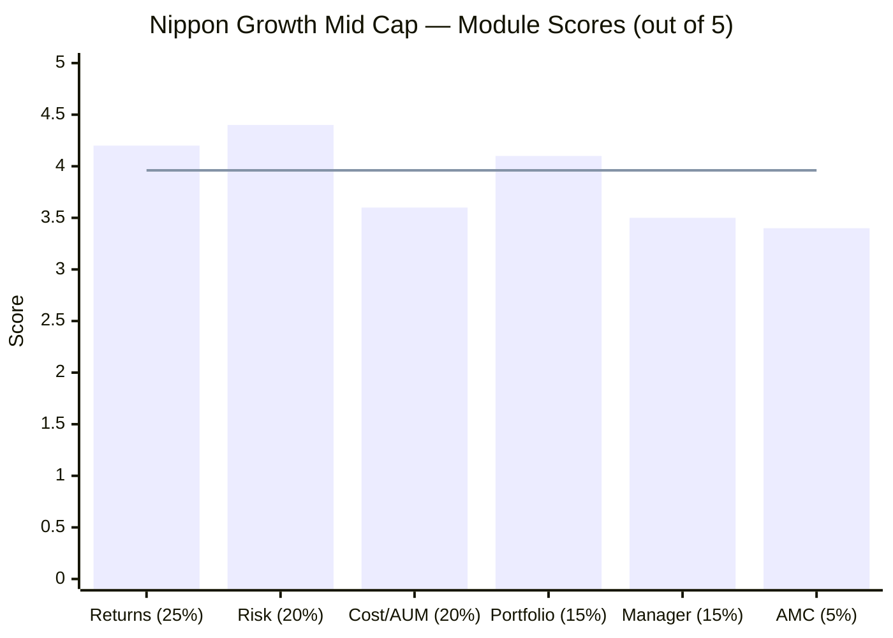
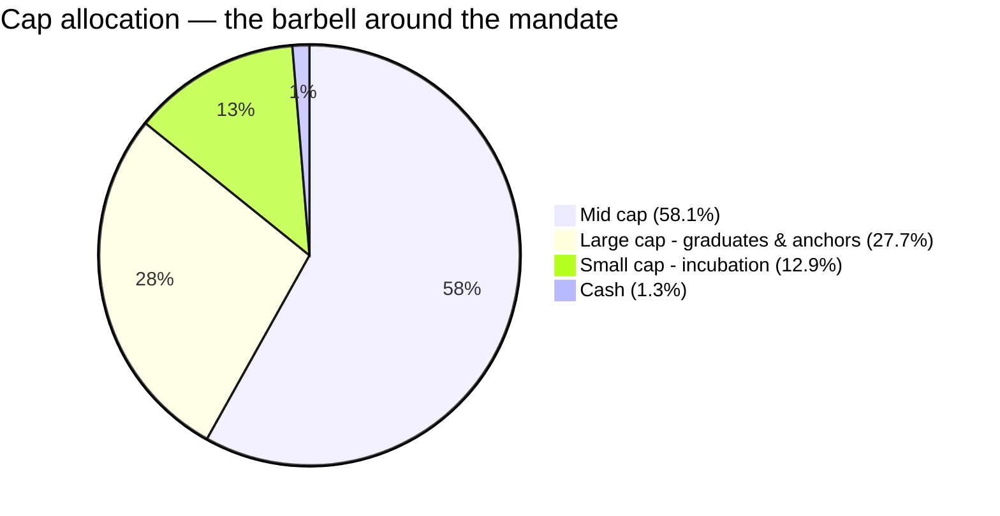
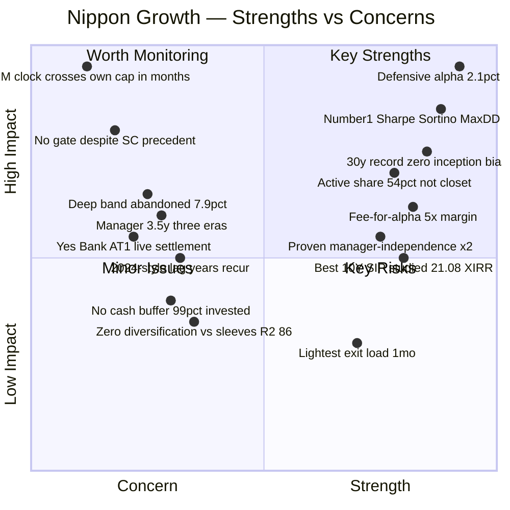
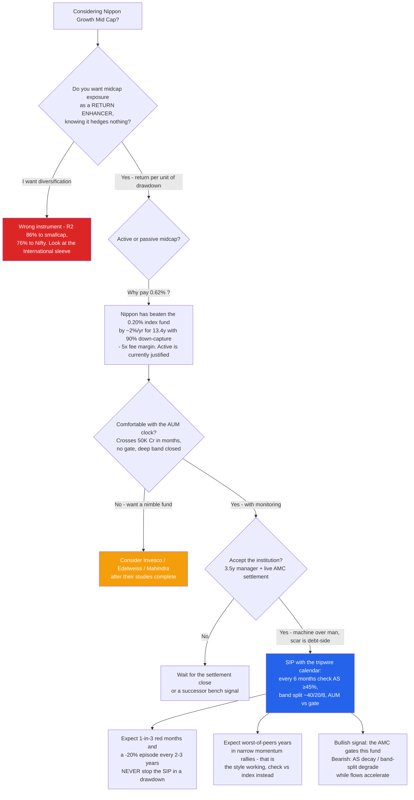
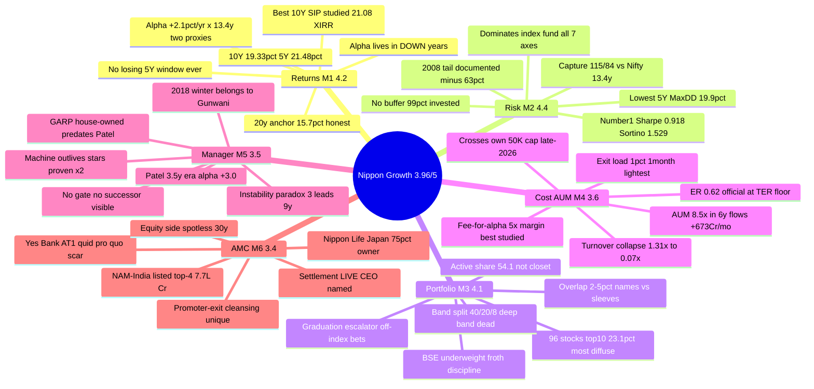

# Nippon India Growth Mid Cap Fund — Deep Study

## Fund Identity

| Field | Value |
|-------|-------|
| **Full Name** | Nippon India Growth Mid Cap Fund — Direct Plan — Growth (formerly *Reliance Growth Fund*) |
| **AMC** | Nippon Life India Asset Management Ltd (**NAM-India**, listed; ~75% Nippon Life Insurance, Japan) |
| **Inception** | **October 8, 1995** — one of India's oldest equity funds (~30 years); Direct plan 02-Jan-2013 |
| **SEBI Category / Risk** | Equity — Mid Cap (min 65% in ranks 101–250) / Very High |
| **Benchmark** | Nifty Midcap 150 TRI |
| **Fund Manager** | **Rupesh Patel (since Jan-2023)** + Kinjal Desai (overseas, 2018), Amber Singhania (AFM, Mar-2026) |
| **AUM** | **₹47,415 Cr** (May-2026) — largest of the shortlist; ~6% of AMC assets |
| **Expense Ratio** | **0.62% Direct / 1.25% Regular** (official May-2026 factsheet; at the SEBI TER floor) |
| **NAV (01-Jul-2026, Direct)** | ₹4,954.98 — the 1995 ₹10 unit is a **449-bagger** (Regular) |
| **Exit Load** | **1% within 1 month only** — the lightest studied |
| **Official Turnover** | ~0.07× (7%) — collapsed from 1.31× (2020) |
| **VRO Rating** | ⭐⭐⭐⭐⭐ (5/5) |
| **Stated Style** | GARP — Growth At a Reasonable Price (factsheet-stated across manager eras) |
| **Data** | MFAPI 118668 (Direct, 3,319 NAVs) + 100377 (Regular, Apr-2006→) · index counterfactuals 147622 & 114456 · official AMC factsheets Jun-2020 → Jun-2026 · Tickertape holdings API (96 positions) |

---

## The One-Line Context

Nippon Growth is the mid-cap study's **reference frame** and its provisional **#1** — a 30-year, zero-inception-bias compounding machine that has delivered **+2.1%/yr net alpha over the investable Nifty Midcap 150 index across 13.4 years and two proxies, earned almost entirely by losing less** (99% up-capture / 90% down-capture, −10.3% worst modern year, no losing 5-year window ever), with the shortlist's #1 Sharpe/Sortino/lowest-drawdown at 3–10× peer size, a 54.1% active share that kills the closet-index concern, and the study family's only *empirically proven* manager-independence (two star exits, no NAV scar). Every discount lives on the institutional side: an AUM trajectory (₹5,592 → ₹47,415 Cr in six years, +₹673 Cr/month and accelerating) that **breaches this study's own ₹50,000 Cr screening cap within months**, a 3.5-year manager atop a thrice-changed seat with no gate on the door, and an AMC carrying a live SEBI settlement for the Reliance-era Yes Bank AT1 quid-pro-quo case. **A superb machine housed in a merely adequate institution — on a clock. Final: ≈3.96/5, provisionally #2 across all four category studies.**

---

## Module Status

| Module | Weight | Status | Score | File |
|--------|--------|--------|-------|------|
| 1 — Returns Consistency | 25% | ✅ Complete | ~4.2/5 | [module1_returns.md](module1_returns.md) |
| 2 — Risk Profile | 20% | ✅ Complete | ~4.4/5 | [module2_risk.md](module2_risk.md) |
| 3 — Portfolio DNA | 15% | ✅ Complete | ~4.1/5 | [module3_portfolio.md](module3_portfolio.md) |
| 4 — Cost & AUM Impact | 20% | ✅ Complete | ~3.6/5 | [module4_cost.md](module4_cost.md) |
| 5 — Fund Manager Quality | 15% | ✅ Complete | ~3.5/5 | [module5_manager.md](module5_manager.md) |
| 6 — AMC Trustworthiness | 5% | ✅ Complete | ~3.4/5 | [module6_amc.md](module6_amc.md) |

---

## Final Scorecard

| Module | Score | Weight | Weighted |
|--------|-------|--------|----------|
| 1 — Returns Consistency | ~4.2 | 25% | 1.050 |
| 2 — Risk Profile | ~4.4 | 20% | 0.880 |
| 4 — Cost & AUM Impact | ~3.6 | 20% | 0.720 |
| 3 — Portfolio DNA | ~4.1 | 15% | 0.615 |
| 5 — Fund Manager Quality | ~3.5 | 15% | 0.525 |
| 6 — AMC Trustworthiness | ~3.4 | 5% | 0.170 |
| **Overall** | | **100%** | **≈ 3.96 / 5** |

> **The structural story in one line:** the *engine* modules (returns, risk, portfolio — all ≥4.1) describe the best-functioning midcap machine measured in these studies; the *institution* modules (cost/AUM, manager, AMC — all mid-3s) describe everything that could break it: size, seat-churn, and a scarred house.

---

## Key Performance Metrics

| Metric | Value | Context |
|--------|-------|---------|
| **10Y CAGR** | **19.33%** | Bear-inclusive; 2nd of shortlist |
| **5Y CAGR** | **21.48%** | 2nd of shortlist (Invesco 21.9) |
| 3Y CAGR | 23.09% | Only 5th of 7 — recent form is mid-pack |
| **20.2Y CAGR (Regular)** | **15.70%** | The honest long-run anchor — includes 2008 (−63%) and 2011 (−35%) |
| **Alpha vs investable index** | **+2.11%/yr × 13.4y** (ETF proxy); +1.97%/yr × 6.8y (index fund) | Net of fees, two independent proxies |
| **Up / Down capture** | **99% / 90%** vs band; **115% / 84%** vs Nifty (13.4y) | The defensive-alpha engine |
| **Sharpe / Sortino (5Y)** | **0.918 / 1.529** | **#1 of 7 shortlisted**; index fund: 0.693 / 1.107 |
| **Max drawdown (5Y)** | **−19.9%** | Lowest of shortlist; index −21.2% |
| Max drawdown (modern era) | −35.3% (COVID, recovered 7 mo) | 2008 tail: −62.7% (Regular, documented) |
| **Rolling 5Y windows negative** | **0.0% — never** | Worst 5Y: +0.54%/yr (straddling winter + COVID) |
| **10Y SIP (₹20K/mo)** | **₹24L → ₹73.0L, 21.08% XIRR** | Best realized SIP in any of the four studies |
| **Active share** | **54.1%** | Not a closet indexer; conviction lives off-index |
| Holdings / Top-10 | 96 / **23.1%** | Most diffuse book studied; max sector 8.1% |
| **AUM / flows** | ₹47,415 Cr / **+₹673 Cr per month, accelerating** | Crosses the study's ₹50K Cr cap ~late-2026 |
| Fee premium vs index → alpha | 0.42% → +2.0%/yr | **~5× margin of safety — strongest fee case studied** |
| Portfolio PE | 29.3 vs category 33.8 | The froth discipline, quantified |
| Manager | Patel, 3.5y (era alpha +3.0%/yr) | Third lead in 9 years; machine-run |

---

## ⚠️ The Five Critical Lenses — Read Before the Numbers

### Lens 1 — The Endurance Machine, Not the Momentum Star
Nippon's rank *improves* with the window: 5th of 7 on 3Y → 2nd on 5Y → 2nd on 10Y → the only fund with a real 20-year number. Its edge is surviving everything, not leading anything. The exact inverse of Motilal Oswal (best 5Y in the universe, eliminated at screening on a −0.69 Sharpe). Expect it to look ordinary in every narrow rally — 2024 (+27.9% vs Invesco's +45.0%) is the recurring cost of the style.

### Lens 2 — The Alpha Is Real, 13 Years Long, and Entirely Defensive
+2.1%/yr net over the investable index, verified across two proxies — earned in the down years (2018 +5.0, 2019 +10.9, 2022 +3.1, 2024 +3.7) while bull years hug the index. Combined with 90% down-capture and a −19.9% drawdown in the 2024–25 correction (index: −21.0%), the fund's entire value proposition is **losing less, then recovering first**. If you want a midcap fund that beats rallies, this is not it.

### Lens 3 — Style AND Size: the Active-Share Verdict
The M1/M2 hinge question — is the defensive alpha discipline or a ₹47K Cr fund drifting to the liquid end? — was answered by the holdings: **active share 54.1%** (not closet), conviction expressed off-index through a **graduation escalator** (Eternal/PFC/ICICI held as they outgrew the band, a 13% small-cap incubator below), the index's hottest name (BSE) underweighted — *but* the deep band (ranks ~200–250) is abandoned (7.9%) because SEBI's 10%-ownership math closes it at this size. **The answer is "both, manageably": genuine selection executed inside the liquidity-feasible half of the pond.**

### Lens 4 — The Clock: This Fund Will Fail Its Own Screen Within Months
AUM grew 8.5× in six years; flows turned from *outflows* (2020–22 — investors left during the best NAV stretch) to **+₹673 Cr/month, pro-cyclical and accelerating**; official turnover collapsed 1.31× → 0.07×; and the fund crosses this study's own ₹50,000 Cr Stage-1 cap around late-2026 — with **no gate**, despite the same AMC gating its Small Cap fund in 2023. The tripwires, with a timeline: **active share < ~45%, the 40/20/8 band split degrading, ₹50–60K Cr without a restriction — check every ~6 months for the next 2 years.**

### Lens 5 — You're Buying the Machine, Not the Man — Housed in a Scarred Fortress
Three lead managers in nine years (the celebrated 2018-winter navigation belongs to the departed Gunwani; Patel has 3.5 years) — yet era-computed alpha barely flinched at any handover (+4.1 → +3.0), the only *empirically proven* manager-independence in the four studies. The AMC beneath is a top-4, listed, Japanese-owned financial fortress carrying the family's ugliest-in-kind scar: the Reliance-era **Yes Bank AT1 quid-pro-quo case** (~₹2,850 Cr, SEBI settlement live as of Apr-2026, the still-serving CEO personally named) — debt-side, promoter-excised, equity record spotless, but not closed.

---

## Portfolio DNA (Snapshot)

| Metric | Value | Significance |
|--------|-------|--------------|
| Holdings | **96** | Size-forced breadth; position pyramid (8 names ≥2%, 56 under 1%) |
| Top-10 | **23.1%** | Lowest concentration of any studied fund |
| Largest position | BSE 3.32% (index: 4.21%) | **Underweights the band's hottest name** — froth discipline |
| Biggest active bets | Eternal +2.17, PFC +2.01, ICICI +1.85 — **all off-index graduates** | The escalator is the conviction |
| Cap split | Mid 58.1 / Large 27.7 / Small 12.9 | The barbell: graduated winners + incubator |
| Band positioning | **40.1 / 19.9 / 7.9** (top/mid/bottom of index) | The size fingerprint — deep band abandoned |
| Max granular sector | 8.1% (financials cluster ~23%) | No thesis-sized sector bet — the anti-DSP |
| Cash | ~1.3% (always 97.7–98.9% invested) | No buffer, by policy — protection is selection-only |
| Overlap vs PP / DSP sleeves | **2.0% / 5.2% by name** | Duplicates *risk* (R² 86% vs DSP), not *holdings* |

---

## Strengths vs Concerns

---

## Key Strengths

- **⭐ +2.1%/yr net alpha over the investable index for 13.4 years, across two proxies** — earned defensively (99%/90% capture; 115%/84% vs the Nifty), the cleanest pure-stock-selection asymmetry in the four studies
- **⭐ #1 Sharpe (0.918), #1 Sortino (1.529), lowest drawdown (−19.9%) of the shortlist** — at 3–10× every peer's size, and strictly dominating the index fund on all seven risk axes over 5Y
- **⭐ The 30-year record with zero inception bias** — includes 2008 (−62.7%) and 2011: the only shortlist fund whose worst case is documented rather than hypothetical; **no losing 5-year window ever**
- **Active share 54.1% with off-index conviction** — the closet-index concern is dead; the graduation escalator (hold winners as they outgrow the band, incubate below it) is a legible, systematized answer to the category's structural problem
- **The strongest fee-for-alpha case studied** — 0.42% premium over the index fund vs +2.0%/yr verified alpha (~5× margin); official ER cut 56% as AUM grew (now 0.62%, at the TER floor)
- **Empirically proven manager-independence** — survived the Singhania (2017) and Gunwani (2023) exits with no NAV scar; era alpha +4.1 → +3.0 across the latest handover
- **Best realized 10Y SIP in any study: ₹24L → ₹73.0L (21.08% XIRR)** — the volatility worked *for* the SIP
- Lightest exit load studied (1%/1 month); 5★ VRO; GARP style stated across eras; PE 29.3 vs category 33.8

## Key Concerns

- **⭐ The AUM clock** — ₹47,415 Cr growing at an accelerating, pro-cyclical +₹673 Cr/month; **crosses this study's own ₹50,000 Cr screening cap ~late-2026**; deep band already arithmetically closed (10%-ownership math); official turnover collapsed 1.31×→0.07×
- **⭐ No gate, despite the in-house precedent** — the AMC restricted Small Cap (Jul-2023) but keeps this flagship open at ₹100 minimums; stewardship exists and is not being applied here
- **Recent form is mid-pack** — 3Y CAGR 5th of 7; 2024 was the worst peer year (+27.9% vs Invesco +45.0); GARP discipline *will* lag every narrow momentum rally
- **Three lead managers in nine years; the incumbent has 3.5** — the celebrated winter navigation belongs to a departed manager; no groomed successor visible on this fund; skin-in-the-game undisclosed
- **The AMC's live scar** — the Yes Bank AT1 quid-pro-quo case (~₹2,850 Cr, Reliance-era): settlement unresolved (Apr-2026), the sitting CEO personally named — debt-side and promoter-excised, but uglier in kind than Franklin's failure
- **No structural buffer** — ~99% invested always; all protection is stock-selection; in a 2008-scale event expect ~−60% with a 2+ year recovery
- **Zero diversification value for this portfolio** — R² 86% to the DSP Small Cap sleeve, 76% to the Nifty: a return-enhancer that *concentrates* domestic-equity risk (it duplicates risk, not holdings — name overlap just 2–5%)
- 35% of months are negative — the emotional price of the band

---

## Comparison vs Studied Funds (All Four Categories)

| Dimension | **Nippon (MidCap #1 prov.)** | PP FlexiCap (#1 overall) | DSP Small Cap (SC #1) | Franklin US (Intl) |
|-----------|------------------------------|--------------------------|----------------------|--------------------|
| **Final score** | **≈3.96** | 4.20 | 4.00 | ≈3.14 |
| 10Y CAGR | 19.33% | mid-teens | ~19.3% | 17.8% (~4pts currency) |
| Worst modern year | **−10.3%** | ~−7% | ~−25% | −30% |
| Alpha vs own index | **+2.1%/yr × 13.4y** ✅ | positive ✅ | positive ✅ | negative ❌ |
| Alpha character | Defensive (DC 90%) | selection + allocation | selection | n/a (lags) |
| 10Y SIP XIRR | **21.08%** ⭐ | ~17–18% | ~19.3% | 17.25% |
| Manager continuity | ❌ 3 eras / 3.5y — **but proven survivable ×2** ⭐ | ✅ 13y | ✅ 14y | ✅ 19y (inaccessible) |
| AUM position | ⚠ **the clock** (₹47K Cr, band-bound) | giant but segment-shielded | sweet spot, 3 gates ⭐ | unconstrained |
| Fee vs index alt | **+0.42% for +2.0%** ⭐ | ~+0.4% for alpha ✅ | no clean alt | +1.15% for −alpha ❌ |
| AMC | Scarred fortress (live AT1 settlement) | Spotless ⭐ | Clean + gold-standard gating | Gravest scar (2020) |
| Diversification for this portfolio | ~None (R² 86% vs DSP) | is the core | is the satellite | Elite (R² 11%) ⭐ |

> **Cross-study insight:** Nippon is "PP's consistency profile transplanted into a higher-octane band" — same defensive-alpha engine, same process-over-person character — minus PP's manager continuity and clean house, plus a capacity clock PP's large-cap-heavy mandate never faces. Against DSP it offers a shallower-drawdown, higher-SIP-XIRR version of the same domestic growth risk. It does *not* do what Franklin does (diversify) — and Franklin does not do what Nippon does (beat its index).

---

## ₹20K/Month SIP Projections (10 Years)

| Scenario | CAGR assumption | Projected corpus | Multiple |
|----------|----------------|------------------|----------|
| Bear (band de-rates, no alpha) | 10% | ₹41.0L | 1.71× |
| Conservative (20y anchor, no alpha) | 13% | ₹48.8L | 2.03× |
| **Base (20y anchor + defensive alpha)** | **16%** | **₹58.5L** | **2.44×** |
| Optimistic (last-decade regime persists) | 19% | ₹70.6L | 2.94× |

**Total invested: ₹24,00,000** | **Realized trailing 10Y SIP (actual history): ₹24L → ₹73.0L at 21.08% XIRR** — treat the realized number as the ceiling, not the base: every midcap 10Y SIP measured today ends after a strong decade for the band. The honest anchor is the 20-year record (~15.7%) plus the fund's persistent ~2% alpha.

---

## Investment Decision Framework

---

## Nippon Growth Mid Cap — In One View

---

## The Critical Facts — In 10 Sentences

1. Nippon Growth Mid Cap scores **≈3.96/5** — provisionally the **#2 fund across all four category studies** (PP 4.20, DSP 4.00) and the bar the remaining six midcap funds must beat.
2. It is the oldest fund in any study (Oct-1995), with **zero inception bias** — its record contains 2008 (−62.7%), 2011, the 2018–19 winter, COVID, 2022, and 2024–25, and it has **never had a losing 5-year window**.
3. Its core proposition is **+2.1%/yr net alpha over the investable Nifty Midcap 150 index sustained for 13.4 years across two proxies** — earned almost entirely by losing less (90% down-capture; alpha concentrated in 2018/2019/2022/2024).
4. On a common 5Y method it has the **#1 Sharpe, #1 Sortino, and lowest max drawdown of the shortlist** — at 3–10× every peer's AUM — and strictly dominates the index fund on all seven risk axes.
5. The holdings resolve the study's hinge question: **active share 54.1%** (not a closet indexer), with conviction expressed off-index via a graduation escalator — but the deep band is abandoned (7.9%), the honest fingerprint of size.
6. The fee case is the strongest studied: **0.42% premium over the index fund for +2.0%/yr verified alpha (~5× margin)**, an official ER cut 56% to 0.62% as AUM grew 8.5×.
7. **The central risk is the clock:** +₹673 Cr/month of accelerating, pro-cyclical flows will push it past this study's own ₹50,000 Cr screening cap within months — with no gate, despite the AMC gating its own Small Cap fund in 2023.
8. The manager seat has changed three times in nine years (Patel since Jan-2023; the celebrated winter belongs to Gunwani) — yet era-computed alpha barely flinched at any handover, the only **empirically proven manager-independence** in the four studies.
9. The AMC is a scarred fortress: top-4 scale, listed, Japanese-owned, spotless on equity — carrying the **live Yes Bank AT1 quid-pro-quo settlement** (Reliance-era, ~₹2,850 Cr, the sitting CEO personally named).
10. For this portfolio it is a **return-enhancer, not a diversifier** (R² 86% vs the DSP Small Cap sleeve; name overlap only 2–5%) — the best drawdown-adjusted domestic growth engine measured, bought with tripwires and a 6-monthly monitoring calendar.

---

## Quick Verdict

**Best suited for:**
- **SIP investors wanting midcap exposure with the best measured return-per-unit-of-drawdown** — the 21.08% realized 10Y SIP XIRR was earned through four stress events, not around them
- Those who value **process over personality** — the machine has outlived two star managers, provably
- Investors who will actually **run the monitoring calendar** (active share, band split, AUM-vs-gate every ~6 months)
- Those wanting the **why-not-the-index answer on evidence**: 13.4 years of net alpha at a 5× fee margin

**Not suited for:**
- **Anyone seeking diversification** — it concentrates domestic-equity factor risk (R² 86% vs small-cap sleeve)
- **Momentum/rally chasers** — GARP discipline guarantees worst-of-peers years in narrow bull markets (2024 was one)
- Investors who need a **cash-buffered ride** — ~99% invested always; 1-in-3 months are red; −20% every 2–3 years
- Those uncomfortable holding through a **live AMC settlement** or a **capacity clock** — if either disqualifies, wait for the Invesco/Edelweiss studies before deploying the sleeve

---

## One-Line Verdict

> **Nippon Growth Mid Cap is the best-functioning midcap machine measured in these studies — a 30-year, zero-inception-bias compounder with +2.1%/yr of two-proxy, 13.4-year defensive alpha (99/90 capture), the shortlist's #1 risk-adjusted metrics at 3–10× peer size, a 54.1% active share expressed through a graduation escalator, the strongest fee-for-alpha case studied (5× margin at 0.62%), and empirically proven manager-independence — housed in a merely adequate institution: an ungated ₹673 Cr/month flow clock that breaches this study's own AUM cap within months, a 3.5-year manager on a thrice-changed seat, and an AMC with a live quid-pro-quo settlement. A superb machine on a clock: buy the machine, watch the clock. Final: ≈3.96/5.**

---

*Study completed: July 3, 2026 | Framework: 6-Module Weighted Scoring (Mid Cap adaptation) | Final Score: ≈3.96/5 | First of 7 shortlisted midcap funds studied — the reference frame | Benchmark = Nifty Midcap 150 TRI; index counterfactuals = Motilal M150 Index Fund (147622) + M100 ETF (114456) | Data: MFAPI (118668/100377, 3,319+4,982 NAVs), official AMC factsheets Jun-2020→Jun-2026 (curl+browser-headers), Tickertape screener+holdings APIs, VRO/Groww/news cross-checks | Manager eras: Singhania →2017, Gunwani 2017–23, Patel 2023– (era alphas ≈0 / +4.1 / +3.0) | Tripwires: AS <45%, band split off 40/20/8, AUM ₹50–60K Cr ungated, AT1 settlement escalation | Next: Invesco India Midcap (study #2)*
