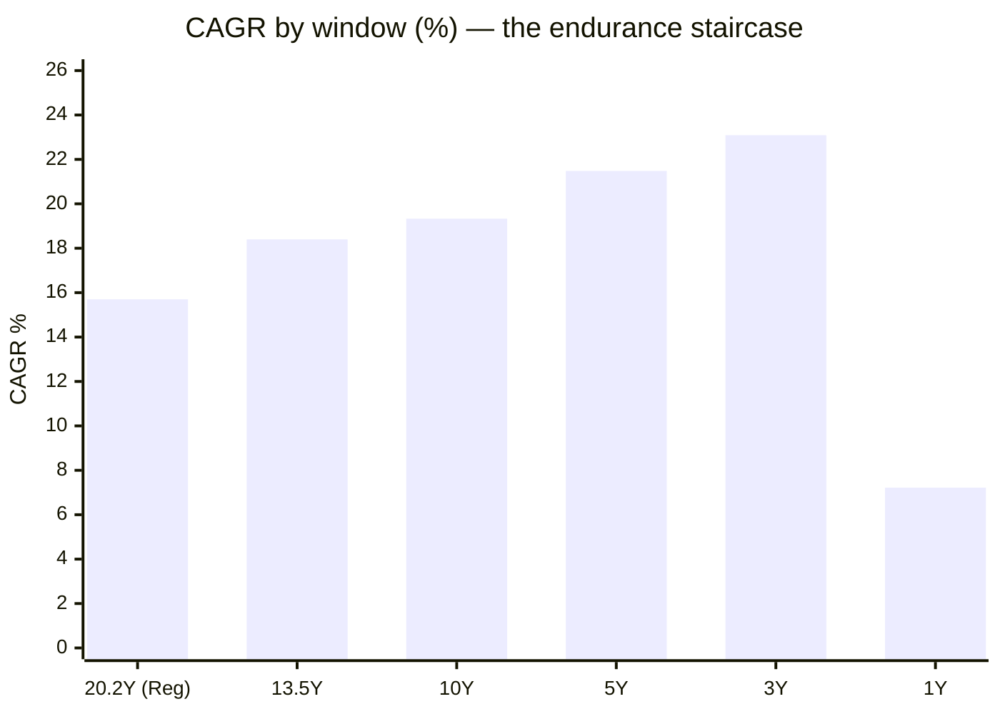
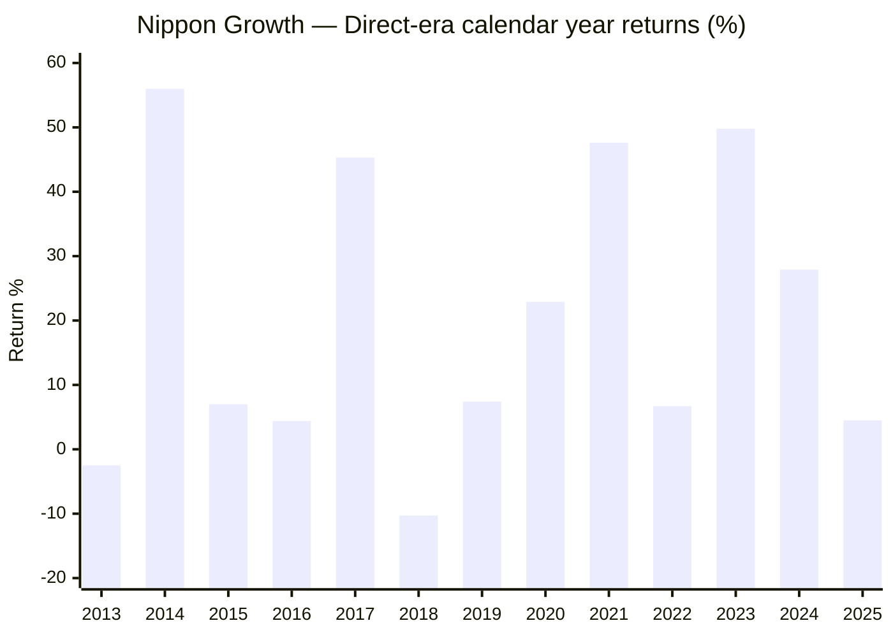
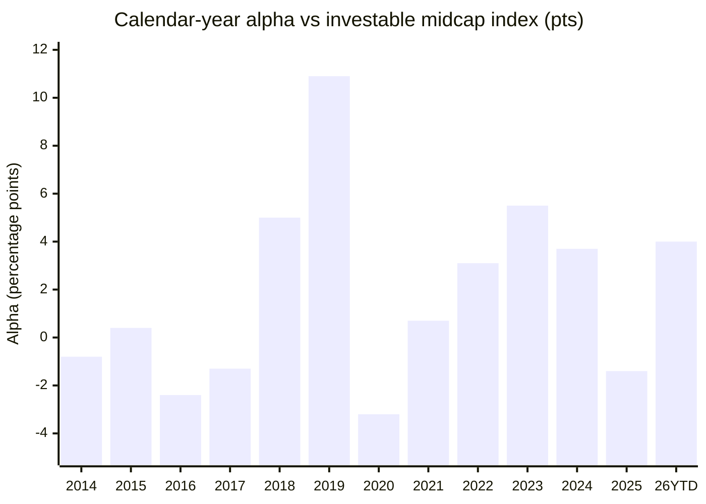

# Module 1: Returns Consistency — Nippon India Growth Mid Cap Fund

## Module 1 Score: ~4.2 / 5 (provisional)

---

## Fund Identity

| Field | Value |
|-------|-------|
| **Full Name** | Nippon India Growth Mid Cap Fund — Direct Plan — Growth (formerly *Reliance Growth Fund*) |
| **Inception** | **October 8, 1995** — one of India's oldest equity funds (~30 years); Direct plan from 02-Jan-2013 |
| **SEBI Category** | Equity — Mid Cap (min 65% in ranks 101–250) |
| **Benchmark** | Nifty Midcap 150 TRI |
| **AUM** | **₹47,415 Cr** — largest fund in the shortlist; just under the ₹50,000 Cr screening cap |
| **Expense Ratio** | **0.62%** Direct / 1.25% Regular *(official May-2026 factsheet; Tickertape's 0.73% is a stale Nov-2025 figure — see Module 4)* |
| **NAV (01-Jul-2026)** | ₹4,954.98 (Direct); the Regular plan's ₹10 unit of 1995 is ₹4,489 today — a **449-bagger** |
| **Current Manager** | **Rupesh Patel, since January 2023** (see Manager-Era Attribution below) |
| **VRO Rating** | ⭐⭐⭐⭐⭐ (5/5) |
| **Riskometer** | Very High |
| **Exit Load** | **1% within 1 month; nil after** *(corrected in Module 4 from the official factsheet — lightest load studied)* |
| **Min SIP** | ₹100 |

---

## Raw Data (MFAPI computed + Tickertape screening, as of 01/03-Jul-2026)

| Metric | Value |
|--------|-------|
| 1Y absolute | 7.22% |
| 3Y CAGR | 23.09% |
| 5Y CAGR | 21.48% |
| 10Y CAGR | 19.33% |
| Since Direct inception (13.5y) | 18.40% |
| Regular plan since Apr-2006 (20.2y) | 15.70% |
| Mean rolling 3Y (direct era) | 20.10% |
| Alpha (Tickertape, vs benchmark) | +1.93 |
| Max drawdown (direct era) | −35.3% (COVID) |
| 10Y SIP XIRR (₹20K/mo) | **21.08%** |
| Portfolio PE | 29.3 (category 33.8) |

**Data sources:** MFAPI scheme **118668** (Direct, 3,319 daily NAVs, 02-Jan-2013 → 01-Jul-2026); scheme **100377** (Regular, 4,982 NAVs, Apr-2006 →); index counterfactuals **147622** (Motilal Oswal Nifty Midcap 150 Index Fund Direct, 11-Sep-2019 →) and **114456** (Motilal Oswal Nifty Midcap 100 ETF, Feb-2011 →). All headline metrics computed from raw NAVs, not copied from websites.

---

## Cross-Source Verification

| Metric | MFAPI (computed) | Tickertape (03-Jul-2026) | ValueResearch | Verdict |
|--------|------------------|--------------------------|---------------|---------|
| 3Y CAGR | **23.09%** | 23.10% | — | ✅ match to 2dp |
| 5Y CAGR | **21.48%** | 21.48% | — | ✅ exact |
| 10Y CAGR | **19.33%** | 19.32% | — | ✅ match to 2dp |
| AUM | — | ₹47,415 Cr | ₹47,415 Cr | ✅ exact |
| Inception | — | age-capped (163mo) | Oct 8, 1995 | ✅ VRO fills the cap |
| Rating | — | — | 5★ | Noted |

The dataset is internally consistent across three independent sources. (Tickertape's `ageInMon` field caps at 163 months; the true age is ~369 months.)

Additionally, the Motilal Midcap 150 index-fund proxy was cross-validated against Yahoo Finance's Nifty Midcap 150 price index: calendar returns 2020–2026 match to within the ~1.4%/yr dividend yield (PRI vs TRI gap), confirming the proxy is honest.

---

## The One-Line Context

Nippon Growth is the mid-cap study's **reference frame**: the oldest fund in any of the four category studies (1995), with zero inception bias, a full multi-cycle record (2008 −63%, 2011 −35%, COVID −35%, 2024–25 −20%), and — the module's headline finding — a **+2.1%/yr net alpha over the investable midcap index sustained across 13.4 years and two independent proxies, earned almost entirely by losing less in bad markets** (99% up-capture / 90% down-capture). Its open questions run the other way: recent *peer*-relative form is mid-pack (3Y CAGR ranks 5th of 7), the record spans three manager eras (current manager only since Jan-2023), and whether a ₹47,415 Cr giant's defensive alpha is *style* or *size* is the study's central unresolved question, handed to Modules 3–5.

---

## The Vintage — Zero Inception Bias, by a Margin of Decades

Every prior study had an inception-bias problem child whose CAGR needed discounting:

| Study | Problem child | What was missing | The discount applied |
|-------|--------------|------------------|---------------------|
| SmallCap | Bandhan (Jan-2020 launch) | 2018 crash, COVID bottom | 23.5% 5Y CAGR treated as bull-market-only |
| International | 2020–21 tech feeders | The 2022 growth bear at launch scale | Inception-bias modifier in M1 |
| MidCap shortlist | Mahindra Manulife (Feb-2018) | The Jan-2018 peak (narrowly) | Flagged |
| **This fund** | **None** | **Nothing — the record contains 2008** | **None needed** |

Nippon Growth is the anti-Bandhan. Three decades of record mean:

1. **Every CAGR window is honest** — no bear year is missing from any trailing number. If anything the 5Y window (from Jul-2021) is flattered *for the whole category equally*; the fund's **rank** within peers is the clean signal.
2. **The worst case is documented, not hypothetical** — this is the only shortlisted fund whose record answers "what does this strategy do in a −60% band crash?" (2008: fell −54.1%, then +97.4% in 2009).
3. **The honesty cuts both ways** — a 30-year record belongs to *many* managers. The record is the fund's, not the current team's (see Manager-Era Attribution).

---

## CAGR vs Benchmark and the 10Y → 5Y → 3Y Trajectory

| Window | Nippon | Shortlist rank | Interpretation |
|--------|--------|----------------|----------------|
| 1Y | 7.22% | mid-pack (HSBC 17.5% leads) | No momentum tailwind today; you are not buying recent heat |
| 3Y | 23.09% | **5th of 7** | The soft spot — HSBC 27.7, Invesco 26.9, ICICI 24.8, Edelweiss 24.0 ahead; a 23% 3Y is "fine" in a band that compounded ~20%, not leadership |
| 5Y | **21.48%** | **2nd of 7** | The Stage-2 screening headline; only Invesco (21.9%) ahead |
| 10Y | **19.33%** | **2nd of 6** with 10Y data | Bear-inclusive (2018–19, COVID, 2022, 2024–25 all inside) |
| 13.5Y (Direct era) | **18.40%** | — | The most representative number for a modern investor |
| 20.2Y (Regular) | **15.70%** | — | Includes 2008 (−63%) and 2011 (−35%): the honest long-run expectation anchor for midcap — ~15–16%, not 20%+ |

**The pattern to internalize: the longer the window, the better Nippon ranks** — 5th on 3Y → 2nd on 5Y → 2nd on 10Y → the only fund with a real 20-year number. Its edge is *endurance*, not recent heat. This is the exact inverse of Motilal Oswal Midcap, which led every short window and was eliminated at screening on a −0.69 Sharpe when its momentum book unwound.

---

## Calendar-Year Returns (2007–2026 YTD)

Regular plan (italics) for 2007–2012; Direct plan from 2013.

| Year | Return | Market context | Verdict |
|------|--------|---------------|---------|
| *2007* | *+76.9%* | Mid/small mania | Full participation (Singhania era) |
| *2008* | ***−54.1%*** | GFC — band fell ~60%+ | No protection at GFC scale; nothing protects |
| *2009* | *+97.4%* | V-recovery | Near-doubled |
| *2010* | *+17.2%* | Bull | Fine |
| *2011* | *−27.4%* | Rate/EU crisis | Deep midcap bear, in line with band |
| *2012* | *+37.8%* | Recovery | Strong |
| 2013 | −2.5% | Taper tantrum | Marginal negative (Direct era begins) |
| 2014 | **+56.0%** | Modi-wave midcap rally | Full participation |
| 2015 | +7.0% | Flat market | Fine |
| 2016 | +4.4% | Demonetisation | Fine |
| 2017 | +45.3% | Mid/small mania | Full participation |
| **2018** | **−10.3%** | **Midcap winter part 1** | **2nd-best of peer set — see Winter Deep Dive** |
| **2019** | **+7.4%** | **Winter part 2 — midcaps kept falling** | **Best of the peer set; +10.9pts vs index** |
| 2020 | +22.9% | COVID crash + V | Lagged index (+26.1%) — worst index-relative year |
| 2021 | +47.6% | Broad bull | Matched index (+46.9%) |
| 2022 | **+6.7%** | Rate-hike correction | Beat index (+3.6%) by 3.1pts — defensive signature |
| 2023 | **+49.8%** | Midcap rally | **Best year of all 7 peers; +5.5pts vs index** |
| 2024 | +27.9% | Rally, then Sep top | Beat index (+24.2%) but **worst peer year** (Invesco +45.0) |
| 2025 | +4.5% | Correction year | Index +5.8%; slight lag |
| 2026 YTD | +6.7% | Recovery | Index +2.7%; +4.0pts ahead |

**Consistency statistics (Direct era, 13.5 years):**
- **Two negative years** — 2013 (−2.5%) and 2018 (−10.3%)
- Worst year is a **single-digit loss** in a year the category fell hard
- For calibration across the studies: DSP Small Cap's worst ≈ −25% (2018) · Parag Parikh's worst ≈ −7% (2018, in a flat-Nifty year) · Franklin US's worst = −30% (2022). Nippon has the cleanest worst-year profile *per unit of category risk* of anything yet studied.

---

## ⭐ The 2018–19 Midcap Winter — The Critical Stress Test

**Why the window is Jan-2018 → Aug-2019, not "IL&FS":** the winter began *before* IL&FS. SEBI's Oct-2017 categorization circular forced industry-wide selling of non-conforming midcap holdings through H1-2018, and the Feb-2018 LTCG announcement de-rated the band; the Sep-2018 IL&FS default then poured fuel on an existing fire. Midcaps fell for **two consecutive years while the Nifty stayed flat** — the category's defining divergence stress.

**Nippon's drawdown:** peak 08-Jan-2018 → trough 09-Oct-2018: **−21.4%**, recovered 24-Jan-2020 — a two-year peak-to-peak round trip.

**Peer calendar comparison** (Direct plans; HSBC = L&T Midcap series spliced at the Nov-2022 merger):

| Fund | 2018 | 2019 | Cumulative 2018–19 |
|------|------|------|--------------------|
| Invesco | −3.6% | +5.4% | **+1.6%** ⭐ best |
| **Nippon Growth** | **−10.3%** | **+7.4%** ⭐ best 2019 | **−3.7%** — 2nd best |
| Edelweiss | −14.6% | +6.8% | −8.8% |
| ICICI Pru | −9.8% | +0.4% | −9.4% |
| HSBC (as L&T) | −11.2% | +1.0% | −10.3% |
| Sundaram | −14.8% | +0.5% | −14.4% |
| Mahindra Manulife | — (Feb-2018 inception) | +7.0% | incomplete |

**Vs the investable index** (Midcap 100 ETF): 2018 alpha **+5.0pts**, 2019 alpha **+10.9pts** — the fund's two best index-relative years of its entire direct era are the two winter years.

**Attribution note:** the winter was navigated by **Manish Gunwani** (manager from Sep-2017), not the current manager. The 2024–25 test below is the current team's.

---

## ⭐ The 2024–25 Correction — The Universal, No-Excuses Test

Every incumbent manager in the shortlist was on duty for this one (Sep-2024 top → Feb/Mar-2025 trough, band ~−20%):

| Metric | Nippon Growth | Nifty Midcap 150 index fund |
|--------|--------------|------------------------------|
| Peak → trough | 24-Sep-2024 → 28-Feb-2025 | 24-Sep-2024 → 28-Feb-2025 |
| **Depth** | **−19.9%** | −21.0% |
| **Recovered by** | **20-Oct-2025** | 17-Nov-2025 |
| Feb–Mar 2026 mini-dip | −12.6%, back in 3 weeks | −13.9%, back in 5 weeks |

Shallower fall, ~1 month faster recovery — and the same pattern repeated in the 2026 wobble, **under the current manager (Patel)**. The single most reassuring data point for the manager-transition question.

---

## ⭐ The Two-Proxy Index Test — "Why Not the Index Fund?"

**This study's sharpest question, unavailable to any prior study:** a Nifty Midcap 150 index fund is open, investable, and cheap (~0.2%). Every basis point of Nippon's 0.73% fee must buy verified alpha. Both counterfactuals below are **real funds' NAVs — net of all fees** — i.e., returns you could actually have bought.

**Proxy A — Motilal Oswal Nifty Midcap 150 Index Fund** (its full life: 11-Sep-2019 → 01-Jul-2026, 6.8y):

| Measure | Nippon | Index fund | Verdict |
|---------|--------|-----------|---------|
| **CAGR (6.8y)** | **24.88%** | 22.91% | **+1.97%/yr net alpha** ✅ |
| Up-capture (monthly, 81 mo) | **99%** | 100% | Keeps pace in rallies |
| **Down-capture** | **90%** | 100% | **The alpha engine** ⭐ |

**Proxy B — Motilal Oswal Nifty Midcap 100 ETF** (Feb-2013 → Jul-2026, **13.4 years**):

| Measure | Nippon | Midcap 100 ETF | Verdict |
|---------|--------|----------------|---------|
| **CAGR (13.4y)** | **18.72%** | 16.61% | **+2.11%/yr net alpha over 13.4 years** ✅ |
| CAGR 2014–2019 sub-period | 15.93% | 13.44% | +2.49%/yr in the pre-index-fund era |

*(Proxy B tracks the Midcap 100, not 150 — the two correlate ~0.99. The official Nifty Midcap 150 TRI history is bot-blocked at niftyindices.com; the ETF is arguably the better counterfactual anyway, being an actually-investable return.)*

**Calendar-year alpha, stitched across both proxies (2014–2019 vs ETF, 2020–2026 vs index fund):**

| Year | Alpha | Regime |
|------|-------|--------|
| 2014 | −0.8 | Bull — index-matching |
| 2015 | +0.4 | Flat — neutral |
| 2016 | −2.4 | Flat — slight lag |
| 2017 | −1.3 | Mania — index-matching |
| **2018** | **+5.0** | **Winter — big win** |
| **2019** | **+10.9** | **Winter — biggest win of the era** |
| 2020 | −3.2 | COVID V-whipsaw — worst year (giant can't rotate fast) |
| 2021 | +0.7 | Bull — neutral |
| **2022** | **+3.1** | **Grind-down — win** |
| **2023** | **+5.5** | Rally — win (the exception) |
| **2024** | **+3.7** | Top + correction onset — win |
| 2025 | −1.4 | Trough + bounce — slight lag |
| 2026 YTD | +4.0 | Recovery — ahead |

---

## ⭐ Alpha Decomposition by Market Regime — The Most Important Reading in This Module

The +2.1%/yr is real, 13 years long, and robust across two proxies — but it has a very specific **shape**:

- **In bull/mania years (2014, 2017, 2021): alpha ≈ 0 to slightly negative.** The fund is an index-hugger on the way up.
- **In stress/grind years (2018, 2019, 2022, 2024): alpha +3 to +11.** The entire value-add is concentrated in *losing less*.
- **In violent regime-turns (2020 V-recovery, 2025 trough-bounce): alpha negative.** A giant fund cannot rotate fast enough to catch the snap-back.

Combined with the 99%/90% capture asymmetry, **Nippon's entire case over the index fund is downside discipline** — it wins by not losing. Two hypotheses fit this fingerprint, and Module 1 cannot separate them:

1. **Style hypothesis (bullish):** a deliberate quality/valuation discipline that refuses the frothy end of the band — durable, repeatable, and exactly what a SIP investor wants wrapped around a volatile asset class. Supporting evidence: portfolio PE 29.3 vs category 33.8 (the cheapest-quartile book among the shortlist's data), and the fingerprint *persisting across three manager eras*.
2. **Size hypothesis (bearish):** a ₹47,415 Cr giant mechanically tilted toward the liquid, larger, steadier end of the 150-stock band — which falls less in corrections by construction. Under this reading the "alpha" is capacity-drift, and it decays toward zero as AUM grows.

> **Handoff:** Module 3 (active share, band positioning 101–150 vs 200–250) and Module 4 (AUM trajectory, flow pressure) own this question. It is the fund's single biggest open issue, and the final score should be read as conditional on its answer.

---

## Rolling Returns Distribution (Direct era, daily windows)

| Window | n | Mean | Min | Max | % negative | % below 10% | % above 20% |
|--------|-----|------|-----|-----|------------|--------------|--------------|
| Rolling 1Y | 3,071 | 22.86% | −27.65% | +96.36% | 13.7% | 38.9% | 44.4% |
| Rolling 3Y | 2,583 | 20.10% | −5.55% | +38.82% | **2.7%** | 14.2% | 55.5% |
| Rolling 5Y | 2,090 | 19.25% | **+0.54%** | +37.07% | **0.0%** | 13.9% | 42.3% |

**Probability of loss by holding period:**

| Hold for | Chance of loss (historical) | Worst outcome |
|----------|-----------------------------|---------------|
| 1 year | ~14% (1 in 7) | −27.7% (COVID window) |
| 3 years | **~3%** (only windows ending in the two-week COVID pit) | −5.6%/yr |
| 5 years | **0% — no negative 5Y window in 13.5 years** | +0.5%/yr (the window straddling the 2018–19 winter + COVID) |

The 3Y worst case (−5.6%/yr) and 5Y worst case (+0.5%/yr) both *contain* the winter and COVID — i.e., these floors were stress-tested by real events, not calm markets. For a 10-year SIP, the historical distribution says time-in-market has fully absorbed this fund's volatility at the 5-year horizon.

---

## SIP XIRR vs Lumpsum CAGR (₹20,000/month, Direct)

| Window | Invested | Value (01-Jul-2026) | SIP XIRR | Lumpsum CAGR (same window) |
|--------|----------|--------------------|----------|---------------------------|
| 3Y | ₹7.2L | ₹9.0L | 15.35% | 23.09% |
| 5Y | ₹12.0L | ₹19.9L | 20.27% | 21.48% |
| **10Y** | **₹24.0L** | **₹73.0L** | **21.08%** | 19.33% |
| Full Direct era (13.4y) | ₹32.2L | **₹139.7L** | 19.99% | 18.40% |

**Readings:**
- **10Y SIP XIRR (21.08%) > 10Y lumpsum CAGR (19.33%)** — the volatility worked *for* the SIP investor: instalments bought the 2018–19 winter, COVID, 2022, and the 2024–25 correction. This is the rupee-cost-averaging argument in its strongest observed form across all four studies.
- The 3Y SIP XIRR (15.35%) *below* the 3Y CAGR shows recent instalments bought the 2024 top — normal, and the price of entering after a rally.
- **21.08% is the best realized 10Y SIP number computed in any of the four studies** (DSP Small Cap ~19.3%, Franklin US 17.25%) — with the honest caveat that every midcap 10Y SIP measured today ends after a strong decade for the band.

---

## Absolute Returns — Short-Term Trend

| Period | Return | Context |
|--------|--------|---------|
| 3M | **+15.5%** | Strong recovery leg off the Feb–Mar 2026 dip |
| 6M | +6.0% | Consistent with the +6.7% YTD |
| 1Y | +7.2% | Mid-pack; the band itself is digesting the 2024–25 correction |

Short-term momentum is average-to-improving; nothing here contradicts the long-window story, and nothing flatters it either.

---

## ⭐ Manager-Era Attribution — Whose Record Is This?

The web-verified manager history divides the record into three regimes:

| Era | Manager | Period | What the NAV record shows |
|-----|---------|--------|---------------------------|
| The legend era | **Sunil Singhania** | ~2003 → Sep-2017 | 2009 +97%, 2014 +56% — the years that built the fund's brand. **None of it attributable to today's team.** |
| The transition era | **Manish Gunwani** (co-managers Dhrumil Shah from Feb-2019, Tejas Sheth from May-2019) | Sep-2017 → Jan-2023 | **The 2018–19 winter outperformance (+5.0/+10.9 alpha) and the 2022 defense (+3.1) are his.** Left the AMC Jan-2023. |
| The current era | **Rupesh Patel** | Jan-2023 → now (~3.5y) | 2023 +49.8% (**best of all 7 peers**) · 2024 +27.9% (**worst of peers**, though +3.7 vs index) · 2025–26: beat the index through the correction and recovery. Peer-mixed, index-positive, right defensive shape. |

**The honest attribution statement:** the 10Y CAGR spans three regimes; the celebrated stress navigation belongs to a departed manager; the current manager's sample is short and peer-volatile but index-positive with the correct defensive fingerprint.

**The counter-intuitive positive:** the defensive alpha signature — index-hugging up, protecting down — **persists across all three manager eras.** That is evidence for a *house process* rather than individual brilliance, and it materially de-risks the Jan-2023 transition. (Full manager assessment, including Patel's background and the bench, in Module 5.)

---

## Long-Cycle Drawdown Record (context for Module 2)

| Era | Peak → trough | Depth | Time to recover |
|-----|--------------|-------|-----------------|
| 2008 GFC *(Regular)* | Jan-2008 → Mar-2009 | **−62.7%** | 18 months (by Sep-2010) |
| 2011 *(Regular)* | Nov-2010 → Dec-2011 | −34.9% | **29 months** (by May-2014) — the longest wait |
| 2013 taper | Jan-2013 → Aug-2013 | −23.9% | 7 months |
| 2015–16 | Aug-2015 → Feb-2016 | −23.0% | 5 months |
| **2018–19 winter** | Jan-2018 → Oct-2018 | −21.4% | 16 months |
| COVID | Feb-2020 → Apr-2020 | −35.3% | 7 months |
| 2022 | Oct-2021 → Jun-2022 | −18.2% | 3 months |
| **2024–25** | Sep-2024 → Feb-2025 | −19.9% | 8 months |

Note the era shift: **since 2013, no drawdown deeper than COVID's −35%, and every one recovered within 16 months.** The −63%/29-month horrors live in the pre-2013 record — which is precisely why this fund's worst case is documented rather than hypothetical. Full risk treatment (Sharpe, Sortino, volatility, capture, beta) in Module 2.

---

## Returns vs Peers — All 7 Shortlisted Mid Cap Funds

**5Y CAGR (the Stage-2 filter metric) and 3Y-vs-universe ratio:**

| Fund | 5Y CAGR | 3Y CAGR | 3Y ÷ universe mean (20.27%) | 10Y CAGR |
|------|---------|---------|------------------------------|----------|
| Invesco | **21.91%** | 26.91% | 1.327 | **20.34%** |
| **Nippon Growth** | **21.48%** | 23.09% | 1.140 | 19.33% |
| Edelweiss | 20.64% | 24.05% | 1.186 | 19.88% |
| HSBC | 20.44% | 27.68% | **1.366** | 18.47% |
| Mahindra Manulife | 20.17% | 23.67% | 1.168 | — |
| Sundaram | 19.31% | 22.27% | 1.099 | 15.63% |
| ICICI Pru | 19.01% | 24.75% | 1.221 | 17.78% |

Nippon is the **only shortlist fund that pairs a top-2 long-window rank with the largest AUM and the oldest record** — the others earn their ranks at a third to a quarter of its size. That is either impressive (skill at scale) or the setup for decay (size catching up) — the style-or-size question again.

---

## Comparison with Studied Funds (All Four Categories)

| Dimension | **Nippon Growth (MidCap)** | DSP Small Cap (SC #1) | Parag Parikh (FC #1) | Franklin US (Intl) |
|-----------|---------------------------|----------------------|---------------------|--------------------|
| Vintage / inception bias | **1995 / none** | 2007 / none | 2013 / none | 2013 / none |
| 10Y CAGR | 19.33% | ~19.3% | mid-teens | 17.8% (~4pts is currency) |
| Worst calendar year | **−10.3%** | ~−25% (2018) | ~−7% (2018) | −30% (2022) |
| Alpha vs own investable index | **+2.1%/yr × 13.4y** ✅ | positive ✅ | positive ✅ | **negative** ❌ |
| Alpha character | **Defensive (DC 90%)** | stock-picking | stock-picking + intl sleeve | n/a (lags index) |
| 10Y SIP XIRR | **21.08%** ⭐ best studied | ~19.3% | ~17–18% | 17.25% |
| 3Y-window loss odds | 2.7% | higher (SC vol) | ~0% | ~8% |
| 5Y-window loss odds | **0%** | >0% | 0% | >0% |
| Manager continuity | ❌ **3 eras; current since 2023** | ✅ 14y | ✅ 13y | ✅ 19y (inaccessible) |
| AUM position | ⚠️ largest of shortlist | sweet spot | no constraint | no constraint |

**The one-line synthesis:** Nippon looks like **Parag Parikh's consistency profile transplanted into a higher-octane band — minus the manager continuity.** Its weakness is precisely PP's greatest strength; its return engine (defensive alpha at scale) most resembles PP's, its risk (manager churn + size) most resembles what the SmallCap study penalized in Union.

---

## Module 1 Scorecard

| Sub-dimension | Weight | Score | Reasoning |
|---------------|--------|-------|-----------|
| 10Y CAGR | High | **5.0** | 19.33% ≥ 18% bar; bear-inclusive; zero inception bias; a 20.2y/15.7% deep record behind it |
| 5Y CAGR vs category | High | **5.0** | 21.48% — 2nd of shortlist, vs universe median 17.63% |
| **Alpha vs investable Midcap 150 index fund** | **Critical** | **4.0** | +2.0–2.1%/yr net, sustained 13.4y across two proxies — real, but in the 1–3% band, defensive in character, negative in regime-turn years |
| 3Y rolling average | High | **4.0** | Mean 20.1%, 55% of windows >20%, only 2.7% negative — but current 3Y point ranks 5th of 7 |
| 2018–19 winter | Critical | **4.5** | −10.3%/+7.4% = 2nd-best cumulative, best 2019; +5.0/+10.9 vs index; full data (3 shortlist peers can't show this) |
| 2024–25 correction | High | **4.5** | Shallower than index (−19.9 vs −21.0), recovered a month faster, repeated in the 2026 dip — under the current manager |
| Consistency (worst year) | Medium | **5.0** | 2 negative years in 13.5 (worst −10.3%); cleanest worst-year profile per unit of risk yet studied |
| Inception-bias adjustment | Modifier | **+** | The anti-Bandhan — nothing flattered; record includes 2008 |
| *Manager-attribution caution* | *Modifier* | **−** | *Record spans 3 eras; current manager since Jan-2023 only; softened by the fingerprint persisting across eras* |

**Module 1 Score: ~4.2 / 5** — the strongest returns-durability opening of any fund studied in this repo, anchored by the 13.4-year two-proxy alpha and the zero-loss 5Y-window record; held below 4.5 by mid-pack recent form, an alpha that is defensive-only and modest, and the unresolved style-or-size question. The score is provisional on Module 3 (active share) and Module 5 (manager attribution).

---

## Comparative Module 1 Scores (studied funds)

| Fund | Category | M1 Score | Character |
|------|----------|----------|-----------|
| Parag Parikh FlexiCap | FlexiCap | ~4.5 | Consistent alpha machine |
| **Nippon Growth Mid Cap** | MidCap | **~4.2** | Endurance + defensive alpha at scale |
| DSP Small Cap | SmallCap | ~4.1 | Long-record small-cap discipline |
| Franklin US Opp | International | 3.1 | Lags own benchmark; currency-flattered |

---

## SIP Implication

For a ₹20,000/month SIP with a 10+ year horizon, Module 1 says:

1. **The historical SIP experience was the best measured in any study** — ₹24L → ₹73L over 10 years (21.08% XIRR), *because* the fund's volatility let instalments buy four separate stress events cheaply.
2. **The realistic forward anchor is the 20-year number (~15.7%), not the 5-year one (21.5%)** — the two-decade record includes the crashes the last decade lacked.
3. **Every historical 5-year window was positive** — at a 10-year horizon, this fund's volatility has been time-absorbable.
4. **What you are actually buying vs the index fund is downside discipline** (+2%/yr, all of it earned in bad years). If Modules 3–4 find the discipline is size-drift rather than style, the index fund at ~0.2% becomes the better instrument — that is the standing tripwire for this fund.

---

## One-Line Verdict

> **Nippon Growth's Module 1 is the study's endurance benchmark: a 30-year, zero-inception-bias record compounding 15.7%/20y and 19.3%/10y, a +2.1%/yr net alpha over the investable midcap index sustained across 13.4 years and two proxies — earned almost entirely by losing less (90% down-capture, −10.3% worst direct-era year, no losing 5-year window ever) — and the best realized 10Y SIP (21.1% XIRR) of any fund studied; discounted for mid-pack recent form, a three-era manager history with the incumbent only since Jan-2023, and the unresolved question of whether defensive alpha at ₹47,415 Cr is a style or a size effect. Provisional: ~4.2/5.**

---

*Module 1 completed: July 3, 2026 | Returns Consistency | MFAPI methodology — Direct 118668 (3,319 pts, 02-Jan-2013 → 01-Jul-2026), Regular 100377 (4,982 pts, Apr-2006 →) | Index counterfactuals: Motilal Nifty Midcap 150 Index Fund 147622 (11-Sep-2019 →) and Motilal Nifty Midcap 100 ETF 114456 (Feb-2013 →), cross-validated vs Yahoo NIFTYMIDCAP150.NS PRI | Tickertape screening reproduced to 2dp (3Y 23.09/23.10 · 5Y 21.48/21.48 · 10Y 19.33/19.32); VRO: 5★, inception 08-Oct-1995, AUM ₹47,415 Cr confirmed | Peer series: Invesco 120403, Edelweiss 140228, Sundaram 119581, ICICI Pru 120381, Mahindra Manulife 142110, HSBC = L&T 119807 spliced to 151036 (Nov-2022 merger) | Manager history: Singhania → Gunwani (Sep-2017, exit Jan-2023) → Rupesh Patel (Jan-2023) via VRO/AMC factsheets | Provisional M1 Score: ~4.2/5 (conditional on M3 active-share and M5 attribution)*
