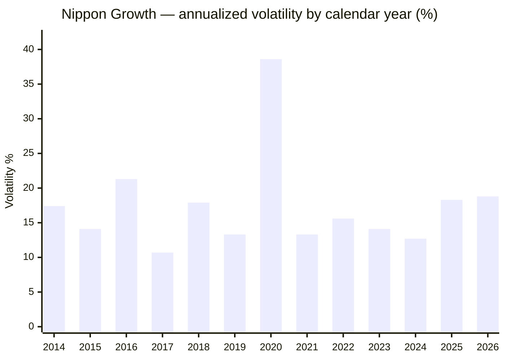
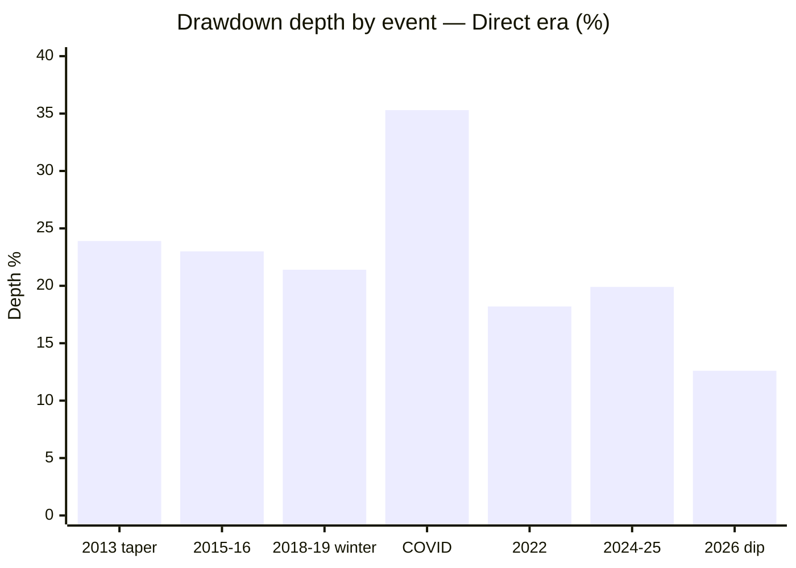
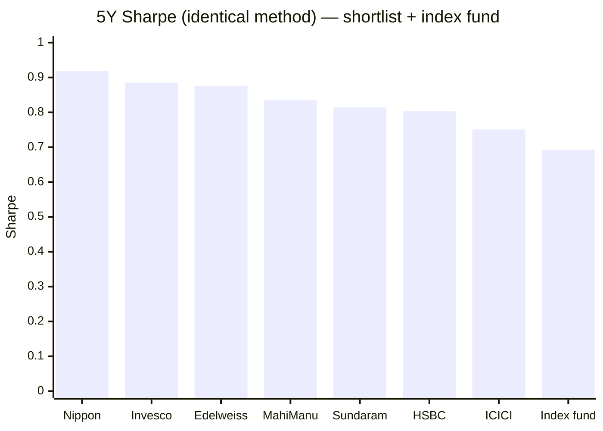
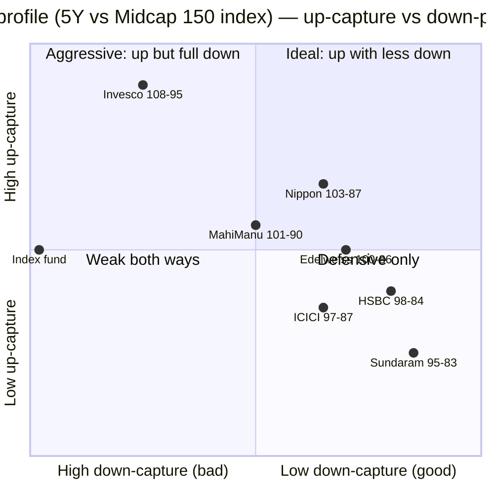

# Module 2: Risk Profile — Nippon India Growth Mid Cap Fund

## Module 2 Score: ~4.4 / 5 (provisional)

---

## Raw Data (Compiled Across Sources, as of 01/03-Jul-2026)

| Metric | Computed (MFAPI, monthly canonical) | Tickertape | Note |
|--------|-------------------------------------|------------|------|
| Volatility (5Y) | **16.32%** | 15.74% (own window) | Below the index fund's 16.7% |
| Volatility (full direct era) | 18.87% | — | The honest long-run number |
| Sharpe (5Y, rf 6.5%) | **0.918** | 0.264 (own window/method) | **#1 of 7 shortlisted** — see reconciliation |
| Sortino (5Y) | **1.529** | 0.027 (different scale) | **#1 of 7** |
| Calmar (5Y) | 1.08 | — | Index fund: 0.85 |
| Max drawdown (5Y) | **−19.9%** | premium-gated | **Lowest of all 7 peers** |
| Max drawdown (direct era) | −35.3% (COVID) | — | Recovered in 7 months |
| Beta vs Midcap 150 index | **0.96** | — | Slightly muted band exposure |
| R² vs Midcap 150 index | **95%** | — | Pure band vehicle |
| Tracking error (vs index, monthly) | **4.48%** | 2.71 (own window) | Index-aware active |
| Information ratio | **0.44** | — | +1.97% alpha ÷ 4.48% TE |
| Up / Down capture vs index (5Y) | **103% / 87%** | premium-gated | Widest spread (+16pts) of shortlist |
| Up / Down capture vs Nifty 50 (13.4y) | **115% / 84%** | — | The long-run case in two numbers |
| Negative months | 35% (56/162) | — | The SIP reality |
| PE | 29.3 | 29.3 | Category: 33.8 |
| % from ATH | **−0.7%** | — | Essentially at ATH |
| Category St Dev | — | 15.26% | All funds SEBI "Very High" |

**Method:** monthly returns (162 months, Feb-2013 → Jun-2026) are canonical, annualized ×√12; risk-free = 6.5%; peer metrics computed over the identical 5Y common window (Jul-2021 → Jul-2026) so ranks are like-for-like. Daily metrics shown only for reconciliation. Data: MFAPI 118668/100377; index counterfactual 147622; cross-sleeve series UTI Nifty 50 (120716), Parag Parikh FlexiCap (122639), DSP Small Cap (119212); peers as in Module 1.

**Published-source gap (documented):** Morningstar's risk-ratings page and VRO's risk/return grades are JS-rendered and could not be extracted; no third-party capture-ratio cross-check exists for this module. All capture/beta/Sharpe figures are computed from raw NAVs — the primary method in all four studies anyway. VRO's 5★ overall rating (fetched in Module 1) stands as the independent quality signal.

---

## The Module 2 Tension — Best Risk-Adjusted Fund, Worthless Diversifier

Both of these are true simultaneously, and the whole module lives between them:

1. **Standalone, Nippon is the best risk-adjusted fund in the shortlist** — #1 Sharpe, #1 Sortino, #1 (lowest) max drawdown over the common 5Y window, at 3–10× the AUM of every peer — and it *dominates the investable index fund on every single risk metric*.
2. **As a portfolio addition, it diversifies almost nothing** — R² of 86% to the DSP Small Cap sleeve and 76% to the Nifty. Unlike the International sleeve (Franklin: R² 11%), a midcap fund is a **return-enhancer, not a hedge**. This doesn't score against the fund — it frames what buying it means.

---

## Volatility — At or Below the Index, in Every Window

### Cross-Source Reconciliation (read before comparing any Sharpe/vol across sites)

| Source | Vol | Sharpe | Why they differ |
|--------|-----|--------|-----------------|
| Computed, monthly, 5Y, rf 6.5% | 16.32% | 0.918 | The canonical method of these studies |
| Computed, daily, 5Y | 16.32% | — | Coincidentally equal at 5Y; diverges elsewhere |
| Tickertape (own trailing window) | 15.74% | 0.264 | Shorter window, different rf, daily basis |

The *levels* differ across sources; the *ranks* agree. Tickertape had Nippon mid-pack on its Sharpe scale — the like-for-like 5Y computation puts it **#1 of 7**. Same lesson as the DSP module: Sharpe is only comparable within one method. (This also defuses the apparent contradiction of screening: HSBC's 0.848 TT-Sharpe "anomaly" collapses to 6th of 7 under the common method — see the sidebar below.)

### Volatility by Window

| Window | Monthly-ann | Daily-ann | Context |
|--------|-------------|-----------|---------|
| 3Y | 17.67% | 16.62% | Contains the 2024–25 correction + 2026 dip |
| **5Y** | **16.32%** | 16.32% | **Below the index fund (16.7%) over the same window** |
| 10Y | 19.03% | 16.90% | Contains COVID's 38.6%-vol year |
| Full direct (13.4y) | 18.87% | 16.89% | The honest long-run number |
| Since Sep-2019 (index-fund window) | 20.33% | — | Index fund itself: **20.86%** — Nippon again below |

An active fund running *below-index* volatility while producing *above-index* returns is the entire risk-efficiency story in one row. For category context: category St Dev 15.26% (Tickertape daily basis) — Nippon's 15.74% on the same basis is mid-pack among peers (Sundaram 15.2, Edelweiss 15.2 run lower; Invesco 16.9, ICICI 17.5 higher).

### Annual Volatility Regime (monthly-ann, per calendar year)

| Regime | Years | Vol | Reading |
|--------|-------|-----|---------|
| Calm mania | 2017 | **10.7%** | The quiet before the winter — low vol ≠ low risk |
| Normal band | 2014–16, 2018–19, 2021–24 | 12.7–21.3% | The structural midcap range |
| Crisis | 2020 | **38.6%** | COVID — vol triples in a crash |
| Current | 2025–26 | ~18.3–18.8% | Elevated vs the 2021–24 quiet; short-window metrics currently *understate* the fund |

Two implications: the fund's vol is **regime-driven, not manager-driven** — it tracks the band (R² 95%); and today's ~18% is above the recent norm, so any site quoting a short-window Sharpe is quoting the fund at a low ebb.

---

## Max Drawdown — The Shortlist's Shallowest, With a Documented Tail

### The Modern Era (Direct plan, 2013 →) — Every Drawdown ≥15%

| Event | Peak → Trough | Depth | Fall | Recovery | Total round trip |
|-------|--------------|-------|------|----------|------------------|
| Taper tantrum | Jan-2013 → Aug-2013 | −23.9% | 7 mo | 7 mo | 14 mo |
| 2015–16 China/credit | Aug-2015 → Feb-2016 | −23.0% | 7 mo | 5 mo | 12 mo |
| **2018–19 winter** | Jan-2018 → Oct-2018 | **−21.4%** | 9 mo | **16 mo** | 25 mo — the longest modern wait |
| **COVID** | Feb-2020 → Apr-2020 | **−35.3%** | 1 mo | 7 mo | 8 mo |
| 2022 rate hikes | Oct-2021 → Jun-2022 | −18.2% | 8 mo | 3 mo | 11 mo |
| **2024–25 correction** | Sep-2024 → Feb-2025 | **−19.9%** | 5 mo | 8 mo | 13 mo |
| 2026 mini-dip | Feb-2026 → Mar-2026 | −12.6% | 6 wk | 3 wk | ~2 mo |

**Modern-era summary: nothing deeper than −35.3%, every event recovered within 16 months, and the two most recent events were both shallower and faster than the index** (2024–25: −19.9% vs −21.0%, recovered 20-Oct-2025 vs 17-Nov-2025; 2026 dip: −12.6% vs −13.9%, 3 weeks vs 5).

### The COVID Event in Isolation

−35.3% in one month (Feb 20 → Apr 3, 2020) — the fastest fall in the fund's modern history; worst single day −11.6%, worst month −28.9% (Mar-2020). Then: +13.5% in Nov-2020 alone, full recovery by 13-Nov-2020 — **7 months trough-to-peak**. The 2020 calendar year closed at +22.9% — a year containing a −35% crash *ended positive*, which is the single best illustration of why exit-timing destroys midcap SIP returns.

### The 2018–19 Winter in Isolation

−21.4% depth but the *slowest* modern recovery (16 months) — grinding two-year stress, not a crash. The fund's index-relative performance through it (+5.0pts alpha 2018, +10.9pts 2019) was covered in Module 1; the risk-lens addition is that **depth was two-thirds of peers'** (Edelweiss/Sundaram fell −14.6/−14.8% in calendar 2018 alone vs Nippon's −10.3%).

### ⭐ The Documented Tail — 2008 and 2011 as the Asset-Class Base Rate *(new section — only possible for this fund)*

| Event (Regular plan) | Depth | Fall | Recovery |
|---------------------|-------|------|----------|
| **2008 GFC** | **−62.7%** | 14 mo | 18 mo (whole by Sep-2010) |
| **2011 rate/EU crisis** | −34.9% | 13 mo | **29 mo** (whole by May-2014) |

No shortlist peer can show you these numbers — their records don't reach. Two readings: (1) **this is what the midcap asset class does at GFC scale** — a −60%+ fall with a 2.5-year round trip; assume it applies to *every* fund in this study, documented or not; (2) since 2013 the fund's worst is roughly *half* the 2008 depth — consistent with both a maturing fund and a maturing market structure (SIP-flow stabilization). The tail is not a mark against Nippon; it is the honest denominator its young peers are silently missing. *(The same logic the SmallCap study applied against Bandhan's 24% "max drawdown.")*

### SIP Investor Experience During the COVID Crash

A ₹20K/month SIP running through 2020: the Mar/Apr instalments bought units ~35% below the February price; those two instalments alone were up ~50%+ by November's recovery. The 10Y SIP XIRR (21.08%, Module 1) *exceeds* the 10Y lumpsum CAGR (19.33%) precisely because of instalments like these — in this fund's history, **drawdowns have been the SIP investor's friend, provided the SIP kept running.**

---

## Worst & Best Rolling Periods (MFAPI, Direct era)

| Window | Worst | When (worst) | Best | % windows negative |
|--------|-------|--------------|------|--------------------|
| Rolling 1Y | **−27.65%** | COVID trough | +96.36% | 13.7% |
| Rolling 3Y | −5.55%/yr | window ending 03-Apr-2020 | +38.82%/yr | **2.7%** |
| Rolling 5Y | **+0.54%/yr** | window straddling winter + COVID | +37.07%/yr | **0.0%** |

**No negative 5-year window has ever occurred in this fund's direct-plan history** — and the worst 5Y outcome (+0.5%/yr) contains both the 2018–19 winter *and* COVID. The floor was stress-tested by real events, not calm markets.

---

## Daily Return Distribution (3,297 trading days)

| Statistic | Value | Reading |
|-----------|-------|---------|
| Worst days | **−11.6%**, −7.4%, −7.3% | All Mar-2020 |
| Best days | +5.1%, +4.9%, +4.6% | Crash rebounds |
| Days < −2% | 113 (3.4%) | Downside clusters |
| Days > +2% | 69 (2.1%) | Upside is slower |
| Worst months | **−28.9% (Mar-20)**, −11.5% (Mar-26), −11.1% (Sep-18), −10.6% (Feb-16), −9.7% (Feb-13) | Every stress era represented |
| Best months | +15.6% (May-14), +13.5% (Nov-20), +13.0% (Apr-26) | Immediately after falls |
| **Negative months** | **56 of 162 (35%)** | 1 in 3 statements red |

### The Asymmetry Paradox — Same as DSP and BOI

Daily/monthly downside is *more frequent and sharper* than upside (3.4% vs 2.1% of extreme days) — yet annual returns are strongly positive and capture ratios favor the fund. Resolution: the negative skew is the *market's*; the fund's edge is that its bad months are consistently ~10–15% smaller than the band's bad months (down-capture 87–90%), and that compounds into the +2%/yr alpha. Risk here is **felt in weeks, earned back in months, paid in years.**

---

## Sharpe Ratio — #1 of the Shortlist Under a Common Method

| Fund (5Y, monthly, rf 6.5%) | Sharpe |
|------------------------------|--------|
| **Nippon Growth** | **0.918** ⭐ |
| Invesco | 0.885 |
| Edelweiss | 0.876 |
| Mahindra Manulife | 0.836 |
| Sundaram | 0.814 |
| HSBC | 0.803 |
| ICICI Pru | 0.751 |
| **Nifty Midcap 150 index fund** | **0.693** |

### Sidebar — The HSBC Sharpe Artifact (screening postscript)

At screening, HSBC's Tickertape Sharpe (0.848, 3× the shortlist norm) was flagged as "the Union-SmallCap anomaly repeated." Under the common 5Y method it lands **6th of 7 (0.803) with the worst max drawdown (−26.0%)**. The anomaly was a short-window artifact of HSBC's blistering 1Y (+17.5%). Lesson (now twice-learned in these studies): screening-Sharpe outliers are window artifacts until proven otherwise — and the "anomaly question" assigned to HSBC's deep study is already half-answered.

---

## Sortino Ratio — The SIP-Relevant Metric

| Fund (5Y) | Sortino |
|-----------|---------|
| **Nippon Growth** | **1.529** ⭐ |
| Edelweiss | 1.440 |
| Invesco | 1.429 |
| Mahindra Manulife | 1.364 |
| Sundaram | 1.312 |
| HSBC | 1.276 |
| ICICI Pru | 1.253 |
| Index fund | 1.107 |

### Why Sortino Matters More Than Sharpe for SIP Investors

Sharpe penalizes upside volatility; a SIP investor is only hurt by *downside* deviation (upside vol is what instalments buy cheap). Nippon's gap between its Sortino rank-margin and Sharpe rank-margin (1.529 vs peers' 1.25–1.44) says its volatility is disproportionately of the *good* kind — sharp up-months, cushioned down-months. This is the ratio-form of the 103/87 capture asymmetry.

---

## Alpha & Information Ratio

| Metric | Value | Reading |
|--------|-------|---------|
| Alpha vs investable index (6.8y) | **+1.97%/yr** | Module 1's headline, restated in risk terms |
| Tracking error (monthly, ann.) | 4.48% | The risk spent to earn it |
| **Information ratio** | **0.44** | Respectable; >0.5 is "strong" for active equity |
| Tickertape alpha field | +1.93 | Independent agreement ✅ |

Contrast the study family's cautionary tale: Franklin US ran **16.8% tracking error for negative alpha** (high active risk, no reward). Nippon is the mirror image — modest active risk, consistently rewarded. Every rupee of active risk here has historically paid.

---

## Beta, R² & Tracking Error — The "Index-Aware Active" Fingerprint

| Metric | vs Midcap 150 index | Reading |
|--------|--------------------|---------|
| Correlation | 0.977 | |
| **R²** | **95%** | The fund *is* a pure band vehicle — zero style drift |
| **Beta** | **0.96** | Slightly muted band exposure — the defensive tilt, quantified |
| TE | 4.48% | Not a closet indexer (<2% would be), not a cowboy (>8%) |

The R²-95% / TE-4.5% / beta-0.96 triplet is the statistical picture of a fund that **accepts the band's factor exposure wholesale and spends its entire risk budget on name selection within it** — exactly what the 150-stock-pond thesis predicts a disciplined giant should look like.

> ⚠️ **The closet-index nuance:** R² 95% is *high*. TE 4.5% says there's real active management inside, but if Module 3 finds active share below ~40%, that TE is mostly weighting noise and the closet-index concern revives at 0.73% fees. This is the same style-or-size question Module 1 flagged, now with its risk-side evidence attached: **beta 0.96 + down-capture 87% is *either* deliberate discipline *or* the mechanical signature of size.** Module 3 decides.

---

## Calmar Ratio — Return per Unit of Maximum Pain

| Window | Nippon | Index fund | Reading |
|--------|--------|-----------|---------|
| 3Y | 1.16 | — | Strong |
| 5Y | **1.08** | 0.85 | 2nd of shortlist (Invesco 1.09) |
| Full direct era | 0.53 | — | Dragged by COVID's −35% against an 18.7% CAGR — the honest long-run figure |

---

## ⭐ The Index-Fund Dominance Test — Risk Edition *(new section, midcap-specific)*

Module 1 asked "why not the index fund?" and answered with +2%/yr of alpha. Module 2 completes the answer: over the common 5Y window the active fund was **superior on every axis simultaneously** —

| Axis (5Y) | Nippon | Index fund | Winner |
|-----------|--------|-----------|--------|
| Return (CAGR) | 21.48% | ~19.0% | Nippon |
| Volatility | 16.3% | 16.7% | Nippon |
| Max drawdown | −19.9% | −21.2% | Nippon |
| Sharpe | 0.918 | 0.693 | Nippon |
| Sortino | 1.529 | 1.107 | Nippon |
| Calmar | 1.08 | 0.85 | Nippon |
| Down-capture | 87% | 100% | Nippon |

**Strict dominance: more return at less risk.** Two honest caveats: (1) it's one 5-year window; (2) that window contained two corrections and a grind — precisely the regime this fund's defensive style is built for. A pure 2017-style mania would likely flip the return row (2020's −3.2 alpha is the preview). The dominance is real but *regime-assisted* — which is fine for a SIP investor, whose 10-year horizon will contain several such regimes.

---

## Capture Ratios — ⭐ The Two-Benchmark Asymmetry

| Benchmark | Window | Up-capture | Down-capture | Spread |
|-----------|--------|-----------|--------------|--------|
| Nifty Midcap 150 index | 5Y monthly | **103%** | **87%** | **+16pts — widest of shortlist** |
| Nifty Midcap 150 index | 6.8y (full proxy life) | 99% | 90% | +9pts |
| **Nifty 50 (UTI index)** | **13.4y monthly** | **115%** | **84%** | **+31pts** |

The 13.4-year row against *large-caps* is the long-run case in two numbers: the fund captured **115% of Nifty up-months and only 84% of Nifty down-months** — earning the midcap premium while shedding a sixth of large-cap downside. That asymmetry, compounded 13 years, is how ₹32L of SIP became ₹140L.

> Reading the quadrant: Invesco buys its higher up-capture with near-full downside (the offense build); Sundaram protects but can't keep up (defense-only); **Nippon and Edelweiss sit in the ideal quadrant — up-market participation with real down-market protection — with Nippon higher on both.** The Nippon-vs-Invesco contrast is shaping up as the study's final.

For cross-study calibration: Parag Parikh's famous 59% down-capture vs the Nifty was built with structural buffers (cash + foreign equity); DSP Small Cap ran ~85% vs its SC index; Franklin ran >100% (worse than its index). Nippon's 84–90% with a **~99%-invested, buffer-free book** is the cleanest *pure-stock-selection* asymmetry among them.

---

## PE Ratio — A Relative Valuation Buffer

| Metric | Value |
|--------|-------|
| Portfolio PE | **29.3** |
| Category PE | 33.8 |
| Discount to category | **~13%** |

The fund holds the cheaper end of an expensive band. This is consistent with everything else in its fingerprint (muted beta, low down-capture, PE discipline) — and it's the mechanism by which the 2018/2022/2024 protection likely happened: froth avoidance. Caveat from the PP study applies: a PE discount is a *buffer*, not a guarantee, and can also mark a value trap; here it coexists with top-quartile returns, which argues buffer.

---

## ATH Distance — The Health Check

Current NAV is **−0.7% from its all-time high** (4,955 vs 4,989) — the drawdown overhang is zero. Combined with the elevated-but-normalizing vol regime (18.8% YTD vs 38.6% in 2020) and the PE discount, the fund enters the second half of 2026 with a clean risk posture. (Flip side: there is no "discount to ATH" cushion for a new lumpsum — irrelevant for a SIP.)

---

## Structural Risk — The No-Buffer Reality

Composition (Tickertape): ~98.7% equity (58.1% midcap + 27.7% largecap + 12.9% smallcap per TT's own classification), cash ~1%. **There is no structural cushion** — no cash buffer (PP holds 5–15%), no debt allocation, no foreign sleeve. When the band falls 35%, this fund will fall ~30–33% (beta 0.96 × capture 87–90%), full stop. All of its downside protection is *stock-selection-based*, none of it is *allocation-based*. The ~28% large-cap allocation is the only quasi-buffer — and whether it's deliberate ballast or capacity spillover is a Module 3 question (the "35% sleeve personality" analysis).

Redemption/liquidity risk — the SmallCap module's big section — is structurally minor here: midcaps are liquid, AUM is sticky SIP-heavy retail, and the fund is at ATH. Noted and closed.

---

## ⭐ Cross-Sleeve Correlation — The Decision-Tree Feed *(new section, no sibling equivalent)*

Monthly correlations of Nippon against the holdings this portfolio already has:

| Existing holding | Corr | **R²** | Beta | Months | Meaning |
|------------------|------|--------|------|--------|---------|
| Nifty 50 (UTI index) | 0.872 | **76%** | 1.04 | 162 | Mostly the same domestic-equity risk |
| Parag Parikh FlexiCap | 0.821 | **67%** | 1.19 | 158 | Lowest overlap — PP's cash/foreign sleeves differentiate |
| **DSP Small Cap** | **0.927** | **86%** | 0.82 | 162 | **Near-duplicate risk factor** |
| Midcap 150 index | 0.977 | 95% | 0.96 | 82 | (its own band) |

**The quantified answer to the deferred Phase-0 question: a midcap sleeve adds return texture, not diversification.** Nippon moves with the existing DSP Small Cap sleeve 86% of the time (and *is* the smallcap factor at 0.82 beta with better manners). Against Franklin US (R² 11% to the Nifty) this is night and day. If midcap earns a slot in the final portfolio, it earns it as a **return-enhancer with better drawdown behavior than small-cap** — never as a hedge. *(Informational: feeds decision_tree.md, does not score the fund.)*

---

## Risk Metrics — Complete Peer Comparison

### Full 7-Fund Matrix (5Y common window, monthly, rf 6.5%)

| Fund | Vol | Sharpe | Sortino | MaxDD | UpCap | DnCap | Calmar |
|------|-----|--------|---------|-------|-------|-------|--------|
| **Nippon** | 16.3% | **0.918** | **1.529** | **−19.9%** | 103% | 87% | 1.08 |
| Invesco | 17.4% | 0.885 | 1.429 | −20.1% | **108%** | 95% | **1.09** |
| Edelweiss | 16.1% | 0.876 | 1.440 | −20.1% | 100% | **86%** | 1.03 |
| Mahindra Manulife | 16.4% | 0.836 | 1.364 | −20.9% | 101% | 90% | 0.96 |
| Sundaram | **15.7%** | 0.814 | 1.312 | −20.7% | 95% | 83% | 0.93 |
| HSBC | 17.0% | 0.803 | 1.276 | **−26.0%** ⚠ | 98% | 84% | 0.78 |
| ICICI Pru | 16.7% | 0.751 | 1.253 | −21.3% | 97% | 87% | 0.89 |
| [Index fund] | 16.7% | 0.693 | 1.107 | −21.2% | 100% | 100% | 0.85 |

### Nippon's Rank on Each Metric (1 = best of 7)

| Metric | Rank | Note |
|--------|------|------|
| Sharpe | **1** | |
| Sortino | **1** | |
| Max drawdown | **1** (shallowest) | |
| Capture spread | **1** (+16pts) | |
| Calmar | 2 | Invesco by 0.01 |
| Volatility | 4 | Mid-pack — its efficiency is return-per-risk, not raw low-risk |
| Up-capture | 2 | Invesco leads |

**A fund this large has no business topping this table — and it does.** The nearest rival (Invesco, ₹12,397 Cr) runs the offense build; Edelweiss (₹16,849 Cr) is the closest stylistic twin at a third of the size.

---

## Comparison with Studied Funds (All Four Categories)

| Dimension | **Nippon (MidCap)** | DSP Small Cap | Parag Parikh | Franklin US |
|-----------|--------------------|--------------|--------------|-------------|
| Vol (5Y, monthly) | 16.3% | ~16% | ~11–12% | 17.2% (monthly INR) |
| Max DD (modern) | **−35.3%** (COVID) | −49.1% | ~−35% (COVID, 5-wk recovery) | −38.4% |
| Worst-case documented | −62.7% (2008) ✅ | −49% (2018+COVID) | n/a (2013 vintage) | no GFC/dot-com ⚠ |
| Down-capture | 87–90% vs band; 84% vs Nifty | ~85% vs SC index | **~59% vs Nifty** ⭐ | >100% vs S&P ❌ |
| Buffer type | **None — pure selection** | small cash | cash + foreign | none |
| Sharpe (5Y, common basis) | **0.918** | ~0.7–0.8 | high (low vol) | ~0.5 |
| Diversification value | ~None (R² 76–86%) | none | none (is the core) | **elite (R² 11%)** ⭐ |
| Recovery discipline | ≤16 mo modern | up to 2–3 yr | 5 wk (COVID) | 5×20%+ DDs |

**Placement:** PP remains the risk king overall — but its crown is *allocation-built* (cash/foreign buffers). Nippon achieves the second-best downside profile in the family through *selection alone*, inside a fully-invested very-high-risk band, at giant scale. DSP accepts nearly double the drawdown for similar long-run returns. Franklin is the anti-pattern: high active risk, negative reward, but real diversification — the exact inverse of Nippon on every axis.

---

## Risk Profile — Points For and Against

### ✅ Points IN FAVOUR

- **#1 Sharpe, #1 Sortino, #1 (lowest) max drawdown** of the shortlist under a common method — at 3–10× peer AUM
- **Strictly dominates the investable index fund** on all seven risk axes over 5Y
- **Widest capture asymmetry of the shortlist** (+16pts vs band; 115%/84% vs Nifty over 13.4 years)
- Below-index volatility in every window measured
- Every modern drawdown recovered ≤16 months; beat the index in depth *and* recovery in the last two corrections
- **No negative 5Y rolling window ever** (worst: +0.54%/yr, containing winter + COVID)
- PE 29.3 vs category 33.8 — holds the cheaper end of an expensive band
- At ATH (−0.7%) — zero drawdown overhang
- Tail risk *documented* (2008: −62.7%), not hidden by a short record
- Information ratio 0.44 — every unit of active risk historically paid

### ⚠️ Points AGAINST

- **No structural buffer** — ~99% equity, ~1% cash; all protection is selection-based and can fail in a liquidity-driven crash (2008: fell −54% with the market)
- −35.3% (COVID) is the *modern* worst; **−62.7% is the honest asset-class tail**
- 35% of months negative; worst month −28.9% — the SIP emotional toll is real
- Defensive style lags violent recoveries (2020: worst index-relative year) — a strong mania year would flip the dominance table's return row
- **R² 95% to the index keeps the closet-index question alive** at 0.73% fees, pending Module 3's active-share verdict
- Diversification value vs the existing portfolio ≈ nil (R² 86% vs DSP Small Cap sleeve) — this purchase would concentrate, not spread, domestic equity risk
- 3Y vol (17.7%) trending above the 5Y (16.3%) — the current regime is choppier
- No published third-party capture/risk-grade cross-check obtainable (Morningstar/VRO JS-blocked)

---

## Module 2 Scorecard

| Sub-dimension | Weight | Score | Reasoning |
|---------------|--------|-------|-----------|
| Max Drawdown (inception-adjusted) | High | **4.0** | Full-era −35.3% at the 35–42% band edge; **5Y −19.9% best of peers**; 2008 tail documented, treated as asset-class base rate, not penalized |
| **Down-capture vs own index** | **Critical** | **4.5** | 87% (5Y) / 90% (6.8y) — at the excellent boundary, widest spread of shortlist, replicated vs Nifty (84%) over 13.4y |
| Sharpe | High | **5.0** | 0.918 — #1 of 7; index fund 0.693; dominance across every window tested |
| Sortino | Medium | **5.0** | 1.529 — #1 of 7; the asymmetry is of the SIP-friendly kind |
| Recovery time from max DD | Medium | **4.5** | Modern worst 16 mo (2018–19 grind); last two events 8 mo and 3 wk, both faster than the index |
| 2018–19 winter drawdown | Critical | **4.5** | −21.4% depth ≈ two-thirds of peers'; +5.0/+10.9 index alpha through it (Gunwani era — attribution note stands) |
| Volatility vs category | Medium | **4.0** | At/below index every window; mid-pack vs peers (its efficiency is return-per-risk, not raw low vol) |
| Effective risk of the 35% sleeve | Medium | *deferred* | ~28% large-cap = quasi-ballast, but deliberate-vs-spillover needs M3 holdings |
| Cross-sleeve correlation | Informational | — | R² 86% vs DSP SC → decision tree; not scored |

**Module 2 Score: ~4.4 / 5** — the strongest risk module of the four studies *on a pure-selection basis* (Parag Parikh's superior headline numbers are allocation-built). Held below higher by the buffer-free structure, the COVID-scale modern drawdown, and the R²-95% closet-index question that only Module 3 can close.

---

## Comparative Module 2 Scores

| Fund | Category | M2 Score | Risk character |
|------|----------|----------|----------------|
| **Nippon Growth Mid Cap** | MidCap | **~4.4** | Pure-selection downside discipline at scale; no buffer |
| Parag Parikh FlexiCap | FlexiCap | ~4.5 | Allocation-built fortress (cash + foreign) |
| DSP Small Cap | SmallCap | ~3.9 | Disciplined but deep-drawdown asset class |
| Franklin US Opp | International | 3.3 | Mediocre standalone, elite diversifier |

---

## SIP Implication

1. **Expect one-third of months red and a −20% episode roughly every 2–3 years** — that is this fund's operating rhythm, and its 21.08% 10Y SIP XIRR was earned *through* it, not around it.
2. **Never stop the SIP in a drawdown** — every modern drawdown recovered ≤16 months, and the crash-month instalments are precisely where the XIRR premium over lumpsum came from.
3. **Size the sleeve knowing it hedges nothing** — R² 86% vs the small-cap sleeve means a midcap allocation raises the portfolio's domestic-equity concentration. Its job is return-per-unit-of-drawdown, at which it is currently the best instrument measured in these studies.
4. **The tripwire stands:** if Module 3 finds low active share, the 0.73% fee for R²-95% exposure loses its justification to the 0.2% index fund — *despite* the 5Y dominance table. Style-or-size remains the study's hinge.

---

## One-Line Verdict

> **Nippon Growth's risk profile is the study family's cleanest demonstration of selection-built downside discipline: #1 Sharpe (0.918), #1 Sortino (1.529), and the shallowest drawdown (−19.9%) of the shortlist at 3–10× peer size, strict 5Y dominance over the investable index fund on every axis, a +16pt capture spread (115%/84% vs the Nifty over 13.4 years), no losing 5-year window ever, and a documented 2008 tail its young peers can't show — bought with a buffer-free ~99% equity structure, a 35%-of-months-negative rhythm, near-nil diversification value against the existing sleeves (R² 86% vs DSP Small Cap), and an R²-95% index coupling that keeps the closet-index question open for Module 3. Provisional: ~4.4/5.**

---

*Module 2 completed: July 3, 2026 | Risk Profile | MFAPI methodology — monthly canonical (162 months Feb-2013 → Jun-2026), rf 6.5%, peers on identical 5Y common window | Series: Nippon 118668/100377, index counterfactual 147622, UTI Nifty 50 120716, PP FlexiCap 122639, DSP Small Cap 119212, peers per Module 1 (HSBC = L&T spliced Nov-2022) | Tickertape cross-checks: alpha +1.93 (computed +1.97 ✅), vol/Sharpe/TE reconciled as window artifacts | Morningstar & VRO risk pages JS-blocked — computed metrics primary | Provisional M2 Score: ~4.4/5 (deferred items: 35%-sleeve risk → M3; closet-index question → M3 active share)*
