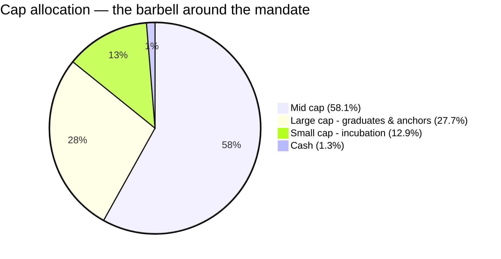
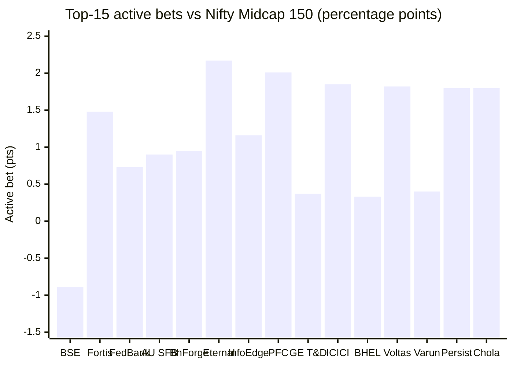

# Module 3: Portfolio DNA — Nippon India Growth Mid Cap Fund

## Module 3 Score: ~4.1 / 5 (provisional)

---

## Raw Data (Compiled Across Sources, as of 03-Jul-2026)

| Metric | Value | Source |
|--------|-------|--------|
| **Equity holdings** | **96 stocks** (98.7% equity) | Tickertape holdings API (current snapshot) |
| Cash & equivalents | ~1.3% | Same (Groww detail: repo 1.17% + margin 0.26% − payables 0.44%) |
| **Top-10 concentration** | **23.1%** — lowest measured in any of the four studies | Computed from full holdings |
| Top-3 / Top-5 / Top-20 | 8.5% / 13.0% / 40.6% | Computed |
| Largest holding | BSE Ltd, 3.32% | Computed |
| Median / smallest position | 0.87% / 0.12% (Sanofi India) | Computed |
| **Active share vs Nifty Midcap 150** | **54.1%** | Computed vs the Motilal index fund's 150 constituents |
| Holdings inside the index | 61 of 96 = 67.9% of equity weight | Computed |
| Cap allocation (Tickertape bands) | Mid 58.1% / Large 27.7% / Small 12.9% | Tickertape screener |
| **Portfolio turnover** | **13.66%** (≈7-year avg holding period) | Two aggregators; AMC factsheet 403-blocked ⚠ |
| Portfolio PE | 29.3 (category 33.8) | Tickertape |
| Max granular sector | Specialized Finance, 8.1% | TT sector distribution |
| Managers | Rupesh Patel (Jan-2023), **Amber Singhania (Mar-2026, new)**, Kinjal Desai (May-2018, overseas) | Groww |

**Data provenance & gaps:** full 96-position holdings with exact weights from Tickertape's holdings API; the index reference is the **Motilal Nifty Midcap 150 Index Fund's own live constituents** (150 names with weights) — so the active-share computation compares two real, investable books. PP FlexiCap (79 equity positions) and DSP Small Cap (83) pulled the same way for overlap. **Gaps:** the AMC's official factsheet page is bot-blocked, so the AMFI-basis cap split and official PTR are unverified (aggregator turnover 13.66% is double-sourced); Groww's holding count (103) vs the current snapshot (96) reflects different disclosure dates.

---

## The Core Thesis — A Breadth Machine With a Graduation Escalator

Nippon Growth's portfolio is what disciplined mid-cap investing looks like **at ₹47,415 Cr**: a 96-stock breadth machine with no position above 3.3%, no granular sector above 8.1%, near-zero cash, a liquid-end band tilt, a two-way "graduation escalator" running through the flexible sleeve (incubate small-caps below the band → hold winners as they climb out of it), and a 13.66% turnover that makes the whole structure legible as *policy* rather than drift. It is the exact portfolio Module 1's defensive alpha and Module 2's 90% down-capture predicted — and it answers the study's hinge question: **active share 54.1% — genuinely active, not a closet indexer. The size effect is real but managed.**

---

## ⭐ The Active-Share Verdict — The M1/M2 Hinge, Resolved

Modules 1 and 2 both ended on the same conditionality: is the defensive alpha a *style* or a *size artifact*, and is the fund a closet indexer at 0.73% fees? The computation (Σ|w_fund − w_index| ÷ 2, both books normalized to 100% equity):

| Measure | Value | Rubric position |
|---------|-------|-----------------|
| **Active share** | **54.1%** | 45–60% = moderately active; **decisively above the <35–40% closet-index fail line**; below the >60% high-conviction bar |
| Overlap with index (names) | 61 of 96 stocks | |
| Overlap with index (weight) | 67.9% in-index / **32.1% off-index** | The off-index third is the personality |

**Verdict on the style-or-size question: *both, manageably.*** The fund runs genuine, paid-for name selection (54.1% AS, and Module 2's information ratio of 0.44 says the market has rewarded it) — executed inside the liquidity-feasible half of the pond (see Band Positioning). The closet-index scenario is dead; the fee-vs-index-fund case from Modules 1–2 stands. The live risk is now **trajectory** (active-share decay as AUM grows), which Module 4 owns.

Reconciliation with Module 2's R² of 95%: high R² and 54% active share coexist because the active bets are *within-band and beta-neutral* — the fund accepts the band's factor exposure wholesale and spends its entire risk budget on name selection. High-R², mid-AS, positive-IR is the statistical definition of disciplined "index-aware active."

---

## Asset Allocation — Near-Fully Invested, No Buffer (M2 Confirmed)

| Asset class | Weight |
|-------------|--------|
| Equity | **98.7%** |
| Cash & equivalents | ~1.3% |
| Debt / other | 0% |

Quarterly history shows equity oscillating only between 97.7% and 98.9% — the fund holds **no tactical cash, ever**. Module 2's "no structural buffer" finding is confirmed at the holdings level: all downside protection is selection-based. (Contrast: DSP Small Cap 8.4% cash, PP FlexiCap 5–15% cash+arbitrage.) The SEBI target allocation rows confirm the standard 65–100% equity mandate.

---

## Cap Allocation — The Flexible Sleeve as a Two-Way Graduation Escalator

| Band (Tickertape classification) | Weight | What's actually in it |
|----------------------------------|--------|----------------------|
| Mid cap | **58.1%** | The 65% mandate engine (see honesty note) |
| **Large cap** | **27.7%** | ICICI Bank, PFC, Eternal, Varun Beverages, Info Edge, Hyundai, Cummins — **half are the fund's own graduated midcap winners** |
| Small cap | **12.9%** | The incubation end — tomorrow's band entrants |
| Cash | ~1.3% | |

**Mandate-honesty note:** TT's 58.1% "midcap" uses TT's own bands, not AMFI's — the regulatory ≥65% test uses AMFI's semi-annual list, and two independent signals say the mandate is honored: 67.9% of equity weight sits inside the actual Midcap-150 index constituents, and the fund operates under live SEBI categorization. The official AMFI split is the one number the blocked factsheet withholds — flagged, not alarming.

**⭐ The Graduation Escalator (new section — this fund's defining portfolio mechanism):** most mid-cap funds face a structural dilemma when a holding grows out of the band — sell a winner (momentum loss + transaction cost) or hold it (mandate pressure). Nippon's book shows a *systematized* answer running in both directions:

- **Upward:** Eternal (Zomato), PFC, ICICI Bank, Varun Beverages — large-caps today, several of them band names when accumulated — held at 1.8–2.2% each as the thesis runs, inside the 35% flexibility.
- **Downward:** a 12.9% small-cap tail of sub-band names being incubated before index entry.
- **The evidence it's policy, not drift:** turnover of 13.66% (≈7-year holding period) and 3-month changes showing *gradual* recycling (adds: MCX +1.50, Eternal +1.10, Info Edge +1.03, Mankind +0.95; trims: Hyundai −0.75, Ashok Leyland −0.67 — winners exiting slowly, not dumped).

Risk-lens closure for Module 2's deferred row: the sleeve is **ballast-shaped** (large 28% > small 13%), lowering effective portfolio risk versus a pure-band book — consistent with the measured beta of 0.96 and the 87–90% down-capture. This is a *deliberate* risk dial set to "dampen."

---

## ⭐ Band Positioning — The Size Fingerprint, Quantified *(new section)*

Splitting the in-index 67.9% by index-weight rank (a fair proxy for market-cap rank 101→250):

| Band segment | Weight (of equity) | Reading |
|--------------|--------------------|---------|
| "Ranks 101–150" (top-50 index names) | **40.1%** | The liquid mega-mid end — **the fund's center of gravity** |
| "Ranks 151–200" (middle-50) | 19.9% | Moderate presence |
| "Ranks 201–250" (bottom-50: deep mids, fresh graduates) | **7.9%** | **Nearly abandoned** |
| Off-index (large + small + new listings) | 32.1% | The escalator (§ above) |

This is the **size hypothesis confirmed — in its mild form**. A ₹4,866 Cr rival (Mahindra Manulife) can build 2% positions in rank-230 names; Nippon cannot (2% of AUM = ₹950 Cr ≈ several days of a deep-mid's trading volume), so it doesn't try. The consequence chain: size → liquid-end tilt → steadier names → lower down-capture. **Part of Module 1's "defensive alpha" is therefore structural, not chosen — but Module 2 showed the fund still beats the index and all six smaller peers on risk-adjusted terms, so the constraint is being managed into an advantage rather than suffered.** The number to watch: this 40/20/8 split shifting further top-heavy as AUM grows.

---

## Top 20 Holdings — Stock-by-Stock, as Active Bets

The most informative way to read a mid-cap book (every peer picks from the same 150 names) is each position **relative to its index weight**:

| # | Holding | Weight | Index wt | **Active bet** | 3M change | Note |
|---|---------|--------|----------|----------------|-----------|------|
| 1 | BSE Ltd | 3.32% | 4.21% | **−0.89** | +0.06 | **Underweights the index's biggest, hottest name** — froth discipline |
| 2 | Fortis Healthcare | 2.68% | 1.20% | +1.48 | −0.22 | Hospital compounder — classic within-band conviction |
| 3 | Federal Bank | 2.50% | 1.77% | +0.73 | −0.30 | Quality regional bank |
| 4 | AU Small Finance Bank | 2.28% | 1.39% | +0.90 | −0.11 | |
| 5 | Bharat Forge | 2.25% | 1.30% | +0.95 | −0.12 | Auto/defense forging |
| 6 | **Eternal (Zomato)** | 2.17% | **off-index** | **+2.17** | **+1.10** | Graduated winner, being *added* |
| 7 | Info Edge | 2.10% | 0.95% | +1.16 | +1.03 | Naukri/99acres platform |
| 8 | **Power Finance Corp** | 2.01% | **off-index** | +2.01 | −0.08 | Large-cap value/dividend anchor |
| 9 | GE Vernova T&D | 1.95% | 1.59% | +0.37 | +0.27 | Grid capex cycle |
| 10 | **ICICI Bank** | 1.85% | **off-index** | +1.85 | +0.88 | The liquidity anchor, being added |
| 11 | BHEL | 1.85% | 1.51% | +0.33 | +0.58 | Power capex turnaround |
| 12 | Voltas | 1.82% | 0.71% | +1.11 | −0.64 | Being trimmed after run |
| 13 | **Varun Beverages** | 1.82% | **off-index** | +1.82 | +0.28 | Graduated consumer compounder |
| 14 | Persistent Systems | 1.80% | 1.41% | +0.40 | +0.03 | Midcap IT |
| 15 | **Chola Financial Holdings** | 1.80% | **off-index** | +1.80 | −0.19 | Holding-co discount play |
| 16 | Max Financial | 1.73% | 1.10% | +0.63 | −0.37 | Life insurance |
| 17 | Mankind Pharma | 1.70% | 0.67% | +1.03 | +0.95 | Being built |
| 18 | NTPC Green Energy | 1.69% | 0.24% | +1.45 | +0.18 | Energy-transition bet |
| 19 | Indus Towers | 1.68% | 1.42% | +0.25 | −0.18 | |
| 20 | **Cummins India** | 1.61% | **off-index** | +1.61 | +0.16 | Graduated industrial |

**Two signatures worth naming:**
1. **The BSE underweight** — the index's largest weight (4.21%, the band's hottest momentum story) is the fund's *only* material top-15 underweight. This is Module 1's froth-avoidance (2018 LTCG year, 2022, 2024 top) visible at single-stock resolution, and the portfolio-level mechanism of the PE discount (29.3 vs 33.8).
2. **The off-index names ARE the biggest bets** — Eternal +2.17, PFC +2.01, ICICI +1.85, Varun +1.82, Chola +1.80, Cummins +1.61. The fund's conviction lives in the escalator, not in doubling band names the index already owns.

### Position-Size Architecture

| Position size | Count | Reading |
|---------------|-------|---------|
| ≥2% | 8 | The conviction top |
| 1.5–2% | 15 | The working core (top-23 ≈ 45%) |
| 1–1.5% | 17 | |
| 0.5–1% | 33 | The breadth engine |
| <0.5% | 23 | Incubation toeholds + exit tails |

A deliberate pyramid: conviction expressed in the top ~23 names, optionality warehoused in ~56 sub-1% positions the giant can actually trade in and out of without price impact.

---

## Sector Allocation — Nothing Above 8.1%; the Anti-DSP

| Granular sector (TT) | Weight |
|----------------------|--------|
| Specialized Finance (PFC, Chola…) | **8.1%** |
| Auto Parts | 7.4% |
| Pharmaceuticals | 7.2% |
| Private Banks | 6.6% |
| Power Generation | 5.1% |
| IT Services & Consulting | 4.4% |
| Home Electronics & Appliances | 4.4% |
| Investment Banking & Brokerage | 4.4% |
| Labs & Life Sciences | 4.0% |
| Online Retail | 3.8% |
| *~48 further sectors* | remainder |

Grouped, the **financials cluster ≈ 22–25%** (specialized finance + private banks + broking + insurance) — the only aggregation approaching the 25% rubric line, and roughly index-like (the Midcap 150 is itself finance-heavy). Everything else is spread thin.

**The contrast that defines it:** DSP Small Cap runs a 34.2% consumer-cyclical *thesis*; PGIM's underlying runs ~35% semiconductors. **Nippon carries no thesis-sized sector bet at all.** Its sector risk is approximately the index's; 100% of its active risk budget is name-level. That is both the safest possible construction for a giant and the reason its alpha will never be spectacular — breadth caps both tails. The 8.1%-max-sector and the +2%/yr-alpha-at-90%-down-capture are the same fact seen from two angles.

---

## Portfolio Turnover — 13.66%: The Lowest-Churn Book in the Studies

| Fund | Turnover | Implied avg holding period |
|------|----------|----------------------------|
| **Nippon Growth** | **13.66%** | **~7 years** |
| PP FlexiCap | ~20% | ~5 years |
| DSP Small Cap | ~25–30% | ~3.5–4 years |
| PGIM Global (underlying) | ~100% | ~1 year |

Three implications: (1) **transaction-cost discipline** — at ₹47K Cr inside a band of limited liquidity, every 10pts of turnover is real money; the hidden-cost drag the SmallCap study modeled is minimized here by construction; (2) **conviction confirmation** — the graduation escalator only makes sense at low churn, and the 3-month deltas show glacial, directional repositioning rather than whipsaw; (3) **manager-transition reassurance** — a 13.66% turnover across the Gunwani→Patel handover (Jan-2023) and the Singhania→Gunwani one before it is how the "house process" fingerprint (M1's alpha persisting across eras) is physically implemented: the book barely changes hands.

⚠ Caveat: 13.66% is an aggregator "holdings turnover"; the AMC's official PTR (blocked page) may print somewhat differently. The magnitude — *very low* — is safely double-sourced.

---

## AUM Scalability — The Portfolio *Is* the Capacity Answer (M4 Preview)

Six facts from this module, one cause:

| Observation | The size logic |
|-------------|----------------|
| 96 stocks | Can't deploy ₹47K Cr in 40 names without owning companies outright |
| Nothing above 3.3% | 2% of AUM = ₹950 Cr ≈ 2–4% of a typical midcap's market cap |
| Median position 0.87% (₹412 Cr) | The tradable unit |
| 40/20/8 liquid-end band tilt | Deep mids can't absorb the ticket size |
| Graduated large-caps retained | Double duty: winners + **liquidity anchors** (ICICI can absorb any redemption) |
| 13.66% turnover | Trading is expensive at this size; so trade rarely |

**Every row is what a skilled manager does when the fund is too big to be nimble — and Modules 1–2 prove it currently works** (#1 Sharpe, +2.1%/yr alpha, at 3–10× peer size). The open question is trajectory, not state: each incremental ₹10K Cr pushes the 40/20/8 split top-heavier and the 54.1% active share lower. **Module 4's job: AUM growth rate vs these two decay metrics.**

---

## PE Ratio — The Valuation Buffer, Portfolio Edition

Portfolio PE **29.3 vs category 33.8** (~13% discount) — now traceable to specific decisions: underweight BSE (the band's most expensive momentum name), overweight unglamorous compounders (Fortis, Federal Bank, Bharat Forge), and a PFC/Chola value block in specialized finance. The discount is *constructed*, not accidental — the same discipline that produced the 2018/2022/2024 downside protection. (PP-study caveat applies: a PE discount is a buffer, not a guarantee.)

---

## Cash Holding — 1.3%: No Dry Powder, By Policy

Quarterly equity allocation has stayed 97.7–98.9% through a correction, a recovery, and a manager change. The fund takes **no timing positions whatsoever** — pure stock selection, always invested. For a SIP investor this is arguably correct (your instalments are the rupee-cost-averaging; the fund doesn't double-time the market), but it means **nothing cushions a crash except the stock picks** — Module 2's finding, now confirmed as deliberate policy rather than accident.

---

## ⭐ Cross-Sleeve Overlap — Name-Overlap vs Factor-Overlap *(new section — the reconciliation insight)*

Computed name-by-name against the actual current books of the portfolio's existing sleeves:

| vs existing sleeve | Common stocks | **Name-overlap weight** | Return correlation (M2) |
|--------------------|---------------|--------------------------|--------------------------|
| PP FlexiCap (79 positions) | 5 | **2.0%** (ICICI Bank 1.9% + traces) | R² 67% |
| DSP Small Cap (83 positions) | 7 | **5.2%** (Gland 1.3, Max Fin 1.1, IPCA 1.0, Angel One 0.6…) | R² **86%** |

**The two measures point opposite ways, and both are true.** You would own almost none of the same companies twice — 2–5% by weight, trivial next to the International study's finding that Franklin directly duplicated PP's Microsoft/Amazon/Meta. Yet the sleeves would still fall together (86% monthly correlation), because Indian mid- and small-caps share one macro engine — flows, rates, risk appetite.

**So a Nippon sleeve duplicates *risk*, not *holdings*:** it concentrates the portfolio's India-equity factor while genuinely diversifying company-specific risk. That is the precise mechanism behind the "return-enhancer, not diversifier" verdict — and it cuts both ways: no wasted overlap (unlike Franklin), no hedging value (unlike Franklin). *(Decision-tree feed; not scored on the fund.)*

---

## The Manager Fingerprint — Whose Book Is This? (M5 Preview)

The book's character — breadth, low churn, froth-underweights, the escalator — **predates and postdates every manager change** (M1 showed the defensive alpha in the Gunwani era and the Patel era alike; the turnover style makes regime change physically slow). Note also the bench evolution: **Amber Singhania added as co-manager in Mar-2026** (new datum), Kinjal Desai on the overseas sleeve since 2018. A 96-stock, 13.66%-turnover book is inherently *team-and-process* run, not star-run — the structural reason the fund survived losing two celebrated managers (Singhania 2017, Gunwani 2023) without a visible NAV scar. Module 5 tests this properly.

---

## Comparison with Studied Funds

| Dimension | **Nippon (MidCap)** | DSP Small Cap | PP FlexiCap | PGIM Global (u/l) | Franklin US (u/l) |
|-----------|--------------------|--------------|-------------|--------------------|--------------------|
| Stocks | **96** | 83 | ~25 core | 39 | 84 |
| Top-10 | **23.1%** ⭐ lowest studied | ~30% | ~35% | 49.8% | 44.2% |
| Max sector | **8.1%** granular | 34.2% consumer-cyc | concentrated | ~35% semis | 55.5% tech+comm |
| Turnover | **13.7%** ⭐ lowest | ~25–30% | ~20% | ~100% | low |
| Cash | 1.3% | 8.4% | 5–15% | ~1% | ~1% |
| Active share | 54.1% (vs own index) | high (SC universe) | very high | high | low-ish (underweight Mag-7) |
| Overlap w/ existing sleeves | **2–5% by name** | — | — | moderate (US tech) | high (PP's US book) |
| Personality | **Breadth + graduation escalator** | Sector-thesis conviction | Allocation fortress | Thematic barbell | Diversified-away-from-index |

**Placement:** Nippon is the structural opposite of every conviction book studied — no sector thesis (DSP), no allocation timing (PP), no theme (PGIM). It is pure diversified name-selection at scale. The nearest analog is, ironically, *an enhanced index fund*: index-like factor exposure plus ~2%/yr of name-selection alpha at 90% down-capture — which is exactly what a rational giant in a 150-stock pond should build, and exactly what its fee must be judged against (M4).

---

## Points For / Points Against (Portfolio Angle)

### ✅ Points For

- **Active share 54.1% — the closet-index scenario is dead**; the 0.73% fee buys real, historically-rewarded selection (IR 0.44)
- **The graduation escalator** — a legible, systematized answer to the band's structural sell-your-winners problem; conviction expressed where the index can't follow (top bets all off-index)
- **Lowest concentration risk of any studied fund** — top-10 23.1%, max name 3.3%, max sector 8.1%: no single point of failure
- **Lowest turnover of any studied fund (13.66%)** — transaction-cost discipline exactly where size makes it critical; makes strategy survive manager changes
- **The BSE underweight** — froth discipline verifiable at single-stock level, mechanism of the PE discount (29.3 vs 33.8)
- **Ballast-shaped flexible sleeve** (28% large / 13% small) — closes M2's deferred risk row on the "dampening" side
- Near-zero name duplication with the existing portfolio (2–5%)

### ❌ Points Against

- **The deep band is abandoned** (7.9% in the bottom-50 index names) — the highest-alpha end of the mandate is structurally out of reach; a smaller rival harvests what Nippon cannot
- **96 stocks is size-forced diffusion** — breadth caps the upside tail; no pick can meaningfully carry the fund (the 2024 peer-lag year is what breadth looks like when smaller books catch a narrow rally)
- **No cash buffer, ever** (97.7–98.9% invested) — protection is selection-only
- **~28% outside the mid-cap band** — defensible as escalator, but it dilutes pure band exposure; an investor buying "mid cap" gets a quasi-multi-cap tilt
- **Active-share decay is the standing tripwire** — 54.1% is comfortable; the AUM trajectory (M4) decides whether it stays that way
- Official factsheet data (AMFI cap split, PTR) unverifiable — aggregator-sourced with flags

---

## Module 3 Scorecard

| Sub-dimension | Weight | Score | Reasoning |
|---------------|--------|-------|-----------|
| **Active share vs Midcap 150** | **Critical** | **4.0** | 54.1% — moderately active; decisively not closet (>45), not high-conviction (>60); rewarded (IR 0.44) |
| Mid-cap mandate honesty | Medium | **4.0** | 67.9% of equity in actual index constituents; TT-basis 58.1% is a classification artifact; official AMFI split unverified (flag) |
| Quality/intent of the 35% sleeve | High | **4.5** | The graduation escalator — legible two-way policy (graduate-winners large + incubation small), consistent with 13.66% turnover; ballast-shaped |
| Band positioning | Medium | **3.5** | 40/20/8 liquid-end tilt — competent size management, but the deep band (the mandate's alpha end) is abandoned; the size fingerprint |
| Top-10 concentration | Medium | **4.0** | 23.1% — just below the 25–35% ideal; zero single-name risk, zero single-name carry |
| Number of stocks | Low | **3.0** | 96 — size-forced diffusion, honestly executed via the position pyramid |
| Sector diversification | Medium | **5.0** | Max granular sector 8.1%; financials cluster ~23% ≈ index-like; no thesis-sized bet |
| Turnover | Medium | **5.0** | 13.66% — lowest of the studies; ~7-year holding period; strategy survives manager churn |

**Module 3 Score: ~4.1 / 5** — a masterclass in running mid-cap money at giant scale, scored below the conviction books on what size has already taken away (the deep band, the concentration option), and above them on everything size makes dangerous (churn, concentration, sector bets). **Releases M1/M2's conditionality in the fund's favor:** the alpha is style-executed-under-constraint, not closet indexing — the tripwire going forward is active-share decay (M4: AUM trajectory).

---

## Comparative Module 3 Scores

| Fund | Category | M3 Score | Portfolio character |
|------|----------|----------|--------------------|
| **Nippon Growth Mid Cap** | MidCap | **~4.1** | Breadth machine + graduation escalator at scale |
| DSP Small Cap | SmallCap | ~3.8 | Sector-thesis conviction (consumer-cyclical) |
| PP FlexiCap | FlexiCap | ~4.3 | Allocation fortress (cash/foreign/value) |
| Franklin US Opp | International | 3.3 | Diversified-away-from-index (the lag mechanism) |
| PGIM Global | International | 3.2 | 39-stock thematic barbell (~35% semis) |

---

## SIP Implication

1. **You are buying a process, not a person or a theme** — 96 names, 13.66% churn, no sector bet: the SIP thesis doesn't depend on any single call being right, and it survived two manager exits already.
2. **Expect index-plus, never spectacular** — the breadth that produces 90% down-capture also guarantees the fund will lag narrow, hot rallies (2024's worst-peer-year is the recurring cost).
3. **The mid-cap label undersells what you own** — ~28% graduated/anchor large-caps make this a "midcap-core multi-cap" in practice; size your other sleeves accordingly.
4. **The tripwire to monitor annually: active share and the band split** — today 54.1% and 40/20/8. If AS drifts below ~45% or the deep band goes to ~0 while AUM compounds, the index fund at 0.2% becomes the rational replacement — the same tripwire M1/M2 set, now with its measurement defined.

---

## One-Line Verdict

> **Nippon Growth's portfolio is the study family's definitive giant-scale mid-cap build: 96 stocks with the lowest concentration (top-10 23.1%) and lowest churn (13.66%) measured in any study, a 54.1% active share that kills the closet-index concern, conviction expressed off-index through a two-way graduation escalator (Eternal/PFC/ICICI up, a 13% small-cap incubator down), froth discipline verifiable at single-stock level (the BSE underweight), and a liquid-end band tilt (40/20/8) that is the honest fingerprint of ₹47,415 Cr — competently managed today, decaying by construction as AUM grows. Provisional: ~4.1/5.**

---

*Module 3 completed: July 3, 2026 | Portfolio DNA | Holdings: Tickertape holdings API (96 equity positions with weights, quarterly snapshots, 3M deltas) | Index reference: Motilal Oswal Nifty Midcap 150 Index Fund live constituents (150 names) — active share computed between two real books | Overlap: PP FlexiCap (M_PARO, 79 positions) & DSP Small Cap (M_DSPSM, 83) same source | Turnover 13.66% double-sourced (aggregators); AMC factsheet & AMFI cap split 403-blocked (flagged) | Managers per Groww: Patel (Jan-2023), Amber Singhania (Mar-2026, new), Desai (May-2018, overseas) | Provisional M3 Score: ~4.1/5 (M1/M2 conditionality released; standing tripwire = active-share decay → M4 AUM trajectory)*
